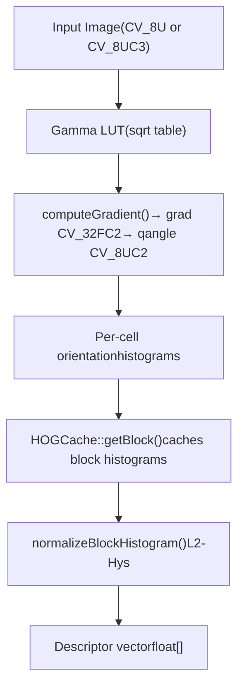
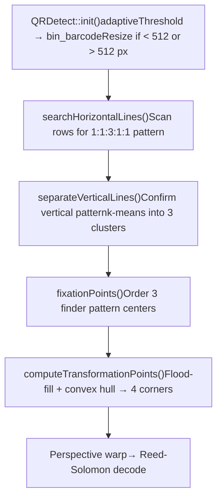
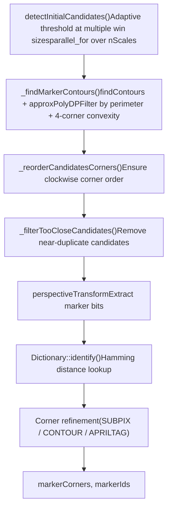

# 对象检测（objdetect）

相关源文件

-   [3rdparty/quirc/LICENSE](https://github.com/opencv/opencv/blob/91c78f50/3rdparty/quirc/LICENSE)
-   [3rdparty/quirc/include/quirc.h](https://github.com/opencv/opencv/blob/91c78f50/3rdparty/quirc/include/quirc.h)
-   [3rdparty/quirc/include/quirc\_internal.h](https://github.com/opencv/opencv/blob/91c78f50/3rdparty/quirc/include/quirc_internal.h)
-   [3rdparty/quirc/src/decode.c](https://github.com/opencv/opencv/blob/91c78f50/3rdparty/quirc/src/decode.c)
-   [3rdparty/quirc/src/quirc.c](https://github.com/opencv/opencv/blob/91c78f50/3rdparty/quirc/src/quirc.c)
-   [3rdparty/quirc/src/version\_db.c](https://github.com/opencv/opencv/blob/91c78f50/3rdparty/quirc/src/version_db.c)
-   [cmake/checks/framebuffer.cpp](https://github.com/opencv/opencv/blob/91c78f50/cmake/checks/framebuffer.cpp)
-   [modules/calib3d/test/test\_affine3d\_estimator.cpp](https://github.com/opencv/opencv/blob/91c78f50/modules/calib3d/test/test_affine3d_estimator.cpp)
-   [modules/core/include/opencv2/core/cuda/functional.hpp](https://github.com/opencv/opencv/blob/91c78f50/modules/core/include/opencv2/core/cuda/functional.hpp)
-   [modules/dnn/src/op\_timvx.cpp](https://github.com/opencv/opencv/blob/91c78f50/modules/dnn/src/op_timvx.cpp)
-   [modules/dnn/src/vkcom/src/op\_matmul.cpp](https://github.com/opencv/opencv/blob/91c78f50/modules/dnn/src/vkcom/src/op_matmul.cpp)
-   [modules/gapi/src/streaming/onevpl/utils.cpp](https://github.com/opencv/opencv/blob/91c78f50/modules/gapi/src/streaming/onevpl/utils.cpp)
-   [modules/highgui/cmake/detect\_framebuffer.cmake](https://github.com/opencv/opencv/blob/91c78f50/modules/highgui/cmake/detect_framebuffer.cmake)
-   [modules/highgui/src/window\_framebuffer.cpp](https://github.com/opencv/opencv/blob/91c78f50/modules/highgui/src/window_framebuffer.cpp)
-   [modules/highgui/src/window\_framebuffer.hpp](https://github.com/opencv/opencv/blob/91c78f50/modules/highgui/src/window_framebuffer.hpp)
-   [modules/imgproc/src/generalized\_hough.cpp](https://github.com/opencv/opencv/blob/91c78f50/modules/imgproc/src/generalized_hough.cpp)
-   [modules/objdetect/include/opencv2/objdetect.hpp](https://github.com/opencv/opencv/blob/91c78f50/modules/objdetect/include/opencv2/objdetect.hpp)
-   [modules/objdetect/include/opencv2/objdetect/aruco\_board.hpp](https://github.com/opencv/opencv/blob/91c78f50/modules/objdetect/include/opencv2/objdetect/aruco_board.hpp)
-   [modules/objdetect/include/opencv2/objdetect/aruco\_detector.hpp](https://github.com/opencv/opencv/blob/91c78f50/modules/objdetect/include/opencv2/objdetect/aruco_detector.hpp)
-   [modules/objdetect/include/opencv2/objdetect/aruco\_dictionary.hpp](https://github.com/opencv/opencv/blob/91c78f50/modules/objdetect/include/opencv2/objdetect/aruco_dictionary.hpp)
-   [modules/objdetect/include/opencv2/objdetect/charuco\_detector.hpp](https://github.com/opencv/opencv/blob/91c78f50/modules/objdetect/include/opencv2/objdetect/charuco_detector.hpp)
-   [modules/objdetect/include/opencv2/objdetect/graphical\_code\_detector.hpp](https://github.com/opencv/opencv/blob/91c78f50/modules/objdetect/include/opencv2/objdetect/graphical_code_detector.hpp)
-   [modules/objdetect/include/opencv2/objdetect/objdetect.hpp](https://github.com/opencv/opencv/blob/91c78f50/modules/objdetect/include/opencv2/objdetect/objdetect.hpp)
-   [modules/objdetect/misc/java/filelist\_common](https://github.com/opencv/opencv/blob/91c78f50/modules/objdetect/misc/java/filelist_common)
-   [modules/objdetect/misc/java/gen\_dict.json](https://github.com/opencv/opencv/blob/91c78f50/modules/objdetect/misc/java/gen_dict.json)
-   [modules/objdetect/misc/java/src/cpp/objdetect\_converters.cpp](https://github.com/opencv/opencv/blob/91c78f50/modules/objdetect/misc/java/src/cpp/objdetect_converters.cpp)
-   [modules/objdetect/misc/java/src/cpp/objdetect\_converters.hpp](https://github.com/opencv/opencv/blob/91c78f50/modules/objdetect/misc/java/src/cpp/objdetect_converters.hpp)
-   [modules/objdetect/misc/java/test/ArucoTest.java](https://github.com/opencv/opencv/blob/91c78f50/modules/objdetect/misc/java/test/ArucoTest.java)
-   [modules/objdetect/misc/java/test/QRCodeDetectorTest.java](https://github.com/opencv/opencv/blob/91c78f50/modules/objdetect/misc/java/test/QRCodeDetectorTest.java)
-   [modules/objdetect/misc/objc/gen\_dict.json](https://github.com/opencv/opencv/blob/91c78f50/modules/objdetect/misc/objc/gen_dict.json)
-   [modules/objdetect/misc/python/pyopencv\_objdetect.hpp](https://github.com/opencv/opencv/blob/91c78f50/modules/objdetect/misc/python/pyopencv_objdetect.hpp)
-   [modules/objdetect/misc/python/test/test\_objdetect\_aruco.py](https://github.com/opencv/opencv/blob/91c78f50/modules/objdetect/misc/python/test/test_objdetect_aruco.py)
-   [modules/objdetect/misc/python/test/test\_qrcode\_detect.py](https://github.com/opencv/opencv/blob/91c78f50/modules/objdetect/misc/python/test/test_qrcode_detect.py)
-   [modules/objdetect/perf/opencl/perf\_cascades.cpp](https://github.com/opencv/opencv/blob/91c78f50/modules/objdetect/perf/opencl/perf_cascades.cpp)
-   [modules/objdetect/perf/opencl/perf\_hogdetect.cpp](https://github.com/opencv/opencv/blob/91c78f50/modules/objdetect/perf/opencl/perf_hogdetect.cpp)
-   [modules/objdetect/perf/perf\_aruco.cpp](https://github.com/opencv/opencv/blob/91c78f50/modules/objdetect/perf/perf_aruco.cpp)
-   [modules/objdetect/perf/perf\_qrcode\_pipeline.cpp](https://github.com/opencv/opencv/blob/91c78f50/modules/objdetect/perf/perf_qrcode_pipeline.cpp)
-   [modules/objdetect/src/aruco/aruco\_board.cpp](https://github.com/opencv/opencv/blob/91c78f50/modules/objdetect/src/aruco/aruco_board.cpp)
-   [modules/objdetect/src/aruco/aruco\_detector.cpp](https://github.com/opencv/opencv/blob/91c78f50/modules/objdetect/src/aruco/aruco_detector.cpp)
-   [modules/objdetect/src/aruco/aruco\_dictionary.cpp](https://github.com/opencv/opencv/blob/91c78f50/modules/objdetect/src/aruco/aruco_dictionary.cpp)
-   [modules/objdetect/src/aruco/aruco\_utils.cpp](https://github.com/opencv/opencv/blob/91c78f50/modules/objdetect/src/aruco/aruco_utils.cpp)
-   [modules/objdetect/src/aruco/aruco\_utils.hpp](https://github.com/opencv/opencv/blob/91c78f50/modules/objdetect/src/aruco/aruco_utils.hpp)
-   [modules/objdetect/src/aruco/charuco\_detector.cpp](https://github.com/opencv/opencv/blob/91c78f50/modules/objdetect/src/aruco/charuco_detector.cpp)
-   [modules/objdetect/src/aruco/predefined\_dictionaries.hpp](https://github.com/opencv/opencv/blob/91c78f50/modules/objdetect/src/aruco/predefined_dictionaries.hpp)
-   [modules/objdetect/src/cascadedetect.cpp](https://github.com/opencv/opencv/blob/91c78f50/modules/objdetect/src/cascadedetect.cpp)
-   [modules/objdetect/src/cascadedetect.hpp](https://github.com/opencv/opencv/blob/91c78f50/modules/objdetect/src/cascadedetect.hpp)
-   [modules/objdetect/src/graphical\_code\_detector.cpp](https://github.com/opencv/opencv/blob/91c78f50/modules/objdetect/src/graphical_code_detector.cpp)
-   [modules/objdetect/src/graphical\_code\_detector\_impl.hpp](https://github.com/opencv/opencv/blob/91c78f50/modules/objdetect/src/graphical_code_detector_impl.hpp)
-   [modules/objdetect/src/hog.cpp](https://github.com/opencv/opencv/blob/91c78f50/modules/objdetect/src/hog.cpp)
-   [modules/objdetect/src/opencl/cascadedetect.cl](https://github.com/opencv/opencv/blob/91c78f50/modules/objdetect/src/opencl/cascadedetect.cl)
-   [modules/objdetect/src/opencl/objdetect\_hog.cl](https://github.com/opencv/opencv/blob/91c78f50/modules/objdetect/src/opencl/objdetect_hog.cl)
-   [modules/objdetect/src/qrcode.cpp](https://github.com/opencv/opencv/blob/91c78f50/modules/objdetect/src/qrcode.cpp)
-   [modules/objdetect/src/qrcode\_encoder.cpp](https://github.com/opencv/opencv/blob/91c78f50/modules/objdetect/src/qrcode_encoder.cpp)
-   [modules/objdetect/src/qrcode\_encoder\_table.inl.hpp](https://github.com/opencv/opencv/blob/91c78f50/modules/objdetect/src/qrcode_encoder_table.inl.hpp)
-   [modules/objdetect/test/opencl/test\_hogdetector.cpp](https://github.com/opencv/opencv/blob/91c78f50/modules/objdetect/test/opencl/test_hogdetector.cpp)
-   [modules/objdetect/test/test\_aruco\_tutorial.cpp](https://github.com/opencv/opencv/blob/91c78f50/modules/objdetect/test/test_aruco_tutorial.cpp)
-   [modules/objdetect/test/test\_aruco\_utils.cpp](https://github.com/opencv/opencv/blob/91c78f50/modules/objdetect/test/test_aruco_utils.cpp)
-   [modules/objdetect/test/test\_aruco\_utils.hpp](https://github.com/opencv/opencv/blob/91c78f50/modules/objdetect/test/test_aruco_utils.hpp)
-   [modules/objdetect/test/test\_arucodetection.cpp](https://github.com/opencv/opencv/blob/91c78f50/modules/objdetect/test/test_arucodetection.cpp)
-   [modules/objdetect/test/test\_boarddetection.cpp](https://github.com/opencv/opencv/blob/91c78f50/modules/objdetect/test/test_boarddetection.cpp)
-   [modules/objdetect/test/test\_cascadeandhog.cpp](https://github.com/opencv/opencv/blob/91c78f50/modules/objdetect/test/test_cascadeandhog.cpp)
-   [modules/objdetect/test/test\_charucodetection.cpp](https://github.com/opencv/opencv/blob/91c78f50/modules/objdetect/test/test_charucodetection.cpp)
-   [modules/objdetect/test/test\_qr\_utils.hpp](https://github.com/opencv/opencv/blob/91c78f50/modules/objdetect/test/test_qr_utils.hpp)
-   [modules/objdetect/test/test\_qrcode.cpp](https://github.com/opencv/opencv/blob/91c78f50/modules/objdetect/test/test_qrcode.cpp)
-   [modules/objdetect/test/test\_qrcode\_encode.cpp](https://github.com/opencv/opencv/blob/91c78f50/modules/objdetect/test/test_qrcode_encode.cpp)
-   [modules/ts/include/opencv2/ts/cuda\_test.hpp](https://github.com/opencv/opencv/blob/91c78f50/modules/ts/include/opencv2/ts/cuda_test.hpp)
-   [modules/ts/src/cuda\_test.cpp](https://github.com/opencv/opencv/blob/91c78f50/modules/ts/src/cuda_test.cpp)
-   [samples/cpp/qrcode.cpp](https://github.com/opencv/opencv/blob/91c78f50/samples/cpp/qrcode.cpp)

`opencv_objdetect` 模块提供了用于在图像中检测对象、图形码和标志标记（fiducial marker）的算法。本页介绍该模块四个主要子系统的高层架构与代码组织：级联分类器、基于 HOG 的检测、QR 码检测/编码，以及 ArUco 标记检测。

如需了解各子系统的更深入内容，请参阅：

-   [级联分类器与 Haar 特征](/opencv/opencv/9.1-cascade-classifiers-and-haar-features)
-   [HOG 描述符与 SVM 检测](/opencv/opencv/9.2-hog-descriptor-and-svm-detection)
-   [QR 码与 ArUco 标记检测](/opencv/opencv/9.3-qr-code-and-aruco-marker-detection)

如需了解 GPU 加速的级联检测，请参阅 [GPU-Accelerated Image Processing and Optical Flow](/opencv/opencv/14.2-gpu-accelerated-image-processing-and-optical-flow)。

---

## 模块结构

该模块在 [modules/objdetect/include/opencv2/objdetect.hpp](https://github.com/opencv/opencv/blob/91c78f50/modules/objdetect/include/opencv2/objdetect.hpp) 中声明，并在统一命名空间下暴露四类相互独立的检测体系。

**模块布局概览：**

```
modules/objdetect/
├── include/opencv2/
│   ├── objdetect.hpp              # root public header
│   └── objdetect/
│       ├── aruco_detector.hpp
│       ├── aruco_board.hpp
│       ├── aruco_dictionary.hpp
│       ├── charuco_detector.hpp
│       └── graphical_code_detector.hpp
└── src/
    ├── cascadedetect.hpp          # internal cascade structures
    ├── cascadedetect.cpp
    ├── hog.cpp
    ├── qrcode.cpp
    ├── qrcode_encoder.cpp
    ├── aruco/
    │   ├── aruco_detector.cpp
    │   ├── aruco_board.cpp
    │   └── charuco_detector.cpp
    └── opencl/
        ├── cascadedetect.cl
        └── objdetect_hog.cl
```
来源： [modules/objdetect/include/opencv2/objdetect.hpp](https://github.com/opencv/opencv/blob/91c78f50/modules/objdetect/include/opencv2/objdetect.hpp) [modules/objdetect/src/cascadedetect.cpp](https://github.com/opencv/opencv/blob/91c78f50/modules/objdetect/src/cascadedetect.cpp) [modules/objdetect/src/hog.cpp](https://github.com/opencv/opencv/blob/91c78f50/modules/objdetect/src/hog.cpp) [modules/objdetect/src/qrcode.cpp](https://github.com/opencv/opencv/blob/91c78f50/modules/objdetect/src/qrcode.cpp) [modules/objdetect/src/aruco/aruco\_detector.cpp](https://github.com/opencv/opencv/blob/91c78f50/modules/objdetect/src/aruco/aruco_detector.cpp)

---

## 公共 API 类

下表列出了公共 API 中暴露的所有主要类。

| 类 | 头文件 | 作用 |
| --- | --- | --- |
| `CascadeClassifier` | `objdetect.hpp` | Boosted 级联检测器；封装 `BaseCascadeClassifier` |
| `BaseCascadeClassifier` | `objdetect.hpp` | 级联实现的抽象基类 |
| `HOGDescriptor` | `objdetect.hpp` | HOG 特征提取与线性 SVM 检测 |
| `QRCodeDetector` | `graphical_code_detector.hpp` | QR 码定位与 Reed-Solomon 解码 |
| `QRCodeDetectorAruco` | `objdetect.hpp` | 基于 ArUco 的替代 QR 码检测器 |
| `QRCodeEncoder` | `objdetect.hpp` | QR 码生成 |
| `aruco::ArucoDetector` | `aruco_detector.hpp` | 方形标志标记检测 |
| `aruco::CharucoDetector` | `charuco_detector.hpp` | ChArUco 棋盘 + ArUco 板检测 |
| `aruco::Dictionary` | `aruco_dictionary.hpp` | 用于标记识别的二进制码集 |
| `aruco::Board` | `aruco_board.hpp` | 多标记板布局的基类 |
| `aruco::CharucoBoard` | `aruco_board.hpp` | 内嵌 ArUco 标记的棋盘 |
| `aruco::GridBoard` | `aruco_board.hpp` | ArUco 标记的矩形网格 |
| `aruco::DetectorParameters` | `aruco_detector.hpp` | `ArucoDetector` 的调参参数 |
| `SimilarRects` | `objdetect.hpp` | `partition()` 中用于矩形聚类的谓词 |

各检测器共享的工具函数：

| 函数 | 用途 |
| --- | --- |
| `groupRectangles()` | 合并重叠检测窗口；在 `partition()` 中使用 `SimilarRects` |
| `groupRectangles_meanshift()` | 基于 mean-shift 的窗口合并（HOG 专用） |

来源： [modules/objdetect/include/opencv2/objdetect.hpp145-365](https://github.com/opencv/opencv/blob/91c78f50/modules/objdetect/include/opencv2/objdetect.hpp#L145-L365) [modules/objdetect/include/opencv2/objdetect/aruco\_detector.hpp25-250](https://github.com/opencv/opencv/blob/91c78f50/modules/objdetect/include/opencv2/objdetect/aruco_detector.hpp#L25-L250)

---

## 子系统依赖关系图

**跨子系统的类层级与关键关系：**

来源： [modules/objdetect/src/cascadedetect.hpp77-228](https://github.com/opencv/opencv/blob/91c78f50/modules/objdetect/src/cascadedetect.hpp#L77-L228) [modules/objdetect/src/hog.cpp589-640](https://github.com/opencv/opencv/blob/91c78f50/modules/objdetect/src/hog.cpp#L589-L640) [modules/objdetect/src/qrcode.cpp101-122](https://github.com/opencv/opencv/blob/91c78f50/modules/objdetect/src/qrcode.cpp#L101-L122) [modules/objdetect/src/aruco/aruco\_detector.cpp220-310](https://github.com/opencv/opencv/blob/91c78f50/modules/objdetect/src/aruco/aruco_detector.cpp#L220-L310) [modules/objdetect/src/aruco/charuco\_detector.cpp17-25](https://github.com/opencv/opencv/blob/91c78f50/modules/objdetect/src/aruco/charuco_detector.cpp#L17-L25)

---

## 级联分类器

### 架构

`CascadeClassifier` 是 `BaseCascadeClassifier` 的轻量公共封装，而 `BaseCascadeClassifier` 由 `CascadeClassifierImpl` 实现（定义于内部头文件 [modules/objdetect/src/cascadedetect.hpp](https://github.com/opencv/opencv/blob/91c78f50/modules/objdetect/src/cascadedetect.hpp)）。

`CascadeClassifierImpl` 包含：

-   一个 `Data` 结构体，保存解析后的级联模型：`stages`、`classifiers`、`nodes`、`leaves` 和 `stumps`。
-   一个 `Ptr<FeatureEvaluator>`——`HaarEvaluator` 或 `LBPEvaluator`，在加载时根据模型文件选择。
-   一个 `Ptr<CvHaarClassifierCascade> oldCascade`，用于兼容旧版 `.xml` 模型。

### 检测流程

**`CascadeClassifierImpl::detectMultiScale` 执行路径：**

> **[Mermaid 时序图]**
> *(图表结构无法解析)*

来源： [modules/objdetect/src/cascadedetect.cpp63-393](https://github.com/opencv/opencv/blob/91c78f50/modules/objdetect/src/cascadedetect.cpp#L63-L393) [modules/objdetect/src/cascadedetect.hpp84-136](https://github.com/opencv/opencv/blob/91c78f50/modules/objdetect/src/cascadedetect.hpp#L84-L136)

### 特征评估器

`HaarEvaluator` 与 `LBPEvaluator` 均继承自 `FeatureEvaluator`：

| 方法 | 作用 |
| --- | --- |
| `setImage()` | 为所有尺度预计算积分图 |
| `setWindow()` | 将评估上下文移动到指定 `(x, y, scale)` 窗口 |
| `calcOrd()` | 返回连续（有序）特征值——Haar |
| `calcCat()` | 返回离散（类别）特征值——LBP |
| `getUMats()` / `getMats()` | 在 CPU（`sbuf`）与 OpenCL（`usbuf`）之间同步数据 |
| `computeChannels()` | 为单个尺度填充积分图缓冲区 |
| `computeOptFeatures()` | 预计算内存偏移，以加速检测阶段访问 |

`FeatureEvaluator::create(int type)` 是工厂函数：当 `type == FeatureEvaluator::HAAR` 时创建 `HaarEvaluator`，当 `type == FeatureEvaluator::LBP` 时创建 `LBPEvaluator`。

来源： [modules/objdetect/src/cascadedetect.cpp396-914](https://github.com/opencv/opencv/blob/91c78f50/modules/objdetect/src/cascadedetect.cpp#L396-L914) [modules/objdetect/src/cascadedetect.hpp11-74](https://github.com/opencv/opencv/blob/91c78f50/modules/objdetect/src/cascadedetect.hpp#L11-L74)

### OpenCL 加速

当 OpenCL 可用且设备为 AMD、Intel 或 NVIDIA 时，`HaarEvaluator::read()` 会设置非零的 `localSize` 与 `lbufSize`。这会激活 `ocl_detectMultiScaleNoGrouping()` 中的 OpenCL 路径，该路径会调度 [modules/objdetect/src/opencl/cascadedetect.cl](https://github.com/opencv/opencv/blob/91c78f50/modules/objdetect/src/opencl/cascadedetect.cl) 中的 `runHaarClassifier` 或 `runLBPClassifier` 内核。

分类器数据（`ustages`、`unodes`、`uleaves`、`usubsets`）与特征偏移（`ufbuf`）会一次性上传到 GPU，并在所有检测调用中复用。

来源： [modules/objdetect/src/cascadedetect.cpp1102-1200](https://github.com/opencv/opencv/blob/91c78f50/modules/objdetect/src/cascadedetect.cpp#L1102-L1200) [modules/objdetect/src/opencl/cascadedetect.cl1-100](https://github.com/opencv/opencv/blob/91c78f50/modules/objdetect/src/opencl/cascadedetect.cl#L1-L100)

---

## HOG 描述符

### 架构

`HOGDescriptor` 保存定义描述符几何形状的全部参数，并在 `svmDetector` 中保存 SVM 权重向量。

**关键参数及其默认值（64×128 行人检测器）：**

| 参数 | 默认值 | 含义 |
| --- | --- | --- |
| `winSize` | 64×128 | 像素级检测窗口 |
| `blockSize` | 16×16 | HOG block 大小 |
| `blockStride` | 8×8 | block 之间步幅 |
| `cellSize` | 8×8 | block 内 cell 大小 |
| `nbins` | 9 | 方向直方图 bin 数 |
| `signedGradient` | false | 无符号（0–180°）或有符号（0–360°） |
| `gammaCorrection` | true | 像素平方根归一化 |
| `L2HysThreshold` | 0.2 | L2-Hys 归一化裁剪阈值 |

### 描述符计算


来源： [modules/objdetect/src/hog.cpp237-587](https://github.com/opencv/opencv/blob/91c78f50/modules/objdetect/src/hog.cpp#L237-L587) [modules/objdetect/src/hog.cpp589-640](https://github.com/opencv/opencv/blob/91c78f50/modules/objdetect/src/hog.cpp#L589-L640)

### 检测

`setSVMDetector(InputArray)` 用于加载线性 SVM 权重。预训练的 64×128 行人检测器由 `HOGDescriptor::getDefaultPeopleDetector()` 返回。

`detectMultiScale()` 在多尺度图像上滑动窗口。收集候选框后，它会按需调用 `groupRectangles_meanshift()`（当 `useMeanshiftGrouping=true`）或 `groupRectangles()`。

`HOGCache` 是内部辅助类（[modules/objdetect/src/hog.cpp589-640](https://github.com/opencv/opencv/blob/91c78f50/modules/objdetect/src/hog.cpp#L589-L640)），用于缓存已计算的 block 直方图，并在扫描窗口下移时按行失效。

[modules/objdetect/src/opencl/objdetect\_hog.cl](https://github.com/opencv/opencv/blob/91c78f50/modules/objdetect/src/opencl/objdetect_hog.cl) 中的 OpenCL 内核可在 GPU 上加速梯度计算与直方图累加。

来源： [modules/objdetect/src/hog.cpp87-145](https://github.com/opencv/opencv/blob/91c78f50/modules/objdetect/src/hog.cpp#L87-L145) [modules/objdetect/src/hog.cpp117-144](https://github.com/opencv/opencv/blob/91c78f50/modules/objdetect/src/hog.cpp#L117-L144)

---

## QR 码检测与编码

### QRCodeDetector

`QRCodeDetector` 继承自 `GraphicalCodeDetector`。主要公共方法如下：

| 方法 | 输出 |
| --- | --- |
| `detect(img, corners)` | QR 码的 4 个角点 |
| `decode(img, corners, straightCode)` | 解码字符串 + 矫正后图像 |
| `detectAndDecode(img, corners, straightCode)` | 一次调用完成两者 |
| `detectMulti(img, corners)` | 所有 QR 码的角点 |
| `decodeMulti(img, corners, info, codes)` | 所有 QR 码的解码字符串 |
| `detectAndDecodeCurved(img, corners, code)` | 处理桶形畸变二维码 |

在内部，`QRDetect`（定义于 [modules/objdetect/src/qrcode.cpp101-122](https://github.com/opencv/opencv/blob/91c78f50/modules/objdetect/src/qrcode.cpp#L101-L122)）按以下阶段执行检测：


来源： [modules/objdetect/src/qrcode.cpp101-698](https://github.com/opencv/opencv/blob/91c78f50/modules/objdetect/src/qrcode.cpp#L101-L698)

### QRCodeEncoder

`QRCodeEncoder` 将字符串编码为 QR 码图像。支持的编码模式对应 `QRCodeEncoder::EncodeMode`：

| 模式 | 常量 | 字符集 |
| --- | --- | --- |
| Numeric | `MODE_NUMERIC` | 0–9 |
| Alphanumeric | `MODE_ALPHANUMERIC` | 0–9、A–Z、空格、`$%*+-./:` |
| Byte | `MODE_BYTE` | ISO 8859-1 |
| ECI | `MODE_ECI` | 扩展字符集 |
| Kanji | `MODE_KANJI` | Shift-JIS |
| Structured append | `MODE_STRUCTURED_APPEND` | 多段 QR 码 |

纠错使用 GF(256) 上的伽罗瓦域运算，其生成多项式由 [modules/objdetect/src/qrcode\_encoder.cpp111-120](https://github.com/opencv/opencv/blob/91c78f50/modules/objdetect/src/qrcode_encoder.cpp#L111-L120) 中的 `polyGenerator()` 计算。

来源： [modules/objdetect/src/qrcode\_encoder.cpp1-132](https://github.com/opencv/opencv/blob/91c78f50/modules/objdetect/src/qrcode_encoder.cpp#L1-L132)

---

## ArUco 标记检测

### 核心概念

ArUco 标记是属于某个 `Dictionary` 的方形二进制图案。每个 `Dictionary` 包含：

-   `bytesList`：压缩位图模式（类型为 `CV_8UC4` 的 `Mat`）
-   `markerSize`：每条边的 bit 数
-   `maxCorrectionBits`：纠错能力

可通过 `aruco::getPredefinedDictionary(aruco::DICT_6X6_250)` 等方式获取预定义字典。

### ArucoDetector 流水线

**`ArucoDetector::detectMarkers()` 的检测阶段：**


来源： [modules/objdetect/src/aruco/aruco\_detector.cpp119-310](https://github.com/opencv/opencv/blob/91c78f50/modules/objdetect/src/aruco/aruco_detector.cpp#L119-L310)

### DetectorParameters

`DetectorParameters` 控制流水线的全部阶段。关键参数如下：

| 参数 | 默认值 | 阶段 |
| --- | --- | --- |
| `adaptiveThreshWinSizeMin/Max` | 3 / 23 | 阈值化 |
| `adaptiveThreshWinSizeStep` | 10 | 阈值化 |
| `minMarkerPerimeterRate` | 0.03 | 轮廓过滤 |
| `maxMarkerPerimeterRate` | 4.0 | 轮廓过滤 |
| `polygonalApproxAccuracyRate` | 0.03 | 四边形测试 |
| `cornerRefinementMethod` | `CORNER_REFINE_NONE` | 角点精化 |
| `errorCorrectionRate` | 0.6 | 字典识别 |
| `useAruco3Detection` | false | Aruco3 小标记模式 |

`DetectorParameters::readDetectorParameters(FileNode)` / `writeDetectorParameters(FileStorage)` 负责序列化。

来源： [modules/objdetect/include/opencv2/objdetect/aruco\_detector.hpp25-250](https://github.com/opencv/opencv/blob/91c78f50/modules/objdetect/include/opencv2/objdetect/aruco_detector.hpp#L25-L250) [modules/objdetect/src/aruco/aruco\_detector.cpp21-80](https://github.com/opencv/opencv/blob/91c78f50/modules/objdetect/src/aruco/aruco_detector.cpp#L21-L80)

### 角点精化方法

| 枚举 | 方法 |
| --- | --- |
| `CORNER_REFINE_NONE` | 轮廓近似得到的原始多边形角点 |
| `CORNER_REFINE_SUBPIX` | 在灰度图上使用 OpenCV `cornerSubPix` |
| `CORNER_REFINE_CONTOUR` | 对轮廓点进行直线拟合 |
| `CORNER_REFINE_APRILTAG` | AprilTag 2 四边形检测算法 |

来源： [modules/objdetect/include/opencv2/objdetect/aruco\_detector.hpp16-21](https://github.com/opencv/opencv/blob/91c78f50/modules/objdetect/include/opencv2/objdetect/aruco_detector.hpp#L16-L21)

### CharucoDetector

`CharucoDetector` 将内嵌 `ArucoDetector` 与棋盘角点检测结合，以获得亚像素级精度角点。其实现位于 [modules/objdetect/src/aruco/charuco\_detector.cpp](https://github.com/opencv/opencv/blob/91c78f50/modules/objdetect/src/aruco/charuco_detector.cpp)。

流水线：

1.  运行 `ArucoDetector::detectMarkers()` 查找板上的 ArUco 标记。
2.  基于已知板几何投影预期 ChArUco 角点位置。
3.  使用 `getMaximumSubPixWindowSizes()` 根据标记间距计算自适应窗口大小，并通过 `cornerSubPix` 精化位置。
4.  使用 `checkBoard()` 校验并剔除伪板。

`CharucoParameters` 存储可选相机矩阵与畸变系数，用于插值期间的去畸变。

来源： [modules/objdetect/src/aruco/charuco\_detector.cpp17-200](https://github.com/opencv/opencv/blob/91c78f50/modules/objdetect/src/aruco/charuco_detector.cpp#L17-L200) [modules/objdetect/include/opencv2/objdetect/charuco\_detector.hpp](https://github.com/opencv/opencv/blob/91c78f50/modules/objdetect/include/opencv2/objdetect/charuco_detector.hpp)

---

## 矩形分组

`CascadeClassifier` 与 `HOGDescriptor` 在最终分组前都会产生大量重叠候选矩形。当前实现了两种分组策略：

**`groupRectangles()`** —— 在 `cv::partition()` 中使用 `SimilarRects(eps)`，按位置和尺寸对矩形聚类，然后对每一簇求平均，并丢弃小于 `groupThreshold` 的簇。

**`groupRectangles_meanshift()`** —— 仅在 `HOGDescriptor` 且 `useMeanshiftGrouping=true` 时使用。它将每个检测编码为三维点 `(cx, cy, log(scale))`，并运行 `MeanshiftGrouping` 寻找密度峰值。

来源： [modules/objdetect/src/cascadedetect.cpp63-393](https://github.com/opencv/opencv/blob/91c78f50/modules/objdetect/src/cascadedetect.cpp#L63-L393) [modules/objdetect/include/opencv2/objdetect.hpp165-194](https://github.com/opencv/opencv/blob/91c78f50/modules/objdetect/include/opencv2/objdetect.hpp#L165-L194)

---

## 与其他模块的关系

| 依赖 | 使用方 | 用途 |
| --- | --- | --- |
| `opencv_core` | 全部子系统 | `Mat`、`UMat`、`parallel_for_`、`FileStorage` |
| `opencv_imgproc` | 全部子系统 | `resize`、`integral`、`adaptiveThreshold`、`findContours` |
| `opencv_calib3d` | QR、ArUco | `solvePnP`、`projectPoints`、透视变换 |
| `opencv_dnn` | DNN 人脸检测器（独立子组） | `FaceDetectorYN`、`FaceRecognizerSF` |
| `opencv_features2d` | （无，彼此独立） | — |

该模块在其 `CMakeLists.txt` 中声明了对 `opencv_imgproc` 与 `opencv_calib3d` 的依赖。ArUco 子模块会显式 `#include` `<opencv2/calib3d.hpp>` 以使用位姿估计工具。

来源： [modules/objdetect/src/aruco/aruco\_detector.cpp1-15](https://github.com/opencv/opencv/blob/91c78f50/modules/objdetect/src/aruco/aruco_detector.cpp#L1-L15) [modules/objdetect/src/qrcode.cpp8-16](https://github.com/opencv/opencv/blob/91c78f50/modules/objdetect/src/qrcode.cpp#L8-L16)
