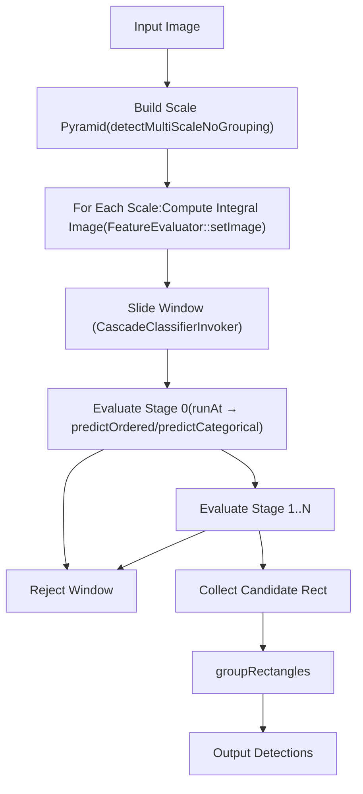
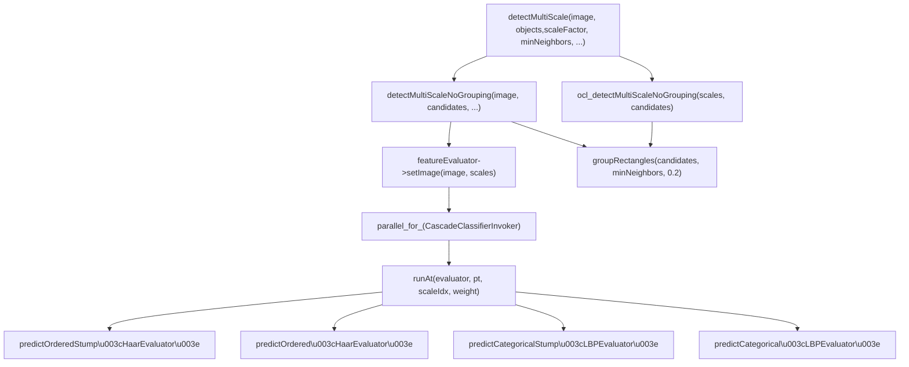
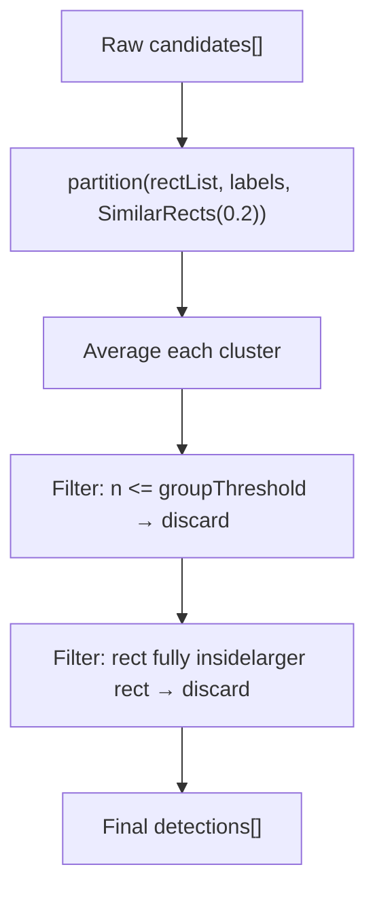
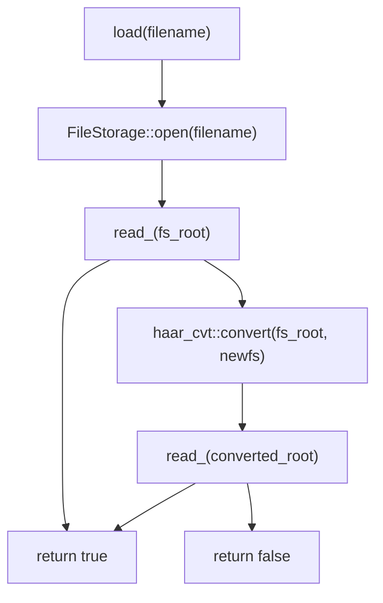
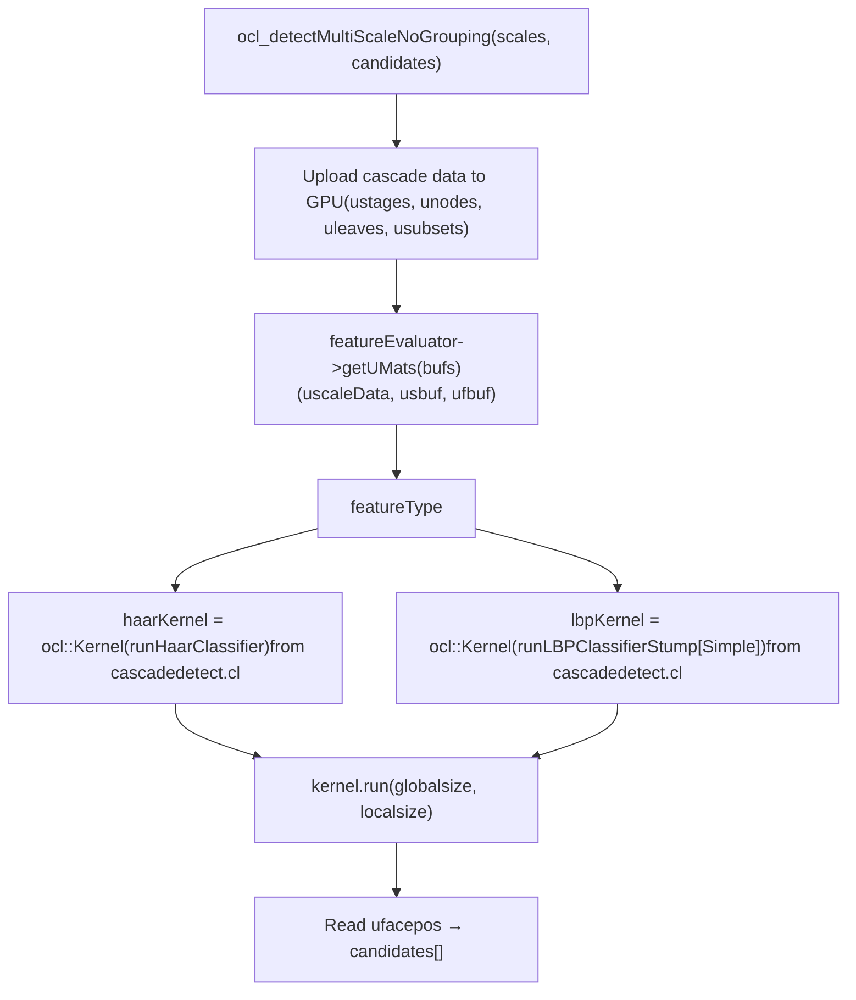

# 级联分类器和 Haar 特征

相关源文件

-   [modules/calib3d/test/test\_affine3d\_estimator.cpp](https://github.com/opencv/opencv/blob/91c78f50/modules/calib3d/test/test_affine3d_estimator.cpp)
-   [modules/core/include/opencv2/core/cuda/functional.hpp](https://github.com/opencv/opencv/blob/91c78f50/modules/core/include/opencv2/core/cuda/functional.hpp)
-   [modules/imgproc/src/generalized\_hough.cpp](https://github.com/opencv/opencv/blob/91c78f50/modules/imgproc/src/generalized_hough.cpp)
-   [modules/objdetect/include/opencv2/objdetect/objdetect.hpp](https://github.com/opencv/opencv/blob/91c78f50/modules/objdetect/include/opencv2/objdetect/objdetect.hpp)
-   [modules/objdetect/perf/opencl/perf\_cascades.cpp](https://github.com/opencv/opencv/blob/91c78f50/modules/objdetect/perf/opencl/perf_cascades.cpp)
-   [modules/objdetect/perf/opencl/perf\_hogdetect.cpp](https://github.com/opencv/opencv/blob/91c78f50/modules/objdetect/perf/opencl/perf_hogdetect.cpp)
-   [modules/objdetect/src/cascadedetect.cpp](https://github.com/opencv/opencv/blob/91c78f50/modules/objdetect/src/cascadedetect.cpp)
-   [modules/objdetect/src/cascadedetect.hpp](https://github.com/opencv/opencv/blob/91c78f50/modules/objdetect/src/cascadedetect.hpp)
-   [modules/objdetect/src/hog.cpp](https://github.com/opencv/opencv/blob/91c78f50/modules/objdetect/src/hog.cpp)
-   [modules/objdetect/src/opencl/cascadedetect.cl](https://github.com/opencv/opencv/blob/91c78f50/modules/objdetect/src/opencl/cascadedetect.cl)
-   [modules/objdetect/src/opencl/objdetect\_hog.cl](https://github.com/opencv/opencv/blob/91c78f50/modules/objdetect/src/opencl/objdetect_hog.cl)
-   [modules/objdetect/test/opencl/test\_hogdetector.cpp](https://github.com/opencv/opencv/blob/91c78f50/modules/objdetect/test/opencl/test_hogdetector.cpp)
-   [modules/objdetect/test/test\_cascadeandhog.cpp](https://github.com/opencv/opencv/blob/91c78f50/modules/objdetect/test/test_cascadeandhog.cpp)
-   [modules/ts/include/opencv2/ts/cuda\_test.hpp](https://github.com/opencv/opencv/blob/91c78f50/modules/ts/include/opencv2/ts/cuda_test.hpp)
-   [modules/ts/src/cuda\_test.cpp](https://github.com/opencv/opencv/blob/91c78f50/modules/ts/src/cuda_test.cpp)

## 目的和范围

本页记录了 OpenCV `objdetect`模块中的级联分类器系统，涵盖`CascadeClassifier`公共 API、内部`CascadeClassifierImpl`、`HaarEvaluator`和`LBPEvaluator`特征计算类、多尺度检测循环、矩形分组和 OpenCL 加速检测路径。

对于也存在于`objdetect`中的基于HOG的探测器，请参阅[HOG Descriptor and SVM Detection](/opencv/opencv/9.2-hog-descriptor-and-svm-detection)。对于QR码和ArUco检测，请参见[QR Code and ArUco Marker Detection](/opencv/opencv/9.3-qr-code-and-aruco-marker-detection)。

---

## 算法概述

级联分类器是一系列增强的分类阶段。每个阶段都是一个由决策树（弱分类器）集合组成的强分类器。仅当输入窗口通过每个阶段时，才将其分类为正。早期阶段成本低且速度快，拒绝大多数负面窗口；后期阶段更具歧视性。

在检测时，以多个尺度扫描输入图像。对于每个尺度，计算积分图像。滑动窗口通过级联进行评估：如果任何阶段的加权树总和低于该阶段的阈值，则立即拒绝该窗口，而不评估其他阶段。只有在所有阶段都幸存下来的窗口才会被报告为检测。


来源：[modules/objdetect/src/cascadedetect.cpp916-1099](https://github.com/opencv/opencv/blob/91c78f50/modules/objdetect/src/cascadedetect.cpp#L916-L1099)[modules/objdetect/src/cascadedetect.hpp77-228](https://github.com/opencv/opencv/blob/91c78f50/modules/objdetect/src/cascadedetect.hpp#L77-L228)

---

## 类层次结构

公共 `CascadeClassifier` 类是 `BaseCascadeClassifier` 的薄包装。具体实现是`CascadeClassifierImpl`。


来源：[modules/objdetect/src/cascadedetect.hpp11-74](https://github.com/opencv/opencv/blob/91c78f50/modules/objdetect/src/cascadedetect.hpp#L11-L74)[modules/objdetect/src/cascadedetect.hpp77-228](https://github.com/opencv/opencv/blob/91c78f50/modules/objdetect/src/cascadedetect.hpp#L77-L228)

---

## 级联数据模型

`CascadeClassifierImpl::Data` 将完全反序列化的级联保存在一组平面数组中。这避免了检测期间的指针追踪。


当所有树都是单节点树桩（`maxNodesPerTree == 1`）时，数据被打包到优化的`stumps`向量中。否则，将使用通用的 `nodes`/`leaves` 布局。这在`runAt()`中进行检查以分派到适当的预测器模板。

来源：[modules/objdetect/src/cascadedetect.hpp162-213](https://github.com/opencv/opencv/blob/91c78f50/modules/objdetect/src/cascadedetect.hpp#L162-L213)

---

## 特征类型

### Haar 特征 (`HaarEvaluator`)

Haar 特征是在积分图像上评估的最多三个轴对齐（或 45° 倾斜）矩形的加权和。


`OptFeature::calc()` 方法使用预先计算的积分图像偏移量 (`ofs[rect][corner]`) 计算特征值：

```
value = weight[0] * CALC_SUM_OFS(ofs[0], ptr)
      + weight[1] * CALC_SUM_OFS(ofs[1], ptr)
      + weight[2] * CALC_SUM_OFS(ofs[2], ptr)   // only if weight[2] != 0
```
然后除以`varianceNormFactor`（从平方和积分图像导出），通过局部对比度对每个窗口进行归一化。

**倾斜功能**使用单独的倾斜积分图像通道。加载时检测是否存在倾斜特征； `hasTiltedFeatures`控制缓冲区分配（如果倾斜则为`nchannels = 3`，否则为`2`）。

来源：[modules/objdetect/src/cascadedetect.hpp314-402](https://github.com/opencv/opencv/blob/91c78f50/modules/objdetect/src/cascadedetect.hpp#L314-L402)[modules/objdetect/src/cascadedetect.cpp543-714](https://github.com/opencv/opencv/blob/91c78f50/modules/objdetect/src/cascadedetect.cpp#L543-L714)

### LBP 特点 (`LBPEvaluator`)

LBP 特征描述了一个内部划分为 3×3 子单元网格的单个矩形。中心单元的积分和与周围 8 个单元中的每一个进行比较，以产生 8 位二进制代码。


`OptFeature::calc()` 使用 16 个积分图像偏移（平铺 3×3 网格所需的 4 个象限单元各有 4 个角）。输出是`[0, 255]`中的整数。

LBP 节点使用 **分类** 预测：每个 `DTreeNode` 在 `data.subsets` 中存储一个子集位掩码。特征代码用于索引该位掩码以确定要跟随哪个子项。

来源：[modules/objdetect/src/cascadedetect.hpp406-478](https://github.com/opencv/opencv/blob/91c78f50/modules/objdetect/src/cascadedetect.hpp#L406-L478)[modules/objdetect/src/cascadedetect.cpp776-906](https://github.com/opencv/opencv/blob/91c78f50/modules/objdetect/src/cascadedetect.cpp#L776-L906)

---

## 整体图像缓冲区布局

所有尺度共享一个预分配的缓冲区（CPU 上的`sbuf`，GPU 上的`usbuf`）。秤被包装在行条中。

- 每个`ScaleData::layer_ofs`都是缓冲区的平面偏移。
- `sqofs` 是平方和通道的偏移量 (= `sbufSize.area()`)。
- `tofs` 是倾斜通道的偏移量（= `sbufSize.area() * 2` 如果存在）。
- LBP 仅使用一个通道 (`nchannels = 1`)。

`FeatureEvaluator::updateScaleData()` 计算布局。 `HaarEvaluator::computeChannels()`调用`integral()`来填充每个尺度的缓冲区。

来源：[modules/objdetect/src/cascadedetect.cpp438-539](https://github.com/opencv/opencv/blob/91c78f50/modules/objdetect/src/cascadedetect.cpp#L438-L539)[modules/objdetect/src/cascadedetect.cpp648-690](https://github.com/opencv/opencv/blob/91c78f50/modules/objdetect/src/cascadedetect.cpp#L648-L690)

---

## 检测多尺度算法


`detectMultiScale`的关键参数：

|范围|默认|影响|
| --- | --- | --- |
|`scaleFactor`| 1.1 |连续尺度级别之间的比率|
|`minNeighbors`| 3 |保持检测的最小重叠矩形|
|`minSize`|`Size()`|最小搜索窗口|
|`maxSize`|`Size()`|最大的搜索窗口|
|`flags`| 0 |`CASCADE_SCALE_IMAGE`、`CASCADE_FIND_BIGGEST_OBJECT`等|

给定尺度的步长`ystep`如果`scale >= 2`则为`1`，否则为`2`——将小尺度下评估的位置数量减半。

来源：[modules/objdetect/src/cascadedetect.cpp968-1099](https://github.com/opencv/opencv/blob/91c78f50/modules/objdetect/src/cascadedetect.cpp#L968-L1099)[modules/objdetect/src/cascadedetect.hpp87-135](https://github.com/opencv/opencv/blob/91c78f50/modules/objdetect/src/cascadedetect.hpp#L87-L135)

---

## 预测函数

`cascadedetect.hpp` 中定义了四个预测器模板：

|模板|特征类型|树深|使用时间|
| --- | --- | --- | --- |
|`predictOrderedStump<HaarEvaluator>`|哈尔|1个节点|`maxNodesPerTree == 1`|
|`predictOrdered<HaarEvaluator>`|哈尔|≥1个节点|`maxNodesPerTree > 1`|
|`predictCategoricalStump<LBPEvaluator>`|腰痛|1个节点|`maxNodesPerTree == 1`|
|`predictCategorical<LBPEvaluator>`|腰痛|≥1个节点|`maxNodesPerTree > 1`|

每个预测器都会迭代多个阶段。在一个阶段内，它将所有树的叶子值相加。如果总和低于`stage.threshold`，则拒绝窗口并返回负阶段索引。如果所有阶段都通过，则返回`1`。

对于**有序**（连续值）特征，直接比较节点阈值：

```
idx = (feature_value < node.threshold) ? node.left : node.right
```
对于**分类**特征，特征代码用于查找子集位掩码：

```
idx = (subset[code >> 5] & (1 << (code & 31))) ? node.left : node.right
```
来源：[modules/objdetect/src/cascadedetect.hpp483-649](https://github.com/opencv/opencv/blob/91c78f50/modules/objdetect/src/cascadedetect.hpp#L483-L649)

---

## 矩形组

收集后，原始候选矩形通过`groupRectangles()`进行聚类和过滤。

**算法：**

1. 使用 `partition()` 和 `SimilarRects(eps)` 作为等价谓词对所有矩形进行聚类。如果两个矩形的重叠超过较小矩形尺寸的`(1 - eps)`，则两个矩形相似。
2. 对每个簇进行平均以产生单个代表性矩形。
3. 成员数少于`groupThreshold`的簇将被丢弃。
4. 完全包含在较大矩形内的较小矩形也将被丢弃。


`groupRectangles` 共有三种公共重载：

- `groupRectangles(rectList, groupThreshold, eps)` — 基本形式
- `groupRectangles(rectList, weights, groupThreshold, eps)` — 返回每次检测的邻居计数
- `groupRectangles(rectList, rejectLevels, levelWeights, groupThreshold, eps)` — 用于 ROC 曲线计算

还定义了单独的`groupRectangles_meanshift()`，但仅由 HOG 检测器使用。

来源：[modules/objdetect/src/cascadedetect.cpp63-393](https://github.com/opencv/opencv/blob/91c78f50/modules/objdetect/src/cascadedetect.cpp#L63-L393)

---

## 加载级联

`CascadeClassifierImpl::load()` 处理当前的 XML/YAML 格式和旧的二进制格式：


`read_()`解析：

- `cascadeParams`部分：`featureType`、`stageType`、窗口`width`/`height`
- `features`部分：代表`FeatureEvaluator::read()`→`HaarEvaluator::read()`或`LBPEvaluator::read()`
- `stages`部分：填充`data.stages`、`data.classifiers`、`data.nodes`、`data.leaves`、`data.subsets`
- 将单节点树压缩为`data.stumps`

`FeatureEvaluator::create()` 是评估器实例的工厂：

- `HAAR (0)` → `new HaarEvaluator`
- `LBP (1)` → `new LBPEvaluator`

来源：[modules/objdetect/src/cascadedetect.cpp934-966](https://github.com/opencv/opencv/blob/91c78f50/modules/objdetect/src/cascadedetect.cpp#L934-L966)[modules/objdetect/src/cascadedetect.cpp909-914](https://github.com/opencv/opencv/blob/91c78f50/modules/objdetect/src/cascadedetect.cpp#L909-L914)

---

## OpenCL 加速路径

当 OpenCL 可用并且评估器的 `localSize` 非空时，`detectMultiScale` 调用 `ocl_detectMultiScaleNoGrouping()` 而不是 CPU 路径。


Haar OpenCL 内核`runHaarClassifier` 使用 **分割阶段** 策略：

- 第一个`SPLIT_STAGE`阶段按工作项独立评估。
- 剩余阶段在整个工作组中进行协作评估：在第一次分裂中幸存下来的候选者通过本地内存（`lbuf`）共享，并且工作项集体评估剩余阶段。

大小为 PH1 的本地和缓冲区 (PH0) 在本地内存中缓存积分图像的图块。此缓冲区在 AMD、Intel 和 NVIDIA 设备上处于活动状态，其中 `localSize = Size(8, 8)` 和 `lbufSize = Size(origWinSize.width + 8, origWinSize.height + 8)`。

最大检测次数上限为`MAX_FACES = 10000`。使用`atomic_inc`将检测结果写入`ufacepos`。

来源：[modules/objdetect/src/cascadedetect.cpp1103-1213](https://github.com/opencv/opencv/blob/91c78f50/modules/objdetect/src/cascadedetect.cpp#L1103-L1213)[modules/objdetect/src/opencl/cascadedetect.cl71-360](https://github.com/opencv/opencv/blob/91c78f50/modules/objdetect/src/opencl/cascadedetect.cl#L71-L360)[modules/objdetect/src/cascadedetect.hpp128-132](https://github.com/opencv/opencv/blob/91c78f50/modules/objdetect/src/cascadedetect.hpp#L128-L132)

---

## 关键常量和宏

`cascadedetect.hpp` 中的以下宏在整个特征评估器和 OpenCL 内核中使用，以根据积分图像计算矩形面积总和：

|宏|目的|
| --- | --- |
|`CV_SUM_OFS(p0,p1,p2,p3, sum, rect, step)`|计算积分图像中矩形的四个角偏移|
|`CV_TILTED_OFS(p0,p1,p2,p3, tilted, rect, step)`|倾斜积分图像相同|
|`CALC_SUM_OFS(rect, ptr)`|根据预先计算的偏移量求和一个矩形：`ptr[p0]-ptr[p1]-ptr[p2]+ptr[p3]`|
|`CALC_SUM_OFS_(p0,p1,p2,p3, ptr)`|上述内容的内联版本|

这些宏以 OpenCL 形式复制到`cascadedetect.cl`中。

来源：[modules/objdetect/src/cascadedetect.hpp261-311](https://github.com/opencv/opencv/blob/91c78f50/modules/objdetect/src/cascadedetect.hpp#L261-L311)

---

## 并行CPU执行

`CascadeClassifierInvoker`类（`ParallelLoopBody`）跨线程划分检测工作：

- 外环超出刻度。
- 在每个刻度内，行分为 `nstripes` 条带。
- 每个条带都是一个工作单元，通过 `parallel_for_` 在一个线程上运行。
- 每个线程克隆`FeatureEvaluator`（`featureEvaluator->clone()`）以拥有独立的状态。
- 检测结果附加到受 `Mutex mtx` 保护的共享 `rectangles` 向量中。

`ScaleData`中的`ystep`字段控制扫描粒度：小尺度时步长为2（`scale < 2`）以减少计算量。

来源：[modules/objdetect/src/cascadedetect.cpp1013-1099](https://github.com/opencv/opencv/blob/91c78f50/modules/objdetect/src/cascadedetect.cpp#L1013-L1099)
