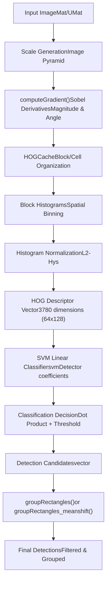
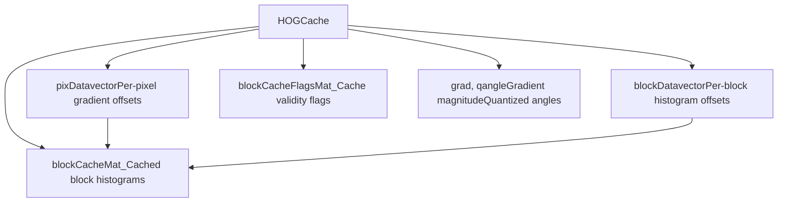
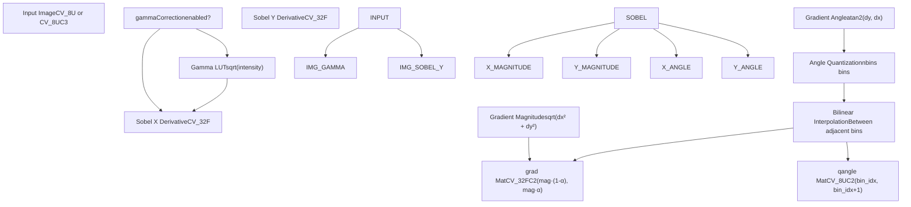
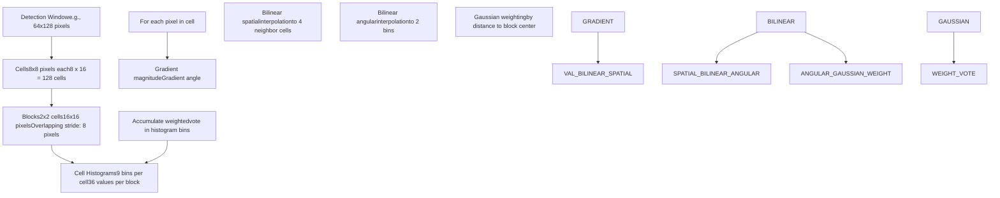
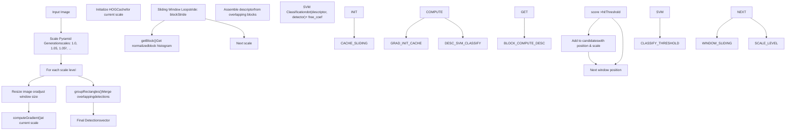
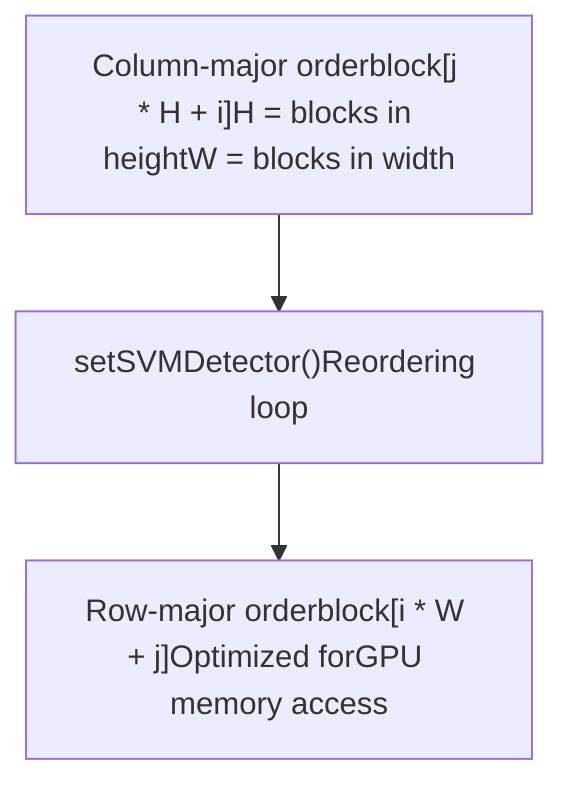
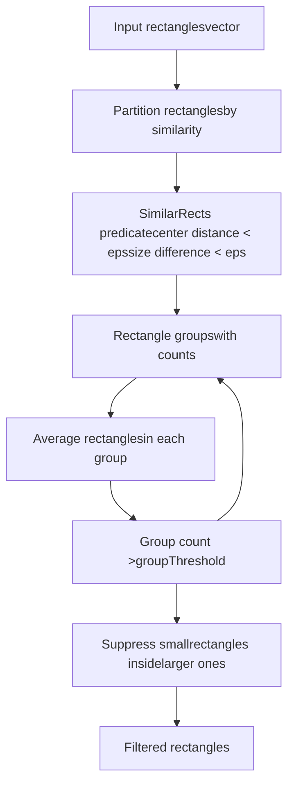
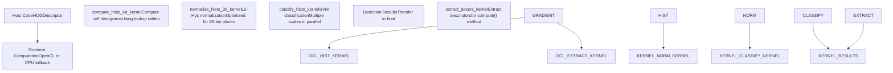

# HOG 描述符与 SVM 检测

相关源文件

-   [modules/calib3d/test/test\_affine3d\_estimator.cpp](https://github.com/opencv/opencv/blob/91c78f50/modules/calib3d/test/test_affine3d_estimator.cpp)
-   [modules/core/include/opencv2/core/cuda/functional.hpp](https://github.com/opencv/opencv/blob/91c78f50/modules/core/include/opencv2/core/cuda/functional.hpp)
-   [modules/imgproc/src/generalized\_hough.cpp](https://github.com/opencv/opencv/blob/91c78f50/modules/imgproc/src/generalized_hough.cpp)
-   [modules/objdetect/include/opencv2/objdetect/objdetect.hpp](https://github.com/opencv/opencv/blob/91c78f50/modules/objdetect/include/opencv2/objdetect/objdetect.hpp)
-   [modules/objdetect/perf/opencl/perf\_cascades.cpp](https://github.com/opencv/opencv/blob/91c78f50/modules/objdetect/perf/opencl/perf_cascades.cpp)
-   [modules/objdetect/perf/opencl/perf\_hogdetect.cpp](https://github.com/opencv/opencv/blob/91c78f50/modules/objdetect/perf/opencl/perf_hogdetect.cpp)
-   [modules/objdetect/src/cascadedetect.cpp](https://github.com/opencv/opencv/blob/91c78f50/modules/objdetect/src/cascadedetect.cpp)
-   [modules/objdetect/src/cascadedetect.hpp](https://github.com/opencv/opencv/blob/91c78f50/modules/objdetect/src/cascadedetect.hpp)
-   [modules/objdetect/src/hog.cpp](https://github.com/opencv/opencv/blob/91c78f50/modules/objdetect/src/hog.cpp)
-   [modules/objdetect/src/opencl/cascadedetect.cl](https://github.com/opencv/opencv/blob/91c78f50/modules/objdetect/src/opencl/cascadedetect.cl)
-   [modules/objdetect/src/opencl/objdetect\_hog.cl](https://github.com/opencv/opencv/blob/91c78f50/modules/objdetect/src/opencl/objdetect_hog.cl)
-   [modules/objdetect/test/opencl/test\_hogdetector.cpp](https://github.com/opencv/opencv/blob/91c78f50/modules/objdetect/test/opencl/test_hogdetector.cpp)
-   [modules/objdetect/test/test\_cascadeandhog.cpp](https://github.com/opencv/opencv/blob/91c78f50/modules/objdetect/test/test_cascadeandhog.cpp)
-   [modules/ts/include/opencv2/ts/cuda\_test.hpp](https://github.com/opencv/opencv/blob/91c78f50/modules/ts/include/opencv2/ts/cuda_test.hpp)
-   [modules/ts/src/cuda\_test.cpp](https://github.com/opencv/opencv/blob/91c78f50/modules/ts/src/cuda_test.cpp)

## 目的与范围

本文档描述 OpenCV `objdetect` 模块中的方向梯度直方图（HOG）特征描述符与支持向量机（SVM）检测系统。HOG 是一种用于目标检测的特征描述符，尤其在行人检测场景中效果显著。该系统从图像区域计算基于梯度的特征，并使用已训练的 SVM 分类器识别目标。

关于基于 Haar 或 LBP 特征的级联目标检测，请参见 [Cascade Classifiers and Haar Features](/opencv/opencv/9.1-cascade-classifiers-and-haar-features)。关于目标检测模块的总体概览，请参见 [Object Detection (objdetect)](/opencv/opencv/9-object-detection-(objdetect))。

---

## 系统概览

HOG 检测系统实现了 Dalal 与 Triggs 提出的算法：在均匀间隔的稠密网格单元上计算梯度方向直方图，并使用重叠局部对比度归一化以提升精度。该系统同时支持 CPU 计算路径与 OpenCL 加速路径。


**来源**: [modules/objdetect/src/hog.cpp52-59](https://github.com/opencv/opencv/blob/91c78f50/modules/objdetect/src/hog.cpp#L52-L59) [modules/objdetect/src/cascadedetect.cpp63-173](https://github.com/opencv/opencv/blob/91c78f50/modules/objdetect/src/cascadedetect.cpp#L63-L173)

---

## 核心类与结构

### HOGDescriptor 类

`HOGDescriptor` 类是 HOG 特征计算与目标检测的主要接口。它封装全部配置参数，并提供描述符计算与多尺度检测方法。

| 组件 | 类型 | 说明 |
| --- | --- | --- |
| `winSize` | `Size` | 检测窗口大小（例如 Size(64,128)） |
| `blockSize` | `Size` | 归一化块大小（例如 Size(16,16)） |
| `blockStride` | `Size` | 块步长（例如 Size(8,8)） |
| `cellSize` | `Size` | 直方图单元大小（例如 Size(8,8)） |
| `nbins` | `int` | 直方图 bin 数（通常为 9） |
| `svmDetector` | `vector<float>` | 线性 SVM 系数 |
| `oclSvmDetector` | `UMat` | 为 OpenCL 重排后的 SVM 系数 |
| `free_coef` | `double` | SVM 偏置项 |

**来源**: [modules/objdetect/src/hog.cpp87-115](https://github.com/opencv/opencv/blob/91c78f50/modules/objdetect/src/hog.cpp#L87-L115)

### HOGCache 结构

该内部辅助类用于管理 HOG 特征的计算与缓存，以实现高效的滑动窗口检测。


**来源**: [modules/objdetect/src/hog.cpp589-743](https://github.com/opencv/opencv/blob/91c78f50/modules/objdetect/src/hog.cpp#L589-L743)

`PixData` 结构保存用于梯度投票双线性分配的直方图偏移与插值权重：

-   `gradOfs`, `qangleOfs`: 梯度与角度数组中的偏移
-   `histOfs[4]`: 最多 4 个相邻单元直方图的偏移
-   `histWeights[4]`: 双线性插值权重
-   `gradWeight`: 空间位置的高斯权重

**来源**: [modules/objdetect/src/hog.cpp601-607](https://github.com/opencv/opencv/blob/91c78f50/modules/objdetect/src/hog.cpp#L601-L607)

---

## 梯度计算流水线

梯度计算是 HOG 特征提取的第一阶段。该阶段使用 Sobel 算子计算图像梯度，并可选执行伽马校正。


**来源**: [modules/objdetect/src/hog.cpp237-587](https://github.com/opencv/opencv/blob/91c78f50/modules/objdetect/src/hog.cpp#L237-L587)

### 多通道梯度选择

对于彩色图像（3 通道），算法会分别计算每个通道的梯度，并在每个像素处选取梯度幅值最大的通道：

```
For each pixel (x,y):
  For each channel c in {R, G, B}:
    dx_c = pixel(x+1, y, c) - pixel(x-1, y, c)
    dy_c = pixel(x, y+1, c) - pixel(x, y-1, c)
    mag_c = dx_c² + dy_c²

  Select channel with max(mag_c)
  Use (dx_max, dy_max) for that pixel
```
**来源**: [modules/objdetect/src/hog.cpp410-523](https://github.com/opencv/opencv/blob/91c78f50/modules/objdetect/src/hog.cpp#L410-L523)

---

## 块直方图计算

HOG 特征通过在单元上累积梯度方向到直方图中计算，再对单元块进行联合归一化。


**来源**: [modules/objdetect/src/hog.cpp656-743](https://github.com/opencv/opencv/blob/91c78f50/modules/objdetect/src/hog.cpp#L656-L743)

### 块归一化

在计算出块的原始直方图后，使用 L2-Hys 归一化：

1.  **L2 归一化**：按 L2 范数归一化：`v' = v / sqrt(||v||² + ε²)`
2.  **截断**：将值截断到 `L2HysThreshold`（通常为 0.2）
3.  **再次归一化**：再次执行 L2 归一化

该归一化可提高对光照变化的不变性并增强检测器鲁棒性。

**来源**: [modules/objdetect/src/hog.cpp875-955](https://github.com/opencv/opencv/blob/91c78f50/modules/objdetect/src/hog.cpp#L875-L955)

---

## 多尺度检测流水线

`detectMultiScale()` 方法在多个图像尺度上实现滑动窗口策略，用于检测不同尺寸的目标。


**来源**: [modules/objdetect/src/hog.cpp1012-1250](https://github.com/opencv/opencv/blob/91c78f50/modules/objdetect/src/hog.cpp#L1012-L1250)

### 检测方法变体

| 方法 | 签名 | 用途 |
| --- | --- | --- |
| `detect()` | `detect(img, foundLocations, hitThreshold, winStride, padding, searchLocations)` | 仅在指定位置进行检测 |
| `detectMultiScale()` | `detectMultiScale(img, foundLocations, hitThreshold, winStride, padding, scale, finalThreshold, useMeanshiftGrouping)` | 带分组的完整多尺度检测 |
| `detectMultiScaleROI()` | `detectMultiScaleROI(img, foundLocations, locations, hitThreshold, groupThreshold)` | 在指定感兴趣区域内检测 |

**来源**: [modules/objdetect/src/hog.cpp957-1250](https://github.com/opencv/opencv/blob/91c78f50/modules/objdetect/src/hog.cpp#L957-L1250)

---

## SVM 检测器组织

SVM 检测器是由系数向量表示的线性分类器。检测器大小必须与窗口配置计算出的描述符大小一致。

### 描述符大小计算

```
cells_per_block = blockSize / cellSize
blocks_per_window_x = (winSize.width - blockSize.width) / blockStride.width + 1
blocks_per_window_y = (winSize.height - blockSize.height) / blockStride.height + 1

descriptor_size = nbins × cells_per_block.area() ×
                  blocks_per_window_x × blocks_per_window_y
```
对于默认的 64×128 行人检测器：

-   窗口：64×128 像素
-   块：16×16 像素（2×2 单元）
-   单元：8×8 像素
-   Bin 数：9
-   每窗口块数：7×15 = 105 块
-   描述符大小：9 × 4 × 105 = **3780 维**

**来源**: [modules/objdetect/src/hog.cpp87-102](https://github.com/opencv/opencv/blob/91c78f50/modules/objdetect/src/hog.cpp#L87-L102)

### SVM 系数重排

为提升 OpenCL 计算效率，SVM 系数会从列主序（先按高度方向块，再按宽度方向块）重排为行主序（先按宽度方向块，再按高度方向块）：


**来源**: [modules/objdetect/src/hog.cpp117-144](https://github.com/opencv/opencv/blob/91c78f50/modules/objdetect/src/hog.cpp#L117-L144)

### 预训练检测器

OpenCV 提供两种预训练 HOG+SVM 检测器：

| 检测器 | 方法 | 窗口大小 | 说明 |
| --- | --- | --- | --- |
| 默认行人 | `getDefaultPeopleDetector()` | 64×128 | 基于 INRIA 人体数据集训练 |
| Daimler 行人 | `getDaimlerPeopleDetector()` | 48×96 | 基于 DaimlerChrysler 数据集训练 |

**来源**: [modules/objdetect/src/hog.cpp1252-1323](https://github.com/opencv/opencv/blob/91c78f50/modules/objdetect/src/hog.cpp#L1252-L1323)

---

## 检测分组算法

在多尺度检测后，表示同一目标的重叠矩形会被归并。OpenCV 提供两种分组算法。

### 标准矩形分组

`groupRectangles()` 函数使用基于分区的算法与相似性谓词：


**来源**: [modules/objdetect/src/cascadedetect.cpp63-173](https://github.com/opencv/opencv/blob/91c78f50/modules/objdetect/src/cascadedetect.cpp#L63-L173)

### Mean-Shift 分组

`groupRectangles_meanshift()` 函数在位置-尺度空间中使用 Mean-Shift 聚类，在密集重叠检测场景下可获得更好的分组效果：

1.  **转换为 3D 点**：`(x_center, y_center, log(scale))`
2.  **执行 mean-shift**：迭代将每个点移动到局部密度峰值
3.  **模态聚类**：将收敛到同一模态的点归组
4.  **重建矩形**：将模态转换回矩形
5.  **按权重过滤**：仅保留支持度足够的模态

Mean-shift 核在 `(x, y, scale)` 空间中使用标准差为 `(8, 16, log(1.3))` 的高斯分布。

**来源**: [modules/objdetect/src/cascadedetect.cpp175-393](https://github.com/opencv/opencv/blob/91c78f50/modules/objdetect/src/cascadedetect.cpp#L175-L393)

---

## OpenCL 加速

HOG 实现包含 OpenCL 内核，用于加速计算量最大的操作。

### OpenCL 内核流水线


**来源**: [modules/objdetect/src/opencl/objdetect\_hog.cl1-303](https://github.com/opencv/opencv/blob/91c78f50/modules/objdetect/src/opencl/objdetect_hog.cl#L1-L303)

### 直方图计算内核

`compute_hists_lut_kernel` 使用预计算查找表（高斯权重和双线性插值权重）来加速直方图累积：

-   **工作组组织**：每单元 12 线程，每块 12×4 线程
-   **局部内存**：共享直方图累加器
-   **查找表**：`gauss_w_lut` 同时包含高斯权重（256 项）与插值权重（256 项）
-   **并行归约**：线程局部直方图在共享内存中归约

**来源**: [modules/objdetect/src/opencl/objdetect\_hog.cl65-152](https://github.com/opencv/opencv/blob/91c78f50/modules/objdetect/src/opencl/objdetect_hog.cl#L65-L152)

### 归一化内核

`normalize_hists_36_kernel` 针对常见的 36 维块直方图（4 个单元 × 9 个 bin）进行了优化：

1.  并行计算平方幅值
2.  并行归约计算块的 L2 范数
3.  归一化并按阈值截断
4.  截断后再次归一化

**来源**: [modules/objdetect/src/opencl/objdetect\_hog.cl157-197](https://github.com/opencv/opencv/blob/91c78f50/modules/objdetect/src/opencl/objdetect_hog.cl#L157-L197)

### 分类内核

`classify_hists_kernel_many_scales` 可高效地在多尺度上执行 SVM 分类：

-   单次内核调用处理多个尺度层级
-   对归一化直方图进行合并访问（coalesced memory access）
-   使用共享内存保存部分点积结果
-   输出检测位置与置信度分数

**来源**: [modules/objdetect/src/opencl/objdetect\_hog.cl199-303](https://github.com/opencv/opencv/blob/91c78f50/modules/objdetect/src/opencl/objdetect_hog.cl#L199-L303)

---

## 配置参数

### 基础参数

| 参数 | 类型 | 默认值 | 说明 |
| --- | --- | --- | --- |
| `winSize` | `Size` | \- | 检测窗口尺寸 |
| `blockSize` | `Size` | Size(16,16) | 归一化块大小 |
| `blockStride` | `Size` | Size(8,8) | 块步长（通常为 blockSize 的一半） |
| `cellSize` | `Size` | Size(8,8) | 直方图单元大小 |
| `nbins` | `int` | 9 | 方向 bin 数 |

### 高级参数

| 参数 | 类型 | 默认值 | 说明 |
| --- | --- | --- | --- |
| `derivAperture` | `int` | 1 | Sobel 核大小（1、3、5、7） |
| `winSigma` | `double` | \-1 | 块加权高斯 sigma（自动值：(blockSize.width + blockSize.height)/8） |
| `histogramNormType` | `int` | L2Hys | 归一化方法 |
| `L2HysThreshold` | `double` | 0.2 | L2-Hys 截断阈值 |
| `gammaCorrection` | `bool` | false | 应用伽马校正（sqrt） |
| `nlevels` | `int` | 64 | 尺度层级数 |
| `signedGradient` | `bool` | false | 使用有符号梯度（0-360°）或无符号梯度（0-180°） |

**来源**: [modules/objdetect/src/hog.cpp148-202](https://github.com/opencv/opencv/blob/91c78f50/modules/objdetect/src/hog.cpp#L148-L202)

### 检测参数

| 参数 | 默认值 | 说明 |
| --- | --- | --- |
| `hitThreshold` | 0.0 | SVM 分类阈值 |
| `winStride` | Size(8,8) | 滑动窗口步长 |
| `padding` | Size(0,0) | 图像周围填充 |
| `scale` | 1.05 | 金字塔层级间缩放因子 |
| `finalThreshold` | 2.0 | 分组阈值（minNeighbors） |
| `useMeanshiftGrouping` | false | 使用 mean-shift 分组或标准分组 |

**来源**: [modules/objdetect/src/hog.cpp1012-1105](https://github.com/opencv/opencv/blob/91c78f50/modules/objdetect/src/hog.cpp#L1012-L1105)

---

## 序列化格式

HOG 描述符可通过 OpenCV 的 FileStorage 系统进行保存与加载。

### XML/YAML 格式结构

```
myHOG:  opencv-object-detector-hog:    winSize: [64, 128]    blockSize: [16, 16]    blockStride: [8, 8]    cellSize: [8, 8]    nbins: 9    derivAperture: 1    winSigma: 4.0    histogramNormType: 0    L2HysThreshold: 0.2    gammaCorrection: 1    nlevels: 64    signedGradient: 0    SVMDetector: [coef0, coef1, ..., coef3780, bias]
```
`SVMDetector` 字段包含线性 SVM 系数，后接可选偏置项。如果描述符长度为 N 且检测器有 N+1 个值，则最后一个值为偏置（free coefficient）。

**来源**: [modules/objdetect/src/hog.cpp148-218](https://github.com/opencv/opencv/blob/91c78f50/modules/objdetect/src/hog.cpp#L148-L218)

---

## 使用模式

### 基础检测

```
// Create HOG descriptor with 64x128 windowHOGDescriptor hog;hog.setSVMDetector(HOGDescriptor::getDefaultPeopleDetector()); // Detect peoplevector<Rect> detections;hog.detectMultiScale(image, detections, 0.0, Size(8,8), Size(0,0), 1.05, 2.0);
```
### 计算描述符

```
HOGDescriptor hog;vector<float> descriptors;vector<Point> locations; // Compute descriptors at specified locationshog.compute(image, descriptors, Size(8,8), Size(0,0), locations);
```
### 自定义训练

```
// Train custom detector (requires external SVM library)vector<float> detector_coefficients = trainSVM(positive_samples, negative_samples); HOGDescriptor hog;hog.setSVMDetector(detector_coefficients);
```
**来源**: [modules/objdetect/test/test\_cascadeandhog.cpp485-495](https://github.com/opencv/opencv/blob/91c78f50/modules/objdetect/test/test_cascadeandhog.cpp#L485-L495)

---

## 性能考量

### CPU 优化

-   **SIMD 向量化**：广泛使用 `cv::v_float32x4` 及类似内在函数
-   **缓存友好访问**：在 `HOGCache` 中预计算像素/块偏移
-   **查找表**：预计算高斯权重与插值系数
-   **积分图**：由于直方图复杂性，不使用积分图（不同于 Haar 级联）

**来源**: [modules/objdetect/src/hog.cpp262-565](https://github.com/opencv/opencv/blob/91c78f50/modules/objdetect/src/hog.cpp#L262-L565)

### OpenCL 优化

-   **合并内存访问**：通过重排数据布局提升 GPU 效率
-   **局部内存使用**：共享直方图累加器减少全局内存流量
-   **工作组尺寸**：针对每工作组 256 线程优化
-   **内核融合**：合并直方图计算与归一化

**来源**: [modules/objdetect/src/opencl/objdetect\_hog.cl46-303](https://github.com/opencv/opencv/blob/91c78f50/modules/objdetect/src/opencl/objdetect_hog.cl#L46-L303)

### 典型性能特征

对于使用默认行人检测器的 640×480 图像：

-   **CPU（单线程）**：每帧约 100-200ms
-   **CPU（多线程）**：每帧约 30-50ms
-   **OpenCL（GPU）**：每帧约 10-20ms

性能大致与以下因素线性相关：

-   图像面积（宽 × 高）
-   尺度层级数量
-   窗口大小
-   描述符维度

**来源**: [modules/objdetect/perf/opencl/perf\_hogdetect.cpp72-88](https://github.com/opencv/opencv/blob/91c78f50/modules/objdetect/perf/opencl/perf_hogdetect.cpp#L72-L88)
