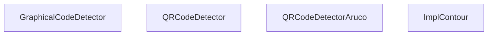
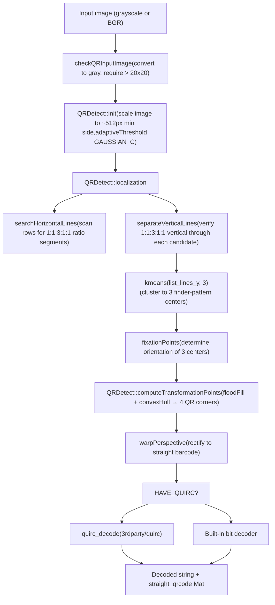
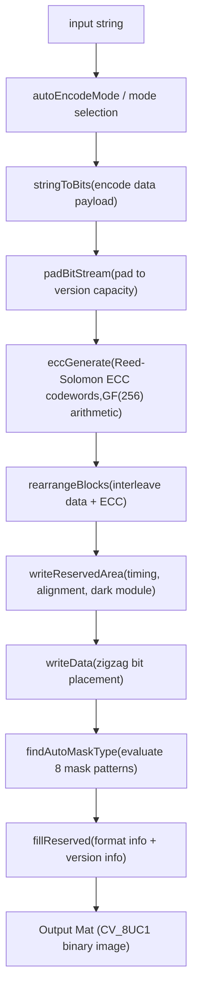
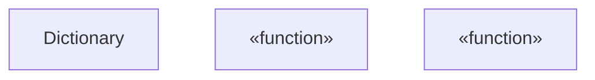
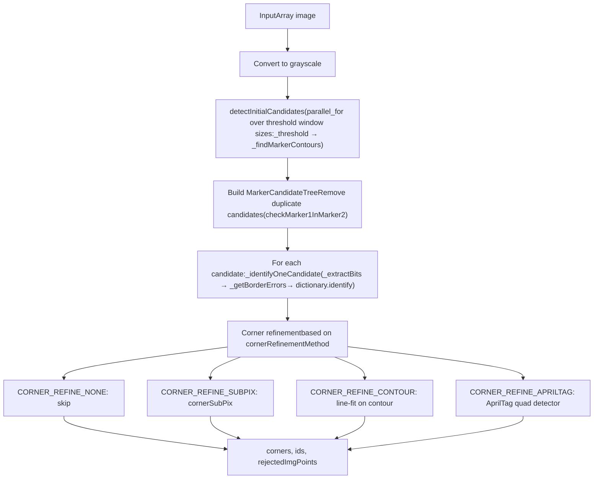
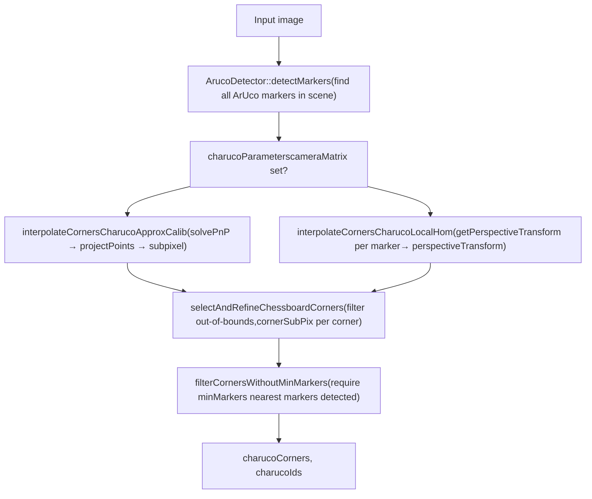

# QR Code 与 ArUco 标记检测

相关源文件

-   [3rdparty/quirc/LICENSE](https://github.com/opencv/opencv/blob/91c78f50/3rdparty/quirc/LICENSE)
-   [3rdparty/quirc/include/quirc.h](https://github.com/opencv/opencv/blob/91c78f50/3rdparty/quirc/include/quirc.h)
-   [3rdparty/quirc/include/quirc\_internal.h](https://github.com/opencv/opencv/blob/91c78f50/3rdparty/quirc/include/quirc_internal.h)
-   [3rdparty/quirc/src/decode.c](https://github.com/opencv/opencv/blob/91c78f50/3rdparty/quirc/src/decode.c)
-   [3rdparty/quirc/src/quirc.c](https://github.com/opencv/opencv/blob/91c78f50/3rdparty/quirc/src/quirc.c)
-   [3rdparty/quirc/src/version\_db.c](https://github.com/opencv/opencv/blob/91c78f50/3rdparty/quirc/src/version_db.c)
-   [cmake/checks/framebuffer.cpp](https://github.com/opencv/opencv/blob/91c78f50/cmake/checks/framebuffer.cpp)
-   [modules/dnn/src/op\_timvx.cpp](https://github.com/opencv/opencv/blob/91c78f50/modules/dnn/src/op_timvx.cpp)
-   [modules/dnn/src/vkcom/src/op\_matmul.cpp](https://github.com/opencv/opencv/blob/91c78f50/modules/dnn/src/vkcom/src/op_matmul.cpp)
-   [modules/gapi/src/streaming/onevpl/utils.cpp](https://github.com/opencv/opencv/blob/91c78f50/modules/gapi/src/streaming/onevpl/utils.cpp)
-   [modules/highgui/cmake/detect\_framebuffer.cmake](https://github.com/opencv/opencv/blob/91c78f50/modules/highgui/cmake/detect_framebuffer.cmake)
-   [modules/highgui/src/window\_framebuffer.cpp](https://github.com/opencv/opencv/blob/91c78f50/modules/highgui/src/window_framebuffer.cpp)
-   [modules/highgui/src/window\_framebuffer.hpp](https://github.com/opencv/opencv/blob/91c78f50/modules/highgui/src/window_framebuffer.hpp)
-   [modules/objdetect/include/opencv2/objdetect.hpp](https://github.com/opencv/opencv/blob/91c78f50/modules/objdetect/include/opencv2/objdetect.hpp)
-   [modules/objdetect/include/opencv2/objdetect/aruco\_board.hpp](https://github.com/opencv/opencv/blob/91c78f50/modules/objdetect/include/opencv2/objdetect/aruco_board.hpp)
-   [modules/objdetect/include/opencv2/objdetect/aruco\_detector.hpp](https://github.com/opencv/opencv/blob/91c78f50/modules/objdetect/include/opencv2/objdetect/aruco_detector.hpp)
-   [modules/objdetect/include/opencv2/objdetect/aruco\_dictionary.hpp](https://github.com/opencv/opencv/blob/91c78f50/modules/objdetect/include/opencv2/objdetect/aruco_dictionary.hpp)
-   [modules/objdetect/include/opencv2/objdetect/charuco\_detector.hpp](https://github.com/opencv/opencv/blob/91c78f50/modules/objdetect/include/opencv2/objdetect/charuco_detector.hpp)
-   [modules/objdetect/include/opencv2/objdetect/graphical\_code\_detector.hpp](https://github.com/opencv/opencv/blob/91c78f50/modules/objdetect/include/opencv2/objdetect/graphical_code_detector.hpp)
-   [modules/objdetect/misc/java/filelist\_common](https://github.com/opencv/opencv/blob/91c78f50/modules/objdetect/misc/java/filelist_common)
-   [modules/objdetect/misc/java/gen\_dict.json](https://github.com/opencv/opencv/blob/91c78f50/modules/objdetect/misc/java/gen_dict.json)
-   [modules/objdetect/misc/java/src/cpp/objdetect\_converters.cpp](https://github.com/opencv/opencv/blob/91c78f50/modules/objdetect/misc/java/src/cpp/objdetect_converters.cpp)
-   [modules/objdetect/misc/java/src/cpp/objdetect\_converters.hpp](https://github.com/opencv/opencv/blob/91c78f50/modules/objdetect/misc/java/src/cpp/objdetect_converters.hpp)
-   [modules/objdetect/misc/java/test/ArucoTest.java](https://github.com/opencv/opencv/blob/91c78f50/modules/objdetect/misc/java/test/ArucoTest.java)
-   [modules/objdetect/misc/java/test/QRCodeDetectorTest.java](https://github.com/opencv/opencv/blob/91c78f50/modules/objdetect/misc/java/test/QRCodeDetectorTest.java)
-   [modules/objdetect/misc/objc/gen\_dict.json](https://github.com/opencv/opencv/blob/91c78f50/modules/objdetect/misc/objc/gen_dict.json)
-   [modules/objdetect/misc/python/pyopencv\_objdetect.hpp](https://github.com/opencv/opencv/blob/91c78f50/modules/objdetect/misc/python/pyopencv_objdetect.hpp)
-   [modules/objdetect/misc/python/test/test\_objdetect\_aruco.py](https://github.com/opencv/opencv/blob/91c78f50/modules/objdetect/misc/python/test/test_objdetect_aruco.py)
-   [modules/objdetect/misc/python/test/test\_qrcode\_detect.py](https://github.com/opencv/opencv/blob/91c78f50/modules/objdetect/misc/python/test/test_qrcode_detect.py)
-   [modules/objdetect/perf/perf\_aruco.cpp](https://github.com/opencv/opencv/blob/91c78f50/modules/objdetect/perf/perf_aruco.cpp)
-   [modules/objdetect/perf/perf\_qrcode\_pipeline.cpp](https://github.com/opencv/opencv/blob/91c78f50/modules/objdetect/perf/perf_qrcode_pipeline.cpp)
-   [modules/objdetect/src/aruco/aruco\_board.cpp](https://github.com/opencv/opencv/blob/91c78f50/modules/objdetect/src/aruco/aruco_board.cpp)
-   [modules/objdetect/src/aruco/aruco\_detector.cpp](https://github.com/opencv/opencv/blob/91c78f50/modules/objdetect/src/aruco/aruco_detector.cpp)
-   [modules/objdetect/src/aruco/aruco\_dictionary.cpp](https://github.com/opencv/opencv/blob/91c78f50/modules/objdetect/src/aruco/aruco_dictionary.cpp)
-   [modules/objdetect/src/aruco/aruco\_utils.cpp](https://github.com/opencv/opencv/blob/91c78f50/modules/objdetect/src/aruco/aruco_utils.cpp)
-   [modules/objdetect/src/aruco/aruco\_utils.hpp](https://github.com/opencv/opencv/blob/91c78f50/modules/objdetect/src/aruco/aruco_utils.hpp)
-   [modules/objdetect/src/aruco/charuco\_detector.cpp](https://github.com/opencv/opencv/blob/91c78f50/modules/objdetect/src/aruco/charuco_detector.cpp)
-   [modules/objdetect/src/aruco/predefined\_dictionaries.hpp](https://github.com/opencv/opencv/blob/91c78f50/modules/objdetect/src/aruco/predefined_dictionaries.hpp)
-   [modules/objdetect/src/graphical\_code\_detector.cpp](https://github.com/opencv/opencv/blob/91c78f50/modules/objdetect/src/graphical_code_detector.cpp)
-   [modules/objdetect/src/graphical\_code\_detector\_impl.hpp](https://github.com/opencv/opencv/blob/91c78f50/modules/objdetect/src/graphical_code_detector_impl.hpp)
-   [modules/objdetect/src/qrcode.cpp](https://github.com/opencv/opencv/blob/91c78f50/modules/objdetect/src/qrcode.cpp)
-   [modules/objdetect/src/qrcode\_encoder.cpp](https://github.com/opencv/opencv/blob/91c78f50/modules/objdetect/src/qrcode_encoder.cpp)
-   [modules/objdetect/src/qrcode\_encoder\_table.inl.hpp](https://github.com/opencv/opencv/blob/91c78f50/modules/objdetect/src/qrcode_encoder_table.inl.hpp)
-   [modules/objdetect/test/test\_aruco\_tutorial.cpp](https://github.com/opencv/opencv/blob/91c78f50/modules/objdetect/test/test_aruco_tutorial.cpp)
-   [modules/objdetect/test/test\_aruco\_utils.cpp](https://github.com/opencv/opencv/blob/91c78f50/modules/objdetect/test/test_aruco_utils.cpp)
-   [modules/objdetect/test/test\_aruco\_utils.hpp](https://github.com/opencv/opencv/blob/91c78f50/modules/objdetect/test/test_aruco_utils.hpp)
-   [modules/objdetect/test/test\_arucodetection.cpp](https://github.com/opencv/opencv/blob/91c78f50/modules/objdetect/test/test_arucodetection.cpp)
-   [modules/objdetect/test/test\_boarddetection.cpp](https://github.com/opencv/opencv/blob/91c78f50/modules/objdetect/test/test_boarddetection.cpp)
-   [modules/objdetect/test/test\_charucodetection.cpp](https://github.com/opencv/opencv/blob/91c78f50/modules/objdetect/test/test_charucodetection.cpp)
-   [modules/objdetect/test/test\_qr\_utils.hpp](https://github.com/opencv/opencv/blob/91c78f50/modules/objdetect/test/test_qr_utils.hpp)
-   [modules/objdetect/test/test\_qrcode.cpp](https://github.com/opencv/opencv/blob/91c78f50/modules/objdetect/test/test_qrcode.cpp)
-   [modules/objdetect/test/test\_qrcode\_encode.cpp](https://github.com/opencv/opencv/blob/91c78f50/modules/objdetect/test/test_qrcode_encode.cpp)
-   [samples/cpp/qrcode.cpp](https://github.com/opencv/opencv/blob/91c78f50/samples/cpp/qrcode.cpp)

本页介绍 `opencv_objdetect` 模块中的 QR 码与 ArUco 标记子系统，涵盖检测与编码 API、内部算法、字典结构、板类型以及 ChArUco 标定靶。关于 HOG/SVM 行人检测请参见 [9.2](/opencv/opencv/9.2-hog-descriptor-and-svm-detection)；关于级联人脸检测请参见 [9.1](/opencv/opencv/9.1-cascade-classifiers-and-haar-features)；关于消费 ArUco/ChArUco 输出的相机标定流程请参见 [8.1](/opencv/opencv/8.1-camera-models-and-calibration-algorithms) 与 [8.2](/opencv/opencv/8.2-pose-estimation-(solvepnp)-and-geometric-transforms)。

---

## 模块组织

两个子系统都位于 `modules/objdetect/` 下。公共 API 声明在 `modules/objdetect/include/opencv2/objdetect.hpp`，ArUco 专用头文件位于 `modules/objdetect/include/opencv2/objdetect/`。

```
modules/objdetect/
├── include/opencv2/objdetect/
│   ├── aruco_detector.hpp      # ArucoDetector, DetectorParameters, RefineParameters
│   ├── aruco_dictionary.hpp    # Dictionary
│   ├── aruco_board.hpp         # Board, GridBoard, CharucoBoard
│   └── charuco_detector.hpp    # CharucoDetector, CharucoParameters
├── src/
│   ├── qrcode.cpp              # QRDetect, ImplContour, QRCodeDetector
│   ├── qrcode_encoder.cpp      # QRCodeEncoderImpl
│   └── aruco/
│       ├── aruco_detector.cpp  # ArucoDetector internals
│       ├── aruco_dictionary.cpp
│       ├── aruco_board.cpp
│       └── charuco_detector.cpp
└── 3rdparty/quirc/             # Optional quirc QR decode library
```
来源: [modules/objdetect/src/qrcode.cpp1-20](https://github.com/opencv/opencv/blob/91c78f50/modules/objdetect/src/qrcode.cpp#L1-L20) [modules/objdetect/include/opencv2/objdetect.hpp44-134](https://github.com/opencv/opencv/blob/91c78f50/modules/objdetect/include/opencv2/objdetect.hpp#L44-L134)

---

## QR Code 检测

### 类层次与入口点

**类层次图：QR Code 检测类**


来源: [modules/objdetect/src/qrcode.cpp974-1004](https://github.com/opencv/opencv/blob/91c78f50/modules/objdetect/src/qrcode.cpp#L974-L1004) [modules/objdetect/include/opencv2/objdetect.hpp44-49](https://github.com/opencv/opencv/blob/91c78f50/modules/objdetect/include/opencv2/objdetect.hpp#L44-L49)

`QRCodeDetector` 通过 Pimpl 指针使用 `ImplContour` 作为内部实现。`QRCodeDetectorAruco` 是一种替代实现：在 QR 解码前复用 ArUco 风格候选检测——在多 QR 场景中更实用。

两者都实现了 `GraphicalCodeDetector`，其声明位于 `modules/objdetect/include/opencv2/objdetect/graphical_code_detector.hpp`。

---

### QR Code 检测流水线

`ImplContour::detect()` 路径会调用 `QRDetect`，该内部类定义于 [modules/objdetect/src/qrcode.cpp101-122](https://github.com/opencv/opencv/blob/91c78f50/modules/objdetect/src/qrcode.cpp#L101-L122)

**流程图：QR Code 检测流水线（基于轮廓）**


来源: [modules/objdetect/src/qrcode.cpp101-567](https://github.com/opencv/opencv/blob/91c78f50/modules/objdetect/src/qrcode.cpp#L101-L567) [modules/objdetect/src/qrcode.cpp125-167](https://github.com/opencv/opencv/blob/91c78f50/modules/objdetect/src/qrcode.cpp#L125-L167) [modules/objdetect/src/qrcode.cpp169-232](https://github.com/opencv/opencv/blob/91c78f50/modules/objdetect/src/qrcode.cpp#L169-L232)

#### 缩放逻辑

`QRDetect::init` 在阈值化前会对图像进行归一化：

| 条件 | 操作 |
| --- | --- |
| `min_side < 512` | `ZOOMING`：放大；`coeff_expansion = 512 / min_side` |
| `min_side > 512` | `SHRINKING`：缩小；`coeff_expansion = min_side / 512` |
| `min_side == 512` | `UNCHANGED` |

检测完成后，定位点会按比例映射回原图坐标。

来源: [modules/objdetect/src/qrcode.cpp125-167](https://github.com/opencv/opencv/blob/91c78f50/modules/objdetect/src/qrcode.cpp#L125-L167)

#### 定位图案（Finder Pattern）定位

`searchHorizontalLines`（[modules/objdetect/src/qrcode.cpp169-232](https://github.com/opencv/opencv/blob/91c78f50/modules/objdetect/src/qrcode.cpp#L169-L232)）会在阈值图像的每一行中扫描像素游程，寻找比例为 **1 : 1 : 3 : 1 : 1**（暗:亮:暗:亮:暗）的片段。每个匹配片段都会成为候选线 `Vec3d {x_start, y, length}`。

随后 `separateVerticalLines` → `extractVerticalLines`（[modules/objdetect/src/qrcode.cpp234-365](https://github.com/opencv/opencv/blob/91c78f50/modules/objdetect/src/qrcode.cpp#L234-L365)）会在每条水平候选线中心处验证纵向特征。它将 6 段纵向剖面与期望比例 **3/14 : 1/7 : 1/7 : 3/14 : 1/7 : 1/7** 对比。验证通过的候选使用 `kmeans`（`k=3`）聚类，得到 3 个定位图案中心。

`fixationPoints`（[modules/objdetect/src/qrcode.cpp367-463](https://github.com/opencv/opencv/blob/91c78f50/modules/objdetect/src/qrcode.cpp#L367-L463)）会重排这 3 个中心，使其构成有效且非退化三角形，并建立 `computeTransformationPoints` 所需的方向（顺时针顺序）。

#### 角点计算

`computeTransformationPoints`（[modules/objdetect/src/qrcode.cpp570-698](https://github.com/opencv/opencv/blob/91c78f50/modules/objdetect/src/qrcode.cpp#L570-L698)）从每个定位图案中心出发执行 `floodFill` 以恢复图案实际填充区域，然后对三个区域整体计算 `convexHull`。第 4 个 QR 角点（与 3 个定位图案相对）通过直线求交估计。

---

### 可调参数

| 参数 | Setter | 默认值 | 影响 |
| --- | --- | --- | --- |
| `epsX` | `setEpsX()` | `0.2` | 水平 1:1:3:1:1 比例检查容差 |
| `epsY` | `setEpsY()` | `0.1` | 纵向比例检查容差 |
| `useAlignmentMarkers` | `setUseAlignmentMarkers()` | `true` | 在计算高版本 QR 码角点时是否使用对齐标记 |

来源: [modules/objdetect/src/qrcode.cpp974-1009](https://github.com/opencv/opencv/blob/91c78f50/modules/objdetect/src/qrcode.cpp#L974-L1009)

---

### 多 QR 码检测

`detectMulti` / `decodeMulti` / `detectAndDecodeMulti` 会在一张图像中同时搜索全部 QR 码。可用两种策略：

| 类 | 方法 | 说明 |
| --- | --- | --- |
| `QRCodeDetector` | 基于轮廓，对候选重复执行 `QRDetect` | 默认 |
| `QRCodeDetectorAruco` | ArUco 风格候选方块 + QR 解码 | 更适合网格状多 QR 场景 |

通过 `GraphicalCodeDetector` 接口的用法一致：

```
// via QRCodeDetector (contours-based)QRCodeDetector detector;std::vector<Point> corners;std::vector<cv::String> decoded;detector.detectAndDecodeMulti(img, decoded, corners); // via QRCodeDetectorArucoQRCodeDetectorAruco detector2;detector2.detectAndDecodeMulti(img, decoded, corners);
```
位于 [modules/objdetect/test/test\_qrcode.cpp338-372](https://github.com/opencv/opencv/blob/91c78f50/modules/objdetect/test/test_qrcode.cpp#L338-L372) 的测试套件覆盖了两种方法在每图 2–9 个 QR 码场景下的表现。

---

### 曲面 QR 码检测

`QRCodeDetector` 提供 `detectAndDecodeCurved`（以及 `decodeCurved`）用于印刷在弯曲或弯折表面上的 QR 码。这些方法利用对齐标记（QR 版本 ≥ 2 可用）构建多项式形变模型，在比特提取前进行透视校正。

来源: [modules/objdetect/src/qrcode.cpp995-997](https://github.com/opencv/opencv/blob/91c78f50/modules/objdetect/src/qrcode.cpp#L995-L997)

---

## QR Code 编码

`QRCodeEncoder`（[modules/objdetect/src/qrcode\_encoder.cpp](https://github.com/opencv/opencv/blob/91c78f50/modules/objdetect/src/qrcode_encoder.cpp)）可根据输入字符串生成 QR 码图像。

### `QRCodeEncoder::Params`

| 字段 | 类型 | 默认值 | 说明 |
| --- | --- | --- | --- |
| `version` | `int` | `0`（自动） | QR 版本 1–40 |
| `correction_level` | `CorrectionLevel` | `CORRECT_LEVEL_L` | L=7%、M=15%、Q=25%、H=30% 恢复能力 |
| `mode` | `EncodeMode` | `MODE_AUTO` | Numeric / Alphanumeric / Byte / Kanji / ECI / Structured |
| `structure_number` | `int` | `1` | 结构化追加的符号数（1–16） |

来源: [modules/objdetect/src/qrcode\_encoder.cpp166-172](https://github.com/opencv/opencv/blob/91c78f50/modules/objdetect/src/qrcode_encoder.cpp#L166-L172)

### 编码流水线

`QRCodeEncoderImpl::generatingProcess`（[modules/objdetect/src/qrcode\_encoder.cpp174-242](https://github.com/opencv/opencv/blob/91c78f50/modules/objdetect/src/qrcode_encoder.cpp#L174-L242)）执行如下阶段：


来源: [modules/objdetect/src/qrcode\_encoder.cpp174-242](https://github.com/opencv/opencv/blob/91c78f50/modules/objdetect/src/qrcode_encoder.cpp#L174-L242) [modules/objdetect/src/qrcode\_encoder.cpp244-298](https://github.com/opencv/opencv/blob/91c78f50/modules/objdetect/src/qrcode_encoder.cpp#L244-L298)

GF(256) 算术辅助函数（`gfPow`, `gfMul`, `gfDiv`, `gfPolyMul`, `gfPolyDiv`）以及生成多项式（`polyGenerator`）均位于 [modules/objdetect/src/qrcode\_encoder.cpp45-120](https://github.com/opencv/opencv/blob/91c78f50/modules/objdetect/src/qrcode_encoder.cpp#L45-L120) 的本地静态函数中。

---

## ArUco 标记检测

ArUco 标记是方形二值基准图案。每个标记都隶属于一个 `Dictionary`，该字典定义了有效码字集合。

### 字典系统

**Dictionary 类图**


来源: [modules/objdetect/include/opencv2/objdetect/aruco\_dictionary.hpp16-90](https://github.com/opencv/opencv/blob/91c78f50/modules/objdetect/include/opencv2/objdetect/aruco_dictionary.hpp#L16-L90) [modules/objdetect/src/aruco/aruco\_dictionary.cpp1-50](https://github.com/opencv/opencv/blob/91c78f50/modules/objdetect/src/aruco/aruco_dictionary.cpp#L1-L50)

`bytesList` 以 `CV_8UC4` Mat 存储，每一行表示一个标记的 4 种旋转并打包为字节。`maxCorrectionBits` 决定 `identify()` 可容忍的比特错误数量。

#### 预定义字典

`getPredefinedDictionary(name)` 返回内置字典集合之一。常见选项：

| 名称 | 网格大小 | 标记数 | 最大纠错位数 |
| --- | --- | --- | --- |
| `DICT_4X4_50` | 4×4 | 50 | 0 |
| `DICT_4X4_100` | 4×4 | 100 | 0 |
| `DICT_5X5_50` | 5×5 | 50 | 2 |
| `DICT_6X6_250` | 6×6 | 250 | 3 |
| `DICT_7X7_1000` | 7×7 | 1000 | 5 |
| `DICT_ARUCO_ORIGINAL` | 5×5 | 1024 | – |
| `DICT_APRILTAG_16h5` | AprilTag | 30 | – |
| `DICT_APRILTAG_36h11` | AprilTag | 587 | – |

来源: [modules/objdetect/src/aruco/aruco\_dictionary.cpp1-50](https://github.com/opencv/opencv/blob/91c78f50/modules/objdetect/src/aruco/aruco_dictionary.cpp#L1-L50)

---

### DetectorParameters

`DetectorParameters`（[modules/objdetect/include/opencv2/objdetect/aruco\_detector.hpp25-234](https://github.com/opencv/opencv/blob/91c78f50/modules/objdetect/include/opencv2/objdetect/aruco_detector.hpp#L25-L234)）控制标记检测的全部细节。关键字段如下：

#### 自适应阈值

| 参数 | 默认值 | 说明 |
| --- | --- | --- |
| `adaptiveThreshWinSizeMin` | 3 | 自适应阈值最小窗口 |
| `adaptiveThreshWinSizeMax` | 23 | 自适应阈值最大窗口 |
| `adaptiveThreshWinSizeStep` | 10 | 窗口步长 |
| `adaptiveThreshConstant` | 7 | 阈值常数 C |

#### 标记尺寸 / 形状过滤

| 参数 | 默认值 | 说明 |
| --- | --- | --- |
| `minMarkerPerimeterRate` | 0.03 | 标记最小周长占图像最大维度比例 |
| `maxMarkerPerimeterRate` | 4.0 | 标记最大周长 |
| `polygonalApproxAccuracyRate` | 0.03 | `approxPolyDP` 精度比率 |
| `minCornerDistanceRate` | 0.05 | 角点最小间距 / 周长 |
| `minDistanceToBorder` | 3 | 到图像边界最小像素距离 |
| `minMarkerDistanceRate` | 0.125 | 两个分组标记间最小距离 |

#### 角点细化

| 参数 | 默认值 | 说明 |
| --- | --- | --- |
| `cornerRefinementMethod` | `CORNER_REFINE_NONE` | None / SubPix / Contour / AprilTag |
| `cornerRefinementWinSize` | 5 | 细化最大窗口（像素） |
| `relativeCornerRefinmentWinSize` | 0.3 | 相对模块大小的窗口比例 |
| `cornerRefinementMaxIterations` | 30 | 最大迭代次数 |
| `cornerRefinementMinAccuracy` | 0.1 | 停止阈值 |

#### 比特解码

| 参数 | 默认值 | 说明 |
| --- | --- | --- |
| `markerBorderBits` | 1 | 边框宽度（bit 单位） |
| `perspectiveRemovePixelPerCell` | 4 | 透视去除后每 bit 单元像素数 |
| `perspectiveRemoveIgnoredMarginPerCell` | 0.13 | 提取 bit 时忽略的单元边缘比例 |
| `maxErroneousBitsInBorderRate` | 0.35 | 黑色边框中允许的最大白色 bit 比例 |
| `minOtsuStdDev` | 5.0 | 应用 Otsu 的最小标准差（否则按均值阈值） |
| `errorCorrectionRate` | 0.6 | `maxCorrectionBits` 的可用比例 |

#### Aruco3 模式

当 `useAruco3Detection = true` 时，检测器使用论文 *Speeded up detection of squared fiducial markers*（Romero-Ramirez 等，2018）提出的多分辨率金字塔方法。该方法以轻微检出率下降换取小尺寸标记场景下显著的速度提升。

| 参数 | 默认值 | 说明 |
| --- | --- | --- |
| `useAruco3Detection` | `false` | 启用 Aruco3 算法 |
| `minSideLengthCanonicalImg` | 32 | 二值图中标记最小边长 |
| `minMarkerLengthRatioOriginalImg` | 0.0 | 原图中标记最小边长比例（控制金字塔深度） |

来源: [modules/objdetect/include/opencv2/objdetect/aruco\_detector.hpp70-233](https://github.com/opencv/opencv/blob/91c78f50/modules/objdetect/include/opencv2/objdetect/aruco_detector.hpp#L70-L233)

---

### ArucoDetector 检测流水线

**流程图：ArucoDetector::detectMarkers 内部流程**


来源: [modules/objdetect/src/aruco/aruco\_detector.cpp269-388](https://github.com/opencv/opencv/blob/91c78f50/modules/objdetect/src/aruco/aruco_detector.cpp#L269-L388) [modules/objdetect/src/aruco/aruco\_detector.cpp470-600](https://github.com/opencv/opencv/blob/91c78f50/modules/objdetect/src/aruco/aruco_detector.cpp#L470-L600)

#### `_extractBits`

[modules/objdetect/src/aruco/aruco\_detector.cpp316-388](https://github.com/opencv/opencv/blob/91c78f50/modules/objdetect/src/aruco/aruco_detector.cpp#L316-L388) 通过 `getPerspectiveTransform` + `warpPerspective(INTER_NEAREST)` 去除透视影响，然后执行 Otsu 阈值化。随后对 `(markerSize + 2*borderBits) × (markerSize + 2*borderBits)` 网格中的每个单元统计白色像素数量。

#### `_identifyOneCandidate`

[modules/objdetect/src/aruco/aruco\_detector.cpp470-600](https://github.com/opencv/opencv/blob/91c78f50/modules/objdetect/src/aruco/aruco_detector.cpp#L470-L600) 会将提取到的比特尝试四种旋转后与 `dictionary.identify()` 匹配。它还可选计算 `[0,1]` 范围内的 `markerConfidence` 分数，用于衡量黑白单元分离的清晰度。

---

### ArucoDetector API

```
ArucoDetector detector(    getPredefinedDictionary(DICT_6X6_250),    DetectorParameters(),       // tuning    RefineParameters()          // for refineDetectedMarkers); vector<vector<Point2f>> corners;vector<int> ids;vector<vector<Point2f>> rejected; detector.detectMarkers(image, corners, ids, rejected);// Optional: recover missed markers using board geometrydetector.refineDetectedMarkers(image, board, corners, ids, rejected);
```
`refineDetectedMarkers`（[modules/objdetect/include/opencv2/objdetect/aruco\_detector.hpp318-380](https://github.com/opencv/opencv/blob/91c78f50/modules/objdetect/include/opencv2/objdetect/aruco_detector.hpp#L318-L380)）会基于 `Board` 的期望标记位置，将 `rejected` 候选重新匹配回检测结果，其行为由 `RefineParameters` 控制：

| 字段 | 默认值 | 说明 |
| --- | --- | --- |
| `minRepDistance` | 10 | 视为重投影匹配时允许的最大角点距离 |
| `errorCorrectionRate` | 3.0 | `maxCorrectionBits` 的乘数 |
| `checkAllOrders` | `true` | 尝试 `rejected` 候选的全部 4 种角点顺序 |

来源: [modules/objdetect/include/opencv2/objdetect/aruco\_detector.hpp238-400](https://github.com/opencv/opencv/blob/91c78f50/modules/objdetect/include/opencv2/objdetect/aruco_detector.hpp#L238-L400) [modules/objdetect/src/aruco/aruco\_detector.cpp82-114](https://github.com/opencv/opencv/blob/91c78f50/modules/objdetect/src/aruco/aruco_detector.cpp#L82-L114)

---

## ArUco 板

### Board 类层次

**类图：ArUco 板类型**


来源: [modules/objdetect/include/opencv2/objdetect/aruco\_board.hpp1-200](https://github.com/opencv/opencv/blob/91c78f50/modules/objdetect/include/opencv2/objdetect/aruco_board.hpp#L1-L200) [modules/objdetect/src/aruco/aruco\_board.cpp1-80](https://github.com/opencv/opencv/blob/91c78f50/modules/objdetect/src/aruco/aruco_board.cpp#L1-L80)

### Board 用法

`Board::matchImagePoints`（[modules/objdetect/src/aruco/aruco\_board.cpp37-73](https://github.com/opencv/opencv/blob/91c78f50/modules/objdetect/src/aruco/aruco_board.cpp#L37-L73)）会在检测到的角点与 3D 板模型之间建立 `(objectPoint, imagePoint)` 对应关系。结果可直接输入 `solvePnP` 进行位姿估计。

```
// Pose from any BoardMat rvec, tvec;Mat objPts, imgPts;board.matchImagePoints(corners, ids, objPts, imgPts);solvePnP(objPts, imgPts, cameraMatrix, distCoeffs, rvec, tvec);
```
来源: [modules/objdetect/src/aruco/aruco\_board.cpp37-73](https://github.com/opencv/opencv/blob/91c78f50/modules/objdetect/src/aruco/aruco_board.cpp#L37-L73)

### 标记生成

```
// Generate a single marker imageMat markerImg;aruco::generateImageMarker(dictionary, id, sidePixels, markerImg, borderBits); // Generate a board imageMat boardImg;board.generateImage(Size(1000, 700), boardImg, marginSize=10, borderBits=1);
```
---

## ChArUco 检测与标定

`CharucoBoard` 将标准棋盘格与嵌入式 ArUco 标记结合。借助邻近 ArUco 标记，可实现亚像素级棋盘角点检测，因此 ChArUco 板非常适合相机标定。

### CharucoDetector


来源: [modules/objdetect/src/aruco/charuco\_detector.cpp184-277](https://github.com/opencv/opencv/blob/91c78f50/modules/objdetect/src/aruco/charuco_detector.cpp#L184-L277)

#### 插值方法

| 方法 | 触发条件 | 方案 |
| --- | --- | --- |
| `interpolateCornersCharucoLocalHom` | 无相机矩阵 | 对每个标记使用 `getPerspectiveTransform` 单应性 |
| `interpolateCornersCharucoApproxCalib` | 提供相机矩阵 | `solvePnP` 近似位姿 → `projectPoints` |

两条路径最后都会执行 `cornerSubPix` 细化，且每个角点的窗口大小根据其到最近标记角点的距离动态计算。

来源: [modules/objdetect/src/aruco/charuco\_detector.cpp183-277](https://github.com/opencv/opencv/blob/91c78f50/modules/objdetect/src/aruco/charuco_detector.cpp#L183-L277)

#### CharucoParameters

| 字段 | 默认值 | 说明 |
| --- | --- | --- |
| `cameraMatrix` | empty | 可选 3×3 相机矩阵；启用 `ApproxCalib` 路径 |
| `distCoeffs` | empty | 可选畸变系数 |
| `minMarkers` | 2 | 保留 ChArUco 角点所需的最小相邻已检出标记数 |
| `tryRefineMarkers` | `false` | 在 ArUco 步骤上执行 `refineDetectedMarkers` |
| `checkMarkers` | `true` | 验证检测角点在几何上位于最近标记之间 |

来源: [modules/objdetect/include/opencv2/objdetect/charuco\_detector.hpp15-35](https://github.com/opencv/opencv/blob/91c78f50/modules/objdetect/include/opencv2/objdetect/charuco_detector.hpp#L15-L35)

### 基于 ChArUco 的位姿估计

```
CharucoBoard board(Size(5, 7), 0.04f, 0.02f,                   getPredefinedDictionary(DICT_6X6_250));CharucoDetector detector(board); vector<Point2f> charucoCorners;vector<int> charucoIds;detector.detectBoard(image, charucoCorners, charucoIds); Mat rvec, tvec;// Use solvePnP with board.getChessboardCorners() for full pose
```
`getCharucoBoardPose`（声明于 `aruco_board.hpp`）对该流程进行了封装；其内部会用 ChArUco 角点 3D 坐标调用 `solvePnP`。

来源: [modules/objdetect/src/aruco/charuco\_detector.cpp314-400](https://github.com/opencv/opencv/blob/91c78f50/modules/objdetect/src/aruco/charuco_detector.cpp#L314-L400) [modules/objdetect/test/test\_charucodetection.cpp203-296](https://github.com/opencv/opencv/blob/91c78f50/modules/objdetect/test/test_charucodetection.cpp#L203-L296)

---

## 关键 API 摘要

### QR Code

| 类 / 函数 | 文件 | 用途 |
| --- | --- | --- |
| `QRCodeDetector` | `qrcode.cpp` | 检测并解码单个或多个 QR 码 |
| `QRCodeDetectorAruco` | `qrcode.cpp` | 基于 ArUco 的多 QR 检测 |
| `GraphicalCodeDetector` | `graphical_code_detector.hpp` | 两类检测器的基类 |
| `QRCodeEncoder` | `qrcode_encoder.cpp` | 将字符串编码为 QR 码图像 |
| `QRCodeEncoder::Params` | `qrcode_encoder.cpp` | 版本、ECC 级别、编码模式 |
| `QRDetect` | `qrcode.cpp` | 内部：定位图案定位 |
| `ImplContour` | `qrcode.cpp` | 内部：`QRCodeDetector` 的 Pimpl |

### ArUco

| 类 / 函数 | 文件 | 用途 |
| --- | --- | --- |
| `Dictionary` | `aruco_dictionary.hpp` | 标记码字集合与识别 |
| `getPredefinedDictionary` | `aruco_dictionary.hpp` | 按名称获取内置字典 |
| `generateCustomDictionary` | `aruco_dictionary.hpp` | 构建自定义字典 |
| `DetectorParameters` | `aruco_detector.hpp` | 全部检测调参项 |
| `RefineParameters` | `aruco_detector.hpp` | `refineDetectedMarkers` 参数 |
| `ArucoDetector` | `aruco_detector.hpp` | 主标记检测类 |
| `Board` | `aruco_board.hpp` | 带 3D 物点的基础板 |
| `GridBoard` | `aruco_board.hpp` | 规则矩形标记网格 |
| `CharucoBoard` | `aruco_board.hpp` | 棋盘格 + 嵌入式 ArUco 标记 |
| `CharucoParameters` | `charuco_detector.hpp` | ChArUco 检测调参项 |
| `CharucoDetector` | `charuco_detector.hpp` | 检测 ChArUco 角点 |
| `generateImageMarker` | `aruco_dictionary.hpp` | 将单个标记渲染到 Mat |

来源: [modules/objdetect/include/opencv2/objdetect/aruco\_detector.hpp275-400](https://github.com/opencv/opencv/blob/91c78f50/modules/objdetect/include/opencv2/objdetect/aruco_detector.hpp#L275-L400) [modules/objdetect/include/opencv2/objdetect/charuco\_detector.hpp37-100](https://github.com/opencv/opencv/blob/91c78f50/modules/objdetect/include/opencv2/objdetect/charuco_detector.hpp#L37-L100) [modules/objdetect/include/opencv2/objdetect/aruco\_board.hpp1-200](https://github.com/opencv/opencv/blob/91c78f50/modules/objdetect/include/opencv2/objdetect/aruco_board.hpp#L1-L200)
