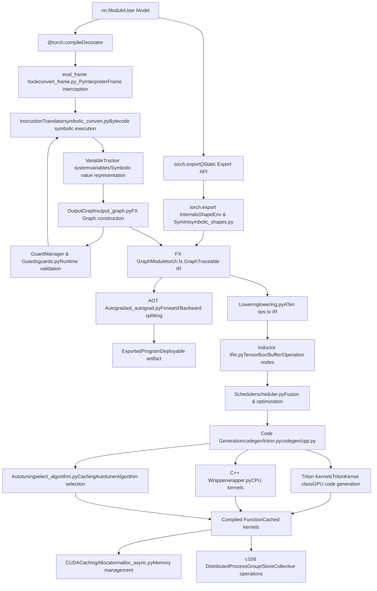
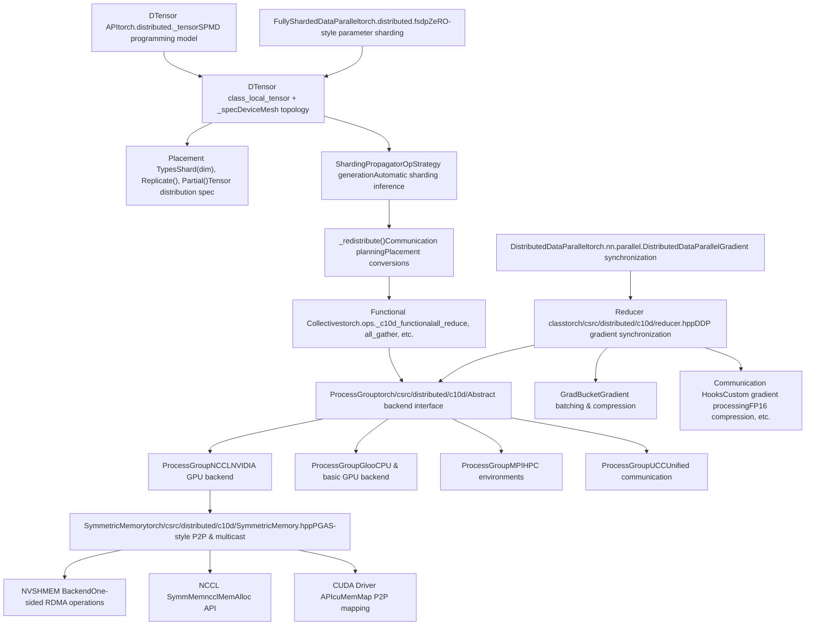
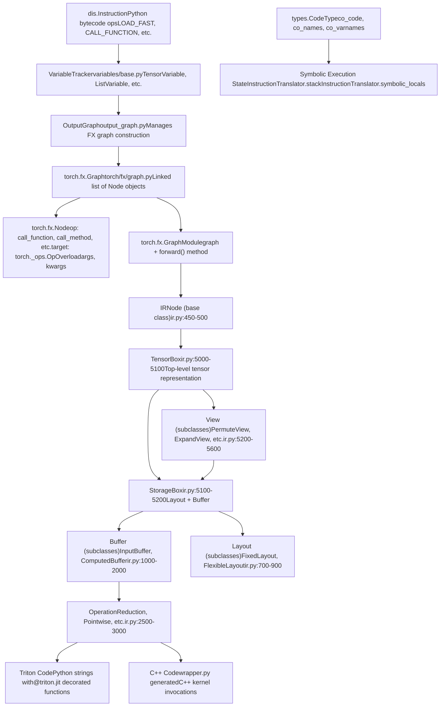
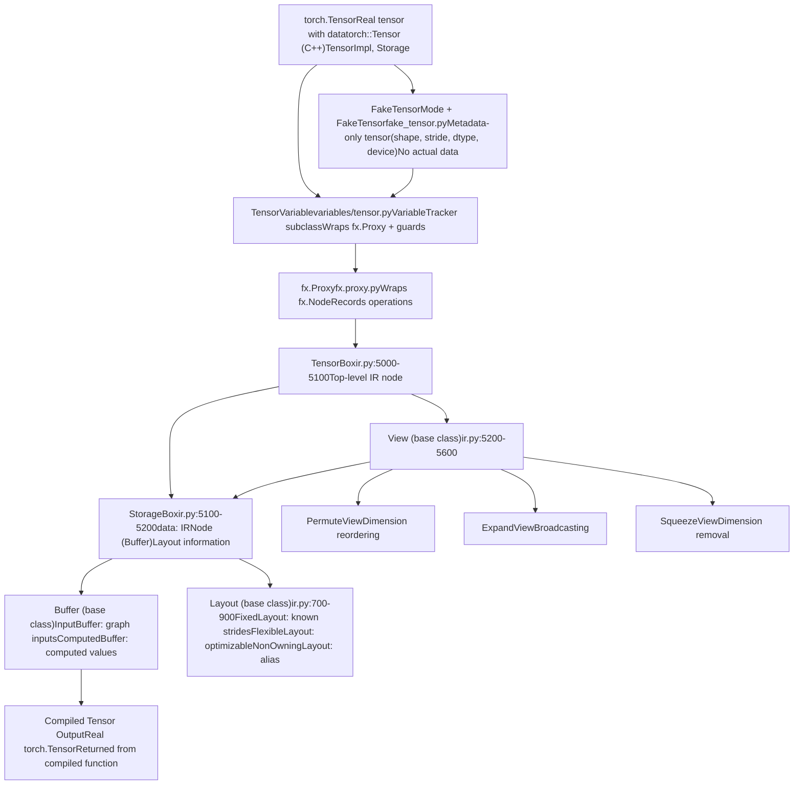
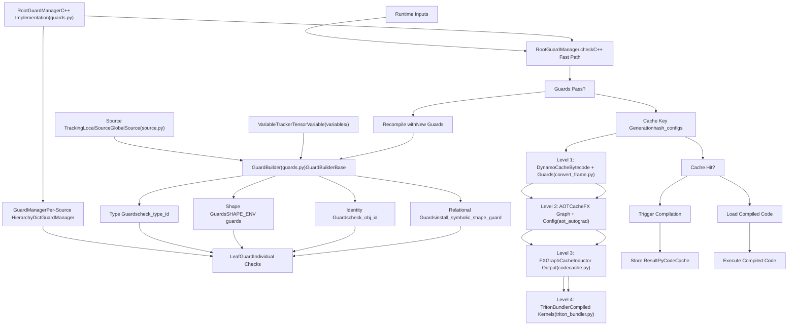

# 概览 (Overview)

相关源文件 (Relevant source files)

-   [.ci/docker/ci\_commit\_pins/torchbench.txt](https://github.com/pytorch/pytorch/blob/915982a4/.ci/docker/ci_commit_pins/torchbench.txt)
-   [aten/src/ATen/core/CachingHostAllocator.h](https://github.com/pytorch/pytorch/blob/915982a4/aten/src/ATen/core/CachingHostAllocator.h)
-   [aten/src/ATen/core/PythonFallbackKernel.cpp](https://github.com/pytorch/pytorch/blob/915982a4/aten/src/ATen/core/PythonFallbackKernel.cpp)
-   [aten/src/ATen/cuda/CachingHostAllocator.cpp](https://github.com/pytorch/pytorch/blob/915982a4/aten/src/ATen/cuda/CachingHostAllocator.cpp)
-   [aten/src/ATen/native/TensorCompare.cpp](https://github.com/pytorch/pytorch/blob/915982a4/aten/src/ATen/native/TensorCompare.cpp)
-   [aten/src/ATen/test/cuda\_caching\_host\_allocator\_test.cpp](https://github.com/pytorch/pytorch/blob/915982a4/aten/src/ATen/test/cuda_caching_host_allocator_test.cpp)
-   [aten/src/ATen/xpu/CachingHostAllocator.cpp](https://github.com/pytorch/pytorch/blob/915982a4/aten/src/ATen/xpu/CachingHostAllocator.cpp)
-   [c10/core/AllocatorConfig.cpp](https://github.com/pytorch/pytorch/blob/915982a4/c10/core/AllocatorConfig.cpp)
-   [c10/core/AllocatorConfig.h](https://github.com/pytorch/pytorch/blob/915982a4/c10/core/AllocatorConfig.h)
-   [c10/cuda/CUDAAllocatorConfig.cpp](https://github.com/pytorch/pytorch/blob/915982a4/c10/cuda/CUDAAllocatorConfig.cpp)
-   [c10/cuda/CUDAAllocatorConfig.h](https://github.com/pytorch/pytorch/blob/915982a4/c10/cuda/CUDAAllocatorConfig.h)
-   [c10/cuda/CUDACachingAllocator.cpp](https://github.com/pytorch/pytorch/blob/915982a4/c10/cuda/CUDACachingAllocator.cpp)
-   [c10/cuda/CUDACachingAllocator.h](https://github.com/pytorch/pytorch/blob/915982a4/c10/cuda/CUDACachingAllocator.h)
-   [c10/test/core/AllocatorConfig\_test.cpp](https://github.com/pytorch/pytorch/blob/915982a4/c10/test/core/AllocatorConfig_test.cpp)
-   [c10/xpu/XPUCachingAllocator.cpp](https://github.com/pytorch/pytorch/blob/915982a4/c10/xpu/XPUCachingAllocator.cpp)
-   [c10/xpu/XPUCachingAllocator.h](https://github.com/pytorch/pytorch/blob/915982a4/c10/xpu/XPUCachingAllocator.h)
-   [docs/source/cuda.aliases.md](https://github.com/pytorch/pytorch/blob/915982a4/docs/source/cuda.aliases.md)
-   [docs/source/notes/cuda.rst](https://github.com/pytorch/pytorch/blob/915982a4/docs/source/notes/cuda.rst)
-   [docs/source/xpu.aliases.md](https://github.com/pytorch/pytorch/blob/915982a4/docs/source/xpu.aliases.md)
-   [docs/source/xpu.md](https://github.com/pytorch/pytorch/blob/915982a4/docs/source/xpu.md)
-   [test/distributed/\_composable/fsdp/test\_fully\_shard\_compile.py](https://github.com/pytorch/pytorch/blob/915982a4/test/distributed/_composable/fsdp/test_fully_shard_compile.py)
-   [test/distributed/tensor/experimental/test\_register\_sharding.py](https://github.com/pytorch/pytorch/blob/915982a4/test/distributed/tensor/experimental/test_register_sharding.py)
-   [test/distributed/tensor/test\_decompositions.py](https://github.com/pytorch/pytorch/blob/915982a4/test/distributed/tensor/test_decompositions.py)
-   [test/distributed/tensor/test\_dtensor\_dispatch\_overhead.py](https://github.com/pytorch/pytorch/blob/915982a4/test/distributed/tensor/test_dtensor_dispatch_overhead.py)
-   [test/distributed/tensor/test\_dtensor\_export.py](https://github.com/pytorch/pytorch/blob/915982a4/test/distributed/tensor/test_dtensor_export.py)
-   [test/distributed/tensor/test\_dtensor\_ops.py](https://github.com/pytorch/pytorch/blob/915982a4/test/distributed/tensor/test_dtensor_ops.py)
-   [test/distributed/tensor/test\_math\_ops.py](https://github.com/pytorch/pytorch/blob/915982a4/test/distributed/tensor/test_math_ops.py)
-   [test/distributed/tensor/test\_matrix\_ops.py](https://github.com/pytorch/pytorch/blob/915982a4/test/distributed/tensor/test_matrix_ops.py)
-   [test/distributed/tensor/test\_op\_strategy.py](https://github.com/pytorch/pytorch/blob/915982a4/test/distributed/tensor/test_op_strategy.py)
-   [test/distributed/tensor/test\_pointwise\_ops.py](https://github.com/pytorch/pytorch/blob/915982a4/test/distributed/tensor/test_pointwise_ops.py)
-   [test/distributed/tensor/test\_single\_dim\_strategy.py](https://github.com/pytorch/pytorch/blob/915982a4/test/distributed/tensor/test_single_dim_strategy.py)
-   [test/distributed/tensor/test\_tensor\_ops.py](https://github.com/pytorch/pytorch/blob/915982a4/test/distributed/tensor/test_tensor_ops.py)
-   [test/distributed/tensor/test\_view\_ops.py](https://github.com/pytorch/pytorch/blob/915982a4/test/distributed/tensor/test_view_ops.py)
-   [test/dynamo/test\_activation\_checkpointing.py](https://github.com/pytorch/pytorch/blob/915982a4/test/dynamo/test_activation_checkpointing.py)
-   [test/dynamo/test\_activation\_offloading.py](https://github.com/pytorch/pytorch/blob/915982a4/test/dynamo/test_activation_offloading.py)
-   [test/dynamo/test\_aot\_autograd.py](https://github.com/pytorch/pytorch/blob/915982a4/test/dynamo/test_aot_autograd.py)
-   [test/dynamo/test\_dicts.py](https://github.com/pytorch/pytorch/blob/915982a4/test/dynamo/test_dicts.py)
-   [test/dynamo/test\_error\_messages.py](https://github.com/pytorch/pytorch/blob/915982a4/test/dynamo/test_error_messages.py)
-   [test/dynamo/test\_functions.py](https://github.com/pytorch/pytorch/blob/915982a4/test/dynamo/test_functions.py)
-   [test/dynamo/test\_fwd\_loss\_bwd.py](https://github.com/pytorch/pytorch/blob/915982a4/test/dynamo/test_fwd_loss_bwd.py)
-   [test/dynamo/test\_list.py](https://github.com/pytorch/pytorch/blob/915982a4/test/dynamo/test_list.py)
-   [test/dynamo/test\_misc.py](https://github.com/pytorch/pytorch/blob/915982a4/test/dynamo/test_misc.py)
-   [test/dynamo/test\_modules.py](https://github.com/pytorch/pytorch/blob/915982a4/test/dynamo/test_modules.py)
-   [test/dynamo/test\_nested\_graph\_breaks.py](https://github.com/pytorch/pytorch/blob/915982a4/test/dynamo/test_nested_graph_breaks.py)
-   [test/dynamo/test\_repros.py](https://github.com/pytorch/pytorch/blob/915982a4/test/dynamo/test_repros.py)
-   [test/dynamo/test\_utils.py](https://github.com/pytorch/pytorch/blob/915982a4/test/dynamo/test_utils.py)
-   [test/dynamo\_expected\_failures/TestCustomOp.test\_impl\_device\_cpu](https://github.com/pytorch/pytorch/blob/915982a4/test/dynamo_expected_failures/TestCustomOp.test_impl_device_cpu)
-   [test/export/test\_experimental.py](https://github.com/pytorch/pytorch/blob/915982a4/test/export/test_experimental.py)
-   [test/export/test\_export.py](https://github.com/pytorch/pytorch/blob/915982a4/test/export/test_export.py)
-   [test/functorch/test\_aotdispatch.py](https://github.com/pytorch/pytorch/blob/915982a4/test/functorch/test_aotdispatch.py)
-   [test/fx/test\_fx\_xform\_observer.py](https://github.com/pytorch/pytorch/blob/915982a4/test/fx/test_fx_xform_observer.py)
-   [test/inductor/test\_aot\_inductor.py](https://github.com/pytorch/pytorch/blob/915982a4/test/inductor/test_aot_inductor.py)
-   [test/inductor/test\_combo\_kernels.py](https://github.com/pytorch/pytorch/blob/915982a4/test/inductor/test_combo_kernels.py)
-   [test/inductor/test\_custom\_op\_autotune.py](https://github.com/pytorch/pytorch/blob/915982a4/test/inductor/test_custom_op_autotune.py)
-   [test/inductor/test\_foreach.py](https://github.com/pytorch/pytorch/blob/915982a4/test/inductor/test_foreach.py)
-   [test/inductor/test\_max\_autotune.py](https://github.com/pytorch/pytorch/blob/915982a4/test/inductor/test_max_autotune.py)
-   [test/inductor/test\_mmdecomp.py](https://github.com/pytorch/pytorch/blob/915982a4/test/inductor/test_mmdecomp.py)
-   [test/inductor/test\_torchinductor.py](https://github.com/pytorch/pytorch/blob/915982a4/test/inductor/test_torchinductor.py)
-   [test/inductor/test\_torchinductor\_codegen\_dynamic\_shapes.py](https://github.com/pytorch/pytorch/blob/915982a4/test/inductor/test_torchinductor_codegen_dynamic_shapes.py)
-   [test/profiler/test\_record\_function.py](https://github.com/pytorch/pytorch/blob/915982a4/test/profiler/test_record_function.py)
-   [test/profiler/test\_torch\_tidy.py](https://github.com/pytorch/pytorch/blob/915982a4/test/profiler/test_torch_tidy.py)
-   [test/test\_accelerator.py](https://github.com/pytorch/pytorch/blob/915982a4/test/test_accelerator.py)
-   [test/test\_autograd\_fallback.py](https://github.com/pytorch/pytorch/blob/915982a4/test/test_autograd_fallback.py)
-   [test/test\_cuda.py](https://github.com/pytorch/pytorch/blob/915982a4/test/test_cuda.py)
-   [test/test\_cuda\_compatibility.py](https://github.com/pytorch/pytorch/blob/915982a4/test/test_cuda_compatibility.py)
-   [test/test\_dynamic\_shapes.py](https://github.com/pytorch/pytorch/blob/915982a4/test/test_dynamic_shapes.py)
-   [test/test\_proxy\_tensor.py](https://github.com/pytorch/pytorch/blob/915982a4/test/test_proxy_tensor.py)
-   [test/test\_xpu.py](https://github.com/pytorch/pytorch/blob/915982a4/test/test_xpu.py)
-   [torch/\_C/\_\_init\_\_.pyi.in](https://github.com/pytorch/pytorch/blob/915982a4/torch/_C/__init__.pyi.in)
-   [torch/\_dynamo/bytecode\_analysis.py](https://github.com/pytorch/pytorch/blob/915982a4/torch/_dynamo/bytecode_analysis.py)
-   [torch/\_dynamo/bytecode\_transformation.py](https://github.com/pytorch/pytorch/blob/915982a4/torch/_dynamo/bytecode_transformation.py)
-   [torch/\_dynamo/codegen.py](https://github.com/pytorch/pytorch/blob/915982a4/torch/_dynamo/codegen.py)
-   [torch/\_dynamo/config.py](https://github.com/pytorch/pytorch/blob/915982a4/torch/_dynamo/config.py)
-   [torch/\_dynamo/convert\_frame.py](https://github.com/pytorch/pytorch/blob/915982a4/torch/_dynamo/convert_frame.py)
-   [torch/\_dynamo/eval\_frame.py](https://github.com/pytorch/pytorch/blob/915982a4/torch/_dynamo/eval_frame.py)
-   [torch/\_dynamo/exc.py](https://github.com/pytorch/pytorch/blob/915982a4/torch/_dynamo/exc.py)
-   [torch/\_dynamo/functional\_export.py](https://github.com/pytorch/pytorch/blob/915982a4/torch/_dynamo/functional_export.py)
-   [torch/\_dynamo/graph\_break\_registry.json](https://github.com/pytorch/pytorch/blob/915982a4/torch/_dynamo/graph_break_registry.json)
-   [torch/\_dynamo/output\_graph.py](https://github.com/pytorch/pytorch/blob/915982a4/torch/_dynamo/output_graph.py)
-   [torch/\_dynamo/resume\_execution.py](https://github.com/pytorch/pytorch/blob/915982a4/torch/_dynamo/resume_execution.py)
-   [torch/\_dynamo/side\_effects.py](https://github.com/pytorch/pytorch/blob/915982a4/torch/_dynamo/side_effects.py)
-   [torch/\_dynamo/symbolic\_convert.py](https://github.com/pytorch/pytorch/blob/915982a4/torch/_dynamo/symbolic_convert.py)
-   [torch/\_dynamo/test\_case.py](https://github.com/pytorch/pytorch/blob/915982a4/torch/_dynamo/test_case.py)
-   [torch/\_dynamo/testing.py](https://github.com/pytorch/pytorch/blob/915982a4/torch/_dynamo/testing.py)
-   [torch/\_dynamo/trace\_rules.py](https://github.com/pytorch/pytorch/blob/915982a4/torch/_dynamo/trace_rules.py)
-   [torch/\_dynamo/utils.py](https://github.com/pytorch/pytorch/blob/915982a4/torch/_dynamo/utils.py)
-   [torch/\_dynamo/variables/\_\_init\_\_.py](https://github.com/pytorch/pytorch/blob/915982a4/torch/_dynamo/variables/__init__.py)
-   [torch/\_dynamo/variables/base.py](https://github.com/pytorch/pytorch/blob/915982a4/torch/_dynamo/variables/base.py)
-   [torch/\_dynamo/variables/builder.py](https://github.com/pytorch/pytorch/blob/915982a4/torch/_dynamo/variables/builder.py)
-   [torch/\_dynamo/variables/builtin.py](https://github.com/pytorch/pytorch/blob/915982a4/torch/_dynamo/variables/builtin.py)
-   [torch/\_dynamo/variables/constant.py](https://github.com/pytorch/pytorch/blob/915982a4/torch/_dynamo/variables/constant.py)
-   [torch/\_dynamo/variables/ctx\_manager.py](https://github.com/pytorch/pytorch/blob/915982a4/torch/_dynamo/variables/ctx_manager.py)
-   [torch/\_dynamo/variables/dicts.py](https://github.com/pytorch/pytorch/blob/915982a4/torch/_dynamo/variables/dicts.py)
-   [torch/\_dynamo/variables/functions.py](https://github.com/pytorch/pytorch/blob/915982a4/torch/_dynamo/variables/functions.py)
-   [torch/\_dynamo/variables/higher\_order\_ops.py](https://github.com/pytorch/pytorch/blob/915982a4/torch/_dynamo/variables/higher_order_ops.py)
-   [torch/\_dynamo/variables/iter.py](https://github.com/pytorch/pytorch/blob/915982a4/torch/_dynamo/variables/iter.py)
-   [torch/\_dynamo/variables/lists.py](https://github.com/pytorch/pytorch/blob/915982a4/torch/_dynamo/variables/lists.py)
-   [torch/\_dynamo/variables/misc.py](https://github.com/pytorch/pytorch/blob/915982a4/torch/_dynamo/variables/misc.py)
-   [torch/\_dynamo/variables/nn\_module.py](https://github.com/pytorch/pytorch/blob/915982a4/torch/_dynamo/variables/nn_module.py)
-   [torch/\_dynamo/variables/optimizer.py](https://github.com/pytorch/pytorch/blob/915982a4/torch/_dynamo/variables/optimizer.py)
-   [torch/\_dynamo/variables/tensor.py](https://github.com/pytorch/pytorch/blob/915982a4/torch/_dynamo/variables/tensor.py)
-   [torch/\_dynamo/variables/torch.py](https://github.com/pytorch/pytorch/blob/915982a4/torch/_dynamo/variables/torch.py)
-   [torch/\_dynamo/variables/user\_defined.py](https://github.com/pytorch/pytorch/blob/915982a4/torch/_dynamo/variables/user_defined.py)
-   [torch/\_export/non\_strict\_utils.py](https://github.com/pytorch/pytorch/blob/915982a4/torch/_export/non_strict_utils.py)
-   [torch/\_functorch/\_activation\_offloading/\_\_init\_\_.py](https://github.com/pytorch/pytorch/blob/915982a4/torch/_functorch/_activation_offloading/__init__.py)
-   [torch/\_functorch/\_activation\_offloading/activation\_offloading.py](https://github.com/pytorch/pytorch/blob/915982a4/torch/_functorch/_activation_offloading/activation_offloading.py)
-   [torch/\_functorch/\_aot\_autograd/collect\_metadata\_analysis.py](https://github.com/pytorch/pytorch/blob/915982a4/torch/_functorch/_aot_autograd/collect_metadata_analysis.py)
-   [torch/\_functorch/\_aot\_autograd/frontend\_utils.py](https://github.com/pytorch/pytorch/blob/915982a4/torch/_functorch/_aot_autograd/frontend_utils.py)
-   [torch/\_functorch/\_aot\_autograd/fx\_utils.py](https://github.com/pytorch/pytorch/blob/915982a4/torch/_functorch/_aot_autograd/fx_utils.py)
-   [torch/\_functorch/\_aot\_autograd/graph\_capture.py](https://github.com/pytorch/pytorch/blob/915982a4/torch/_functorch/_aot_autograd/graph_capture.py)
-   [torch/\_functorch/\_aot\_autograd/graph\_capture\_wrappers.py](https://github.com/pytorch/pytorch/blob/915982a4/torch/_functorch/_aot_autograd/graph_capture_wrappers.py)
-   [torch/\_functorch/\_aot\_autograd/graph\_compile.py](https://github.com/pytorch/pytorch/blob/915982a4/torch/_functorch/_aot_autograd/graph_compile.py)
-   [torch/\_functorch/\_aot\_autograd/input\_output\_analysis.py](https://github.com/pytorch/pytorch/blob/915982a4/torch/_functorch/_aot_autograd/input_output_analysis.py)
-   [torch/\_functorch/\_aot\_autograd/runtime\_wrappers.py](https://github.com/pytorch/pytorch/blob/915982a4/torch/_functorch/_aot_autograd/runtime_wrappers.py)
-   [torch/\_functorch/\_aot\_autograd/schemas.py](https://github.com/pytorch/pytorch/blob/915982a4/torch/_functorch/_aot_autograd/schemas.py)
-   [torch/\_functorch/\_aot\_autograd/subclass\_parametrization.py](https://github.com/pytorch/pytorch/blob/915982a4/torch/_functorch/_aot_autograd/subclass_parametrization.py)
-   [torch/\_functorch/\_aot\_autograd/subclass\_utils.py](https://github.com/pytorch/pytorch/blob/915982a4/torch/_functorch/_aot_autograd/subclass_utils.py)
-   [torch/\_functorch/\_aot\_autograd/utils.py](https://github.com/pytorch/pytorch/blob/915982a4/torch/_functorch/_aot_autograd/utils.py)
-   [torch/\_functorch/aot\_autograd.py](https://github.com/pytorch/pytorch/blob/915982a4/torch/_functorch/aot_autograd.py)
-   [torch/\_functorch/config.py](https://github.com/pytorch/pytorch/blob/915982a4/torch/_functorch/config.py)
-   [torch/\_functorch/partitioners.py](https://github.com/pytorch/pytorch/blob/915982a4/torch/_functorch/partitioners.py)
-   [torch/\_inductor/autotune\_process.py](https://github.com/pytorch/pytorch/blob/915982a4/torch/_inductor/autotune_process.py)
-   [torch/\_inductor/choices.py](https://github.com/pytorch/pytorch/blob/915982a4/torch/_inductor/choices.py)
-   [torch/\_inductor/codegen/common.py](https://github.com/pytorch/pytorch/blob/915982a4/torch/_inductor/codegen/common.py)
-   [torch/\_inductor/codegen/cpp\_wrapper\_cpu.py](https://github.com/pytorch/pytorch/blob/915982a4/torch/_inductor/codegen/cpp_wrapper_cpu.py)
-   [torch/\_inductor/codegen/cpp\_wrapper\_cpu\_array\_ref.py](https://github.com/pytorch/pytorch/blob/915982a4/torch/_inductor/codegen/cpp_wrapper_cpu_array_ref.py)
-   [torch/\_inductor/codegen/simd.py](https://github.com/pytorch/pytorch/blob/915982a4/torch/_inductor/codegen/simd.py)
-   [torch/\_inductor/codegen/subgraph.py](https://github.com/pytorch/pytorch/blob/915982a4/torch/_inductor/codegen/subgraph.py)
-   [torch/\_inductor/codegen/triton.py](https://github.com/pytorch/pytorch/blob/915982a4/torch/_inductor/codegen/triton.py)
-   [torch/\_inductor/codegen/triton\_combo\_kernel.py](https://github.com/pytorch/pytorch/blob/915982a4/torch/_inductor/codegen/triton_combo_kernel.py)
-   [torch/\_inductor/codegen/wrapper.py](https://github.com/pytorch/pytorch/blob/915982a4/torch/_inductor/codegen/wrapper.py)
-   [torch/\_inductor/config.py](https://github.com/pytorch/pytorch/blob/915982a4/torch/_inductor/config.py)
-   [torch/\_inductor/decomposition.py](https://github.com/pytorch/pytorch/blob/915982a4/torch/_inductor/decomposition.py)
-   [torch/\_inductor/dtype\_propagation.py](https://github.com/pytorch/pytorch/blob/915982a4/torch/_inductor/dtype_propagation.py)
-   [torch/\_inductor/graph.py](https://github.com/pytorch/pytorch/blob/915982a4/torch/_inductor/graph.py)
-   [torch/\_inductor/ir.py](https://github.com/pytorch/pytorch/blob/915982a4/torch/_inductor/ir.py)
-   [torch/\_inductor/kernel/bmm.py](https://github.com/pytorch/pytorch/blob/915982a4/torch/_inductor/kernel/bmm.py)
-   [torch/\_inductor/kernel/conv.py](https://github.com/pytorch/pytorch/blob/915982a4/torch/_inductor/kernel/conv.py)
-   [torch/\_inductor/kernel/custom\_op.py](https://github.com/pytorch/pytorch/blob/915982a4/torch/_inductor/kernel/custom_op.py)
-   [torch/\_inductor/kernel/mm.py](https://github.com/pytorch/pytorch/blob/915982a4/torch/_inductor/kernel/mm.py)
-   [torch/\_inductor/kernel/mm\_plus\_mm.py](https://github.com/pytorch/pytorch/blob/915982a4/torch/_inductor/kernel/mm_plus_mm.py)
-   [torch/\_inductor/kernel\_inputs.py](https://github.com/pytorch/pytorch/blob/915982a4/torch/_inductor/kernel_inputs.py)
-   [torch/\_inductor/lowering.py](https://github.com/pytorch/pytorch/blob/915982a4/torch/_inductor/lowering.py)
-   [torch/\_inductor/memory.py](https://github.com/pytorch/pytorch/blob/915982a4/torch/_inductor/memory.py)
-   [torch/\_inductor/ops\_handler.py](https://github.com/pytorch/pytorch/blob/915982a4/torch/_inductor/ops_handler.py)
-   [torch/\_inductor/runtime/triton\_heuristics.py](https://github.com/pytorch/pytorch/blob/915982a4/torch/_inductor/runtime/triton_heuristics.py)
-   [torch/\_inductor/scheduler.py](https://github.com/pytorch/pytorch/blob/915982a4/torch/_inductor/scheduler.py)
-   [torch/\_inductor/select\_algorithm.py](https://github.com/pytorch/pytorch/blob/915982a4/torch/_inductor/select_algorithm.py)
-   [torch/\_inductor/shape\_propagation.py](https://github.com/pytorch/pytorch/blob/915982a4/torch/_inductor/shape_propagation.py)
-   [torch/\_inductor/template\_heuristics/triton.py](https://github.com/pytorch/pytorch/blob/915982a4/torch/_inductor/template_heuristics/triton.py)
-   [torch/\_inductor/utils.py](https://github.com/pytorch/pytorch/blob/915982a4/torch/_inductor/utils.py)
-   [torch/\_inductor/virtualized.py](https://github.com/pytorch/pytorch/blob/915982a4/torch/_inductor/virtualized.py)
-   [torch/\_library/autograd.py](https://github.com/pytorch/pytorch/blob/915982a4/torch/_library/autograd.py)
-   [torch/\_meta\_registrations.py](https://github.com/pytorch/pytorch/blob/915982a4/torch/_meta_registrations.py)
-   [torch/\_utils.py](https://github.com/pytorch/pytorch/blob/915982a4/torch/_utils.py)
-   [torch/csrc/DeviceAccelerator.cpp](https://github.com/pytorch/pytorch/blob/915982a4/torch/csrc/DeviceAccelerator.cpp)
-   [torch/csrc/Module.cpp](https://github.com/pytorch/pytorch/blob/915982a4/torch/csrc/Module.cpp)
-   [torch/csrc/autograd/autograd\_not\_implemented\_fallback.cpp](https://github.com/pytorch/pytorch/blob/915982a4/torch/csrc/autograd/autograd_not_implemented_fallback.cpp)
-   [torch/csrc/cuda/Module.cpp](https://github.com/pytorch/pytorch/blob/915982a4/torch/csrc/cuda/Module.cpp)
-   [torch/csrc/cuda/memory\_snapshot.cpp](https://github.com/pytorch/pytorch/blob/915982a4/torch/csrc/cuda/memory_snapshot.cpp)
-   [torch/csrc/inductor/cpp\_wrapper/common.h](https://github.com/pytorch/pytorch/blob/915982a4/torch/csrc/inductor/cpp_wrapper/common.h)
-   [torch/csrc/profiler/combined\_traceback.cpp](https://github.com/pytorch/pytorch/blob/915982a4/torch/csrc/profiler/combined_traceback.cpp)
-   [torch/csrc/profiler/combined\_traceback.h](https://github.com/pytorch/pytorch/blob/915982a4/torch/csrc/profiler/combined_traceback.h)
-   [torch/csrc/profiler/python/combined\_traceback.cpp](https://github.com/pytorch/pytorch/blob/915982a4/torch/csrc/profiler/python/combined_traceback.cpp)
-   [torch/csrc/xpu/Module.cpp](https://github.com/pytorch/pytorch/blob/915982a4/torch/csrc/xpu/Module.cpp)
-   [torch/cuda/\_\_init\_\_.py](https://github.com/pytorch/pytorch/blob/915982a4/torch/cuda/__init__.py)
-   [torch/cuda/\_device\_limits.py](https://github.com/pytorch/pytorch/blob/915982a4/torch/cuda/_device_limits.py)
-   [torch/cuda/memory.py](https://github.com/pytorch/pytorch/blob/915982a4/torch/cuda/memory.py)
-   [torch/distributed/tensor/\_decompositions.py](https://github.com/pytorch/pytorch/blob/915982a4/torch/distributed/tensor/_decompositions.py)
-   [torch/distributed/tensor/\_nonlinear\_redux.py](https://github.com/pytorch/pytorch/blob/915982a4/torch/distributed/tensor/_nonlinear_redux.py)
-   [torch/distributed/tensor/\_op\_schema.py](https://github.com/pytorch/pytorch/blob/915982a4/torch/distributed/tensor/_op_schema.py)
-   [torch/distributed/tensor/\_ops/\_conv\_ops.py](https://github.com/pytorch/pytorch/blob/915982a4/torch/distributed/tensor/_ops/_conv_ops.py)
-   [torch/distributed/tensor/\_ops/\_math\_ops.py](https://github.com/pytorch/pytorch/blob/915982a4/torch/distributed/tensor/_ops/_math_ops.py)
-   [torch/distributed/tensor/\_ops/\_matrix\_ops.py](https://github.com/pytorch/pytorch/blob/915982a4/torch/distributed/tensor/_ops/_matrix_ops.py)
-   [torch/distributed/tensor/\_ops/\_pointwise\_ops.py](https://github.com/pytorch/pytorch/blob/915982a4/torch/distributed/tensor/_ops/_pointwise_ops.py)
-   [torch/distributed/tensor/\_ops/\_random\_ops.py](https://github.com/pytorch/pytorch/blob/915982a4/torch/distributed/tensor/_ops/_random_ops.py)
-   [torch/distributed/tensor/\_ops/\_tensor\_ops.py](https://github.com/pytorch/pytorch/blob/915982a4/torch/distributed/tensor/_ops/_tensor_ops.py)
-   [torch/distributed/tensor/\_ops/\_view\_ops.py](https://github.com/pytorch/pytorch/blob/915982a4/torch/distributed/tensor/_ops/_view_ops.py)
-   [torch/distributed/tensor/\_ops/single\_dim\_strategy.py](https://github.com/pytorch/pytorch/blob/915982a4/torch/distributed/tensor/_ops/single_dim_strategy.py)
-   [torch/distributed/tensor/\_ops/utils.py](https://github.com/pytorch/pytorch/blob/915982a4/torch/distributed/tensor/_ops/utils.py)
-   [torch/distributed/tensor/\_sharding\_prop.py](https://github.com/pytorch/pytorch/blob/915982a4/torch/distributed/tensor/_sharding_prop.py)
-   [torch/distributed/tensor/debug/\_\_init\_\_.py](https://github.com/pytorch/pytorch/blob/915982a4/torch/distributed/tensor/debug/__init__.py)
-   [torch/export/\_\_init\_\_.py](https://github.com/pytorch/pytorch/blob/915982a4/torch/export/__init__.py)
-   [torch/export/\_trace.py](https://github.com/pytorch/pytorch/blob/915982a4/torch/export/_trace.py)
-   [torch/fx/experimental/symbolic\_shapes.py](https://github.com/pytorch/pytorch/blob/915982a4/torch/fx/experimental/symbolic_shapes.py)
-   [torch/fx/passes/graph\_transform\_observer.py](https://github.com/pytorch/pytorch/blob/915982a4/torch/fx/passes/graph_transform_observer.py)
-   [torch/testing/\_internal/common\_ops\_unbacked.py](https://github.com/pytorch/pytorch/blob/915982a4/torch/testing/_internal/common_ops_unbacked.py)
-   [torch/testing/\_internal/optests/aot\_autograd.py](https://github.com/pytorch/pytorch/blob/915982a4/torch/testing/_internal/optests/aot_autograd.py)
-   [torch/utils/viz/MemoryViz.js](https://github.com/pytorch/pytorch/blob/915982a4/torch/utils/viz/MemoryViz.js)
-   [torch/xpu/\_\_init\_\_.py](https://github.com/pytorch/pytorch/blob/915982a4/torch/xpu/__init__.py)
-   [torch/xpu/graphs.py](https://github.com/pytorch/pytorch/blob/915982a4/torch/xpu/graphs.py)
-   [torch/xpu/memory.py](https://github.com/pytorch/pytorch/blob/915982a4/torch/xpu/memory.py)
-   [torchgen/native\_function\_generation.py](https://github.com/pytorch/pytorch/blob/915982a4/torchgen/native_function_generation.py)

## 目的与范围 (Purpose and Scope)

本 Wiki 记录了 PyTorch 的内部架构。PyTorch 是一个开源机器学习框架，提供具有 GPU 加速的张量计算以及用于构建和训练神经网络的动态计算图系统。文档涵盖以下内容：

-   **编译系统 (Compilation System)** ([#2](/pytorch/pytorch/2-compilation-system)): `torch.compile`、TorchDynamo 图捕获、AOTAutograd 函数化以及 TorchInductor 代码生成
-   **设备后端 (Device Backends)** ([#3](/pytorch/pytorch/3-device-backends-and-native-operations)): ATen 算子系统、CUDA/MPS/XPU 实现以及硬件特定优化
-   **分布式训练 (Distributed Training)** ([#4](/pytorch/pytorch/4-distributed-training-systems)): c10d 通信原语和对称内存系统
-   **构建基础设施 (Build Infrastructure)** ([#5](/pytorch/pytorch/5-build-and-test-infrastructure)): 构建系统、CI/CD 流水线和测试框架

本概览提供了这些系统如何交互的高层理解。有关特定子系统的详细信息，请参阅链接部分。

## 高层架构 (High-Level Architecture)

PyTorch 编译栈 - 从用户代码到执行 (PyTorch Compilation Stack - From User Code to Execution)

PyTorch 的架构通过多个编译阶段转换 Python 代码，以生成经过优化的硬件特定内核。

**架构概览**：编译流水线主要分为四个阶段：(1) **TorchDynamo** 通过 `eval_frame` 钩子拦截 Python 字节码，并通过 `InstructionTranslator` 执行符号执行，生成代表程序值的 `VariableTracker` 对象；(2) **图捕获 (Graph Capture)** 通过 `OutputGraph` 构建 FX 图，并可选地通过具有静态保证的 `ExportedProgram` 进行导出；(3) **AOT Autograd** 将变异（mutation）函数化，并生成联合的前向-后向图；(4) **TorchInductor** 将 FX 图降低（lower）为 Inductor IR，在 `Scheduler` 中应用融合优化，生成 Triton/C++ 代码，并通过 `CachingAutotuner` 进行自动调优。由 `GuardManager` 插入的 Guards 实现了安全的缓存，并在假设被违反时触发重新编译。

**来源：** [torch/\_dynamo/convert\_frame.py1-100](https://github.com/pytorch/pytorch/blob/915982a4/torch/_dynamo/convert_frame.py#L1-L100) [torch/\_dynamo/symbolic\_convert.py1-308](https://github.com/pytorch/pytorch/blob/915982a4/torch/_dynamo/symbolic_convert.py#L1-L308) [torch/\_dynamo/output\_graph.py1-100](https://github.com/pytorch/pytorch/blob/915982a4/torch/_dynamo/output_graph.py#L1-L100) [torch/\_dynamo/guards.py1-100](https://github.com/pytorch/pytorch/blob/915982a4/torch/_dynamo/guards.py#L1-L100) [torch/\_inductor/compile\_fx.py](https://github.com/pytorch/pytorch/blob/915982a4/torch/_inductor/compile_fx.py) [torch/\_inductor/ir.py1-500](https://github.com/pytorch/pytorch/blob/915982a4/torch/_inductor/ir.py#L1-L500) [torch/\_inductor/lowering.py1-200](https://github.com/pytorch/pytorch/blob/915982a4/torch/_inductor/lowering.py#L1-L200) [torch/\_inductor/scheduler.py1-200](https://github.com/pytorch/pytorch/blob/915982a4/torch/_inductor/scheduler.py#L1-L200) [torch/\_inductor/codegen/triton.py1-200](https://github.com/pytorch/pytorch/blob/915982a4/torch/_inductor/codegen/triton.py#L1-L200) [torch/\_inductor/select\_algorithm.py1-100](https://github.com/pytorch/pytorch/blob/915982a4/torch/_inductor/select_algorithm.py#L1-L100) [test/export/test\_export.py1-100](https://github.com/pytorch/pytorch/blob/915982a4/test/export/test_export.py#L1-L100)

## 核心系统概览 (Core Systems Overview)

### 编译系统 (Compilation System)

PyTorch 的编译系统通过多个阶段将 Python 代码转换为优化的机器代码：

| 组件 | 入口点 | 关键类/函数 | 核心文件 | 目的 |
| --- | --- | --- | --- | --- |
| **torch.compile** | `torch.compile()` 装饰器 | `OptimizedModule`, `_compile` | `torch/_dynamo/__init__.py` | 面向用户的 JIT 编译 API |
| **TorchDynamo** | `convert_frame.py` | `InstructionTranslator`, `VariableTracker`, `OutputGraph`, `GuardManager` | `symbolic_convert.py`, `variables/`, `output_graph.py`, `guards.py` | 拦截字节码，执行符号执行，构建带有 guards 的 FX 图 |
| **FX Graph IR** | `torch.fx` | `Graph`, `GraphModule`, `Node`, `Tracer` | `torch/fx/graph.py`, `torch/fx/graph_module.py` | 用于模型转换的中间表示 (IR) |
| **AOT Autograd** | `aot_autograd.py` | `aot_module_simplified`, `aot_function`, `create_joint` | `torch/_functorch/aot_autograd.py` | 将变异函数化，生成联合的前向-后向图 |
| **TorchInductor** | `compile_fx()` | `compile_fx`, `GraphLowering`, `Scheduler`, `TritonKernel` | `compile_fx.py`, `graph.py`, `scheduler.py`, `codegen/triton.py` | 将 FX 降低为 IR，应用优化，生成 Triton/C++ 内核 |
| **torch.export** | `torch.export.export()` | `ExportedProgram`, `FakeTensorMode`, `ShapeEnv`, `export` | `torch/export/__init__.py`, `torch/fx/experimental/symbolic_shapes.py` | 提取支持动态形状的静态图用于部署 |

**关键数据流**：用户代码 → `eval_frame` 钩子 → `InstructionTranslator` → `VariableTracker` 对象 → `OutputGraph` → FX `GraphModule` → AOT Autograd → Inductor IR (`TensorBox`, `Buffer`) → `Scheduler` 融合 → Triton/C++ 代码生成 → `CachingAutotuner` → 已编译内核

**来源：** [torch/\_dynamo/convert\_frame.py1-100](https://github.com/pytorch/pytorch/blob/915982a4/torch/_dynamo/convert_frame.py#L1-L100) [torch/\_dynamo/symbolic\_convert.py1-308](https://github.com/pytorch/pytorch/blob/915982a4/torch/_dynamo/symbolic_convert.py#L1-L308) [torch/\_dynamo/output\_graph.py1-100](https://github.com/pytorch/pytorch/blob/915982a4/torch/_dynamo/output_graph.py#L1-L100) [torch/\_dynamo/variables/builder.py1-100](https://github.com/pytorch/pytorch/blob/915982a4/torch/_dynamo/variables/builder.py#L1-L100) [torch/\_inductor/compile\_fx.py](https://github.com/pytorch/pytorch/blob/915982a4/torch/_inductor/compile_fx.py) [torch/\_inductor/ir.py1-500](https://github.com/pytorch/pytorch/blob/915982a4/torch/_inductor/ir.py#L1-L500) [torch/\_inductor/lowering.py1-200](https://github.com/pytorch/pytorch/blob/915982a4/torch/_inductor/lowering.py#L1-L200) [torch/\_inductor/scheduler.py1-200](https://github.com/pytorch/pytorch/blob/915982a4/torch/_inductor/scheduler.py#L1-L200) [torch/\_inductor/codegen/triton.py1-200](https://github.com/pytorch/pytorch/blob/915982a4/torch/_inductor/codegen/triton.py#L1-L200) [test/export/test\_export.py1-100](https://github.com/pytorch/pytorch/blob/915982a4/test/export/test_export.py#L1-L100)

### 设备后端 (Device Backends)

硬件后端架构 (Hardware Backend Architecture)

设备后端系统通过 ATen 库提供统一的算子接口，并由 Inductor 生成平台特定的优化代码：

```mermaid
flowchart TD
    InductorIR["Inductor IRir.pyTensorBox, Buffer, ComputedBuffer"]
    Lowering["Lowering Layerlowering.pyATen ops → IR"]
    Scheduler["Schedulerscheduler.pyBaseSchedulerNode, FusedSchedulerNodeFusion & tiling decisions"]
    TritonGPU["Triton GPU Kernelscodegen/triton.pyTritonKernel, TritonScheduling"]
    CUDABlas["cuBLAS/cuBLASLtmm_plus_mm.pyExternKernelCaller"]
    MemAlloc["CUDACachingAllocatorc10/cuda/CUDACachingAllocator.cppBlockPool, DeviceCachingAllocator"]
    CUDAGraph["CUDA Graph Capturecompile_fx.py"]
    TritonROCm["Triton ROCm KernelsTriton backend: rocm"]
    HipBlas["hipBLAS/hipBLASLtMatrix ops"]
    ROCmMem["ROCm Memory ManagementHIPAllocator"]
    MPSOps["MPS Operationsaten/src/ATen/mps/MPSAllocator.haten/src/ATen/native/mps/"]
    MetalShaders["Metal Shadersaten/src/ATen/native/mps/kernels/LinearAlgebra.metal, UnaryKernel.metal"]
    MPSGraph["MPSGraph FrameworkApple Metal Performance Shaders"]
    XPUOps["XPU Operationsaten/src/ATen/native/xpu/"]
    SYCLKernels["SYCL KernelsIntel oneAPI"]
    XPUAlloc["XPU AllocatorXPUAllocator"]
    CPPSIMD["C++ SIMD Kernelscodegen/cpp.pyCppKernel, CppVecKernelAVX2/AVX512/NEON"]
    VecISA["vec_isa.pyISA detection & validation"]
    CPPBlas["OpenMP + MKL/BLISThreading & BLAS"]
    NCCL["NCCL (NVIDIA)ProcessGroupNCCLtorch/csrc/distributed/c10d/"]
    Gloo["Gloo (Facebook)ProcessGroupGlooCPU & basic GPU"]
    MPI["MPI BackendProcessGroupMPIHPC environments"]
    UCC["UCC BackendUnified Collective Communication"]
    DTensor["DTensortorch/distributed/_tensor/DeviceMesh, Placement typesShardingPropagator"]
    SymmMem["SymmetricMemorytorch/csrc/distributed/c10d/SymmetricMemory.hppPGAS-style P2P access"]
    FSDP["FullyShardedDataParallelParameter sharding"]
    DDP["DistributedDataParallelGradient reduction"]
    SelectAlgo["select_algorithm.pyautotune_select_algorithm()TritonTemplate, ExternKernelCaller"]
    CachingAuto["CachingAutotunertriton_heuristics.pyCoordescTunerConfig benchmarking"]
    AutotuneCache["AutotuneCacheLocal & remote caching"]

    TritonGPU --> MemAlloc
    CUDABlas --> MemAlloc
    TritonROCm --> ROCmMem
    HipBlas --> ROCmMem
    MPSOps --> MetalShaders
    MPSOps --> MPSGraph
    XPUOps --> SYCLKernels
    XPUOps --> XPUAlloc
    CPPSIMD --> VecISA
    CPPSIMD --> CPPBlas
    DTensor --> NCCL
    SymmMem --> NCCL
    FSDP --> DTensor
    DDP --> NCCL
    DDP --> Gloo
    SelectAlgo --> CachingAuto
    CachingAuto --> AutotuneCache
    Lowering --> InductorIR
    InductorIR --> Scheduler
    Scheduler --> TritonGPU
    Scheduler --> TritonROCm
    Scheduler --> MPSOps
    Scheduler --> XPUOps
    Scheduler --> CPPSIMD
    Scheduler --> SelectAlgo
    SelectAlgo --> CUDABlas
    SelectAlgo --> HipBlas
    Scheduler --> DTensor
    Scheduler --> SymmMem
```

**后端选择**：Inductor 的 `Scheduler` 分析 IR 并生成后端特定的代码：(1) 用于 CUDA/ROCm 的 **Triton 后端**通过 `TritonKernel` 生成 GPU 内核；(2) **MPS 后端**为 Apple Silicon 使用 Metal 着色器（shaders）；(3) **C++ 后端**使用 AVX2/AVX512 生成向量化的 CPU 代码；(4) **外部内核 (External kernels)** 调用优化的库（cuBLAS, hipBLAS）。`CachingAutotuner` 对多个内核配置进行基准测试，并缓存最佳选择。分布式原语 (`DTensor`, `SymmetricMemory`) 与编译正交，并通过 `ProcessGroup` 抽象跨所有后端工作。

**来源：** [torch/\_inductor/ir.py1-500](https://github.com/pytorch/pytorch/blob/915982a4/torch/_inductor/ir.py#L1-L500) [torch/\_inductor/lowering.py1-200](https://github.com/pytorch/pytorch/blob/915982a4/torch/_inductor/lowering.py#L1-L200) [torch/\_inductor/scheduler.py1-300](https://github.com/pytorch/pytorch/blob/915982a4/torch/_inductor/scheduler.py#L1-L300) [torch/\_inductor/codegen/triton.py1-200](https://github.com/pytorch/pytorch/blob/915982a4/torch/_inductor/codegen/triton.py#L1-L200) [torch/\_inductor/codegen/cpp.py](https://github.com/pytorch/pytorch/blob/915982a4/torch/_inductor/codegen/cpp.py) [torch/\_inductor/select\_algorithm.py1-200](https://github.com/pytorch/pytorch/blob/915982a4/torch/_inductor/select_algorithm.py#L1-L200) [torch/\_inductor/runtime/triton\_heuristics.py1-400](https://github.com/pytorch/pytorch/blob/915982a4/torch/_inductor/runtime/triton_heuristics.py#L1-L400) [torch/\_inductor/utils.py1-100](https://github.com/pytorch/pytorch/blob/915982a4/torch/_inductor/utils.py#L1-L100)

### 分布式训练 (Distributed Training)

分布式训练架构 (Distributed Training Architecture)

PyTorch 提供了一个多层分布式训练系统，针对不同的用例提供不同的抽象：

**核心组件**：

-   **DDP/FSDP**：使用 `Reducer` 进行梯度同步的数据/模型并行高层 API。
-   **DTensor**：SPMD 抽象，使用 `DeviceMesh` 处理设备拓扑，使用 `Placement` 类型（`Shard`、`Replicate`、`Partial`）处理张量分布。`ShardingPropagator` 从输入推断输出分片，`_redistribute` 插入集合通信操作。
-   **ProcessGroup**：具有 NCCL (GPU)、Gloo (CPU)、MPI、UCC 后端的抽象接口。
-   **SymmetricMemory**：低层 PGAS 风格内存，使用 NVSHMEM、NCCL 对称内存 API 或 CUDA 驱动程序 cuMemMap 实现高效的 P2P 访问。
-   **集合通信操作 (Collective Operations)**：`all_reduce`、`all_gather`、`reduce_scatter`、`broadcast` 等，通过 `_c10d_functional` 命名空间公开。

**来源：** [torch/\_inductor/ir.py1-500](https://github.com/pytorch/pytorch/blob/915982a4/torch/_inductor/ir.py#L1-L500) [torch/\_dynamo/variables/builder.py1-100](https://github.com/pytorch/pytorch/blob/915982a4/torch/_dynamo/variables/builder.py#L1-L100)

### 构建与开发基础设施 (Build and Development Infrastructure)

构建系统协调代码生成、编译和测试：

| 组件 | 入口点 | 目的 |
| --- | --- | --- |
| **Python 构建** | `setup.py` | 高层构建协调，软件包创建 |
| **CMake** | `CMakeLists.txt` | C++ 构建配置，依赖项管理 |
| **代码生成 (Code Generation)** | `torchgen/` | 从 YAML 算子定义生成 C++ 代码 |
| **CI/CD** | `.github/workflows/` | 自动化测试、构建和发布 |
| **测试 (Testing)** | `test/`, `OpInfo` | 带有算子数据库的全面测试套件 |

**来源：** [torch/\_inductor/config.py1-100](https://github.com/pytorch/pytorch/blob/915982a4/torch/_inductor/config.py#L1-L100) [test/inductor/test\_torchinductor.py1-100](https://github.com/pytorch/pytorch/blob/915982a4/test/inductor/test_torchinductor.py#L1-L100)

## 编译流水线流程 (Compilation Pipeline Flow)

torch.compile 端到端执行流程 (torch.compile End-to-End Execution Flow)

该序列图展示了用户的 PyTorch 代码如何通过带有缓存和 guard 检查的编译系统：

> **[Mermaid sequence]**
> *(图表结构无法解析)*

**关键决策点**：多级缓存（DynamoCache, FXGraphCache）允许在不同编译层级进行复用。运行时的 Guard 检查决定缓存的代码是否有效，或者是否需要重新编译。Guard 失败会针对新的输入模式触发专门的重新编译。

**来源：** [torch/\_dynamo/convert\_frame.py1-100](https://github.com/pytorch/pytorch/blob/915982a4/torch/_dynamo/convert_frame.py#L1-L100) [torch/\_dynamo/symbolic\_convert.py1-100](https://github.com/pytorch/pytorch/blob/915982a4/torch/_dynamo/symbolic_convert.py#L1-L100) [torch/\_dynamo/guards.py1-100](https://github.com/pytorch/pytorch/blob/915982a4/torch/_dynamo/guards.py#L1-L100) [torch/\_dynamo/output\_graph.py1-100](https://github.com/pytorch/pytorch/blob/915982a4/torch/_dynamo/output_graph.py#L1-L100) [torch/\_inductor/compile\_fx.py](https://github.com/pytorch/pytorch/blob/915982a4/torch/_inductor/compile_fx.py) [torch/\_inductor/lowering.py1-100](https://github.com/pytorch/pytorch/blob/915982a4/torch/_inductor/lowering.py#L1-L100) [torch/\_inductor/scheduler.py1-100](https://github.com/pytorch/pytorch/blob/915982a4/torch/_inductor/scheduler.py#L1-L100) [torch/\_inductor/codegen/triton.py1-100](https://github.com/pytorch/pytorch/blob/915982a4/torch/_inductor/codegen/triton.py#L1-L100) [torch/\_inductor/runtime/triton\_heuristics.py1-100](https://github.com/pytorch/pytorch/blob/915982a4/torch/_inductor/runtime/triton_heuristics.py#L1-L100) [torch/\_inductor/codecache.py1-100](https://github.com/pytorch/pytorch/blob/915982a4/torch/_inductor/codecache.py#L1-L100)

## 关键数据结构 (Key Data Structures)

### 图表示 (Graph Representation)

中间表示层级 (Intermediate Representation Hierarchy)

PyTorch 使用多个 IR（中间表示）层级，并在它们之间进行显式转换：

**转换流水线 (Transformation Pipeline)**：

1.  **Python 字节码 → Dynamo IR**：`InstructionTranslator` ([symbolic\_convert.py308-400](https://github.com/pytorch/pytorch/blob/915982a4/symbolic_convert.py#L308-L400)) 符号化地执行字节码，为每个 Python 值创建 `VariableTracker` 实例 ([variables/base.py1-100](https://github.com/pytorch/pytorch/blob/915982a4/variables/base.py#L1-L100))。
2.  **Dynamo IR → FX 图**：`OutputGraph` ([output\_graph.py1-200](https://github.com/pytorch/pytorch/blob/915982a4/output_graph.py#L1-L200)) 通过 `create_proxy()` 方法将 `VariableTracker` 对象转换为 `fx.Node` 实例。
3.  **FX 图 → Inductor IR**：`lowering.py` ([lowering.py1-300](https://github.com/pytorch/pytorch/blob/915982a4/lowering.py#L1-L300)) 将每个 FX 节点降低为 `IRNode` 实例。ATen 操作变为包装 `StorageBox` 的 `TensorBox`，并带有 `Buffer` 和 `Layout`。
4.  **Inductor IR → 生成代码**：`Scheduler` ([scheduler.py1-400](https://github.com/pytorch/pytorch/blob/915982a4/scheduler.py#L1-L400)) 将操作分组到内核中，`codegen/triton.py` 和 `codegen/cpp.py` 生成代码字符串。

**IR 层级细节**：

-   **Python 字节码 (Python Bytecode)**：原始 CPython 字节码，通过 `dis` 模块分析。
-   **Dynamo 符号 IR (Dynamo Symbolic IR)**：`VariableTracker` 层级结构跟踪程序值之间的类型、形状和关系。
-   **FX 图 (FX Graph)**：操作的数据流图（`torch.fx.Node`，其中 `target` = `torch._ops.OpOverload`）。
-   **Inductor IR**：`TensorBox` → `StorageBox` → `Buffer` 层级结构建模张量存储和视图。`Operation` 节点计算值。
-   **生成代码 (Generated Code)**：用于执行的 Triton Python 代码或 C++ 包装代码。

**来源：** [torch/\_dynamo/symbolic\_convert.py1-400](https://github.com/pytorch/pytorch/blob/915982a4/torch/_dynamo/symbolic_convert.py#L1-L400) [torch/\_dynamo/variables/base.py1-200](https://github.com/pytorch/pytorch/blob/915982a4/torch/_dynamo/variables/base.py#L1-L200) [torch/\_dynamo/output\_graph.py1-300](https://github.com/pytorch/pytorch/blob/915982a4/torch/_dynamo/output_graph.py#L1-L300) [torch/\_inductor/ir.py1-1000](https://github.com/pytorch/pytorch/blob/915982a4/torch/_inductor/ir.py#L1-L1000) [torch/\_inductor/lowering.py1-300](https://github.com/pytorch/pytorch/blob/915982a4/torch/_inductor/lowering.py#L1-L300) [torch/\_inductor/scheduler.py1-400](https://github.com/pytorch/pytorch/blob/915982a4/torch/_inductor/scheduler.py#L1-L400) [torch/\_inductor/codegen/triton.py1-200](https://github.com/pytorch/pytorch/blob/915982a4/torch/_inductor/codegen/triton.py#L1-L200)

### 张量表示 (Tensor Representation)

编译过程中的张量抽象层 (Tensor Abstraction Layers During Compilation)

张量在每个编译阶段以不同的方式表示，以便在保持正确性的同时进行优化：

**表示细节**：

1.  **Eager 模式 (`torch.Tensor`)**：具有分配存储的真实张量。包含形状、步长（stride）、数据类型、设备和数据指针。在 C++ 中实现为 `TensorImpl` + `Storage`。

2.  **编译时抽象 (Compile-Time Abstractions)**：

    -   **FakeTensor** ([torch/\_subclasses/fake\_tensor.py](https://github.com/pytorch/pytorch/blob/915982a4/torch/_subclasses/fake_tensor.py))：仅含元数据的张量，用于形状推断。由 `FakeTensorMode` 上下文创建。没有实际数据，只有形状/步长/数据类型/设备。在整个 Dynamo 和 Inductor 中用于符号形状传播。
    -   **TensorVariable** ([torch/\_dynamo/variables/tensor.py1-100](https://github.com/pytorch/pytorch/blob/915982a4/torch/_dynamo/variables/tensor.py#L1-L100))：Dynamo 针对张量的 `VariableTracker`。包装 `fx.Proxy` 并跟踪 guards。由 `VariableBuilder.wrap_fx_proxy()` 创建。
    -   **fx.Proxy** ([torch/fx/proxy.py](https://github.com/pytorch/pytorch/blob/915982a4/torch/fx/proxy.py))：围绕 `fx.Node` 的包装器，通过 `__torch_function__` 覆盖将操作记录到 FX 图中。
3.  **Inductor IR 模型**：

    -   **TensorBox** ([torch/\_inductor/ir.py5000-5100](https://github.com/pytorch/pytorch/blob/915982a4/torch/_inductor/ir.py#L5000-L5100))：代表张量的顶层 IR 节点。指向以下之一：
        -   **StorageBox** ([ir.py5100-5200](https://github.com/pytorch/pytorch/blob/915982a4/ir.py#L5100-L5200))：拥有存储，具有 `Layout` 和 `Buffer`。
        -   **视图 (View)** ([ir.py5200-5600](https://github.com/pytorch/pytorch/blob/915982a4/ir.py#L5200-L5600))：引用另一个张量的存储（例如 `PermuteView`、`ExpandView`）。
    -   **Buffer** ([ir.py1000-2000](https://github.com/pytorch/pytorch/blob/915982a4/ir.py#L1000-L2000))：代表实际分配。`InputBuffer` 用于图输入，`ComputedBuffer` 用于计算出的值。
    -   **Layout** ([ir.py700-900](https://github.com/pytorch/pytorch/blob/915982a4/ir.py#L700-L900))：描述内存布局（步长、偏移）。`FixedLayout` 用于已知布局，`FlexibleLayout` 用于可优化的布局。

**变异处理 (Mutation Handling)**：在变异张量时，Inductor 会将 `StorageBox.data` 指针“摆动（swing）”到一个新的 `Buffer`，在保持函数式语义的同时对变异进行建模 ([ir.py5100-5200](https://github.com/pytorch/pytorch/blob/915982a4/ir.py#L5100-L5200))。

**来源：** [torch/\_inductor/ir.py450-1000](https://github.com/pytorch/pytorch/blob/915982a4/torch/_inductor/ir.py#L450-L1000) [torch/\_inductor/ir.py5000-5600](https://github.com/pytorch/pytorch/blob/915982a4/torch/_inductor/ir.py#L5000-L5600) [torch/\_dynamo/variables/tensor.py1-100](https://github.com/pytorch/pytorch/blob/915982a4/torch/_dynamo/variables/tensor.py#L1-L100) [torch/\_dynamo/variables/builder.py1-300](https://github.com/pytorch/pytorch/blob/915982a4/torch/_dynamo/variables/builder.py#L1-L300) [torch/\_subclasses/fake\_tensor.py](https://github.com/pytorch/pytorch/blob/915982a4/torch/_subclasses/fake_tensor.py)

## Guard 与缓存系统 (Guard and Caching System)

Guard 与缓存系统架构 (Guard and Caching System Architecture)

PyTorch 使用多层 guard 和缓存系统来高效复用已编译代码，同时保持正确性：

**关键机制**：

-   **层级化 Guards**：通过 `GuardManager` 按来源（局部变量、全局变量等）组织，以实现高效检查。
-   **C++ 快速路径**：关键的 guard 检查（`RootGuardManager.check`）在 C++ 中实现，以最小化开销。
-   **多级缓存**：四个缓存级别以不断提高的专业化程度存储伪影（artifact）（`DynamoCache`、`AOTCache`、`FXGraphCache`、`TritonBundler`）。
-   **推测与重启 (Speculation and Restart)**：失败的 guards 会触发带有精细化专业化的重新编译。
-   **缓存键组合**：键通过 `hash_configs()` 结合字节码、guards、图结构和硬件配置。

**来源：** [torch/\_dynamo/guards.py1-100](https://github.com/pytorch/pytorch/blob/915982a4/torch/_dynamo/guards.py#L1-L100) [torch/\_dynamo/convert\_frame.py1-100](https://github.com/pytorch/pytorch/blob/915982a4/torch/_dynamo/convert_frame.py#L1-L100) [torch/\_inductor/codecache.py1-100](https://github.com/pytorch/pytorch/blob/915982a4/torch/_inductor/codecache.py#L1-L100) [torch/\_inductor/runtime/triton\_heuristics.py1-100](https://github.com/pytorch/pytorch/blob/915982a4/torch/_inductor/runtime/triton_heuristics.py#L1-L100)

## 配置与优化 (Configuration and Optimization)

PyTorch 通过以下方式提供广泛的配置选项：

-   **torch.\_dynamo.config**：控制 Dynamo 行为（图断点、guards、缓存）。
-   **torch.\_inductor.config**：控制 Inductor 优化（融合、布局、自动调优）。
-   **环境变量**：以 `TORCHINDUCTOR_*`、`TORCH_COMPILE_*` 为前缀。

关键优化功能：

| 功能 | 配置 | 描述 |
| --- | --- | --- |
| **自动调优 (Autotuning)** | `config.max_autotune` | 通过 `CachingAutotuner` 对多个内核实现进行基准测试。 |
| **融合 (Fusion)** | `config.pattern_matcher` | 在 `scheduler.py` 中将多个操作融合为单个内核。 |
| **布局优化 (Layout Optimization)** | `config.layout_optimization` | 选择最佳内存布局（NHWC vs NCHW）。 |
| **图缓存 (Graph Cache)** | `config.fx_graph_cache` | 在 `FXGraphCache` 中跨运行缓存已编译的图。 |
| **坐标下降调优 (Coordinate Descent Tuning)** | `config.coordinate_descent_tuning` | 通过 `CoordescTuner` 进行高级内核参数搜索。 |

**来源：** [torch/\_inductor/config.py1-100](https://github.com/pytorch/pytorch/blob/915982a4/torch/_inductor/config.py#L1-L100) [torch/\_dynamo/config.py1-100](https://github.com/pytorch/pytorch/blob/915982a4/torch/_dynamo/config.py#L1-L100) [test/inductor/test\_torchinductor.py1-100](https://github.com/pytorch/pytorch/blob/915982a4/test/inductor/test_torchinductor.py#L1-L100)

## 入口点与 API (Entry Points and APIs)

主要的面向用户的 API：

| API | 模块 | 目的 | 示例 |
| --- | --- | --- | --- |
| `torch.compile()` | `torch._dynamo` | JIT 编译函数/模块 | `@torch.compile def fn(x): ...` |
| `torch.export()` | `torch.export` | 提取静态图 | `ep = torch.export.export(model, inputs)` |
| `torch.jit.script()` | `torch.jit` | TorchScript 编译 | `scripted = torch.jit.script(model)` |
| ATen 操作 | `torch`, `torch.nn.functional` | 核心张量操作 | `torch.matmul(a, b)` |

**来源：** [torch/\_dynamo/convert\_frame.py1-100](https://github.com/pytorch/pytorch/blob/915982a4/torch/_dynamo/convert_frame.py#L1-L100) [test/export/test\_export.py1-100](https://github.com/pytorch/pytorch/blob/915982a4/test/export/test_export.py#L1-L100)

## 测试与验证 (Testing and Validation)

PyTorch 包含全面的测试基础设施：

-   **OpInfo 数据库**：定义带有样本输入和预期行为的算子 ([torch/testing/\_internal/common\_methods\_invocations.py1-100](https://github.com/pytorch/pytorch/blob/915982a4/torch/testing/_internal/common_methods_invocations.py#L1-L100))。
-   **设备特定测试**：针对 CPU、CUDA、MPS、XPU 后端的独立测试套件 ([test/test\_mps.py1-100](https://github.com/pytorch/pytorch/blob/915982a4/test/test_mps.py#L1-L100) [test/test\_sparse.py1-100](https://github.com/pytorch/pytorch/blob/915982a4/test/test_sparse.py#L1-L100))。
-   **Inductor 测试**：验证编译正确性和性能 ([test/inductor/test\_torchinductor.py1-100](https://github.com/pytorch/pytorch/blob/915982a4/test/inductor/test_torchinductor.py#L1-L100) [test/inductor/test\_max\_autotune.py1-100](https://github.com/pytorch/pytorch/blob/915982a4/test/inductor/test_max_autotune.py#L1-L100))。
-   **导出测试 (Export Tests)**：验证静态图提取 ([test/export/test\_export.py1-100](https://github.com/pytorch/pytorch/blob/915982a4/test/export/test_export.py#L1-L100))。
-   **动态形状测试 (Dynamic Shape Tests)**：测试符号形状推理 ([test/test\_dynamic\_shapes.py1-100](https://github.com/pytorch/pytorch/blob/915982a4/test/test_dynamic_shapes.py#L1-L100))。

**来源：** [torch/testing/\_internal/common\_methods\_invocations.py1-100](https://github.com/pytorch/pytorch/blob/915982a4/torch/testing/_internal/common_methods_invocations.py#L1-L100) [test/inductor/test\_torchinductor.py1-100](https://github.com/pytorch/pytorch/blob/915982a4/test/inductor/test_torchinductor.py#L1-L100) [test/export/test\_export.py1-100](https://github.com/pytorch/pytorch/blob/915982a4/test/export/test_export.py#L1-L100)
