# 编译系统 (Compilation System)

相关源文件 (Relevant source files)

-   [.ci/docker/ci\_commit\_pins/torchbench.txt](https://github.com/pytorch/pytorch/blob/915982a4/.ci/docker/ci_commit_pins/torchbench.txt)
-   [aten/src/ATen/core/PythonFallbackKernel.cpp](https://github.com/pytorch/pytorch/blob/915982a4/aten/src/ATen/core/PythonFallbackKernel.cpp)
-   [aten/src/ATen/native/TensorCompare.cpp](https://github.com/pytorch/pytorch/blob/915982a4/aten/src/ATen/native/TensorCompare.cpp)
-   [test/distributed/\_composable/fsdp/test\_fully\_shard\_compile.py](https://github.com/pytorch/pytorch/blob/915982a4/test/distributed/_composable/fsdp/test_fully_shard_compile.py)
-   [test/distributed/tensor/test\_dtensor\_export.py](https://github.com/pytorch/pytorch/blob/915982a4/test/distributed/tensor/test_dtensor_export.py)
-   [test/dynamo/test\_activation\_checkpointing.py](https://github.com/pytorch/pytorch/blob/915982a4/test/dynamo/test_activation_checkpointing.py)
-   [test/dynamo/test\_activation\_offloading.py](https://github.com/pytorch/pytorch/blob/915982a4/test/dynamo/test_activation_offloading.py)
-   [test/dynamo/test\_aot\_autograd.py](https://github.com/pytorch/pytorch/blob/915982a4/test/dynamo/test_aot_autograd.py)
-   [test/dynamo/test\_dicts.py](https://github.com/pytorch/pytorch/blob/915982a4/test/dynamo/test_dicts.py)
-   [test/dynamo/test\_error\_messages.py](https://github.com/pytorch/pytorch/blob/915982a4/test/dynamo/test_error_messages.py)
-   [test/dynamo/test\_functions.py](https://github.com/pytorch/pytorch/blob/915982a4/test/dynamo/test_functions.py)
-   [test/dynamo/test\_fwd\_loss\_bwd.py](https://github.com/pytorch/pytorch/blob/915982a4/test/dynamo/test_fwd_loss_bwd.py)
-   [test/dynamo/test\_list.py](https://github.com/pytorch/pytorch/blob/915982a4/test/dynamo/test_list.py)
-   [test/dynamo/test\_misc.py](https://github.com/pytorch/pytorch/blob/915982a4/test/dynamo/test_misc.py)
-   [test/dynamo/test\_modules.py](https://github.com/pytorch/pytorch/blob/915982a4/test/dynamo/test_modules.py)
-   [test/dynamo/test\_nested\_graph\_breaks.py](https://github.com/pytorch/pytorch/blob/915982a4/test/dynamo/test_nested_graph_breaks.py)
-   [test/dynamo/test\_repros.py](https://github.com/pytorch/pytorch/blob/915982a4/test/dynamo/test_repros.py)
-   [test/dynamo/test\_utils.py](https://github.com/pytorch/pytorch/blob/915982a4/test/dynamo/test_utils.py)
-   [test/dynamo\_expected\_failures/TestCustomOp.test\_impl\_device\_cpu](https://github.com/pytorch/pytorch/blob/915982a4/test/dynamo_expected_failures/TestCustomOp.test_impl_device_cpu)
-   [test/export/test\_experimental.py](https://github.com/pytorch/pytorch/blob/915982a4/test/export/test_experimental.py)
-   [test/export/test\_export.py](https://github.com/pytorch/pytorch/blob/915982a4/test/export/test_export.py)
-   [test/functorch/test\_aotdispatch.py](https://github.com/pytorch/pytorch/blob/915982a4/test/functorch/test_aotdispatch.py)
-   [test/fx/test\_fx\_xform\_observer.py](https://github.com/pytorch/pytorch/blob/915982a4/test/fx/test_fx_xform_observer.py)
-   [test/inductor/test\_aot\_inductor.py](https://github.com/pytorch/pytorch/blob/915982a4/test/inductor/test_aot_inductor.py)
-   [test/inductor/test\_combo\_kernels.py](https://github.com/pytorch/pytorch/blob/915982a4/test/inductor/test_combo_kernels.py)
-   [test/inductor/test\_custom\_op\_autotune.py](https://github.com/pytorch/pytorch/blob/915982a4/test/inductor/test_custom_op_autotune.py)
-   [test/inductor/test\_foreach.py](https://github.com/pytorch/pytorch/blob/915982a4/test/inductor/test_foreach.py)
-   [test/inductor/test\_max\_autotune.py](https://github.com/pytorch/pytorch/blob/915982a4/test/inductor/test_max_autotune.py)
-   [test/inductor/test\_mmdecomp.py](https://github.com/pytorch/pytorch/blob/915982a4/test/inductor/test_mmdecomp.py)
-   [test/inductor/test\_torchinductor.py](https://github.com/pytorch/pytorch/blob/915982a4/test/inductor/test_torchinductor.py)
-   [test/inductor/test\_torchinductor\_codegen\_dynamic\_shapes.py](https://github.com/pytorch/pytorch/blob/915982a4/test/inductor/test_torchinductor_codegen_dynamic_shapes.py)
-   [test/profiler/test\_record\_function.py](https://github.com/pytorch/pytorch/blob/915982a4/test/profiler/test_record_function.py)
-   [test/profiler/test\_torch\_tidy.py](https://github.com/pytorch/pytorch/blob/915982a4/test/profiler/test_torch_tidy.py)
-   [test/test\_autograd\_fallback.py](https://github.com/pytorch/pytorch/blob/915982a4/test/test_autograd_fallback.py)
-   [test/test\_dynamic\_shapes.py](https://github.com/pytorch/pytorch/blob/915982a4/test/test_dynamic_shapes.py)
-   [test/test\_proxy\_tensor.py](https://github.com/pytorch/pytorch/blob/915982a4/test/test_proxy_tensor.py)
-   [torch/\_dynamo/bytecode\_analysis.py](https://github.com/pytorch/pytorch/blob/915982a4/torch/_dynamo/bytecode_analysis.py)
-   [torch/\_dynamo/bytecode\_transformation.py](https://github.com/pytorch/pytorch/blob/915982a4/torch/_dynamo/bytecode_transformation.py)
-   [torch/\_dynamo/codegen.py](https://github.com/pytorch/pytorch/blob/915982a4/torch/_dynamo/codegen.py)
-   [torch/\_dynamo/config.py](https://github.com/pytorch/pytorch/blob/915982a4/torch/_dynamo/config.py)
-   [torch/\_dynamo/convert\_frame.py](https://github.com/pytorch/pytorch/blob/915982a4/torch/_dynamo/convert_frame.py)
-   [torch/\_dynamo/eval\_frame.py](https://github.com/pytorch/pytorch/blob/915982a4/torch/_dynamo/eval_frame.py)
-   [torch/\_dynamo/exc.py](https://github.com/pytorch/pytorch/blob/915982a4/torch/_dynamo/exc.py)
-   [torch/\_dynamo/functional\_export.py](https://github.com/pytorch/pytorch/blob/915982a4/torch/_dynamo/functional_export.py)
-   [torch/\_dynamo/graph\_break\_registry.json](https://github.com/pytorch/pytorch/blob/915982a4/torch/_dynamo/graph_break_registry.json)
-   [torch/\_dynamo/output\_graph.py](https://github.com/pytorch/pytorch/blob/915982a4/torch/_dynamo/output_graph.py)
-   [torch/\_dynamo/resume\_execution.py](https://github.com/pytorch/pytorch/blob/915982a4/torch/_dynamo/resume_execution.py)
-   [torch/\_dynamo/side\_effects.py](https://github.com/pytorch/pytorch/blob/915982a4/torch/_dynamo/side_effects.py)
-   [torch/\_dynamo/symbolic\_convert.py](https://github.com/pytorch/pytorch/blob/915982a4/torch/_dynamo/symbolic_convert.py)
-   [torch/\_dynamo/test\_case.py](https://github.com/pytorch/pytorch/blob/915982a4/torch/_dynamo/test_case.py)
-   [torch/\_dynamo/testing.py](https://github.com/pytorch/pytorch/blob/915982a4/torch/_dynamo/testing.py)
-   [torch/\_dynamo/trace\_rules.py](https://github.com/pytorch/pytorch/blob/915982a4/torch/_dynamo/trace_rules.py)
-   [torch/\_dynamo/utils.py](https://github.com/pytorch/pytorch/blob/915982a4/torch/_dynamo/utils.py)
-   [torch/\_dynamo/variables/\_\_init\_\_.py](https://github.com/pytorch/pytorch/blob/915982a4/torch/_dynamo/variables/__init__.py)
-   [torch/\_dynamo/variables/base.py](https://github.com/pytorch/pytorch/blob/915982a4/torch/_dynamo/variables/base.py)
-   [torch/\_dynamo/variables/builder.py](https://github.com/pytorch/pytorch/blob/915982a4/torch/_dynamo/variables/builder.py)
-   [torch/\_dynamo/variables/builtin.py](https://github.com/pytorch/pytorch/blob/915982a4/torch/_dynamo/variables/builtin.py)
-   [torch/\_dynamo/variables/constant.py](https://github.com/pytorch/pytorch/blob/915982a4/torch/_dynamo/variables/constant.py)
-   [torch/\_dynamo/variables/ctx\_manager.py](https://github.com/pytorch/pytorch/blob/915982a4/torch/_dynamo/variables/ctx_manager.py)
-   [torch/\_dynamo/variables/dicts.py](https://github.com/pytorch/pytorch/blob/915982a4/torch/_dynamo/variables/dicts.py)
-   [torch/\_dynamo/variables/functions.py](https://github.com/pytorch/pytorch/blob/915982a4/torch/_dynamo/variables/functions.py)
-   [torch/\_dynamo/variables/higher\_order\_ops.py](https://github.com/pytorch/pytorch/blob/915982a4/torch/_dynamo/variables/higher_order_ops.py)
-   [torch/\_dynamo/variables/iter.py](https://github.com/pytorch/pytorch/blob/915982a4/torch/_dynamo/variables/iter.py)
-   [torch/\_dynamo/variables/lists.py](https://github.com/pytorch/pytorch/blob/915982a4/torch/_dynamo/variables/lists.py)
-   [torch/\_dynamo/variables/misc.py](https://github.com/pytorch/pytorch/blob/915982a4/torch/_dynamo/variables/misc.py)
-   [torch/\_dynamo/variables/nn\_module.py](https://github.com/pytorch/pytorch/blob/915982a4/torch/_dynamo/variables/nn_module.py)
-   [torch/\_dynamo/variables/optimizer.py](https://github.com/pytorch/pytorch/blob/915982a4/torch/_dynamo/variables/optimizer.py)
-   [torch/\_dynamo/variables/tensor.py](https://github.com/pytorch/pytorch/blob/915982a4/torch/_dynamo/variables/tensor.py)
-   [torch/\_dynamo/variables/torch.py](https://github.com/pytorch/pytorch/blob/915982a4/torch/_dynamo/variables/torch.py)
-   [torch/\_dynamo/variables/user\_defined.py](https://github.com/pytorch/pytorch/blob/915982a4/torch/_dynamo/variables/user_defined.py)
-   [torch/\_export/non\_strict\_utils.py](https://github.com/pytorch/pytorch/blob/915982a4/torch/_export/non_strict_utils.py)
-   [torch/\_functorch/\_activation\_offloading/\_\_init\_\_.py](https://github.com/pytorch/pytorch/blob/915982a4/torch/_functorch/_activation_offloading/__init__.py)
-   [torch/\_functorch/\_activation\_offloading/activation\_offloading.py](https://github.com/pytorch/pytorch/blob/915982a4/torch/_functorch/_activation_offloading/activation_offloading.py)
-   [torch/\_functorch/\_aot\_autograd/collect\_metadata\_analysis.py](https://github.com/pytorch/pytorch/blob/915982a4/torch/_functorch/_aot_autograd/collect_metadata_analysis.py)
-   [torch/\_functorch/\_aot\_autograd/frontend\_utils.py](https://github.com/pytorch/pytorch/blob/915982a4/torch/_functorch/_aot_autograd/frontend_utils.py)
-   [torch/\_functorch/\_aot\_autograd/fx\_utils.py](https://github.com/pytorch/pytorch/blob/915982a4/torch/_functorch/_aot_autograd/fx_utils.py)
-   [torch/\_functorch/\_aot\_autograd/graph\_capture.py](https://github.com/pytorch/pytorch/blob/915982a4/torch/_functorch/_aot_autograd/graph_capture.py)
-   [torch/\_functorch/\_aot\_autograd/graph\_capture\_wrappers.py](https://github.com/pytorch/pytorch/blob/915982a4/torch/_functorch/_aot_autograd/graph_capture_wrappers.py)
-   [torch/\_functorch/\_aot\_autograd/graph\_compile.py](https://github.com/pytorch/pytorch/blob/915982a4/torch/_functorch/_aot_autograd/graph_compile.py)
-   [torch/\_functorch/\_aot\_autograd/input\_output\_analysis.py](https://github.com/pytorch/pytorch/blob/915982a4/torch/_functorch/_aot_autograd/input_output_analysis.py)
-   [torch/\_functorch/\_aot\_autograd/runtime\_wrappers.py](https://github.com/pytorch/pytorch/blob/915982a4/torch/_functorch/_aot_autograd/runtime_wrappers.py)
-   [torch/\_functorch/\_aot\_autograd/schemas.py](https://github.com/pytorch/pytorch/blob/915982a4/torch/_functorch/_aot_autograd/schemas.py)
-   [torch/\_functorch/\_aot\_autograd/subclass\_parametrization.py](https://github.com/pytorch/pytorch/blob/915982a4/torch/_functorch/_aot_autograd/subclass_parametrization.py)
-   [torch/\_functorch/\_aot\_autograd/subclass\_utils.py](https://github.com/pytorch/pytorch/blob/915982a4/torch/_functorch/_aot_autograd/subclass_utils.py)
-   [torch/\_functorch/\_aot\_autograd/utils.py](https://github.com/pytorch/pytorch/blob/915982a4/torch/_functorch/_aot_autograd/utils.py)
-   [torch/\_functorch/aot\_autograd.py](https://github.com/pytorch/pytorch/blob/915982a4/torch/_functorch/aot_autograd.py)
-   [torch/\_functorch/config.py](https://github.com/pytorch/pytorch/blob/915982a4/torch/_functorch/config.py)
-   [torch/\_functorch/partitioners.py](https://github.com/pytorch/pytorch/blob/915982a4/torch/_functorch/partitioners.py)
-   [torch/\_inductor/autotune\_process.py](https://github.com/pytorch/pytorch/blob/915982a4/torch/_inductor/autotune_process.py)
-   [torch/\_inductor/choices.py](https://github.com/pytorch/pytorch/blob/915982a4/torch/_inductor/choices.py)
-   [torch/\_inductor/codegen/common.py](https://github.com/pytorch/pytorch/blob/915982a4/torch/_inductor/codegen/common.py)
-   [torch/\_inductor/codegen/cpp\_wrapper\_cpu.py](https://github.com/pytorch/pytorch/blob/915982a4/torch/_inductor/codegen/cpp_wrapper_cpu.py)
-   [torch/\_inductor/codegen/cpp\_wrapper\_cpu\_array\_ref.py](https://github.com/pytorch/pytorch/blob/915982a4/torch/_inductor/codegen/cpp_wrapper_cpu_array_ref.py)
-   [torch/\_inductor/codegen/simd.py](https://github.com/pytorch/pytorch/blob/915982a4/torch/_inductor/codegen/simd.py)
-   [torch/\_inductor/codegen/subgraph.py](https://github.com/pytorch/pytorch/blob/915982a4/torch/_inductor/codegen/subgraph.py)
-   [torch/\_inductor/codegen/triton.py](https://github.com/pytorch/pytorch/blob/915982a4/torch/_inductor/codegen/triton.py)
-   [torch/\_inductor/codegen/triton\_combo\_kernel.py](https://github.com/pytorch/pytorch/blob/915982a4/torch/_inductor/codegen/triton_combo_kernel.py)
-   [torch/\_inductor/codegen/wrapper.py](https://github.com/pytorch/pytorch/blob/915982a4/torch/_inductor/codegen/wrapper.py)
-   [torch/\_inductor/config.py](https://github.com/pytorch/pytorch/blob/915982a4/torch/_inductor/config.py)
-   [torch/\_inductor/decomposition.py](https://github.com/pytorch/pytorch/blob/915982a4/torch/_inductor/decomposition.py)
-   [torch/\_inductor/dtype\_propagation.py](https://github.com/pytorch/pytorch/blob/915982a4/torch/_inductor/dtype_propagation.py)
-   [torch/\_inductor/graph.py](https://github.com/pytorch/pytorch/blob/915982a4/torch/_inductor/graph.py)
-   [torch/\_inductor/ir.py](https://github.com/pytorch/pytorch/blob/915982a4/torch/_inductor/ir.py)
-   [torch/\_inductor/kernel/bmm.py](https://github.com/pytorch/pytorch/blob/915982a4/torch/_inductor/kernel/bmm.py)
-   [torch/\_inductor/kernel/conv.py](https://github.com/pytorch/pytorch/blob/915982a4/torch/_inductor/kernel/conv.py)
-   [torch/\_inductor/kernel/custom\_op.py](https://github.com/pytorch/pytorch/blob/915982a4/torch/_inductor/kernel/custom_op.py)
-   [torch/\_inductor/kernel/mm.py](https://github.com/pytorch/pytorch/blob/915982a4/torch/_inductor/kernel/mm.py)
-   [torch/\_inductor/kernel/mm\_plus\_mm.py](https://github.com/pytorch/pytorch/blob/915982a4/torch/_inductor/kernel/mm_plus_mm.py)
-   [torch/\_inductor/kernel\_inputs.py](https://github.com/pytorch/pytorch/blob/915982a4/torch/_inductor/kernel_inputs.py)
-   [torch/\_inductor/lowering.py](https://github.com/pytorch/pytorch/blob/915982a4/torch/_inductor/lowering.py)
-   [torch/\_inductor/memory.py](https://github.com/pytorch/pytorch/blob/915982a4/torch/_inductor/memory.py)
-   [torch/\_inductor/ops\_handler.py](https://github.com/pytorch/pytorch/blob/915982a4/torch/_inductor/ops_handler.py)
-   [torch/\_inductor/runtime/triton\_heuristics.py](https://github.com/pytorch/pytorch/blob/915982a4/torch/_inductor/runtime/triton_heuristics.py)
-   [torch/\_inductor/scheduler.py](https://github.com/pytorch/pytorch/blob/915982a4/torch/_inductor/scheduler.py)
-   [torch/\_inductor/select\_algorithm.py](https://github.com/pytorch/pytorch/blob/915982a4/torch/_inductor/select_algorithm.py)
-   [torch/\_inductor/shape\_propagation.py](https://github.com/pytorch/pytorch/blob/915982a4/torch/_inductor/shape_propagation.py)
-   [torch/\_inductor/template\_heuristics/triton.py](https://github.com/pytorch/pytorch/blob/915982a4/torch/_inductor/template_heuristics/triton.py)
-   [torch/\_inductor/utils.py](https://github.com/pytorch/pytorch/blob/915982a4/torch/_inductor/utils.py)
-   [torch/\_inductor/virtualized.py](https://github.com/pytorch/pytorch/blob/915982a4/torch/_inductor/virtualized.py)
-   [torch/\_library/autograd.py](https://github.com/pytorch/pytorch/blob/915982a4/torch/_library/autograd.py)
-   [torch/csrc/autograd/autograd\_not\_implemented\_fallback.cpp](https://github.com/pytorch/pytorch/blob/915982a4/torch/csrc/autograd/autograd_not_implemented_fallback.cpp)
-   [torch/csrc/inductor/cpp\_wrapper/common.h](https://github.com/pytorch/pytorch/blob/915982a4/torch/csrc/inductor/cpp_wrapper/common.h)
-   [torch/export/\_\_init\_\_.py](https://github.com/pytorch/pytorch/blob/915982a4/torch/export/__init__.py)
-   [torch/export/\_trace.py](https://github.com/pytorch/pytorch/blob/915982a4/torch/export/_trace.py)
-   [torch/fx/experimental/symbolic\_shapes.py](https://github.com/pytorch/pytorch/blob/915982a4/torch/fx/experimental/symbolic_shapes.py)
-   [torch/fx/passes/graph\_transform\_observer.py](https://github.com/pytorch/pytorch/blob/915982a4/torch/fx/passes/graph_transform_observer.py)
-   [torch/testing/\_internal/optests/aot\_autograd.py](https://github.com/pytorch/pytorch/blob/915982a4/torch/testing/_internal/optests/aot_autograd.py)
-   [torchgen/native\_function\_generation.py](https://github.com/pytorch/pytorch/blob/915982a4/torchgen/native_function_generation.py)

## 概览 (Overview)

编译系统将 PyTorch 模型从 Python 代码转换为优化的可执行内核。本页涵盖了端到端的编译流水线，从字节码拦截、图捕获到代码生成。

编译栈由四个主要层组成：

1.  **TorchDynamo** ([#2.2](/pytorch/pytorch/2.2-torchdynamo-frontend)) - Python 字节码分析和符号执行，将模型捕获为 FX 图。
2.  **torch.export** ([#2.3](/pytorch/pytorch/2.3-torch.export:-static-graph-export)) - 具有部署严格保证的提前 (Ahead-of-time) 图导出。
3.  **AOT Autograd** ([#2.4](/pytorch/pytorch/2.4-aot-autograd-and-functionalization)) - 提前自动微分，将前向/后向图拆分。
4.  **TorchInductor** ([#2.5](/pytorch/pytorch/2.5-torchinductor-backend)) - 后端编译器，生成 Triton、CUTLASS 和 C++ 内核。

有关后端执行、内存管理和设备抽象的信息，请参阅[设备后端与原生操作 (Device Backends and Native Operations)](/pytorch/pytorch/3-device-backends-and-native-operations)。有关分布式训练基础设施，请参阅[分布式训练系统 (Distributed Training Systems)](/pytorch/pytorch/4-distributed-training-systems)。

---

## 编译流水线流程 (Compilation Pipeline Flow)

下图展示了通过编译栈的高层流程：

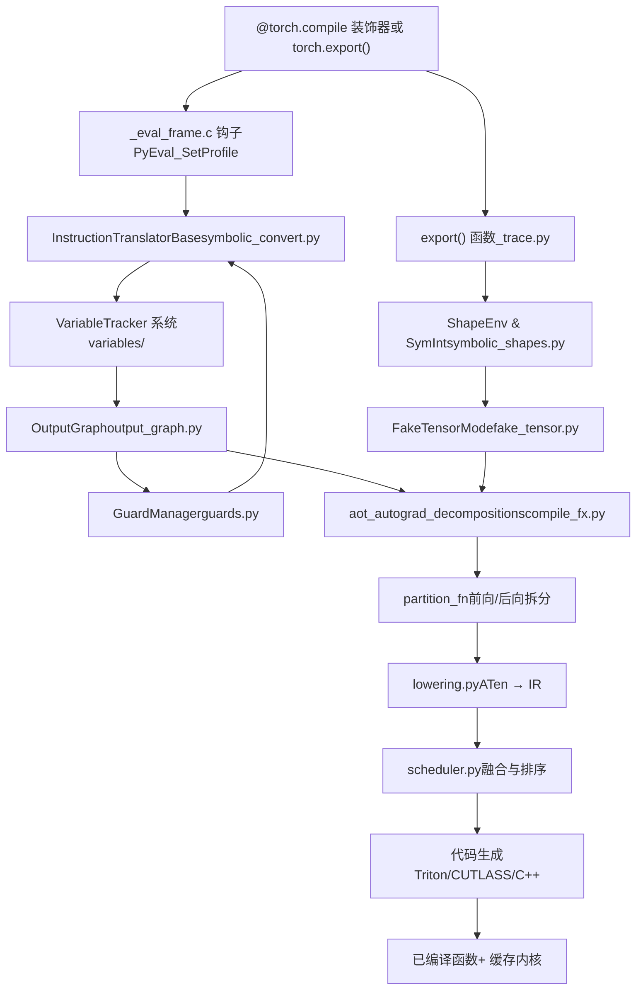
来源： [test/inductor/test\_torchinductor.py1-200](https://github.com/pytorch/pytorch/blob/915982a4/test/inductor/test_torchinductor.py#L1-L200) [torch/\_dynamo/convert\_frame.py1-100](https://github.com/pytorch/pytorch/blob/915982a4/torch/_dynamo/convert_frame.py#L1-L100) [torch/\_inductor/compile\_fx.py1-100](https://github.com/pytorch/pytorch/blob/915982a4/torch/_inductor/compile_fx.py#L1-L100)

---

## 入口点与装饰器 (Entry Points and Decorators)

PyTorch 为编译提供了两个主要入口点：

| 入口点 | 目的 | 严格性 | 使用场景 |
| --- | --- | --- | --- |
| `@torch.compile` | Eager 模式 JIT 编译 | 默认非严格 | 带有图断点的训练与推理 |
| `torch.export()` | 提前图导出 | 严格，无图断点 | 部署与序列化 |

[torch/\_dynamo/eval\_frame.py200-300](https://github.com/pytorch/pytorch/blob/915982a4/torch/_dynamo/eval_frame.py#L200-L300) 中的 `@torch.compile` 装饰器通过 `_eval_frame.c` 安装了一个帧评估钩子，用于拦截 Python 字节码的执行。当被装饰的函数运行时，钩子会重定向到 [torch/\_dynamo/convert\_frame.py100-200](https://github.com/pytorch/pytorch/blob/915982a4/torch/_dynamo/convert_frame.py#L100-L200) 中的 `convert_frame()`。

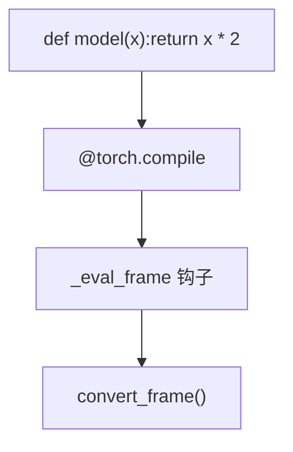
来源： [torch/\_dynamo/eval\_frame.py1-300](https://github.com/pytorch/pytorch/blob/915982a4/torch/_dynamo/eval_frame.py#L1-L300) [torch/\_dynamo/convert\_frame.py1-200](https://github.com/pytorch/pytorch/blob/915982a4/torch/_dynamo/convert_frame.py#L1-L200)

---

## 关键数据结构 (Key Data Structures)

编译系统使用几个核心数据结构来表示程序状态：

### VariableTracker 层级结构

`VariableTracker` 是追踪过程中所有符号值的基类。位于 [torch/\_dynamo/variables/base.py1-200](https://github.com/pytorch/pytorch/blob/915982a4/torch/_dynamo/variables/base.py#L1-L200)，它提供：

-   **来源追踪 (Source tracking)**：值的来源（例如 `LocalSource`、`AttrSource`）。
-   **Guard 安装**：已编译代码有效必须满足的条件。
-   **图重建**：如何在 FX 图中重新创建该值。

关键子类包括：

| 类 | 文件 | 目的 |
| --- | --- | --- |
| `TensorVariable` | [torch/\_dynamo/variables/tensor.py](https://github.com/pytorch/pytorch/blob/915982a4/torch/_dynamo/variables/tensor.py) | 追踪带有形状/数据类型的张量值 |
| `UserFunctionVariable` | [torch/\_dynamo/variables/functions.py](https://github.com/pytorch/pytorch/blob/915982a4/torch/_dynamo/variables/functions.py) | 可以被内联的用户定义函数 |
| `NNModuleVariable` | [torch/\_dynamo/variables/nn\_module.py](https://github.com/pytorch/pytorch/blob/915982a4/torch/_dynamo/variables/nn_module.py) | torch.nn.Module 实例 |
| `BuiltinVariable` | [torch/\_dynamo/variables/builtin.py](https://github.com/pytorch/pytorch/blob/915982a4/torch/_dynamo/variables/builtin.py) | Python 内置函数 |
| `TorchInGraphFunctionVariable` | [torch/\_dynamo/variables/torch.py](https://github.com/pytorch/pytorch/blob/915982a4/torch/_dynamo/variables/torch.py) | torch.\* 操作 |

### OutputGraph 结构

[torch/\_dynamo/output\_graph.py1-500](https://github.com/pytorch/pytorch/blob/915982a4/torch/_dynamo/output_graph.py#L1-L500) 中的 `OutputGraph` 类管理正在构建的 FX 图：

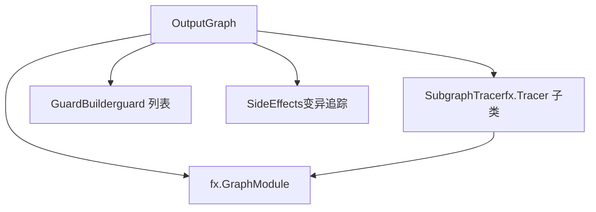
-   `SubgraphTracer`：处理嵌套高阶算子的 FX tracer。
-   `GraphModule`：正在构建的实际 FX 图。
-   `GuardBuilder`：累积用于重新编译检测的 guards。
-   `SideEffects`：追踪变异和副作用。

来源： [torch/\_dynamo/output\_graph.py1-500](https://github.com/pytorch/pytorch/blob/915982a4/torch/_dynamo/output_graph.py#L1-L500) [torch/\_dynamo/guards.py1-300](https://github.com/pytorch/pytorch/blob/915982a4/torch/_dynamo/guards.py#L1-L300)

---

## 字节码分析与符号执行 (Bytecode Analysis and Symbolic Execution)

### 帧拦截 (Frame Interception)

当已编译函数执行时，[torch/\_dynamo/eval\_frame.py200-400](https://github.com/pytorch/pytorch/blob/915982a4/torch/_dynamo/eval_frame.py#L200-L400) 中的 `_eval_frame` 钩子会拦截它。该钩子：

1.  检查 [torch/\_dynamo/convert\_frame.py300-400](https://github.com/pytorch/pytorch/blob/915982a4/torch/_dynamo/convert_frame.py#L300-L400) 中的缓存。
2.  使用 [torch/\_dynamo/symbolic\_convert.py1-500](https://github.com/pytorch/pytorch/blob/915982a4/torch/_dynamo/symbolic_convert.py#L1-L500) 中的 `InstructionTranslatorBase` 分析字节码。
3.  通过 `OutputGraph` 构建 FX 图。
4.  通过后端编译图。
5.  安装 guards 并缓存结果。

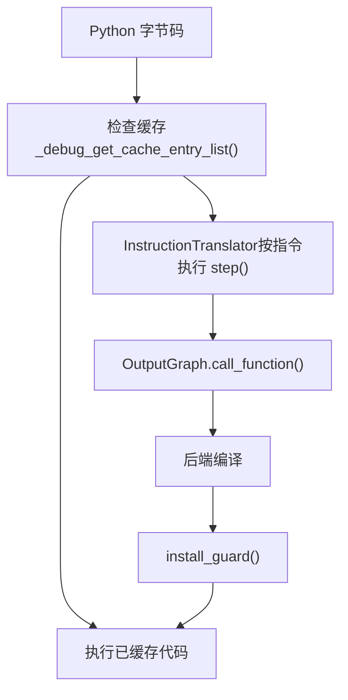
来源： [torch/\_dynamo/convert\_frame.py100-500](https://github.com/pytorch/pytorch/blob/915982a4/torch/_dynamo/convert_frame.py#L100-L500) [torch/\_dynamo/symbolic\_convert.py1-500](https://github.com/pytorch/pytorch/blob/915982a4/torch/_dynamo/symbolic_convert.py#L1-L500)

### 指令转换 (Instruction Translation)

[torch/\_dynamo/symbolic\_convert.py500-2000](https://github.com/pytorch/pytorch/blob/915982a4/torch/_dynamo/symbolic_convert.py#L500-L2000) 中的 `InstructionTranslator` 类实现了一个符号执行 Python 字节码的虚拟机：

**按字节码分类的关键方法：**

| 字节码 | 处理方法 | 目的 |
| --- | --- | --- |
| LOAD\_FAST | `LOAD_FAST()` | 加载局部变量 |
| LOAD\_ATTR | `LOAD_ATTR()` | 获取属性 |
| CALL\_FUNCTION | `CALL_FUNCTION()` | 函数调用 |
| BINARY\_OP | `BINARY_OP()` | 二进制操作 |
| JUMP\_IF\_\* | `JUMP_IF_*()` | 条件分支 |
| FOR\_ITER | `FOR_ITER()` | 循环迭代 |

每个处理器使用 `VariableTracker` 实例操作符号栈。例如，[torch/\_dynamo/symbolic\_convert.py1500-1600](https://github.com/pytorch/pytorch/blob/915982a4/torch/_dynamo/symbolic_convert.py#L1500-L1600) 中的 `LOAD_ATTR()`：

```python
def LOAD_ATTR(self, inst):
    obj = self.pop()  # 从栈中获取对象
    result = obj.var_getattr(self, inst.argval)  # 在 VariableTracker 上调用 getattr
    self.push(result)  # 压入结果
```
### 变量追踪示例 (Variable Tracking Example)

考虑以下代码：

```python
def fn(x):    return x.relu().sum()
```
在符号执行期间：

1.  `x` 通过 `LOAD_FAST` 变为 `TensorVariable`。
2.  `.relu()` → `LOAD_ATTR` 创建 `TorchInGraphFunctionVariable(torch.relu)`。
3.  函数调用 → `CALL_FUNCTION` 向 FX 图添加 `call_function` 节点。
4.  `.sum()` → 求和操作的过程类似。

来源： [torch/\_dynamo/symbolic\_convert.py500-2000](https://github.com/pytorch/pytorch/blob/915982a4/torch/_dynamo/symbolic_convert.py#L500-L2000) [torch/\_dynamo/variables/tensor.py1-500](https://github.com/pytorch/pytorch/blob/915982a4/torch/_dynamo/variables/tensor.py#L1-L500)

---

## Guard 系统 (Guard System)

### 目的

Guards 是运行时检查，用于确保已编译代码保持有效。当 guard 失败时，会根据更新后的假设进行重新编译。

### Guard 类型

位于 [torch/\_dynamo/guards.py1-800](https://github.com/pytorch/pytorch/blob/915982a4/torch/_dynamo/guards.py#L1-L800)：

| Guard 类型 | 类 | 示例 |
| --- | --- | --- |
| 类型 guard | `EQUALS_MATCH` | `type(x) is torch.Tensor` |
| 形状 guard | `SHAPE_MATCH` | `x.shape[0] == 32` |
| 数值 guard | `EQUALS_MATCH` | `config.value == True` |
| 动态形状 | `DYNAMIC_DIM` | `2 <= x.shape[0] <= 1024` |

### Guard 安装流 (Guard Installation Flow)

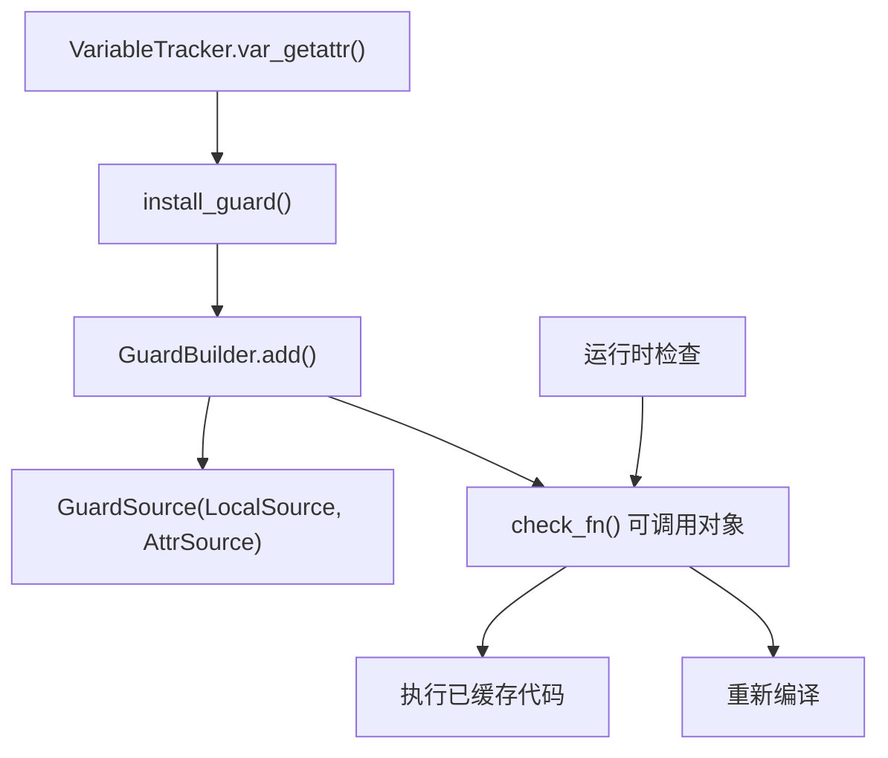
### Guard 创建

访问 `x.shape[0]` 时，Dynamo 会创建：

1.  一个 `x` 的 `TensorVariable`，来源为 `LocalSource("x")`。
2.  一个 `.shape[0]` 的 `SizeVariable`，来源为 `AttrSource(base=x, attr="shape[0]")`。
3.  一个 guard：`LOCAL("x").shape[0] == 32`。

该 guard 存储在 [torch/\_dynamo/output\_graph.py300-400](https://github.com/pytorch/pytorch/blob/915982a4/torch/_dynamo/output_graph.py#L300-L400) 中，并在执行已缓存代码前进行检查。

来源： [torch/\_dynamo/guards.py1-800](https://github.com/pytorch/pytorch/blob/915982a4/torch/_dynamo/guards.py#L1-L800) [torch/\_dynamo/output\_graph.py300-500](https://github.com/pytorch/pytorch/blob/915982a4/torch/_dynamo/output_graph.py#L300-L500)

---

## 图构建 (Graph Construction)

### FX 图表示 (FX Graph Representation)

[torch/fx/graph.py](https://github.com/pytorch/pytorch/blob/915982a4/torch/fx/graph.py) 中的 FX 图代表了计算图：

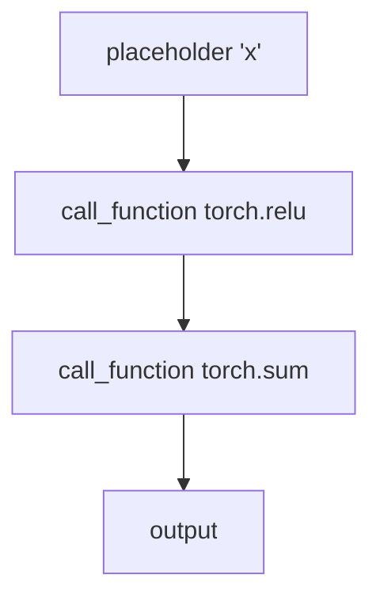
### 节点创建 (Node Creation)

当 [torch/\_dynamo/output\_graph.py800-1000](https://github.com/pytorch/pytorch/blob/915982a4/torch/_dynamo/output_graph.py#L800-L1000) 调用 `OutputGraph.call_function()` 时：

1.  创建一个 `op='call_function'` 的 `fx.Node`。
2.  记录 `target`（函数）、`args` 和 `kwargs`。
3.  将结果包装在适当的 `VariableTracker` 中。
4.  将节点添加到图中。

来自 [torch/\_dynamo/output\_graph.py900-950](https://github.com/pytorch/pytorch/blob/915982a4/torch/_dynamo/output_graph.py#L900-L950) 的示例：

```python
def call_function(self, fn, args, kwargs):
    # 创建 FX 节点
    node = self.create_proxy("call_function", fn, args, kwargs)
    # 包装在 VariableTracker 中
    return wrap_fx_proxy(self, node)
```
### 高阶算子 (Higher-Order Operators)

对于像 `torch.cond` 这样的小阶算子，Dynamo 在 [torch/\_dynamo/output\_graph.py1500-1800](https://github.com/pytorch/pytorch/blob/915982a4/torch/_dynamo/output_graph.py#L1500-L1800) 中使用嵌套的 `SubgraphTracer` 实例：

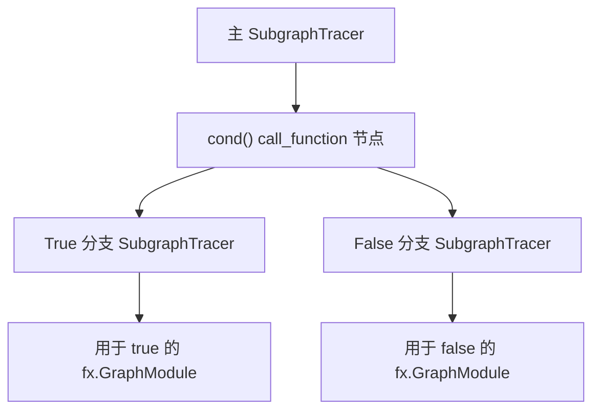
来源： [torch/\_dynamo/output\_graph.py1-2000](https://github.com/pytorch/pytorch/blob/915982a4/torch/_dynamo/output_graph.py#L1-L2000) [torch/\_dynamo/variables/higher\_order\_ops.py1-500](https://github.com/pytorch/pytorch/blob/915982a4/torch/_dynamo/variables/higher_order_ops.py#L1-L500)

---

## 专业化与重新编译 (Specialization and Recompilation)

### 缓存结构 (Cache Structure)

每个函数在 [torch/\_dynamo/eval\_frame.py500-700](https://github.com/pytorch/pytorch/blob/915982a4/torch/_dynamo/eval_frame.py#L500-L700) 中都有一个缓存，其键为：

-   Guard 检查结果。
-   输入形状（当为动态时）。
-   代码对象标识 (identity)。

### 重新编译触发器 (Recompilation Triggers)

根据 [torch/\_dynamo/convert\_frame.py200-300](https://github.com/pytorch/pytorch/blob/915982a4/torch/_dynamo/convert_frame.py#L200-L300)，重新编译发生在：

1.  **Guard 失败**：guard 检查返回 `False`。
2.  **新代码路径**：遇到之前未见过的分支。
3.  **形状改变**：输入形状超出动态范围。
4.  **类型改变**：输入类型不同。

### 推测与回滚 (Speculation and Rollback)

[torch/\_dynamo/symbolic\_convert.py270-310](https://github.com/pytorch/pytorch/blob/915982a4/torch/_dynamo/symbolic_convert.py#L270-L310) 中的 `SpeculationLog` 处理失败的推测：

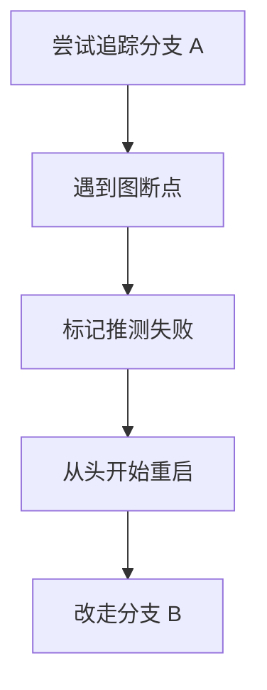
当推测失败时，分析会从函数开头重启，但避开失败的路径。

来源： [torch/\_dynamo/symbolic\_convert.py270-350](https://github.com/pytorch/pytorch/blob/915982a4/torch/_dynamo/symbolic_convert.py#L270-L350) [torch/\_dynamo/convert\_frame.py200-400](https://github.com/pytorch/pytorch/blob/915982a4/torch/_dynamo/convert_frame.py#L200-L400)

---

## 图断点 (Graph Breaks)

### 定义

图断点是指当 Dynamo 遇到不支持的模式时，将编译拆分为多个图。

### 常见原因

来自 [torch/\_dynamo/graph\_break\_registry.json1-100](https://github.com/pytorch/pytorch/blob/915982a4/torch/_dynamo/graph_break_registry.json#L1-L100)：

| 类别 | 示例 | 原因 |
| --- | --- | --- |
| 不支持的操作 | `pdb.set_trace()` | 不可追踪 |
| 动态控制流 | `if x.item() > 0` | 数据依赖的分支 |
| 副作用 | `print(x)` | 外部 I/O |
| 不支持的类型 | 自定义 C++ 扩展 | 无追踪支持 |

### 图断点处理 (Graph Break Handling)

来自 [torch/\_dynamo/symbolic\_convert.py3000-3200](https://github.com/pytorch/pytorch/blob/915982a4/torch/_dynamo/symbolic_convert.py#L3000-L3200)：

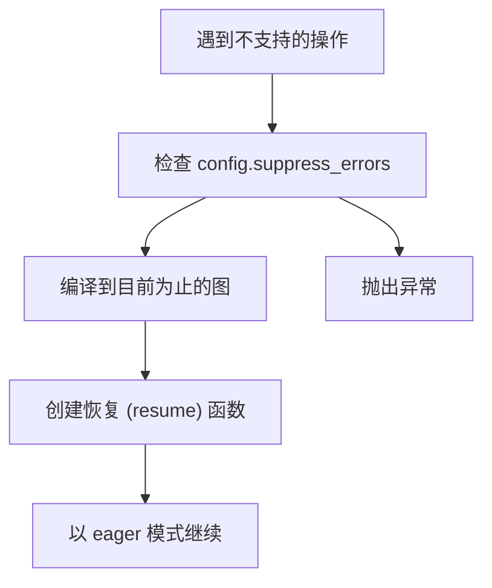
[torch/\_dynamo/resume\_execution.py1-300](https://github.com/pytorch/pytorch/blob/915982a4/torch/_dynamo/resume_execution.py#L1-L300) 中的恢复函数在图断点之后以 eager 模式继续执行。

来源： [torch/\_dynamo/symbolic\_convert.py3000-3500](https://github.com/pytorch/pytorch/blob/915982a4/torch/_dynamo/symbolic_convert.py#L3000-L3500) [torch/\_dynamo/resume\_execution.py1-300](https://github.com/pytorch/pytorch/blob/915982a4/torch/_dynamo/resume_execution.py#L1-L300)

---

## 符号形状 (Symbolic Shapes)

### ShapeEnv

[torch/fx/experimental/symbolic\_shapes.py1-1000](https://github.com/pytorch/pytorch/blob/915982a4/torch/fx/experimental/symbolic_shapes.py#L1-L1000) 中的 `ShapeEnv` 类追踪符号形状约束：

-   维护从 `SymInt` 到 `sympy.Expr` 的映射。
-   记录约束，如 `s0 >= 2`。
-   在需要时使用 Z3 求解器评估谓词。

### SymInt 系统

[torch/fx/experimental/symbolic\_shapes.py2000-2500](https://github.com/pytorch/pytorch/blob/915982a4/torch/fx/experimental/symbolic_shapes.py#L2000-L2500) 中的 `SymInt` 代表符号整数值：

```python
x = torch.randn(n, 10)  # n 是 SymInt
result = x.sum()  # 形状被符号化地追踪
```
在追踪期间：

1.  `n` 变成由 `sympy.Symbol("s0")` 支持的 `SymInt`。
2.  在 `n` 上的操作创建 `sympy` 表达式。
3.  `ShapeEnv` 追踪约束：`s0 >= 0`。

### FakeTensorMode

[torch/\_subclasses/fake\_tensor.py1-500](https://github.com/pytorch/pytorch/blob/915982a4/torch/_subclasses/fake_tensor.py#L1-L500) 中的 `FakeTensorMode` 在不具象化（materialize）张量的情况下实现形状推断：

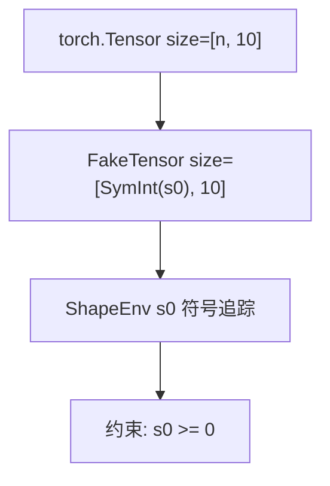
在 `FakeTensor` 上的操作无需执行内核即可传播符号形状。

来源： [torch/fx/experimental/symbolic\_shapes.py1-3000](https://github.com/pytorch/pytorch/blob/915982a4/torch/fx/experimental/symbolic_shapes.py#L1-L3000) [torch/\_subclasses/fake\_tensor.py1-800](https://github.com/pytorch/pytorch/blob/915982a4/torch/_subclasses/fake_tensor.py#L1-L800)

---

## 降低为 Inductor IR (Lowering to Inductor IR)

### ATen → Inductor IR

[torch/\_inductor/lowering.py1-500](https://github.com/pytorch/pytorch/blob/915982a4/torch/_inductor/lowering.py#L1-L500) 中的降低过程将 ATen 操作转换为 Inductor 的 IR：

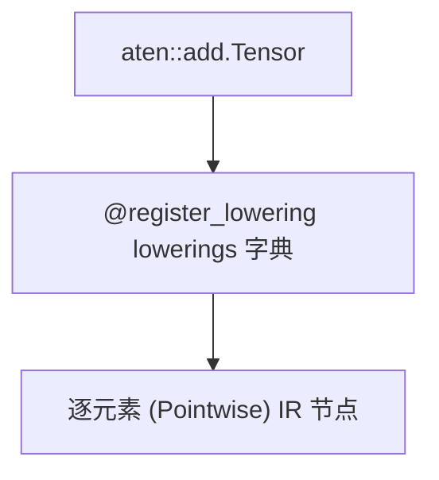
### IR 节点类型 (IR Node Types)

来自 [torch/\_inductor/ir.py1-1000](https://github.com/pytorch/pytorch/blob/915982a4/torch/_inductor/ir.py#L1-L1000)：

| IR 节点 | 目的 | 示例 |
| --- | --- | --- |
| `Pointwise` | 逐元素操作 | `x + y` |
| `Reduction` | 归约操作 | `x.sum()` |
| `ComputedBuffer` | 中间张量 | 临时存储 |
| `InputBuffer` | 图输入 | 函数参数 |
| `ExternKernel` | 外部调用 | cuBLAS |

### 降低规则注册 (Lowering Registration)

降低规则注册在 [torch/\_inductor/lowering.py500-1000](https://github.com/pytorch/pytorch/blob/915982a4/torch/_inductor/lowering.py#L500-L1000)：

```python
@register_lowering(aten.add)
def add(x, y):    
    return ops.add(x, y)  # 创建 Pointwise IR
```
`ops` 对象分发到设备特定的实现。

### 示例：矩阵乘法 (Matrix Multiplication)

对于 `torch.mm`，在 [torch/\_inductor/lowering.py2000-2500](https://github.com/pytorch/pytorch/blob/915982a4/torch/_inductor/lowering.py#L2000-L2500) 中的降低规则：

1.  检查模板（CUTLASS, Triton MM）。
2.  考虑 [torch/\_inductor/kernel/mm.py](https://github.com/pytorch/pytorch/blob/915982a4/torch/_inductor/kernel/mm.py) 中的已调优实现。
3.  如果需要，回退到 ATen。
4.  为 cuBLAS/MKL 返回 `ExternKernelCaller` 或模板调用器。

来源： [torch/\_inductor/lowering.py1-3000](https://github.com/pytorch/pytorch/blob/915982a4/torch/_inductor/lowering.py#L1-L3000) [torch/\_inductor/ir.py1-5000](https://github.com/pytorch/pytorch/blob/915982a4/torch/_inductor/ir.py#L1-L5000)

---

## 调度与融合 (Scheduling and Fusion)

### 调度器架构 (Scheduler Architecture)

[torch/\_inductor/scheduler.py1-500](https://github.com/pytorch/pytorch/blob/915982a4/torch/_inductor/scheduler.py#L1-L500) 中的 `Scheduler` 类协调内核融合：

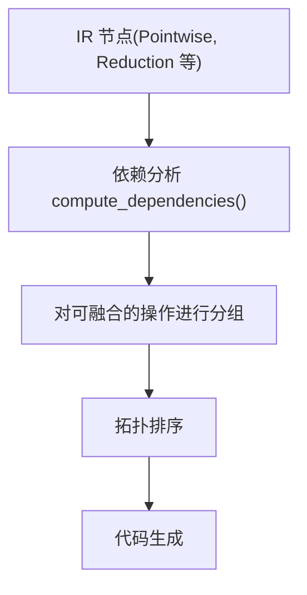
### 融合决策 (Fusion Decisions)

根据 [torch/\_inductor/scheduler.py1000-1500](https://github.com/pytorch/pytorch/blob/915982a4/torch/_inductor/scheduler.py#L1000-L1500)，融合会考虑：

1.  **内存依赖**：操作能否共享内存？
2.  **设备兼容性**：是否为同一设备？
3.  **迭代空间**：循环结构是否兼容？
4.  **Buffer 复用**：能否消除中间 Buffer？

### BaseSchedulerNode

每个 IR 节点在 [torch/\_inductor/scheduler.py200-400](https://github.com/pytorch/pytorch/blob/915982a4/torch/_inductor/scheduler.py#L200-L400) 中变为一个 `BaseSchedulerNode`：

-   `SchedulerNode`：单个操作。
-   `FusedSchedulerNode`：多个融合的操作。
-   `ExternKernelSchedulerNode`：外部内核调用。

### 融合示例 (Fusion Example)

对于 `(x + y).relu()`：

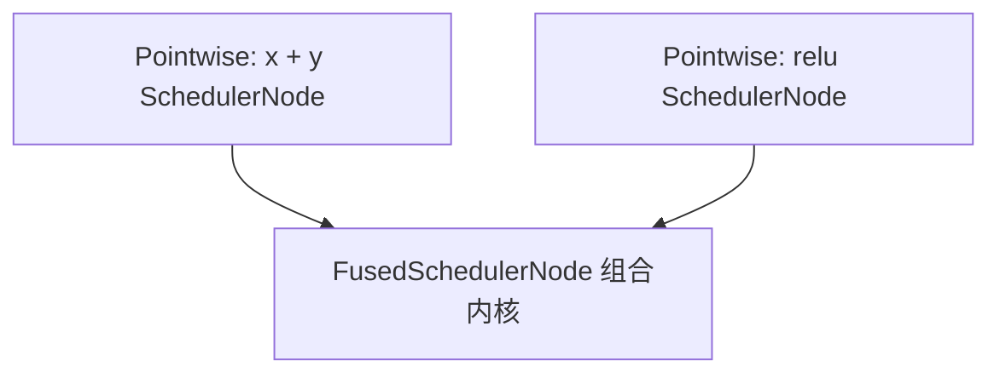
两个操作都融合成一个 Triton 内核。

来源： [torch/\_inductor/scheduler.py1-3000](https://github.com/pytorch/pytorch/blob/915982a4/torch/_inductor/scheduler.py#L1-L3000)

---

## 代码生成 (Code Generation)

### 后端 (Backends)

TorchInductor 支持多个代码生成后端：

| 后端 | 实现 | 使用场景 |
| --- | --- | --- |
| Triton | [torch/\_inductor/codegen/triton.py](https://github.com/pytorch/pytorch/blob/915982a4/torch/_inductor/codegen/triton.py) | GPU 内核 |
| CUTLASS | [torch/\_inductor/codegen/cutlass/](https://github.com/pytorch/pytorch/blob/915982a4/torch/_inductor/codegen/cutlass/) | NVIDIA GEMM |
| C++ | [torch/\_inductor/codegen/cpp.py](https://github.com/pytorch/pytorch/blob/915982a4/torch/_inductor/codegen/cpp.py) | CPU 内核 |

### Triton 代码生成 (Triton Code Generation)

[torch/\_inductor/codegen/triton.py1-1000](https://github.com/pytorch/pytorch/blob/915982a4/torch/_inductor/codegen/triton.py#L1-L1000) 中的 `TritonKernel` 类生成 Triton 代码：

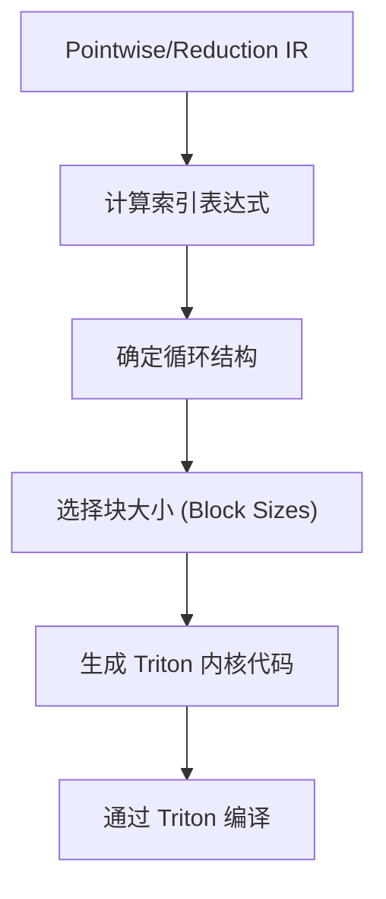
### Triton 模板示例 (Triton Template Example)

对于矩阵乘法，[torch/\_inductor/codegen/triton\_templates.py1-500](https://github.com/pytorch/pytorch/blob/915982a4/torch/_inductor/codegen/triton_templates.py#L1-L500) 提供了模板：

```python
@triton.jit
def matmul_kernel(A, B, C, M, N, K, ...):    
    # 带有占位符的模板代码    
    pid = tl.program_id(0)    
    # ... 块计算
```
### 自动调优 (Autotuning)

[torch/\_inductor/runtime/triton\_heuristics.py300-500](https://github.com/pytorch/pytorch/blob/915982a4/torch/_inductor/runtime/triton_heuristics.py#L300-L500) 中的 `CachingAutotuner` 对多个配置进行基准测试：

1.  生成配置（块大小、warps、stages）。
2.  编译每个变体。
3.  在实际硬件上进行基准测试。
4.  将最佳配置缓存在 [torch/\_inductor/autotune\_cache.py](https://github.com/pytorch/pytorch/blob/915982a4/torch/_inductor/autotune_cache.py) 中。

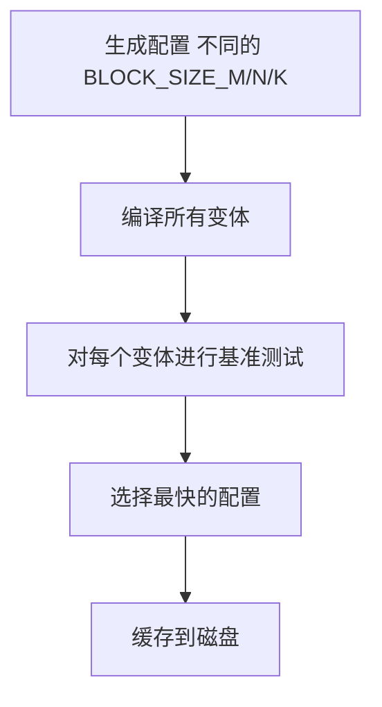
来源： [torch/\_inductor/codegen/triton.py1-3000](https://github.com/pytorch/pytorch/blob/915982a4/torch/_inductor/codegen/triton.py#L1-L3000) [torch/\_inductor/runtime/triton\_heuristics.py1-2000](https://github.com/pytorch/pytorch/blob/915982a4/torch/_inductor/runtime/triton_heuristics.py#L1-L2000)

---

## 包装代码生成 (Wrapper Code Generation)

### 目的

[torch/\_inductor/codegen/wrapper.py1-500](https://github.com/pytorch/pytorch/blob/915982a4/torch/_inductor/codegen/wrapper.py#L1-L500) 中的包装器生成的 Python 代码用于：

1.  分配输出张量。
2.  调用生成的内核。
3.  处理内存管理。
4.  管理 CUDA 流 (streams)/图 (graphs)。

### PythonWrapperCodegen

来自 [torch/\_inductor/codegen/wrapper.py500-1000](https://github.com/pytorch/pytorch/blob/915982a4/torch/_inductor/codegen/wrapper.py#L500-L1000)：

```python
def codegen_allocation(self, buffer):    
    # 生成: empty_strided(size, stride, ...)    
    size = buffer.get_size()    
    stride = buffer.get_stride()    
    return f"torch.empty_strided({size}, {stride}, ...)"

def codegen_kernel_call(self, kernel):    
    # 生成: kernel.run(args, grid, stream)    
    return f"{kernel.name}.run(...)"
```
### 生成的包装器示例 (Generated Wrapper Example)

对于 `(x + y).relu()`，包装器生成：

```python
def forward(x, y):    
    # 分配    
    buf0 = torch.empty_strided((100,), (1,), device='cuda')    
    # 内核调用    
    triton_poi_fused_add_relu_0.run(x, y, buf0, 100, grid=...)    
    return buf0
```
来源： [torch/\_inductor/codegen/wrapper.py1-3000](https://github.com/pytorch/pytorch/blob/915982a4/torch/_inductor/codegen/wrapper.py#L1-L3000)

---

## 编译缓存 (Compilation Cache)

### 缓存层 (Cache Layers)

多层缓存避免了重新编译：

| 缓存 | 文件 | 目的 |
| --- | --- | --- |
| FXGraphCache | [torch/\_inductor/fx\_passes/fxgraph\_cache.py](https://github.com/pytorch/pytorch/blob/915982a4/torch/_inductor/fx_passes/fxgraph_cache.py) | 缓存 FX 图 |
| PyCodeCache | [torch/\_inductor/codecache.py1000-1500](https://github.com/pytorch/pytorch/blob/915982a4/torch/_inductor/codecache.py#L1000-L1500) | 缓存 Python 包装代码 |
| TritonCodeCache | [torch/\_inductor/codecache.py2000-2500](https://github.com/pytorch/pytorch/blob/915982a4/torch/_inductor/codecache.py#L2000-L2500) | 缓存已编译的 Triton 内核 |
| AutotuneCache | [torch/\_inductor/autotune\_cache.py](https://github.com/pytorch/pytorch/blob/915982a4/torch/_inductor/autotune_cache.py) | 缓存自动调优结果 |

### 缓存键生成 (Cache Key Generation)

来自 [torch/\_inductor/codecache.py500-700](https://github.com/pytorch/pytorch/blob/915982a4/torch/_inductor/codecache.py#L500-L700)：

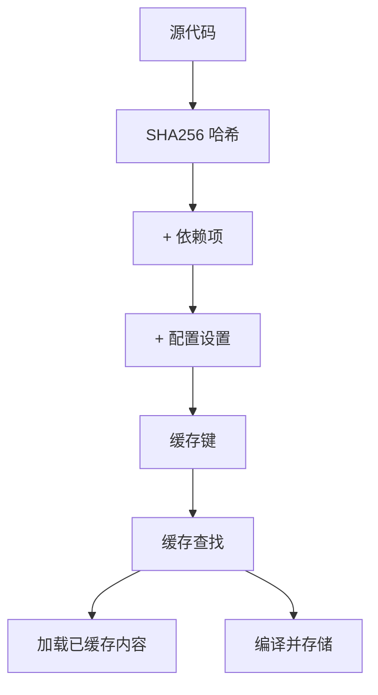
### FXGraphCache 细节 (FXGraphCache Details)

[torch/\_inductor/fx\_passes/fxgraph\_cache.py1-500](https://github.com/pytorch/pytorch/blob/915982a4/torch/_inductor/fx_passes/fxgraph_cache.py#L1-L500) 中的 FX 图缓存存储：

-   序列化的 FX 图。
-   Guard 条件。
-   已编译伪影。
-   元数据（形状、设备等）。

若缓存命中，则完全绕过 Dynamo/AOTAutograd。

来源： [torch/\_inductor/codecache.py1-3000](https://github.com/pytorch/pytorch/blob/915982a4/torch/_inductor/codecache.py#L1-L3000) [torch/\_inductor/fx\_passes/fxgraph\_cache.py1-800](https://github.com/pytorch/pytorch/blob/915982a4/torch/_inductor/fx_passes/fxgraph_cache.py#L1-L800)

---

## 配置系统 (Configuration System)

### torch.\_inductor.config

[torch/\_inductor/config.py1-500](https://github.com/pytorch/pytorch/blob/915982a4/torch/_inductor/config.py#L1-L500) 中的配置模块提供了相关设置：

```python
# 设置示例
config.max_autotune = True  # 启用自动调优
config.triton.cudagraphs = True  # 使用 CUDA 图
config.freezing = True  # 冻结权重
```
### 重要标志位 (Important Flags)

来自 [torch/\_inductor/config.py100-300](https://github.com/pytorch/pytorch/blob/915982a4/torch/_inductor/config.py#L100-L300)：

| 标志位 | 目的 | 默认值 |
| --- | --- | --- |
| `max_autotune` | 启用（慢速）自动调优 | False |
| `max_autotune_gemm` | 仅对 GEMM 进行自动调优 | False |
| `triton.cudagraphs` | 使用 CUDA 图 | True |
| `cpp_wrapper` | 生成 C++ 包装器 | False |
| `freezing` | 冻结参数 | False |

### 动态配置 (Dynamic Configuration)

可以临时对设置进行修补 (patch)：

```python
with config.patch({"max_autotune": True}):    
    torch.compile(model)(inputs)
```
来源： [torch/\_inductor/config.py1-1000](https://github.com/pytorch/pytorch/blob/915982a4/torch/_inductor/config.py#L1-L1000)

---

## 性能分析 (Performance Profiling)

### 编译指标 (Compilation Metrics)

来自 [torch/\_inductor/metrics.py](https://github.com/pytorch/pytorch/blob/915982a4/torch/_inductor/metrics.py)：

-   `generated_kernel_count`：生成的内核数量。
-   `generated_cpp_vec_kernel_count`：向量化 CPU 内核。
-   `inductor_time`：总编译时间。
-   `code_gen_time`：代码生成时间。

### 基准测试 (Benchmarking)

[torch/\_inductor/runtime/benchmarking.py1-300](https://github.com/pytorch/pytorch/blob/915982a4/torch/_inductor/runtime/benchmarking.py#L1-L300) 中的基准测试系统衡量：

1.  内核执行时间。
2.  内存带宽利用率。
3.  达到的 FLOPS。

### 日志记录 (Logging)

[torch/\_inductor/utils.py100-200](https://github.com/pytorch/pytorch/blob/915982a4/torch/_inductor/utils.py#L100-L200) 中的关键日志记录器 (loggers)：

-   `torch._inductor.scheduler`：调度决策。
-   `torch._inductor.fusion`：融合决策。
-   `torch._inductor.select_algorithm`：算法选择。

启用方式：

```python
torch._logging.set_logs(inductor=logging.DEBUG)
```
来源： [torch/\_inductor/metrics.py1-200](https://github.com/pytorch/pytorch/blob/915982a4/torch/_inductor/metrics.py#L1-L200) [torch/\_inductor/runtime/benchmarking.py1-500](https://github.com/pytorch/pytorch/blob/915982a4/torch/_inductor/runtime/benchmarking.py#L1-L500)

---

## 测试基础设施 (Testing Infrastructure)

### 测试组织 (Test Organization)

编译测试位于：

-   [test/inductor/test\_torchinductor.py1-1000](https://github.com/pytorch/pytorch/blob/915982a4/test/inductor/test_torchinductor.py#L1-L1000)：核心 Inductor 功能。
-   [test/inductor/test\_aot\_inductor.py1-500](https://github.com/pytorch/pytorch/blob/915982a4/test/inductor/test_aot_inductor.py#L1-L500)：AOT 编译。
-   [test/export/test\_export.py1-500](https://github.com/pytorch/pytorch/blob/915982a4/test/export/test_export.py#L1-L500)：导出功能。
-   [test/dynamo/test\_misc.py1-500](https://github.com/pytorch/pytorch/blob/915982a4/test/dynamo/test_misc.py#L1-L500)：Dynamo 追踪。

### 辅助函数 (Helper Functions)

来自 [test/inductor/test\_torchinductor.py400-500](https://github.com/pytorch/pytorch/blob/915982a4/test/inductor/test_torchinductor.py#L400-L500)：

```python
def check_model(self, model, inputs):    
    # 比较 eager 模式与已编译版本    
    expected = model(*inputs)    
    compiled = torch.compile(model)    
    actual = compiled(*inputs)    
    self.assertEqual(expected, actual)
```
### OpInfo 数据库 (OpInfo Database)

[torch/testing/\_internal/common\_methods\_invocations.py](https://github.com/pytorch/pytorch/blob/915982a4/torch/testing/_internal/common_methods_invocations.py) 中的 OpInfo 系统提供：

-   1000+ 个算子定义。
-   样本输入生成器。
-   预期输出。
-   设备兼容性信息。

来源： [test/inductor/test\_torchinductor.py1-2000](https://github.com/pytorch/pytorch/blob/915982a4/test/inductor/test_torchinductor.py#L1-L2000) [test/export/test\_export.py1-1000](https://github.com/pytorch/pytorch/blob/915982a4/test/export/test_export.py#L1-L1000)

---

## 调试工具 (Debugging Tools)

### 图可视化 (Graph Visualization)

```python
# 打印 FX 图
print(exported_program.graph)

# 通过 GraphViz 可视化
exported_program.graph.print_tabular()
```
### 中间输出 (Intermediate Outputs)

来自 [torch/\_inductor/utils.py500-700](https://github.com/pytorch/pytorch/blob/915982a4/torch/_inductor/utils.py#L500-L700)：

```python
# 获取生成的代码
code = run_and_get_code(torch.compile(model), inputs)
print(code[0])  # 包装器代码
print(code[1])  # 内核代码
```
### 最小化工具 (Minifier)

[torch/\_dynamo/debug\_utils.py](https://github.com/pytorch/pytorch/blob/915982a4/torch/_dynamo/debug_utils.py) 中的最小化工具会自动精简失败用例：

```python
# 发生编译错误时，自动运行最小化工具
# 在 /tmp/minifier_* 中生成最小复现用例
```
### 图断点日志 (Graph Break Logging)

来自 [torch/\_dynamo/utils.py1000-1200](https://github.com/pytorch/pytorch/blob/915982a4/torch/_dynamo/utils.py#L1000-L1200)：

```python
import torch._dynamo
torch._dynamo.config.verbose = True  # 记录图断点
torch._dynamo.explain(model)(inputs)  # 解释断点发生的原因
```
来源： [torch/\_inductor/utils.py1-200](https://github.com/pytorch/pytorch/blob/915982a4/torch/_inductor/utils.py#L1-L200) [torch/\_dynamo/debug\_utils.py1-500](https://github.com/pytorch/pytorch/blob/915982a4/torch/_dynamo/debug_utils.py#L1-L500)
