# torch.compile 流水线概览 (torch.compile Pipeline Overview)

相关源文件 (Relevant source files)

-   [.ci/docker/ci\_commit\_pins/torchbench.txt](https://github.com/pytorch/pytorch/blob/915982a4/.ci/docker/ci_commit_pins/torchbench.txt)
-   [aten/src/ATen/core/PythonFallbackKernel.cpp](https://github.com/pytorch/pytorch/blob/915982a4/aten/src/ATen/core/PythonFallbackKernel.cpp)
-   [aten/src/ATen/native/TensorCompare.cpp](https://github.com/pytorch/pytorch/blob/915982a4/aten/src/ATen/native/TensorCompare.cpp)
-   [test/distributed/\_composable/fsdp/test\_fully\_shard\_compile.py](https://github.com/pytorch/pytorch/blob/915982a4/test/distributed/_composable/fsdp/test_fully_shard_compile.py)
-   [test/distributed/tensor/test\_dtensor\_export.py](https://github.com/pytorch/pytorch/blob/915982a4/test/distributed/tensor/test_dtensor_export.py)
-   [test/dynamo/test\_activation\_checkpointing.py](https://github.com/pytorch/pytorch/blob/915982a4/test/dynamo/test_activation_checkpointing.py)
-   [test/dynamo/test\_activation\_offloading.py](https://github.com/pytorch/pytorch/blob/915982a4/test/dynamo/test_activation_offloading.py)
-   [test/dynamo/test\_aot\_autograd.py](https://github.com/pytorch/pytorch/blob/915982a4/test/dynamo/test_aot_autograd.py)
-   [test/dynamo/test\_dicts.py](https://github.com/pytorch/pytorch/blob/915982a4/test/dynamo/test_dicts.py)
-   [test/dynamo/test\_error\_messages.py](https://github.com/pytorch/pytorch/blob/915982a4/test/dynamo/test_error_messages.py)
-   [test/dynamo/test\_functions.py](https://github.com/pytorch/pytorch/blob/915982a4/test/dynamo/test_functions.py)
-   [test/dynamo/test\_fwd\_loss\_bwd.py](https://github.com/pytorch/pytorch/blob/915982a4/test/dynamo/test_fwd_loss_bwd.py)
-   [test/dynamo/test\_list.py](https://github.com/pytorch/pytorch/blob/915982a4/test/dynamo/test_list.py)
-   [test/dynamo/test\_misc.py](https://github.com/pytorch/pytorch/blob/915982a4/test/dynamo/test_misc.py)
-   [test/dynamo/test\_modules.py](https://github.com/pytorch/pytorch/blob/915982a4/test/dynamo/test_modules.py)
-   [test/dynamo/test\_nested\_graph\_breaks.py](https://github.com/pytorch/pytorch/blob/915982a4/test/dynamo/test_nested_graph_breaks.py)
-   [test/dynamo/test\_repros.py](https://github.com/pytorch/pytorch/blob/915982a4/test/dynamo/test_repros.py)
-   [test/dynamo/test\_utils.py](https://github.com/pytorch/pytorch/blob/915982a4/test/dynamo/test_utils.py)
-   [test/dynamo\_expected\_failures/TestCustomOp.test\_impl\_device\_cpu](https://github.com/pytorch/pytorch/blob/915982a4/test/dynamo_expected_failures/TestCustomOp.test_impl_device_cpu)
-   [test/export/test\_experimental.py](https://github.com/pytorch/pytorch/blob/915982a4/test/export/test_experimental.py)
-   [test/export/test\_export.py](https://github.com/pytorch/pytorch/blob/915982a4/test/export/test_export.py)
-   [test/functorch/test\_aotdispatch.py](https://github.com/pytorch/pytorch/blob/915982a4/test/functorch/test_aotdispatch.py)
-   [test/fx/test\_fx\_xform\_observer.py](https://github.com/pytorch/pytorch/blob/915982a4/test/fx/test_fx_xform_observer.py)
-   [test/inductor/test\_aot\_inductor.py](https://github.com/pytorch/pytorch/blob/915982a4/test/inductor/test_aot_inductor.py)
-   [test/inductor/test\_combo\_kernels.py](https://github.com/pytorch/pytorch/blob/915982a4/test/inductor/test_combo_kernels.py)
-   [test/inductor/test\_custom\_op\_autotune.py](https://github.com/pytorch/pytorch/blob/915982a4/test/inductor/test_custom_op_autotune.py)
-   [test/inductor/test\_foreach.py](https://github.com/pytorch/pytorch/blob/915982a4/test/inductor/test_foreach.py)
-   [test/inductor/test\_max\_autotune.py](https://github.com/pytorch/pytorch/blob/915982a4/test/inductor/test_max_autotune.py)
-   [test/inductor/test\_mmdecomp.py](https://github.com/pytorch/pytorch/blob/915982a4/test/inductor/test_mmdecomp.py)
-   [test/inductor/test\_torchinductor.py](https://github.com/pytorch/pytorch/blob/915982a4/test/inductor/test_torchinductor.py)
-   [test/inductor/test\_torchinductor\_codegen\_dynamic\_shapes.py](https://github.com/pytorch/pytorch/blob/915982a4/test/inductor/test_torchinductor_codegen_dynamic_shapes.py)
-   [test/profiler/test\_record\_function.py](https://github.com/pytorch/pytorch/blob/915982a4/test/profiler/test_record_function.py)
-   [test/profiler/test\_torch\_tidy.py](https://github.com/pytorch/pytorch/blob/915982a4/test/profiler/test_torch_tidy.py)
-   [test/test\_autograd\_fallback.py](https://github.com/pytorch/pytorch/blob/915982a4/test/test_autograd_fallback.py)
-   [test/test\_dynamic\_shapes.py](https://github.com/pytorch/pytorch/blob/915982a4/test/test_dynamic_shapes.py)
-   [test/test\_proxy\_tensor.py](https://github.com/pytorch/pytorch/blob/915982a4/test/test_proxy_tensor.py)
-   [torch/\_dynamo/bytecode\_analysis.py](https://github.com/pytorch/pytorch/blob/915982a4/torch/_dynamo/bytecode_analysis.py)
-   [torch/\_dynamo/bytecode\_transformation.py](https://github.com/pytorch/pytorch/blob/915982a4/torch/_dynamo/bytecode_transformation.py)
-   [torch/\_dynamo/codegen.py](https://github.com/pytorch/pytorch/blob/915982a4/torch/_dynamo/codegen.py)
-   [torch/\_dynamo/config.py](https://github.com/pytorch/pytorch/blob/915982a4/torch/_dynamo/config.py)
-   [torch/\_dynamo/convert\_frame.py](https://github.com/pytorch/pytorch/blob/915982a4/torch/_dynamo/convert_frame.py)
-   [torch/\_dynamo/eval\_frame.py](https://github.com/pytorch/pytorch/blob/915982a4/torch/_dynamo/eval_frame.py)
-   [torch/\_dynamo/exc.py](https://github.com/pytorch/pytorch/blob/915982a4/torch/_dynamo/exc.py)
-   [torch/\_dynamo/functional\_export.py](https://github.com/pytorch/pytorch/blob/915982a4/torch/_dynamo/functional_export.py)
-   [torch/\_dynamo/graph\_break\_registry.json](https://github.com/pytorch/pytorch/blob/915982a4/torch/_dynamo/graph_break_registry.json)
-   [torch/\_dynamo/output\_graph.py](https://github.com/pytorch/pytorch/blob/915982a4/torch/_dynamo/output_graph.py)
-   [torch/\_dynamo/resume\_execution.py](https://github.com/pytorch/pytorch/blob/915982a4/torch/_dynamo/resume_execution.py)
-   [torch/\_dynamo/side\_effects.py](https://github.com/pytorch/pytorch/blob/915982a4/torch/_dynamo/side_effects.py)
-   [torch/\_dynamo/symbolic\_convert.py](https://github.com/pytorch/pytorch/blob/915982a4/torch/_dynamo/symbolic_convert.py)
-   [torch/\_dynamo/test\_case.py](https://github.com/pytorch/pytorch/blob/915982a4/torch/_dynamo/test_case.py)
-   [torch/\_dynamo/testing.py](https://github.com/pytorch/pytorch/blob/915982a4/torch/_dynamo/testing.py)
-   [torch/\_dynamo/trace\_rules.py](https://github.com/pytorch/pytorch/blob/915982a4/torch/_dynamo/trace_rules.py)
-   [torch/\_dynamo/utils.py](https://github.com/pytorch/pytorch/blob/915982a4/torch/_dynamo/utils.py)
-   [torch/\_dynamo/variables/\_\_init\_\_.py](https://github.com/pytorch/pytorch/blob/915982a4/torch/_dynamo/variables/__init__.py)
-   [torch/\_dynamo/variables/base.py](https://github.com/pytorch/pytorch/blob/915982a4/torch/_dynamo/variables/base.py)
-   [torch/\_dynamo/variables/builder.py](https://github.com/pytorch/pytorch/blob/915982a4/torch/_dynamo/variables/builder.py)
-   [torch/\_dynamo/variables/builtin.py](https://github.com/pytorch/pytorch/blob/915982a4/torch/_dynamo/variables/builtin.py)
-   [torch/\_dynamo/variables/constant.py](https://github.com/pytorch/pytorch/blob/915982a4/torch/_dynamo/variables/constant.py)
-   [torch/\_dynamo/variables/ctx\_manager.py](https://github.com/pytorch/pytorch/blob/915982a4/torch/_dynamo/variables/ctx_manager.py)
-   [torch/\_dynamo/variables/dicts.py](https://github.com/pytorch/pytorch/blob/915982a4/torch/_dynamo/variables/dicts.py)
-   [torch/\_dynamo/variables/functions.py](https://github.com/pytorch/pytorch/blob/915982a4/torch/_dynamo/variables/functions.py)
-   [torch/\_dynamo/variables/higher\_order\_ops.py](https://github.com/pytorch/pytorch/blob/915982a4/torch/_dynamo/variables/higher_order_ops.py)
-   [torch/\_dynamo/variables/iter.py](https://github.com/pytorch/pytorch/blob/915982a4/torch/_dynamo/variables/iter.py)
-   [torch/\_dynamo/variables/lists.py](https://github.com/pytorch/pytorch/blob/915982a4/torch/_dynamo/variables/lists.py)
-   [torch/\_dynamo/variables/misc.py](https://github.com/pytorch/pytorch/blob/915982a4/torch/_dynamo/variables/misc.py)
-   [torch/\_dynamo/variables/nn\_module.py](https://github.com/pytorch/pytorch/blob/915982a4/torch/_dynamo/variables/nn_module.py)
-   [torch/\_dynamo/variables/optimizer.py](https://github.com/pytorch/pytorch/blob/915982a4/torch/_dynamo/variables/optimizer.py)
-   [torch/\_dynamo/variables/tensor.py](https://github.com/pytorch/pytorch/blob/915982a4/torch/_dynamo/variables/tensor.py)
-   [torch/\_dynamo/variables/torch.py](https://github.com/pytorch/pytorch/blob/915982a4/torch/_dynamo/variables/torch.py)
-   [torch/\_dynamo/variables/user\_defined.py](https://github.com/pytorch/pytorch/blob/915982a4/torch/_dynamo/variables/user_defined.py)
-   [torch/\_export/non\_strict\_utils.py](https://github.com/pytorch/pytorch/blob/915982a4/torch/_export/non_strict_utils.py)
-   [torch/\_functorch/\_activation\_offloading/\_\_init\_\_.py](https://github.com/pytorch/pytorch/blob/915982a4/torch/_functorch/_activation_offloading/__init__.py)
-   [torch/\_functorch/\_activation\_offloading/activation\_offloading.py](https://github.com/pytorch/pytorch/blob/915982a4/torch/_functorch/_activation_offloading/activation_offloading.py)
-   [torch/\_functorch/\_aot\_autograd/collect\_metadata\_analysis.py](https://github.com/pytorch/pytorch/blob/915982a4/torch/_functorch/_aot_autograd/collect_metadata_analysis.py)
-   [torch/\_functorch/\_aot\_autograd/frontend\_utils.py](https://github.com/pytorch/pytorch/blob/915982a4/torch/_functorch/_aot_autograd/frontend_utils.py)
-   [torch/\_functorch/\_aot\_autograd/fx\_utils.py](https://github.com/pytorch/pytorch/blob/915982a4/torch/_functorch/_aot_autograd/fx_utils.py)
-   [torch/\_functorch/\_aot\_autograd/graph\_capture.py](https://github.com/pytorch/pytorch/blob/915982a4/torch/_functorch/_aot_autograd/graph_capture.py)
-   [torch/\_functorch/\_aot\_autograd/graph\_capture\_wrappers.py](https://github.com/pytorch/pytorch/blob/915982a4/torch/_functorch/_aot_autograd/graph_capture_wrappers.py)
-   [torch/\_functorch/\_aot\_autograd/graph\_compile.py](https://github.com/pytorch/pytorch/blob/915982a4/torch/_functorch/_aot_autograd/graph_compile.py)
-   [torch/\_functorch/\_aot\_autograd/input\_output\_analysis.py](https://github.com/pytorch/pytorch/blob/915982a4/torch/_functorch/_aot_autograd/input_output_analysis.py)
-   [torch/\_functorch/\_aot\_autograd/runtime\_wrappers.py](https://github.com/pytorch/pytorch/blob/915982a4/torch/_functorch/_aot_autograd/runtime_wrappers.py)
-   [torch/\_functorch/\_aot\_autograd/schemas.py](https://github.com/pytorch/pytorch/blob/915982a4/torch/_functorch/_aot_autograd/schemas.py)
-   [torch/\_functorch/\_aot\_autograd/subclass\_parametrization.py](https://github.com/pytorch/pytorch/blob/915982a4/torch/_functorch/_aot_autograd/subclass_parametrization.py)
-   [torch/\_functorch/\_aot\_autograd/subclass\_utils.py](https://github.com/pytorch/pytorch/blob/915982a4/torch/_functorch/_aot_autograd/subclass_utils.py)
-   [torch/\_functorch/\_aot\_autograd/utils.py](https://github.com/pytorch/pytorch/blob/915982a4/torch/_functorch/_aot_autograd/utils.py)
-   [torch/\_functorch/aot\_autograd.py](https://github.com/pytorch/pytorch/blob/915982a4/torch/_functorch/aot_autograd.py)
-   [torch/\_functorch/config.py](https://github.com/pytorch/pytorch/blob/915982a4/torch/_functorch/config.py)
-   [torch/\_functorch/partitioners.py](https://github.com/pytorch/pytorch/blob/915982a4/torch/_functorch/partitioners.py)
-   [torch/\_inductor/autotune\_process.py](https://github.com/pytorch/pytorch/blob/915982a4/torch/_inductor/autotune_process.py)
-   [torch/\_inductor/choices.py](https://github.com/pytorch/pytorch/blob/915982a4/torch/_inductor/choices.py)
-   [torch/\_inductor/codegen/common.py](https://github.com/pytorch/pytorch/blob/915982a4/torch/_inductor/codegen/common.py)
-   [torch/\_inductor/codegen/cpp\_wrapper\_cpu.py](https://github.com/pytorch/pytorch/blob/915982a4/torch/_inductor/codegen/cpp_wrapper_cpu.py)
-   [torch/\_inductor/codegen/cpp\_wrapper\_cpu\_array\_ref.py](https://github.com/pytorch/pytorch/blob/915982a4/torch/_inductor/codegen/cpp_wrapper_cpu_array_ref.py)
-   [torch/\_inductor/codegen/simd.py](https://github.com/pytorch/pytorch/blob/915982a4/torch/_inductor/codegen/simd.py)
-   [torch/\_inductor/codegen/subgraph.py](https://github.com/pytorch/pytorch/blob/915982a4/torch/_inductor/codegen/subgraph.py)
-   [torch/\_inductor/codegen/triton.py](https://github.com/pytorch/pytorch/blob/915982a4/torch/_inductor/codegen/triton.py)
-   [torch/\_inductor/codegen/triton\_combo\_kernel.py](https://github.com/pytorch/pytorch/blob/915982a4/torch/_inductor/codegen/triton_combo_kernel.py)
-   [torch/\_inductor/codegen/wrapper.py](https://github.com/pytorch/pytorch/blob/915982a4/torch/_inductor/codegen/wrapper.py)
-   [torch/\_inductor/config.py](https://github.com/pytorch/pytorch/blob/915982a4/torch/_inductor/config.py)
-   [torch/\_inductor/decomposition.py](https://github.com/pytorch/pytorch/blob/915982a4/torch/_inductor/decomposition.py)
-   [torch/\_inductor/dtype\_propagation.py](https://github.com/pytorch/pytorch/blob/915982a4/torch/_inductor/dtype_propagation.py)
-   [torch/\_inductor/graph.py](https://github.com/pytorch/pytorch/blob/915982a4/torch/_inductor/graph.py)
-   [torch/\_inductor/ir.py](https://github.com/pytorch/pytorch/blob/915982a4/torch/_inductor/ir.py)
-   [torch/\_inductor/kernel/bmm.py](https://github.com/pytorch/pytorch/blob/915982a4/torch/_inductor/kernel/bmm.py)
-   [torch/\_inductor/kernel/conv.py](https://github.com/pytorch/pytorch/blob/915982a4/torch/_inductor/kernel/conv.py)
-   [torch/\_inductor/kernel/custom\_op.py](https://github.com/pytorch/pytorch/blob/915982a4/torch/_inductor/kernel/custom_op.py)
-   [torch/\_inductor/kernel/mm.py](https://github.com/pytorch/pytorch/blob/915982a4/torch/_inductor/kernel/mm.py)
-   [torch/\_inductor/kernel/mm\_plus\_mm.py](https://github.com/pytorch/pytorch/blob/915982a4/torch/_inductor/kernel/mm_plus_mm.py)
-   [torch/\_inductor/kernel\_inputs.py](https://github.com/pytorch/pytorch/blob/915982a4/torch/_inductor/kernel_inputs.py)
-   [torch/\_inductor/lowering.py](https://github.com/pytorch/pytorch/blob/915982a4/torch/_inductor/lowering.py)
-   [torch/\_inductor/memory.py](https://github.com/pytorch/pytorch/blob/915982a4/torch/_inductor/memory.py)
-   [torch/\_inductor/ops\_handler.py](https://github.com/pytorch/pytorch/blob/915982a4/torch/_inductor/ops_handler.py)
-   [torch/\_inductor/runtime/triton\_heuristics.py](https://github.com/pytorch/pytorch/blob/915982a4/torch/_inductor/runtime/triton_heuristics.py)
-   [torch/\_inductor/scheduler.py](https://github.com/pytorch/pytorch/blob/915982a4/torch/_inductor/scheduler.py)
-   [torch/\_inductor/select\_algorithm.py](https://github.com/pytorch/pytorch/blob/915982a4/torch/_inductor/select_algorithm.py)
-   [torch/\_inductor/shape\_propagation.py](https://github.com/pytorch/pytorch/blob/915982a4/torch/_inductor/shape_propagation.py)
-   [torch/\_inductor/template\_heuristics/triton.py](https://github.com/pytorch/pytorch/blob/915982a4/torch/_inductor/template_heuristics/triton.py)
-   [torch/\_inductor/utils.py](https://github.com/pytorch/pytorch/blob/915982a4/torch/_inductor/utils.py)
-   [torch/\_inductor/virtualized.py](https://github.com/pytorch/pytorch/blob/915982a4/torch/_inductor/virtualized.py)
-   [torch/\_library/autograd.py](https://github.com/pytorch/pytorch/blob/915982a4/torch/_library/autograd.py)
-   [torch/csrc/autograd/autograd\_not\_implemented\_fallback.cpp](https://github.com/pytorch/pytorch/blob/915982a4/torch/csrc/autograd/autograd_not_implemented_fallback.cpp)
-   [torch/csrc/inductor/cpp\_wrapper/common.h](https://github.com/pytorch/pytorch/blob/915982a4/torch/csrc/inductor/cpp_wrapper/common.h)
-   [torch/export/\_\_init\_\_.py](https://github.com/pytorch/pytorch/blob/915982a4/torch/export/__init__.py)
-   [torch/export/\_trace.py](https://github.com/pytorch/pytorch/blob/915982a4/torch/export/_trace.py)
-   [torch/fx/experimental/symbolic\_shapes.py](https://github.com/pytorch/pytorch/blob/915982a4/torch/fx/experimental/symbolic_shapes.py)
-   [torch/fx/passes/graph\_transform\_observer.py](https://github.com/pytorch/pytorch/blob/915982a4/torch/fx/passes/graph_transform_observer.py)
-   [torch/testing/\_internal/optests/aot\_autograd.py](https://github.com/pytorch/pytorch/blob/915982a4/torch/testing/_internal/optests/aot_autograd.py)
-   [torchgen/native\_function\_generation.py](https://github.com/pytorch/pytorch/blob/915982a4/torchgen/native_function_generation.py)

## 目的与范围 (Purpose and Scope)

本页描述了从 `@torch.compile` 装饰器到内核执行的端到端编译流水线。它涵盖了代码流经 TorchDynamo（字节码分析）、图捕获、AOT Autograd、TorchInductor（后端编译）以及最终执行的过程。

有关特定子系统的详细信息：

-   TorchDynamo 字节码分析与符号执行：参见 [2.2](/pytorch/pytorch/2.2-torchdynamo-frontend)
-   通过 torch.export 进行静态图导出：参见 [2.3](/pytorch/pytorch/2.3-torch.export:-static-graph-export)
-   AOT Autograd 与函数化 (functionalization)：参见 [2.4](/pytorch/pytorch/2.4-aot-autograd-and-functionalization)
-   TorchInductor 后端详情：参见 [2.5](/pytorch/pytorch/2.5-torchinductor-backend)

## 完整流水线流程 (Complete Pipeline Flow)

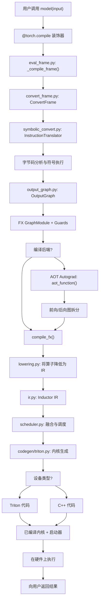
**来源：** [torch/\_dynamo/eval\_frame.py1-100](https://github.com/pytorch/pytorch/blob/915982a4/torch/_dynamo/eval_frame.py#L1-L100) [torch/\_dynamo/convert\_frame.py1-100](https://github.com/pytorch/pytorch/blob/915982a4/torch/_dynamo/convert_frame.py#L1-L100) [torch/\_dynamo/symbolic\_convert.py1-100](https://github.com/pytorch/pytorch/blob/915982a4/torch/_dynamo/symbolic_convert.py#L1-L100) [torch/\_dynamo/output\_graph.py1-100](https://github.com/pytorch/pytorch/blob/915982a4/torch/_dynamo/output_graph.py#L1-L100) [torch/\_inductor/compile\_fx.py](https://github.com/pytorch/pytorch/blob/915982a4/torch/_inductor/compile_fx.py) (在测试文件中引用), [torch/\_inductor/lowering.py1-100](https://github.com/pytorch/pytorch/blob/915982a4/torch/_inductor/lowering.py#L1-L100) [torch/\_inductor/ir.py1-100](https://github.com/pytorch/pytorch/blob/915982a4/torch/_inductor/ir.py#L1-L100) [torch/\_inductor/scheduler.py1-100](https://github.com/pytorch/pytorch/blob/915982a4/torch/_inductor/scheduler.py#L1-L100) [torch/\_inductor/codegen/triton.py1-100](https://github.com/pytorch/pytorch/blob/915982a4/torch/_inductor/codegen/triton.py#L1-L100)

## 入口点：@torch.compile 装饰器 (Entry Point: The @torch.compile Decorator)

当用户使用 `@torch.compile` 装饰一个函数时，PyTorch 会安装一个自定义的帧评估钩子 (frame evaluation hook)，用于拦截 Python 字节码的执行。

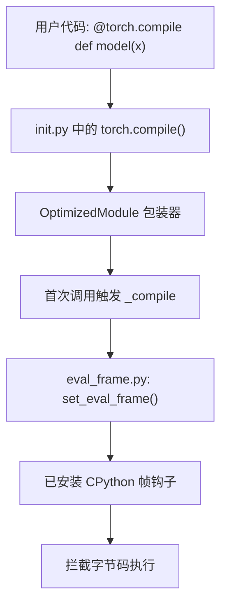
**关键代码实体：**

-   `torch.compile()` - 面向用户的 API 装饰器。
-   `OptimizedModule` - 拦截 `__call__` 的包装类。
-   `set_eval_frame()` - 安装帧评估钩子。
-   `_compile_frame()` - 帧编译的主要入口点。

**来源：** [test/inductor/test\_torchinductor.py515-520](https://github.com/pytorch/pytorch/blob/915982a4/test/inductor/test_torchinductor.py#L515-L520) [torch/\_dynamo/eval\_frame.py1-100](https://github.com/pytorch/pytorch/blob/915982a4/torch/_dynamo/eval_frame.py#L1-L100)

## TorchDynamo：字节码分析与符号执行 (TorchDynamo: Bytecode Analysis and Symbolic Execution)

TorchDynamo 拦截 Python 帧，并对字节码执行符号执行，以捕获程序行为。

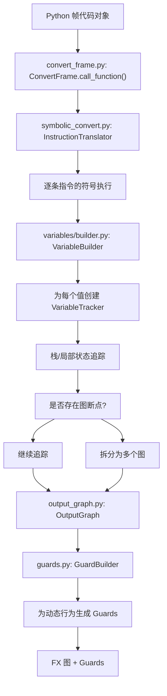
**关键组件：**

| 组件 | 文件 | 目的 |
| --- | --- | --- |
| `InstructionTranslator` | symbolic\_convert.py | 核心字节码符号执行器 |
| `VariableTracker` | variables/base.py | Python 值的抽象表示 |
| `VariableBuilder` | variables/builder.py | 从 Python 对象构建 VariableTrackers |
| `OutputGraph` | output\_graph.py | 管理 FX 图构建 |
| `GuardBuilder` | guards.py | 为动态属性创建 guards |

**符号执行过程：**

1.  每条字节码指令都在 `InstructionTranslator.step()` 中处理。
2.  Python 值被包装在 `VariableTracker` 子类中（例如 `TensorVariable`、`ConstantVariable`）。
3.  操作通过 `OutputGraph.create_proxy()` 创建 FX 图节点。
4.  为任何动态行为（例如张量形状、数据依赖的控制流）注册 Guards。

**来源：** [torch/\_dynamo/symbolic\_convert.py1-100](https://github.com/pytorch/pytorch/blob/915982a4/torch/_dynamo/symbolic_convert.py#L1-L100) [torch/\_dynamo/variables/builder.py1-100](https://github.com/pytorch/pytorch/blob/915982a4/torch/_dynamo/variables/builder.py#L1-L100) [torch/\_dynamo/output\_graph.py1-100](https://github.com/pytorch/pytorch/blob/915982a4/torch/_dynamo/output_graph.py#L1-L100) [torch/\_dynamo/guards.py](https://github.com/pytorch/pytorch/blob/915982a4/torch/_dynamo/guards.py) (引用)

## FX 图构建 (FX Graph Construction)

`OutputGraph` 类管理 FX 图的构建过程，并与 `SubgraphTracer` 协同工作。

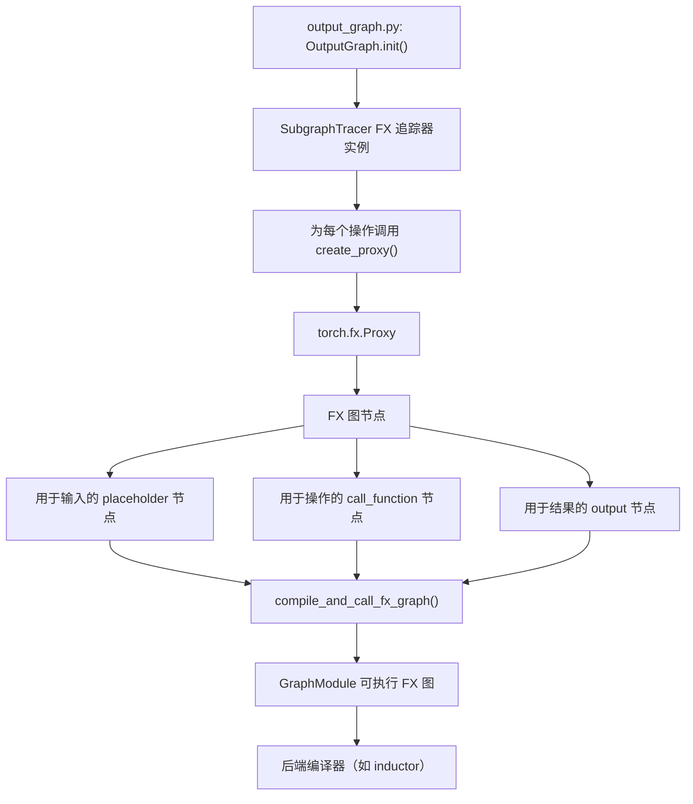
**图节点类型：**

-   **placeholder**：图输入（参数、模块参数）。
-   **get\_attr**：模块属性/缓冲区 (buffers)。
-   **call\_function**：PyTorch 操作 (torch.ops.aten.\*)。
-   **call\_method**：张量方法。
-   **call\_module**：子模块调用。
-   **output**：图输出。

**来源：** [torch/\_dynamo/output\_graph.py1-200](https://github.com/pytorch/pytorch/blob/915982a4/torch/_dynamo/output_graph.py#L1-L200) [test/export/test\_export.py600-700](https://github.com/pytorch/pytorch/blob/915982a4/test/export/test_export.py#L600-L700)

## AOT Autograd：前向/后向拆分 (AOT Autograd: Forward/Backward Splitting)

AOT（提前）Autograd 在编译前分离前向和后向传递。

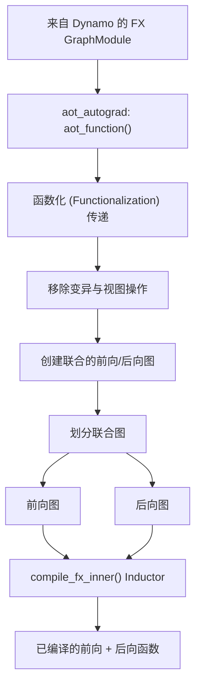
**关键转换：**

1.  **函数化 (Functionalization)**：将就地 (in-place) 操作转换为函数式等效操作。
2.  **联合图创建**：将前向和 autograd 后向合并为单个图。
3.  **图划分**：将联合图拆分为仅前向和仅后向组件。
4.  **后端编译**：每个划分由后端（通常是 Inductor）单独编译。

**来源：** [torch/\_functorch/aot\_autograd.py](https://github.com/pytorch/pytorch/blob/915982a4/torch/_functorch/aot_autograd.py) (引用), [test/export/test\_export.py300-400](https://github.com/pytorch/pytorch/blob/915982a4/test/export/test_export.py#L300-L400)

## TorchInductor 后端：IR 降低 (TorchInductor Backend: IR Lowering)

TorchInductor 接收 FX 图并将其降低为可优化的中间表示 (IR)。

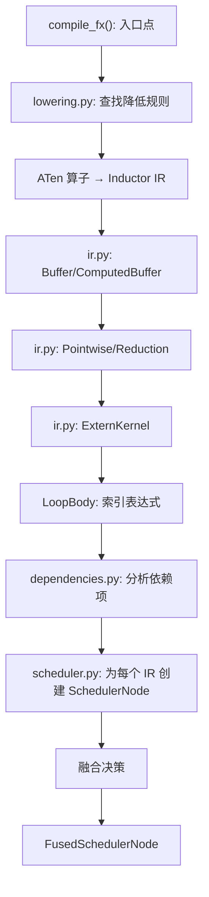
**Inductor IR 节点类型：**

| IR 类 | 目的 | 文件 |
| --- | --- | --- |
| `Pointwise` | 逐元素操作 | ir.py |
| `Reduction` | 归约操作（sum, max 等） | ir.py |
| `ComputedBuffer` | 计算出的张量值 | ir.py |
| `ExternKernel` | 调用外部内核（如 CUDA 库） | ir.py |
| `LoopBody` | 循环内核的索引表达式 | loop\_body.py |

**降低过程：**

1.  对于每个 FX 节点，在 `lowerings` 字典中查找降低规则。
2.  执行降低函数以创建 IR 节点。
3.  IR 节点包含使用 SymPy 处理符号形状的索引表达式。
4.  追踪 IR 节点之间的依赖关系以进行调度。

**来源：** [torch/\_inductor/lowering.py1-200](https://github.com/pytorch/pytorch/blob/915982a4/torch/_inductor/lowering.py#L1-L200) [torch/\_inductor/ir.py1-500](https://github.com/pytorch/pytorch/blob/915982a4/torch/_inductor/ir.py#L1-L500) [test/inductor/test\_torchinductor.py400-500](https://github.com/pytorch/pytorch/blob/915982a4/test/inductor/test_torchinductor.py#L400-L500)

## 调度与融合 (Scheduling and Fusion)

`Scheduler` 类分析 IR 节点以确定融合机会和内核顺序。

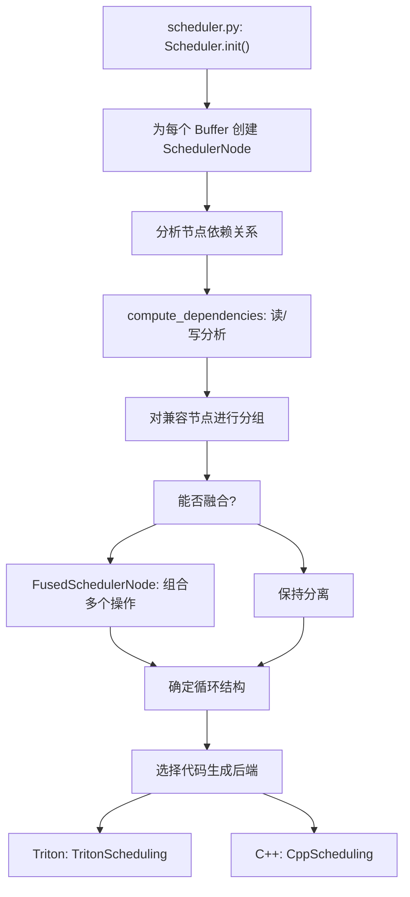
**融合标准：**

-   兼容的设备类型。
-   兼容的循环结构（大小和归约维度）。
-   内存依赖约束（无 WAR/WAW 冲突）。
-   读/写模式允许融合。
-   基于内存带宽与计算的启发式方法。

**融合组：**

| 分组类型 | 描述 | 示例 |
| --- | --- | --- |
| `(device, sizes, reductions)` | 相同张量形状上的逐元素操作 | Add, multiply, relu |
| `(device, (numel, rnumel))` | 具有相同输出大小的归约操作 | 沿维度的 Sum, max |
| 尾声 (Epilogue) 融合 | 将逐元素操作融合进归约输出 | 归约 + 归一化 (normalization) |

**来源：** [torch/\_inductor/scheduler.py1-500](https://github.com/pytorch/pytorch/blob/915982a4/torch/_inductor/scheduler.py#L1-L500) [test/inductor/test\_torchinductor.py800-900](https://github.com/pytorch/pytorch/blob/915982a4/test/inductor/test_torchinductor.py#L800-L900)

## 代码生成：Triton 与 C++ (Code Generation: Triton and C++)

融合后的 IR 节点被编译为可执行内核，使用 Triton（用于 GPU）或 C++（用于 CPU）。

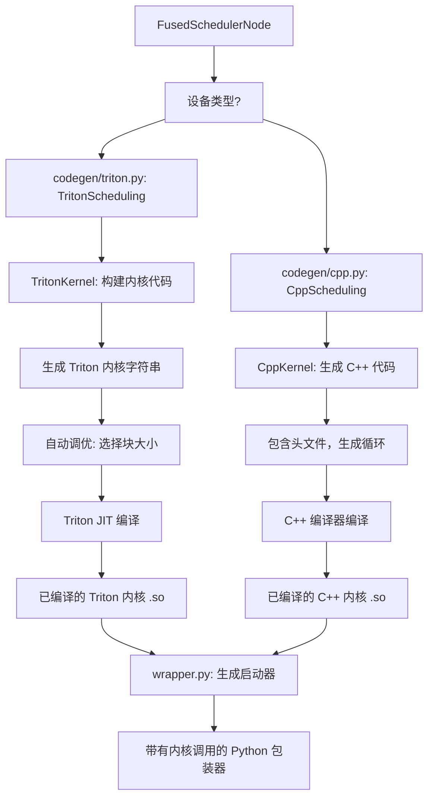
**Triton 代码生成流水线：**

1.  `TritonKernel` 创建带有循环索引的内核模板。
2.  从张量形状计算循环边界。
3.  将索引表达式转换为 Triton 语法。
4.  分析内存访问模式以进行合并 (coalescing)。
5.  通过自动调优或启发式方法选择块大小 (block sizes)。
6.  Triton JIT 将内核编译为 CUDA。

**C++ 代码生成流水线：**

1.  `CppKernel` 生成向量化循环代码。
2.  循环结构基于 IR 调度决策。
3.  使用 CPU SIMD 指令进行向量化。
4.  使用 OpenMP 进行多线程并行化。
5.  C++ 编译器 (g++/clang) 生成共享对象 (.so)。

**来源：** [torch/\_inductor/codegen/triton.py1-300](https://github.com/pytorch/pytorch/blob/915982a4/torch/_inductor/codegen/triton.py#L1-L300) [torch/\_inductor/codegen/wrapper.py1-200](https://github.com/pytorch/pytorch/blob/915982a4/torch/_inductor/codegen/wrapper.py#L1-L200) [test/inductor/test\_torchinductor.py1000-1100](https://github.com/pytorch/pytorch/blob/915982a4/test/inductor/test_torchinductor.py#L1000-L1100)

## 配置系统 (Configuration System)

编译流水线由 `torch._inductor.config` 和 `torch._dynamo.config` 控制。

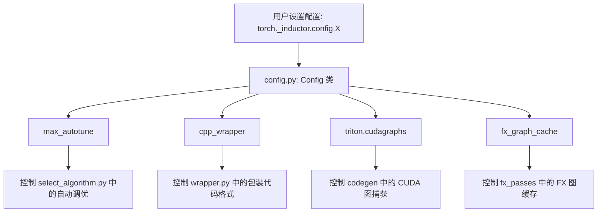
**关键配置选项：**

| 配置 | 类型 | 目的 | 默认值 |
| --- | --- | --- | --- |
| `debug` | bool | 启用调试输出 | False |
| `max_autotune` | bool | 广泛的内核调优 | False |
| `cpp_wrapper` | bool | C++ vs Python 包装器 | False |
| `triton.cudagraphs` | bool | 启用 CUDA 图 | False |
| `fx_graph_cache` | bool | 缓存已编译的图 | True |
| `epilogue_fusion` | bool | 融合尾声操作 | True |
| `pattern_matcher` | bool | 启用模式匹配 | True |

**来源：** [torch/\_inductor/config.py1-200](https://github.com/pytorch/pytorch/blob/915982a4/torch/_inductor/config.py#L1-L200) [test/inductor/test\_torchinductor.py330-350](https://github.com/pytorch/pytorch/blob/915982a4/test/inductor/test_torchinductor.py#L330-L350)

## 缓存与重新编译 (Caching and Recompilation)

编译系统在多个级别缓存结果以避免重新编译。

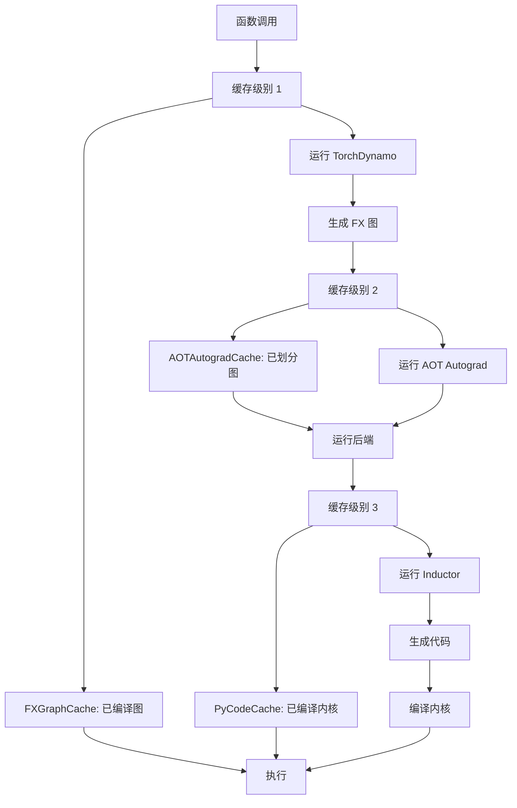
**缓存层级：**

| 缓存级别 | 文件 | 键 (Key) | 值 (Value) |
| --- | --- | --- | --- |
| Guard 缓存 | eval\_frame.py | 代码对象 + guards | 已编译函数 |
| FXGraphCache | fx\_graph\_cache.py | FX 图哈希 | 已编译图模块 |
| AOTAutogradCache | aot\_autograd.py | 联合图哈希 | 前向/后向函数 |
| PyCodeCache | codecache.py | 内核源码哈希 | 已编译的 .so 文件 |
| AutotuneCache | autotune\_cache.py | 配置 + 输入形状 | 最佳内核配置 |

**来源：** [torch/\_inductor/codecache.py1-200](https://github.com/pytorch/pytorch/blob/915982a4/torch/_inductor/codecache.py#L1-L200) [torch/\_dynamo/eval\_frame.py100-200](https://github.com/pytorch/pytorch/blob/915982a4/torch/_dynamo/eval_frame.py#L100-L200)

## Guard 系统 (Guard System)

Guards 确保仅在假设仍然有效时才使用已编译的代码。

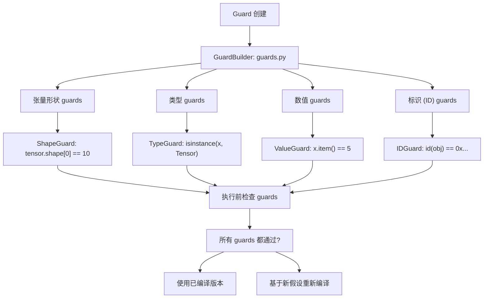
**Guard 类型：**

| Guard | 目的 | 示例 |
| --- | --- | --- |
| `EQUALS_MATCH` | 数值相等 | `x == 5` |
| `SHAPE_ENV` | 符号形状约束 | `s0 > 0` |
| `TYPE_MATCH` | 类型检查 | `type(x) is int` |
| `ID_MATCH` | 标识检查 | `x is y` |
| `DATA_PTR_MATCH` | 张量数据位置 | `tensor.data_ptr() == addr` |

**来源：** [torch/\_guards.py](https://github.com/pytorch/pytorch/blob/915982a4/torch/_guards.py) (引用), [torch/\_dynamo/guards.py](https://github.com/pytorch/pytorch/blob/915982a4/torch/_dynamo/guards.py) (引用), [test/dynamo/test\_misc.py1000-1100](https://github.com/pytorch/pytorch/blob/915982a4/test/dynamo/test_misc.py#L1000-L1100)

## 执行与内核启动 (Execution and Kernel Launch)

通过生成的 Python 包装器代码调用已编译的内核。

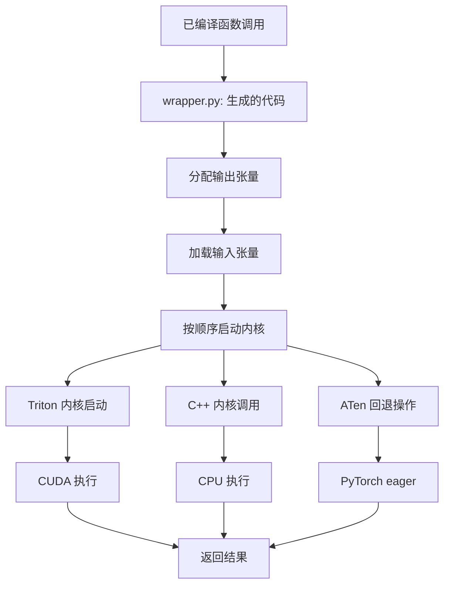
**包装器代码结构：**

```python
# 由 wrapper.py 生成
def call(args):    
    buf0 = torch.empty_strided(...)  # 分配输出    
    kernel_0.run(args[0], buf0, ...)  # 启动内核    
    return buf0
```
**来源：** [torch/\_inductor/codegen/wrapper.py1-100](https://github.com/pytorch/pytorch/blob/915982a4/torch/_inductor/codegen/wrapper.py#L1-L100) [test/inductor/test\_torchinductor.py500-600](https://github.com/pytorch/pytorch/blob/915982a4/test/inductor/test_torchinductor.py#L500-L600)

## 多图编译 (Multi-Graph Compilation)

复杂的模型可能会因为图断点而拆分为多个图。

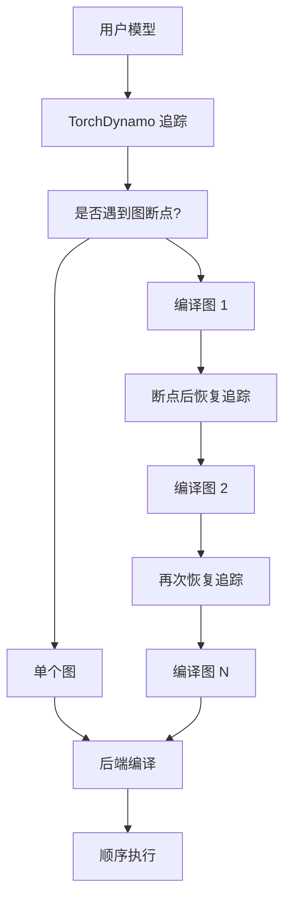
**常见图断点原因：**

-   不支持的 Python 操作（例如 `print()`、调试）。
-   无法进行符号执行的数据依赖控制流。
-   调用不可追踪的函数。
-   必须保持原始顺序的副作用。

**图断点示例：**

```python
@torch.compile
def model(x):    
    y = x + 1      # 图 1    
    print(y)       # 图断点（print 不可追踪）    
    z = y * 2      # 图 2    
    return z
```
**来源：** [torch/\_dynamo/symbolic\_convert.py2000-2100](https://github.com/pytorch/pytorch/blob/915982a4/torch/_dynamo/symbolic_convert.py#L2000-L2100) [torch/\_dynamo/exc.py](https://github.com/pytorch/pytorch/blob/915982a4/torch/_dynamo/exc.py) (引用)

## 端到端示例 (End-to-End Example)

一个简单函数的完整编译追踪：

> **[Mermaid sequence]**
> *(图表结构无法解析)*

**来源：** [test/inductor/test\_torchinductor.py429-520](https://github.com/pytorch/pytorch/blob/915982a4/test/inductor/test_torchinductor.py#L429-L520) [torch/\_dynamo/convert\_frame.py1-100](https://github.com/pytorch/pytorch/blob/915982a4/torch/_dynamo/convert_frame.py#L1-L100) [torch/\_dynamo/output\_graph.py1-200](https://github.com/pytorch/pytorch/blob/915982a4/torch/_dynamo/output_graph.py#L1-L200)

## 总结 (Summary)

torch.compile 流水线由以下主要阶段组成：

1.  **入口 (@torch.compile)**：装饰器安装帧评估钩子。
2.  **TorchDynamo**：字节码分析与符号执行，生成 FX 图。
3.  **图构建**：带有用于处理动态行为的 guards 的 FX 图。
4.  **AOT Autograd**：前向/后向分离与函数化。
5.  **TorchInductor**：IR 降低、调度、融合优化。
6.  **代码生成**：Triton (GPU) 或 C++ (CPU) 内核编译。
7.  **执行**：带有 guard 检查的已缓存编译内核。

该流水线使 PyTorch 能够将 Python 代码优化为高效的 GPU/CPU 内核，同时保持与 eager 模式执行的完全兼容性。

**来源：** [torch/\_dynamo/eval\_frame.py1-200](https://github.com/pytorch/pytorch/blob/915982a4/torch/_dynamo/eval_frame.py#L1-L200) [torch/\_dynamo/symbolic\_convert.py1-300](https://github.com/pytorch/pytorch/blob/915982a4/torch/_dynamo/symbolic_convert.py#L1-L300) [torch/\_dynamo/output\_graph.py1-300](https://github.com/pytorch/pytorch/blob/915982a4/torch/_dynamo/output_graph.py#L1-L300) [torch/\_inductor/compile\_fx.py](https://github.com/pytorch/pytorch/blob/915982a4/torch/_inductor/compile_fx.py) (在测试中引用), [torch/\_inductor/lowering.py1-200](https://github.com/pytorch/pytorch/blob/915982a4/torch/_inductor/lowering.py#L1-L200) [torch/\_inductor/scheduler.py1-200](https://github.com/pytorch/pytorch/blob/915982a4/torch/_inductor/scheduler.py#L1-L200) [torch/\_inductor/codegen/triton.py1-200](https://github.com/pytorch/pytorch/blob/915982a4/torch/_inductor/codegen/triton.py#L1-L200) [test/inductor/test\_torchinductor.py1-1000](https://github.com/pytorch/pytorch/blob/915982a4/test/inductor/test_torchinductor.py#L1-L1000)
