# TorchDynamo 前端 (TorchDynamo Frontend)

相关源文件 (Relevant source files)

-   [aten/src/ATen/core/PythonFallbackKernel.cpp](https://github.com/pytorch/pytorch/blob/915982a4/aten/src/ATen/core/PythonFallbackKernel.cpp)
-   [test/distributed/\_composable/fsdp/test\_fully\_shard\_compile.py](https://github.com/pytorch/pytorch/blob/915982a4/test/distributed/_composable/fsdp/test_fully_shard_compile.py)
-   [test/dynamo/test\_dicts.py](https://github.com/pytorch/pytorch/blob/915982a4/test/dynamo/test_dicts.py)
-   [test/dynamo/test\_error\_messages.py](https://github.com/pytorch/pytorch/blob/915982a4/test/dynamo/test_error_messages.py)
-   [test/dynamo/test\_functions.py](https://github.com/pytorch/pytorch/blob/915982a4/test/dynamo/test_functions.py)
-   [test/dynamo/test\_fwd\_loss\_bwd.py](https://github.com/pytorch/pytorch/blob/915982a4/test/dynamo/test_fwd_loss_bwd.py)
-   [test/dynamo/test\_guard\_manager.py](https://github.com/pytorch/pytorch/blob/915982a4/test/dynamo/test_guard_manager.py)
-   [test/dynamo/test\_list.py](https://github.com/pytorch/pytorch/blob/915982a4/test/dynamo/test_list.py)
-   [test/dynamo/test\_logging.py](https://github.com/pytorch/pytorch/blob/915982a4/test/dynamo/test_logging.py)
-   [test/dynamo/test\_misc.py](https://github.com/pytorch/pytorch/blob/915982a4/test/dynamo/test_misc.py)
-   [test/dynamo/test\_modules.py](https://github.com/pytorch/pytorch/blob/915982a4/test/dynamo/test_modules.py)
-   [test/dynamo/test\_nested\_graph\_breaks.py](https://github.com/pytorch/pytorch/blob/915982a4/test/dynamo/test_nested_graph_breaks.py)
-   [test/dynamo/test\_repros.py](https://github.com/pytorch/pytorch/blob/915982a4/test/dynamo/test_repros.py)
-   [test/dynamo/test\_skip\_guard\_eval\_unsafe.py](https://github.com/pytorch/pytorch/blob/915982a4/test/dynamo/test_skip_guard_eval_unsafe.py)
-   [test/dynamo/test\_utils.py](https://github.com/pytorch/pytorch/blob/915982a4/test/dynamo/test_utils.py)
-   [test/dynamo\_expected\_failures/TestCustomOp.test\_impl\_device\_cpu](https://github.com/pytorch/pytorch/blob/915982a4/test/dynamo_expected_failures/TestCustomOp.test_impl_device_cpu)
-   [test/export/test\_experimental.py](https://github.com/pytorch/pytorch/blob/915982a4/test/export/test_experimental.py)
-   [test/export/test\_export.py](https://github.com/pytorch/pytorch/blob/915982a4/test/export/test_export.py)
-   [test/fx/test\_fx\_xform\_observer.py](https://github.com/pytorch/pytorch/blob/915982a4/test/fx/test_fx_xform_observer.py)
-   [test/profiler/test\_record\_function.py](https://github.com/pytorch/pytorch/blob/915982a4/test/profiler/test_record_function.py)
-   [test/profiler/test\_torch\_tidy.py](https://github.com/pytorch/pytorch/blob/915982a4/test/profiler/test_torch_tidy.py)
-   [test/test\_dynamic\_shapes.py](https://github.com/pytorch/pytorch/blob/915982a4/test/test_dynamic_shapes.py)
-   [test/test\_proxy\_tensor.py](https://github.com/pytorch/pytorch/blob/915982a4/test/test_proxy_tensor.py)
-   [torch/\_C/\_dynamo/guards.pyi](https://github.com/pytorch/pytorch/blob/915982a4/torch/_C/_dynamo/guards.pyi)
-   [torch/\_decomp/decompositions\_for\_jvp.py](https://github.com/pytorch/pytorch/blob/915982a4/torch/_decomp/decompositions_for_jvp.py)
-   [torch/\_dispatch/python.py](https://github.com/pytorch/pytorch/blob/915982a4/torch/_dispatch/python.py)
-   [torch/\_dynamo/bytecode\_analysis.py](https://github.com/pytorch/pytorch/blob/915982a4/torch/_dynamo/bytecode_analysis.py)
-   [torch/\_dynamo/bytecode\_transformation.py](https://github.com/pytorch/pytorch/blob/915982a4/torch/_dynamo/bytecode_transformation.py)
-   [torch/\_dynamo/codegen.py](https://github.com/pytorch/pytorch/blob/915982a4/torch/_dynamo/codegen.py)
-   [torch/\_dynamo/config.py](https://github.com/pytorch/pytorch/blob/915982a4/torch/_dynamo/config.py)
-   [torch/\_dynamo/convert\_frame.py](https://github.com/pytorch/pytorch/blob/915982a4/torch/_dynamo/convert_frame.py)
-   [torch/\_dynamo/eval\_frame.py](https://github.com/pytorch/pytorch/blob/915982a4/torch/_dynamo/eval_frame.py)
-   [torch/\_dynamo/exc.py](https://github.com/pytorch/pytorch/blob/915982a4/torch/_dynamo/exc.py)
-   [torch/\_dynamo/functional\_export.py](https://github.com/pytorch/pytorch/blob/915982a4/torch/_dynamo/functional_export.py)
-   [torch/\_dynamo/graph\_break\_registry.json](https://github.com/pytorch/pytorch/blob/915982a4/torch/_dynamo/graph_break_registry.json)
-   [torch/\_dynamo/guards.py](https://github.com/pytorch/pytorch/blob/915982a4/torch/_dynamo/guards.py)
-   [torch/\_dynamo/output\_graph.py](https://github.com/pytorch/pytorch/blob/915982a4/torch/_dynamo/output_graph.py)
-   [torch/\_dynamo/resume\_execution.py](https://github.com/pytorch/pytorch/blob/915982a4/torch/_dynamo/resume_execution.py)
-   [torch/\_dynamo/side\_effects.py](https://github.com/pytorch/pytorch/blob/915982a4/torch/_dynamo/side_effects.py)
-   [torch/\_dynamo/source.py](https://github.com/pytorch/pytorch/blob/915982a4/torch/_dynamo/source.py)
-   [torch/\_dynamo/symbolic\_convert.py](https://github.com/pytorch/pytorch/blob/915982a4/torch/_dynamo/symbolic_convert.py)
-   [torch/\_dynamo/test\_case.py](https://github.com/pytorch/pytorch/blob/915982a4/torch/_dynamo/test_case.py)
-   [torch/\_dynamo/testing.py](https://github.com/pytorch/pytorch/blob/915982a4/torch/_dynamo/testing.py)
-   [torch/\_dynamo/trace\_rules.py](https://github.com/pytorch/pytorch/blob/915982a4/torch/_dynamo/trace_rules.py)
-   [torch/\_dynamo/utils.py](https://github.com/pytorch/pytorch/blob/915982a4/torch/_dynamo/utils.py)
-   [torch/\_dynamo/variables/\_\_init\_\_.py](https://github.com/pytorch/pytorch/blob/915982a4/torch/_dynamo/variables/__init__.py)
-   [torch/\_dynamo/variables/base.py](https://github.com/pytorch/pytorch/blob/915982a4/torch/_dynamo/variables/base.py)
-   [torch/\_dynamo/variables/builder.py](https://github.com/pytorch/pytorch/blob/915982a4/torch/_dynamo/variables/builder.py)
-   [torch/\_dynamo/variables/builtin.py](https://github.com/pytorch/pytorch/blob/915982a4/torch/_dynamo/variables/builtin.py)
-   [torch/\_dynamo/variables/constant.py](https://github.com/pytorch/pytorch/blob/915982a4/torch/_dynamo/variables/constant.py)
-   [torch/\_dynamo/variables/ctx\_manager.py](https://github.com/pytorch/pytorch/blob/915982a4/torch/_dynamo/variables/ctx_manager.py)
-   [torch/\_dynamo/variables/dicts.py](https://github.com/pytorch/pytorch/blob/915982a4/torch/_dynamo/variables/dicts.py)
-   [torch/\_dynamo/variables/functions.py](https://github.com/pytorch/pytorch/blob/915982a4/torch/_dynamo/variables/functions.py)
-   [torch/\_dynamo/variables/higher\_order\_ops.py](https://github.com/pytorch/pytorch/blob/915982a4/torch/_dynamo/variables/higher_order_ops.py)
-   [torch/\_dynamo/variables/iter.py](https://github.com/pytorch/pytorch/blob/915982a4/torch/_dynamo/variables/iter.py)
-   [torch/\_dynamo/variables/lists.py](https://github.com/pytorch/pytorch/blob/915982a4/torch/_dynamo/variables/lists.py)
-   [torch/\_dynamo/variables/misc.py](https://github.com/pytorch/pytorch/blob/915982a4/torch/_dynamo/variables/misc.py)
-   [torch/\_dynamo/variables/nn\_module.py](https://github.com/pytorch/pytorch/blob/915982a4/torch/_dynamo/variables/nn_module.py)
-   [torch/\_dynamo/variables/optimizer.py](https://github.com/pytorch/pytorch/blob/915982a4/torch/_dynamo/variables/optimizer.py)
-   [torch/\_dynamo/variables/tensor.py](https://github.com/pytorch/pytorch/blob/915982a4/torch/_dynamo/variables/tensor.py)
-   [torch/\_dynamo/variables/torch.py](https://github.com/pytorch/pytorch/blob/915982a4/torch/_dynamo/variables/torch.py)
-   [torch/\_dynamo/variables/user\_defined.py](https://github.com/pytorch/pytorch/blob/915982a4/torch/_dynamo/variables/user_defined.py)
-   [torch/\_export/non\_strict\_utils.py](https://github.com/pytorch/pytorch/blob/915982a4/torch/_export/non_strict_utils.py)
-   [torch/\_guards.py](https://github.com/pytorch/pytorch/blob/915982a4/torch/_guards.py)
-   [torch/\_lazy/device\_context.py](https://github.com/pytorch/pytorch/blob/915982a4/torch/_lazy/device_context.py)
-   [torch/\_logging/\_internal.py](https://github.com/pytorch/pytorch/blob/915982a4/torch/_logging/_internal.py)
-   [torch/\_logging/\_registrations.py](https://github.com/pytorch/pytorch/blob/915982a4/torch/_logging/_registrations.py)
-   [torch/\_numpy/\_funcs\_impl.py](https://github.com/pytorch/pytorch/blob/915982a4/torch/_numpy/_funcs_impl.py)
-   [torch/\_numpy/\_reductions\_impl.py](https://github.com/pytorch/pytorch/blob/915982a4/torch/_numpy/_reductions_impl.py)
-   [torch/\_refs/fft.py](https://github.com/pytorch/pytorch/blob/915982a4/torch/_refs/fft.py)
-   [torch/csrc/dynamo/guards.cpp](https://github.com/pytorch/pytorch/blob/915982a4/torch/csrc/dynamo/guards.cpp)
-   [torch/export/\_\_init\_\_.py](https://github.com/pytorch/pytorch/blob/915982a4/torch/export/__init__.py)
-   [torch/export/\_trace.py](https://github.com/pytorch/pytorch/blob/915982a4/torch/export/_trace.py)
-   [torch/fx/experimental/symbolic\_shapes.py](https://github.com/pytorch/pytorch/blob/915982a4/torch/fx/experimental/symbolic_shapes.py)
-   [torch/fx/passes/graph\_transform\_observer.py](https://github.com/pytorch/pytorch/blob/915982a4/torch/fx/passes/graph_transform_observer.py)

## 目的与范围 (Purpose and Scope)

TorchDynamo 前端是 PyTorch 的 Python 字节码分析和符号执行引擎，用于将模型捕获为 FX 图。它拦截 Python 帧 (frame) 的执行，分析字节码指令，并将其转换为可追踪的图表示，同时追踪变量并生成用于保证正确性的 guards。本页涵盖了核心追踪基础设施、变量追踪系统和图构建机制。有关 guard 生成和重新编译触发器的详细信息，请参阅 [Guard 系统与重新编译 (Guard System and Recompilation)](/pytorch/pytorch/2.2.3-guard-system-and-recompilation)。有关后续编译阶段，请参阅 [torch.export](/pytorch/pytorch/2.3-torch.export:-static-graph-export) 和 [TorchInductor 后端 (TorchInductor Backend)](/pytorch/pytorch/2.5-torchinductor-backend)。

## 系统架构概览 (System Architecture Overview)

TorchDynamo 前端由四个协作子系统组成：字节码分析、变量追踪、图构建和 guard 管理。该系统在帧边界处拦截 Python 执行，并执行符号执行以构建 FX 图。

### 高层组件架构 (High-Level Component Architecture)

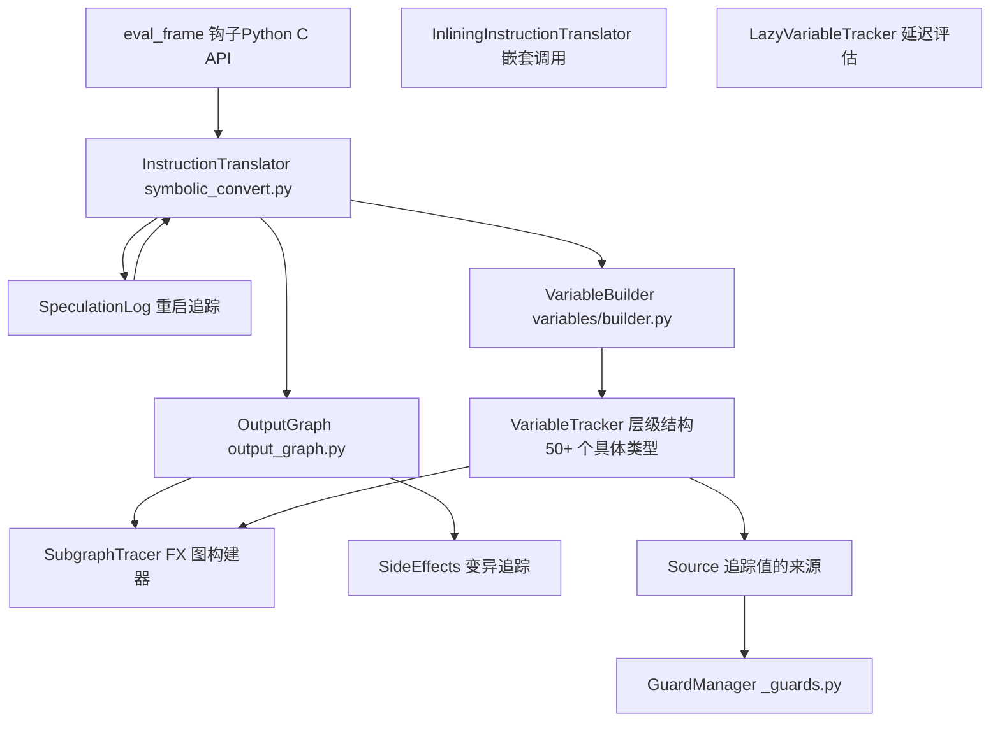
来源： [torch/\_dynamo/symbolic\_convert.py1-100](https://github.com/pytorch/pytorch/blob/915982a4/torch/_dynamo/symbolic_convert.py#L1-L100) [torch/\_dynamo/variables/builder.py1-100](https://github.com/pytorch/pytorch/blob/915982a4/torch/_dynamo/variables/builder.py#L1-L100) [torch/\_dynamo/output\_graph.py1-100](https://github.com/pytorch/pytorch/blob/915982a4/torch/_dynamo/output_graph.py#L1-L100)

## 字节码拦截与帧处理 (Bytecode Interception and Frame Processing)

TorchDynamo 向 CPython 注册了一个自定义的评估帧回调，在字节码被评估之前拦截函数执行。该回调创建一个 `InstructionTranslator` 实例来符号化地执行该帧。

### 从用户代码到符号执行的执行流 (Execution Flow from User Code to Symbolic Execution)

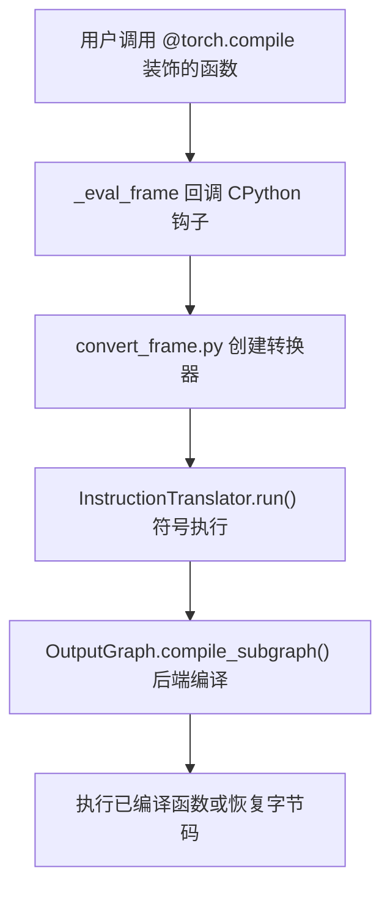
来源： [torch/\_dynamo/symbolic\_convert.py1-100](https://github.com/pytorch/pytorch/blob/915982a4/torch/_dynamo/symbolic_convert.py#L1-L100) [torch/\_dynamo/eval\_frame.py1-100](https://github.com/pytorch/pytorch/blob/915982a4/torch/_dynamo/eval_frame.py#L1-L100)

### InstructionTranslator 类层级结构 (InstructionTranslator Class Hierarchy)

`InstructionTranslatorBase` 类提供了核心字节码处理循环，并针对不同上下文提供了专门的子类：


来源： [torch/\_dynamo/symbolic\_convert.py1000-2000](https://github.com/pytorch/pytorch/blob/915982a4/torch/_dynamo/symbolic_convert.py#L1000-L2000)

转换器维护一个 `symbolic_stack`（类似于 Python 的评估栈）以及 `symbolic_locals`/`symbolic_globals` 字典，这些字典包含 `VariableTracker` 对象而不是实际的 Python 值。位于 [torch/\_dynamo/symbolic\_convert.py2500-3000](https://github.com/pytorch/pytorch/blob/915982a4/torch/_dynamo/symbolic_convert.py#L2500-L3000) 的 `step()` 方法分发到特定的操作码 (opcode) 处理方法（例如 `LOAD_FAST`、`CALL_FUNCTION`、`BINARY_ADD`）。

## 变量追踪系统 (Variable Tracking System)

在追踪过程中遇到的每个 Python 值都被包装在一个 `VariableTracker` 子类中，该子类维护符号信息，并知道如何为该值上的操作生成 FX 图节点。

### 核心 VariableTracker 层级结构 (Core VariableTracker Hierarchy)

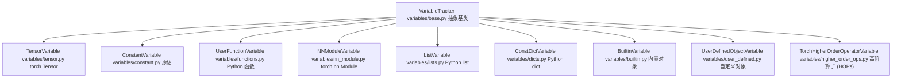
来源： [torch/\_dynamo/variables/base.py1-200](https://github.com/pytorch/pytorch/blob/915982a4/torch/_dynamo/variables/base.py#L1-L200) [torch/\_dynamo/variables/\_\_init\_\_.py1-100](https://github.com/pytorch/pytorch/blob/915982a4/torch/_dynamo/variables/__init__.py#L1-L100)

每个 `VariableTracker` 实现了如下方法：

-   `call_function(tx, args, kwargs)`：处理对该值的调用。
-   `call_method(tx, name, args, kwargs)`：处理方法调用。
-   `var_getattr(tx, name)`：处理属性访问。
-   `as_proxy()`：返回 FX proxy 表示。
-   `reconstruct(codegen)`：生成字节码以重新创建该值。

### VariableBuilder：类型分发到 VariableTracker (VariableBuilder: Type Dispatch to VariableTracker)

位于 [torch/\_dynamo/variables/builder.py457-550](https://github.com/pytorch/pytorch/blob/915982a4/torch/_dynamo/variables/builder.py#L457-L550) 的 `VariableBuilder` 类使用基于类型的分发将 Python 值转换为适当的 `VariableTracker` 实例：

| Python 类型 | VariableTracker 类 | 分发位置 |
| --- | --- | --- |
| `torch.Tensor` | `TensorVariable` | [builder.py588](https://github.com/pytorch/pytorch/blob/915982a4/builder.py#L588-L588) |
| `int`, `float`, `str`, `bool` | `ConstantVariable` | [builder.py597](https://github.com/pytorch/pytorch/blob/915982a4/builder.py#L597-L597) |
| `list`, `tuple`, `torch.Size` | `ListVariable`, `TupleVariable` | [builder.py591-593](https://github.com/pytorch/pytorch/blob/915982a4/builder.py#L591-L593) |
| `dict` | `ConstDictVariable` | [builder.py1200-1300](https://github.com/pytorch/pytorch/blob/915982a4/builder.py#L1200-L1300) |
| `types.FunctionType` | `UserFunctionVariable` | [builder.py1500-1600](https://github.com/pytorch/pytorch/blob/915982a4/builder.py#L1500-L1600) |
| `torch.nn.Module` | `NNModuleVariable` | [builder.py2000-2100](https://github.com/pytorch/pytorch/blob/915982a4/builder.py#L2000-L2100) |

来源： [torch/\_dynamo/variables/builder.py572-616](https://github.com/pytorch/pytorch/blob/915982a4/torch/_dynamo/variables/builder.py#L572-L616)

生成器使用位于 [builder.py576-616](https://github.com/pytorch/pytorch/blob/915982a4/builder.py#L576-L616) 的已缓存分发表进行快速类型查找。当使用某个值调用时，它会：

1.  检查该值是否已在 `output.side_effects` 中被追踪。
2.  在 `output.variable_tracker_cache` 中查找已缓存的 `VariableTracker`。
3.  如果未缓存，则分发到适当的 `wrap_*` 方法。
4.  通过变量的来源 (source) 安装必要的 guards。
5.  缓存结果以进行去重。

### 来源追踪与 Guard 生成 (Source Tracking and Guard Generation)

每个 `VariableTracker` 都有一个可选的 `source` 属性，用于追踪值的出处。Sources 形成树状结构，从而能够生成 guard：

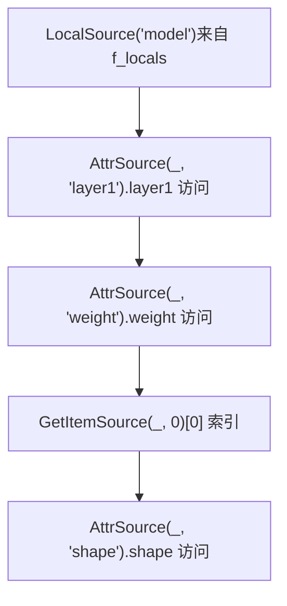
**`model.layer1.weight[0].shape` 的示例来源链：**

-   根节点：`LocalSource("model")`
-   路径：`AttrSource` → `AttrSource` → `GetItemSource` → `AttrSource`

来源： [torch/\_dynamo/source.py100-300](https://github.com/pytorch/pytorch/blob/915982a4/torch/_dynamo/source.py#L100-L300) [torch/\_dynamo/variables/builder.py460-471](https://github.com/pytorch/pytorch/blob/915982a4/torch/_dynamo/variables/builder.py#L460-L471)

当 `VariableTracker` 操作需要 guard（例如类型检查、数值相等）时，它会在 [guards.py500-600](https://github.com/pytorch/pytorch/blob/915982a4/guards.py#L500-L600) 调用 `source.make_guard(GuardBuilder.TYPE_MATCH)` 来生成 guard 表达式，如 `isinstance(local('model').layer1.weight[0], torch.Tensor)`。

## 字节码操作的符号执行 (Symbolic Execution of Bytecode Operations)

处理诸如 `a + b` 之类的操作时，转换器不会立即执行加法。相反：

1.  从符号栈中弹出 `VariableTracker` 对象。
2.  调用 `left.call_method(tx, "__add__", [right], {})`。
3.  变量通过 `output.create_proxy()` 生成 FX 图节点。
4.  返回包装了结果的新 `VariableTracker`。
5.  将结果压入符号栈。

### 操作处理流程 (Operation Processing Flow)

> **[Mermaid sequence]**
> *(图表结构无法解析)*

来源： [torch/\_dynamo/symbolic\_convert.py2000-2500](https://github.com/pytorch/pytorch/blob/915982a4/torch/_dynamo/symbolic_convert.py#L2000-L2500)

### 示例：BINARY\_ADD 处理器 (Example: BINARY_ADD Handler)

位于 [symbolic\_convert.py2100-2150](https://github.com/pytorch/pytorch/blob/915982a4/symbolic_convert.py#L2100-L2150) 的 `BINARY_ADD` 指令处理器：

```python
def BINARY_ADD(self, inst):    
    right = self.pop()    
    left = self.pop()    
    # 分发到 BuiltinVariable(operator.add).call_function    
    result = BuiltinVariable(operator.add).call_function(        
        self, [left, right], {}    
    )    
    self.push(result)
```
对于 `TensorVariable`，位于 [variables/tensor.py500-600](https://github.com/pytorch/pytorch/blob/915982a4/variables/tensor.py#L500-L600) 的 `call_method` 实现生成：

```python
proxy = tx.output.create_proxy(    
    "call_function",    
    operator.add,    
    (left.as_proxy(), right.as_proxy()),    
    {})
return TensorVariable.from_proxy(tx, proxy)
```
来源： [torch/\_dynamo/symbolic\_convert.py2100-2200](https://github.com/pytorch/pytorch/blob/915982a4/torch/_dynamo/symbolic_convert.py#L2100-L2200) [torch/\_dynamo/variables/tensor.py500-600](https://github.com/pytorch/pytorch/blob/915982a4/torch/_dynamo/variables/tensor.py#L500-L600)

## OutputGraph 与图构建 (OutputGraph and Graph Construction)

位于 [torch/\_dynamo/output\_graph.py584-1500](https://github.com/pytorch/pytorch/blob/915982a4/torch/_dynamo/output_graph.py#L584-L1500) 的 `OutputGraph` 类管理 FX 图的构建、副作用追踪、guard 收集和编译。

### OutputGraph 内部结构 (OutputGraph Internal Structure)

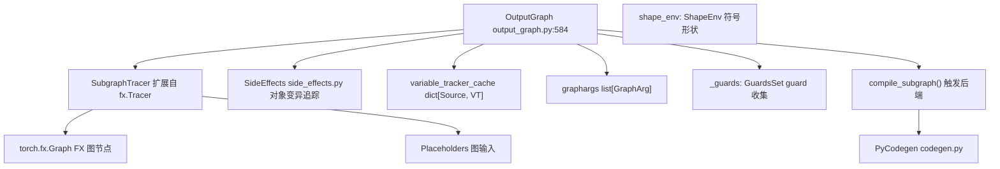
来源： [torch/\_dynamo/output\_graph.py584-800](https://github.com/pytorch/pytorch/blob/915982a4/torch/_dynamo/output_graph.py#L584-L800)

### 创建 FX 图节点 (Creating FX Graph Nodes)

位于 [output\_graph.py1200-1400](https://github.com/pytorch/pytorch/blob/915982a4/output_graph.py#L1200-L1400) 的 `create_proxy` 方法用于创建 FX 图节点：

```python
def create_proxy(self, kind, target, args, kwargs, name=None):    
    # 创建包装了图节点的 FX Proxy    
    proxy = self.current_tracer.create_proxy(kind, target, args, kwargs, name)    
    # 附加元数据：example_value, stack_trace, nn_module_stack    
    set_example_value(proxy.node, example_value)    
    proxy.node.meta["stack_trace"] = traceback.format_stack()    
    return proxy
```
节点种类 (kind) 包括：

-   `"placeholder"`：图输入。
-   `"call_function"`：函数调用（torch 算子、Python 函数）。
-   `"call_method"`：对象上的方法调用。
-   `"call_module"`：对 nn.Module 子模块的调用。
-   `"get_attr"`：图模块上的属性访问。
-   `"output"`：图返回值。

来源： [torch/\_dynamo/output\_graph.py1200-1400](https://github.com/pytorch/pytorch/blob/915982a4/torch/_dynamo/output_graph.py#L1200-L1400)

## 推测与重启机制 (Speculation and Restart Mechanism)

TorchDynamo 通过推测处理数据依赖的控制流：它尝试追踪两个分支，如果失败，则通过图断点重启。

### SpeculationLog 结构 (SpeculationLog Structure)


来源： [torch/\_dynamo/symbolic\_convert.py240-340](https://github.com/pytorch/pytorch/blob/915982a4/torch/_dynamo/symbolic_convert.py#L240-L340)

位于 [symbolic\_convert.py690-947](https://github.com/pytorch/pytorch/blob/915982a4/torch/_dynamo/symbolic_convert.py#L690-L947) 的推测过程：

1.  **第一次尝试**：推测性地追踪条件分支。
2.  **失败**：抛出 `SpeculationRestartAnalysis` 异常。
3.  **重启**：使用 `speculation_log.restart()` 从头开始重新追踪。
4.  **第二次尝试**：在失败的推测点生成图断点。

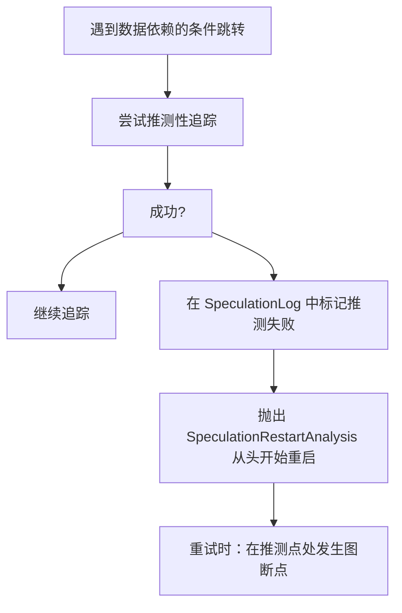
来源： [torch/\_dynamo/symbolic\_convert.py690-800](https://github.com/pytorch/pytorch/blob/915982a4/torch/_dynamo/symbolic_convert.py#L690-L800)

## 处理不同的 Python 结构 (Handling Different Python Constructs)

### 函数调用分发 (Function Call Dispatch)

处理 `CALL_FUNCTION` 字节码时，转换器检查函数变量类型并决定如何处理：

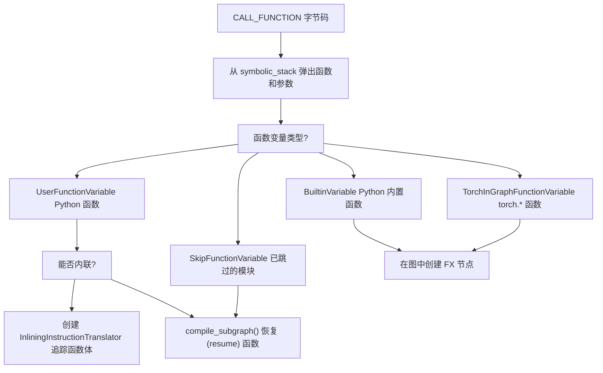
来源： [torch/\_dynamo/symbolic\_convert.py3000-3500](https://github.com/pytorch/pytorch/blob/915982a4/torch/_dynamo/symbolic_convert.py#L3000-L3500) [torch/\_dynamo/variables/functions.py800-1200](https://github.com/pytorch/pytorch/blob/915982a4/torch/_dynamo/variables/functions.py#L800-L1200)

位于 [symbolic\_convert.py3200-3400](https://github.com/pytorch/pytorch/blob/915982a4/symbolic_convert.py#L3200-L3400) 的 `inline_call` 方法创建一个 `InliningInstructionTranslator`，它：

-   继承父级的 `OutputGraph`（写入同一个图）。
-   使用位于 [variables/functions.py180-265](https://github.com/pytorch/pytorch/blob/915982a4/variables/functions.py#L180-L265) 的 `bind_args_cached` 将参数绑定到形参。
-   符号化地处理函数字节码。
-   向父级返回结果 `VariableTracker`。

### 控制流处理 (Control Flow Handling)

TorchDynamo 在可能的情况下在编译时评估条件分支：

位于 [symbolic\_convert.py690-947](https://github.com/pytorch/pytorch/blob/915982a4/torch/_dynamo/symbolic_convert.py#L690-L947) 的**跳转指令处理器**：

```python
def generic_jump(truth_fn, push):    
    def inner(self, inst):        
        value = self.pop()        
        if value.is_python_constant():            
            # 常量条件：遵循相应的分支            
            if truth_fn(value.as_python_constant()):                
                if push:                    
                    self.push(value)                
                self.jump(inst)  # 更新 instruction_pointer        
        else:            
            # 数据依赖：图断点            
            jump_graph_break(self, inst, value)
```
对于循环，TorchDynamo：

-   **小规模常量迭代**：完全展开循环。
-   **大规模/动态迭代**：在循环入口处发生图断点。

来源： [torch/\_dynamo/symbolic\_convert.py690-947](https://github.com/pytorch/pytorch/blob/915982a4/torch/_dynamo/symbolic_convert.py#L690-L947)

### 上下文管理器处理 (Context Manager Handling)

上下文管理器使用块栈 (block stack) 进行正确的 `__enter__`/`__exit__` 追踪：

```python
# 以下代码的字节码: with ctx_manager:
# LOAD_FAST ctx_manager
# SETUP_WITH target
# ... body ...
# WITH_CLEANUP_START
# WITH_CLEANUP_FINISH
```
位于 [symbolic\_convert.py4000-4300](https://github.com/pytorch/pytorch/blob/915982a4/symbolic_convert.py#L4000-L4300) 的处理器：

1.  调用 `ctx_manager.call_method(tx, "__enter__", [], {})`。
2.  将结果压入符号栈 (symbolic\_stack)。
3.  向 `block_stack` 添加 `BlockStackEntry`。
4.  执行主体指令。
5.  退出时，调用 `__exit__` 方法。

来源： [torch/\_dynamo/symbolic\_convert.py4000-4300](https://github.com/pytorch/pytorch/blob/915982a4/symbolic_convert.py#L4000-L4300) [torch/\_dynamo/variables/ctx\_manager.py1-200](https://github.com/pytorch/pytorch/blob/915982a4/torch/_dynamo/variables/ctx_manager.py#L1-L200)

## 追踪规则与内联策略 (Trace Rules and Inlining Policy)

位于 [torch/\_dynamo/trace\_rules.py87-130](https://github.com/pytorch/pytorch/blob/915982a4/torch/_dynamo/trace_rules.py#L87-L130) 的 `trace_rules.py` 模块定义了哪些代码需要追踪，哪些需要跳过：

### 决策优先级顺序 (Decision Priority Order)

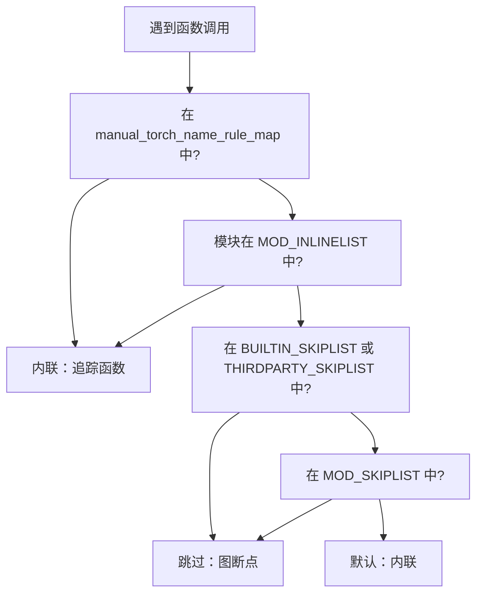
来源： [torch/\_dynamo/trace\_rules.py87-130](https://github.com/pytorch/pytorch/blob/915982a4/torch/_dynamo/trace_rules.py#L87-L130)

### 关键跳过与内联列表 (Key Skip and Inline Lists)

| 列表名称 | 目的 | 示例 |
| --- | --- | --- |
| `BUILTIN_SKIPLIST` | 要跳过的 Python 标准库 | `abc`, `collections`, `os`, `sys` |
| `THIRDPARTY_SKIPLIST` | 要跳过的第三方库 | `numpy`, `pandas`, `transformers` |
| `MOD_INLINELIST` | 总是内联这些模块 | `torch.nn.functional`, `torch.utils._pytree` |
| `manual_torch_name_rule_map` | 显式函数规则 | 特定的 torch 算子 |

来源： [torch/\_dynamo/trace\_rules.py200-500](https://github.com/pytorch/pytorch/blob/915982a4/torch/_dynamo/trace_rules.py#L200-L500)

位于 [trace\_rules.py600-800](https://github.com/pytorch/pytorch/blob/915982a4/trace_rules.py#L600-L800) 的跳过规则返回 `SkipFunctionVariable`，这会导致图断点，而内联规则允许对函数体进行符号执行。

## 延迟变量追踪优化 (Lazy Variable Tracking Optimization)

位于 [torch/\_dynamo/variables/lazy.py1-200](https://github.com/pytorch/pytorch/blob/915982a4/torch/_dynamo/variables/lazy.py#L1-L200) 的 `LazyVariableTracker` 将 `VariableTracker` 的创建推迟到值被访问时：

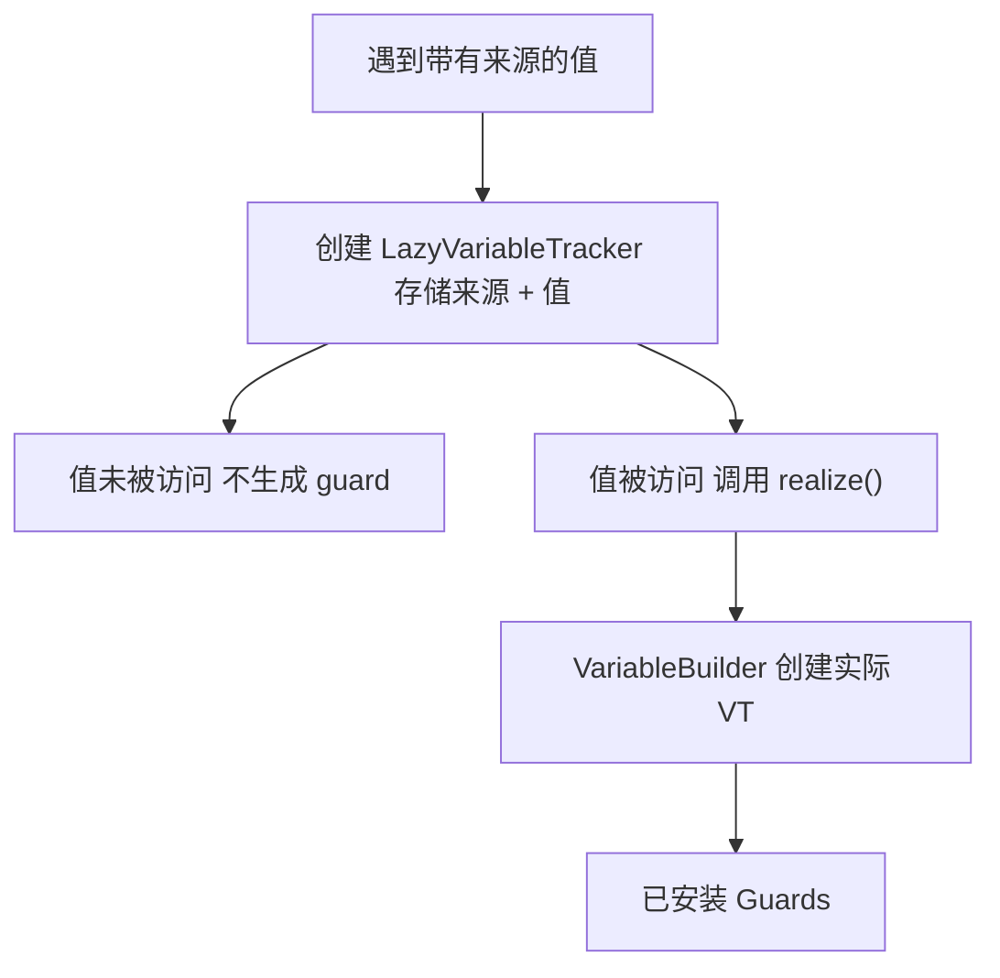
这种优化对于以下情况至关重要：

-   **函数默认值**：`def f(x, y=torch.tensor([]))` - 默认值未使用 → 无 guard。
-   **模块属性**：`model.config` 被访问但 `model.other_attr` 未被访问 → 仅对 `config` 生成 guard。
-   **字典值**：`d = {"a": 1, "b": 2}; use d["a"]` → 仅对键 `"a"` 生成 guard。

来源： [torch/\_dynamo/variables/lazy.py1-200](https://github.com/pytorch/pytorch/blob/915982a4/torch/_dynamo/variables/lazy.py#L1-L200) [torch/\_dynamo/variables/builder.py670-680](https://github.com/pytorch/pytorch/blob/915982a4/torch/_dynamo/variables/builder.py#L670-L680)

## 编译与恢复函数生成 (Compilation and Resume Function Generation)

当发生图断点或函数完成时，位于 [output\_graph.py1800-2200](https://github.com/pytorch/pytorch/blob/915982a4/output_graph.py#L1800-L2200) 的 `OutputGraph.compile_subgraph()` 会编译捕获到的图：

### 编译流水线 (Compilation Pipeline)

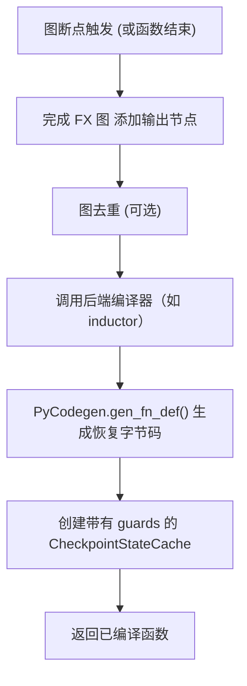
来源： [torch/\_dynamo/output\_graph.py1800-2200](https://github.com/pytorch/pytorch/blob/915982a4/torch/_dynamo/output_graph.py#L1800-L2200) [torch/\_dynamo/codegen.py1-200](https://github.com/pytorch/pytorch/blob/915982a4/torch/_dynamo/codegen.py#L1-L200)

### 恢复函数结构 (Resume Function Structure)

位于 [torch/\_dynamo/codegen.py100-500](https://github.com/pytorch/pytorch/blob/915982a4/torch/_dynamo/codegen.py#L100-L500) 的 `PyCodegen` 类为恢复函数生成字节码：

```python
# 生成的恢复函数概念结构
def resume_at_30(x, y, __compiled_fn_0, __resume_fn_1):    
    # 从图输出中恢复局部变量    
    result = __compiled_fn_0(x, y)    
    z, w = result        
    # 从指令 30 开始继续执行    
    # ... 从指令 30 开始的原始字节码 ...        
    # 可能会调用下一个恢复函数    
    return __resume_fn_1(z, w, ...)
```
Codegen 流程：

1.  从图输入重建局部变量（位于 [codegen.py600-800](https://github.com/pytorch/pytorch/blob/915982a4/codegen.py#L600-L800) 的 `reconstructor`）。
2.  调用已编译的图函数。
3.  将结果解包到局部变量中。
4.  继续执行剩余字节码。
5.  如果需要，链接到下一个恢复函数。

来源： [torch/\_dynamo/codegen.py100-800](https://github.com/pytorch/pytorch/blob/915982a4/torch/_dynamo/codegen.py#L100-L800) [torch/\_dynamo/resume\_execution.py1-200](https://github.com/pytorch/pytorch/blob/915982a4/torch/_dynamo/resume_execution.py#L1-L200)

## 错误处理与图断点消息 (Error Handling and Graph Break Messages)

当遇到不支持的操作时，TorchDynamo 会抛出 [exc.py400-600](https://github.com/pytorch/pytorch/blob/915982a4/exc.py#L400-L600) 中定义的 `Unsupported` 异常。结构化错误系统提供了详细的图断点信息：

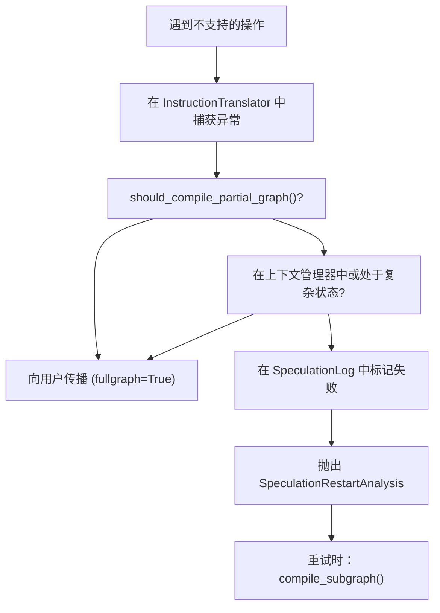
来源： [torch/\_dynamo/exc.py400-700](https://github.com/pytorch/pytorch/blob/915982a4/torch/_dynamo/exc.py#L400-L700) [torch/\_dynamo/symbolic\_convert.py660-690](https://github.com/pytorch/pytorch/blob/915982a4/torch/_dynamo/symbolic_convert.py#L660-L690)

位于 [exc.py800-1000](https://github.com/pytorch/pytorch/blob/915982a4/exc.py#L800-L1000) 的 `unimplemented()` 函数构造结构化错误消息，包含：

-   **gb\_type**：图断点类别。
-   **context**：失败的具体操作。
-   **explanation**：不支持的原因。
-   **hints**：如何规避该问题的建议。

这些错误被记录到 `graph_break_log` 中以便调试，并出现在 [torch/\_dynamo/graph\_break\_registry.json](https://github.com/pytorch/pytorch/blob/915982a4/torch/_dynamo/graph_break_registry.json) 处的图断点注册表中。

## 性能优化 (Performance Optimizations)

### 变量缓存策略 (Variable Caching Strategy)

`OutputGraph` 中位于 [output\_graph.py800-900](https://github.com/pytorch/pytorch/blob/915982a4/output_graph.py#L800-L900) 的 `variable_tracker_cache` 用于对变量进行去重：

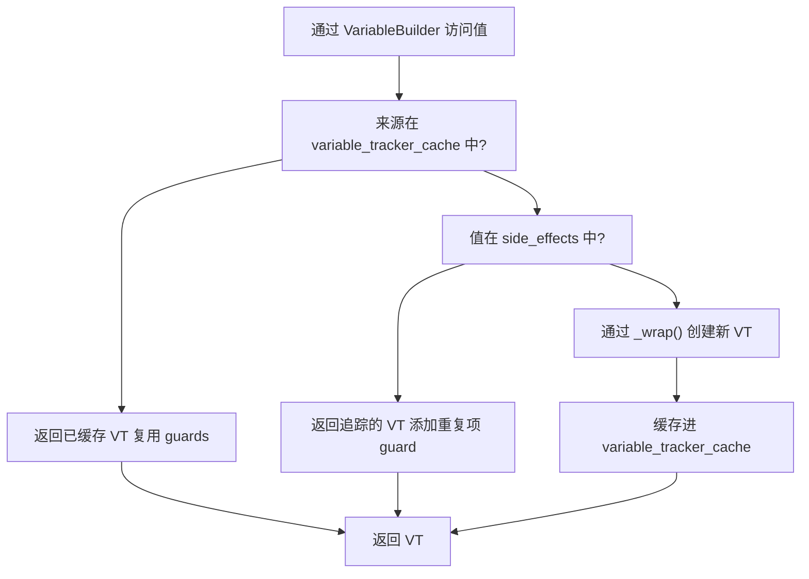
来源： [torch/\_dynamo/variables/builder.py508-549](https://github.com/pytorch/pytorch/blob/915982a4/torch/_dynamo/variables/builder.py#L508-L549) [torch/\_dynamo/output\_graph.py800-900](https://github.com/pytorch/pytorch/blob/915982a4/torch/_dynamo/output_graph.py#L800-L900)

### 其他优化 (Other Optimizations)

| 优化项 | 位置 | 益处 |
| --- | --- | --- |
| 延迟变量追踪 | [variables/lazy.py](https://github.com/pytorch/pytorch/blob/915982a4/variables/lazy.py) | 推迟 guard 直到值被访问 |
| 常量折叠 | [variables/torch.py206-406](https://github.com/pytorch/pytorch/blob/915982a4/variables/torch.py#L206-L406) | 在追踪时评估纯函数 |
| Guard 去重 | [guards.py600-700](https://github.com/pytorch/pytorch/blob/915982a4/guards.py#L600-L700) | 每个唯一条件仅需单个 guard |
| 字节码缓存 | [bytecode\_transformation.py1-200](https://github.com/pytorch/pytorch/blob/915982a4/bytecode_transformation.py#L1-L200) | 每个函数仅解析一次字节码 |
| 内联函数缓存 | [variables/functions.py172-178](https://github.com/pytorch/pytorch/blob/915982a4/variables/functions.py#L172-L178) | 为 bind\_args 缓存 FunctionSpec |

来源：表中列出的多个文件

## 与 Guards 的集成 (Integration with Guards)

虽然 guard 生成的详情在 [Guard 系统与重新编译 (Guard System and Recompilation)](/pytorch/pytorch/2.2.3-guard-system-and-recompilation) 中，但前端在追踪过程中会不断收集 guards：

**Guard 安装点**：

-   类型检查：`install_guard(source.make_guard(GuardBuilder.TYPE_MATCH))`
-   数值检查：`install_guard(source.make_guard(GuardBuilder.CONSTANT_MATCH))`
-   形状检查：`install_guard(source.make_guard(GuardBuilder.TENSOR_MATCH))`
-   标识检查：`install_guard(source.make_guard(GuardBuilder.ID_MATCH))`

Guards 的流向为 `VariableTracker` → `Source` → `GuardBuilder` → `OutputGraph` 中的 `GuardManager`。在执行时，使用已缓存的编译图之前会检查所有 guards。

来源： [torch/\_dynamo/guards.py400-700](https://github.com/pytorch/pytorch/blob/915982a4/torch/_dynamo/guards.py#L400-L700) [torch/\_dynamo/variables/builder.py563-571](https://github.com/pytorch/pytorch/blob/915982a4/torch/_dynamo/variables/builder.py#L563-L571)

## 总结 (Summary)

TorchDynamo 前端通过以下方式将 Python 字节码转换为 FX 图：

1.  **帧拦截**：CPython 级别的自定义 eval 帧钩子。
2.  **符号执行**：`InstructionTranslator` 通过操作码处理器符号化地处理字节码。
3.  **变量追踪**：`VariableTracker` 层级结构（50+ 类型）符号化地表示 Python 值。
4.  **图构建**：`OutputGraph` 和 `SubgraphTracer` 通过 `create_proxy()` 构建 FX 图。
5.  **Guard 收集**：`Source` 对象追踪值的来源以进行 guard 生成。
6.  **推测系统**：`SpeculationLog` 通过重启机制处理不确定的控制流。
7.  **部分编译**：图断点实现了编译执行与 eager 执行的混合。
8.  **代码生成**：`PyCodegen` 为图断点后的执行创建恢复函数。

这种架构处理了多样化的 Python 和 PyTorch 模式，同时通过 guards 保持正确性，并通过编译提升性能。

来源： [torch/\_dynamo/symbolic\_convert.py1-200](https://github.com/pytorch/pytorch/blob/915982a4/torch/_dynamo/symbolic_convert.py#L1-L200) [torch/\_dynamo/variables/builder.py1-100](https://github.com/pytorch/pytorch/blob/915982a4/torch/_dynamo/variables/builder.py#L1-L100) [torch/\_dynamo/output\_graph.py1-200](https://github.com/pytorch/pytorch/blob/915982a4/torch/_dynamo/output_graph.py#L1-L200) [torch/\_dynamo/guards.py1-100](https://github.com/pytorch/pytorch/blob/915982a4/torch/_dynamo/guards.py#L1-L100)
