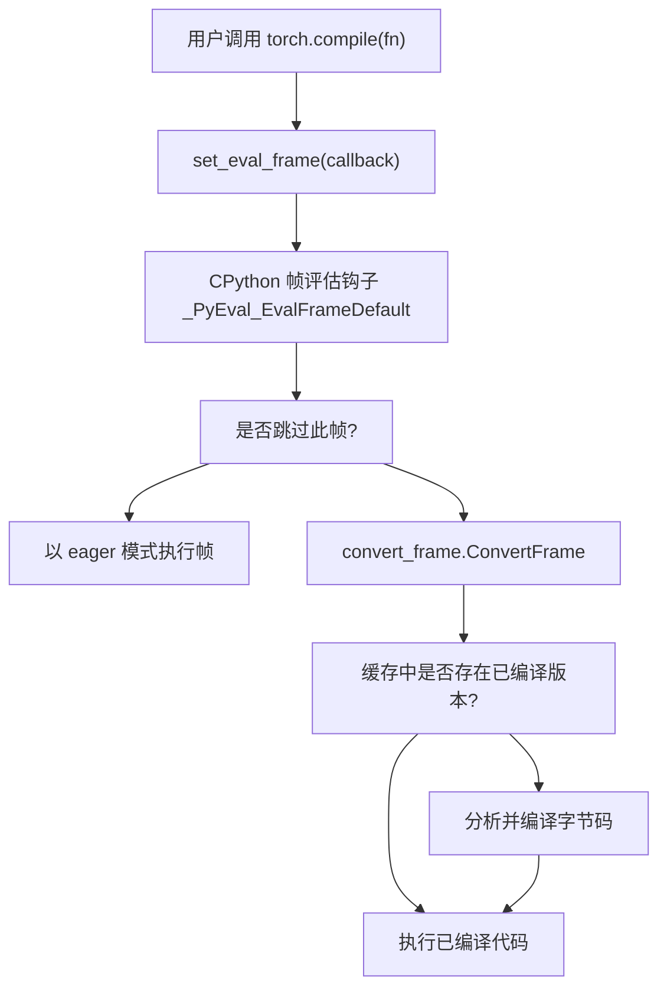
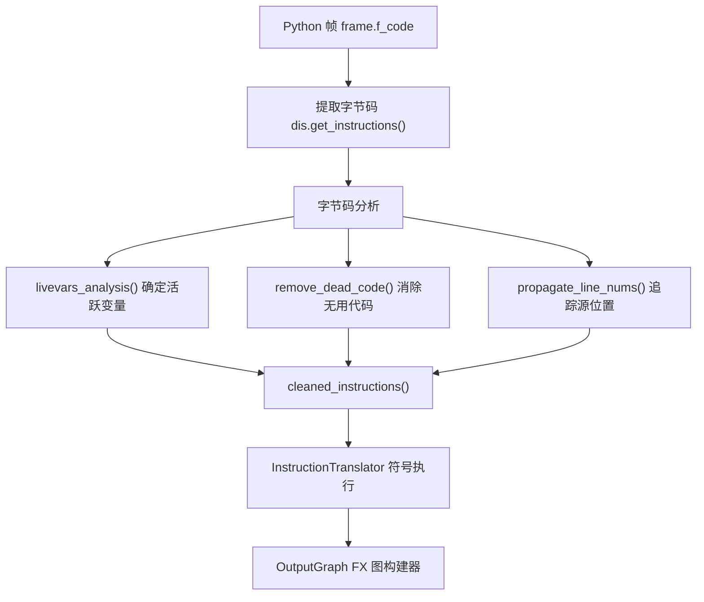
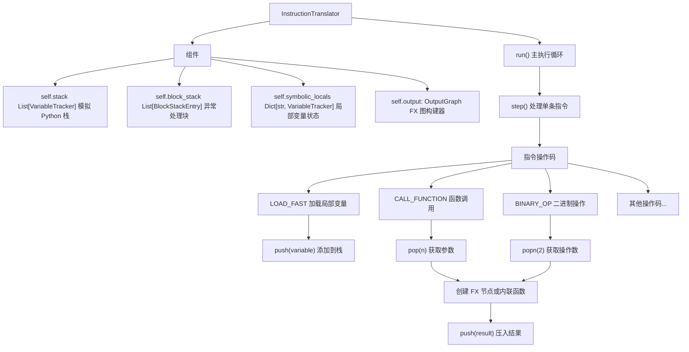
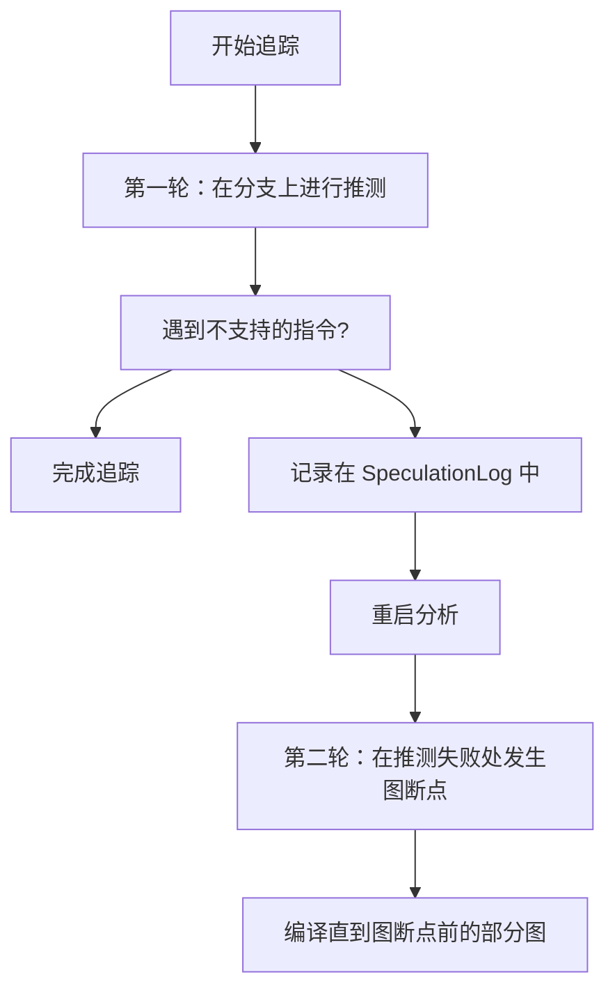
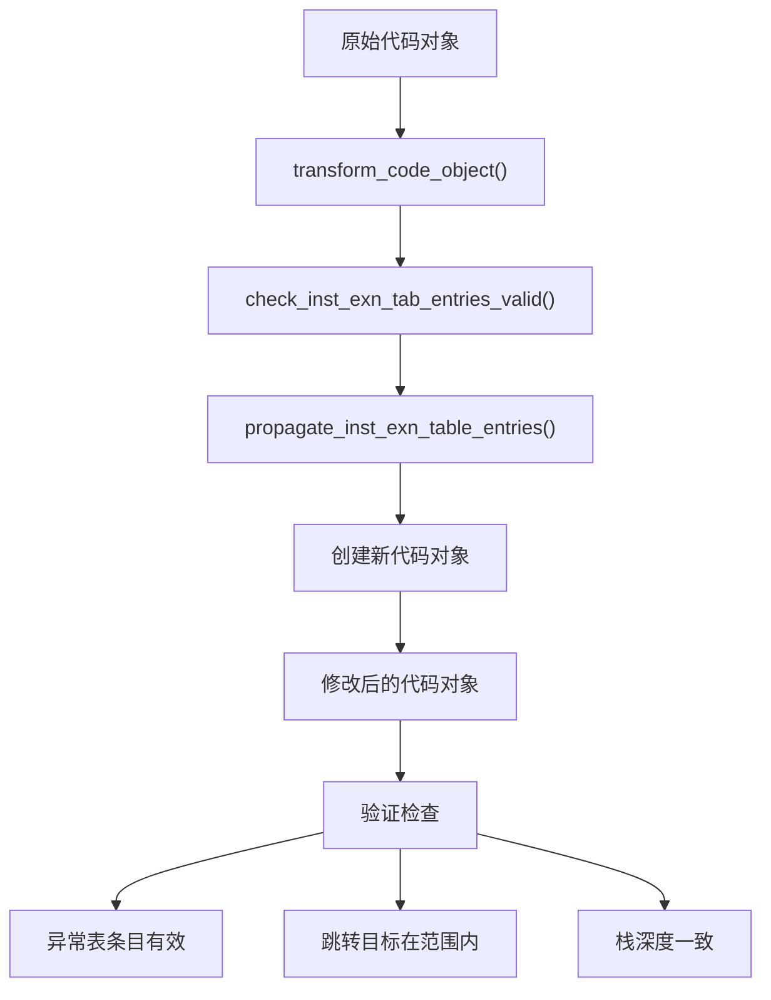
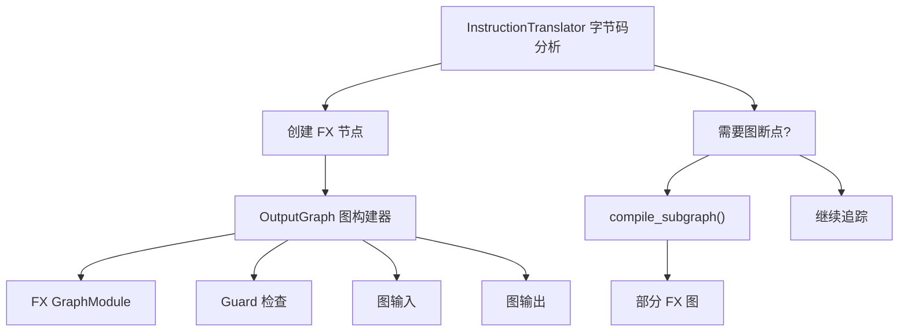

# 帧评估与字节码分析 (Frame Evaluation and Bytecode Analysis)

相关源文件 (Relevant source files)

-   [aten/src/ATen/core/PythonFallbackKernel.cpp](https://github.com/pytorch/pytorch/blob/915982a4/aten/src/ATen/core/PythonFallbackKernel.cpp)
-   [test/distributed/\_composable/fsdp/test\_fully\_shard\_compile.py](https://github.com/pytorch/pytorch/blob/915982a4/test/distributed/_composable/fsdp/test_fully_shard_compile.py)
-   [test/dynamo/test\_dicts.py](https://github.com/pytorch/pytorch/blob/915982a4/test/dynamo/test_dicts.py)
-   [test/dynamo/test\_error\_messages.py](https://github.com/pytorch/pytorch/blob/915982a4/test/dynamo/test_error_messages.py)
-   [test/dynamo/test\_functions.py](https://github.com/pytorch/pytorch/blob/915982a4/test/dynamo/test_functions.py)
-   [test/dynamo/test\_fwd\_loss\_bwd.py](https://github.com/pytorch/pytorch/blob/915982a4/test/dynamo/test_fwd_loss_bwd.py)
-   [test/dynamo/test\_list.py](https://github.com/pytorch/pytorch/blob/915982a4/test/dynamo/test_list.py)
-   [test/dynamo/test\_misc.py](https://github.com/pytorch/pytorch/blob/915982a4/test/dynamo/test_misc.py)
-   [test/dynamo/test\_modules.py](https://github.com/pytorch/pytorch/blob/915982a4/test/dynamo/test_modules.py)
-   [test/dynamo/test\_nested\_graph\_breaks.py](https://github.com/pytorch/pytorch/blob/915982a4/test/dynamo/test_nested_graph_breaks.py)
-   [test/dynamo/test\_repros.py](https://github.com/pytorch/pytorch/blob/915982a4/test/dynamo/test_repros.py)
-   [test/dynamo/test\_utils.py](https://github.com/pytorch/pytorch/blob/915982a4/test/dynamo/test_utils.py)
-   [test/dynamo\_expected\_failures/TestCustomOp.test\_impl\_device\_cpu](https://github.com/pytorch/pytorch/blob/915982a4/test/dynamo_expected_failures/TestCustomOp.test_impl_device_cpu)
-   [test/export/test\_experimental.py](https://github.com/pytorch/pytorch/blob/915982a4/test/export/test_experimental.py)
-   [test/export/test\_export.py](https://github.com/pytorch/pytorch/blob/915982a4/test/export/test_export.py)
-   [test/fx/test\_fx\_xform\_observer.py](https://github.com/pytorch/pytorch/blob/915982a4/test/fx/test_fx_xform_observer.py)
-   [test/profiler/test\_record\_function.py](https://github.com/pytorch/pytorch/blob/915982a4/test/profiler/test_record_function.py)
-   [test/profiler/test\_torch\_tidy.py](https://github.com/pytorch/pytorch/blob/915982a4/test/profiler/test_torch_tidy.py)
-   [test/test\_dynamic\_shapes.py](https://github.com/pytorch/pytorch/blob/915982a4/test/test_dynamic_shapes.py)
-   [test/test\_proxy\_tensor.py](https://github.com/pytorch/pytorch/blob/915982a4/test/test_proxy_tensor.py)
-   [torch/\_dynamo/bytecode\_analysis.py](https://github.com/pytorch/pytorch/blob/915982a4/torch/_dynamo/bytecode_analysis.py)
-   [torch/\_dynamo/bytecode\_transformation.py](https://github.com/pytorch/pytorch/blob/915982a4/torch/_dynamo/bytecode_transformation.py)
-   [torch/\_dynamo/codegen.py](https://github.com/pytorch/pytorch/blob/915982a4/torch/_dynamo/codegen.py)
-   [torch/\_dynamo/config.py](https://github.com/pytorch/pytorch/blob/915982a4/torch/_dynamo/config.py)
-   [torch/\_dynamo/convert\_frame.py](https://github.com/pytorch/pytorch/blob/915982a4/torch/_dynamo/convert_frame.py)
-   [torch/\_dynamo/eval\_frame.py](https://github.com/pytorch/pytorch/blob/915982a4/torch/_dynamo/eval_frame.py)
-   [torch/\_dynamo/exc.py](https://github.com/pytorch/pytorch/blob/915982a4/torch/_dynamo/exc.py)
-   [torch/\_dynamo/functional\_export.py](https://github.com/pytorch/pytorch/blob/915982a4/torch/_dynamo/functional_export.py)
-   [torch/\_dynamo/graph\_break\_registry.json](https://github.com/pytorch/pytorch/blob/915982a4/torch/_dynamo/graph_break_registry.json)
-   [torch/\_dynamo/output\_graph.py](https://github.com/pytorch/pytorch/blob/915982a4/torch/_dynamo/output_graph.py)
-   [torch/\_dynamo/resume\_execution.py](https://github.com/pytorch/pytorch/blob/915982a4/torch/_dynamo/resume_execution.py)
-   [torch/\_dynamo/side\_effects.py](https://github.com/pytorch/pytorch/blob/915982a4/torch/_dynamo/side_effects.py)
-   [torch/\_dynamo/symbolic\_convert.py](https://github.com/pytorch/pytorch/blob/915982a4/torch/_dynamo/symbolic_convert.py)
-   [torch/\_dynamo/test\_case.py](https://github.com/pytorch/pytorch/blob/915982a4/torch/_dynamo/test_case.py)
-   [torch/\_dynamo/testing.py](https://github.com/pytorch/pytorch/blob/915982a4/torch/_dynamo/testing.py)
-   [torch/\_dynamo/trace\_rules.py](https://github.com/pytorch/pytorch/blob/915982a4/torch/_dynamo/trace_rules.py)
-   [torch/\_dynamo/utils.py](https://github.com/pytorch/pytorch/blob/915982a4/torch/_dynamo/utils.py)
-   [torch/\_dynamo/variables/\_\_init\_\_.py](https://github.com/pytorch/pytorch/blob/915982a4/torch/_dynamo/variables/__init__.py)
-   [torch/\_dynamo/variables/base.py](https://github.com/pytorch/pytorch/blob/915982a4/torch/_dynamo/variables/base.py)
-   [torch/\_dynamo/variables/builder.py](https://github.com/pytorch/pytorch/blob/915982a4/torch/_dynamo/variables/builder.py)
-   [torch/\_dynamo/variables/builtin.py](https://github.com/pytorch/pytorch/blob/915982a4/torch/_dynamo/variables/builtin.py)
-   [torch/\_dynamo/variables/constant.py](https://github.com/pytorch/pytorch/blob/915982a4/torch/_dynamo/variables/constant.py)
-   [torch/\_dynamo/variables/ctx\_manager.py](https://github.com/pytorch/pytorch/blob/915982a4/torch/_dynamo/variables/ctx_manager.py)
-   [torch/\_dynamo/variables/dicts.py](https://github.com/pytorch/pytorch/blob/915982a4/torch/_dynamo/variables/dicts.py)
-   [torch/\_dynamo/variables/functions.py](https://github.com/pytorch/pytorch/blob/915982a4/torch/_dynamo/variables/functions.py)
-   [torch/\_dynamo/variables/higher\_order\_ops.py](https://github.com/pytorch/pytorch/blob/915982a4/torch/_dynamo/variables/higher_order_ops.py)
-   [torch/\_dynamo/variables/iter.py](https://github.com/pytorch/pytorch/blob/915982a4/torch/_dynamo/variables/iter.py)
-   [torch/\_dynamo/variables/lists.py](https://github.com/pytorch/pytorch/blob/915982a4/torch/_dynamo/variables/lists.py)
-   [torch/\_dynamo/variables/misc.py](https://github.com/pytorch/pytorch/blob/915982a4/torch/_dynamo/variables/misc.py)
-   [torch/\_dynamo/variables/nn\_module.py](https://github.com/pytorch/pytorch/blob/915982a4/torch/_dynamo/variables/nn_module.py)
-   [torch/\_dynamo/variables/optimizer.py](https://github.com/pytorch/pytorch/blob/915982a4/torch/_dynamo/variables/optimizer.py)
-   [torch/\_dynamo/variables/tensor.py](https://github.com/pytorch/pytorch/blob/915982a4/torch/_dynamo/variables/tensor.py)
-   [torch/\_dynamo/variables/torch.py](https://github.com/pytorch/pytorch/blob/915982a4/torch/_dynamo/variables/torch.py)
-   [torch/\_dynamo/variables/user\_defined.py](https://github.com/pytorch/pytorch/blob/915982a4/torch/_dynamo/variables/user_defined.py)
-   [torch/\_export/non\_strict\_utils.py](https://github.com/pytorch/pytorch/blob/915982a4/torch/_export/non_strict_utils.py)
-   [torch/export/\_\_init\_\_.py](https://github.com/pytorch/pytorch/blob/915982a4/torch/export/__init__.py)
-   [torch/export/\_trace.py](https://github.com/pytorch/pytorch/blob/915982a4/torch/export/_trace.py)
-   [torch/fx/experimental/symbolic\_shapes.py](https://github.com/pytorch/pytorch/blob/915982a4/torch/fx/experimental/symbolic_shapes.py)
-   [torch/fx/passes/graph\_transform\_observer.py](https://github.com/pytorch/pytorch/blob/915982a4/torch/fx/passes/graph_transform_observer.py)

## 目的与范围 (Purpose and Scope)

本文档描述了 TorchDynamo 如何在运行时拦截 Python 帧 (frame) 的执行，并分析字节码指令以将 PyTorch 操作捕获进 FX 图中。这是在 `torch.compile` 中启用动态编译的基础机制。

**范围**：本页涵盖了帧评估钩子 (frame evaluation hook) 机制和字节码级的追踪。有关如何将字节码指令转换为符号值和变量追踪器的信息，请参阅[变量追踪与符号执行 (Variable Tracking and Symbolic Execution)](/pytorch/pytorch/2.2.2-variable-tracking-and-symbolic-execution)。有关在此过程中如何创建和管理 guards 的信息，请参阅 [Guard 系统与重新编译 (Guard System and Recompilation)](/pytorch/pytorch/2.2.3-guard-system-and-recompilation)。

---

## 帧评估钩子机制 (Frame Evaluation Hook Mechanism)

TorchDynamo 通过使用 CPython 的 `_PyEval_RequestCodeExtraIndex` 和 `_PyEval_SetProfile` API 安装自定义的帧评估函数来拦截 Python 代码的执行。这允许 Dynamo 在代码对象执行之前对其进行检查并可能进行重写。

### 钩子安装 (Hook Installation)

帧评估钩子通过 `set_eval_frame` 函数安装，该函数注册一个回调，CPython 在执行每个代码对象之前都会调用该回调。


**帧评估钩子注册流程**

来源： [torch/\_dynamo/eval\_frame.py1-500](https://github.com/pytorch/pytorch/blob/915982a4/torch/_dynamo/eval_frame.py#L1-L500)

核心钩子在 `torch/_dynamo/eval_frame.py` 中实现：

-   `set_eval_frame(callback)` - 安装帧评估回调。
-   `reset_code(code)` - 将代码对象重置为其原始状态。
-   `skip_code(code)` - 标记一个代码对象跳过编译。
-   `TorchPatcher` 类 - 管理 eval 帧钩子的修补 (patching) 和去修补 (unpatching)。

### 帧跳过决策 (Frame Skip Decisions)

并非所有帧都应该被编译。Dynamo 使用几种启发式方法来决定是否追踪一个帧：

| 跳过原因 | 检查位置 | 示例 |
| --- | --- | --- |
| Dynamo 内部代码 | `is_dynamo_code()` | `torch._dynamo.*` 中的帧 |
| 显式跳过 | 调用了 `skip_code()` | 用户标记的跳过区域 |
| 代码太短 | 代码大小启发式方法 | 单行函数 |
| 不可追踪 | `trace_rules.check()` | 标准库代码 |
| 已经编译 | 缓存查找 | 之前使用相同的 guards 编译过 |

来源： [torch/\_dynamo/eval\_frame.py300-400](https://github.com/pytorch/pytorch/blob/915982a4/torch/_dynamo/eval_frame.py#L300-L400) [torch/\_dynamo/trace\_rules.py1-100](https://github.com/pytorch/pytorch/blob/915982a4/torch/_dynamo/trace_rules.py#L1-L100)

---

## 字节码分析流水线 (Bytecode Analysis Pipeline)

一旦 Dynamo 决定编译一个帧，字节码就会经历几个分析和转换阶段：


**字节码分析与转换流水线**

来源： [torch/\_dynamo/bytecode\_analysis.py1-300](https://github.com/pytorch/pytorch/blob/915982a4/torch/_dynamo/bytecode_analysis.py#L1-L300) [torch/\_dynamo/bytecode\_transformation.py1-200](https://github.com/pytorch/pytorch/blob/915982a4/torch/_dynamo/bytecode_transformation.py#L1-L200)

### 关键分析函数 (Key Analysis Functions)

字节码分析模块提供了理解和转换字节码的工具：

**活跃变量分析 (Liveness Analysis)**

-   `livevars_analysis(instructions, cells, codeobj)` - 使用数据流分析计算程序每个点有哪些活跃变量。
-   返回一个将指令偏移量映射到活跃变量名集合的字典。
-   用于确定哪些变量需要在闭包和恢复函数 (resume functions) 中捕获。

**代码清理 (Code Cleaning)**

-   `remove_dead_code(instructions)` - 消除 return/raise 之后不可达的字节码。
-   `remove_pointless_jumps(instructions)` - 优化跳转链并移除空操作跳转。
-   `cleaned_instructions(code)` - 返回清理后的 `Instruction` 对象列表。

**控制流分析 (Control Flow Analysis)**

-   `JUMP_OPNAMES` - 执行跳转的操作码集合。
-   `get_indexof(instructions, target)` - 将指令对象映射到它们的索引。
-   为推测 (speculation) 和 guard 放置构建控制流图。

来源： [torch/\_dynamo/bytecode\_analysis.py40-150](https://github.com/pytorch/pytorch/blob/915982a4/torch/_dynamo/bytecode_analysis.py#L40-L150) [torch/\_dynamo/bytecode\_transformation.py200-400](https://github.com/pytorch/pytorch/blob/915982a4/torch/_dynamo/bytecode_transformation.py#L200-L400)

---

## 指令转换 (Instruction Translation)

`InstructionTranslator` 类执行字节码指令的符号执行，将它们转换为图操作和变量追踪器。

### InstructionTranslator 架构


**InstructionTranslator 类结构**

来源： [torch/\_dynamo/symbolic\_convert.py1-500](https://github.com/pytorch/pytorch/blob/915982a4/torch/_dynamo/symbolic_convert.py#L1-L500)

### 核心转换方法 (Core Translation Methods)

`symbolic_convert.py` 中的 `InstructionTranslator` 类为每个字节码操作码提供了相应的方法：

**栈操作**

-   `push(val: VariableTracker)` - 将一个变量追踪器压入符号栈。
-   `pop()` - 弹出并返回栈顶项。
-   `popn(n: int)` - 从栈中弹出 n 项。

**指令处理**

-   `step()` - 处理当前指令并推进指令指针。
-   `run()` - 主循环，不断调用 `step()` 直到帧执行完成。
-   指令处理器，如 `LOAD_FAST()`、`STORE_FAST()`、`CALL_FUNCTION()` 等。

**控制流**

-   `jump(target: Instruction)` - 将指令指针更新为目标位置。
-   `generic_jump(truth_fn, push)` - 处理条件跳转，可能会创建图断点 (graph breaks)。
-   `RETURN_VALUE()` - 处理函数返回。

来源： [torch/\_dynamo/symbolic\_convert.py800-1500](https://github.com/pytorch/pytorch/blob/915982a4/torch/_dynamo/symbolic_convert.py#L800-L1500)

### 指令处理器示例 (Instruction Handler Example)

以下是典型字节码指令的处理方式：

**LOAD\_FAST (加载局部变量)**

1.  从指令参数中获取变量名。
2.  在 `self.symbolic_locals` 中查找变量。
3.  将相应的 `VariableTracker` 压入栈。

**CALL\_FUNCTION (函数调用)**

1.  从栈中弹出函数和参数。
2.  检查函数是否可以被内联 (inlined) 或追踪。
3.  如果是：内联该调用并继续追踪。
4.  如果否：发出图节点或图断点。

**BINARY\_OP (二进制操作，如 ADD, SUB)**

1.  从栈中弹出两个操作数。
2.  在变量追踪器上调用操作符方法。
3.  将结果压入栈（可能会创建 FX 节点）。

来源： [torch/\_dynamo/symbolic\_convert.py1500-2000](https://github.com/pytorch/pytorch/blob/915982a4/torch/_dynamo/symbolic_convert.py#L1500-L2000)

---

## 推测与重启 (Speculation and Restarts)

TorchDynamo 使用推测执行来处理动态控制流。当追踪遇到数据依赖的分支时，它可能会推测走哪条路径。

### SpeculationLog

`SpeculationLog` 追踪字节码分析期间的推测尝试和失败：


**推测与重启流程**

来源： [torch/\_dynamo/symbolic\_convert.py240-350](https://github.com/pytorch/pytorch/blob/915982a4/torch/_dynamo/symbolic_convert.py#L240-L350)

**SpeculationLog 结构**

-   `entries: List[SpeculationEntry]` - 记录的推测点。
-   `index: int` - 回放期间在日志中的当前位置。
-   `next(filename, lineno, inst)` - 获取或创建推测条目。
-   `restart()` - 重置索引以便从头开始回放。
-   用于使追踪在多次重启之间保持确定性。

**SpeculationEntry**

-   记录导致推测的指令指针和指令。
-   `_failed: bool` - 此推测之前是否失败。
-   `fail_and_restart_analysis()` - 将条目标记为失败并抛出 `SpeculationRestartAnalysis`。
-   在后续轮次中，检查 `failed()` 以插入图断点而不是重新尝试。

来源： [torch/\_dynamo/symbolic\_convert.py240-270](https://github.com/pytorch/pytorch/blob/915982a4/torch/_dynamo/symbolic_convert.py#L240-L270)

---

## 字节码指令表示 (Bytecode Instruction Representation)

Dynamo 使用自定义的 `Instruction` 数据类来表示带有额外元数据的字节码指令：

### Instruction 类

```python
@dataclass
class Instruction:    
    opcode: int           # 字节码操作码数字    
    opname: str          # 易读的操作码名称    
    arg: Optional[int]   # 指令参数    
    argval: Any          # 解析后的参数值    
    offset: int          # 代码对象中的字节偏移量    
    starts_line: Optional[int]  # 源码行号    
    is_jump_target: bool # 是否为跳转目标?    
    target: Optional[Instruction]  # 针对跳转指令
    # 针对异常表、位置等的额外字段
```
**关键指令工具**

-   `create_instruction(opname, arg, target)` - 创建指令的工厂函数。
-   `create_call_function(nargs)` - 创建 `CALL_FUNCTION` 指令。
-   `create_jump_absolute(target)` - 创建跳转到目标的指令。
-   `create_rot_n(n)` - 创建栈旋转指令。
-   `is_jump_absolute(inst)` - 检查指令是否为绝对跳转。

来源： [torch/\_dynamo/bytecode\_transformation.py50-200](https://github.com/pytorch/pytorch/blob/915982a4/torch/_dynamo/bytecode_transformation.py#L50-L200)

---

## 字节码转换工具 (Bytecode Transformation Utilities)

`bytecode_transformation` 模块提供了修改和生成字节码的工具：

### 代码对象转换 (Code Object Transformation)


**代码对象转换流水线**

来源： [torch/\_dynamo/bytecode\_transformation.py300-600](https://github.com/pytorch/pytorch/blob/915982a4/torch/_dynamo/bytecode_transformation.py#L300-L600)

**关键函数**

-   `transform_code_object(code, transform_fn)` - 将转换函数应用于代码对象的指令。
-   `check_inst_exn_tab_entries_valid(insts)` - 验证异常表条目引用了有效的指令。
-   `propagate_inst_exn_table_entries(old, new)` - 从旧指令向新指令拷贝异常处理元数据。
-   `propagate_line_nums(old, new)` - 保留源码行号信息。

**指令创建辅助函数**

-   `create_load_const(value)` - 创建 `LOAD_CONST` 指令。
-   `create_binary_slice(start, stop, step)` - 创建切片对象构造。
-   `create_build_tuple(n)` - 创建带 n 项的 `BUILD_TUPLE`。
-   `create_dup_top()` - 创建 `DUP_TOP` 指令。
-   `create_swap(n)` - 创建 `SWAP` 指令 (3.11+)。

来源： [torch/\_dynamo/bytecode\_transformation.py400-800](https://github.com/pytorch/pytorch/blob/915982a4/torch/_dynamo/bytecode_transformation.py#L400-L800)

---

## 帧状态与上下文 (Frame State and Context)

在字节码分析期间，Dynamo 维护了关于正在追踪的帧的几项状态：

### 帧上下文追踪 (Frame Context Tracking)

| 状态组件 | 位置 | 目的 |
| --- | --- | --- |
| 指令指针 | `self.instruction_pointer` | 当前字节码偏移量 |
| Python 栈 | `self.stack` | 符号执行栈 |
| 局部变量 | `self.symbolic_locals` | 变量名 → VariableTracker |
| 块栈 | `self.block_stack` | 异常处理程序嵌套 |
| Cell 变量 | `self.symbolic_cell_vars` | 闭包 cell 变量 |
| 全局作用域 | `self.f_globals` | 全局命名空间 |
| 代码对象 | `self.f_code` | 函数代码对象 |

**InstructionTranslator 状态管理**

-   状态在推测点进行检查点记录 (checkpointed)。
-   重启时，状态恢复到检查点。
-   Guard 违规会触发带有全新状态的重新编译。

来源： [torch/\_dynamo/symbolic\_convert.py500-700](https://github.com/pytorch/pytorch/blob/915982a4/torch/_dynamo/symbolic_convert.py#L500-L700)

---

## 与 OutputGraph 的集成 (Integration with OutputGraph)

`InstructionTranslator` 与 `OutputGraph` 紧密协作以构建 FX 图：


**InstructionTranslator 与 OutputGraph 集成**

来源： [torch/\_dynamo/symbolic\_convert.py700-900](https://github.com/pytorch/pytorch/blob/915982a4/torch/_dynamo/symbolic_convert.py#L700-L900) [torch/\_dynamo/output\_graph.py1-200](https://github.com/pytorch/pytorch/blob/915982a4/torch/_dynamo/output_graph.py#L1-L200)

**关键交互**

-   `self.output.create_proxy(kind, target, args, kwargs)` - 在图中创建 FX 节点。
-   `self.output.compile_subgraph(tx, reason)` - 触发部分图的编译。
-   `self.output.add_output_instructions(insts)` - 添加恢复字节码。
-   `self.output.side_effects` - 追踪对对象的变异。

有关 FX 图如何构建和管理的更多详情，请参阅编译流水线章节中的 `OutputGraph` 文档。

---

## 总结 (Summary)

帧评估与字节码分析构成了 TorchDynamo 追踪系统的基础：

1.  **帧钩子**：CPython eval 帧钩子拦截函数执行。
2.  **跳过逻辑**：启发式方法确定哪些帧需要编译。
3.  **字节码提取**：提取并分析代码对象的字节码。
4.  **指令转换**：`InstructionTranslator` 符号化地执行每条指令。
5.  **变量追踪**：字节码操作创建 `VariableTracker` 对象（参见[变量追踪](/pytorch/pytorch/2.2.2-variable-tracking-and-symbolic-execution)）。
6.  **图构建**：操作通过 `OutputGraph` 记录在 FX 图中。
7.  **Guard 创建**：使用 guards 追踪动态行为（参见 [Guard 系统](/pytorch/pytorch/2.2.3-guard-system-and-recompilation)）。
8.  **推测**：使用推测与重启机制处理动态控制流。

这种架构允许 Dynamo 动态编译 PyTorch 代码，同时保留 Python 语义并处理 Python 字节码执行的完整复杂性。
