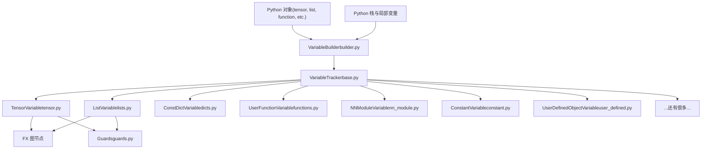
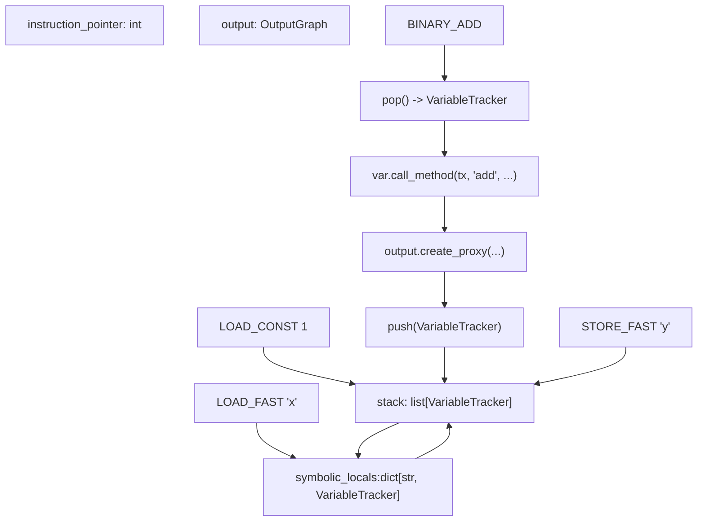
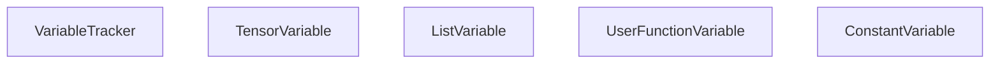
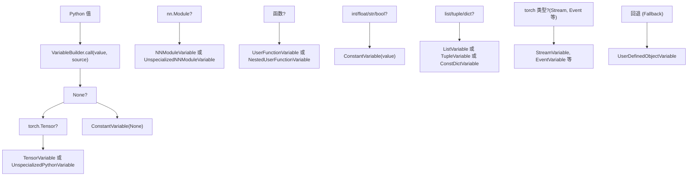
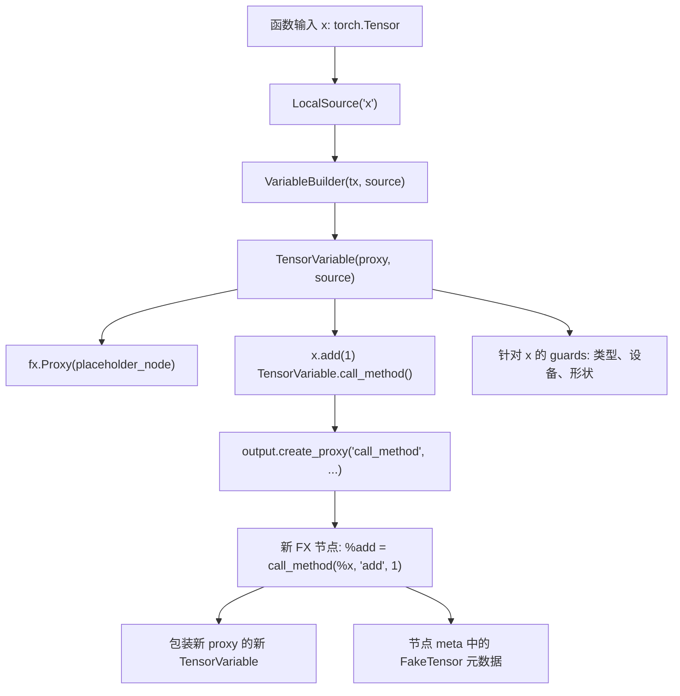
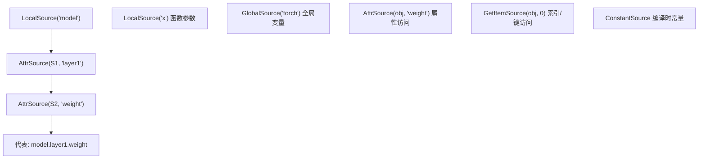
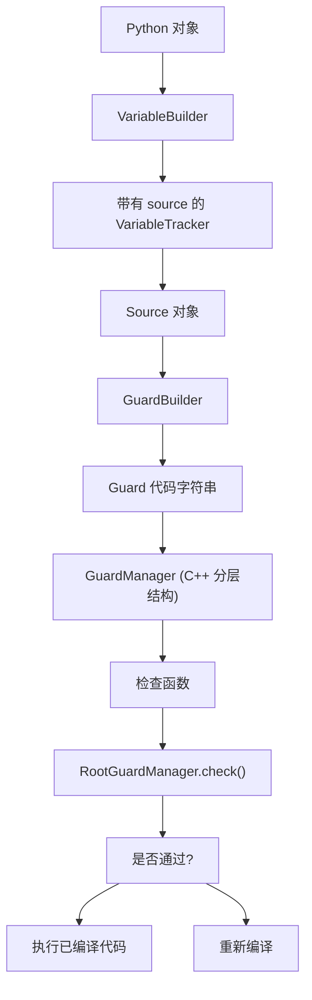

# 变量追踪与符号执行 (Variable Tracking and Symbolic Execution)

相关源文件 (Relevant source files)

-   [test/distributed/\_composable/fsdp/test\_fully\_shard\_compile.py](https://github.com/pytorch/pytorch/blob/915982a4/test/distributed/_composable/fsdp/test_fully_shard_compile.py)
-   [test/dynamo/test\_dicts.py](https://github.com/pytorch/pytorch/blob/915982a4/test/dynamo/test_dicts.py)
-   [test/dynamo/test\_error\_messages.py](https://github.com/pytorch/pytorch/blob/915982a4/test/dynamo/test_error_messages.py)
-   [test/dynamo/test\_functions.py](https://github.com/pytorch/pytorch/blob/915982a4/test/dynamo/test_functions.py)
-   [test/dynamo/test\_fwd\_loss\_bwd.py](https://github.com/pytorch/pytorch/blob/915982a4/test/dynamo/test_fwd_loss_bwd.py)
-   [test/dynamo/test\_list.py](https://github.com/pytorch/pytorch/blob/915982a4/test/dynamo/test_list.py)
-   [test/dynamo/test\_misc.py](https://github.com/pytorch/pytorch/blob/915982a4/test/dynamo/test_misc.py)
-   [test/dynamo/test\_modules.py](https://github.com/pytorch/pytorch/blob/915982a4/test/dynamo/test_modules.py)
-   [test/dynamo/test\_nested\_graph\_breaks.py](https://github.com/pytorch/pytorch/blob/915982a4/test/dynamo/test_nested_graph_breaks.py)
-   [test/dynamo/test\_repros.py](https://github.com/pytorch/pytorch/blob/915982a4/test/dynamo/test_repros.py)
-   [test/dynamo\_expected\_failures/TestCustomOp.test\_impl\_device\_cpu](https://github.com/pytorch/pytorch/blob/915982a4/test/dynamo_expected_failures/TestCustomOp.test_impl_device_cpu)
-   [torch/\_dynamo/bytecode\_analysis.py](https://github.com/pytorch/pytorch/blob/915982a4/torch/_dynamo/bytecode_analysis.py)
-   [torch/\_dynamo/bytecode\_transformation.py](https://github.com/pytorch/pytorch/blob/915982a4/torch/_dynamo/bytecode_transformation.py)
-   [torch/\_dynamo/codegen.py](https://github.com/pytorch/pytorch/blob/915982a4/torch/_dynamo/codegen.py)
-   [torch/\_dynamo/exc.py](https://github.com/pytorch/pytorch/blob/915982a4/torch/_dynamo/exc.py)
-   [torch/\_dynamo/graph\_break\_registry.json](https://github.com/pytorch/pytorch/blob/915982a4/torch/_dynamo/graph_break_registry.json)
-   [torch/\_dynamo/output\_graph.py](https://github.com/pytorch/pytorch/blob/915982a4/torch/_dynamo/output_graph.py)
-   [torch/\_dynamo/resume\_execution.py](https://github.com/pytorch/pytorch/blob/915982a4/torch/_dynamo/resume_execution.py)
-   [torch/\_dynamo/side\_effects.py](https://github.com/pytorch/pytorch/blob/915982a4/torch/_dynamo/side_effects.py)
-   [torch/\_dynamo/symbolic\_convert.py](https://github.com/pytorch/pytorch/blob/915982a4/torch/_dynamo/symbolic_convert.py)
-   [torch/\_dynamo/test\_case.py](https://github.com/pytorch/pytorch/blob/915982a4/torch/_dynamo/test_case.py)
-   [torch/\_dynamo/testing.py](https://github.com/pytorch/pytorch/blob/915982a4/torch/_dynamo/testing.py)
-   [torch/\_dynamo/trace\_rules.py](https://github.com/pytorch/pytorch/blob/915982a4/torch/_dynamo/trace_rules.py)
-   [torch/\_dynamo/variables/\_\_init\_\_.py](https://github.com/pytorch/pytorch/blob/915982a4/torch/_dynamo/variables/__init__.py)
-   [torch/\_dynamo/variables/base.py](https://github.com/pytorch/pytorch/blob/915982a4/torch/_dynamo/variables/base.py)
-   [torch/\_dynamo/variables/builder.py](https://github.com/pytorch/pytorch/blob/915982a4/torch/_dynamo/variables/builder.py)
-   [torch/\_dynamo/variables/builtin.py](https://github.com/pytorch/pytorch/blob/915982a4/torch/_dynamo/variables/builtin.py)
-   [torch/\_dynamo/variables/constant.py](https://github.com/pytorch/pytorch/blob/915982a4/torch/_dynamo/variables/constant.py)
-   [torch/\_dynamo/variables/ctx\_manager.py](https://github.com/pytorch/pytorch/blob/915982a4/torch/_dynamo/variables/ctx_manager.py)
-   [torch/\_dynamo/variables/dicts.py](https://github.com/pytorch/pytorch/blob/915982a4/torch/_dynamo/variables/dicts.py)
-   [torch/\_dynamo/variables/functions.py](https://github.com/pytorch/pytorch/blob/915982a4/torch/_dynamo/variables/functions.py)
-   [torch/\_dynamo/variables/higher\_order\_ops.py](https://github.com/pytorch/pytorch/blob/915982a4/torch/_dynamo/variables/higher_order_ops.py)
-   [torch/\_dynamo/variables/iter.py](https://github.com/pytorch/pytorch/blob/915982a4/torch/_dynamo/variables/iter.py)
-   [torch/\_dynamo/variables/lists.py](https://github.com/pytorch/pytorch/blob/915982a4/torch/_dynamo/variables/lists.py)
-   [torch/\_dynamo/variables/misc.py](https://github.com/pytorch/pytorch/blob/915982a4/torch/_dynamo/variables/misc.py)
-   [torch/\_dynamo/variables/nn\_module.py](https://github.com/pytorch/pytorch/blob/915982a4/torch/_dynamo/variables/nn_module.py)
-   [torch/\_dynamo/variables/optimizer.py](https://github.com/pytorch/pytorch/blob/915982a4/torch/_dynamo/variables/optimizer.py)
-   [torch/\_dynamo/variables/tensor.py](https://github.com/pytorch/pytorch/blob/915982a4/torch/_dynamo/variables/tensor.py)
-   [torch/\_dynamo/variables/torch.py](https://github.com/pytorch/pytorch/blob/915982a4/torch/_dynamo/variables/torch.py)
-   [torch/\_dynamo/variables/user\_defined.py](https://github.com/pytorch/pytorch/blob/915982a4/torch/_dynamo/variables/user_defined.py)

## 目的与范围 (Purpose and Scope)

变量追踪与符号执行构成了 TorchDynamo 字节码解释系统的核心。当 Dynamo 拦截 Python 字节码执行时（参见[帧评估与字节码分析](/pytorch/pytorch/2.2.1-frame-evaluation-and-bytecode-analysis)），`InstructionTranslator` 通过以下方式执行**符号执行**：

1.  维护一个 `VariableTracker` 实例的符号栈，该栈镜像了 Python 的执行栈。
2.  将每条字节码指令转换为对 `VariableTracker` 对象的操作。
3.  在适当的时候将操作记录到 FX 图节点中。
4.  安装 guards 以追踪关于运行时数值的假设。

**符号执行**意味着 Dynamo 并不使用实际值执行 Python 字节码，而是使用代表抽象数值的符号化 `VariableTracker` 对象。例如，执行 `x + 1` 时，Dynamo 不会计算实际的和，而是：

-   从符号栈中弹出两个 `VariableTracker` 对象。
-   调用适当的方法（例如 `TensorVariable.__add__()`）。
-   创建一个代表该加法操作的 FX 图节点。
-   将结果 `VariableTracker` 压回栈中。

本页涵盖了：

-   `VariableTracker` 类型层级结构以及如何表示不同的 Python 类型。
-   `InstructionTranslator` 如何操作符号栈。
-   操作是如何被记录到 FX 图中的。
-   用于将 Python 对象转换为追踪器的 `VariableBuilder` 系统。

## 架构概览 (Architecture Overview)

### 高层结构 (High-Level Structure)


**来源：** [torch/\_dynamo/variables/builder.py1-20](https://github.com/pytorch/pytorch/blob/915982a4/torch/_dynamo/variables/builder.py#L1-L20) [torch/\_dynamo/variables/base.py1-36](https://github.com/pytorch/pytorch/blob/915982a4/torch/_dynamo/variables/base.py#L1-L36)

## 符号执行架构 (Symbolic Execution Architecture)

`InstructionTranslator` 类 ([symbolic\_convert.py200-500](https://github.com/pytorch/pytorch/blob/915982a4/symbolic_convert.py#L200-L500)) 实现了符号执行引擎。它维护了：

-   **`stack`**：镜像 Python 数值栈的 `VariableTracker` 实例列表。
-   **`symbolic_locals`**：将变量名映射到 `VariableTracker` 实例的字典。
-   **`output`**：构建 FX 图的 `OutputGraph` 实例。
-   **`instruction_pointer`**：字节码中的当前位置。

**符号执行流程图**


**来源：** [torch/\_dynamo/symbolic\_convert.py200-1000](https://github.com/pytorch/pytorch/blob/915982a4/torch/_dynamo/symbolic_convert.py#L200-L1000) [torch/\_dynamo/output\_graph.py1-100](https://github.com/pytorch/pytorch/blob/915982a4/torch/_dynamo/output_graph.py#L1-L100)

## VariableTracker 类型系统 (VariableTracker Type System)

### VariableTracker 基类

`VariableTracker` 基类 ([variables/base.py60-400](https://github.com/pytorch/pytorch/blob/915982a4/variables/base.py#L60-L400)) 是所有符号表示的抽象基础。每个 `VariableTracker` 实例代表符号执行期间的一个 Python 值，并提供：

| 能力 | 方法 / 属性 | 描述 |
| --- | --- | --- |
| **来源追踪 (Source Tracking)** | `self.source: Source | None` | 追踪来源以便生成 guard |
| **Proxy 创建** | `as_proxy() -> fx.Proxy` | 转换为 FX proxy 以构建图 |
| **常量折叠 (Constant Folding)** | `as_python_constant() -> Any` | 如果静态已知，返回 Python 值 |
| **类型检查** | `is_python_constant() -> bool` | 检查值是否为常量 |
| **方法调用** | `call_method(tx, name, args, kwargs)` | 处理属性/方法调用 |
| **函数调用** | `call_function(tx, args, kwargs)` | 处理将变量作为函数调用 |
| **操作符** | `__add__`, `__getitem__` 等 | 针对 Python 操作符的魔术方法 |
| **重构 (Reconstruction)** | `reconstruct(codegen)` | 发出字节码以重新创建该值 |
| **变异追踪 (Mutation Tracking)** | `self.mutable_local: MutableLocal | None` | 记录用于副作用的变异 |


**来源：** [torch/\_dynamo/variables/base.py60-400](https://github.com/pytorch/pytorch/blob/915982a4/torch/_dynamo/variables/base.py#L60-L400)

## VariableBuilder：从 Python 对象创建追踪器 (VariableBuilder: Creating Trackers from Python Objects)

### VariableBuilder 系统

`VariableBuilder` 类 ([variables/builder.py700-1200](https://github.com/pytorch/pytorch/blob/915982a4/torch/_dynamo/variables/builder.py#L700-L1200)) 将 Python 对象转换为 `VariableTracker` 实例。存在两个变体：

**VariableBuilder**：针对具有已知 `Source` 的对象（函数输入、模块属性、全局变量）。

-   签名：`VariableBuilder(tx, source)(python_value)`
-   根据来源生成 guards。
-   追踪来源以便用于错误消息和调试。
-   在初始帧设置期间使用。

**SourcelessBuilder**：针对符号执行期间创建的临时对象。

-   签名：`SourcelessBuilder(tx)(python_value)`
-   无来源追踪或 guard 生成。
-   用于中间值，如临时列表。
-   构建开销更轻。

### 类型分发策略 (Type Dispatch Strategy)

**Variable Builder 类型分发图**


**类型检查顺序** ([builder.py800-1150](https://github.com/pytorch/pytorch/blob/915982a4/builder.py#L800-L1150))：

1.  **None** → `ConstantVariable(None)`
2.  **`torch.Tensor`** → `TensorVariable`（带有 FX proxy）或 `UnspecializedPythonVariable`（针对标量）
3.  **`nn.Module`** → `NNModuleVariable`（已特化）或 `UnspecializedNNModuleVariable`（不透明）
4.  **函数 (Functions)** → `UserFunctionVariable`、`NestedUserFunctionVariable` 或 `SkipFunctionVariable`
5.  **基础类型** (int, float, str, bool) → `ConstantVariable`
6.  **集合 (Collections)** (list, tuple, dict) → `ListVariable`、`TupleVariable`、`ConstDictVariable`
7.  **Torch 特有类型** → `StreamVariable`、`EventVariable`、`DistributedVariable` 等
8.  **回退 (Fallback)** → 针对任意 Python 对象的 `UserDefinedObjectVariable`

**来源：** [torch/\_dynamo/variables/builder.py700-1150](https://github.com/pytorch/pytorch/blob/915982a4/torch/_dynamo/variables/builder.py#L700-L1150)

## 主要 VariableTracker 类别 (Major VariableTracker Categories)

变量追踪系统将 100 多个 `VariableTracker` 子类组织成逻辑类别：

### 张量与数值类型 (Tensor and Numeric Types)

| 类 | 目的 | 文件 |
| --- | --- | --- |
| `TensorVariable` | 代表带有 FX proxy 的 `torch.Tensor` | tensor.py |
| `SymNodeVariable` | 用于大小/步长的符号化整数/浮点数 | tensor.py |
| `UnspecializedPythonVariable` | 作为 0 维张量的 Python int/float | tensor.py |
| `NumpyNdarrayVariable` | 通过 torch.\_numpy 表示的 NumPy 数组 | tensor.py |
| `TensorSubclassVariable` | 带有 **torch\_function** 的张量子类 | tensor.py |

**来源：** [torch/\_dynamo/variables/tensor.py1-50](https://github.com/pytorch/pytorch/blob/915982a4/torch/_dynamo/variables/tensor.py#L1-L50)

### 集合 (Collections)

| 类 | 目的 | 文件 |
| --- | --- | --- |
| `ListVariable` | Python 列表，支持变异 | lists.py |
| `TupleVariable` | Python 元组，不可变 | lists.py |
| `NamedTupleVariable` | 具有字段访问权限的命名元组 | lists.py |
| `SizeVariable` | 具有特殊 proxy 处理的 `torch.Size` | lists.py |
| `SliceVariable` | 切片 (slice) 对象 | lists.py |
| `RangeVariable` | 用于迭代的 range 对象 | lists.py |
| `ConstDictVariable` | 具有常量键的字典 | dicts.py |
| `DefaultDictVariable` | `collections.defaultdict` | dicts.py |
| `SetVariable` | 集合 (set) 和不可变集合 (frozenset) | dicts.py |

**来源：** [torch/\_dynamo/variables/lists.py1-50](https://github.com/pytorch/pytorch/blob/915982a4/torch/_dynamo/variables/lists.py#L1-L50) [torch/\_dynamo/variables/dicts.py1-50](https://github.com/pytorch/pytorch/blob/915982a4/torch/_dynamo/variables/dicts.py#L1-L50)

### 函数与可调用对象 (Functions and Callables)

| 类 | 目的 | 文件 |
| --- | --- | --- |
| `UserFunctionVariable` | 用户定义的 Python 函数 | functions.py |
| `UserMethodVariable` | 绑定方法 | functions.py |
| `NestedUserFunctionVariable` | 嵌套/闭包函数 | functions.py |
| `BuiltinVariable` | 内置函数 (len, isinstance 等) | builtin.py |
| `TorchInGraphFunctionVariable` | 需要内联的 torch.\* 函数 | torch.py |
| `SkipFunctionVariable` | 需要跳过的函数（图断点） | functions.py |
| `LambdaVariable` | Lambda 函数 | misc.py |

**来源：** [torch/\_dynamo/variables/functions.py1-50](https://github.com/pytorch/pytorch/blob/915982a4/torch/_dynamo/variables/functions.py#L1-L50) [torch/\_dynamo/variables/builtin.py1-50](https://github.com/pytorch/pytorch/blob/915982a4/torch/_dynamo/variables/builtin.py#L1-L50)

### 模块与类 (Modules and Classes)

| 类 | 目的 | 文件 |
| --- | --- | --- |
| `NNModuleVariable` | `torch.nn.Module` 实例 | nn\_module.py |
| `UnspecializedNNModuleVariable` | 被视为不透明的模块 | nn\_module.py |
| `UserDefinedClassVariable` | Python 类/类型 | user\_defined.py |
| `UserDefinedObjectVariable` | 用户类的实例 | user\_defined.py |
| `EnumVariable` | 枚举值 | constant.py |

**来源：** [torch/\_dynamo/variables/nn\_module.py1-50](https://github.com/pytorch/pytorch/blob/915982a4/torch/_dynamo/variables/nn_module.py#L1-L50) [torch/\_dynamo/variables/user\_defined.py1-50](https://github.com/pytorch/pytorch/blob/915982a4/torch/_dynamo/variables/user_defined.py#L1-L50)

### 特殊用途类型 (Special Purpose)

| 类 | 目的 | 文件 |
| --- | --- | --- |
| `ConstantVariable` | 编译时常量 | constant.py |
| `AutogradFunctionVariable` | `torch.autograd.Function` 子类 | misc.py |
| `ContextWrappingVariable` | 上下文管理器 | ctx\_manager.py |
| `StreamVariable`, `EventVariable` | CUDA 流/事件 | streams.py |
| `GradModeVariable` | torch.no\_grad/enable\_grad 上下文 | ctx\_manager.py |

**来源：** [torch/\_dynamo/variables/constant.py1-50](https://github.com/pytorch/pytorch/blob/915982a4/torch/_dynamo/variables/constant.py#L1-L50) [torch/\_dynamo/variables/ctx\_manager.py1-50](https://github.com/pytorch/pytorch/blob/915982a4/torch/_dynamo/variables/ctx_manager.py#L1-L50) [torch/\_dynamo/variables/streams.py1-50](https://github.com/pytorch/pytorch/blob/915982a4/torch/_dynamo/variables/streams.py#L1-L50)

## 关键 VariableTracker 类型 (Key VariableTracker Types)

## 操作记录示例：TensorVariable (Operation Recording: TensorVariable Example)

### TensorVariable 与图节点创建 (TensorVariable and Graph Node Creation)

`TensorVariable` ([tensor.py100-800](https://github.com/pytorch/pytorch/blob/915982a4/tensor.py#L100-L800)) 展示了操作是如何被记录到 FX 图中的。每个 `TensorVariable` 维护了：

-   **`proxy: fx.Proxy`** - 链接到一个 FX 图节点。
-   **`example_value: FakeTensor`** - 形状/数据类型/设备元数据（存储在 `proxy.node.meta` 中）。
-   **`specialized_value: torch.Tensor | None`** - 用于常量折叠的可选具体数值。
-   **`source: Source`** - 用于生成 guard 的来源。

**操作记录流程**

当一个张量操作被调用时（例如 `x.add(1)`），会发生以下序列：

1.  **方法调用**：调用 `TensorVariable.call_method(tx, 'add', [ConstantVariable(1)], {})`。
2.  **Proxy 创建**：调用 `tx.output.create_proxy('call_method', ...)`。
3.  **FX 节点创建**：`OutputGraph` 创建一个新的 FX 图节点。
4.  **包装**：结果 proxy 被包装在一个新的 `TensorVariable` 中。
5.  **FakeTensor 传播**：FakeTensor 系统计算输出元数据。

**TensorVariable 操作记录图**

**代码流** ([tensor.py300-500](https://github.com/pytorch/pytorch/blob/915982a4/tensor.py#L300-L500) [output\_graph.py800-1000](https://github.com/pytorch/pytorch/blob/915982a4/output_graph.py#L800-L1000))：

```python
# 1. TensorVariable.call_method (tensor.py)
class TensorVariable(VariableTracker):    
    def call_method(self, tx, name, args, kwargs):        
        # 处理类似 x.add(1) 的方法调用        
        if name == "add":            
            # 将参数转换为 proxies            
            proxy_args, proxy_kwargs = proxy_args_kwargs([self] + args, kwargs)            
            # 通过 output graph 创建 FX 节点            
            result_proxy = tx.output.create_proxy(                
                "call_method", name,                 
                args=proxy_args, kwargs=proxy_kwargs            
            )            
            # 将结果包装在新的 TensorVariable 中            
            return wrap_fx_proxy(tx, result_proxy)

# 2. OutputGraph.create_proxy (output_graph.py)
class OutputGraph:    
    def create_proxy(self, kind, target, args, kwargs):        
        # 创建 FX 节点        
        node = self.graph.create_node(kind, target, args, kwargs)                
        # 运行 FakeTensorMode 来计算元数据        
        with FakeTensorMode():            
            fake_result = target(*fake_args, **fake_kwargs)                
        # 存储元数据        
        node.meta['example_value'] = fake_result                
        return fx.Proxy(node)
```
**来源：** [torch/\_dynamo/variables/tensor.py300-500](https://github.com/pytorch/pytorch/blob/915982a4/torch/_dynamo/variables/tensor.py#L300-L500) [torch/\_dynamo/output\_graph.py800-1000](https://github.com/pytorch/pytorch/blob/915982a4/torch/_dynamo/output_graph.py#L800-L1000)

## 集合变量：列表与元组 (Collection Variables: Lists and Tuples)

### ListVariable 与序列操作

集合变量如 `ListVariable` 和 `TupleVariable` ([lists.py59-400](https://github.com/pytorch/pytorch/blob/915982a4/lists.py#L59-L400)) 追踪 `VariableTracker` 实例的序列：

**关键属性：**

-   **`items: list[VariableTracker]`** - 被追踪的元素。
-   **`source: Source | None`** - 集合的来源。
-   **可变性 (Mutability)** - `ListVariable` 支持变异，`TupleVariable` 是不可变的。

**集合操作：**

| 操作 | 字节码 | 实现 | 结果 |
| --- | --- | --- | --- |
| 构建列表 | `BUILD_LIST n` | 弹出 n 个项，创建 `ListVariable` | 新的列表追踪器 |
| 追加 | `LIST_APPEND` | 调用 `list_var.call_method(tx, 'append', ...)` | 修改后的列表 |
| 索引访问 | `BINARY_SUBSCR` | `list_var.call_method(tx, '__getitem__', [index])` | 元素追踪器 |
| 解包 | `UNPACK_SEQUENCE` | `list_var.unpack_var_sequence(tx)` | 将项压入栈 |
| 迭代 | `GET_ITER`, `FOR_ITER` | 创建 `ListIteratorVariable` | 迭代器追踪器 |

**示例：构建列表**

```python
# Python 代码: result = [x, x + 1]
# 其中 x 是一个 TensorVariable

# 符号执行:
# 1. LOAD_FAST 'x'           -> 栈: [TensorVar(x)]
# 2. LOAD_FAST 'x'           -> 栈: [TensorVar(x), TensorVar(x)]
# 3. LOAD_CONST 1            -> 栈: [TensorVar(x), TensorVar(x), ConstVar(1)]
# 4. BINARY_ADD              -> 栈: [TensorVar(x), TensorVar(x+1)]
# 5. BUILD_LIST 2            -> 栈: [ListVariable([TensorVar(x), TensorVar(x+1)])]
# 6. STORE_FAST 'result'     -> symbolic_locals['result'] = ListVariable(...)
```
**来源：** [torch/\_dynamo/variables/lists.py59-400](https://github.com/pytorch/pytorch/blob/915982a4/torch/_dynamo/variables/lists.py#L59-L400) [torch/\_dynamo/symbolic\_convert.py1800-2000](https://github.com/pytorch/pytorch/blob/915982a4/torch/_dynamo/symbolic_convert.py#L1800-L2000)

## 函数变量与内联 (Function Variables and Inlining)

### UserFunctionVariable：内联函数执行

`UserFunctionVariable` ([functions.py200-800](https://github.com/pytorch/pytorch/blob/915982a4/functions.py#L200-L800)) 代表 Dynamo 可以内联的用户定义 Python 函数。当在符号执行期间被调用时，Dynamo 会递归地追踪函数体。

**关键属性：**

-   **`fn: types.FunctionType`** - 实际的 Python 函数对象。
-   **`closure: dict[str, VariableTracker]`** - 转换为追踪器的捕获闭包变量。
-   **`source: Source`** - 用于针对函数标识 (identity) 生成 guard。

**内联过程：**

1.  **调用触发**：调用 `user_func_var.call_function(tx, args, kwargs)`。
2.  **参数绑定**：`bind_args_cached()` 将参数与函数形参进行匹配。
3.  **子转换器创建**：创建一个 `InliningInstructionTranslator`，包含：
    -   作为初始 `symbolic_locals` 的已绑定参数。
    -   作用域内的闭包变量。
    -   函数的字节码。
4.  **递归追踪**：子转换器符号化地执行函数字节码。
5.  **返回**：函数的返回值变为父级作用域中的一个 `VariableTracker`。

**函数内联时序图**

> **[Mermaid sequence]**
> *(图表结构无法解析)*

**示例：内联辅助函数**

```python
# Python 代码
def helper(a, b):    
    return a * 2 + b

def main(x):    
    return helper(x, 1)

# 当追踪 main(x) 且 x 是张量时:
# 1. main 的 LOAD_GLOBAL 'helper' -> UserFunctionVariable(helper)
# 2. main 的 LOAD_FAST 'x' -> TensorVariable(x)
# 3. main 的 LOAD_CONST 1 -> ConstantVariable(1)
# 4. main 的 CALL_FUNCTION 2 -> 内联 helper:
#    a. 为 helper 创建 InliningInstructionTranslator
#    b. 设置 symbolic_locals = {'a': TensorVar(x), 'b': ConstVar(1)}
#    c. 执行 helper 的字节码:
#       - LOAD_FAST 'a' -> 压入 TensorVar(x)
#       - LOAD_CONST 2 -> 压入 ConstVar(2)
#       - BINARY_MULTIPLY -> 创建 %mul 节点，压入 TensorVar(x*2)
#       - LOAD_FAST 'b' -> 压入 ConstVar(1)
#       - BINARY_ADD -> 创建 %add 节点，压入 TensorVar(x*2+1)
#       - RETURN_VALUE -> 返回 TensorVar(x*2+1)
#    d. 向 main 返回 TensorVariable
# 5. main 的 RETURN_VALUE -> 输出 TensorVar(x*2+1)

# 生成的 FX 图:
# def forward(x):
#     mul = x * 2
#     add = mul + 1
#     return add
```
**来源：** [torch/\_dynamo/variables/functions.py400-700](https://github.com/pytorch/pytorch/blob/915982a4/torch/_dynamo/variables/functions.py#L400-L700) [torch/\_dynamo/symbolic\_convert.py2000-2200](https://github.com/pytorch/pytorch/blob/915982a4/torch/_dynamo/symbolic_convert.py#L2000-L2200)

### ConstDictVariable

`ConstDictVariable` ([dicts.py100-600](https://github.com/pytorch/pytorch/blob/915982a4/dicts.py#L100-L600)) 追踪键在编译时已知的字典：

-   **Items**：`dict[VariableTracker, VariableTracker]` 映射。
-   **变异 (Mutation)**：追踪 `__setitem__`、`__delitem__` 以处理副作用。
-   **键哈希 (Key Hashing)**：为不可哈希的键使用 `_HashableTracker` 包装器。
-   **Guard 生成**：针对字典版本或键集合的 guards。

字典操作会创建新的变量：

-   `d[key]` → `call_method(tx, '__getitem__', [key])`
-   `d.keys()` → `DictKeysVariable`
-   `d.items()` → 创建 `(key, value)` 元组列表。

**来源：** [torch/\_dynamo/variables/dicts.py200-600](https://github.com/pytorch/pytorch/blob/915982a4/torch/_dynamo/variables/dicts.py#L200-L600)

## 变量生命周期 (Variable Lifecycle)

### 从 Python 对象到 FX 图节点 (From Python Object to FX Graph Node)


**来源：** [torch/\_dynamo/variables/builder.py900-1000](https://github.com/pytorch/pytorch/blob/915982a4/torch/_dynamo/variables/builder.py#L900-L1000) [torch/\_dynamo/variables/tensor.py300-500](https://github.com/pytorch/pytorch/blob/915982a4/torch/_dynamo/variables/tensor.py#L300-L500) [torch/\_dynamo/output\_graph.py800-1000](https://github.com/pytorch/pytorch/blob/915982a4/torch/_dynamo/output_graph.py#L800-L1000)

## 符号执行示例：追踪 `x + 1` (Symbolic Execution Example: Tracing `x + 1`)

考虑追踪函数 `def f(x): return x + 1`，其中 `x` 是一个 `torch.Tensor`。以下是逐步的符号执行过程：

**分步执行表**

| 步骤 | 字节码 | 执行前栈状态 | 动作 | 执行后栈状态 | 图效应 |
| --- | --- | --- | --- | --- | --- |
| 1 | 设置 (Setup) | `[]` | 为输入 `x` 创建 `TensorVariable` | `[]` | 添加占位符节点 `%x` |
| 2 | `LOAD_FAST 'x'` | `[]` | 压入 `symbolic_locals['x']` | `[TensorVar(x)]` | 无 |
| 3 | `LOAD_CONST 1` | `[TensorVar(x)]` | 压入 `ConstantVariable(1)` | `[TensorVar(x), ConstVar(1)]` | 无 |
| 4 | `BINARY_ADD` | `[TensorVar(x), ConstVar(1)]` | 弹出 2 个项，调用 `__add__`，压入结果 | `[TensorVar(x+1)]` | 添加节点 `%add = call_function add` |
| 5 | `RETURN_VALUE` | `[TensorVar(x+1)]` | 弹出并设为输出 | `[]` | 将 `%add` 标记为输出 |

**详细指令处理**

1.  **帧设置 (Frame Setup)** ([symbolic\_convert.py800-900](https://github.com/pytorch/pytorch/blob/915982a4/symbolic_convert.py#L800-L900))：

    ```python
    # InstructionTranslator.__init__
    self.stack = []
    self.symbolic_locals = {}
    self.output = OutputGraph(...)

    # 输入处理 - 创建占位符
    x_node = self.output.create_proxy('placeholder', 'x', ...)
    x_var = wrap_fx_proxy(self, x_node)  # 返回 TensorVariable
    self.symbolic_locals['x'] = x_var
    ```

2.  **LOAD\_FAST 'x'** ([symbolic\_convert.py2400-2420](https://github.com/pytorch/pytorch/blob/915982a4/symbolic_convert.py#L2400-L2420))：

    ```python
    # InstructionTranslator.LOAD_FAST
    def LOAD_FAST(self, inst):    
        name = inst.argval    
        var = self.symbolic_locals[name]    
        self.push(var)  # 将 TensorVariable 压入栈
    ```

3.  **LOAD\_CONST 1** ([symbolic\_convert.py2300-2320](https://github.com/pytorch/pytorch/blob/915982a4/symbolic_convert.py#L2300-L2320))：

    ```python
    # InstructionTranslator.LOAD_CONST
    def LOAD_CONST(self, inst):    
        value = inst.argval    
        var = ConstantVariable.create(value)    
        self.push(var)  # 将 ConstantVariable(1) 压入栈
    ```

4.  **BINARY\_ADD** ([symbolic\_convert.py1800-1850](https://github.com/pytorch/pytorch/blob/915982a4/symbolic_convert.py#L1800-L1850))：

    ```python
    # InstructionTranslator.BINARY_ADD
    def BINARY_ADD(self, inst):    
        right = self.pop()  # ConstantVariable(1)    
        left = self.pop()   # TensorVariable(x)    
        result = left.call_method(self, '__add__', [right], {})    
        self.push(result)   # 压入新的 TensorVariable

    # 在 TensorVariable.__add__ 内部 (tensor.py:400-450)
    # 创建 FX 节点: %add = call_function operator.add
    # 返回包装了 proxy 的新 TensorVariable
    ```

5.  **RETURN\_VALUE** ([symbolic\_convert.py2700-2720](https://github.com/pytorch/pytorch/blob/915982a4/symbolic_convert.py#L2700-L2720))：

    ```python
    # InstructionTranslator.RETURN_VALUE
    def RETURN_VALUE(self, inst):    
        retval = self.pop()  # TensorVariable(x+1)    
        self.output.create_node('output', args=(retval.as_proxy(),))
    ```


**生成的 FX 图**

```python
# 生成的 FX 图
def forward(self, x):    
    add = torch.ops.aten.add.Tensor(x, 1)    
    return add
```
**来源：** [torch/\_dynamo/symbolic\_convert.py800-2750](https://github.com/pytorch/pytorch/blob/915982a4/torch/_dynamo/symbolic_convert.py#L800-L2750) [torch/\_dynamo/variables/tensor.py400-450](https://github.com/pytorch/pytorch/blob/915982a4/torch/_dynamo/variables/tensor.py#L400-L450)

## 来源追踪与 Guards (Source Tracking and Guards)

### 来源归属 (Source Attribution)

每个 `VariableTracker` 都可以具有一个描述其起源的可选 `Source`：


**来源：** [torch/\_dynamo/source.py1-500](https://github.com/pytorch/pytorch/blob/915982a4/torch/_dynamo/source.py#L1-L500)

### Guard 生成 (Guard Generation)

Sources 使得通过 `install_guard()` ([guards.py2000-2100](https://github.com/pytorch/pytorch/blob/915982a4/guards.py#L2000-L2100)) 生成 guard 成为可能：

```python
# 为输入 x 创建 TensorVariable 时:
source = LocalSource('x')
install_guard(source.make_guard(GuardBuilder.TYPE_MATCH))
install_guard(source.make_guard(GuardBuilder.TENSOR_MATCH))
```
Guard 系统使用 sources 来：

1.  在 guard 检查期间访问运行时数值。
2.  生成 guard 代码字符串。
3.  按 source 分层组织 guards。

针对 `model.layer1.weight` 的 guard 示例：

```python
# Guard 链:
# 1. ___check_obj_id(L['model'], <id>)
# 2. ___check_obj_id(getattr(L['model'], 'layer1'), <id>)
# 3. TensorGuard(getattr(getattr(L['model'], 'layer1'), 'weight'))
```
**来源：** [torch/\_dynamo/guards.py1000-1500](https://github.com/pytorch/pytorch/blob/915982a4/torch/_dynamo/guards.py#L1000-L1500) [torch/\_dynamo/source.py200-800](https://github.com/pytorch/pytorch/blob/915982a4/torch/_dynamo/source.py#L200-L800)

### 变量到 Guard 的流向 (Variable to Guard Flow)


**来源：** [torch/\_dynamo/guards.py600-1000](https://github.com/pytorch/pytorch/blob/915982a4/torch/_dynamo/guards.py#L600-L1000) [torch/csrc/dynamo/guards.cpp1-100](https://github.com/pytorch/pytorch/blob/915982a4/torch/csrc/dynamo/guards.cpp#L1-L100)

## 特殊情况与模式 (Special Cases and Patterns)

### 变异追踪 (Mutation Tracking)

变量通过 `MutableLocal` ([base.py40-80](https://github.com/pytorch/pytorch/blob/915982a4/base.py#L40-L80)) 追踪变异：

```python
# 示例: list.append()
class ListVariable(BaseListVariable):    
    def call_method(self, tx, name, args, kwargs):        
        if name == "append":            
            # 追踪变异            
            result = self.clone(items=self.items + [args[0]])            
            return result.add_options(                
                mutable_local=MutableLocal()            
            )
```
变异被记录在 `SideEffects` ([side\_effects.py100-300](https://github.com/pytorch/pytorch/blob/915982a4/side_effects.py#L100-L300)) 中，并在恢复函数中重放。

**来源：** [torch/\_dynamo/variables/base.py40-80](https://github.com/pytorch/pytorch/blob/915982a4/torch/_dynamo/variables/base.py#L40-L80) [torch/\_dynamo/side\_effects.py100-300](https://github.com/pytorch/pytorch/blob/915982a4/torch/_dynamo/side_effects.py#L100-L300)

### 延迟变量 (Lazy Variables)

`LazyVariableTracker` ([lazy.py1-200](https://github.com/pytorch/pytorch/blob/915982a4/lazy.py#L1-L200)) 将变量创建推迟到需要时：

-   用于创建成本高昂的变量。
-   `realize()` 创建实际的 `VariableTracker`。
-   有助于避免不必要的图断点。

**来源：** [torch/\_dynamo/variables/lazy.py1-200](https://github.com/pytorch/pytorch/blob/915982a4/torch/_dynamo/variables/lazy.py#L1-L200)

### 常量折叠 (Constant Folding)

变量可以通过 `as_python_constant()` 尝试常量折叠：

```python
# 具有静态值的 TensorVariable:
if self.specialized_value is not None:    
    return self.specialized_value    

# ConstantVariable 总是成功:
return self.value
```
这在数值可被证明为常量时启用优化。

**来源：** [torch/\_dynamo/variables/base.py150-200](https://github.com/pytorch/pytorch/blob/915982a4/torch/_dynamo/variables/base.py#L150-L200) [torch/\_dynamo/variables/constant.py50-100](https://github.com/pytorch/pytorch/blob/915982a4/torch/_dynamo/variables/constant.py#L50-L100)

## 总结 (Summary)

变量追踪系统为 TorchDynamo 提供了符号执行层：

| 组件 | 职责 |
| --- | --- |
| **VariableTracker** | 符号表示的基类 |
| **VariableBuilder** | 从 Python 对象创建追踪器的工厂 |
| **TensorVariable** | 带有 FX proxies 的核心张量表示 |
| **集合变量 (Collection Variables)** | 具有项追踪功能的列表、元组、字典 |
| **函数变量 (Function Variables)** | 用于内联决策的用户/内置函数 |
| **来源追踪 (Source Tracking)** | 用于 guard 生成的起源归属 |
| **变异追踪 (Mutation Tracking)** | 副作用记录与重放 |

该系统使 Dynamo 能够维持一个并行的符号执行，从而：

1.  在不执行 Python 数值的情况下对其进行追踪。
2.  为被追踪的操作生成 FX 图节点。
3.  安装 guards 以验证已编译的代码。
4.  在图断点后的恢复函数中重构数值。

**来源：** [torch/\_dynamo/variables/base.py](https://github.com/pytorch/pytorch/blob/915982a4/torch/_dynamo/variables/base.py) [torch/\_dynamo/variables/builder.py](https://github.com/pytorch/pytorch/blob/915982a4/torch/_dynamo/variables/builder.py) [torch/\_dynamo/symbolic\_convert.py](https://github.com/pytorch/pytorch/blob/915982a4/torch/_dynamo/symbolic_convert.py) [torch/\_dynamo/guards.py](https://github.com/pytorch/pytorch/blob/915982a4/torch/_dynamo/guards.py)
