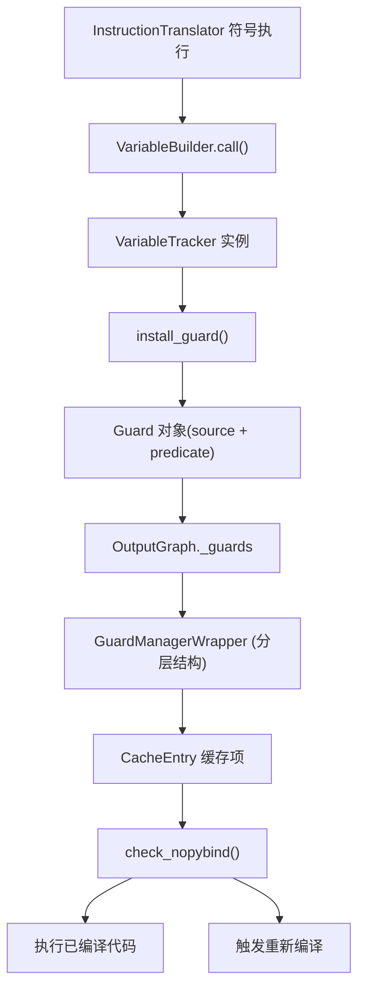
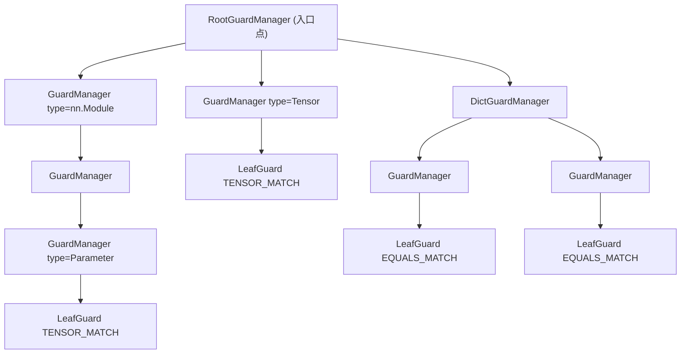
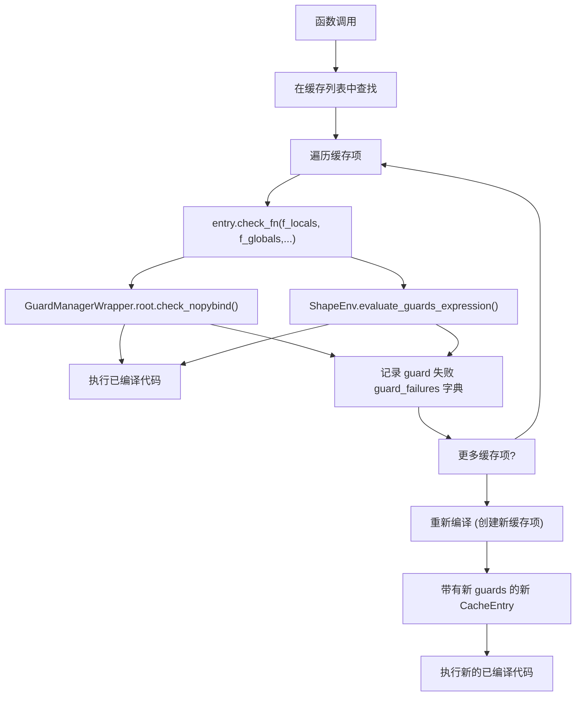
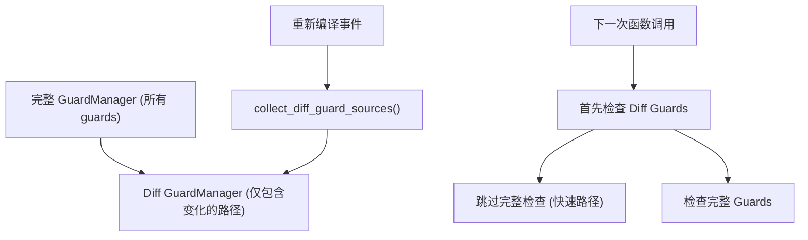

# Guard 系统与重新编译 (Guard System and Recompilation)

相关源文件 (Relevant source files)

-   [test/distributed/\_composable/fsdp/test\_fully\_shard\_compile.py](https://github.com/pytorch/pytorch/blob/915982a4/test/distributed/_composable/fsdp/test_fully_shard_compile.py)
-   [test/dynamo/test\_dicts.py](https://github.com/pytorch/pytorch/blob/915982a4/test/dynamo/test_dicts.py)
-   [test/dynamo/test\_error\_messages.py](https://github.com/pytorch/pytorch/blob/915982a4/test/dynamo/test_error_messages.py)
-   [test/dynamo/test\_functions.py](https://github.com/pytorch/pytorch/blob/915982a4/test/dynamo/test_functions.py)
-   [test/dynamo/test\_fwd\_loss\_bwd.py](https://github.com/pytorch/pytorch/blob/915982a4/test/dynamo/test_fwd_loss_bwd.py)
-   [test/dynamo/test\_guard\_manager.py](https://github.com/pytorch/pytorch/blob/915982a4/test/dynamo/test_guard_manager.py)
-   [test/dynamo/test\_list.py](https://github.com/pytorch/pytorch/blob/915982a4/test/dynamo/test_list.py)
-   [test/dynamo/test\_logging.py](https://github.com/pytorch/pytorch/blob/915982a4/test/dynamo/test_logging.py)
-   [test/dynamo/test\_misc.py](https://github.com/pytorch/pytorch/blob/915982a4/test/dynamo/test_misc.py)
-   [test/dynamo/test\_modules.py](https://github.com/pytorch/pytorch/blob/915982a4/test/dynamo/test_modules.py)
-   [test/dynamo/test\_nested\_graph\_breaks.py](https://github.com/pytorch/pytorch/blob/915982a4/test/dynamo/test_nested_graph_breaks.py)
-   [test/dynamo/test\_repros.py](https://github.com/pytorch/pytorch/blob/915982a4/test/dynamo/test_repros.py)
-   [test/dynamo/test\_skip\_guard\_eval\_unsafe.py](https://github.com/pytorch/pytorch/blob/915982a4/test/dynamo/test_skip_guard_eval_unsafe.py)
-   [test/dynamo\_expected\_failures/TestCustomOp.test\_impl\_device\_cpu](https://github.com/pytorch/pytorch/blob/915982a4/test/dynamo_expected_failures/TestCustomOp.test_impl_device_cpu)
-   [torch/\_C/\_dynamo/guards.pyi](https://github.com/pytorch/pytorch/blob/915982a4/torch/_C/_dynamo/guards.pyi)
-   [torch/\_decomp/decompositions\_for\_jvp.py](https://github.com/pytorch/pytorch/blob/915982a4/torch/_decomp/decompositions_for_jvp.py)
-   [torch/\_dispatch/python.py](https://github.com/pytorch/pytorch/blob/915982a4/torch/_dispatch/python.py)
-   [torch/\_dynamo/bytecode\_analysis.py](https://github.com/pytorch/pytorch/blob/915982a4/torch/_dynamo/bytecode_analysis.py)
-   [torch/\_dynamo/bytecode\_transformation.py](https://github.com/pytorch/pytorch/blob/915982a4/torch/_dynamo/bytecode_transformation.py)
-   [torch/\_dynamo/codegen.py](https://github.com/pytorch/pytorch/blob/915982a4/torch/_dynamo/codegen.py)
-   [torch/\_dynamo/exc.py](https://github.com/pytorch/pytorch/blob/915982a4/torch/_dynamo/exc.py)
-   [torch/\_dynamo/graph\_break\_registry.json](https://github.com/pytorch/pytorch/blob/915982a4/torch/_dynamo/graph_break_registry.json)
-   [torch/\_dynamo/guards.py](https://github.com/pytorch/pytorch/blob/915982a4/torch/_dynamo/guards.py)
-   [torch/\_dynamo/output\_graph.py](https://github.com/pytorch/pytorch/blob/915982a4/torch/_dynamo/output_graph.py)
-   [torch/\_dynamo/resume\_execution.py](https://github.com/pytorch/pytorch/blob/915982a4/torch/_dynamo/resume_execution.py)
-   [torch/\_dynamo/side\_effects.py](https://github.com/pytorch/pytorch/blob/915982a4/torch/_dynamo/side_effects.py)
-   [torch/\_dynamo/source.py](https://github.com/pytorch/pytorch/blob/915982a4/torch/_dynamo/source.py)
-   [torch/\_dynamo/symbolic\_convert.py](https://github.com/pytorch/pytorch/blob/915982a4/torch/_dynamo/symbolic_convert.py)
-   [torch/\_dynamo/test\_case.py](https://github.com/pytorch/pytorch/blob/915982a4/torch/_dynamo/test_case.py)
-   [torch/\_dynamo/testing.py](https://github.com/pytorch/pytorch/blob/915982a4/torch/_dynamo/testing.py)
-   [torch/\_dynamo/trace\_rules.py](https://github.com/pytorch/pytorch/blob/915982a4/torch/_dynamo/trace_rules.py)
-   [torch/\_dynamo/variables/\_\_init\_\_.py](https://github.com/pytorch/pytorch/blob/915982a4/torch/_dynamo/variables/__init__.py)
-   [torch/\_dynamo/variables/base.py](https://github.com/pytorch/pytorch/blob/915982a4/torch/_dynamo/variables/base.py)
-   [torch/\_dynamo/variables/builder.py](https://github.com/pytorch/pytorch/blob/915982a4/torch/_dynamo/variables/builder.py)
-   [torch/\_dynamo/variables/builtin.py](https://github.com/pytorch/pytorch/blob/915982a4/torch/_dynamo/variables/builtin.py)
-   [torch/\_dynamo/variables/constant.py](https://github.com/pytorch/pytorch/blob/915982a4/torch/_dynamo/variables/constant.py)
-   [torch/\_dynamo/variables/ctx\_manager.py](https://github.com/pytorch/pytorch/blob/915982a4/torch/_dynamo/variables/ctx_manager.py)
-   [torch/\_dynamo/variables/dicts.py](https://github.com/pytorch/pytorch/blob/915982a4/torch/_dynamo/variables/dicts.py)
-   [torch/\_dynamo/variables/functions.py](https://github.com/pytorch/pytorch/blob/915982a4/torch/_dynamo/variables/functions.py)
-   [torch/\_dynamo/variables/higher\_order\_ops.py](https://github.com/pytorch/pytorch/blob/915982a4/torch/_dynamo/variables/higher_order_ops.py)
-   [torch/\_dynamo/variables/iter.py](https://github.com/pytorch/pytorch/blob/915982a4/torch/_dynamo/variables/iter.py)
-   [torch/\_dynamo/variables/lists.py](https://github.com/pytorch/pytorch/blob/915982a4/torch/_dynamo/variables/lists.py)
-   [torch/\_dynamo/variables/misc.py](https://github.com/pytorch/pytorch/blob/915982a4/torch/_dynamo/variables/misc.py)
-   [torch/\_dynamo/variables/nn\_module.py](https://github.com/pytorch/pytorch/blob/915982a4/torch/_dynamo/variables/nn_module.py)
-   [torch/\_dynamo/variables/optimizer.py](https://github.com/pytorch/pytorch/blob/915982a4/torch/_dynamo/variables/optimizer.py)
-   [torch/\_dynamo/variables/tensor.py](https://github.com/pytorch/pytorch/blob/915982a4/torch/_dynamo/variables/tensor.py)
-   [torch/\_dynamo/variables/torch.py](https://github.com/pytorch/pytorch/blob/915982a4/torch/_dynamo/variables/torch.py)
-   [torch/\_dynamo/variables/user\_defined.py](https://github.com/pytorch/pytorch/blob/915982a4/torch/_dynamo/variables/user_defined.py)
-   [torch/\_guards.py](https://github.com/pytorch/pytorch/blob/915982a4/torch/_guards.py)
-   [torch/\_lazy/device\_context.py](https://github.com/pytorch/pytorch/blob/915982a4/torch/_lazy/device_context.py)
-   [torch/\_logging/\_internal.py](https://github.com/pytorch/pytorch/blob/915982a4/torch/_logging/_internal.py)
-   [torch/\_logging/\_registrations.py](https://github.com/pytorch/pytorch/blob/915982a4/torch/_logging/_registrations.py)
-   [torch/\_numpy/\_funcs\_impl.py](https://github.com/pytorch/pytorch/blob/915982a4/torch/_numpy/_funcs_impl.py)
-   [torch/\_numpy/\_reductions\_impl.py](https://github.com/pytorch/pytorch/blob/915982a4/torch/_numpy/_reductions_impl.py)
-   [torch/\_refs/fft.py](https://github.com/pytorch/pytorch/blob/915982a4/torch/_refs/fft.py)
-   [torch/csrc/dynamo/guards.cpp](https://github.com/pytorch/pytorch/blob/915982a4/torch/csrc/dynamo/guards.cpp)

## 目的与范围 (Purpose and Scope)

Guard 系统是 TorchDynamo 用于检测程序状态变化并触发重新编译的机制。Guards 是一些运行时检查，它们验证在图捕获（graph capture）期间所做的假设是否仍然有效。当 guard 失败时，TorchDynamo 会触发重新编译，以生成针对变化后的条件正确的全新图形。

本文档涵盖了：

-   guards 是如何在符号执行期间创建的
-   guards 的结构与类型
-   guard 检查过程与重新编译流程
-   用于高效检查的 GuardManager 架构
-   优化技术与调试工具

有关产生 guards 的字节码分析的信息，请参阅[帧评估与字节码分析](/pytorch/pytorch/2.2.1-frame-evaluation-and-bytecode-analysis)。有关 guards 所保护的图捕获过程，请参阅[变量追踪与符号执行](/pytorch/pytorch/2.2.2-variable-tracking-and-symbolic-execution)。

---

## Guard 基础 (Guard Fundamentals)

### 什么是 Guards?

Guards 是插入在函数入口点的条件检查，用于验证编译期间所做的假设。每个已编译的图都关联了一组 guards，在执行已缓存的编译函数之前，这些 guards 必须全部通过。如果任何 guard 失败，则缓存项无效并发生重新编译。

**关键不变性**：Guards 确保执行已编译代码产生的结果与在相同条件下进行 eager 执行产生的结果完全一致。

常见的 guard 条件包括：

-   张量属性：形状 (shape)、数据类型 (dtype)、设备 (device)、步长 (stride)、requires\_grad
-   对象标识：`id(obj)` 是否匹配期望值
-   类型检查：`type(obj)` 是否匹配期望类型
-   数值相等：常量值是否未改变
-   字典版本：字典内容是否未改变
-   函数/类属性：`__code__`、`__closure__` 等是否未改变

来源： [torch/\_dynamo/guards.py1-17](https://github.com/pytorch/pytorch/blob/915982a4/torch/_dynamo/guards.py#L1-L17)

### Guard 创建流程 (Guard Creation Flow)


来源： [torch/\_dynamo/guards.py563-571](https://github.com/pytorch/pytorch/blob/915982a4/torch/_dynamo/guards.py#L563-L571) [torch/\_dynamo/variables/builder.py479-549](https://github.com/pytorch/pytorch/blob/915982a4/torch/_dynamo/variables/builder.py#L479-L549)

### Sources：数值的起源 (Sources: The Origin of Values)

每个 guard 都与一个 **Source** 关联，Source 描述了如何从函数的输入命名空间重建一个值。Sources 形成一个树状结构，代表属性访问、getitem 操作和其他转换。

**示例 Source 树**：

```
LocalSource("model")
├─ AttrSource("encoder")
│  └─ AttrSource("weight")
│     └─ TensorPropertySource("shape")
└─ AttrSource("config")
   └─ DictGetItemSource("hidden_size")
```
常见的 Source 类型：

-   `LocalSource`：函数参数或局部变量
-   `GlobalSource`：全局变量
-   `AttrSource`：属性访问 (`.attr`)
-   `GetItemSource`：索引/键访问 (`[key]`)
-   `TensorPropertySource`：张量属性 (`.shape`, `.dtype`)
-   `ConstantSource`：编译时常量

来源： [torch/\_dynamo/source.py1-100](https://github.com/pytorch/pytorch/blob/915982a4/torch/_dynamo/source.py#L1-L100) [torch/\_dynamo/guards.py119-165](https://github.com/pytorch/pytorch/blob/915982a4/torch/_dynamo/guards.py#L119-L165)

---

## Guard 类型与结构 (Guard Types and Structure)

### Guard 谓词 (Guard Predicates)

Guards 使用谓词（GuardBuilder 方法），这些谓词定义了要检查的条件：

| 谓词 | 描述 | 示例用途 |
| --- | --- | --- |
| `TYPE_MATCH` | `type(obj) is ExpectedType` | 用户定义类、模块 |
| `ID_MATCH` | `id(obj) == expected_id` | 单例的对象标识 |
| `EQUALS_MATCH` | `obj == expected_value` | 常量基础类型值 |
| `TENSOR_MATCH` | 张量属性匹配 | 形状、数据类型、设备、步长 |
| `SEQUENCE_LENGTH` | `len(obj) == expected_len` | 列表、元组、字典 |
| `DICT_KEYS` | 字典键未改变 | 字典迭代顺序 |
| `DICT_VERSION` | 内部字典版本标签 | 快速字典变异检查 |
| `CLOSURE_MATCH` | 函数闭包 cell 匹配 | 闭包中捕获的变量 |

来源： [torch/\_dynamo/guards.py229-238](https://github.com/pytorch/pytorch/blob/915982a4/torch/_dynamo/guards.py#L229-L238) [torch/\_dynamo/guards.py1076-1200](https://github.com/pytorch/pytorch/blob/915982a4/torch/_dynamo/guards.py#L1076-L1200)

### GuardBuilder：创建 Guard 表达式 (GuardBuilder: Creating Guard Expressions)

`GuardBuilder` 是一个具有静态方法的类，这些方法返回可调用的 guard 谓词。在追踪期间，当代码访问一个值时，会使用 Source 和 GuardBuilder 方法调用 `install_guard()`：

```python
# 在 VariableBuilder 或操作中
install_guard(    
    source.make_guard(GuardBuilder.TENSOR_MATCH)
)
```
`Source.make_guard()` 方法将来源路径与谓词结合，创建一个完整的 `Guard` 对象：

**Guard 对象结构**：

-   `name`：重建后的代码表达式（例如 `"L['x'].shape[0]"`）
-   `source`：描述访问路径的 Source 对象
-   `create_fn`：生成检查代码的 GuardBuilder 可调用对象
-   调试信息：调用栈追踪、用户代码上下文

来源： [torch/\_dynamo/guards.py1002-1110](https://github.com/pytorch/pytorch/blob/915982a4/torch/_dynamo/guards.py#L1002-L1110) [torch/\_guards/\_\_init\_\_.py50-120](https://github.com/pytorch/pytorch/blob/915982a4/torch/_guards/__init__.py#L50-L120)

### 分层 Guard Manager 结构 (Hierarchical Guard Manager Structure)

Guards 被组织进一个称为 **GuardManager 层级结构**的树状结构中，该结构镜像了输入命名空间的结构。这使得检查和优化能够高效进行。


**关键组件**：

-   `RootGuardManager`：顶层管理器，检查的入口点。
-   `GuardManager`：管理单个对象及其子对象的 guards。
-   `DictGuardManager`：专门针对具有键值对 guards 的字典对象。
-   `LeafGuard`：叶子节点的实际 guard 条件。
-   `GuardAccessor`：描述如何从父级遍历到子级（`GetAttrGuardAccessor`、`DictGetItemGuardAccessor` 等）。

来源： [torch/\_dynamo/guards.py265-278](https://github.com/pytorch/pytorch/blob/915982a4/torch/_dynamo/guards.py#L265-L278) [torch/csrc/dynamo/guards.cpp1000-1100](https://github.com/pytorch/pytorch/blob/915982a4/torch/csrc/dynamo/guards.cpp#L1000-L1100)

---

## Guard 检查与重新编译 (Guard Checking and Recompilation)

### 运行时 Guard 检查流程 (Runtime Guard Checking Flow)

当调用一个已编译函数时，会在执行已编译图之前检查 guards：


**两阶段检查**：

1.  **Python 对象 guards**：通过 `GuardManager` C++ 代码检查，追求速度。
2.  **符号形状 guards**：通过 `ShapeEnv` 检查，用于处理动态形状。

来源： [torch/\_dynamo/eval\_frame.py400-500](https://github.com/pytorch/pytorch/blob/915982a4/torch/_dynamo/eval_frame.py#L400-L500) [torch/\_dynamo/guards.py650-750](https://github.com/pytorch/pytorch/blob/915982a4/torch/_dynamo/guards.py#L650-L750)

### Guard 失败与重新编译 (Guard Failure and Recompilation)

当 guard 失败时，重新编译过程会：

1.  **记录失败**：存储 guard 失败信息以便调试。
2.  **记录原因**：发出重新编译消息（如果启用了日志记录）。
3.  **重启追踪**：再次调用 `convert_frame()` 并使用相同的输入。
4.  **生成新 guards**：创建适用于新条件的 guards。
5.  **缓存新项**：存储带有新 guard 集合的已编译函数。

**推测日志 (Speculation Log)**：为了避免无限重新编译循环，Dynamo 使用一个 `SpeculationLog`，记录哪些推测优化失败了。在重试时，它会避开同样的推测。

来源： [torch/\_dynamo/symbolic\_convert.py271-340](https://github.com/pytorch/pytorch/blob/915982a4/torch/_dynamo/symbolic_convert.py#L271-L340) [torch/\_dynamo/guards.py220-227](https://github.com/pytorch/pytorch/blob/915982a4/torch/_dynamo/guards.py#L220-L227)

### 重新编译示例 (Recompilation Example)

```python
@torch.compile
def f(x, y):    
    if x.shape[0] > 10:  # 数据依赖的分支        
        return x + y    
    else:        
        return x * y

# 第一次调用: x.shape[0] = 15
# - 追踪 `if` 分支
# - Guards: x.shape[0] == 15, y.shape 匹配 x.shape
# - 已编译图: 加法操作

# 第二次调用: x.shape[0] = 5
# - Guards 失败: x.shape[0] != 15
# - 重新编译, 追踪 `else` 分支
# - 新的 guards: x.shape[0] == 5
# - 新的已编译图: 乘法操作
```
来源： [torch/\_dynamo/symbolic\_convert.py690-761](https://github.com/pytorch/pytorch/blob/915982a4/torch/_dynamo/symbolic_convert.py#L690-L761)

---

## GuardManager 架构 (GuardManager Architecture)

### 追求性能的 C++ 实现 (C++ Implementation for Performance)

guard 检查逻辑在 C++ (`torch/csrc/dynamo/guards.cpp`) 中实现，因为 guard 在每次函数调用时都会被检查：

**关键 C++ 类**：

-   `RootGuardManager`：入口点，管理全局/局部命名空间访问。
-   `GuardManager`：管理 Python 对象的 guards。
-   `DictGuardManager`：专门针对具有键值 guards 的字典。
-   `GuardAccessor`：访问子对象的抽象基类。
    -   `GetAttrGuardAccessor`：用于属性访问。
    -   `DictGetItemGuardAccessor`：用于字典项访问。
    -   `TupleGetItemGuardAccessor`：用于元组索引。
-   `LeafGuard`：终端 guard 条件。

来源： [torch/csrc/dynamo/guards.cpp1-100](https://github.com/pytorch/pytorch/blob/915982a4/torch/csrc/dynamo/guards.cpp#L1-L100)

### Guard Manager 树遍历 (Guard Manager Tree Traversal)

Guard 检查以深度优先方式遍历管理器树，评估每个节点的 guards：

```cpp
// C++ 实现伪代码
bool check_nopybind(PyObject* local_scope, PyObject* global_scope) {    
    // 检查根级 guards    
    if (!this->check_leaf_guards()) {        
        return false;    
    }        
    // 遍历子节点    
    for (auto& [accessor, child_manager] : this->children) {        
        // 通过 accessor 获取子对象        
        PyObject* child_obj = accessor->get_value(current_obj);                
        // 递归检查子节点        
        if (!child_manager->check_nopybind(child_obj)) {            
            return false;        
        }    
    }    
    return true;
}
```
**早期终止**：为了性能，检查会在遇到第一个失败的 guard 时停止。

来源： [torch/csrc/dynamo/guards.cpp2000-2100](https://github.com/pytorch/pytorch/blob/915982a4/torch/csrc/dynamo/guards.cpp#L2000-L2100)

### Guard Manager 示例 (Guard Manager Example)

对于输入 `locals={'model': nn.Module(), 'x': tensor}`：

```
RootGuardManager
├─ locals['model']
│  ├─ LeafGuard: TYPE_MATCH -> nn.Module
│  └─ GetAttrGuardAccessor('encoder') → GuardManager
│     └─ GetAttrGuardAccessor('weight') → GuardManager
│        └─ LeafGuard: TENSOR_MATCH (shape, dtype)
│
└─ locals['x']
   └─ LeafGuard: TENSOR_MATCH (shape, dtype)
```
来源： [torch/\_dynamo/guards.py265-290](https://github.com/pytorch/pytorch/blob/915982a4/torch/_dynamo/guards.py#L265-L290)

---

## Guard 优化技术 (Guard Optimization Techniques)

### 针对快速张量重检查的 Diff Guards (Diff Guards for Fast Tensor Recheck)

**问题**：当由于单个张量属性改变而重新编译时，我们不希望重新检查所有未改变的 guards。

**解决方案**：Dynamo 维护一个单独的 **diff guard manager**，它仅包含失败过或可能改变的路径上的 guards：


diff guard manager 使得重新编译后的后续调用能够通过首先检查最近改变过的 guards 来进入快速路径。

来源： [torch/\_dynamo/guards.py304-352](https://github.com/pytorch/pytorch/blob/915982a4/torch/_dynamo/guards.py#L304-L352) [torch/\_dynamo/guards.py582-584](https://github.com/pytorch/pytorch/blob/915982a4/torch/_dynamo/guards.py#L582-L584)

### 递归字典标签优化 (Recursive Dict Tag Optimization)

**问题**：检查大型嵌套字典中的每个键/值开销很大。

**解决方案**：Python 字典有一个内部“版本标签 (version tag)”，它在发生任何变异时都会递增。Dynamo 可以针对该标签生成 guard，而不是针对单个键/值：

```python
# 而不是:
if (dict['key1'] == val1 and     
    dict['key2'] == val2 and ...):    
    # 数百次检查

# 使用:
if dict_version(dict) == expected_tag:    
    # 单次整数比较
```
**递归标签安全节点**：Dynamo 识别出检查顶层标签即足够的“标签安全 (tag-safe)”对象：

-   不可变对象（没有访问器的张量、冻结的 dataclass）
-   所有键/值均为标签安全的嵌套字典
-   `nn.Module` 实例（仅针对 `__dict__` 生成 guard）

当发现一个标签安全根节点时，如果标签匹配，则可以跳过整个子树。

来源： [torch/\_dynamo/guards.py364-581](https://github.com/pytorch/pytorch/blob/915982a4/torch/_dynamo/guards.py#L364-L581)

### 标签安全检测算法 (Tag-Safe Detection Algorithm)

```python
def find_tag_safe_roots(self):    
    """识别适用递归字典标签检查的节点。"""        
    def visit(node: GuardManager) -> list[GuardManager]:        
        # 基础情况: 不可变对象        
        if node.is_guarded_value_immutable():            
            if isinstance(node.value, Tensor) and node.has_no_accessors():                
                node.mark_tag_safe()            
            else:                
                node.mark_tag_safe()                
        # 递归情况: 嵌套字典        
        elif isinstance(node.value, dict):            
            if all(child.is_tag_safe() for child in node.children):                
                node.mark_tag_safe()                
        # 特殊情况: 仅访问通用字典的 nn.Module        
        elif isinstance(node.value, nn.Module):            
            if only_accesses_generic_dict(node):                
                node.mark_tag_safe()                
                return [node]  # 标签安全根节点!                
        return []  # 不是根节点
```
来源： [torch/\_dynamo/guards.py420-542](https://github.com/pytorch/pytorch/blob/915982a4/torch/_dynamo/guards.py#L420-L542)

---

## Guard 编译与代码生成 (Guard Compilation and Code Generation)

### 生成 Guard 检查函数 (Generating Guard Check Functions)

在图完成化（graph finalization）期间，guards 被编译成执行检查的 Python 函数：

```python
def compile_guards():    
    """生成 guard 检查函数。"""    
    # 收集所有 guard 表达式    
    guard_code = []    
    for guard in guards:        
        # 生成 Python 表达式        
        expr = guard.create_fn(guard.source)        
        guard_code.append(f"({expr})")        
    # 用 'and' 组合    
    check_expr = " and ".join(guard_code)        
    # 创建函数    
    code = f"""def ___check_tensors(L, G, **kwargs):    return {check_expr}"""        
    # 编译并返回    
    exec(code, global_scope)    
    return global_scope['___check_tensors']
```
**实际实现**：使用 `GuardManagerWrapper` 走 C++ 检查路径，但为了调试也可以生成 Python 代码。

来源： [torch/\_dynamo/guards.py1500-1700](https://github.com/pytorch/pytorch/blob/915982a4/torch/_dynamo/guards.py#L1500-L1700)

### Guard 代码示例 (Guard Code Example)

对于一个简单的带有张量输入的函数：

```python
# 函数
def f(x):    
    return x + 1

# 生成的 guard 代码 (简化版)
def check_fn(L, G):    
    return (        
        hasattr(L['x'], '_dynamo_dynamic_indices') == False and        
        L['x'].dtype == torch.float32 and        
        L['x'].device == device('cuda:0') and          
        L['x'].requires_grad == False and        
        L['x'].ndim == 2 and        
        L['x'].shape[0] == 10 and        
        L['x'].shape[1] == 20 and        
        L['x'].stride == (20, 1)    
    )
```
来源： [torch/\_dynamo/guards.py1650-1750](https://github.com/pytorch/pytorch/blob/915982a4/torch/_dynamo/guards.py#L1650-L1750)

---

## 调试与可观测性 (Debugging and Observability)

### 查看 Guard 失败 (Viewing Guard Failures)

当发生重新编译时，Dynamo 会记录失败的 guard：

```python
import torch._dynamo.config as config

# 启用重新编译日志记录
config.verbose = True

# 或使用环境变量
# TORCH_LOGS="recompiles"
```
**Guard 失败输出**：

```
[INFO] __recompiles__: Recompiling function 'forward' due to:
  L['x'].shape[0] was 10, now 15

  Full guard expression:
  L['x'].shape[0] == 10
```
来源： [torch/\_dynamo/guards.py220-227](https://github.com/pytorch/pytorch/blob/915982a4/torch/_dynamo/guards.py#L220-L227)

### 以编程方式提取 Guards (Extracting Guards Programmatically)

使用 `torch._dynamo.eval_frame._debug_get_cache_entry_list()` 检查缓存项及其 guards：

```python
def get_guards_for_function(fn):    
    """获取已编译函数的所有 guards。"""    
    entries = torch._dynamo.eval_frame._debug_get_cache_entry_list(fn)        
    for entry in entries:        
        guard_manager = entry.guard_manager_wrapper.root        
        # 遍历 guard 树        
        print_guards(guard_manager)
```
来源： [torch/\_dynamo/guards.py193-210](https://github.com/pytorch/pytorch/blob/915982a4/torch/_dynamo/guards.py#L193-L210) [test/dynamo/test\_misc.py193-222](https://github.com/pytorch/pytorch/blob/915982a4/test/dynamo/test_misc.py#L193-L222)

### Guard 可视化 (Guard Visualization)

`verbose_guards_log` 伪影记录器提供了详细的 guard 树结构：

```
# 通过 TORCH_LOGS="verbose_guards" 启用

# 输出显示了分层结构:
# RootGuardManager
# +- locals['x'] : Tensor
# |  +- LeafGuard: TENSOR_MATCH
# |     shape[0] == 10
# |     dtype == torch.float32
# +- locals['model'] : Module  
#    +- attr 'encoder'
#       +- attr 'weight'
#          +- LeafGuard: TENSOR_MATCH
```
来源： [torch/\_dynamo/guards.py226-227](https://github.com/pytorch/pytorch/blob/915982a4/torch/_dynamo/guards.py#L226-L227)

### 常见的 Guard 失败模式 (Common Guard Failure Patterns)

| 模式 | 原因 | 解决方案 |
| --- | --- | --- |
| 形状不匹配 | 张量形状改变 | 使用动态形状或 mark\_dynamic |
| 字典版本改变 | 字典被变异 | 避免变异被捕获的字典 |
| ID 不匹配 | 对象标识改变 | 如果合适，使用基于数值的 guards |
| 闭包改变 | 捕获的变量被修改 | 预期行为：重新编译 |
| 重新编译过多 | 过度专业化 (Specialization) | 提高缓存大小限制 |

来源： [torch/\_dynamo/guards.py1900-2000](https://github.com/pytorch/pytorch/blob/915982a4/torch/_dynamo/guards.py#L1900-L2000)

---

## 与符号形状的集成 (Integration with Symbolic Shapes)

### 动态形状 Guards (Dynamic Shape Guards)

当 `torch._dynamo.config.dynamic_shapes = True` 时，张量形状可以是符号化的：

```python
# 而不是: x.shape[0] == 10
# Guard 变为: s0 == 10 (s0 是一个符号)

# 符号形状 guards 由 ShapeEnv 处理:
shape_env.evaluate_guards_expression([    
    "Eq(s0, s1)",  # 两个维度相等    
    "Gt(s0, 0)",   # 正维度
])
```
`ShapeEnv` 维护符号维度之间的约束，并生成与 Python 对象 guards 一起检查的 guards。

来源： [torch/\_dynamo/guards.py420-450](https://github.com/pytorch/pytorch/blob/915982a4/torch/_dynamo/guards.py#L420-L450) [torch/fx/experimental/symbolic\_shapes.py1-100](https://github.com/pytorch/pytorch/blob/915982a4/torch/fx/experimental/symbolic_shapes.py#L1-L100)

### Guard 表达式类型 (Guard Expression Types)

**Python guards**：由 `GuardManager` 检查

-   对象属性、类型检查、字典版本

**形状 guards**：由 `ShapeEnv` 检查

-   符号形状表达式
-   受支持的 SymInts（与真实张量绑定）
-   不受支持的 SymInts（未与输入绑定）

两者都必须通过，缓存项才有效。

来源： [torch/\_dynamo/output\_graph.py387-428](https://github.com/pytorch/pytorch/blob/915982a4/torch/_dynamo/output_graph.py#L387-L428)

---

## 总结 (Summary)

Guard 系统是 TorchDynamo 的正确性保障机制，使得已编译图能够被安全地缓存和复用：

**关键点**：

1.  **Guards 是运行时检查**，在执行已编译代码之前插入。
2.  **在追踪期间创建**，当符号执行遇到数值时产生。
3.  **按层级组织**在 GuardManager 树中，匹配输入结构。
4.  **在 C++ 中实现**以获得快速检查性能。
5.  **触发重新编译**，当假设被违反时。
6.  **经过重度优化**，通过 diff guards、字典版本标签和标签安全树实现。

**权衡 (Trade-offs)**：

-   更多 guards = 更多专业化 = 代码更快但重新编译更多。
-   更少 guards = 更少专业化 = 代码更慢但重新编译更少。
-   动态形状减少了 guards，但为符号数学增加了运行时开销。

Guard 系统是实现 PyTorch JIT 编译中正确性与性能平衡的基础。

来源： [torch/\_dynamo/guards.py1-2000](https://github.com/pytorch/pytorch/blob/915982a4/torch/_dynamo/guards.py#L1-L2000) [torch/\_dynamo/symbolic\_convert.py1-1000](https://github.com/pytorch/pytorch/blob/915982a4/torch/_dynamo/symbolic_convert.py#L1-L1000)
