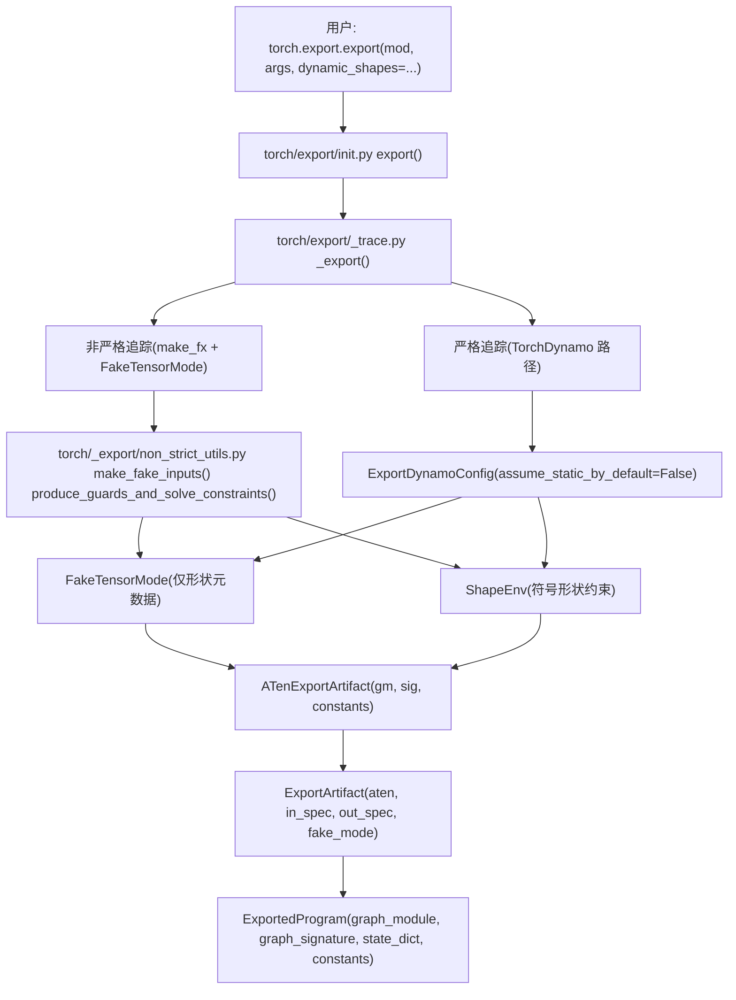

# torch.export：静态图导出 (torch.export: Static Graph Export)

相关源文件 (Relevant source files)

-   [aten/src/ATen/core/PythonFallbackKernel.cpp](https://github.com/pytorch/pytorch/blob/915982a4/aten/src/ATen/core/PythonFallbackKernel.cpp)
-   [test/dynamo/test\_utils.py](https://github.com/pytorch/pytorch/blob/915982a4/test/dynamo/test_utils.py)
-   [test/export/test\_experimental.py](https://github.com/pytorch/pytorch/blob/915982a4/test/export/test_experimental.py)
-   [test/export/test\_export.py](https://github.com/pytorch/pytorch/blob/915982a4/test/export/test_export.py)
-   [test/fx/test\_fx\_xform\_observer.py](https://github.com/pytorch/pytorch/blob/915982a4/test/fx/test_fx_xform_observer.py)
-   [test/profiler/test\_record\_function.py](https://github.com/pytorch/pytorch/blob/915982a4/test/profiler/test_record_function.py)
-   [test/profiler/test\_torch\_tidy.py](https://github.com/pytorch/pytorch/blob/915982a4/test/profiler/test_torch_tidy.py)
-   [test/test\_dynamic\_shapes.py](https://github.com/pytorch/pytorch/blob/915982a4/test/test_dynamic_shapes.py)
-   [test/test\_proxy\_tensor.py](https://github.com/pytorch/pytorch/blob/915982a4/test/test_proxy_tensor.py)
-   [torch/\_dynamo/config.py](https://github.com/pytorch/pytorch/blob/915982a4/torch/_dynamo/config.py)
-   [torch/\_dynamo/convert\_frame.py](https://github.com/pytorch/pytorch/blob/915982a4/torch/_dynamo/convert_frame.py)
-   [torch/\_dynamo/eval\_frame.py](https://github.com/pytorch/pytorch/blob/915982a4/torch/_dynamo/eval_frame.py)
-   [torch/\_dynamo/functional\_export.py](https://github.com/pytorch/pytorch/blob/915982a4/torch/_dynamo/functional_export.py)
-   [torch/\_dynamo/utils.py](https://github.com/pytorch/pytorch/blob/915982a4/torch/_dynamo/utils.py)
-   [torch/\_export/non\_strict\_utils.py](https://github.com/pytorch/pytorch/blob/915982a4/torch/_export/non_strict_utils.py)
-   [torch/export/\_\_init\_\_.py](https://github.com/pytorch/pytorch/blob/915982a4/torch/export/__init__.py)
-   [torch/export/\_trace.py](https://github.com/pytorch/pytorch/blob/915982a4/torch/export/_trace.py)
-   [torch/fx/experimental/symbolic\_shapes.py](https://github.com/pytorch/pytorch/blob/915982a4/torch/fx/experimental/symbolic_shapes.py)
-   [torch/fx/passes/graph\_transform\_observer.py](https://github.com/pytorch/pytorch/blob/915982a4/torch/fx/passes/graph_transform_observer.py)

## 目的与范围 (Purpose and Scope)

`torch.export` 从任何 `torch.nn.Module` 生成一个完全追踪、可序列化的提前 (AOT) 伪影，称为 `ExportedProgram`。与在运行时使用 JIT 编译进行优化的 `torch.compile` 不同，`torch.export` 在导出时捕获一个**完整的、可移植的静态图**，该图具有明确的形状约束，且在导出的表示中不含 Python 控制流。

本页涵盖了 `torch.export` 的整体架构、`ExportedProgram` 伪影、严格与非严格追踪模式以及形状约束系统。

-   有关 `ExportedProgram` API 和 `_trace.py` 内部细节，请参阅 [2.3.1](/pytorch/pytorch/2.3.1-export-api-and-exportedprogram)。
-   有关符号形状和基于 `Dim` 的动态维度，请参阅 [2.3.2](/pytorch/pytorch/2.3.2-symbolic-shapes-and-dynamic-dimensions)。
-   有关 `FakeTensorMode` 和元数据传播，请参阅 [2.3.3](/pytorch/pytorch/2.3.3-faketensormode-and-metadata-propagation)。
-   有关 TorchDynamo 在严格模式下如何工作，请参阅 [2.2](/pytorch/pytorch/2.2-torchdynamo-frontend)。

---

## 高层架构 (High-Level Architecture)

`export()` 调用接收一个 `torch.nn.Module` 和示例输入，并路由到基于 Dynamo 的严格追踪器或基于 `make_fx` 的非严格追踪器，然后将结果打包进一个 `ExportedProgram`。

**图表：`torch.export` 系统概览**


来源： [torch/export/\_\_init\_\_.py59-68](https://github.com/pytorch/pytorch/blob/915982a4/torch/export/__init__.py#L59-L68) [torch/export/\_trace.py120-175](https://github.com/pytorch/pytorch/blob/915982a4/torch/export/_trace.py#L120-L175) [torch/\_export/non\_strict\_utils.py1-70](https://github.com/pytorch/pytorch/blob/915982a4/torch/_export/non_strict_utils.py#L1-L70)

---

## `export()` API

主要入口点是定义在 [torch/export/\_\_init\_\_.py59-68](https://github.com/pytorch/pytorch/blob/915982a4/torch/export/__init__.py#L59-L68) 中的 `torch.export.export()`：

```python
def export(    
    mod: torch.nn.Module,    
    args: tuple[Any, ...],    
    kwargs: Mapping[str, Any] | None = None,    
    *,    
    dynamic_shapes: dict[str, Any] | tuple[Any, ...] | list[Any] | None = None,    
    strict: bool = False,    
    preserve_module_call_signature: tuple[str, ...] = (),    
    prefer_deferred_runtime_asserts_over_guards: bool = False,
) -> ExportedProgram:
```
| 参数 | 描述 |
| --- | --- |
| `mod` | 要导出的 `nn.Module` |
| `args` | 用于追踪的示例位置参数输入 |
| `kwargs` | 示例关键字参数输入 |
| `dynamic_shapes` | 使用 `Dim` 对象指定的每维度动态特性规范 |
| `strict` | `True` = 基于 Dynamo 的追踪；`False` = 基于 `make_fx` 的追踪（默认） |
| `preserve_module_call_signature` | 保持特定子模块调用签名完整 |
| `prefer_deferred_runtime_asserts_over_guards` | 发出运行时断言，而不是在追踪时进行专业化 (specializing) |

**与 `torch.compile` 的关键行为差异：** `export()` 使用 `assume_static_by_default=False` 和 `automatic_dynamic_shapes=False`（设置在 `ExportDynamoConfig` [torch/export/\_trace.py136-143](https://github.com/pytorch/pytorch/blob/915982a4/torch/export/_trace.py#L136-L143) 中），这意味着除非显式约束，否则所有形状都被视为潜在动态的 —— 这与 `torch.compile` 的默认设置相反。

来源： [torch/export/\_\_init\_\_.py59-175](https://github.com/pytorch/pytorch/blob/915982a4/torch/export/__init__.py#L59-L175) [torch/export/\_trace.py122-145](https://github.com/pytorch/pytorch/blob/915982a4/torch/export/_trace.py#L122-L145)

---

## ExportedProgram：输出伪影 (ExportedProgram: The Output Artifact)

`ExportedProgram` 是 `export()` 的主要输出。它打包了执行或序列化导出模型所需的所有信息。

**图表：`ExportedProgram` 结构**


来源： [torch/export/\_\_init\_\_.py15-52](https://github.com/pytorch/pytorch/blob/915982a4/torch/export/__init__.py#L15-L52) [test/export/test\_export.py53-64](https://github.com/pytorch/pytorch/blob/915982a4/test/export/test_export.py#L53-L64) [torch/export/\_trace.py105-112](https://github.com/pytorch/pytorch/blob/915982a4/torch/export/_trace.py#L105-L112)

### 图签名 (Graph Signature)

`ExportGraphSignature`（来自 `torch/export/graph_signature.py`）描述了导出图的扁平化输入/输出接口。`GraphModule` 中的每个占位符节点都对应一个由 `InputKind` 分类的条目：

| `InputKind` | 描述 |
| --- | --- |
| `USER_INPUT` | 调用者传递的实际张量参数 |
| `PARAMETER` | 提升到图中的 `nn.Parameter` |
| `BUFFER` | 提升到图中的 `nn.Module` 缓冲区 (buffer) |
| `CONSTANT_TENSOR` | 嵌入到图中的常量张量 |
| `TOKEN` | 用于函数式副作用建模的影响令牌 (Effect token) |

每个输出节点同样由 `OutputKind` 描述，记录哪些输出是用户可见的值，哪些是缓冲区变异等。

### 状态字典与常量 (State Dict and Constants)

模型权重（`parameters`、`buffers`）和提升后的常量张量（`constants`）与图分开存储。图仅使用它们的名称作为标识符。`ExportedProgram.state_dict` 持有实际的参数和缓冲区张量。

来源： [test/export/test\_export.py379-391](https://github.com/pytorch/pytorch/blob/915982a4/test/export/test_export.py#L379-L391) [torch/export/\_trace.py147-162](https://github.com/pytorch/pytorch/blob/915982a4/torch/export/_trace.py#L147-L162)

---

## 追踪模式：严格 vs. 非严格 (Tracing Modes: Strict vs. Non-Strict)

**图表：追踪模式对比**

来源： [torch/export/\_trace.py122-175](https://github.com/pytorch/pytorch/blob/915982a4/torch/export/_trace.py#L122-L175) [torch/\_export/non\_strict\_utils.py1-65](https://github.com/pytorch/pytorch/blob/915982a4/torch/_export/non_strict_utils.py#L1-L65) [torch/\_dynamo/convert\_frame.py583-610](https://github.com/pytorch/pytorch/blob/915982a4/torch/_dynamo/convert_frame.py#L583-L610)

### 严格模式 (Strict Mode)

设置 `strict=True` 时，`export()` 通过 TorchDynamo 的完整符号执行引擎运行模块，并使用 `ExportDynamoConfig` [torch/export/\_trace.py122-145](https://github.com/pytorch/pytorch/blob/915982a4/torch/export/_trace.py#L122-L145) 来覆盖正常的编译设置：

-   `assume_static_by_default=False`：所有张量形状都被视为动态，直到证明是静态的。
-   `do_not_emit_runtime_asserts=True`：形状断言被推迟到后处理阶段。
-   `automatic_dynamic_shapes=False`：不自动推断动态维度。
-   `capture_dynamic_output_shape_ops=True`：捕获具有数据依赖输出形状的算子。
-   `capture_scalar_outputs=True`：允许来自 `item()` 调用的标量输出。

Dynamo 的 guard 系统仍然运行，但输出仅用于图捕获 —— 而不用于重新编译，因为结果是一个 `ExportedProgram`，而不是已编译的可调用对象。

### 非严格模式 (Non-Strict Mode，默认)

设置 `strict=False` 时，追踪通过启用 `FakeTensorMode` 的 `make_fx()` 完成。在 [torch/\_export/non\_strict\_utils.py](https://github.com/pytorch/pytorch/blob/915982a4/torch/_export/non_strict_utils.py) 中的关键工具函数包括：

| 函数 | 角色 |
| --- | --- |
| `make_fake_inputs()` | 创建所有具有符号形状的输入的 `FakeTensor` 版本 |
| `_fakify_module_inputs()` | 创建模块参数和缓冲区的 Fake 版本 |
| `make_constraints()` | 将 `dynamic_shapes` 的 `Dim` 规范转换为 `ShapeEnv` 约束 |
| `produce_guards_and_solve_constraints()` | 运行约束求解器，并将形状 guards 嵌入到图中 |

非严格模式通常更快，并且能处理更多 Python 模式，因为它不需要对 Python 字节码进行完整的 Dynamo 符号执行。但是，它可能会遗漏 Dynamo guard 系统能够捕获的某些合理性检查。

来源： [torch/export/\_\_init\_\_.py65](https://github.com/pytorch/pytorch/blob/915982a4/torch/export/__init__.py#L65-L65) [torch/\_export/non\_strict\_utils.py1-70](https://github.com/pytorch/pytorch/blob/915982a4/torch/_export/non_strict_utils.py#L1-L70) [torch/export/\_trace.py122-175](https://github.com/pytorch/pytorch/blob/915982a4/torch/export/_trace.py#L122-L175)

---

## 动态形状与 `Dim` API (Dynamic Shapes and the `Dim` API)

默认情况下，导出程序中的所有形状都是**静态的** —— 图是针对示例输入的精确形状进行专业化的。要允许某个维度在运行时变化，请使用 `torch.export.Dim`。

```python
# 来自 torch/export/__init__.py
from torch.export import Dim

batch = Dim("batch", min=1, max=128)
ep = torch.export.export(    
    mod,    
    (torch.randn(4, 16),),    
    dynamic_shapes={"x": {0: batch}},
)
```
`Dim` 对象通过 [torch/export/dynamic\_shapes.py](https://github.com/pytorch/pytorch/blob/915982a4/torch/export/dynamic_shapes.py) 中的 `dynamic_shapes` 处理过程（通过 `_process_dynamic_shapes`、`_check_dynamic_shapes`）进行解析，并转换为 `ShapeEnv` 约束。任何未被 `Dim` 规范覆盖的维度都保持静态。

### 形状约束流 (Shape Constraint Flow)

**图表：动态形状约束解析**

来源： [torch/fx/experimental/symbolic\_shapes.py356-358](https://github.com/pytorch/pytorch/blob/915982a4/torch/fx/experimental/symbolic_shapes.py#L356-L358) [torch/\_export/non\_strict\_utils.py43-55](https://github.com/pytorch/pytorch/blob/915982a4/torch/_export/non_strict_utils.py#L43-L55) [test/export/test\_export.py332-350](https://github.com/pytorch/pytorch/blob/915982a4/test/export/test_export.py#L332-L350)

### `Dim.AUTO` 与 `Dim.STATIC`

为了方便，存在特殊的哨兵值：

-   `Dim.AUTO`：根据用法推断动态性（用于非严格模式）。
-   `Dim.STATIC`：显式将某个维度标记为静态。

### `ConstraintViolationError`

如果示例输入违反了声明的 `Dim` 边界（例如某个维度为 3，但 `min=6`），则会抛出 `ConstraintViolationError` [torch/fx/experimental/symbolic\_shapes.py356-358](https://github.com/pytorch/pytorch/blob/915982a4/torch/fx/experimental/symbolic_shapes.py#L356-L358)。在严格模式下，等效的是 `torch._dynamo.exc.UserError`。

来源： [test/export/test\_export.py332-350](https://github.com/pytorch/pytorch/blob/915982a4/test/export/test_export.py#L332-L350) [torch/fx/experimental/symbolic\_shapes.py356-358](https://github.com/pytorch/pytorch/blob/915982a4/torch/fx/experimental/symbolic_shapes.py#L356-L358)

---

## 内部追踪伪影 (Internal Tracing Artifacts)

**图表：`_trace.py` 中的内部数据流**

来源： [torch/export/\_trace.py147-175](https://github.com/pytorch/pytorch/blob/915982a4/torch/export/_trace.py#L147-L175) [torch/export/\_trace.py40-56](https://github.com/pytorch/pytorch/blob/915982a4/torch/export/_trace.py#L40-L56)

### 关键数据类 (Key Data Classes)

| 类 | 文件 | 目的 |
| --- | --- | --- |
| `ExportDynamoConfig` | `torch/export/_trace.py` | 专门为导出覆盖 Dynamo 配置 |
| `ATenExportArtifact` | `torch/export/_trace.py` | 持有 ATen 级别的 FX 图 + 签名 + 常量 |
| `ExportArtifact` | `torch/export/_trace.py` | 完整的追踪结果，包括树规范 (tree specs) 和 `FakeTensorMode` |
| `ExportedProgram` | `torch/export/exported_program.py` | 返回给用户的最终可移植伪影 |
| `ExportGraphSignature` | `torch/export/graph_signature.py` | 将扁平的图 I/O 映射到语义角色 |

来源： [torch/export/\_trace.py122-162](https://github.com/pytorch/pytorch/blob/915982a4/torch/export/_trace.py#L122-L162) [torch/export/\_\_init\_\_.py44-52](https://github.com/pytorch/pytorch/blob/915982a4/torch/export/__init__.py#L44-L52)

---

## 导出后操作 (Post-Export Operations)

在图捕获之后，可以对 `ExportedProgram` 应用几种操作：

| 方法 / 函数 | 描述 |
| --- | --- |
| `ep.module()` | 返回一个可运行的 `nn.Module`，参数被重新卸载 (unlifted) 回模块中 |
| `ep.run_decompositions(decomp_table)` | 使用 `default_decompositions` 将复合 ATen 算子分解为原语算子 |
| `torch.export.unflatten(ep)` | 从扁平的导出图中重建模块层级结构（返回 `UnflattenedModule`） |
| `torch.export.save(ep, path)` | 将 `ExportedProgram` 序列化为 zip 文件 |
| `torch.export.load(path)` | 从 zip 文件反序列化 |
| `ep._update(new_gm, new_sig)` | 使用修改后的图模块和签名创建一个新的 `ExportedProgram` |

[torch/export/\_\_init\_\_.py](https://github.com/pytorch/pytorch/blob/915982a4/torch/export/__init__.py) 中的 `default_decompositions()` 函数提供了一个标准表，用于降低高层 ATen 算子。在运行分解后，图中仅包含“核心 ATen”算子，这是用于序列化和大多数下游后端的规范形式。

来源： [torch/export/\_\_init\_\_.py15-36](https://github.com/pytorch/pytorch/blob/915982a4/torch/export/__init__.py#L15-L36) [test/export/test\_export.py378-379](https://github.com/pytorch/pytorch/blob/915982a4/test/export/test_export.py#L378-L379) [test/export/test\_export.py628-654](https://github.com/pytorch/pytorch/blob/915982a4/test/export/test_export.py#L628-L654)

---

## 与 `torch.compile` 的关系 (Relationship to `torch.compile`)

| 维度 | `torch.compile` | `torch.export` |
| --- | --- | --- |
| 输出 | 带有已编译内核的优化可调用对象 | 可移植的 `ExportedProgram`（无内核） |
| 执行 | 首次调用时 JIT | AOT，图在使用前被完全捕获 |
| 形状默认值 | 默认静态 (`assume_static_by_default=True`) | 默认动态 (`assume_static_by_default=False`) |
| 图断点 | 允许（回退到 Python） | 不允许（在遇到不支持的算子时导出失败） |
| 后端 | TorchInductor 等 | 任何下游消费者（TRT, ExecuTorch 等） |
| 重新编译 | guard 失败时自动进行 | 不适用；单一静态伪影 |
| 算子集 | 后端特定的降低后算子 | 函数式 ATen 算子集 |

`ExportDynamoConfig.replay_side_effects=False` 和 `side_effect_replay_policy="warn"` 设置 [torch/export/\_trace.py143-144](https://github.com/pytorch/pytorch/blob/915982a4/torch/export/_trace.py#L143-L144) 进一步区分了导出的行为：对 Python 副作用发出警告而不是复制，因为导出的图必须是纯函数式的。

来源： [torch/export/\_trace.py122-145](https://github.com/pytorch/pytorch/blob/915982a4/torch/export/_trace.py#L122-L145) [torch/\_dynamo/config.py156-163](https://github.com/pytorch/pytorch/blob/915982a4/torch/_dynamo/config.py#L156-L163)
