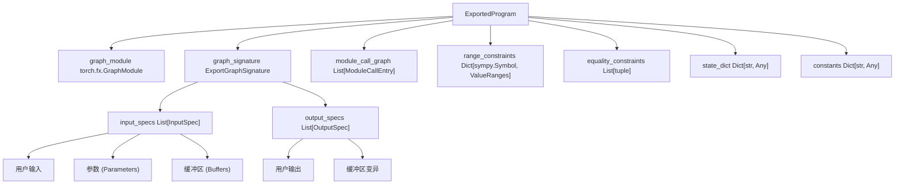
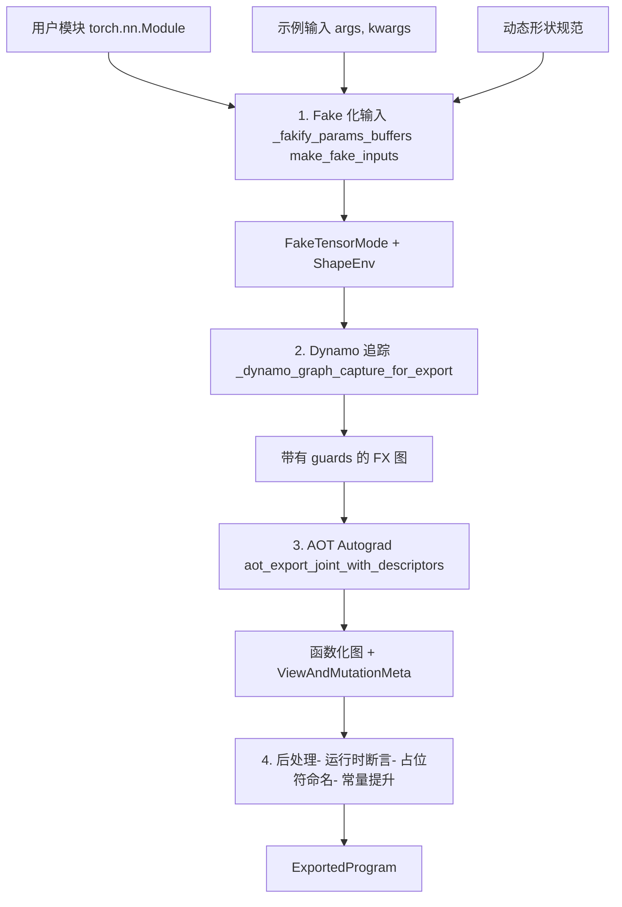
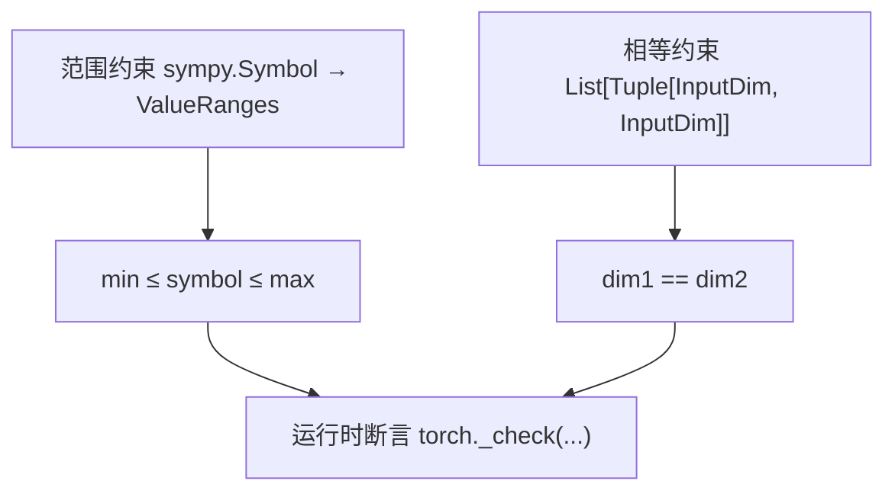
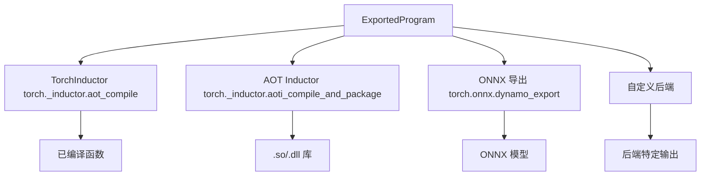

# Export API 与 ExportedProgram (Export API and ExportedProgram)

相关源文件 (Relevant source files)

-   [aten/src/ATen/core/PythonFallbackKernel.cpp](https://github.com/pytorch/pytorch/blob/915982a4/aten/src/ATen/core/PythonFallbackKernel.cpp)
-   [test/dynamo/test\_utils.py](https://github.com/pytorch/pytorch/blob/915982a4/test/dynamo/test_utils.py)
-   [test/export/test\_experimental.py](https://github.com/pytorch/pytorch/blob/915982a4/test/export/test_experimental.py)
-   [test/export/test\_export.py](https://github.com/pytorch/pytorch/blob/915982a4/test/export/test_export.py)
-   [test/fx/test\_fx\_xform\_observer.py](https://github.com/pytorch/pytorch/blob/915982a4/test/fx/test_fx_xform_observer.py)
-   [test/profiler/test\_record\_function.py](https://github.com/pytorch/pytorch/blob/915982a4/test/profiler/test_record_function.py)
-   [test/profiler/test\_torch\_tidy.py](https://github.com/pytorch/pytorch/blob/915982a4/test/profiler/test_torch_tidy.py)
-   [test/test\_dynamic\_shapes.py](https://github.com/pytorch/pytorch/blob/915982a4/test/test_dynamic_shapes.py)
-   [test/test\_proxy\_tensor.py](https://github.com/pytorch/pytorch/blob/915982a4/test/test_proxy_tensor.py)
-   [torch/\_dynamo/config.py](https://github.com/pytorch/pytorch/blob/915982a4/torch/_dynamo/config.py)
-   [torch/\_dynamo/convert\_frame.py](https://github.com/pytorch/pytorch/blob/915982a4/torch/_dynamo/convert_frame.py)
-   [torch/\_dynamo/eval\_frame.py](https://github.com/pytorch/pytorch/blob/915982a4/torch/_dynamo/eval_frame.py)
-   [torch/\_dynamo/functional\_export.py](https://github.com/pytorch/pytorch/blob/915982a4/torch/_dynamo/functional_export.py)
-   [torch/\_dynamo/utils.py](https://github.com/pytorch/pytorch/blob/915982a4/torch/_dynamo/utils.py)
-   [torch/\_export/non\_strict\_utils.py](https://github.com/pytorch/pytorch/blob/915982a4/torch/_export/non_strict_utils.py)
-   [torch/export/\_\_init\_\_.py](https://github.com/pytorch/pytorch/blob/915982a4/torch/export/__init__.py)
-   [torch/export/\_trace.py](https://github.com/pytorch/pytorch/blob/915982a4/torch/export/_trace.py)
-   [torch/fx/experimental/symbolic\_shapes.py](https://github.com/pytorch/pytorch/blob/915982a4/torch/fx/experimental/symbolic_shapes.py)
-   [torch/fx/passes/graph\_transform\_observer.py](https://github.com/pytorch/pytorch/blob/915982a4/torch/fx/passes/graph_transform_observer.py)

## 目的与范围 (Purpose and Scope)

本页记录了 PyTorch 的 **export API** 以及 **ExportedProgram** 数据结构。导出 (export) 系统能够将 PyTorch 模型捕获为可移植的、静态的计算图，适用于部署、序列化和提前 (ahead-of-time) 编译。

**相关页面：**

-   有关从用户代码开始的完整编译流水线的信息，请参阅 [2.1](/pytorch/pytorch/2.1-torch.compile-pipeline-overview)
-   有关 TorchDynamo 的动态追踪系统，请参阅 [2.2](/pytorch/pytorch/2.2-torchdynamo-frontend)
-   有关 AOT Autograd 和图转换，请参阅 [2.4](/pytorch/pytorch/2.4-aot-autograd-and-functionalization)

**关键区别：**

-   **Export**：创建一个具有显式形状约束的**静态**图表示，适用于序列化和部署
-   **torch.compile**：执行带有运行时 guards 和重新编译的**动态**编译
-   **make\_fx**：底层的追踪工具；export 在此之上构建，并提供了额外的保证

---

## Export API 概览 (Export API Overview)

导出模型的主要入口点是 `torch.export.export()` 函数，它追踪一个 PyTorch 模块并产生一个 `ExportedProgram`。

### 核心 API (Core API)

```python
def export(    
    mod: torch.nn.Module,    
    args: tuple[Any, ...],    
    kwargs: dict[str, Any] | None = None,    
    *,    
    dynamic_shapes: dict[str, Any] | tuple[Any] | list[Any] | None = None,    
    strict: bool = True,    
    preserve_module_call_signature: tuple[str, ...] = (),
) -> ExportedProgram
```
**来源：** [torch/export/\_\_init\_\_.py1-200](https://github.com/pytorch/pytorch/blob/915982a4/torch/export/__init__.py#L1-L200) [torch/export/\_trace.py1-100](https://github.com/pytorch/pytorch/blob/915982a4/torch/export/_trace.py#L1-L100)

### 基础使用模式 (Basic Usage Pattern)

```python
import torch
from torch.export import export, Dim

class MyModel(torch.nn.Module):    
    def forward(self, x, y):        
        return x.matmul(y) + x

model = MyModel()
inputs = (torch.randn(4, 4), torch.randn(4, 4))

# 静态形状导出
ep = export(model, inputs)

# 动态形状导出
batch = Dim("batch", min=1, max=64)
ep_dynamic = export(model, inputs, dynamic_shapes={"x": {0: batch}})
```
**来源：** [test/export/test\_export.py600-700](https://github.com/pytorch/pytorch/blob/915982a4/test/export/test_export.py#L600-L700)

---

## ExportedProgram 结构 (ExportedProgram Structure)

`ExportedProgram` 是导出过程的主要输出，包含模型的完整、自包含表示。


**图表：ExportedProgram 数据结构**

### 关键组件 (Key Components)

| 组件 | 类型 | 描述 |
| --- | --- | --- |
| `graph_module` | `torch.fx.GraphModule` | 包含 ATen 操作的 FX 图 |
| `graph_signature` | `ExportGraphSignature` | 关于输入/输出及其语义的元数据 |
| `state_dict` | `Dict[str, Any]` | 参数和缓冲区 |
| `range_constraints` | `Dict[sympy.Symbol, ValueRanges]` | 符号维度的约束 |
| `module_call_graph` | `List[ModuleCallEntry]` | 分层的模块结构 |
| `constants` | `Dict[str, Any]` | 提升 (lifted) 后的常量张量 |

**来源：** [torch/export/exported\_program.py1-300](https://github.com/pytorch/pytorch/blob/915982a4/torch/export/exported_program.py#L1-L300) [torch/export/graph\_signature.py1-200](https://github.com/pytorch/pytorch/blob/915982a4/torch/export/graph_signature.py#L1-L200)

### ExportGraphSignature 详情 (ExportGraphSignature Details)

图签名指定了每个图输入和输出的语义含义：

```python
@dataclass
class ExportGraphSignature:    
    input_specs: List[InputSpec]    
    output_specs: List[OutputSpec]
```
**输入种类 (Input kinds)：**

-   `InputKind.USER_INPUT`：普通的函数参数
-   `InputKind.PARAMETER`：模型参数
-   `InputKind.BUFFER`：模型缓冲区 (buffer)
-   `InputKind.CONSTANT_TENSOR`：提升后的常量
-   `InputKind.CUSTOM_OBJ`：自定义对象（例如 torch.ScriptObject）

**输出种类 (Output kinds)：**

-   `OutputKind.USER_OUTPUT`：普通的返回值
-   `OutputKind.LOSS_OUTPUT`：训练损失（为反向传播保留）
-   `OutputKind.BUFFER_MUTATION`：被修改的缓冲区
-   `OutputKind.GRADIENT_TO_PARAMETER`：参数梯度（训练 IR）
-   `OutputKind.GRADIENT_TO_USER_INPUT`：输入梯度（训练 IR）

**来源：** [torch/export/graph\_signature.py1-300](https://github.com/pytorch/pytorch/blob/915982a4/torch/export/graph_signature.py#L1-L300)

---

## 导出过程流程 (Export Process Flow)

导出过程涉及从用户代码到最终 `ExportedProgram` 的多个转换阶段。


**图表：导出流水线阶段**

### 第 1 阶段：输入 Fake 化 (Input Fakification)

导出过程首先将真实张量转换为追踪符号形状的 `FakeTensor` 对象：

```python
# 关键函数：torch/_export/utils.py 中的 _fakify_params_buffers
# 为参数和缓冲区创建 fake tensors
# 建立符号形状上下文

fake_mode = FakeTensorMode(shape_env=ShapeEnv(...))
fake_params = {}
for name, param in module.named_parameters():    
    fake_params[name] = fake_mode.from_tensor(param, symbolic_context=...)
```
`ShapeEnv` 追踪维度之间的符号关系并管理约束。

**来源：** [torch/\_export/utils.py1-200](https://github.com/pytorch/pytorch/blob/915982a4/torch/_export/utils.py#L1-L200) [torch/\_export/non\_strict\_utils.py200-400](https://github.com/pytorch/pytorch/blob/915982a4/torch/_export/non_strict_utils.py#L200-L400)

### 第 2 阶段：Dynamo 图捕获 (Dynamo Graph Capture)

TorchDynamo 追踪模块执行，捕获 Python 字节码并将其转换为 FX 操作：

```python
# 在 torch/_dynamo/functional_export.py 中实现
gm, guards, ... = _dynamo_graph_capture_for_export(    
    f=flat_fn,    
    args=flat_fake_args,    
    kwargs={},    
    dynamic_shapes=dynamic_shapes,
)
```
这使用了 Dynamo 的符号执行系统，但带有一些导出特有的配置：

-   对于动态形状，使用 `assume_static_by_default=False`
-   使用 `capture_scalar_outputs=True` 以保留标量返回值
-   使用 `specialize_int=True` 以进行正确的整数处理

**来源：** [torch/\_dynamo/functional\_export.py1-300](https://github.com/pytorch/pytorch/blob/915982a4/torch/_dynamo/functional_export.py#L1-L300) [torch/export/\_trace.py400-600](https://github.com/pytorch/pytorch/blob/915982a4/torch/export/_trace.py#L400-L600)

### 第 3 阶段：AOT Autograd 函数化 (AOT Autograd Functionalization)

图经过 AOT Autograd 处理以：

1.  移除变异 (mutations)（函数化）
2.  建立前向/后向拆分
3.  生成关于视图/变异关系的元数据

```python
# torch/_functorch/aot_autograd.py
gm, graph_signature = aot_export_joint_with_descriptors(    
    f=gm,    
    args=fake_args,    
    # 创建 ViewAndMutationMeta
)
```
**来源：** [torch/\_functorch/aot\_autograd.py1-500](https://github.com/pytorch/pytorch/blob/915982a4/torch/_functorch/aot_autograd.py#L1-L500) [torch/export/\_trace.py600-800](https://github.com/pytorch/pytorch/blob/915982a4/torch/export/_trace.py#L600-L800)

### 第 4 阶段：后处理 (Post-Processing)

最后的转换准备好导出的图：

-   **运行时断言传递 (Runtime assertion pass)**：将形状 guards 转换为运行时检查
-   **占位符命名传递 (Placeholder naming pass)**：为图输入分配语义名称
-   **常量提升传递 (Constant lifting pass)**：将常量张量提取到 `constants` 字典中

**来源：** [torch/\_export/utils.py300-500](https://github.com/pytorch/pytorch/blob/915982a4/torch/_export/utils.py#L300-L500) [torch/\_export/passes/lift\_constants\_pass.py1-200](https://github.com/pytorch/pytorch/blob/915982a4/torch/_export/passes/lift_constants_pass.py#L1-L200)

---

## 动态形状与约束 (Dynamic Shapes and Constraints)

导出支持通过符号维度规范实现动态形状。

### Dim API

```python
from torch.export import Dim

# 具有范围的基础维度
batch = Dim("batch", min=1, max=1024)

# 具有精确值的维度
seq_len = Dim("seq_len", min=128, max=128)  # 静态维度

# 在 dynamic_shapes 中使用
dynamic_shapes = {    
    "x": {0: batch, 1: seq_len},  # 将维度索引映射到 Dim 的字典    
    "y": {0: batch},
}

ep = export(model, (x, y), dynamic_shapes=dynamic_shapes)
```
### 约束类型 (Constraint Types)


**图表：约束系统**

### 约束是如何建立的 (How Constraints Are Established)

1.  **用户通过 `Dim` 指定**：显式的最小/最大边界。
2.  **从操作中推断**：切片等操作可以创建隐式约束。
3.  **相等约束**：共享的 `Dim` 对象创建相等关系。

```python
# 示例：相等约束
batch = Dim("batch")
dynamic_shapes = {    
    "x": {0: batch},    
    "y": {0: batch},  # 相同的 batch 维度
}
# 创建相等约束：x.shape[0] == y.shape[0]
```
**运行时断言**被插入到图中：

```python
# 生成的运行时检查
torch._check(s0 >= 1)  # 最小约束
torch._check(s0 <= 1024)  # 最大约束
```
**来源：** [torch/export/dynamic\_shapes.py1-400](https://github.com/pytorch/pytorch/blob/915982a4/torch/export/dynamic_shapes.py#L1-L400) [torch/\_export/utils.py500-700](https://github.com/pytorch/pytorch/blob/915982a4/torch/_export/utils.py#L500-L700)

---

## 严格与非严格导出 (Strict vs Non-Strict Export)

导出提供了两种模式，具有不同的权衡：

| 维度 | 严格模式 (Strict Mode) | 非严格模式 (Non-Strict Mode，默认) |
| --- | --- | --- |
| **图断点 (Graph Breaks)** | 不允许（报错） | 允许（产生多个图） |
| **Python 控制流** | 必须使用 torch 算子 | 可以使用 Python 原生控制流 |
| **副作用 (Side Effects)** | 严格限制 | 较为宽松 |
| **使用场景** | 生产环境部署 | 开发 / 调试 |

### 非严格模式 (Non-Strict Mode)

非严格模式是默认模式 (`strict=False`)，在开发期间提供了更多灵活性：

```python
ep = export(model, inputs, strict=False)
# - 可能包含图断点
# - Python 控制流被保留为独立的子图
# - 更灵活但优化空间较小
```
**实现**：使用带有宽松约束的特殊 Dynamo 配置。

### 严格模式 (Strict Mode)

严格模式 (`strict=True`) 为生产环境部署提供了更强的保证：

```python
ep = export(model, inputs, strict=True)
# - 单个图，无断点
# - 所有控制流通过 torch.cond, torch.while_loop 实现
# - 完全静态，可深度优化
```
**实现**：使用 `capture_pre_autograd_graph=False` 和严格的 Dynamo 配置。

**来源：** [torch/export/\_trace.py200-400](https://github.com/pytorch/pytorch/blob/915982a4/torch/export/_trace.py#L200-L400) [torch/\_export/non\_strict\_utils.py1-300](https://github.com/pytorch/pytorch/blob/915982a4/torch/_export/non_strict_utils.py#L1-L300)

---

## 与编译后端集成 (Integration with Compilation Backends)

`ExportedProgram` 作为各种后端的输入：


**图表：ExportedProgram 后端集成**

### 示例：编译 (Example: Compilation)

```python
import torch._inductor

# 导出模型
ep = torch.export.export(model, example_inputs)

# 使用 Inductor 编译
compiled_fn = torch._inductor.aot_compile(    
    ep.module(),    
    example_inputs,
)

# 或者打包用于部署
torch._inductor.aoti_compile_and_package(    
    ep,    
    package_path="model.pt2",
)
```
**来源：** [test/inductor/test\_aot\_inductor.py1-100](https://github.com/pytorch/pytorch/blob/915982a4/test/inductor/test_aot_inductor.py#L1-L100) [torch/\_inductor/aot\_compile.py1-200](https://github.com/pytorch/pytorch/blob/915982a4/torch/_inductor/aot_compile.py#L1-L200)

---

## 关键实现文件 (Key Implementation Files)

### 导出核心 (Export Core)

| 文件 | 目的 |
| --- | --- |
| `torch/export/__init__.py` | 公共 API 表面 |
| `torch/export/_trace.py` | 核心导出实现 (`_export`) |
| `torch/export/exported_program.py` | `ExportedProgram` 类定义 |
| `torch/export/graph_signature.py` | 输入/输出规范类型 |
| `torch/export/dynamic_shapes.py` | 动态形状约束系统 |

### 工具与传递 (Utilities and Passes)

| 文件 | 目的 |
| --- | --- |
| `torch/_export/utils.py` | Fake 化、占位符命名 |
| `torch/_export/passes/lift_constants_pass.py` | 常量张量提升 |
| `torch/_export/passes/collect_tracepoints_pass.py` | 调试元数据 |
| `torch/_export/non_strict_utils.py` | 非严格模式支持 |

### 集成点 (Integration Points)

| 文件 | 目的 |
| --- | --- |
| `torch/_dynamo/functional_export.py` | 用于导出的 Dynamo 图捕获 |
| `torch/_functorch/aot_autograd.py` | 函数化与元数据 |
| `torch/fx/experimental/symbolic_shapes.py` | 符号形状系统 |

**来源：** 以上列出的所有文件

---

## 示例：完整的导出流程 (Example: Complete Export Workflow)

```python
import torch
from torch.export import export, Dim

# 1. 定义模型
class MyModel(torch.nn.Module):    
    def __init__(self):        
        super().__init__()        
        self.linear = torch.nn.Linear(10, 10)        
    
    def forward(self, x, y):        
        return self.linear(x) * y

model = MyModel()

# 2. 准备示例输入
x = torch.randn(4, 10)
y = torch.randn(4, 10)

# 3. 定义动态形状
batch = Dim("batch", min=1, max=64)
dynamic_shapes = {    
    "x": {0: batch},    
    "y": {0: batch},
}

# 4. 导出
ep = export(model, (x, y), dynamic_shapes=dynamic_shapes)

# 5. 检查结构
print(ep.graph_signature)
# ExportGraphSignature(
#   input_specs=[
#     InputSpec(kind=USER_INPUT, arg=..., target='x'),
#     InputSpec(kind=USER_INPUT, arg=..., target='y'),
#     InputSpec(kind=PARAMETER, arg=..., target='linear.weight'),
#     InputSpec(kind=PARAMETER, arg=..., target='linear.bias'),
#   ],
#   output_specs=[
#     OutputSpec(kind=USER_OUTPUT, arg=..., target='output_0'),
#   ]
# )

print(ep.range_constraints)
# {s0: ValueRanges(lower=1, upper=64)}

# 6. 执行导出的程序
result = ep.module()(x, y)

# 7. 验证正确性
expected = model(x, y)
assert torch.allclose(result, expected)
```
**来源：** [test/export/test\_export.py600-700](https://github.com/pytorch/pytorch/blob/915982a4/test/export/test_export.py#L600-L700)
