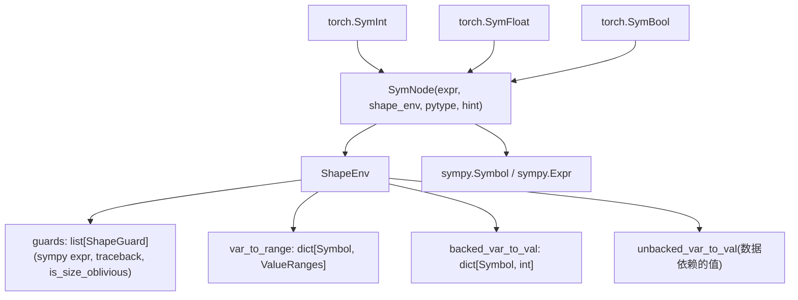
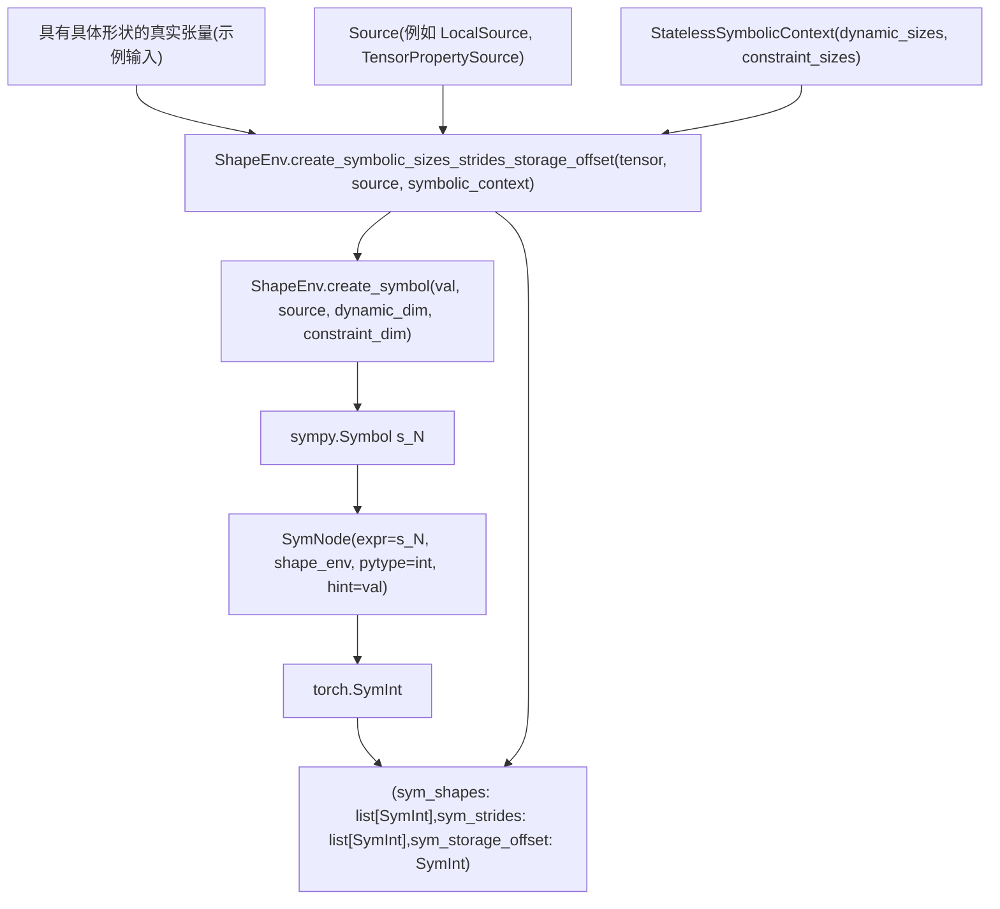
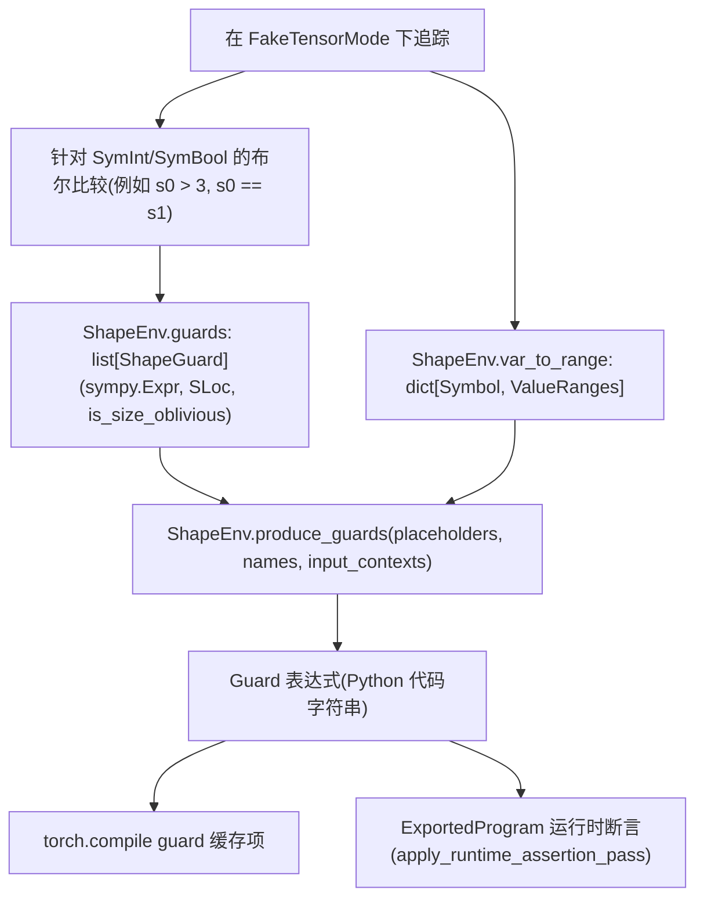
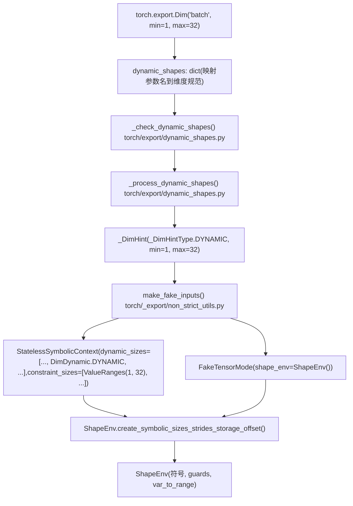

# 符号形状与动态维度 (Symbolic Shapes and Dynamic Dimensions)

相关源文件 (Relevant source files)

-   [aten/src/ATen/core/PythonFallbackKernel.cpp](https://github.com/pytorch/pytorch/blob/915982a4/aten/src/ATen/core/PythonFallbackKernel.cpp)
-   [test/dynamo/test\_utils.py](https://github.com/pytorch/pytorch/blob/915982a4/test/dynamo/test_utils.py)
-   [test/export/test\_experimental.py](https://github.com/pytorch/pytorch/blob/915982a4/test/export/test_experimental.py)
-   [test/export/test\_export.py](https://github.com/pytorch/pytorch/blob/915982a4/test/export/test_export.py)
-   [test/fx/test\_fx\_xform\_observer.py](https://github.com/pytorch/pytorch/blob/915982a4/test/fx/test_fx_xform_observer.py)
-   [test/profiler/test\_record\_function.py](https://github.com/pytorch/pytorch/blob/915982a4/test/profiler/test_record_function.py)
-   [test/profiler/test\_torch\_tidy.py](https://github.com/pytorch/pytorch/blob/915982a4/test/profiler/test_torch_tidy.py)
-   [test/test\_dynamic\_shapes.py](https://github.com/pytorch/pytorch/blob/915982a4/test/test_dynamic_shapes.py)
-   [test/test\_proxy\_tensor.py](https://github.com/pytorch/pytorch/blob/915982a4/test/test_proxy_tensor.py)
-   [torch/\_dynamo/config.py](https://github.com/pytorch/pytorch/blob/915982a4/torch/_dynamo/config.py)
-   [torch/\_dynamo/convert\_frame.py](https://github.com/pytorch/pytorch/blob/915982a4/torch/_dynamo/convert_frame.py)
-   [torch/\_dynamo/eval\_frame.py](https://github.com/pytorch/pytorch/blob/915982a4/torch/_dynamo/eval_frame.py)
-   [torch/\_dynamo/functional\_export.py](https://github.com/pytorch/pytorch/blob/915982a4/torch/_dynamo/functional_export.py)
-   [torch/\_dynamo/utils.py](https://github.com/pytorch/pytorch/blob/915982a4/torch/_dynamo/utils.py)
-   [torch/\_export/non\_strict\_utils.py](https://github.com/pytorch/pytorch/blob/915982a4/torch/_export/non_strict_utils.py)
-   [torch/export/\_\_init\_\_.py](https://github.com/pytorch/pytorch/blob/915982a4/torch/export/__init__.py)
-   [torch/export/\_trace.py](https://github.com/pytorch/pytorch/blob/915982a4/torch/export/_trace.py)
-   [torch/fx/experimental/symbolic\_shapes.py](https://github.com/pytorch/pytorch/blob/915982a4/torch/fx/experimental/symbolic_shapes.py)
-   [torch/fx/passes/graph\_transform\_observer.py](https://github.com/pytorch/pytorch/blob/915982a4/torch/fx/passes/graph_transform_observer.py)

## 目的与范围 (Purpose and Scope)

本页记录了符号形状 (symbolic shapes) 子系统：这是一组类型、类和算法，允许 PyTorch 的编译栈对可能在运行时变化的张量维度进行推理。此处涵盖的主要组件包括：

-   `SymInt`、`SymBool`、`SymFloat` —— 包装了 sympy 表达式的符号化标量类型
-   `ShapeEnv` —— 管理符号变量、guards 和数值范围的核心环境
-   `create_symbolic_sizes_strides_storage_offset` —— 张量的具体维度在追踪过程中如何变为符号化维度的
-   通过 `produce_guards` 进行的 guard 生成以及约束求解
-   `ConstraintViolationError` —— 当约束无法满足时会发生什么

有关 `FakeTensorMode` 如何使用这些类型在没有真实数据的情况下传播元数据的详情，请参阅 [2.3.3](/pytorch/pytorch/2.3.3-faketensormode-and-metadata-propagation)。有关 guards 如何在运行时被评估并在 `torch.compile` 中触发重新编译的详情，请参阅 [2.2.3](/pytorch/pytorch/2.2.3-guard-system-and-recompilation)。有关消费所产生的 guard 结构的 `torch.export` API 和 `ExportedProgram` 的详情，请参阅 [2.3.1](/pytorch/pytorch/2.3.1-export-api-and-exportedprogram)。

---

## 核心符号类型 (Core Symbolic Types)

三种 Python 层级的类型在追踪期间代表符号标量。它们在 C++ 中定义并向 Python 公开为 `torch.SymInt`、`torch.SymFloat` 和 `torch.SymBool`。

| Python 类型 | 对应的具体类型 | 内部 sympy 类型 |
| --- | --- | --- |
| `torch.SymInt` | `int` | `sympy.Expr` (整数) |
| `torch.SymFloat` | `float` | `sympy.Expr` (实数) |
| `torch.SymBool` | `bool` | `sympy.logic.boolalg.Boolean` |

每种符号类型都包装了一个 `SymNode`（在 `torch/fx/experimental/sym_node.py` 中定义），它持有：

-   `expr`：底层的 sympy 表达式（例如 `s0`、`s0 + s1`）
-   `shape_env`：对拥有该符号的 `ShapeEnv` 的引用
-   `pytype`：Python 类型（`int`、`float` 或 `bool`）
-   `hint`：从示例输入中观察到的具体数值

[torch/fx/experimental/symbolic\_shapes.py141-186](https://github.com/pytorch/pytorch/blob/915982a4/torch/fx/experimental/symbolic_shapes.py#L141-L186) 中的 `__all__` 列表公开了主要的 API 表面。

`torch/fx/experimental/symbolic_shapes.py` 中的**关键标量工具函数**：

| 函数 | 用途 |
| --- | --- |
| `size_hint(a, fallback)` | 获取 `SymInt` 的具体提示 (hint) |
| `is_concrete_int(a)` | 如果符号已解析为常量，则返回 `True` |
| `is_concrete_float(a)` | 针对 `SymFloat` 的类似检查 |
| `is_concrete_bool(a)` | 针对 `SymBool` 的类似检查 |
| `has_static_value(a)` | 面向用户的检查：该值是否静态已知？ |
| `has_symbolic_sizes_strides(t)` | 如果张量 `t` 具有任何符号化维度或步长，则为 True |

来源： [torch/fx/experimental/symbolic\_shapes.py379-488](https://github.com/pytorch/pytorch/blob/915982a4/torch/fx/experimental/symbolic_shapes.py#L379-L488)

---

## ShapeEnv：核心注册表 (ShapeEnv: The Central Registry)

对于给定的追踪会话，`ShapeEnv` 是单例环境。所有的符号变量、它们的约束以及累积的 guards 都存放在这里。它在 `torch/fx/experimental/symbolic_shapes.py` 中定义，并通过 `fake_mode.shape_env` 在整个代码库中被引用。

**核心职责：**

| 职责 | 关键属性 / 方法 |
| --- | --- |
| 分配符号 | `create_symbol(val, source, dynamic_dim, ...)` |
| 创建张量符号化大小 | `create_symbolic_sizes_strides_storage_offset(...)` |
| 追踪具体提示 | `backed_var_to_val: dict[Symbol, int]` |
| 追踪数值范围 | `var_to_range: dict[Symbol, ValueRanges]` |
| 累积 guards | `guards: list[ShapeGuard]` |
| 发出 guard 代码 | `produce_guards(placeholders, names, ...)` |

**`ShapeEnv` 结构关系：**


来源： [torch/fx/experimental/symbolic\_shapes.py141-186](https://github.com/pytorch/pytorch/blob/915982a4/torch/fx/experimental/symbolic_shapes.py#L141-L186) [torch/fx/experimental/sym\_node.py](https://github.com/pytorch/pytorch/blob/915982a4/torch/fx/experimental/sym_node.py)

---

## DimDynamic：维度分类 (DimDynamic: Dimension Classification)

`DimDynamic`（在 [torch/\_dynamo/eval\_frame.py90-95](https://github.com/pytorch/pytorch/blob/915982a4/torch/_dynamo/eval_frame.py#L90-L95) 导入）是一个枚举，用于控制在创建符号形状时如何处理每个张量维度：

| 数值 | 含义 |
| --- | --- |
| `DUCK` | 鸭子类型 (Duck-type)：特化为具体数值。如果另一个维度具有相同的值，则共享现有符号；否则分配一个新符号。 |
| `DYNAMIC` | 无论数值如何，总是分配一个新的支持符号 (backed symbol)。 |
| `STATIC` | 视为具体值。不创建符号；直接使用整数面值。 |
| `INFER_RANGE` | 分配一个符号，但使用范围分析进行限定，而不使用相等性 guard。 |

在 `torch.compile` 中，大多数维度默认为 `DUCK`（随后可能被自动动态形状提升为 `DYNAMIC`）。在带有用户提供的 `Dim` 对象的 `torch.export` 中，相关的维度使用 `DYNAMIC`。

来源： [torch/\_dynamo/eval\_frame.py90-95](https://github.com/pytorch/pytorch/blob/915982a4/torch/_dynamo/eval_frame.py#L90-L95) [test/test\_dynamic\_shapes.py183-187](https://github.com/pytorch/pytorch/blob/915982a4/test/test_dynamic_shapes.py#L183-L187)

---

## 符号上下文 (Symbolic Contexts)

*符号上下文 (symbolic context)* 捆绑了针对每个张量的配置。它被直接传递给 `create_symbolic_sizes_strides_storage_offset`。

| 类 | 何时使用 |
| --- | --- |
| `StatelessSymbolicContext` | 最常用；指定每个维度的 `DimDynamic` 模式和可选的范围约束 |
| `StatefulSymbolicContext` | 重新追踪；将维度索引映射到预先存在的 sympy 符号 |
| `SubclassSymbolicContext` | 针对张量子类扩展了上述内容 |
| `SymIntSymbolicContext` | 为标量输入包装一个预先存在的 `SymInt` |

所有这些都在 [torch/fx/experimental/symbolic\_shapes.py167-172](https://github.com/pytorch/pytorch/blob/915982a4/torch/fx/experimental/symbolic_shapes.py#L167-L172) 中导出，并导入到 [torch/\_export/non\_strict\_utils.py43-55](https://github.com/pytorch/pytorch/blob/915982a4/torch/_export/non_strict_utils.py#L43-L55) 的导出流水线中。

实践中的 `StatelessSymbolicContext`：

```python
StatelessSymbolicContext(    
    dynamic_sizes=[DimDynamic.DYNAMIC, DimDynamic.STATIC],    
    constraint_sizes=[None, None],
)
```
[test/test\_dynamic\_shapes.py190-193](https://github.com/pytorch/pytorch/blob/915982a4/test/test_dynamic_shapes.py#L190-L193)

---

## 为张量创建符号化大小 (Creating Symbolic Sizes for Tensors)

`ShapeEnv.create_symbolic_sizes_strides_storage_offset(tensor, source, symbolic_context)` 方法是符号化张量元数据的主要入口。它返回一个元组 `(sym_shapes, sym_strides, sym_storage_offset)`。

对于每个维度 `i`：

1.  从 `symbolic_context.dynamic_sizes[i]` 读取 `DimDynamic` 模式。
2.  对于 `DUCK` 或 `DYNAMIC`，通过 `ShapeEnv.create_symbol(val, source, dynamic_dim)` 创建一个 sympy 符号 `s_N`。
3.  将该符号包装进 `SymNode`，然后包装进 `SymInt`。
4.  具体提示存储在 `backed_var_to_val[s_N] = val` 中。
5.  步长表达式被计算为形状符号上的 sympy 表达式。

**张量符号化流程：**


来源： [test/test\_dynamic\_shapes.py176-203](https://github.com/pytorch/pytorch/blob/915982a4/test/test_dynamic_shapes.py#L176-L203) [test/test\_dynamic\_shapes.py219-241](https://github.com/pytorch/pytorch/blob/915982a4/test/test_dynamic_shapes.py#L219-L241)

`source` 参数标识了每个符号在用户输入结构中的出处（例如 `TensorPropertySource(LocalSource("x"), TensorProperty.SIZE, dim=0)`）。这在之后被用于发出人类可读的 guard 代码，如 `x.shape[0] == 5`。

---

## 支持符号 vs 不受支持符号 (Backed vs Unbacked Symbols)

| 类别 | 如何创建 | 具体提示 (hint)? | Guard 策略 |
| --- | --- | --- | --- |
| **支持 (Backed)** | 在追踪时从张量形状/步长创建 | 有 —— 在 `backed_var_to_val` 中 | 发出静态相等性/范围 guards |
| **不受支持 (Unbacked)** | 来自数据依赖的操作：`tensor.item()`、`torch.unique` 等 | 无 | 插入到图中的延迟运行时断言 |

在追踪期间尝试静态地对不受支持符号进行 guard —— 例如 `if tensor.item() > 0:` —— 会抛出 `GuardOnDataDependentSymNode` [torch/fx/experimental/symbolic\_shapes.py123-128](https://github.com/pytorch/pytorch/blob/915982a4/torch/fx/experimental/symbolic_shapes.py#L123-L128)。

不受支持符号的绑定存储在 FX 图节点的 `node.meta["unbacked_bindings"]` 中。当重新追踪时：

-   `resolve_unbacked_bindings` [torch/fx/experimental/symbolic\_shapes.py542-558](https://github.com/pytorch/pytorch/blob/915982a4/torch/fx/experimental/symbolic_shapes.py#L542-L558) 应用来自 `ShapeEnv.unbacked_renamings` 的重命名。
-   `rebind_unbacked` [torch/fx/experimental/symbolic\_shapes.py564-622](https://github.com/pytorch/pytorch/blob/915982a4/torch/fx/experimental/symbolic_shapes.py#L564-L622) 协调旧的和新的不受支持符号。

同样相关的内容：

-   `PendingUnbackedSymbolNotFound` [torch/fx/experimental/symbolic\_shapes.py131-133](https://github.com/pytorch/pytorch/blob/915982a4/torch/fx/experimental/symbolic_shapes.py#L131-L133) —— 当期望的不受支持符号尚未被绑定时抛出。
-   `GuardOnDataDependentSymNode` 在 `torch/_dynamo/convert_frame.py` 中被导入 [torch/\_dynamo/convert\_frame.py71-74](https://github.com/pytorch/pytorch/blob/915982a4/torch/_dynamo/convert_frame.py#L71-L74)。

---

## 通过 produce\_guards 进行 Guard 生成 (Guard Generation via produce_guards)

追踪完成后，`ShapeEnv.guards` 中累积的 guards 会被 `ShapeEnv.produce_guards(placeholders, names, ...)` 转换为可执行的 Python 表达式。

在追踪期间，涉及 `SymInt` 的每次比较（例如 `if s0 > 3:`，`torch.cat` 检查维度相等）都会向 `ShapeEnv.guards` 添加一个 `ShapeGuard`（一个包含 `(sympy_expr, SLoc, is_size_oblivious)` 的元组）。

`produce_guards` 随后：

1.  将占位符名称替换为 sympy 符号。
2.  应用来自 `var_to_range` 的范围简化。
3.  发出可针对新输入进行评估的 Python guard 表达式。

**Guard 生成流水线：**


对于 `torch.export` 非严格模式，`produce_guards_and_solve_constraints`（在 [torch/export/\_trace.py38-40](https://github.com/pytorch/pytorch/blob/915982a4/torch/export/_trace.py#L38-L40) 导入）包装了 `produce_guards`，并额外运行 `DimConstraints` 来求解用户指定的 `Dim` 约束。

来自 `test/test_proxy_tensor.py` 的用法示例 [test/test\_proxy\_tensor.py49-53](https://github.com/pytorch/pytorch/blob/915982a4/test/test_proxy_tensor.py#L49-L53)：

```python
def show_guards(gm):    
    names = [strip_end(n, "_1") for n in fx_placeholder_targets(gm)]    
    return "\n".join(        
        gm.shape_env.produce_guards(
            fx_placeholder_vals(gm), names, _simplified=True, input_contexts=None
        )    
    )
```
来源： [test/test\_proxy\_tensor.py49-53](https://github.com/pytorch/pytorch/blob/915982a4/test/test_proxy_tensor.py#L49-L53) [torch/export/\_trace.py38-40](https://github.com/pytorch/pytorch/blob/915982a4/torch/export/_trace.py#L38-L40) [torch/\_export/non\_strict\_utils.py38-40](https://github.com/pytorch/pytorch/blob/915982a4/torch/_export/non_strict_utils.py#L38-L40)

---

## 面向 torch.export 的 Dim API (The Dim API for torch.export)

用户使用 `Dim` 类为 `torch.export` 声明动态维度：

```python
dim_batch = torch.export.Dim("batch", min=1, max=32)
ep = torch.export.export(    
    model,    
    (x,),    
    dynamic_shapes={"x": {0: dim_batch}},
)
```
`Dim` 通过以下方式在 [torch/export/\_\_init\_\_.py43](https://github.com/pytorch/pytorch/blob/915982a4/torch/export/__init__.py#L43-L43) 公开：

```python
from .dynamic_shapes import AdditionalInputs, Constraint, Dim, dims, ShapesCollection
```
**从 Dim 到 ShapeEnv 的处理流水线：**


来源： [torch/export/\_\_init\_\_.py43](https://github.com/pytorch/pytorch/blob/915982a4/torch/export/__init__.py#L43-L43) [torch/export/\_trace.py80-100](https://github.com/pytorch/pytorch/blob/915982a4/torch/export/_trace.py#L80-L100) [torch/\_export/non\_strict\_utils.py30-55](https://github.com/pytorch/pytorch/blob/915982a4/torch/_export/non_strict_utils.py#L30-L55)

特殊 `Dim` 值：

| 数值 | 含义 |
| --- | --- |
| `Dim("name", min=m, max=n)` | 具有显式边界的动态维度 |
| `Dim.AUTO` | 让流水线推断动态 vs 静态 |
| `Dim.STATIC` | 强制视为静态 |
| `Dim.DYNAMIC` | 总是动态，无显式边界 |

---

## 约束求解与 ConstraintViolationError (Constraint Solving and ConstraintViolationError)

在追踪之后，系统必须验证 `dynamic_shapes` 规范是否与模型实际要求的一致。不一致的情况会报告为 `ConstraintViolationError` [torch/fx/experimental/symbolic\_shapes.py356-357](https://github.com/pytorch/pytorch/blob/915982a4/torch/fx/experimental/symbolic_shapes.py#L356-L357)。

**原因：**

| 原因 | 示例 |
| --- | --- |
| 示例输入值违反了 `Dim` 边界 | `Dim("x", min=6)` 但示例输入的 `x.shape[0] = 3` |
| 两个声明为独立的 `Dim` 实际上必须相等 | 模型要求 `x.shape[0] == y.shape[0]` |
| 一个声明为动态的维度被模型特化为常量 | 模型中有分支 `if x.shape[0] == 5:` |

在非严格模式下，抛出的异常是 `torch.fx.experimental.symbolic_shapes.ConstraintViolationError`。在严格模式 (Dynamo) 下，它变为 `torch._dynamo.exc.UserError`。

[test/export/test\_export.py332-350](https://github.com/pytorch/pytorch/blob/915982a4/test/export/test_export.py#L332-L350)：

```python
dim_x = torch.export.Dim("dim_x", min=6)
# inp 的形状为 [3]，违反了 min=6
with self.assertRaisesRegex(error_type, "not in range"):    
    export(InvalidModel(), (inp,), dynamic_shapes={"x": {0: dim_x}})
```
在 [torch/\_export/non\_strict\_utils.py43-55](https://github.com/pytorch/pytorch/blob/915982a4/torch/_export/non_strict_utils.py#L43-L55) 导入的**约束类型**：

| 类 | 角色 |
| --- | --- |
| `EqualityConstraint` | 断言两个符号维度必须相等 |
| `RelaxedUnspecConstraint` | 允许一个维度在任何范围内自由变化 |
| `DimConstraints` | 求解器，用于简化 guard 表达式并生成用户建议 |

`DimConstraints` 是 `torch/fx/experimental/symbolic_shapes.py` 中 `__all__` 的一部分，并在 [test/test\_dynamic\_shapes.py26-38](https://github.com/pytorch/pytorch/blob/915982a4/test/test_dynamic_shapes.py#L26-L38) 中被直接导入。

`ValueRangeError`（来自 `torch/utils/_sympy/value_ranges.py`，在 [torch/export/\_trace.py103](https://github.com/pytorch/pytorch/blob/915982a4/torch/export/_trace.py#L103-L103) 导入）在范围算术产生空区间时被抛出。

---

## 完整流水线集成 (Full Pipeline Integration)

**torch.export 非严格路径：**

> **[Mermaid sequence]**
> *(图表结构无法解析)*

**torch.compile 路径：**

-   在 Dynamo 图捕获期间，`ShapeEnv` 被嵌入在 `FakeTensorMode` 中。
-   累积的 guards 与已编译的图一起存储在已编译缓存项 (`GuardedCode`) 中。
-   在每次后续调用时评估 guards；失败会触发重新编译。参见 [2.2.3](/pytorch/pytorch/2.2.3-guard-system-and-recompilation)。
-   `ConstraintViolationError` 在 [torch/\_dynamo/convert\_frame.py71-74](https://github.com/pytorch/pytorch/blob/915982a4/torch/_dynamo/convert_frame.py#L71-L74) 被捕获，并转换为图断点或用户错误。

来源： [torch/export/\_trace.py38-103](https://github.com/pytorch/pytorch/blob/915982a4/torch/export/_trace.py#L38-L103) [torch/\_export/non\_strict\_utils.py38-55](https://github.com/pytorch/pytorch/blob/915982a4/torch/_export/non_strict_utils.py#L38-L55) [torch/\_dynamo/convert\_frame.py71-74](https://github.com/pytorch/pytorch/blob/915982a4/torch/_dynamo/convert_frame.py#L71-L74)

---

## 关键符号参考 (Key Symbols Reference)

| 符号 | 文件 | 角色 |
| --- | --- | --- |
| `ShapeEnv` | `torch/fx/experimental/symbolic_shapes.py` | 所有符号变量和 guards 的核心注册表 |
| `SymNode` | `torch/fx/experimental/sym_node.py` | 带有具体提示的 sympy 表达式包装器 |
| `SymInt`, `SymFloat`, `SymBool` | `torch` (C++ 支持) | Python 层级的符号标量类型 |
| `DimDynamic` | `torch/fx/experimental/symbolic_shapes.py` | 控制每个维度的符号分配策略的枚举 |
| `StatelessSymbolicContext` | `torch/fx/experimental/symbolic_shapes.py` | 每个张量的维度配置 |
| `create_symbolic_sizes_strides_storage_offset` | `ShapeEnv` 的方法 | 为张量分配符号变量 |
| `produce_guards` | `ShapeEnv` 的方法 | 从累积的约束发出可执行的 guard 表达式 |
| `ConstraintViolationError` | `torch/fx/experimental/symbolic_shapes.py:356-357` | 当形状约束不一致时抛出 |
| `GuardOnDataDependentSymNode` | `torch/fx/experimental/symbolic_shapes.py:123-128` | 当尝试对不受支持符号进行静态 guard 时抛出 |
| `Dim` | `torch/export/dynamic_shapes.py` | 用于声明动态张量维度的用户接口 API |
| `EqualityConstraint` | `torch/fx/experimental/symbolic_shapes.py` | 断言两个符号相等 |
| `DimConstraints` | `torch/fx/experimental/symbolic_shapes.py` | 求解并验证用户指定的维度约束 |
| `make_fake_inputs` | `torch/_export/non_strict_utils.py` | 为导出创建具有符号形状的 `FakeTensor` 对象 |
| `produce_guards_and_solve_constraints` | `torch/_export/non_strict_utils.py` | 结合 guard 生成和约束求解的导出特有包装器 |
