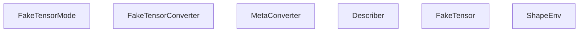
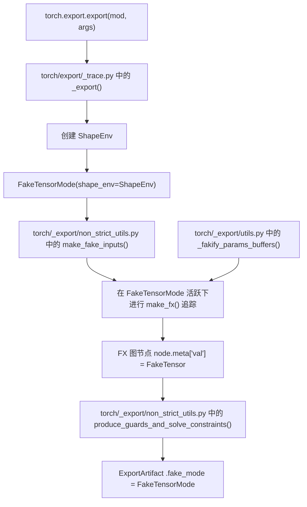
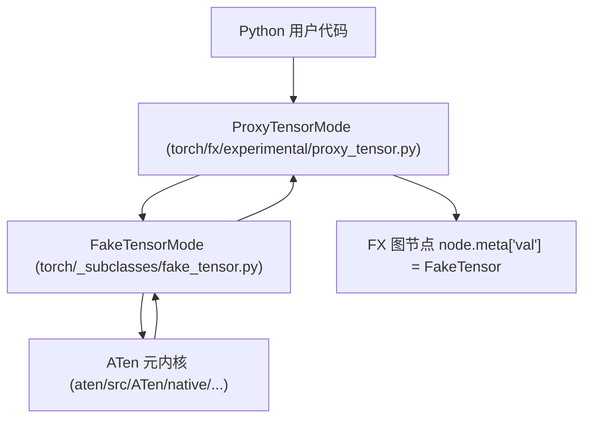

# FakeTensorMode 与元数据传播 (FakeTensorMode and Metadata Propagation)

相关源文件 (Relevant source files)

-   [aten/src/ATen/core/PythonFallbackKernel.cpp](https://github.com/pytorch/pytorch/blob/915982a4/aten/src/ATen/core/PythonFallbackKernel.cpp)
-   [test/dynamo/test\_utils.py](https://github.com/pytorch/pytorch/blob/915982a4/test/dynamo/test_utils.py)
-   [test/export/test\_experimental.py](https://github.com/pytorch/pytorch/blob/915982a4/test/export/test_experimental.py)
-   [test/export/test\_export.py](https://github.com/pytorch/pytorch/blob/915982a4/test/export/test_export.py)
-   [test/fx/test\_fx\_xform\_observer.py](https://github.com/pytorch/pytorch/blob/915982a4/test/fx/test_fx_xform_observer.py)
-   [test/profiler/test\_record\_function.py](https://github.com/pytorch/pytorch/blob/915982a4/test/profiler/test_record_function.py)
-   [test/profiler/test\_torch\_tidy.py](https://github.com/pytorch/pytorch/blob/915982a4/test/profiler/test_torch_tidy.py)
-   [test/test\_dynamic\_shapes.py](https://github.com/pytorch/pytorch/blob/915982a4/test/test_dynamic_shapes.py)
-   [test/test\_proxy\_tensor.py](https://github.com/pytorch/pytorch/blob/915982a4/test/test_proxy_tensor.py)
-   [torch/\_dynamo/config.py](https://github.com/pytorch/pytorch/blob/915982a4/torch/_dynamo/config.py)
-   [torch/\_dynamo/convert\_frame.py](https://github.com/pytorch/pytorch/blob/915982a4/torch/_dynamo/convert_frame.py)
-   [torch/\_dynamo/eval\_frame.py](https://github.com/pytorch/pytorch/blob/915982a4/torch/_dynamo/eval_frame.py)
-   [torch/\_dynamo/functional\_export.py](https://github.com/pytorch/pytorch/blob/915982a4/torch/_dynamo/functional_export.py)
-   [torch/\_dynamo/utils.py](https://github.com/pytorch/pytorch/blob/915982a4/torch/_dynamo/utils.py)
-   [torch/\_export/non\_strict\_utils.py](https://github.com/pytorch/pytorch/blob/915982a4/torch/_export/non_strict_utils.py)
-   [torch/export/\_\_init\_\_.py](https://github.com/pytorch/pytorch/blob/915982a4/torch/export/__init__.py)
-   [torch/export/\_trace.py](https://github.com/pytorch/pytorch/blob/915982a4/torch/export/_trace.py)
-   [torch/fx/experimental/symbolic\_shapes.py](https://github.com/pytorch/pytorch/blob/915982a4/torch/fx/experimental/symbolic_shapes.py)
-   [torch/fx/passes/graph\_transform\_observer.py](https://github.com/pytorch/pytorch/blob/915982a4/torch/fx/passes/graph_transform_observer.py)

## 目的与范围 (Purpose and Scope)

本页记录了 `FakeTensorMode` 和 `FakeTensor` —— 这是在 PyTorch 编译和导出流水线中广泛使用的机制，用于仅基于形状和数据类型 (dtype) 元数据追踪张量操作，而无需执行实际计算。内容涵盖了张量元数据（形状、步长、数据类型、设备布局）如何在追踪期间通过 FX 图节点进行传播，以及符号形状 (SymInt) 如何与该系统集成。

有关在 FakeTensorMode 之上构建的符号形状表达式和约束系统，请参阅[符号形状与动态维度](/pytorch/pytorch/2.3.2-symbolic-shapes-and-dynamic-dimensions)。有关编排这些组件的导出流水线，请参阅 [Export API 与 ExportedProgram](/pytorch/pytorch/2.3.1-export-api-and-exportedprogram)。有关 AOT Autograd 在联合追踪中对 FakeTensorMode 的使用，请参阅 [AOT Autograd 流水线](/pytorch/pytorch/2.4.1-aot-autograd-pipeline)。

---

## 核心组件 (Core Components)

`FakeTensorMode` 是一个 `TorchDispatchMode`（一种 Python 层级的分发模式，用于拦截所有 ATen 操作）。当它处于活跃状态时，每个张量操作都会返回一个 `FakeTensor` —— 它是 `torch.Tensor` 的子类，携带真实的元数据（形状、步长、数据类型、设备布局），但在内存中不持有实际数据。

| 组件 | 位置 | 角色 |
| --- | --- | --- |
| `FakeTensorMode` | `torch/_subclasses/fake_tensor.py` | 分发模式；将算子路由到元 (meta) 实现 |
| `FakeTensor` | `torch/_subclasses/fake_tensor.py` | 仅携带元数据的张量子类 |
| `FakeTensorConverter` | `torch/_subclasses/fake_tensor.py` | 将真实张量转换为 `FakeTensor` 实例 |
| `MetaConverter` | `torch/_subclasses/meta_utils.py` | 将存储/张量结构转换为元设备等效项 |
| `ShapeEnv` | `torch/fx/experimental/symbolic_shapes.py` | 持有符号形状变量 (SymInt/SymFloat) 和 guards |
| `StatelessSymbolicContext` | `torch/fx/experimental/symbolic_shapes.py` | 指定在创建 FakeTensor 时哪些维度应该是符号化的 |

### FakeTensorMode 内部结构 (Internal Structure of FakeTensorMode)

**FakeTensorMode 内部结构图**


来源： [torch/\_dynamo/convert\_frame.py210-218](https://github.com/pytorch/pytorch/blob/915982a4/torch/_dynamo/convert_frame.py#L210-L218) [test/test\_dynamic\_shapes.py206-216](https://github.com/pytorch/pytorch/blob/915982a4/test/test_dynamic_shapes.py#L206-L216)

---

## FakeTensorMode 如何拦截操作 (How FakeTensorMode Intercepts Operations)

当 `FakeTensorMode` 在分发栈中处于活跃状态时，每个 `torch.ops.aten.*` 调用都会被重定向到 `FakeTensorMode.__torch_dispatch__`。它不会执行真实的内核，而是查找该算子的**元实现 (meta implementation)** —— 一个根据输入元数据计算输出元数据（形状、数据类型等）而无需触碰实际数据的函数。

两种重要的异常类型指明了仅靠元数据推理不足的情况：

-   `DynamicOutputShapeException` —— 输出形状取决于输入张量的**数值**（例如 `torch.nonzero`）。这会引入不受支持的 SymInts (unbacked SymInts)。
-   `DataDependentOutputException` —— 该操作在没有数据的情况下完全无法被追踪（例如某些掩码操作）。

来源： [test/test\_proxy\_tensor.py14](https://github.com/pytorch/pytorch/blob/915982a4/test/test_proxy_tensor.py#L14-L14)

---

## FX 图节点中的元数据传播 (Metadata Propagation in FX Graph Nodes)

当使用 `make_fx`（来自 `torch/fx/experimental/proxy_tensor.py`）时，它将 `FakeTensorMode` 与 `ProxyTensorMode` 结合。每个操作会同时进行：

1.  通过 `FakeTensorMode` 分发以计算输出元数据。
2.  作为 FX `Node` 记录在图中。

FX 节点的 `.meta` 字典被填充了关键字段：

| `node.meta` 键 | 类型 | 内容 |
| --- | --- | --- |
| `"val"` | `FakeTensor` 或 `SymInt` | 操作的符号化输出 |
| `"tensor_meta"` | `TensorMetadata` | 形状、步长、数据类型（静态快照） |
| `"unbacked_bindings"` | `dict[Symbol, KeyPath]` | 将不受支持的 SymInt 符号映射到其在输出中的 pytree 路径 |
| `"nn_module_stack"` | `dict` | 包含该节点的 `nn.Module` 实例栈 |
| `"source_fn_stack"` | `list` | 来源函数名称栈，用于出处追踪 |
| `"from_node"` | `list[NodeSource]` | 用于图转换的出处追踪 |

`"val"` 字段是传播元数据的主要载体：任何检查节点输出形状的下游传递都会读取 `node.meta["val"].shape`，其中可能包含由 `ShapeEnv` 支持的 `SymInt` 对象。

**make\_fx 追踪期间的节点元数据流**

> **[Mermaid sequence]**
> *(图表结构无法解析)*

来源： [torch/fx/experimental/symbolic\_shapes.py189-190](https://github.com/pytorch/pytorch/blob/915982a4/torch/fx/experimental/symbolic_shapes.py#L189-L190) [torch/export/\_trace.py89-94](https://github.com/pytorch/pytorch/blob/915982a4/torch/export/_trace.py#L89-L94)

---

## 创建具有符号形状的 FakeTensor (Creating FakeTensors with Symbolic Shapes)

要使用动态（符号化）维度追踪模型，必须使用 `ShapeEnv` 实例化 `FakeTensorMode`，并且通过 `from_tensor` 并配合 `StatelessSymbolicContext`（指定哪些维度是动态的）来创建张量。

在整个代码库中使用的模式如下：

```python
# 来自 test/test_dynamic_shapes.py
with FakeTensorMode(shape_env=shape_env) as fake_mode:    
    return fake_mode.from_tensor(        
        x,        
        symbolic_context=StatelessSymbolicContext(            
            dynamic_sizes=dynamic_sizes,            
            dynamic_strides=dynamic_strides,        
        ),    
    )
```
`StatelessSymbolicContext` 接收针对每个维度的 `DimDynamic` 标志：

-   `DimDynamic.STATIC` —— 视为具体整数。
-   `DimDynamic.DYNAMIC` —— 创建一个由 `ShapeEnv` 支持的新 `SymInt`。
-   `DimDynamic.DUCK` —— 与追踪时恰好具有相同大小的其他张量共享 `SymInt`。

来源： [test/test\_dynamic\_shapes.py206-216](https://github.com/pytorch/pytorch/blob/915982a4/test/test_dynamic_shapes.py#L206-L216)

---

## 在 torch.export 中的角色 (Role in torch.export)

### 导出流水线与 FakeTensorMode (Export Pipeline and FakeTensorMode)

**FakeTensorMode 在导出流水线中的位置**


来源： [torch/export/\_trace.py76](https://github.com/pytorch/pytorch/blob/915982a4/torch/export/_trace.py#L76-L76) [torch/export/\_trace.py147-162](https://github.com/pytorch/pytorch/blob/915982a4/torch/export/_trace.py#L147-L162) [torch/export/\_trace.py32-55](https://github.com/pytorch/pytorch/blob/915982a4/torch/export/_trace.py#L32-L55)

### 导出路径中的关键函数 (Key Functions in the Export Path)

| 函数 | 模块 | 目的 |
| --- | --- | --- |
| `make_fake_inputs` | `torch/_export/non_strict_utils.py` | 使用动态形状规范将真实输入张量转换为 FakeTensors |
| `_fakify_module_inputs` | `torch/_export/non_strict_utils.py` | 将模块 forward 的输入转换为 FakeTensors |
| `_fakify_params_buffers` | `torch/_export/utils.py` | 将 `nn.Module` 的参数和缓冲区转换为 FakeTensors |
| `_fakify_script_objects` | `torch/_export/non_strict_utils.py` | 在非严格追踪期间处理 `torch.ScriptObject` 输入 |
| `produce_guards_and_solve_constraints` | `torch/_export/non_strict_utils.py` | 从 `ShapeEnv` 提取 guards，并针对用户指定的 `Dim` 约束进行验证 |
| `make_constraints` | `torch/_export/non_strict_utils.py` | 将 `dynamic_shapes` 规范转换为相等性/数值范围约束 |

来源： [torch/export/\_trace.py32-55](https://github.com/pytorch/pytorch/blob/915982a4/torch/export/_trace.py#L32-L55)

### ExportArtifact 携带 FakeTensorMode (ExportArtifact Carries the FakeTensorMode)

在追踪之后，`ExportArtifact` 结构保留了活跃的 `FakeTensorMode` 实例：

```python
# torch/export/_trace.py
@dataclasses.dataclass(frozen=True)
class ExportArtifact:    
    aten: ATenExportArtifact    
    in_spec: TreeSpec    
    out_spec: TreeSpec    
    fake_mode: FakeTensorMode          # <-- 为下游使用而保留    
    module_call_specs: dict[str, dict[str, pytree.TreeSpec]]
```
下游传递（例如 AOT Autograd、运行时断言插入）可以从此处访问 `FakeTensorMode`，以执行额外的 fake tensor 传播或 guard 求解。

来源： [torch/export/\_trace.py155-162](https://github.com/pytorch/pytorch/blob/915982a4/torch/export/_trace.py#L155-L162)

---

## 在 torch.compile 中的角色 (TorchDynamo) (Role in torch.compile (TorchDynamo))

在 `torch.compile` 期间，TorchDynamo 拦截 Python 帧的执行。在 Dynamo 捕获 FX 图后，它会运行 fake tensor 传播，为每个节点的 `meta["val"]` 添加注解，然后将图传递给下游的 AOT Autograd 或 Inductor。

在 Dynamo 编译期间创建的 `FakeTensorMode` 实例维护了对创建它们的真实张量的弱引用（通过 `FakeTensorConverter`）。为了避免跨编译的内存泄漏，这些弱引用会被显式清除：

```python
# torch/_dynamo/convert_frame.py
def _clear_fake_mode_weakrefs(    
    fake_mode: torch._subclasses.fake_tensor.FakeTensorMode | None,
) -> None:    
    describer = fake_mode.fake_tensor_converter.meta_converter.describer    
    describer.lookup_tensor.clear()    
    describer.lookup_storage.clear()
```
来源： [torch/\_dynamo/convert\_frame.py210-218](https://github.com/pytorch/pytorch/blob/915982a4/torch/_dynamo/convert_frame.py#L210-L218)

---

## 不受支持的 SymInts 与重新追踪 (Unbacked SymInts and Retracing)

当操作的输出形状取决于张量数值（例如 `item()`、`nonzero`）时，`FakeTensorMode` 会创建**不受支持的 SymInts (unbacked SymInts)** —— 这种符号整数没有具体的数值提示，在 `ShapeEnv` 中以内部符号名称进行追踪。

### 在节点元数据中追踪不受支持的绑定 (Tracking Unbacked Bindings in Node Metadata)

proxy tensor 基础设施在 `node.meta["unbacked_bindings"]` 中记录了操作引入了哪些不受支持的符号 —— 这是一个从 `sympy.Symbol` 到该符号首次出现在操作输出中的 pytree 键路径的映射。

### 重新追踪期间重新绑定不受支持的符号 (Rebinding Unbacked Symbols During Retracing)

当 FX 图被重新追踪时（例如对现有图重新运行 fake tensor 传播），会分配新的不受支持的 SymInts。`rebind_unbacked` 函数在 `ShapeEnv` 中建立旧旧符号与新符号之间的等效关系：

```python
# torch/fx/experimental/symbolic_shapes.py
def rebind_unbacked(shape_env, n: torch.fx.Node, result) -> None:    
    """    
    通知 ShapeEnv：新的不受支持符号（来自重新传播）    
    与旧的（来自 node.meta["unbacked_bindings"]）是等效的。    
    """    
    if bindings := resolve_unbacked_bindings(shape_env, n.meta.get("unbacked_bindings")):        
        for raw_u0, path in bindings.items():            
            u1 = pytree.key_get(result, path)            
            ...
```
工具函数 `resolve_unbacked_bindings` 应用了 `ShapeEnv` 发现的所有重命名：

```python
def resolve_unbacked_bindings(shape_env, bindings):    
    return {shape_env.unbacked_renamings.get(k, k): v for k, v in bindings.items()}
```
来源： [torch/fx/experimental/symbolic\_shapes.py542-558](https://github.com/pytorch/pytorch/blob/915982a4/torch/fx/experimental/symbolic_shapes.py#L542-L558) [torch/fx/experimental/symbolic\_shapes.py564-590](https://github.com/pytorch/pytorch/blob/915982a4/torch/fx/experimental/symbolic_shapes.py#L564-L590)

---

## 更广泛分发栈中的 FakeTensorMode (FakeTensorMode in the Broader Dispatch Stack)

**FakeTensorMode 在分发层级中的位置**


来源： [torch/export/\_trace.py89-94](https://github.com/pytorch/pytorch/blob/915982a4/torch/export/_trace.py#L89-L94) [test/test\_proxy\_tensor.py14-26](https://github.com/pytorch/pytorch/blob/915982a4/test/test_proxy_tensor.py#L14-L26)

---

## ShapeEnv 集成总结 (ShapeEnv Integration Summary)

`ShapeEnv` 是 `FakeTensorMode` 与符号形状推理系统之间的共享状态。当 `FakeTensorMode` 使用 `ShapeEnv` 构造时，`FakeTensor` 中的每个动态维度都表示为一个 `SymInt`，其底层表达式由 `ShapeEnv` 追踪。

| 事件 | ShapeEnv 动作 |
| --- | --- |
| 从真实张量创建 FakeTensor | `create_symbolic_sizes_strides_storage_offset` 分配 `SymInt` 符号 |
| 形状比较（例如断言 `x.shape[0] == 4`） | 向 `ShapeEnv.guards` 添加 guard |
| 数据依赖的分支（例如 `if x.item() > 0`） | 分配不受支持的 SymInt；如果是静态 guard，则抛出 `GuardOnDataDependentSymNode` |
| 导出完成 | `produce_guards_and_solve_constraints` 验证并序列化所有 guards |

有关 `ShapeEnv`、`SymInt` 和 guard 系统的完整详情，请参阅[符号形状与动态维度](/pytorch/pytorch/2.3.2-symbolic-shapes-and-dynamic-dimensions)。

来源： [torch/fx/experimental/symbolic\_shapes.py1-105](https://github.com/pytorch/pytorch/blob/915982a4/torch/fx/experimental/symbolic_shapes.py#L1-L105) [torch/\_export/non\_strict\_utils.py43-55](https://github.com/pytorch/pytorch/blob/915982a4/torch/_export/non_strict_utils.py#L43-L55)
