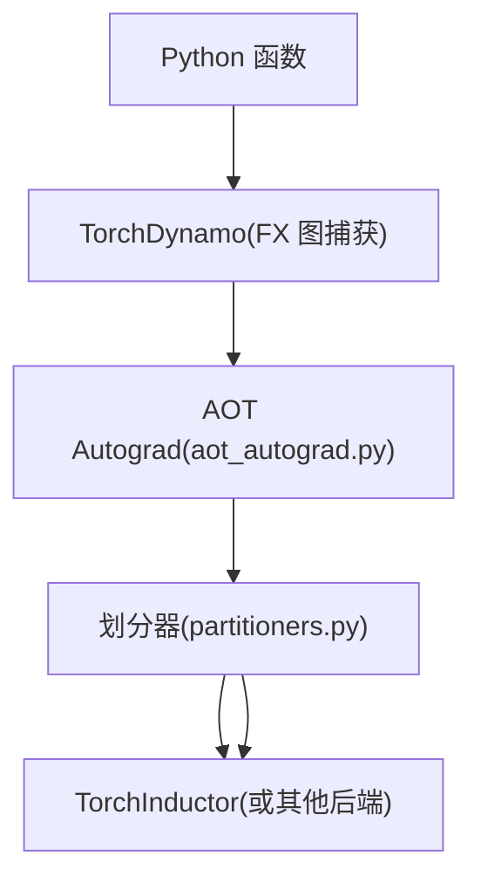
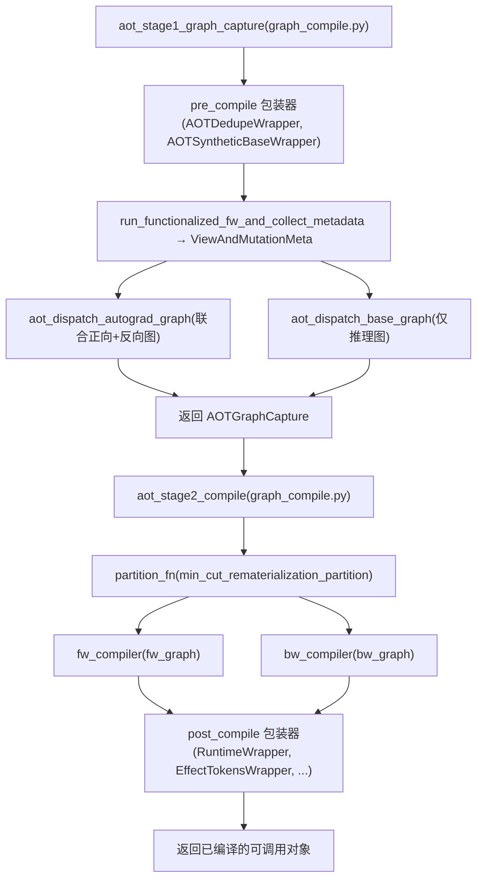
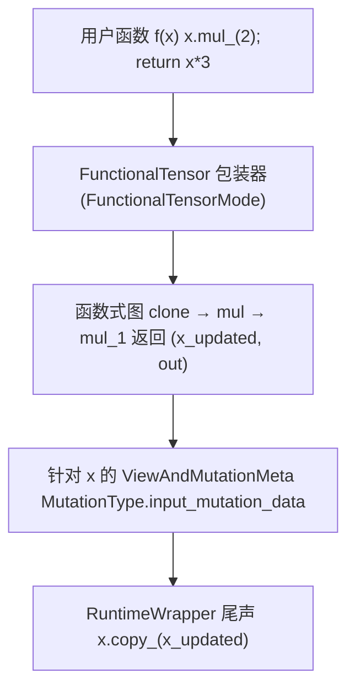
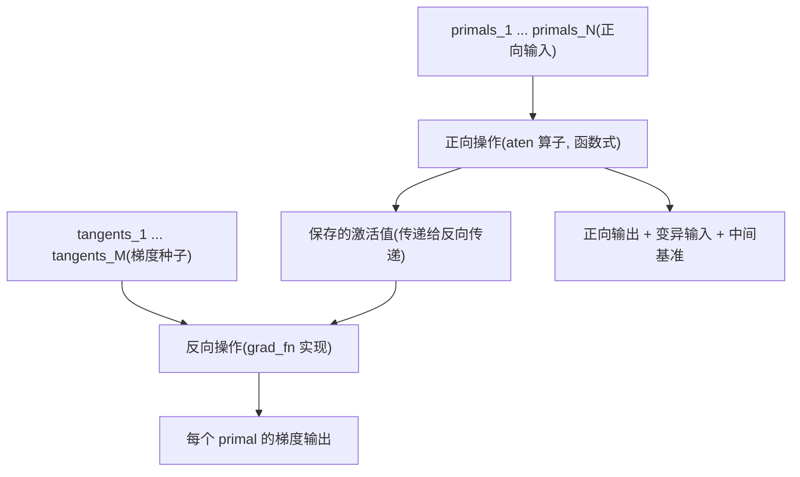
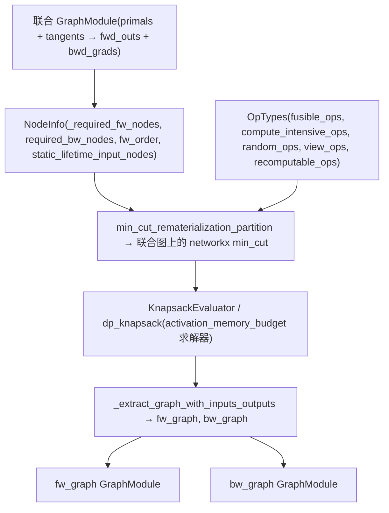
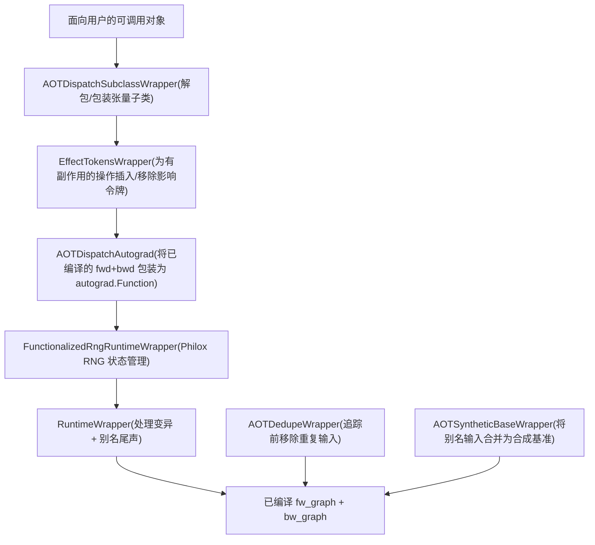

# AOT Autograd 与函数化 (AOT Autograd and Functionalization)

相关源文件 (Relevant source files)

-   [.ci/docker/ci\_commit\_pins/torchbench.txt](https://github.com/pytorch/pytorch/blob/915982a4/.ci/docker/ci_commit_pins/torchbench.txt)
-   [aten/src/ATen/native/TensorCompare.cpp](https://github.com/pytorch/pytorch/blob/915982a4/aten/src/ATen/native/TensorCompare.cpp)
-   [test/distributed/tensor/test\_dtensor\_export.py](https://github.com/pytorch/pytorch/blob/915982a4/test/distributed/tensor/test_dtensor_export.py)
-   [test/dynamo/test\_activation\_checkpointing.py](https://github.com/pytorch/pytorch/blob/915982a4/test/dynamo/test_activation_checkpointing.py)
-   [test/dynamo/test\_activation\_offloading.py](https://github.com/pytorch/pytorch/blob/915982a4/test/dynamo/test_activation_offloading.py)
-   [test/dynamo/test\_aot\_autograd.py](https://github.com/pytorch/pytorch/blob/915982a4/test/dynamo/test_aot_autograd.py)
-   [test/dynamo/test\_aot\_compile.py](https://github.com/pytorch/pytorch/blob/915982a4/test/dynamo/test_aot_compile.py)
-   [test/dynamo/test\_package.py](https://github.com/pytorch/pytorch/blob/915982a4/test/dynamo/test_package.py)
-   [test/dynamo/test\_pgo.py](https://github.com/pytorch/pytorch/blob/915982a4/test/dynamo/test_pgo.py)
-   [test/dynamo/test\_precompile\_context.py](https://github.com/pytorch/pytorch/blob/915982a4/test/dynamo/test_precompile_context.py)
-   [test/functorch/test\_aotdispatch.py](https://github.com/pytorch/pytorch/blob/915982a4/test/functorch/test_aotdispatch.py)
-   [test/test\_autograd\_fallback.py](https://github.com/pytorch/pytorch/blob/915982a4/test/test_autograd_fallback.py)
-   [torch/\_dynamo/aot\_compile.py](https://github.com/pytorch/pytorch/blob/915982a4/torch/_dynamo/aot_compile.py)
-   [torch/\_dynamo/package.py](https://github.com/pytorch/pytorch/blob/915982a4/torch/_dynamo/package.py)
-   [torch/\_dynamo/pgo.py](https://github.com/pytorch/pytorch/blob/915982a4/torch/_dynamo/pgo.py)
-   [torch/\_dynamo/precompile\_context.py](https://github.com/pytorch/pytorch/blob/915982a4/torch/_dynamo/precompile_context.py)
-   [torch/\_functorch/\_activation\_offloading/\_\_init\_\_.py](https://github.com/pytorch/pytorch/blob/915982a4/torch/_functorch/_activation_offloading/__init__.py)
-   [torch/\_functorch/\_activation\_offloading/activation\_offloading.py](https://github.com/pytorch/pytorch/blob/915982a4/torch/_functorch/_activation_offloading/activation_offloading.py)
-   [torch/\_functorch/\_aot\_autograd/collect\_metadata\_analysis.py](https://github.com/pytorch/pytorch/blob/915982a4/torch/_functorch/_aot_autograd/collect_metadata_analysis.py)
-   [torch/\_functorch/\_aot\_autograd/frontend\_utils.py](https://github.com/pytorch/pytorch/blob/915982a4/torch/_functorch/_aot_autograd/frontend_utils.py)
-   [torch/\_functorch/\_aot\_autograd/fx\_utils.py](https://github.com/pytorch/pytorch/blob/915982a4/torch/_functorch/_aot_autograd/fx_utils.py)
-   [torch/\_functorch/\_aot\_autograd/graph\_capture.py](https://github.com/pytorch/pytorch/blob/915982a4/torch/_functorch/_aot_autograd/graph_capture.py)
-   [torch/\_functorch/\_aot\_autograd/graph\_capture\_wrappers.py](https://github.com/pytorch/pytorch/blob/915982a4/torch/_functorch/_aot_autograd/graph_capture_wrappers.py)
-   [torch/\_functorch/\_aot\_autograd/graph\_compile.py](https://github.com/pytorch/pytorch/blob/915982a4/torch/_functorch/_aot_autograd/graph_compile.py)
-   [torch/\_functorch/\_aot\_autograd/input\_output\_analysis.py](https://github.com/pytorch/pytorch/blob/915982a4/torch/_functorch/_aot_autograd/input_output_analysis.py)
-   [torch/\_functorch/\_aot\_autograd/runtime\_wrappers.py](https://github.com/pytorch/pytorch/blob/915982a4/torch/_functorch/_aot_autograd/runtime_wrappers.py)
-   [torch/\_functorch/\_aot\_autograd/schemas.py](https://github.com/pytorch/pytorch/blob/915982a4/torch/_functorch/_aot_autograd/schemas.py)
-   [torch/\_functorch/\_aot\_autograd/subclass\_parametrization.py](https://github.com/pytorch/pytorch/blob/915982a4/torch/_functorch/_aot_autograd/subclass_parametrization.py)
-   [torch/\_functorch/\_aot\_autograd/subclass\_utils.py](https://github.com/pytorch/pytorch/blob/915982a4/torch/_functorch/_aot_autograd/subclass_utils.py)
-   [torch/\_functorch/\_aot\_autograd/utils.py](https://github.com/pytorch/pytorch/blob/915982a4/torch/_functorch/_aot_autograd/utils.py)
-   [torch/\_functorch/aot\_autograd.py](https://github.com/pytorch/pytorch/blob/915982a4/torch/_functorch/aot_autograd.py)
-   [torch/\_functorch/config.py](https://github.com/pytorch/pytorch/blob/915982a4/torch/_functorch/config.py)
-   [torch/\_functorch/partitioners.py](https://github.com/pytorch/pytorch/blob/915982a4/torch/_functorch/partitioners.py)
-   [torch/\_library/autograd.py](https://github.com/pytorch/pytorch/blob/915982a4/torch/_library/autograd.py)
-   [torch/compiler/\_\_init\_\_.py](https://github.com/pytorch/pytorch/blob/915982a4/torch/compiler/__init__.py)
-   [torch/compiler/\_cache.py](https://github.com/pytorch/pytorch/blob/915982a4/torch/compiler/_cache.py)
-   [torch/compiler/config.py](https://github.com/pytorch/pytorch/blob/915982a4/torch/compiler/config.py)
-   [torch/csrc/autograd/autograd\_not\_implemented\_fallback.cpp](https://github.com/pytorch/pytorch/blob/915982a4/torch/csrc/autograd/autograd_not_implemented_fallback.cpp)
-   [torch/testing/\_internal/optests/aot\_autograd.py](https://github.com/pytorch/pytorch/blob/915982a4/torch/testing/_internal/optests/aot_autograd.py)
-   [torchgen/native\_function\_generation.py](https://github.com/pytorch/pytorch/blob/915982a4/torchgen/native_function_generation.py)

## 目的与范围 (Purpose and Scope)

AOT Autograd (Ahead-of-Time Autograd，提前自动微分) 是 `torch.compile` 栈中的一层，负责在执行*之前*追踪函数的正向和反向传递，生成后端编译器可以优化的完全函数式联合图。它处理就地变异（in-place mutations）到函数式等效操作的转换，解析张量之间的别名关系，并将联合图划分为独立的正向和反向图。

本页涵盖：

-   两阶段流水线 (`aot_stage1_graph_capture` → `aot_stage2_compile`)
-   就地操作的函数化 (Functionalization)
-   `ViewAndMutationMeta` 收集
-   联合图构建及通过 `min_cut_rematerialization_partition` 进行的划分
-   运行时包装器 (Runtime wrapper) 组合

有关生成供 AOT Autograd 消费的初始 FX 图的 TorchDynamo 前端，请参阅 [TorchDynamo 前端](/pytorch/pytorch/2.2-torchdynamo-frontend)。有关接收划分后图的下游 Inductor 后端，请参阅 [TorchInductor 后端](/pytorch/pytorch/2.5-torchinductor-backend)。有关已编译图的缓存，请参阅 [Autograd 缓存 (Autograd Caching)](/pytorch/pytorch/2.4.2-autograd-caching)。

---

## 在编译栈中的位置 (Position in the Compilation Stack)

AOT Autograd 位于 `torch.compile` 流水线中的 TorchDynamo 和 TorchInductor 之间。TorchDynamo 使用符号追踪将 Python 函数捕获为 FX 图。该 FX 图通过 `aot_autograd` 后端交给 AOT Autograd，后者随后追踪联合的正向+反向传递，对图进行函数化、划分，并将拆分后的正向和反向图传递给配置的后端编译器。

**AOT Autograd 在 `torch.compile` 中的位置**


来源： [torch/\_functorch/aot\_autograd.py1-170](https://github.com/pytorch/pytorch/blob/915982a4/torch/_functorch/aot_autograd.py#L1-L170) [torch/\_functorch/\_aot\_autograd/graph\_compile.py1-100](https://github.com/pytorch/pytorch/blob/915982a4/torch/_functorch/_aot_autograd/graph_compile.py#L1-L100)

---

## 核心模块布局 (Core Module Layout)

AOT Autograd 的实现分布在 `torch/_functorch/_aot_autograd/` 下的多个文件中：

| 文件 | 职责 |
| --- | --- |
| `torch/_functorch/aot_autograd.py` | 公共 API、重新导出、顶层入口点 (`aot_function`, `aot_module`) |
| `_aot_autograd/graph_compile.py` | 两阶段流水线：`aot_stage1_graph_capture`, `aot_stage2_compile`, `aot_stage2_export` |
| `_aot_autograd/graph_capture.py` | 分发到 `aot_dispatch_autograd_graph` (训练) 或 `aot_dispatch_base_graph` (推理) |
| `_aot_autograd/graph_capture_wrappers.py` | 函数化：`create_functionalized_fn`, `create_joint`, `fn_prepped_for_autograd` |
| `_aot_autograd/collect_metadata_analysis.py` | `run_functionalized_fw_and_collect_metadata` —— 构建 `ViewAndMutationMeta` |
| `_aot_autograd/runtime_wrappers.py` | 运行时尾声逻辑：`RuntimeWrapper`, `AOTDispatchAutograd`, `AOTDedupeWrapper` |
| `_aot_autograd/schemas.py` | 所有数据类和枚举：`ViewAndMutationMeta`, `AOTConfig`, `OutputAliasInfo`, `MutationType` |
| `_aot_autograd/input_output_analysis.py` | `create_graph_signature`, `create_synthetic_base_metadata`, `remove_dupe_metadata` |
| `torch/_functorch/partitioners.py` | `min_cut_rematerialization_partition`, `default_partition` |
| `torch/_dynamo/aot_compile.py` | 可序列化伪影：`AOTCompiledFunction`, `AOTCompiledModel`, `CompileArtifacts` |

来源： [torch/\_functorch/aot\_autograd.py38-157](https://github.com/pytorch/pytorch/blob/915982a4/torch/_functorch/aot_autograd.py#L38-L157) [torch/\_functorch/\_aot\_autograd/graph\_compile.py1-103](https://github.com/pytorch/pytorch/blob/915982a4/torch/_functorch/_aot_autograd/graph_compile.py#L1-L103)

---

## 两阶段流水线 (Two-Stage Pipeline)

编译分为两个阶段，定义在 `torch/_functorch/_aot_autograd/graph_compile.py` 中。

**两阶段 AOT 流水线**


来源： [torch/\_functorch/\_aot\_autograd/graph\_compile.py173-370](https://github.com/pytorch/pytorch/blob/915982a4/torch/_functorch/_aot_autograd/graph_compile.py#L173-L370)

### 阶段 1：图捕获 (`aot_stage1_graph_capture`)

[torch/\_functorch/\_aot\_autograd/graph\_compile.py173-266](https://github.com/pytorch/pytorch/blob/915982a4/torch/_functorch/_aot_autograd/graph_compile.py#L173-L266) 中的 `aot_stage1_graph_capture` 接收一个 `AOTState` 和一个扁平化函数，然后：

1.  运行 `pre_compile` 包装器：`AOTDedupeWrapper` 移除重复输入；`AOTSyntheticBaseWrapper` 将别名输入合并为单个合成基准 (synthetic base)。
2.  根据 `aot_state.needs_autograd`，调用：
    -   `aot_dispatch_autograd_graph` —— 为训练追踪联合正向+反向图。
    -   `aot_dispatch_base_graph` —— 为推理仅追踪正向过程。
3.  返回一个 `AOTGraphCapture` 数据类，包含追踪到的 `GraphModule`、更新后的扁平化参数和可选的 `SubclassMeta`。

### 阶段 2：编译 (`aot_stage2_compile`)

[torch/\_functorch/\_aot\_autograd/graph\_compile.py343-500](https://github.com/pytorch/pytorch/blob/915982a4/torch/_functorch/_aot_autograd/graph_compile.py#L343-L500) 中的 `aot_stage2_compile` 接收 `AOTGraphCapture` 并：

1.  在联合图上调用 `partition_fn`（默认：`min_cut_rematerialization_partition`）以生成独立的正向和反向 `GraphModule`。
2.  在正向图上调用 `fw_compiler`，在反向图上调用 `bw_compiler`。
3.  运行 `post_compile` 包装器以构建最终的可调用对象。

---

## 函数化 (Functionalization)

函数化将包含就地变异和视图的图转换为纯函数式（无副作用）的等效项。这是必要的，因为像 Inductor 这样的后端编译器需要函数式图。

### 工作原理

主要入口点是 [torch/\_functorch/\_aot\_autograd/graph\_capture\_wrappers.py](https://github.com/pytorch/pytorch/blob/915982a4/torch/_functorch/_aot_autograd/graph_capture_wrappers.py) 中的 `create_functionalized_fn`，它将用户函数包装在 `FunctionalTensorMode` 中。在此模式下：

-   每个张量参数都被包装在一个 `FunctionalTensor` 中。
-   在 `FunctionalTensor` 上的就地算子（例如 `add_`、`relu_`）被记录为在函数式“影子 (shadow)”张量上的变异，而不是修改底层存储。
-   函数运行后，调用 `sync_functional_tensor` 以回传变异。

调用 `create_functionalized_fn` 时带有一个 `remove_input_mutations` 标志。当为 `True` 时，它还将输入变异暴露为额外的图输出（变异后的值），运行时尾声 (`RuntimeWrapper`) 随后在编译图运行后通过 `copy_` 应用这些变异。

### 变异处理：三类

[torch/\_functorch/\_aot\_autograd/collect\_metadata\_analysis.py](https://github.com/pytorch/pytorch/blob/915982a4/torch/_functorch/_aot_autograd/collect_metadata_analysis.py) 中的 `run_functionalized_fw_and_collect_metadata` 在正向运行后检查函数化图，并使用 [torch/\_functorch/\_aot\_autograd/schemas.py47-76](https://github.com/pytorch/pytorch/blob/915982a4/torch/_functorch/_aot_autograd/schemas.py#L47-L76) 中的 `MutationType` 枚举对每个输入的变异进行分类：

| `MutationType` | 描述 |
| --- | --- |
| `none` | 输入未被变异 |
| `input_mutation_data` | 输入具有数据变异（例如 `x.mul_(2)`） |
| `input_mutation_metadata` | 输入具有元数据/视图变异（例如 `x.t_()`） |
| `input_metadata_only_mutation` | 仅元数据变异，无数据变化 |

运行时包装器在尾声中应用变异：

-   数据变异：在编译图返回 `x_updated` 后执行 `x.copy_(x_updated)`。
-   元数据变异：执行 `x.as_strided_(...)` 以回放视图转换。

**函数化数据流**


来源： [torch/\_functorch/\_aot\_autograd/graph\_capture\_wrappers.py1-90](https://github.com/pytorch/pytorch/blob/915982a4/torch/_functorch/_aot_autograd/graph_capture_wrappers.py#L1-L90) [torch/\_functorch/\_aot\_autograd/collect\_metadata\_analysis.py1-50](https://github.com/pytorch/pytorch/blob/915982a4/torch/_functorch/_aot_autograd/collect_metadata_analysis.py#L1-L50) [torch/\_functorch/aot\_autograd.py197-450](https://github.com/pytorch/pytorch/blob/915982a4/torch/_functorch/aot_autograd.py#L197-L450)

---

## `ViewAndMutationMeta` —— 元数据收集

`ViewAndMutationMeta` 是中心数据结构（定义在 [torch/\_functorch/\_aot\_autograd/schemas.py](https://github.com/pytorch/pytorch/blob/915982a4/torch/_functorch/_aot_autograd/schemas.py) 中），它收集关于函数输入和输出的所有别名和变异信息。它由 `run_functionalized_fw_and_collect_metadata` 填充。

关键字段：

| 字段 | 类型 | 目的 |
| --- | --- | --- |
| `input_info` | `list[InputAliasInfo]` | 每个输入：变异类型、是否为别名等 |
| `output_info` | `list[OutputAliasInfo]` | 每个输出：`OutputType`、`base_idx`、`requires_grad` |
| `num_intermediate_bases` | `int` | 作为额外输出添加的中间张量基准的数量 |
| `keep_input_mutations` | `bool` | 输入变异是留在图中还是进入尾声 |
| `indices_of_inputs_that_require_grad` | `list[int]` | 哪些原始输入需要梯度 |
| `num_outputs_aliased_to_inputs` | `int` | 有多少个输出与正向输入构成别名 |
| `subclass_inp_meta` | `list` | 张量子类输入的元数据 |

`OutputAliasInfo`（位于 [torch/\_functorch/\_aot\_autograd/schemas.py80-140](https://github.com/pytorch/pytorch/blob/915982a4/torch/_functorch/_aot_autograd/schemas.py#L80-L140)）为每个输出携带一个 `OutputType` 枚举值：

| `OutputType` | 含义 |
| --- | --- |
| `non_alias` | 一个全新的张量，无别名 |
| `alias_of_input` | 输出是正向输入的视图 |
| `is_input` | 输出**就是**正向输入之一 |
| `alias_of_intermediate_save_as_output` | 输出是一个必须返回的中间变量的别名 |
| `alias_of_intermediate` | 输出是一个已返回中间变量的别名 |
| `custom_function_view` | 来自自定义 autograd.Function 的视图；被正常处理 |

来源： [torch/\_functorch/\_aot\_autograd/schemas.py47-350](https://github.com/pytorch/pytorch/blob/915982a4/torch/_functorch/_aot_autograd/schemas.py#L47-L350) [torch/\_functorch/\_aot\_autograd/collect\_metadata\_analysis.py1-150](https://github.com/pytorch/pytorch/blob/915982a4/torch/_functorch/_aot_autograd/collect_metadata_analysis.py#L1-L150)

---

## 联合图与 Autograd 追踪 (Joint Graph and Autograd Tracing)

对于训练（当 `needs_autograd=True` 时），[torch/\_functorch/\_aot\_autograd/graph\_capture.py](https://github.com/pytorch/pytorch/blob/915982a4/torch/_functorch/_aot_autograd/graph_capture.py) 中的 `aot_dispatch_autograd_graph` 使用 `make_fx` 追踪一个在单个图中包含正向和反向传递的*联合*函数。

联合函数由 [torch/\_functorch/\_aot\_autograd/graph\_capture\_wrappers.py](https://github.com/pytorch/pytorch/blob/915982a4/torch/_functorch/_aot_autograd/graph_capture_wrappers.py) 中的 `create_joint` 构建：

1.  正向过程在 `FunctionalTensorMode` 下运行以产生 primal（原始值）。
2.  调用 `torch.autograd.grad`，针对 primal 输入对正向输出求导，产生反向图。
3.  联合图签名为：`joint(primals, tangents) → (fw_outputs, bw_gradients)`。

[torch/\_functorch/\_aot\_autograd/graph\_capture\_wrappers.py](https://github.com/pytorch/pytorch/blob/915982a4/torch/_functorch/_aot_autograd/graph_capture_wrappers.py) 中的 `fn_prepped_for_autograd` 包装了函数化后的正向过程以准备联合追踪 —— 它处理返回反向传递所需的额外项（中间基准、变异输入等）。

**联合图结构**


来源： [torch/\_functorch/\_aot\_autograd/graph\_capture\_wrappers.py200-400](https://github.com/pytorch/pytorch/blob/915982a4/torch/_functorch/_aot_autograd/graph_capture_wrappers.py#L200-L400) [torch/\_functorch/\_aot\_autograd/graph\_capture.py50-200](https://github.com/pytorch/pytorch/blob/915982a4/torch/_functorch/_aot_autograd/graph_capture.py#L50-L200)

---

## 图划分 (Graph Partitioning)

联合图追踪完成后，划分器将其拆分为正向图和反向图。关键问题是：哪些中间张量应该被*保存*以供反向传递使用（增加内存），哪些应该在反向传递中*重计算*（增加计算量）？

### `min_cut_rematerialization_partition`

主要的划分器 [torch/\_functorch/partitioners.py](https://github.com/pytorch/pytorch/blob/915982a4/torch/_functorch/partitioners.py) 中的 `min_cut_rematerialization_partition` 将该问题建模为图上的最小割（min-cut）：

-   源端 (Source side) = 正向
-   汇端 (Sink side) = 反向
-   切割一个节点 = 在反向传递中重新具象化 (rematerializing) 它
-   不切割一个节点 = 将其保存为激活值

`NodeInfo` 数据类（位于 [torch/\_functorch/partitioners.py119-150](https://github.com/pytorch/pytorch/blob/915982a4/torch/_functorch/partitioners.py#L119-L150)）存储每个节点的信息：哪些节点是正向传递必需的，哪些是反向传递必需的，以及顺序信息。

**重计算启发式方法**（由 `torch/_functorch/config.py` 控制）：

| 配置标志 | 默认值 | 效果 |
| --- | --- | --- |
| `ban_recompute_used_far_apart` | `True` | 避免重计算在图中距离很远的节点 |
| `ban_recompute_long_fusible_chains` | `True` | 打断过长的可重计算操作链 |
| `ban_recompute_materialized_backward` | `True` | 禁止重计算被不可融合的反向操作使用的节点 |
| `ban_recompute_reductions` | `True` | 绝不重计算归约操作 |
| `recompute_views` | `False` | 总是重计算视图（因为它们开销极低） |
| `activation_memory_budget` | `1.0` | 内存/计算折中的背包问题预算 (0=最大重计算, 1=最小重计算) |
| `treat_parameters_as_free_to_save` | `True` | 参数传递给反向传递不计成本 |

`activation_memory_budget` 设置启用了一个 0-1 背包求解器，以在保持在内存预算内的同时找到重计算成本最低的节点集。求解器包括来自 `torch/_functorch/_activation_checkpointing/knapsack.py` 的 `dp_knapsack`、`greedy_knapsack` 和 `ilp_knapsack`。

### `default_partition`

[torch/\_functorch/partitioners.py](https://github.com/pytorch/pytorch/blob/915982a4/torch/_functorch/partitioners.py) 中的 `default_partition` 是一个更简单的划分器，它保存反向传递所需的所有中间变量，不进行任何重计算分析。

**划分器内部机制**


来源： [torch/\_functorch/partitioners.py93-390](https://github.com/pytorch/pytorch/blob/915982a4/torch/_functorch/partitioners.py#L93-L390) [torch/\_functorch/config.py141-225](https://github.com/pytorch/pytorch/blob/915982a4/torch/_functorch/config.py#L141-L225)

---

## 运行时包装器 (Runtime Wrappers)

运行时包装器是可组合的对象（继承自 [torch/\_functorch/\_aot\_autograd/schemas.py](https://github.com/pytorch/pytorch/blob/915982a4/torch/_functorch/_aot_autograd/schemas.py) 中的 `CompilerWrapper`），它们包装已编译的图。它们分两个阶段运行：`pre_compile`（编译前，转换输入/函数）和 `post_compile`（编译后，包装返回的可调用对象）。

**包装器组合及其角色**


| 包装器 | 文件 | 角色 |
| --- | --- | --- |
| `AOTDedupeWrapper` | `runtime_wrappers.py` | 在追踪前对作为同一个张量对象的输入进行去重 |
| `AOTSyntheticBaseWrapper` | `runtime_wrappers.py` | 用合成基准张量替换别名输入 |
| `AOTDispatchSubclassWrapper` | `runtime_wrappers.py` | 将张量子类（例如 `DTensor`）解包为内部张量以进行追踪 |
| `RuntimeWrapper` | `runtime_wrappers.py` | 在编译图运行后应用输入变异尾声 (`copy_`, `as_strided_`) |
| `AOTDispatchAutograd` | `runtime_wrappers.py` | 将已编译的正向/反向过程包装为 `torch.autograd.Function`，以便 autograd 使用 |
| `EffectTokensWrapper` | `runtime_wrappers.py` | 在图中穿插影响令牌，用于有副作用的操作（打印、torchbind 调用） |
| `FunctionalizedRngRuntimeWrapper` | `runtime_wrappers.py` | 管理 Philox RNG 种子/偏移量，以在函数式图中实现可复现的随机性 |

来源： [torch/\_functorch/\_aot\_autograd/runtime\_wrappers.py165-250](https://github.com/pytorch/pytorch/blob/915982a4/torch/_functorch/_aot_autograd/runtime_wrappers.py#L165-L250) [torch/\_functorch/\_aot\_autograd/graph\_compile.py166-171](https://github.com/pytorch/pytorch/blob/915982a4/torch/_functorch/_aot_autograd/graph_compile.py#L166-L171)

---

## 别名与变异处理笔记 (Aliasing and Mutation Handling Notes)

[torch/\_functorch/aot\_autograd.py197-450](https://github.com/pytorch/pytorch/blob/915982a4/torch/_functorch/aot_autograd.py#L197-L450) 中的行内注释记录了 AOT Autograd 针对几个重要边缘情况的具体策略。摘要如下：

### 输入数据变异 (Input Data Mutations)

当函数变异输入时（例如 `x.mul_(2)`），AOT Autograd：

1.  从编译图中移除变异。
2.  将变异后的值作为额外的图输出返回。
3.  运行时尾声调用 `x.copy_(x_updated)` 在图执行后应用变异。

### 输入元数据变异 (Input Metadata Mutations)

当函数执行仅限元数据的变异时（例如 `x.t_()`）：

1.  从编译图中移除变异。
2.  将更新后的视图作为图输出返回。
3.  运行时尾声调用 `x.as_strided_(x_updated)`。

### 与输入或中间变量构成别名的输出 (Outputs Aliasing Inputs or Intermediates)

-   **输入的别名**：通过在尾声中使用 `gen_alias_from_base`（可选地通过视图回放）重新生成别名输出，以避开 `autograd.Function` 对变异返回视图的限制。
-   **中间变量的别名**：中间基准作为额外的图输出添加，别名在尾声中从该基准重新生成。

### 别名输入（合成基准） (Aliased Inputs (Synthetic Bases))

当两个输入互为别名时（例如 `f(x, x.view(-1))`），`AOTSyntheticBaseWrapper` 将它们合并为编译图的单个 `base` 输入。原始输入在已编译函数内部从该基准重新生成。

来源： [torch/\_functorch/aot\_autograd.py197-450](https://github.com/pytorch/pytorch/blob/915982a4/torch/_functorch/aot_autograd.py#L197-L450) [torch/\_functorch/\_aot\_autograd/runtime\_wrappers.py207-270](https://github.com/pytorch/pytorch/blob/915982a4/torch/_functorch/_aot_autograd/runtime_wrappers.py#L207-L270)

---

## 影响令牌 (Effect Tokens)

AOT Autograd 允许在 AOT 后的函数式图中存在某些有副作用的算子（打印、torchbind 调用），方法是将“影响令牌”（虚拟张量）作为数据依赖项穿插其中。图签名变为：

```
gm(*tokens, *params_buffers, *user_inputs) → (*updated_tokens, *user_outputs)
```
当设置 `unlift_effect_tokens` 配置标志时，`EffectTokensWrapper` 在开头注入 `prims._make_token()`，在末尾注入 `prims._sink_tokens(...)`。这在保持图函数化的同时保留了副作用的顺序。

来源： [torch/\_functorch/aot\_autograd.py424-462](https://github.com/pytorch/pytorch/blob/915982a4/torch/_functorch/aot_autograd.py#L424-L462) [torch/\_functorch/\_aot\_autograd/runtime\_wrappers.py1-50](https://github.com/pytorch/pytorch/blob/915982a4/torch/_functorch/_aot_autograd/runtime_wrappers.py#L1-L50)

---

## RNG 函数化 (RNG Functionalization)

除非随机状态得到精心管理，否则 CUDA RNG 操作在多次运行中是非确定性的。AOT Autograd 可选地对 RNG 操作进行函数化（由 `torch/_functorch/config.py` 标志 `functionalize_rng_ops` 控制），通过：

-   [torch/\_functorch/\_aot\_autograd/graph\_capture\_wrappers.py](https://github.com/pytorch/pytorch/blob/915982a4/torch/_functorch/_aot_autograd/graph_capture_wrappers.py) 中的 `create_functionalized_rng_ops_wrapper` —— 包装函数以使用 `PhiloxStateTracker`，该追踪器将有状态的 `torch.rand*` 调用转换为参数化为种子 (seed) 和偏移量 (offset) 的确定性调用。
-   `runtime_wrappers.py` 中的 `FunctionalizedRngRuntimeWrapper` —— 在运行时，从当前 CUDA 生成器获取 Philox 状态种子，并将其作为图输入传入。

来源： [torch/\_functorch/\_aot\_autograd/graph\_capture\_wrappers.py50-80](https://github.com/pytorch/pytorch/blob/915982a4/torch/_functorch/_aot_autograd/graph_capture_wrappers.py#L50-L80) [torch/\_functorch/config.py33](https://github.com/pytorch/pytorch/blob/915982a4/torch/_functorch/config.py#L33-L33)

---

## AOT 编译：可序列化伪影 (AOT Compile: Serializable Artifacts)

对于提前编译场景（例如 `torch.compile(...).aot_compile(...)`），`torch/_dynamo/aot_compile.py` 提供了围绕 AOT 流水线输出的可序列化包装器。

**`torch/_dynamo/aot_compile.py` 中的关键类型：**

| 类 | 角色 |
| --- | --- |
| `CompileArtifacts` | 持有 `signature`, `guard_manager`, `compiled_fn`, `runtime_env`, `source_info`；全部可序列化 |
| `AOTCompiledFunction` | 包装 `CompileArtifacts`，实现带 guard 检查的 `__call__`，支持 `save_compiled_function` / `deserialize` |
| `AOTCompiledModel` | 为多个输入上下文持有 `list[AOTCompiledFunction]`；通过检查 guards 分发调用 |
| `AOTCompilePickler` / `AOTCompileUnpickler` | 对闭包、代码对象、嵌套函数的自定义 pickle 支持 |
| `SerializedCode` | `types.CodeType` 的冻结数据类表示，可安全用于序列化 |

[torch/\_dynamo/aot\_compile.py295-417](https://github.com/pytorch/pytorch/blob/915982a4/torch/_dynamo/aot_compile.py#L295-L417) 中的 `aot_compile_fullgraph` 编排了整个捕获流水线：

1.  调用 `convert_frame.fullgraph_capture` 获取 Dynamo 捕获的图。
2.  运行后端编译器（例如 Inductor）生成 `SerializableCallable`。
3.  从追踪上下文中构建 guards。
4.  将所有内容打包进 `CompileArtifacts` 并包装在 `AOTCompiledFunction` 中。

来源： [torch/\_dynamo/aot\_compile.py43-504](https://github.com/pytorch/pytorch/blob/915982a4/torch/_dynamo/aot_compile.py#L43-L504)

---

## 配置参考 (Configuration Reference)

配置位于 `torch/_functorch/config.py`。关键标志位：

| 标志位 | 默认值 | 效果 |
| --- | --- | --- |
| `functionalize_rng_ops` | `False` | 为 CUDA 算子启用 Philox RNG 函数化 |
| `debug_assert` | `False` | 在热路径中启用额外的正确性断言 |
| `debug_partitioner` | `False` | 启用来自划分器的详细日志记录 |
| `cse` | `True` | 在划分前应用公共子表达式消除 (common subexpression elimination) |
| `static_weight_shapes` | `True` | 将参数形状视为静态 |
| `treat_parameters_as_free_to_save` | `True` | 认为参数传递给反向传递是无成本的 |
| `activation_memory_budget` | `1.0` | 背包问题预算 (0=最大重计算, 1=最小重计算) |
| `view_replay_for_aliased_outputs` | 平台相关 | 使用视图回放而不是 `as_strided` 进行别名重建 |
| `enable_autograd_cache` | `True` | 启用本地 `AOTAutogradCache` |
| `max_dist_from_bw` | `1000` | 划分器的距离启发式方法 |
| `unlift_effect_tokens` | `False` | 将令牌输入/输出替换为图内的 `_make_token` / `_sink_tokens` 调用 |

来源： [torch/\_functorch/config.py1-310](https://github.com/pytorch/pytorch/blob/915982a4/torch/_functorch/config.py#L1-L310)
