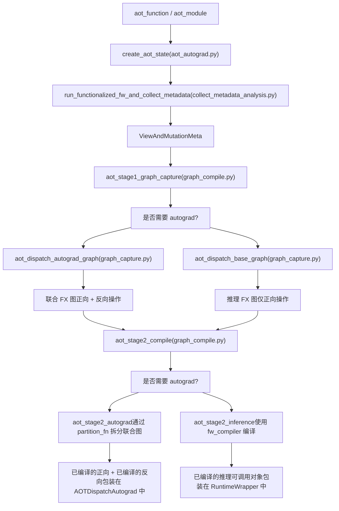
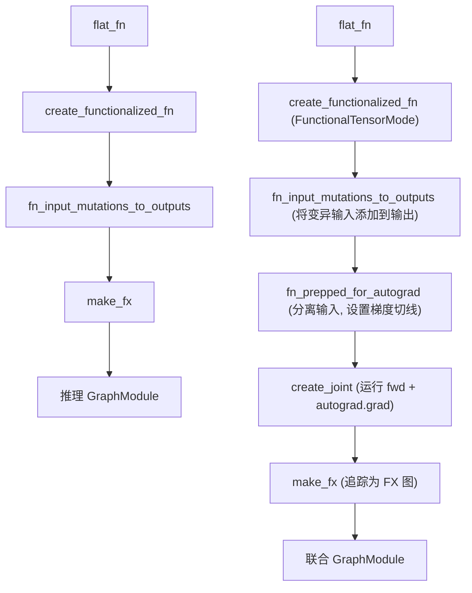
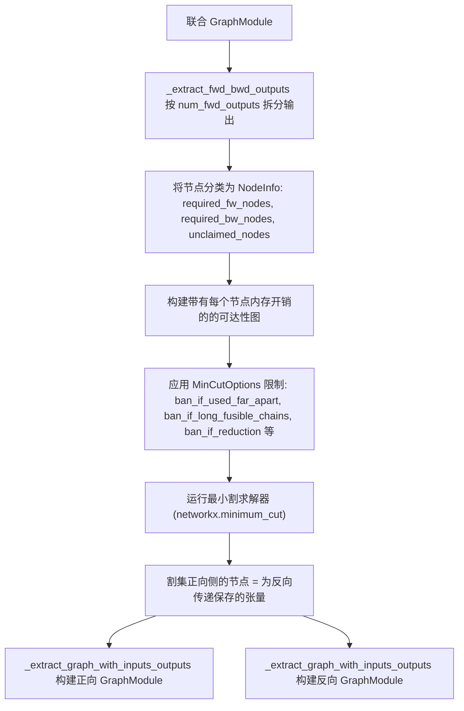
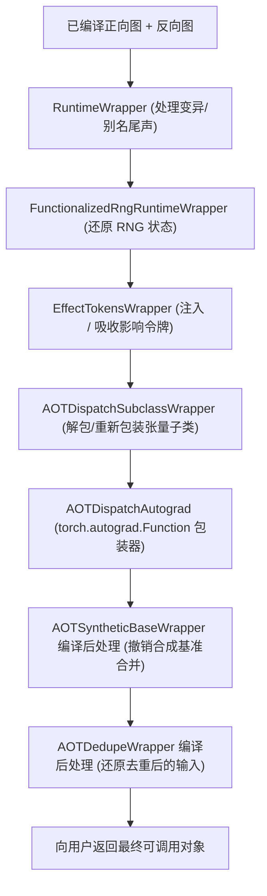

# AOT Autograd 流水线 (AOT Autograd Pipeline)

相关源文件 (Relevant source files)

-   [.ci/docker/ci\_commit\_pins/torchbench.txt](https://github.com/pytorch/pytorch/blob/915982a4/.ci/docker/ci_commit_pins/torchbench.txt)
-   [aten/src/ATen/native/TensorCompare.cpp](https://github.com/pytorch/pytorch/blob/915982a4/aten/src/ATen/native/TensorCompare.cpp)
-   [test/distributed/tensor/test\_dtensor\_export.py](https://github.com/pytorch/pytorch/blob/915982a4/test/distributed/tensor/test_dtensor_export.py)
-   [test/dynamo/test\_activation\_checkpointing.py](https://github.com/pytorch/pytorch/blob/915982a4/test/dynamo/test_activation_checkpointing.py)
-   [test/dynamo/test\_activation\_offloading.py](https://github.com/pytorch/pytorch/blob/915982a4/test/dynamo/test_activation_offloading.py)
-   [test/dynamo/test\_aot\_autograd.py](https://github.com/pytorch/pytorch/blob/915982a4/test/dynamo/test_aot_autograd.py)
-   [test/functorch/test\_aotdispatch.py](https://github.com/pytorch/pytorch/blob/915982a4/test/functorch/test_aotdispatch.py)
-   [test/test\_autograd\_fallback.py](https://github.com/pytorch/pytorch/blob/915982a4/test/test_autograd_fallback.py)
-   [torch/\_functorch/\_activation\_offloading/\_\_init\_\_.py](https://github.com/pytorch/pytorch/blob/915982a4/torch/_functorch/_activation_offloading/__init__.py)
-   [torch/\_functorch/\_activation\_offloading/activation\_offloading.py](https://github.com/pytorch/pytorch/blob/915982a4/torch/_functorch/_activation_offloading/activation_offloading.py)
-   [torch/\_functorch/\_aot\_autograd/collect\_metadata\_analysis.py](https://github.com/pytorch/pytorch/blob/915982a4/torch/_functorch/_aot_autograd/collect_metadata_analysis.py)
-   [torch/\_functorch/\_aot\_autograd/frontend\_utils.py](https://github.com/pytorch/pytorch/blob/915982a4/torch/_functorch/_aot_autograd/frontend_utils.py)
-   [torch/\_functorch/\_aot\_autograd/fx\_utils.py](https://github.com/pytorch/pytorch/blob/915982a4/torch/_functorch/_aot_autograd/fx_utils.py)
-   [torch/\_functorch/\_aot\_autograd/graph\_capture.py](https://github.com/pytorch/pytorch/blob/915982a4/torch/_functorch/_aot_autograd/graph_capture.py)
-   [torch/\_functorch/\_aot\_autograd/graph\_capture\_wrappers.py](https://github.com/pytorch/pytorch/blob/915982a4/torch/_functorch/_aot_autograd/graph_capture_wrappers.py)
-   [torch/\_functorch/\_aot\_autograd/graph\_compile.py](https://github.com/pytorch/pytorch/blob/915982a4/torch/_functorch/_aot_autograd/graph_compile.py)
-   [torch/\_functorch/\_aot\_autograd/input\_output\_analysis.py](https://github.com/pytorch/pytorch/blob/915982a4/torch/_functorch/_aot_autograd/input_output_analysis.py)
-   [torch/\_functorch/\_aot\_autograd/runtime\_wrappers.py](https://github.com/pytorch/pytorch/blob/915982a4/torch/_functorch/_aot_autograd/runtime_wrappers.py)
-   [torch/\_functorch/\_aot\_autograd/schemas.py](https://github.com/pytorch/pytorch/blob/915982a4/torch/_functorch/_aot_autograd/schemas.py)
-   [torch/\_functorch/\_aot\_autograd/subclass\_parametrization.py](https://github.com/pytorch/pytorch/blob/915982a4/torch/_functorch/_aot_autograd/subclass_parametrization.py)
-   [torch/\_functorch/\_aot\_autograd/subclass\_utils.py](https://github.com/pytorch/pytorch/blob/915982a4/torch/_functorch/_aot_autograd/subclass_utils.py)
-   [torch/\_functorch/\_aot\_autograd/utils.py](https://github.com/pytorch/pytorch/blob/915982a4/torch/_functorch/_aot_autograd/utils.py)
-   [torch/\_functorch/aot\_autograd.py](https://github.com/pytorch/pytorch/blob/915982a4/torch/_functorch/aot_autograd.py)
-   [torch/\_functorch/config.py](https://github.com/pytorch/pytorch/blob/915982a4/torch/_functorch/config.py)
-   [torch/\_functorch/partitioners.py](https://github.com/pytorch/pytorch/blob/915982a4/torch/_functorch/partitioners.py)
-   [torch/\_library/autograd.py](https://github.com/pytorch/pytorch/blob/915982a4/torch/_library/autograd.py)
-   [torch/csrc/autograd/autograd\_not\_implemented\_fallback.cpp](https://github.com/pytorch/pytorch/blob/915982a4/torch/csrc/autograd/autograd_not_implemented_fallback.cpp)
-   [torch/testing/\_internal/optests/aot\_autograd.py](https://github.com/pytorch/pytorch/blob/915982a4/torch/testing/_internal/optests/aot_autograd.py)
-   [torchgen/native\_function\_generation.py](https://github.com/pytorch/pytorch/blob/915982a4/torchgen/native_function_generation.py)

## 目的与范围 (Purpose and Scope)

本页描述了 AOT (Ahead-of-Time，提前) Autograd 流水线的内部阶段：如何将由 TorchDynamo 捕获的 Python 函数转换为经过编译、划分的正向和反向 FX 图，并供后端编译器使用。

涵盖的主题包括：元数据收集、函数化 (functionalization)、联合图追踪 (joint graph tracing)、图划分以及运行时包装器 (runtime wrapper) 的构建。有关 AOT Autograd 在编译栈中作用的更广泛概览，请参阅编译系统概览（第 [2.4](https://github.com/pytorch/pytorch/blob/915982a4/2.4) 节）。有关构建在该流水线之上的缓存层，请参阅 [2.4.2](https://github.com/pytorch/pytorch/blob/915982a4/2.4.2)。

---

## 流水线概览 (Pipeline Overview)

流水线由两个主要的分阶段操作组成：图捕获和编译。这些操作在 [torch/\_functorch/\_aot\_autograd/graph\_compile.py](https://github.com/pytorch/pytorch/blob/915982a4/torch/_functorch/_aot_autograd/graph_compile.py) 中对应 `aot_stage1_graph_capture` 和 `aot_stage2_compile`。

**AOT Autograd 流水线 —— 阶段流程**


来源： [torch/\_functorch/\_aot\_autograd/graph\_compile.py173-368](https://github.com/pytorch/pytorch/blob/915982a4/torch/_functorch/_aot_autograd/graph_compile.py#L173-L368) [torch/\_functorch/aot\_autograd.py473-637](https://github.com/pytorch/pytorch/blob/915982a4/torch/_functorch/aot_autograd.py#L473-L637)

---

## 关键数据结构 (Key Data Structures)

流水线围绕 [torch/\_functorch/\_aot\_autograd/schemas.py](https://github.com/pytorch/pytorch/blob/915982a4/torch/_functorch/_aot_autograd/schemas.py) 中定义的一组小型数据类组织：

| 类 | 目的 |
| --- | --- |
| `AOTConfig` | 静态配置：编译器、划分函数、分解 (decompositions)、标志位 |
| `AOTState` | 在 `create_aot_state` 期间构建的可变状态：`fw_metadata`、`flat_args`、`needs_autograd` |
| `AOTGraphCapture` | 阶段 1 的输出：捕获的图模块、更新后的参数、子类元数据、包装器 |
| `ViewAndMutationMeta` | 针对每个输入和每个输出的别名/变异分析 |
| `InputAliasInfo` | 每个输入的标志位：`mutates_data`、`mutates_metadata`、`requires_grad`、变异类型 |
| `OutputAliasInfo` | 每个输出的分类：`output_type`（枚举 `OutputType`）、`base_idx`、`requires_grad` |
| `SubclassMeta` | 用于在流水线中分发张量子类的元数据 |
| `CompilerWrapper` | 编译前/后包装器（`AOTDedupeWrapper`、`RuntimeWrapper` 等）的抽象基类 |

**数据结构关系图**


来源： [torch/\_functorch/\_aot\_autograd/schemas.py47-250](https://github.com/pytorch/pytorch/blob/915982a4/torch/_functorch/_aot_autograd/schemas.py#L47-L250)

---

## 第 1 阶段：状态创建与元数据收集 (Stage 1: State Creation and Metadata Collection)

[torch/\_functorch/aot\_autograd.py473-637](https://github.com/pytorch/pytorch/blob/915982a4/torch/_functorch/aot_autograd.py#L473-L637) 中的 `create_aot_state` 设置了追踪环境，并执行正向函数的初步函数化运行以收集别名和变异元数据。

### 环境设置 (Environment Setup)

在追踪之前，`create_aot_state` 安装了几个上下文管理器：

-   `FakeTensorMode`：所有输入通过 `process_inputs` ([torch/\_functorch/\_aot\_autograd/frontend\_utils.py30-120](https://github.com/pytorch/pytorch/blob/915982a4/torch/_functorch/_aot_autograd/frontend_utils.py#L30-L120)) 转换为 fake tensors。
-   `enable_python_dispatcher()`：如果存在 `ShapeEnv`（用于符号形状），则激活该分发器。
-   `PhiloxStateTracker`：如果启用了 `functionalize_rng_ops`，则用于追踪 RNG 状态。
-   禁用多线程，保留 RNG 状态。

### 元数据收集 (Metadata Collection)

使用扁平化的函数和 fake 形式的参数调用 `run_functionalized_fw_and_collect_metadata` ([torch/\_functorch/\_aot\_autograd/collect\_metadata\_analysis.py](https://github.com/pytorch/pytorch/blob/915982a4/torch/_functorch/_aot_autograd/collect_metadata_analysis.py))。它：

1.  使用 `to_fun()` 包装每个输入张量，以在 `FunctionalTensorMode` 下产生 `FunctionalTensor` 实例。
2.  执行正向函数。
3.  执行后调用 `from_fun()` 和 `sync_functional_tensor()` 以提取最终状态。
4.  为每个输入构建 `InputAliasInfo`，记录它是否被变异 (`mutates_data`, `mutates_metadata`)，以及变异是否在 autograd 中隐藏。
5.  为每个输出确定其 `OutputType`，方法是检查它是否为输入、中间变量的别名，或者是完全全新的张量。
6.  返回填充好的 `ViewAndMutationMeta`。

`OutputType` 枚举 ([torch/\_functorch/\_aot\_autograd/schemas.py47-76](https://github.com/pytorch/pytorch/blob/915982a4/torch/_functorch/_aot_autograd/schemas.py#L47-L76)) 对输出进行分类：

| `OutputType` 值 | 含义 |
| --- | --- |
| `non_alias` | 重新分配的输出 |
| `alias_of_input` | 输入张量的视图 |
| `is_input` | 直接返回输入本身 |
| `alias_of_intermediate_save_as_output` | 中间变量的视图；基准必须被添加为输出 |
| `alias_of_intermediate` | 已在输出中的中间变量的视图 |
| `unsafe_view_alias` | 可以被视为新分配的视图 |
| `custom_function_view` | 返回视图的自定义 autograd 函数的输出 |

来源： [torch/\_functorch/aot\_autograd.py473-637](https://github.com/pytorch/pytorch/blob/915982a4/torch/_functorch/aot_autograd.py#L473-L637) [torch/\_functorch/\_aot\_autograd/collect\_metadata\_analysis.py1-50](https://github.com/pytorch/pytorch/blob/915982a4/torch/_functorch/_aot_autograd/collect_metadata_analysis.py#L1-L50)

---

## 第 2 阶段：编译前包装器 (Stage 2: Pre-compile Wrappers)

在图捕获之前，`aot_stage1_graph_capture` 通过 `_create_wrappers_for_dispatch` ([torch/\_functorch/\_aot\_autograd/graph\_compile.py166-170](https://github.com/pytorch/pytorch/blob/915982a4/torch/_functorch/_aot_autograd/graph_compile.py#L166-L170)) 应用两个标准的编译前包装器：

```python
wrappers = [AOTDedupeWrapper(), AOTSyntheticBaseWrapper(trace_joint=needs_autograd)]
```
这些通过 `pre_compile` ([torch/\_functorch/\_aot\_autograd/runtime\_wrappers.py](https://github.com/pytorch/pytorch/blob/915982a4/torch/_functorch/_aot_autograd/runtime_wrappers.py)) 运行，该函数按顺序调用每个包装器的 `pre_compile` 方法，可能会重写扁平化的函数和参数列表。

| 包装器 | 职责 |
| --- | --- |
| `AOTDedupeWrapper` | 检测并移除重复的输入张量；去重操作在运行时被撤销 |
| `AOTSyntheticBaseWrapper` | 当输入互为别名时，用单个“合成基准”张量替换它们；单独的别名输入在图内部重新生成 |

需要合成基准处理是因为函数化要求别名输入具有可见的相关性；将它们合并为单个基准使这种关系变得明确。逆操作由运行时尾声 (epilogue) 执行。

来源： [torch/\_functorch/\_aot\_autograd/runtime\_wrappers.py1-100](https://github.com/pytorch/pytorch/blob/915982a4/torch/_functorch/_aot_autograd/runtime_wrappers.py#L1-L100) [torch/\_functorch/\_aot\_autograd/graph\_compile.py166-266](https://github.com/pytorch/pytorch/blob/915982a4/torch/_functorch/_aot_autograd/graph_compile.py#L166-L266)

---

## 第 3 阶段：图捕获 (Stage 3: Graph Capture)

在编译前包装器之后，`aot_stage1_graph_capture` 分发到两个图捕获函数之一。

**图捕获 —— 函数转换链**


来源： [torch/\_functorch/\_aot\_autograd/graph\_capture.py](https://github.com/pytorch/pytorch/blob/915982a4/torch/_functorch/_aot_autograd/graph_capture.py) [torch/\_functorch/\_aot\_autograd/graph\_capture\_wrappers.py](https://github.com/pytorch/pytorch/blob/915982a4/torch/_functorch/_aot_autograd/graph_capture_wrappers.py)

### 函数化 (Functionalization)

`create_functionalized_fn` ([torch/\_functorch/\_aot\_autograd/graph\_capture\_wrappers.py](https://github.com/pytorch/pytorch/blob/915982a4/torch/_functorch/_aot_autograd/graph_capture_wrappers.py)) 包装了函数，使得在 `FunctionalTensorMode` 下所有输入都是 `FunctionalTensor`。在该上下文中：

-   所有就地操作（例如 `add_`）会自动转换为具有写回结果的非就地操作 (`add`)。
-   追踪存储变异 (`.set_()`)。
-   函数运行后，`sync_functional_tensor` 将任何函数式变异回传。

`fn_input_mutations_to_outputs` ([torch/\_functorch/\_aot\_autograd/graph\_capture\_wrappers.py105-137](https://github.com/pytorch/pytorch/blob/915982a4/torch/_functorch/_aot_autograd/graph_capture_wrappers.py#L105-L137)) 将输入变异转换为额外的返回值。具有 `mutation_type == MUTATED_OUT_GRAPH` 的输入会与用户输出一起返回，从而使已编译的图保持纯函数式。运行时代码在执行后将这些值拷贝回去。

### 联合图追踪（训练） (Joint Graph Tracing (Training))

对于训练路径，`fn_prepped_for_autograd` 将原始值 (primals) 从任何现有的 autograd 图中分离，使它们成为新鲜的叶子节点。`create_joint` ([torch/\_functorch/\_aot\_autograd/graph\_capture\_wrappers.py](https://github.com/pytorch/pytorch/blob/915982a4/torch/_functorch/_aot_autograd/graph_capture_wrappers.py)) 构建了一个签名位 `(primals, tangents) -> (fwd_outputs, grad_inputs)` 的函数，通过：

1.  运行准备好的正向过程。
2.  在正向输出上使用提供的梯度切线 (tangents) 调用 `torch.autograd.grad` 以产生反向图。

该联合函数在 `FunctionalTensorMode` 下通过 `make_fx` 追踪，产生一个包含所有正向和反向操作的单个 `GraphModule`。

Primal 占位符节点被标记为 `partitioner_tag = "is_forward"`，而 tangent 占位符节点被标记为 `partitioner_tag = "is_backward"`，以辅助划分器工作。

### 处理副作用 (Handling Side Effects)

当函数包含具有副作用的算子（打印、TorchBind 方法）时，`graph_capture_wrappers.py` 中的 `handle_effect_tokens_fn` 会在图中穿插“影响令牌 (effect tokens)”（虚拟张量）。令牌作为额外的输入传入，通过 `with_effects` 高阶算子在每个有副作用的操作中传递，并作为输出返回。这在保持图函数化的同时保留了顺序语义。`EffectTokensWrapper` 运行时包装器在执行时管理这些令牌。

来源： [torch/\_functorch/\_aot\_autograd/graph\_capture\_wrappers.py105-250](https://github.com/pytorch/pytorch/blob/915982a4/torch/_functorch/_aot_autograd/graph_capture_wrappers.py#L105-L250) [torch/\_functorch/aot\_autograd.py424-462](https://github.com/pytorch/pytorch/blob/915982a4/torch/_functorch/aot_autograd.py#L424-L462)

---

## 第 4 阶段：图划分 (Stage 4: Graph Partitioning)

划分过程将联合图转换为两个独立的图：一个正向图和一个反向图。划分函数的接口为：

```python
partition_fn(joint_module, joint_inputs, num_fwd_outputs) -> (fwd_graph, bwd_graph)
```
[torch/\_functorch/partitioners.py](https://github.com/pytorch/pytorch/blob/915982a4/torch/_functorch/partitioners.py) 中提供了两个划分器。

### `default_partition`

执行简单的拓扑拆分：正向节点留在正向图中；反向节点进入反向图。反向过程需要的张量被作为额外的正向输出保存。不发生重计算。

### `min_cut_rematerialization_partition`

使用最小割算法（通过 NetworkX）决定哪些中间张量应在正向-反向边界处保存，哪些应重新计算。重计算廉价的操作以冗余计算为代价节省了内存。

**划分流程 —— `min_cut_rematerialization_partition`**


来源： [torch/\_functorch/partitioners.py119-388](https://github.com/pytorch/pytorch/blob/915982a4/torch/_functorch/partitioners.py#L119-L388) [torch/\_functorch/config.py142-220](https://github.com/pytorch/pytorch/blob/915982a4/torch/_functorch/config.py#L142-L220)

#### 关键划分器类 (Key Partitioner Classes)

| 类 / 函数 | 角色 |
| --- | --- |
| `NodeInfo` ([partitioners.py119-151](https://github.com/pytorch/pytorch/blob/915982a4/partitioners.py#L119-L151)) | 追踪哪些节点在正向是必需的、在反向是必需的，或者是未声明的 |
| `MinCutOptions` ([partitioners.py153-159](https://github.com/pytorch/pytorch/blob/915982a4/partitioners.py#L153-L159)) | 控制重计算启发式方法的布尔标志位 |
| `OpTypes` ([partitioners.py93-116](https://github.com/pytorch/pytorch/blob/915982a4/partitioners.py#L93-L116)) | 将算子分类为可融合、计算密集型、视图、随机或可重计算 |
| `_extract_fwd_bwd_outputs` ([partitioners.py443-458](https://github.com/pytorch/pytorch/blob/915982a4/partitioners.py#L443-L458)) | 将联合图输出列表拆分为正向和反向部分 |
| `_extract_graph_with_inputs_outputs` ([partitioners.py280-388](https://github.com/pytorch/pytorch/blob/915982a4/partitioners.py#L280-L388)) | 给定特定的输入和输出节点，提取子图 |

#### 重计算启发式方法 (Recomputation Heuristics)

[torch/\_functorch/config.py142-220](https://github.com/pytorch/pytorch/blob/915982a4/torch/_functorch/config.py#L142-L220) 中的配置标志位控制了最小割划分器允许重计算的内容：

| 配置标志位 | 默认值 | 效果 |
| --- | --- | --- |
| `ban_recompute_used_far_apart` | `True` | 如果结果在生产很久之后才被使用，则不重计算 |
| `ban_recompute_long_fusible_chains` | `True` | 避免过长的可重计算操作链 |
| `ban_recompute_materialized_backward` | `True` | 不重计算被不可融合的反向操作消费的节点 |
| `ban_recompute_not_in_allowlist` | `True` | 使用安全重计算算子的允许列表 |
| `ban_recompute_reductions` | `True` | 绝不重计算归约操作 |
| `recompute_views` | `False` | 总是重计算视图操作（因为它们是免费的） |
| `activation_memory_budget` | `1.0` | 默认激活内存的比例；越低意味着重计算越多 |

带有 `CheckpointPolicy.MUST_RECOMPUTE` 或 `PREFER_RECOMPUTE` 注解的节点（来自 `torch.utils.checkpoint`）无论启发式方法如何，始终会重新计算；`MUST_SAVE` 节点永远不会重新计算。

---

## 第 5 阶段：编译与运行时包装器 (Stage 5: Compilation and Runtime Wrappers)

划分之后，`aot_stage2_compile` ([torch/\_functorch/\_aot\_autograd/graph\_compile.py343-368](https://github.com/pytorch/pytorch/blob/915982a4/torch/_functorch/_aot_autograd/graph_compile.py#L343-L368)) 路由到 `aot_stage2_inference` 或 `aot_stage2_autograd`。

### 推理路径 (`aot_stage2_inference`)

正向 `GraphModule` 使用 `inference_compiler`（默认为 `fw_compiler`）进行编译。结果随后通过 `AOTDedupeWrapper` 和 `AOTSyntheticBaseWrapper` 的编译后阶段，最后由 `RuntimeWrapper` 包装。

### 训练路径 (`aot_stage2_autograd`)

联合图被划分，然后：

-   正向图由 `fw_compiler` 编译。
-   反向图的编译通过 `AutogradLazyBackwardCompileInfo` 被推迟；它在第一次反向调用时由 `bw_compiler` 编译。

已编译的函数由以下编译后包装器链包装，按逆序应用（最内层优先）：

**运行时包装器栈（训练路径）**


来源： [torch/\_functorch/\_aot\_autograd/runtime\_wrappers.py164-400](https://github.com/pytorch/pytorch/blob/915982a4/torch/_functorch/_aot_autograd/runtime_wrappers.py#L164-L400) [torch/\_functorch/\_aot\_autograd/graph\_compile.py343-550](https://github.com/pytorch/pytorch/blob/915982a4/torch/_functorch/_aot_autograd/graph_compile.py#L343-L550)

#### `RuntimeWrapper`

定义在 [torch/\_functorch/\_aot\_autograd/runtime\_wrappers.py164-184](https://github.com/pytorch/pytorch/blob/915982a4/torch/_functorch/_aot_autograd/runtime_wrappers.py#L164-L184)。其 `post_compile` 方法构建了一个包装函数，用于：

-   在已编译的正向运行后，将变异后的输入拷贝回去（针对 `MUTATED_OUT_GRAPH` 输入）。
-   从其基准重新生成别名输出，而不是直接返回图输出。
-   应用 `as_strided` 或视图回放来重建输出别名。

输出别名处理由一个分发表完成，该表将 `OutputType` 值映射到处理器类（`AliasOfInputHandler`、`AliasOfIntermediateHandler`、`IsInputHandler`、`NoopAliasHandler`）。

#### `AOTDispatchAutograd`

将已编译的正向过程和延迟编译的反向过程包装在一个 `torch.autograd.Function` 子类中。其 `forward` 静态方法：

1.  调用已编译的正向图。
2.  保存反向传递所需的输出。
3.  返回具有正确 `requires_grad` 设置的用户可见输出。

`backward` 静态方法（延迟地）编译并调用反向图。

---

## 变异与别名：案例总结 (Mutation and Aliasing: Summary of Cases)

[torch/\_functorch/aot\_autograd.py187-462](https://github.com/pytorch/pytorch/blob/915982a4/torch/_functorch/aot_autograd.py#L187-L462) 中大量的注释记录了流水线处理的四个主要边缘情况。在所有情况下，已编译图本身都是纯函数式的；副作用由运行时包装器重新应用。

| 案例 | 机制 |
| --- | --- |
| 输入数据变异 (`x.mul_(2)`) | 已编译图返回更新后的副本作为额外输出；运行时调用 `x.copy_(updated)` |
| 输入元数据变异 (`x.t_()`) | 已编译图返回视图；运行时调用 `x.as_strided_(view)` |
| 输出与输入成别名 | 图正常返回别名输出；运行时通过 `gen_alias_from_base` 重新生成它 |
| 输出与中间变量成别名 | 中间基准被添加为额外的图输出；运行时据此生成别名 |
| 互为别名的输入 (`f(x, x.view(-1))`) | `AOTSyntheticBaseWrapper` 将它们合并为单个基准；单独的视图在图内部重新生成 |

---

## 配置参考 (Configuration Reference)

来自 [torch/\_functorch/config.py](https://github.com/pytorch/pytorch/blob/915982a4/torch/_functorch/config.py) 的影响流水线行为的关键标志位：

| 标志位 | 默认值 | 效果 |
| --- | --- | --- |
| `functionalize_rng_ops` | `False` | 将 CUDA RNG 算子转换为函数式 Philox 等效项 |
| `debug_assert` | `False` | 启用额外的热路径断言以进行正确性检查 |
| `cse` | `True` | 在划分前应用公共子表达式消除 (common subexpression elimination) |
| `static_weight_shapes` | `True` | 假设参数/缓冲区形状是静态的 |
| `view_replay_for_aliased_outputs` | 平台相关 | 在重新生成别名输出时，使用视图回放而不是 `as_strided` |
| `treat_parameters_as_free_to_save` | `True` | 划分器认为参数张量的保存成本为零 |
| `aggressive_recomputation` | `False` | 禁用大多数限制性启发式方法；最大化重计算 |
| `enable_activation_offloading` | `False` | 在正向过程中将激活张量卸载 (offload) 到 CPU |
| `unlift_effect_tokens` | `False` | 从图 I/O 中移除影响令牌；替换为 `_make_token`/`_sink_tokens` 调用 |
| `backward_pass_autocast` | `"same_as_forward"` | 反向传递期间的自动混合精度 (Autocast) 行为（`"same_as_forward"`、`"off"` 或显式列表） |

来源： [torch/\_functorch/config.py1-380](https://github.com/pytorch/pytorch/blob/915982a4/torch/_functorch/config.py#L1-L380)
