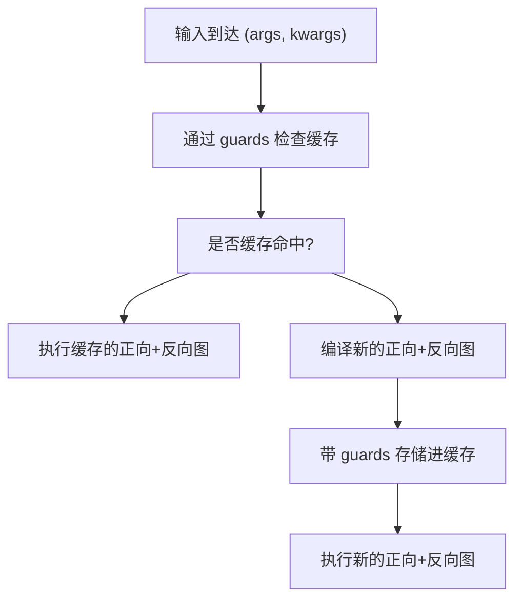
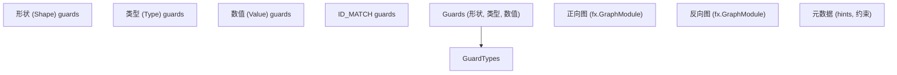
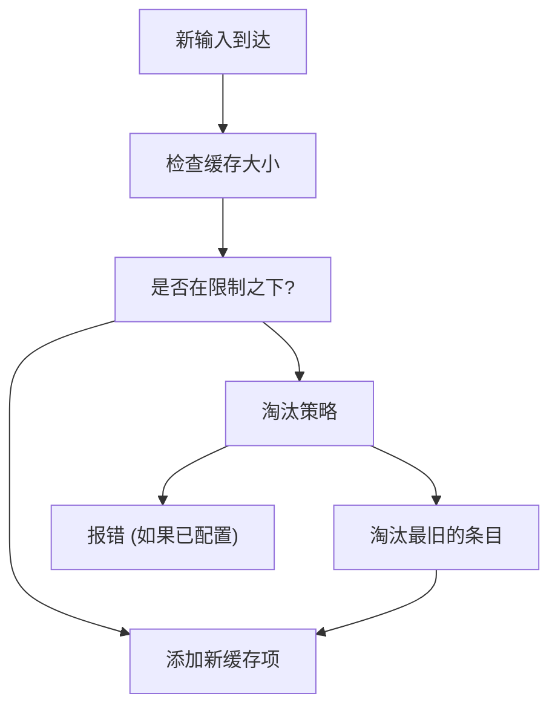
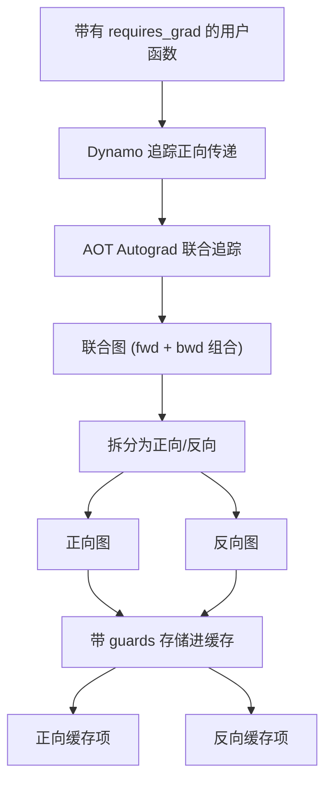
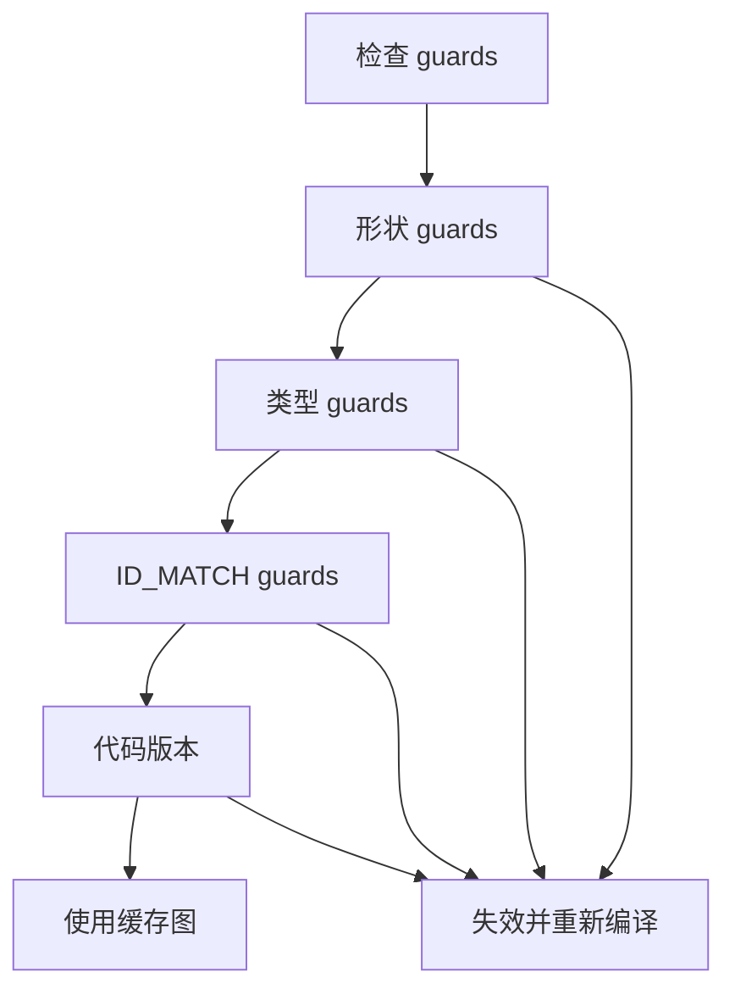
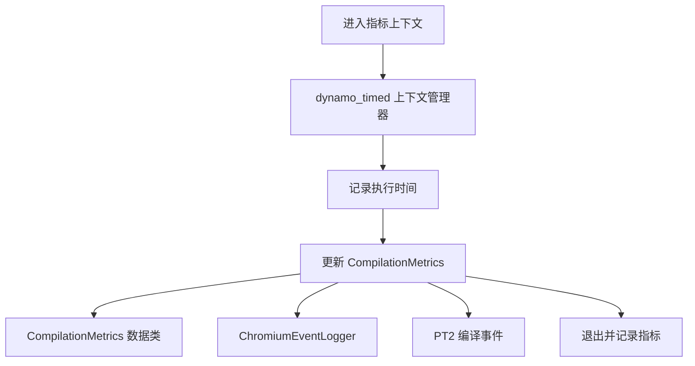
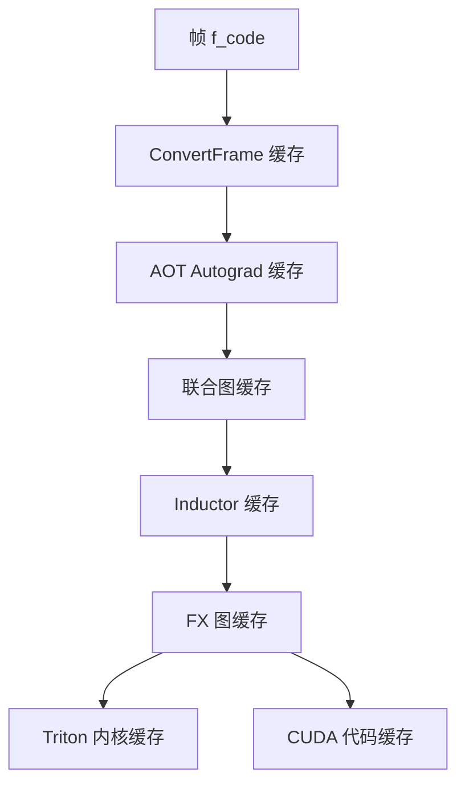

# Autograd 缓存 (Autograd Caching)

相关源文件 (Relevant source files)

-   [.ci/docker/common/install\_jax.sh](https://github.com/pytorch/pytorch/blob/915982a4/.ci/docker/common/install_jax.sh)
-   [benchmarks/inductor\_backends/cutlass.py](https://github.com/pytorch/pytorch/blob/915982a4/benchmarks/inductor_backends/cutlass.py)
-   [test/dynamo/test\_aot\_compile.py](https://github.com/pytorch/pytorch/blob/915982a4/test/dynamo/test_aot_compile.py)
-   [test/dynamo/test\_package.py](https://github.com/pytorch/pytorch/blob/915982a4/test/dynamo/test_package.py)
-   [test/dynamo/test\_pgo.py](https://github.com/pytorch/pytorch/blob/915982a4/test/dynamo/test_pgo.py)
-   [test/dynamo/test\_precompile\_context.py](https://github.com/pytorch/pytorch/blob/915982a4/test/dynamo/test_precompile_context.py)
-   [test/dynamo/test\_structured\_trace.py](https://github.com/pytorch/pytorch/blob/915982a4/test/dynamo/test_structured_trace.py)
-   [test/inductor/test\_auto\_functionalize.py](https://github.com/pytorch/pytorch/blob/915982a4/test/inductor/test_auto_functionalize.py)
-   [test/inductor/test\_cutedsl\_template.py](https://github.com/pytorch/pytorch/blob/915982a4/test/inductor/test_cutedsl_template.py)
-   [test/inductor/test\_cutlass\_backend.py](https://github.com/pytorch/pytorch/blob/915982a4/test/inductor/test_cutlass_backend.py)
-   [test/inductor/test\_cutlass\_evt.py](https://github.com/pytorch/pytorch/blob/915982a4/test/inductor/test_cutlass_evt.py)
-   [test/inductor/test\_pallas.py](https://github.com/pytorch/pytorch/blob/915982a4/test/inductor/test_pallas.py)
-   [test/inductor/test\_provenance\_tracing.py](https://github.com/pytorch/pytorch/blob/915982a4/test/inductor/test_provenance_tracing.py)
-   [torch/\_dynamo/aot\_compile.py](https://github.com/pytorch/pytorch/blob/915982a4/torch/_dynamo/aot_compile.py)
-   [torch/\_dynamo/package.py](https://github.com/pytorch/pytorch/blob/915982a4/torch/_dynamo/package.py)
-   [torch/\_dynamo/pgo.py](https://github.com/pytorch/pytorch/blob/915982a4/torch/_dynamo/pgo.py)
-   [torch/\_dynamo/precompile\_context.py](https://github.com/pytorch/pytorch/blob/915982a4/torch/_dynamo/precompile_context.py)
-   [torch/\_inductor/\_\_init\_\_.py](https://github.com/pytorch/pytorch/blob/915982a4/torch/_inductor/__init__.py)
-   [torch/\_inductor/codecache.py](https://github.com/pytorch/pytorch/blob/915982a4/torch/_inductor/codecache.py)
-   [torch/\_inductor/codegen/cpp\_flex\_attention_template.py](https://github.com/pytorch/pytorch/blob/915982a4/torch/_inductor/codegen/cpp_flex_attention_template.py)
-   [torch/\_inductor/codegen/cpp\_template\_kernel.py](https://github.com/pytorch/pytorch/blob/915982a4/torch/_inductor/codegen/cpp_template_kernel.py)
-   [torch/\_inductor/codegen/cutedsl/README.md](https://github.com/pytorch/pytorch/blob/915982a4/torch/_inductor/codegen/cutedsl/README.md)
-   [torch/\_inductor/codegen/cutedsl/\_\_init\_\_.py](https://github.com/pytorch/pytorch/blob/915982a4/torch/_inductor/codegen/cutedsl/__init__.py)
-   [torch/\_inductor/codegen/cutedsl/cutedsl\_op\_overrides.py](https://github.com/pytorch/pytorch/blob/915982a4/torch/_inductor/codegen/cutedsl/cutedsl_op_overrides.py)
-   [torch/\_inductor/codegen/cutedsl/cutedsl\_template.py](https://github.com/pytorch/pytorch/blob/915982a4/torch/_inductor/codegen/cutedsl/cutedsl_template.py)
-   [torch/\_inductor/codegen/pallas.py](https://github.com/pytorch/pytorch/blob/915982a4/torch/_inductor/codegen/pallas.py)
-   [torch/\_inductor/compile\_fx.py](https://github.com/pytorch/pytorch/blob/915982a4/torch/_inductor/compile_fx.py)
-   [torch/\_inductor/debug.py](https://github.com/pytorch/pytorch/blob/915982a4/torch/_inductor/debug.py)
-   [torch/\_inductor/runtime/runtime\_utils.py](https://github.com/pytorch/pytorch/blob/915982a4/torch/_inductor/runtime/runtime_utils.py)
-   [torch/compiler/\_\_init\_\_.py](https://github.com/pytorch/pytorch/blob/915982a4/torch/compiler/__init__.py)
-   [torch/compiler/\_cache.py](https://github.com/pytorch/pytorch/blob/915982a4/torch/compiler/_cache.py)
-   [torch/compiler/config.py](https://github.com/pytorch/pytorch/blob/915982a4/torch/compiler/config.py)
-   [torch/testing/\_internal/inductor\_utils.py](https://github.com/pytorch/pytorch/blob/915982a4/torch/testing/_internal/inductor_utils.py)
-   [torch/utils/\_pallas.py](https://github.com/pytorch/pytorch/blob/915982a4/torch/utils/_pallas.py)

## 目的与范围 (Purpose and Scope)

本页描述了 AOT (Ahead-of-Time) Autograd 使用的缓存机制，用于在处理具有兼容属性的输入时避免重新编译正向和反向图。有关 AOT Autograd 整体流水线的信息，请参阅 [AOT Autograd 流水线](/pytorch/pytorch/2.4.1-aot-autograd-pipeline)。有关更广泛的编译缓存和帧级缓存，请参阅 [Guard 系统与重新编译](/pytorch/pytorch/2.2.3-guard-system-and-recompilation)。

Autograd 缓存专门关注于：

-   存储已编译的正向和反向图对
-   使用 guards 确定是否符合缓存命中条件
-   管理缓存大小和淘汰 (eviction) 策略
-   与更广泛的 Dynamo 编译缓存集成

---

## 概览 (Overview)

当使用 `torch.compile` 编译 PyTorch 代码时，AOT Autograd 系统会创建正向和反向计算图。如果没有缓存，每次使用不同的输入（甚至是形状或步长略有不同）进行调用都会触发完整重新编译。Autograd 缓存通过以下方式解决此问题：

1.  **存储编译伪影 (compiled artifacts)**：在编译后，正向和反向图模块连同其关联的元数据一起被缓存。
2.  **基于 Guard 的查找**：当新输入到达时，guards 决定是否可以复用已缓存的图。
3.  **缓存管理**：可配置的限制可防止缓存无限制增长。


**来源**： [torch/\_dynamo/convert\_frame.py585-734](https://github.com/pytorch/pytorch/blob/915982a4/torch/_dynamo/convert_frame.py#L585-L734) [torch/\_dynamo/utils.py172-189](https://github.com/pytorch/pytorch/blob/915982a4/torch/_dynamo/utils.py#L172-L189)

---

## 缓存结构 (Cache Structure)

### 缓存项组件 (Cache Entry Components)

每个缓存项由以下部分组成：

| 组件 | 描述 | 位置 |
| --- | --- | --- |
| `GuardedCode` | 带有相关 guards 的已编译字节码 | 由转换 (conversion) 返回 |
| 正向图 | 正向传递的 FX 图模块 | 来自 AOT Autograd |
| 反向图 | 反向传递的 FX 图模块 | 来自 AOT Autograd |
| Guards | 保证缓存有效性必须满足的条件 | Guard 系统 |
| 元数据 | 形状信息、特化提示 (specialization hints) | 节点元数据 |


**来源**： [torch/\_dynamo/convert\_frame.py126-131](https://github.com/pytorch/pytorch/blob/915982a4/torch/_dynamo/convert_frame.py#L126-L131) [torch/\_dynamo/guards.py](https://github.com/pytorch/pytorch/blob/915982a4/torch/_dynamo/guards.py)

---

## 缓存查找过程 (Cache Lookup Process)

### Guard 评估 (Guard Evaluation)

当函数被调用时，缓存查找按如下方式进行：

> **[Mermaid sequence]**
> *(图表结构无法解析)*

### Guard 检查实现 (Guard Checking Implementation)

为了性能，Guards 在 C++ 中进行检查：

1.  **快速路径**：通过 `set_eval_frame` 进行 C++ guard 评估。
2.  **Guard 类型**：形状约束、类型检查、ID 匹配。
3.  **短路 (Short-circuiting)**：在遇到第一个违反的 guard 时快速失败。

**来源**： [torch/\_dynamo/convert\_frame.py612-696](https://github.com/pytorch/pytorch/blob/915982a4/torch/_dynamo/convert_frame.py#L612-L696) [torch/\_C/\_dynamo/eval\_frame.py](https://github.com/pytorch/pytorch/blob/915982a4/torch/_C/_dynamo/eval_frame.py)

---

## 缓存大小管理 (Cache Size Management)

### 重新编译限制 (Recompilation Limits)

缓存系统强制执行限制以防止无限制增长：

| 配置 | 默认值 | 目的 |
| --- | --- | --- |
| `recompile_limit` | 8 | 具有相同 ID\_MATCH 对象的最大缓存项数量 |
| `accumulated_recompile_limit` | 256 | 跨所有对象的总缓存项数量 |
| `fail_on_recompile_limit_hit` | False | 在达到重新编译限制时报错而不是淘汰旧项 |


### 缓存大小计算 (Cache Size Computation)

`compute_cache_size` 函数追踪：

-   具有匹配的 ID\_MATCH 对象的条目数量
-   总累积缓存项
-   用于调试的缓存项元数据

**来源**： [torch/\_dynamo/cache\_size.py](https://github.com/pytorch/pytorch/blob/915982a4/torch/_dynamo/cache_size.py) [torch/\_dynamo/config.py99-131](https://github.com/pytorch/pytorch/blob/915982a4/torch/_dynamo/config.py#L99-L131)

---

## 与 AOT Autograd 的集成 (Integration with AOT Autograd)

### 联合正向-反向编译 (Joint Forward-Backward Compilation)

AOT Autograd 创建一个联合的正向-反向图，然后对其进行拆分：


### 基于描述符的导出 (Descriptor-Based Export)

`aot_export_joint_with_descriptors` 函数处理：

-   创建联合的正向-反向图
-   为图输入/输出生成描述符
-   通过编译保留元数据

**来源**： [torch/\_functorch/aot\_autograd.py](https://github.com/pytorch/pytorch/blob/915982a4/torch/_functorch/aot_autograd.py) [torch/export/\_trace.py69-73](https://github.com/pytorch/pytorch/blob/915982a4/torch/export/_trace.py#L69-L73)

---

## 缓存失效 (Cache Invalidation)

### 失效触发器 (Invalidation Triggers)

缓存图在以下情况下失效：

1.  **Guard 失败**：输入属性违反了已缓存的 guards
2.  **代码改变**：函数字节码被修改
3.  **模块变异**：`nn.Module` 状态改变
4.  **动态形状**：形状特化不匹配
5.  **张量子类**：包装器/子类类型改变


### 自动动态形状 (Automatic Dynamic Shapes)

当 `automatic_dynamic_shapes=True` 时，系统：

-   首先尝试完全静态编译
-   由于形状变化导致 guard 失败时，使用动态形状重新编译
-   将所有“抖动 (wobbled)”的维度标记为动态

**来源**： [torch/\_dynamo/config.py162-168](https://github.com/pytorch/pytorch/blob/915982a4/torch/_dynamo/config.py#L162-L168) [torch/\_dynamo/guards.py](https://github.com/pytorch/pytorch/blob/915982a4/torch/_dynamo/guards.py)

---

## 缓存指标与可观测性 (Cache Metrics and Observability)

### 编译指标 (Compilation Metrics)

系统追踪：

```
# compilation_time_metrics 字典中的关键指标
{    
    "entire_frame_compile": [耗时列表],    
    "backend_compile": [耗时列表],    
    "guards_check": [耗时列表],
}

# 累积时间追踪
cumulative_time_spent_ns: dict[str, float]
```
### 指标上下文 (Metrics Context)

`MetricsContext` 类提供结构化日志记录：


**来源**： [torch/\_dynamo/utils.py336-373](https://github.com/pytorch/pytorch/blob/915982a4/torch/_dynamo/utils.py#L336-L373) [torch/\_dynamo/utils.py686-844](https://github.com/pytorch/pytorch/blob/915982a4/torch/_dynamo/utils.py#L686-L844)

---

## 配置与调优 (Configuration and Tuning)

### 关键配置选项 (Key Configuration Options)

通过 `torch._dynamo.config` 设置：

| 选项 | 效果 | 何时使用 |
| --- | --- | --- |
| `cache_size_limit` | 每个 ID\_MATCH 的最大项数 | 输入模式多样时增加 |
| `accumulated_cache_size_limit` | 总缓存项数 | 大型应用时增加 |
| `fail_on_cache_limit_hit` | 达到限制时报错 | 开发 / 调试 |
| `automatic_dynamic_shapes` | 自动提升动态维度 | 处理变化的形状 |
| `assume_static_by_default` | 静态优先编译 | 形状已知且为静态 |

### 配置示例 (Example Configuration)

```python
import torch._dynamo.config as config

# 为多样化的输入允许更多缓存项
config.cache_size_limit = 16
config.accumulated_cache_size_limit = 512

# 启用自动动态形状
config.automatic_dynamic_shapes = True

# 在开发期间快速失败
config.fail_on_cache_limit_hit = True  # 仅限开发
```
### 监控缓存性能 (Monitoring Cache Performance)

```python
from torch._dynamo.utils import (    
    calculate_time_spent,    
    compilation_time_metrics,
)

# 编译后
time_spent = calculate_time_spent()
print(f"总墙钟时间 (Total wall time): {time_spent['total_wall_time']}")
print(f"后端编译 (Backend compile): {time_spent['backend_compile']}")

# 每个函数的指标
for func_name, times in compilation_time_metrics.items():    
    print(f"{func_name}: {len(times)} 次编译")
```
**来源**： [torch/\_dynamo/config.py99-131](https://github.com/pytorch/pytorch/blob/915982a4/torch/_dynamo/config.py#L99-L131) [torch/\_dynamo/utils.py305-332](https://github.com/pytorch/pytorch/blob/915982a4/torch/_dynamo/utils.py#L305-L332)

---

## 与更广泛缓存机制的交互 (Interaction with Broader Caching)

### 多级缓存层级 (Multi-Level Cache Hierarchy)


Autograd 缓存位于帧级缓存 (Dynamo) 和后端级缓存 (Inductor) 之间，提供：

-   **Guard 传播**：来自帧缓存的 guards 流向 autograd 缓存
-   **伪影复用**：已编译的图可以被后端缓存复用
-   **元数据保留**：形状和类型信息流经各缓存层

**来源**： [torch/\_dynamo/convert\_frame.py728-795](https://github.com/pytorch/pytorch/blob/915982a4/torch/_dynamo/convert_frame.py#L728-L795) [torch/\_inductor/compile\_fx.py](https://github.com/pytorch/pytorch/blob/915982a4/torch/_inductor/compile_fx.py) [torch/fx/experimental/proxy\_tensor.py](https://github.com/pytorch/pytorch/blob/915982a4/torch/fx/experimental/proxy_tensor.py)
