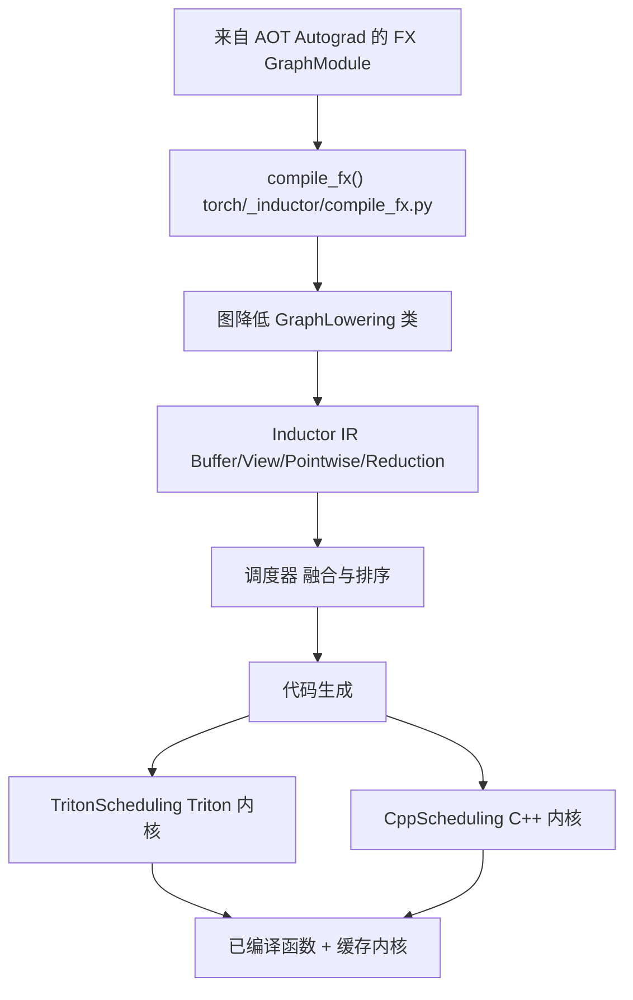
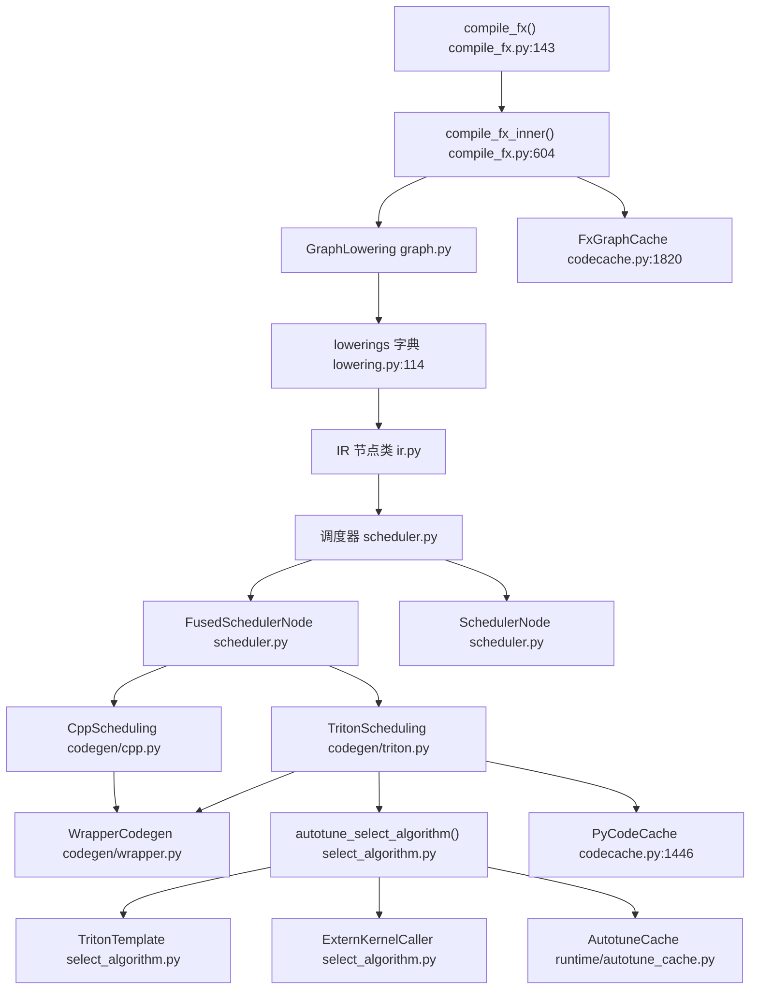
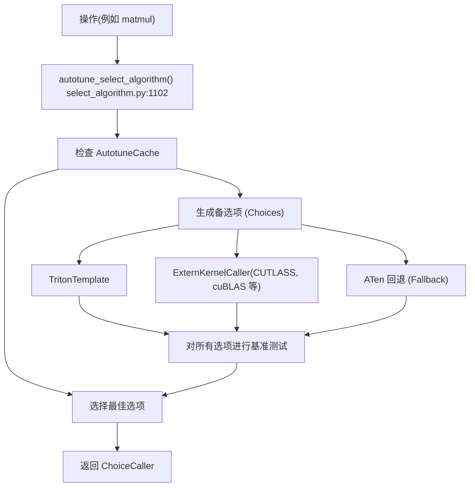

# TorchInductor 后端 (TorchInductor Backend)

相关源文件 (Relevant source files)

-   [.ci/docker/common/install\_jax.sh](https://github.com/pytorch/pytorch/blob/915982a4/.ci/docker/common/install_jax.sh)
-   [.flake8](https://github.com/pytorch/pytorch/blob/915982a4/.flake8)
-   [.lintrunner.toml](https://github.com/pytorch/pytorch/blob/915982a4/.lintrunner.toml)
-   [aten/src/ATen/cuda/CUDAGreenContext.cpp](https://github.com/pytorch/pytorch/blob/915982a4/aten/src/ATen/cuda/CUDAGreenContext.cpp)
-   [aten/src/ATen/cuda/CUDAGreenContext.h](https://github.com/pytorch/pytorch/blob/915982a4/aten/src/ATen/cuda/CUDAGreenContext.h)
-   [benchmarks/inductor\_backends/cutlass.py](https://github.com/pytorch/pytorch/blob/915982a4/benchmarks/inductor_backends/cutlass.py)
-   [docs/source/cuda.md](https://github.com/pytorch/pytorch/blob/915982a4/docs/source/cuda.md)
-   [pyproject.toml](https://github.com/pytorch/pytorch/blob/915982a4/pyproject.toml)
-   [test/dynamo/test\_structured\_trace.py](https://github.com/pytorch/pytorch/blob/915982a4/test/dynamo/test_structured_trace.py)
-   [test/inductor/test\_aot\_inductor.py](https://github.com/pytorch/pytorch/blob/915982a4/test/inductor/test_aot_inductor.py)
-   [test/inductor/test\_auto\_functionalize.py](https://github.com/pytorch/pytorch/blob/915982a4/test/inductor/test_auto_functionalize.py)
-   [test/inductor/test\_codecache.py](https://github.com/pytorch/pytorch/blob/915982a4/test/inductor/test_codecache.py)
-   [test/inductor/test\_combo\_kernels.py](https://github.com/pytorch/pytorch/blob/915982a4/test/inductor/test_combo_kernels.py)
-   [test/inductor/test\_cpu\_repro.py](https://github.com/pytorch/pytorch/blob/915982a4/test/inductor/test_cpu_repro.py)
-   [test/inductor/test\_cuda\_repro.py](https://github.com/pytorch/pytorch/blob/915982a4/test/inductor/test_cuda_repro.py)
-   [test/inductor/test\_custom\_op\_autotune.py](https://github.com/pytorch/pytorch/blob/915982a4/test/inductor/test_custom_op_autotune.py)
-   [test/inductor/test\_cutedsl\_template.py](https://github.com/pytorch/pytorch/blob/915982a4/test/inductor/test_cutedsl_template.py)
-   [test/inductor/test\_cutlass\_backend.py](https://github.com/pytorch/pytorch/blob/915982a4/test/inductor/test_cutlass_backend.py)
-   [test/inductor/test\_cutlass\_evt.py](https://github.com/pytorch/pytorch/blob/915982a4/test/inductor/test_cutlass_evt.py)
-   [test/inductor/test\_flex\_decoding.py](https://github.com/pytorch/pytorch/blob/915982a4/test/inductor/test_flex_decoding.py)
-   [test/inductor/test\_foreach.py](https://github.com/pytorch/pytorch/blob/915982a4/test/inductor/test_foreach.py)
-   [test/inductor/test\_lookup\_table.py](https://github.com/pytorch/pytorch/blob/915982a4/test/inductor/test_lookup_table.py)
-   [test/inductor/test\_max\_autotune.py](https://github.com/pytorch/pytorch/blob/915982a4/test/inductor/test_max_autotune.py)
-   [test/inductor/test\_mmdecomp.py](https://github.com/pytorch/pytorch/blob/915982a4/test/inductor/test_mmdecomp.py)
-   [test/inductor/test\_pallas.py](https://github.com/pytorch/pytorch/blob/915982a4/test/inductor/test_pallas.py)
-   [test/inductor/test\_provenance\_tracing.py](https://github.com/pytorch/pytorch/blob/915982a4/test/inductor/test_provenance_tracing.py)
-   [test/inductor/test\_segmented\_tree.py](https://github.com/pytorch/pytorch/blob/915982a4/test/inductor/test_segmented_tree.py)
-   [test/inductor/test\_torchinductor.py](https://github.com/pytorch/pytorch/blob/915982a4/test/inductor/test_torchinductor.py)
-   [test/inductor/test\_torchinductor\_codegen\_dynamic\_shapes.py](https://github.com/pytorch/pytorch/blob/915982a4/test/inductor/test_torchinductor_codegen_dynamic_shapes.py)
-   [test/test\_public\_bindings.py](https://github.com/pytorch/pytorch/blob/915982a4/test/test_public_bindings.py)
-   [test/test\_testing.py](https://github.com/pytorch/pytorch/blob/915982a4/test/test_testing.py)
-   [tools/linter/adapters/pyrefly\_linter.py](https://github.com/pytorch/pytorch/blob/915982a4/tools/linter/adapters/pyrefly_linter.py)
-   [tools/linter/adapters/test\_has\_main\_linter.py](https://github.com/pytorch/pytorch/blob/915982a4/tools/linter/adapters/test_has_main_linter.py)
-   [torch/\_inductor/\_\_init\_\_.py](https://github.com/pytorch/pytorch/blob/915982a4/torch/_inductor/__init__.py)
-   [torch/\_inductor/autotune\_process.py](https://github.com/pytorch/pytorch/blob/915982a4/torch/_inductor/autotune_process.py)
-   [torch/\_inductor/choices.py](https://github.com/pytorch/pytorch/blob/915982a4/torch/_inductor/choices.py)
-   [torch/\_inductor/codecache.py](https://github.com/pytorch/pytorch/blob/915982a4/torch/_inductor/codecache.py)
-   [torch/\_inductor/codegen/common.py](https://github.com/pytorch/pytorch/blob/915982a4/torch/_inductor/codegen/common.py)
-   [torch/\_inductor/codegen/cpp.py](https://github.com/pytorch/pytorch/blob/915982a4/torch/_inductor/codegen/cpp.py)
-   [torch/\_inductor/codegen/cpp\_flex\_attention\_template.py](https://github.com/pytorch/pytorch/blob/915982a4/torch/_inductor/codegen/cpp_flex_attention_template.py)
-   [torch/\_inductor/codegen/cpp\_template\_kernel.py](https://github.com/pytorch/pytorch/blob/915982a4/torch/_inductor/codegen/cpp_template_kernel.py)
-   [torch/\_inductor/codegen/cpp\_wrapper\_cpu.py](https://github.com/pytorch/pytorch/blob/915982a4/torch/_inductor/codegen/cpp_wrapper_cpu.py)
-   [torch/\_inductor/codegen/cpp\_wrapper\_cpu\_array\_ref.py](https://github.com/pytorch/pytorch/blob/915982a4/torch/_inductor/codegen/cpp_wrapper_cpu_array_ref.py)
-   [torch/\_inductor/codegen/cutedsl/README.md](https://github.com/pytorch/pytorch/blob/915982a4/torch/_inductor/codegen/cutedsl/README.md)
-   [torch/\_inductor/codegen/cutedsl/\_\_init\_\_.py](https://github.com/pytorch/pytorch/blob/915982a4/torch/_inductor/codegen/cutedsl/__init__.py)
-   [torch/\_inductor/codegen/cutedsl/cutedsl\_op\_overrides.py](https://github.com/pytorch/pytorch/blob/915982a4/torch/_inductor/codegen/cutedsl/cutedsl_op_overrides.py)
-   [torch/\_inductor/codegen/cutedsl/cutedsl\_template.py](https://github.com/pytorch/pytorch/blob/915982a4/torch/_inductor/codegen/cutedsl/cutedsl_template.py)
-   [torch/\_inductor/codegen/halide.py](https://github.com/pytorch/pytorch/blob/915982a4/torch/_inductor/codegen/halide.py)
-   [torch/\_inductor/codegen/pallas.py](https://github.com/pytorch/pytorch/blob/915982a4/torch/_inductor/codegen/pallas.py)
-   [torch/\_inductor/codegen/simd.py](https://github.com/pytorch/pytorch/blob/915982a4/torch/_inductor/codegen/simd.py)
-   [torch/\_inductor/codegen/subgraph.py](https://github.com/pytorch/pytorch/blob/915982a4/torch/_inductor/codegen/subgraph.py)
-   [torch/\_inductor/codegen/triton.py](https://github.com/pytorch/pytorch/blob/915982a4/torch/_inductor/codegen/triton.py)
-   [torch/\_inductor/codegen/triton\_combo\_kernel.py](https://github.com/pytorch/pytorch/blob/915982a4/torch/_inductor/codegen/triton_combo_kernel.py)
-   [torch/\_inductor/codegen/wrapper.py](https://github.com/pytorch/pytorch/blob/915982a4/torch/_inductor/codegen/wrapper.py)
-   [torch/\_inductor/compile\_fx.py](https://github.com/pytorch/pytorch/blob/915982a4/torch/_inductor/compile_fx.py)
-   [torch/\_inductor/config.py](https://github.com/pytorch/pytorch/blob/915982a4/torch/_inductor/config.py)
-   [torch/\_inductor/debug.py](https://github.com/pytorch/pytorch/blob/915982a4/torch/_inductor/debug.py)
-   [torch/\_inductor/decomposition.py](https://github.com/pytorch/pytorch/blob/915982a4/torch/_inductor/decomposition.py)
-   [torch/\_inductor/dtype\_propagation.py](https://github.com/pytorch/pytorch/blob/915982a4/torch/_inductor/dtype_propagation.py)
-   [torch/\_inductor/graph.py](https://github.com/pytorch/pytorch/blob/915982a4/torch/_inductor/graph.py)
-   [torch/\_inductor/ir.py](https://github.com/pytorch/pytorch/blob/915982a4/torch/_inductor/ir.py)
-   [torch/\_inductor/kernel/bmm.py](https://github.com/pytorch/pytorch/blob/915982a4/torch/_inductor/kernel/bmm.py)
-   [torch/\_inductor/kernel/conv.py](https://github.com/pytorch/pytorch/blob/915982a4/torch/_inductor/kernel/conv.py)
-   [torch/\_inductor/kernel/custom\_op.py](https://github.com/pytorch/pytorch/blob/915982a4/torch/_inductor/kernel/custom_op.py)
-   [torch/\_inductor/kernel/mm.py](https://github.com/pytorch/pytorch/blob/915982a4/torch/_inductor/kernel/mm.py)
-   [torch/\_inductor/kernel/mm\_plus\_mm.py](https://github.com/pytorch/pytorch/blob/915982a4/torch/_inductor/kernel/mm_plus_mm.py)
-   [torch/\_inductor/kernel\_inputs.py](https://github.com/pytorch/pytorch/blob/915982a4/torch/_inductor/kernel_inputs.py)
-   [torch/\_inductor/lowering.py](https://github.com/pytorch/pytorch/blob/915982a4/torch/_inductor/lowering.py)
-   [torch/\_inductor/memory.py](https://github.com/pytorch/pytorch/blob/915982a4/torch/_inductor/memory.py)
-   [torch/\_inductor/ops\_handler.py](https://github.com/pytorch/pytorch/blob/915982a4/torch/_inductor/ops_handler.py)
-   [torch/\_inductor/runtime/runtime\_utils.py](https://github.com/pytorch/pytorch/blob/915982a4/torch/_inductor/runtime/runtime_utils.py)
-   [torch/\_inductor/runtime/triton\_heuristics.py](https://github.com/pytorch/pytorch/blob/915982a4/torch/_inductor/runtime/triton_heuristics.py)
-   [torch/\_inductor/scheduler.py](https://github.com/pytorch/pytorch/blob/915982a4/torch/_inductor/scheduler.py)
-   [torch/\_inductor/select\_algorithm.py](https://github.com/pytorch/pytorch/blob/915982a4/torch/_inductor/select_algorithm.py)
-   [torch/\_inductor/shape\_propagation.py](https://github.com/pytorch/pytorch/blob/915982a4/torch/_inductor/shape_propagation.py)
-   [torch/\_inductor/sizevars.py](https://github.com/pytorch/pytorch/blob/915982a4/torch/_inductor/sizevars.py)
-   [torch/\_inductor/template\_heuristics/triton.py](https://github.com/pytorch/pytorch/blob/915982a4/torch/_inductor/template_heuristics/triton.py)
-   [torch/\_inductor/utils.py](https://github.com/pytorch/pytorch/blob/915982a4/torch/_inductor/utils.py)
-   [torch/\_inductor/virtualized.py](https://github.com/pytorch/pytorch/blob/915982a4/torch/_inductor/virtualized.py)
-   [torch/csrc/cuda/GreenContext.cpp](https://github.com/pytorch/pytorch/blob/915982a4/torch/csrc/cuda/GreenContext.cpp)
-   [torch/csrc/inductor/cpp\_wrapper/common.h](https://github.com/pytorch/pytorch/blob/915982a4/torch/csrc/inductor/cpp_wrapper/common.h)
-   [torch/cuda/green\_contexts.py](https://github.com/pytorch/pytorch/blob/915982a4/torch/cuda/green_contexts.py)
-   [torch/testing/\_internal/inductor\_utils.py](https://github.com/pytorch/pytorch/blob/915982a4/torch/testing/_internal/inductor_utils.py)
-   [torch/testing/\_internal/py312\_intrinsics.py](https://github.com/pytorch/pytorch/blob/915982a4/torch/testing/_internal/py312_intrinsics.py)
-   [torch/utils/\_pallas.py](https://github.com/pytorch/pytorch/blob/915982a4/torch/utils/_pallas.py)

## 目的与范围 (Purpose and Scope)

TorchInductor 是 PyTorch 的优化编译器后端，可将 FX 图转换为高度优化的机器代码。它接收来自 TorchDynamo 前端或 `torch.export` 的 FX 图，执行到中间表示 (IR) 的降低 (lowering)，应用调度 (scheduling) 和融合 (fusion) 优化，并为各种后端生成代码，包括 Triton GPU 内核、厂商特定的模板 (CUTLASS, Composable Kernel) 以及 C++ CPU 代码。

本页涵盖 TorchInductor 的整体架构和编译流水线。有关特定子系统的详细信息：

-   IR 表示与降低：参见 [Inductor IR 与降低 (Inductor IR and Lowering)](/pytorch/pytorch/2.5.1-inductor-ir-and-lowering)
-   调度与融合算法：参见 [调度与融合 (Scheduling and Fusion)](/pytorch/pytorch/2.5.2-scheduling-and-fusion)
-   内核选择与自动调优：参见 [内核选择与自动调优 (Kernel Selection and Autotuning)](/pytorch/pytorch/2.5.3-kernel-selection-and-autotuning)
-   代码生成后端：参见 [代码生成：Triton, CUTLASS, C++](/pytorch/pytorch/2.5.4-code-generation:-triton-cutlass-pallas-c++)
-   编译缓存：参见 [编译缓存与代码存储 (Compilation Cache and Code Storage)](/pytorch/pytorch/2.5.5-compilation-cache-and-code-storage)
-   优化实现：参见 [特殊内核实现 (Specialized Kernel Implementations)](/pytorch/pytorch/2.5.6-specialized-kernel-implementations)

## 概览 (Overview)

TorchInductor 作为 PyTorch 编译栈中的后端。它在 TorchDynamo 捕获 Python 字节码并生成 FX 图（第 [2.2](/pytorch/pytorch/2.2-torchdynamo-frontend) 页）之后，以及 AOT Autograd 对这些图进行分解和函数化（第 [2.4](/pytorch/pytorch/2.4-aot-autograd-and-functionalization) 页）之后被调用。TorchInductor 的职责是接收这些 FX 图并生成高效的可执行代码。


**TorchInductor 编译流程**

来源： [torch/\_inductor/compile\_fx.py](https://github.com/pytorch/pytorch/blob/915982a4/torch/_inductor/compile_fx.py) [高层架构图 1](https://github.com/pytorch/pytorch/blob/915982a4/Diagram 1 from high-level architecture)

## 核心组件与类 (Core Components and Classes)

下图展示了 TorchInductor 主要子系统与其主要实现类及文件的映射关系：


**TorchInductor 主要组件与关键类**

来源： [torch/\_inductor/compile\_fx.py](https://github.com/pytorch/pytorch/blob/915982a4/torch/_inductor/compile_fx.py) [torch/\_inductor/graph.py](https://github.com/pytorch/pytorch/blob/915982a4/torch/_inductor/graph.py) [torch/\_inductor/lowering.py](https://github.com/pytorch/pytorch/blob/915982a4/torch/_inductor/lowering.py) [torch/\_inductor/ir.py](https://github.com/pytorch/pytorch/blob/915982a4/torch/_inductor/ir.py) [torch/\_inductor/scheduler.py](https://github.com/pytorch/pytorch/blob/915982a4/torch/_inductor/scheduler.py) [torch/\_inductor/codegen/triton.py](https://github.com/pytorch/pytorch/blob/915982a4/torch/_inductor/codegen/triton.py) [torch/\_inductor/select\_algorithm.py](https://github.com/pytorch/pytorch/blob/915982a4/torch/_inductor/select_algorithm.py) [torch/\_inductor/codecache.py](https://github.com/pytorch/pytorch/blob/915982a4/torch/_inductor/codecache.py)

## 编译流水线 (Compilation Pipeline)

TorchInductor 编译流水线由几个顺序阶段组成：

### 1. 入口与初始化

编译过程始于 `compile_fx()` [torch/\_inductor/compile\_fx.py143](https://github.com/pytorch/pytorch/blob/915982a4/torch/_inductor/compile_fx.py#L143-L143)，它处理：

-   图的准备与验证
-   用于符号形状传播的 Fake Tensor 模式设置
-   通过 `FxGraphCache` 进行缓存检查
-   调用 `compile_fx_inner()` [torch/\_inductor/compile\_fx.py604](https://github.com/pytorch/pytorch/blob/915982a4/torch/_inductor/compile_fx.py#L604-L604)

### 2. 图降低 (Graph Lowering)

`GraphLowering` 类 [torch/\_inductor/graph.py](https://github.com/pytorch/pytorch/blob/915982a4/torch/_inductor/graph.py) 遍历 FX 图并：

-   通过 `lowerings` 字典 [torch/\_inductor/lowering.py114](https://github.com/pytorch/pytorch/blob/915982a4/torch/_inductor/lowering.py#L114-L114) 将每个 FX 节点转换为 Inductor IR 节点
-   创建 `Buffer`、`Pointwise`、`Reduction` 和 `View` IR 节点 [torch/\_inductor/ir.py](https://github.com/pytorch/pytorch/blob/915982a4/torch/_inductor/ir.py)
-   通过 `SizeVars` 管理符号变量以处理动态形状
-   追踪内存布局和存储需求

### 3. 调度与融合 (Scheduling and Fusion)

`Scheduler` [torch/\_inductor/scheduler.py](https://github.com/pytorch/pytorch/blob/915982a4/torch/_inductor/scheduler.py) 分析依赖关系并：

-   确定操作执行顺序
-   识别融合机会
-   为分组操作创建 `FusedSchedulerNode` 实例 [torch/\_inductor/scheduler.py](https://github.com/pytorch/pytorch/blob/915982a4/torch/_inductor/scheduler.py)
-   应用内存规划和缓冲区复用

### 4. 代码生成 (Code Generation)

后端特定的调度类生成代码：

-   `TritonScheduling` [torch/\_inductor/codegen/triton.py](https://github.com/pytorch/pytorch/blob/915982a4/torch/_inductor/codegen/triton.py) 生成 Triton GPU 内核
-   `CppScheduling` 生成向量化的 CPU 代码
-   `WrapperCodegen` [torch/\_inductor/codegen/wrapper.py](https://github.com/pytorch/pytorch/blob/915982a4/torch/_inductor/codegen/wrapper.py) 创建 Python 包装器代码，用于：
    -   分配张量
    -   调用生成的内核
    -   处理运行时形状计算

### 5. 编译与缓存 (Compilation and Caching)

生成的代码被编译并缓存：

-   `PyCodeCache` [torch/\_inductor/codecache.py1446](https://github.com/pytorch/pytorch/blob/915982a4/torch/_inductor/codecache.py#L1446-L1446) 编译 Python 包装器代码
-   Triton 内核通过 Triton 编译器进行编译
-   `FxGraphCache` [torch/\_inductor/codecache.py1820](https://github.com/pytorch/pytorch/blob/915982a4/torch/_inductor/codecache.py#L1820-L1820) 实现了图级缓存
-   `AutotuneCache` 存储自动调优结果

> **[Mermaid sequence]**
> *(图表结构无法解析)*

**TorchInductor 编译序列**

来源： [torch/\_inductor/compile\_fx.py143-604](https://github.com/pytorch/pytorch/blob/915982a4/torch/_inductor/compile_fx.py#L143-L604) [torch/\_inductor/graph.py](https://github.com/pytorch/pytorch/blob/915982a4/torch/_inductor/graph.py) [torch/\_inductor/scheduler.py](https://github.com/pytorch/pytorch/blob/915982a4/torch/_inductor/scheduler.py) [torch/\_inductor/codegen/triton.py](https://github.com/pytorch/pytorch/blob/915982a4/torch/_inductor/codegen/triton.py)

## Inductor IR

TorchInductor 使用分层的中间表示 (IR) 来建模 PyTorch 操作和内存布局。IR 在第 [2.5.1](/pytorch/pytorch/2.5.1-inductor-ir-and-lowering) 页有详细说明。关键 IR 节点类型包括：

| IR 节点类型 | 目的 | 源文件 |
| --- | --- | --- |
| `TensorBox` | 顶层张量表示 | [torch/\_inductor/ir.py198](https://github.com/pytorch/pytorch/blob/915982a4/torch/_inductor/ir.py#L198-L198) |
| `StorageBox` | 管理底层存储 | [torch/\_inductor/ir.py](https://github.com/pytorch/pytorch/blob/915982a4/torch/_inductor/ir.py) |
| `Buffer` | 代表已分配内存 | [torch/\_inductor/ir.py](https://github.com/pytorch/pytorch/blob/915982a4/torch/_inductor/ir.py) |
| `View` | 视图操作（转置、重塑） | [torch/\_inductor/ir.py](https://github.com/pytorch/pytorch/blob/915982a4/torch/_inductor/ir.py) |
| `Pointwise` | 逐元素操作 | [torch/\_inductor/ir.py](https://github.com/pytorch/pytorch/blob/915982a4/torch/_inductor/ir.py) |
| `Reduction` | 归约操作（sum, max） | [torch/\_inductor/ir.py](https://github.com/pytorch/pytorch/blob/915982a4/torch/_inductor/ir.py) |
| `Layout` | 内存布局规范 | [torch/\_inductor/ir.py](https://github.com/pytorch/pytorch/blob/915982a4/torch/_inductor/ir.py) |

`lowerings` 字典 [torch/\_inductor/lowering.py114](https://github.com/pytorch/pytorch/blob/915982a4/torch/_inductor/lowering.py#L114-L114) 将 PyTorch 操作 (aten ops) 映射到生成这些 IR 节点的函数。

来源： [torch/\_inductor/ir.py](https://github.com/pytorch/pytorch/blob/915982a4/torch/_inductor/ir.py) [torch/\_inductor/lowering.py114](https://github.com/pytorch/pytorch/blob/915982a4/torch/_inductor/lowering.py#L114-L114)

## 调度与融合 (Scheduling and Fusion)

`Scheduler` 类 [torch/\_inductor/scheduler.py](https://github.com/pytorch/pytorch/blob/915982a4/torch/_inductor/scheduler.py) 负责确定操作执行顺序并识别融合机会。关键职责包括：

**依赖分析**：调度器构建一个依赖图，其中节点代表操作，边代表数据依赖 (`MemoryDep`, `StarDep`, `WeakDep`) [torch/\_inductor/dependencies.py](https://github.com/pytorch/pytorch/blob/915982a4/torch/_inductor/dependencies.py)

**融合决策**：操作基于以下因素进行融合：

-   内存访问模式
-   设备兼容性
-   循环顺序兼容性
-   读/写依赖
-   配置设置，如 `config.aggressive_fusion` [torch/\_inductor/config.py775](https://github.com/pytorch/pytorch/blob/915982a4/torch/_inductor/config.py#L775-L775)

**节点类型**：调度器创建：

-   `SchedulerNode` [torch/\_inductor/scheduler.py](https://github.com/pytorch/pytorch/blob/915982a4/torch/_inductor/scheduler.py) 用于单个操作
-   `FusedSchedulerNode` [torch/\_inductor/scheduler.py](https://github.com/pytorch/pytorch/blob/915982a4/torch/_inductor/scheduler.py) 用于融合组
-   `NopKernelSchedulerNode` 用于无计算操作

详细的融合算法和启发式方法在第 [2.5.2](/pytorch/pytorch/2.5.2-scheduling-and-fusion) 页介绍。

来源： [torch/\_inductor/scheduler.py](https://github.com/pytorch/pytorch/blob/915982a4/torch/_inductor/scheduler.py) [torch/\_inductor/dependencies.py](https://github.com/pytorch/pytorch/blob/915982a4/torch/_inductor/dependencies.py) [torch/\_inductor/config.py775](https://github.com/pytorch/pytorch/blob/915982a4/torch/_inductor/config.py#L775-L775)

## 内核选择与自动调优 (Kernel Selection and Autotuning)

TorchInductor 采用精细的内核选择系统，为每个操作选择最佳实现：


**内核选择与自动调优流程**

`autotune_select_algorithm()` 函数 [torch/\_inductor/select\_algorithm.py1102](https://github.com/pytorch/pytorch/blob/915982a4/torch/_inductor/select_algorithm.py#L1102-L1102) 协调选择过程：

1.  **备选项生成**：生成多个内核实现：

    -   用于 Triton 内核的 `TritonTemplate` 实例 [torch/\_inductor/select\_algorithm.py](https://github.com/pytorch/pytorch/blob/915982a4/torch/_inductor/select_algorithm.py)
    -   用于 CUTLASS、cuBLAS、CK 模板的 `ExternKernelCaller`
    -   ATen 回退实现
2.  **基准测试**：使用实际输入对每个选项进行基准测试：

    -   `TritonBenchmarkRequest` [torch/\_inductor/autotune\_process.py](https://github.com/pytorch/pytorch/blob/915982a4/torch/_inductor/autotune_process.py) 处理 Triton 内核基准测试
    -   `ExternKernelBenchmarkRequest` 用于外部内核
    -   以毫秒为单位测量结果
3.  **配置调优**：对于 Triton 内核，测试多个配置：

    -   块大小（XBLOCK, YBLOCK, RBLOCK）
    -   Warp 数量
    -   阶段 (Stage) 数量
    -   通过 `CoordescTuner` [torch/\_inductor/runtime/coordinate\_descent\_tuner.py](https://github.com/pytorch/pytorch/blob/915982a4/torch/_inductor/runtime/coordinate_descent_tuner.py) 进行坐标下降调优
4.  **缓存**：结果存储在 `AutotuneCache` [torch/\_inductor/runtime/autotune\_cache.py](https://github.com/pytorch/pytorch/blob/915982a4/torch/_inductor/runtime/autotune_cache.py) 中，以避免重复基准测试。


控制自动调优的配置选项：

-   `config.max_autotune` [torch/\_inductor/config.py482](https://github.com/pytorch/pytorch/blob/915982a4/torch/_inductor/config.py#L482-L482) - 启用自动调优
-   `config.max_autotune_gemm` [torch/\_inductor/config.py488](https://github.com/pytorch/pytorch/blob/915982a4/torch/_inductor/config.py#L488-L488) - 用于矩阵操作
-   `config.max_autotune_pointwise` [torch/\_inductor/config.py485](https://github.com/pytorch/pytorch/blob/915982a4/torch/_inductor/config.py#L485-L485) - 用于逐元素操作
-   `config.autotune_local_cache` [torch/\_inductor/config.py134](https://github.com/pytorch/pytorch/blob/915982a4/torch/_inductor/config.py#L134-L134) - 启用本地缓存
-   `config.coordinate_descent_tuning` [torch/\_inductor/config.py688](https://github.com/pytorch/pytorch/blob/915982a4/torch/_inductor/config.py#L688-L688) - 启用坐标下降

有关自动调优策略的更多详细信息，请参阅第 [2.5.3](/pytorch/pytorch/2.5.3-kernel-selection-and-autotuning) 页。

来源： [torch/\_inductor/select\_algorithm.py1102](https://github.com/pytorch/pytorch/blob/915982a4/torch/_inductor/select_algorithm.py#L1102-L1102) [torch/\_inductor/autotune\_process.py](https://github.com/pytorch/pytorch/blob/915982a4/torch/_inductor/autotune_process.py) [torch/\_inductor/runtime/autotune\_cache.py](https://github.com/pytorch/pytorch/blob/915982a4/torch/_inductor/runtime/autotune_cache.py) [torch/\_inductor/config.py482-488](https://github.com/pytorch/pytorch/blob/915982a4/torch/_inductor/config.py#L482-L488)

## 代码生成后端 (Code Generation Backends)

TorchInductor 支持多个代码生成后端：

### Triton 后端

`TritonScheduling` 类 [torch/\_inductor/codegen/triton.py](https://github.com/pytorch/pytorch/blob/915982a4/torch/_inductor/codegen/triton.py) 生成 Triton GPU 内核：

**TritonKernel**：代表单个 Triton 内核，包含：

-   循环迭代范围（XBLOCK, YBLOCK, RBLOCK 维度）
-   用于内存访问的索引表达式
-   计算主体
-   配置（块大小、warp 数量、阶段数量）

**关键类**：

-   `TritonKernel` [torch/\_inductor/codegen/triton.py](https://github.com/pytorch/pytorch/blob/915982a4/torch/_inductor/codegen/triton.py) - 单个内核表示
-   `TritonSymbols` [torch/\_inductor/codegen/triton.py190](https://github.com/pytorch/pytorch/blob/915982a4/torch/_inductor/codegen/triton.py#L190-L190) - 管理符号块偏移量/大小
-   `IndexingOptions` [torch/\_inductor/codegen/triton.py274](https://github.com/pytorch/pytorch/blob/915982a4/torch/_inductor/codegen/triton.py#L274-L274) - 索引与掩码 (masking) 逻辑
-   `BlockPtrOptions` [torch/\_inductor/codegen/triton.py660](https://github.com/pytorch/pytorch/blob/915982a4/torch/_inductor/codegen/triton.py#L660-L660) - 块指针生成

**特性**：

-   自动内存合并 (Memory coalescing)
-   持久化归约 (Persistent reductions)
-   支持较新 GPU 的 TMA (Tensor Memory Accelerator)
-   混合顺序归约融合 (Mixed-order reduction fusion)
-   块指针优化

### CUTLASS 与厂商模板 (CUTLASS and Vendor Templates)

对于 CUDA GPU，TorchInductor 可以使用 CUTLASS 模板：

-   用于矩阵乘法的 `CUTLASSGemmTemplate`
-   从 CUTLASS 库配置自动生成
-   针对特定 GPU 架构（SM80+, SM90+）进行了优化

对于 AMD GPU，Composable Kernel (CK) 模板提供了优化实现。

### C++ 后端

`CppScheduling` 为 CPU 生成向量化的 C++ 代码：

-   通过 `CppVecKernel` 使用 SIMD 原语 (AVX2, AVX512)
-   通过 OpenMP 进行并行执行
-   通过 `CppVecOverrides` 进行向量化操作

### 包装代码生成 (Wrapper Code Generation)

`WrapperCodegen` [torch/\_inductor/codegen/wrapper.py](https://github.com/pytorch/pytorch/blob/915982a4/torch/_inductor/codegen/wrapper.py) 生成 Python 包装器代码，用于：

-   分配输出张量
-   通过 `BufferPool` 管理缓冲区复用
-   计算动态形状
-   调用生成的内核
-   处理 CUDA 图记录

关键方法：

-   `generate()` [torch/\_inductor/codegen/wrapper.py](https://github.com/pytorch/pytorch/blob/915982a4/torch/_inductor/codegen/wrapper.py) - 主要入口点
-   `codegen_allocation()` - 张量分配
-   `codegen_kernel_call()` - 内核调用

有关代码生成的更多详细信息，请参阅第 [2.5.4](/pytorch/pytorch/2.5.4-code-generation:-triton-cutlass-pallas-c++) 页。

来源： [torch/\_inductor/codegen/triton.py](https://github.com/pytorch/pytorch/blob/915982a4/torch/_inductor/codegen/triton.py) [torch/\_inductor/codegen/wrapper.py](https://github.com/pytorch/pytorch/blob/915982a4/torch/_inductor/codegen/wrapper.py) [torch/\_inductor/codegen/cpp.py](https://github.com/pytorch/pytorch/blob/915982a4/torch/_inductor/codegen/cpp.py)

## 编译缓存 (Compilation Caching)

TorchInductor 实现了多层缓存以最小化编译开销：

| 缓存层 | 范围 | 来源 |
| --- | --- | --- |
| `FxGraphCache` | FX 图级 | [torch/\_inductor/codecache.py1820](https://github.com/pytorch/pytorch/blob/915982a4/torch/_inductor/codecache.py#L1820-L1820) |
| `PyCodeCache` | Python 包装代码 | [torch/\_inductor/codecache.py1446](https://github.com/pytorch/pytorch/blob/915982a4/torch/_inductor/codecache.py#L1446-L1446) |
| `CUDACodeCache` | 已编译 CUDA 内核 | [torch/\_inductor/codecache.py](https://github.com/pytorch/pytorch/blob/915982a4/torch/_inductor/codecache.py) |
| `AutotuneCache` | 自动调优结果 | [torch/\_inductor/runtime/autotune\_cache.py](https://github.com/pytorch/pytorch/blob/915982a4/torch/_inductor/runtime/autotune_cache.py) |
| `TritonBundler` | Triton 内核 | [torch/\_inductor/triton\_bundler.py](https://github.com/pytorch/pytorch/blob/915982a4/torch/_inductor/triton_bundler.py) |

**FxGraphCache**：图级的基于哈希的缓存：

-   根据 FX 图结构和输入元数据计算哈希
-   在磁盘上存储编译输出
-   在后续运行中检查兼容的已缓存版本
-   由 `config.fx_graph_cache` [torch/\_inductor/config.py104](https://github.com/pytorch/pytorch/blob/915982a4/torch/_inductor/config.py#L104-L104) 控制

**PyCodeCache**：编译并缓存 Python 包装器代码：

-   使用 `load_by_key_path()` [torch/\_inductor/codecache.py1510](https://github.com/pytorch/pytorch/blob/915982a4/torch/_inductor/codecache.py#L1510-L1510) 检查缓存
-   将生成的 Python 写入磁盘
-   动态导入已编译模块

**Triton 内核缓存**：Triton 内核根据以下内容缓存：

-   内核源代码哈希
-   目标 GPU 架构
-   编译器版本
-   配置（环境变量）

配置选项：

-   `config.fx_graph_cache` [torch/\_inductor/config.py104](https://github.com/pytorch/pytorch/blob/915982a4/torch/_inductor/config.py#L104-L104) - 启用图缓存
-   `config.autotune_local_cache` [torch/\_inductor/config.py134](https://github.com/pytorch/pytorch/blob/915982a4/torch/_inductor/config.py#L134-L134) - 启用自动调优缓存
-   `config.fx_graph_remote_cache` [torch/\_inductor/config.py117](https://github.com/pytorch/pytorch/blob/915982a4/torch/_inductor/config.py#L117-L117) - 启用远程缓存
-   `config.force_disable_caches` [torch/\_inductor/config.py161](https://github.com/pytorch/pytorch/blob/915982a4/torch/_inductor/config.py#L161-L161) - 禁用所有缓存

有关缓存机制的更多详细信息，请参阅第 [2.5.5](/pytorch/pytorch/2.5.5-compilation-cache-and-code-storage) 页。

来源： [torch/\_inductor/codecache.py1820](https://github.com/pytorch/pytorch/blob/915982a4/torch/_inductor/codecache.py#L1820-L1820) [torch/\_inductor/codecache.py1446](https://github.com/pytorch/pytorch/blob/915982a4/torch/_inductor/codecache.py#L1446-L1446) [torch/\_inductor/runtime/autotune\_cache.py](https://github.com/pytorch/pytorch/blob/915982a4/torch/_inductor/runtime/autotune_cache.py) [torch/\_inductor/config.py104-161](https://github.com/pytorch/pytorch/blob/915982a4/torch/_inductor/config.py#L104-L161)

## 特殊内核实现 (Specialized Kernel Implementations)

TorchInductor 包含针对常见模式的高度优化实现：

### 矩阵乘法变体

**tuned\_mm 与 tuned\_bmm**：优化的矩阵乘法实现 [torch/\_inductor/kernel/mm.py](https://github.com/pytorch/pytorch/blob/915982a4/torch/_inductor/kernel/mm.py)：

-   在 CUTLASS、Triton 和 cuBLAS 之间自动选择
-   支持混合精度（FP16, BF16, FP8）
-   通过 `InductorChoices` [torch/\_inductor/kernel/mm.py](https://github.com/pytorch/pytorch/blob/915982a4/torch/_inductor/kernel/mm.py) 提供启发式方法

**mm\_plus\_mm**：融合的 "A @ B + C @ D" 操作 [torch/\_inductor/kernel/mm\_plus\_mm.py](https://github.com/pytorch/pytorch/blob/915982a4/torch/_inductor/kernel/mm_plus_mm.py)：

-   通过融合两个矩阵乘法减少内存带宽
-   自定义 Triton 模板
-   自动调优的配置

**分组矩阵乘法 (Grouped Matrix Multiply)**： [torch/\_inductor/kernel/mm\_grouped.py](https://github.com/pytorch/pytorch/blob/915982a4/torch/_inductor/kernel/mm_grouped.py)

-   处理变长矩阵乘法批次
-   针对批次中大小各异的情况进行了优化

### Flex Attention

灵活的注意力机制实现 [torch/\_inductor/kernel/flex\_attention.py](https://github.com/pytorch/pytorch/blob/915982a4/torch/_inductor/kernel/flex_attention.py)：

-   支持标准缩放点积以外的自定义注意力模式
-   分块稀疏 (Block-sparse) 注意力支持
-   Flash Attention 集成 [torch/\_inductor/kernel/flex\_flash\_attention.py](https://github.com/pytorch/pytorch/blob/915982a4/torch/_inductor/kernel/flex_flash_attention.py)

### 卷积 (Convolution)

特殊的卷积内核：

-   NHWC 布局优化
-   针对小内核的 Winograd 变换
-   与 cuDNN 和 MIOpen 的集成

特殊内核配置：

-   `config.use_mixed_mm` [torch/\_inductor/config.py368](https://github.com/pytorch/pytorch/blob/915982a4/torch/_inductor/config.py#L368-L368)（已弃用）
-   `config.triton.mm_heuristic` 控制 MM 内核选择
-   `config.force_fuse_int_mm_with_mul` [torch/\_inductor/config.py365](https://github.com/pytorch/pytorch/blob/915982a4/torch/_inductor/config.py#L365-L365)

有关特殊内核的更多详细信息，请参阅第 [2.5.6](/pytorch/pytorch/2.5.6-specialized-kernel-implementations) 页。

来源： [torch/\_inductor/kernel/mm.py](https://github.com/pytorch/pytorch/blob/915982a4/torch/_inductor/kernel/mm.py) [torch/\_inductor/kernel/mm\_plus\_mm.py](https://github.com/pytorch/pytorch/blob/915982a4/torch/_inductor/kernel/mm_plus_mm.py) [torch/\_inductor/kernel/mm\_grouped.py](https://github.com/pytorch/pytorch/blob/915982a4/torch/_inductor/kernel/mm_grouped.py) [torch/\_inductor/kernel/flex\_attention.py](https://github.com/pytorch/pytorch/blob/915982a4/torch/_inductor/kernel/flex_attention.py)

## 配置系统 (Configuration System)

TorchInductor 的行为由 `config` 模块 [torch/\_inductor/config.py](https://github.com/pytorch/pytorch/blob/915982a4/torch/_inductor/config.py) 控制。关键配置类别：

### 编译控制

-   `config.debug` [torch/\_inductor/config.py85](https://github.com/pytorch/pytorch/blob/915982a4/torch/_inductor/config.py#L85-L85) - 启用调试模式
-   `config.verbose` - 打印编译详情
-   `config.fallback_random` [torch/\_inductor/config.py760](https://github.com/pytorch/pytorch/blob/915982a4/torch/_inductor/config.py#L760-L760) - 随机算子的回退
-   `config.implicit_fallbacks` [torch/\_inductor/config.py766](https://github.com/pytorch/pytorch/blob/915982a4/torch/_inductor/config.py#L766-L766) - 未处理算子的自动回退

### 优化设置

-   `config.max_autotune` [torch/\_inductor/config.py482](https://github.com/pytorch/pytorch/blob/915982a4/torch/_inductor/config.py#L482-L482) - 启用自动调优
-   `config.aggressive_fusion` [torch/\_inductor/config.py775](https://github.com/pytorch/pytorch/blob/915982a4/torch/_inductor/config.py#L775-L775) - 激进的操作融合
-   `config.epilogue_fusion` [torch/\_inductor/config.py264](https://github.com/pytorch/pytorch/blob/915982a4/torch/_inductor/config.py#L264-L264) - 将逐元素操作融合进尾声 (epilogue)
-   `config.prologue_fusion` [torch/\_inductor/config.py267](https://github.com/pytorch/pytorch/blob/915982a4/torch/_inductor/config.py#L267-L267) - 将逐元素操作融合进序言 (prologue)
-   `config.pattern_matcher` [torch/\_inductor/config.py273](https://github.com/pytorch/pytorch/blob/915982a4/torch/_inductor/config.py#L273-L273) - 启用模式匹配优化

### 后端选择

-   `config.cpu_backend` - "cpp" 或 "triton"
-   `config.cuda_backend` - "triton" 或其他
-   `config.max_autotune_gemm_backends` [torch/\_inductor/config.py579](https://github.com/pytorch/pytorch/blob/915982a4/torch/_inductor/config.py#L579-L579) - 用于 GEMM 自动调优的后端

### 内存管理

-   `config.memory_planning` [torch/\_inductor/config.py245](https://github.com/pytorch/pytorch/blob/915982a4/torch/_inductor/config.py#L245-L245) - 启用内存规划
-   `config.memory_pool` [torch/\_inductor/config.py256](https://github.com/pytorch/pytorch/blob/915982a4/torch/_inductor/config.py#L256-L256) - 内存池策略
-   `config.inplace_buffers` [torch/\_inductor/config.py239](https://github.com/pytorch/pytorch/blob/915982a4/torch/_inductor/config.py#L239-L239) - 启用就地 (in-place) 操作
-   `config.allow_buffer_reuse` [torch/\_inductor/config.py242](https://github.com/pytorch/pytorch/blob/915982a4/torch/_inductor/config.py#L242-L242) - 复用缓冲区

### Triton 特定设置

-   `config.triton.cudagraphs` - 启用 CUDA 图
-   `config.triton.max_tiles` - 最大分块因子 (max tiling factor)
-   `config.triton.autotune_pointwise` - 自动调优逐元素内核
-   `config.triton.mix_order_reduction` [torch/\_inductor/config.py273](https://github.com/pytorch/pytorch/blob/915982a4/torch/_inductor/config.py#L273-L273) - 启用混合顺序归约融合

配置可以通过以下方式修改：

```python
with torch._inductor.config.patch({"max_autotune": True}):    
    # 在启用自动调优的情况下进行编译
    compiled_fn = torch.compile(fn)
```
来源： [torch/\_inductor/config.py](https://github.com/pytorch/pytorch/blob/915982a4/torch/_inductor/config.py)

## 与编译栈的集成 (Integration with Compilation Stack)

TorchInductor 与更广泛的 PyTorch 编译栈集成：

**输入**：接收来自以下位置的 FX 图：

-   TorchDynamo（通过 `torch.compile`） - 参见第 [2.2](/pytorch/pytorch/2.2-torchdynamo-frontend) 页
-   AOT Autograd（函数化后） - 参见第 [2.4](/pytorch/pytorch/2.4-aot-autograd-and-functionalization) 页
-   torch.export（用于静态图） - 参见第 [2.3](/pytorch/pytorch/2.3-torch.export:-static-graph-export) 页

**输出**：生成：

-   `CompiledFxGraph` [torch/\_inductor/output\_code.py](https://github.com/pytorch/pytorch/blob/915982a4/torch/_inductor/output_code.py)，包含：
    -   可调用的 Python 函数
    -   已编译内核
    -   常量和元数据
    -   CUDA 图（如果启用）

**运行时集成**：生成的代码使用：

-   `torch._inductor.runtime.triton_heuristics` [torch/\_inductor/runtime/triton\_heuristics.py](https://github.com/pytorch/pytorch/blob/915982a4/torch/_inductor/runtime/triton_heuristics.py) 用于内核启动
-   `torch._inductor.runtime.benchmarking` 用于性能测量
-   通过 `get_interface_for_device()` 访问设备特定接口

来源： [torch/\_inductor/compile\_fx.py](https://github.com/pytorch/pytorch/blob/915982a4/torch/_inductor/compile_fx.py) [torch/\_inductor/output\_code.py](https://github.com/pytorch/pytorch/blob/915982a4/torch/_inductor/output_code.py) [torch/\_inductor/runtime/](https://github.com/pytorch/pytorch/blob/915982a4/torch/_inductor/runtime/)
