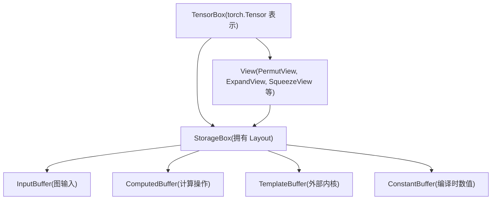
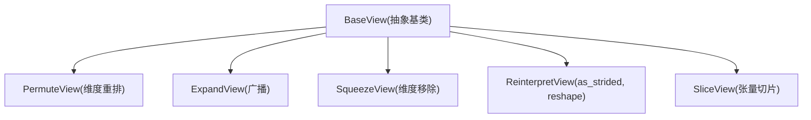
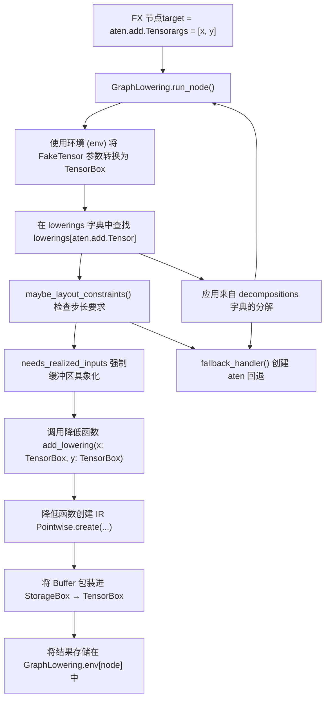

# Inductor IR 与降低 (Inductor IR and Lowering)

相关源文件 (Relevant source files)

-   [test/inductor/test\_aot\_inductor.py](https://github.com/pytorch/pytorch/blob/915982a4/test/inductor/test_aot_inductor.py)
-   [test/inductor/test\_combo\_kernels.py](https://github.com/pytorch/pytorch/blob/915982a4/test/inductor/test_combo_kernels.py)
-   [test/inductor/test\_custom\_op\_autotune.py](https://github.com/pytorch/pytorch/blob/915982a4/test/inductor/test_custom_op_autotune.py)
-   [test/inductor/test\_foreach.py](https://github.com/pytorch/pytorch/blob/915982a4/test/inductor/test_foreach.py)
-   [test/inductor/test\_max\_autotune.py](https://github.com/pytorch/pytorch/blob/915982a4/test/inductor/test_max_autotune.py)
-   [test/inductor/test\_mmdecomp.py](https://github.com/pytorch/pytorch/blob/915982a4/test/inductor/test_mmdecomp.py)
-   [test/inductor/test\_torchinductor.py](https://github.com/pytorch/pytorch/blob/915982a4/test/inductor/test_torchinductor.py)
-   [test/inductor/test\_torchinductor\_codegen\_dynamic\_shapes.py](https://github.com/pytorch/pytorch/blob/915982a4/test/inductor/test_torchinductor_codegen_dynamic_shapes.py)
-   [torch/\_inductor/autotune\_process.py](https://github.com/pytorch/pytorch/blob/915982a4/torch/_inductor/autotune_process.py)
-   [torch/\_inductor/choices.py](https://github.com/pytorch/pytorch/blob/915982a4/torch/_inductor/choices.py)
-   [torch/\_inductor/codegen/common.py](https://github.com/pytorch/pytorch/blob/915982a4/torch/_inductor/codegen/common.py)
-   [torch/\_inductor/codegen/cpp\_wrapper\_cpu.py](https://github.com/pytorch/pytorch/blob/915982a4/torch/_inductor/codegen/cpp_wrapper_cpu.py)
-   [torch/\_inductor/codegen/cpp\_wrapper\_cpu\_array\_ref.py](https://github.com/pytorch/pytorch/blob/915982a4/torch/_inductor/codegen/cpp_wrapper_cpu_array_ref.py)
-   [torch/\_inductor/codegen/simd.py](https://github.com/pytorch/pytorch/blob/915982a4/torch/_inductor/codegen/simd.py)
-   [torch/\_inductor/codegen/subgraph.py](https://github.com/pytorch/pytorch/blob/915982a4/torch/_inductor/codegen/subgraph.py)
-   [torch/\_inductor/codegen/triton.py](https://github.com/pytorch/pytorch/blob/915982a4/torch/_inductor/codegen/triton.py)
-   [torch/\_inductor/codegen/triton\_combo\_kernel.py](https://github.com/pytorch/pytorch/blob/915982a4/torch/_inductor/codegen/triton_combo_kernel.py)
-   [torch/\_inductor/codegen/wrapper.py](https://github.com/pytorch/pytorch/blob/915982a4/torch/_inductor/codegen/wrapper.py)
-   [torch/\_inductor/config.py](https://github.com/pytorch/pytorch/blob/915982a4/torch/_inductor/config.py)
-   [torch/\_inductor/decomposition.py](https://github.com/pytorch/pytorch/blob/915982a4/torch/_inductor/decomposition.py)
-   [torch/\_inductor/dtype\_propagation.py](https://github.com/pytorch/pytorch/blob/915982a4/torch/_inductor/dtype_propagation.py)
-   [torch/\_inductor/graph.py](https://github.com/pytorch/pytorch/blob/915982a4/torch/_inductor/graph.py)
-   [torch/\_inductor/ir.py](https://github.com/pytorch/pytorch/blob/915982a4/torch/_inductor/ir.py)
-   [torch/\_inductor/kernel/bmm.py](https://github.com/pytorch/pytorch/blob/915982a4/torch/_inductor/kernel/bmm.py)
-   [torch/\_inductor/kernel/conv.py](https://github.com/pytorch/pytorch/blob/915982a4/torch/_inductor/kernel/conv.py)
-   [torch/\_inductor/kernel/custom\_op.py](https://github.com/pytorch/pytorch/blob/915982a4/torch/_inductor/kernel/custom_op.py)
-   [torch/\_inductor/kernel/mm.py](https://github.com/pytorch/pytorch/blob/915982a4/torch/_inductor/kernel/mm.py)
-   [torch/\_inductor/kernel/mm\_plus\_mm.py](https://github.com/pytorch/pytorch/blob/915982a4/torch/_inductor/kernel/mm_plus_mm.py)
-   [torch/\_inductor/kernel\_inputs.py](https://github.com/pytorch/pytorch/blob/915982a4/torch/_inductor/kernel_inputs.py)
-   [torch/\_inductor/lowering.py](https://github.com/pytorch/pytorch/blob/915982a4/torch/_inductor/lowering.py)
-   [torch/\_inductor/memory.py](https://github.com/pytorch/pytorch/blob/915982a4/torch/_inductor/memory.py)
-   [torch/\_inductor/ops\_handler.py](https://github.com/pytorch/pytorch/blob/915982a4/torch/_inductor/ops_handler.py)
-   [torch/\_inductor/runtime/triton\_heuristics.py](https://github.com/pytorch/pytorch/blob/915982a4/torch/_inductor/runtime/triton_heuristics.py)
-   [torch/\_inductor/scheduler.py](https://github.com/pytorch/pytorch/blob/915982a4/torch/_inductor/scheduler.py)
-   [torch/\_inductor/select\_algorithm.py](https://github.com/pytorch/pytorch/blob/915982a4/torch/_inductor/select_algorithm.py)
-   [torch/\_inductor/shape\_propagation.py](https://github.com/pytorch/pytorch/blob/915982a4/torch/_inductor/shape_propagation.py)
-   [torch/\_inductor/template\_heuristics/triton.py](https://github.com/pytorch/pytorch/blob/915982a4/torch/_inductor/template_heuristics/triton.py)
-   [torch/\_inductor/utils.py](https://github.com/pytorch/pytorch/blob/915982a4/torch/_inductor/utils.py)
-   [torch/\_inductor/virtualized.py](https://github.com/pytorch/pytorch/blob/915982a4/torch/_inductor/virtualized.py)
-   [torch/csrc/inductor/cpp\_wrapper/common.h](https://github.com/pytorch/pytorch/blob/915982a4/torch/csrc/inductor/cpp_wrapper/common.h)

本页描述了 Inductor 的中间表示 (IR) 以及将 FX 图操作转换为此 IR 的降低 (lowering) 过程。IR 提供了张量操作的函数式、基于缓冲区的表示，从而能够进行优化和代码生成。

有关后续调度和融合阶段的信息，请参阅[调度与融合 (Scheduling and Fusion)](/pytorch/pytorch/2.4.2-autograd-caching)。有关从调度后的 IR 节点生成代码，请参阅[代码生成后端](#2.4.4)。

## 目的与范围 (Purpose and Scope)

Inductor IR 充当了 PyTorch 高层 FX 图表示与底层生成代码之间的桥梁。本页涵盖了：

-   **IR 结构**：核心类（`TensorBox`、`Buffer`、`View`、`StorageBox`）及其关系。
-   **Buffer 类型**：不同的缓冲区类别（输入、计算得出、模板）及其用途。
-   **降低过程 (Lowering Process)**：来自 FX 图的 ATen 操作如何转换为 IR 节点。
-   **操作类型**：IR 中的逐元素 (Pointwise) 操作、归约 (Reduction) 操作及其他计算模式。

IR 设计遵循函数式编程模型，其中变异 (mutation) 通过缓冲区重新分配来处理，从而在保持正确性的同时实现激进的优化。

## IR 类层级结构 (IR Class Hierarchy)

IR 区分了张量（可能是视图）和存储（拥有内存）。这种分离模拟了 PyTorch 的语义，即多个张量视图可以共享底层存储。

### 核心 IR 结构 (Core IR Structure)


**所有权模型：**

-   直接存储：`TensorBox → StorageBox → Buffer`
-   视图链：`TensorBox → View → StorageBox → Buffer`
-   视图与其基础张量共享底层的 `StorageBox`

来源： [torch/\_inductor/ir.py154-193](https://github.com/pytorch/pytorch/blob/915982a4/torch/_inductor/ir.py#L154-L193)

### TensorBox：顶层表示 (TensorBox: Top-Level Representation)

`TensorBox` 是降低操作返回的主要 IR 类型。它代表一个 `torch.Tensor`，可以指向 `View` 或直接指向 `StorageBox`。

`TensorBox` 类提供了访问张量属性的统一接口：

-   `get_size()`：以 `list[sympy.Expr]` 形式返回符号形状表达式
-   `get_stride()`：返回符号步长表达式
-   `get_device()`：返回设备 (`torch.device`)
-   `get_dtype()`：返回数据类型 (`torch.dtype`)
-   `realize()`：通过强制缓冲区分配来具象化 (materialize) 任何待处理的变异
-   `make_loader()`：创建一个函数，用于加载给定索引处的数值

该包装器允许操作以统一的方式进行，无论底层表示是视图还是直接存储。`TensorBox.data` 属性持有 `StorageBox` 或 `View` 实例。

来源： [torch/\_inductor/ir.py4508-4700](https://github.com/pytorch/pytorch/blob/915982a4/torch/_inductor/ir.py#L4508-L4700)

### Buffer 类型 (Buffer Types)

Buffers 代表实际的内存分配和计算：

| Buffer 类型 | 目的 | 创建点 | 基类 |
| --- | --- | --- | --- |
| `InputBuffer` | 图输入和参数 | 在 `GraphLowering.graph_input()` 中为每个 FX 图输入创建 | `Buffer` |
| `ComputedBuffer` | 逐元素/归约操作的结果 | 在降低期间通过 `Pointwise.create()` 或 `Reduction.create()` 创建 | `Buffer` |
| `TemplateBuffer` | 外部内核 (cuBLAS, ATen 回退) | 为没有 inductor 降低实现的操作创建 | `Buffer` |
| `ConstantBuffer` | 编译时常量张量 | 为 `torch.tensor()` 面值创建 | `Buffer` |
| `ShapeAsConstantBuffer` | 具象化为张量的形状/步长值 | 当形状需要作为张量参数传递时创建 | `Buffer` |

每种 Buffer 类型管理：

-   **Layout**：定义大小、步长、设备、数据类型和偏移量的 `Layout` 对象
-   **依赖项**：通过 `reads` 和 `writes` 属性（使用 `MemoryDep` 对象）进行追踪
-   **名称分配**：通过 `V.graph.register_buffer()` 生成唯一的缓冲区名称

基类 `Buffer` 定义了常用操作，如 `get_name()`、`get_device()`、`get_dtype()`、`get_size()`、`get_stride()` 和 `get_layout()`。

来源： [torch/\_inductor/ir.py1700-2500](https://github.com/pytorch/pytorch/blob/915982a4/torch/_inductor/ir.py#L1700-L2500) [torch/\_inductor/graph.py600-800](https://github.com/pytorch/pytorch/blob/915982a4/torch/_inductor/graph.py#L600-L800)

### View 类型 (View Types)

视图操作在不拷贝数据的情况下修改张量元数据。所有视图都继承自 `BaseView`：

**View 类层级结构**


**视图链接 (View Chaining)**：诸如 `t.transpose(0,1).expand(...)` 之类的操作会创建一个链：`TensorBox → PermuteView → ExpandView → StorageBox`。

每种视图类型必须重写：

-   `get_size()`：通过视图操作变换大小
-   `get_stride()`：通过视图操作变换步长
-   `make_loader()`：生成应用逆视图变换的索引表达式
-   `make_indexer()`：创建一个考虑视图的索引函数

例如，`PermuteView.make_loader()` 在将索引元组传递给底层加载器之前对其进行排列，而 `ExpandView.make_loader()` 将广播的维度钳位 (clamping) 到索引 0。

来源： [torch/\_inductor/ir.py3600-4300](https://github.com/pytorch/pytorch/blob/915982a4/torch/_inductor/ir.py#L3600-L4300)

## 操作 IR 节点 (Operation IR Nodes)

操作由 IR 节点表示，这些节点根据输入计算输出。主要的操作类别包括：

### 逐元素操作 (Pointwise Operations)

`Pointwise` 节点代表元素级操作，其中输出元素被独立计算：

```python
# 加法的降低示例，创建了一个 Pointwise 节点
def add_lowering(x, y):    
    x, y = promote_constants([x, y])    
    return Pointwise.create(        
        device=x.get_device(),        
        dtype=get_promoted_dtype(x, y),        
        inner_fn=lambda index: ops.add(            
            x.make_loader()(index),             
            y.make_loader()(index)        
        ),        
        ranges=x.get_size(),    
    )
```
**关键 `Pointwise` 属性：**

-   `inner_fn`：Lambda `(index: List[sympy.Expr]) -> OpsValue`，用于计算每个索引处的值
-   `ranges`：定义迭代空间（输出大小）的符号表达式列表
-   `origin_node`：创建该操作的 FX 节点（用于调试）
-   可以被调度器与相邻的逐元素操作融合

`Pointwise.create()` 工厂方法创建了一个包装逐元素计算的 `ComputedBuffer`，并将其返回在 `TensorBox` 中。

### 归约操作 (Reduction Operations)

`Reduction` 节点代表在一个或多个维度上进行归约的操作：

```python
# 示例：求和 (sum) 归约
Reduction.create(    
    device=x.get_device(),    
    dtype=x.get_dtype(),    
    inner_fn=lambda index, rindex: x.make_loader()(index + (rindex,)),    
    ranges=output_size,    
    reduction_ranges=reduced_dims,    
    reduction_type="sum",
)
```
**关键 `Reduction` 属性：**

-   `reduction_ranges`：将归约维度符号映射到其范围的字典
-   `reduction_type`：字符串标识符（"sum"、"max"、"min"、"argmax"、"argmin"、"any"、"prod"、"xor\_sum"）
-   `inner_fn`：同时接收输出索引和归约索引的 Lambda `(index, rindex) -> OpsValue`
-   `src_dtype`：归约前的源数据类型（可能与输出数据类型不同）

归约可以是**持久化的 (persistent)**（在单个内核中完成整个归约）或**非持久化的 (non-persistent)**（拆分为多个内核）。调度器根据归约大小和可用资源做出决定。

来源： [torch/\_inductor/ir.py2600-3200](https://github.com/pytorch/pytorch/blob/915982a4/torch/_inductor/ir.py#L2600-L3200) [torch/\_inductor/ops\_handler.py80-120](https://github.com/pytorch/pytorch/blob/915982a4/torch/_inductor/ops_handler.py#L80-L120)

## 降低过程 (Lowering Process)

降低过程将 FX 图节点（调用 ATen 操作）转换为 Inductor IR 节点。这发生在 [torch/\_inductor/graph.py800-1000](https://github.com/pytorch/pytorch/blob/915982a4/torch/_inductor/graph.py#L800-L1000) 的 `GraphLowering.run_node()` 中。

### 降低流程 (Lowering Flow)

**GraphLowering 中的降低过程**


`GraphLowering.run_node()` 方法编排了这一过程，维护了将 FX 节点映射到其 IR 表示（TensorBox 实例）的 `env` 字典。

来源： [torch/\_inductor/graph.py900-1100](https://github.com/pytorch/pytorch/blob/915982a4/torch/_inductor/graph.py#L900-L1100) [torch/\_inductor/lowering.py1-200](https://github.com/pytorch/pytorch/blob/915982a4/torch/_inductor/lowering.py#L1-L200)

### 降低注册系统 (Lowering Registration System)

操作在 `lowerings` 字典中注册：

```python
# 来自 torch/_inductor/lowering.py
lowerings: dict[Union[Callable, str], Callable] = {}

# 注册装饰器
@register_lowering(torch.ops.aten.add)
def add_lowering(x: TensorBox, y: TensorBox) -> TensorBox:    
    # 实现返回包装了 IR 节点的 TensorBox    
    ...

# 也可以注册多个重载
@register_lowering([aten.add.Tensor, aten.add.Scalar])
def add_lowering(...):    
    ...
```
注册系统支持多种策略：

**1. 直接降低 (Direct Lowering)**：映射 `OpOverload` → 降低函数

-   函数签名必须匹配操作参数
-   返回值必须是 `TensorBox` 或 `TensorBox` 的元组
-   示例：`add`、`mul`、`relu`、`max_pool2d`

**2. 分解 (Decomposition)**：在 `decompositions` 字典中注册，以将复杂操作拆分为原语操作

-   在降低查找之前应用
-   递归分解直到所有操作都有对应的降低实现
-   示例：`gelu`、`layer_norm`、`softmax`

**3. 回退 (Fallback)**：没有对应降低实现或分解的操作

-   `fallback_handler()` 创建调用 ATen 的 `ExternKernel`
-   阻止融合但保持正确性
-   用于不支持的操作

`get_overloads()` 函数会自动注册 `OpOverloadPacket` 的所有重载。

来源： [torch/\_inductor/lowering.py114-350](https://github.com/pytorch/pytorch/blob/915982a4/torch/_inductor/lowering.py#L114-L350) [torch/\_inductor/graph.py1000-1200](https://github.com/pytorch/pytorch/blob/915982a4/torch/_inductor/graph.py#L1000-L1200)

### 布局约束 (Layout Constraints)

某些操作需要特定的内存布局以确保正确性或性能。`maybe_layout_constraints()` 函数检查操作是否具有布局要求。

**约束类型与执行 (Constraint Types and Enforcement)**

| 约束类型 | 目的 | 何时应用 | 示例操作 |
| --- | --- | --- | --- |
| `needs_fixed_stride_order` | 保留输入步长顺序 | 对步长顺序敏感的操作 | `aten.as_strided`、视图操作 |
| `needs_contiguous_strides` | 要求连续布局 | 性能关键型内核 | `aten.convolution`、`aten.mm` |
| `needs_exact_strides` | 匹配 eager 模式精确步长 | 具有严格布局语义的操作 | ATen 回退操作 |
| `flexible_layout` | 无约束 | 大多数操作 | 逐元素操作、归约 |

**约束函数**：

-   `constrain_to_fx_strides()`：强制缓冲区匹配来自 FX 图的步长顺序
-   `constrain_to_fake_tensors()`：匹配来自 fake tensor 元数据的精确步长
-   `require_contiguous()`：强制 C-连续布局

这些约束通过以下方式定义：

1.  **基于标签**：操作上的 `torch._C.Tag` 注解（例如 `needs_fixed_stride_order` 标签）。
2.  **显式注册**：`add_layout_constraint()` 函数。
3.  **自定义约束函数**：映射在 `_maybe_layout_constraints` 字典中。

当无法满足约束时，缓冲区会在操作之前被**具象化 (realized)**（具象化为一个新的连续缓冲区）。

来源： [torch/\_inductor/lowering.py170-231](https://github.com/pytorch/pytorch/blob/915982a4/torch/_inductor/lowering.py#L170-L231) [torch/\_inductor/graph.py1150-1250](https://github.com/pytorch/pytorch/blob/915982a4/torch/_inductor/graph.py#L1150-L1250)

## 示例：降低加法操作 (Example: Lowering Addition)

以下是降低 `torch.add(x, y)` 的完整流程：

### 第 1 步：FX 节点进入 (Step 1: FX Node Entry)

> **[Mermaid sequence]**
> *(图表结构无法解析)*

### 第 2 步：降低实现 (Step 2: Lowering Implementation)

加法的降低处理了类型提升 (type promotion) 和标量广播：

```python
# 来自 torch/_inductor/lowering.py
@register_lowering(aten.add)
def add(x, y, *, alpha=1):    
    # 处理标量乘法因子    
    if alpha != 1:        
        y = mul(y, alpha)        
    # 将常量（Python 标量）提升为张量 IR    
    x, y = promote_constants(        
        [x, y],         
        type_promotion_kind=ELEMENTWISE_TYPE_PROMOTION_KIND.DEFAULT    
    )        
    # 获取针对混合精度输入的提升后数据类型（例如 float32 + float16）    
    dtype = get_promoted_dtype(        
        x, y,         
        type_promotion_kind=ELEMENTWISE_TYPE_PROMOTION_KIND.DEFAULT    
    )        
    # 创建 Pointwise IR 节点    
    return Pointwise.create(        
        device=x.get_device(),        
        dtype=dtype,        
        inner_fn=lambda idx: ops.add(            
            x.make_loader()(idx),            
            y.make_loader()(idx)        
        ),        
        ranges=list(x.get_size()),    
    )
```
**关键工具函数：**

-   `promote_constants()`：将 Python 标量转换为 IR 常量。
-   `get_promoted_dtype()`：实现 PyTorch 类型提升规则。
-   `ops.add()`：创建一个代表加法操作的 `OpsValue`。

### 第 3 步：IR 节点创建 (Step 3: IR Node Creation)

`Pointwise.create()` 工厂方法执行以下步骤：

1.  **创建 LoopBody**：从 `inner_fn` 和 `ranges` 构造一个 `LoopBody` 对象。
    -   分析索引表达式以确定缓冲区读取。
    -   提取对输入缓冲区的依赖关系。
2.  **创建 ComputedBuffer**：使用以下内容实例化缓冲区：
    -   `Layout`：从 `device`、`dtype` 和 `ranges`（输出形状）创建。
    -   `make_loader()`：在每个索引处计算 `inner_fn` 的函数。
    -   `get_read_writes()`：返回对输入（x 和 y 缓冲区）的依赖关系。
3.  **包装在 StorageBox 和 TensorBox 中**：
    ```python
    buffer = ComputedBuffer(...)
    storage = StorageBox(buffer)
    return TensorBox(storage)
    ```
4.  **在图中注册**：将缓冲区添加到 `V.graph.buffers` 以进行调度。

生成的 `TensorBox` 可以：

-   用作其他操作的输入。
-   被调度器与相邻的逐元素操作融合。
-   在代码生成期间具象化为可执行代码。

来源： [torch/\_inductor/lowering.py500-600](https://github.com/pytorch/pytorch/blob/915982a4/torch/_inductor/lowering.py#L500-L600) [torch/\_inductor/ir.py2650-2850](https://github.com/pytorch/pytorch/blob/915982a4/torch/_inductor/ir.py#L2650-L2850)

## 分解 (Decompositions)

许多操作是通过**分解**而不是直接降低来处理的。分解将复杂操作拆分为一系列具有直接降低实现的更简单的原语操作。

### 分解注册表 (Decomposition Registry)

`decompositions` 字典结合了：

-   **核心 ATen 分解**：来自 `torch._decomp.core_aten_decompositions()`。
-   **Inductor 特有分解**：来自 `inductor_decompositions` 字典。

```python
# 来自 torch/_inductor/decomposition.py
decompositions = {    
    **core_aten_decompositions(),     
    **inductor_decompositions
}

# 注册分解
@register_decomposition(aten.gelu)
def gelu_decomposition(x, approximate="none"):    
    if approximate == "tanh":        
        # 使用 tanh 的近似 GELU        
        return 0.5 * x * (1.0 + torch.tanh(            
            math.sqrt(2.0 / math.pi) * (x + 0.044715 * x ** 3)        
        ))    
    else:        
        # 使用 erf 的精确 GELU        
        return x * 0.5 * (1.0 + torch.erf(x / math.sqrt(2.0)))
```
### 分解流程 (Decomposition Flow)

当 `GraphLowering` 遇到一个操作时：

1.  **首先检查分解**：如果 `op in decompositions`，则应用分解。
2.  **递归降低**：分解出的每个原语操作都被降低。
3.  **融合机会**：分解后的操作可以在调度器中融合在一起。

`gelu(x)` 的示例分解链：

```
gelu(x)
  → 0.5 * x * (1.0 + erf(x / sqrt(2)))
  → mul(mul(0.5, x), add(1.0, erf(div(x, sqrt(2)))))
  → mul, add, erf, div 的 Pointwise 节点
  → 被调度器融合成单个内核
```
**分解的好处：**

-   **复用降低实现**：复杂算子共享原语算子的实现。
-   **优化机会**：调度器可以融合分解后的操作。
-   **可维护性**：更容易为新操作添加支持。

某些操作更倾向于**直接降低**而不是分解，原因包括：

-   性能关键型操作（例如带有专门内核的 `layer_norm`）。
-   具有外部库支持的操作（例如使用 cuDNN 的 `conv2d`）。
-   分解效率不高的操作。

来源： [torch/\_inductor/decomposition.py64-150](https://github.com/pytorch/pytorch/blob/915982a4/torch/_inductor/decomposition.py#L64-L150) [torch/\_inductor/graph.py1100-1200](https://github.com/pytorch/pytorch/blob/915982a4/torch/_inductor/graph.py#L1100-L1200)

## 变异处理 (Mutation Handling)

Inductor IR 遵循**函数式编程模型** —— 变异通过缓冲区重新分配来处理，而不是就地修改。

### 变异降低策略 (Mutation Lowering Strategy)

```
# 变异示例: x.add_(y)
# 降低过程创建:
# 1. 计算 x + y 的新 ComputedBuffer
# 2. 标记变异的 MutationOutput 节点
# 3. 更新 x 的 StorageBox 指向新缓冲区
# 4. 旧缓冲区被标记为可能释放
```
**变异处理的关键类：**

-   **`MutationOutput`**：将缓冲区标记为变异结果的包装器。
    -   追踪被变异的缓冲区名称。
    -   确保变异按正确顺序调度。
    -   由就地操作（以 `_` 结尾的操作）的降低实现生成。
-   **`MutableBox`**：允许更新 `data` 指针的 `TensorBox` 包装器。
    -   用于可能被变异的图输出。
    -   允许在不改变包装器引用的情况下交换底层缓冲区。
-   **`InputsKernel`**：针对图输入/输出的特殊操作类型。
    -   处理对输入的变异（例如参数更新）。
    -   管理输入和输出之间的别名。

**追踪变异：**

-   `V.graph.mutated_buffers`：已变异的缓冲区名称集合。
-   `V.graph.mutation_real_name`：将变异名称映射到原始缓冲区名称。
-   依赖项通过 `MutationDep` 边追踪变异顺序。

### 函数式方法的好处 (Benefits of Functional Approach)

这种函数式方法启用了几项优化：

1.  **激进融合**：由于每个缓冲区只有单一的定义，因此无需担心别名问题。
2.  **内存规划**：当缓冲区不再活跃时，可以安全地复用其存储空间。
3.  **正确性**：通过依赖关系追踪保留了变异语义。
4.  **优化自由度**：可以在没有变异风险的情况下对非依赖操作进行重排序。

### 示例：就地加法 (Example: In-Place Addition)

```python
# x.add_(y) 的降低实现:
@register_lowering(aten.add_)
def add_(x, y):    
    # 创建函数式加法    
    result = add(x, y)        
    # 标记为对 x 的变异    
    result = MutationOutput(        
        layout=result.get_layout(),        
        inputs=[result],        
        mutated_name=x.get_name(),    
    )        
    # 更新图追踪    
    V.graph.mutated_buffers.add(x.get_name())        
    return result
```
调度器确保变异在正确的时间点被应用，如果不再有其他操作依赖旧缓冲区，则将其释放。

来源： [torch/\_inductor/ir.py4100-4300](https://github.com/pytorch/pytorch/blob/915982a4/torch/_inductor/ir.py#L4100-L4300) [torch/\_inductor/lowering.py800-900](https://github.com/pytorch/pytorch/blob/915982a4/torch/_inductor/lowering.py#L800-L900)

## 总结：关键组件 (Summary: Key Components)

| 组件 | 文件 | 目的 |
| --- | --- | --- |
| `TensorBox` | [torch/\_inductor/ir.py4508-4595](https://github.com/pytorch/pytorch/blob/915982a4/torch/_inductor/ir.py#L4508-L4595) | 顶层 IR 张量表示 |
| `StorageBox` | [torch/\_inductor/ir.py4400-4500](https://github.com/pytorch/pytorch/blob/915982a4/torch/_inductor/ir.py#L4400-L4500) | 管理缓冲区和布局 |
| `ComputedBuffer` | [torch/\_inductor/ir.py2000-2200](https://github.com/pytorch/pytorch/blob/915982a4/torch/_inductor/ir.py#L2000-L2200) | 存储计算定义 |
| `Pointwise` | [torch/\_inductor/ir.py2600-2800](https://github.com/pytorch/pytorch/blob/915982a4/torch/_inductor/ir.py#L2600-L2800) | 逐元素操作 |
| `Reduction` | [torch/\_inductor/ir.py2900-3100](https://github.com/pytorch/pytorch/blob/915982a4/torch/_inductor/ir.py#L2900-L3100) | 归约操作 |
| `lowerings` 字典 | [torch/\_inductor/lowering.py114](https://github.com/pytorch/pytorch/blob/915982a4/torch/_inductor/lowering.py#L114-L114) | 映射算子到降低函数 |
| `GraphLowering.run_node()` | [torch/\_inductor/graph.py800-1000](https://github.com/pytorch/pytorch/blob/915982a4/torch/_inductor/graph.py#L800-L1000) | 编排降低过程 |

IR 使 Inductor 能够：

1.  **分析**操作以寻求融合机会。
2.  将高层操作**转换**为可优化的原语。
3.  **推迟**关于内存布局和计算顺序的决策。
4.  通过后续的调度和代码生成阶段**生成**高效代码。

有关这些 IR 节点如何被调度和融合的详情，请参阅[调度与融合 (Scheduling and Fusion)](/pytorch/pytorch/2.4.2-autograd-caching)。
