# 调度与融合 (Scheduling and Fusion)

相关源文件 (Relevant source files)

-   [test/inductor/test\_aot\_inductor.py](https://github.com/pytorch/pytorch/blob/915982a4/test/inductor/test_aot_inductor.py)
-   [test/inductor/test\_combo\_kernels.py](https://github.com/pytorch/pytorch/blob/915982a4/test/inductor/test_combo_kernels.py)
-   [test/inductor/test\_custom\_op\_autotune.py](https://github.com/pytorch/pytorch/blob/915982a4/test/inductor/test_custom_op_autotune.py)
-   [test/inductor/test\_foreach.py](https://github.com/pytorch/pytorch/blob/915982a4/test/inductor/test_foreach.py)
-   [test/inductor/test\_max\_autotune.py](https://github.com/pytorch/pytorch/blob/915982a4/test/inductor/test_max_autotune.py)
-   [test/inductor/test\_mmdecomp.py](https://github.com/pytorch/pytorch/blob/915982a4/test/inductor/test_mmdecomp.py)
-   [test/inductor/test\_torchinductor.py](https://github.com/pytorch/pytorch/blob/915982a4/test/inductor/test_torchinductor.py)
-   [test/inductor/test\_torchinductor\_codegen\_dynamic\_shapes.py](https://github.com/pytorch/pytorch/blob/915982a4/test/inductor/test_torchinductor_codegen_dynamic_shapes.py)
-   [torch/\_inductor/autotune\_process.py](https://github.com/pytorch/pytorch/blob/915982a4/torch/_inductor/autotune_process.py)
-   [torch/\_inductor/choices.py](https://github.com/pytorch/pytorch/blob/915982a4/torch/_inductor/choices.py)
-   [torch/\_inductor/codegen/common.py](https://github.com/pytorch/pytorch/blob/915982a4/torch/_inductor/codegen/common.py)
-   [torch/\_inductor/codegen/cpp\_wrapper\_cpu.py](https://github.com/pytorch/pytorch/blob/915982a4/torch/_inductor/codegen/cpp_wrapper_cpu.py)
-   [torch/\_inductor/codegen/cpp\_wrapper\_cpu\_array\_ref.py](https://github.com/pytorch/pytorch/blob/915982a4/torch/_inductor/codegen/cpp_wrapper_cpu_array_ref.py)
-   [torch/\_inductor/codegen/simd.py](https://github.com/pytorch/pytorch/blob/915982a4/torch/_inductor/codegen/simd.py)
-   [torch/\_inductor/codegen/subgraph.py](https://github.com/pytorch/pytorch/blob/915982a4/torch/_inductor/codegen/subgraph.py)
-   [torch/\_inductor/codegen/triton.py](https://github.com/pytorch/pytorch/blob/915982a4/torch/_inductor/codegen/triton.py)
-   [torch/\_inductor/codegen/triton\_combo\_kernel.py](https://github.com/pytorch/pytorch/blob/915982a4/torch/_inductor/codegen/triton_combo_kernel.py)
-   [torch/\_inductor/codegen/wrapper.py](https://github.com/pytorch/pytorch/blob/915982a4/torch/_inductor/codegen/wrapper.py)
-   [torch/\_inductor/config.py](https://github.com/pytorch/pytorch/blob/915982a4/torch/_inductor/config.py)
-   [torch/\_inductor/decomposition.py](https://github.com/pytorch/pytorch/blob/915982a4/torch/_inductor/decomposition.py)
-   [torch/\_inductor/dtype\_propagation.py](https://github.com/pytorch/pytorch/blob/915982a4/torch/_inductor/dtype_propagation.py)
-   [torch/\_inductor/graph.py](https://github.com/pytorch/pytorch/blob/915982a4/torch/_inductor/graph.py)
-   [torch/\_inductor/ir.py](https://github.com/pytorch/pytorch/blob/915982a4/torch/_inductor/ir.py)
-   [torch/\_inductor/kernel/bmm.py](https://github.com/pytorch/pytorch/blob/915982a4/torch/_inductor/kernel/bmm.py)
-   [torch/\_inductor/kernel/conv.py](https://github.com/pytorch/pytorch/blob/915982a4/torch/_inductor/kernel/conv.py)
-   [torch/\_inductor/kernel/custom\_op.py](https://github.com/pytorch/pytorch/blob/915982a4/torch/_inductor/kernel/custom_op.py)
-   [torch/\_inductor/kernel/mm.py](https://github.com/pytorch/pytorch/blob/915982a4/torch/_inductor/kernel/mm.py)
-   [torch/\_inductor/kernel/mm\_plus\_mm.py](https://github.com/pytorch/pytorch/blob/915982a4/torch/_inductor/kernel/mm_plus_mm.py)
-   [torch/\_inductor/kernel\_inputs.py](https://github.com/pytorch/pytorch/blob/915982a4/torch/_inductor/kernel_inputs.py)
-   [torch/\_inductor/lowering.py](https://github.com/pytorch/pytorch/blob/915982a4/torch/_inductor/lowering.py)
-   [torch/\_inductor/memory.py](https://github.com/pytorch/pytorch/blob/915982a4/torch/_inductor/memory.py)
-   [torch/\_inductor/ops\_handler.py](https://github.com/pytorch/pytorch/blob/915982a4/torch/_inductor/ops_handler.py)
-   [torch/\_inductor/runtime/triton\_heuristics.py](https://github.com/pytorch/pytorch/blob/915982a4/torch/_inductor/runtime/triton_heuristics.py)
-   [torch/\_inductor/scheduler.py](https://github.com/pytorch/pytorch/blob/915982a4/torch/_inductor/scheduler.py)
-   [torch/\_inductor/select\_algorithm.py](https://github.com/pytorch/pytorch/blob/915982a4/torch/_inductor/select_algorithm.py)
-   [torch/\_inductor/shape\_propagation.py](https://github.com/pytorch/pytorch/blob/915982a4/torch/_inductor/shape_propagation.py)
-   [torch/\_inductor/template\_heuristics/triton.py](https://github.com/pytorch/pytorch/blob/915982a4/torch/_inductor/template_heuristics/triton.py)
-   [torch/\_inductor/utils.py](https://github.com/pytorch/pytorch/blob/915982a4/torch/_inductor/utils.py)
-   [torch/\_inductor/virtualized.py](https://github.com/pytorch/pytorch/blob/915982a4/torch/_inductor/virtualized.py)
-   [torch/csrc/inductor/cpp\_wrapper/common.h](https://github.com/pytorch/pytorch/blob/915982a4/torch/csrc/inductor/cpp_wrapper/common.h)

## 目的与范围 (Purpose and Scope)

本文档描述了 TorchInductor 的调度与融合子系统，该系统分析 Inductor IR 中各操作之间的依赖关系，并将兼容的操作融合进高效的内核中。调度器决定操作的执行顺序，并将其分组成融合内核，以最小化内存流量并最大化 GPU/CPU 利用率。

有关作为调度器输入的 Inductor IR 信息，请参阅 [Inductor IR 与降低 (Inductor IR and Lowering)](/pytorch/pytorch/2.5.1-inductor-ir-and-lowering)。有关融合后如何选择具体内核实现的信息，请参阅[内核选择与自动调优 (Kernel Selection and Autotuning)](/pytorch/pytorch/2.5.3-kernel-selection-and-autotuning)。

## 概览 (Overview)

在 TorchInductor 流水线中，调度器位于 IR 降低和代码生成之间。它接收 Inductor IR 格式的缓冲区操作图，分析数据依赖项，并产生一系列融合后的内核，这些内核将被生成为 Triton、C++ 或其他后端代码。

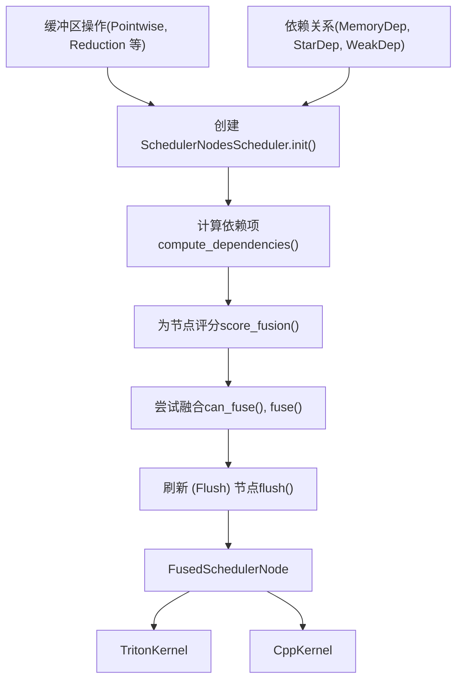
**来源：** [torch/\_inductor/scheduler.py1-100](https://github.com/pytorch/pytorch/blob/915982a4/torch/_inductor/scheduler.py#L1-L100) [torch/\_inductor/codegen/triton.py1-100](https://github.com/pytorch/pytorch/blob/915982a4/torch/_inductor/codegen/triton.py#L1-L100)

## 调度器架构 (Scheduler Architecture)

调度器主要在 `Scheduler` 类中实现，该类维护全局调度状态并编排融合过程。

### 核心类 (Core Classes)

| 类 | 文件 | 目的 |
| --- | --- | --- |
| `Scheduler` | scheduler.py | 编排融合与排序的主调度器 |
| `BaseSchedulerNode` | scheduler.py | 所有调度器节点的基类 |
| `SchedulerNode` | scheduler.py | 代表单个缓冲区操作 |
| `FusedSchedulerNode` | scheduler.py | 代表多个融合后的操作 |
| `ExternKernelSchedulerNode` | scheduler.py | 代表对外部内核的调用 |
| `NopKernelSchedulerNode` | scheduler.py | 代表空操作 (no-op) |

### 调度器状态 (Scheduler State)

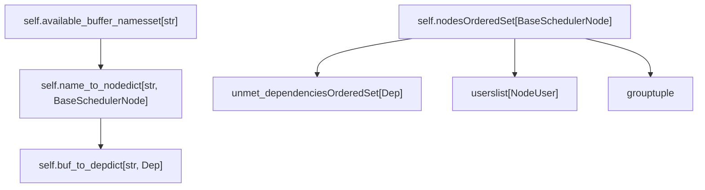
**来源：** [torch/\_inductor/scheduler.py1000-1200](https://github.com/pytorch/pytorch/blob/915982a4/torch/_inductor/scheduler.py#L1000-L1200) [torch/\_inductor/scheduler.py269-500](https://github.com/pytorch/pytorch/blob/915982a4/torch/_inductor/scheduler.py#L269-L500)

## 节点类型与表示 (Node Types and Representation)

Inductor IR 中的每个操作都被包装在 `SchedulerNode` 中，用于追踪其依赖项、使用者 (users) 和融合兼容性。

### SchedulerNode 结构 (SchedulerNode Structure)

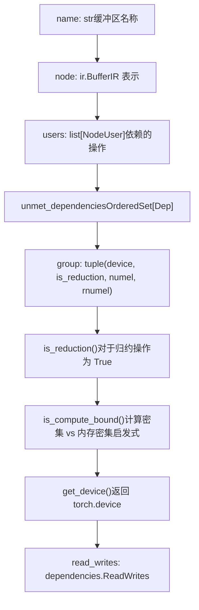
**来源：** [torch/\_inductor/scheduler.py500-700](https://github.com/pytorch/pytorch/blob/915982a4/torch/_inductor/scheduler.py#L500-L700)

### FusedSchedulerNode

当节点被融合时，它们被包装在 `FusedSchedulerNode` 中，该节点管理组合后的操作：

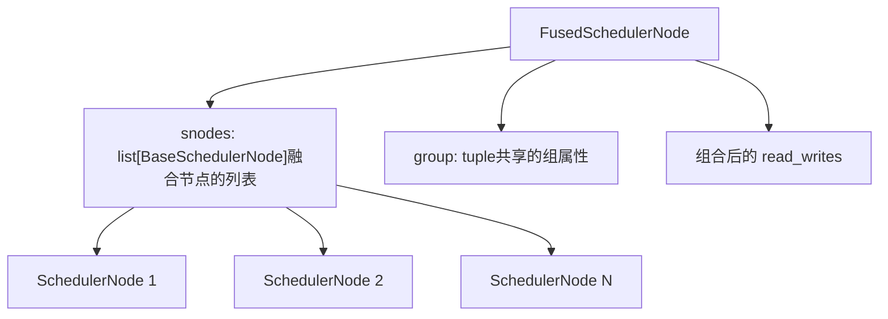
**来源：** [torch/\_inductor/scheduler.py800-900](https://github.com/pytorch/pytorch/blob/915982a4/torch/_inductor/scheduler.py#L800-L900)

## 依赖分析 (Dependency Analysis)

调度器执行依赖分析以确定有效的融合机会和执行顺序。依赖关系由 `Dep` 类层级结构表示。

### 依赖类型 (Dependency Types)

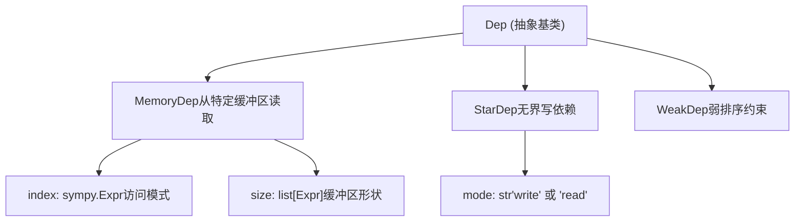
### 依赖计算 (Dependency Computation)

`compute_dependencies()` 方法分析每个节点以确定：

1.  它从哪些缓冲区读取（`reads` 依赖项）
2.  它写入哪些缓冲区 (`writes`)
3.  它是否具有无界依赖项 (`StarDep`)

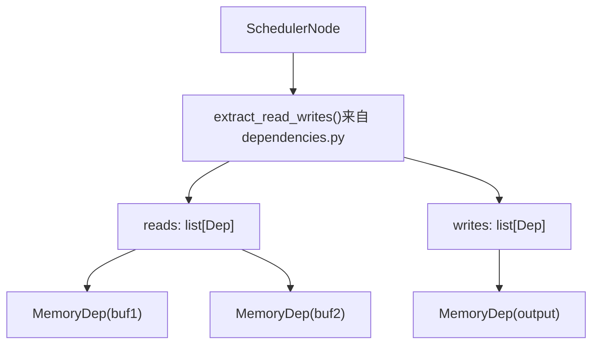
**来源：** [torch/\_inductor/scheduler.py1400-1600](https://github.com/pytorch/pytorch/blob/915982a4/torch/_inductor/scheduler.py#L1400-L1600) [torch/\_inductor/dependencies.py1-200](https://github.com/pytorch/pytorch/blob/915982a4/torch/_inductor/dependencies.py#L1-L200)

## 融合策略 (Fusion Strategy)

调度器尝试融合操作以减少内存流量和内核启动开销。融合决策基于兼容性检查、性能启发式方法和内存约束。

### 融合决策流 (Fusion Decision Flow)

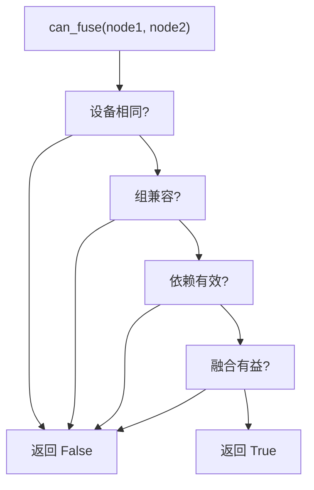
### 融合兼容性检查 (Fusion Compatibility Checks)

`can_fuse()` 方法执行几项检查：

| 检查项 | 实现方式 | 目的 |
| --- | --- | --- |
| 设备兼容性 | `node1.get_device() == node2.get_device()` | 仅融合同一设备上的操作 |
| 组兼容性 | `node1.group == node2.group` | 匹配归约维度和大小 |
| 依赖有效性 | 检查是否存在循环依赖 | 确保执行顺序有效 |
| 模板兼容性 | `node.is_template()` 检查 | 特殊处理基于模板的操作 |
| 内存约束 | 检查缓冲区大小和生命周期 | 避免过度使用内存 |

**来源：** [torch/\_inductor/scheduler.py2000-2300](https://github.com/pytorch/pytorch/blob/915982a4/torch/_inductor/scheduler.py#L2000-L2300)

## 融合类型 (Fusion Types)

TorchInductor 支持多种类型的融合，每种类型针对不同的操作模式进行优化。

### 逐元素融合 (Pointwise Fusion)

融合操作于相同形状的元素级操作：

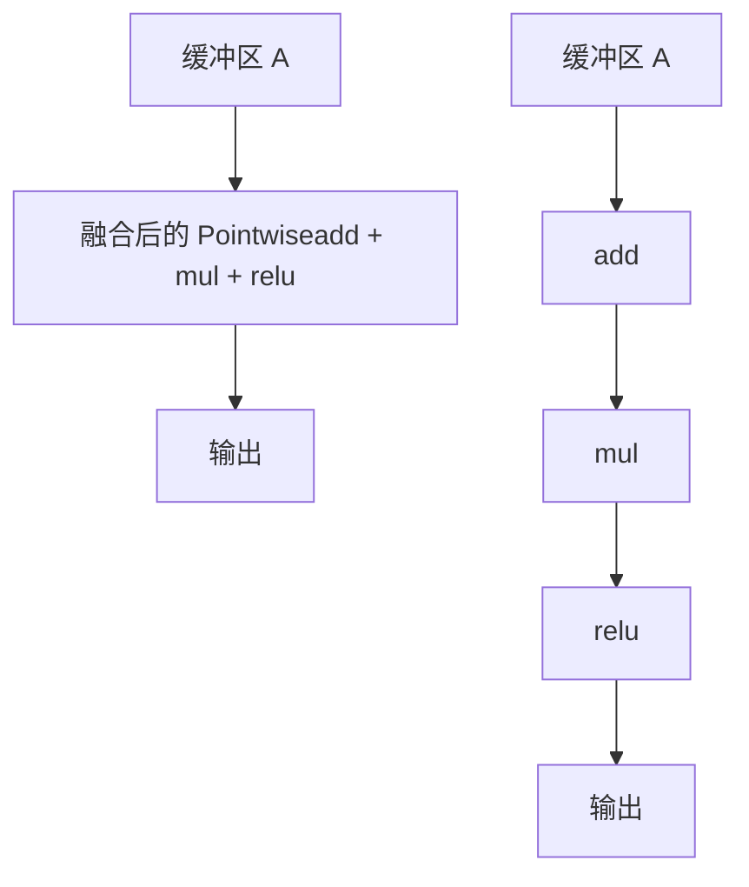
**实现：** [torch/\_inductor/scheduler.py2100-2200](https://github.com/pytorch/pytorch/blob/915982a4/torch/_inductor/scheduler.py#L2100-L2200)

### 归约融合 (Reduction Fusion)

融合具有相同归约维度的操作：

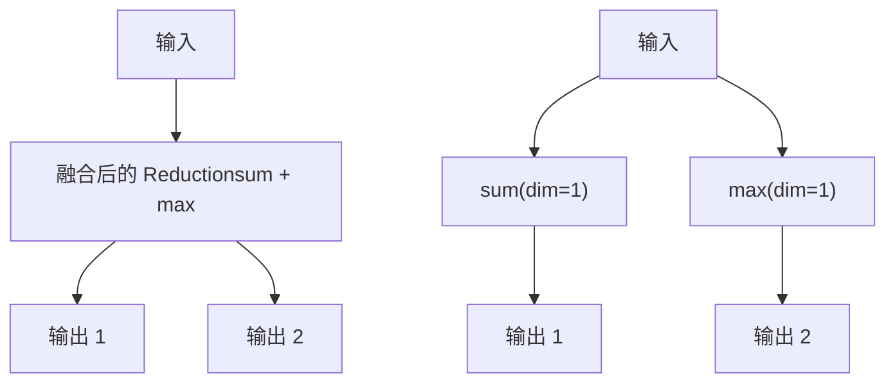
**实现：** [torch/\_inductor/scheduler.py2200-2400](https://github.com/pytorch/pytorch/blob/915982a4/torch/_inductor/scheduler.py#L2200-L2400)

### 尾声与序言融合 (Epilogue and Prologue Fusion)

将逐元素操作融合进模板内核（例如 GEMM），以避免中间结果具象化。

**尾声融合 (Epilogue Fusion)**：融合模板内核之后的操作

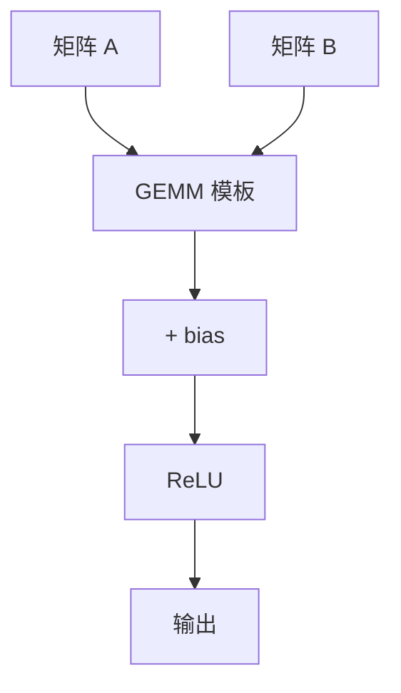
**序言融合 (Prologue Fusion)**：融合模板内核之前的操作

**来源：** [torch/\_inductor/codegen/triton.py2500-2700](https://github.com/pytorch/pytorch/blob/915982a4/torch/_inductor/codegen/triton.py#L2500-L2700) [torch/\_inductor/config.py263-267](https://github.com/pytorch/pytorch/blob/915982a4/torch/_inductor/config.py#L263-L267)

### 混合顺序归约 (Mix Order Reduction)

针对具有不同循环顺序但共享输入的归约操作的特殊融合。`MixOrderReduction` 类处理这种复杂情况。

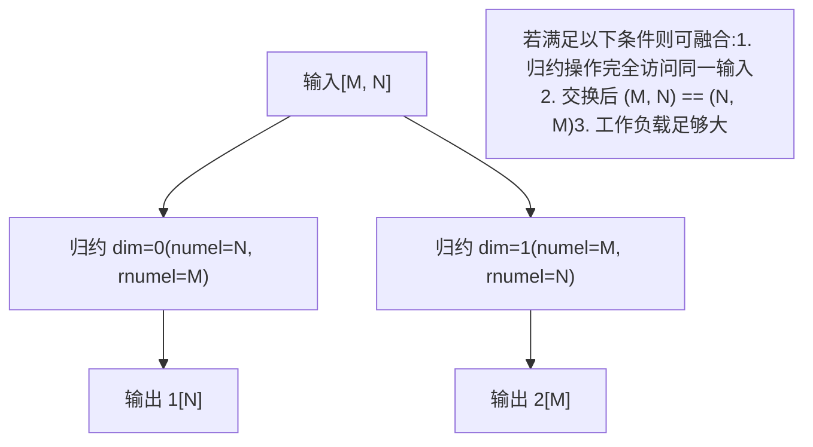
**实现：** [torch/\_inductor/scheduler.py137-267](https://github.com/pytorch/pytorch/blob/915982a4/torch/_inductor/scheduler.py#L137-L267)

**混合顺序归约融合的关键条件：**

-   归约操作必须访问一个共同的缓冲区，且为完全访问（非广播）。
-   循环顺序必须是反向的：`(numel1, rnumel1) == (rnumel2, numel2)`。
-   工作负载必须足够大，才能从融合中获益。
-   仅支持带有 Triton 后端的 GPU。

**来源：** [torch/\_inductor/scheduler.py137-350](https://github.com/pytorch/pytorch/blob/915982a4/torch/_inductor/scheduler.py#L137-L350)

### 水平融合 (Horizontal Fusion)

融合具有相同组签名（设备、形状、归约维度）的独立操作，即使它们不共享输入。

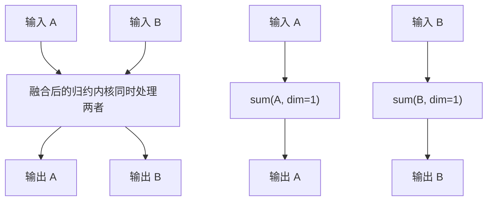
**来源：** [torch/\_inductor/scheduler.py2400-2600](https://github.com/pytorch/pytorch/blob/915982a4/torch/_inductor/scheduler.py#L2400-L2600)

## 调度算法 (Scheduling Algorithm)

`Scheduler.run()` 中的主调度循环按顺序处理节点，并尽可能尝试融合。

### 主调度循环 (Main Scheduling Loop)

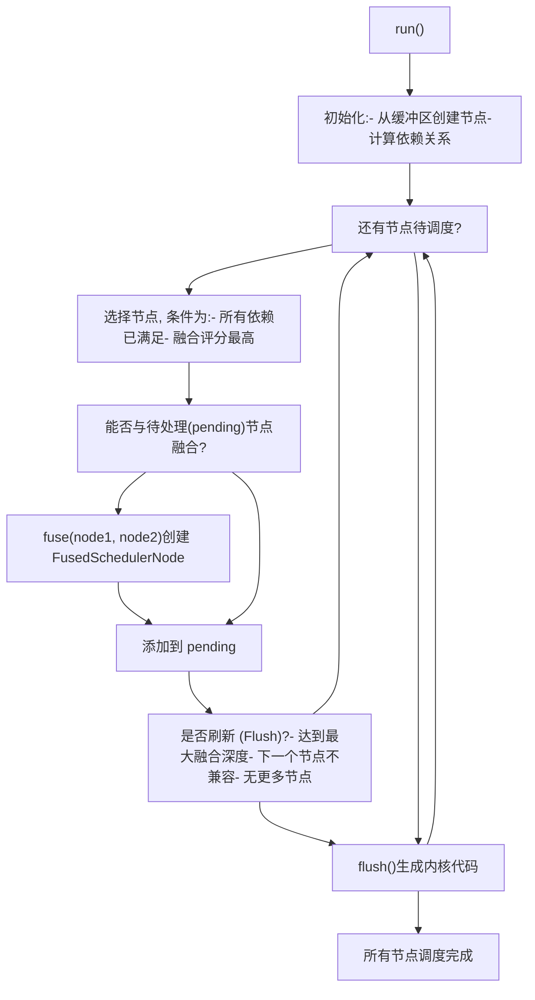
**来源：** [torch/\_inductor/scheduler.py1200-1400](https://github.com/pytorch/pytorch/blob/915982a4/torch/_inductor/scheduler.py#L1200-L1400)

### 节点评分 (Node Scoring)

`score_fusion()` 方法计算每个节点的评分，以确定融合决策的优先级：

```python
# scheduler.py 中的关键评分因素
score = (    
    node.is_reduction(),           # 优先处理归约操作    
    node.is_template(),            # 其次处理模板      
    len(node.users),               # 使用者越多 = 优先级越高    
    node.get_name() in fused_buffer_names,  # 已经融合过    
    -num_shared_inputs,            # 共享输入越多 = 评分越高
)
```
**来源：** [torch/\_inductor/scheduler.py2600-2800](https://github.com/pytorch/pytorch/blob/915982a4/torch/_inductor/scheduler.py#L2600-L2800)

## 调度后的代码生成 (Code Generation After Scheduling)

一旦调度完成，`codegen()` 方法通过后端特定的调度器生成内核代码：

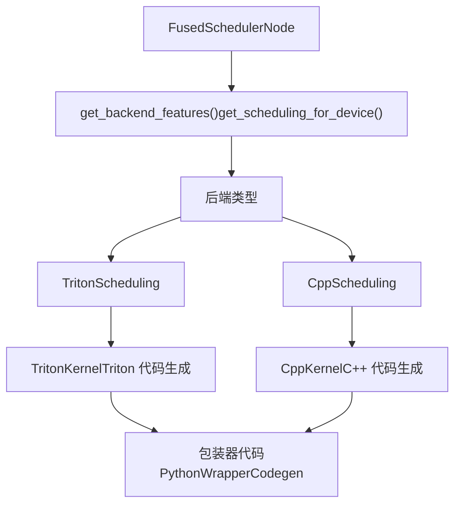
**来源：** [torch/\_inductor/scheduler.py3000-3200](https://github.com/pytorch/pytorch/blob/915982a4/torch/_inductor/scheduler.py#L3000-L3200) [torch/\_inductor/codegen/triton.py100-300](https://github.com/pytorch/pytorch/blob/915982a4/torch/_inductor/codegen/triton.py#L100-L300) [torch/\_inductor/codegen/simd.py100-300](https://github.com/pytorch/pytorch/blob/915982a4/torch/_inductor/codegen/simd.py#L100-L300)

### 后端调度类 (Backend Scheduling Classes)

| 类 | 文件 | 设备 | 目的 |
| --- | --- | --- | --- |
| `TritonScheduling` | codegen/triton.py | CUDA, HIP, XPU | 生成 Triton GPU 内核 |
| `CppScheduling` | codegen/simd.py | CPU | 生成向量化 C++ 内核 |

每个调度类实现如下方法：

-   `can_fuse_vertical()` - 检查是否可以进行垂直融合
-   `can_fuse_horizontal()` - 检查是否可以进行水平融合
-   `group_fn()` - 计算节点分组键 (key)
-   `codegen()` - 为融合后的节点生成内核代码

**来源：** [torch/\_inductor/codegen/triton.py3000-3500](https://github.com/pytorch/pytorch/blob/915982a4/torch/_inductor/codegen/triton.py#L3000-L3500) [torch/\_inductor/codegen/simd.py2000-2500](https://github.com/pytorch/pytorch/blob/915982a4/torch/_inductor/codegen/simd.py#L2000-L2500)

## 配置选项 (Configuration Options)

调度器的行为由几个配置选项控制：

| 配置项 | 默认值 | 目的 |
| --- | --- | --- |
| `aggressive_fusion` | False | 即使没有共同读取也进行融合 |
| `epilogue_fusion` | True | 启用向模板的尾声融合 |
| `prologue_fusion` | True | 启用向模板的序言融合 |
| `triton.mix_order_reduction` | True | 启用混合顺序归约融合 |
| `realize_reads_threshold` | 4 | 强制具象化前的最大读取次数 |
| `realize_opcount_threshold` | 30 | 强制具象化前的最大操作数 |

**来源：** [torch/\_inductor/config.py236-790](https://github.com/pytorch/pytorch/blob/915982a4/torch/_inductor/config.py#L236-L790)

### 调试与日志 (Debug and Logging)

调度器通过 PyTorch 的日志基础设施发出详细日志：

```python
# scheduler.py 中的关键日志记录器 (loggers)
schedule_log = torch._logging.getArtifactLogger(__name__, "schedule")
fusion_log = torch._logging.getArtifactLogger(__name__, "fusion")

# 启用方式:
# TORCH_LOGS="schedule,fusion" python script.py
```
**来源：** [torch/\_inductor/scheduler.py90-98](https://github.com/pytorch/pytorch/blob/915982a4/torch/_inductor/scheduler.py#L90-L98)

## 性能考量 (Performance Considerations)

调度器为了优化性能做出了几项权衡：

### 内存 vs 计算 (Memory vs Compute)

**重计算 (Rematerialization)**：调度器在以下情况下可能会选择重计算数值而不是存储它们：

-   计算开销低（由 `realize_opcount_threshold` 控制）。
-   数值仅被读取少数几次（由 `realize_reads_threshold` 控制）。
-   内存压力大。

**融合深度 (Fusion Depth)**：融合过多操作可能导致：

-   GPU 寄存器压力。
-   更长的编译时间。
-   缓存行为变差。

调度器限制了融合深度，并会定期进行刷新 (flush)。

### 循环排序 (Loop Ordering)

对于具有多个循环维度的操作，调度器基于以下因素选择排序方式：

1.  内存访问模式（合并 (coalescing)）。
2.  归约维度。
3.  分块 (tile) 大小。

**来源：** [torch/\_inductor/scheduler.py2800-3000](https://github.com/pytorch/pytorch/blob/915982a4/torch/_inductor/scheduler.py#L2800-L3000) [torch/\_inductor/codegen/triton.py1000-1200](https://github.com/pytorch/pytorch/blob/915982a4/torch/_inductor/codegen/triton.py#L1000-L1200)
