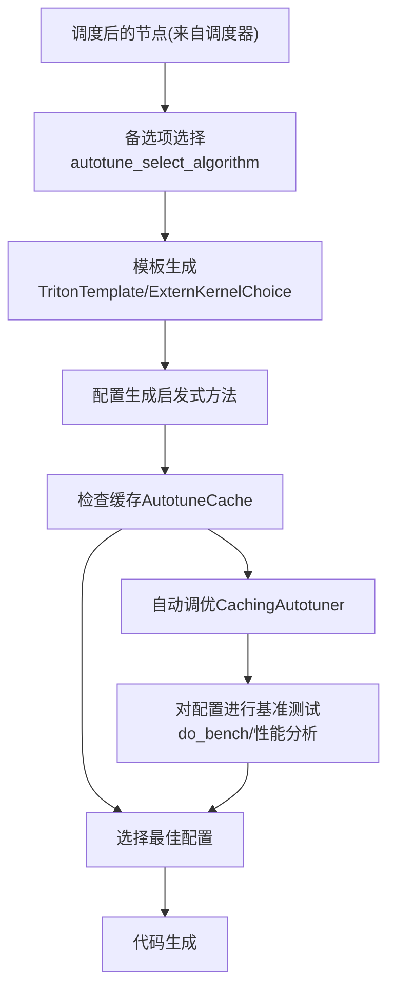
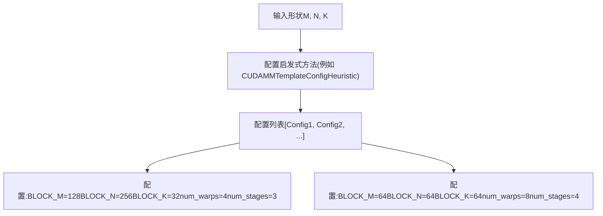
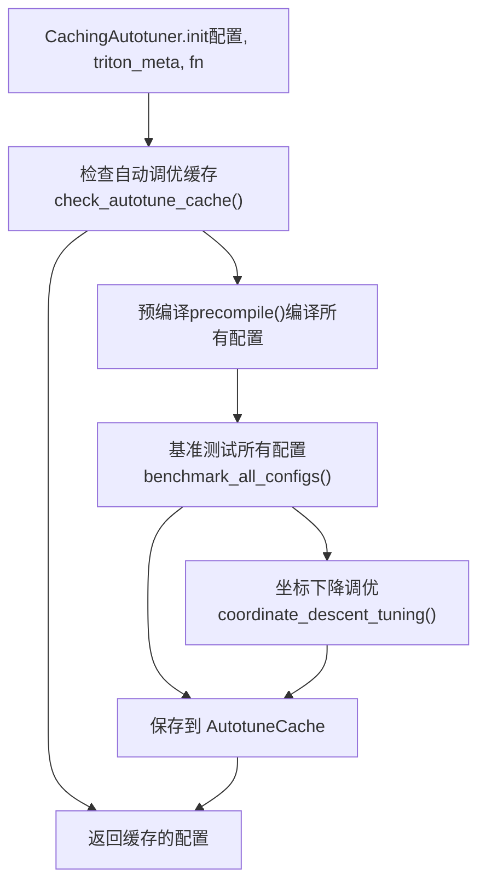
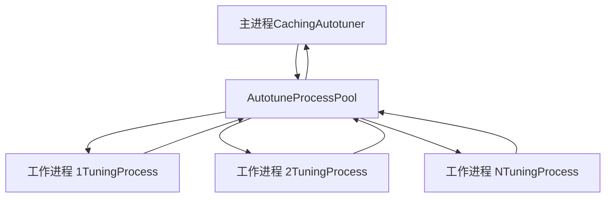
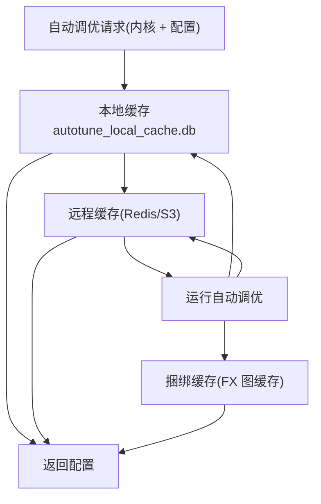
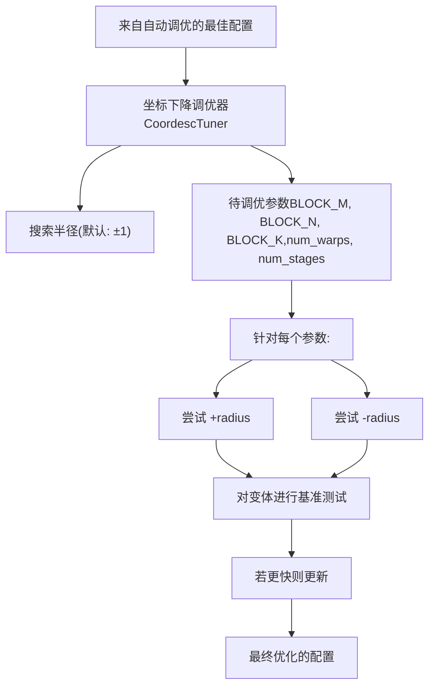
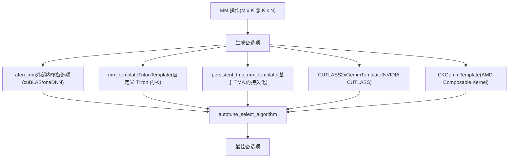

# 内核选择与自动调优 (Kernel Selection and Autotuning)

相关源文件 (Relevant source files)

-   [aten/src/ATen/native/cuda/int8mm.cu](https://github.com/pytorch/pytorch/blob/915982a4/aten/src/ATen/native/cuda/int8mm.cu)
-   [test/higher\_order\_ops/test\_local\_map.py](https://github.com/pytorch/pytorch/blob/915982a4/test/higher_order_ops/test_local_map.py)
-   [test/inductor/test\_aot\_inductor.py](https://github.com/pytorch/pytorch/blob/915982a4/test/inductor/test_aot_inductor.py)
-   [test/inductor/test\_combo\_kernels.py](https://github.com/pytorch/pytorch/blob/915982a4/test/inductor/test_combo_kernels.py)
-   [test/inductor/test\_cpu\_cpp\_wrapper.py](https://github.com/pytorch/pytorch/blob/915982a4/test/inductor/test_cpu_cpp_wrapper.py)
-   [test/inductor/test\_cpu\_select\_algorithm.py](https://github.com/pytorch/pytorch/blob/915982a4/test/inductor/test_cpu_select_algorithm.py)
-   [test/inductor/test\_custom\_lowering.py](https://github.com/pytorch/pytorch/blob/915982a4/test/inductor/test_custom_lowering.py)
-   [test/inductor/test\_custom\_op\_autotune.py](https://github.com/pytorch/pytorch/blob/915982a4/test/inductor/test_custom_op_autotune.py)
-   [test/inductor/test\_distributed\_patterns.py](https://github.com/pytorch/pytorch/blob/915982a4/test/inductor/test_distributed_patterns.py)
-   [test/inductor/test\_foreach.py](https://github.com/pytorch/pytorch/blob/915982a4/test/inductor/test_foreach.py)
-   [test/inductor/test\_gpu\_cpp\_wrapper.py](https://github.com/pytorch/pytorch/blob/915982a4/test/inductor/test_gpu_cpp_wrapper.py)
-   [test/inductor/test\_gpu\_select\_algorithm.py](https://github.com/pytorch/pytorch/blob/915982a4/test/inductor/test_gpu_select_algorithm.py)
-   [test/inductor/test\_max\_autotune.py](https://github.com/pytorch/pytorch/blob/915982a4/test/inductor/test_max_autotune.py)
-   [test/inductor/test\_mem\_estimation.py](https://github.com/pytorch/pytorch/blob/915982a4/test/inductor/test_mem_estimation.py)
-   [test/inductor/test\_minifier.py](https://github.com/pytorch/pytorch/blob/915982a4/test/inductor/test_minifier.py)
-   [test/inductor/test\_mkldnn\_pattern\_matcher.py](https://github.com/pytorch/pytorch/blob/915982a4/test/inductor/test_mkldnn_pattern_matcher.py)
-   [test/inductor/test\_mmdecomp.py](https://github.com/pytorch/pytorch/blob/915982a4/test/inductor/test_mmdecomp.py)
-   [test/inductor/test\_move\_constructors\_to\_gpu.py](https://github.com/pytorch/pytorch/blob/915982a4/test/inductor/test_move_constructors_to_gpu.py)
-   [test/inductor/test\_select\_algorithm.py](https://github.com/pytorch/pytorch/blob/915982a4/test/inductor/test_select_algorithm.py)
-   [test/inductor/test\_torchinductor.py](https://github.com/pytorch/pytorch/blob/915982a4/test/inductor/test_torchinductor.py)
-   [test/inductor/test\_torchinductor\_codegen\_dynamic\_shapes.py](https://github.com/pytorch/pytorch/blob/915982a4/test/inductor/test_torchinductor_codegen_dynamic_shapes.py)
-   [test/inductor/test\_torchinductor\_opinfo.py](https://github.com/pytorch/pytorch/blob/915982a4/test/inductor/test_torchinductor_opinfo.py)
-   [test/inductor/test\_torchinductor\_strided\_blocks.py](https://github.com/pytorch/pytorch/blob/915982a4/test/inductor/test_torchinductor_strided_blocks.py)
-   [test/inductor/test\_triton\_kernels.py](https://github.com/pytorch/pytorch/blob/915982a4/test/inductor/test_triton_kernels.py)
-   [test/test\_nestedtensor.py](https://github.com/pytorch/pytorch/blob/915982a4/test/test_nestedtensor.py)
-   [torch/\_higher\_order\_ops/local\_map.py](https://github.com/pytorch/pytorch/blob/915982a4/torch/_higher_order_ops/local_map.py)
-   [torch/\_higher\_order\_ops/triton\_kernel\_wrap.py](https://github.com/pytorch/pytorch/blob/915982a4/torch/_higher_order_ops/triton_kernel_wrap.py)
-   [torch/\_inductor/autotune\_process.py](https://github.com/pytorch/pytorch/blob/915982a4/torch/_inductor/autotune_process.py)
-   [torch/\_inductor/choices.py](https://github.com/pytorch/pytorch/blob/915982a4/torch/_inductor/choices.py)
-   [torch/\_inductor/codegen/common.py](https://github.com/pytorch/pytorch/blob/915982a4/torch/_inductor/codegen/common.py)
-   [torch/\_inductor/codegen/cpp\_wrapper\_cpu.py](https://github.com/pytorch/pytorch/blob/915982a4/torch/_inductor/codegen/cpp_wrapper_cpu.py)
-   [torch/\_inductor/codegen/cpp\_wrapper\_cpu\_array\_ref.py](https://github.com/pytorch/pytorch/blob/915982a4/torch/_inductor/codegen/cpp_wrapper_cpu_array_ref.py)
-   [torch/\_inductor/codegen/simd.py](https://github.com/pytorch/pytorch/blob/915982a4/torch/_inductor/codegen/simd.py)
-   [torch/\_inductor/codegen/subgraph.py](https://github.com/pytorch/pytorch/blob/915982a4/torch/_inductor/codegen/subgraph.py)
-   [torch/\_inductor/codegen/triton.py](https://github.com/pytorch/pytorch/blob/915982a4/torch/_inductor/codegen/triton.py)
-   [torch/\_inductor/codegen/triton\_combo\_kernel.py](https://github.com/pytorch/pytorch/blob/915982a4/torch/_inductor/codegen/triton_combo_kernel.py)
-   [torch/\_inductor/codegen/wrapper.py](https://github.com/pytorch/pytorch/blob/915982a4/torch/_inductor/codegen/wrapper.py)
-   [torch/\_inductor/config.py](https://github.com/pytorch/pytorch/blob/915982a4/torch/_inductor/config.py)
-   [torch/\_inductor/decomposition.py](https://github.com/pytorch/pytorch/blob/915982a4/torch/_inductor/decomposition.py)
-   [torch/\_inductor/dtype\_propagation.py](https://github.com/pytorch/pytorch/blob/915982a4/torch/_inductor/dtype_propagation.py)
-   [torch/\_inductor/graph.py](https://github.com/pytorch/pytorch/blob/915982a4/torch/_inductor/graph.py)
-   [torch/\_inductor/ir.py](https://github.com/pytorch/pytorch/blob/915982a4/torch/_inductor/ir.py)
-   [torch/\_inductor/jagged\_lowerings.py](https://github.com/pytorch/pytorch/blob/915982a4/torch/_inductor/jagged_lowerings.py)
-   [torch/\_inductor/kernel/bmm.py](https://github.com/pytorch/pytorch/blob/915982a4/torch/_inductor/kernel/bmm.py)
-   [torch/\_inductor/kernel/conv.py](https://github.com/pytorch/pytorch/blob/915982a4/torch/_inductor/kernel/conv.py)
-   [torch/\_inductor/kernel/custom\_op.py](https://github.com/pytorch/pytorch/blob/915982a4/torch/_inductor/kernel/custom_op.py)
-   [torch/\_inductor/kernel/mm.py](https://github.com/pytorch/pytorch/blob/915982a4/torch/_inductor/kernel/mm.py)
-   [torch/\_inductor/kernel/mm\_plus\_mm.py](https://github.com/pytorch/pytorch/blob/915982a4/torch/_inductor/kernel/mm_plus_mm.py)
-   [torch/\_inductor/kernel\_inputs.py](https://github.com/pytorch/pytorch/blob/915982a4/torch/_inductor/kernel_inputs.py)
-   [torch/\_inductor/lowering.py](https://github.com/pytorch/pytorch/blob/915982a4/torch/_inductor/lowering.py)
-   [torch/\_inductor/memory.py](https://github.com/pytorch/pytorch/blob/915982a4/torch/_inductor/memory.py)
-   [torch/\_inductor/mkldnn\_ir.py](https://github.com/pytorch/pytorch/blob/915982a4/torch/_inductor/mkldnn_ir.py)
-   [torch/\_inductor/mkldnn\_lowerings.py](https://github.com/pytorch/pytorch/blob/915982a4/torch/_inductor/mkldnn_lowerings.py)
-   [torch/\_inductor/ops\_handler.py](https://github.com/pytorch/pytorch/blob/915982a4/torch/_inductor/ops_handler.py)
-   [torch/\_inductor/runtime/triton\_heuristics.py](https://github.com/pytorch/pytorch/blob/915982a4/torch/_inductor/runtime/triton_heuristics.py)
-   [torch/\_inductor/scheduler.py](https://github.com/pytorch/pytorch/blob/915982a4/torch/_inductor/scheduler.py)
-   [torch/\_inductor/select\_algorithm.py](https://github.com/pytorch/pytorch/blob/915982a4/torch/_inductor/select_algorithm.py)
-   [torch/\_inductor/shape\_propagation.py](https://github.com/pytorch/pytorch/blob/915982a4/torch/_inductor/shape_propagation.py)
-   [torch/\_inductor/subgraph\_lowering.py](https://github.com/pytorch/pytorch/blob/915982a4/torch/_inductor/subgraph_lowering.py)
-   [torch/\_inductor/template\_heuristics/triton.py](https://github.com/pytorch/pytorch/blob/915982a4/torch/_inductor/template_heuristics/triton.py)
-   [torch/\_inductor/utils.py](https://github.com/pytorch/pytorch/blob/915982a4/torch/_inductor/utils.py)
-   [torch/\_inductor/virtualized.py](https://github.com/pytorch/pytorch/blob/915982a4/torch/_inductor/virtualized.py)
-   [torch/csrc/inductor/cpp\_wrapper/common.h](https://github.com/pytorch/pytorch/blob/915982a4/torch/csrc/inductor/cpp_wrapper/common.h)
-   [torch/nested/\_internal/nested\_tensor.py](https://github.com/pytorch/pytorch/blob/915982a4/torch/nested/_internal/nested_tensor.py)
-   [torch/nested/\_internal/ops.py](https://github.com/pytorch/pytorch/blob/915982a4/torch/nested/_internal/ops.py)

## 目的与范围 (Purpose and Scope)

本页描述了 TorchInductor 如何在编译期间为操作选择和优化内核。当 Inductor 从 IR 降低操作（参见 [2.5.1](/pytorch/pytorch/2.5.1-inductor-ir-and-lowering)）并执行调度/融合（参见 [2.5.2](/pytorch/pytorch/2.5.2-scheduling-and-fusion)）后，它必须为每个融合操作选择一个具体实现（内核）。本文档涵盖：

-   基于模板的内核选择系统
-   配置空间生成与剪枝 (pruning)
-   自动调优方法论（对多个候选方案进行基准测试）
-   用于复用自动调优结果的缓存机制
-   用于进一步优化的坐标下降调优 (coordinate descent tuning)

有关所选内核的实际代码生成，请参阅 [2.5.4](/pytorch/pytorch/2.5.4-code-generation:-triton-cutlass-pallas-c++)。

## 概览：从调度节点到优化内核 (Overview: From Scheduled Nodes to Optimized Kernels)

内核选择与自动调优过程弥补了调度后的计算图与优化后的可执行内核之间的鸿沟。对于矩阵乘法、卷积或融合后的逐元素操作，Inductor 生成具有不同配置的多个候选实现，并对其进行基准测试，最后选择最快的一个。


**图表：内核选择与自动调优流程**

来源： [torch/\_inductor/select\_algorithm.py1-100](https://github.com/pytorch/pytorch/blob/915982a4/torch/_inductor/select_algorithm.py#L1-L100) [torch/\_inductor/runtime/triton\_heuristics.py313-430](https://github.com/pytorch/pytorch/blob/915982a4/torch/_inductor/runtime/triton_heuristics.py#L313-L430)

## 模板系统与 ChoiceCaller (Template System and ChoiceCaller)

### 模板类型 (Template Types)

Inductor 针对不同后端和操作使用多种模板类型：

| 模板类型 | 描述 | 主要用途 |
| --- | --- | --- |
| `TritonTemplate` | 使用 Jinja2 模板的 Triton GPU 内核 | 矩阵操作、归约、逐元素操作 |
| `ExternKernelChoice` | ATen/cuBLAS/cuDNN 外部调用 | 已证明稳定的操作的回退方案 |
| `CUTLASSTemplate` | NVIDIA CUTLASS 库模板 | CUDA 上的 GEMM 操作 |
| `CKGemmTemplate` | AMD Composable Kernel 模板 | ROCm 上的 GEMM 操作 |
| `CppGemmTemplate` | C++ CPU 模板 | CPU 矩阵操作 |
| `SubgraphTemplate` | 带有 HOPs 的子图模板 | 控制流操作 |

来源： [torch/\_inductor/select\_algorithm.py100-200](https://github.com/pytorch/pytorch/blob/915982a4/torch/_inductor/select_algorithm.py#L100-L200) [torch/\_inductor/kernel/mm.py84-156](https://github.com/pytorch/pytorch/blob/915982a4/torch/_inductor/kernel/mm.py#L84-L156)

### ChoiceCaller 层级结构 (ChoiceCaller Hierarchy)

```mermaid
flowchart TD
    ChoiceCaller["ChoiceCaller(ir.ChoiceCaller)"]
    TritonTemplateCaller["TritonTemplateCaller"]
    ExternKernelCaller["ExternKernelCaller"]
    CUTLASSCaller["CUTLASSGemmCaller"]
    SubgraphCaller["SubgraphChoiceCaller"]
    RenderCode["渲染出的 Triton 代码"]
    ATenCall["ATen/cuBLAS 调用"]

    ChoiceCaller --> TritonTemplateCaller
    ChoiceCaller --> ExternKernelCaller
    ChoiceCaller --> CUTLASSCaller
    ChoiceCaller --> SubgraphCaller
    TritonTemplateCaller --> RenderCode
    ExternKernelCaller --> ATenCall
```


**图表：ChoiceCaller 类层级结构**

`ChoiceCaller` 抽象基类定义了内核备选项的接口。关键方法包括：

-   `benchmark(*args, out)` - 对该备选项进行基准测试
-   `output_node()` - 为该备选项生成 IR 节点
-   `get_estimated_runtime()` - 可选的基于启发式方法的估算耗时

来源： [torch/\_inductor/ir.py5000-5100](https://github.com/pytorch/pytorch/blob/915982a4/torch/_inductor/ir.py#L5000-L5100) [torch/\_inductor/select\_algorithm.py500-700](https://github.com/pytorch/pytorch/blob/915982a4/torch/_inductor/select_algorithm.py#L500-L700)

## 配置生成与启发式方法 (Configuration Generation and Heuristics)

### 配置空间 (Configuration Space)

对于 Triton 模板，配置指定了块大小 (block sizes)、warp 数量、流水线阶段 (stages) 以及其他调优参数：


**图表：配置生成过程**

来源： [torch/\_inductor/template\_heuristics/triton.py1-100](https://github.com/pytorch/pytorch/blob/915982a4/torch/_inductor/template_heuristics/triton.py#L1-L100)

### 启发式方法类 (Heuristic Classes)

模板特有的启发式方法根据问题规模和硬件生成候选配置：

```python
# 示例：CUDAMMTemplateConfigHeuristic
class CUDAMMTemplateConfigHeuristic(BaseConfigHeuristic):    
    def mm_configs(        
        self,        
        m: int,        
        n: int,         
        k: int,        
        layout: MatmulLayout,        
        input_dtypes: tuple[torch.dtype, torch.dtype],    
    ) -> list[GemmConfig]:        
        # 返回如下配置：        
        # GemmConfig(BLOCK_M=128, BLOCK_N=256, BLOCK_K=32,         
        #            num_warps=4, num_stages=3, group_m=8)
```
关键启发式方法类：

-   `CUDAMMTemplateConfigHeuristic` - CUDA 矩阵乘法配置
-   `CUDAPersistentTMATemplateConfigHeuristic` - 基于 TMA 的持久化内核
-   `ROCmConfigHeuristic` - AMD ROCm 特有配置
-   `XPUConfigHeuristic` - Intel XPU 配置
-   `CPUConfigHeuristic` - CPU 向量化配置

来源： [torch/\_inductor/template\_heuristics/triton.py200-500](https://github.com/pytorch/pytorch/blob/915982a4/torch/_inductor/template_heuristics/triton.py#L200-L500)

### 配置剪枝 (Configuration Pruning)

并非所有配置都会被基准测试。剪枝策略包括：

1.  **共享内存限制**：剪掉超过硬件限制的配置
    -   [torch/\_inductor/template\_heuristics/triton.py600-650](https://github.com/pytorch/pytorch/blob/915982a4/torch/_inductor/template_heuristics/triton.py#L600-L650)
2.  **整除性检查**：确保块大小与问题维度兼容
3.  **启发式评分**：根据过往经验优先测试可能较快的配置
4.  **最大自动调优限制**：根据 `max_autotune_gemm_search_space` 限制总配置数

来源： [torch/\_inductor/config.py605-620](https://github.com/pytorch/pytorch/blob/915982a4/torch/_inductor/config.py#L605-L620) [torch/\_inductor/template\_heuristics/triton.py600-700](https://github.com/pytorch/pytorch/blob/915982a4/torch/_inductor/template_heuristics/triton.py#L600-L700)

## 自动调优过程 (Autotuning Process)

### CachingAutotuner

`CachingAutotuner` 类编排自动调优过程：


**图表：CachingAutotuner 工作流**

来源： [torch/\_inductor/runtime/triton\_heuristics.py313-430](https://github.com/pytorch/pytorch/blob/915982a4/torch/_inductor/runtime/triton_heuristics.py#L313-L430)

### 基准测试方法 (Benchmarking Methods)

Inductor 支持多种基准测试方法：

**1. 标准 do\_bench (Triton 默认)**

```python
# 使用带有 CUDA 事件的 Triton do_bench
def benchmark(self, *args, out):    
    return do_bench(lambda: self.fn.run(*args, **kwargs))
```
**2. 基于性能分析 (Profiling) 的基准测试**

```python
# 使用 torch.profiler 进行更精确的计时
def do_bench_using_profiling(fn, warmup=25, rep=100):    
    # 过滤分析器事件，排除开销    
    # 更精确但更慢
```
由 `config.use_experimental_benchmarker` 控制。

来源： [torch/\_inductor/utils.py280-400](https://github.com/pytorch/pytorch/blob/915982a4/torch/_inductor/utils.py#L280-L400) [torch/\_inductor/runtime/benchmarking.py1-200](https://github.com/pytorch/pytorch/blob/915982a4/torch/_inductor/runtime/benchmarking.py#L1-L200)

### 多进程自动调优 (Multi-Process Autotuning)

对于庞大的配置空间，Inductor 可以将自动调优分发到多个进程中：


**图表：多进程自动调优架构**

关键类：

-   `AutotuneProcessPool` - 管理工作进程
-   `TuningProcess` - 执行配置基准测试的工作进程
-   `TritonBenchmarkRequest` / `ExternKernelBenchmarkRequest` - 工作项
-   `BenchmarkResult` - 计时与错误信息

来源： [torch/\_inductor/autotune\_process.py1-300](https://github.com/pytorch/pytorch/blob/915982a4/torch/_inductor/autotune_process.py#L1-L300)

配置：

-   `config.autotune_in_subproc` - 启用多进程模式
-   `config.autotune_multi_device` - 每个进程使用单独的 GPU
-   `config.max_autotune_subproc_result_timeout_seconds` - 每次基准测试的超时时间

来源： [torch/\_inductor/config.py662-676](https://github.com/pytorch/pytorch/blob/915982a4/torch/_inductor/config.py#L662-L676)

## 缓存管理 (Cache Management)

### 缓存层级 (Cache Hierarchy)

Inductor 为自动调优结果维护了多个缓存级别：


**图表：自动调优缓存层级**

来源： [torch/\_inductor/runtime/autotune\_cache.py1-200](https://github.com/pytorch/pytorch/blob/915982a4/torch/_inductor/runtime/autotune_cache.py#L1-L200)

### AutotuneCache 实现 (AutotuneCache Implementation)

`AutotuneCache` 类管理持久化：

**缓存键生成：**

```python
# 结合源代码哈希、配置哈希以及 inductor 元数据
def cache_key(self, inductor_meta: dict) -> str:    
    hasher = hashlib.sha256()    
    hasher.update(self.filename.encode())  # 源码哈希    
    hasher.update(self.configs_hash.encode())    
    hasher.update(json.dumps(inductor_meta, sort_keys=True).encode())    
    return hasher.hexdigest()
```
**缓存操作：**

-   `read_best(inductor_meta, configs)` - 检索缓存的最佳配置
-   `save_best(config, inductor_meta, time_taken_ns)` - 持久化存储结果
-   `invalidate()` - 清除缓存项

来源： [torch/\_inductor/runtime/autotune\_cache.py50-200](https://github.com/pytorch/pytorch/blob/915982a4/torch/_inductor/runtime/autotune_cache.py#L50-L200)

### 缓存配置 (Cache Configuration)

| 配置项 | 目的 | 默认值 |
| --- | --- | --- |
| `autotune_local_cache` | 启用本地磁盘缓存 | True |
| `autotune_remote_cache` | 启用远程缓存 | None (fbcode 中基于 JK) |
| `bundled_autotune_remote_cache` | 与 FX 图缓存捆绑 | None |
| `fx_graph_cache` | 启用 FX 图级缓存 | True |
| `force_disable_caches` | 禁用所有缓存 | False |

来源： [torch/\_inductor/config.py104-161](https://github.com/pytorch/pytorch/blob/915982a4/torch/_inductor/config.py#L104-L161)

## 坐标下降调优 (Coordinate Descent Tuning)

在初始自动调优从候选集中选出最佳配置后，坐标下降调优可以通过在胜出配置周围探索参数空间来进一步优化。

### 算法概览 (Algorithm Overview)


**图表：坐标下降调优过程**

来源： [torch/\_inductor/runtime/coordinate\_descent\_tuner.py1-300](https://github.com/pytorch/pytorch/blob/915982a4/torch/_inductor/runtime/coordinate_descent_tuner.py#L1-L300)

### CoordescTuner 类 (CoordescTuner Class)

`CoordescTuner` 实现了坐标下降优化：

**关键方法：**

-   `autotune(baseline_config, *args, **kwargs)` - 运行坐标下降
-   `_get_neighbour_configs(cfg)` - 生成邻居配置
-   `_benchmark_config(cfg, *args, **kwargs)` - 对单个配置计时

**可调优参数：**

-   块大小：`BLOCK_M`、`BLOCK_N`、`BLOCK_K`
-   线程/warp 配置：`num_warps`、`num_stages`
-   矩阵乘法特有参数：`group_m`、`SPLIT_K`

配置：

-   `config.coordinate_descent_tuning` - 启用坐标下降
-   `config.coordinate_descent_search_radius` - 搜索半径（默认：1）
-   `config.coordinate_descent_check_all_directions` - 全面检查 vs 贪婪检查

来源： [torch/\_inductor/runtime/coordinate\_descent\_tuner.py50-300](https://github.com/pytorch/pytorch/blob/915982a4/torch/_inductor/runtime/coordinate_descent_tuner.py#L50-L300) [torch/\_inductor/config.py688-696](https://github.com/pytorch/pytorch/blob/915982a4/torch/_inductor/config.py#L688-L696)

### 与自动调优的集成 (Integration with Autotuning)

坐标下降在初始自动调优之后运行：

```python
# 在 CachingAutotuner.benchmark_all_configs() 中
if self.inductor_meta.get("coordinate_descent_tuning"):    
    best_config = self.coordesc_tuner.autotune(        
        best_config,         
        example_inputs,        
        out=out    
    )
```
结果连同 `found_by_coordesc=True` 标志一起保存到缓存中，以便将其与基于启发式方法的配置区分开来。

来源： [torch/\_inductor/runtime/triton\_heuristics.py600-700](https://github.com/pytorch/pytorch/blob/915982a4/torch/_inductor/runtime/triton_heuristics.py#L600-L700)

## 模板特定选择 (Template-Specific Selection)

### 矩阵乘法 (MM) 选择 (Matrix Multiplication (MM) Selection)

对于矩阵乘法操作，Inductor 会考虑多个选项：


**图表：MM 内核选择**

选择逻辑位于 `aten_mm_impl()` 中：

```python
def aten_mm_impl(mat1, mat2):    
    choices = []        
    if use_aten_gemm_kernels():        
        choices.append(aten_mm.bind(mat1, mat2))        
    if use_triton_template():        
        mm_template.maybe_append_choice(            
            choices,            
            input_nodes=(mat1, mat2),            
            layout=layout,        
        )        
    if use_triton_tma_template():        
        persistent_tma_mm_template.maybe_append_choice(...)        
    if use_cutlass_template():        
        CUTLASSGemmTemplate.add_choices(...)            
    return autotune_select_algorithm(        
        "mm", choices, [mat1, mat2], layout    
    )
```
来源： [torch/\_inductor/kernel/mm.py200-400](https://github.com/pytorch/pytorch/blob/915982a4/torch/_inductor/kernel/mm.py#L200-L400)

### 后端特定条件 (Backend-Specific Conditions)

备选项生成使用工具函数来检查后端的可用性：

| 函数 | 检查内容 | 目的 |
| --- | --- | --- |
| `use_aten_gemm_kernels()` | 配置标志 + 设备支持 | 包含 cuBLAS/oneDNN |
| `use_triton_template()` | 拥有 Triton + 配置 | 包含标准 Triton |
| `use_triton_tma_template()` | TMA 设备支持 | 包含 TMA 持久化 |
| `use_cutlass_template()` | CUDA + CUTLASS 可用 | 包含 CUTLASS |
| `use_ck_gemm_template()` | ROCm + CK 可用 | 包含 AMD CK |
| `use_cpp_gemm_template()` | CPU 设备 | 包含 C++ 内核 |

来源： [torch/\_inductor/utils.py5000-5200](https://github.com/pytorch/pytorch/blob/915982a4/torch/_inductor/utils.py#L5000-L5200)

## 实践示例：MM 自动调优流程 (Practical Example: MM Autotuning Flow)

让我们追踪一个矩阵乘法自动调优的完整示例：

### 1. 初始选择

```python
# 在 lowering.py 中
@register_lowering(aten.mm)
def mm_lowering(mat1, mat2):    
    return aten_mm_impl(mat1, mat2)
```
### 2. 备选项生成

```python
# 在 mm.py 的 aten_mm_impl 中
choices = [] 

# 添加外部(cuBLAS)备选项
aten_mm.bind(mat1, mat2, out=layout)   

# 添加带有配置的 Triton 模板备选项
for config in CUDAMMTemplateConfigHeuristic().mm_configs(m, n, k):    
    # 配置示例：    
    # {BLOCK_M: 128, BLOCK_N: 256, BLOCK_K: 32, num_warps: 4}    
    # {BLOCK_M: 64, BLOCK_N: 64, BLOCK_K: 64, num_warps: 8}    
    pass
```
### 3. 检查缓存

```python
# 在 triton_heuristics.py 的 check_autotune_cache 中
autotune_cache = AutotuneCache.create(inductor_meta, filename, configs_hash)
if best_config := autotune_cache.read_best(inductor_meta, configs):    
    configs = [best_config]  # 使用已缓存结果
```
### 4. 预编译

```python
# 将所有候选配置编译为 Triton 内核
for config in configs:    
    compiled = triton.compile(        
        fn=mm_kernel_src,        
        signature=signature,        
        device=device,        
        constants=constants,        
        configs=[config]    
    )
```
### 5. 基准测试

```python
# 测试每个编译后的配置
for launcher in launchers:    
    time_ms = do_bench(        
        lambda: launcher(grid, *args),        
        warmup=25,        
        rep=100    
    )
```
### 6. 选择与保存缓存

```python
# 选择最快的
best_config = min(timings, key=lambda x: x[1]) 

# 保存到缓存
autotune_cache.save_best(best_config, inductor_meta, time_ns)
```
来源： [torch/\_inductor/kernel/mm.py200-600](https://github.com/pytorch/pytorch/blob/915982a4/torch/_inductor/kernel/mm.py#L200-L600) [torch/\_inductor/runtime/triton\_heuristics.py400-700](https://github.com/pytorch/pytorch/blob/915982a4/torch/_inductor/runtime/triton_heuristics.py#L400-L700)

## 性能考量 (Performance Considerations)

### 自动调优开销 (Autotune Overhead)

自动调优会增加编译开销，但能带来运行时加速：

**缓解策略：**

1.  **缓存**：第一次运行支付成本，后续运行即时完成。
2.  **启发式剪枝**：仅对有希望的配置进行基准测试。
3.  **最大自动调优标志位**：控制编译时间 vs 性能。
    -   `max_autotune=False`：仅使用启发式方法（编译快）。
    -   `max_autotune=True`：全自动调优（编译慢，运行时快）。
    -   `max_autotune_gemm=True`：仅对 GEMM 操作进行自动调优。
4.  **并行自动调优**：在 CPU 核心/GPU 之间分发。
5.  **远程缓存**：在机器间共享结果。

来源： [torch/\_inductor/config.py480-515](https://github.com/pytorch/pytorch/blob/915982a4/torch/_inductor/config.py#L480-L515)

### 基准测试准确性 (Benchmarking Accuracy)

影响基准测试准确性的因素：

-   **GPU 状态**：预热运行以达到稳定频率。
-   **L2 缓存**：在运行间清除以避免不公平优势。
-   **CPU 开销**：基于分析的基准测试排除了主机端时间。
-   **离群值**：多次重复取中位数/平均值。

实验性基准测试器 (`use_experimental_benchmarker`) 通过使用 `torch.profiler` 过滤掉仅限设备的时间，提供了更精确的结果。

来源： [torch/\_inductor/utils.py281-400](https://github.com/pytorch/pytorch/blob/915982a4/torch/_inductor/utils.py#L281-L400) [torch/\_inductor/runtime/benchmarking.py1-300](https://github.com/pytorch/pytorch/blob/915982a4/torch/_inductor/runtime/benchmarking.py#L1-L300)

### 内存考量 (Memory Considerations)

自动调优可能会消耗大量内存：

-   每个配置都需要单独编译内核。
-   针对外部内核与 Triton 基准测试需要多份输入副本。
-   性能分析所需的临时张量。

配置项 `max_autotune_prune_choices_based_on_shared_mem` 在编译前剪掉超过共享内存限制的配置。

来源： [torch/\_inductor/config.py517-523](https://github.com/pytorch/pytorch/blob/915982a4/torch/_inductor/config.py#L517-L523)

## 关键类与函数参考 (Key Classes and Functions Reference)

### 核心选择 API (Core Selection API)

| 符号 | 位置 | 目的 |
| --- | --- | --- |
| `autotune_select_algorithm()` | `select_algorithm.py:100-200` | 备选项选择的主要入口点 |
| `AlgorithmSelectorCache` | `select_algorithm.py:3000-3100` | 所选算法的缓存 |
| `ChoiceCaller` | `ir.py:5000-5100` | 内核备选项的抽象基类 |
| `TritonTemplate` | `select_algorithm.py:500-800` | Triton 内核模板包装器 |
| `ExternKernelChoice` | `select_algorithm.py:1500-1700` | ATen/cuBLAS/cuDNN 包装器 |

来源： [torch/\_inductor/select\_algorithm.py1-200](https://github.com/pytorch/pytorch/blob/915982a4/torch/_inductor/select_algorithm.py#L1-L200) [torch/\_inductor/ir.py5000-5100](https://github.com/pytorch/pytorch/blob/915982a4/torch/_inductor/ir.py#L5000-L5100)

### 自动调优基础设施 (Autotuning Infrastructure)

| 符号 | 位置 | 目的 |
| --- | --- | --- |
| `CachingAutotuner` | `triton_heuristics.py:313-430` | 主自动调优协调器 |
| `AutotuneCache` | `autotune_cache.py:50-200` | 持久化缓存管理 |
| `CoordescTuner` | `coordinate_descent_tuner.py:50-300` | 坐标下降优化器 |
| `AutotuneProcessPool` | `autotune_process.py:200-400` | 多进程编排 |
| `TuningProcess` | `autotune_process.py:50-150` | 基准测试的工作进程 |

来源： [torch/\_inductor/runtime/triton\_heuristics.py313-430](https://github.com/pytorch/pytorch/blob/915982a4/torch/_inductor/runtime/triton_heuristics.py#L313-L430) [torch/\_inductor/runtime/autotune\_cache.py1-200](https://github.com/pytorch/pytorch/blob/915982a4/torch/_inductor/runtime/autotune_cache.py#L1-L200) [torch/\_inductor/runtime/coordinate\_descent\_tuner.py1-300](https://github.com/pytorch/pytorch/blob/915982a4/torch/_inductor/runtime/coordinate_descent_tuner.py#L1-L300)

### 配置启发式方法 (Configuration Heuristics)

| 符号 | 位置 | 目的 |
| --- | --- | --- |
| `CUDAMMTemplateConfigHeuristic` | `template_heuristics/triton.py:300-500` | CUDA MM 配置生成 |
| `CUDAPersistentTMATemplateConfigHeuristic` | `template_heuristics/triton.py:700-900` | TMA 持久化配置 |
| `ROCmConfigHeuristic` | `template_heuristics/triton.py:1000-1200` | AMD ROCm 配置 |
| `XPUConfigHeuristic` | `template_heuristics/triton.py:1300-1500` | Intel XPU 配置 |
| `GemmConfig` | `template_heuristics/triton.py:53-73` | 配置数据类 |

来源： [torch/\_inductor/template\_heuristics/triton.py1-500](https://github.com/pytorch/pytorch/blob/915982a4/torch/_inductor/template_heuristics/triton.py#L1-L500)
