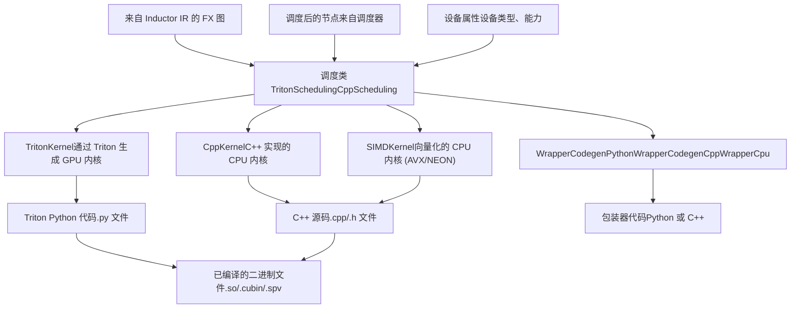
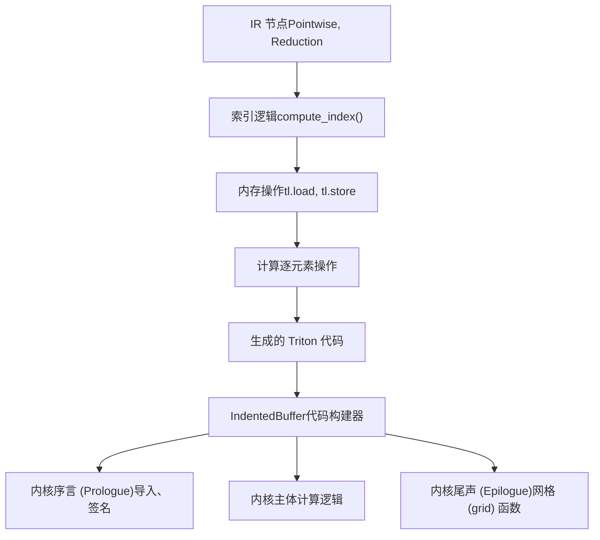
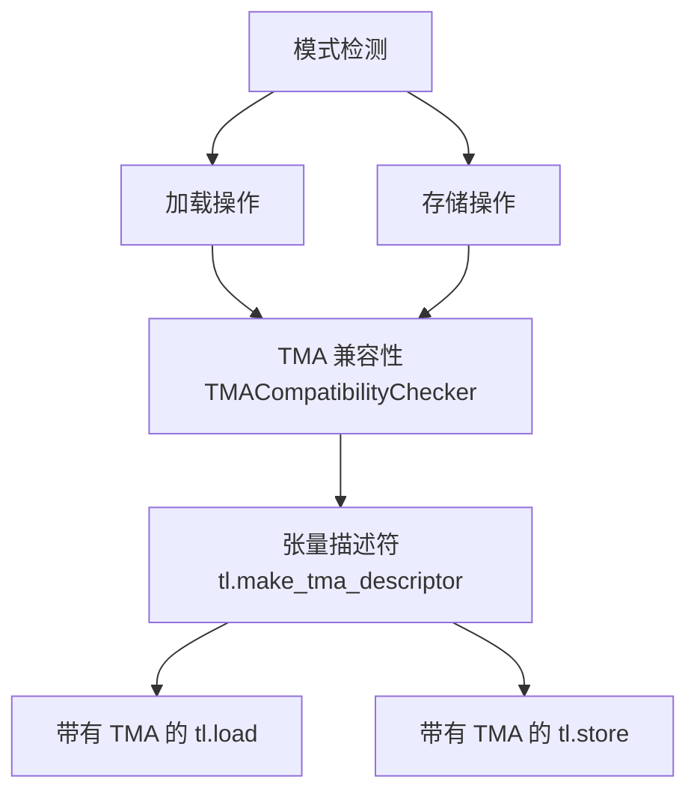
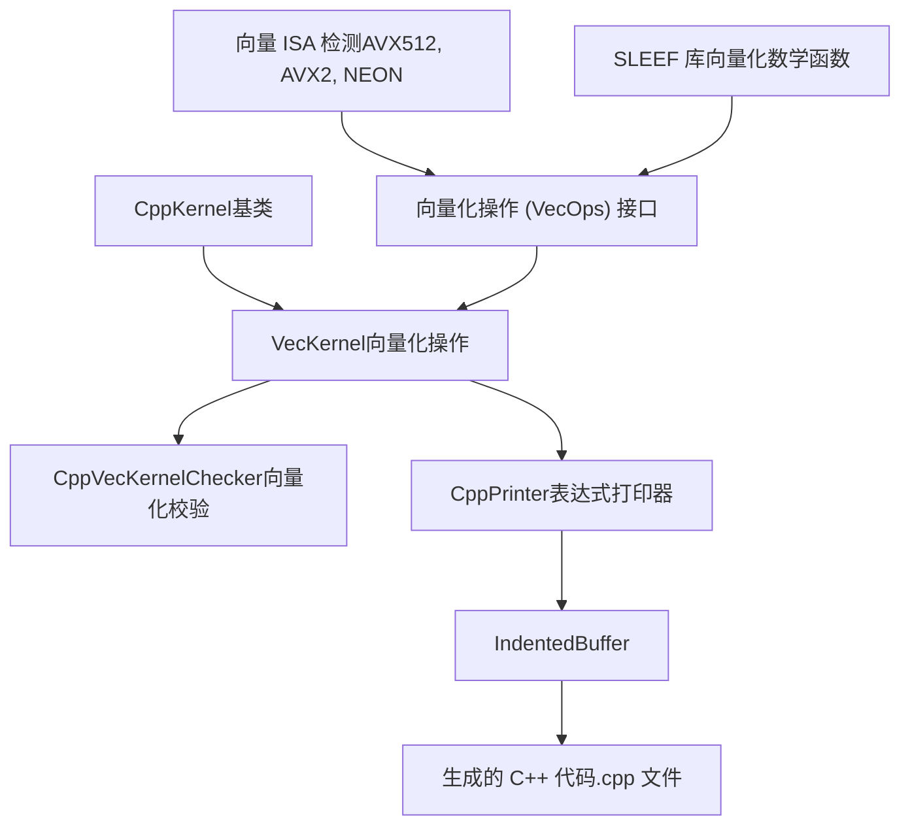
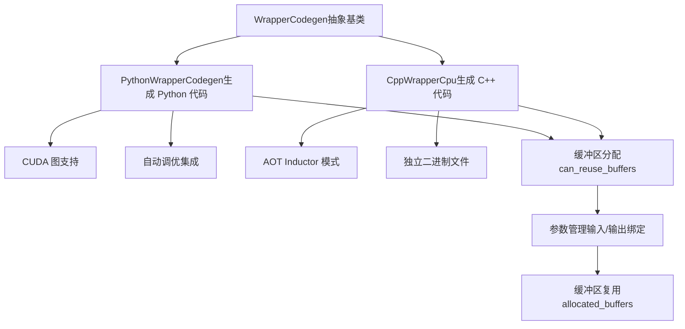
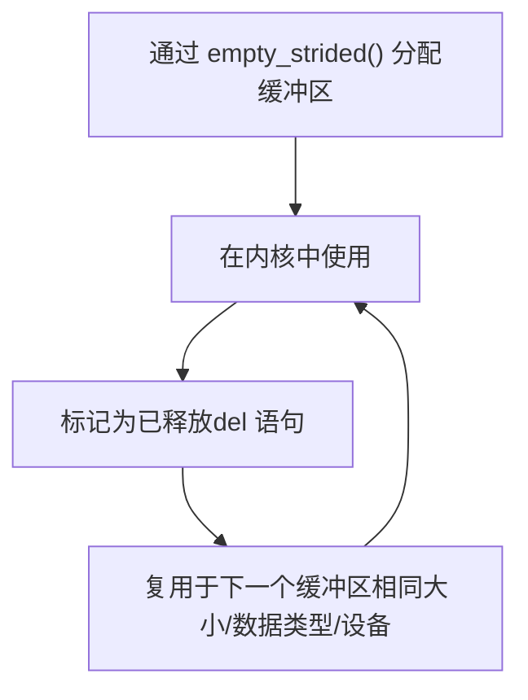
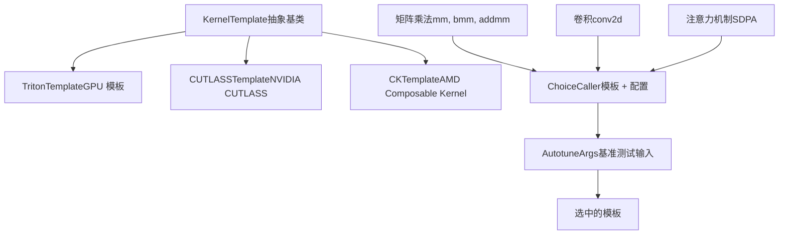
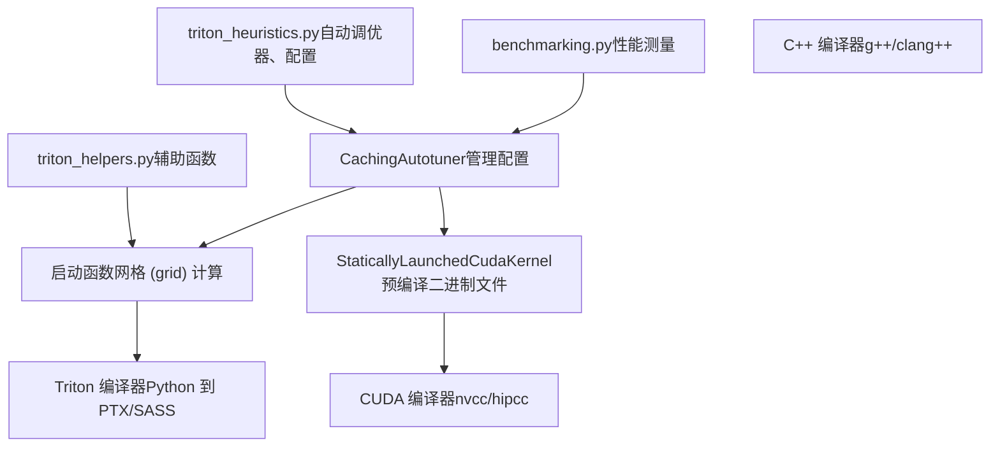
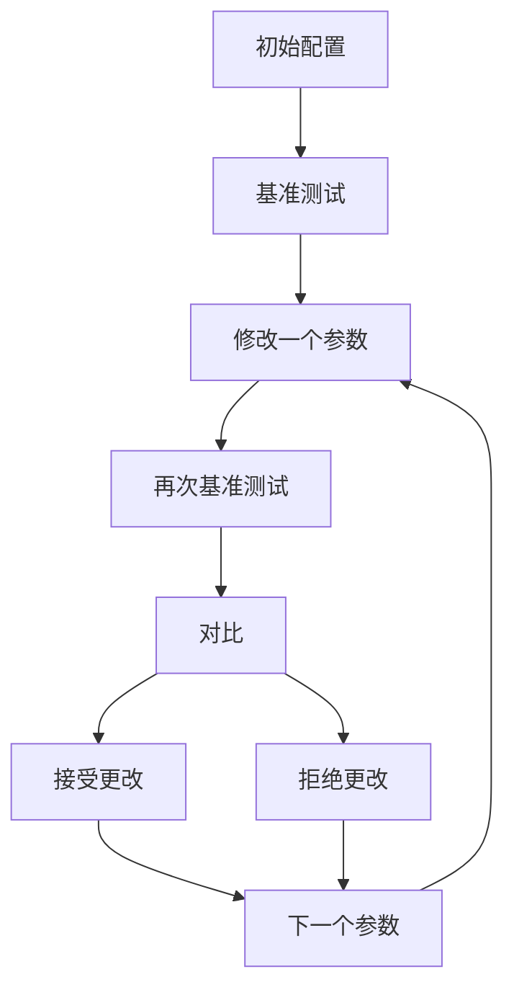

# 代码生成后端 (Code Generation Backends)

相关源文件 (Relevant source files)

-   [.ci/docker/common/install\_jax.sh](https://github.com/pytorch/pytorch/blob/915982a4/.ci/docker/common/install_jax.sh)
-   [.flake8](https://github.com/pytorch/pytorch/blob/915982a4/.flake8)
-   [.lintrunner.toml](https://github.com/pytorch/pytorch/blob/915982a4/.lintrunner.toml)
-   [aten/src/ATen/cuda/CUDAGreenContext.cpp](https://github.com/pytorch/pytorch/blob/915982a4/aten/src/ATen/cuda/CUDAGreenContext.cpp)
-   [aten/src/ATen/cuda/CUDAGreenContext.h](https://github.com/pytorch/pytorch/blob/915982a4/aten/src/ATen/cuda/CUDAGreenContext.h)
-   [benchmarks/inductor\_backends/cutlass.py](https://github.com/pytorch/pytorch/blob/915982a4/benchmarks/inductor_backends/cutlass.py)
-   [docs/source/cuda.md](https://github.com/pytorch/pytorch/blob/915982a4/docs/source/cuda.md)
-   [pyproject.toml](https://github.com/pytorch/pytorch/blob/915982a4/pyproject.toml)
-   [test/dynamo/test\_structured\_trace.py](https://github.com/pytorch/pytorch/blob/915982a4/test/dynamo/test_structured_trace.py)
-   [test/inductor/test\_aot\_inductor.py](https://github.com/pytorch/pytorch/blob/915982a4/test/inductor/test_aot_inductor.py)
-   [test/inductor/test\_auto\_functionalize.py](https://github.com/pytorch/pytorch/blob/915982a4/test/inductor/test_auto_functionalize.py)
-   [test/inductor/test\_codecache.py](https://github.com/pytorch/pytorch/blob/915982a4/test/inductor/test_codecache.py)
-   [test/inductor/test\_combo\_kernels.py](https://github.com/pytorch/pytorch/blob/915982a4/test/inductor/test_combo_kernels.py)
-   [test/inductor/test\_cpu\_repro.py](https://github.com/pytorch/pytorch/blob/915982a4/test/inductor/test_cpu_repro.py)
-   [test/inductor/test\_cuda\_repro.py](https://github.com/pytorch/pytorch/blob/915982a4/test/inductor/test_cuda_repro.py)
-   [test/inductor/test\_custom\_op\_autotune.py](https://github.com/pytorch/pytorch/blob/915982a4/test/inductor/test_custom_op_autotune.py)
-   [test/inductor/test\_cutedsl\_template.py](https://github.com/pytorch/pytorch/blob/915982a4/test/inductor/test_cutedsl_template.py)
-   [test/inductor/test\_cutlass\_backend.py](https://github.com/pytorch/pytorch/blob/915982a4/test/inductor/test_cutlass_backend.py)
-   [test/inductor/test\_cutlass\_evt.py](https://github.com/pytorch/pytorch/blob/915982a4/test/inductor/test_cutlass_evt.py)
-   [test/inductor/test\_flex\_decoding.py](https://github.com/pytorch/pytorch/blob/915982a4/test/inductor/test_flex_decoding.py)
-   [test/inductor/test\_foreach.py](https://github.com/pytorch/pytorch/blob/915982a4/test/inductor/test_foreach.py)
-   [test/inductor/test\_lookup\_table.py](https://github.com/pytorch/pytorch/blob/915982a4/test/inductor/test_lookup_table.py)
-   [test/inductor/test\_max\_autotune.py](https://github.com/pytorch/pytorch/blob/915982a4/test/inductor/test_max_autotune.py)
-   [test/inductor/test\_mmdecomp.py](https://github.com/pytorch/pytorch/blob/915982a4/test/inductor/test_mmdecomp.py)
-   [test/inductor/test\_pallas.py](https://github.com/pytorch/pytorch/blob/915982a4/test/inductor/test_pallas.py)
-   [test/inductor/test\_provenance\_tracing.py](https://github.com/pytorch/pytorch/blob/915982a4/test/inductor/test_provenance_tracing.py)
-   [test/inductor/test\_segmented\_tree.py](https://github.com/pytorch/pytorch/blob/915982a4/test/inductor/test_segmented_tree.py)
-   [test/inductor/test\_torchinductor.py](https://github.com/pytorch/pytorch/blob/915982a4/test/inductor/test_torchinductor.py)
-   [test/inductor/test\_torchinductor\_codegen\_dynamic\_shapes.py](https://github.com/pytorch/pytorch/blob/915982a4/test/inductor/test_torchinductor_codegen_dynamic_shapes.py)
-   [test/test\_public\_bindings.py](https://github.com/pytorch/pytorch/blob/915982a4/test/test_public_bindings.py)
-   [test/test\_testing.py](https://github.com/pytorch/pytorch/blob/915982a4/test/test_testing.py)
-   [tools/linter/adapters/pyrefly\_linter.py](https://github.com/pytorch/pytorch/blob/915982a4/tools/linter/adapters/pyrefly_linter.py)
-   [tools/linter/adapters/test\_has\_main\_linter.py](https://github.com/pytorch/pytorch/blob/915982a4/tools/linter/adapters/test_has_main_linter.py)
-   [torch/\_inductor/\_\_init\_\_.py](https://github.com/pytorch/pytorch/blob/915982a4/torch/_inductor/__init__.py)
-   [torch/\_inductor/autotune\_process.py](https://github.com/pytorch/pytorch/blob/915982a4/torch/_inductor/autotune_process.py)
-   [torch/\_inductor/choices.py](https://github.com/pytorch/pytorch/blob/915982a4/torch/_inductor/choices.py)
-   [torch/\_inductor/codecache.py](https://github.com/pytorch/pytorch/blob/915982a4/torch/_inductor/codecache.py)
-   [torch/\_inductor/codegen/common.py](https://github.com/pytorch/pytorch/blob/915982a4/torch/_inductor/codegen/common.py)
-   [torch/\_inductor/codegen/cpp.py](https://github.com/pytorch/pytorch/blob/915982a4/torch/_inductor/codegen/cpp.py)
-   [torch/\_inductor/codegen/cpp\_flex\_attention\_template.py](https://github.com/pytorch/pytorch/blob/915982a4/torch/_inductor/codegen/cpp_flex_attention_template.py)
-   [torch/\_inductor/codegen/cpp\_template\_kernel.py](https://github.com/pytorch/pytorch/blob/915982a4/torch/_inductor/codegen/cpp_template_kernel.py)
-   [torch/\_inductor/codegen/cpp\_wrapper\_cpu.py](https://github.com/pytorch/pytorch/blob/915982a4/torch/_inductor/codegen/cpp_wrapper_cpu.py)
-   [torch/\_inductor/codegen/cpp\_wrapper\_cpu\_array\_ref.py](https://github.com/pytorch/pytorch/blob/915982a4/torch/_inductor/codegen/cpp_wrapper_cpu_array_ref.py)
-   [torch/\_inductor/codegen/cutedsl/README.md](https://github.com/pytorch/pytorch/blob/915982a4/torch/_inductor/codegen/cutedsl/README.md)
-   [torch/\_inductor/codegen/cutedsl/\_\_init\_\_.py](https://github.com/pytorch/pytorch/blob/915982a4/torch/_inductor/codegen/cutedsl/__init__.py)
-   [torch/\_inductor/codegen/cutedsl/cutedsl\_op\_overrides.py](https://github.com/pytorch/pytorch/blob/915982a4/torch/_inductor/codegen/cutedsl/cutedsl_op_overrides.py)
-   [torch/\_inductor/codegen/cutedsl/cutedsl\_template.py](https://github.com/pytorch/pytorch/blob/915982a4/torch/_inductor/codegen/cutedsl/cutedsl_template.py)
-   [torch/\_inductor/codegen/halide.py](https://github.com/pytorch/pytorch/blob/915982a4/torch/_inductor/codegen/halide.py)
-   [torch/\_inductor/codegen/pallas.py](https://github.com/pytorch/pytorch/blob/915982a4/torch/_inductor/codegen/pallas.py)
-   [torch/\_inductor/codegen/simd.py](https://github.com/pytorch/pytorch/blob/915982a4/torch/_inductor/codegen/simd.py)
-   [torch/\_inductor/codegen/subgraph.py](https://github.com/pytorch/pytorch/blob/915982a4/torch/_inductor/codegen/subgraph.py)
-   [torch/\_inductor/codegen/triton.py](https://github.com/pytorch/pytorch/blob/915982a4/torch/_inductor/codegen/triton.py)
-   [torch/\_inductor/codegen/triton\_combo\_kernel.py](https://github.com/pytorch/pytorch/blob/915982a4/torch/_inductor/codegen/triton_combo_kernel.py)
-   [torch/\_inductor/codegen/wrapper.py](https://github.com/pytorch/pytorch/blob/915982a4/torch/_inductor/codegen/wrapper.py)
-   [torch/\_inductor/compile\_fx.py](https://github.com/pytorch/pytorch/blob/915982a4/torch/_inductor/compile_fx.py)
-   [torch/\_inductor/config.py](https://github.com/pytorch/pytorch/blob/915982a4/torch/_inductor/config.py)
-   [torch/\_inductor/debug.py](https://github.com/pytorch/pytorch/blob/915982a4/torch/_inductor/debug.py)
-   [torch/\_inductor/decomposition.py](https://github.com/pytorch/pytorch/blob/915982a4/torch/_inductor/decomposition.py)
-   [torch/\_inductor/dtype\_propagation.py](https://github.com/pytorch/pytorch/blob/915982a4/torch/_inductor/dtype_propagation.py)
-   [torch/\_inductor/graph.py](https://github.com/pytorch/pytorch/blob/915982a4/torch/_inductor/graph.py)
-   [torch/\_inductor/ir.py](https://github.com/pytorch/pytorch/blob/915982a4/torch/_inductor/ir.py)
-   [torch/\_inductor/kernel/bmm.py](https://github.com/pytorch/pytorch/blob/915982a4/torch/_inductor/kernel/bmm.py)
-   [torch/\_inductor/kernel/conv.py](https://github.com/pytorch/pytorch/blob/915982a4/torch/_inductor/kernel/conv.py)
-   [torch/\_inductor/kernel/custom\_op.py](https://github.com/pytorch/pytorch/blob/915982a4/torch/_inductor/kernel/custom_op.py)
-   [torch/\_inductor/kernel/mm.py](https://github.com/pytorch/pytorch/blob/915982a4/torch/_inductor/kernel/mm.py)
-   [torch/\_inductor/kernel/mm\_plus\_mm.py](https://github.com/pytorch/pytorch/blob/915982a4/torch/_inductor/kernel/mm_plus_mm.py)
-   [torch/\_inductor/kernel\_inputs.py](https://github.com/pytorch/pytorch/blob/915982a4/torch/_inductor/kernel_inputs.py)
-   [torch/\_inductor/lowering.py](https://github.com/pytorch/pytorch/blob/915982a4/torch/_inductor/lowering.py)
-   [torch/\_inductor/memory.py](https://github.com/pytorch/pytorch/blob/915982a4/torch/_inductor/memory.py)
-   [torch/\_inductor/ops\_handler.py](https://github.com/pytorch/pytorch/blob/915982a4/torch/_inductor/ops_handler.py)
-   [torch/\_inductor/runtime/runtime\_utils.py](https://github.com/pytorch/pytorch/blob/915982a4/torch/_inductor/runtime/runtime_utils.py)
-   [torch/\_inductor/runtime/triton\_heuristics.py](https://github.com/pytorch/pytorch/blob/915982a4/torch/_inductor/runtime/triton_heuristics.py)
-   [torch/\_inductor/scheduler.py](https://github.com/pytorch/pytorch/blob/915982a4/torch/_inductor/scheduler.py)
-   [torch/\_inductor/select\_algorithm.py](https://github.com/pytorch/pytorch/blob/915982a4/torch/_inductor/select_algorithm.py)
-   [torch/\_inductor/shape\_propagation.py](https://github.com/pytorch/pytorch/blob/915982a4/torch/_inductor/shape_propagation.py)
-   [torch/\_inductor/sizevars.py](https://github.com/pytorch/pytorch/blob/915982a4/torch/_inductor/sizevars.py)
-   [torch/\_inductor/template\_heuristics/triton.py](https://github.com/pytorch/pytorch/blob/915982a4/torch/_inductor/template_heuristics/triton.py)
-   [torch/\_inductor/utils.py](https://github.com/pytorch/pytorch/blob/915982a4/torch/_inductor/utils.py)
-   [torch/\_inductor/virtualized.py](https://github.com/pytorch/pytorch/blob/915982a4/torch/_inductor/virtualized.py)
-   [torch/csrc/cuda/GreenContext.cpp](https://github.com/pytorch/pytorch/blob/915982a4/torch/csrc/cuda/GreenContext.cpp)
-   [torch/csrc/inductor/cpp\_wrapper/common.h](https://github.com/pytorch/pytorch/blob/915982a4/torch/csrc/inductor/cpp_wrapper/common.h)
-   [torch/cuda/green\_contexts.py](https://github.com/pytorch/pytorch/blob/915982a4/torch/cuda/green_contexts.py)
-   [torch/testing/\_internal/inductor\_utils.py](https://github.com/pytorch/pytorch/blob/915982a4/torch/testing/_internal/inductor_utils.py)
-   [torch/testing/\_internal/py312\_intrinsics.py](https://github.com/pytorch/pytorch/blob/915982a4/torch/testing/_internal/py312_intrinsics.py)
-   [torch/utils/\_pallas.py](https://github.com/pytorch/pytorch/blob/915982a4/torch/utils/_pallas.py)

## 目的与范围 (Purpose and Scope)

本文档描述了 TorchInductor 中的代码生成后端，这些后端将中间表示 (IR) 转换为针对不同硬件目标的执行代码。代码生成是编译的最后阶段，产生经过优化的内核 (kernels) 和包装器 (wrapper) 代码。

有关此前编译阶段的信息，请参阅：

-   IR 结构与降低 (lowering)：[2.2.1](/pytorch/pytorch/2.2.1-frame-evaluation-and-bytecode-analysis) 编译流水线与 IR
-   调度与融合：[2.2.2](/pytorch/pytorch/2.2.2-variable-tracking-and-symbolic-execution) 调度与融合
-   内核选择：[2.2.3](/pytorch/pytorch/2.2.3-guard-system-and-recompilation) 内核选择与自动调优
-   代码缓存：[2.2.5](#2.2.5) CodeCache 与持久化

## 代码生成架构 (Code Generation Architecture)

代码生成系统由多个后端实现组成，针对不同的硬件平台和编程模型。主要的后端包括：


来源： [torch/\_inductor/codegen/triton.py1-100](https://github.com/pytorch/pytorch/blob/915982a4/torch/_inductor/codegen/triton.py#L1-L100) [torch/\_inductor/codegen/simd.py1-100](https://github.com/pytorch/pytorch/blob/915982a4/torch/_inductor/codegen/simd.py#L1-L100) [torch/\_inductor/codegen/wrapper.py1-100](https://github.com/pytorch/pytorch/blob/915982a4/torch/_inductor/codegen/wrapper.py#L1-L100)

### 后端分发机制 (Backend Dispatch Mechanism)

后端选择通过调度系统完成，该系统根据设备类型和内核特征确定适当的代码生成策略：

| 后端 | 设备类型 | 使用场景 | 实现 |
| --- | --- | --- | --- |
| `TritonScheduling` | CUDA, ROCm, XPU | GPU 逐元素、归约、模板 | `torch/_inductor/codegen/triton.py` |
| `CppScheduling` | CPU | 通用 CPU 操作 | `torch/_inductor/codegen/cpp.py` |
| `SIMDScheduling` | CPU | 向量化操作 | `torch/_inductor/codegen/simd.py` |

[torch/\_inductor/codegen/common.py800-850](https://github.com/pytorch/pytorch/blob/915982a4/torch/_inductor/codegen/common.py#L800-L850) 中的 `get_scheduling_for_device()` 函数分发到相应的调度类。

来源： [torch/\_inductor/codegen/common.py800-900](https://github.com/pytorch/pytorch/blob/915982a4/torch/_inductor/codegen/common.py#L800-L900) [torch/\_inductor/scheduler.py1-100](https://github.com/pytorch/pytorch/blob/915982a4/torch/_inductor/scheduler.py#L1-L100)

## Triton 代码生成 (Triton Code Generation)

Triton 后端使用 Triton 语言生成 GPU 内核，Triton 为编写高性能 GPU 代码提供了基于 Python 的接口。

### TritonKernel 类

[torch/\_inductor/codegen/triton.py1000-1500](https://github.com/pytorch/pytorch/blob/915982a4/torch/_inductor/codegen/triton.py#L1000-L1500) 中的 `TritonKernel` 类是 Triton 内核的核心代码生成器。它扩展了 `SIMDKernel` 并提供了 GPU 特有的代码生成：


`TritonKernel` 中的关键方法：

-   `codegen_kernel()` - 内核生成的主入口点
-   `store()` - 生成存储操作
-   `load()` - 生成加载操作
-   `compute()` - 生成计算代码
-   `indexing()` - 生成索引表达式

来源： [torch/\_inductor/codegen/triton.py1000-2000](https://github.com/pytorch/pytorch/blob/915982a4/torch/_inductor/codegen/triton.py#L1000-L2000)

### Triton 代码结构 (Triton Code Structure)

典型的生成的 Triton 内核具有如下结构：

```python
# 导入 (由 gen_common_triton_imports 生成)
import triton
import triton.language as tl
from torch._inductor.runtime import triton_helpers

# 带有自动调优装饰器的内核函数
@triton_heuristics.pointwise(...)
@triton.jit
def triton_poi_fused_kernel_0(in_ptr0, out_ptr0, xnumel, XBLOCK : tl.constexpr):    
    # 线程索引    
    xoffset = tl.program_id(0) * XBLOCK    
    xindex = xoffset + tl.arange(0, XBLOCK)    
    xmask = xindex < xnumel        
    # 加载输入    
    x0 = xindex    
    tmp0 = tl.load(in_ptr0 + x0, xmask)        
    # 计算    
    tmp1 = tmp0 + 1.0        
    # 存储输出    
    tl.store(out_ptr0 + x0, tmp1, xmask)

# 网格 (Grid) 函数
def grid(meta):    
    return (triton.cdiv(meta['xnumel'], meta['XBLOCK']),)
```
代码生成产出：

1.  **导入** - 通过 `gen_common_triton_imports()` 生成通用的 Triton 导入 [torch/\_inductor/codegen/triton.py180-200](https://github.com/pytorch/pytorch/blob/915982a4/torch/_inductor/codegen/triton.py#L180-L200)
2.  **装饰器** - 通过 `triton_heuristics` 生成自动调优提示 [torch/\_inductor/runtime/triton\_heuristics.py260-360](https://github.com/pytorch/pytorch/blob/915982a4/torch/_inductor/runtime/triton_heuristics.py#L260-L360)
3.  **签名** - 内核参数（指针、大小、constexpr 块大小）
4.  **索引** - 线程与块 (block) 的索引逻辑
5.  **加载/存储** - 带有掩码 (masking) 的内存操作
6.  **网格函数** - 动态网格大小计算

来源： [torch/\_inductor/codegen/triton.py180-300](https://github.com/pytorch/pytorch/blob/915982a4/torch/_inductor/codegen/triton.py#L180-L300) [torch/\_inductor/codegen/triton.py1000-1500](https://github.com/pytorch/pytorch/blob/915982a4/torch/_inductor/codegen/triton.py#L1000-L1500)

### Triton 特有特性 (Triton-Specific Features)

#### 块模式匹配 (Block Pattern Matching)

[torch/\_inductor/codegen/block\_analysis.py](https://github.com/pytorch/pytorch/blob/915982a4/torch/_inductor/codegen/block_analysis.py) 中的 `BlockPatternMatcher` 识别现代 GPU 上的 TMA (Tensor Memory Accelerator) 操作机会：


来源： [torch/\_inductor/codegen/triton.py2000-2500](https://github.com/pytorch/pytorch/blob/915982a4/torch/_inductor/codegen/triton.py#L2000-L2500)

#### 自动调优集成 (Autotuning Integration)

Triton 内核被自动调优装饰器包装，这些装饰器启用了运行时配置选择：

-   `@triton_heuristics.pointwise()` - 用于逐元素操作
-   `@triton_heuristics.reduction()` - 用于归约操作
-   `@triton_heuristics.persistent_reduction()` - 用于持久化归约操作
-   `@triton_heuristics.template()` - 用于模板内核

[torch/\_inductor/runtime/triton\_heuristics.py260-450](https://github.com/pytorch/pytorch/blob/915982a4/torch/_inductor/runtime/triton_heuristics.py#L260-L450) 中的 `CachingAutotuner` 类管理：

-   从多个 `triton.Config` 对象中进行配置选择
-   配置的基准测试 (benchmarking)
-   最佳配置的缓存
-   通过 `CoordescTuner` 进行坐标下降调优

来源： [torch/\_inductor/runtime/triton\_heuristics.py260-600](https://github.com/pytorch/pytorch/blob/915982a4/torch/_inductor/runtime/triton_heuristics.py#L260-L600)

## C++ 与 SIMD 代码生成 (C++ and SIMD Code Generation)

对于 CPU 操作，Inductor 生成 C++ 代码，并可选地通过 SIMD 指令进行向量化。

### C++ 后端架构 (C++ Backend Architecture)


来源： [torch/\_inductor/codegen/simd.py100-500](https://github.com/pytorch/pytorch/blob/915982a4/torch/_inductor/codegen/simd.py#L100-L500) [torch/\_inductor/codegen/cpp.py1-200](https://github.com/pytorch/pytorch/blob/915982a4/torch/_inductor/codegen/cpp.py#L1-L200)

### SIMDKernel 实现 (SIMDKernel Implementation)

[torch/\_inductor/codegen/simd.py500-1500](https://github.com/pytorch/pytorch/blob/915982a4/torch/_inductor/codegen/simd.py#L500-L1500) 中的 `SIMDKernel` 类为 C++ 和 Triton 后端提供了基础。它管理：

**迭代范围 (Iteration Ranges)：**

-   `IterationRanges` - 代表循环维度和迭代空间
-   `IterationRangesRoot` - 迭代树的根
-   `IterationRangesEntry` - 单个维度条目

**循环排序 (Loop Ordering)：**

-   确定最优的循环嵌套顺序以实现缓存局部性 (cache locality)
-   考虑内存合并 (memory coalescing) 模式
-   支持归约维度

**索引 (Indexing)：**

-   `cse` (公共子表达式消除) - 消除冗余的索引计算
-   `indexing()` - 生成索引表达式
-   `index_to_str()` - 将符号索引转换为代码

生成的 C++ 代码结构：

```cpp
#pragma omp parallel for
for (long i0 = 0; i0 < numel; i0++) {    
    auto tmp0 = in_ptr0[i0];    
    auto tmp1 = tmp0 + 1.0f;    
    out_ptr0[i0] = tmp1;
}
```
对于向量化代码：

```cpp
#pragma omp parallel for
for (long i0 = 0; i0 < numel; i0 += 8) {    
    auto tmp0 = at::vec::Vectorized<float>::loadu(in_ptr0 + i0);    
    auto tmp1 = tmp0 + at::vec::Vectorized<float>(1.0f);    
    tmp1.store(out_ptr0 + i0);
}
```
来源： [torch/\_inductor/codegen/simd.py500-2000](https://github.com/pytorch/pytorch/blob/915982a4/torch/_inductor/codegen/simd.py#L500-L2000) [torch/\_inductor/codegen/cpp.py200-500](https://github.com/pytorch/pytorch/blob/915982a4/torch/_inductor/codegen/cpp.py#L200-L500)

### 向量 ISA 选择 (Vector ISA Selection)

CPU 向量化支持在运行时由 [torch/\_inductor/cpu\_vec\_isa.py](https://github.com/pytorch/pytorch/blob/915982a4/torch/_inductor/cpu_vec_isa.py) 中的 `pick_vec_isa()` 确定：

| ISA | 指令集 | 平台 |
| --- | --- | --- |
| `VecAVX512` | AVX-512 | Intel Skylake-X 及更新版本 |
| `VecAVX2` | AVX2 | Intel Haswell 及更新版本 |
| `VecNEON` | ARM NEON | ARM CPU |
| `VecZVECTOR` | z/Architecture Vector | IBM Z |

选择过程会考虑：

-   通过 CPUID 获取 CPU 能力
-   配置覆盖 (`config.cpp.vec_isa_ok`)
-   平台可用性

来源： [torch/\_inductor/cpu\_vec\_isa.py1-200](https://github.com/pytorch/pytorch/blob/915982a4/torch/_inductor/cpu_vec_isa.py#L1-L200)

## 包装器代码生成 (Wrapper Code Generation)

包装层编排内核执行，生成的代码用于：

1.  分配张量和缓冲区
2.  使用正确的参数调用生成的内核
3.  管理内存生命周期
4.  处理动态形状和 guards

### 包装器类型 (Wrapper Types)


来源： [torch/\_inductor/codegen/wrapper.py50-150](https://github.com/pytorch/pytorch/blob/915982a4/torch/_inductor/codegen/wrapper.py#L50-L150) [torch/\_inductor/codegen/cpp\_wrapper\_cpu.py50-150](https://github.com/pytorch/pytorch/blob/915982a4/torch/_inductor/codegen/cpp_wrapper_cpu.py#L50-L150)

### PythonWrapperCodegen

[torch/\_inductor/codegen/wrapper.py100-500](https://github.com/pytorch/pytorch/blob/915982a4/torch/_inductor/codegen/wrapper.py#L100-L500) 中的 `PythonWrapperCodegen` 类生成导入并调用已编译内核的 Python 代码。关键职责：

**缓冲区管理：**

-   `can_reuse_buffers()` - 基于 `buffer_reuse_key()` 确定缓冲区是否可以复用
-   `allocated_buffers` - 追踪已分配的缓冲区名称
-   `freed_buffers` - 可供复用的已释放缓冲区池

**内核调用：**

```python
# 生成的包装代码结构
def call(args):    
    # 解包参数    
    arg0_1, arg1_1 = args        
    # 分配缓冲区    
    buf0 = empty_strided(..., device='cuda', dtype=torch.float32)        
    # 调用内核    
    triton_poi_fused_kernel_0.run(arg0_1, buf0, ...)        
    # 返回输出    
    return (buf0, )
```
**特性：**

-   通过符号大小变量处理动态形状
-   支持 CUDA 图记录
-   自动调优集成
-   用于调试的中间钩子 (Intermediate hooks)

来源： [torch/\_inductor/codegen/wrapper.py500-1500](https://github.com/pytorch/pytorch/blob/915982a4/torch/_inductor/codegen/wrapper.py#L500-L1500)

### CppWrapperCpu

[torch/\_inductor/codegen/cpp\_wrapper\_cpu.py54-200](https://github.com/pytorch/pytorch/blob/915982a4/torch/_inductor/codegen/cpp_wrapper_cpu.py#L54-L200) 中的 `CppWrapperCpu` 类为 AOT (提前) 编译生成 C++ 包装器代码。这启用了：

**AOT Inductor 模式：**

-   无需 Python 运行时的独立二进制文件
-   生成 `AOTInductorModel` C++ 类
-   模型参数序列化
-   用于推理的 C++ API

**生成的 C++ 结构：**

```cpp
class AOTInductorModel {
public:    
    AOTInductorModel();        
    std::vector<at::Tensor> run(        
        const std::vector<at::Tensor>& inputs    
    );    
private:    
    // 常量张量    
    at::Tensor constant0_;        
    // 工作区缓冲区    
    std::unique_ptr<uint8_t[]> workspace_;
};
```
C++ 包装器：

-   使用 ATen C++ API (`at::Tensor`, `at::empty` 等)
-   通过 RAII 管理内存
-   通过运行时大小计算支持动态形状
-   与 PyTorch 分发器 (dispatcher) 集成

来源： [torch/\_inductor/codegen/cpp\_wrapper\_cpu.py54-500](https://github.com/pytorch/pytorch/blob/915982a4/torch/_inductor/codegen/cpp_wrapper_cpu.py#L54-L500)

### 包装代码特性 (Wrapper Code Features)

#### 缓冲区复用策略 (Buffer Reuse Strategy)

包装器实现了复杂的缓冲区复用，以最小化内存分配：


[torch/\_inductor/codegen/wrapper.py96-108](https://github.com/pytorch/pytorch/blob/915982a4/torch/_inductor/codegen/wrapper.py#L96-L108) 中的 `buffer_reuse_key()` 函数根据以下内容计算键：

-   设备 (CUDA, CPU 等)
-   数据类型 (float32, int64 等)
-   符号大小表达式
-   对齐要求

来源： [torch/\_inductor/codegen/wrapper.py96-140](https://github.com/pytorch/pytorch/blob/915982a4/torch/_inductor/codegen/wrapper.py#L96-L140)

#### 参数处理 (Argument Handling)

包装器管理不同的参数类型：

| 参数类型 | 类 | 目的 |
| --- | --- | --- |
| `TensorArg` | 输入/输出张量 | 普通张量参数 |
| `SizeArg` | 符号大小 | 动态形状数值 |
| `WorkspaceArg` | 临时缓冲区 | 内核的暂存内存 |
| `ConstexprArg` | 编译时常量 | Triton constexpr 参数 |

[torch/\_inductor/codegen/common.py100-300](https://github.com/pytorch/pytorch/blob/915982a4/torch/_inductor/codegen/common.py#L100-L300) 中的 `args` 系统追踪参数元数据，包括名称、类型和约束。

来源： [torch/\_inductor/codegen/common.py150-400](https://github.com/pytorch/pytorch/blob/915982a4/torch/_inductor/codegen/common.py#L150-L400) [torch/\_inductor/codegen/wrapper.py600-800](https://github.com/pytorch/pytorch/blob/915982a4/torch/_inductor/codegen/wrapper.py#L600-L800)

## 模板内核与算法选择 (Template Kernels and Algorithm Selection)

除了基础的代码生成，Inductor 还针对性能关键型操作使用基于模板的内核。

### 模板系统 (Template System)


来源： [torch/\_inductor/select\_algorithm.py100-500](https://github.com/pytorch/pytorch/blob/915982a4/torch/_inductor/select_algorithm.py#L100-L500) [torch/\_inductor/codegen/common.py1000-1500](https://github.com/pytorch/pytorch/blob/915982a4/torch/_inductor/codegen/common.py#L1000-L1500)

### TritonTemplate

[torch/\_inductor/select\_algorithm.py500-1000](https://github.com/pytorch/pytorch/blob/915982a4/torch/_inductor/select_algorithm.py#L500-L1000) 中的 `TritonTemplate` 类提供了一个编写可复用内核模板的框架：

**模板结构：**

```python
class TritonTemplate(KernelTemplate):    
    def render(self, kernel: TritonTemplateKernel, **kwargs) -> str:        
        # 从模板生成 Triton 代码        
        return template_code            
    def make_kernel_render(self, kernel: TritonTemplateKernel, **kwargs):        
        # 创建带有替换项的内核        
        ...
```
**关键特性：**

-   `GEMM_TEMPLATE` - 矩阵乘法模板
-   `CONV_TEMPLATE` - 卷积模板
-   通过 `SubgraphInfo` 进行子图渲染
-   序言/尾声融合 (Prologue/epilogue fusion)

模板支持：

-   多种配置（例如不同的分块大小）
-   通过符号表达式支持动态形状
-   跨配置的自动调优

来源： [torch/\_inductor/select\_algorithm.py500-1500](https://github.com/pytorch/pytorch/blob/915982a4/torch/_inductor/select_algorithm.py#L500-L1500)

### 算法选择过程 (Algorithm Selection Process)

[torch/\_inductor/select\_algorithm.py200-400](https://github.com/pytorch/pytorch/blob/915982a4/torch/_inductor/select_algorithm.py#L200-L400) 中的 `AlgorithmSelectorCache` 编排模板选择：

1.  **备选项生成**：为每个模板/配置创建 `ChoiceCaller` 对象
2.  **基准测试**：使用 `AutotuneArgs` 对每个备选项进行基准测试
3.  **选择**：选取最快的配置
4.  **缓存**：将结果存储在 `PersistentCache` 中

矩阵乘法示例：

```python
# 生成备选项
choices = [    
    TritonTemplateCaller(GEMM_TEMPLATE, config1),    
    TritonTemplateCaller(GEMM_TEMPLATE, config2),    
    ExternKernelCaller(torch.ops.aten.mm),    
    CUTLASSGemmTemplate(...),
]

# 基准测试并选择
winner = min(choices, key=lambda c: benchmark(c))
```
来源： [torch/\_inductor/select\_algorithm.py200-700](https://github.com/pytorch/pytorch/blob/915982a4/torch/_inductor/select_algorithm.py#L200-L700)

## 内核执行与运行时 (Kernel Execution and Runtime)

最后一部分是执行生成的内核的运行时系统。

### 运行时组件 (Runtime Components)


来源： [torch/\_inductor/runtime/triton\_heuristics.py1-300](https://github.com/pytorch/pytorch/blob/915982a4/torch/_inductor/runtime/triton_heuristics.py#L1-L300) [torch/\_inductor/runtime/triton\_helpers.py1-100](https://github.com/pytorch/pytorch/blob/915982a4/torch/_inductor/runtime/triton_helpers.py#L1-L100)

### CachingAutotuner

[torch/\_inductor/runtime/triton\_heuristics.py260-450](https://github.com/pytorch/pytorch/blob/915982a4/torch/_inductor/runtime/triton_heuristics.py#L260-L450) 中的 `CachingAutotuner` 类是执行带自动调优的 Triton 内核的主要接口：

**初始化：**

```python
autotuner = CachingAutotuner(    
    fn=kernel_fn,    
    triton_meta={'device': device_props, ...},    
    configs=[config1, config2, ...],    
    heuristic_type=HeuristicType.POINTWISE,
)
```
**执行流：**

1.  **预编译 (Precompile)**：在工作进程中预先编译所有配置
2.  **网格计算**：根据元参数计算网格维度
3.  **基准测试**：如果未缓存，对每个配置进行计时
4.  **启动**：执行最快的配置

**关键方法：**

-   `precompile()` - 提前编译内核 [torch/\_inductor/runtime/triton\_heuristics.py420-440](https://github.com/pytorch/pytorch/blob/915982a4/torch/_inductor/runtime/triton_heuristics.py#L420-L440)
-   `run()` - 使用参数执行内核
-   `benchmark()` - 测量性能
-   `_dynamic_scale_rblock()` - 动态调整归约块大小

来源： [torch/\_inductor/runtime/triton\_heuristics.py260-650](https://github.com/pytorch/pytorch/blob/915982a4/torch/_inductor/runtime/triton_heuristics.py#L260-L650)

### 坐标下降调优 (Coordinate Descent Tuning)

对于复杂的内核，[torch/\_inductor/runtime/coordinate\_descent\_tuner.py](https://github.com/pytorch/pytorch/blob/915982a4/torch/_inductor/runtime/coordinate_descent_tuner.py) 中的 `CoordescTuner` 执行迭代优化：


这使得能够对块大小、warp 数量以及其他参数进行超出初始配置集的精细调节。

来源： [torch/\_inductor/runtime/coordinate\_descent\_tuner.py1-200](https://github.com/pytorch/pytorch/blob/915982a4/torch/_inductor/runtime/coordinate_descent_tuner.py#L1-L200)

### 静态 CUDA 启动器 (Static CUDA Launcher)

对于 AOT 编译，[torch/\_inductor/runtime/static\_cuda\_launcher.py](https://github.com/pytorch/pytorch/blob/915982a4/torch/_inductor/runtime/static_cuda_launcher.py) 中的 `StaticallyLaunchedCudaKernel` 允许使用预编译的 CUDA/HIP 二进制文件：

```cpp
// 生成的静态启动器
void launch_kernel_0(    
    CUstream stream,    
    void** args,    
    int grid_x, int grid_y, int grid_z) {    
    // 启动预编译的 CUBIN/HSACO    
    cuLaunchKernel(        
        cubin_kernel_0,        
        grid_x, grid_y, grid_z,        
        block_x, block_y, block_z,        
        shared_mem, stream,        
        args, nullptr    
    );
}
```
这消除了运行时编译开销并启用了：

-   在共享库中嵌入内核
-   无需 Triton 编译器的部署
-   更好的二进制文件大小控制

来源： [torch/\_inductor/runtime/static\_cuda\_launcher.py1-200](https://github.com/pytorch/pytorch/blob/915982a4/torch/_inductor/runtime/static_cuda_launcher.py#L1-L200)

## 多内核与组合内核 (Multi-Kernel and Combo Kernels)

Inductor 可以生成多内核实现，根据运行时条件分发到不同的内核变体。

### 多内核系统 (Multi-Kernel System)

[torch/\_inductor/codegen/multi\_kernel.py50-200](https://github.com/pytorch/pytorch/blob/915982a4/torch/_inductor/codegen/multi_kernel.py#L50-L200) 中的 `MultiKernel` 类启用了：

**大小提示分发 (Size Hint Dispatch)：**

```python
# 生成的多内核分发器
if numel < 256:    
    triton_kernel_small(...)
elif numel < 4096:    
    triton_kernel_medium(...)
else:    
    triton_kernel_large(...)
```
**使用场景：**

-   针对不同输入大小使用不同的分块大小
-   持久化 vs. 非持久化归约
-   带有大小相关配置的自动调优

来源： [torch/\_inductor/codegen/multi\_kernel.py50-300](https://github.com/pytorch/pytorch/blob/915982a4/torch/_inductor/codegen/multi_kernel.py#L50-L300)

### 组合内核 (Combo Kernels)

[torch/\_inductor/codegen/triton\_combo\_kernel.py100-400](https://github.com/pytorch/pytorch/blob/915982a4/torch/_inductor/codegen/triton_combo_kernel.py#L100-L400) 中的 `TritonComboKernel` 将多个独立的内核合并到单个启动中：

**益处：**

-   减少启动开销
-   为小内核提供更好的 GPU 利用率
-   简化调度

**调度策略：**

-   `SequentialComboKernelGrid` - 顺序执行内核
-   `RoundRobinComboKernelGrid` - 交错执行内核工作

组合内核示例：

```python
@triton.jit
def combo_kernel_0(    
    # 内核 A 的参数    
    in_ptr0_a, out_ptr0_a, numel_a,    
    # 内核 B 的参数      
    in_ptr0_b, out_ptr0_b, numel_b,    
    # 组合网格    
    BLOCK_SIZE: tl.constexpr):    
    kernel_id = tl.program_id(2)  # Z 维度选择内核    
    if kernel_id == 0:        
        # 执行内核 A        
        ...    
    else:        
        # 执行内核 B        
        ...
```
来源： [torch/\_inductor/codegen/triton\_combo\_kernel.py100-600](https://github.com/pytorch/pytorch/blob/915982a4/torch/_inductor/codegen/triton_combo_kernel.py#L100-L600)

## 代码生成工具 (Code Generation Utilities)

若干工具模块支持跨所有后端的代码生成。

### IndentedBuffer

[torch/\_inductor/utils.py1000-1200](https://github.com/pytorch/pytorch/blob/915982a4/torch/_inductor/utils.py#L1000-L1200) 中的 `IndentedBuffer` 类提供了结构化代码发射 (emission)：

```python
buf = IndentedBuffer()
buf.writeline("def kernel():")
with buf.indent():    
    buf.writeline("# 内核主体")    
    buf.writeline("x = 1")
code = buf.getvalue()
```
特性：

-   自动缩进追踪
-   用于调试的行上下文
-   延迟行发射

来源： [torch/\_inductor/utils.py1000-1300](https://github.com/pytorch/pytorch/blob/915982a4/torch/_inductor/utils.py#L1000-L1300)

### PythonPrinter

[torch/\_inductor/codegen/common.py500-800](https://github.com/pytorch/pytorch/blob/915982a4/torch/_inductor/codegen/common.py#L500-L800) 中的 `PythonPrinter` 将 SymPy 表达式转换为 Python/C++ 代码：

```python
printer = PythonPrinter()
expr = sympy.Symbol('x') + 1
code = printer.doprint(expr)  # "x + 1"
```
处理：

-   算术优先级
-   类型转换
-   特殊函数（FloorDiv, ModularIndexing 等）

来源： [torch/\_inductor/codegen/common.py500-900](https://github.com/pytorch/pytorch/blob/915982a4/torch/_inductor/codegen/common.py#L500-L900)

### CSE (公共子表达式消除)

[torch/\_inductor/codegen/common.py1200-1500](https://github.com/pytorch/pytorch/blob/915982a4/torch/_inductor/codegen/common.py#L1200-L1500) 中的 `CSE` 类消除了冗余计算：

```python
cse = CSE()
x = cse.generate(sympy.Symbol('i') * 4 + 8)  # tmp0
y = cse.generate(sympy.Symbol('i') * 4 + 8)  # tmp0 (复用)
```
生成的代码：

```python
tmp0 = i * 4 + 8
# x 和 y 都使用 tmp0
```
这项优化对于以下方面至关重要：

-   带有复杂表达式的索引计算
-   减少寄存器压力
-   提高生成代码的可读性

来源： [torch/\_inductor/codegen/common.py1200-1600](https://github.com/pytorch/pytorch/blob/915982a4/torch/_inductor/codegen/common.py#L1200-L1600)

## 总结 (Summary)

TorchInductor 中的代码生成后端系统包括：

1.  **Triton 后端** - 使用 Triton 语言生成 GPU 内核，具有自动调优和 TMA 支持
2.  **C++/SIMD 后端** - 生成 CPU 内核，具有针对 AVX/NEON 的向量化支持
3.  **包装器生成** - 生成用于内核调用的 Python 或 C++ 编排代码
4.  **模板系统** - 用于 GEMM、卷积等的全方位可复用内核模板
5.  **运行时系统** - 自动调优、基准测试以及内核执行基础设施
6.  **多内核支持** - 根据运行时条件分发到不同的内核变体

这些后端通过调度系统协同工作，在保持统一编译流水线的同时，为多样化的硬件目标生产优化的代码。

来源： [torch/\_inductor/codegen/triton.py1-100](https://github.com/pytorch/pytorch/blob/915982a4/torch/_inductor/codegen/triton.py#L1-L100) [torch/\_inductor/codegen/simd.py1-100](https://github.com/pytorch/pytorch/blob/915982a4/torch/_inductor/codegen/simd.py#L1-L100) [torch/\_inductor/codegen/wrapper.py1-100](https://github.com/pytorch/pytorch/blob/915982a4/torch/_inductor/codegen/wrapper.py#L1-L100) [torch/\_inductor/runtime/triton\_heuristics.py1-300](https://github.com/pytorch/pytorch/blob/915982a4/torch/_inductor/runtime/triton_heuristics.py#L1-L300)
