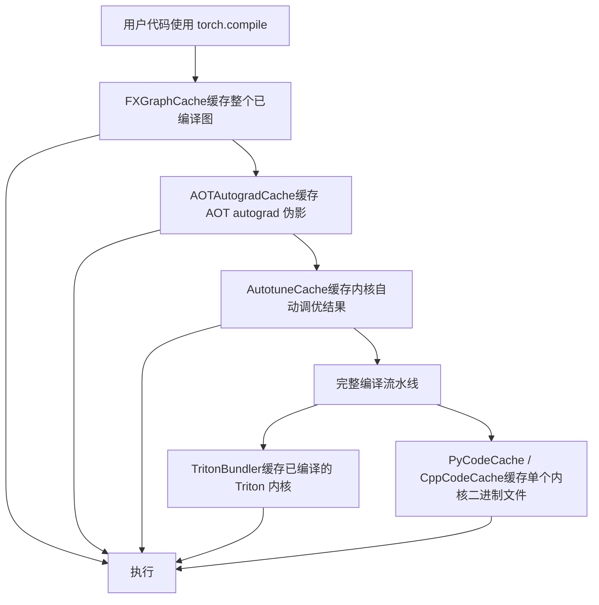
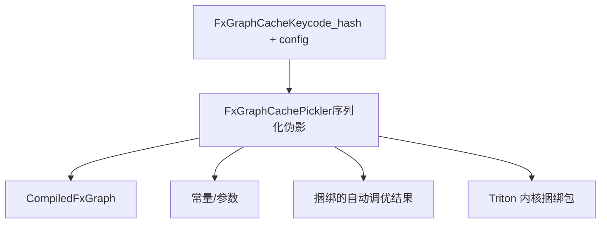
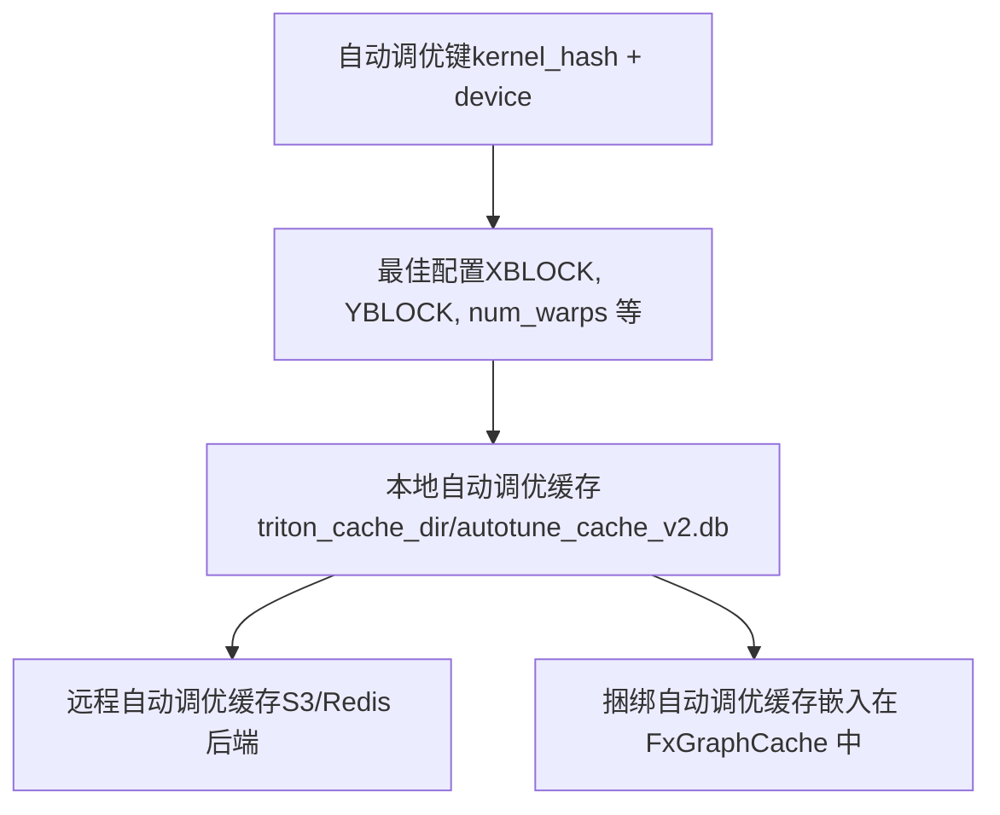
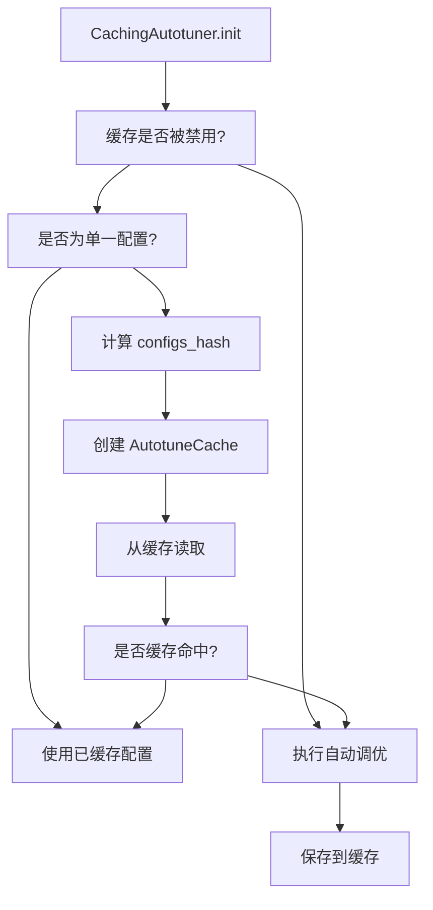
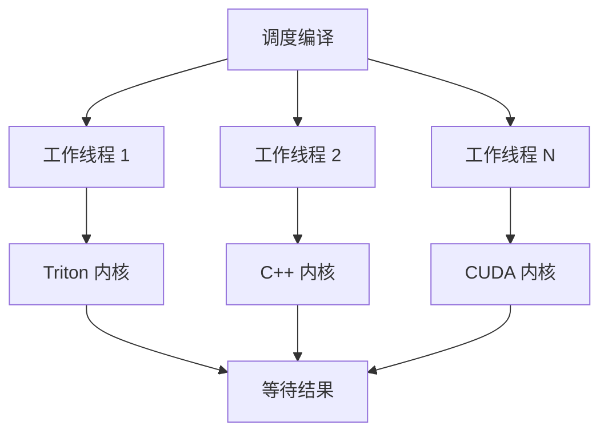
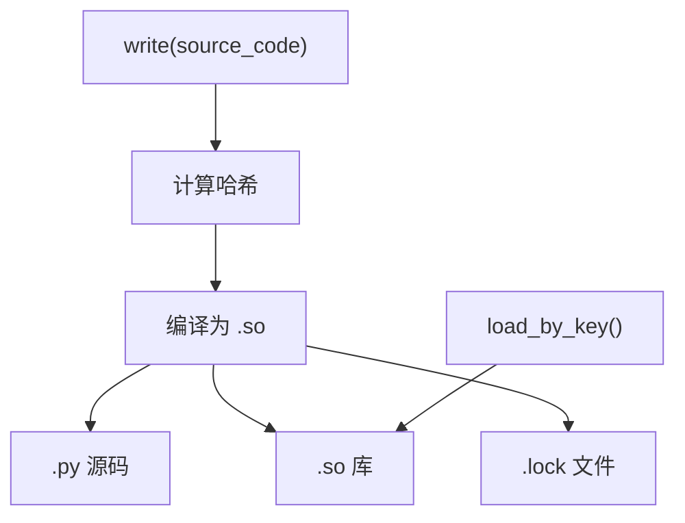
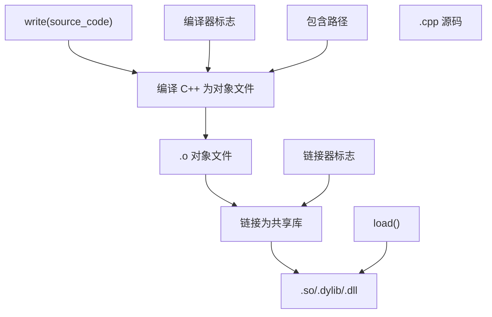
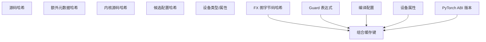
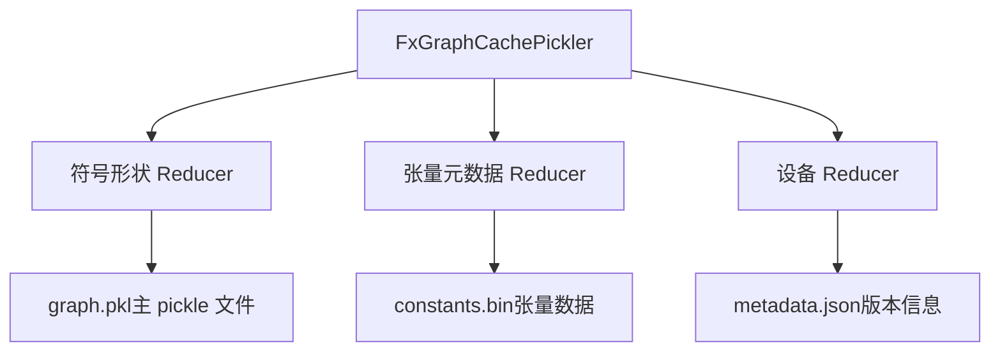
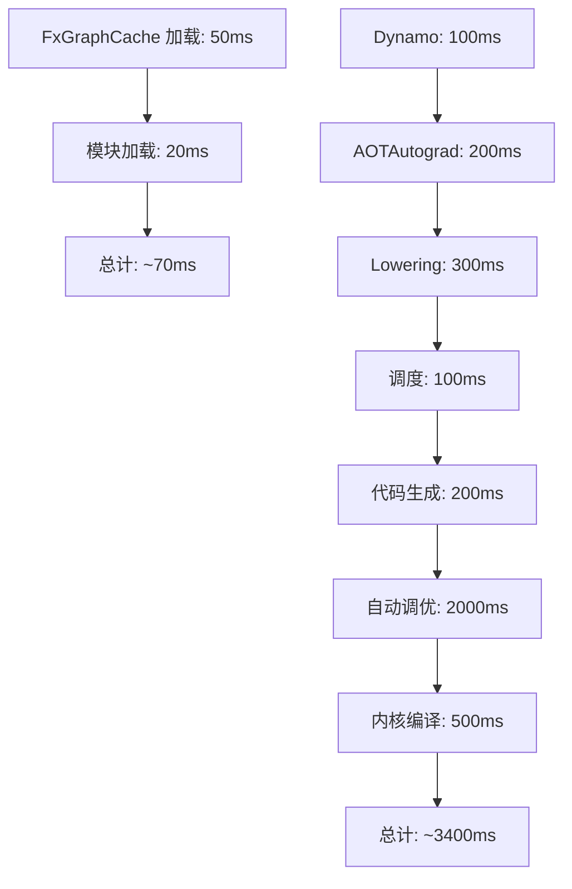

# 编译缓存与代码存储 (Compilation Cache and Code Storage)

相关源文件 (Relevant source files)

-   [.ci/docker/common/install\_jax.sh](https://github.com/pytorch/pytorch/blob/915982a4/.ci/docker/common/install_jax.sh)
-   [benchmarks/inductor\_backends/cutlass.py](https://github.com/pytorch/pytorch/blob/915982a4/benchmarks/inductor_backends/cutlass.py)
-   [test/dynamo/test\_aot\_compile.py](https://github.com/pytorch/pytorch/blob/915982a4/test/dynamo/test_aot_compile.py)
-   [test/dynamo/test\_package.py](https://github.com/pytorch/pytorch/blob/915982a4/test/dynamo/test_package.py)
-   [test/dynamo/test\_pgo.py](https://github.com/pytorch/pytorch/blob/915982a4/test/dynamo/test_pgo.py)
-   [test/dynamo/test\_precompile\_context.py](https://github.com/pytorch/pytorch/blob/915982a4/test/dynamo/test_precompile_context.py)
-   [test/dynamo/test\_structured\_trace.py](https://github.com/pytorch/pytorch/blob/915982a4/test/dynamo/test_structured_trace.py)
-   [test/inductor/test\_auto\_functionalize.py](https://github.com/pytorch/pytorch/blob/915982a4/test/inductor/test_auto_functionalize.py)
-   [test/inductor/test\_cutedsl\_template.py](https://github.com/pytorch/pytorch/blob/915982a4/test/inductor/test_cutedsl_template.py)
-   [test/inductor/test\_cutlass\_backend.py](https://github.com/pytorch/pytorch/blob/915982a4/test/inductor/test_cutlass_backend.py)
-   [test/inductor/test\_cutlass\_evt.py](https://github.com/pytorch/pytorch/blob/915982a4/test/inductor/test_cutlass_evt.py)
-   [test/inductor/test\_pallas.py](https://github.com/pytorch/pytorch/blob/915982a4/test/inductor/test_pallas.py)
-   [test/inductor/test\_provenance\_tracing.py](https://github.com/pytorch/pytorch/blob/915982a4/test/inductor/test_provenance_tracing.py)
-   [torch/\_dynamo/aot\_compile.py](https://github.com/pytorch/pytorch/blob/915982a4/torch/_dynamo/aot_compile.py)
-   [torch/\_dynamo/package.py](https://github.com/pytorch/pytorch/blob/915982a4/torch/_dynamo/package.py)
-   [torch/\_dynamo/pgo.py](https://github.com/pytorch/pytorch/blob/915982a4/torch/_dynamo/pgo.py)
-   [torch/\_dynamo/precompile\_context.py](https://github.com/pytorch/pytorch/blob/915982a4/torch/_dynamo/precompile_context.py)
-   [torch/\_inductor/\_\_init\_\_.py](https://github.com/pytorch/pytorch/blob/915982a4/torch/_inductor/__init__.py)
-   [torch/\_inductor/codecache.py](https://github.com/pytorch/pytorch/blob/915982a4/torch/_inductor/codecache.py)
-   [torch/\_inductor/codegen/cpp\_flex\_attention\_template.py](https://github.com/pytorch/pytorch/blob/915982a4/torch/_inductor/codegen/cpp_flex_attention_template.py)
-   [torch/\_inductor/codegen/cpp\_template\_kernel.py](https://github.com/pytorch/pytorch/blob/915982a4/torch/_inductor/codegen/cpp_template_kernel.py)
-   [torch/\_inductor/codegen/cutedsl/README.md](https://github.com/pytorch/pytorch/blob/915982a4/torch/_inductor/codegen/cutedsl/README.md)
-   [torch/\_inductor/codegen/cutedsl/\_\_init\_\_.py](https://github.com/pytorch/pytorch/blob/915982a4/torch/_inductor/codegen/cutedsl/__init__.py)
-   [torch/\_inductor/codegen/cutedsl/cutedsl\_op\_overrides.py](https://github.com/pytorch/pytorch/blob/915982a4/torch/_inductor/codegen/cutedsl/cutedsl_op_overrides.py)
-   [torch/\_inductor/codegen/cutedsl/cutedsl\_template.py](https://github.com/pytorch/pytorch/blob/915982a4/torch/_inductor/codegen/cutedsl/cutedsl_template.py)
-   [torch/\_inductor/codegen/pallas.py](https://github.com/pytorch/pytorch/blob/915982a4/torch/_inductor/codegen/pallas.py)
-   [torch/\_inductor/compile\_fx.py](https://github.com/pytorch/pytorch/blob/915982a4/torch/_inductor/compile_fx.py)
-   [torch/\_inductor/debug.py](https://github.com/pytorch/pytorch/blob/915982a4/torch/_inductor/debug.py)
-   [torch/\_inductor/runtime/runtime\_utils.py](https://github.com/pytorch/pytorch/blob/915982a4/torch/_inductor/runtime/runtime_utils.py)
-   [torch/compiler/\_\_init\_\_.py](https://github.com/pytorch/pytorch/blob/915982a4/torch/compiler/__init__.py)
-   [torch/compiler/\_cache.py](https://github.com/pytorch/pytorch/blob/915982a4/torch/compiler/_cache.py)
-   [torch/compiler/config.py](https://github.com/pytorch/pytorch/blob/915982a4/torch/compiler/config.py)
-   [torch/testing/\_internal/inductor\_utils.py](https://github.com/pytorch/pytorch/blob/915982a4/torch/testing/_internal/inductor_utils.py)
-   [torch/utils/\_pallas.py](https://github.com/pytorch/pytorch/blob/915982a4/torch/utils/_pallas.py)

本文档描述了 TorchInductor 中多级缓存基础设施和异步编译系统。这些系统在不同阶段缓存已编译的伪影 (artifacts)，以避免重复的编译工作并缩短冷启动时间。

有关更广泛的 Inductor 后端架构的信息，请参阅 [TorchInductor 后端](/pytorch/pytorch/2.4-aot-autograd-and-functionalization)。有关内核选择和自动调优的详情，请参阅[内核选择与自动调优](#2.4.3)。

## 缓存层概览 (Overview of Caching Layers)

TorchInductor 采用多级缓存策略以最小化编译开销：


**来源：** [torch/\_inductor/codecache.py1-200](https://github.com/pytorch/pytorch/blob/915982a4/torch/_inductor/codecache.py#L1-L200) [torch/\_inductor/compile\_fx.py1-100](https://github.com/pytorch/pytorch/blob/915982a4/torch/_inductor/compile_fx.py#L1-L100)

## FXGraphCache：图级缓存 (FXGraphCache: Graph-Level Caching)

`FxGraphCache` 是顶层缓存，存储整个已编译图，从而避免重新编译已经见过的图。

### 缓存结构 (Cache Structure)


### 键生成 (Key Generation)

缓存键由以下内容计算得出：

-   FX 图代码哈希（字节码级表示）
-   Guard 条件和动态形状约束
-   影响编译的配置标志位
-   设备属性与能力

[torch/\_inductor/codecache.py2600-2750](https://github.com/pytorch/pytorch/blob/915982a4/torch/_inductor/codecache.py#L2600-L2750) 展示了处理缓存项序列化的 `FxGraphCachePickler` 类。键生成逻辑在 `FxGraphCache._get_cache_key()` 中，包含：

| 组件 | 描述 | 目的 |
| --- | --- | --- |
| 代码哈希 (Code Hash) | FX 图字节码的哈希 | 识别唯一的图结构 |
| Guards | 动态形状 guards | 确保符号形状的正确性 |
| 配置哈希 (Config Hash) | 编译配置 | 配置改变时使缓存失效 |
| 设备属性 (Device Props) | GPU/CPU 属性 | 处理设备特定的编译 |
| ABI 版本 | PyTorch ABI 版本 | PyTorch 版本改变时使缓存失效 |

**来源：** [torch/\_inductor/codecache.py2200-2400](https://github.com/pytorch/pytorch/blob/915982a4/torch/_inductor/codecache.py#L2200-L2400) [torch/\_inductor/compile\_fx.py400-600](https://github.com/pytorch/pytorch/blob/915982a4/torch/_inductor/compile_fx.py#L400-L600)

### 缓存查找流程 (Cache Lookup Flow)

> **[Mermaid sequence]**
> *(图表结构无法解析)*

`FxGraphCache` 同时支持本地和远程缓存。配置标志位控制此行为：

-   `config.fx_graph_cache`：启用本地缓存
-   `config.fx_graph_remote_cache`：启用远程缓存
-   `config.bundle_triton_into_fx_graph_cache`：在缓存中包含 Triton 内核

**来源：** [torch/\_inductor/codecache.py2400-2600](https://github.com/pytorch/pytorch/blob/915982a4/torch/_inductor/codecache.py#L2400-L2600) [torch/\_inductor/compile\_fx.py800-1000](https://github.com/pytorch/pytorch/blob/915982a4/torch/_inductor/compile_fx.py#L800-L1000)

## 自动调优缓存 (Autotune Cache)

自动调优缓存存储自动调优期间发现的最佳内核配置，从而避免对内核进行重复基准测试。

### AutotuneCache 结构 (AutotuneCache Structure)


### 自动调优缓存检查 (Autotune Cache Checking)

[torch/\_inductor/runtime/triton\_heuristics.py257-304](https://github.com/pytorch/pytorch/blob/915982a4/torch/_inductor/runtime/triton_heuristics.py#L257-L304) 中的 `check_autotune_cache` 函数决定是使用缓存的配置还是执行自动调优：


`CachingAutotuner` 类集成了缓存系统：

-   **预编译 (Precompilation)**：预先编译所有候选配置
-   **基准测试 (Benchmarking)**：衡量每个配置的性能
-   **缓存 (Caching)**：存储最佳配置以供复用
-   **坐标下降调优 (Coordinate Descent Tuning)**：可选的迭代优化

**来源：** [torch/\_inductor/runtime/triton\_heuristics.py306-450](https://github.com/pytorch/pytorch/blob/915982a4/torch/_inductor/runtime/triton_heuristics.py#L306-L450) [torch/\_inductor/select\_algorithm.py1-100](https://github.com/pytorch/pytorch/blob/915982a4/torch/_inductor/select_algorithm.py#L1-L100)

## Triton Bundler：内核伪影缓存 (Triton Bundler: Kernel Artifact Caching)

`TritonBundler` 管理 Triton 内核编译伪影，以实现在无需重新编译的情况下快速加载。

### Bundler 架构 (Bundler Architecture)

[torch/\_inductor/triton\_bundler.py1-200](https://github.com/pytorch/pytorch/blob/915982a4/torch/_inductor/triton_bundler.py#L1-L200) 中的 `TritonBundler` 类提供：

**关键方法：**

| 方法 | 目的 |
| --- | --- |
| `put(key, device)` | 存储内核以便后续捆绑 |
| `get_stored_bundle()` | 检索已捆绑内核 |
| `put_static_autotuner()` | 缓存自动调优器实例 |
| `get_static_autotuner()` | 加载已缓存的自动调优器 |

当启用 `config.bundle_triton_into_fx_graph_cache` 时，Triton 内核直接嵌入到 FxGraphCache 中，消除了单独的 Triton 缓存查找。

**来源：** [torch/\_inductor/triton\_bundler.py1-200](https://github.com/pytorch/pytorch/blob/915982a4/torch/_inductor/triton_bundler.py#L1-L200) [torch/\_inductor/codecache.py2600-2700](https://github.com/pytorch/pytorch/blob/915982a4/torch/_inductor/codecache.py#L2600-L2700)

## AsyncCompile：并行编译基础设施 (AsyncCompile: Parallel Compilation Infrastructure)

`AsyncCompile` 系统支持并行编译多个内核，以减少墙钟编译时间。

### 编译流水线 (Compilation Pipeline)


### AsyncCompile 实现 (AsyncCompile Implementation)

[torch/\_inductor/codecache.py500-700](https://github.com/pytorch/pytorch/blob/915982a4/torch/_inductor/codecache.py#L500-L700) 中的 `AsyncCompile` 类管理一个用于并行编译的线程池：

> **[Mermaid sequence]**
> *(图表结构无法解析)*

**关键特性：**

-   **并行编译**：同时编译多个内核
-   **缓存集成**：结果被原子地写入缓存
-   **错误处理**：编译失败会被记录并重试
-   **热缓存支持**：针对缓存命中提供了快速路径

配置：

-   `config.compile_threads`：工作线程数量（默认：CPU 核心数）
-   工作线程池在首次使用时延迟初始化
-   启用 `config.autotune_in_subproc` 时，使用子进程池进行 Triton 自动调优

**来源：** [torch/\_inductor/codecache.py500-800](https://github.com/pytorch/pytorch/blob/915982a4/torch/_inductor/codecache.py#L500-L800) [torch/\_inductor/async\_compile.py1-200](https://github.com/pytorch/pytorch/blob/915982a4/torch/_inductor/async_compile.py#L1-L200)

## 代码缓存实现 (Code Cache Implementations)

TorchInductor 为不同的代码类型提供了专门的缓存实现。

### PyCodeCache

缓存由 Python 生成的内核（主要是 Triton）：


**位置**：`torch_compile/[hash].py` 和 `torch_compile/[hash].so`

**关键方法：**

-   `write(source_code, extra)`：编译并缓存 Python 代码
-   `load_by_key(key)`：加载已缓存的模块
-   `get_hash(source_code)`：计算缓存键

**来源：** [torch/\_inductor/codecache.py1500-1700](https://github.com/pytorch/pytorch/blob/915982a4/torch/_inductor/codecache.py#L1500-L1700)

### CppCodeCache

缓存针对 CPU 和 GPU 的 C++ 内核：


**位置**：`torch_compile/[hash].cpp` 和 `torch_compile/[hash].so`

**特化：**

-   `CUDACodeCache`：CUDA 内核 (nvcc 编译)
-   `ROCmCodeCache`：ROCm 内核 (hipcc 编译)
-   `CppWrapperCodeCache`：用于脱离 Python 执行的 C++ 包装器

**来源：** [torch/\_inductor/codecache.py1800-2200](https://github.com/pytorch/pytorch/blob/915982a4/torch/_inductor/codecache.py#L1800-L2200) [torch/\_inductor/cpp\_builder.py1-500](https://github.com/pytorch/pytorch/blob/915982a4/torch/_inductor/cpp_builder.py#L1-L500)

## 缓存键生成 (Cache Key Generation)

缓存键必须稳定且详尽，以在最大化命中率的同时确保正确性。

### 键组件 (Key Components)


### 哈希计算 (Hash Computation)

[torch/\_inductor/codecache.py100-200](https://github.com/pytorch/pytorch/blob/915982a4/torch/_inductor/codecache.py#L100-L200) 中的 `code_hash` 函数计算稳定的哈希：

```python
# codecache.py 的简化版本
def code_hash(code: str, extra: str = "") -> str:    
    """    
    计算缓存键的哈希。    
    包含针对跨平台稳定性的归一化 (normalization)。    
    """    
    # 归一化空格和注释    
    normalized = normalize_code(code)        
    # 与额外元数据组合    
    combined = normalized + extra        
    # SHA256 哈希    
    return hashlib.sha256(combined.encode()).hexdigest()
```
**哈希输入：**

对于 FXGraphCache：

-   FX 图结构与操作
-   输入形状/数据类型（具体或符号化）
-   Guard 条件
-   配置标志位：`config.max_autotune`、`config.triton.*` 等
-   设备能力：SM 版本、最大线程数等

对于 AutotuneCache：

-   内核源代码
-   候选配置空间
-   设备属性
-   输入大小提示 (size hints)

**来源：** [torch/\_inductor/codecache.py100-300](https://github.com/pytorch/pytorch/blob/915982a4/torch/_inductor/codecache.py#L100-L300) [torch/\_inductor/runtime/triton\_heuristics.py100-200](https://github.com/pytorch/pytorch/blob/915982a4/torch/_inductor/runtime/triton_heuristics.py#L100-L200)

## 缓存管理与失效 (Cache Management and Invalidation)

妥善的缓存管理确保了正确性并防止无限制的增长。

### 缓存目录结构 (Cache Directory Structure)

```
$TORCH_CACHE_DIR/inductor_cache/
├── fx_graph_cache_v1/
│   ├── [hash]_py.pkl          # Pickle 序列化的 FxGraph 伪影
│   └── [hash]_constants.bin   # 序列化的常量
├── autotune_cache_v2.db        # SQLite 自动调优缓存
├── triton_cache/               # Triton 内核缓存
│   ├── [hash].so
│   └── [hash].json
└── torch_compile/              # PyCodeCache
    ├── [hash].py
    └── [hash].so
```
### 失效触发器 (Invalidation Triggers)

| 触发器 | 范围 | 行为 |
| --- | --- | --- |
| PyTorch 版本改变 | 所有缓存 | 通过 ABI 版本检查进行全量失效 |
| 配置改变 | FXGraphCache | 生成新的缓存键 |
| 设备改变 | 设备特定 | 每个设备拥有独立的缓存项 |
| Guard 失败 | FXGraphCache | 运行时 guard 检查触发重新编译 |
| 手动清理 | 所有缓存 | `torch._inductor.codecache.clear_cache()` |

### 缓存大小管理 (Cache Size Management)

缓存实现了类似 LRU（最近最少使用）的行为：

-   根据访问时间定期清理旧条目
-   通过 `config.cache_size_limit` 可配置
-   针对每个设备设置配额，防止单个设备占用过多空间

**来源：** [torch/\_inductor/codecache.py200-400](https://github.com/pytorch/pytorch/blob/915982a4/torch/_inductor/codecache.py#L200-L400) [torch/\_inductor/runtime/runtime\_utils.py50-150](https://github.com/pytorch/pytorch/blob/915982a4/torch/_inductor/runtime/runtime_utils.py#L50-L150)

## 与编译流水线集成 (Integration with Compilation Pipeline)

缓存系统集成在编译流程的多个点。

### 带有缓存的编译 (Compilation with Caching)

> **[Mermaid sequence]**
> *(图表结构无法解析)*

### 热缓存优化 (Warm Cache Optimization)

对于部署场景，可以预热缓存：

1.  **AOT 缓存生成**：使用代表性输入进行编译，保存缓存
2.  **缓存分发**：将缓存与模型伪影一起打包
3.  **快速启动**：首次运行从缓存加载，无需编译

配置：

-   `config.fx_graph_cache = True`：启用本地缓存
-   `config.fx_graph_remote_cache`：使用远程缓存服务
-   `config.bundle_triton_into_fx_graph_cache`：包含所有 Triton 伪影

**来源：** [torch/\_inductor/compile\_fx.py200-400](https://github.com/pytorch/pytorch/blob/915982a4/torch/_inductor/compile_fx.py#L200-L400) [torch/\_inductor/codecache.py2600-2800](https://github.com/pytorch/pytorch/blob/915982a4/torch/_inductor/codecache.py#L2600-L2800)

## 缓存序列化 (Cache Serialization)

缓存针对不同内容类型使用了优化的多种序列化格式。

### FXGraphCache 序列化 (FXGraphCache Serialization)


[torch/\_inductor/codecache.py2600-2750](https://github.com/pytorch/pytorch/blob/915982a4/torch/_inductor/codecache.py#L2600-L2750) 中的 `FxGraphCachePickler` 处理特殊类型：

-   **SymInt/SymFloat**：序列化符号表达式
-   **FakeTensor**：仅存储元数据
-   **torch.device**：转换为可序列化格式
-   **代码对象**：处理函数引用

**关键特性：**

-   **确定性**：相同的图产生相同的 pickle
-   **紧凑性**：张量数据以二进制格式分开存储
-   **版本感知**：包含 PyTorch 版本以供失效检查

**来源：** [torch/\_inductor/codecache.py2600-2900](https://github.com/pytorch/pytorch/blob/915982a4/torch/_inductor/codecache.py#L2600-L2900)

## 性能特征 (Performance Characteristics)

理解缓存性能有助于优化编译时间。

### 缓存命中率 (Cache Hit Rates)

各级缓存的典型命中率：

| 缓存级别 | 冷启动 | 热缓存 | 生产环境 |
| --- | --- | --- | --- |
| FxGraphCache | 0% | 90-95% | 95-99% |
| AutotuneCache | 0-10% | 80-90% | 85-95% |
| PyCodeCache | 10-20% | 95-99% | 99%+ |

**衡量指标：**

-   `torch._dynamo.utils.counters` 追踪缓存命中/未命中
-   在 `TORCH_LOGS="+inductor"` 级别记录

### 编译时间分解 (Compilation Time Breakdown)

在缓存有效的情况下：


**优化策略：**

-   为生产环境部署预热缓存
-   为分布式团队使用远程缓存
-   在 FxGraphCache 中捆绑 Triton 内核实现单次加载
-   启用 `config.autotune_in_subproc` 进行并行自动调优

**来源：** [torch/\_inductor/compile\_fx.py1-100](https://github.com/pytorch/pytorch/blob/915982a4/torch/_inductor/compile_fx.py#L1-L100) [torch/\_inductor/metrics.py1-200](https://github.com/pytorch/pytorch/blob/915982a4/torch/_inductor/metrics.py#L1-L200)
