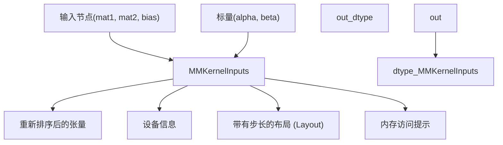
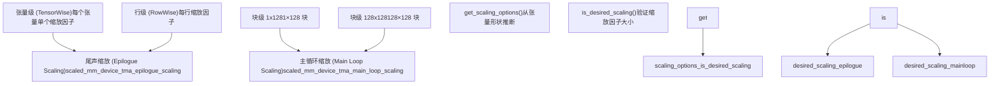
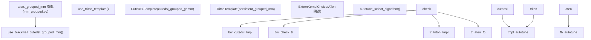
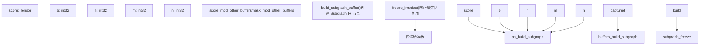
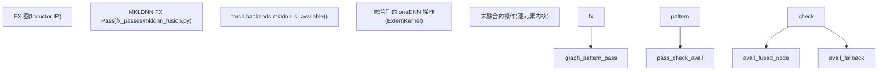

# 特殊内核实现 (Specialized Kernel Implementations)

相关源文件 (Relevant source files)

-   [.ci/pytorch/macos-build.sh](https://github.com/pytorch/pytorch/blob/915982a4/.ci/pytorch/macos-build.sh)
-   [.ci/pytorch/macos-common.sh](https://github.com/pytorch/pytorch/blob/915982a4/.ci/pytorch/macos-common.sh)
-   [.ci/pytorch/macos-test.sh](https://github.com/pytorch/pytorch/blob/915982a4/.ci/pytorch/macos-test.sh)
-   [.gitignore](https://github.com/pytorch/pytorch/blob/915982a4/.gitignore)
-   [BUILD.bazel](https://github.com/pytorch/pytorch/blob/915982a4/BUILD.bazel)
-   [CMakeLists.txt](https://github.com/pytorch/pytorch/blob/915982a4/CMakeLists.txt)
-   [aten/src/ATen/native/cuda/int8mm.cu](https://github.com/pytorch/pytorch/blob/915982a4/aten/src/ATen/native/cuda/int8mm.cu)
-   [buckbuild.bzl](https://github.com/pytorch/pytorch/blob/915982a4/buckbuild.bzl)
-   [c10/core/impl/alloc\_cpu.cpp](https://github.com/pytorch/pytorch/blob/915982a4/c10/core/impl/alloc_cpu.cpp)
-   [c10/ovrsource\_defs.bzl](https://github.com/pytorch/pytorch/blob/915982a4/c10/ovrsource_defs.bzl)
-   [cmake/Dependencies.cmake](https://github.com/pytorch/pytorch/blob/915982a4/cmake/Dependencies.cmake)
-   [cmake/Summary.cmake](https://github.com/pytorch/pytorch/blob/915982a4/cmake/Summary.cmake)
-   [cmake/public/cuda.cmake](https://github.com/pytorch/pytorch/blob/915982a4/cmake/public/cuda.cmake)
-   [docs/source/nn.attention.flex\_attention.md](https://github.com/pytorch/pytorch/blob/915982a4/docs/source/nn.attention.flex_attention.md)
-   [setup.py](https://github.com/pytorch/pytorch/blob/915982a4/setup.py)
-   [test/higher\_order\_ops/test\_local\_map.py](https://github.com/pytorch/pytorch/blob/915982a4/test/higher_order_ops/test_local_map.py)
-   [test/inductor/test\_cpu\_cpp\_wrapper.py](https://github.com/pytorch/pytorch/blob/915982a4/test/inductor/test_cpu_cpp_wrapper.py)
-   [test/inductor/test\_cpu\_select\_algorithm.py](https://github.com/pytorch/pytorch/blob/915982a4/test/inductor/test_cpu_select_algorithm.py)
-   [test/inductor/test\_custom\_lowering.py](https://github.com/pytorch/pytorch/blob/915982a4/test/inductor/test_custom_lowering.py)
-   [test/inductor/test\_cutedsl\_grouped\_mm.py](https://github.com/pytorch/pytorch/blob/915982a4/test/inductor/test_cutedsl_grouped_mm.py)
-   [test/inductor/test\_distributed\_patterns.py](https://github.com/pytorch/pytorch/blob/915982a4/test/inductor/test_distributed_patterns.py)
-   [test/inductor/test\_flex\_attention.py](https://github.com/pytorch/pytorch/blob/915982a4/test/inductor/test_flex_attention.py)
-   [test/inductor/test\_flex\_flash.py](https://github.com/pytorch/pytorch/blob/915982a4/test/inductor/test_flex_flash.py)
-   [test/inductor/test\_gpu\_cpp\_wrapper.py](https://github.com/pytorch/pytorch/blob/915982a4/test/inductor/test_gpu_cpp_wrapper.py)
-   [test/inductor/test\_gpu\_select\_algorithm.py](https://github.com/pytorch/pytorch/blob/915982a4/test/inductor/test_gpu_select_algorithm.py)
-   [test/inductor/test\_mem\_estimation.py](https://github.com/pytorch/pytorch/blob/915982a4/test/inductor/test_mem_estimation.py)
-   [test/inductor/test\_minifier.py](https://github.com/pytorch/pytorch/blob/915982a4/test/inductor/test_minifier.py)
-   [test/inductor/test\_mkldnn\_pattern\_matcher.py](https://github.com/pytorch/pytorch/blob/915982a4/test/inductor/test_mkldnn_pattern_matcher.py)
-   [test/inductor/test\_move\_constructors\_to\_gpu.py](https://github.com/pytorch/pytorch/blob/915982a4/test/inductor/test_move_constructors_to_gpu.py)
-   [test/inductor/test\_select\_algorithm.py](https://github.com/pytorch/pytorch/blob/915982a4/test/inductor/test_select_algorithm.py)
-   [test/inductor/test\_torchinductor\_opinfo.py](https://github.com/pytorch/pytorch/blob/915982a4/test/inductor/test_torchinductor_opinfo.py)
-   [test/inductor/test\_torchinductor\_strided\_blocks.py](https://github.com/pytorch/pytorch/blob/915982a4/test/inductor/test_torchinductor_strided_blocks.py)
-   [test/inductor/test\_triton\_kernels.py](https://github.com/pytorch/pytorch/blob/915982a4/test/inductor/test_triton_kernels.py)
-   [test/test\_nestedtensor.py](https://github.com/pytorch/pytorch/blob/915982a4/test/test_nestedtensor.py)
-   [torch/CMakeLists.txt](https://github.com/pytorch/pytorch/blob/915982a4/torch/CMakeLists.txt)
-   [torch/\_higher\_order\_ops/flex\_attention.py](https://github.com/pytorch/pytorch/blob/915982a4/torch/_higher_order_ops/flex_attention.py)
-   [torch/\_higher\_order\_ops/local\_map.py](https://github.com/pytorch/pytorch/blob/915982a4/torch/_higher_order_ops/local_map.py)
-   [torch/\_higher\_order\_ops/triton\_kernel\_wrap.py](https://github.com/pytorch/pytorch/blob/915982a4/torch/_higher_order_ops/triton_kernel_wrap.py)
-   [torch/\_inductor/codegen/cutedsl/\_cutedsl\_utils.py](https://github.com/pytorch/pytorch/blob/915982a4/torch/_inductor/codegen/cutedsl/_cutedsl_utils.py)
-   [torch/\_inductor/codegen/cutedsl/cutedsl\_kernel.py](https://github.com/pytorch/pytorch/blob/915982a4/torch/_inductor/codegen/cutedsl/cutedsl_kernel.py)
-   [torch/\_inductor/fx\_passes/mkldnn\_fusion.py](https://github.com/pytorch/pytorch/blob/915982a4/torch/_inductor/fx_passes/mkldnn_fusion.py)
-   [torch/\_inductor/fx\_passes/quantization.py](https://github.com/pytorch/pytorch/blob/915982a4/torch/_inductor/fx_passes/quantization.py)
-   [torch/\_inductor/jagged\_lowerings.py](https://github.com/pytorch/pytorch/blob/915982a4/torch/_inductor/jagged_lowerings.py)
-   [torch/\_inductor/kernel/flex/common.py](https://github.com/pytorch/pytorch/blob/915982a4/torch/_inductor/kernel/flex/common.py)
-   [torch/\_inductor/kernel/flex/flex\_attention.py](https://github.com/pytorch/pytorch/blob/915982a4/torch/_inductor/kernel/flex/flex_attention.py)
-   [torch/\_inductor/kernel/flex/flex\_cpu.py](https://github.com/pytorch/pytorch/blob/915982a4/torch/_inductor/kernel/flex/flex_cpu.py)
-   [torch/\_inductor/kernel/flex/flex\_decoding.py](https://github.com/pytorch/pytorch/blob/915982a4/torch/_inductor/kernel/flex/flex_decoding.py)
-   [torch/\_inductor/kernel/flex/flex\_flash\_attention.py](https://github.com/pytorch/pytorch/blob/915982a4/torch/_inductor/kernel/flex/flex_flash_attention.py)
-   [torch/\_inductor/kernel/flex/templates/common.py.jinja](https://github.com/pytorch/pytorch/blob/915982a4/torch/_inductor/kernel/flex/templates/common.py.jinja)
-   [torch/\_inductor/kernel/flex/templates/flash\_attention.py.jinja](https://github.com/pytorch/pytorch/blob/915982a4/torch/_inductor/kernel/flex/templates/flash_attention.py.jinja)
-   [torch/\_inductor/kernel/flex/templates/flash\_attention\_backward.py.jinja](https://github.com/pytorch/pytorch/blob/915982a4/torch/_inductor/kernel/flex/templates/flash_attention_backward.py.jinja)
-   [torch/\_inductor/kernel/flex/templates/flex\_attention.py.jinja](https://github.com/pytorch/pytorch/blob/915982a4/torch/_inductor/kernel/flex/templates/flex_attention.py.jinja)
-   [torch/\_inductor/kernel/flex/templates/flex\_backwards.py.jinja](https://github.com/pytorch/pytorch/blob/915982a4/torch/_inductor/kernel/flex/templates/flex_backwards.py.jinja)
-   [torch/\_inductor/kernel/flex/templates/flex\_decode.py.jinja](https://github.com/pytorch/pytorch/blob/915982a4/torch/_inductor/kernel/flex/templates/flex_decode.py.jinja)
-   [torch/\_inductor/kernel/flex/templates/utilities.py.jinja](https://github.com/pytorch/pytorch/blob/915982a4/torch/_inductor/kernel/flex/templates/utilities.py.jinja)
-   [torch/\_inductor/kernel/mm\_common.py](https://github.com/pytorch/pytorch/blob/915982a4/torch/_inductor/kernel/mm_common.py)
-   [torch/\_inductor/kernel/mm\_grouped.py](https://github.com/pytorch/pytorch/blob/915982a4/torch/_inductor/kernel/mm_grouped.py)
-   [torch/\_inductor/kernel/templates/cutedsl\_mm\_grouped.py.jinja](https://github.com/pytorch/pytorch/blob/915982a4/torch/_inductor/kernel/templates/cutedsl_mm_grouped.py.jinja)
-   [torch/\_inductor/mkldnn\_ir.py](https://github.com/pytorch/pytorch/blob/915982a4/torch/_inductor/mkldnn_ir.py)
-   [torch/\_inductor/mkldnn\_lowerings.py](https://github.com/pytorch/pytorch/blob/915982a4/torch/_inductor/mkldnn_lowerings.py)
-   [torch/\_inductor/subgraph\_lowering.py](https://github.com/pytorch/pytorch/blob/915982a4/torch/_inductor/subgraph_lowering.py)
-   [torch/\_inductor/template\_heuristics/cutedsl.py](https://github.com/pytorch/pytorch/blob/915982a4/torch/_inductor/template_heuristics/cutedsl.py)
-   [torch/csrc/jit/serialization/unpickler.h](https://github.com/pytorch/pytorch/blob/915982a4/torch/csrc/jit/serialization/unpickler.h)
-   [torch/distributed/\_\_init\_\_.py](https://github.com/pytorch/pytorch/blob/915982a4/torch/distributed/__init__.py)
-   [torch/distributed/\_shard/sharded\_tensor/reshard.py](https://github.com/pytorch/pytorch/blob/915982a4/torch/distributed/_shard/sharded_tensor/reshard.py)
-   [torch/distributed/\_shard/sharding\_spec/chunk\_sharding\_spec\_ops/embedding\_bag.py](https://github.com/pytorch/pytorch/blob/915982a4/torch/distributed/_shard/sharding_spec/chunk_sharding_spec_ops/embedding_bag.py)
-   [torch/distributed/nn/functional.py](https://github.com/pytorch/pytorch/blob/915982a4/torch/distributed/nn/functional.py)
-   [torch/nested/\_internal/nested\_tensor.py](https://github.com/pytorch/pytorch/blob/915982a4/torch/nested/_internal/nested_tensor.py)
-   [torch/nested/\_internal/ops.py](https://github.com/pytorch/pytorch/blob/915982a4/torch/nested/_internal/ops.py)
-   [torch/nn/attention/\_utils.py](https://github.com/pytorch/pytorch/blob/915982a4/torch/nn/attention/_utils.py)
-   [torch/nn/attention/flex\_attention.py](https://github.com/pytorch/pytorch/blob/915982a4/torch/nn/attention/flex_attention.py)

本文档描述了 TorchInductor 针对高性能操作的特殊内核实现：标准和分组矩阵乘法、灵活的注意力机制、MKLDNN CPU 融合模式以及量化处理 (quantization passes)。这些实现通过具有自动调优能力的后端特定代码生成，提供了优化。

有关通用内核选择和自动调优框架的信息，请参阅[内核选择与自动调优 (Kernel Selection and Autotuning)](/pytorch/pytorch/2.5.3-kernel-selection-and-autotuning)。有关代码生成后端（Triton, CUTLASS, C++），请参阅[代码生成：Triton, CUTLASS, C++](/pytorch/pytorch/2.5.4-code-generation:-triton-cutlass-pallas-c++)。有关内核选择之前的 IR 和降低 (lowering) 过程，请参阅 [Inductor IR 与降低 (Inductor IR and Lowering)](/pytorch/pytorch/2.5.1-inductor-ir-and-lowering)。

## 矩阵乘法内核系列 (Matrix Multiplication Kernel Family)

TorchInductor 为各种矩阵乘法操作提供了专门的降低函数，每个函数都通过基于模板的代码生成支持多个后端实现。

### 核心 MM 操作 (Core MM Operations)

[torch/\_inductor/kernel/mm.py304-549](https://github.com/pytorch/pytorch/blob/915982a4/torch/_inductor/kernel/mm.py#L304-L549) 中的 `tuned_mm` 函数处理 `aten.mm` 的降低，并支持多个后端：


来源： [torch/\_inductor/kernel/mm.py304-549](https://github.com/pytorch/pytorch/blob/915982a4/torch/_inductor/kernel/mm.py#L304-L549) [torch/\_inductor/kernel/mm.py84-121](https://github.com/pytorch/pytorch/blob/915982a4/torch/_inductor/kernel/mm.py#L84-L121) [torch/\_inductor/kernel/bmm.py53-58](https://github.com/pytorch/pytorch/blob/915982a4/torch/_inductor/kernel/bmm.py#L53-L58)

**关键内核变体：**

| 操作 | 函数 | 模板 | 特殊功能 |
| --- | --- | --- | --- |
| 标准 MM | `tuned_mm` | `mm_template` | 基础矩阵乘法 |
| 批量 MM | `tuned_bmm` | `bmm_template` | 批量操作 |
| AddMM | `tuned_addmm` | `mm_template` | 偏置融合 (C = αAB + βC) |
| Int8 MM | `tuned_int_mm` | `mm_template` | 整数操作 |
| 缩放 MM | `tuned_scaled_mm` | `scaled_mm_*_template` | FP8 缩放支持 |
| 稀疏 MM | `tuned_sparse_semi_structured_mm` | CUTLASS | 2:4 稀疏度 |

来源： [torch/\_inductor/kernel/mm.py304-549](https://github.com/pytorch/pytorch/blob/915982a4/torch/_inductor/kernel/mm.py#L304-L549) [torch/\_inductor/kernel/mm.py552-598](https://github.com/pytorch/pytorch/blob/915982a4/torch/_inductor/kernel/mm.py#L552-L598) [torch/\_inductor/kernel/mm.py601-716](https://github.com/pytorch/pytorch/blob/915982a4/torch/_inductor/kernel/mm.py#L601-L716) [torch/\_inductor/kernel/mm.py860-1017](https://github.com/pytorch/pytorch/blob/915982a4/torch/_inductor/kernel/mm.py#L860-L1017) [torch/\_inductor/kernel/bmm.py72-228](https://github.com/pytorch/pytorch/blob/915982a4/torch/_inductor/kernel/bmm.py#L72-L228)

### Triton 模板 (Triton Templates)

主要的 Triton 模板使用网格函数和源代码定义：

```python
# 标准 MM 模板
mm_template = TritonTemplate(    
    name="mm",    
    grid=mm_grid,    
    source=load_kernel_template("triton_mm"),    
    cache_codegen_enabled_for_template=True,    
    prologue_loads_all_inputs=True,
)

# 持久化 TMA 模板 (Hopper+ GPU)
persistent_tma_mm_template = TritonTemplate(    
    name="mm_persistent_tma",    
    grid=persistent_mm_grid,    
    source=load_kernel_template("triton_persistent_tma_mm"),
)

# Blackwell 优化的模板
blackwell_ws_persistent_device_tma_mm_template = TritonTemplate(    
    name="blackwell_ws_persistent_device_tma",    
    grid=persistent_mm_grid,    
    source=load_kernel_template("triton_blackwell_ws_persistent_device_tma_mm"),
)
```
来源： [torch/\_inductor/kernel/mm.py84-121](https://github.com/pytorch/pytorch/blob/915982a4/torch/_inductor/kernel/mm.py#L84-L121) [torch/\_inductor/kernel/mm\_common.py60-96](https://github.com/pytorch/pytorch/blob/915982a4/torch/_inductor/kernel/mm_common.py#L60-L96)

### 内核输入处理 (Kernel Input Handling)

所有的 MM 操作都使用 `MMKernelInputs` 类 [torch/\_inductor/kernel\_inputs.py143-249](https://github.com/pytorch/pytorch/blob/915982a4/torch/_inductor/kernel_inputs.py#L143-L249) 来封装输入：


来源： [torch/\_inductor/kernel\_inputs.py143-249](https://github.com/pytorch/pytorch/blob/915982a4/torch/_inductor/kernel_inputs.py#L143-L249) [torch/\_inductor/kernel/mm.py376-377](https://github.com/pytorch/pytorch/blob/915982a4/torch/_inductor/kernel/mm.py#L376-L377)

### K 维度分解 (K-Dimension Decomposition)

对于庞大的 K 维度，`decompose_k_subgraph_template` 拆分归约：

```python
def decomposeK(a, b, k_splits):    
    m = a.shape[0]    
    n = b.shape[1]    
    k = a.shape[1]        
    k_parts = k // k_splits    
    B = k_splits    
    a_reshaped = torch.permute(a.reshape(m, B, k_parts), (1, 0, 2))    
    b_reshaped = b.reshape(B, k_parts, n)    
    result = torch.bmm(a_reshaped, b_reshaped, out_dtype=torch.float32)    
    reduced_buf = torch.sum(result, 0)    
    return reduced_buf.to(a.dtype)
```
这通过 `use_decompose_k_choice(m, n, k)` 启发式方法选择 [torch/\_inductor/kernel/mm.py411-420](https://github.com/pytorch/pytorch/blob/915982a4/torch/_inductor/kernel/mm.py#L411-L420)。

来源： [torch/\_inductor/kernel/mm.py202-248](https://github.com/pytorch/pytorch/blob/915982a4/torch/_inductor/kernel/mm.py#L202-L248) [torch/\_inductor/kernel/mm.py411-420](https://github.com/pytorch/pytorch/blob/915982a4/torch/_inductor/kernel/mm.py#L411-L420)

### 缩放矩阵乘法 (Scaled Matrix Multiplication)

`tuned_scaled_mm` 操作 [torch/\_inductor/kernel/mm.py860-1017](https://github.com/pytorch/pytorch/blob/915982a4/torch/_inductor/kernel/mm.py#L860-L1017) 支持 FP8 和块级 (block-wise) 缩放：


来源： [torch/\_inductor/kernel/mm.py860-1017](https://github.com/pytorch/pytorch/blob/915982a4/torch/_inductor/kernel/mm.py#L860-L1017) [torch/\_inductor/kernel/mm.py768-858](https://github.com/pytorch/pytorch/blob/915982a4/torch/_inductor/kernel/mm.py#L768-L858) [torch/\_inductor/kernel/mm.py810-829](https://github.com/pytorch/pytorch/blob/915982a4/torch/_inductor/kernel/mm.py#L810-L829)

### 分组矩阵乘法 (Grouped Matrix Multiplication)

分组 GEMM 在 `torch/_inductor/kernel/mm_grouped.py` 中实现，并降低 `aten._grouped_mm`。根据硬件能力有三种后端可选：

**分组 MM 后端选择图：**


来源： [torch/\_inductor/kernel/mm\_grouped.py1-39](https://github.com/pytorch/pytorch/blob/915982a4/torch/_inductor/kernel/mm_grouped.py#L1-L39)

CuTeDSL 路径使用了从 CUTLASS 引入的内核。在构建期间，`setup.py` 中的 `mirror_inductor_external_kernels()` 将 `third_party/cutlass/examples/python/CuTeDSL/blackwell/grouped_gemm.py` 拷贝到 `torch/_inductor/kernel/vendored_templates/cutedsl_grouped_gemm.py`。`torch/_inductor/codegen/cutedsl/cutedsl_template.py` 中的 `CuteDSLTemplate` 类包装了此源码。对于 CuTeDSL 特有的配置调优，`torch/_inductor/template_heuristics/cutedsl.py` 中的 `get_groupgemm_configs()` 提供了针对 Blackwell 优化的配置。

**配置结构** [torch/\_inductor/kernel/mm\_grouped.py43-46](https://github.com/pytorch/pytorch/blob/915982a4/torch/_inductor/kernel/mm_grouped.py#L43-L46)：

`Config` 数据类持有 `kwargs: dict[str, int]`（块大小加上 `NUM_CONSUMER_GROUPS`）、`num_stages: int` 和 `num_warps: int`。`_NV_CONFIGS` 列表 [torch/\_inductor/kernel/mm\_grouped.py50-66](https://github.com/pytorch/pytorch/blob/915982a4/torch/_inductor/kernel/mm_grouped.py#L50-L66) 列举了 Triton 配置搜索空间：

| 参数 | 数值 |
| --- | --- |
| `BLOCK_M` | 16, 32, 64, 128 |
| `BLOCK_N` | 64, 128, 256 |
| `BLOCK_K` | 64, 128, 256 |
| `num_stages` | 3, 4 |
| `num_warps` | 4, 8 |

`grouped_mm_configs()` [torch/\_inductor/kernel/mm\_grouped.py69-70](https://github.com/pytorch/pytorch/blob/915982a4/torch/_inductor/kernel/mm_grouped.py#L69-L70) 返回 `_NV_CONFIGS`。`early_config_prune` [torch/\_inductor/kernel/mm\_grouped.py73-94](https://github.com/pytorch/pytorch/blob/915982a4/torch/_inductor/kernel/mm_grouped.py#L73-L94) 根据分组数量 `g`、问题规模 `m` 和数据类型字节大小 `dtsize` 过滤配置，以防止运行时共享内存溢出。

`use_nv_universal_gemm_template()` 工具（来自 `torch/_inductor/utils.py`）为 NVIDIA 通用 GEMM 内核提供了额外的模板选择路径。

来源： [torch/\_inductor/kernel/mm\_grouped.py43-94](https://github.com/pytorch/pytorch/blob/915982a4/torch/_inductor/kernel/mm_grouped.py#L43-L94) [setup.py633-671](https://github.com/pytorch/pytorch/blob/915982a4/setup.py#L633-L671)

## Flex Attention 内核

Flex attention 提供了具有自定义评分和掩码修改的灵活注意力机制。它由三个针对不同场景优化的主要内核实现组成。

### 架构概览 (Architecture Overview)


来源： [torch/\_inductor/kernel/flex/flex\_attention.py107-299](https://github.com/pytorch/pytorch/blob/915982a4/torch/_inductor/kernel/flex/flex_attention.py#L107-L299) [torch/nn/attention/flex\_attention.py1-100](https://github.com/pytorch/pytorch/blob/915982a4/torch/nn/attention/flex_attention.py#L1-L100) [torch/\_inductor/kernel/flex/flex\_decoding.py39-76](https://github.com/pytorch/pytorch/blob/915982a4/torch/_inductor/kernel/flex/flex_decoding.py#L39-L76)

### 标准 Flex Attention (Standard Flex Attention)

主 flex attention 内核 [torch/\_inductor/kernel/flex/flex\_attention.py98-104](https://github.com/pytorch/pytorch/blob/915982a4/torch/_inductor/kernel/flex/flex_attention.py#L98-L104) 使用了 Triton 模板：

```python
flex_attention_template = TritonTemplate(    
    name="flex_attention",    
    grid=flex_attention_grid,    
    source=load_flex_template("flex_attention")    
    + load_flex_template("utilities")    
    + load_flex_template("common"),
)

@SymbolicGridFn
def flex_attention_grid(batch_size, q_heads, num_queries, d_model, meta, *, cdiv):    
    """并行化：(ceil_div(queries, BLOCK_M), batch, heads)"""    
    return (cdiv(num_queries, meta["BLOCK_M"]), batch_size, q_heads)
```
**关键特性：**

-   通过子图编译支持任意 `score_mod` 和 `mask_mod` 函数
-   通过 `BlockMask` 处理分块稀疏模式
-   为反向传递输出注意力结果加上 `logsumexp` 和 `max_scores`
-   通过 `FlexKernelOptions` 可配置（BLOCK\_M, BLOCK\_N, num\_stages, num\_warps）

来源： [torch/\_inductor/kernel/flex/flex\_attention.py98-104](https://github.com/pytorch/pytorch/blob/915982a4/torch/_inductor/kernel/flex/flex_attention.py#L98-L104) [torch/\_inductor/kernel/flex/flex\_attention.py73-80](https://github.com/pytorch/pytorch/blob/915982a4/torch/_inductor/kernel/flex/flex_attention.py#L73-L80) [torch/nn/attention/flex\_attention.py75-207](https://github.com/pytorch/pytorch/blob/915982a4/torch/nn/attention/flex_attention.py#L75-L207)

### Flex Decoding (短序列)

当查询序列长度较短 (< 128) 时，flex decoding [torch/\_inductor/kernel/flex/flex\_decoding.py1-356](https://github.com/pytorch/pytorch/blob/915982a4/torch/_inductor/kernel/flex/flex_decoding.py#L1-L356) 提供了更好的性能：

```mermaid
flowchart TD
    short_query["query.size(-2) < 128"]
    static_batch["静态 batch 维度"]
    static_heads["静态 num_heads 维度"]
    valid_gqa["GQA: 每个 batch/head 单个 kv_num_blocks"]
    non_zero["query.size(-2) > 0"]
    split_kv["在块间拆分 KVNUM_KV_SPLIT_GROUP"]
    parallel_reduce["跨拆分并行归约"]
    kv_buffer["KV 拆分缓冲区(batch, heads, splits, head_dim)"]
    grid_decode["flex_decoding_grid:(NUM_KV_SPLIT_GROUP, batch, q_heads)"]

    short --> query_static_batch
    static --> batch_static_heads
    static --> heads_valid_gqa
    valid --> gqa_non_zero
    non --> zero_split_kv
    split --> kv_kv_buffer
    kv --> buffer_parallel_reduce
    parallel --> reduce_grid_decode
```


拆分数量是动态计算的 [torch/\_inductor/kernel/flex/flex\_decoding.py78-94](https://github.com/pytorch/pytorch/blob/915982a4/torch/_inductor/kernel/flex/flex_decoding.py#L78-L94)：

```python
def _get_num_kv_split(Bq, Hq):    
    """根据 batch 和 head 维度计算 KV 拆分组"""    
    return min(max(Bq * Hq // 4, 1), 64)
```
来源： [torch/\_inductor/kernel/flex/flex\_decoding.py39-76](https://github.com/pytorch/pytorch/blob/915982a4/torch/_inductor/kernel/flex/flex_decoding.py#L39-L76) [torch/\_inductor/kernel/flex/flex\_decoding.py78-94](https://github.com/pytorch/pytorch/blob/915982a4/torch/_inductor/kernel/flex/flex_decoding.py#L78-L94) [torch/\_inductor/kernel/flex/flex\_decoding.py123-356](https://github.com/pytorch/pytorch/blob/915982a4/torch/_inductor/kernel/flex/flex_decoding.py#L123-L356)

### Flash Attention 集成 (Flash Attention Integration)

对于平凡的 (trivial) 评分/掩码修改，Inductor 可以通过 CuteDSL 使用 Flash Attention 4 [torch/\_inductor/kernel/flex/flex\_flash\_attention.py1-720](https://github.com/pytorch/pytorch/blob/915982a4/torch/_inductor/kernel/flex/flex_flash_attention.py#L1-L720)：

```python
def _use_flex_flash_attention(    
    subgraph, mask_graph, kernel_options, num_score_mod_placeholders, backend):    
    """确定是否可以使用 flash attention"""    
    if not ensure_flash_available():        
        return False        
    # 检查是否为平凡图 (trivial graphs)    
    is_trivial_score = is_trivial_score_graph(subgraph, num_score_mod_placeholders)    
    is_trivial_mask = is_trivial_mask_graph(mask_graph)        
    # Flash 要求两者都是平凡的    
    return is_trivial_score and is_trivial_mask
```
Flash attention 使用 `CuteDSLTemplate` 而非 Triton [torch/\_inductor/kernel/flex/flex\_flash\_attention.py42-48](https://github.com/pytorch/pytorch/blob/915982a4/torch/_inductor/kernel/flex/flex_flash_attention.py#L42-L48)：

```python
flash_attention_cutedsl_template = CuteDSLTemplate(    
    name="flash_attention_cutedsl",     
    source=load_flex_template("flash_attention")
)
flash_attention_backward_cutedsl_template = CuteDSLTemplate(    
    name="flash_attention_backward_cutedsl",    
    source=load_flex_template("flash_attention_backward"),
)
```
**针对 CuteDSL 的层级索引：** Flash attention 需要结构化的多维索引而非扁平的线性偏移。这通过 `HierarchicalIndex` 处理 [torch/\_inductor/kernel/flex/flex\_flash\_attention.py51-92](https://github.com/pytorch/pytorch/blob/915982a4/torch/_inductor/kernel/flex/flex_flash_attention.py#L51-L92)：

```python
class HierarchicalIndex(sympy.Function):    
    """包装器，用于将 N 维索引元组带入 Inductor 的 SymPy IR"""        
    @classmethod    
    def eval(cls, *args):        
        return None  # 保持惰性，不进行简化

def _hierarchical_indexer_cute(size, stride=None, offset=Integer(0)):    
    """返回保留多维索引的索引器"""    
    def indexer(indices):        
        if len(indices) == 1:            
            return indices[0]        
        return HierarchicalIndex(*indices)    
    return indexer
```
该补丁通过上下文管理器应用 [torch/\_inductor/kernel/flex/flex\_flash\_attention.py95-114](https://github.com/pytorch/pytorch/blob/915982a4/torch/_inductor/kernel/flex/flex_flash_attention.py#L95-L114)：

```python
@contextmanager
def patch_fixed_layout_indexer_for_cutedsl():    
    """临时为 CuteDSL 替换 FixedLayout.make_indexer"""    
    original_make_indexer = FixedLayout.make_indexer    
    FixedLayout.make_indexer = cutedsl_make_indexer    
    try:        
        yield    
    finally:        
        FixedLayout.make_indexer = original_make_indexer
```
来源： [torch/\_inductor/kernel/flex/flex\_flash\_attention.py172-246](https://github.com/pytorch/pytorch/blob/915982a4/torch/_inductor/kernel/flex/flex_flash_attention.py#L172-L246) [torch/\_inductor/kernel/flex/flex\_flash\_attention.py42-48](https://github.com/pytorch/pytorch/blob/915982a4/torch/_inductor/kernel/flex/flex_flash_attention.py#L42-L48) [torch/\_inductor/kernel/flex/flex\_flash\_attention.py51-114](https://github.com/pytorch/pytorch/blob/915982a4/torch/_inductor/kernel/flex/flex_flash_attention.py#L51-L114)

### 子图编译 (Subgraph Compilation)

`score_mod` 和 `mask_mod` 均被编译进子图中：


子图通过 `build_subgraph_buffer` [torch/\_inductor/kernel/flex/common.py122-178](https://github.com/pytorch/pytorch/blob/915982a4/torch/_inductor/kernel/flex/common.py#L122-L178) 创建，然后使用 `freeze_irnodes` [torch/\_inductor/kernel/flex/common.py215-224](https://github.com/pytorch/pytorch/blob/915982a4/torch/_inductor/kernel/flex/common.py#L215-L224) 冻结，以防止缓冲区在内核边界间被复用。

来源： [torch/\_inductor/kernel/flex/flex\_attention.py181-208](https://github.com/pytorch/pytorch/blob/915982a4/torch/_inductor/kernel/flex/flex_attention.py#L181-L208) [torch/\_inductor/kernel/flex/common.py122-224](https://github.com/pytorch/pytorch/blob/915982a4/torch/_inductor/kernel/flex/common.py#L122-L224)

### 反向传递 (Backward Pass)

反向传递使用一个独立的模板 [torch/\_inductor/kernel/flex/templates/flex\_backwards.py.jinja1-300](https://github.com/pytorch/pytorch/blob/915982a4/torch/_inductor/kernel/flex/templates/flex_backwards.py.jinja#L1-L300)，具有不同的分块大小设置：

**前向配置：**

-   `BLOCK_M`：查询 (Query) 块大小
-   `BLOCK_N`：键/值 (Key/Value) 块大小

**反向配置：**

-   `BLOCK_M1`, `BLOCK_N1`：第一轮迭代块
-   `BLOCK_M2`, `BLOCK_N2`：第二轮迭代块
-   约束：`BLOCK_N1 % BLOCK_M1 == 0` 且 `BLOCK_M2 % BLOCK_N2 == 0`

来源： [torch/\_inductor/template\_heuristics/triton.py112-142](https://github.com/pytorch/pytorch/blob/915982a4/torch/_inductor/template_heuristics/triton.py#L112-L142) [torch/\_inductor/kernel/flex/templates/flex\_backwards.py.jinja1-10](https://github.com/pytorch/pytorch/blob/915982a4/torch/_inductor/kernel/flex/templates/flex_backwards.py.jinja#L1-L10)

## 融合操作 (Fused Operations)

### MM + MM 融合

`tuned_mm_plus_mm` 操作 [torch/\_inductor/kernel/mm\_plus\_mm.py128-181](https://github.com/pytorch/pytorch/blob/915982a4/torch/_inductor/kernel/mm_plus_mm.py#L128-L181) 融合了两个矩阵乘法：

```python
def tuned_mm_plus_mm(mat1, mat2, mat3, mat4, *, layout=None):    
    """计算 mm(mat1, mat2) + mm(mat3, mat4)"""    
    # 优化要求矩阵形状相同且 K 维度相同    
    if not V.graph.sizevars.statically_known_list_equals(        
        mat1.get_size(), mat3.get_size()    
    ) or not V.graph.sizevars.statically_known_list_equals(        
        mat2.get_size(), mat4.get_size()    
    ):        
        # 回退到独立操作        
        return lowerings[aten.add](            
            lowerings[aten.mm](mat1, mat2),             
            lowerings[aten.mm](mat3, mat4)        
        )
```
融合内核 [torch/\_inductor/kernel/mm\_plus\_mm.py33-124](https://github.com/pytorch/pytorch/blob/915982a4/torch/_inductor/kernel/mm_plus_mm.py#L33-L124) 在单个 Triton 内核中交错执行两个矩阵乘法：

```python
# 模板伪代码
for k1 in range(K1, 0, -BLOCK_K):    
    # 第一个矩阵乘法: A @ B    
    a = tl.load(A)    
    b = tl.load(B)    
    acc += tl.dot(a, b, allow_tf32=ALLOW_TF32)    
    A += BLOCK_K * stride_ak    
    B += BLOCK_K * stride_bk

for k2 in range(K1, 0, -BLOCK_K):    
    # 第二个矩阵乘法: C @ D    
    c = tl.load(C)    
    d = tl.load(D)    
    acc += tl.dot(c, d, allow_tf32=ALLOW_TF32)    
    C += BLOCK_K * stride_ck    
    D += BLOCK_K * stride_dk
```
来源： [torch/\_inductor/kernel/mm\_plus\_mm.py128-181](https://github.com/pytorch/pytorch/blob/915982a4/torch/_inductor/kernel/mm_plus_mm.py#L128-L181) [torch/\_inductor/kernel/mm\_plus\_mm.py33-124](https://github.com/pytorch/pytorch/blob/915982a4/torch/_inductor/kernel/mm_plus_mm.py#L33-L124)

## MKLDNN 融合模式 (MKLDNN Fusion Patterns)

Inductor 通过其 FX pass 系统应用 Intel oneDNN (MKL-DNN) CPU 融合模式。当 `torch.backends.mkldnn.is_available()` 返回 `True` 时，这些模式将子图替换为融合后的 oneDNN 原语。测试套件位于 `test/inductor/test_mkldnn_pattern_matcher.py`。

**模式匹配流程：**


来源： [test/inductor/test\_mkldnn\_pattern\_matcher.py1-16](https://github.com/pytorch/pytorch/blob/915982a4/test/inductor/test_mkldnn_pattern_matcher.py#L1-L16)

**关键融合类别：**

| 模式 | 融合的操作 |
| --- | --- |
| Conv + BN | `conv2d` 后接 `batch_norm` |
| Conv + ReLU | `conv2d` 后接 `relu` |
| Conv + BN + ReLU | 三操作融合链 |
| Linear + GELU | `linear` 后接 `gelu` |
| Linear + ReLU | `linear` 后接 `relu` |
| 量化卷积 | 带有量化/反量化节点的 int8 `conv2d` |
| 量化线性层 | 带有量化/反量化节点的 int8 `linear` |

在测试中通过 `counters["inductor"]` 指标验证模式的应用，确认发生了 Inductor 级别的融合，而不是回退到未融合的内核。这些模式在 `torch/_inductor/fx_passes/` 下的 FX passes 基础设施中注册，并在 Inductor 的降低阶段、内核代码生成之前执行。

来源： [test/inductor/test\_mkldnn\_pattern\_matcher.py1-16](https://github.com/pytorch/pytorch/blob/915982a4/test/inductor/test_mkldnn_pattern_matcher.py#L1-L16)

## 量化处理 (Quantization Passes)

Inductor 通过算法选择基础设施支持在 CPU 上分发量化内核，相关测试见 `test/inductor/test_cpu_select_algorithm.py`。

**量化模式到内核映射：**

```mermaid
flowchart TD
    q_linear["量化线性层(使用 torch.compile 编译)"]
    static_q["静态 int8(quantize_per_tensor + linear + dequantize)"]
    dyn_q["动态每通道缩放(_calculate_dynamic_per_channel_qparams)"]
    amx_check["VecAMX 是否可用?"]
    cpp_tmpl["CppGemmTemplate(int8 输入)"]
    amx_tmpl["VecAMX 模板(AMX 加速)"]
    aten_bk["ExternKernelChoice(ATen 回退)"]
    autotune["autotune_select_algorithm()"]

    q --> linear_static_q
    q --> linear_dyn_q
    static --> q_amx_check
    dyn --> q_amx_check
    amx --> check_amx_tmpl
    amx --> check_cpp_tmpl
    cpp --> tmpl_autotune
    amx --> tmpl_autotune
    aten --> bk_autotune
```


来源： [test/inductor/test\_cpu\_select\_algorithm.py1-50](https://github.com/pytorch/pytorch/blob/915982a4/test/inductor/test_cpu_select_algorithm.py#L1-L50)

当降低量化线性模块（例如 `_static_reference_quantized_linear_module`）时，CPU 算法选择器会让模板后端与 ATen 回退方案进行竞争。在测试中，`test_cpu_select_algorithm.py` 中的 `skip_cache` 补丁有意将 `ExternKernelCaller` 的计时惩罚 1000 倍，以确保选中带有尾声融合的模板内核。

`max_autotune_gemm_backends="CPP,ATEN"` 配置选项（在 `inductor_config.patch` 调用中设置）限制了哪些后端参与 CPU 量化矩阵乘法的自动调优。来自 `torch._inductor.cpu_vec_isa` 的 `VecAMX` 用于在运行时检测 Intel AMX 支持。

来源： [test/inductor/test\_cpu\_select\_algorithm.py1-50](https://github.com/pytorch/pytorch/blob/915982a4/test/inductor/test_cpu_select_algorithm.py#L1-L50)

## 配置与调优 (Configuration and Tuning)

### 模板配置启发式方法 (Template Configuration Heuristics)

所有的特殊内核都使用 `BaseConfigHeuristic` 类 [torch/\_inductor/template\_heuristics/triton.py230-709](https://github.com/pytorch/pytorch/blob/915982a4/torch/_inductor/template_heuristics/triton.py#L230-L709) 及其设备特定的子类：

```mermaid
flowchart TD
    BaseConfig["BaseConfigHeuristic通用配置"]
    CUDAConfig["CUDAConfigHeuristicNVIDIA GPU"]
    ROCmConfig["ROCmConfigHeuristicAMD GPU"]
    XPUConfig["XPUConfigHeuristicIntel GPU"]
    CPUConfig["CPUConfigHeuristicCPU"]
    mm_configs["mm_configs标准 GEMM"]
    persistent_configs["persistent_mm_configs持久化内核"]
    int8_configs["int8_mm_configs整数矩阵乘法"]
    scaled_configs["scaled_mm_configsFP8 缩放"]
    flex_configs["flex_attn_fwd_configsFlex attention"]
    conv_configs["conv_configs卷积"]
    block_m["BLOCK_M"]
    block_n["BLOCK_N"]
    block_k["BLOCK_K"]
    num_stages["num_stages"]
    num_warps["num_warps"]
    group_m["group_m(仅 GEMM)"]

    BaseConfig --> CUDAConfig
    BaseConfig --> ROCmConfig
    BaseConfig --> XPUConfig
    BaseConfig --> CPUConfig
    CUDAConfig --> mm_configs
    CUDAConfig --> persistent_configs
    CUDAConfig --> int8_configs
    CUDAConfig --> scaled_configs
    CUDAConfig --> flex_configs
    mm --> configs_block_m
    mm --> configs_block_n
    mm --> configs_block_k
    mm --> configs_num_stages
    mm --> configs_num_warps
    mm --> configs_group_m
```


来源： [torch/\_inductor/template\_heuristics/triton.py230-709](https://github.com/pytorch/pytorch/blob/915982a4/torch/_inductor/template_heuristics/triton.py#L230-L709) [torch/\_inductor/template\_heuristics/triton.py53-90](https://github.com/pytorch/pytorch/blob/915982a4/torch/_inductor/template_heuristics/triton.py#L53-L90)

### 配置选择流程 (Config Selection Flow)

`InductorChoices` 类 [torch/\_inductor/choices.py85-324](https://github.com/pytorch/pytorch/blob/915982a4/torch/_inductor/choices.py#L85-L324) 协调配置检索：

```mermaid
flowchart TD
    get_template_configs["V.choices.get_template_configs()主入口点"]
    kernel_inputs["MMKernelInputs输入元数据"]
    templates["模板列表"]
    op_name["操作名称(mm, addmm, bmm 等)"]
    get_ktc["get_ktc()获取 KernelTemplateChoice 生成器"]
    get_template_heuristic["get_template_heuristic()模板特定启发式方法"]
    get_template_configs_heur["heuristic.get_template_configs()生成配置"]
    preprocess["preprocess_mm_configs()按数据类型/大小过滤"]
    scale["scale_configs()根据问题规模调整"]
    finalize["_finalize_mm_configs()去重"]
    ktc_list["List[KernelTemplateChoice]"]
    choice_callers["List[ChoiceCaller]"]

    get --> template_configs_kernel_inputs
    get --> template_configs_templates
    get --> template_configs_op_name
    get --> template_configs_get_ktc
    get --> ktc_get_template_heuristic
    get --> template_heuristic_get_template_configs_heur
    get --> template_configs_heur_preprocess
    preprocess --> scale
    scale --> finalize
    finalize --> ktc_list
    ktc --> list_choice_callers
```


**关键方法：**

| 方法 | 位置 | 目的 |
| --- | --- | --- |
| `get_template_configs()` | [torch/\_inductor/choices.py269-323](https://github.com/pytorch/pytorch/blob/915982a4/torch/_inductor/choices.py#L269-L323) | 主协调过程 |
| `get_ktc()` | [torch/\_inductor/choices.py174-212](https://github.com/pytorch/pytorch/blob/915982a4/torch/_inductor/choices.py#L174-L212) | 每个模板的生成器 |
| `get_template_heuristic()` | 模板启发式方法注册表 | 按名称查找启发式方法 |
| `preprocess_mm_configs()` | [torch/\_inductor/template\_heuristics/gemm.py90-177](https://github.com/pytorch/pytorch/blob/915982a4/torch/_inductor/template_heuristics/gemm.py#L90-L177) | 根据约束进行过滤 |
| `scale_configs()` | [torch/\_inductor/template\_heuristics/gemm.py179-330](https://github.com/pytorch/pytorch/blob/915982a4/torch/_inductor/template_heuristics/gemm.py#L179-L330) | 调整块大小 |

来源： [torch/\_inductor/choices.py269-323](https://github.com/pytorch/pytorch/blob/915982a4/torch/_inductor/choices.py#L269-L323) [torch/\_inductor/choices.py174-212](https://github.com/pytorch/pytorch/blob/915982a4/torch/_inductor/choices.py#L174-L212) [torch/\_inductor/template\_heuristics/gemm.py1-330](https://github.com/pytorch/pytorch/blob/915982a4/torch/_inductor/template_heuristics/gemm.py#L1-L330)

### AutoHeuristic 集成 (AutoHeuristic Integration)

对于 MM 操作，AutoHeuristic 可以对配置进行排名 [torch/\_inductor/kernel/mm.py478-524](https://github.com/pytorch/pytorch/blob/915982a4/torch/_inductor/kernel/mm.py#L478-L524)：

```python
if (    
    out_dtype is None    
    and is_nonzero    
    and use_triton_template(layout)    
    and torch._inductor.config.run_autoheuristic(name)    
    and is_triton(mat1)):    
    # 为 AutoHeuristic 生成额外配置    
    choices.extend(        
        V.choices.get_template_configs(            
            kernel_inputs,            
            [mm_template],            
            "mm-ah",  # 用于额外配置的特殊后缀        
        )    
    )        
    # 使用 AutoHeuristic 进行排名    
    ah_choices = mm_autoheuristic(        
        mat1, mat2, m, n, k, choices, name, input_nodes,        
        mm_operations(), None, top_k=10, always_included=always_included    
    )        
    if ah_choices and len(ah_choices) > 0:        
        choices = [choice for choice in choices if choice in ah_choices]
```
来源： [torch/\_inductor/kernel/mm.py478-524](https://github.com/pytorch/pytorch/blob/915982a4/torch/_inductor/kernel/mm.py#L478-L524) [torch/\_inductor/autoheuristic/autoheuristic.py](https://github.com/pytorch/pytorch/blob/915982a4/torch/_inductor/autoheuristic/autoheuristic.py)

### 特殊配置示例 (Specialized Config Examples)

**标准 MM 配置** [torch/\_inductor/template\_heuristics/triton.py245-266](https://github.com/pytorch/pytorch/blob/915982a4/torch/_inductor/template_heuristics/triton.py#L245-L266)：

```python
mm_configs = [    
    GemmConfig(32, 32, 16, 1, 2),    
    GemmConfig(64, 64, 32, 2, 4),    
    GemmConfig(128, 128, 32, 2, 8),    
    GemmConfig(128, 128, 64, 3, 4),    
    # ... 总共 20 个配置
]
```
**持久化 MM 配置** (Hopper+ TMA) [torch/\_inductor/template\_heuristics/triton.py318-327](https://github.com/pytorch/pytorch/blob/915982a4/torch/_inductor/template_heuristics/triton.py#L318-L327)：

```python
persistent_mm_configs = [    
    GemmConfig(128, 256, 64, 3, 8),    
    GemmConfig(128, 128, 128, 3, 8),    
    GemmConfig(256, 128, 64, 4, 8),    
    # ... 为持久化内核优化的配置
]
```
**Blackwell GPU 配置** [torch/\_inductor/template\_heuristics/triton.py329-442](https://github.com/pytorch/pytorch/blob/915982a4/torch/_inductor/template_heuristics/triton.py#L329-L442)：

```python
blackwell_persistent_mm_configs = [    
    BlackwellGPUGemmConfig(        
        128, 256, 64, 4, 8,        
        epilogue_subtile=2,      # 尾声分块 (tiling)        
        warp_specialize=True,     # Warp 特化        
        flatten=True,             # 循环扁平化    
    ),    
    # ... 具有不同 epilogue_subtile 数值 (1, 2, 4) 的配置
]
```
**Flex attention 配置** [torch/\_inductor/template\_heuristics/triton.py657-680](https://github.com/pytorch/pytorch/blob/915982a4/torch/_inductor/template_heuristics/triton.py#L657-L680)：

```python
flex_attn_fwd_autotune_configs = [    
    FlexConfig(128, 64, 3, 4),   # (BLOCK_M, BLOCK_N, num_stages, num_warps)    
    FlexConfig(128, 128, 3, 4),    
    FlexConfig(64, 128, 3, 4),
]

flex_attn_bwd_autotune_configs = [    
    FlexBwDConfig(BLOCK_M, BLOCK_N, BLOCK_N, BLOCK_M, s, w)    
    for BLOCK_M in [32, 64]    
    for BLOCK_N in [32, 64, 128]    
    for s in [1, 3, 4, 5]    
    for w in ([4, 8] if BLOCK_M >= 128 or BLOCK_N >= 128 else [4])    
    if BLOCK_N % BLOCK_M == 0  # 内核约束
]
```
来源： [torch/\_inductor/template\_heuristics/triton.py245-709](https://github.com/pytorch/pytorch/blob/915982a4/torch/_inductor/template_heuristics/triton.py#L245-L709) [torch/\_inductor/template\_heuristics/triton.py53-90](https://github.com/pytorch/pytorch/blob/915982a4/torch/_inductor/template_heuristics/triton.py#L53-L90)

### ROCm 特有扩展 (ROCm-Specific Extensions)

AMD ROCm 配置包含额外的调优参数 [torch/\_inductor/template\_heuristics/triton.py156-208](https://github.com/pytorch/pytorch/blob/915982a4/torch/_inductor/template_heuristics/triton.py#L156-L208)：

```python
@dataclass
class ROCmGemmConfig(GemmConfig):    
    matrix_instr_nonkdim: int = 16  # 矩阵指令大小    
    waves_per_eu: int = 0            # 每个执行单元的波次 (waves)    
    kpack: int = 2                   # K 维度打包
```
来源： [torch/\_inductor/template\_heuristics/triton.py156-208](https://github.com/pytorch/pytorch/blob/915982a4/torch/_inductor/template_heuristics/triton.py#L156-L208)

## 总结 (Summary)

TorchInductor 中的特殊内核实现提供了：

1.  **矩阵乘法系列**：`tuned_mm`, `tuned_bmm`, `tuned_addmm` 以及针对 int8、稀疏和缩放操作的变体
2.  **Flex attention 内核**：针对不同场景优化的三个实现（标准, decoding, flash）
3.  **融合操作**：用于提升内存效率的 `mm_plus_mm` 融合
4.  **基于模板的代码生成**：具有统一接口的 Triton, CUTLASS, CK 和 C++ 后端
5.  **精细的配置选择**：启发式方法、自动调优以及 AutoHeuristic 排名
6.  **设备特定的优化**：持久化内核 (Hopper), Blackwell 特性, ROCm 调优

关键抽象是 `KernelTemplateChoice` [torch/\_inductor/kernel\_template\_choice.py18-82](https://github.com/pytorch/pytorch/blob/915982a4/torch/_inductor/kernel_template_choice.py#L18-L82)，它从模板和配置中惰性地构造 `ChoiceCaller` 对象，从而在自动调优期间实现对内核搜索空间的高效探索。

来源： [torch/\_inductor/kernel/mm.py1-1092](https://github.com/pytorch/pytorch/blob/915982a4/torch/_inductor/kernel/mm.py#L1-L1092) [torch/\_inductor/kernel/bmm.py1-289](https://github.com/pytorch/pytorch/blob/915982a4/torch/_inductor/kernel/bmm.py#L1-L289) [torch/\_inductor/kernel/flex/flex\_attention.py1-900](https://github.com/pytorch/pytorch/blob/915982a4/torch/_inductor/kernel/flex/flex_attention.py#L1-L900) [torch/\_inductor/kernel/flex/flex\_decoding.py1-356](https://github.com/pytorch/pytorch/blob/915982a4/torch/_inductor/kernel/flex/flex_decoding.py#L1-L356) [torch/\_inductor/kernel/flex/flex\_flash\_attention.py1-720](https://github.com/pytorch/pytorch/blob/915982a4/torch/_inductor/kernel/flex/flex_flash_attention.py#L1-L720) [torch/\_inductor/kernel/mm\_plus\_mm.py1-181](https://github.com/pytorch/pytorch/blob/915982a4/torch/_inductor/kernel/mm_plus_mm.py#L1-L181) [torch/\_inductor/template\_heuristics/triton.py1-1500](https://github.com/pytorch/pytorch/blob/915982a4/torch/_inductor/template_heuristics/triton.py#L1-L1500) [torch/\_inductor/choices.py85-324](https://github.com/pytorch/pytorch/blob/915982a4/torch/_inductor/choices.py#L85-L324) [torch/\_inductor/kernel\_template\_choice.py18-82](https://github.com/pytorch/pytorch/blob/915982a4/torch/_inductor/kernel_template_choice.py#L18-L82)
