# 高阶算子 (Higher-Order Operators)

相关源文件 (Relevant source files)

-   [aten/src/ATen/native/cuda/int8mm.cu](https://github.com/pytorch/pytorch/blob/915982a4/aten/src/ATen/native/cuda/int8mm.cu)
-   [test/dynamo/test\_decorators.py](https://github.com/pytorch/pytorch/blob/915982a4/test/dynamo/test_decorators.py)
-   [test/dynamo/test\_flat\_apply.py](https://github.com/pytorch/pytorch/blob/915982a4/test/dynamo/test_flat_apply.py)
-   [test/dynamo/test\_guard\_serialization.py](https://github.com/pytorch/pytorch/blob/915982a4/test/dynamo/test_guard_serialization.py)
-   [test/dynamo/test\_higher\_order\_ops.py](https://github.com/pytorch/pytorch/blob/915982a4/test/dynamo/test_higher_order_ops.py)
-   [test/dynamo/test\_modes.py](https://github.com/pytorch/pytorch/blob/915982a4/test/dynamo/test_modes.py)
-   [test/dynamo/test\_wrap\_inductor\_compiled\_regions.py](https://github.com/pytorch/pytorch/blob/915982a4/test/dynamo/test_wrap_inductor_compiled_regions.py)
-   [test/functorch/test\_control\_flow.py](https://github.com/pytorch/pytorch/blob/915982a4/test/functorch/test_control_flow.py)
-   [test/functorch/test\_leaf\_function.py](https://github.com/pytorch/pytorch/blob/915982a4/test/functorch/test_leaf_function.py)
-   [test/higher\_order\_ops/test\_invoke\_subgraph.py](https://github.com/pytorch/pytorch/blob/915982a4/test/higher_order_ops/test_invoke_subgraph.py)
-   [test/higher\_order\_ops/test\_local\_map.py](https://github.com/pytorch/pytorch/blob/915982a4/test/higher_order_ops/test_local_map.py)
-   [test/higher\_order\_ops/test\_with\_effects.py](https://github.com/pytorch/pytorch/blob/915982a4/test/higher_order_ops/test_with_effects.py)
-   [test/inductor/test\_cpu\_cpp\_wrapper.py](https://github.com/pytorch/pytorch/blob/915982a4/test/inductor/test_cpu_cpp_wrapper.py)
-   [test/inductor/test\_cpu\_select\_algorithm.py](https://github.com/pytorch/pytorch/blob/915982a4/test/inductor/test_cpu_select_algorithm.py)
-   [test/inductor/test\_custom\_lowering.py](https://github.com/pytorch/pytorch/blob/915982a4/test/inductor/test_custom_lowering.py)
-   [test/inductor/test\_distributed\_patterns.py](https://github.com/pytorch/pytorch/blob/915982a4/test/inductor/test_distributed_patterns.py)
-   [test/inductor/test\_gpu\_cpp\_wrapper.py](https://github.com/pytorch/pytorch/blob/915982a4/test/inductor/test_gpu_cpp_wrapper.py)
-   [test/inductor/test\_gpu\_select\_algorithm.py](https://github.com/pytorch/pytorch/blob/915982a4/test/inductor/test_gpu_select_algorithm.py)
-   [test/inductor/test\_mem\_estimation.py](https://github.com/pytorch/pytorch/blob/915982a4/test/inductor/test_mem_estimation.py)
-   [test/inductor/test\_minifier.py](https://github.com/pytorch/pytorch/blob/915982a4/test/inductor/test_minifier.py)
-   [test/inductor/test\_mkldnn\_pattern\_matcher.py](https://github.com/pytorch/pytorch/blob/915982a4/test/inductor/test_mkldnn_pattern_matcher.py)
-   [test/inductor/test\_move\_constructors\_to\_gpu.py](https://github.com/pytorch/pytorch/blob/915982a4/test/inductor/test_move_constructors_to_gpu.py)
-   [test/inductor/test\_select\_algorithm.py](https://github.com/pytorch/pytorch/blob/915982a4/test/inductor/test_select_algorithm.py)
-   [test/inductor/test\_torchinductor\_opinfo.py](https://github.com/pytorch/pytorch/blob/915982a4/test/inductor/test_torchinductor_opinfo.py)
-   [test/inductor/test\_torchinductor\_strided\_blocks.py](https://github.com/pytorch/pytorch/blob/915982a4/test/inductor/test_torchinductor_strided_blocks.py)
-   [test/inductor/test\_triton\_kernels.py](https://github.com/pytorch/pytorch/blob/915982a4/test/inductor/test_triton_kernels.py)
-   [test/test\_nestedtensor.py](https://github.com/pytorch/pytorch/blob/915982a4/test/test_nestedtensor.py)
-   [torch/\_dynamo/dce\_extra\_outputs.py](https://github.com/pytorch/pytorch/blob/915982a4/torch/_dynamo/dce_extra_outputs.py)
-   [torch/\_dynamo/decorators.py](https://github.com/pytorch/pytorch/blob/915982a4/torch/_dynamo/decorators.py)
-   [torch/\_higher\_order\_ops/associative\_scan.py](https://github.com/pytorch/pytorch/blob/915982a4/torch/_higher_order_ops/associative_scan.py)
-   [torch/\_higher\_order\_ops/auto\_functionalize.py](https://github.com/pytorch/pytorch/blob/915982a4/torch/_higher_order_ops/auto_functionalize.py)
-   [torch/\_higher\_order\_ops/base\_hop.py](https://github.com/pytorch/pytorch/blob/915982a4/torch/_higher_order_ops/base_hop.py)
-   [torch/\_higher\_order\_ops/cond.py](https://github.com/pytorch/pytorch/blob/915982a4/torch/_higher_order_ops/cond.py)
-   [torch/\_higher\_order\_ops/effects.py](https://github.com/pytorch/pytorch/blob/915982a4/torch/_higher_order_ops/effects.py)
-   [torch/\_higher\_order\_ops/flat\_apply.py](https://github.com/pytorch/pytorch/blob/915982a4/torch/_higher_order_ops/flat_apply.py)
-   [torch/\_higher\_order\_ops/invoke\_leaf\_function.py](https://github.com/pytorch/pytorch/blob/915982a4/torch/_higher_order_ops/invoke_leaf_function.py)
-   [torch/\_higher\_order\_ops/invoke\_subgraph.py](https://github.com/pytorch/pytorch/blob/915982a4/torch/_higher_order_ops/invoke_subgraph.py)
-   [torch/\_higher\_order\_ops/local\_map.py](https://github.com/pytorch/pytorch/blob/915982a4/torch/_higher_order_ops/local_map.py)
-   [torch/\_higher\_order\_ops/map.py](https://github.com/pytorch/pytorch/blob/915982a4/torch/_higher_order_ops/map.py)
-   [torch/\_higher\_order\_ops/scan.py](https://github.com/pytorch/pytorch/blob/915982a4/torch/_higher_order_ops/scan.py)
-   [torch/\_higher\_order\_ops/schema.py](https://github.com/pytorch/pytorch/blob/915982a4/torch/_higher_order_ops/schema.py)
-   [torch/\_higher\_order\_ops/triton\_kernel\_wrap.py](https://github.com/pytorch/pytorch/blob/915982a4/torch/_higher_order_ops/triton_kernel_wrap.py)
-   [torch/\_higher\_order\_ops/utils.py](https://github.com/pytorch/pytorch/blob/915982a4/torch/_higher_order_ops/utils.py)
-   [torch/\_higher\_order\_ops/while\_loop.py](https://github.com/pytorch/pytorch/blob/915982a4/torch/_higher_order_ops/while_loop.py)
-   [torch/\_higher\_order\_ops/wrap.py](https://github.com/pytorch/pytorch/blob/915982a4/torch/_higher_order_ops/wrap.py)
-   [torch/\_inductor/fx\_passes/mkldnn\_fusion.py](https://github.com/pytorch/pytorch/blob/915982a4/torch/_inductor/fx_passes/mkldnn_fusion.py)
-   [torch/\_inductor/fx\_passes/quantization.py](https://github.com/pytorch/pytorch/blob/915982a4/torch/_inductor/fx_passes/quantization.py)
-   [torch/\_inductor/jagged\_lowerings.py](https://github.com/pytorch/pytorch/blob/915982a4/torch/_inductor/jagged_lowerings.py)
-   [torch/\_inductor/mkldnn\_ir.py](https://github.com/pytorch/pytorch/blob/915982a4/torch/_inductor/mkldnn_ir.py)
-   [torch/\_inductor/mkldnn\_lowerings.py](https://github.com/pytorch/pytorch/blob/915982a4/torch/_inductor/mkldnn_lowerings.py)
-   [torch/\_inductor/output\_code.py](https://github.com/pytorch/pytorch/blob/915982a4/torch/_inductor/output_code.py)
-   [torch/\_inductor/subgraph\_lowering.py](https://github.com/pytorch/pytorch/blob/915982a4/torch/_inductor/subgraph_lowering.py)
-   [torch/\_ops.py](https://github.com/pytorch/pytorch/blob/915982a4/torch/_ops.py)
-   [torch/nested/\_internal/nested\_tensor.py](https://github.com/pytorch/pytorch/blob/915982a4/torch/nested/_internal/nested_tensor.py)
-   [torch/nested/\_internal/ops.py](https://github.com/pytorch/pytorch/blob/915982a4/torch/nested/_internal/ops.py)
-   [torch/utils/\_contextlib.py](https://github.com/pytorch/pytorch/blob/915982a4/torch/utils/_contextlib.py)
-   [torch/utils/\_device.py](https://github.com/pytorch/pytorch/blob/915982a4/torch/utils/_device.py)
-   [torch/utils/\_functools.py](https://github.com/pytorch/pytorch/blob/915982a4/torch/utils/_functools.py)

高阶算子 (Higher-Order Operators, HOPs) 是 PyTorch 编译系统的一个基本组件，能够在已编译图中实现结构化控制流。HOPs 允许诸如条件分支 (`torch.cond`)、循环 (`torch.while_loop`) 和扫描 (scans) 之类的操作被 TorchDynamo 和 TorchInductor 捕获、追踪和编译，同时保持它们的语义行为。

本文档涵盖了 PyTorch 中高阶算子的实现，包括它们的核心算子、追踪机制、autograd 集成以及编译流水线。有关更广泛编译系统的信息，请参阅[编译系统 (Compilation System)](/pytorch/pytorch/2-compilation-system)。有关 torch.export 处理 HOPs 的详情，请参阅 [torch.export 系统](/pytorch/pytorch/2.5-torchinductor-backend)。

## 核心高阶算子 (Core Higher-Order Operators)

PyTorch 提供了几个高阶算子，用于在追踪图中启用控制流：

| 算子 | 用途 | 来源模块 |
| --- | --- | --- |
| `torch.cond` | 条件分支 (if/else) | `torch._higher_order_ops.cond` |
| `torch.while_loop` | 带有迭代的 While 循环 | `torch._higher_order_ops.while_loop` |
| `scan` | 带有 carry 的顺序扫描 | `torch._higher_order_ops.scan` |
| `associative_scan` | 并行关联扫描 | `torch._higher_order_ops.associative_scan` |
| `map` | 在序列上映射函数 | `torch._higher_order_ops.map` |
| `invoke_subgraph` | 嵌套编译区域 | `torch._higher_order_ops.invoke_subgraph` |

每个 HOP 都实现为 `HigherOrderOperator` 的子类，并具有针对不同 key（FakeTensor, Autograd, ProxyTensor 等）的分发 (dispatch) 实现。

来源： [torch/\_higher\_order\_ops/cond.py1-100](https://github.com/pytorch/pytorch/blob/915982a4/torch/_higher_order_ops/cond.py#L1-L100) [torch/\_higher\_order\_ops/while\_loop.py1-136](https://github.com/pytorch/pytorch/blob/915982a4/torch/_higher_order_ops/while_loop.py#L1-L136) [torch/\_higher\_order\_ops/scan.py1-100](https://github.com/pytorch/pytorch/blob/915982a4/torch/_higher_order_ops/scan.py#L1-L100)

### torch.cond - 条件执行

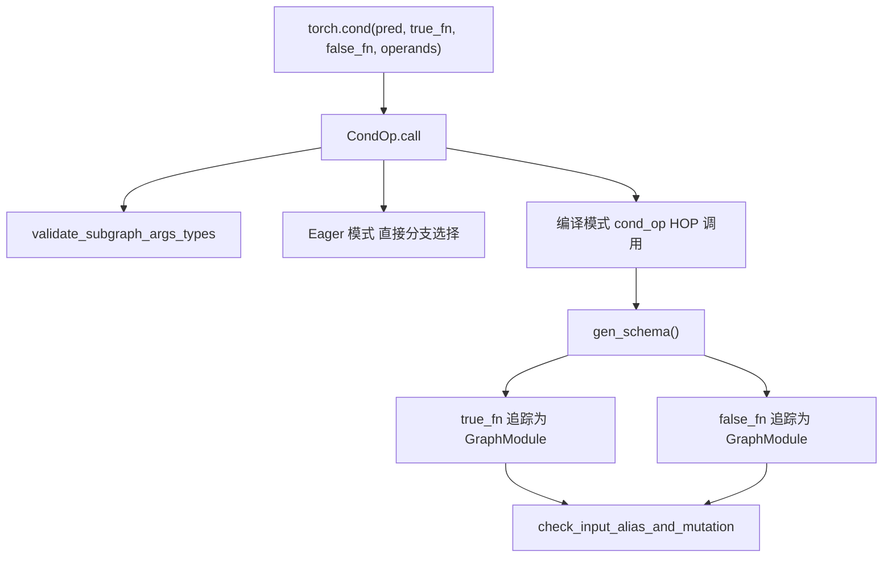
`torch.cond` 算子根据谓词 (predicate) 执行两个分支之一。其实现使用了继承自 `HigherOrderOperator` 的 `CondOp` 类。

**关键实现细节：**

-   谓词可以是布尔值、标量张量或符号布尔表达式。
-   两个分支必须具有一致的输入/输出签名。
-   分支函数在编译期间被追踪为 `GraphModule` 实例。
-   该算子会验证各分支之间的输入和输出是否匹配。

**Schema 生成：** `gen_schema()` 方法将两个分支实例化为图，并分析它们的变异和别名。它会创建一个 schema，指明哪些输入被任一分支变异。

来源： [torch/\_higher\_order\_ops/cond.py47-92](https://github.com/pytorch/pytorch/blob/915982a4/torch/_higher_order_ops/cond.py#L47-L92) [torch/\_\_init\_\_.py95-183](https://github.com/pytorch/pytorch/blob/915982a4/torch/__init__.py#L95-L183)

### torch.while\_loop - 迭代循环

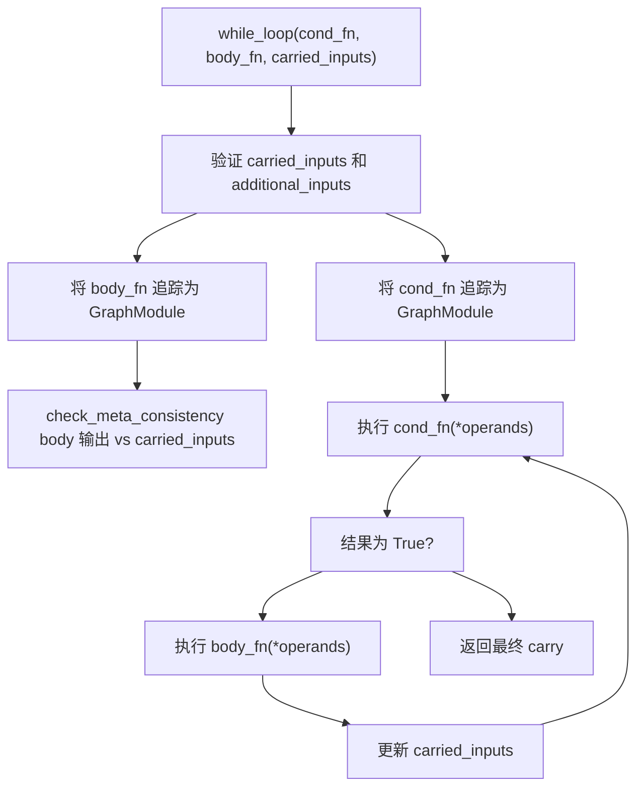
`while_loop` 算子在条件函数返回 true 时重复执行主体 (body) 函数。循环变量 (carried inputs) 在每次迭代中更新。

**关键特性：**

-   `cond_fn`：接收 carried inputs 和 additional inputs，返回布尔张量或标量。
-   `body_fn`：接收相同输入，为 carried inputs 返回新值。
-   `carried_inputs`：每次迭代更新的值。
-   `additional_inputs`：传递给两个函数的只读输入。

**重要约束：**

-   主体函数的输出必须与 carried inputs 的元数据（形状、数据类型）匹配。
-   不支持输入变异。
-   条件函数必须返回标量布尔值或仅包含一个元素的布尔张量。

来源： [torch/\_higher\_order\_ops/while\_loop.py30-136](https://github.com/pytorch/pytorch/blob/915982a4/torch/_higher_order_ops/while_loop.py#L30-L136) [test/functorch/test\_control\_flow.py192-409](https://github.com/pytorch/pytorch/blob/915982a4/test/functorch/test_control_flow.py#L192-L409)

### scan - 顺序扫描

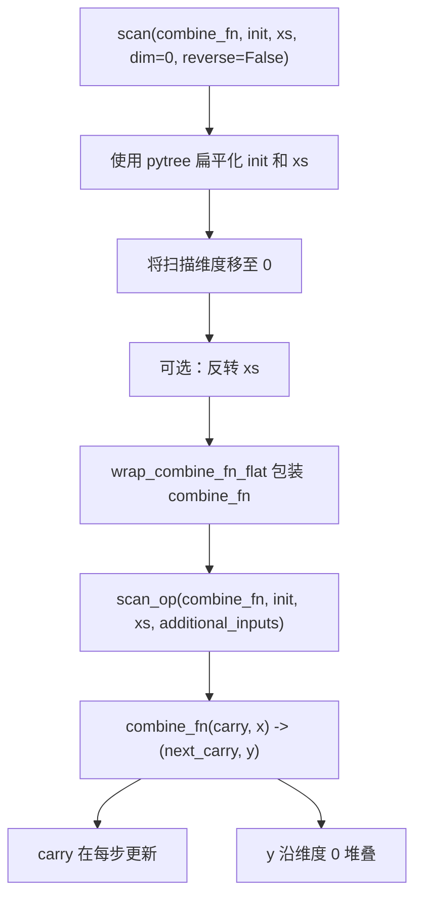
`scan` 算子使用二元组合函数执行包含式扫描。它沿指定维度处理输入张量，并维护一个 carry 状态。

**签名：**

-   `combine_fn`：二元函数 `(carry, x) -> (next_carry, y)`。
-   `init`：初始 carry 值（张量或 pytree）。
-   `xs`：要扫描的输入张量（张量或 pytree）。
-   `dim`：扫描的维度（默认为 0）。
-   `reverse`：是否反向扫描（默认为 False）。

**返回：**

-   `final_carry`：扫描完所有元素后的最终 carry。
-   `out`：沿扫描维度堆叠的输出。

**限制：**

-   不允许输入/输出之间存在别名。
-   `combine_fn` 中不支持输入变异。
-   迭代之间的 carry 结构必须匹配。

来源： [torch/\_higher\_order\_ops/scan.py77-221](https://github.com/pytorch/pytorch/blob/915982a4/torch/_higher_order_ops/scan.py#L77-L221) [test/functorch/test\_control\_flow.py106-190](https://github.com/pytorch/pytorch/blob/915982a4/test/functorch/test_control_flow.py#L106-L190)

## TorchDynamo 集成

### 子图推测与追踪 (Subgraph Speculation and Tracing)

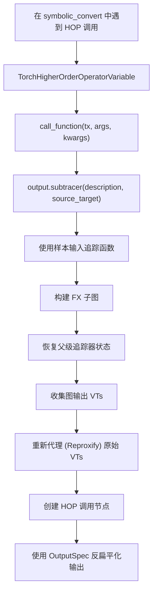
Dynamo 通过专门的 `VariableTracker` 子类处理高阶算子，这些子类捕获控制流结构并追踪子图。

**子图推测过程：**

`speculate_subgraph` 函数是追踪 HOPs 的核心机制：

1.  **设置**：创建一个隔离图构建的 `SubgraphTracer` 上下文。
2.  **追踪**：使用 `VariableTracker` 输入执行函数，以符号化方式记录操作。
3.  **输出处理**：收集张量和 `SymInt` 输出，过滤掉常量。
4.  **代理化 (Proxification)**：更新原始 `VariableTracker` 以指向 HOP 输出。

**关键类：**

| 类 | 用途 |
| --- | --- |
| `TorchHigherOrderOperatorVariable` | HOP 变量追踪器的基类 |
| `CondHigherOrderVariable` | 处理 `torch.cond` |
| `WhileLoopHigherOrderVariable` | 处理 `torch.while_loop` |
| `ScanHigherOrderVariable` | 处理 `scan` 操作 |

来源： [torch/\_dynamo/variables/higher\_order\_ops.py1-100](https://github.com/pytorch/pytorch/blob/915982a4/torch/_dynamo/variables/higher_order_ops.py#L1-L100) [torch/\_dynamo/variables/higher\_order\_ops.py619-878](https://github.com/pytorch/pytorch/blob/915982a4/torch/_dynamo/variables/higher_order_ops.py#L619-L878)

### 输出规范与扁平化 (Output Specification and Flattening)

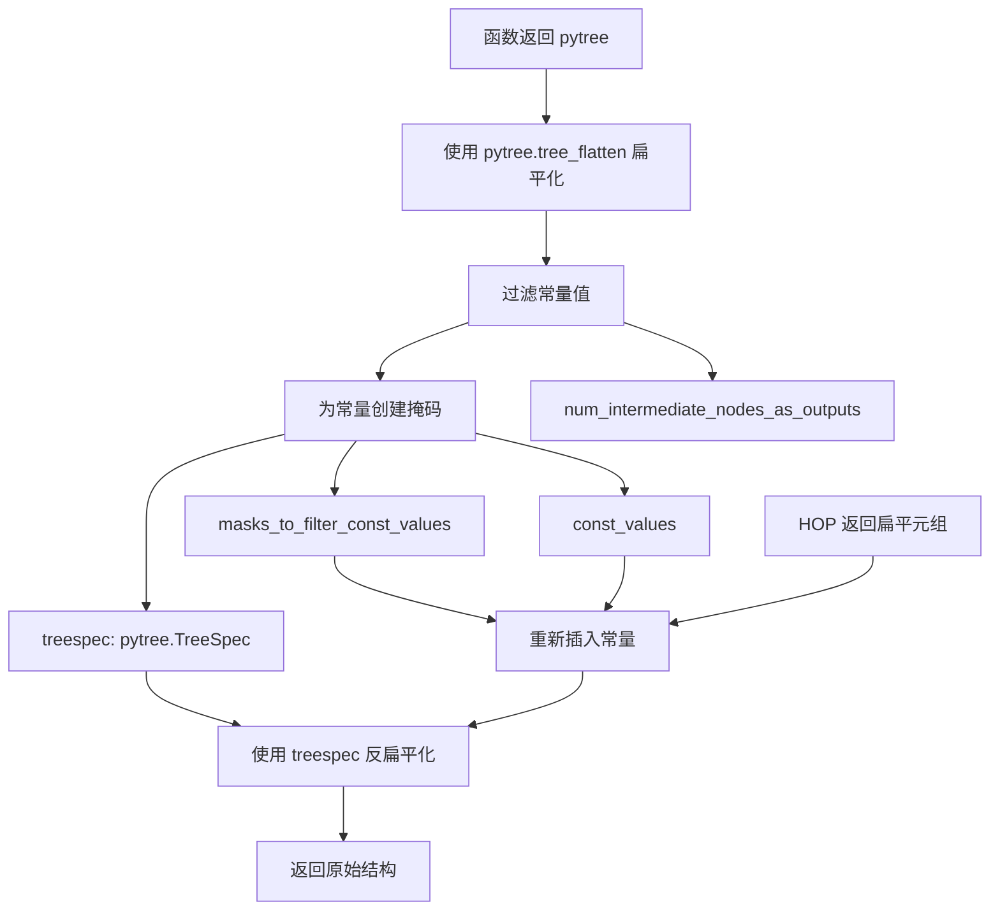
`OutputSpec` 数据类封装了扁平化和反扁平化 HOP 输出所需的信息：

-   `treespec`：输出的 pytree 结构。
-   `masks_to_filter_const_values`：指示常量位置的布尔掩码。
-   `const_values`：被过滤掉的实际常量值。
-   `num_intermediate_nodes_as_outputs`：为了追踪副作用而作为输出包含的中间节点数量。

常量从图输出中过滤掉，以简化面向 AOTAutograd 和 Inductor 的图。它们在反扁平化过程中被重新插入。

来源： [torch/\_dynamo/variables/higher\_order\_ops.py86-113](https://github.com/pytorch/pytorch/blob/915982a4/torch/_dynamo/variables/higher_order_ops.py#L86-L113) [torch/\_dynamo/variables/higher\_order\_ops.py364-427](https://github.com/pytorch/pytorch/blob/915982a4/torch/_dynamo/variables/higher_order_ops.py#L364-L427)

### 自动 vs 手动输出扁平化 (Automatic vs Manual Output Flattening)

高阶算子支持两种输出处理模式：

**自动输出扁平化** (`speculate_subgraph_with_auto_output_flattening`)：

-   被大多数 HOPs 使用（cond, while\_loop, scan）。
-   自动从子图中收集所有张量/`SymInt` 输出。
-   包括用于副作用追踪的中间输出。
-   将现有 VTs 重新代理为指向 HOP 输出。

**手动输出扁平化** (`speculate_subgraph`)：

-   当需要对输出进行显式控制时使用。
-   调用者精确指定要包含哪些输出。
-   同时返回输出 VTs 和扁平化结构。

自动模式通过透明地处理输出收集和中间节点追踪，简化了 HOP 的实现。

来源： [torch/\_dynamo/variables/higher\_order\_ops.py1000-1200](https://github.com/pytorch/pytorch/blob/915982a4/torch/_dynamo/variables/higher_order_ops.py#L1000-L1200) [torch/\_dynamo/output\_graph.py1-100](https://github.com/pytorch/pytorch/blob/915982a4/torch/_dynamo/output_graph.py#L1-L100)

### 副作用与中间输出 (Side Effects and Intermediate Outputs)

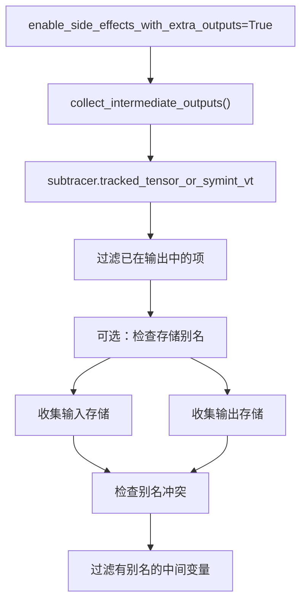
当启用 `enable_side_effects_with_extra_outputs` 时，HOPs 会追踪所有中间张量和 `SymInt` 操作，将其视为潜在的副作用。这些会被添加为额外的输出。

**StorageAliasingTracker：**

`StorageAliasingTracker` 类过滤掉会产生别名问题的中间输出：

-   从输入占位符 (placeholder) 收集 `StorageWeakRef`。
-   从现有图输出中收集存储。
-   过滤掉与输入或输出共享存储的中间变量。
-   防止像 `invoke_subgraph` 这样不支持别名的 HOP 发生别名违规。

这一机制允许捕获副作用（如 `list.append`），同时保持正确性约束。

来源： [torch/\_dynamo/variables/higher\_order\_ops.py475-592](https://github.com/pytorch/pytorch/blob/915982a4/torch/_dynamo/variables/higher_order_ops.py#L475-L592) [torch/\_dynamo/dce\_extra\_outputs.py1-50](https://github.com/pytorch/pytorch/blob/915982a4/torch/_dynamo/dce_extra_outputs.py#L1-L50)

## AOT Autograd 集成

### 联合图构建 (Joint Graph Construction)

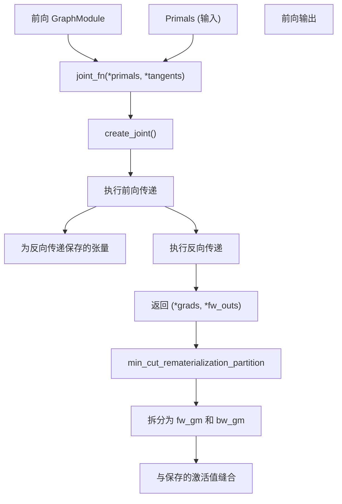
AOT Autograd 通过创建一个可以被划分的联合正向-反向图来处理 HOPs：

1.  **联合函数创建**：将正向和反向逻辑组合成一个可调用对象。
2.  **追踪**：使用输入执行正向，使用梯度切线 (tangents) 执行反向。
3.  **输出格式**：返回 `(*grads, *fw_outs)` —— 故意将梯度放在前面。
4.  **划分**：使用最小割 (min-cut) 算法拆分为正向和反向图。

联合图方法简化了划分，因为整个计算流在一个图中是可见的。

来源： [torch/\_higher\_order\_ops/invoke\_subgraph.py308-346](https://github.com/pytorch/pytorch/blob/915982a4/torch/_higher_order_ops/invoke_subgraph.py#L308-L346) [torch/\_higher\_order\_ops/utils.py1-100](https://github.com/pytorch/pytorch/blob/915982a4/torch/_higher_order_ops/utils.py#L1-L100)

### Autograd Function 集成 (Autograd Function Integration)

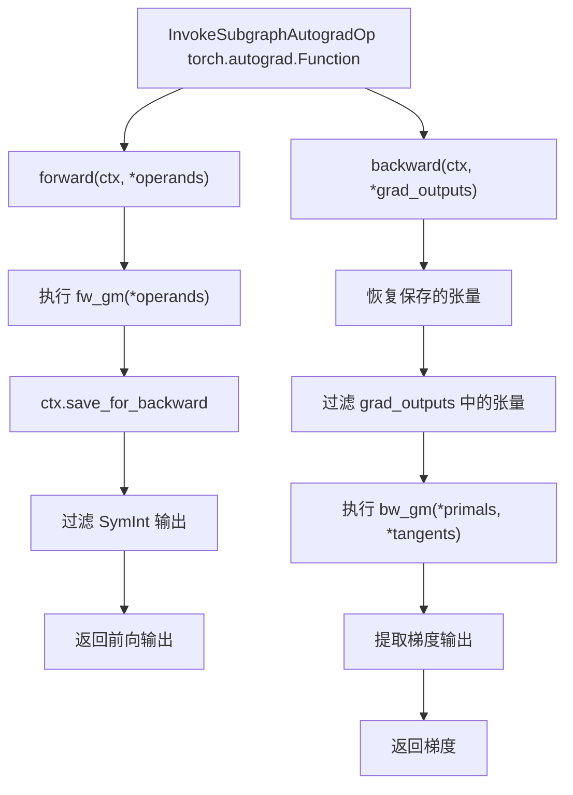
HOPs 通过包装正向和反向图模块的自定义 `torch.autograd.Function` 实现与 autograd 集成：

**OutputMetadata 追踪：**

-   `num_fw_outs`：正向输出的数量。
-   `indexes_with_symint`：哪些输出是 `SymInt`（无梯度）。
-   `indexes_with_no_grad`：哪些张量输出不需要梯度。

元数据在反向传递期间适当过滤梯度，跳过 `SymInt` 输出并处理不可微分张量。

来源： [torch/\_higher\_order\_ops/invoke\_subgraph.py48-56](https://github.com/pytorch/pytorch/blob/915982a4/torch/_higher_order_ops/invoke_subgraph.py#L48-L56) [torch/\_higher\_order\_ops/invoke\_subgraph.py370-500](https://github.com/pytorch/pytorch/blob/915982a4/torch/_higher_order_ops/invoke_subgraph.py#L370-L500)

## Inductor 编译

### Inductor 中的 HOP 分发 (HOP Dispatch in Inductor)

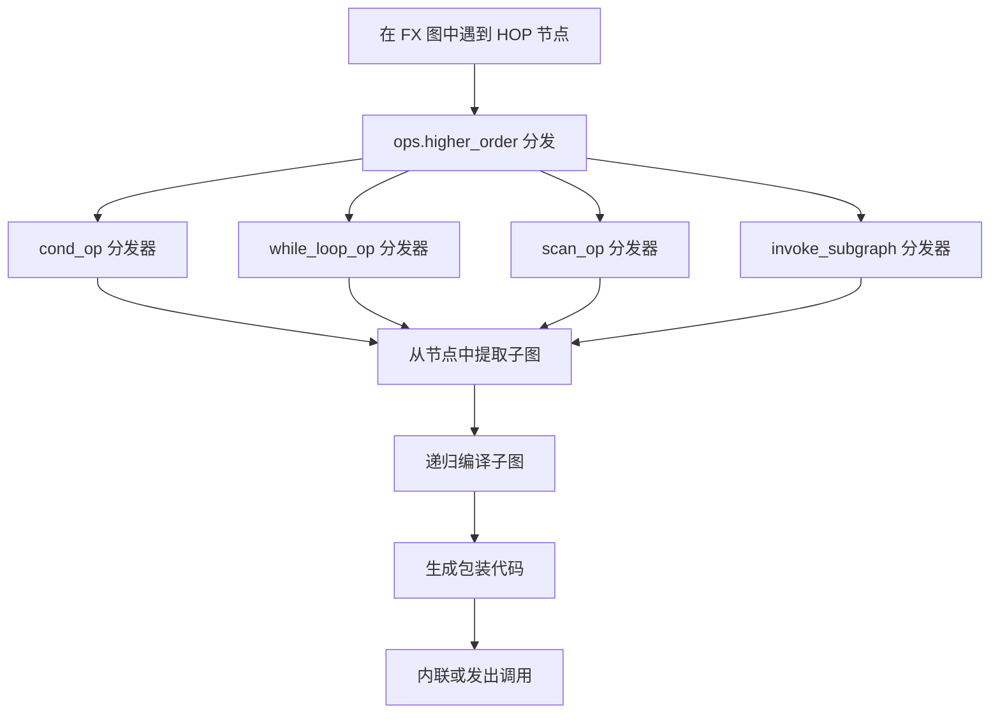
Inductor 通过专门的降低实现来处理 HOPs，这些实现会递归地编译子图：

**编译过程：**

1.  **节点检测**：Inductor 在遍历图时遇到 HOP 调用节点。
2.  **子图提取**：从节点参数中检索嵌入的 `GraphModule`。
3.  **递归编译**：使用相同的 Inductor 流水线编译子图。
4.  **代码生成**：生成具有适当控制流的内核代码。

每个 HOP 在 `torch._inductor.lowering` 中都有一个注册的分发器来处理其特定的语义。

来源： [torch/\_inductor/lowering.py1-100](https://github.com/pytorch/pytorch/blob/915982a4/torch/_inductor/lowering.py#L1-L100) [test/inductor/test\_control\_flow.py1-100](https://github.com/pytorch/pytorch/blob/915982a4/test/inductor/test_control_flow.py#L1-L100)

### 嵌套编译区域 (Nested Compile Regions)

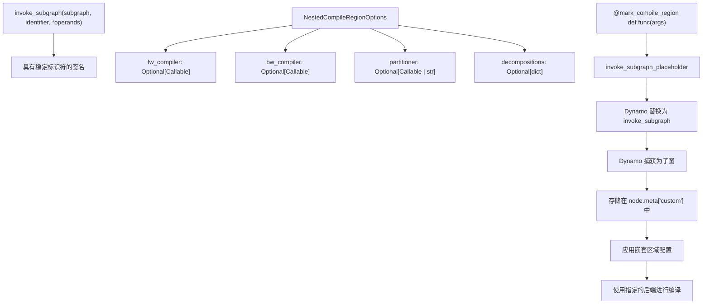
`invoke_subgraph` HOP 允许使用自定义编译策略进行显式的嵌套编译：

**关键特性：**

-   **稳定标识符**：确保跨调用的缓存一致性。
-   **自定义编译器**：为嵌套区域指定不同的编译后端。
-   **划分器控制**：选择划分策略（最小割、默认等）。
-   **分解 (Decomposition) 控制**：覆盖嵌套区域内的分解。

**mark\_compile\_region 装饰器：**

`mark_compile_region` 装饰器提供了一个用户友好的 API：

-   包装函数以便在 eager 模式下使用 `invoke_subgraph_placeholder`。
-   Dynamo 自动将占位符替换为实际的 `invoke_subgraph` HOP。
-   支持可选的 `NestedCompileRegionOptions` 进行细粒度控制。

来源： [torch/\_higher\_order\_ops/invoke\_subgraph.py58-79](https://github.com/pytorch/pytorch/blob/915982a4/torch/_higher_order_ops/invoke_subgraph.py#L58-L79) [torch/\_higher\_order\_ops/invoke\_subgraph.py265-298](https://github.com/pytorch/pytorch/blob/915982a4/torch/_higher_order_ops/invoke_subgraph.py#L265-L298) [test/higher\_order\_ops/test\_invoke\_subgraph.py1-150](https://github.com/pytorch/pytorch/blob/915982a4/test/higher_order_ops/test_invoke_subgraph.py#L1-L150)

## Schema 生成 (Schema Generation)

### HopSchemaGenerator

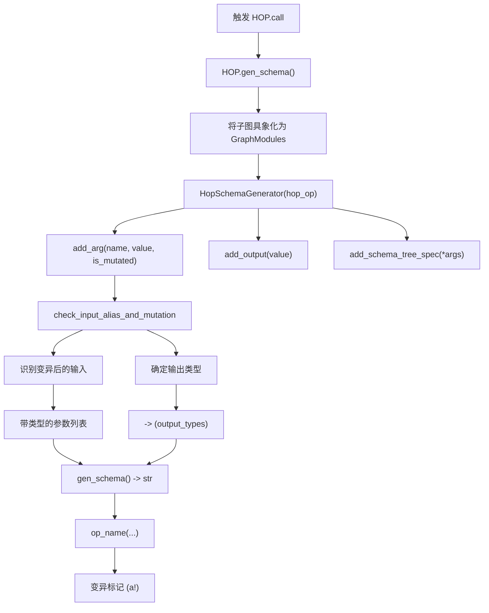
Schema 生成允许根据运行时参数为 HOPs 动态创建 schema：

**HopSchemaGenerator 类：**

生成器累积关于 HOP 参数和输出的信息：

-   `add_arg()`：注册带可选变异标志的参数。
-   `add_output()`：注册具有推断类型的输出值。
-   `add_schema_tree_spec()`：存储用于验证的 pytree 结构。
-   `gen_schema()`：生成最终的 schema 字符串。

**类型推断：**

生成器从示例值推断类型：

-   `torch.Tensor` → `Tensor`（如果需要，带有变异注解）。
-   `torch.SymInt` → `SymInt`。
-   `int`, `bool`, `float` → 相应的 Python 类型。
-   `FakeScriptObject` → 作为不透明类型处理。
-   `GraphModule` → 子图参数的 `Any` 类型。

**变异注解：**

如果参数在子图中被变异（由 `check_input_alias_and_mutation` 确定），则使用 `(a!)` 进行注解。

来源： [torch/\_higher\_order\_ops/schema.py1-100](https://github.com/pytorch/pytorch/blob/915982a4/torch/_higher_order_ops/schema.py#L1-L100) [torch/\_higher\_order\_ops/cond.py56-90](https://github.com/pytorch/pytorch/blob/915982a4/torch/_higher_order_ops/cond.py#L56-L90) [torch/\_higher\_order\_ops/while\_loop.py56-125](https://github.com/pytorch/pytorch/blob/915982a4/torch/_higher_order_ops/while_loop.py#L56-L125)

## 工具与共享基础设施 (Utilities and Shared Infrastructure)

### 子图验证 (Subgraph Validation)

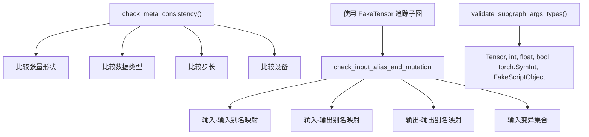
HOPs 共享通用的验证基础设施：

**类型验证：**

-   `validate_subgraph_args_types()` 确保仅传递支持的类型。
-   对于列表或自定义对象等不支持的类型抛出错误。

**别名与变异分析：**

-   使用 `FakeTensor` 追踪来检测别名模式。
-   `check_input_alias_and_mutation()` 返回别名关系的映射。
-   大多数 HOPs 禁止别名以保持函数式语义。

**元数据一致性：**

-   `check_meta_consistency()` 比较期望和实际的张量元数据。
-   被 `while_loop` 用于确保循环体输出与 carried inputs 匹配。
-   提取 `TensorMetadata`，包括形状、数据类型、步长和设备。

来源： [torch/\_higher\_order\_ops/utils.py159-239](https://github.com/pytorch/pytorch/blob/915982a4/torch/_higher_order_ops/utils.py#L159-L239) [torch/\_higher\_order\_ops/utils.py342-411](https://github.com/pytorch/pytorch/blob/915982a4/torch/_higher_order_ops/utils.py#L342-L411)

### 图具象化 (Graph Materialization)

`materialize_as_graph()` 函数将可调用对象转换为已追踪的 `GraphModule` 实例：

**过程：**

1.  检测是否已是 `GraphModule`（若是则原样返回）。
2.  如果需要，解包 `FunctionalTensor`。
3.  使用 `_maybe_reenter_make_fx()` 以适当模式进行追踪。
4.  处理 `FakeTensorMode` 和形状环境 (shape environment)。
5.  返回完全追踪的 `GraphModule`。

该函数被 schema 生成和验证用于获取 HOP 子图的具体图表示。

来源： [torch/\_higher\_order\_ops/utils.py1-50](https://github.com/pytorch/pytorch/blob/915982a4/torch/_higher_order_ops/utils.py#L1-L50)

### 编译环境设置 (Compilation Environment Setup)

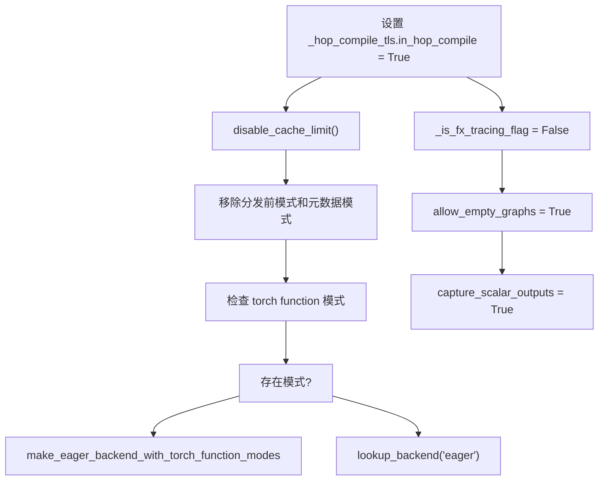
`setup_compilation_env()` 上下文管理器配置用于编译 HOPs 的环境：

**目的：**

-   防止 HOPs 编译嵌套区域时出现无限递归。
-   暂时移除不兼容的 torch function 模式。
-   设置正确的追踪配置标志。

**TLS 标志：**

-   `_hop_compile_tls.in_hop_compile` 追踪嵌套编译。
-   防止在 HOP 编译期间出现错误的缓存。
-   被 `_in_hop_compile()` 查询函数使用。

该基础设施使 HOPs 能够安全地在嵌套区域调用 `torch.compile` 而不会引起追踪问题。

来源： [torch/\_higher\_order\_ops/utils.py242-311](https://github.com/pytorch/pytorch/blob/915982a4/torch/_higher_order_ops/utils.py#L242-L311)

## 自动函数化 (Auto-Functionalization)

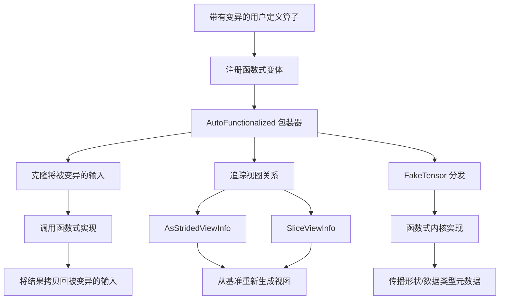
自动函数化将带有变异的操作自动转换为函数式等效项：

**AutoFunctionalized 类：**

`AutoFunctionalized` HOP 包装了变异操作：

-   接收变异和不可变参数。
-   调用函数式内核实现。
-   使用结果更新变异后的参数。
-   追踪视图关系以保证正确性。

**视图信息 (ViewInfo) 追踪：**

追踪不同的视图类型：

-   `AsStridedViewInfo`：记录大小 (size)、步长 (stride)、存储偏移量 (storage\_offset)。
-   `SliceViewInfo`：记录切片的维度、起始和结束位置。
-   `AliasViewInfo`：无变换的简单别名。
-   在反向传递期间从基准重新生成视图。

**使用场景：**

-   具有就地 (in-place) 语义的自定义算子。
-   与 `torch.compile` 的自动集成。
-   在编译图中保持函数式纯粹性。

来源： [torch/\_higher\_order\_ops/auto\_functionalize.py1-130](https://github.com/pytorch/pytorch/blob/915982a4/torch/_higher_order_ops/auto_functionalize.py#L1-L130) [test/inductor/test\_auto\_functionalize.py1-100](https://github.com/pytorch/pytorch/blob/915982a4/test/inductor/test_auto_functionalize.py#L1-L100)

## 测试基础设施 (Testing Infrastructure)

PyTorch 包含了在不同执行模式下针对 HOPs 的全面测试：

**测试类别：**

| 测试文件 | 覆盖范围 |
| --- | --- |
| `test_control_flow.py` | 核心控制流 HOPs (cond, while\_loop) |
| `test_invoke_subgraph.py` | 嵌套编译区域 |
| `test_higher_order_ops.py` | Dynamo 集成测试 |
| `test_auto_functionalize.py` | 自动函数化 |

**测试模式：**

-   Eager 执行（基准正确性）。
-   `torch.compile(backend="eager")`（图捕获）。
-   `torch.compile(backend="inductor")`（完整编译）。
-   带有图记录的 AOT Autograd。
-   带有 `automatic_dynamic_shapes=True` 的动态形状。

来源： [test/functorch/test\_control\_flow.py1-100](https://github.com/pytorch/pytorch/blob/915982a4/test/functorch/test_control_flow.py#L1-L100) [test/higher\_order\_ops/test\_invoke\_subgraph.py1-100](https://github.com/pytorch/pytorch/blob/915982a4/test/higher_order_ops/test_invoke_subgraph.py#L1-L150) [test/dynamo/test\_higher\_order\_ops.py1-100](https://github.com/pytorch/pytorch/blob/915982a4/test/dynamo/test_higher_order_ops.py#L1-L100)
