# 设备后端与原生操作 (Device Backends and Native Operations)

相关源文件 (Relevant source files)

-   [aten/src/ATen/CMakeLists.txt](https://github.com/pytorch/pytorch/blob/915982a4/aten/src/ATen/CMakeLists.txt)
-   [aten/src/ATen/core/CachingHostAllocator.h](https://github.com/pytorch/pytorch/blob/915982a4/aten/src/ATen/core/CachingHostAllocator.h)
-   [aten/src/ATen/cuda/CachingHostAllocator.cpp](https://github.com/pytorch/pytorch/blob/915982a4/aten/src/ATen/cuda/CachingHostAllocator.cpp)
-   [aten/src/ATen/native/Blas.cpp](https://github.com/pytorch/pytorch/blob/915982a4/aten/src/ATen/native/Blas.cpp)
-   [aten/src/ATen/native/GroupedMMUtils.h](https://github.com/pytorch/pytorch/blob/915982a4/aten/src/ATen/native/GroupedMMUtils.h)
-   [aten/src/ATen/native/ScaledBlasUtils.cpp](https://github.com/pytorch/pytorch/blob/915982a4/aten/src/ATen/native/ScaledBlasUtils.cpp)
-   [aten/src/ATen/native/ScaledBlasUtils.h](https://github.com/pytorch/pytorch/blob/915982a4/aten/src/ATen/native/ScaledBlasUtils.h)
-   [aten/src/ATen/native/cuda/Blas.cpp](https://github.com/pytorch/pytorch/blob/915982a4/aten/src/ATen/native/cuda/Blas.cpp)
-   [aten/src/ATen/native/cuda/GroupedBlas.cpp](https://github.com/pytorch/pytorch/blob/915982a4/aten/src/ATen/native/cuda/GroupedBlas.cpp)
-   [aten/src/ATen/native/cuda/ScaledBlas.cpp](https://github.com/pytorch/pytorch/blob/915982a4/aten/src/ATen/native/cuda/ScaledBlas.cpp)
-   [aten/src/ATen/native/cudnn/ConvShared.cpp](https://github.com/pytorch/pytorch/blob/915982a4/aten/src/ATen/native/cudnn/ConvShared.cpp)
-   [aten/src/ATen/native/hip/ck\_group\_gemm.h](https://github.com/pytorch/pytorch/blob/915982a4/aten/src/ATen/native/hip/ck_group_gemm.h)
-   [aten/src/ATen/native/hip/ck\_group\_gemm.hip](https://github.com/pytorch/pytorch/blob/915982a4/aten/src/ATen/native/hip/ck_group_gemm.hip)
-   [aten/src/ATen/native/mkldnn/Conv.cpp](https://github.com/pytorch/pytorch/blob/915982a4/aten/src/ATen/native/mkldnn/Conv.cpp)
-   [aten/src/ATen/native/mkldnn/Linear.cpp](https://github.com/pytorch/pytorch/blob/915982a4/aten/src/ATen/native/mkldnn/Linear.cpp)
-   [aten/src/ATen/native/mkldnn/Matmul.cpp](https://github.com/pytorch/pytorch/blob/915982a4/aten/src/ATen/native/mkldnn/Matmul.cpp)
-   [aten/src/ATen/native/mkldnn/xpu/ScaledBlas.cpp](https://github.com/pytorch/pytorch/blob/915982a4/aten/src/ATen/native/mkldnn/xpu/ScaledBlas.cpp)
-   [aten/src/ATen/native/mps/kernels/CrossKernel.metal](https://github.com/pytorch/pytorch/blob/915982a4/aten/src/ATen/native/mps/kernels/CrossKernel.metal)
-   [aten/src/ATen/native/mps/kernels/Distributions.metal](https://github.com/pytorch/pytorch/blob/915982a4/aten/src/ATen/native/mps/kernels/Distributions.metal)
-   [aten/src/ATen/native/mps/kernels/Indexing.h](https://github.com/pytorch/pytorch/blob/915982a4/aten/src/ATen/native/mps/kernels/Indexing.h)
-   [aten/src/ATen/native/mps/kernels/Indexing.metal](https://github.com/pytorch/pytorch/blob/915982a4/aten/src/ATen/native/mps/kernels/Indexing.metal)
-   [aten/src/ATen/native/mps/kernels/LinearAlgebra.h](https://github.com/pytorch/pytorch/blob/915982a4/aten/src/ATen/native/mps/kernels/LinearAlgebra.h)
-   [aten/src/ATen/native/mps/kernels/LinearAlgebra.metal](https://github.com/pytorch/pytorch/blob/915982a4/aten/src/ATen/native/mps/kernels/LinearAlgebra.metal)
-   [aten/src/ATen/native/mps/operations/CrossKernel.mm](https://github.com/pytorch/pytorch/blob/915982a4/aten/src/ATen/native/mps/operations/CrossKernel.mm)
-   [aten/src/ATen/native/mps/operations/Distributions.mm](https://github.com/pytorch/pytorch/blob/915982a4/aten/src/ATen/native/mps/operations/Distributions.mm)
-   [aten/src/ATen/native/mps/operations/Indexing.mm](https://github.com/pytorch/pytorch/blob/915982a4/aten/src/ATen/native/mps/operations/Indexing.mm)
-   [aten/src/ATen/native/mps/operations/LinearAlgebra.mm](https://github.com/pytorch/pytorch/blob/915982a4/aten/src/ATen/native/mps/operations/LinearAlgebra.mm)
-   [aten/src/ATen/native/mps/operations/Pad.mm](https://github.com/pytorch/pytorch/blob/915982a4/aten/src/ATen/native/mps/operations/Pad.mm)
-   [aten/src/ATen/native/mps/operations/ScanKernel.mm](https://github.com/pytorch/pytorch/blob/915982a4/aten/src/ATen/native/mps/operations/ScanKernel.mm)
-   [aten/src/ATen/native/mps/operations/UpSample.mm](https://github.com/pytorch/pytorch/blob/915982a4/aten/src/ATen/native/mps/operations/UpSample.mm)
-   [aten/src/ATen/native/native\_functions.yaml](https://github.com/pytorch/pytorch/blob/915982a4/aten/src/ATen/native/native_functions.yaml)
-   [aten/src/ATen/native/sparse/SoftMax.cpp](https://github.com/pytorch/pytorch/blob/915982a4/aten/src/ATen/native/sparse/SoftMax.cpp)
-   [aten/src/ATen/native/sparse/mps/SparseMPSTensorMath.mm](https://github.com/pytorch/pytorch/blob/915982a4/aten/src/ATen/native/sparse/mps/SparseMPSTensorMath.mm)
-   [aten/src/ATen/native/sparse/mps/kernels/SparseTensorMath.metal](https://github.com/pytorch/pytorch/blob/915982a4/aten/src/ATen/native/sparse/mps/kernels/SparseTensorMath.metal)
-   [aten/src/ATen/test/cuda\_caching\_host\_allocator\_test.cpp](https://github.com/pytorch/pytorch/blob/915982a4/aten/src/ATen/test/cuda_caching_host_allocator_test.cpp)
-   [aten/src/ATen/test/scalar\_test.cpp](https://github.com/pytorch/pytorch/blob/915982a4/aten/src/ATen/test/scalar_test.cpp)
-   [aten/src/ATen/xpu/CachingHostAllocator.cpp](https://github.com/pytorch/pytorch/blob/915982a4/aten/src/ATen/xpu/CachingHostAllocator.cpp)
-   [aten/src/ATen/xpu/XPUScaledBlas.cpp](https://github.com/pytorch/pytorch/blob/915982a4/aten/src/ATen/xpu/XPUScaledBlas.cpp)
-   [aten/src/ATen/xpu/XPUScaledBlas.h](https://github.com/pytorch/pytorch/blob/915982a4/aten/src/ATen/xpu/XPUScaledBlas.h)
-   [c10/core/AllocatorConfig.cpp](https://github.com/pytorch/pytorch/blob/915982a4/c10/core/AllocatorConfig.cpp)
-   [c10/core/AllocatorConfig.h](https://github.com/pytorch/pytorch/blob/915982a4/c10/core/AllocatorConfig.h)
-   [c10/cuda/CUDAAllocatorConfig.cpp](https://github.com/pytorch/pytorch/blob/915982a4/c10/cuda/CUDAAllocatorConfig.cpp)
-   [c10/cuda/CUDAAllocatorConfig.h](https://github.com/pytorch/pytorch/blob/915982a4/c10/cuda/CUDAAllocatorConfig.h)
-   [c10/cuda/CUDACachingAllocator.cpp](https://github.com/pytorch/pytorch/blob/915982a4/c10/cuda/CUDACachingAllocator.cpp)
-   [c10/cuda/CUDACachingAllocator.h](https://github.com/pytorch/pytorch/blob/915982a4/c10/cuda/CUDACachingAllocator.h)
-   [c10/metal/atomic.h](https://github.com/pytorch/pytorch/blob/915982a4/c10/metal/atomic.h)
-   [c10/test/core/AllocatorConfig\_test.cpp](https://github.com/pytorch/pytorch/blob/915982a4/c10/test/core/AllocatorConfig_test.cpp)
-   [c10/xpu/XPUCachingAllocator.cpp](https://github.com/pytorch/pytorch/blob/915982a4/c10/xpu/XPUCachingAllocator.cpp)
-   [c10/xpu/XPUCachingAllocator.h](https://github.com/pytorch/pytorch/blob/915982a4/c10/xpu/XPUCachingAllocator.h)
-   [docs/source/cuda.aliases.md](https://github.com/pytorch/pytorch/blob/915982a4/docs/source/cuda.aliases.md)
-   [docs/source/notes/cuda.rst](https://github.com/pytorch/pytorch/blob/915982a4/docs/source/notes/cuda.rst)
-   [docs/source/xpu.aliases.md](https://github.com/pytorch/pytorch/blob/915982a4/docs/source/xpu.aliases.md)
-   [docs/source/xpu.md](https://github.com/pytorch/pytorch/blob/915982a4/docs/source/xpu.md)
-   [test/distributed/tensor/test\_strategy\_validation.py](https://github.com/pytorch/pytorch/blob/915982a4/test/distributed/tensor/test_strategy_validation.py)
-   [test/nn/test\_dropout.py](https://github.com/pytorch/pytorch/blob/915982a4/test/nn/test_dropout.py)
-   [test/test\_accelerator.py](https://github.com/pytorch/pytorch/blob/915982a4/test/test_accelerator.py)
-   [test/test\_cuda.py](https://github.com/pytorch/pytorch/blob/915982a4/test/test_cuda.py)
-   [test/test\_cuda\_compatibility.py](https://github.com/pytorch/pytorch/blob/915982a4/test/test_cuda_compatibility.py)
-   [test/test\_indexing.py](https://github.com/pytorch/pytorch/blob/915982a4/test/test_indexing.py)
-   [test/test\_jiterator.py](https://github.com/pytorch/pytorch/blob/915982a4/test/test_jiterator.py)
-   [test/test\_matmul\_cuda.py](https://github.com/pytorch/pytorch/blob/915982a4/test/test_matmul_cuda.py)
-   [test/test\_mps.py](https://github.com/pytorch/pytorch/blob/915982a4/test/test_mps.py)
-   [test/test\_scaled\_matmul\_cuda.py](https://github.com/pytorch/pytorch/blob/915982a4/test/test_scaled_matmul_cuda.py)
-   [test/test\_sparse.py](https://github.com/pytorch/pytorch/blob/915982a4/test/test_sparse.py)
-   [test/test\_xpu.py](https://github.com/pytorch/pytorch/blob/915982a4/test/test_xpu.py)
-   [torch/\_C/\_\_init\_\_.pyi.in](https://github.com/pytorch/pytorch/blob/915982a4/torch/_C/__init__.pyi.in)
-   [torch/\_utils.py](https://github.com/pytorch/pytorch/blob/915982a4/torch/_utils.py)
-   [torch/csrc/DeviceAccelerator.cpp](https://github.com/pytorch/pytorch/blob/915982a4/torch/csrc/DeviceAccelerator.cpp)
-   [torch/csrc/Module.cpp](https://github.com/pytorch/pytorch/blob/915982a4/torch/csrc/Module.cpp)
-   [torch/csrc/autograd/python\_variable\_indexing.cpp](https://github.com/pytorch/pytorch/blob/915982a4/torch/csrc/autograd/python_variable_indexing.cpp)
-   [torch/csrc/cuda/Module.cpp](https://github.com/pytorch/pytorch/blob/915982a4/torch/csrc/cuda/Module.cpp)
-   [torch/csrc/cuda/memory\_snapshot.cpp](https://github.com/pytorch/pytorch/blob/915982a4/torch/csrc/cuda/memory_snapshot.cpp)
-   [torch/csrc/profiler/combined\_traceback.cpp](https://github.com/pytorch/pytorch/blob/915982a4/torch/csrc/profiler/combined_traceback.cpp)
-   [torch/csrc/profiler/combined\_traceback.h](https://github.com/pytorch/pytorch/blob/915982a4/torch/csrc/profiler/combined_traceback.h)
-   [torch/csrc/profiler/python/combined\_traceback.cpp](https://github.com/pytorch/pytorch/blob/915982a4/torch/csrc/profiler/python/combined_traceback.cpp)
-   [torch/csrc/xpu/Module.cpp](https://github.com/pytorch/pytorch/blob/915982a4/torch/csrc/xpu/Module.cpp)
-   [torch/cuda/\_\_init\_\_.py](https://github.com/pytorch/pytorch/blob/915982a4/torch/cuda/__init__.py)
-   [torch/cuda/\_device\_limits.py](https://github.com/pytorch/pytorch/blob/915982a4/torch/cuda/_device_limits.py)
-   [torch/cuda/memory.py](https://github.com/pytorch/pytorch/blob/915982a4/torch/cuda/memory.py)
-   [torch/distributed/tensor/\_ops/strategy\_validation.py](https://github.com/pytorch/pytorch/blob/915982a4/torch/distributed/tensor/_ops/strategy_validation.py)
-   [torch/testing/\_comparison.py](https://github.com/pytorch/pytorch/blob/915982a4/torch/testing/_comparison.py)
-   [torch/testing/\_internal/common\_methods\_invocations.py](https://github.com/pytorch/pytorch/blob/915982a4/torch/testing/_internal/common_methods_invocations.py)
-   [torch/testing/\_internal/common\_mps.py](https://github.com/pytorch/pytorch/blob/915982a4/torch/testing/_internal/common_mps.py)
-   [torch/testing/\_internal/common\_quantized.py](https://github.com/pytorch/pytorch/blob/915982a4/torch/testing/_internal/common_quantized.py)
-   [torch/testing/\_internal/opinfo/core.py](https://github.com/pytorch/pytorch/blob/915982a4/torch/testing/_internal/opinfo/core.py)
-   [torch/testing/\_internal/opinfo/definitions/\_masked.py](https://github.com/pytorch/pytorch/blob/915982a4/torch/testing/_internal/opinfo/definitions/_masked.py)
-   [torch/testing/\_internal/opinfo/definitions/linalg.py](https://github.com/pytorch/pytorch/blob/915982a4/torch/testing/_internal/opinfo/definitions/linalg.py)
-   [torch/testing/\_internal/opinfo/definitions/special.py](https://github.com/pytorch/pytorch/blob/915982a4/torch/testing/_internal/opinfo/definitions/special.py)
-   [torch/utils/viz/MemoryViz.js](https://github.com/pytorch/pytorch/blob/915982a4/torch/utils/viz/MemoryViz.js)
-   [torch/xpu/\_\_init\_\_.py](https://github.com/pytorch/pytorch/blob/915982a4/torch/xpu/__init__.py)
-   [torch/xpu/graphs.py](https://github.com/pytorch/pytorch/blob/915982a4/torch/xpu/graphs.py)
-   [torch/xpu/memory.py](https://github.com/pytorch/pytorch/blob/915982a4/torch/xpu/memory.py)

## 目的与范围 (Purpose and Scope)

本文档描述了 PyTorch 的底层设备后端基础设施，该基础设施支持在不同的硬件加速器上执行。涵盖内容包括：

-   用于声明算子并将其分发 (dispatch) 到设备特定实现的 ATen 原生函数系统
-   设备内存分配器（针对 CUDA、XPU 的缓存分配器以及 MPS 后端）
-   针对 NVIDIA GPU (CUDA)、Intel GPU (XPU) 和 Apple Silicon (Metal Performance Shaders) 的后端实现
-   用于跨设备验证的测试基础设施 (OpInfo 框架)

有关高层编译和代码生成的信息，请参阅编译系统 [2](/pytorch/pytorch/2-compilation-system)。有关使用这些后端的分布式训练，请参阅分布式训练系统 [4](/pytorch/pytorch/4-distributed-training-systems)。构建系统和代码生成的细节在构建与测试基础设施 [5](/pytorch/pytorch/5-build-and-test-infrastructure) 中涵盖。

## ATen 原生函数系统 (ATen Native Function System)

### 原生函数 YAML Schema (Native Functions YAML Schema)

所有 PyTorch 算子都在 `native_functions.yaml` 中进行声明式定义。该文件指定了函数签名、到设备特定实现的分发映射以及用于代码生成的元数据。

**算子定义结构示例**

```yaml
- func: add.Tensor(Tensor self, Tensor other, *, Scalar alpha=1) -> Tensor  
  device_check: NoCheck   # TensorIterator  
  structured_delegate: add.out  
  variants: function, method  
  dispatch:    
    SparseCPU, SparseCUDA, SparseMPS, SparseMeta: add_sparse    
    SparseCsrCPU, SparseCsrCUDA, SparseCsrMeta: add_sparse_csr    
    MkldnnCPU: mkldnn_add    
    ZeroTensor: add_zerotensor    
    NestedTensorCPU, NestedTensorHPU, NestedTensorCUDA: NestedTensor_add_Tensor  
  tags: [core, pointwise]
```
关键字段：

-   **func**：带有 C++ 类型注解（Tensor, Scalar 等）的函数签名
-   **dispatch**：将分发键 (dispatch keys)（设备 + 布局的组合）映射到实现函数的名称
-   **variants**：控制 API 暴露方式，如 `torch.add()`（函数）或 `tensor.add()`（方法）
-   **structured\_delegate**：启用结构化内核 (structured kernel) 模式，以共享 CPU/CUDA 代码
-   **device\_check**：指定设备校验行为
-   **tags**：用于优化提示和测试分类的元数据

来源： [aten/src/ATen/native/native\_functions.yaml554-593](https://github.com/pytorch/pytorch/blob/915982a4/aten/src/ATen/native/native_functions.yaml#L554-L593)

### 分发器架构 (Dispatcher Architecture)

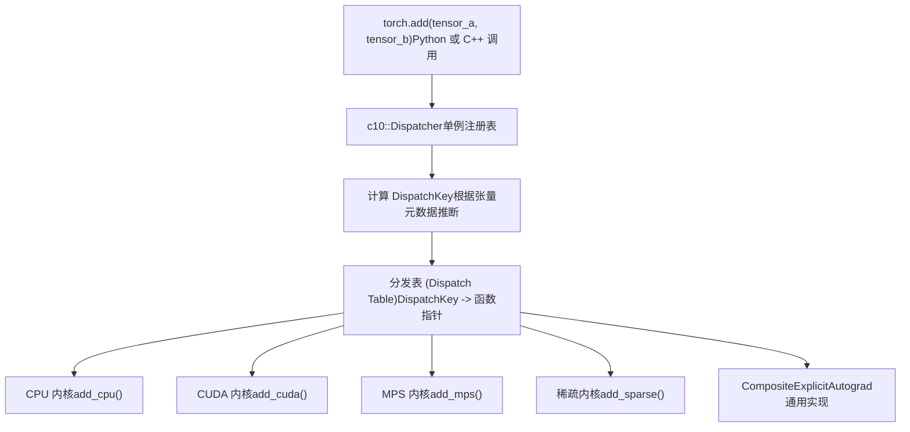
**DispatchKey 计算**：分发器根据以下内容计算 `DispatchKey`：

1.  **设备类型**：CPU, CUDA, XPU, MPS 等
2.  **布局 (Layout)**：Strided (稠密), SparseCOO, SparseCsr 等
3.  **Autograd 模式**：是否需要梯度
4.  **其他修饰符**：量化、嵌套张量等

计算出的键索引到分发表中，该表在代码生成期间根据 `native_functions.yaml` 填充。

来源： [aten/src/ATen/native/native\_functions.yaml554-593](https://github.com/pytorch/pytorch/blob/915982a4/aten/src/ATen/native/native_functions.yaml#L554-L593)

### 代码生成流水线 (Code Generation Pipeline)

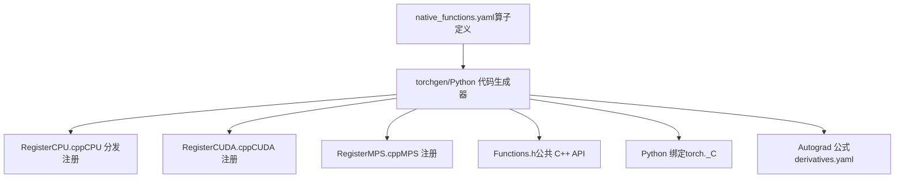
`torchgen` 工具解析 `native_functions.yaml` 并生成：

-   **注册代码**：为每个后端填充分发表
-   **公共 API 头文件**：`torch::` 命名空间下的 C++ 函数声明
-   **Python 绑定**：通过 `torch._C` 向 Python 暴露算子
-   **Autograd 导数**：来自 `derivatives.yaml` 的自动微分规则

来源： [aten/src/ATen/native/native\_functions.yaml1-100](https://github.com/pytorch/pytorch/blob/915982a4/aten/src/ATen/native/native_functions.yaml#L1-L100)

## 设备分配器架构 (Device Allocator Architecture)

所有设备后端都使用**缓存分配器 (caching allocator)** 模式，以摊销调用缓慢的驱动级分配 API（例如 `cudaMalloc`，可能耗时数毫秒）的开销。

### 分配器类层级结构 (Allocator Class Hierarchy)

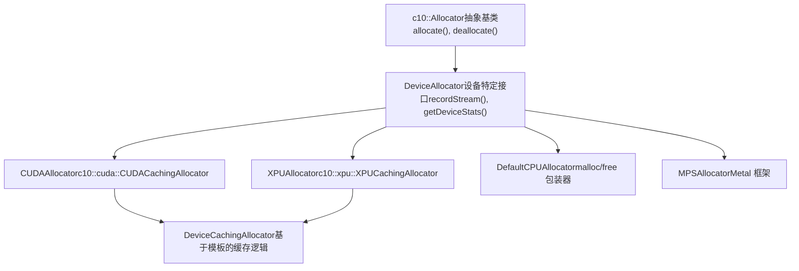
**DeviceAllocator 接口**关键方法：

-   `allocate(size, stream)`：在设备上分配内存
-   `raw_delete(ptr)`：释放已分配的指针
-   `recordStream(ptr, stream)`：追踪跨流的张量使用情况
-   `getDeviceStats(device)`：返回内存统计信息
-   `emptyCache()`：将缓存的内存块释放回驱动程序
-   `snapshot()`：内存性能分析快照

来源： [c10/cuda/CUDACachingAllocator.h111-261](https://github.com/pytorch/pytorch/blob/915982a4/c10/cuda/CUDACachingAllocator.h#L111-L261) [c10/xpu/XPUCachingAllocator.h9-14](https://github.com/pytorch/pytorch/blob/915982a4/c10/xpu/XPUCachingAllocator.h#L9-L14)

### 缓存分配器模式 (Caching Allocator Pattern)

**核心概念**：维护按大小组织的空闲内存块池。复用缓存的块进行新的分配，而不是调用驱动程序 API。

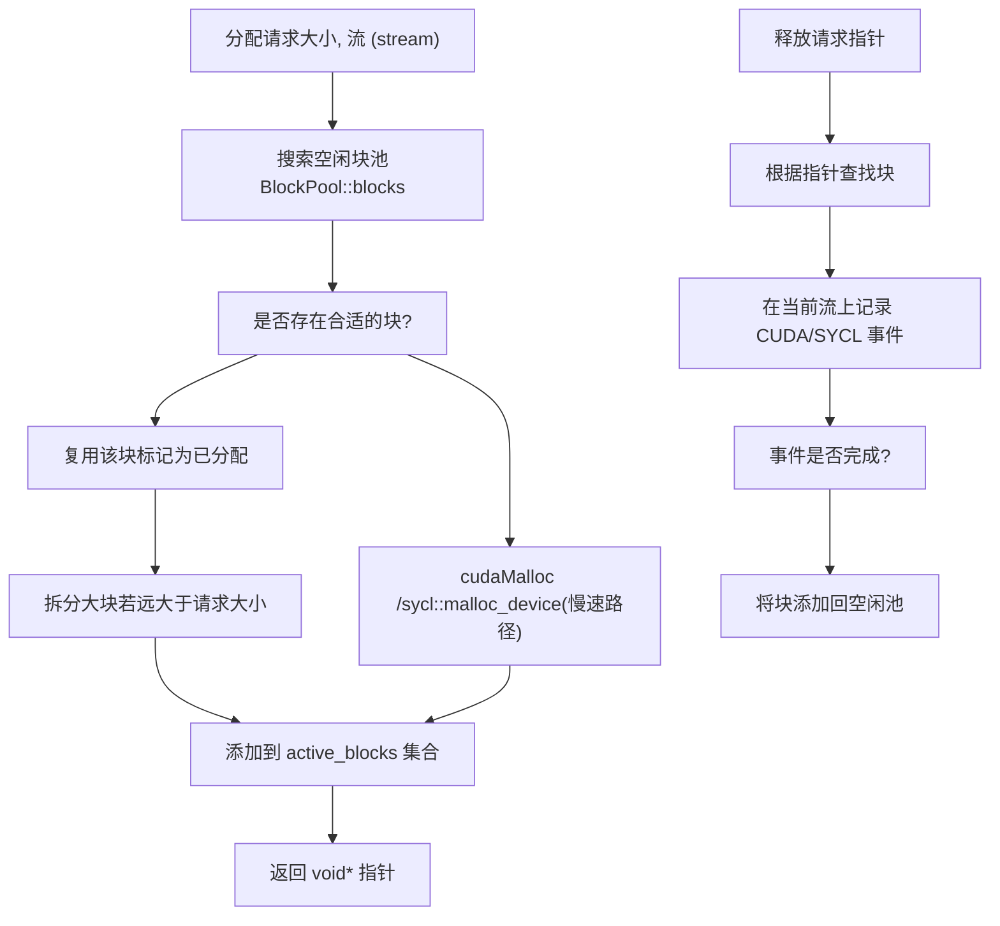
**Block 结构** [c10/cuda/CUDACachingAllocator.cpp189-258](https://github.com/pytorch/pytorch/blob/915982a4/c10/cuda/CUDACachingAllocator.cpp#L189-L258)：

```cpp
struct Block {  
  c10::DeviceIndex device;  
  cudaStream_t stream;          // 分配时的流  
  stream_set stream_uses;       // 使用过此块的所有流  
  size_t size;                  // 块大小（字节）  
  size_t requested_size;        // 原始分配请求的大小  
  BlockPool* pool;              // 小对象池或大对象池  
  void* ptr;                    // 设备内存指针  
  bool allocated;               // 当前是否在使用中  
  bool mapped;                  // 是否有物理内存背书（用于可扩展分段）  
  Block* prev, *next;           // 拆分块的链表  
  int event_count;              // 待处理的同步事件数量  
  ExpandableSegment* expandable_segment_;
}
```
**BlockPool 结构** [c10/cuda/CUDACachingAllocator.cpp164-185](https://github.com/pytorch/pytorch/blob/915982a4/c10/cuda/CUDACachingAllocator.cpp#L164-L185)：

-   `std::set<Block*, Comparison> blocks`：按大小排序的空闲块（用于最佳拟合分配）
-   `std::set<Block*, Comparison> unmapped`：未映射的块（用于可扩展分段）
-   `bool is_small`：小对象池 (<1MB) 或大对象池 (≥1MB)
-   两个独立的池减少了搜索时间并降低了碎片化

来源： [c10/cuda/CUDACachingAllocator.cpp68-100](https://github.com/pytorch/pytorch/blob/915982a4/c10/cuda/CUDACachingAllocator.cpp#L68-L100) [c10/cuda/CUDACachingAllocator.cpp164-258](https://github.com/pytorch/pytorch/blob/915982a4/c10/cuda/CUDACachingAllocator.cpp#L164-L258)

### 缓存分配器的关键行为 (Key Caching Allocator Behaviors)

来自 [c10/cuda/CUDACachingAllocator.cpp70-100](https://github.com/pytorch/pytorch/blob/915982a4/c10/cuda/CUDACachingAllocator.cpp#L70-L100)：

1.  **流关联性 (Stream Association)**：块与分配它们的流绑定。在不同流上复用块需要同步。

2.  **基于大小的池化 (Size-Based Pooling)**：分为：

    -   小额分配：< 1MB，打包进 2MB 的缓冲区中
    -   大额分配：≥ 1MB，按 2MB 边界对齐
3.  **块拆分 (Block Splitting)**：大的已缓存块可以被拆分以满足较小的请求。拆分后的块通过 `prev`/`next` 指针保持链接。

4.  **块合并 (Block Coalescing)**：相邻的空闲块会被合并以减少碎片。

5.  **垃圾回收 (Garbage Collection)**：当分配失败时，分配器：

    -   首先尝试释放一个合适大小的已缓存块
    -   接着尝试释放所有已缓存块
    -   如果仍然内存不足，最后调用驱动程序进行分配
6.  **事件同步 (Event Synchronization)**：在不同流上复用块之前，分配器会记录一个 CUDA 事件，以确保先前的工作已完成。


来源： [c10/cuda/CUDACachingAllocator.cpp68-100](https://github.com/pytorch/pytorch/blob/915982a4/c10/cuda/CUDACachingAllocator.cpp#L68-L100)

## CUDA 后端

### CUDA 内存管理组件 (CUDA Memory Management Components)

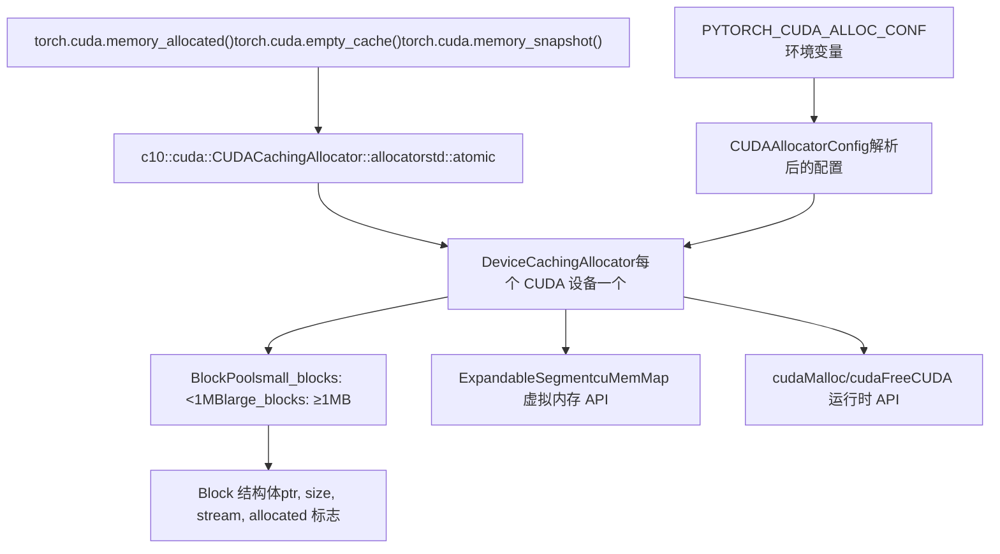
**全局分配器单例**： [c10/cuda/CUDACachingAllocator.h268-272](https://github.com/pytorch/pytorch/blob/915982a4/c10/cuda/CUDACachingAllocator.h#L268-L272)

```cpp
namespace c10::cuda::CUDACachingAllocator {  
  extern std::atomic<CUDAAllocator*> allocator;    
  inline CUDAAllocator* get() {    
    return allocator.load();  
  }
}
```
来源： [c10/cuda/CUDACachingAllocator.h268-272](https://github.com/pytorch/pytorch/blob/915982a4/c10/cuda/CUDACachingAllocator.h#L268-L272) [c10/cuda/CUDACachingAllocator.cpp486-600](https://github.com/pytorch/pytorch/blob/915982a4/c10/cuda/CUDACachingAllocator.cpp#L486-L600) [torch/cuda/memory.py1-64](https://github.com/pytorch/pytorch/blob/915982a4/torch/cuda/memory.py#L1-L64)

### 可扩展分段 (Expandable Segments)

可扩展分段通过使用 CUDA 底层虚拟内存 API，减少了批量大小 (batch size) 变化时的碎片化。

**动机** [c10/cuda/CUDACachingAllocator.cpp274-300](https://github.com/pytorch/pytorch/blob/915982a4/c10/cuda/CUDACachingAllocator.cpp#L274-L300)：在运行具有变化批量大小（例如 N → N+1）的推理时，传统分配会在分段末尾创建许多小的不可用内存“碎片 (slivers)”，即使总空闲内存充足也会导致 OOM（内存溢出）。

**解决方案**：使用 `cuMemMap` 和 `cuMemAddressReserve` 来：

1.  预留一个巨大的虚拟地址空间（最高达 256 TiB）
2.  初始仅映射所需的物理内存
3.  通过映射额外的物理页面来动态增长分段
4.  在 OOM 时取消页面映射以进行碎片整理

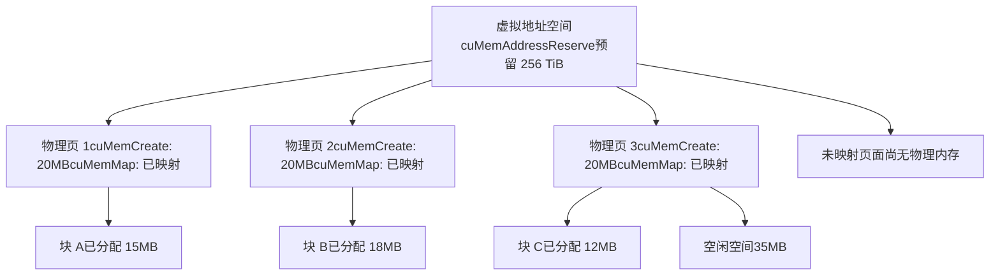
**实现** [c10/cuda/CUDACachingAllocator.cpp368-494](https://github.com/pytorch/pytorch/blob/915982a4/c10/cuda/CUDACachingAllocator.cpp#L368-L494)：

```cpp
struct ExpandableSegment {  
  uintptr_t ptr_;              // 基础虚拟地址  
  size_t segment_size_;        // 页面大小 (2MB 或 20MB)  
  size_t max_handles_;         // 最大页面数量  
  std::vector<std::optional<CUmemGenericAllocationHandle>> handles_;    
  
  SegmentRange map(SegmentRange range) {    
    // 将物理内存映射到虚拟地址范围    
    for (size_t i = begin; i < end; i++) {      
      CUmemGenericAllocationHandle handle;      
      cuMemCreate(&handle, segment_size_, &prop, 0);      
      cuMemMap(ptr_ + i * segment_size_, segment_size_, 0, handle, 0);      
      cuMemSetAccess(ptr_ + i * segment_size_, segment_size_, &accessDesc, 1);      
      handles_[i] = handle;    
    }  
  }    
  
  SegmentRange unmap(SegmentRange range) {    
    // 取消映射并释放物理内存    
    for (size_t i = begin; i < end; i++) {      
      cuMemUnmap(ptr_ + i * segment_size_, segment_size_);      
      cuMemRelease(handles_[i]);      
      handles_[i] = std::nullopt;    
    }  
  }
}
```
**配置**：`PYTORCH_CUDA_ALLOC_CONF=expandable_segments:True`

**限制**：

-   要求 CUDA 11.4+ 以及驱动程序支持
-   用于多进程的 IPC（进程间通信）需要特殊处理
-   由于虚拟内存设置，初始分配速度略慢

来源： [c10/cuda/CUDACachingAllocator.cpp274-366](https://github.com/pytorch/pytorch/blob/915982a4/c10/cuda/CUDACachingAllocator.cpp#L274-L366) [c10/cuda/CUDACachingAllocator.cpp368-494](https://github.com/pytorch/pytorch/blob/915982a4/c10/cuda/CUDACachingAllocator.cpp#L368-L494)

### CUDA Python 内存 API (CUDA Python Memory API)

`torch.cuda.memory` 模块提供了对分配器功能的 Python 访问。

| 函数 | 目的 | C++ 实现 |
| --- | --- | --- |
| `memory_allocated(device)` | 当前已分配字节数 | `CUDAAllocator::getDeviceStats()` |
| `max_memory_allocated(device)` | 峰值已分配字节数 | DeviceStats 峰值追踪 |
| `memory_reserved(device)` | 总计已缓存内存 | 分配器中的预留分段 |
| `empty_cache()` | 释放空闲块 | `CUDAAllocator::emptyCache()` |
| `memory_stats(device)` | 详细统计信息字典 | `CUDAAllocator::getDeviceStats()` |
| `memory_snapshot()` | 分配历史记录 | `CUDAAllocator::snapshot()` |
| `set_per_process_memory_fraction(frac, dev)` | 限制内存使用 | `CUDAAllocator::setMemoryFraction()` |
| `caching_allocator_alloc(size, stream)` | 原始分配 | `raw_alloc_with_stream()` |
| `caching_allocator_delete(ptr)` | 原始释放 | `raw_delete()` |

**内存统计类别** [torch/cuda/memory.py227-285](https://github.com/pytorch/pytorch/blob/915982a4/torch/cuda/memory.py#L227-L285)：

-   **池类型**：`all`, `large_pool`, `small_pool`
-   **指标类型**：`current`, `peak`, `allocated`, `freed`
-   **统计名称**：`allocated_bytes`, `reserved_bytes`, `active_bytes`, `inactive_split_bytes`, `segment`, `num_alloc_retries`, `num_ooms`

示例：`allocated_bytes.large_pool.peak` = 大对象池已分配字节数的峰值

来源： [torch/cuda/memory.py32-285](https://github.com/pytorch/pytorch/blob/915982a4/torch/cuda/memory.py#L32-L285) [torch/csrc/cuda/Module.cpp1-100](https://github.com/pytorch/pytorch/blob/915982a4/torch/csrc/cuda/Module.cpp#L1-L100)

### CUDA 图支持 (CUDA Graph Support)

**挑战** [c10/cuda/CUDACachingAllocator.cpp102-133](https://github.com/pytorch/pytorch/blob/915982a4/c10/cuda/CUDACachingAllocator.cpp#L102-L133)：CUDA 图在记录期间捕获内存地址。这些地址在重放期间必须保持有效，但缓存分配器通常会复用内存。

**解决方案**：每个图使用私有的内存池（由 `MempoolId_t` 标识）。

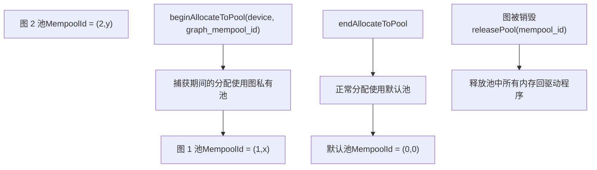
**API** [c10/cuda/CUDACachingAllocator.h134-141](https://github.com/pytorch/pytorch/blob/915982a4/c10/cuda/CUDACachingAllocator.h#L134-L141)：

```cpp
class CUDAAllocator {  
  virtual void beginAllocateToPool(      
    DeviceIndex device,      
    MempoolId_t mempool_id,      
    std::function<bool(cudaStream_t)> filter) = 0;        
  
  virtual void endAllocateToPool(      
    DeviceIndex device,      
    MempoolId_t mempool_id) = 0;        
  
  virtual void releasePool(      
    DeviceIndex device,      
    MempoolId_t mempool_id) = 0;
}
```
在捕获期间，匹配流上的所有分配都进入该图的私有池。该池持续存在直到图被销毁，从而确保地址保持有效。

来源： [c10/cuda/CUDACachingAllocator.cpp102-133](https://github.com/pytorch/pytorch/blob/915982a4/c10/cuda/CUDACachingAllocator.cpp#L102-L133) [c10/cuda/CUDACachingAllocator.h134-141](https://github.com/pytorch/pytorch/blob/915982a4/c10/cuda/CUDACachingAllocator.h#L134-L141)

### CUDA 分配器配置 (CUDA Allocator Configuration)

配置通过 [c10/cuda/CUDAAllocatorConfig.cpp72-134](https://github.com/pytorch/pytorch/blob/915982a4/c10/cuda/CUDAAllocatorConfig.cpp#L72-L134) 从环境变量中解析。

**配置选项**：

| 选项 | 类型 | 默认值 | 描述 |
| --- | --- | --- | --- |
| `backend` | string | `native` | `native` 或 `cudaMallocAsync` |
| `max_split_size_mb` | size\_t | ∞ | 大对象块拆分的最大尺寸 (MB) |
| `garbage_collection_threshold` | double | 0.0 | 当 空闲/总计 比例超过此值时触发 GC |
| `expandable_segments` | bool | False | 使用 `cuMemMap` 实现可扩展分段 |
| `release_lock_on_cudamalloc` | bool | False | 在 `cudaMalloc` 期间释放分配器锁 |
| `pinned_use_cuda_host_register` | bool | False | 为锁页内存使用 `cudaHostRegister` |
| `pinned_num_register_threads` | size\_t | 1 | 用于并行注册的线程数 |
| `roundup_power2_divisions` | size\_t\[\] | \[0,...\] | 每个尺寸范围的舍入粒度 |

**配置示例**：

```bash
PYTORCH_CUDA_ALLOC_CONF="expandable_segments:True,max_split_size_mb:512,garbage_collection_threshold:0.8"
```
来源： [c10/cuda/CUDAAllocatorConfig.h1-180](https://github.com/pytorch/pytorch/blob/915982a4/c10/cuda/CUDAAllocatorConfig.h#L1-L180) [c10/cuda/CUDAAllocatorConfig.cpp1-170](https://github.com/pytorch/pytorch/blob/915982a4/c10/cuda/CUDAAllocatorConfig.cpp#L1-L170)

### 锁页内存分配器 (Pinned Memory Allocator)

锁页 (pinned/page-locked) 内存通过防止 OS 将内存分页到磁盘，从而实现更快的 CPU↔GPU 传输。

**CachingHostAllocator** [aten/src/ATen/cuda/CachingHostAllocator.cpp15-66](https://github.com/pytorch/pytorch/blob/915982a4/aten/src/ATen/cuda/CachingHostAllocator.cpp#L15-L66)：

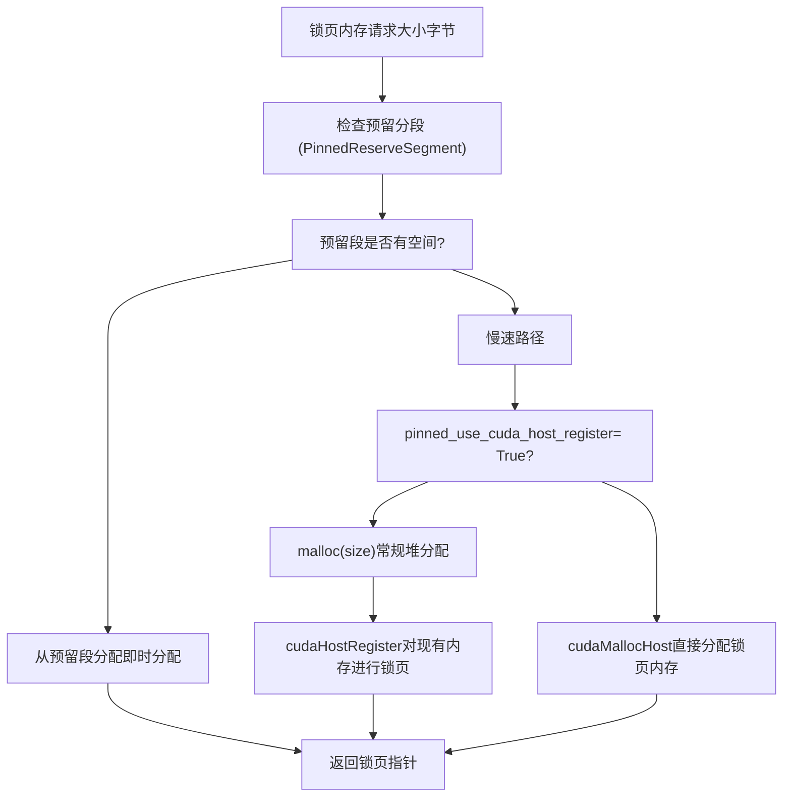
**`cudaHostRegister` 的益处** [aten/src/ATen/cuda/CachingHostAllocator.cpp32-38](https://github.com/pytorch/pytorch/blob/915982a4/aten/src/ATen/cuda/CachingHostAllocator.cpp#L32-L38)：

-   适用于任何内存分配（不限于 `cudaMallocHost`）
-   针对大额分配更快（无即时内存清零）
-   要求主机和设备上具有相同的虚拟地址空间

**预留分段 (Reserve Segment)**：预先分配的用于快速分配的锁页内存池。大小通过 `pinned_reserve_segment_size_mb` 配置。

来源： [aten/src/ATen/cuda/CachingHostAllocator.cpp1-200](https://github.com/pytorch/pytorch/blob/915982a4/aten/src/ATen/cuda/CachingHostAllocator.cpp#L1-L200) [c10/cuda/CUDAAllocatorConfig.h69-86](https://github.com/pytorch/pytorch/blob/915982a4/c10/cuda/CUDAAllocatorConfig.h#L69-L86)

## XPU 后端 (Intel GPU)

针对 Intel GPU 的 XPU 后端镜像了 CUDA 的架构，但使用 SYCL API 代替 CUDA 运行时。

### XPU 分配器结构 (XPU Allocator Structure)

**DeviceCachingAllocator** [c10/xpu/XPUCachingAllocator.cpp486-529](https://github.com/pytorch/pytorch/blob/915982a4/c10/xpu/XPUCachingAllocator.cpp#L486-L529)：

```cpp
class DeviceCachingAllocator { 
private:  
  std::recursive_mutex mutex;  
  BlockPool large_blocks;  // ≥1MB 的分配  
  BlockPool small_blocks;  // <1MB 的分配  
  ska::flat_hash_set<Block*> active_blocks;  
  ska::flat_hash_map<xpu::XPUStream,                      
                     std::deque<std::pair<sycl::event, Block*>>> xpu_events;  
  std::vector<ExpandableSegment*> expandable_segments;  
  DeviceIndex device_index;
};
```
**与 CUDA 的关键差异**：

-   使用 `sycl::queue*` 代替 `cudaStream_t`
-   使用 `sycl::event` 代替 `cudaEvent_t`
-   驱动程序分配：使用 `sycl::aligned_alloc_device` 代替 `cudaMalloc`
-   驱动程序释放：使用 `sycl::free` 代替 `cudaFree`

来源： [c10/xpu/XPUCachingAllocator.cpp486-529](https://github.com/pytorch/pytorch/blob/915982a4/c10/xpu/XPUCachingAllocator.cpp#L486-L529)

### XPU 可扩展分段 (XPU Expandable Segments)

使用 SYCL 的虚拟内存扩展 [c10/xpu/XPUCachingAllocator.cpp133-240](https://github.com/pytorch/pytorch/blob/915982a4/c10/xpu/XPUCachingAllocator.cpp#L133-L240)：

```cpp
struct ExpandableSegment {  
  ExpandableSegment(DeviceIndex device,                     
                    std::optional<sycl::queue*> queue,                    
                    size_t segment_size,                    
                    std::vector<DeviceIndex> peers) {    
    // 预留虚拟地址空间    
    ptr_ = sycl::ext::oneapi::experimental::reserve_virtual_mem(        
      segment_size_ * max_handles_,         
      xpu::get_device_context());  
  }    
  
  SegmentRange map(SegmentRange range) {    
    // 分配并映射物理内存    
    auto& mem = handle.emplace(        
      xpu::get_raw_device(device_),        
      xpu::get_device_context(),        
      segment_size_);    
    mem.map(ptr_ + i * segment_size_, segment_size_,            
            sycl::ext::oneapi::experimental::address_access_mode::read_write);  
  }    
  
  SegmentRange unmap(SegmentRange range) {    
    // 取消映射物理内存    
    sycl::ext::oneapi::experimental::unmap(        
      ptr_ + segment_size_ * i,        
      segment_size_,        
      xpu::get_device_context());    
    handles_[i].reset();  // 销毁 physical_mem 对象    
  }
}
```
**SYCL 虚拟内存**：使用 `sycl::ext::oneapi::experimental::physical_mem` 进行物理页面分配，使用 `reserve_virtual_mem` / `unmap` 进行虚拟地址空间管理。

来源： [c10/xpu/XPUCachingAllocator.cpp133-240](https://github.com/pytorch/pytorch/blob/915982a4/c10/xpu/XPUCachingAllocator.cpp#L133-L240)

### XPU Python 内存 API (XPU Python Memory API)

与 CUDA API 平行，定义在 [torch/xpu/memory.py26-195](https://github.com/pytorch/pytorch/blob/915982a4/torch/xpu/memory.py#L26-L195)：

| XPU 函数 | 等效 CUDA 函数 |
| --- | --- |
| `torch.xpu.empty_cache()` | `torch.cuda.empty_cache()` |
| `torch.xpu.memory_allocated(device)` | `torch.cuda.memory_allocated(device)` |
| `torch.xpu.max_memory_allocated(device)` | `torch.cuda.max_memory_allocated(device)` |
| `torch.xpu.memory_reserved(device)` | `torch.cuda.memory_reserved(device)` |
| `torch.xpu.memory_stats(device)` | `torch.cuda.memory_stats(device)` |
| `torch.xpu.reset_peak_memory_stats(device)` | `torch.cuda.reset_peak_memory_stats(device)` |
| `torch.xpu.memory_snapshot()` | `torch.cuda.memory_snapshot()` |

**设备管理** [torch/xpu/\_\_init\_\_.py1-600](https://github.com/pytorch/pytorch/blob/915982a4/torch/xpu/__init__.py#L1-L600)：

-   `torch.xpu.device_count()` - XPU 设备数量
-   `torch.xpu.current_device()` - 当前活跃设备索引
-   `torch.xpu.set_device(device)` - 设置活跃设备
-   `torch.xpu.get_device_properties(device)` - 设备能力

来源： [torch/xpu/memory.py1-200](https://github.com/pytorch/pytorch/blob/915982a4/torch/xpu/memory.py#L1-L200) [torch/xpu/\_\_init\_\_.py1-600](https://github.com/pytorch/pytorch/blob/915982a4/torch/xpu/__init__.py#L1-L600) [torch/csrc/xpu/Module.cpp1-100](https://github.com/pytorch/pytorch/blob/915982a4/torch/csrc/xpu/Module.cpp#L1-L100)

## MPS 后端 (Metal Performance Shaders)

MPS 后端通过 Metal Performance Shaders 启用了在 Apple Silicon GPU 上的 PyTorch 操作。

### MPS 架构 (MPS Architecture)

与 CUDA/XPU 不同，MPS 不使用缓存分配器。内存通过 Metal 的分配 API 直接管理。

**MPS 操作实现模式示例** [aten/src/ATen/native/sparse/mps/SparseMPSTensorMath.mm55-108](https://github.com/pytorch/pytorch/blob/915982a4/aten/src/ATen/native/sparse/mps/SparseMPSTensorMath.mm#L55-L108)：

```cpp
static Tensor& s_addmm_out_sparse_dense_mps(    
  Tensor& r,    
  const Tensor& t,    
  const SparseTensor& sparse_,    
  const Tensor& dense,    
  const Scalar& beta,    
  const Scalar& alpha) {    
  
  // 验证维度  
  TORCH_CHECK(sparse_.sparse_dim() == 2, "sparse_dim must be 2");  
  TORCH_CHECK(dense.dim() == 2, "dense must be 2D");    
  
  // 获取 Metal 着色器库  
  #ifndef PYTORCH_JIT_COMPILE_SHADERS  
  static auto& lib = MetalShaderLibrary::getBundledLibrary();  
  #endif    
  
  // 合并稀疏张量（合并重复索引）  
  auto sparse = sparse_.coalesce();    
  
  // 创建 MPSGraph 并添加计算节点  
  // ... MPSGraph 构建 ...    
  
  // 在 MPS 设备上执行图  
  // ... 执行代码 ...    
  
  return r;
}
```
**Metal 着色器 (Metal Shaders)**：使用 Metal 着色语言（.metal 文件）编写并编译进 `.metallib` 归档中的自定义内核。

来源： [aten/src/ATen/native/sparse/mps/SparseMPSTensorMath.mm1-108](https://github.com/pytorch/pytorch/blob/915982a4/aten/src/ATen/native/sparse/mps/SparseMPSTensorMath.mm#L1-L108) [c10/metal/utils.h1-50](https://github.com/pytorch/pytorch/blob/915982a4/c10/metal/utils.h#L1-L50)

### MPS 二元操作 (MPS Binary Operations)

二元操作（加、乘、除）使用 MPSGraph API [aten/src/ATen/native/mps/operations/BinaryKernel.mm1-100](https://github.com/pytorch/pytorch/blob/915982a4/aten/src/ATen/native/mps/operations/BinaryKernel.mm#L1-L100)：

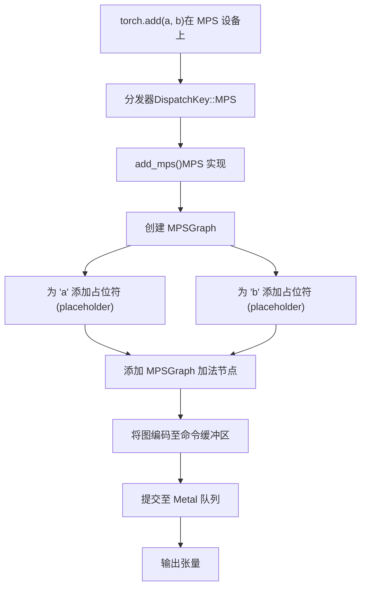
**MPSGraph**：Apple 的基于图的计算 API，可编译为优化的 Metal 内核。

来源： [aten/src/ATen/native/mps/operations/BinaryKernel.mm1-100](https://github.com/pytorch/pytorch/blob/915982a4/aten/src/ATen/native/mps/operations/BinaryKernel.mm#L1-L100)

## 测试基础设施 (Testing Infrastructure)

### OpInfo 数据库 (OpInfo Database)

OpInfo 框架在不同设备和数据类型上系统地测试所有 PyTorch 算子。

**针对设备支持的 OpInfo 过滤示例** [test/test\_sparse.py39-54](https://github.com/pytorch/pytorch/blob/915982a4/test/test_sparse.py#L39-L54)：

```python
# 过滤支持任一稀疏布局的算子
def _op_supports_any_sparse(op):    
    return (op.supports_sparse            
            or op.supports_sparse_csr            
            or op.supports_sparse_csc            
            or op.supports_sparse_bsr            
            or op.supports_sparse_bsc)

# 获取具有稀疏支持的算子
reduction_ops_with_sparse_support = [    
    op for op in reduction_ops     
    if 'masked.' not in op.name and _op_supports_any_sparse(op)]

binary_ufuncs_with_sparse_support = [    
    op for op in binary_ufuncs     
    if _op_supports_any_sparse(op)]
```
**OpInfo 结构**：每个算子都有一个 `OpInfo` 对象，定义了：

-   `name`：算子名称（例如 "add", "mul"）
-   `sample_inputs_func`：生成各种形状/数据类型的测试输入
-   `supports_sparse`, `supports_sparse_csr` 等：布局支持标志位
-   `dtypes`：每个设备支持的数据类型
-   `skips`：针对特定配置的预期测试失败
-   `decorators`：设备特定的测试修饰符

来源： [test/test\_sparse.py28-56](https://github.com/pytorch/pytorch/blob/915982a4/test/test_sparse.py#L28-L56)

### 跨设备测试模式 (Cross-Device Test Pattern)

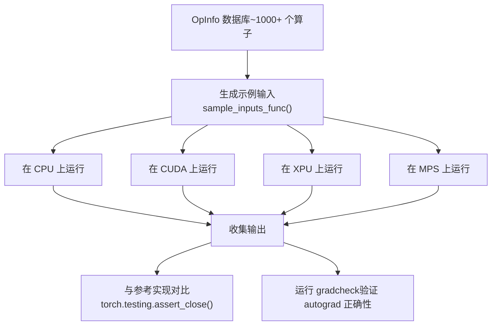
**XPU 测试示例** [test/test\_xpu.py59-90](https://github.com/pytorch/pytorch/blob/915982a4/test/test_xpu.py#L59-L90)：

```python
_xpu_computation_op_list = [    
    "fill", "zeros", "clone", "add", "sub", "mul", "div", "abs"]
_xpu_all_ops = [    
    op for op in ops_and_refs     
    if op.name in _xpu_all_op_list]

@ops(_xpu_all_ops, allowed_dtypes=any_common_cpu_xpu_one)
def test_xpu_ops(self, device, dtype, op):    
    samples = op.sample_inputs(device, dtype)    
    for sample in samples:        
        result = op(sample.input, *sample.args, **sample.kwargs)        
        # 验证输出形状、数据类型和数值        
        self.assertEqual(result.device.type, 'xpu')
```
**CUDA 测试示例** [test/test\_cuda.py133-145](https://github.com/pytorch/pytorch/blob/915982a4/test/test_cuda.py#L133-L145)：

```python
@unittest.skipIf(not TEST_CUDA, "CUDA not available")
class TestCuda(TestCase):    
    _do_cuda_memory_leak_check = True    
    _do_cuda_non_default_stream = True        
    
    def test_memory_allocation(self):        
        prev = torch.cuda.memory_allocated()        
        mem = torch.cuda.caching_allocator_alloc(size)        
        self.assertGreater(torch.cuda.memory_allocated(), prev)        
        torch.cuda.caching_allocator_delete(mem)        
        self.assertEqual(torch.cuda.memory_allocated(), prev)
```
来源： [test/test\_cuda.py133-145](https://github.com/pytorch/pytorch/blob/915982a4/test/test_cuda.py#L133-L145) [test/test\_xpu.py59-115](https://github.com/pytorch/pytorch/blob/915982a4/test/test_xpu.py#L59-L115)

### 设备特定测试标记 (Device-Specific Test Markers)

测试使用装饰器控制执行：

-   `@unittest.skipIf(not TEST_CUDA, ...)` - 若 CUDA 不可用则跳过
-   `@onlyCUDA` - 仅在 CUDA 上运行
-   `@skipCUDAIf(condition, reason)` - 在特定条件下跳过 CUDA
-   `@largeTensorTest("30GB", "cuda")` - 要求大容量 GPU 内存
-   `@expectedFailureMPS` - 标记已知的 MPS 失败用例

来源： [test/test\_cuda.py1-100](https://github.com/pytorch/pytorch/blob/915982a4/test/test_cuda.py#L1-L100) [test/test\_xpu.py1-100](https://github.com/pytorch/pytorch/blob/915982a4/test/test_xpu.py#L1-L100) [test/test\_sparse.py1-100](https://github.com/pytorch/pytorch/blob/915982a4/test/test_sparse.py#L1-L100)

## 分配器配置系统 (Allocator Configuration System)

所有后端的共享配置解析。

### 配置分词器 (Configuration Tokenizer)

[c10/core/AllocatorConfig.h34-115](https://github.com/pytorch/pytorch/blob/915982a4/c10/core/AllocatorConfig.h#L34-L115) 提供了 `ConfigTokenizer` 类：

```cpp
class ConfigTokenizer {  
  std::vector<std::string> config_;    
  
  explicit ConfigTokenizer(const std::string& env) {    
    // 将 "key1:val1,key2:val2" 分词为:    
    // ["key1", ":", "val1", ",", "key2", ":", "val2"]    
    for (char ch : env) {      
      if (ch == ',' || ch == ':' || ch == '[' || ch == ']') {        
        if (!buffer.empty()) {          
          config_.emplace_back(std::move(buffer));          
          buffer.clear();        
        }        
        config_.emplace_back(1, ch);      
      } else if (!std::isspace(ch)) {        
        buffer += ch;      
      }    
    }  
  }    
  
  const std::string& operator[](size_t i) const;  
  size_t size() const;  
  size_t toSizeT(size_t i) const;  
  bool toBool(size_t i) const;
}
```
### 解析流程 (Parsing Flow)

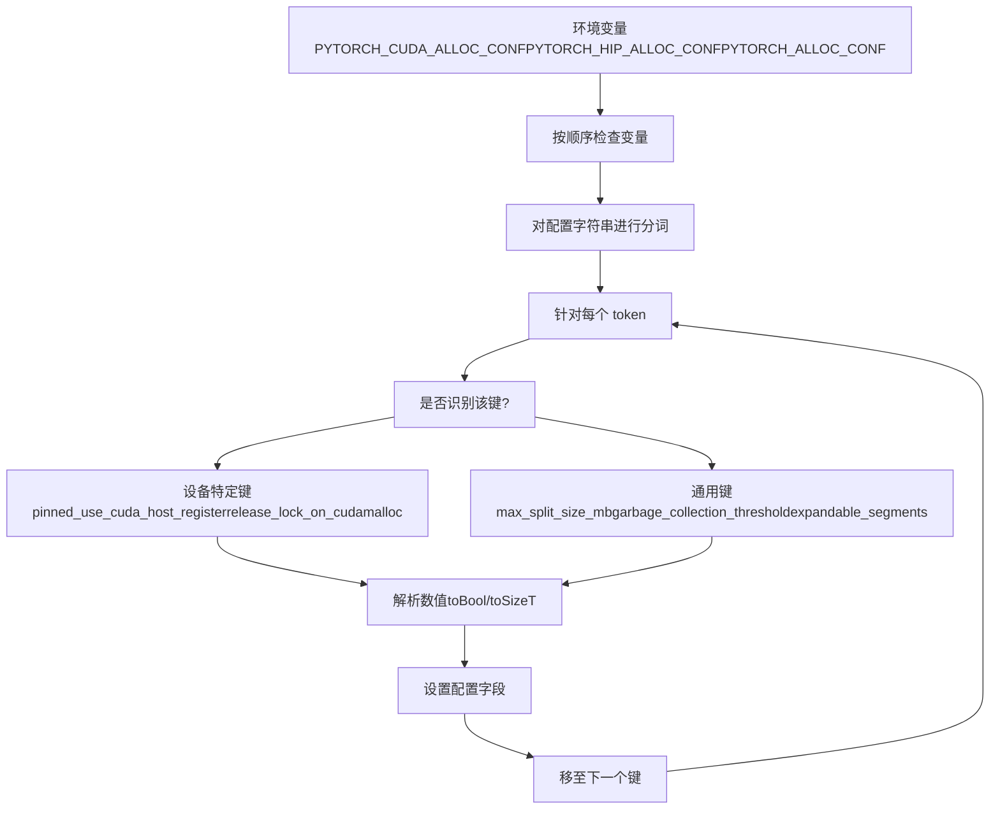
来源： [c10/core/AllocatorConfig.cpp1-250](https://github.com/pytorch/pytorch/blob/915982a4/c10/core/AllocatorConfig.cpp#L1-L250)

### 通用配置选项 (Common Configuration Options)

定义在 [c10/core/AllocatorConfig.h1-250](https://github.com/pytorch/pytorch/blob/915982a4/c10/core/AllocatorConfig.h#L1-L250)：

| 选项 | 类型 | 默认值 | 范围 | 描述 |
| --- | --- | --- | --- | --- |
| `max_split_size_mb` | size\_t | ∞ | ≥ large\_segment\_size | 块拆分的最大尺寸 |
| `large_segment_size_mb` | size\_t | 20 | \> 1 | 进入大对象池的阈值 |
| `garbage_collection_threshold` | double | 0.0 | 0.0-1.0 | 触发 GC 的 空闲/总计 比例 |
| `expandable_segments` | bool | False | \- | 使用虚拟内存分段 |
| `roundup_power2_divisions` | size\_t\[\] | \[0,...,0\] | 每档 ≥0 | 1MB-64GB 的舍入粒度 |
| `pinned_use_background_threads` | bool | False | \- | 异步锁页内存操作 |

**Round-up Divisions**：控制不同尺寸范围的内存舍入，以减少碎片。数组有 16 个条目，涵盖 1MB 到 64GB 的以 2 为底的指数区间。

来源： [c10/core/AllocatorConfig.h1-250](https://github.com/pytorch/pytorch/blob/915982a4/c10/core/AllocatorConfig.h#L1-L250) [c10/core/AllocatorConfig.cpp1-250](https://github.com/pytorch/pytorch/blob/915982a4/c10/core/AllocatorConfig.cpp#L1-L250)

## 内存快照与可视化 (Memory Snapshot and Visualization)

### 快照数据结构 (Snapshot Data Structure)

内存快照捕获分配器的完整状态以供分析 [torch/csrc/cuda/memory\_snapshot.cpp1-500](https://github.com/pytorch/pytorch/blob/915982a4/torch/csrc/cuda/memory_snapshot.cpp#L1-L500)：

```cpp
struct SnapshotInfo {  
  std::vector<SegmentInfo> segments;       // 所有已分配的分段  
  std::vector<std::vector<TraceEntry>> device_traces;  // 每个设备的历史记录  
  std::vector<AnnotationEntry> external_annotations;    // 用户元数据  
  AllocatorConfigInfo config_metadata;     // 快照时的配置信息
};

struct SegmentInfo {  
  void* address;  
  size_t total_size;  
  size_t allocated_size;  
  bool is_large;  
  std::vector<BlockInfo> blocks;           // 分段内的内存块
};

struct BlockInfo {  
  void* address;  
  size_t size;  
  size_t requested_size;  
  bool allocated;  
  std::shared_ptr<GatheredContext> context;  // 调用栈追踪
};
```
### 可视化组件 (Visualization Components)

快照使用 JavaScript 进行渲染 [torch/utils/viz/MemoryViz.js1-1000](https://github.com/pytorch/pytorch/blob/915982a4/torch/utils/viz/MemoryViz.js#L1-L1000)：

```javascript
// 核心数据结构
function Segment(addr, size, stream, frames, version, user_metadata) {  
  return {addr, size, stream, version, frames, user_metadata};
}

function Block(addr, size, requested_size, frames,                
               free_requested, version, user_metadata) {  
  return {addr, size, requested_size, frames,           
          free_requested, version, user_metadata};
}

// 可视化类型
function EventSelector(outer, events, stack_info, memory_view) {  
  // 分配事件的时间线视图
}

function SegmentTimeline(parent, segments, streams, max_addr) {  
  // 显示分段生命周期的可视化时间线
}

function StackTraceView(outer, events, selected_event) {  
  // 显示分配操作的 Python/C++ 调用栈
}
```
**可视化特性**：

-   分配与释放的时间线
-   内存随时间的使用情况
-   带有地址的分段/块层级结构
-   每次分配的调用栈追踪
-   显示并行性的流 (stream) 着色
-   碎片化分析

来源： [torch/utils/viz/MemoryViz.js1-100](https://github.com/pytorch/pytorch/blob/915982a4/torch/utils/viz/MemoryViz.js#L1-L100) [torch/csrc/cuda/memory\_snapshot.cpp1-100](https://github.com/pytorch/pytorch/blob/915982a4/torch/csrc/cuda/memory_snapshot.cpp#L1-L100)

## 稀疏张量后端支持 (Sparse Tensor Backend Support)

### 原生函数中的稀疏布局 (Sparse Layouts in Native Functions)

PyTorch 支持多种稀疏张量布局，每种布局都有专用分发键。

**稀疏布局分发键示例** [aten/src/ATen/native/native\_functions.yaml340-365](https://github.com/pytorch/pytorch/blob/915982a4/aten/src/ATen/native/native_functions.yaml#L340-L365)：

```yaml
- func: abs(Tensor self) -> Tensor  
  dispatch:    
    CompositeExplicitAutograd: abs           # 通用回退方案    
    SparseCPU, SparseCUDA, SparseMPS: abs_sparse    
    SparseCsrCPU, SparseCsrCUDA, SparseCsrMPS, SparseCsrMeta: abs_sparse_csr    
    NestedTensorCPU, NestedTensorHPU, NestedTensorCUDA: NestedTensor_abs
```
**稀疏格式**：

-   **SparseCOO** (`torch.sparse_coo`)：带有索引和数值的坐标格式
-   **SparseCsr** (`torch.sparse_csr`)：压缩稀疏行 (Compressed Sparse Row)
-   **SparseCsc** (`torch.sparse_csc`)：压缩稀疏列 (Compressed Sparse Column)
-   **SparseBsr** (`torch.sparse_bsr`)：块压缩稀疏行 (Block Sparse Row)
-   **SparseBsc** (`torch.sparse_bsc`)：块压缩稀疏列 (Block Sparse Column)

每种格式在每个设备上都有分发键：

-   CPU：`SparseCPU`, `SparseCsrCPU` 等
-   CUDA：`SparseCUDA`, `SparseCsrCUDA` 等
-   MPS：`SparseMPS`, `SparseCsrMPS` 等

来源： [aten/src/ATen/native/native\_functions.yaml340-365](https://github.com/pytorch/pytorch/blob/915982a4/aten/src/ATen/native/native_functions.yaml#L340-L365)

### 稀疏操作测试 (Sparse Operations Testing)

测试套件验证跨布局和设备的稀疏操作 [test/test\_sparse.py134-154](https://github.com/pytorch/pytorch/blob/915982a4/test/test_sparse.py#L134-L154)：

```python
@all_sparse_layouts(test_name='layout', include_strided=False)
@gradcheck_semantics(test_name='gradcheck')
def test_sparse_operation(self, layout, gradcheck):    
    # 在给定稀疏布局上测试算子    
    # layout 是以下之一：torch.sparse_coo, torch.sparse_csr 等    
    # gradcheck 是稀疏语义或掩码语义
```
`@all_sparse_layouts` 装饰器对以下布局进行测试：

-   `torch.sparse_coo`
-   `torch.sparse_csr`
-   `torch.sparse_csc`
-   `torch.sparse_bsr`
-   `torch.sparse_bsc`

来源： [test/test\_sparse.py134-154](https://github.com/pytorch/pytorch/blob/915982a4/test/test_sparse.py#L134-L154)

### MPS 稀疏实现 (MPS Sparse Implementation)

[aten/src/ATen/native/sparse/mps/SparseMPSTensorMath.mm1-2000](https://github.com/pytorch/pytorch/blob/915982a4/aten/src/ATen/native/sparse/mps/SparseMPSTensorMath.mm#L1-L2000) 中的 MPS 稀疏操作包括：

-   `addmm` - 稀疏-稠密矩阵乘法
-   `_sparse_softmax` - 稀疏张量上的 Softmax
-   `_sparse_log_softmax` - 稀疏张量上的 Log-softmax
-   稀疏二元操作（加、乘）

**注册示例** [aten/src/ATen/native/sparse/mps/SparseMPSTensorMath.mm50-80](https://github.com/pytorch/pytorch/blob/915982a4/aten/src/ATen/native/sparse/mps/SparseMPSTensorMath.mm#L50-L80)：

```cpp
TORCH_LIBRARY_IMPL(aten, SparseMPS, m) {  
  m.impl("addmm", TORCH_FN(s_addmm_out_sparse_dense_mps));  
  m.impl("_sparse_softmax", TORCH_FN(_sparse_softmax_mps));  
  m.impl("_sparse_log_softmax", TORCH_FN(_sparse_log_softmax_mps));
}
```
来源： [aten/src/ATen/native/sparse/mps/SparseMPSTensorMath.mm1-108](https://github.com/pytorch/pytorch/blob/915982a4/aten/src/ATen/native/sparse/mps/SparseMPSTensorMath.mm#L1-L108)

## 总结 (Summary)

PyTorch 的设备后端系统通过几个关键架构模式为多样化的硬件加速器提供了统一接口：

**原生函数系统 (Native Function System)**：

-   在 `native_functions.yaml` 中进行声明式算子定义
-   为分发表自动生成代码
-   通过 `DispatchKey` 实现设备和布局特定的路由

**缓存分配器 (Caching Allocators)** (CUDA, XPU)：

-   块池化 (Block pooling) 以减少驱动程序 API 开销
-   带有事件同步的流感知分配
-   通过可扩展分段减少碎片化
-   针对 CUDA 图支持提供图私有内存池

**MPS 后端**：

-   用于操作组合的 MPSGraph API
-   直接集成 Metal 框架
-   针对特殊操作的自定义 Metal 着色器

**测试基础设施 (Testing Infrastructure)**：

-   用于系统性跨设备验证的 OpInfo 数据库
-   在 CPU, CUDA, XPU, MPS 上测试了约 1000+ 个算子
-   设备特定的测试标记和预期失败项

**配置系统 (Configuration System)**：

-   统一的环境变量解析
-   设备特定及共享的配置选项
-   内存分配行为的运行时调优

有关编译和内核优化的信息，请参阅 TorchInductor 后端 [2.5](/pytorch/pytorch/2.5-torchinductor-backend)。有关跨设备的分布式内存管理，请参阅分布式训练系统 [4](/pytorch/pytorch/4-distributed-training-systems)。

来源： [aten/src/ATen/native/native\_functions.yaml1-667673](https://github.com/pytorch/pytorch/blob/915982a4/aten/src/ATen/native/native_functions.yaml#L1-L667673) [c10/cuda/CUDACachingAllocator.cpp1-2688](https://github.com/pytorch/pytorch/blob/915982a4/c10/cuda/CUDACachingAllocator.cpp#L1-L2688) [c10/xpu/XPUCachingAllocator.cpp1-2000](https://github.com/pytorch/pytorch/blob/915982a4/c10/xpu/XPUCachingAllocator.cpp#L1-L2000) [aten/src/ATen/native/sparse/mps/SparseMPSTensorMath.mm1-2000](https://github.com/pytorch/pytorch/blob/915982a4/aten/src/ATen/native/sparse/mps/SparseMPSTensorMath.mm#L1-L2000) [test/test\_cuda.py1-3000](https://github.com/pytorch/pytorch/blob/915982a4/test/test_cuda.py#L1-L3000) [test/test\_xpu.py1-2500](https://github.com/pytorch/pytorch/blob/915982a4/test/test_xpu.py#L1-L2500) [test/test\_sparse.py1-5000](https://github.com/pytorch/pytorch/blob/915982a4/test/test_sparse.py#L1-L500)
