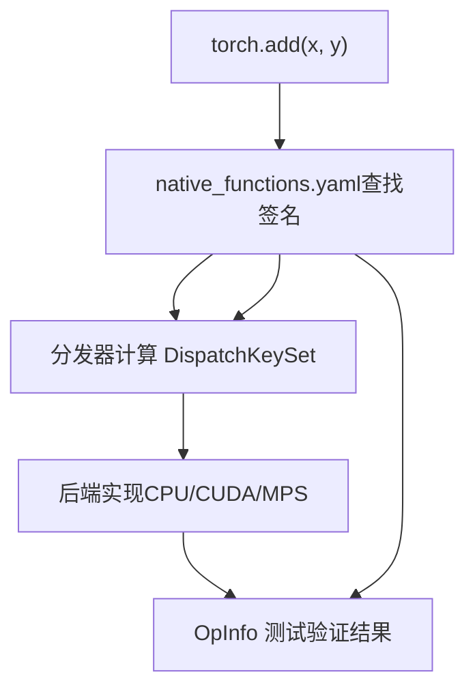
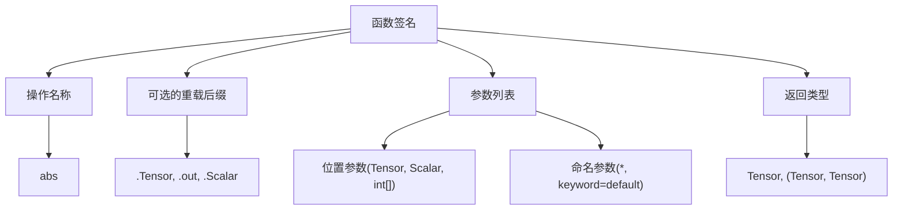
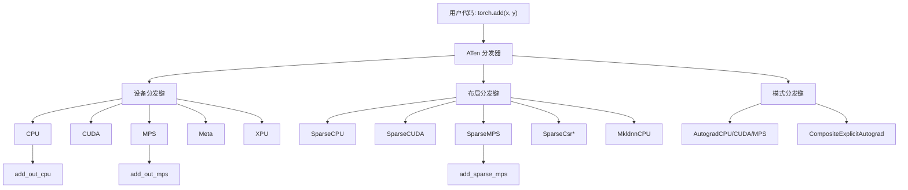
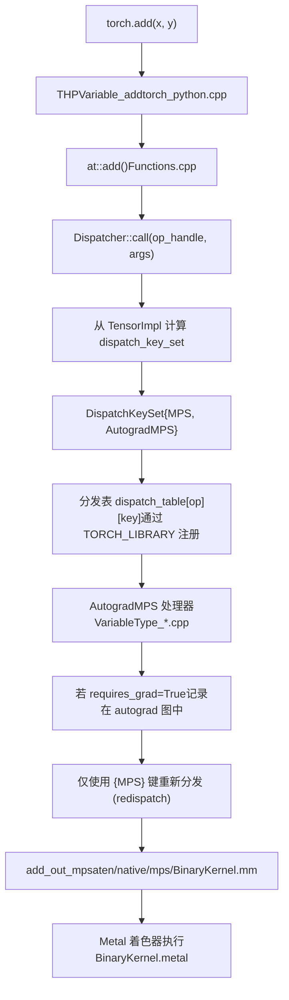
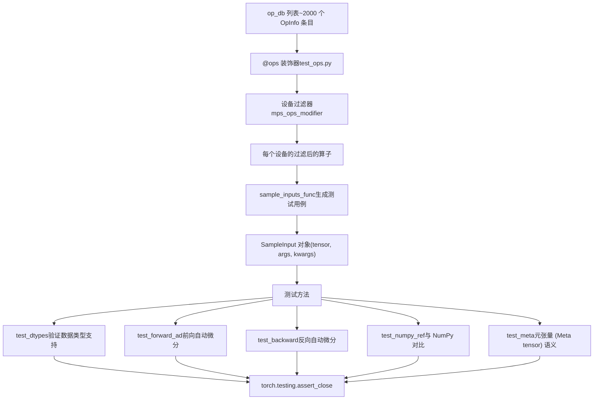
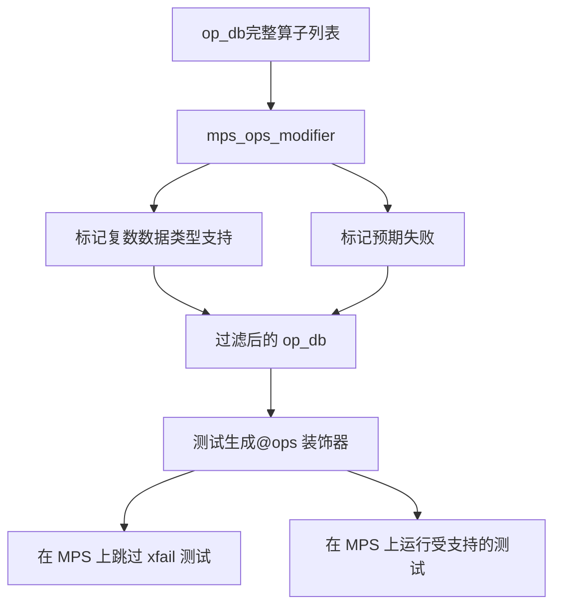

# ATen 原生函数系统 (ATen Native Function System)

相关源文件 (Relevant source files)

-   [aten/src/ATen/native/cudnn/ConvShared.cpp](https://github.com/pytorch/pytorch/blob/915982a4/aten/src/ATen/native/cudnn/ConvShared.cpp)
-   [aten/src/ATen/native/mkldnn/Conv.cpp](https://github.com/pytorch/pytorch/blob/915982a4/aten/src/ATen/native/mkldnn/Conv.cpp)
-   [aten/src/ATen/native/mkldnn/Linear.cpp](https://github.com/pytorch/pytorch/blob/915982a4/aten/src/ATen/native/mkldnn/Linear.cpp)
-   [aten/src/ATen/native/mkldnn/Matmul.cpp](https://github.com/pytorch/pytorch/blob/915982a4/aten/src/ATen/native/mkldnn/Matmul.cpp)
-   [aten/src/ATen/native/mps/kernels/CrossKernel.metal](https://github.com/pytorch/pytorch/blob/915982a4/aten/src/ATen/native/mps/kernels/CrossKernel.metal)
-   [aten/src/ATen/native/mps/kernels/Distributions.metal](https://github.com/pytorch/pytorch/blob/915982a4/aten/src/ATen/native/mps/kernels/Distributions.metal)
-   [aten/src/ATen/native/mps/kernels/Indexing.h](https://github.com/pytorch/pytorch/blob/915982a4/aten/src/ATen/native/mps/kernels/Indexing.h)
-   [aten/src/ATen/native/mps/kernels/Indexing.metal](https://github.com/pytorch/pytorch/blob/915982a4/aten/src/ATen/native/mps/kernels/Indexing.metal)
-   [aten/src/ATen/native/mps/kernels/LinearAlgebra.h](https://github.com/pytorch/pytorch/blob/915982a4/aten/src/ATen/native/mps/kernels/LinearAlgebra.h)
-   [aten/src/ATen/native/mps/kernels/LinearAlgebra.metal](https://github.com/pytorch/pytorch/blob/915982a4/aten/src/ATen/native/mps/kernels/LinearAlgebra.metal)
-   [aten/src/ATen/native/mps/operations/CrossKernel.mm](https://github.com/pytorch/pytorch/blob/915982a4/aten/src/ATen/native/mps/operations/CrossKernel.mm)
-   [aten/src/ATen/native/mps/operations/Distributions.mm](https://github.com/pytorch/pytorch/blob/915982a4/aten/src/ATen/native/mps/operations/Distributions.mm)
-   [aten/src/ATen/native/mps/operations/Indexing.mm](https://github.com/pytorch/pytorch/blob/915982a4/aten/src/ATen/native/mps/operations/Indexing.mm)
-   [aten/src/ATen/native/mps/operations/LinearAlgebra.mm](https://github.com/pytorch/pytorch/blob/915982a4/aten/src/ATen/native/mps/operations/LinearAlgebra.mm)
-   [aten/src/ATen/native/mps/operations/Pad.mm](https://github.com/pytorch/pytorch/blob/915982a4/aten/src/ATen/native/mps/operations/Pad.mm)
-   [aten/src/ATen/native/mps/operations/ScanKernel.mm](https://github.com/pytorch/pytorch/blob/915982a4/aten/src/ATen/native/mps/operations/ScanKernel.mm)
-   [aten/src/ATen/native/mps/operations/UpSample.mm](https://github.com/pytorch/pytorch/blob/915982a4/aten/src/ATen/native/mps/operations/UpSample.mm)
-   [aten/src/ATen/native/native\_functions.yaml](https://github.com/pytorch/pytorch/blob/915982a4/aten/src/ATen/native/native_functions.yaml)
-   [aten/src/ATen/native/sparse/SoftMax.cpp](https://github.com/pytorch/pytorch/blob/915982a4/aten/src/ATen/native/sparse/SoftMax.cpp)
-   [aten/src/ATen/native/sparse/mps/SparseMPSTensorMath.mm](https://github.com/pytorch/pytorch/blob/915982a4/aten/src/ATen/native/sparse/mps/SparseMPSTensorMath.mm)
-   [aten/src/ATen/native/sparse/mps/kernels/SparseTensorMath.metal](https://github.com/pytorch/pytorch/blob/915982a4/aten/src/ATen/native/sparse/mps/kernels/SparseTensorMath.metal)
-   [c10/metal/atomic.h](https://github.com/pytorch/pytorch/blob/915982a4/c10/metal/atomic.h)
-   [test/distributed/tensor/test\_strategy\_validation.py](https://github.com/pytorch/pytorch/blob/915982a4/test/distributed/tensor/test_strategy_validation.py)
-   [test/nn/test\_dropout.py](https://github.com/pytorch/pytorch/blob/915982a4/test/nn/test_dropout.py)
-   [test/test\_indexing.py](https://github.com/pytorch/pytorch/blob/915982a4/test/test_indexing.py)
-   [test/test\_jiterator.py](https://github.com/pytorch/pytorch/blob/915982a4/test/test_jiterator.py)
-   [test/test\_mps.py](https://github.com/pytorch/pytorch/blob/915982a4/test/test_mps.py)
-   [test/test\_sparse.py](https://github.com/pytorch/pytorch/blob/915982a4/test/test_sparse.py)
-   [torch/csrc/autograd/python\_variable\_indexing.cpp](https://github.com/pytorch/pytorch/blob/915982a4/torch/csrc/autograd/python_variable_indexing.cpp)
-   [torch/distributed/tensor/\_ops/strategy\_validation.py](https://github.com/pytorch/pytorch/blob/915982a4/torch/distributed/tensor/_ops/strategy_validation.py)
-   [torch/testing/\_comparison.py](https://github.com/pytorch/pytorch/blob/915982a4/torch/testing/_comparison.py)
-   [torch/testing/\_internal/common\_methods\_invocations.py](https://github.com/pytorch/pytorch/blob/915982a4/torch/testing/_internal/common_methods_invocations.py)
-   [torch/testing/\_internal/common\_mps.py](https://github.com/pytorch/pytorch/blob/915982a4/torch/testing/_internal/common_mps.py)
-   [torch/testing/\_internal/opinfo/core.py](https://github.com/pytorch/pytorch/blob/915982a4/torch/testing/_internal/opinfo/core.py)
-   [torch/testing/\_internal/opinfo/definitions/\_masked.py](https://github.com/pytorch/pytorch/blob/915982a4/torch/testing/_internal/opinfo/definitions/_masked.py)
-   [torch/testing/\_internal/opinfo/definitions/linalg.py](https://github.com/pytorch/pytorch/blob/915982a4/torch/testing/_internal/opinfo/definitions/linalg.py)
-   [torch/testing/\_internal/opinfo/definitions/special.py](https://github.com/pytorch/pytorch/blob/915982a4/torch/testing/_internal/opinfo/definitions/special.py)

## 概览 (Overview)

ATen 原生函数系统定义了 PyTorch 高层 API 与设备特定后端实现之间的接口。它由三个核心组件组成：

1.  **native\_functions.yaml** —— 声明式注册表，定义算子签名、分发规则和元数据
2.  **分发系统 (Dispatch System)** —— 运行时路由机制，根据张量属性将操作映射到后端实现
3.  **OpInfo 测试框架** —— 全面的测试基础设施，确保算子在所有后端和数据类型 (dtype) 下的正确性

**运作流程：**


系统运作如下：

1.  **注册表查找**：从 `native_functions.yaml` 解析算子签名
2.  **键值计算**：分发器从张量元数据中提取设备类型、布局 (layout) 和执行模式
3.  **后端路由**：分发表路由到合适的实现（例如，针对 MPS 张量的 `add_out_mps`）
4.  **验证**：OpInfo 框架在所有支持的配置上测试算子

该架构使 PyTorch 能够支持 5 种以上的硬件后端（CPU, CUDA, MPS, XPU, Meta），同时保持统一的 API 表面。注册表包含约 2000 个操作，每个操作都有通过分发系统注册的后端特定实现。

来源： [aten/src/ATen/native/native\_functions.yaml1-100](https://github.com/pytorch/pytorch/blob/915982a4/aten/src/ATen/native/native_functions.yaml#L1-L100) [torch/testing/\_internal/common\_methods\_invocations.py1-100](https://github.com/pytorch/pytorch/blob/915982a4/torch/testing/_internal/common_methods_invocations.py#L1-L100)

## 算子定义：native\_functions.yaml (Operator Definition: native_functions.yaml)

`native_functions.yaml` 文件 ([aten/src/ATen/native/native\_functions.yaml](https://github.com/pytorch/pytorch/blob/915982a4/aten/src/ATen/native/native_functions.yaml)) 是所有 ATen 操作的权威规范。每个条目定义了一个操作的签名、变体（函数/方法）、分发目标以及控制代码生成的元数据。

### 算子条目结构 (Operation Entry Structure)

```yaml
- func: add.Tensor(Tensor self, Tensor other, *, Scalar alpha=1) -> Tensor  
  device_check: NoCheck   # TensorIterator  
  structured_delegate: add.out  
  variants: function, method  
  dispatch:    
    SparseCPU, SparseCUDA, SparseMPS, SparseMeta: add_sparse    
    SparseCsrCPU, SparseCsrCUDA, SparseCsrMeta: add_sparse_csr    
    MkldnnCPU: mkldnn_add    
    ZeroTensor: add_zerotensor    
    NestedTensorCPU, NestedTensorHPU, NestedTensorCUDA: NestedTensor_add_Tensor  
  tags: [core, pointwise]
```
**关键组件：**

-   `func`：带有类型化参数和返回类型的操作签名
-   `variants`：操作是否可用作 `torch.add()`（函数）或 `tensor.add()`（方法）
-   `dispatch`：将分发键映射到 C++ 实现函数的名称
-   `structured_delegate`：路由到结构化内核以进行内存管理
-   `tags`：操作分类（`core`, `pointwise`, `reduction` 等）

来源： [aten/src/ATen/native/native\_functions.yaml552-562](https://github.com/pytorch/pytorch/blob/915982a4/aten/src/ATen/native/native_functions.yaml#L552-L562)

### 函数签名语法 (Function Signature Syntax)


来源： [aten/src/ATen/native/native\_functions.yaml1-100](https://github.com/pytorch/pytorch/blob/915982a4/aten/src/ATen/native/native_functions.yaml#L1-L100)

### 分发键系统 (Dispatch Key System)

分发系统根据张量的设备、布局和执行模式，将操作路由到后端特定的实现。

#### 分发键层级 (Dispatch Key Hierarchy)


来源： [aten/src/ATen/native/native\_functions.yaml552-591](https://github.com/pytorch/pytorch/blob/915982a4/aten/src/ATen/native/native_functions.yaml#L552-L591)

### 后端注册模式 (Backend Registration Patterns)

操作通过 `dispatch` 字段指定哪些后端提供实现。这会将分发键映射到 C++ 函数名。

**模式 1：直接后端注册 (Direct Backend Registration)**

```yaml
- func: arange.start_out(Scalar start, Scalar end, Scalar step=1, *, Tensor(a!) out) -> Tensor(a!)  
  dispatch:    
    CPU, Meta: arange_out    
    CUDA: arange_cuda_out    
    MPS: arange_mps_out    
    MTIA: arange_mtia_out
```
每个后端提供自己的实现。当张量在 MPS 设备上时，分发器调用 `arange_mps_out()`。

**模式 2：复合实现 (Composite Implementation)**

```yaml
- func: add.Scalar(Tensor self, Scalar other, Scalar alpha=1) -> Tensor  
  dispatch:    
    CompositeExplicitAutograd: add
```
复合实现是根据其他 ATen 操作定义的，可在所有后端工作。函数体调用现有操作，而非后端特定代码。

**模式 3：结构化内核 (Structured Kernels)**

```yaml
- func: add.out(Tensor self, Tensor other, *, Scalar alpha=1, Tensor(a!) out) -> Tensor(a!)  
  structured: True  
  structured_inherits: TensorIteratorBase
```
结构化内核使用 `TensorIterator` 进行自动内存管理、广播 (broadcasting) 和类型提升。后端实现一个 `TORCH_IMPL_FUNC` 来填充输出张量。

**模式 4：稀疏布局注册 (Sparse Layout Registration)**

```yaml
- func: add.Tensor(Tensor self, Tensor other, *, Scalar alpha=1) -> Tensor  
  dispatch:    
    SparseCPU, SparseCUDA, SparseMPS: add_sparse    
    SparseCsrCPU, SparseCsrCUDA: add_sparse_csr
```
布局特定的分发键启用了针对稀疏张量的专门实现。在 [aten/src/ATen/native/sparse/SparseTensorMath.cpp](https://github.com/pytorch/pytorch/blob/915982a4/aten/src/ATen/native/sparse/SparseTensorMath.cpp) 中的 `add_sparse()` 实现函数处理 COO 稀疏格式。

来源： [aten/src/ATen/native/native\_functions.yaml793-825](https://github.com/pytorch/pytorch/blob/915982a4/aten/src/ATen/native/native_functions.yaml#L793-L825) [aten/src/ATen/native/native\_functions.yaml620-633](https://github.com/pytorch/pytorch/blob/915982a4/aten/src/ATen/native/native_functions.yaml#L620-L633) [aten/src/ATen/native/native\_functions.yaml575-591](https://github.com/pytorch/pytorch/blob/915982a4/aten/src/ATen/native/native_functions.yaml#L575-L591) [aten/src/ATen/native/native\_functions.yaml554-564](https://github.com/pytorch/pytorch/blob/915982a4/aten/src/ATen/native/native_functions.yaml#L554-L564)

## 操作元数据与代码生成 (Operation Metadata and Code Generation)

### 自动生成指令 (Autogeneration Directives)

注册表控制哪些额外的操作变体会被自动生成：

```yaml
- func: abs(Tensor self) -> Tensor  
  variants: function, method  
  dispatch:    
    CompositeExplicitAutograd: abs    
    SparseCPU, SparseCUDA, SparseMPS: abs_sparse  
  tags: [core, pointwise]

- func: abs_(Tensor(a!) self) -> Tensor(a!)  
  variants: function, method  
  dispatch:    
    CompositeExplicitAutograd: abs_    
    SparseCPU, SparseCUDA, SparseMPS: abs_sparse_

- func: abs.out(Tensor self, *, Tensor(a!) out) -> Tensor(a!)  
  dispatch:    
    CPU, CUDA, MPS, MTIA: abs_out    
    SparseCPU, SparseCUDA, SparseMPS: abs_sparse_out
```
对于某些操作，`autogen` 字段会自动创建输出变体：

```yaml
- func: affine_grid_generator(Tensor theta, SymInt[] size, bool align_corners) -> Tensor  
  dispatch:    
    CompositeExplicitAutograd: affine_grid_generator  
  autogen: affine_grid_generator.out
```
来源： [aten/src/ATen/native/native\_functions.yaml340-366](https://github.com/pytorch/pytorch/blob/915982a4/aten/src/ATen/native/native_functions.yaml#L340-L366) [aten/src/ATen/native/native\_functions.yaml671-675](https://github.com/pytorch/pytorch/blob/915982a4/aten/src/ATen/native/native_functions.yaml#L671-L675)

### 操作标签 (Operation Tags)

标签对操作进行分类，以便用于测试、优化和文档编制：

| 标签 | 用途 | 示例操作 |
| --- | --- | --- |
| `core` | 包含在极简构建中的核心操作 | `add`, `mul`, `arange` |
| `pointwise` | 逐元素操作 | `abs`, `sin`, `exp` |
| `reduction` | 归约操作 | `sum`, `mean`, `all` |
| `nondeterministic_seeded` | 使用随机数生成 | `native_dropout`, `randn` |
| `data_dependent_output` | 输出形状取决于数据数值 | `allclose`, `nonzero` |
| `inplace_view` | 创建视图的就地操作 | `as_strided_`, `rename_` |

来源： [aten/src/ATen/native/native\_functions.yaml340-366](https://github.com/pytorch/pytorch/blob/915982a4/aten/src/ATen/native/native_functions.yaml#L340-L366) [aten/src/ATen/native/native\_functions.yaml701-756](https://github.com/pytorch/pytorch/blob/915982a4/aten/src/ATen/native/native_functions.yaml#L701-L756)

## 代码生成基础设施 (Code Generation Infrastructure)

`torchgen` 软件包 ([torchgen/](https://github.com/pytorch/pytorch/blob/915982a4/torchgen/)) 读取 `native_functions.yaml` 以生成 C++ API、Python 绑定和分发注册代码。这在构建过程中运行。

**关键生成的项：**

| 生成脚本 | 输出 | 目的 |
| --- | --- | --- |
| `gen.py` | `Functions.h`, `NativeFunctions.h` | C++ 算子声明和存根 (stubs) |
| `gen_backend_stubs.py` | `RegisterCPU.cpp`, `RegisterCUDA.cpp` | 每个后端的分发表注册 |
| `gen_python_bindings.py` | `torch_python.cpp` | Python `torch._C` 扩展模块绑定 |

**示例：为 `abs()` 生成的 C++ API**

来自 `native_functions.yaml` 条目：

```yaml
- func: abs(Tensor self) -> Tensor  
  variants: function, method
```
在 `Functions.h` 中生成：

```cpp
namespace at {  
  TORCH_API Tensor abs(const Tensor& self);
}
```
生成器还会产生分发注册代码，使用后端实现填充分发表。Autograd 的集成由 `gen_variable_type.py` 单独处理，它读取 `derivatives.yaml` 以生成反向传播包装器。

来源： [aten/src/ATen/native/native\_functions.yaml340-348](https://github.com/pytorch/pytorch/blob/915982a4/aten/src/ATen/native/native_functions.yaml#L340-L348) [torchgen/gen.py1-100](https://github.com/pytorch/pytorch/blob/915982a4/torchgen/gen.py#L1-L100)

## 分发机制 (Dispatch Mechanism)

分发系统使用基于键值的查找机制，将操作路由到后端特定的实现。在运行时，分发器从张量元数据计算出一个 `DispatchKeySet`，并搜索一张将 `(操作, 键值集) → 函数指针` 进行映射的表。

### 分发键计算 (Dispatch Key Computation)

**分发键来源：**

| 张量属性 | 分发键示例 | 代码位置 |
| --- | --- | --- |
| 设备类型 | `CPU`, `CUDA`, `MPS`, `XPU`, `Meta` | `Tensor::device()` |
| 布局 (Layout) | `SparseCOO`, `SparseCsr`, `SparseBsr`, `SparseBsc` | `Tensor::layout()` |
| 后端库 | `MkldnnCPU`, `QuantizedCPU` | 专门的张量子类 |
| 执行模式 | `AutogradCPU`, `AutogradCUDA`, `AutogradMPS` | `Tensor::requires_grad()` |
| 包装模式 | `FuncTorchBatched`, `Python`, `VMAP` | 线程局部模式栈 |

**分发键计算示例：**

对于带有 `requires_grad=True` 的 MPS 张量：

```cpp
// 分发器从 TensorImpl 提取键值
DispatchKeySet key_set = tensor.key_set();
// 结果: {MPS, AutogradMPS, ADInplaceOrView, ...}

// 在分发表中按优先级顺序查找
auto& dispatch_table = Dispatcher::singleton().table_;
auto handler = dispatch_table[op_handle][key_set.highestPriorityTypeId()];
```
分发器按 [c10/core/DispatchKey.h](https://github.com/pytorch/pytorch/blob/915982a4/c10/core/DispatchKey.h) 中定义的固定顺序对键进行优先级排序。例如，`Autograd*` 键的优先级高于像 `MPS` 这样的后端键，从而使 autograd 包装器能够在后端执行之前拦截操作。

来源： [aten/src/ATen/native/native\_functions.yaml554-564](https://github.com/pytorch/pytorch/blob/915982a4/aten/src/ATen/native/native_functions.yaml#L554-L564) [c10/core/DispatchKeySet.h1-100](https://github.com/pytorch/pytorch/blob/915982a4/c10/core/DispatchKeySet.h#L1-L100) [aten/src/ATen/core/dispatch/Dispatcher.h1-200](https://github.com/pytorch/pytorch/blob/915982a4/aten/src/ATen/core/dispatch/Dispatcher.h#L1-L200)

### 分发架构与代码流 (Dispatch Architecture and Code Flow)

**图表：从 Python 到后端的完整分发路径**


**关键代码实体：**

1.  **`Dispatcher::call`** ([aten/src/ATen/core/dispatch/Dispatcher.cpp100-200](https://github.com/pytorch/pytorch/blob/915982a4/aten/src/ATen/core/dispatch/Dispatcher.cpp#L100-L200))：核心分发入口点

    ```cpp
    template<typename Return, typename... Args>
    Return Dispatcher::call(const OperatorHandle& op, Args&&... args) {  
      auto key_set = computeDispatchKeySet(args...);  
      return op.callBoxed(key_set, args...);
    }
    ```

2.  **分发表注册** ([aten/src/ATen/RegisterCPU.cpp1-100](https://github.com/pytorch/pytorch/blob/915982a4/aten/src/ATen/RegisterCPU.cpp#L1-L100))：后端注册实现

    ```cpp
    TORCH_LIBRARY_IMPL(aten, MPS, m) {  
      m.impl("add.out", TORCH_FN(add_out_mps));  
      m.impl("mul.out", TORCH_FN(mul_out_mps));  
      // ... ~2000 个操作
    }
    ```

3.  **后端实现** ([aten/src/ATen/native/mps/operations/BinaryKernel.mm34-58](https://github.com/pytorch/pytorch/blob/915982a4/aten/src/ATen/native/mps/operations/BinaryKernel.mm#L34-L58))：

    ```cpp
    Tensor& add_out_mps(const Tensor& self, const Tensor& other,                      
                        const Scalar& alpha, Tensor& output) {  
      using namespace mps;  
      binary_op_kernel("add", self, other, output, alpha);  
      return output;
    }
    ```


分发机制使得 PyTorch 能够支持多个后端，而无需在高级 API 中硬编码设备特定逻辑。每个后端在库初始化期间通过 `TORCH_LIBRARY_IMPL` 宏注册其实现。

来源： [aten/src/ATen/native/native\_functions.yaml340-366](https://github.com/pytorch/pytorch/blob/915982a4/aten/src/ATen/native/native_functions.yaml#L340-L366) [aten/src/ATen/native/mps/operations/BinaryKernel.mm34-58](https://github.com/pytorch/pytorch/blob/915982a4/aten/src/ATen/native/mps/operations/BinaryKernel.mm#L34-L58) [aten/src/ATen/core/dispatch/Dispatcher.h1-200](https://github.com/pytorch/pytorch/blob/915982a4/aten/src/ATen/core/dispatch/Dispatcher.h#L1-L200)

### 多后端实现示例 (Multi-Backend Implementation Example)

分发系统允许单一操作签名根据张量设备和布局路由到不同的后端实现。

**操作注册条目：**

```yaml
# 来自 aten/src/ATen/native/native_functions.yaml:359-365
- func: abs.out(Tensor self, *, Tensor(a!) out) -> Tensor(a!)  
  dispatch:    
    CPU, CUDA, MPS, MTIA: abs_out    
    SparseCPU, SparseCUDA, SparseMPS: abs_sparse_out    
    SparseCsrCPU, SparseCsrCUDA, SparseCsrMPS: abs_sparse_csr_out  
  tags: pointwise
```
**后端实现对比：**

| 后端 | 函数 | 位置 | 关键技术 |
| --- | --- | --- | --- |
| CPU | `abs_out` | [aten/src/ATen/native/cpu/UnaryOps.cpp](https://github.com/pytorch/pytorch/blob/915982a4/aten/src/ATen/native/cpu/UnaryOps.cpp) | TensorIterator + AVX2/AVX512 |
| CUDA | `abs_out` | [aten/src/ATen/native/cuda/UnaryKernels.cu](https://github.com/pytorch/pytorch/blob/915982a4/aten/src/ATen/native/cuda/UnaryKernels.cu) | CUDA 内核启动 |
| MPS | `abs_out_mps` | [aten/src/ATen/native/mps/operations/UnaryOps.mm64-129](https://github.com/pytorch/pytorch/blob/915982a4/aten/src/ATen/native/mps/operations/UnaryOps.mm#L64-L129) | MPSGraph API |
| SparseMPS | `abs_sparse_out` | [aten/src/ATen/native/sparse/mps/SparseMPSTensorMath.mm](https://github.com/pytorch/pytorch/blob/915982a4/aten/src/ATen/native/sparse/mps/SparseMPSTensorMath.mm) | 稀疏感知 (Sparse-aware) 的 Metal 内核 |

**CPU 实现模式：**

```cpp
// 使用 TensorIterator 进行内存遍历
TORCH_IMPL_FUNC(abs_out)(const Tensor& self, const Tensor& result) {  
  abs_stub(device_type(), *this);  // 向量化的 AVX2/AVX512
}
```
**MPS 实现模式：**

```cpp
// 使用 MPSGraph 调用 Metal Performance Shaders
TORCH_IMPL_FUNC(abs_out_mps)(const Tensor& self, const Tensor& output) {  
  unary_op(self, output, "abs", ^MPSGraphTensor*(MPSGraph* graph, MPSGraphTensor* input) {    
    return [graph absoluteWithTensor:input name:nil];  
  });
}
```
`unary_op()` 工具函数 ([aten/src/ATen/native/mps/OperationUtils.mm](https://github.com/pytorch/pytorch/blob/915982a4/aten/src/ATen/native/mps/OperationUtils.mm)) 会缓存 MPSGraph 计算图，从而避免后续调用的重新编译。每个后端都针对其硬件进行了优化：SIMD 指令 (CPU)、warp 执行 (CUDA) 或 Metal 着色器编译 (MPS)。

来源： [aten/src/ATen/native/native\_functions.yaml359-365](https://github.com/pytorch/pytorch/blob/915982a4/aten/src/ATen/native/native_functions.yaml#L359-L365) [aten/src/ATen/native/mps/operations/UnaryOps.mm64-129](https://github.com/pytorch/pytorch/blob/915982a4/aten/src/ATen/native/mps/operations/UnaryOps.mm#L64-L129) [aten/src/ATen/native/cpu/UnaryOps.cpp1-100](https://github.com/pytorch/pytorch/blob/915982a4/aten/src/ATen/native/cpu/UnaryOps.cpp#L1-L100)

## 测试基础设施：OpInfo 框架 (Testing Infrastructure: OpInfo Framework)

OpInfo 框架 ([torch/testing/\_internal/common\_methods\_invocations.py](https://github.com/pytorch/pytorch/blob/915982a4/torch/testing/_internal/common_methods_invocations.py)) 提供了针对所有 ATen 操作的全面测试覆盖。`op_db` 列表包含约 2000 个 `OpInfo` 条目，指定了测试配置、示例输入、支持的数据类型和参考实现。

### OpInfo 条目结构 (OpInfo Entry Structure)

**核心 OpInfo 字段：**

| 字段 | 类型 | 目的 | 示例 |
| --- | --- | --- | --- |
| `name` | str | 操作标识符 | `"abs"`, `"add.Tensor"` |
| `dtypes` | tuple | 要测试的支持数据类型 | `all_types_and_complex()` |
| `sample_inputs_func` | callable | 生成测试用例 | `sample_inputs_elementwise_unary` |
| `ref` | callable | 参考实现 | `np.abs` 用于 NumPy 对比 |
| `supports_forward_ad` | bool | 前向模式自动微分支持 | `True` |
| `skips` | tuple | 每个后端的测试排除项 | `DecorateInfo(...)` |

**OpInfo 定义示例：**

```python
# 来自 torch/testing/_internal/common_methods_invocations.py
OpInfo('abs',       
       dtypes=all_types_and_complex_and(torch.half, torch.bfloat16),       
       sample_inputs_func=sample_inputs_elementwise_unary,       
       supports_forward_ad=True,       
       supports_fwgrad_bwgrad=True,       
       ref=np.abs,  # 用于正确性验证的参考实现       
       skips=(           
           DecorateInfo(unittest.skip("Skipped"), 'TestCommon',                        
                        'test_variant_consistency_eager', device_type='mps'),       
       ),
)
```
**示例输入生成器模式：**

```python
def sample_inputs_elementwise_unary(op_info, device, dtype, requires_grad, **kwargs):    
    """为一元操作生成多样化的测试输入。"""    
    make_arg = partial(make_tensor, device=device, dtype=dtype, requires_grad=requires_grad)        
    yield SampleInput(make_arg((S, S)))        # 2D 张量    
    yield SampleInput(make_arg((S,)))          # 1D 张量    
    yield SampleInput(make_arg(()))            # 0D 标量    
    yield SampleInput(make_arg((S, 1, S)))     # 广播情况    
    yield SampleInput(make_arg((0, S)))        # 空维度
```
生成器产生配置了目标设备和数据类型的 `SampleInput` 对象。测试基础设施对 (操作, 设备, 数据类型, 样本) 的所有组合进行迭代，以确保全面的覆盖。

来源： [torch/testing/\_internal/common\_methods\_invocations.py1-200](https://github.com/pytorch/pytorch/blob/915982a4/torch/testing/_internal/common_methods_invocations.py#L1-L200) [torch/testing/\_internal/opinfo/core.py1-300](https://github.com/pytorch/pytorch/blob/915982a4/torch/testing/_internal/opinfo/core.py#L1-L300)

### OpInfo 测试执行流程 (OpInfo Test Execution Flow)

**图表：由 OpInfo 驱动的测试架构**


**测试执行代码模式：**

```python
# 来自 test/test_ops.py
@ops(op_db, dtypes=OpDTypes.any_one)
def test_forward_ad(self, device, dtype, op):    
    """测试前向模式自动微分。"""    
    samples = op.sample_inputs(device, dtype, requires_grad=True)    
    for sample in samples:        
        # 为前向自动微分创建对偶 (dual) 张量        
        primal = sample.input        
        tangent = torch.ones_like(primal)        
        dual = torch.autograd.forward_ad.make_dual(primal, tangent)                
        # 执行操作        
        result = op(dual, *sample.args, **sample.kwargs)                
        # 验证前向梯度        
        _, grad = torch.autograd.forward_ad.unpack_dual(result)        
        self.assertIsNotNone(grad)
```
`@ops` 装饰器为每个 (操作, 设备, 数据类型) 组合实例化测试方法，每次运行会产生数千个测试用例。后端特定的过滤器会跳过不支持的配置。

来源： [test/test\_ops.py1-200](https://github.com/pytorch/pytorch/blob/915982a4/test/test_ops.py#L1-L200) [torch/testing/\_internal/common\_device\_type.py1-300](https://github.com/pytorch/pytorch/blob/915982a4/torch/testing/_internal/common_device_type.py#L1-L300)

### 后端特定的测试过滤 (Backend-Specific Test Filtering)

后端通过修改 `op_db` 并标记预期失败的修饰函数来声明操作支持情况。

**MPS 后端修饰器示例** ([torch/testing/\_internal/common\_mps.py13-299](https://github.com/pytorch/pytorch/blob/915982a4/torch/testing/_internal/common_mps.py#L13-L299))：

```python
def mps_ops_modifier(ops, device_type="mps", xfail_exclusion=None, sparse=False):    
    """为 MPS 后端配置 OpInfo 测试。"""        
    # 具有复数数据类型支持的操作    
    SUPPORTED_COMPLEX_OPS = {        
        "abs", "add", "mul", "exp", "matmul", "mm", "bmm",        
        "sin", "cos", "log", "sqrt", "conj", "view_as_real",        
        # ... ~200 个操作    
    }        
    # 尚未在 MPS 上实现的操作    
    UNIMPLEMENTED_XFAILLIST = {        
        "logspace": None,              # 未实现        
        "linalg.eig": None,            # 缺少后端        
        "nn.functional.grid_sample": None,  # 不支持边界填充        
        "linalg.qr": None,        
        # ... ~50 个操作    
    }        
    for op in ops:        
        # 为支持的操作启用复数数据类型测试        
        if op.name in SUPPORTED_COMPLEX_OPS:            
            op.dtypes_to_test.add(torch.complex64)                    
        
        # 将未实现的操作标记为预期失败 (expected failure)        
        if op.name in UNIMPLEMENTED_XFAILLIST:            
            dtypes = UNIMPLEMENTED_XFAILLIST[op.name]            
            op.decorators.append(DecorateInfo(                
                unittest.expectedFailure,                
                dtypes=dtypes,                
                device_type='mps'            
            ))        
    return ops
```
**测试过滤流程：**


修饰器在测试实例化之前运行，允许后端声明式地指定支持范围。针对不支持操作的测试被标记为 `expectedFailure` 而非直接报错，从而实现了后端的增量开发。

**其他修饰器：**

-   `mps_ops_grad_modifier` —— 配置梯度测试
-   `mps_ops_error_inputs_modifier` —— 配置错误输入测试

来源： [torch/testing/\_internal/common\_mps.py13-299](https://github.com/pytorch/pytorch/blob/915982a4/torch/testing/_internal/common_mps.py#L13-L299) [test/test\_mps.py52-63](https://github.com/pytorch/pytorch/blob/915982a4/test/test_mps.py#L52-L63)

## 关键文件与入口点 (Key Files and Entry Points)

| 组件 | 文件路径 | 目的 |
| --- | --- | --- |
| 操作注册表 | [aten/src/ATen/native/native\_functions.yaml](https://github.com/pytorch/pytorch/blob/915982a4/aten/src/ATen/native/native_functions.yaml) | 所有操作的中央规范 |
| MPS 一元操作 | [aten/src/ATen/native/mps/operations/UnaryOps.mm](https://github.com/pytorch/pytorch/blob/915982a4/aten/src/ATen/native/mps/operations/UnaryOps.mm) | 三角函数、指数函数等 |
| MPS 二元操作 | [aten/src/ATen/native/mps/operations/BinaryOps.mm](https://github.com/pytorch/pytorch/blob/915982a4/aten/src/ATen/native/mps/operations/BinaryOps.mm) | 加法、乘法、对比 |
| MPS 稀疏操作 | [aten/src/ATen/native/sparse/mps/SparseMPSTensorMath.mm](https://github.com/pytorch/pytorch/blob/915982a4/aten/src/ATen/native/sparse/mps/SparseMPSTensorMath.mm) | 稀疏矩阵操作 |
| Metal 一元着色器 | [aten/src/ATen/native/mps/kernels/UnaryKernel.metal](https://github.com/pytorch/pytorch/blob/915982a4/aten/src/ATen/native/mps/kernels/UnaryKernel.metal) | 针对一元操作的自定义 GPU 内核 |
| Metal 二元着色器 | [aten/src/ATen/native/mps/kernels/BinaryKernel.metal](https://github.com/pytorch/pytorch/blob/915982a4/aten/src/ATen/native/mps/kernels/BinaryKernel.metal) | 针对二元操作的自定义 GPU 内核 |
| 着色器库 | [aten/src/ATen/native/mps/MetalShaderLibrary.h](https://github.com/pytorch/pytorch/blob/915982a4/aten/src/ATen/native/mps/MetalShaderLibrary.h) | 着色器编译与缓存 |
| 操作工具类 | [aten/src/ATen/native/mps/OperationUtils.mm/.h](https://github.com/pytorch/pytorch/blob/915982a4/aten/src/ATen/native/mps/OperationUtils.mm/.h) | 类型转换、图缓存 |
| Inductor MPS 代码生成 | [torch/\_inductor/codegen/mps.py](https://github.com/pytorch/pytorch/blob/915982a4/torch/_inductor/codegen/mps.py) | 编译时内核生成 |
| AOTI MPS Shim | [torch/csrc/inductor/aoti\_torch/shim\_mps.cpp](https://github.com/pytorch/pytorch/blob/915982a4/torch/csrc/inductor/aoti_torch/shim_mps.cpp) | 已编译模型的运行时绑定 |
| Metal 索引 | [c10/metal/indexing.h](https://github.com/pytorch/pytorch/blob/915982a4/c10/metal/indexing.h) | 底层索引原语 |
| Metal 数学 | [c10/metal/special\_math.h](https://github.com/pytorch/pytorch/blob/915982a4/c10/metal/special_math.h) | 特殊函数实现 |

来源：表中列出的所有文件
