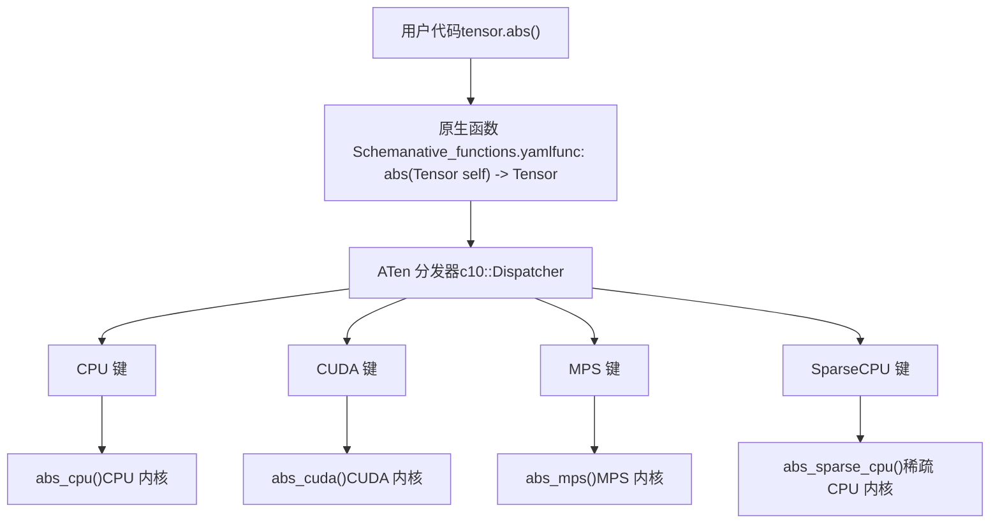
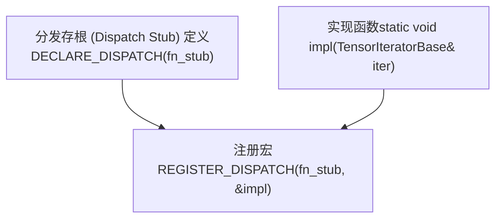
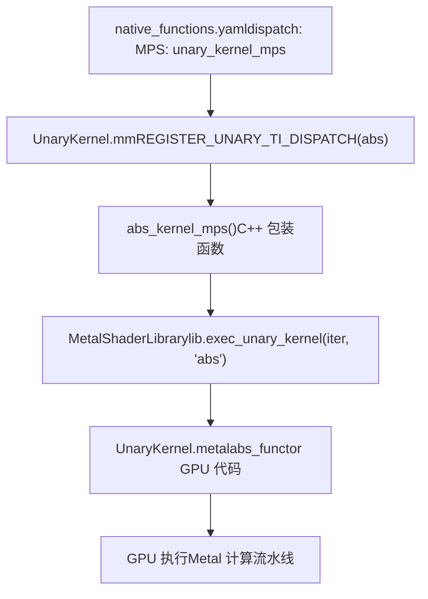
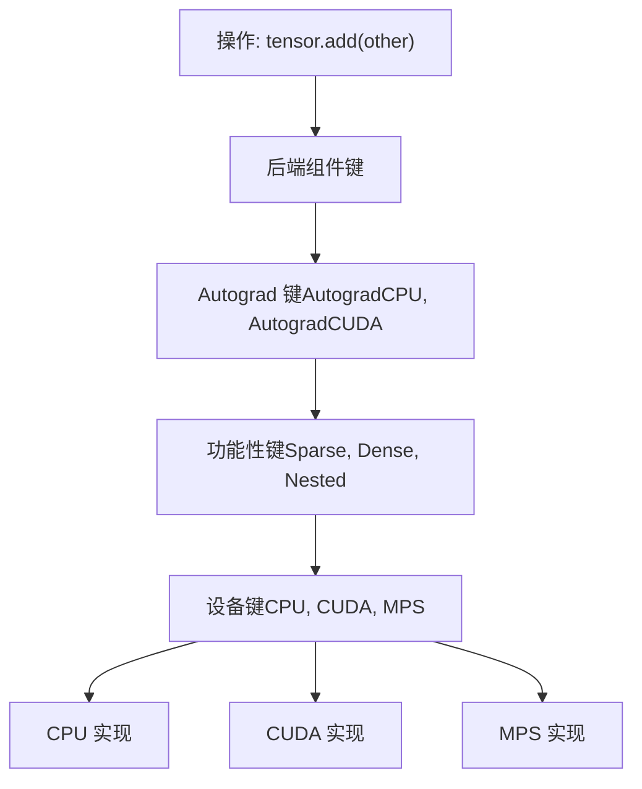
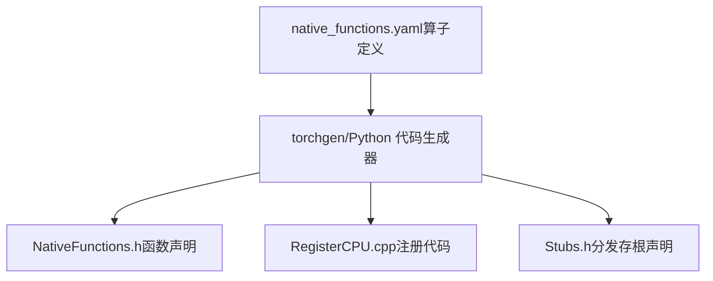

# 原生函数注册与分发 (Native Function Registration and Dispatch)

相关源文件 (Relevant source files)

-   [aten/src/ATen/native/cudnn/ConvShared.cpp](https://github.com/pytorch/pytorch/blob/915982a4/aten/src/ATen/native/cudnn/ConvShared.cpp)
-   [aten/src/ATen/native/mkldnn/Conv.cpp](https://github.com/pytorch/pytorch/blob/915982a4/aten/src/ATen/native/mkldnn/Conv.cpp)
-   [aten/src/ATen/native/mkldnn/Linear.cpp](https://github.com/pytorch/pytorch/blob/915982a4/aten/src/ATen/native/mkldnn/Linear.cpp)
-   [aten/src/ATen/native/mkldnn/Matmul.cpp](https://github.com/pytorch/pytorch/blob/915982a4/aten/src/ATen/native/mkldnn/Matmul.cpp)
-   [aten/src/ATen/native/mps/kernels/CrossKernel.metal](https://github.com/pytorch/pytorch/blob/915982a4/aten/src/ATen/native/mps/kernels/CrossKernel.metal)
-   [aten/src/ATen/native/mps/kernels/Distributions.metal](https://github.com/pytorch/pytorch/blob/915982a4/aten/src/ATen/native/mps/kernels/Distributions.metal)
-   [aten/src/ATen/native/mps/kernels/Indexing.h](https://github.com/pytorch/pytorch/blob/915982a4/aten/src/ATen/native/mps/kernels/Indexing.h)
-   [aten/src/ATen/native/mps/kernels/Indexing.metal](https://github.com/pytorch/pytorch/blob/915982a4/aten/src/ATen/native/mps/kernels/Indexing.metal)
-   [aten/src/ATen/native/mps/kernels/LinearAlgebra.h](https://github.com/pytorch/pytorch/blob/915982a4/aten/src/ATen/native/mps/kernels/LinearAlgebra.h)
-   [aten/src/ATen/native/mps/kernels/LinearAlgebra.metal](https://github.com/pytorch/pytorch/blob/915982a4/aten/src/ATen/native/mps/kernels/LinearAlgebra.metal)
-   [aten/src/ATen/native/mps/operations/CrossKernel.mm](https://github.com/pytorch/pytorch/blob/915982a4/aten/src/ATen/native/mps/operations/CrossKernel.mm)
-   [aten/src/ATen/native/mps/operations/Distributions.mm](https://github.com/pytorch/pytorch/blob/915982a4/aten/src/ATen/native/mps/operations/Distributions.mm)
-   [aten/src/ATen/native/mps/operations/Indexing.mm](https://github.com/pytorch/pytorch/blob/915982a4/aten/src/ATen/native/mps/operations/Indexing.mm)
-   [aten/src/ATen/native/mps/operations/LinearAlgebra.mm](https://github.com/pytorch/pytorch/blob/915982a4/aten/src/ATen/native/mps/operations/LinearAlgebra.mm)
-   [aten/src/ATen/native/mps/operations/Pad.mm](https://github.com/pytorch/pytorch/blob/915982a4/aten/src/ATen/native/mps/operations/Pad.mm)
-   [aten/src/ATen/native/mps/operations/ScanKernel.mm](https://github.com/pytorch/pytorch/blob/915982a4/aten/src/ATen/native/mps/operations/ScanKernel.mm)
-   [aten/src/ATen/native/mps/operations/UpSample.mm](https://github.com/pytorch/pytorch/blob/915982a4/aten/src/ATen/native/mps/operations/UpSample.mm)
-   [aten/src/ATen/native/native\_functions.yaml](https://github.com/pytorch/pytorch/blob/915982a4/aten/src/ATen/native/native_functions.yaml)
-   [aten/src/ATen/native/sparse/SoftMax.cpp](https://github.com/pytorch/pytorch/blob/915982a4/aten/src/ATen/native/sparse/SoftMax.cpp)
-   [aten/src/ATen/native/sparse/mps/SparseMPSTensorMath.mm](https://github.com/pytorch/pytorch/blob/915982a4/aten/src/ATen/native/sparse/mps/SparseMPSTensorMath.mm)
-   [aten/src/ATen/native/sparse/mps/kernels/SparseTensorMath.metal](https://github.com/pytorch/pytorch/blob/915982a4/aten/src/ATen/native/sparse/mps/kernels/SparseTensorMath.metal)
-   [c10/metal/atomic.h](https://github.com/pytorch/pytorch/blob/915982a4/c10/metal/atomic.h)
-   [test/distributed/tensor/test\_strategy\_validation.py](https://github.com/pytorch/pytorch/blob/915982a4/test/distributed/tensor/test_strategy_validation.py)
-   [test/nn/test\_dropout.py](https://github.com/pytorch/pytorch/blob/915982a4/test/nn/test_dropout.py)
-   [test/test\_indexing.py](https://github.com/pytorch/pytorch/blob/915982a4/test/test_indexing.py)
-   [test/test\_jiterator.py](https://github.com/pytorch/pytorch/blob/915982a4/test/test_jiterator.py)
-   [test/test\_mps.py](https://github.com/pytorch/pytorch/blob/915982a4/test/test_mps.py)
-   [test/test\_sparse.py](https://github.com/pytorch/pytorch/blob/915982a4/test/test_sparse.py)
-   [torch/csrc/autograd/python\_variable\_indexing.cpp](https://github.com/pytorch/pytorch/blob/915982a4/torch/csrc/autograd/python_variable_indexing.cpp)
-   [torch/distributed/tensor/\_ops/strategy\_validation.py](https://github.com/pytorch/pytorch/blob/915982a4/torch/distributed/tensor/_ops/strategy_validation.py)
-   [torch/testing/\_comparison.py](https://github.com/pytorch/pytorch/blob/915982a4/torch/testing/_comparison.py)
-   [torch/testing/\_internal/common\_methods\_invocations.py](https://github.com/pytorch/pytorch/blob/915982a4/torch/testing/_internal/common_methods_invocations.py)
-   [torch/testing/\_internal/common\_mps.py](https://github.com/pytorch/pytorch/blob/915982a4/torch/testing/_internal/common_mps.py)
-   [torch/testing/\_internal/opinfo/core.py](https://github.com/pytorch/pytorch/blob/915982a4/torch/testing/_internal/opinfo/core.py)
-   [torch/testing/\_internal/opinfo/definitions/\_masked.py](https://github.com/pytorch/pytorch/blob/915982a4/torch/testing/_internal/opinfo/definitions/_masked.py)
-   [torch/testing/\_internal/opinfo/definitions/linalg.py](https://github.com/pytorch/pytorch/blob/915982a4/torch/testing/_internal/opinfo/definitions/linalg.py)
-   [torch/testing/\_internal/opinfo/definitions/special.py](https://github.com/pytorch/pytorch/blob/915982a4/torch/testing/_internal/opinfo/definitions/special.py)

## 目的与范围 (Purpose and Scope)

本文档描述了 PyTorch 算子是如何在 `native_functions.yaml` 中定义，并被分发 (dispatch) 到设备特定实现的。内容涵盖了算子 schema 规范、分发键 (dispatch key) 系统，以及将高层算子定义连接到后端实现（CPU, CUDA, MPS 等）的注册机制。

有关验证这些算子的 OpInfo 测试框架的信息，请参阅 [3.1.2](/pytorch/pytorch/3.1.2-opinfo-testing-framework)。有关特定后端实现的详情，请参阅 [3.2](/pytorch/pytorch/3.2-cuda-backend) (CUDA) 和 [3.3](/pytorch/pytorch/3.3-mps-backend-(metal-performance-shaders)) (MPS)。

---

## 原生函数 YAML：算子定义 (Native Functions YAML: Operator Definition)

所有 PyTorch 原生算子都在唯一的权威源中定义：`native_functions.yaml`。该 YAML 文件指定了算子 schema、分发行为以及用于代码生成的元数据。

### 算子 Schema 结构 (Operator Schema Structure)

`native_functions.yaml` 中的每个算子条目都遵循如下结构：

```yaml
- func: operator_name(Tensor self, ...) -> ReturnType  
  variants: function, method  
  dispatch:    
    CPU: cpu_impl_func    
    CUDA: cuda_impl_func    
    MPS: mps_impl_func  
  device_check: CheckType  
  tags: [tag1, tag2]
```
**关键字段：**

-   **func**：定义输入、输出及可变性注解的 C++ 函数签名
-   **variants**：算子是否可用作 `torch.func()` 和/或 `tensor.method()`
-   **dispatch**：将分发键映射到实现函数的名称
-   **device\_check**：控制设备兼容性检查（例如 `NoCheck`，默认为进行检查）
-   **tags**：用于 autograd、稀疏性、确定性等的元数据

来源： [aten/src/ATen/native/native\_functions.yaml1-100](https://github.com/pytorch/pytorch/blob/915982a4/aten/src/ATen/native/native_functions.yaml#L1-L100)

### 分发键系统 (Dispatch Key System)

`dispatch` 字段使用**分发键**将算子调用路由到后端特定的实现：

| 分发键 | 目标后端 | 示例使用场景 |
| --- | --- | --- |
| `CPU` | CPU 张量操作 | 默认 CPU 实现 |
| `CUDA` | 通过 CUDA 的 NVIDIA GPU | GPU 加速的操作 |
| `MPS` | 通过 Metal 的 Apple Silicon GPU | Mac GPU 加速 |
| `SparseCPU` / `SparseCUDA` | 稀疏张量布局 | 稀疏矩阵操作 |
| `CompositeExplicitAutograd` | 跨后端回退方案 | 实现可在任何设备上工作 |
| `Meta` | 仅形状/数据类型推断 | 无实际计算 |

**来自 native\_functions.yaml 的示例：**

[aten/src/ATen/native/native\_functions.yaml286-294](https://github.com/pytorch/pytorch/blob/915982a4/aten/src/ATen/native/native_functions.yaml#L286-L294)

```yaml
- func: native_dropout(Tensor input, float p, bool? train) -> (Tensor, Tensor)  
  variants: function  
  dispatch:    
    CPU: native_dropout_cpu    
    CUDA: native_dropout_cuda    
    MPS: native_dropout_mps  
  tags: [nondeterministic_seeded, core]
```
这展示了 `native_dropout` 如何根据张量设备分发到三个不同的实现。

来源： [aten/src/ATen/native/native\_functions.yaml286-294](https://github.com/pytorch/pytorch/blob/915982a4/aten/src/ATen/native/native_functions.yaml#L286-L294)

---

## 分发架构 (Dispatch Architecture)


**分发流程：**

1.  用户调用 `tensor.abs()`
2.  分发器检查张量的设备和布局
3.  分发器选择合适的分发键（例如针对 Apple Silicon 的 `MPS`）
4.  执行注册的内核函数（例如 `abs_mps`）

来源： [aten/src/ATen/native/native\_functions.yaml340-365](https://github.com/pytorch/pytorch/blob/915982a4/aten/src/ATen/native/native_functions.yaml#L340-L365) 高层架构图

---

## 注册机制 (Registration Mechanisms)

后端通过 `REGISTER_DISPATCH` 宏或直接内核注册将其实现注册到分发器中。

### REGISTER\_DISPATCH 宏模式 (REGISTER_DISPATCH Macro Pattern)

`REGISTER_DISPATCH` 宏将分发键连接到实现函数：


**来自 MPS 二元操作的示例：**

[aten/src/ATen/native/mps/operations/BinaryKernel.mm235-268](https://github.com/pytorch/pytorch/blob/915982a4/aten/src/ATen/native/mps/operations/BinaryKernel.mm#L235-L268)

```cpp
// 定义内核实现
static void atan2_mps_kernel(TensorIteratorBase& iter) {  
  lib.exec_binary_kernel(iter, "atan2");
}

static void fmax_mps_kernel(TensorIteratorBase& iter) {  
  if (isFloatingType(iter.common_dtype())) {    
    lib.exec_binary_kernel(iter, "fmax");  
  }
}

// 注册到分发器
REGISTER_DISPATCH(atan2_stub, &atan2_mps_kernel)
REGISTER_DISPATCH(fmax_stub, &fmax_mps_kernel)
REGISTER_DISPATCH(mul_stub, &mul_mps_kernel)
```
这种模式遍布于后端实现中：

-   **存根 (Stub) 声明**：位于 `NativeFunctions.h`（自动生成）
-   **实现**：位于后端特定的 `.mm`/`.cpp` 文件中
-   **注册**：通过文件作用域下的 `REGISTER_DISPATCH` 完成

来源： [aten/src/ATen/native/mps/operations/BinaryKernel.mm235-269](https://github.com/pytorch/pytorch/blob/915982a4/aten/src/ATen/native/mps/operations/BinaryKernel.mm#L235-L269)

### 稀疏张量分发示例 (Sparse Tensor Dispatch Example)

稀疏张量使用专门的分发键路由到稀疏优化的实现：

[aten/src/ATen/native/native\_functions.yaml340-365](https://github.com/pytorch/pytorch/blob/915982a4/aten/src/ATen/native/native_functions.yaml#L340-L365)

```yaml
- func: abs(Tensor self) -> Tensor  
  variants: function, method  
  dispatch:    
    CompositeExplicitAutograd: abs    
    SparseCPU, SparseCUDA, SparseMPS: abs_sparse    
    SparseCsrCPU, SparseCsrCUDA, SparseCsrMPS: abs_sparse_csr
```
这展示了：

-   稠密张量使用 `CompositeExplicitAutograd`（通用实现）
-   稀疏 COO 张量使用 `abs_sparse`（所有设备）
-   稀疏 CSR 张量使用 `abs_sparse_csr`（压缩稀疏行格式）

来源： [aten/src/ATen/native/native\_functions.yaml340-366](https://github.com/pytorch/pytorch/blob/915982a4/aten/src/ATen/native/native_functions.yaml#L340-L366)

---

## 设备特定实现：MPS 后端示例 (Device-Specific Implementation: MPS Backend Example)

MPS (Metal Performance Shaders) 后端演示了完整的从注册到执行的流程。

### MPS 注册流水线 (MPS Registration Pipeline)


### MPS 一元操作注册 (MPS Unary Operation Registration)

[aten/src/ATen/native/mps/operations/UnaryKernel.mm18-86](https://github.com/pytorch/pytorch/blob/915982a4/aten/src/ATen/native/mps/operations/UnaryKernel.mm#L18-L86)

```cpp
// 生成内核函数的注册宏
#define REGISTER_UNARY_TI_DISPATCH(NAME)                    \  
  static void NAME##_kernel_mps(TensorIteratorBase& iter) { \    
    lib.exec_unary_kernel(iter, #NAME);                     \  
  }                                                         \  
  REGISTER_DISPATCH(NAME##_stub, NAME##_kernel_mps)

// 注册多个一元操作
REGISTER_UNARY_TI_DISPATCH(exp);
REGISTER_UNARY_TI_DISPATCH(abs);
REGISTER_UNARY_TI_DISPATCH(sin);
REGISTER_UNARY_TI_DISPATCH(sqrt);
```
该宏：

1.  创建包装函数 `{NAME}_kernel_mps`
2.  使用操作名称字符串调用 `lib.exec_unary_kernel()`
3.  通过 `REGISTER_DISPATCH` 将包装函数注册到分发器

来源： [aten/src/ATen/native/mps/operations/UnaryKernel.mm17-86](https://github.com/pytorch/pytorch/blob/915982a4/aten/src/ATen/native/mps/operations/UnaryKernel.mm#L17-L86)

### Metal 着色器实现 (Metal Shader Implementation)

实际的 GPU 计算使用 Metal 着色语言 (Metal Shading Language) 编写：

[aten/src/ATen/native/mps/kernels/UnaryKernel.metal87-96](https://github.com/pytorch/pytorch/blob/915982a4/aten/src/ATen/native/mps/kernels/UnaryKernel.metal#L87-L96)

```cpp
struct abs_functor {  
  template <typename T, enable_if_t<!is_complex_v<T>, bool> = true>  
  inline T operator()(const T x) {    
    return static_cast<T>(precise::abs(x));  
  }  
  template <typename T, enable_if_t<is_complex_v<T>, bool> = true>  
  inline T operator()(const T x) {    
    return T(::precise::sqrt(dot(x, x)), 0);  
  }
};
```
`exec_unary_kernel` 函数（位于 `MetalShaderLibrary` 中）为适当的数据类型实例化该函子 (functor)，并将其分发到 GPU。

来源： [aten/src/ATen/native/mps/kernels/UnaryKernel.metal87-96](https://github.com/pytorch/pytorch/blob/915982a4/aten/src/ATen/native/mps/kernels/UnaryKernel.metal#L87-L96) [aten/src/ATen/native/mps/operations/UnaryKernel.mm18-22](https://github.com/pytorch/pytorch/blob/915982a4/aten/src/ATen/native/mps/operations/UnaryKernel.mm#L18-L22)

---

## 稀疏操作分发示例 (Sparse Operation Dispatch Example)

稀疏张量演示了带有设备和布局组合的多层分发。

### 稀疏 MPS 分发表 (Sparse MPS Dispatch Table)

[aten/src/ATen/native/native\_functions.yaml554-593](https://github.com/pytorch/pytorch/blob/915982a4/aten/src/ATen/native/native_functions.yaml#L554-L593)

```yaml
- func: add.Tensor(Tensor self, Tensor other, *, Scalar alpha=1) -> Tensor  
  dispatch:    
    SparseCPU, SparseCUDA, SparseMPS, SparseMeta: add_sparse    
    SparseCsrCPU, SparseCsrCUDA, SparseCsrMeta: add_sparse_csr    
    MkldnnCPU: mkldnn_add    
    ZeroTensor: add_zerotensor    
    NestedTensorCPU, NestedTensorCUDA: NestedTensor_add_Tensor
```
这展示了**布局特定的分发**：稀疏 COO、稀疏 CSR、稠密和嵌套张量对于 `add` 都有不同的实现。

### 稀疏 MPS 实现 (Sparse MPS Implementation)

[aten/src/ATen/native/sparse/mps/SparseMPSTensorMath.mm55-146](https://github.com/pytorch/pytorch/blob/915982a4/aten/src/ATen/native/sparse/mps/SparseMPSTensorMath.mm#L55-L146)

针对 `addmm`（稀疏-稠密矩阵乘法）的稀疏 MPS 实现：

```cpp
static Tensor& s_addmm_out_sparse_dense_mps(    
  Tensor& r,    
  const Tensor& t,    
  const SparseTensor& sparse_,    
  const Tensor& dense,    
  const Scalar& beta,    
  const Scalar& alpha) {    
  
  // 合并 (coalesce) 稀疏张量为规范形式  
  auto sparse = sparse_.coalesce();  
  const int64_t nnz = sparse._nnz();    
  
  // 提取索引和数值  
  auto indices2d = sparse._indices().contiguous();  
  auto values = sparse._values().to(compute_dtype);    
  
  // 分发 Metal 内核  
  dispatch_sync_with_rethrow(stream->queue(), ^() {    
    auto pso = lib.getPipelineStateForFunc("spmm_addmm_coo_" + dtype);    
    // ... 内核启动代码  
  });
}
```
该函数：

1.  将稀疏张量合并为规范形式
2.  提取稀疏索引和数值
3.  启动 Metal 计算内核 `spmm_addmm_coo`
4.  返回结果张量

来源： [aten/src/ATen/native/sparse/mps/SparseMPSTensorMath.mm55-146](https://github.com/pytorch/pytorch/blob/915982a4/aten/src/ATen/native/sparse/mps/SparseMPSTensorMath.mm#L55-L146)

### 稀疏 Metal 内核 (Sparse Metal Kernel)

[aten/src/ATen/native/sparse/mps/kernels/SparseTensorMath.metal244-282](https://github.com/pytorch/pytorch/blob/915982a4/aten/src/ATen/native/sparse/mps/kernels/SparseTensorMath.metal#L244-L282)

```cpp
template <typename T>
kernel void spmm_addmm_coo(    
  device const long*   indices2d,    
  device const T*      vals,    
  device const T*      dense,    
  device const T*      t_in,    
  device T*            out,    
  constant uint3&      dims,    
  constant float2&     alpha_beta,    
  constant uint&       nnz,    
  uint3                tid [[thread_position_in_grid]]){  
  
  // 在 GPU 上计算稀疏矩阵乘法  
  device const long* rows = indices2d;  
  device const long* cols = indices2d + nnz;    
  
  // 使用二分查找寻找行范围  
  const uint start = lower_bound_i64(rows, 0u, nnz, (long)i);  
  const uint end = upper_bound_i64(rows, 0u, nnz, (long)i);    
  
  // 累加稀疏行点积  
  for (uint p = start; p < end; ++p) {    
    acc += mul(vals[p], dense[cols[p] * K + k]);  
  }    
  
  out[off] = base + alpha * acc;
}
```
来源： [aten/src/ATen/native/sparse/mps/kernels/SparseTensorMath.metal244-282](https://github.com/pytorch/pytorch/blob/915982a4/aten/src/ATen/native/sparse/mps/kernels/SparseTensorMath.metal#L244-L282)

---

## 分发键层级 (Dispatch Key Hierarchy)

PyTorch 的分发器支持层级化的键系统，其中某些键可以在设备特定键之前“捕获”操作：


**分发优先级（从高到低）：**

1.  **Autograd 键**：为了梯度追踪捕获操作
2.  **功能性键**：布局特定的分发（稀疏、量化）
3.  **后端键**：设备特定的实现（CPU, CUDA, MPS）
4.  **回退键**：通用实现（`CompositeExplicitAutograd`）

来源： [aten/src/ATen/native/native\_functions.yaml554-594](https://github.com/pytorch/pytorch/blob/915982a4/aten/src/ATen/native/native_functions.yaml#L554-L594) 高层架构

---

## CompositeExplicitAutograd：跨后端实现 (CompositeExplicitAutograd: Cross-Backend Implementations)

`CompositeExplicitAutograd` 分发键允许编写可在任何设备上工作的实现：

[aten/src/ATen/native/native\_functions.yaml195-213](https://github.com/pytorch/pytorch/blob/915982a4/aten/src/ATen/native/native_functions.yaml#L195-L213)

```yaml
- func: _print(str s) -> ()  
  dispatch:    
    CompositeExplicitAutograd: _print

- func: sym_constrain_range(Scalar size, *, int? min=None, int? max=None) -> ()  
  dispatch:    
    CompositeExplicitAutograd: sym_constrain_range

- func: _functional_sym_constrain_range(Scalar size, int? min, int? max, Tensor dep_token) -> Tensor  
  dispatch:    
    CompositeExplicitAutograd: _functional_sym_constrain_range
```
**CompositeExplicitAutograd** 意味着：

-   实现适用于来自任何设备的张量
-   **不会**像 `CompositeImplicitAutograd` 那样自动生成反向传递
-   如果需要，后端实现者必须手动定义梯度

这对于以下操作非常有用：

-   仅操作元数据的操作（reshape, view）
-   组合现有算子的操作（分解）
-   执行设备无关逻辑的操作

来源： [aten/src/ATen/native/native\_functions.yaml195-213](https://github.com/pytorch/pytorch/blob/915982a4/aten/src/ATen/native/native_functions.yaml#L195-L213)

---

## 代码生成：从 YAML 到 C++ (Code Generation: YAML to C++)

`torchgen` 系统（参见 [5.1](/pytorch/pytorch/5.1-build-system-and-code-generation)）从 `native_functions.yaml` 生成 C++ 代码：


**生成的伪影 (Artifacts)：**

-   **函数声明**：在 `Functions.h` 中的公共 API
-   **分发器注册**：将 schema 连接到分发表
-   **分发存根 (Dispatch stubs)**：后端实现点的声明
-   **Python 绑定**：PyTorch Python API 的暴露

构建系统在编译前调用 `torchgen`，确保所有算子定义在整个代码库中保持同步。

来源：高层架构图 4， [5.1](/pytorch/pytorch/5.1-build-system-and-code-generation) 参考

---

## 结构化内核与 TensorIterator (Structured Kernels and TensorIterator)

许多算子使用**结构化内核**模式配合 `TensorIterator`，以进行自动广播和数据类型处理：

[aten/src/ATen/native/native\_functions.yaml447-455](https://github.com/pytorch/pytorch/blob/915982a4/aten/src/ATen/native/native_functions.yaml#L447-L455)

```yaml
- func: sgn.out(Tensor self, *, Tensor(a!) out) -> Tensor(a!)  
  structured: True  
  structured_inherits: TensorIteratorBase  
  dispatch:    
    CPU, CUDA: sgn_out    
    MPS: sgn_out_mps
```
**结构化内核的好处：**

-   自动分配输出张量
-   由框架处理广播逻辑
-   一致的步长 (striding) 和内存布局处理

[aten/src/ATen/native/mps/operations/BinaryKernel.mm48-58](https://github.com/pytorch/pytorch/blob/915982a4/aten/src/ATen/native/mps/operations/BinaryKernel.mm#L48-L58)

MPS 二元内核使用 `TensorIterator` 处理所有张量配置：

```cpp
auto iter = TensorIteratorConfig()                
  .allow_cpu_scalars(true)                
  .add_output(output)                
  .add_input(input)                
  .add_input(other)                
  .check_all_same_dtype(false)                
  .promote_inputs_to_common_dtype(true)                
  .build();

lib.exec_binary_kernel(iter, func_name, alpha);
```
来源： [aten/src/ATen/native/native\_functions.yaml447-455](https://github.com/pytorch/pytorch/blob/915982a4/aten/src/ATen/native/native_functions.yaml#L447-L455) [aten/src/ATen/native/mps/operations/BinaryKernel.mm48-58](https://github.com/pytorch/pytorch/blob/915982a4/aten/src/ATen/native/mps/operations/BinaryKernel.mm#L48-L58)

---

## 测试与验证 (Testing and Validation)

在 `native_functions.yaml` 中定义的算子会使用 OpInfo 框架进行系统性测试（详情参见 [3.1.2](/pytorch/pytorch/3.1.2-opinfo-testing-framework)）。

**测试覆盖面：**

-   **数据类型 (dtype) 验证**：每个设备所有支持的数据类型
-   **形状广播**：各种输入形状组合
-   **梯度检查**：Autograd 正确性
-   **设备兼容性**：CPU, CUDA, MPS 的一致性

[test/test\_sparse.py23-28](https://github.com/pytorch/pytorch/blob/915982a4/test/test_sparse.py#L23-L28)

```python
from torch.testing._internal.common_device_type import (    
  instantiate_device_type_tests, ops, dtypes,     
  onlyCPU, onlyCUDA, expectedFailureMPS)
```
测试基础设施会自动跨设备和数据类型对测试进行参数化，确保所有分发路径上的行为一致。

来源： [test/test\_sparse.py23-28](https://github.com/pytorch/pytorch/blob/915982a4/test/test_sparse.py#L23-L28) [3.1.2](/pytorch/pytorch/3.1.2-opinfo-testing-framework) 参考
