# OpInfo 测试框架 (OpInfo Testing Framework)

相关源文件 (Relevant source files)

-   [aten/src/ATen/native/cudnn/ConvShared.cpp](https://github.com/pytorch/pytorch/blob/915982a4/aten/src/ATen/native/cudnn/ConvShared.cpp)
-   [aten/src/ATen/native/mkldnn/Conv.cpp](https://github.com/pytorch/pytorch/blob/915982a4/aten/src/ATen/native/mkldnn/Conv.cpp)
-   [aten/src/ATen/native/mkldnn/Linear.cpp](https://github.com/pytorch/pytorch/blob/915982a4/aten/src/ATen/native/mkldnn/Linear.cpp)
-   [aten/src/ATen/native/mkldnn/Matmul.cpp](https://github.com/pytorch/pytorch/blob/915982a4/aten/src/ATen/native/mkldnn/Matmul.cpp)
-   [aten/src/ATen/native/mps/kernels/CrossKernel.metal](https://github.com/pytorch/pytorch/blob/915982a4/aten/src/ATen/native/mps/kernels/CrossKernel.metal)
-   [aten/src/ATen/native/mps/kernels/Distributions.metal](https://github.com/pytorch/pytorch/blob/915982a4/aten/src/ATen/native/mps/kernels/Distributions.metal)
-   [aten/src/ATen/native/mps/kernels/Indexing.h](https://github.com/pytorch/pytorch/blob/915982a4/aten/src/ATen/native/mps/kernels/Indexing.h)
-   [aten/src/ATen/native/mps/kernels/Indexing.metal](https://github.com/pytorch/pytorch/blob/915982a4/aten/src/ATen/native/mps/kernels/Indexing.metal)
-   [aten/src/ATen/native/mps/kernels/LinearAlgebra.h](https://github.com/pytorch/pytorch/blob/915982a4/aten/src/ATen/native/mps/kernels/LinearAlgebra.h)
-   [aten/src/ATen/native/mps/kernels/LinearAlgebra.metal](https://github.com/pytorch/pytorch/blob/915982a4/aten/src/ATen/native/mps/kernels/LinearAlgebra.metal)
-   [aten/src/ATen/native/mps/operations/CrossKernel.mm](https://github.com/pytorch/pytorch/blob/915982a4/aten/src/ATen/native/mps/operations/CrossKernel.mm)
-   [aten/src/ATen/native/mps/operations/Distributions.mm](https://github.com/pytorch/pytorch/blob/915982a4/aten/src/ATen/native/mps/operations/Distributions.mm)
-   [aten/src/ATen/native/mps/operations/Indexing.mm](https://github.com/pytorch/pytorch/blob/915982a4/aten/src/ATen/native/mps/operations/Indexing.mm)
-   [aten/src/ATen/native/mps/operations/LinearAlgebra.mm](https://github.com/pytorch/pytorch/blob/915982a4/aten/src/ATen/native/mps/operations/LinearAlgebra.mm)
-   [aten/src/ATen/native/mps/operations/Pad.mm](https://github.com/pytorch/pytorch/blob/915982a4/aten/src/ATen/native/mps/operations/Pad.mm)
-   [aten/src/ATen/native/mps/operations/ScanKernel.mm](https://github.com/pytorch/pytorch/blob/915982a4/aten/src/ATen/native/mps/operations/ScanKernel.mm)
-   [aten/src/ATen/native/mps/operations/UpSample.mm](https://github.com/pytorch/pytorch/blob/915982a4/aten/src/ATen/native/mps/operations/UpSample.mm)
-   [aten/src/ATen/native/native\_functions.yaml](https://github.com/pytorch/pytorch/blob/915982a4/aten/src/ATen/native/native_functions.yaml)
-   [aten/src/ATen/native/sparse/SoftMax.cpp](https://github.com/pytorch/pytorch/blob/915982a4/aten/src/ATen/native/sparse/SoftMax.cpp)
-   [aten/src/ATen/native/sparse/mps/SparseMPSTensorMath.mm](https://github.com/pytorch/pytorch/blob/915982a4/aten/src/ATen/native/sparse/mps/SparseMPSTensorMath.mm)
-   [aten/src/ATen/native/sparse/mps/kernels/SparseTensorMath.metal](https://github.com/pytorch/pytorch/blob/915982a4/aten/src/ATen/native/sparse/mps/kernels/SparseTensorMath.metal)
-   [c10/metal/atomic.h](https://github.com/pytorch/pytorch/blob/915982a4/c10/metal/atomic.h)
-   [docs/source/distributed.md](https://github.com/pytorch/pytorch/blob/915982a4/docs/source/distributed.md)
-   [test/distributed/tensor/test\_strategy\_validation.py](https://github.com/pytorch/pytorch/blob/915982a4/test/distributed/tensor/test_strategy_validation.py)
-   [test/distributed/test\_c10d\_nccl.py](https://github.com/pytorch/pytorch/blob/915982a4/test/distributed/test_c10d_nccl.py)
-   [test/jit/test\_autodiff\_subgraph\_slicing.py](https://github.com/pytorch/pytorch/blob/915982a4/test/jit/test_autodiff_subgraph_slicing.py)
-   [test/nn/test\_dropout.py](https://github.com/pytorch/pytorch/blob/915982a4/test/nn/test_dropout.py)
-   [test/test\_indexing.py](https://github.com/pytorch/pytorch/blob/915982a4/test/test_indexing.py)
-   [test/test\_jit.py](https://github.com/pytorch/pytorch/blob/915982a4/test/test_jit.py)
-   [test/test\_jit\_autocast.py](https://github.com/pytorch/pytorch/blob/915982a4/test/test_jit_autocast.py)
-   [test/test\_jit\_fuser.py](https://github.com/pytorch/pytorch/blob/915982a4/test/test_jit_fuser.py)
-   [test/test\_jit\_fuser\_legacy.py](https://github.com/pytorch/pytorch/blob/915982a4/test/test_jit_fuser_legacy.py)
-   [test/test\_jit\_fuser\_te.py](https://github.com/pytorch/pytorch/blob/915982a4/test/test_jit_fuser_te.py)
-   [test/test\_jit\_legacy.py](https://github.com/pytorch/pytorch/blob/915982a4/test/test_jit_legacy.py)
-   [test/test\_jiterator.py](https://github.com/pytorch/pytorch/blob/915982a4/test/test_jiterator.py)
-   [test/test\_mps.py](https://github.com/pytorch/pytorch/blob/915982a4/test/test_mps.py)
-   [test/test\_sparse.py](https://github.com/pytorch/pytorch/blob/915982a4/test/test_sparse.py)
-   [torch/csrc/autograd/python\_variable\_indexing.cpp](https://github.com/pytorch/pytorch/blob/915982a4/torch/csrc/autograd/python_variable_indexing.cpp)
-   [torch/csrc/distributed/c10d/Backend.hpp](https://github.com/pytorch/pytorch/blob/915982a4/torch/csrc/distributed/c10d/Backend.hpp)
-   [torch/csrc/distributed/c10d/NCCLUtils.cpp](https://github.com/pytorch/pytorch/blob/915982a4/torch/csrc/distributed/c10d/NCCLUtils.cpp)
-   [torch/csrc/distributed/c10d/NCCLUtils.hpp](https://github.com/pytorch/pytorch/blob/915982a4/torch/csrc/distributed/c10d/NCCLUtils.hpp)
-   [torch/csrc/distributed/c10d/ProcessGroupNCCL.cpp](https://github.com/pytorch/pytorch/blob/915982a4/torch/csrc/distributed/c10d/ProcessGroupNCCL.cpp)
-   [torch/csrc/distributed/c10d/ProcessGroupNCCL.hpp](https://github.com/pytorch/pytorch/blob/915982a4/torch/csrc/distributed/c10d/ProcessGroupNCCL.hpp)
-   [torch/distributed/distributed\_c10d.py](https://github.com/pytorch/pytorch/blob/915982a4/torch/distributed/distributed_c10d.py)
-   [torch/distributed/tensor/\_ops/strategy\_validation.py](https://github.com/pytorch/pytorch/blob/915982a4/torch/distributed/tensor/_ops/strategy_validation.py)
-   [torch/testing/\_comparison.py](https://github.com/pytorch/pytorch/blob/915982a4/torch/testing/_comparison.py)
-   [torch/testing/\_internal/common\_distributed.py](https://github.com/pytorch/pytorch/blob/915982a4/torch/testing/_internal/common_distributed.py)
-   [torch/testing/\_internal/common\_fsdp.py](https://github.com/pytorch/pytorch/blob/915982a4/torch/testing/_internal/common_fsdp.py)
-   [torch/testing/\_internal/common\_methods\_invocations.py](https://github.com/pytorch/pytorch/blob/915982a4/torch/testing/_internal/common_methods_invocations.py)
-   [torch/testing/\_internal/common\_mps.py](https://github.com/pytorch/pytorch/blob/915982a4/torch/testing/_internal/common_mps.py)
-   [torch/testing/\_internal/common\_nn.py](https://github.com/pytorch/pytorch/blob/915982a4/torch/testing/_internal/common_nn.py)
-   [torch/testing/\_internal/common\_utils.py](https://github.com/pytorch/pytorch/blob/915982a4/torch/testing/_internal/common_utils.py)
-   [torch/testing/\_internal/distributed/distributed\_test.py](https://github.com/pytorch/pytorch/blob/915982a4/torch/testing/_internal/distributed/distributed_test.py)
-   [torch/testing/\_internal/opinfo/core.py](https://github.com/pytorch/pytorch/blob/915982a4/torch/testing/_internal/opinfo/core.py)
-   [torch/testing/\_internal/opinfo/definitions/\_masked.py](https://github.com/pytorch/pytorch/blob/915982a4/torch/testing/_internal/opinfo/definitions/_masked.py)
-   [torch/testing/\_internal/opinfo/definitions/linalg.py](https://github.com/pytorch/pytorch/blob/915982a4/torch/testing/_internal/opinfo/definitions/linalg.py)
-   [torch/testing/\_internal/opinfo/definitions/special.py](https://github.com/pytorch/pytorch/blob/915982a4/torch/testing/_internal/opinfo/definitions/special.py)

OpInfo 测试框架是 PyTorch 用于跨设备、数据类型 (dtype) 和执行模式验证 ~1000+ 个算子的系统化测试基础设施。它提供了一种声明式的方法来指定算子元数据、自动生成测试输入，并确保 CPU, CUDA, MPS 及其他后端之间的行为一致性。

## 概览 (Overview)

OpInfo 框架通过以下方式实现了全面的算子测试：

-   **声明式算子元数据**：通过 `OpInfo` 类实现
-   **自动化的样本输入生成**：用于多样化的测试用例
-   **跨后端验证**：确保 CPU, CUDA, MPS 的一致性
-   **梯度测试**：配合 `gradcheck` 和 autograd 验证
-   **参考实现**：用于数值正确性验证
-   **设备特定定制**：通过诸如 `mps_ops_modifier` 之类的修改器函数实现

该框架是 PyTorch 质量保证的核心，自动为 `native_functions.yaml` 中定义的算子生成测试用例，并在各硬件后端验证其实现。

**来源：** [torch/testing/\_internal/common\_methods\_invocations.py1-123](https://github.com/pytorch/pytorch/blob/915982a4/torch/testing/_internal/common_methods_invocations.py#L1-L123) [torch/testing/\_internal/opinfo/core.py1-104](https://github.com/pytorch/pytorch/blob/915982a4/torch/testing/_internal/opinfo/core.py#L1-L104)

## OpInfo 类结构 (OpInfo Class Structure)

`OpInfo` 类是描述待测算子的核心数据结构。它封装了关于操作的元数据，包括其名称、支持的数据类型、样本输入生成器以及测试行为。

### 核心 OpInfo 属性 (Core OpInfo Attributes)

```mermaid
flowchart TD
    OpInfo["OpInfo(基类)"]
    Identity["标识属性"]
    Testing["测试配置"]
    Generation["输入生成"]
    Validation["验证 (Validation)"]
    Name["name: str(例如 'abs')"]
    Op["op: Callable(例如 torch.abs)"]
    Variant["variant_test_name: str(例如 'out')"]
    Dtypes["dtypes: Sequence[dtype](支持的数据类型)"]
    Decorators["decorators: List[DecorateInfo](skip/xfail 规则)"]
    Tags["tags: Set[str](例如 'core', 'pointwise')"]
    SampleInputFunc["sample_inputs_func: Callable(生成 SampleInput)"]
    ErrorInputFunc["error_inputs_func: Callable(生成 ErrorInput)"]
    RefInputFunc["reference_inputs_func: Callable(生成参考数据)"]
    Ref["ref: Optional[Callable](参考实现)"]
    Gradcheck["supports_forward_ad: boolsupports_fwgrad_bwgrad: bool"]
    Autograd["supports_autograd: boolsupports_gradgrad: bool"]

    OpInfo --> Identity
    OpInfo --> Testing
    OpInfo --> Generation
    OpInfo --> Validation
    Identity --> Name
    Identity --> Op
    Identity --> Variant
    Testing --> Dtypes
    Testing --> Decorators
    Testing --> Tags
    Generation --> SampleInputFunc
    Generation --> ErrorInputFunc
    Generation --> RefInputFunc
    Validation --> Ref
    Validation --> Gradcheck
    Validation --> Autograd
```
**展示关键属性的 OpInfo 类层级结构**

### OpInfo 子类 (OpInfo Subclasses)

该框架为不同的算子类别提供了专门的 `OpInfo` 子类：

| 类 | 用途 | 示例算子 |
| --- | --- | --- |
| `UnaryUfuncInfo` | 一元逐元素操作 | `abs`, `sin`, `exp`, `sqrt` |
| `BinaryUfuncInfo` | 二元逐元素操作 | `add`, `mul`, `div`, `pow` |
| `ReductionOpInfo` | 归约操作 | `sum`, `mean`, `max`, `min` |
| `SpectralFuncInfo` | FFT 与频谱操作 | `fft.fft`, `fft.ifft`, `fft.rfft` |
| `ShapeFuncInfo` | 形状操作 | `reshape`, `view`, `transpose` |
| `ForeachFuncInfo` | Foreach 操作 | `_foreach_add`, `_foreach_mul` |

**来源：** [torch/testing/\_internal/opinfo/core.py1-104](https://github.com/pytorch/pytorch/blob/915982a4/torch/testing/_internal/opinfo/core.py#L1-L104) [torch/testing/\_internal/common\_methods\_invocations.py59-109](https://github.com/pytorch/pytorch/blob/915982a4/torch/testing/_internal/common_methods_invocations.py#L59-L109)

## 样本输入生成 (Sample Input Generation)

样本输入生成是创建多样化测试输入的过程，用于在各种数据类型、形状和边缘情况下练习算子行为。每个 `OpInfo` 指定了一个 `sample_inputs_func`，用于生成 `SampleInput` 对象。

### SampleInput 结构 (SampleInput Structure)

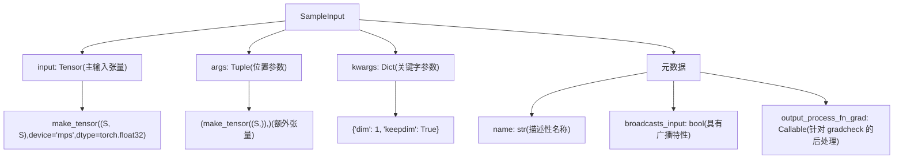
**SampleInput 结构与组件**

### 样本输入生成示例 (Sample Input Generation Example)

```python
# 来自 torch/testing/_internal/common_methods_invocations.py
def sample_inputs_slice(op_info, device, dtype, requires_grad, **kwargs):    
    make_input = partial(make_tensor, device=device, dtype=dtype,                         
                         low=None, high=None, requires_grad=requires_grad)    
    
    yield SampleInput(make_input(3), 0)    
    yield SampleInput(make_input(20, 30, 40), dim=1, start=1, end=-2)    
    yield SampleInput(make_input(20, 30, 40), dim=1, start=1, end=-2, step=3)    
    yield SampleInput(make_input(20, 30, 40), dim=0, start=-10, end=-2, step=2)
```
这生成了四个具有不同张量维度和切片参数的测试用例。

**来源：** [torch/testing/\_internal/common\_methods\_invocations.py174-186](https://github.com/pytorch/pytorch/blob/915982a4/torch/testing/_internal/common_methods_invocations.py#L174-L186) [torch/testing/\_internal/opinfo/core.py1-104](https://github.com/pytorch/pytorch/blob/915982a4/torch/testing/_internal/opinfo/core.py#L1-L104)

### 常用的样本输入模式 (Common Sample Input Patterns)

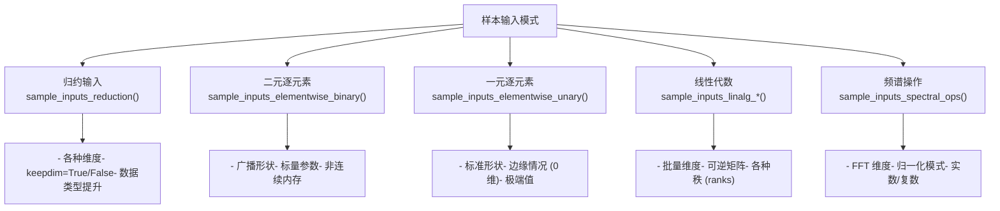
**常用的样本输入生成模式**

**来源：** [torch/testing/\_internal/opinfo/core.py1-104](https://github.com/pytorch/pytorch/blob/915982a4/torch/testing/_internal/opinfo/core.py#L1-L104) [torch/testing/\_internal/common\_methods\_invocations.py174-210](https://github.com/pytorch/pytorch/blob/915982a4/torch/testing/_internal/common_methods_invocations.py#L174-L210) [torch/testing/\_internal/opinfo/definitions/linalg.py1-53](https://github.com/pytorch/pytorch/blob/915982a4/torch/testing/_internal/opinfo/definitions/linalg.py#L1-L53)

## OpInfo 数据库 (op\_db) (The OpInfo Database (op_db))

`op_db` 是一个描述所有可测试 PyTorch 算子的 `OpInfo` 对象的详尽列表。它在 `torch/testing/_internal/common_methods_invocations.py` 中定义，包含 ~1000+ 个算子定义。

### OpInfo 数据库结构 (OpInfo Database Structure)

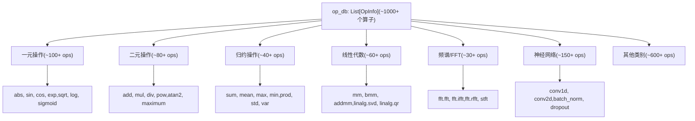
**按算子类别组织的 OpInfo 数据库**

### OpInfo 示例：abs 操作 (OpInfo Example: abs Operation)

```python
# 来自 torch/testing/_internal/common_methods_invocations.py
UnaryUfuncInfo(    
    'abs',    
    ref=np.abs,    
    dtypes=all_types_and_complex_and(torch.half, torch.bfloat16),    
    dtypesIfMPS=all_types_and(torch.half, torch.bfloat16),    
    supports_forward_ad=True,    
    supports_fwgrad_bwgrad=True,    
    decorators=(        
        # 在特定设备上跳过某些数据类型        
        DecorateInfo(unittest.skip("Skipped!"), 'TestUnaryUfuncs',                      
                     device_type='mps', dtypes=[torch.uint8]),    
    ),
)
```
这定义了：

-   操作名称：`'abs'`
-   参考实现：`np.abs` (NumPy)
-   支持的数据类型：所有数值类型，包括半精度
-   MPS 特有数据类型：排除复数类型
-   自动微分：支持前向和前向-后向
-   设备特定装饰器：在 MPS 上跳过 uint8

**来源：** [torch/testing/\_internal/common\_methods\_invocations.py59-109](https://github.com/pytorch/pytorch/blob/915982a4/torch/testing/_internal/common_methods_invocations.py#L59-L109) [test/test\_ops.py99-107](https://github.com/pytorch/pytorch/blob/915982a4/test/test_ops.py#L99-L107)

### OpInfo 数据库扩展 (OpInfo Database Extensions)

可以使用额外的算子定义扩展 `op_db`：

```python
# 来自 test/test_mps.py
test_consistency_op_db = copy.deepcopy(op_db)

# 为测试添加自定义算子变体
for op in op_db:    
    if op.name != "_upsample_bilinear2d_aa":        
        continue    
    op = copy.deepcopy(op)    
    op.name = "_upsample_bicubic2d_aa"    
    op.op = torch.ops.aten._upsample_bicubic2d_aa    
    test_consistency_op_db.append(op)    
    break
```
**来源：** [test/test\_mps.py52-63](https://github.com/pytorch/pytorch/blob/915982a4/test/test_mps.py#L52-L63)

## OpInfo 测试基础设施 (OpInfo Testing Infrastructure)

OpInfo 框架集成了 PyTorch 的测试基础设施，能够跨设备和数据类型自动生成并执行测试用例。

### 测试生成流 (Test Generation Flow)

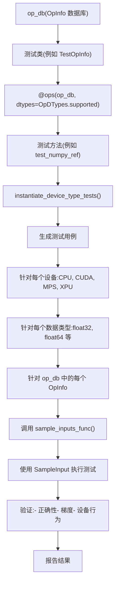
**基于 OpInfo 的测试生成与执行流程**

### 使用 OpInfo 的测试示例 (Example Test Using OpInfo)

```python
# 来自 test/test_ops.py
@ops(_ref_test_ops, allowed_dtypes=(torch.float64, torch.long, torch.complex128))
def test_numpy_ref(self, device, dtype, op):    
    # 将默认数据类型设为 NumPy 默认的 double    
    with set_default_dtype(torch.double):        
        for sample_input in op.reference_inputs(device, dtype):            
            self.compare_with_reference(                
                op, op.ref, sample_input, exact_dtype=(dtype is not torch.long)            
            )
```
该测试：

1.  迭代 `_ref_test_ops` 中所有具有参考实现的算子
2.  为每个 (设备, 数据类型, 算子) 组合生成测试用例
3.  调用 `op.reference_inputs()` 获取样本输入
4.  将算子输出与参考实现（例如 NumPy）进行对比

**来源：** [test/test\_ops.py469-490](https://github.com/pytorch/pytorch/blob/915982a4/test/test_ops.py#L469-L490) [test/test\_ops.py1-107](https://github.com/pytorch/pytorch/blob/915982a4/test/test_ops.py#L1-L107)

### 设备特定的测试组织 (Device-Specific Test Organization)

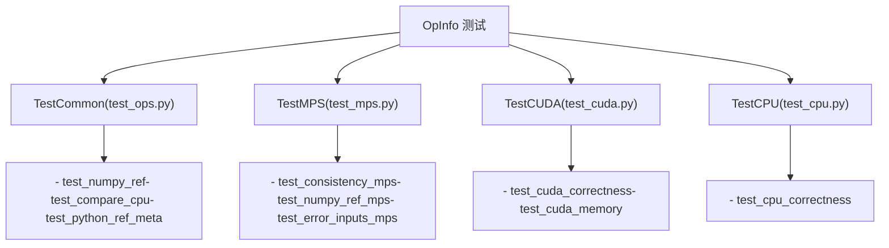
**设备特定的测试组织**

**来源：** [test/test\_ops.py218-261](https://github.com/pytorch/pytorch/blob/915982a4/test/test_ops.py#L218-L261) [test/test\_mps.py1-80](https://github.com/pytorch/pytorch/blob/915982a4/test/test_mps.py#L1-L80)

## 设备特定测试：MPS 后端 (Device-Specific Testing: MPS Backend)

MPS 后端演示了如何使用修改器函数针对设备特定行为自定义 OpInfo 测试。

### MPS OpInfo 修改器 (MPS OpInfo Modifier)

`mps_ops_modifier` 函数为 MPS 测试过滤并自定义了 OpInfo 条目：

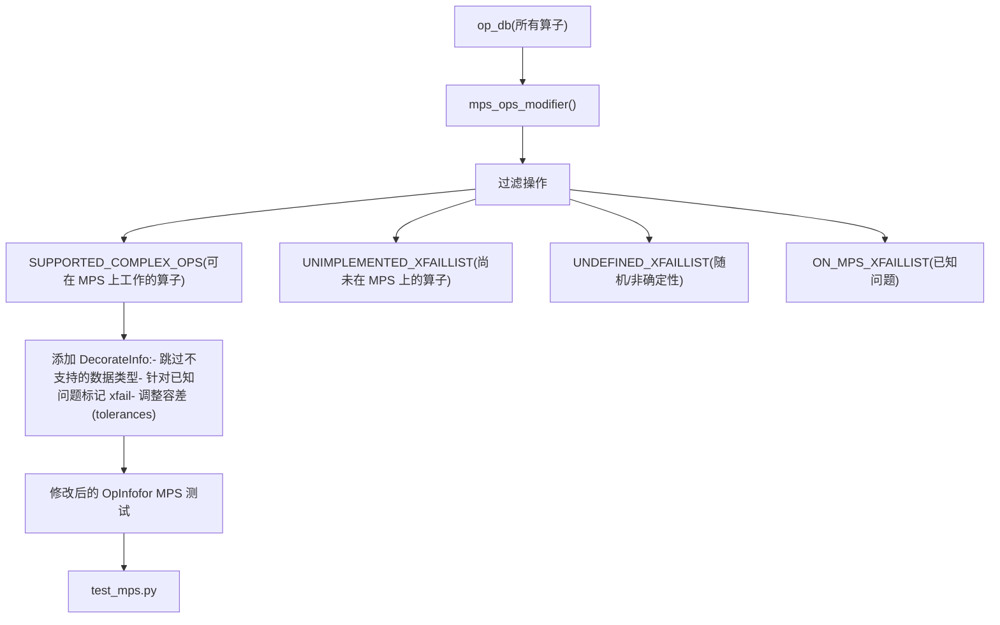
**MPS OpInfo 修改器流程**

### MPS 特有的 OpInfo 定制 (MPS-Specific OpInfo Customization)

```python
# 来自 torch/testing/_internal/common_mps.py
def mps_ops_modifier(    
    ops: Sequence[OpInfo],    
    device_type: str = "mps",    
    xfail_exclusion: Optional[list[str]] = None,    
    sparse: bool = False,) -> Sequence[OpInfo]:        
    
    # MPS 上支持的复数操作    
    SUPPORTED_COMPLEX_OPS = {        
        "abs", "add", "mul", "div", "matmul", "mm", "bmm",        
        "sin", "cos", "exp", "log", # ... 更多操作    
    }        
    
    # 尚未实现的操作    
    UNIMPLEMENTED_XFAILLIST = {        
        "linalg.eig": None,        
        "linalg.qr": None,        
        "nn.functional.grid_sample": None,        
        # ... 更多操作    
    }        
    
    # 具有未定义行为的随机操作    
    UNDEFINED_XFAILLIST = {        
        "multinomial": [torch.float16, torch.float32, torch.bfloat16],        
        "uniform": [torch.float16, torch.float32, torch.bfloat16],        
        "normal": [torch.float16, torch.float32, torch.bfloat16],        
        # ... 更多操作    
    }
```
修改器根据 MPS 能力添加 `DecorateInfo` 来跳过测试或将其标记为 xfail。

**来源：** [torch/testing/\_internal/common\_mps.py13-300](https://github.com/pytorch/pytorch/blob/915982a4/torch/testing/_internal/common_mps.py#L13-L300) [torch/testing/\_internal/common\_mps.py309-676](https://github.com/pytorch/pytorch/blob/915982a4/torch/testing/_internal/common_mps.py#L309-L676)

### MPS 测试示例 (MPS Test Example)

```python
# 来自 test/test_mps.py
test_consistency_op_db = copy.deepcopy(op_db)
test_error_inputs_op_db = copy.deepcopy(op_db)

# 应用 MPS 特定的修改
mps_ops_modifier(test_consistency_op_db, device_type="mps")
mps_ops_error_inputs_modifier(test_error_inputs_op_db, device_type="mps")

@ops(test_consistency_op_db, allowed_dtypes=(torch.float32,))
def test_consistency_mps(self, device, dtype, op):    
    samples = op.sample_inputs(device, dtype, requires_grad=False)    
    for sample in samples:        
        cpu_result = op(sample.input.cpu(), *sample.args, **sample.kwargs)        
        mps_result = op(sample.input, *sample.args, **sample.kwargs)        
        self.assertEqual(mps_result.cpu(), cpu_result)
```
**来源：** [test/test\_mps.py52-80](https://github.com/pytorch/pytorch/blob/915982a4/test/test_mps.py#L52-L80)

## 跨后端验证 (Cross-Backend Validation)

OpInfo 能够系统地验证操作在 CPU, CUDA, MPS 及其它后端产生一致的结果。

### 跨后端测试流程 (Cross-Backend Testing Flow)

> **[Mermaid sequence]**
> *(图表结构无法解析)*

**跨后端验证序列**

### CPU vs CUDA 一致性测试 (CPU vs CUDA Consistency Test)

```python
# 来自 test/test_ops.py
@onlyOn(['cuda', 'xpu'])
@suppress_warnings
@skipCUDAIfNotRocm
@ops(_ops_and_refs_with_no_numpy_ref, dtypes=OpDTypes.any_common_cpu_cuda_one)
def test_compare_cpu(self, device, dtype, op):    
    def to_cpu(arg):        
        if isinstance(arg, torch.Tensor):            
            return arg.to(device="cpu")        
        return arg    
    
    samples = op.reference_inputs(device, dtype)    
    
    for sample in samples:        
        cpu_sample = sample.transform(to_cpu)        
        cuda_results = op(sample.input, *sample.args, **sample.kwargs)        
        cpu_results = op(cpu_sample.input, *cpu_sample.args, **cpu_sample.kwargs)        
        
        # 为 SVD 等可能返回有效但不同结果的操作应用输出处理        
        cuda_results = sample.output_process_fn_grad(cuda_results)        
        cpu_results = cpu_sample.output_process_fn_grad(cpu_results)        
        
        atol, rtol = 0, 0        
        if dtype.is_floating_point or dtype.is_complex:            
            atol, rtol = 1e-3, 1e-3        
        self.assertEqual(cuda_results, cpu_results, atol=atol, rtol=rtol)
```
**来源：** [test/test\_ops.py493-521](https://github.com/pytorch/pytorch/blob/915982a4/test/test_ops.py#L493-L521)

### MPS 一致性验证 (MPS Consistency Validation)

```python
# 来自 test/test_mps.py
@ops(test_consistency_op_db, allowed_dtypes=(torch.float32,))
def test_consistency_mps(self, device, dtype, op):    
    samples = op.sample_inputs(device, dtype, requires_grad=False)        
    for sample in samples:        
        # 在 CPU 上执行        
        cpu_input = sample.input.cpu()        
        cpu_args = [arg.cpu() if isinstance(arg, torch.Tensor) else arg                     
                    for arg in sample.args]        
        cpu_result = op(cpu_input, *cpu_args, **sample.kwargs)                
        
        # 在 MPS 上执行        
        mps_result = op(sample.input, *sample.args, **sample.kwargs)                
        
        # 对比结果        
        self.assertEqual(mps_result.cpu(), cpu_result)
```
**来源：** [test/test\_mps.py52-80](https://github.com/pytorch/pytorch/blob/915982a4/test/test_mps.py#L52-L80)

## 梯度与 Autograd 测试 (Gradient and Autograd Testing)

OpInfo 为使用 `gradcheck` 及其相关工具进行的自动化梯度测试提供了元数据。

### 梯度测试配置 (Gradient Testing Configuration)

```mermaid
flowchart TD
    OpInfo["OpInfo"]
    AutogradSupport["Autograd 支持标志"]
    GradcheckConfig["Gradcheck 配置"]
    GradientWrappers["梯度包装器"]
    SupportsAutograd["supports_autograd: bool(基础反向传递)"]
    SupportsGradgrad["supports_gradgrad: bool(二阶导)"]
    SupportsForwardAD["supports_forward_ad: bool(前向模式)"]
    SupportsFwgradBwgrad["supports_fwgrad_bwgrad: bool(前向+反向)"]
    GradcheckNondet["gradcheck_nondet_tol: float(针对非确定性的容差)"]
    CheckInplace["check_inplace: bool(验证就地变体)"]
    CheckBatched["check_batched_grad: bool(验证 vmap 梯度)"]
    OutputProcessFn["output_process_fn_grad(gradcheck 前的后处理)"]
    GradcheckWrapper["gradcheck_wrapper(为 gradcheck 包装操作)"]

    OpInfo --> AutogradSupport
    OpInfo --> GradcheckConfig
    OpInfo --> GradientWrappers
    AutogradSupport --> SupportsAutograd
    AutogradSupport --> SupportsGradgrad
    AutogradSupport --> SupportsForwardAD
    AutogradSupport --> SupportsFwgradBwgrad
    GradcheckConfig --> GradcheckNondet
    GradcheckConfig --> CheckInplace
    GradcheckConfig --> CheckBatched
    GradientWrappers --> OutputProcessFn
    GradientWrappers --> GradcheckWrapper
```
**OpInfo 中的梯度测试配置**

### Gradcheck 示例 (Gradcheck Example)

```python
# 来自 test/test_ops.py
@ops(op_db, allowed_dtypes=(torch.float64,))
def test_gradcheck(self, device, dtype, op):    
    samples = op.sample_inputs(device, dtype, requires_grad=True)        
    for sample in samples:        
        # 如果算子不支持 autograd 则跳过
        if not op.supports_autograd:            
            continue                    
        
        # 使用合适的容差运行 gradcheck
        func = lambda *args, **kwargs: op(*args, **kwargs)                
        
        # 如果指定了，应用 gradcheck 包装器
        if op.gradcheck_wrapper:            
            func = op.gradcheck_wrapper(func)                    
        
        # 运行一阶 gradcheck
        gradcheck(func, (sample.input, *sample.args),                   
                  check_grad_dtypes=True, **sample.kwargs)                
        
        # 如果支持，运行二阶 gradcheck
        if op.supports_gradgrad:            
            gradgradcheck(func, (sample.input, *sample.args),                          
                          check_grad_dtypes=True, **sample.kwargs)
```
**来源：** [torch/testing/\_internal/opinfo/core.py1-104](https://github.com/pytorch/pytorch/blob/915982a4/torch/testing/_internal/opinfo/core.py#L1-L104) [test/test\_ops.py1-107](https://github.com/pytorch/pytorch/blob/915982a4/test/test_ops.py#L1-L107)

### 梯度包装器函数 (Gradient Wrapper Functions)

OpInfo 为具有特殊要求的操作提供了专门的梯度包装器：

| 包装器函数 | 目的 | 示例操作 |
| --- | --- | --- |
| `gradcheck_wrapper_hermitian_input` | 确保输入是 Hermitian 矩阵 | `linalg.eigh`, `linalg.eigvalsh` |
| `gradcheck_wrapper_triangular_input` | 确保输入是三角矩阵 | `linalg.solve_triangular` |
| `gradcheck_wrapper_masked_operation` | 处理掩码操作 (masked ops) | `masked.sum`, `masked.mean` |
| `clone_sample` | 克隆输入以测试就地操作 | 就地 (inplace) 操作 |

**来源：** [torch/testing/\_internal/opinfo/core.py102-109](https://github.com/pytorch/pytorch/blob/915982a4/torch/testing/_internal/opinfo/core.py#L102-L109) [torch/testing/\_internal/common\_methods\_invocations.py102-108](https://github.com/pytorch/pytorch/blob/915982a4/torch/testing/_internal/common_methods_invocations.py#L102-L108)

## 参考实现 (Reference Implementations)

OpInfo 可以指定参考实现（`ref` 属性）用于验证数值正确性。这些通常是 NumPy 或 SciPy 函数。

### 参考实现结构 (Reference Implementation Structure)

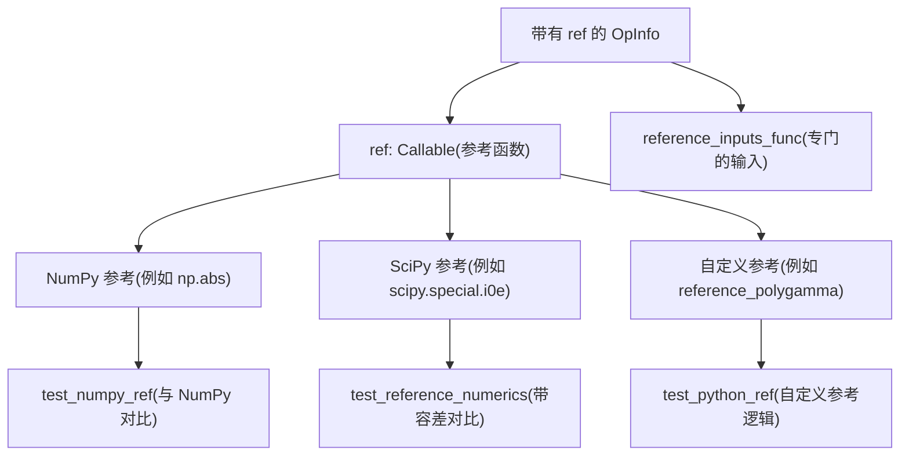
**参考实现类型与测试**

### 示例：NumPy 参考 (Example: NumPy Reference)

```python
# 来自 torch/testing/_internal/common_methods_invocations.py
UnaryUfuncInfo(    
    'abs',    
    ref=np.abs,  # NumPy 参考
    dtypes=all_types_and_complex_and(torch.half, torch.bfloat16),    
    supports_forward_ad=True,    
    supports_fwgrad_bwgrad=True,
)
```
测试会自动将 `torch.abs(x)` 与 `np.abs(x.cpu().numpy())` 进行对比。

**来源：** [torch/testing/\_internal/common\_methods\_invocations.py59-109](https://github.com/pytorch/pytorch/blob/915982a4/torch/testing/_internal/common_methods_invocations.py#L59-L109)

### 示例：带有自定义逻辑的 SciPy 参考 (Example: SciPy Reference with Custom Logic)

```python
# 来自 torch/testing/_internal/opinfo/definitions/special.py
def reference_polygamma(x, n):    
    # 特殊的 scipy.special.polygamma 行为需要数据类型处理
    result_dtype = torch_to_numpy_dtype_dict[torch.get_default_dtype()]    
    if x.dtype == np.double:        
        result_dtype = np.double    
    return scipy.special.polygamma(n, x).astype(result_dtype)

UnaryUfuncInfo(    
    'special.polygamma',    
    op=lambda x, n, **kwargs: torch.special.polygamma(n, x, **kwargs),    
    ref=reference_polygamma if TEST_SCIPY else None,    
    dtypes=all_types_and(torch.bool, torch.half, torch.bfloat16),    
    supports_forward_ad=True,    
    supports_fwgrad_bwgrad=True,    
    sample_inputs_func=sample_inputs_polygamma,
)
```
**来源：** [torch/testing/\_internal/opinfo/definitions/special.py81-93](https://github.com/pytorch/pytorch/blob/915982a4/torch/testing/_internal/opinfo/definitions/special.py#L81-L93) [torch/testing/\_internal/opinfo/definitions/special.py206-247](https://github.com/pytorch/pytorch/blob/915982a4/torch/testing/_internal/opinfo/definitions/special.py#L206-L247)

### 参考数值过滤 (Reference Numerics Filtering)

某些操作在与参考实现对比前，需要过滤边缘情况：

```python
# 来自 torch/testing/_internal/opinfo/definitions/special.py
UnaryUfuncInfo(    
    'special.polygamma',    
    # ... 其他属性 ...    
    reference_numerics_filter=NumericsFilter(        
        condition=lambda x: (x < 0.1) & ((x - x.round()).abs() < 1e-4),         
        safe_val=1    
    ),
)
```
这会过滤掉 polygamma 具有奇点的负整数附近的值。

**来源：** [torch/testing/\_internal/opinfo/definitions/special.py206-247](https://github.com/pytorch/pytorch/blob/915982a4/torch/testing/_internal/opinfo/definitions/special.py#L206-L247) [torch/testing/\_internal/opinfo/core.py1-104](https://github.com/pytorch/pytorch/blob/915982a4/torch/testing/_internal/opinfo/core.py#L1-L104)

## 错误输入测试 (Error Input Testing)

OpInfo 支持通过 `error_inputs_func` 测试错误条件，该函数生成指定了预期异常的 `ErrorInput` 对象。

### ErrorInput 结构 (ErrorInput Structure)

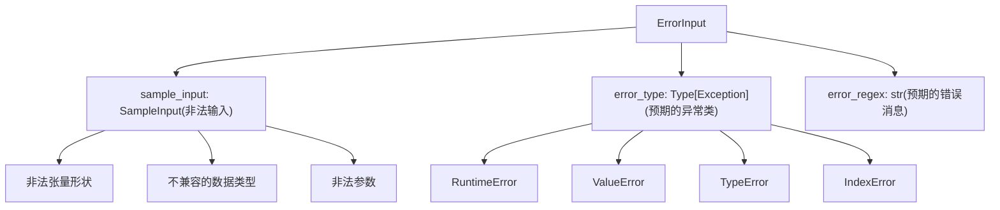
**用于错误条件测试的 ErrorInput 结构**

### 错误输入示例 (Error Input Example)

```python
# 来自 torch/testing/_internal/common_methods_invocations.py
def error_inputs_hsplit(op_info, device, **kwargs):    
    make_arg = partial(make_tensor, dtype=torch.float32, device=device)        
    
    # 错误：0 维张量
    err_msg1 = ("torch.hsplit requires a tensor with at least 1 dimension, "                
                "but got a tensor with 0 dimensions!")    
    yield ErrorInput(SampleInput(make_arg(()), 0), error_regex=err_msg1)

    # 错误：尺寸不能被 split_size 整除
    err_msg2 = (f"torch.hsplit attempted to split along dimension 1, "                
                f"but the size of the dimension {S} "                
                f"is not divisible by the split_size 0!")    
    yield ErrorInput(SampleInput(make_arg((S, S, S)), 0), error_regex=err_msg2)

    # 错误：参数类型不正确
    err_msg3 = ("received an invalid combination of arguments.")    
    yield ErrorInput(        
        SampleInput(make_arg((S, S, S)), "abc"),        
        error_type=TypeError, error_regex=err_msg3)
```
**来源：** [torch/testing/\_internal/common\_methods\_invocations.py230-246](https://github.com/pytorch/pytorch/blob/915982a4/torch/testing/_internal/common_methods_invocations.py#L230-L246)

### 错误输入测试基础设施 (Error Input Testing Infrastructure)

```python
# 来自 test/test_ops.py
@ops(test_error_inputs_op_db, dtypes=OpDTypes.none)
def test_error_inputs(self, device, op):    
    # 迭代错误输入
    error_inputs = op.error_inputs(device)        
    for error_input in error_inputs:        
        # 提取样本输入和预期错误
        sample = error_input.sample_input        
        error_type = error_input.error_type or RuntimeError        
        error_regex = error_input.error_regex                
        
        # 验证操作抛出了预期的错误
        with self.assertRaisesRegex(error_type, error_regex):            
            op(sample.input, *sample.args, **sample.kwargs)
```
**来源：** [test/test\_ops.py1-107](https://github.com/pytorch/pytorch/blob/915982a4/test/test_ops.py#L1-L107) [torch/testing/\_internal/opinfo/core.py1-104](https://github.com/pytorch/pytorch/blob/915982a4/torch/testing/_internal/opinfo/core.py#L1-L104)

## 按类别组织的 OpInfo (OpInfo Organization by Category)

OpInfo 定义按操作类别被组织进专门的模块中：

### OpInfo 定义模块 (OpInfo Definition Modules)

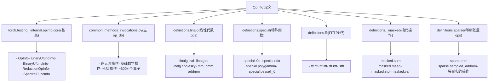
**OpInfo 定义模块组织结构**

### 模块职责表 (Module Responsibility Table)

| 模块 | 文件路径 | 职责 |
| --- | --- | --- |
| **核心 (Core)** | `torch/testing/_internal/opinfo/core.py` | `OpInfo` 基类和基础设施 |
| **主模块 (Main)** | `torch/testing/_internal/common_methods_invocations.py` | 主要的算子数据库 (~600+ ops) |
| **线性代数 (LinAlg)** | `torch/testing/_internal/opinfo/definitions/linalg.py` | 矩阵操作与分解 |
| **特殊函数 (Special)** | `torch/testing/_internal/opinfo/definitions/special.py` | 数学特殊函数 |
| **FFT** | `torch/testing/_internal/opinfo/definitions/fft.py` | 傅里叶变换操作 |
| **掩码 (Masked)** | `torch/testing/_internal/opinfo/definitions/_masked.py` | 具有掩码支持的操作 |
| **稀疏 (Sparse)** | `torch/testing/_internal/opinfo/definitions/sparse.py` | 稀疏张量操作 |

**来源：** [torch/testing/\_internal/opinfo/core.py1-104](https://github.com/pytorch/pytorch/blob/915982a4/torch/testing/_internal/opinfo/core.py#L1-L104) [torch/testing/\_internal/common\_methods\_invocations.py1-123](https://github.com/pytorch/pytorch/blob/915982a4/torch/testing/_internal/common_methods_invocations.py#L1-L123) [torch/testing/\_internal/opinfo/definitions/linalg.py1-53](https://github.com/pytorch/pytorch/blob/915982a4/torch/testing/_internal/opinfo/definitions/linalg.py#L1-L53) [torch/testing/\_internal/opinfo/definitions/special.py1-39](https://github.com/pytorch/pytorch/blob/915982a4/torch/testing/_internal/opinfo/definitions/special.py#L1-L39) [torch/testing/\_internal/opinfo/definitions/fft.py1-40](https://github.com/pytorch/pytorch/blob/915982a4/torch/testing/_internal/opinfo/definitions/fft.py#L1-L40) [torch/testing/\_internal/opinfo/definitions/\_masked.py1-31](https://github.com/pytorch/pytorch/blob/915982a4/torch/testing/_internal/opinfo/definitions/_masked.py#L1-L31)

## DecorateInfo：条件测试装饰器 (DecorateInfo: Conditional Test Decorators)

`DecorateInfo` 类允许 OpInfo 根据设备、数据类型和测试名称，有条件地应用装饰器（skip, xfail, 容差覆盖）。

### DecorateInfo 结构 (DecorateInfo Structure)

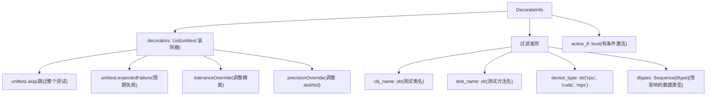
**条件装饰器的 DecorateInfo 结构**

### DecorateInfo 示例 (DecorateInfo Example)

```python
# 来自 torch/testing/_internal/common_methods_invocations.py
UnaryUfuncInfo(    
    'special.i1',    
    aten_name='special_i1',    
    ref=np_unary_ufunc_integer_promotion_wrapper(scipy.special.i1),    
    dtypes=all_types_and(torch.bool, torch.half, torch.bfloat16),    
    decorators=(        
        DecorateInfo(            
            toleranceOverride({                
                torch.float32: tol(atol=1e-4, rtol=0),                
                torch.bool: tol(atol=1e-4, rtol=0),            
            })        
        ),    
    ),    
    skips=(        
        DecorateInfo(            
            unittest.skip("Incorrect result!"),            
            "TestUnaryUfuncs",            
            "test_reference_numerics_large",            
            dtypes=(torch.int8,),        
        ),    
    ),
)
```
这应用了：

-   针对 float32 和 bool 数据类型的容差覆盖（针对所有测试）
-   在特定测试方法上针对 int8 数据类型的跳过

**来源：** [torch/testing/\_internal/opinfo/definitions/special.py138-170](https://github.com/pytorch/pytorch/blob/915982a4/torch/testing/_internal/opinfo/definitions/special.py#L138-L170) [torch/testing/\_internal/opinfo/core.py74-104](https://github.com/pytorch/pytorch/blob/915982a4/torch/testing/_internal/opinfo/core.py#L74-L104)

### MPS 特有的 DecorateInfo 用法 (MPS-Specific DecorateInfo Usage)

```python
# 来自 torch/testing/_internal/common_mps.py
def mps_ops_modifier(ops, device_type="mps", **kwargs):    
    for op in ops:        
        if op.name in UNIMPLEMENTED_XFAILLIST:            
            # 为未实现的操作添加 xfail 装饰器
            op.decorators.append(                
                DecorateInfo(                    
                    unittest.expectedFailure,                    
                    device_type=device_type,                    
                    dtypes=UNIMPLEMENTED_XFAILLIST[op.name]                
                )            
            )
```
**来源：** [torch/testing/\_internal/common\_mps.py13-300](https://github.com/pytorch/pytorch/blob/915982a4/torch/testing/_internal/common_mps.py#L13-L300)

## 总结 (Summary)

操作分发系统通过以下方式将 PyTorch 操作路由到合适的后端实现：

1.  **分发键**：设备、布局和功能性标签标识执行上下文
2.  **YAML 规范**：`native_functions.yaml` 映射操作到实现
3.  **运行时选择**：分发器检查张量属性并选择内核
4.  **后端实现**：每个后端提供优化的内核
5.  **回退机制**：复合实现提供跨后端的默认方案
6.  **测试基础设施**：自动化的验证确保了后端之间的一致性

该架构使 PyTorch 能够在保持统一的面向用户 API 的同时，支持多样化的硬件。
