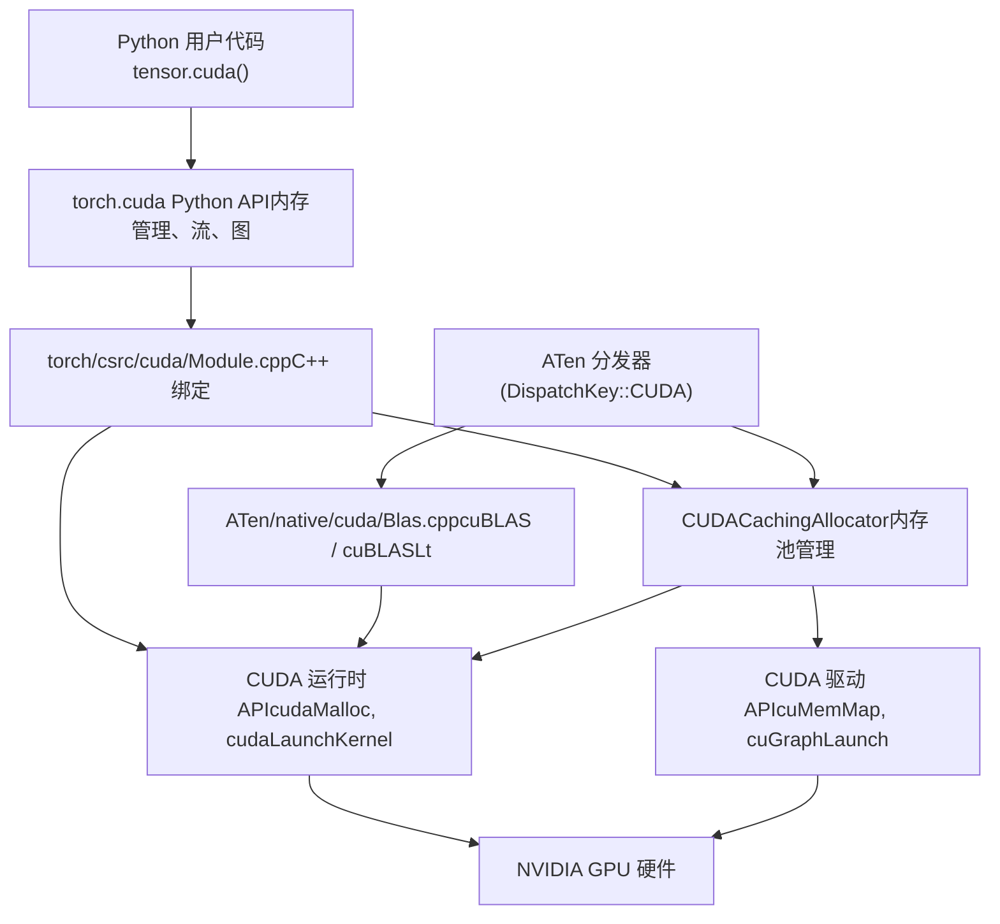

# CUDA 后端 (CUDA Backend)

相关源文件 (Relevant source files)

-   [aten/src/ATen/CMakeLists.txt](https://github.com/pytorch/pytorch/blob/915982a4/aten/src/ATen/CMakeLists.txt)
-   [aten/src/ATen/core/CachingHostAllocator.h](https://github.com/pytorch/pytorch/blob/915982a4/aten/src/ATen/core/CachingHostAllocator.h)
-   [aten/src/ATen/cuda/CachingHostAllocator.cpp](https://github.com/pytorch/pytorch/blob/915982a4/aten/src/ATen/cuda/CachingHostAllocator.cpp)
-   [aten/src/ATen/native/cuda/Blas.cpp](https://github.com/pytorch/pytorch/blob/915982a4/aten/src/ATen/native/cuda/Blas.cpp)
-   [aten/src/ATen/native/cuda/ScaledBlas.cpp](https://github.com/pytorch/pytorch/blob/915982a4/aten/src/ATen/native/cuda/ScaledBlas.cpp)
-   [aten/src/ATen/test/cuda\_caching\_host\_allocator\_test.cpp](https://github.com/pytorch/pytorch/blob/915982a4/aten/src/ATen/test/cuda_caching_host_allocator_test.cpp)
-   [c10/cuda/CUDAAllocatorConfig.cpp](https://github.com/pytorch/pytorch/blob/915982a4/c10/cuda/CUDAAllocatorConfig.cpp)
-   [c10/cuda/CUDAAllocatorConfig.h](https://github.com/pytorch/pytorch/blob/915982a4/c10/cuda/CUDAAllocatorConfig.h)
-   [c10/cuda/CUDACachingAllocator.cpp](https://github.com/pytorch/pytorch/blob/915982a4/c10/cuda/CUDACachingAllocator.cpp)
-   [c10/cuda/CUDACachingAllocator.h](https://github.com/pytorch/pytorch/blob/915982a4/c10/cuda/CUDACachingAllocator.h)
-   [docs/source/cuda.aliases.md](https://github.com/pytorch/pytorch/blob/915982a4/docs/source/cuda.aliases.md)
-   [docs/source/notes/cuda.rst](https://github.com/pytorch/pytorch/blob/915982a4/docs/source/notes/cuda.rst)
-   [test/test\_cuda.py](https://github.com/pytorch/pytorch/blob/915982a4/test/test_cuda.py)
-   [test/test\_cuda\_compatibility.py](https://github.com/pytorch/pytorch/blob/915982a4/test/test_cuda_compatibility.py)
-   [test/test\_matmul\_cuda.py](https://github.com/pytorch/pytorch/blob/915982a4/test/test_matmul_cuda.py)
-   [test/test\_scaled\_matmul\_cuda.py](https://github.com/pytorch/pytorch/blob/915982a4/test/test_scaled_matmul_cuda.py)
-   [torch/csrc/cuda/Module.cpp](https://github.com/pytorch/pytorch/blob/915982a4/torch/csrc/cuda/Module.cpp)
-   [torch/csrc/cuda/memory\_snapshot.cpp](https://github.com/pytorch/pytorch/blob/915982a4/torch/csrc/cuda/memory_snapshot.cpp)
-   [torch/cuda/\_\_init\_\_.py](https://github.com/pytorch/pytorch/blob/915982a4/torch/cuda/__init__.py)
-   [torch/cuda/\_device\_limits.py](https://github.com/pytorch/pytorch/blob/915982a4/torch/cuda/_device_limits.py)
-   [torch/cuda/memory.py](https://github.com/pytorch/pytorch/blob/915982a4/torch/cuda/memory.py)

## 目的与范围 (Purpose and Scope)

CUDA 后端是 PyTorch 实现 GPU 加速张量计算的核心。本页涵盖了 CUDA 集成的高层架构，重点关注内存管理、BLAS 操作以及与 NVIDIA 硬件的集成。

有关特定子系统的详细信息：

-   **CUDA 缓存分配器**：内存块管理、尺寸分级 (size classes) 与可扩展分段 (expandable segments)（参见 [3.2.1](/pytorch/pytorch/3.2.1-cuda-caching-allocator)）。
-   **CUDA 图捕获**：将操作记录进 `cudaGraph_t` 中以便高效重放，以及私有内存池管理（参见 [3.2.2](/pytorch/pytorch/3.2.2-cuda-graph-capture-and-memory-pools)）。
-   **BLAS 与矩阵乘法**：cuBLAS/cuBLASLt 集成、FP8 缩放 GEMM 以及分组 GEMM 实现（参见 [3.2.3](/pytorch/pytorch/3.2.3-blas-and-matrix-multiplication-operations)）。

---

## 架构概览 (Architecture Overview)

CUDA 后端将 PyTorch 的张量操作连接到 NVIDIA 的硬件驱动和库（cuBLAS, cuDNN, NCCL）。


来源： [torch/cuda/\_\_init\_\_.py1-100](https://github.com/pytorch/pytorch/blob/915982a4/torch/cuda/__init__.py#L1-L100) [torch/csrc/cuda/Module.cpp1-100](https://github.com/pytorch/pytorch/blob/915982a4/torch/csrc/cuda/Module.cpp#L1-L100) [c10/cuda/CUDACachingAllocator.cpp1-100](https://github.com/pytorch/pytorch/blob/915982a4/c10/cuda/CUDACachingAllocator.cpp#L1-L100)

---

## 内存管理基础设施 (Memory Management Infrastructure)

### CUDACachingAllocator

为了避免 `cudaMalloc` 昂贵的开销，PyTorch 采用了一个缓存分配器。它维护了一个空闲内存块池，并按照以下规则复用它们：

-   **尺寸分级**：小对象 (≤1 MB) 和大对象 (>1 MB) 分别使用不同的池。
-   **流感知 (Stream-Aware)**：块与分配它们的流绑定，除非显式记录了跨流的使用。
-   **可扩展分段**：使用底层驱动 API (`cuMemMap`) 在虚拟地址空间中动态增长内存段，以减少碎片化。

有关实现细节，请参阅 [3.2.1](/pytorch/pytorch/3.2.1-cuda-caching-allocator)。

### 锁页 (Pinned) 主机内存

`CachingHostAllocator` 管理一个用于快速 CPU-GPU 传输的锁页内存池。它既支持直接分配 (`cudaHostAlloc`)，也支持对现有内存进行注册 (`cudaHostRegister`)。

来源： [aten/src/ATen/cuda/CachingHostAllocator.cpp1-100](https://github.com/pytorch/pytorch/blob/915982a4/aten/src/ATen/cuda/CachingHostAllocator.cpp#L1-L100)

---

## 执行模型：流与事件 (Execution Model: Streams and Events)

PyTorch 将操作提交到 CUDA 流中，以便在 GPU 上异步执行。

### CUDA 流 (CUDA Streams)

-   每个设备都有一个 **默认流 (default stream)**（流 0）。
-   可以使用 `torch.cuda.Stream` 创建额外的流，以实现重叠计算。
-   `torch.cuda.current_stream()` 获取当前活跃的流。

### CUDA 事件 (CUDA Events)

-   用于流同步 (`event.wait(stream)`)。
-   用于精确的性能测量 (`event.elapsed_time(other_event)`)。

来源： [torch/cuda/\_\_init\_\_.py500-700](https://github.com/pytorch/pytorch/blob/915982a4/torch/cuda/__init__.py#L500-L700) [test/test\_cuda.py317-600](https://github.com/pytorch/pytorch/blob/915982a4/test/test_cuda.py#L317-L600)

---

## 矩阵乘法与 BLAS (Matrix Multiplication and BLAS)

CUDA 后端广泛集成了 cuBLAS 和 cuBLASLt 来执行张量乘法。

| 特性 | 实现 | 详情 |
| --- | --- | --- |
| **标准 GEMM** | `at::cuda::blas::gemm` | 封装了 `cublasSgemm` 等。 |
| **偏置融合** | `cuBLASLt` | 在 `addmm` 中将加法与乘法融合。 |
| **低精度** | `_scaled_mm` | 针对 FP8 的专门内核 (SM 8.9+)。 |
| **分组 MM** | `grouped_mm` | 在单个内核中处理多个不均匀的矩阵乘法 (MoE)。 |

有关详细的 BLAS 调度逻辑，请参阅 [3.2.3](/pytorch/pytorch/3.2.3-blas-and-matrix-multiplication-operations)。

来源： [aten/src/ATen/native/cuda/Blas.cpp1-200](https://github.com/pytorch/pytorch/blob/915982a4/aten/src/ATen/native/cuda/Blas.cpp#L1-L200) [aten/src/ATen/native/cuda/ScaledBlas.cpp1-100](https://github.com/pytorch/pytorch/blob/915982a4/aten/src/ATen/native/cuda/ScaledBlas.cpp#L1-L100)

---

## CUDA 图 (CUDA Graphs)

CUDA 图允许将一个操作序列捕获进单个伪影中，随后可以以最小的 CPU 开销进行重放。

-   **捕获**：使用 `torch.cuda.graph(g)` 上下文。
-   **内存池**：为了保证地址稳定性，每个捕获使用一个私有的 `MempoolId_t`。
-   **限制**：被捕获的操作必须是确定性的，且不能涉及 CPU 同步。

有关详细信息，请参阅 [3.2.2](/pytorch/pytorch/3.2.2-cuda-graph-capture-and-memory-pools)。

来源： [torch/cuda/graphs.py1-100](https://github.com/pytorch/pytorch/blob/915982a4/torch/cuda/graphs.py#L1-L100)

---

## 后端配置与调试 (Backend Configuration and Debugging)

### 配置选项

可以通过 `PYTORCH_CUDA_ALLOC_CONF` 环境变量对分配器进行微调：

-   `max_split_size_mb`：限制大额块的拆分。
-   `expandable_segments`：切换 VMM 模式。
-   `garbage_collection_threshold`：设置内存释放阈值。

### 调试工具

-   **内存快照**：`torch.cuda.memory_snapshot()` 捕获分配历史。
-   **可视化**：`torch.utils.viz.MemoryViz.js` 可视化快照中的内存段。
-   **性能分析**：集成了 `torch.profiler` 以追踪内核执行时间。

来源： [c10/cuda/CUDAAllocatorConfig.h1-100](https://github.com/pytorch/pytorch/blob/915982a4/c10/cuda/CUDAAllocatorConfig.h#L1-L100) [torch/csrc/cuda/memory\_snapshot.cpp1-100](https://github.com/pytorch/pytorch/blob/915982a4/torch/csrc/cuda/memory_snapshot.cpp#L1-L100)

---

## 测试基础设施 (Testing Infrastructure)

CUDA 测试套件验证了正确性、内存安全以及多 GPU 功能。

-   `test/test_cuda.py`：核心分配、流和 API 测试。
-   `test/test_matmul_cuda.py`：BLAS 操作的精度和一致性。
-   `test/test_cuda_compatibility.py`：验证版本一致性。

```python
# test/test_cuda.py 中的典型测试模式
def test_stream_concurrency(self):    
    s = torch.cuda.Stream()    
    with torch.cuda.stream(s):        
        x = torch.randn(100, device='cuda')    
    s.synchronize()    
    self.assertTrue(s.query())
```
来源： [test/test\_cuda.py317-600](https://github.com/pytorch/pytorch/blob/915982a4/test/test_cuda.py#L317-L600)
