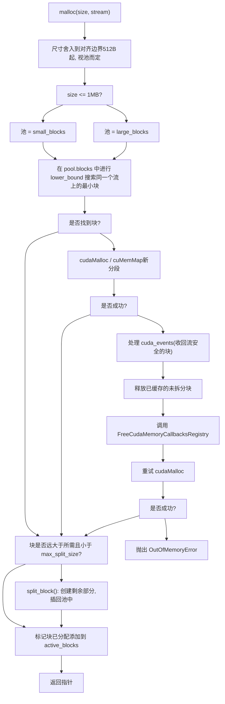

# CUDA 缓存分配器 (CUDA Caching Allocator)

相关源文件 (Relevant source files)

-   [aten/src/ATen/core/CachingHostAllocator.h](https://github.com/pytorch/pytorch/blob/915982a4/aten/src/ATen/core/CachingHostAllocator.h)
-   [aten/src/ATen/cuda/CachingHostAllocator.cpp](https://github.com/pytorch/pytorch/blob/915982a4/aten/src/ATen/cuda/CachingHostAllocator.cpp)
-   [aten/src/ATen/test/cuda\_caching\_host\_allocator\_test.cpp](https://github.com/pytorch/pytorch/blob/915982a4/aten/src/ATen/test/cuda_caching_host_allocator_test.cpp)
-   [aten/src/ATen/xpu/CachingHostAllocator.cpp](https://github.com/pytorch/pytorch/blob/915982a4/aten/src/ATen/xpu/CachingHostAllocator.cpp)
-   [c10/core/AllocatorConfig.cpp](https://github.com/pytorch/pytorch/blob/915982a4/c10/core/AllocatorConfig.cpp)
-   [c10/core/AllocatorConfig.h](https://github.com/pytorch/pytorch/blob/915982a4/c10/core/AllocatorConfig.h)
-   [c10/cuda/CUDAAllocatorConfig.cpp](https://github.com/pytorch/pytorch/blob/915982a4/c10/cuda/CUDAAllocatorConfig.cpp)
-   [c10/cuda/CUDAAllocatorConfig.h](https://github.com/pytorch/pytorch/blob/915982a4/c10/cuda/CUDAAllocatorConfig.h)
-   [c10/cuda/CUDACachingAllocator.cpp](https://github.com/pytorch/pytorch/blob/915982a4/c10/cuda/CUDACachingAllocator.cpp)
-   [c10/cuda/CUDACachingAllocator.h](https://github.com/pytorch/pytorch/blob/915982a4/c10/cuda/CUDACachingAllocator.h)
-   [c10/test/core/AllocatorConfig\_test.cpp](https://github.com/pytorch/pytorch/blob/915982a4/c10/test/core/AllocatorConfig_test.cpp)
-   [c10/xpu/XPUCachingAllocator.cpp](https://github.com/pytorch/pytorch/blob/915982a4/c10/xpu/XPUCachingAllocator.cpp)
-   [c10/xpu/XPUCachingAllocator.h](https://github.com/pytorch/pytorch/blob/915982a4/c10/xpu/XPUCachingAllocator.h)
-   [docs/source/cuda.aliases.md](https://github.com/pytorch/pytorch/blob/915982a4/docs/source/cuda.aliases.md)
-   [docs/source/notes/cuda.rst](https://github.com/pytorch/pytorch/blob/915982a4/docs/source/notes/cuda.rst)
-   [docs/source/xpu.aliases.md](https://github.com/pytorch/pytorch/blob/915982a4/docs/source/xpu.aliases.md)
-   [docs/source/xpu.md](https://github.com/pytorch/pytorch/blob/915982a4/docs/source/xpu.md)
-   [test/test\_accelerator.py](https://github.com/pytorch/pytorch/blob/915982a4/test/test_accelerator.py)
-   [test/test\_cuda.py](https://github.com/pytorch/pytorch/blob/915982a4/test/test_cuda.py)
-   [test/test\_cuda\_compatibility.py](https://github.com/pytorch/pytorch/blob/915982a4/test/test_cuda_compatibility.py)
-   [test/test\_xpu.py](https://github.com/pytorch/pytorch/blob/915982a4/test/test_xpu.py)
-   [torch/\_C/\_\_init\_\_.pyi.in](https://github.com/pytorch/pytorch/blob/915982a4/torch/_C/__init__.pyi.in)
-   [torch/\_utils.py](https://github.com/pytorch/pytorch/blob/915982a4/torch/_utils.py)
-   [torch/csrc/DeviceAccelerator.cpp](https://github.com/pytorch/pytorch/blob/915982a4/torch/csrc/DeviceAccelerator.cpp)
-   [torch/csrc/Module.cpp](https://github.com/pytorch/pytorch/blob/915982a4/torch/csrc/Module.cpp)
-   [torch/csrc/cuda/Module.cpp](https://github.com/pytorch/pytorch/blob/915982a4/torch/csrc/cuda/Module.cpp)
-   [torch/csrc/cuda/memory\_snapshot.cpp](https://github.com/pytorch/pytorch/blob/915982a4/torch/csrc/cuda/memory_snapshot.cpp)
-   [torch/csrc/profiler/combined\_traceback.cpp](https://github.com/pytorch/pytorch/blob/915982a4/torch/csrc/profiler/combined_traceback.cpp)
-   [torch/csrc/profiler/combined\_traceback.h](https://github.com/pytorch/pytorch/blob/915982a4/torch/csrc/profiler/combined_traceback.h)
-   [torch/csrc/profiler/python/combined\_traceback.cpp](https://github.com/pytorch/pytorch/blob/915982a4/torch/csrc/profiler/python/combined_traceback.cpp)
-   [torch/csrc/xpu/Module.cpp](https://github.com/pytorch/pytorch/blob/915982a4/torch/csrc/xpu/Module.cpp)
-   [torch/cuda/\_\_init\_\_.py](https://github.com/pytorch/pytorch/blob/915982a4/torch/cuda/__init__.py)
-   [torch/cuda/\_device\_limits.py](https://github.com/pytorch/pytorch/blob/915982a4/torch/cuda/_device_limits.py)
-   [torch/cuda/memory.py](https://github.com/pytorch/pytorch/blob/915982a4/torch/cuda/memory.py)
-   [torch/utils/viz/MemoryViz.js](https://github.com/pytorch/pytorch/blob/915982a4/torch/utils/viz/MemoryViz.js)
-   [torch/xpu/\_\_init\_\_.py](https://github.com/pytorch/pytorch/blob/915982a4/torch/xpu/__init__.py)
-   [torch/xpu/graphs.py](https://github.com/pytorch/pytorch/blob/915982a4/torch/xpu/graphs.py)
-   [torch/xpu/memory.py](https://github.com/pytorch/pytorch/blob/915982a4/torch/xpu/memory.py)

## 目的与范围 (Purpose and Scope)

本页描述了 `CUDACachingAllocator` 系统：它如何表示和管理 GPU 内存块，分配和释放生命周期如何运作，如何通过尺寸分级 (size classes) 和可扩展分段 (expandable segments) 减少碎片化，以及如何通过 `CUDAAllocatorConfig` 进行行为调优。

有关 CUDA 图捕获、`PrivatePool` 管理以及图重放期间的流感知 (stream-aware) 内存复用，请参阅 [3.2.2](/pytorch/pytorch/3.2.2-cuda-graph-capture-and-memory-pools)。有关 CUDA 后端的常规概览，请参阅 [3.2](/pytorch/pytorch/3.2-cuda-backend)。

---

## 概览 (Overview)

CUDA 缓存分配器通过维护一个先前已分配的 GPU 内存池，避免了逐操作调用 `cudaMalloc`/`cudaFree` 的开销。当一个张量被释放时，其内存会返回到池中，而不是返回给 CUDA。未来具有兼容尺寸和流的分配可以复用这些已缓存的块。

该分配器位于 `c10::cuda::CUDACachingAllocator` 命名空间下。原生实现位于嵌套的 `Native` 命名空间中。关键类是 `DeviceCachingAllocator`（每个 GPU 设备一个）和外层的 `NativeCUDAAllocator`，后者包装了这些类的向量并实现了 `CUDAAllocator` 接口。

核心设计规则（来自 [c10/cuda/CUDACachingAllocator.cpp73-102](https://github.com/pytorch/pytorch/blob/915982a4/c10/cuda/CUDACachingAllocator.cpp#L73-L102) 处的分配器文档）：

-   分配是**流作用域 (stream-scoped)** 的：一个已释放的块只能在同一个流上复用。
-   **大额 (>1 MB) 和小额 (≤1 MB)** 分配使用独立的池。
-   小额请求被打包进 2 MB 的缓冲区中；1-10 MB 之间的请求由 20 MB 的缓冲区提供服务。
-   尺寸等于或超过 `max_split_size` 的块绝不会被拆分。

---

## 核心数据结构 (Core Data Structures)

### `Block`

`Block` 是内存管理的基础单元。每个 `Block` 代表一个连续的 GPU 内存范围。同一个 `cudaMalloc` 出来的分段 (segment) 内的块通过 `prev`/`next` 组成双向链表。

| 字段 | 类型 | 描述 |
| --- | --- | --- |
| `device` | `c10::DeviceIndex` | GPU 索引 |
| `stream` | `cudaStream_t` | 该块绑定的流 |
| `stream_uses` | `stream_set` | 访问过该块的其他流 |
| `size` | `size_t` | 块大小（字节） |
| `requested_size` | `size_t` | 用户原始请求的大小 |
| `pool` | `BlockPool*` | 所属的池 |
| `ptr` | `void*` | GPU 内存地址 |
| `allocated` | `bool` | 当前是否在使用中 |
| `mapped` | `bool` | 如果没有物理页面背书则为 `false`（仅限可扩展分段） |
| `prev`, `next` | `Block*` | 分段链表中的邻居 |
| `event_count` | `int` | 该块可复用前待处理的 CUDA 事件数 |
| `gc_count_base` | `int64_t` | 块插入时池的调用计数（用于 GC 账龄） |
| `expandable_segment_` | `ExpandableSegment*` | 块属于可扩展分段时非空 |

[c10/cuda/CUDACachingAllocator.cpp191-260](https://github.com/pytorch/pytorch/blob/915982a4/c10/cuda/CUDACachingAllocator.cpp#L191-L260)

如果 `prev != nullptr || next != nullptr`，则该块是“拆分出的 (split)”。只有当一整段中所有块都是空闲的且未拆分时，该段才能通过 `cudaFree` 返回给 CUDA。

### `BlockPool`

`BlockPool` 持有一个尺寸分级（小额或大额）的空闲块。

| 字段 | 类型 | 描述 |
| --- | --- | --- |
| `blocks` | `std::set<Block*, Comparison>` | 空闲块，按 `(stream, size, ptr)` 排序 |
| `unmapped` | `std::set<Block*, Comparison>` | 未映射的可扩展分段块，按地址排序 |
| `is_small` | `bool` | 对于 ≤1 MB 的池为 `true` |
| `owner_PrivatePool` | `PrivatePool*` | 对于 CUDA 图私有池非空 |
| `get_free_blocks_call_count` | `int64_t` | 用于 GC 块账龄的单调递增计数器 |

[c10/cuda/CUDACachingAllocator.cpp166-187](https://github.com/pytorch/pytorch/blob/915982a4/c10/cuda/CUDACachingAllocator.cpp#L166-L187)

块查找使用 `BlockComparatorSize`，使得最佳拟合 (best-fit) 搜索是该集合上的 `O(log n)` 下界。

### `DeviceCachingAllocator`

每个设备的分配器类。其关键成员包括：

-   `large_blocks` —— > 1 MB 的 `BlockPool`
-   `small_blocks` —— ≤ 1 MB 的 `BlockPool`
-   `active_blocks` —— 所有正在使用的块的 `ska::flat_hash_set<Block*>`
-   `cuda_events` —— 用于延迟的流安全释放的 `deque<(cudaEvent_t, Block*)>`
-   `stats` —— `DeviceStats` 计数器

**图表：核心分配器类关系**

来源： [c10/cuda/CUDACachingAllocator.cpp166-260](https://github.com/pytorch/pytorch/blob/915982a4/c10/cuda/CUDACachingAllocator.cpp#L166-L260) [c10/cuda/CUDACachingAllocator.h111-165](https://github.com/pytorch/pytorch/blob/915982a4/c10/cuda/CUDACachingAllocator.h#L111-L165)

---

## 分配生命周期 (Allocation Lifecycle)

### 分配步骤 (Allocation Steps)

当在 CUDA 上创建张量时，会运行 `DeviceCachingAllocator::malloc(size, stream)`：

1.  **尺寸舍入**。尺寸向上舍入到至少 512 字节。≤1 MB 的请求进入小额池（以 512 B 为边界舍入）。1-10 MB 之间的请求使用大额池，带有 20 MB 缓冲区。>10 MB 的请求按 2 MB 边界舍入。

2.  **池选择**。≤1 MB → `small_blocks`；>1 MB → `large_blocks`。

3.  **最佳拟合搜索**。使用 `std::lower_bound` 在池的 `blocks` 集合中搜索同一个流上满足条件的最小空闲块。

4.  **拆分**。如果找到的块远大于所需尺寸（且小于 `max_split_size`），则将其拆分。剩余部分成为一个新的空闲块，插回池中。

5.  **`cudaMalloc` 回退**。如果没有合适的块存在，则通过 `cudaMalloc`（或在可扩展分段下使用 `cuMemCreate`/`cuMemMap`）请求新的分段。

6.  **OOM 恢复序列**。如果 `cudaMalloc` 失败：

    -   处理所有待处理的 `cuda_events` 以收回块。
    -   将所有已缓存的未拆分块释放回 CUDA。
    -   调用已注册的 `FreeCudaMemoryCallbacksRegistry` 回调。
    -   重试分配。如果仍然失败，抛出 `OutOfMemoryError`。

**图表：分配决策流**

来源： [c10/cuda/CUDACachingAllocator.cpp73-102](https://github.com/pytorch/pytorch/blob/915982a4/c10/cuda/CUDACachingAllocator.cpp#L73-L102) [c10/core/AllocatorConfig.h14-25](https://github.com/pytorch/pytorch/blob/915982a4/c10/core/AllocatorConfig.h#L14-L25)

### 释放 (Deallocation)

当释放张量时，会运行 `DeviceCachingAllocator::free(block)`：

1.  从 `active_blocks` 中移除该块。
2.  如果 `block->stream_uses` 非空（通过 `recordStream()` 被其他流使用），则在每个此类流上记录一个 CUDA 事件。该块被推入 `cuda_events`，在每个事件完成前不能被复用。
3.  否则，该块立即插入池的 `blocks` 集合。
4.  链表中相邻的空闲块会被**合并 (coalesced)** 为一个更大的块。
5.  如果合并后的块覆盖了一个完整的 `cudaMalloc` 分段，且该段中没有其他活跃块，则该段可能会通过 `cudaFree` 释放（受 GC 阈值配置约束）。

### 流安全：`recordStream` (Stream Safety: recordStream)

`recordStream(ptr, stream)` 注册了位于 `ptr` 的内存正在被 `stream` 读取或写入。分配器：

1.  将 `stream` 添加到 `block->stream_uses`。
2.  在复用该块之前，必须完成该流上的一个 CUDA 事件。

这是允许张量在 CUDA 流之间安全共享的机制。`recordStream` 会被跨流传输张量的操作自动调用。

来源： [c10/cuda/CUDACachingAllocator.h126-130](https://github.com/pytorch/pytorch/blob/915982a4/c10/cuda/CUDACachingAllocator.h#L126-L130) [c10/cuda/CUDACachingAllocator.cpp96-101](https://github.com/pytorch/pytorch/blob/915982a4/c10/cuda/CUDACachingAllocator.cpp#L96-L101)

---

## 可扩展分段 (Expandable Segments)

标准操作为每次大额分配申请一个 `cudaMalloc` 分段。当各次迭代的批量大小略有变化时，每个新大小可能无法放入现有分段，导致分段末尾产生无法回收的空闲“碎片 (slivers)”。可扩展分段解决了这个问题。

### 机制 (Mechanism)

`ExpandableSegment`（在 `Native` 内部）使用 CUDA 的虚拟内存管理 (VMM) API：

-   **`cuMemAddressReserve`** —— 预留一个约为总 GPU 内存 1.125 倍的虚拟地址范围（仅地址空间；尚无物理内存）。
-   **`cuMemCreate`** —— 为一个“页面”分配一个物理内存句柄。
-   **`cuMemMap` / `cuMemSetAccess`** —— 将物理页面映射到预留的虚拟范围内。
-   **`cuMemUnmap` / `cuMemRelease`** —— 将物理页面返回给 CUDA，而不释放虚拟范围。

| 池 | 物理页面大小 |
| --- | --- |
| 小额池 (≤1 MB) | 2 MB |
| 大额池 (>1 MB) | 20 MB |

当需要更多内存时，新的物理页面会被追加到虚拟范围末尾。当内存紧张时，整页为空的页面可以取消映射并返回给 CUDA，以便在其他地址使用。

分配器优先在分段内最低的可用地址映射新页面，鼓励在扩展分段末尾之前填充先前取消映射的缺口。

[c10/cuda/CUDACachingAllocator.cpp277-369](https://github.com/pytorch/pytorch/blob/915982a4/c10/cuda/CUDACachingAllocator.cpp#L277-L369)

### 启用 (Enabling)

在 `PYTORCH_CUDA_ALLOC_CONF` 中设置 `expandable_segments:True`。
默认值：在具有 `PYTORCH_C10_DRIVER_API_SUPPORTED` 或 ROCm 的平台上启用。

### IPC 句柄类型 (IPC Handle Types)

| `Expandable_Segments_Handle_Type` 值 | 句柄 | 备注 |
| --- | --- | --- |
| `UNSPECIFIED` | 自动检测 | 首先尝试 fabric 句柄；回退到 POSIX FD |
| `POSIX_FD` | POSIX 文件描述符 | 标准跨进程共享 |
| `FABRIC_HANDLE` | NVLink fabric 句柄 | 仅限 CUDA ≥ 12.3 |

[c10/cuda/CUDAAllocatorConfig.h12-16](https://github.com/pytorch/pytorch/blob/915982a4/c10/cuda/CUDAAllocatorConfig.h#L12-L16)

### 限制 (Limitations)

-   可扩展分段默认不支持 CUDA 张量的 IPC。对于必须跨越进程边界的张量，请禁用此功能。
-   `cudaDeviceEnablePeerAccess` 对 VMM 映射的内存不起作用；请改用分配器的 `enablePeerAccess` 方法。
-   初始映射比 `cudaMalloc` 慢。

来源： [c10/cuda/CUDACachingAllocator.cpp277-369](https://github.com/pytorch/pytorch/blob/915982a4/c10/cuda/CUDACachingAllocator.cpp#L277-L369) [c10/cuda/CUDAAllocatorConfig.h34-54](https://github.com/pytorch/pytorch/blob/915982a4/c10/cuda/CUDAAllocatorConfig.h#L34-L54)

---

## 碎片化管理 (Fragmentation Management)

### 尺寸分级 (Size Classes)

常量定义在 `c10/core/AllocatorConfig.h`：

| 常量 | 数值 | 角色 |
| --- | --- | --- |
| `kMinBlockSize` | 512 B | 所有块的最小对齐要求 |
| `kSmallSize` | 1 MB | “小额”池的上限 |
| `kSmallBuffer` | 2 MB | 小额分配的分段大小 |
| `kMinLargeAlloc` | 10 MB | 超过此值的分配跳过 20 MB 缓冲区 |
| `kRoundLarge` | 2 MB | 大额分配的舍入粒度 |

[c10/core/AllocatorConfig.h14-25](https://github.com/pytorch/pytorch/blob/915982a4/c10/core/AllocatorConfig.h#L14-L25)

### `max_split_size`

尺寸等于或超过 `max_split_size` 的块绝不会被拆分。这防止了一个大的已缓存块被切碎成更小的不可用碎片。如果一个已缓存块的大小与 `max_split_size` 类别的请求相差在 1 MB 以内，则会直接使用该块。

通过 `PYTORCH_CUDA_ALLOC_CONF` 中的 `max_split_size:<bytes>` 设置。

### 垃圾回收 (`garbage_collection_threshold`)

当分配器找不到空闲块，且总预留内存超过 `garbage_collection_threshold × total_device_memory` 时，它会在调用 `cudaMalloc` 之前主动淘汰旧的空闲块。

块的账龄 (age) 追踪方式如下：

-   `block->gc_count_base` —— 该块插入池时 `pool->get_free_blocks_call_count` 的值。
-   `block->gc_count()` —— 当前计数减去 `gc_count_base`；数值越高代表账龄越老。

在 GC 阶段，账龄较老的块会被优先进行 `cudaFree`。

### `roundup_power2_divisions`

接收一个包含 16 个元素的列表，代表从 1 MB 到 64 GB 的各对数级尺寸区间的 2 的幂次划分数。每个元素控制该区间内尺寸向上舍入的精度，从而减少已缓存但浪费的空间。

来源： [c10/core/AllocatorConfig.h14-25](https://github.com/pytorch/pytorch/blob/915982a4/c10/core/AllocatorConfig.h#L14-L25) [c10/core/AllocatorConfig.cpp43-60](https://github.com/pytorch/pytorch/blob/915982a4/c10/core/AllocatorConfig.cpp#L43-L60)

---

## `CUDAAllocatorConfig` 选项 (CUDAAllocatorConfig Options)

配置在进程启动时（以及 ROCm 上的 `PYTORCH_HIP_ALLOC_CONF`，或统一的 `PYTORCH_ALLOC_CONF`）从 `PYTORCH_CUDA_ALLOC_CONF` 环境变量中解析。格式为 `key:value,key:value,...`。

在运行时，可以通过 `torch.cuda.memory._set_allocator_settings(settings_str)` 接受相同的字符串格式。

### 共享选项 (`AcceleratorAllocatorConfig` 类，位于 `c10/core/AllocatorConfig.h`)

| 键 | 默认值 | 描述 |
| --- | --- | --- |
| `max_split_size` | `SIZE_MAX` | 大于等于此值（字节）的块绝不拆分 |
| `garbage_collection_threshold` | `0.0` | 触发 GC 的阈值，占总 GPU 内存的比例 |
| `expandable_segments` | 视平台而定 | 是否使用基于 VMM 的可扩展分段 |
| `roundup_power2_divisions` | 全为 `0` | 每档尺寸的 2 的幂次舍入划分 |
| `large_segment_size` | 20 MB | 1-10 MB 分配的分段大小 |
| `max_non_split_rounding_size` | \= `large_segment_size` | 不拆分情况下舍入的最大尺寸 |
| `pinned_use_background_threads` | `false` | 异步锁页内存分配 |

### CUDA 特有选项 (`CUDAAllocatorConfig` 类，位于 `c10/cuda/CUDAAllocatorConfig.h`)

| 键 | 默认值 | 描述 |
| --- | --- | --- |
| `backend` | `native` | `native` 或 `cudaMallocAsync` |
| `release_lock_on_cudamalloc` | `false` | 在 `cudaMalloc` 期间释放分配器互斥锁 |
| `pinned_use_cuda_host_register` | `false` | 使用 `cudaHostRegister` 代替 `cudaMallocHost` |
| `pinned_num_register_threads` | `1` | 并行注册线程数（最高 128） |
| `pinned_reserve_segment_size_mb` | `0` | 预留的锁页内存分段大小 (MB) |
| `graph_capture_record_stream_reuse` | `false` | 是否允许在 CUDA 图捕获期间复用 |
| `per_process_memory_fraction` | `1.0` | 本进程可使用的 GPU 内存比例 |

来源： [c10/cuda/CUDAAllocatorConfig.h19-206](https://github.com/pytorch/pytorch/blob/915982a4/c10/cuda/CUDAAllocatorConfig.h#L19-L206) [c10/cuda/CUDAAllocatorConfig.cpp72-140](https://github.com/pytorch/pytorch/blob/915982a4/c10/cuda/CUDAAllocatorConfig.cpp#L72-L140) [c10/core/AllocatorConfig.h70-200](https://github.com/pytorch/pytorch/blob/915982a4/c10/core/AllocatorConfig.h#L70-L200)

---

## 分配器后端 (Allocator Backends)

`backend` 键用于在具体的 `CUDAAllocator` 实现之间进行选择：

| 后端名称 | 实现类 | 描述 |
| --- | --- | --- |
| `native` | `Native::NativeCUDAAllocator` | 本页描述的默认缓存分配器实现 |
| `cudaMallocAsync` | `CudaMallocAsync` | 委派给 CUDA 内置的流排序异步分配器（要求 CUDA ≥ 11.4） |
| (pluggable) | `CUDAPluggableAllocator` | 第三方自定义分配器接口 |

当前活跃的分配器通过 `c10::cuda::CUDACachingAllocator::get()` 获取。

**图表：`CUDAAllocator` 类层级结构**

来源： [c10/cuda/CUDACachingAllocator.h111-280](https://github.com/pytorch/pytorch/blob/915982a4/c10/cuda/CUDACachingAllocator.h#L111-L280) [c10/cuda/CUDACachingAllocator.cpp65-70](https://github.com/pytorch/pytorch/blob/915982a4/c10/cuda/CUDACachingAllocator.cpp#L65-L70)

---

## 内存统计 (Memory Statistics)

`torch.cuda.memory_stats(device)` 返回一个扁平的计数器字典。每个计数器的键格式为 `<metric>.<pool>.<stat>`：

-   **`<metric>`**：`allocated_bytes`、`reserved_bytes`、`active_bytes`、`requested_bytes`、`num_alloc_retries`、`num_ooms` 等。
-   **`<pool>`**：`all`、`large_pool`、`small_pool`
-   **`<stat>`**：`current`、`peak`、`allocated`（累积）、`freed`（累积）

关键标量计数器：

| 键 | 描述 |
| --- | --- |
| `num_alloc_retries` | OOM 恢复后 `cudaMalloc` 重试的次数 |
| `num_ooms` | 抛出的 OOM 错误数 |
| `num_device_free_bytes_threshold_crossings` | 超过 GC 阈值的次数 |
| `oversize_allocations.current` | 超过 `max_split_size` 的活跃分配数 |

`torch.cuda.memory_snapshot()` 返回一个 `SnapshotInfo` 结构，包含每个分段的块级视图以及分配追踪日志（如果启用了历史记录）。这为 `torch.cuda._memory_viz` 中的可视化工具（`profile_plot`、`segment_plot`、`trace_plot`）提供数据。

来源： [torch/cuda/memory.py32-65](https://github.com/pytorch/pytorch/blob/915982a4/torch/cuda/memory.py#L32-L65) [c10/cuda/CUDACachingAllocator.h61-82](https://github.com/pytorch/pytorch/blob/915982a4/c10/cuda/CUDACachingAllocator.h#L61-L82) [torch/csrc/cuda/memory\_snapshot.cpp1-10](https://github.com/pytorch/pytorch/blob/915982a4/torch/csrc/cuda/memory_snapshot.cpp#L1-L10)

---

## Python API 参考 (Python API Reference)

`torch/cuda/memory.py` 中的 Python 接口：

| 函数 | 描述 |
| --- | --- |
| `empty_cache()` | 将所有未占用的已缓存块释放给 CUDA |
| `memory_stats(device)` | 分配器统计信息的扁平字典 |
| `memory_snapshot()` | 完整的分段/块快照 (`SnapshotInfo`) |
| `memory_summary(device)` | 易读的摘要字符串 |
| `set_per_process_memory_fraction(f, device)` | 将分配器限制在 `f × 总内存` 以内 |
| `get_per_process_memory_fraction(device)` | 查询当前的比例限制 |
| `reset_peak_memory_stats(device)` | 重置峰值计数器 |
| `reset_accumulated_memory_stats(device)` | 重置累积计数器 |
| `caching_allocator_alloc(size, device, stream)` | 原始分配（用于框架间集成） |
| `caching_allocator_delete(mem_ptr)` | 原始释放 |
| `caching_allocator_enable(value)` | 启用或禁用分配器 |
| `_set_allocator_settings(settings_str)` | 在运行时应用 `PYTORCH_CUDA_ALLOC_CONF` 风格的配置 |
| `MemPool` | 具名私有内存池的句柄 |
| `use_mem_pool(pool)` | 将分配路由到 `MemPool` 的上下文管理器 |

来源： [torch/cuda/memory.py32-65](https://github.com/pytorch/pytorch/blob/915982a4/torch/cuda/memory.py#L32-L65) [torch/cuda/memory.py110-165](https://github.com/pytorch/pytorch/blob/915982a4/torch/cuda/memory.py#L110-L165)
