# CUDA 图捕获与内存池 (CUDA Graph Capture and Memory Pools)

相关源文件 (Relevant source files)

-   [aten/src/ATen/core/CachingHostAllocator.h](https://github.com/pytorch/pytorch/blob/915982a4/aten/src/ATen/core/CachingHostAllocator.h)
-   [aten/src/ATen/cuda/CachingHostAllocator.cpp](https://github.com/pytorch/pytorch/blob/915982a4/aten/src/ATen/cuda/CachingHostAllocator.cpp)
-   [aten/src/ATen/test/cuda\_caching\_host\_allocator\_test.cpp](https://github.com/pytorch/pytorch/blob/915982a4/aten/src/ATen/test/cuda_caching_host_allocator_test.cpp)
-   [aten/src/ATen/xpu/CachingHostAllocator.cpp](https://github.com/pytorch/pytorch/blob/915982a4/aten/src/ATen/xpu/CachingHostAllocator.cpp)
-   [c10/core/AllocatorConfig.cpp](https://github.com/pytorch/pytorch/blob/915982a4/c10/core/AllocatorConfig.cpp)
-   [c10/core/AllocatorConfig.h](https://github.com/pytorch/pytorch/blob/915982a4/c10/core/AllocatorConfig.h)
-   [c10/cuda/CUDAAllocatorConfig.cpp](https://github.com/pytorch/pytorch/blob/915982a4/c10/cuda/CUDAAllocatorConfig.cpp)
-   [c10/cuda/CUDAAllocatorConfig.h](https://github.com/pytorch/pytorch/blob/915982a4/c10/cuda/CUDAAllocatorConfig.h)
-   [c10/cuda/CUDACachingAllocator.cpp](https://github.com/pytorch/pytorch/blob/915982a4/c10/cuda/CUDACachingAllocator.cpp)
-   [c10/cuda/CUDACachingAllocator.h](https://github.com/pytorch/pytorch/blob/915982a4/c10/cuda/CUDACachingAllocator.h)
-   [c10/test/core/AllocatorConfig\_test.cpp](https://github.com/pytorch/pytorch/blob/915982a4/c10/test/core/AllocatorConfig_test.cpp)
-   [c10/xpu/XPUCachingAllocator.cpp](https://github.com/pytorch/pytorch/blob/915982a4/c10/xpu/XPUCachingAllocator.cpp)
-   [c10/xpu/XPUCachingAllocator.h](https://github.com/pytorch/pytorch/blob/915982a4/c10/xpu/XPUCachingAllocator.h)
-   [docs/source/cuda.aliases.md](https://github.com/pytorch/pytorch/blob/915982a4/docs/source/cuda.aliases.md)
-   [docs/source/notes/cuda.rst](https://github.com/pytorch/pytorch/blob/915982a4/docs/source/notes/cuda.rst)
-   [docs/source/xpu.aliases.md](https://github.com/pytorch/pytorch/blob/915982a4/docs/source/xpu.aliases.md)
-   [docs/source/xpu.md](https://github.com/pytorch/pytorch/blob/915982a4/docs/source/xpu.md)
-   [test/test\_accelerator.py](https://github.com/pytorch/pytorch/blob/915982a4/test/test_accelerator.py)
-   [test/test\_cuda.py](https://github.com/pytorch/pytorch/blob/915982a4/test/test_cuda.py)
-   [test/test\_cuda\_compatibility.py](https://github.com/pytorch/pytorch/blob/915982a4/test/test_cuda_compatibility.py)
-   [test/test\_xpu.py](https://github.com/pytorch/pytorch/blob/915982a4/test/test_xpu.py)
-   [torch/\_C/\_\_init\_\_.pyi.in](https://github.com/pytorch/pytorch/blob/915982a4/torch/_C/__init__.pyi.in)
-   [torch/\_utils.py](https://github.com/pytorch/pytorch/blob/915982a4/torch/_utils.py)
-   [torch/csrc/DeviceAccelerator.cpp](https://github.com/pytorch/pytorch/blob/915982a4/torch/csrc/DeviceAccelerator.cpp)
-   [torch/csrc/Module.cpp](https://github.com/pytorch/pytorch/blob/915982a4/torch/csrc/Module.cpp)
-   [torch/csrc/cuda/Module.cpp](https://github.com/pytorch/pytorch/blob/915982a4/torch/csrc/cuda/Module.cpp)
-   [torch/csrc/cuda/memory\_snapshot.cpp](https://github.com/pytorch/pytorch/blob/915982a4/torch/csrc/cuda/memory_snapshot.cpp)
-   [torch/csrc/profiler/combined\_traceback.cpp](https://github.com/pytorch/pytorch/blob/915982a4/torch/csrc/profiler/combined_traceback.cpp)
-   [torch/csrc/profiler/combined\_traceback.h](https://github.com/pytorch/pytorch/blob/915982a4/torch/csrc/profiler/combined_traceback.h)
-   [torch/csrc/profiler/python/combined\_traceback.cpp](https://github.com/pytorch/pytorch/blob/915982a4/torch/csrc/profiler/python/combined_traceback.cpp)
-   [torch/csrc/xpu/Module.cpp](https://github.com/pytorch/pytorch/blob/915982a4/torch/csrc/xpu/Module.cpp)
-   [torch/cuda/\_\_init\_\_.py](https://github.com/pytorch/pytorch/blob/915982a4/torch/cuda/__init__.py)
-   [torch/cuda/\_device\_limits.py](https://github.com/pytorch/pytorch/blob/915982a4/torch/cuda/_device_limits.py)
-   [torch/cuda/memory.py](https://github.com/pytorch/pytorch/blob/915982a4/torch/cuda/memory.py)
-   [torch/utils/viz/MemoryViz.js](https://github.com/pytorch/pytorch/blob/915982a4/torch/utils/viz/MemoryViz.js)
-   [torch/xpu/\_\_init\_\_.py](https://github.com/pytorch/pytorch/blob/915982a4/torch/xpu/__init__.py)
-   [torch/xpu/graphs.py](https://github.com/pytorch/pytorch/blob/915982a4/torch/xpu/graphs.py)
-   [torch/xpu/memory.py](https://github.com/pytorch/pytorch/blob/915982a4/torch/xpu/memory.py)

本页描述了 PyTorch 的 CUDA 图 (CUDA graph) 捕获系统，以及为支持该系统所需的专门内存池管理。CUDA 图通过将内核启动序列捕获进可复用的图结构中，实现了高效的重放。图内存管理使用私有池，以确保在多次重放操作中地址的稳定性。有关常规 CUDA 内存分配，请参阅第 [3.2.1](/pytorch/pytorch/3.2.1-cuda-caching-allocator) 页。

## 概览 (Overview)

PyTorch 中的 CUDA 图捕获需要专门的内存管理以确保正确性：

-   **图捕获 (Graph Capture)**：将一系列 CUDA 操作记录进 `cudaGraph_t` 中，从而能够以极低的开销进行重放。
-   **地址稳定性 (Address Stability)**：捕获的图中固化了内存地址，因此要求这些地址在重放期间保持有效。
-   **私有池 (Private Pools)**：每个图使用一个隔离的内存池 (`PrivatePool`)，以防止地址复用冲突。
-   **池生命周期**：内存池在捕获期间创建，并持续存在直到图被销毁。
-   **集成 (Integration)**：缓存分配器 (`DeviceCachingAllocator`) 与 CUDA 图捕获 API 协同工作。

其实现涵盖了 [c10/cuda/CUDACachingAllocator.cpp](https://github.com/pytorch/pytorch/blob/915982a4/c10/cuda/CUDACachingAllocator.cpp) 中的缓存分配器，[ATen/cuda/CUDAGraphsUtils.cuh](https://github.com/pytorch/pytorch/blob/915982a4/ATen/cuda/CUDAGraphsUtils.cuh) 中的图工具函数，以及 [torch/cuda/graphs.py](https://github.com/pytorch/pytorch/blob/915982a4/torch/cuda/graphs.py) 中的 Python API。

来源： [c10/cuda/CUDACachingAllocator.cpp102-133](https://github.com/pytorch/pytorch/blob/915982a4/c10/cuda/CUDACachingAllocator.cpp#L102-L133) [torch/cuda/graphs.py1-50](https://github.com/pytorch/pytorch/blob/915982a4/torch/cuda/graphs.py#L1-L50)

## 图捕获架构 (Graph Capture Architecture)

CUDA 图捕获将内核启动记录进可复用的图结构中。下图展示了捕获和重放流程：

**图捕获与重放架构图**

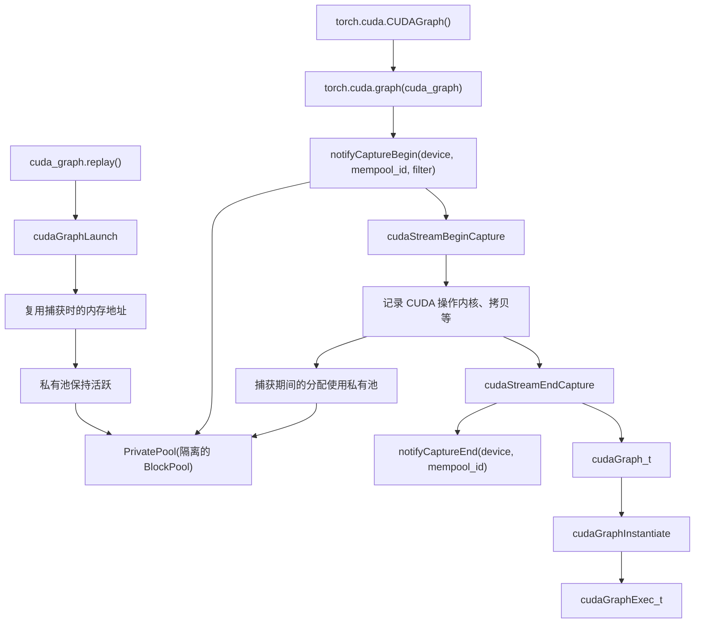
来源： [c10/cuda/CUDACachingAllocator.cpp102-133](https://github.com/pytorch/pytorch/blob/915982a4/c10/cuda/CUDACachingAllocator.cpp#L102-L133) [ATen/cuda/CUDAGraphsUtils.cuh1-50](https://github.com/pytorch/pytorch/blob/915982a4/ATen/cuda/CUDAGraphsUtils.cuh#L1-L50) [torch/cuda/graphs.py124-200](https://github.com/pytorch/pytorch/blob/915982a4/torch/cuda/graphs.py#L124-L200)

## 为何图需要私有内存池 (Why Graphs Need Private Memory Pools)

图捕获需要专门的内存管理，因为捕获的图中存储了记录期间所用张量的原始内存地址。这些地址在图重放时必须保持有效。

### 地址稳定性问题 (The Address Stability Problem)

**不使用私有池的情况（错误）**

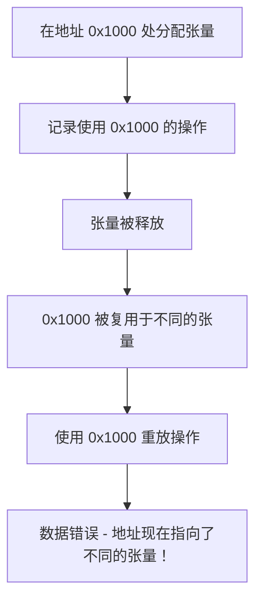
**使用私有池的情况（正确）**

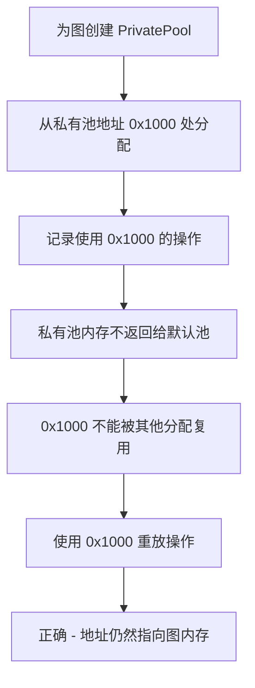
私有池防止默认分配器将图内存地址复用于其他张量，从而确保捕获的地址保持有效。

来源： [c10/cuda/CUDACachingAllocator.cpp102-133](https://github.com/pytorch/pytorch/blob/915982a4/c10/cuda/CUDACachingAllocator.cpp#L102-L133)

### 内存池标识符 (MempoolId\_t) (Memory Pool Identifier (MempoolId_t))

每个图的私有池都由一个 `MempoolId_t` 标识：

```cpp
// MempoolId_t 定义
using MempoolId_t = std::pair<int64_t, int64_t>;
// 第一个元素：CaptureId (每次捕获唯一)
// 第二个元素：备用标识符
```
内存池 ID 将分配操作与特定的图捕获相关联，从而确保隔离。

来源： [c10/cuda/CUDAGraphsC10Utils.h15-25](https://github.com/pytorch/pytorch/blob/915982a4/c10/cuda/CUDAGraphsC10Utils.h#L15-L25) [c10/cuda/CUDACachingAllocator.h49-110](https://github.com/pytorch/pytorch/blob/915982a4/c10/cuda/CUDACachingAllocator.h#L49-L110)

## 私有池实现 (Private Pool Implementation)

`PrivatePool` 结构体管理单个图捕获的内存。每个私有池包含其针对小额和大额分配的 `BlockPool` 实例。

### PrivatePool 结构 (PrivatePool Structure)

**PrivatePool 组件图**

```mermaid
flowchart TD
    PoolId["MempoolId_t id"]
    UseCount["int use_count活跃图的数量"]
    AllocCount["int allocation_count未释放的分配数"]
    Allocator["XPUAllocator* allocator_(可选的自定义分配器)"]
    LargeBlocks["BlockPool large_blocks(尺寸 >= 1MB)"]
    SmallBlocks["BlockPool small_blocks(尺寸 < 1MB)"]
    Blocks["std::set blocks(空闲块, 按大小排序)"]
    Unmapped["std::set unmapped(用于可扩展分段)"]
    IsSmall["bool is_small"]
    OwnerPool["PrivatePool* owner_PrivatePool"]
    BlockDevice["DeviceIndex device"]
    BlockStream["cudaStream_t stream"]
    BlockSize["size_t size"]
    BlockPtr["void* ptr"]
    BlockAllocated["bool allocated"]
    BlockPool["BlockPool* pool"]
    Block["Block"]

    LargeBlocks --> BlockPool
    SmallBlocks --> BlockPool
    Blocks --> Block
    Unmapped --> Block
    IsSmall --> BlockPool
    BlockDevice --> Block
    BlockStream --> Block
    BlockSize --> Block
    BlockPtr --> Block
    BlockAllocated --> Block
    PoolId --> PrivatePool
    UseCount --> PrivatePool
    AllocCount --> PrivatePool
    Allocator --> PrivatePool
    OwnerPool --> PrivatePool
```
**关键字段：**

-   `id`：内存池的唯一标识符 (`MempoolId_t`)
-   `use_count`：当前使用该池的图数量
-   `allocation_count`：来自该池的活跃分配数量
-   `large_blocks` / `small_blocks`：针对不同分配大小的独立池
-   当 `use_count` 和 `allocation_count` 均降为零时，池被释放。

来源： [c10/cuda/CUDACachingAllocator.cpp1045-1086](https://github.com/pytorch/pytorch/blob/915982a4/c10/cuda/CUDACachingAllocator.cpp#L1045-L1086) [c10/xpu/XPUCachingAllocator.cpp365-393](https://github.com/pytorch/pytorch/blob/915982a4/c10/xpu/XPUCachingAllocator.cpp#L365-L393)

### 针对图内存的 BlockPool (BlockPool for Graph Memory)

每个 `PrivatePool` 包含两个 `BlockPool` 实例：

| BlockPool | 尺寸范围 | 用途 |
| --- | --- | --- |
| `small_blocks` | < 1 MB | 小额张量分配，使用 2MB 缓冲区 |
| `large_blocks` | \>= 1 MB | 大额张量分配，独立分段 |

`BlockPool` 维护一个排序后的空闲块集合，实现在图隔离内存内的最佳拟合 (best-fit) 分配。

来源： [c10/cuda/CUDACachingAllocator.cpp164-185](https://github.com/pytorch/pytorch/blob/915982a4/c10/cuda/CUDACachingAllocator.cpp#L164-L185) [c10/xpu/XPUCachingAllocator.cpp28-42](https://github.com/pytorch/pytorch/blob/915982a4/c10/xpu/XPUCachingAllocator.cpp#L28-L42)

## 图捕获生命周期 (Graph Capture Lifecycle)

分配器通过一系列通知回调与 CUDA 图捕获协同工作，这些回调管理私有池的创建和销毁。

### 捕获阶段通知 (Capture Phase Notifications)

**图捕获通知流程图**

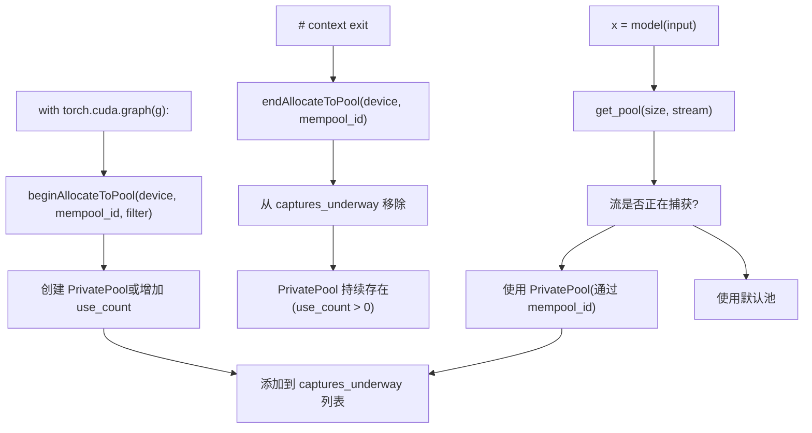
**关键函数：**

-   `beginAllocateToPool(device, mempool_id, filter)`：开始将分配路由到私有池
-   `endAllocateToPool(device, mempool_id)`：停止将新分配路由到该池
-   `releasePool(device, mempool_id)`：减少 `use_count` 并可能释放池

来源： [c10/cuda/CUDACachingAllocator.cpp2605-2667](https://github.com/pytorch/pytorch/blob/915982a4/c10/cuda/CUDACachingAllocator.cpp#L2605-L2667) [c10/cuda/CUDACachingAllocator.h360-370](https://github.com/pytorch/pytorch/blob/915982a4/c10/cuda/CUDACachingAllocator.h#L360-L370)

### 池销毁 (Pool Destruction)

当同时满足以下两个条件时，`PrivatePool` 被销毁：

```cpp
// 销毁准则
if (pool->use_count == 0 && pool->allocation_count == 0) {    
    // 安全删除该池    
    free_pool(pool);
}
```
**引用计数：**

-   `use_count`：使用该池的活跃图捕获数量（在 `beginAllocateToPool` 时增加，在 `releasePool` 时减少）
-   `allocation_count`：来自该池的活跃张量数量（在分配时增加，在释放时减少）

当一个图被销毁时，会调用 `releasePool` 来减少 `use_count`。如果所有分配都已释放 (`allocation_count == 0`)，则销毁该池。

来源： [c10/cuda/CUDACachingAllocator.cpp2715-2775](https://github.com/pytorch/pytorch/blob/915982a4/c10/cuda/CUDACachingAllocator.cpp#L2715-L2775) [c10/xpu/XPUCachingAllocator.cpp365-393](https://github.com/pytorch/pytorch/blob/915982a4/c10/xpu/XPUCachingAllocator.cpp#L365-L393)

## 图捕获期间的分配 (Allocation During Graph Capture)

当一个流正在进行捕获时，该流上的分配会被路由到图的私有池，而非默认池。

### 分配路由逻辑 (Allocation Routing Logic)

**分配池选择图**

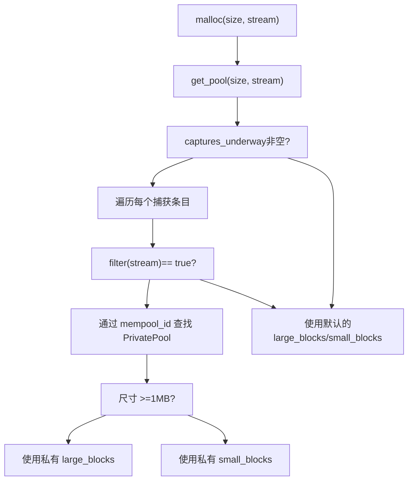
**关键数据结构：**

-   `captures_underway`：`vector<pair<MempoolId_t, function<bool(cudaStream_t)>>>`
-   每个条目将内存池 ID 与流过滤函数配对
-   如果分配操作的流是捕获的一部分，则过滤器返回 `true`

来源： [c10/cuda/CUDACachingAllocator.cpp1566-1618](https://github.com/pytorch/pytorch/blob/915982a4/c10/cuda/CUDACachingAllocator.cpp#L1566-L1618) [c10/xpu/XPUCachingAllocator.cpp670-691](https://github.com/pytorch/pytorch/blob/915982a4/c10/xpu/XPUCachingAllocator.cpp#L670-L691)

### 流过滤函数 (Stream Filter Function)

过滤函数决定哪些流属于某个图捕获：

```cpp
// 典型的单流捕获过滤器
auto filter = [captured_stream](cudaStream_t stream) {    
    return stream == captured_stream;
};
```
这使得分配器能够仅将相关的分配路由到私有池，而其他流继续使用默认池。

来源： [c10/cuda/CUDACachingAllocator.h137-143](https://github.com/pytorch/pytorch/blob/915982a4/c10/cuda/CUDACachingAllocator.h#L137-L143) [c10/cuda/CUDACachingAllocator.cpp2605-2628](https://github.com/pytorch/pytorch/blob/915982a4/c10/cuda/CUDACachingAllocator.cpp#L2605-L2628)

## Python API

PyTorch 为 CUDA 图捕获提供了一个高级 Python API，该 API 自动处理内存池管理。

### 基础图捕获 (Basic Graph Capture)

```python
# 创建一个图对象
g = torch.cuda.CUDAGraph()

# 预热阶段 (建议执行)
s = torch.cuda.Stream()
with torch.cuda.stream(s):    
    for _ in range(3):        
        output = model(input)
s.synchronize()

# 捕获阶段
with torch.cuda.graph(g):    
    output = model(input)

# 重放阶段
g.replay()
```
**捕获上下文管理器：**

-   `torch.cuda.graph(g)` 在当前流上进入捕获模式
-   调用 `beginAllocateToPool` 以创建/使用私有池
-   将所有 CUDA 操作记录进图中
-   在退出上下文时调用 `endAllocateToPool`
-   捕获的图可以通过 `g.replay()` 进行重放

来源： [torch/cuda/graphs.py124-200](https://github.com/pytorch/pytorch/blob/915982a4/torch/cuda/graphs.py#L124-L200) [test/test\_cuda.py4698-4850](https://github.com/pytorch/pytorch/blob/915982a4/test/test_cuda.py#L4698-L4850)

### 图生命周期 (Graph Lifecycle)

**图创建与销毁**

```python
# 图创建
g = torch.cuda.CUDAGraph()  # 图尚未实例化

# 捕获 (实例化图)
with torch.cuda.graph(g):    
    y = x + 1

# 多次重放 (高效)
for _ in range(100):    
    g.replay()

# 清理 (释放私有池)
del g  # 调用 releasePool, 减少 use_count
```
当图对象被删除时，通过 `releasePool` 通知分配器，该函数减少私有池的 `use_count`。如果没有剩余分配 (`allocation_count == 0`)，则释放池。

来源： [torch/cuda/graphs.py278-330](https://github.com/pytorch/pytorch/blob/915982a4/torch/cuda/graphs.py#L278-L330) [c10/cuda/CUDACachingAllocator.cpp2715-2775](https://github.com/pytorch/pytorch/blob/915982a4/c10/cuda/CUDACachingAllocator.cpp#L2715-L2775)

### 图池句柄 (Graph Pool Handle)

对于高级用例，你可以显式管理图内存池：

```python
# 创建图池句柄
graph_pool_handle = torch.cuda.graph_pool_handle()

# 为多个图使用该池
with torch.cuda.graph(g1, pool=graph_pool_handle):    
    y1 = model1(x)

with torch.cuda.graph(g2, pool=graph_pool_handle):    
    y2 = model2(x)

# 两个图共享同一个私有池
```
这允许跨多个图共享池，从而减少内存碎片。

来源： [torch/cuda/graphs.py359-390](https://github.com/pytorch/pytorch/blob/915982a4/torch/cuda/graphs.py#L359-L390) [test/test\_cuda.py4925-4980](https://github.com/pytorch/pytorch/blob/915982a4/test/test_cuda.py#L4925-L4980)

## 流感知内存复用 (Stream-Aware Memory Reuse)

缓存分配器将块复用与 CUDA 流的完成情况绑定。在安全之前，分配在一个流上的块不能被自由地返回到池中并交给不同的流。

### recordStream 机制 (recordStream Mechanism)

当在一个不同于其分配流的流上访问张量时，必须调用 `recordStream(ptr, stream)`。在内部，这执行两件事：

1.  将新流添加到 `Block::stream_uses`（一个 `ska::flat_hash_set<cuda::CUDAStream>`）中。
2.  防止该块被回收，直到所有记录的流都完成了它们的工作。

该检查通过 CUDA 事件实现：当释放块时，在 `stream_uses` 的每个流上记录一个事件。只有在这些事件完成后，块才会进入池。

**stream\_uses 与块复用图**

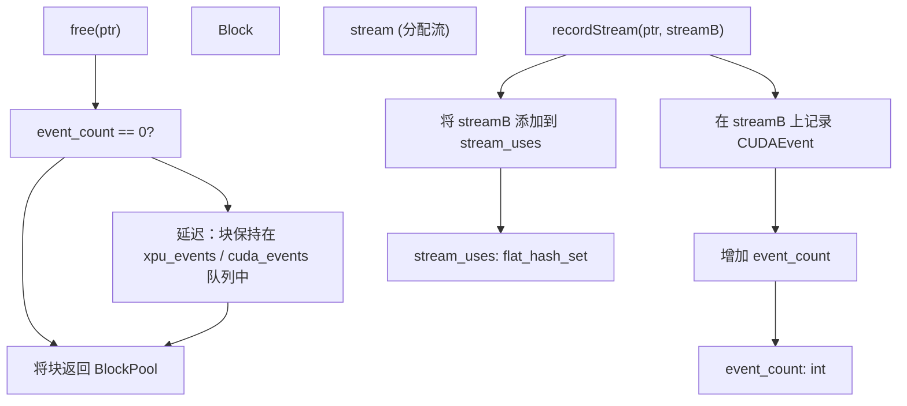
来源： [c10/cuda/CUDACachingAllocator.cpp190-210](https://github.com/pytorch/pytorch/blob/915982a4/c10/cuda/CUDACachingAllocator.cpp#L190-L210) [c10/cuda/CUDACachingAllocator.cpp164-187](https://github.com/pytorch/pytorch/blob/915982a4/c10/cuda/CUDACachingAllocator.cpp#L164-L187)

### 图捕获记录流复用 (Graph Capture Record Stream Reuse)

在图捕获期间，`recordStream` 语义与私有池交互。默认情况下，在捕获期间调用 `recordStream` 是受限的，因为重放的图将始终以相同的流顺序执行。`graph_capture_record_stream_reuse` 配置选项为多流图捕获场景放宽了此限制：

| 设置 | 行为 |
| --- | --- |
| `graph_capture_record_stream_reuse:False` (默认) | 捕获期间的 `recordStream` 是空操作；地址通过结构保证稳定 |
| `graph_capture_record_stream_reuse:True` | 允许捕获期间的 `recordStream`；以额外的事件为代价启用多流图 |

```python
torch.cuda.memory._set_allocator_settings(    
    "graph_capture_record_stream_reuse:True"
)
```
来源： [c10/cuda/CUDAAllocatorConfig.h60-62](https://github.com/pytorch/pytorch/blob/915982a4/c10/cuda/CUDAAllocatorConfig.h#L60-L62) [c10/cuda/CUDAAllocatorConfig.cpp106-109](https://github.com/pytorch/pytorch/blob/915982a4/c10/cuda/CUDAAllocatorConfig.cpp#L106-L109)

## 内存池配置 (Memory Pool Configuration)

可以通过分配器配置选项控制图捕获行为。

### 每进程内存比例 (Per-Process Memory Fraction)

限制图池的内存使用：

```python
# 将图池限制在设备内存的 50%
torch.cuda.set_per_process_memory_fraction(0.5)
```
该设置同时适用于默认池和图私有池。

来源： [c10/cuda/CUDAAllocatorConfig.h64-66](https://github.com/pytorch/pytorch/blob/915982a4/c10/cuda/CUDAAllocatorConfig.h#L64-L66) [test/test\_cuda.py462-500](https://github.com/pytorch/pytorch/blob/915982a4/test/test_cuda.py#L462-L500)

### 池管理 API (Pool Management APIs)

**`CUDAAllocator` 池管理方法**

| 方法 | 目的 |
| --- | --- |
| `beginAllocateToPool(device, mempool_id, filter)` | 开始将分配路由到私有池 |
| `endAllocateToPool(device, mempool_id)` | 停止路由新的分配 |
| `releasePool(device, mempool_id)` | 减少池使用计数 |
| `getPoolUseCount(device, mempool_id)` | 查询使用该池的图数量 |
| `checkPoolLiveAllocations(device, mempool_id, addrs)` | 验证活跃分配 |
| `setNoSplit(device, mempool_id)` | 防止池内块拆分 |
| `setUseOnOOM(device, mempool_id, use_on_oom)` | 在 OOM 时回退到池 |

这些 C++ API 通常由 Python 图捕获上下文管理器调用，不直接暴露给用户。

来源： [c10/cuda/CUDACachingAllocator.h134-189](https://github.com/pytorch/pytorch/blob/915982a4/c10/cuda/CUDACachingAllocator.h#L134-L189) [c10/xpu/XPUCachingAllocator.h62-91](https://github.com/pytorch/pytorch/blob/915982a4/c10/xpu/XPUCachingAllocator.h#L62-L91)

## 图池隔离示例 (Graph Pool Isolation Example)

本示例展示了私有池如何防止地址冲突：

**不使用私有池的场景（损坏）**

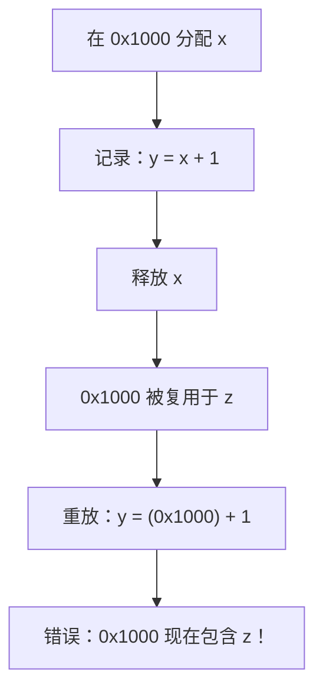
**使用私有池的场景（正确）**

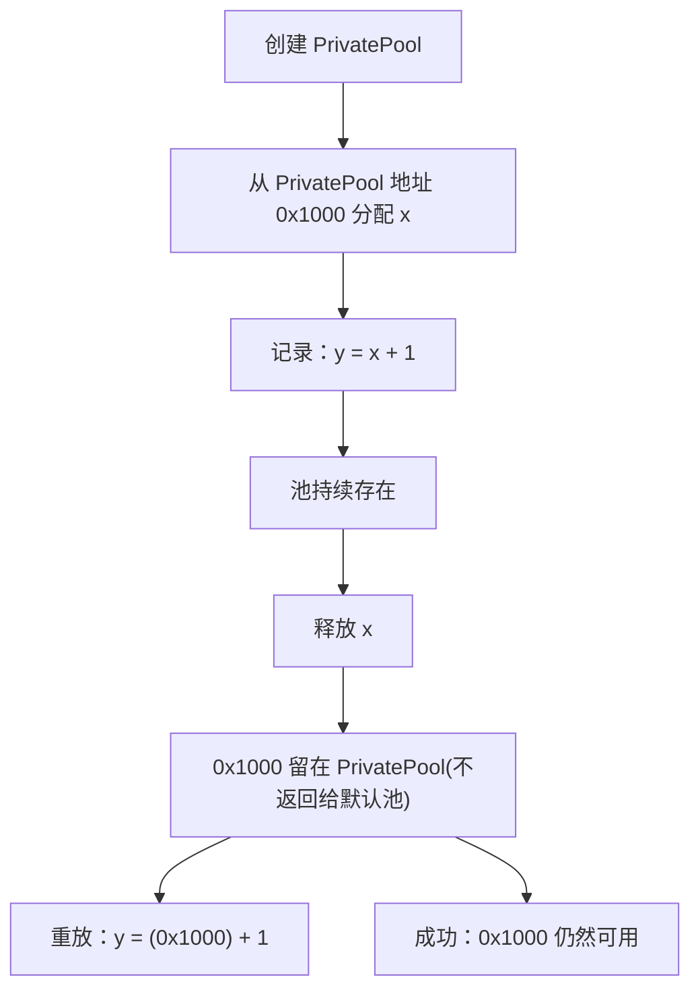
私有池确保了在图创建期间捕获的地址在图重放时仍然有效。

来源： [c10/cuda/CUDACachingAllocator.cpp102-133](https://github.com/pytorch/pytorch/blob/915982a4/c10/cuda/CUDACachingAllocator.cpp#L102-L133)

## CachingHostAllocator (锁页主机内存) (CachingHostAllocator (Pinned Host Memory))

`CachingHostAllocator` 管理锁页 (pinned/page-locked) 主机内存的缓存。快速、异步的 CPU-GPU 通过 DMA 传输需要锁页内存，但通过 `cudaHostAlloc` 分配非常昂贵。该分配器使用类似于设备缓存分配器的流事件机制在传输之间复用内存块。

### 实现结构 (Implementation Structure)

CUDA 特有的实现是 `aten/src/ATen/cuda/CachingHostAllocator.cpp` 中的 `CUDACachingHostAllocatorImpl`，它特化了来自 `aten/src/ATen/core/CachingHostAllocator.h` 的模板基类 `CachingHostAllocatorImpl<CUDAStream, CUDAEventPool::Event>`。

**CachingHostAllocator 类层级结构**

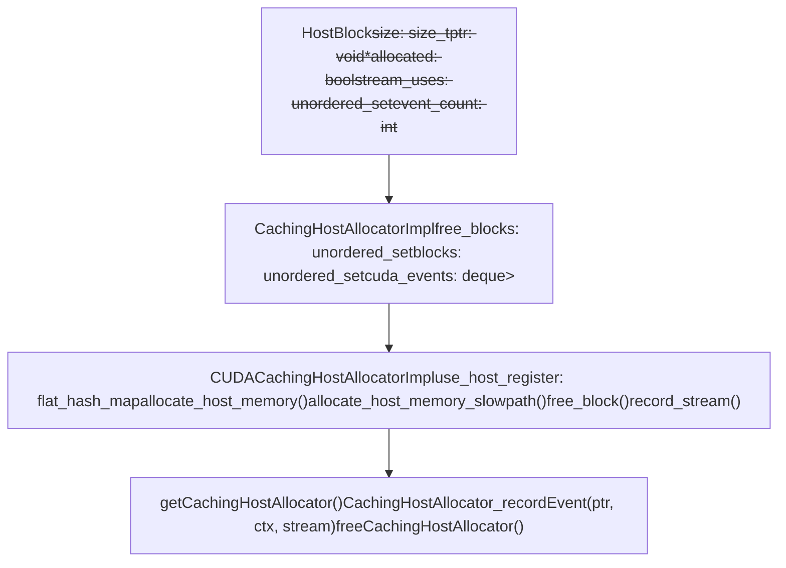
来源： [aten/src/ATen/cuda/CachingHostAllocator.cpp1-60](https://github.com/pytorch/pytorch/blob/915982a4/aten/src/ATen/cuda/CachingHostAllocator.cpp#L1-L60) [aten/src/ATen/core/CachingHostAllocator.h1-100](https://github.com/pytorch/pytorch/blob/915982a4/aten/src/ATen/core/CachingHostAllocator.h#L1-L100)

### 分配模式 (Allocation Modes)

`CUDACachingHostAllocatorImpl` 支持两种获取锁页内存的模式：

| 模式 | 配置键 | 机制 |
| --- | --- | --- |
| 默认 | `pinned_use_cuda_host_register:False` | `cudaHostAlloc` —— 直接分配锁页内存 |
| 注册模式 | `pinned_use_cuda_host_register:True` | `cudaHostRegister` —— 对现有分页内存进行锁页处理 |

注册模式可以使用多个线程并行执行注册，由 `pinned_num_register_threads` 控制（默认 1，最高 128）。

通过 `pinned_reserve_segment_size_mb` 可启用预留分段优化：分配器预先映射一个分段，小额分配从中进行二次分配而无需调用 `cudaHostAlloc`，从而降低重复小额分配的延迟。

来源： [aten/src/ATen/cuda/CachingHostAllocator.cpp20-80](https://github.com/pytorch/pytorch/blob/915982a4/aten/src/ATen/cuda/CachingHostAllocator.cpp#L20-L80) [c10/cuda/CUDAAllocatorConfig.h68-93](https://github.com/pytorch/pytorch/blob/915982a4/c10/cuda/CUDAAllocatorConfig.h#L68-L93)

### 主机内存的流感知复用 (Stream-Aware Reuse for Host Memory)

主机块通过 `HostBlock::stream_uses` 追踪哪些 CUDA 流发出了使用其内存的传输。当释放主机块时：

1.  如果 `stream_uses` 为空，块立即返回 `free_blocks`。
2.  否则，在 `stream_uses` 的每个流上记录一个 `CUDAEvent`。
3.  块进入 `cuda_events` 双端队列，与其事件配对。
4.  在后续分配尝试中，处理已完成的事件：事件已触发的块被移回 `free_blocks`。

这与设备侧的 `Block::stream_uses` 类似，但操作对象是主机（锁页）内存。

**主机块生命周期图**

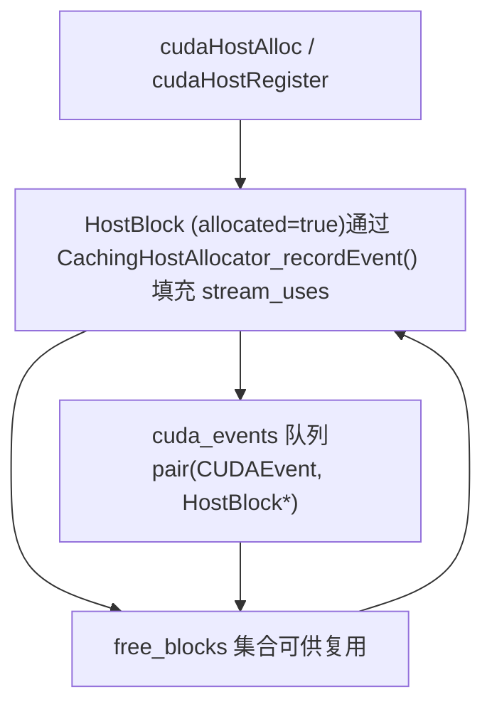
来源： [aten/src/ATen/core/CachingHostAllocator.h100-200](https://github.com/pytorch/pytorch/blob/915982a4/aten/src/ATen/core/CachingHostAllocator.h#L100-L200) [aten/src/ATen/cuda/CachingHostAllocator.cpp80-160](https://github.com/pytorch/pytorch/blob/915982a4/aten/src/ATen/cuda/CachingHostAllocator.cpp#L80-L160)

### Python 可见的主机内存统计 (Python-Visible Host Memory Stats)

主机分配器通过 `torch.cuda.host_memory_stats()` 暴露统计信息。关键计数器：

| 统计键 | 含义 |
| --- | --- |
| `allocated_bytes.current` | 当前已分配的锁页字节数 |
| `allocated_bytes.peak` | 峰值已分配锁页字节数 |
| `num_host_alloc` | 总计 `cudaHostAlloc` 调用次数 |
| `num_host_free` | 总计主机内存释放次数 |
| `active_requests.current` | 活跃的锁页内存分配请求数 |
| `host_alloc_time.count` | 计时的分配操作次数 |

统计信息可以使用 `torch.cuda.reset_peak_host_memory_stats()` 和 `torch.cuda.reset_accumulated_host_memory_stats()` 重置。

来源： [test/test\_cuda.py182-272](https://github.com/pytorch/pytorch/blob/915982a4/test/test_cuda.py#L182-L272) [torch/cuda/memory.py44-64](https://github.com/pytorch/pytorch/blob/915982a4/torch/cuda/memory.py#L44-L64)

## XPU 图支持 (XPU Graph Support)

XPU 后端 (Intel GPU) 也支持具有类似私有池管理的图捕获。

### XPU 私有池结构 (XPU Private Pool Structure)

XPU 使用具有相同生命周期管理的等效 `PrivatePool` 结构：

```cpp
struct PrivatePool {    
    MempoolId_t id;    
    int use_count;    
    int allocation_count;    
    XPUAllocator* allocator_;    
    BlockPool large_blocks;  // size >= 1MB    
    BlockPool small_blocks;  // size < 1MB
};
```
XPU 实现镜像了 CUDA 的设计，但使用 SYCL API 代替 CUDA 运行时 API。

来源： [c10/xpu/XPUCachingAllocator.cpp365-393](https://github.com/pytorch/pytorch/blob/915982a4/c10/xpu/XPUCachingAllocator.cpp#L365-L393)

### XPU 图捕获 (XPU Graph Capture)

XPU 图使用相同的通知回调：

| 回调 | XPU 实现 |
| --- | --- |
| `beginAllocateToPool` | 将分配路由到 XPU 私有池 |
| `endAllocateToPool` | 停止路由到私有池 |
| `releasePool` | 减少 XPU 池使用计数 |

Python API 也是完全一致的：

```python
# XPU 图捕获 (与 CUDA 相同的 API)
g = torch.xpu.XPUGraph()
with torch.xpu.graph(g):    
    output = model(input)
g.replay()
```
来源： [c10/xpu/XPUCachingAllocator.cpp1182-1290](https://github.com/pytorch/pytorch/blob/915982a4/c10/xpu/XPUCachingAllocator.cpp#L1182-L1290) [torch/xpu/graphs.py](https://github.com/pytorch/pytorch/blob/915982a4/torch/xpu/graphs.py)

## 测试与验证 (Testing and Validation)

PyTorch 包含了针对 CUDA BLAS 操作的全面测试：

### 测试类别 (Test Categories)

| 测试套件 | 覆盖范围 | 文件 |
| --- | --- | --- |
| 正确性测试 | 验证跨数据类型和精度的正确性 | [test/test\_matmul\_cuda.py104-277](https://github.com/pytorch/pytorch/blob/915982a4/test/test_matmul_cuda.py#L104-L277) |
| 分组 GEMM | 测试各种布局的分组操作 | [test/test\_matmul\_cuda.py402-577](https://github.com/pytorch/pytorch/blob/915982a4/test/test_matmul_cuda.py#L402-L577) |
| 确定性 | 验证确定性结果 | [test/test\_matmul\_cuda.py358-366](https://github.com/pytorch/pytorch/blob/915982a4/test/test_matmul_cuda.py#L358-L366) |
| 对齐 | 测试 TMA 对齐要求 | [test/test\_matmul\_cuda.py282-298](https://github.com/pytorch/pytorch/blob/915982a4/test/test_matmul_cuda.py#L282-L298) |
| 自动调优 | 测试模板选择与基准测试 | [test/inductor/test\_max\_autotune.py](https://github.com/pytorch/pytorch/blob/915982a4/test/inductor/test_max_autotune.py) |

### 容差设置 (Tolerance Settings)

测试套件使用针对架构特有的容差：

-   **FP32**：`atol=1e-4, rtol=1e-4`
-   **FP16/BF16**：`atol=1e-3, rtol=3e-3`
-   **降低精度 (Reduced precision)**：`atol=2e-3, rtol=2e-3`
-   **MI200 (ROCm)**：针对特定数据类型放宽了容差

来源： [test/test\_matmul\_cuda.py186-277](https://github.com/pytorch/pytorch/blob/915982a4/test/test_matmul_cuda.py#L186-L277) [test/inductor/test\_max\_autotune.py](https://github.com/pytorch/pytorch/blob/915982a4/test/inductor/test_max_autotune.py)
