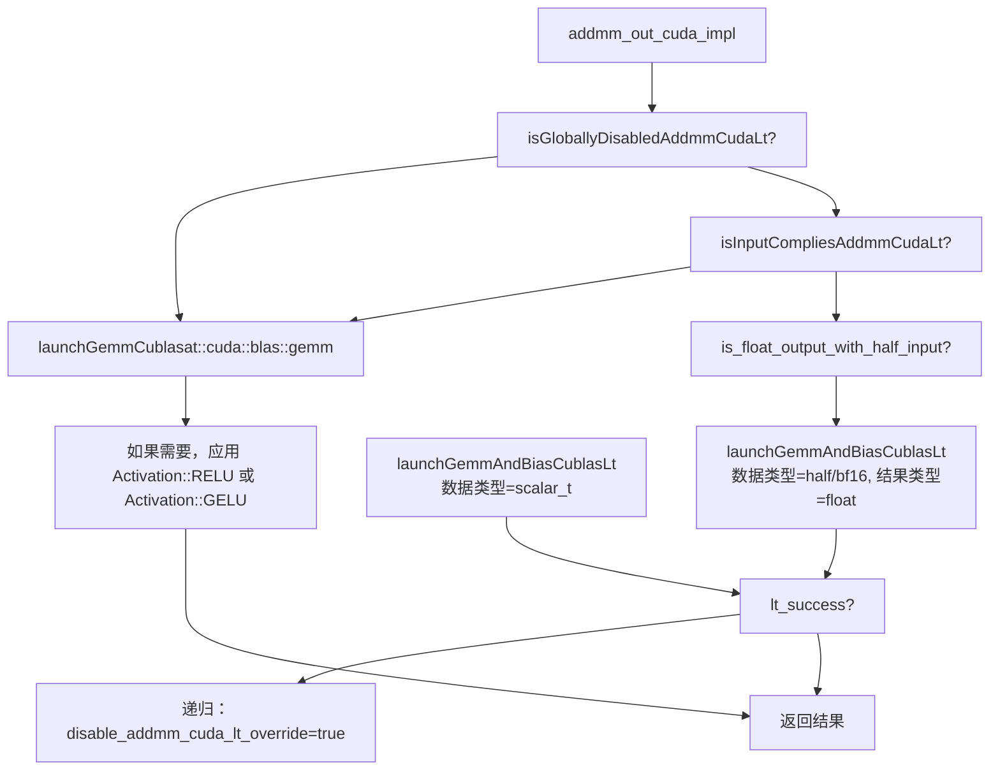
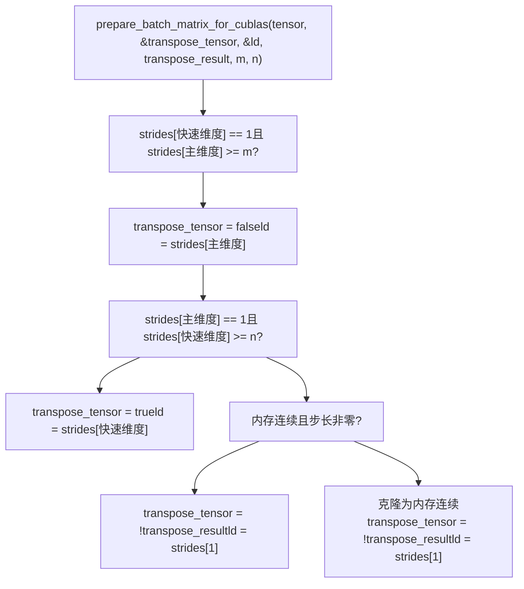
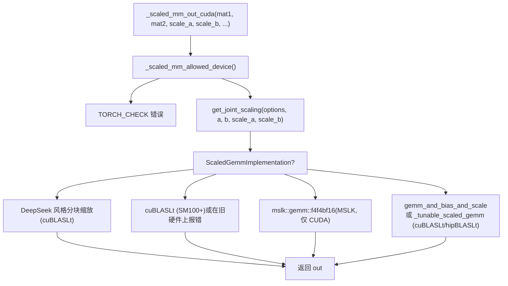
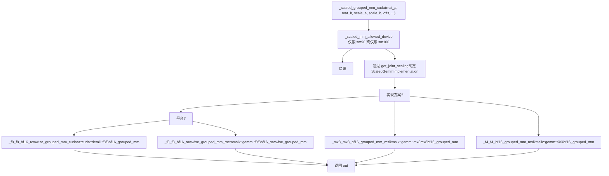

# BLAS 与矩阵乘法操作 (BLAS and Matrix Multiplication Operations)

相关源文件 (Relevant source files)

-   [aten/src/ATen/CMakeLists.txt](https://github.com/pytorch/pytorch/blob/915982a4/aten/src/ATen/CMakeLists.txt)
-   [aten/src/ATen/native/Blas.cpp](https://github.com/pytorch/pytorch/blob/915982a4/aten/src/ATen/native/Blas.cpp)
-   [aten/src/ATen/native/GroupedMMUtils.h](https://github.com/pytorch/pytorch/blob/915982a4/aten/src/ATen/native/GroupedMMUtils.h)
-   [aten/src/ATen/native/ScaledBlasUtils.cpp](https://github.com/pytorch/pytorch/blob/915982a4/aten/src/ATen/native/ScaledBlasUtils.cpp)
-   [aten/src/ATen/native/ScaledBlasUtils.h](https://github.com/pytorch/pytorch/blob/915982a4/aten/src/ATen/native/ScaledBlasUtils.h)
-   [aten/src/ATen/native/cuda/Blas.cpp](https://github.com/pytorch/pytorch/blob/915982a4/aten/src/ATen/native/cuda/Blas.cpp)
-   [aten/src/ATen/native/cuda/GroupedBlas.cpp](https://github.com/pytorch/pytorch/blob/915982a4/aten/src/ATen/native/cuda/GroupedBlas.cpp)
-   [aten/src/ATen/native/cuda/ScaledBlas.cpp](https://github.com/pytorch/pytorch/blob/915982a4/aten/src/ATen/native/cuda/ScaledBlas.cpp)
-   [aten/src/ATen/native/hip/ck\_group\_gemm.h](https://github.com/pytorch/pytorch/blob/915982a4/aten/src/ATen/native/hip/ck_group_gemm.h)
-   [aten/src/ATen/native/hip/ck\_group\_gemm.hip](https://github.com/pytorch/pytorch/blob/915982a4/aten/src/ATen/native/hip/ck_group_gemm.hip)
-   [aten/src/ATen/native/mkldnn/xpu/ScaledBlas.cpp](https://github.com/pytorch/pytorch/blob/915982a4/aten/src/ATen/native/mkldnn/xpu/ScaledBlas.cpp)
-   [aten/src/ATen/test/scalar\_test.cpp](https://github.com/pytorch/pytorch/blob/915982a4/aten/src/ATen/test/scalar_test.cpp)
-   [aten/src/ATen/xpu/XPUScaledBlas.cpp](https://github.com/pytorch/pytorch/blob/915982a4/aten/src/ATen/xpu/XPUScaledBlas.cpp)
-   [aten/src/ATen/xpu/XPUScaledBlas.h](https://github.com/pytorch/pytorch/blob/915982a4/aten/src/ATen/xpu/XPUScaledBlas.h)
-   [test/test\_matmul\_cuda.py](https://github.com/pytorch/pytorch/blob/915982a4/test/test_matmul_cuda.py)
-   [test/test\_scaled\_matmul\_cuda.py](https://github.com/pytorch/pytorch/blob/915982a4/test/test_scaled_matmul_cuda.py)
-   [torch/testing/\_internal/common\_quantized.py](https://github.com/pytorch/pytorch/blob/915982a4/torch/testing/_internal/common_quantized.py)

## 目的与范围 (Purpose and Scope)

本页涵盖了 PyTorch 针对矩阵乘法的 CUDA BLAS 集成。它记录了 `addmm`、`mm`、`baddbmm`、`bmm`、`dot` 和 `vdot` 的 CUDA 实现，在 cuBLAS 和 cuBLASLt 之间的分发逻辑，针对 FP8/MXFP8/NVFP4 精度格式的 `_scaled_mm` 系列操作，以及在专家混合 (Mixture-of-Experts) 层中使用的分组矩阵乘法 (`grouped_mm` 和 `_scaled_grouped_mm`)。

有关 ATen 算子分发如何将调用路由到这些实现的信息，请参阅 [ATen 原生函数系统](/pytorch/pytorch/3.1-aten-native-function-system)。有关在这些 BLAS 调用之上进行的 Inductor 内核选择和自动调优，请参阅[内核选择与自动调优](/pytorch/pytorch/2.5.3-kernel-selection-and-autotuning)。

---

## 操作与文件映射表 (Operation-to-File Map)

| 操作 | CUDA 入口点 | 主要文件 |
| --- | --- | --- |
| `torch.addmm` | `addmm_out_cuda` | `aten/src/ATen/native/cuda/Blas.cpp` |
| `torch.mm` | `mm_out_cuda` | `aten/src/ATen/native/cuda/Blas.cpp` |
| `torch.baddbmm` | `baddbmm_out_cuda` | `aten/src/ATen/native/cuda/Blas.cpp` |
| `torch.bmm` | `bmm_out_cuda` | `aten/src/ATen/native/cuda/Blas.cpp` |
| `torch.dot` | `dot_cuda` | `aten/src/ATen/native/cuda/Blas.cpp` |
| `torch.vdot` | `vdot_cuda` | `aten/src/ATen/native/cuda/Blas.cpp` |
| `torch._scaled_mm` / `F.scaled_mm` | `_scaled_mm_out_cuda` | `aten/src/ATen/native/cuda/ScaledBlas.cpp` |
| `torch._scaled_grouped_mm` / `F.scaled_grouped_mm` | `_scaled_grouped_mm_cuda` | `aten/src/ATen/native/cuda/GroupedBlas.cpp` |
| `torch.nn.functional.grouped_mm` | `grouped_mm_cuda` | `aten/src/ATen/native/cuda/GroupedBlas.cpp` |

---

## 标准 BLAS 操作 (Standard BLAS Operations)

### addmm 与 mm

`addmm` 计算 `out = beta * self + alpha * mat1 @ mat2`。完整的 CUDA 实现是 `addmm_out_cuda_impl` [aten/src/ATen/native/cuda/Blas.cpp343-515](https://github.com/pytorch/pytorch/blob/915982a4/aten/src/ATen/native/cuda/Blas.cpp#L343-L515)

`mm_out_cuda` 使用 `beta=0` 和 `alpha=1` 委派给 `addmm_out_cuda_impl` [aten/src/ATen/native/cuda/Blas.cpp649-652](https://github.com/pytorch/pytorch/blob/915982a4/aten/src/ATen/native/cuda/Blas.cpp#L649-L652)

该实现会在两条执行路径之间做出选择：

1.  **cuBLASLt 路径** (`launchGemmAndBiasCublasLt`)：支持融合偏置尾声 (epilogue) 以及可选的融合激活函数。
2.  **标准 cuBLAS 路径** (`launchGemmCublas`)：直接调用 `cublas*gemm`。

会首先尝试 cuBLASLt 路径。它受 `isGloballyDisabledAddmmCudaLt` 和 `isInputCompliesAddmmCudaLt` 控制 [aten/src/ATen/native/cuda/Blas.cpp116-234](https://github.com/pytorch/pytorch/blob/915982a4/aten/src/ATen/native/cuda/Blas.cpp#L116-L234)

**使用 cuBLASLt 路径的条件**（在 `isInputCompliesAddmmCudaLt` 中检查）：

-   `beta == 1.0`
-   结果是 2 维且内存连续的
-   偏置 (`self`) 是 1 维（或可压缩为 1 维）且与 `mat2` 的列数匹配，或者是带有融合激活函数的 2 维张量
-   `mat2` 的两个维度均 > 1
-   数据类型为 `float32`、`float16` 或 `bfloat16`

如果 cuBLASLt 调用返回失败，则使用 `disable_addmm_cuda_lt_override=true` 进行递归调用以强制走 cuBLAS 路径。

**图表：addmm 分发流程图**

来源： [aten/src/ATen/native/cuda/Blas.cpp116-515](https://github.com/pytorch/pytorch/blob/915982a4/aten/src/ATen/native/cuda/Blas.cpp#L116-L515)

### 激活函数融合 (Activation Fusion)

`_addmm_activation`（由融合线性层使用）通过向 `addmm_out_cuda_impl` 传递 `Activation` 枚举值来融合 GEMM 后的激活函数 [aten/src/ATen/native/cuda/Blas.cpp96-114](https://github.com/pytorch/pytorch/blob/915982a4/aten/src/ATen/native/cuda/Blas.cpp#L96-L114)：

| `Activation` | cuBLASLt 尾声 | 回退方案 |
| --- | --- | --- |
| `Activation::None` | 无 | 无 |
| `Activation::RELU` | `GEMMAndBiasActivationEpilogue::RELU` | `at::relu_()` |
| `Activation::GELU` | `GEMMAndBiasActivationEpilogue::GELU` | `at::gelu_(..., "tanh")` |

来源： [aten/src/ATen/native/cuda/Blas.cpp96-114](https://github.com/pytorch/pytorch/blob/915982a4/aten/src/ATen/native/cuda/Blas.cpp#L96-L114) [aten/src/ATen/native/cuda/Blas.cpp486-513](https://github.com/pytorch/pytorch/blob/915982a4/aten/src/ATen/native/cuda/Blas.cpp#L486-L513)

### baddbmm 与 bmm

`baddbmm_out_cuda_impl` [aten/src/ATen/native/cuda/Blas.cpp517-635](https://github.com/pytorch/pytorch/blob/915982a4/aten/src/ATen/native/cuda/Blas.cpp#L517-L635) 计算批量维度上的 `out = beta * self + alpha * batch1 @ batch2`。关键详情：

-   为 `batch1` 和 `batch2` 分别调用 `prepare_batch_matrix_for_cublas` [aten/src/ATen/native/cuda/Blas.cpp63-92](https://github.com/pytorch/pytorch/blob/915982a4/aten/src/ATen/native/cuda/Blas.cpp#L63-L92) 以解析转置标志位和主维度 (leading dimension)。
-   如果 `num_batches == 1`，为提高效率，使用 `at::cuda::blas::gemm` 代替 `at::cuda::blas::bgemm`。
-   支持通过 `bgemm<scalar_t, float>` 实现从 float16/bfloat16 输入得到 float32 输出。

`bmm_out_cuda` 使用 `beta=0, alpha=1` 调用 `baddbmm_out_cuda_impl` [aten/src/ATen/native/cuda/Blas.cpp661-668](https://github.com/pytorch/pytorch/blob/915982a4/aten/src/ATen/native/cuda/Blas.cpp#L661-L668)

### dot 与 vdot

`dot_cuda` [aten/src/ATen/native/cuda/Blas.cpp706-753](https://github.com/pytorch/pytorch/blob/915982a4/aten/src/ATen/native/cuda/Blas.cpp#L706-L753) 通过 `at::cuda::blas::dot` 计算两个 1 维向量的内积。cuBLAS 句柄被设为 `CUBLAS_POINTER_MODE_DEVICE`，因此标量结果直接写入设备张量，无需主机端往返。

`vdot_cuda` [aten/src/ATen/native/cuda/Blas.cpp755-802](https://github.com/pytorch/pytorch/blob/915982a4/aten/src/ATen/native/cuda/Blas.cpp#L755-L802) 通过 `at::cuda::blas::vdot` 计算复数类型的共轭点积。这两个函数都会重定向共轭输入，以尽可能避免显式的 `.conj()` 拷贝。

---

## 参数准备：`prepare_batch_matrix_for_cublas` (Argument Preparation: prepare_batch_matrix_for_cublas)

在调用任何批量 cuBLAS API 之前，必须分析步长 (stride) 信息，以确定是否需要转置以及主维度是什么。

**图表：prepare\_batch\_matrix\_for\_cublas 逻辑图**

来源： [aten/src/ATen/native/cuda/Blas.cpp63-92](https://github.com/pytorch/pytorch/blob/915982a4/aten/src/ATen/native/cuda/Blas.cpp#L63-L92)

---

## cuBLASLt vs cuBLAS 后端选择 (cuBLASLt vs cuBLAS Backend Selection)

首选的 BLAS 库可以在运行时使用 `torch.backends.cuda.preferred_blas_library()` 控制。

`isGloballyDisabledAddmmCudaLt` [aten/src/ATen/native/cuda/Blas.cpp120-154](https://github.com/pytorch/pytorch/blob/915982a4/aten/src/ATen/native/cuda/Blas.cpp#L120-L154) 决定了 cuBLASLt 是否被全局禁用：

| 条件 | CUDA | ROCm |
| --- | --- | --- |
| `DISABLE_ADDMM_CUDA_LT=1` 环境变量 | 禁用 Lt | 禁用 Lt |
| 架构不在 `getHipblasltSupportedArchs()` 中 | N/A | 禁用 Lt |
| `preferred_blas_library("cublas")` | 无效果 | 禁用 Lt |
| `preferred_blas_library("cublaslt")` | 无效果 | 启用 Lt |

来自测试的 `blas_library_context` 上下文管理器演示了运行时切换模式 [test/test\_matmul\_cuda.py81-87](https://github.com/pytorch/pytorch/blob/915982a4/test/test_matmul_cuda.py#L81-L87)

### 精度标志位 (Precision Flags)

| 标志位 | 效果 |
| --- | --- |
| `torch.backends.cuda.matmul.allow_tf32` | 为 FP32 输入启用 TF32 累加 (Ampere+) |
| `torch.backends.cuda.matmul.allow_bf16_reduced_precision_reduction` | 允许 BF16 中间归约 |
| `torch.backends.cuda.matmul.allow_fp16_reduced_precision_reduction` | 允许 FP16 中间归约 |
| `torch.backends.cuda.matmul.allow_fp16_accumulation` | 使用 FP16 累加乘积（更快，但精度更低） |

来源： [aten/src/ATen/native/cuda/Blas.cpp120-154](https://github.com/pytorch/pytorch/blob/915982a4/aten/src/ATen/native/cuda/Blas.cpp#L120-L154) [test/test\_matmul\_cuda.py106-183](https://github.com/pytorch/pytorch/blob/915982a4/test/test_matmul_cuda.py#L106-L183)

---

## 可调优 GEMM (Tunable GEMM)

当 `at::cuda::tunable::getTuningContext()->IsTunableOpEnabled()` 为 true 时，`launchGemmAndBiasCublasLt` 会委派给 `launchTunableGemmAndBias` [aten/src/ATen/native/cuda/Blas.cpp236-274](https://github.com/pytorch/pytorch/blob/915982a4/aten/src/ATen/native/cuda/Blas.cpp#L236-L274)，而不是直接调用 `gemm_and_bias`。这会通过 `GemmAndBiasTunableOp<scalar_t, BlasOp::T/N, BlasOp::T/N>`（来自 `ATen/cuda/tunable/TunableGemm.h`）进行分发，该算子可以针对每个形状记录并重放最佳内核配置。

类似地，在启用调优的情况下，`ScaledBlas.cpp` 中的 `_tunable_scaled_gemm_rocm` 会通过 `ScaledGemmTunableOp` 路由缩放 GEMM [aten/src/ATen/native/cuda/ScaledBlas.cpp242-340](https://github.com/pytorch/pytorch/blob/915982a4/aten/src/ATen/native/cuda/ScaledBlas.cpp#L242-L340)。

---

## 缩放矩阵乘法 (`_scaled_mm`) (Scaled Matrix Multiplication (_scaled_mm))

`torch._scaled_mm`（也暴露为 `torch.nn.functional.scaled_mm`）是 FP8/低精度 GEMM 原语。它为两个输入提供显式的按张量、按行或按块的缩放张量。

### 设备要求 (Device Requirements)

`_scaled_mm_allowed_device` [aten/src/ATen/native/cuda/ScaledBlas.cpp72-93](https://github.com/pytorch/pytorch/blob/915982a4/aten/src/ATen/native/cuda/ScaledBlas.cpp#L72-L93) 将操作限制在：

-   **CUDA**：SM ≥ 8.9 (Ada Lovelace, Hopper) 或 SM 9.x / 10.x
-   **ROCm**：`gfx942` (MI300), `gfx1200`/`gfx1201` (ROCm ≥ 6.3), `gfx950` (ROCm ≥ 6.5)

### 缩放类型 (Scaling Types)

`ScalingType` 枚举（来自 `ATen/BlasBackend.h`）和 `ScaledBlas.cpp` 中的检测函数对每个缩放张量进行分类：

| `ScalingType` | 数据类型 | 缩放数据类型 | 缩放形状（针对 A） |
| --- | --- | --- | --- |
| `TensorWise` | FP8 | `float32` | 单个数值 |
| `RowWise` | FP8 | `float32` | `(M, 1)` 连续内存 |
| `BlockWise1x128` | FP8 | `float32` | `(M, K/128)` 外层维度主序 |
| `BlockWise128x128` | FP8 | `float32` | `(M/128, K/128)` 内层维度主序 |
| `BlockWise1x32` | FP8 或 FP4 | `float8_e8m0fnu` | `round_up(M,128) * round_up(K/32,4)` 个元素，连续内存 |
| `BlockWise1x16` | FP4 (2 倍打包) | `float8_e4m3fn` | `round_up(M,128) * round_up(K/16,4)` 个元素，连续内存 |

内部使用检测函数如 `is_tensorwise_scaling`、`is_rowwise_scaling`、`is_blockwise_1x32_scaling` [aten/src/ATen/native/cuda/ScaledBlas.cpp127-191](https://github.com/pytorch/pytorch/blob/915982a4/aten/src/ATen/native/cuda/ScaledBlas.cpp#L127-L191)。`get_joint_scaling` [aten/src/ATen/native/cuda/ScaledBlas.cpp213-239](https://github.com/pytorch/pytorch/blob/915982a4/aten/src/ATen/native/cuda/ScaledBlas.cpp#L213-L239) 通过迭代有效组合来解析组合的 (A, B) 缩放模式。

### 实现方案 (Implementations)

`ScaledGemmImplementation` 枚举 [aten/src/ATen/native/ScaledBlasUtils.h14-25](https://github.com/pytorch/pytorch/blob/915982a4/aten/src/ATen/native/ScaledBlasUtils.h#L14-L25) 标识了采用了哪条具体的内核路径：

| 枚举值 | A 类型 | B 类型 | 缩放格式 | 后端 |
| --- | --- | --- | --- | --- |
| `TENSORWISE_TENSORWISE` | FP8 | FP8 | `float32` 单个数值 | cuBLASLt / hipBLASLt |
| `ROWWISE_ROWWISE` | FP8 | FP8 | `float32` 行向量 | cuBLASLt / hipBLASLt |
| `BLOCK_128x128_1x128` | FP8 | FP8 | `float32` 分块 (DeepSeek) | cuBLASLt |
| `BLOCK_1x128_128x128` | FP8 | FP8 | `float32` 分块 (DeepSeek) | cuBLASLt |
| `BLOCK_1x128_1x128` | FP8 | FP8 | `float32` 分块 | cuBLASLt |
| `MXFP8_MXFP8` | FP8 | FP8 | `float8_e8m0fnu` MX | MSLK (CUTLASS) |
| `NVFP4_NVFP4` | FP4 | FP4 | `float8_e4m3fn` + `float32` 全局 | MSLK (CUTLASS) |
| `NVFP4_NVFP4_SINGLE_SCALE` | FP4 | FP4 | `float8_e4m3fn` 仅分块 | MSLK (CUTLASS) |
| `MXFP4_MXFP4` | FP4 | FP4 | `float8_e8m0fnu` MX | MSLK (CUTLASS) |

**图表：\_scaled\_mm 分发 (CUDA)**

来源： [aten/src/ATen/native/cuda/ScaledBlas.cpp72-240](https://github.com/pytorch/pytorch/blob/915982a4/aten/src/ATen/native/cuda/ScaledBlas.cpp#L72-L240) [aten/src/ATen/native/ScaledBlasUtils.h14-25](https://github.com/pytorch/pytorch/blob/915982a4/aten/src/ATen/native/ScaledBlasUtils.h#L14-L25)

---

## 分组矩阵乘法 (Grouped Matrix Multiplication)

分组 GEMM 将多个独立的矩阵乘法作为一个 GPU 操作运行，共享一次内核启动。主要使用场景是 MoE (专家混合) 层，其中令牌被路由到不同的专家权重矩阵。

### 标准 `grouped_mm`

Python API：`torch.nn.functional.grouped_mm`。支持的四种输入配置：

| 模式 | `mat_a` | `mat_b` | `offs` | 输出 |
| --- | --- | --- | --- | --- |
| 2D/2D | `(M, total_K)` | `(N, total_K)` | `(G,)` K-偏移 | `(G, M, N)` |
| 2D/3D | `(total_M, K)` | `(G, N, K)` | `(G,)` M-偏移 | `(total_M, N)` |
| 3D/2D | `(G, M, K)` | `(total_N, K)` | `(G,)` N-偏移 | `(M, total_N)` |
| 3D/3D | `(G, M, K)` | `(G, N, K)` | 无 | `(G, M, N)` |

输入验证发生在 `_grouped_mm_validate_inputs` [aten/src/ATen/native/GroupedMMUtils.h88-112](https://github.com/pytorch/pytorch/blob/915982a4/aten/src/ATen/native/GroupedMMUtils.h#L88-L112)，输出张量创建发生在 `create_grouped_gemm_output_tensor` [aten/src/ATen/native/GroupedMMUtils.h38-86](https://github.com/pytorch/pytorch/blob/915982a4/aten/src/ATen/native/GroupedMMUtils.h#L38-L86)。

`check_valid_strides_and_return_transposed` [aten/src/ATen/native/GroupedMMUtils.h20-36](https://github.com/pytorch/pytorch/blob/915982a4/aten/src/ATen/native/GroupedMMUtils.h#L20-L36) 强制执行 TMA (张量内存加速器) 传输所需的 16 字节步长对齐。它还返回矩阵是否为列主序（转置）。

在 CUDA 上，输出张量使用填充后的步长进行分配 (`round_up(last_dim, 16/element_size)`) 以确保对齐。在 ROCm 上，2D/2D 输出被初始化为零以处理空组。

### ROCm CK 分组 GEMM (ROCm CK Grouped GEMM)

在 ROCm 上，标准分组 GEMM 可以使用**组合内核 (Composable Kernels, CK)**，通过 [aten/src/ATen/native/hip/ck\_group\_gemm.h10-15](https://github.com/pytorch/pytorch/blob/915982a4/aten/src/ATen/native/hip/ck_group_gemm.h#L10-L15) 中声明的 `group_gemm_ck`。分发函数 `launch_grouped_bgemm_ck_impl_dispatch` [aten/src/ATen/native/hip/ck\_group\_gemm.hip49-300](https://github.com/pytorch/pytorch/blob/915982a4/aten/src/ATen/native/hip/ck_group_gemm.hip#L49-L300) 为每个组构建 `GemmDesc` 结构体，并调用带有布局模板分发的 CK 内核类型 `DeviceGroupedGemmMultipleDSplitKXdlCShuffleTwoStage` [aten/src/ATen/native/hip/ck\_group\_gemm.hip34-46](https://github.com/pytorch/pytorch/blob/915982a4/aten/src/ATen/native/hip/ck_group_gemm.hip#L34-L46)。

CK 路径通过 `ROCM_ALLOW_GROUP_GEMM_CK=1` 环境变量选择加入；默认使用的是 hipBLASLt。测试覆盖见 [test/test\_matmul\_cuda.py721-758](https://github.com/pytorch/pytorch/blob/915982a4/test/test_matmul_cuda.py#L721-L758)。

### 缩放分组 GEMM (`_scaled_grouped_mm`) (Scaled Grouped GEMM (_scaled_grouped_mm))

`_scaled_grouped_mm_cuda` [aten/src/ATen/native/cuda/GroupedBlas.cpp418-600](https://github.com/pytorch/pytorch/blob/915982a4/aten/src/ATen/native/cuda/GroupedBlas.cpp#L418-L600) 是 FP8/FP4 分组 GEMM 的入口点。它被限制在 SM 9.0、SM 10.0 或 ROCm MI300+ 硬件上运行。

**图表：缩放分组 GEMM 分发流程**

来源： [aten/src/ATen/native/cuda/GroupedBlas.cpp72-415](https://github.com/pytorch/pytorch/blob/915982a4/aten/src/ATen/native/cuda/GroupedBlas.cpp#L72-L415)

---

## MSLK 库集成 (MSLK Library Integration)

若干缩放 GEMM 路径依赖于 **MSLK**（一个基于 CUTLASS 的第三方内核库）。它通过 `USE_MSLK` CMake 标志位进行条件编译 [aten/src/ATen/CMakeLists.txt358-411](https://github.com/pytorch/pytorch/blob/915982a4/aten/src/ATen/CMakeLists.txt#L358-L411)。

| MSLK 函数 | 操作 | 可用平台 |
| --- | --- | --- |
| `mslk::gemm::mx8mx8bf16_grouped_mm` | MXFP8 × MXFP8 → BF16 分组 GEMM | CUDA (CUTLASS) |
| `mslk::gemm::f4f4bf16_grouped_mm` | FP4 × FP4 → BF16 分组 GEMM (NVFP4 + MXFP4) | CUDA (CUTLASS) |
| `mslk::gemm::f8f8bf16_rowwise_grouped_mm` | FP8 按行缩放分组 GEMM | ROCm (CK) |

**MSLK 的缩放张量布局要求：**

-   **MXFP8**：缩放因子为 `float8_e8m0fnu`，在 CUDA 上使用“分块 (blocked)”重排格式 `SWIZZLE_32_4_4`，在 ROCm 上使用 `NO_SWIZZLE` [aten/src/ATen/native/cuda/GroupedBlas.cpp119-125](https://github.com/pytorch/pytorch/blob/915982a4/aten/src/ATen/native/cuda/GroupedBlas.cpp#L119-L125)。
-   **NVFP4**：两级缩放 —— 每个块的 `float8_e4m3fn` 缩放因子和每个张量的 `float32` 全局缩放因子，它们在内核调用前被合并 [aten/src/ATen/native/cuda/GroupedBlas.cpp264-276](https://github.com/pytorch/pytorch/blob/915982a4/aten/src/ATen/native/cuda/GroupedBlas.cpp#L264-L276)。
-   **MXFP4**：与 MXFP8 布局相同（BlockWise1x32 配合 `float8_e8m0fnu` 缩放因子）。

MSLK 内核选择器被限制在特定的架构上：CUDA Blackwell (`100a`, `103a`, `110a`) 和 ROCm `gfx942`/`gfx950` [aten/src/ATen/CMakeLists.txt366-447](https://github.com/pytorch/pytorch/blob/915982a4/aten/src/ATen/CMakeLists.txt#L366-L447)。

来源： [aten/src/ATen/native/cuda/GroupedBlas.cpp98-300](https://github.com/pytorch/pytorch/blob/915982a4/aten/src/ATen/native/cuda/GroupedBlas.cpp#L98-L300) [aten/src/ATen/CMakeLists.txt358-455](https://github.com/pytorch/pytorch/blob/915982a4/aten/src/ATen/CMakeLists.txt#L358-L455)

---

## 缩放方案验证 (Scaling Recipe Validation)

`ScaledBlasUtils.h` [aten/src/ATen/native/ScaledBlasUtils.h](https://github.com/pytorch/pytorch/blob/915982a4/aten/src/ATen/native/ScaledBlasUtils.h) 及其实现 [aten/src/ATen/native/ScaledBlasUtils.cpp](https://github.com/pytorch/pytorch/blob/915982a4/aten/src/ATen/native/ScaledBlasUtils.cpp) 提供了辅助函数，用于验证张量对及其缩放张量是否符合特定的方案 (recipe)：

| 函数 | 有效组合 |
| --- | --- |
| `check_tensorwise_recipe` | 均为 FP8，两个缩放因子均为 `float32` 标量 |
| `check_rowwise_recipe` | 均为 FP8，两个缩放因子均为 `float32` 行向量 |
| `check_deepseek_recipe` | 均为 FP8，缩放因子为 `float32` 分块方式 (1x128 + 128x128) |
| `check_mxfp8_recipe` | 均为 FP8，两个缩放因子均为 `float8_e8m0fnu` |
| `check_nvfp4_recipe` | 均为 FP4，缩放因子为 `float8_e4m3fn` (分块) + `float32` (全局) |
| `check_nvfp4_recipe_single_scale` | 均为 FP4，缩放因子仅为 `float8_e4m3fn` |

这些函数在 `ScaledBlas.cpp` 和 `GroupedBlas.cpp` 中被调用，以选择 `ScaledGemmImplementation`。

---

## 端到端代码实体映射表 (End-to-End Code Entity Map)

**图表：关键代码实体及其关系图**

```mermaid
flowchart TD
    P1["torch.addmmtorch.mm"]
    P2["torch.baddbmmtorch.bmm"]
    P3["torch.dottorch.vdot"]
    P4["torch._scaled_mmF.scaled_mm"]
    P5["F.grouped_mm"]
    P6["torch._scaled_grouped_mmF.scaled_grouped_mm"]
    C1["addmm_out_cuda_impl"]
    C2["baddbmm_out_cuda_impl"]
    C3["dot_cudavdot_cuda"]
    PREP["prepare_batch_matrix_for_cublascublasCommonArgs"]
    C4["_scaled_mm_out_cudaget_joint_scaling_scaled_mm_allowed_device"]
    C5["grouped_mm_cuda"]
    C6["_scaled_grouped_mm_cuda_f8_f8_bf16_rowwise_grouped_mm_mx8_mx8_bf16_grouped_mm_mslk_f4_f4_bf16_grouped_mm_mslk"]
    B1["at::cuda::blas::gemmat::cuda::blas::bgemm(cuBLAS)"]
    B2["at::cuda::blas::gemm_and_bias(cuBLASLt / hipBLASLt)"]
    B3["mslk::gemm::mx8mx8bf16_grouped_mmmslk::gemm::f4f4bf16_grouped_mm(MSLK / CUTLASS)"]
    B4["group_gemm_ckDeviceGroupedGemmMultipleDSplitKXdlCShuffleTwoStage(ROCm CK)"]

    P1 --> C1
    P2 --> C2
    P3 --> C3
    P4 --> C4
    P5 --> C5
    P6 --> C6
    C1 --> B1
    C1 --> B2
    C1 --> PREP
    C2 --> B1
    C2 --> PREP
    C3 --> B1
    C4 --> B2
    C4 --> B3
    C5 --> B1
    C5 --> B4
    C6 --> B2
    C6 --> B3
```

来源： [aten/src/ATen/native/cuda/Blas.cpp](https://github.com/pytorch/pytorch/blob/915982a4/aten/src/ATen/native/cuda/Blas.cpp) [aten/src/ATen/native/cuda/ScaledBlas.cpp](https://github.com/pytorch/pytorch/blob/915982a4/aten/src/ATen/native/cuda/ScaledBlas.cpp) [aten/src/ATen/native/cuda/GroupedBlas.cpp](https://github.com/pytorch/pytorch/blob/915982a4/aten/src/ATen/native/cuda/GroupedBlas.cpp) [aten/src/ATen/native/hip/ck\_group\_gemm.h](https://github.com/pytorch/pytorch/blob/915982a4/aten/src/ATen/native/hip/ck_group_gemm.h)
