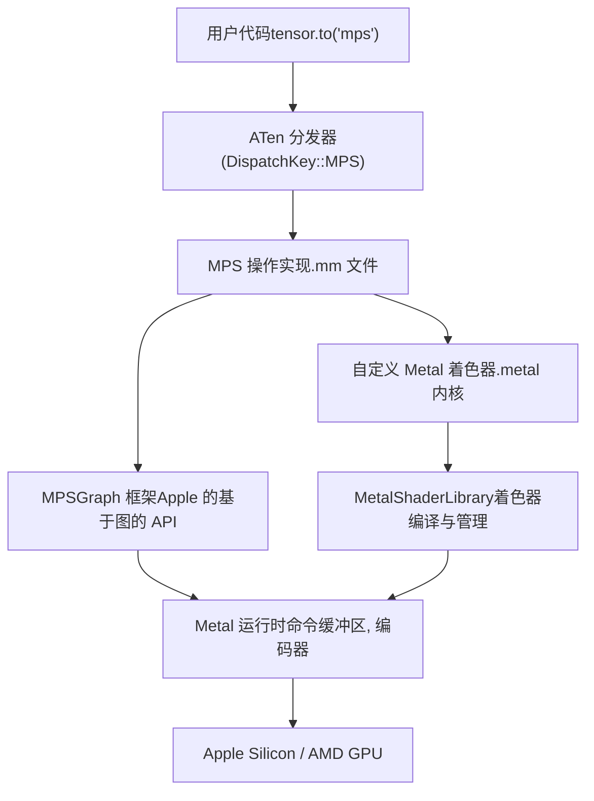

# MPS 后端 (Metal Performance Shaders)

相关源文件 (Relevant source files)

-   [aten/src/ATen/native/cudnn/ConvShared.cpp](https://github.com/pytorch/pytorch/blob/915982a4/aten/src/ATen/native/cudnn/ConvShared.cpp)
-   [aten/src/ATen/native/mps/kernels/CrossKernel.metal](https://github.com/pytorch/pytorch/blob/915982a4/aten/src/ATen/native/mps/kernels/CrossKernel.metal)
-   [aten/src/ATen/native/mps/kernels/Distributions.metal](https://github.com/pytorch/pytorch/blob/915982a4/aten/src/ATen/native/mps/kernels/Distributions.metal)
-   [aten/src/ATen/native/mps/kernels/Indexing.h](https://github.com/pytorch/pytorch/blob/915982a4/aten/src/ATen/native/mps/kernels/Indexing.h)
-   [aten/src/ATen/native/mps/kernels/Indexing.metal](https://github.com/pytorch/pytorch/blob/915982a4/aten/src/ATen/native/mps/kernels/Indexing.metal)
-   [aten/src/ATen/native/mps/kernels/LinearAlgebra.h](https://github.com/pytorch/pytorch/blob/915982a4/aten/src/ATen/native/mps/kernels/LinearAlgebra.h)
-   [aten/src/ATen/native/mps/kernels/LinearAlgebra.metal](https://github.com/pytorch/pytorch/blob/915982a4/aten/src/ATen/native/mps/kernels/LinearAlgebra.metal)
-   [aten/src/ATen/native/mps/operations/CrossKernel.mm](https://github.com/pytorch/pytorch/blob/915982a4/aten/src/ATen/native/mps/operations/CrossKernel.mm)
-   [aten/src/ATen/native/mps/operations/Distributions.mm](https://github.com/pytorch/pytorch/blob/915982a4/aten/src/ATen/native/mps/operations/Distributions.mm)
-   [aten/src/ATen/native/mps/operations/Indexing.mm](https://github.com/pytorch/pytorch/blob/915982a4/aten/src/ATen/native/mps/operations/Indexing.mm)
-   [aten/src/ATen/native/mps/operations/LinearAlgebra.mm](https://github.com/pytorch/pytorch/blob/915982a4/aten/src/ATen/native/mps/operations/LinearAlgebra.mm)
-   [aten/src/ATen/native/mps/operations/Pad.mm](https://github.com/pytorch/pytorch/blob/915982a4/aten/src/ATen/native/mps/operations/Pad.mm)
-   [aten/src/ATen/native/mps/operations/ScanKernel.mm](https://github.com/pytorch/pytorch/blob/915982a4/aten/src/ATen/native/mps/operations/ScanKernel.mm)
-   [aten/src/ATen/native/mps/operations/UpSample.mm](https://github.com/pytorch/pytorch/blob/915982a4/aten/src/ATen/native/mps/operations/UpSample.mm)
-   [aten/src/ATen/native/sparse/mps/SparseMPSTensorMath.mm](https://github.com/pytorch/pytorch/blob/915982a4/aten/src/ATen/native/sparse/mps/SparseMPSTensorMath.mm)
-   [aten/src/ATen/native/sparse/mps/kernels/SparseTensorMath.metal](https://github.com/pytorch/pytorch/blob/915982a4/aten/src/ATen/native/sparse/mps/kernels/SparseTensorMath.metal)
-   [c10/metal/atomic.h](https://github.com/pytorch/pytorch/blob/915982a4/c10/metal/atomic.h)
-   [test/test\_mps.py](https://github.com/pytorch/pytorch/blob/915982a4/test/test_mps.py)
-   [torch/testing/\_internal/common\_mps.py](https://github.com/pytorch/pytorch/blob/915982a4/torch/testing/_internal/common_mps.py)

## 目的与范围 (Purpose and Scope)

MPS (Metal Performance Shaders) 后端使 PyTorch 能够利用 Apple Silicon 和 AMD GPU 在 macOS 上的硬件加速。它集成了 Apple 的 Metal 框架，针对张量操作提供了高度优化的内核。

本页涵盖了 MPS 后端架构、Metal 着色器 (shaders) 的集成，以及针对 Apple 硬件的专门实现。有关底层算子系统，请参阅 [ATen 原生函数系统](/pytorch/pytorch/3.1-aten-native-function-system)。有关详细的操作实现，请参阅 [MPS 操作与 Metal 内核 (MPS Operations and Metal Kernels)](/pytorch/pytorch/3.3.1-mps-operations-and-metal-kernels)。

---

## 架构概览 (Architecture Overview)

MPS 后端充当 PyTorch 的 ATen 库与 Apple 的 Metal 计算框架之间的桥梁。


来源： [aten/src/ATen/native/native\_functions.yaml1-100](https://github.com/pytorch/pytorch/blob/915982a4/aten/src/ATen/native/native_functions.yaml#L1-L100) [aten/src/ATen/native/mps/operations/LinearAlgebra.mm1-50](https://github.com/pytorch/pytorch/blob/915982a4/aten/src/ATen/native/mps/operations/LinearAlgebra.mm#L1-L50)

---

## 关键实现技术 (Key Implementation Technologies)

MPS 后端结合了三种主要技术来执行算子：

### 1. MPSGraph API

对于大多数数学和神经网络操作（卷积、线性层、激活函数），PyTorch 使用 Apple 的 `MPSGraph` 框架。

-   **实现方式**：构建代表操作的 `MPSGraphTensor` 节点。
-   **优点**：利用 Apple 针对特定硬件优化的内核。
-   **示例**：在 `LinearAlgebra.mm` 中的矩阵乘法。

### 2. 自定义 Metal 内核 (.metal)

对于 `MPSGraph` 不支持或效率不高的特殊操作，PyTorch 包含使用 Metal 着色语言编写的自定义内核。

-   **位置**：`aten/src/ATen/native/mps/kernels/`
-   **编译**：在构建时编译进 `.metallib` 归档中。
-   **示例**：`CrossKernel.metal`、`Indexing.metal`、`SparseTensorMath.metal`。

### 3. Metal 运行时集成

后端直接管理 Metal 的执行资源：

-   **命令缓冲区 (Command Buffers)**：通过 `MPSStream` 进行异步执行。
-   **内核缓存**：`MetalShaderLibrary` 缓存已编译的管道状态对象 (PSOs)，以减少启动延迟。

来源： [aten/src/ATen/native/mps/kernels/LinearAlgebra.metal1-100](https://github.com/pytorch/pytorch/blob/915982a4/aten/src/ATen/native/mps/kernels/LinearAlgebra.metal#L1-L100) [aten/src/ATen/native/mps/operations/Indexing.mm1-100](https://github.com/pytorch/pytorch/blob/915982a4/aten/src/ATen/native/mps/operations/Indexing.mm#L1-L100)

---

## 内存管理 (Memory Management)

与 CUDA 不同，MPS 后端不使用复杂的缓存分配器。它依赖于：

-   **Metal 堆/资源**：直接分配 Metal 缓冲区。
-   **MPSAllocator**：一个轻量级的 C++ 包装器，用于管理内存的生命周期并与 ATen 存储集成。
-   **统一内存 (Unified Memory)**：利用 Apple Silicon 的架构，其中 CPU 和 GPU 共享同一个物理内存空间。

来源： [c10/metal/utils.h](https://github.com/pytorch/pytorch/blob/915982a4/c10/metal/utils.h) (引用)

---

## 专门操作实现 (Specialized Operation Implementations)

### 线性代数 (Linear Algebra)

矩阵乘法 (`mm`, `bmm`, `addmm`) 被路由到 `MPSGraph` 的矩阵操作。实现会在分块和线程布局方面进行优化以匹配 Apple GPU 的特性。

### 稀疏张量支持 (Sparse Tensor Support)

MPS 后端包含了针对稀疏格式的专门支持：

-   **SparseCOO**：在 `SparseMPSTensorMath.mm` 中通过自定义 Metal 内核实现。
-   **Softmax**：针对稀疏布局优化的 Softmax 实现。

### 索引与分布 (Indexing and Distributions)

复杂的索引操作（`index_select`、`masked_fill`）和随机数分布使用自定义 Metal 着色器，以获得最大灵活性和性能。

来源： [aten/src/ATen/native/mps/operations/LinearAlgebra.mm1-200](https://github.com/pytorch/pytorch/blob/915982a4/aten/src/ATen/native/mps/operations/LinearAlgebra.mm#L1-L200) [aten/src/ATen/native/sparse/mps/SparseMPSTensorMath.mm1-100](https://github.com/pytorch/pytorch/blob/915982a4/aten/src/ATen/native/sparse/mps/SparseMPSTensorMath.mm#L1-L100)

---

## 测试与验证 (Testing and Validation)

MPS 后端通过 `test/test_mps.py` 和 OpInfo 框架进行测试。

### 核心测试类别：

1.  **正确性 (Consistency)**：将 MPS 输出与 CPU 参考结果进行对比。
2.  **错误处理**：验证边界情况和非法输入。
3.  **性能**：关键路径的基准测试。

```python
# test/test_mps.py 中的典型测试模式
@ops(test_consistency_op_db, allowed_dtypes=(torch.float32,))
def test_consistency_mps(self, device, dtype, op):    
    samples = op.sample_inputs(device, dtype, requires_grad=False)    
    for sample in samples:        
        cpu_result = op(sample.input.cpu(), *sample.args, **sample.kwargs)        
        mps_result = op(sample.input, *sample.args, **sample.kwargs)        
        self.assertEqual(mps_result.cpu(), cpu_result)
```
### MPS 专用工具：

-   `torch.testing._internal.common_mps.py`：提供了 `mps_ops_modifier` 等函数，用于标记 MPS 上的预期失败 (xfails) 和跳过项。

来源： [test/test\_mps.py52-63](https://github.com/pytorch/pytorch/blob/915982a4/test/test_mps.py#L52-L63) [torch/testing/\_internal/common\_mps.py13-20](https://github.com/pytorch/pytorch/blob/915982a4/torch/testing/_internal/common_mps.py#L13-L20)
