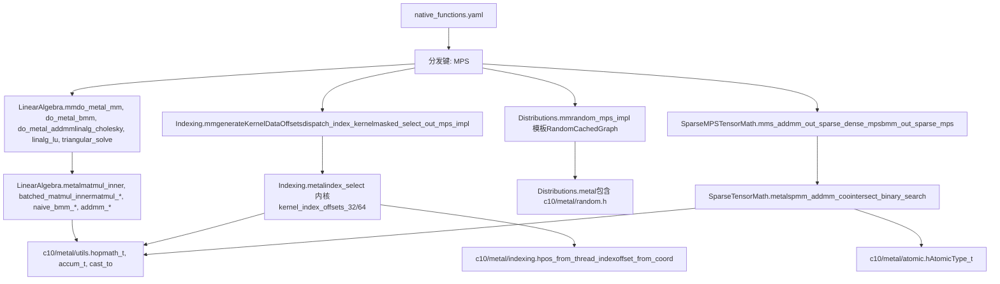
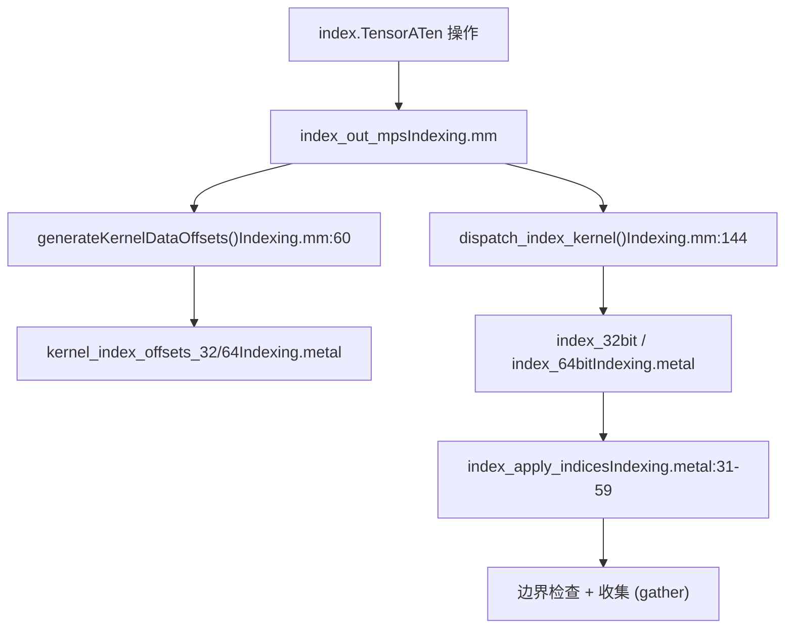
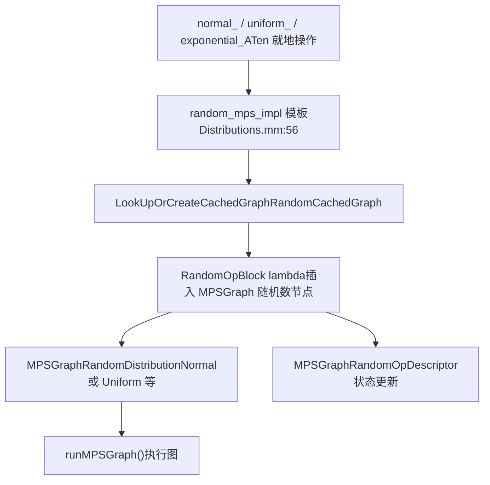
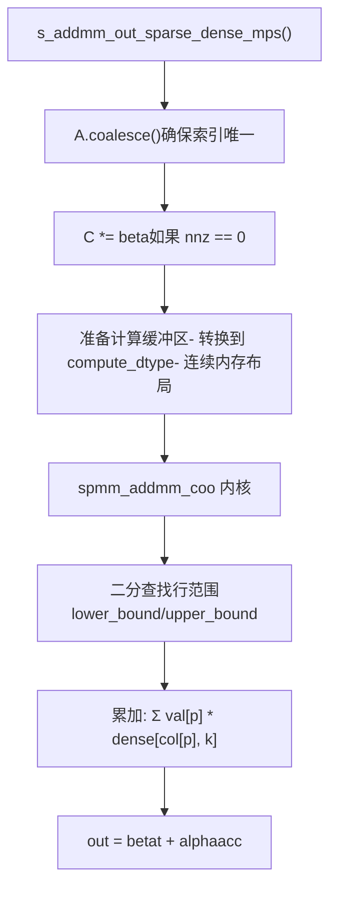
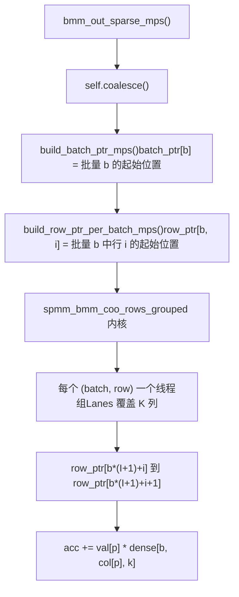
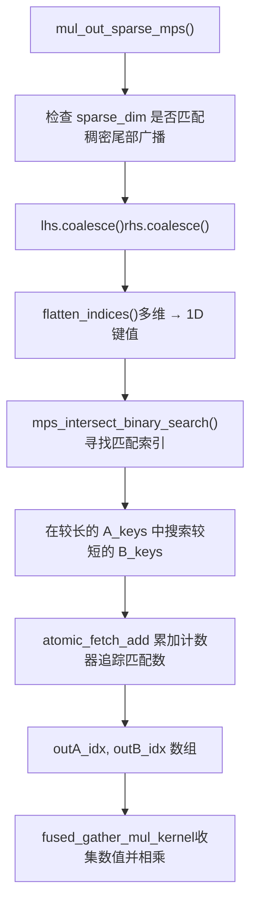
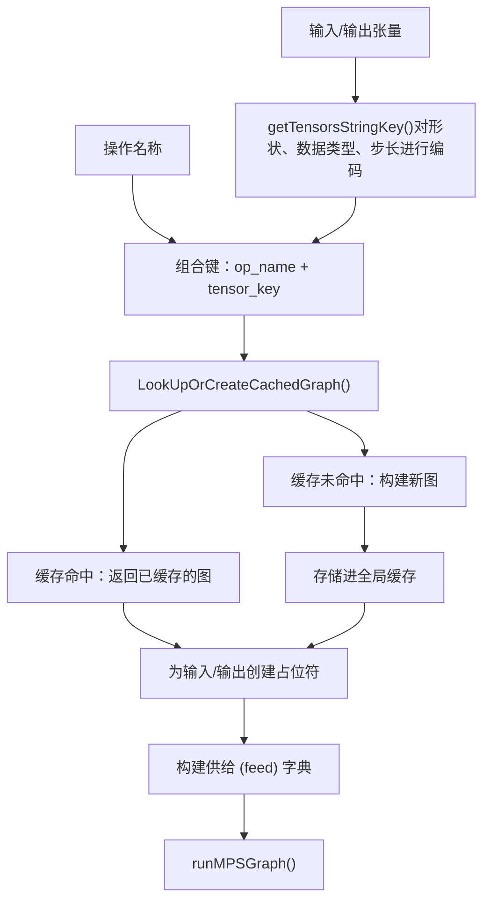

# MPS 操作与 Metal 内核 (MPS Operations and Metal Kernels)

相关源文件 (Relevant source files)

-   [aten/src/ATen/native/cudnn/ConvShared.cpp](https://github.com/pytorch/pytorch/blob/915982a4/aten/src/ATen/native/cudnn/ConvShared.cpp)
-   [aten/src/ATen/native/mkldnn/Conv.cpp](https://github.com/pytorch/pytorch/blob/915982a4/aten/src/ATen/native/mkldnn/Conv.cpp)
-   [aten/src/ATen/native/mkldnn/Linear.cpp](https://github.com/pytorch/pytorch/blob/915982a4/aten/src/ATen/native/mkldnn/Linear.cpp)
-   [aten/src/ATen/native/mkldnn/Matmul.cpp](https://github.com/pytorch/pytorch/blob/915982a4/aten/src/ATen/native/mkldnn/Matmul.cpp)
-   [aten/src/ATen/native/mps/kernels/CrossKernel.metal](https://github.com/pytorch/pytorch/blob/915982a4/aten/src/ATen/native/mps/kernels/CrossKernel.metal)
-   [aten/src/ATen/native/mps/kernels/Distributions.metal](https://github.com/pytorch/pytorch/blob/915982a4/aten/src/ATen/native/mps/kernels/Distributions.metal)
-   [aten/src/ATen/native/mps/kernels/Indexing.h](https://github.com/pytorch/pytorch/blob/915982a4/aten/src/ATen/native/mps/kernels/Indexing.h)
-   [aten/src/ATen/native/mps/kernels/Indexing.metal](https://github.com/pytorch/pytorch/blob/915982a4/aten/src/ATen/native/mps/kernels/Indexing.metal)
-   [aten/src/ATen/native/mps/kernels/LinearAlgebra.h](https://github.com/pytorch/pytorch/blob/915982a4/aten/src/ATen/native/mps/kernels/LinearAlgebra.h)
-   [aten/src/ATen/native/mps/kernels/LinearAlgebra.metal](https://github.com/pytorch/pytorch/blob/915982a4/aten/src/ATen/native/mps/kernels/LinearAlgebra.metal)
-   [aten/src/ATen/native/mps/operations/CrossKernel.mm](https://github.com/pytorch/pytorch/blob/915982a4/aten/src/ATen/native/mps/operations/CrossKernel.mm)
-   [aten/src/ATen/native/mps/operations/Distributions.mm](https://github.com/pytorch/pytorch/blob/915982a4/aten/src/ATen/native/mps/operations/Distributions.mm)
-   [aten/src/ATen/native/mps/operations/Indexing.mm](https://github.com/pytorch/pytorch/blob/915982a4/aten/src/ATen/native/mps/operations/Indexing.mm)
-   [aten/src/ATen/native/mps/operations/LinearAlgebra.mm](https://github.com/pytorch/pytorch/blob/915982a4/aten/src/ATen/native/mps/operations/LinearAlgebra.mm)
-   [aten/src/ATen/native/mps/operations/Pad.mm](https://github.com/pytorch/pytorch/blob/915982a4/aten/src/ATen/native/mps/operations/Pad.mm)
-   [aten/src/ATen/native/mps/operations/ScanKernel.mm](https://github.com/pytorch/pytorch/blob/915982a4/aten/src/ATen/native/mps/operations/ScanKernel.mm)
-   [aten/src/ATen/native/mps/operations/UpSample.mm](https://github.com/pytorch/pytorch/blob/915982a4/aten/src/ATen/native/mps/operations/UpSample.mm)
-   [aten/src/ATen/native/native\_functions.yaml](https://github.com/pytorch/pytorch/blob/915982a4/aten/src/ATen/native/native_functions.yaml)
-   [aten/src/ATen/native/sparse/SoftMax.cpp](https://github.com/pytorch/pytorch/blob/915982a4/aten/src/ATen/native/sparse/SoftMax.cpp)
-   [aten/src/ATen/native/sparse/mps/SparseMPSTensorMath.mm](https://github.com/pytorch/pytorch/blob/915982a4/aten/src/ATen/native/sparse/mps/SparseMPSTensorMath.mm)
-   [aten/src/ATen/native/sparse/mps/kernels/SparseTensorMath.metal](https://github.com/pytorch/pytorch/blob/915982a4/aten/src/ATen/native/sparse/mps/kernels/SparseTensorMath.metal)
-   [c10/metal/atomic.h](https://github.com/pytorch/pytorch/blob/915982a4/c10/metal/atomic.h)
-   [test/distributed/tensor/test\_strategy\_validation.py](https://github.com/pytorch/pytorch/blob/915982a4/test/distributed/tensor/test_strategy_validation.py)
-   [test/nn/test\_dropout.py](https://github.com/pytorch/pytorch/blob/915982a4/test/nn/test_dropout.py)
-   [test/test\_indexing.py](https://github.com/pytorch/pytorch/blob/915982a4/test/test_indexing.py)
-   [test/test\_jiterator.py](https://github.com/pytorch/pytorch/blob/915982a4/test/test_jiterator.py)
-   [test/test\_mps.py](https://github.com/pytorch/pytorch/blob/915982a4/test/test_mps.py)
-   [test/test\_sparse.py](https://github.com/pytorch/pytorch/blob/915982a4/test/test_sparse.py)
-   [torch/csrc/autograd/python\_variable\_indexing.cpp](https://github.com/pytorch/pytorch/blob/915982a4/torch/csrc/autograd/python_variable_indexing.cpp)
-   [torch/distributed/tensor/\_ops/strategy\_validation.py](https://github.com/pytorch/pytorch/blob/915982a4/torch/distributed/tensor/_ops/strategy_validation.py)
-   [torch/testing/\_comparison.py](https://github.com/pytorch/pytorch/blob/915982a4/torch/testing/_comparison.py)
-   [torch/testing/\_internal/common\_methods\_invocations.py](https://github.com/pytorch/pytorch/blob/915982a4/torch/testing/_internal/common_methods_invocations.py)
-   [torch/testing/\_internal/common\_mps.py](https://github.com/pytorch/pytorch/blob/915982a4/torch/testing/_internal/common_mps.py)
-   [torch/testing/\_internal/opinfo/core.py](https://github.com/pytorch/pytorch/blob/915982a4/torch/testing/_internal/opinfo/core.py)
-   [torch/testing/\_internal/opinfo/definitions/\_masked.py](https://github.com/pytorch/pytorch/blob/915982a4/torch/testing/_internal/opinfo/definitions/_masked.py)
-   [torch/testing/\_internal/opinfo/definitions/linalg.py](https://github.com/pytorch/pytorch/blob/915982a4/torch/testing/_internal/opinfo/definitions/linalg.py)
-   [torch/testing/\_internal/opinfo/definitions/special.py](https://github.com/pytorch/pytorch/blob/915982a4/torch/testing/_internal/opinfo/definitions/special.py)

## 目的与范围 (Purpose and Scope)

本文档描述了 Apple Silicon GPU 上的具体 MPS (Metal Performance Shaders) 后端算子实现。它涵盖了线性代数 (LinearAlgebra)、索引 (Indexing)、概率分布 (Distributions) 和填充 (Pad) 操作组，及其 Metal 着色语言 (Metal Shading Language, MSL) 内核的结构，以及稀疏张量实现。

有关 MPS 后端通用架构和设备管理的详情，请参阅第 3.3 页。有关在原生函数系统中进行的算子注册，请参阅第 3.1.1 页。

## 架构概览 (Architecture Overview)

MPS 操作层由三个主要部分组成：

1.  **C++/Objective-C++ 分发层** —— 处理图构建、类型提升、内存管理以及直接的 Metal 内核分发
2.  **Metal 着色语言 (MSL) 内核** —— GPU 计算代码，在运行时加载并在构建时编译进 Metal 库
3.  **算子注册** —— 通过 `native_functions.yaml` 中的 `MPS` 分发键将 ATen 算子连接到 MPS 实现

根据操作的不同，采用两种执行策略：

-   **MPSGraph 路径**：构建一个 `MPSGraph` 计算图（用于概率分布和部分线性代数操作）。图被缓存在 `MPSCachedGraph` 子类中，以张量元数据作为键。
-   **直接 Metal 路径**：从 `MetalShaderLibrary::getBundledLibrary()` 获取管线状态对象 (Pipeline State Object, PSO) 并直接分发线程（用于矩阵乘法、索引和稀疏操作）。

**文件到操作映射图**


来源： [aten/src/ATen/native/mps/operations/LinearAlgebra.mm1-56](https://github.com/pytorch/pytorch/blob/915982a4/aten/src/ATen/native/mps/operations/LinearAlgebra.mm#L1-L56) [aten/src/ATen/native/mps/operations/Indexing.mm1-58](https://github.com/pytorch/pytorch/blob/915982a4/aten/src/ATen/native/mps/operations/Indexing.mm#L1-L58) [aten/src/ATen/native/mps/operations/Distributions.mm1-51](https://github.com/pytorch/pytorch/blob/915982a4/aten/src/ATen/native/mps/operations/Distributions.mm#L1-L51) [aten/src/ATen/native/sparse/mps/SparseMPSTensorMath.mm1-53](https://github.com/pytorch/pytorch/blob/915982a4/aten/src/ATen/native/sparse/mps/SparseMPSTensorMath.mm#L1-L53)

## 线性代数操作 (LinearAlgebra Operations)

### 矩阵乘法 (mm, bmm, addmm)

位于 [aten/src/ATen/native/mps/operations/LinearAlgebra.mm](https://github.com/pytorch/pytorch/blob/915982a4/aten/src/ATen/native/mps/operations/LinearAlgebra.mm) 的矩阵乘法操作绕过了 MPSGraph，通过 `MetalShaderLibrary::getBundledLibrary()` 直接分发到自定义 Metal 内核。这避免了这些性能关键操作的图编译开销。

三个主要的分发函数是：

| 函数 | Metal 内核模式 | 注册的 ATen 操作 |
| --- | --- | --- |
| `do_metal_mm` | `matmul_<dtype>` | `mm_mps` |
| `do_metal_bmm` | `naive_bmm_<dtype>` | `bmm_mps` |
| `do_metal_addmm` | `addmm_<dtype>` (当 `beta=0, alpha=1` 时为 `matmul_`) | `addmm_out_mps` |

当 `beta == 0` 且 `alpha == 1` 时，`do_metal_addmm` 函数会短路到 `do_metal_mm`，从而避免偏置 (bias) 加法过程。

**AlphaBeta 联合体** —— 标量 alpha 和 beta 值被打包进 `union AlphaBeta` ([aten/src/ATen/native/mps/operations/LinearAlgebra.mm58-77](https://github.com/pytorch/pytorch/blob/915982a4/aten/src/ATen/native/mps/operations/LinearAlgebra.mm#L58-L77))，该联合体为 Metal 内核以合适的标量类型（`i64`, `i32`, `f32` 或 `c64`）存储数值。

**线程网格尺寸 (Thread grid sizing)** —— 所有三个内核均使用 `TILE_DIM = 16` 的线程组分块 (threadgroup tile)：

[aten/src/ATen/native/mps/operations/LinearAlgebra.mm97-104](https://github.com/pytorch/pytorch/blob/915982a4/aten/src/ATen/native/mps/operations/LinearAlgebra.mm#L97-L104)

```cpp
gridSizeX = (output.size(1) + TILE_DIM - 1) / TILE_DIM;
gridSizeY = (self.size(0) + TILE_DIM - 1) / TILE_DIM;
threadsPerThreadgroup = MTLSizeMake(16, 16, 1);
```
对于 `do_metal_bmm`，`gridSizeZ = output.size(0)` 使得每个批量元素分发一个 Z 切片。

**mm 分发流程：**

来源： [aten/src/ATen/native/mps/operations/LinearAlgebra.mm79-151](https://github.com/pytorch/pytorch/blob/915982a4/aten/src/ATen/native/mps/operations/LinearAlgebra.mm#L79-L151)

### 分块矩阵乘法内核 (Tiled Matrix Multiply Kernel)

Metal 内核使用带有线程组共享内存的分块算法，以提高内存访问局部性：

[aten/src/ATen/native/mps/kernels/LinearAlgebra.metal11-50](https://github.com/pytorch/pytorch/blob/915982a4/aten/src/ATen/native/mps/kernels/LinearAlgebra.metal#L11-L50)

-   每个 16×16 的线程组将 `A` 的一个块和 `B` 的一个块加载进 `threadgroup T A_tile[16][16]` 和 `B_tile[16][16]`
-   `threadgroup_barrier(mem_flags::mem_threadgroup)` 在内积累加前同步块加载
-   累加使用 `c10::metal::opmath_t<T>`（例如针对 `half` 输入使用 `float`）以保持精度
-   模板实例化涵盖了 `float`, `half`, `bfloat16`, `int32_t`, `int64_t` 和 `complex<float>`

来源： [aten/src/ATen/native/mps/kernels/LinearAlgebra.metal1-50](https://github.com/pytorch/pytorch/blob/915982a4/aten/src/ATen/native/mps/kernels/LinearAlgebra.metal#L1-L50) [aten/src/ATen/native/mps/kernels/LinearAlgebra.h1-10](https://github.com/pytorch/pytorch/blob/915982a4/aten/src/ATen/native/mps/kernels/LinearAlgebra.h#L1-L10)

### 高层线性代数 (Higher-Level Linear Algebra)

除了矩阵乘法，`LinearAlgebra.mm` 还实现了若干使用 MPSGraph API 的分解和求解操作：

| 操作 | 函数 | 备注 |
| --- | --- | --- |
| Cholesky 分解 | `linalg_cholesky_ex_mps` | 使用 `MPSGraphMatrixDecompositionCholesky` |
| LU 分解 | `linalg_lu_factor_ex_mps` | 使用 `MPSGraphMatrixDecompositionLU` |
| 三角矩阵求解 | `linalg_solve_triangular_mps` | 使用 `MPSGraphTriangularSolve` |
| LU 解包 (unpack) | `lu_unpack_mps` | 将 LU 结果分解为 L, U, P |
| QR / Householder | `orgqr_mps` | 通过 MPSGraph 计算 Householder 积 |

来源： [aten/src/ATen/native/mps/operations/LinearAlgebra.mm200-650](https://github.com/pytorch/pytorch/blob/915982a4/aten/src/ATen/native/mps/operations/LinearAlgebra.mm#L200-L650)

## 索引操作 (Indexing Operations)

### 内核数据偏移量 (Kernel Data Offsets)

`generateKernelDataOffsets` 函数 ([aten/src/ATen/native/mps/operations/Indexing.mm60-98](https://github.com/pytorch/pytorch/blob/915982a4/aten/src/ATen/native/mps/operations/Indexing.mm#L60-L98)) 为 `TensorIteratorBase` 预先计算每个线程的字节偏移量。它根据 32 位索引是否足够 (`iter.can_use_32bit_indexing()`) 分发 `kernel_index_offsets_32` 或 `kernel_index_offsets_64` Metal 内核。结果是一个包含 `simd_uint3`（或 `simd_ulong3`）三元组的 `MTLBuffer`，编码了每个线程的 `(output_offset, input_offset, indices_offset)`。

### 索引内核分发 (Index Kernel Dispatch)

`dispatch_index_kernel` ([aten/src/ATen/native/mps/operations/Indexing.mm144-165](https://github.com/pytorch/pytorch/blob/915982a4/aten/src/ATen/native/mps/operations/Indexing.mm#L144-L165)) 验证使用的索引张量不超过 16 个（MPS 索引内核的硬性限制），然后选择一个具名的 Metal 内核。当迭代器无法使用 32 位索引时，它通过 `iter.with_32bit_indexing()` 进行递归拆分。

**索引内核命名约定：**

```
<op>_<bit_size>bit
```
示例：`index_32bit`, `index_put_64bit`

**针对 `index_select` 的 Metal 内核** ([aten/src/ATen/native/mps/kernels/Indexing.metal62-110](https://github.com/pytorch/pytorch/blob/915982a4/aten/src/ATen/native/mps/kernels/Indexing.metal#L62-L110))：每个 GPU 线程从预计算的偏移量缓冲区读取其输出/输入/索引偏移量，应用 `index_apply_indices`（该函数迭代所有带有边界检查的索引数组），并写入收集到的数值。


来源： [aten/src/ATen/native/mps/operations/Indexing.mm60-165](https://github.com/pytorch/pytorch/blob/915982a4/aten/src/ATen/native/mps/operations/Indexing.mm#L60-L165) [aten/src/ATen/native/mps/kernels/Indexing.metal1-110](https://github.com/pytorch/pytorch/blob/915982a4/aten/src/ATen/native/mps/kernels/Indexing.metal#L1-L110)

### IndexAB 结构体与边界检查 (IndexAB Struct and Bounds Checking)

`IndexAB` 结构体 ([aten/src/ATen/native/mps/kernels/Indexing.metal10-12](https://github.com/pytorch/pytorch/blob/915982a4/aten/src/ATen/native/mps/kernels/Indexing.metal#L10-L12)) 持有一个针对单个索引张量的 `constant int64_t* indexArray` 指针。一个 `IndexAB` 数组被传递给内核，每个索引维度一个。`index_apply_indices` 函数遍历所有索引，检查 `idx < -sizes[i] || idx >= sizes[i]`，并通过 `TORCH_REPORT_ERROR` 向 `device ErrorMessages*` 缓冲区报告越界错误。

### 其他索引操作 (Other Indexed Operations)

| 函数 | 实现方式 | 备注 |
| --- | --- | --- |
| `masked_select` | `masked_select_out_mps_impl` → `at::index_out` | 扩展掩码/自身后进行委派 |
| `masked_fill` | 直接的 MPSGraph 节点 | 使用 `MPSGraphSelectWithPredicateTensor` |
| `masked_scatter` | 自定义 Metal 内核 | 对输出位置要求前缀和 (prefix-sum) |
| `nonzero` | `nonzero_mps` | 限制在 `nonZeroMaxSize = 1<<24` 个元素内 |
| `index_put` | `index_put_mps` | 支持累加 (accumulation) 模式 |
| `flip` | `flip_mps` | 沿指定维度反转 |

来源： [aten/src/ATen/native/mps/operations/Indexing.mm121-142](https://github.com/pytorch/pytorch/blob/915982a4/aten/src/ATen/native/mps/operations/Indexing.mm#L121-L142)

## 概率分布 (Distributions)

### RandomCachedGraph 与 MPSGraph 路径

大多数概率分布使用 MPSGraph 路径而非自定义 Metal 内核。`RandomCachedGraph` 结构体 ([aten/src/ATen/native/mps/operations/Distributions.mm40-48](https://github.com/pytorch/pytorch/blob/915982a4/aten/src/ATen/native/mps/operations/Distributions.mm#L40-L48)) 扩展了 `MPSCachedGraph` 并存储了：

-   `stateTensor` —— 针对 RNG 状态的 MPSGraph 张量节点
-   `probTensor`, `resultTensor` —— 用于多项式分布 (multinomial)
-   `meanTensor`, `stdTensor` —— 用于正态分布 (normal)

### `random_mps_impl` 模板

核心分发函数是 `random_mps_impl<scalar_t>` ([aten/src/ATen/native/mps/operations/Distributions.mm56-130](https://github.com/pytorch/pytorch/blob/915982a4/aten/src/ATen/native/mps/operations/Distributions.mm#L56-L130))。它：

1.  处理 5 维以上的重塑 (reshape) 规避方案（MPS 随机数生成对于维度 >4 的张量会出错；分发前张量会被重塑为 4 维）
2.  调用 `LookUpOrCreateCachedGraph<RandomCachedGraph>` 来构建或复用 MPSGraph
3.  传递一个 `RandomOpBlock` lambda，该 lambda 会插入适当的 MPSGraph 随机数节点
4.  通过 `runMPSGraph()` 执行

**分发流程：**


来源： [aten/src/ATen/native/mps/operations/Distributions.mm40-130](https://github.com/pytorch/pytorch/blob/915982a4/aten/src/ATen/native/mps/operations/Distributions.mm#L40-L130)

### 支持的概率分布 (Supported Distributions)

| ATen 操作 | 实现路径 | 备注 |
| --- | --- | --- |
| `uniform_` | `random_mps_impl` + `MPSGraphRandomDistributionUniform` | 标量 `from`/`to` |
| `normal_` | `random_mps_impl` + `MPSGraphRandomDistributionNormal` | 张量或标量 mean/std |
| `exponential_` | `random_mps_impl` + uniform → `-log(u)/lambda` 变换 |  |
| `cauchy_` | `random_mps_impl` + uniform → `median + sigma*tan(pi*(u-0.5))` |  |
| `log_normal_` | `random_mps_impl` + normal → `exp(mean + std*n)` |  |
| `geometric_` | `random_mps_impl` + uniform → `ceil(log(u)/log(1-p))` |  |
| `bernoulli_` | 单独路径，使用 `MPSGraphRandomDistributionUniform` + 比较 |  |
| `multinomial` | 针对概率张量通过 MPSGraph 进行 `topk` |  |
| `randperm` | `randperm_mps` → `randperm_out_mps` 配合 argsort 技巧 |  |

`Distributions.metal` 文件 ([aten/src/ATen/native/mps/kernels/Distributions.metal](https://github.com/pytorch/pytorch/blob/915982a4/aten/src/ATen/native/mps/kernels/Distributions.metal)) 非常简洁 —— 它包含 `c10/metal/random.h` 并定义了一个 `eps` 常量。实际的概率分布计算被表达为 MPSGraph 算术节点，而非自定义 Metal 内核。

来源： [aten/src/ATen/native/mps/operations/Distributions.mm130-380](https://github.com/pytorch/pytorch/blob/915982a4/aten/src/ATen/native/mps/operations/Distributions.mm#L130-L380)

## 共享 Metal 工具 (Shared Metal Utilities)

所有操作组的 Metal 内核共享来自 `c10/metal` 的通用类型工具：

| 工具 | 用途 |
| --- | --- |
| `opmath_t<T>` | 算术提升类型（例如 `half` → `float`） |
| `accum_t<T>` | 归约累加类型 |
| `cast_to<T>(U)` | 安全的标量转换，包含复数 |
| `is_complex_v<T>` | 编译时复数类型检查 |
| `AtomicType_t<T>` | 将类型映射到其对应的 Metal 原子类型 |
| `pos_from_thread_index` | 将扁平的线程索引转换为 N 维位置 |
| `offset_from_coord` | 根据位置和步长计算字节偏移量 |

来源： [c10/metal/atomic.h1-50](https://github.com/pytorch/pytorch/blob/915982a4/c10/metal/atomic.h#L1-L50) [aten/src/ATen/native/mps/kernels/Indexing.metal1-10](https://github.com/pytorch/pytorch/blob/915982a4/aten/src/ATen/native/mps/kernels/Indexing.metal#L1-L10)

## 稀疏张量操作 (Sparse Tensor Operations)

### 稀疏-稠密矩阵乘法 (Sparse-Dense Matrix Multiplication)

MPS 后端为稀疏 COO 张量操作实现了专门的内核：


**关键实现：** [aten/src/ATen/native/sparse/mps/SparseMPSTensorMath.mm55-146](https://github.com/pytorch/pytorch/blob/915982a4/aten/src/ATen/native/sparse/mps/SparseMPSTensorMath.mm#L55-L146)

`spmm_addmm_coo` 内核使用二分查找来高效定位行范围：

[aten/src/ATen/native/sparse/mps/kernels/SparseTensorMath.metal243-282](https://github.com/pytorch/pytorch/blob/915982a4/aten/src/ATen/native/sparse/mps/kernels/SparseTensorMath.metal#L243-L282)

```cpp
kernel void spmm_addmm_coo(    
  device const long*   indices2d,   // [2, nnz] (rows, cols)    
  device const T*      vals,        // [nnz]    
  device const T*      dense,       // [J, K]    
  device const T*      t_in,        // [I, K]    
  device T*            out,         // [I, K]    
  constant uint3&      dims,        // (I, J, K)    
  constant float2&     alpha_beta,    
  constant uint&       nnz) {    
  
  const uint start = lower_bound_i64(rows, 0u, nnz, (long)i);  
  const uint end = upper_bound_i64(rows, 0u, nnz, (long)i);    
  
  auto acc = static_cast<accum_t<T>>(T(0));  
  for (uint p = start; p < end; ++p) {    
    const uint c = (uint)cols[p];    
    acc += mul(vals[p], dense[c * K + k]);  
  }    
  
  out[i * K + k] = static_cast<T>(beta*t_in[i*K+k] + alpha*acc);
}
```
**来源：** [aten/src/ATen/native/sparse/mps/SparseMPSTensorMath.mm55-146](https://github.com/pytorch/pytorch/blob/915982a4/aten/src/ATen/native/sparse/mps/SparseMPSTensorMath.mm#L55-L146) [aten/src/ATen/native/sparse/mps/kernels/SparseTensorMath.metal6-32](https://github.com/pytorch/pytorch/blob/915982a4/aten/src/ATen/native/sparse/mps/kernels/SparseTensorMath.metal#L6-L32) [aten/src/ATen/native/sparse/mps/kernels/SparseTensorMath.metal243-282](https://github.com/pytorch/pytorch/blob/915982a4/aten/src/ATen/native/sparse/mps/kernels/SparseTensorMath.metal#L243-L282)

### 稀疏批量矩阵乘法 (BMM) (Sparse Batch Matrix Multiplication (BMM))

针对批量稀疏 @ 稠密操作，MPS 构建了按批量的行指针：


**批量指针构建：** [aten/src/ATen/native/sparse/mps/SparseMPSTensorMath.mm149-189](https://github.com/pytorch/pytorch/blob/915982a4/aten/src/ATen/native/sparse/mps/SparseMPSTensorMath.mm#L149-L189)

`build_batch_ptr_from_sorted_batches` 内核使用二分查找来寻找批量边界：

[aten/src/ATen/native/sparse/mps/kernels/SparseTensorMath.metal216-241](https://github.com/pytorch/pytorch/blob/915982a4/aten/src/ATen/native/sparse/mps/kernels/SparseTensorMath.metal#L216-L241)

```cpp
kernel void build_batch_ptr_from_sorted_batches(    
  device const long* batches,      // 已排序的批量索引 [nnz]    
  device long*       batch_ptr,    // [B+1] 输出    
  constant uint2&    nnz_B) {    
  
  uint b = tid.x;  
  if (b == batch) {    
    batch_ptr[b] = (long)nnz;  // 哨兵    
    return;  
  }    
  
  // 二分查找批量 b 的第一次出现  
  uint lo = 0, hi = nnz;  
  while (lo < hi) {    
    uint mid = (lo + hi) >> 1;    
    if (batches[mid] < (long)b) lo = mid + 1;    
    else hi = mid;  
  }  
  batch_ptr[b] = (long)lo;
}
```
**来源：** [aten/src/ATen/native/sparse/mps/SparseMPSTensorMath.mm149-189](https://github.com/pytorch/pytorch/blob/915982a4/aten/src/ATen/native/sparse/mps/SparseMPSTensorMath.mm#L149-L189) [aten/src/ATen/native/sparse/mps/SparseMPSTensorMath.mm191-243](https://github.com/pytorch/pytorch/blob/915982a4/aten/src/ATen/native/sparse/mps/SparseMPSTensorMath.mm#L191-L243) [aten/src/ATen/native/sparse/mps/kernels/SparseTensorMath.metal64-100](https://github.com/pytorch/pytorch/blob/915982a4/aten/src/ATen/native/sparse/mps/kernels/SparseTensorMath.metal#L64-L100)

### 稀疏-稀疏逐元素操作 (Sparse-Sparse Element-wise Operations)

两个稀疏张量的逐元素乘法需要进行结构化相交：


**相交内核：** [aten/src/ATen/native/sparse/mps/kernels/SparseTensorMath.metal133-167](https://github.com/pytorch/pytorch/blob/915982a4/aten/src/ATen/native/sparse/mps/kernels/SparseTensorMath.metal#L133-L167)

```cpp
kernel void intersect_binary_search(    
  device const long*  keysA,        // [lenA] 扁平化后的索引    
  device const long*  keysB,        // [lenB] 扁平化后的索引    
  device long*        outA_idx,     // [matches] 输出    
  device long*        outB_idx,     // [matches] 输出    
  device atomic_uint* counter) {    
  
  uint gid = tid_in_grid.x;  
  long key = keysA[gid];    
  
  // 在 B 中进行二分查找  
  uint lo = 0, hi = lenB;  
  while (lo < hi) {    
    uint mid = (lo + hi) >> 1;    
    if (keysB[mid] < key) lo = mid + 1;    
    else hi = mid;  
  }    
  
  if (lo < lenB && keysB[lo] == key) {    
    uint pos = atomic_fetch_add_explicit(counter, 1u, memory_order_relaxed);    
    outA_idx[pos] = (long)gid;    
    outB_idx[pos] = (long)lo;  
  }
}
```
**来源：** [aten/src/ATen/native/sparse/mps/SparseMPSTensorMath.mm460-485](https://github.com/pytorch/pytorch/blob/915982a4/aten/src/ATen/native/sparse/mps/SparseMPSTensorMath.mm#L460-L485) [aten/src/ATen/native/sparse/mps/SparseMPSTensorMath.mm488-657](https://github.com/pytorch/pytorch/blob/915982a4/aten/src/ATen/native/sparse/mps/SparseMPSTensorMath.mm#L488-L657) [aten/src/ATen/native/sparse/mps/kernels/SparseTensorMath.metal133-167](https://github.com/pytorch/pytorch/blob/915982a4/aten/src/ATen/native/sparse/mps/kernels/SparseTensorMath.metal#L133-L167)

## 图缓存与优化 (Graph Caching and Optimization)

### MPSCachedGraph 系统

MPS 操作使用了激进的图缓存策略以避免重新编译：


**缓存数据结构：**

| 类型 | 目的 | 关键组件 |
| --- | --- | --- |
| `MPSCachedGraph` | 基础图缓存 | `graph`, 创建时间戳 |
| `MPSUnaryCachedGraph` | 一元操作 | `inputTensor_`, `outputTensor_` |
| `BinaryOpCachedGraph` | 二元操作 | `primaryTensor`, `secondaryTensor`, `outputTensor_` |

**来源：** [aten/src/ATen/native/mps/operations/UnaryOps.mm63-110](https://github.com/pytorch/pytorch/blob/915982a4/aten/src/ATen/native/mps/operations/UnaryOps.mm#L63-L110) [aten/src/ATen/native/mps/operations/BinaryOps.mm37-105](https://github.com/pytorch/pytorch/blob/915982a4/aten/src/ATen/native/mps/operations/BinaryOps.mm#L37-L105)

### 特殊处理 (Special Handling)

**非连续张量 (Non-contiguous tensors)：**

-   macOS 15.0 之前：通过 `mps_copy_()` 创建连续副本 [aten/src/ATen/native/mps/operations/UnaryOps.mm86-92](https://github.com/pytorch/pytorch/blob/915982a4/aten/src/ATen/native/mps/operations/UnaryOps.mm#L86-L92)
-   macOS 15.0+：支持直接进行收集 (gather) / 分散 (scatter)

**视图张量 (View tensors)：**

-   检测输出是否为视图并产生别名问题
-   分配临时输出，然后拷贝回去 [aten/src/ATen/native/mps/operations/BinaryOps.mm68-75](https://github.com/pytorch/pytorch/blob/915982a4/aten/src/ATen/native/mps/operations/BinaryOps.mm#L68-L75)

**来源：** [aten/src/ATen/native/mps/operations/UnaryOps.mm63-110](https://github.com/pytorch/pytorch/blob/915982a4/aten/src/ATen/native/mps/operations/UnaryOps.mm#L63-L110) [aten/src/ATen/native/mps/operations/BinaryOps.mm47-105](https://github.com/pytorch/pytorch/blob/915982a4/aten/src/ATen/native/mps/operations/BinaryOps.mm#L47-L105)

## 算子覆盖面 (Operator Coverage)

### 已注册操作 (Registered Operations)

**一元操作：** [aten/src/ATen/native/mps/operations/UnaryKernel.mm54-86](https://github.com/pytorch/pytorch/blob/915982a4/aten/src/ATen/native/mps/operations/UnaryKernel.mm#L54-L86)

| 操作 | Metal 函子 (Functor) | 分发存根 (Dispatch Stub) |
| --- | --- | --- |
| `exp`, `expm1` | `exp_functor`, `expm1_functor` | `exp_stub`, `expm1_stub` |
| `sin`, `cos`, `tan` | `sin_functor`, `cos_functor`, `tan_functor` | `sin_stub`, `cos_stub`, `tan_stub` |
| `sinh`, `cosh`, `tanh` | `sinh_functor`, `cosh_functor`, `tanh_functor` | `sinh_stub`, `cosh_stub`, `tanh_stub` |
| `asin`, `acos`, `atan` | `asin_functor`, `acos_functor`, `atan_functor` | `asin_stub`, `acos_stub`, `atan_stub` |
| `log`, `log1p`, `log2`, `log10` | `log_functor`, `log1p_functor` 等 | `log_stub` 等 |
| `sqrt`, `rsqrt`, `reciprocal` | `sqrt_functor`, `rsqrt_functor` 等 | `sqrt_stub` 等 |
| `abs`, `neg`, `angle` | `abs_functor`, `neg_functor`, `angle_functor` | `abs_stub`, `neg_stub`, `angle_stub` |
| `erf`, `erfc`, `erfinv` | 在 `special_math.h` 中实现 | `erf_stub`, `erfc_stub`, `erfinv_stub` |
| `sigmoid` | `sigmoid_functor` | `sigmoid_stub` |

**二元操作：** [aten/src/ATen/native/mps/operations/BinaryKernel.mm235-269](https://github.com/pytorch/pytorch/blob/915982a4/aten/src/ATen/native/mps/operations/BinaryKernel.mm#L235-L269)

| 操作 | Metal 函子 (Functor) | 分发存根 (Dispatch Stub) |
| --- | --- | --- |
| `mul`, `div_true`, `div_floor`, `div_trunc` | `mul_functor`, `div_*_functor` | `mul_stub`, `div_*_stub` |
| `fmax`, `fmin`, `maximum`, `minimum` | `fmax_functor` 等 | `fmax_stub` 等 |
| `atan2`, `copysign`, `hypot` | `atan2_functor` 等 | `atan2_stub` 等 |
| `remainder`, `fmod` | `remainder_functor`, `fmod_functor` | `remainder_stub`, `fmod_stub` |
| `nextafter` | `nextafter_functor` | `nextafter_stub` |
| `logaddexp`, `logaddexp2` | `logaddexp_functor` 等 | `logaddexp_stub` 等 |
| `igamma`, `igammac` | 正则化不完全伽马函数 | `igamma_stub`, `igammac_stub` |
| `polar`, `complex` | 复数构造 | `polar_stub`, `complex_stub` |
| 切比雪夫多项式 | `chebyshev_polynomial_*_functor` | 多个分发存根 |

**来源：** [aten/src/ATen/native/mps/operations/UnaryKernel.mm54-86](https://github.com/pytorch/pytorch/blob/915982a4/aten/src/ATen/native/mps/operations/UnaryKernel.mm#L54-L86) [aten/src/ATen/native/mps/operations/BinaryKernel.mm235-269](https://github.com/pytorch/pytorch/blob/915982a4/aten/src/ATen/native/mps/operations/BinaryKernel.mm#L235-L269)

### 原生函数分发 (Native Functions Dispatch)

操作通过 `native_functions.yaml` 注册：

[aten/src/ATen/native/native\_functions.yaml286-294](https://github.com/pytorch/pytorch/blob/915982a4/aten/src/ATen/native/native_functions.yaml#L286-L294)

```yaml
- func: native_dropout(Tensor input, float p, bool? train) -> (Tensor, Tensor)  
  variants: function  
  dispatch:    
    CPU: native_dropout_cpu    
    CUDA: native_dropout_cuda    
    MPS: native_dropout_mps    
    NestedTensorCPU, NestedTensorHPU, NestedTensorCUDA: native_dropout_nested  
  tags: [nondeterministic_seeded, core]
```
**来源：** [aten/src/ATen/native/native\_functions.yaml286-294](https://github.com/pytorch/pytorch/blob/915982a4/aten/src/ATen/native/native_functions.yaml#L286-L294) [aten/src/ATen/native/native\_functions.yaml340-365](https://github.com/pytorch/pytorch/blob/915982a4/aten/src/ATen/native/native_functions.yaml#L340-L365)
