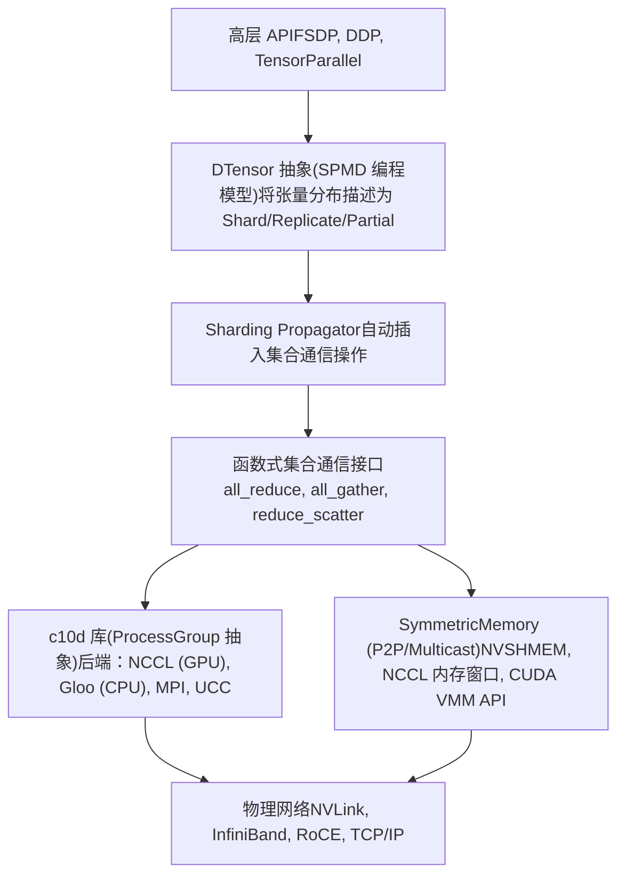

# 分布式训练系统 (Distributed Training Systems)

相关源文件 (Relevant source files)

-   [build\_variables.bzl](https://github.com/pytorch/pytorch/blob/915982a4/build_variables.bzl)
-   [caffe2/CMakeLists.txt](https://github.com/pytorch/pytorch/blob/915982a4/caffe2/CMakeLists.txt)
-   [docs/source/distributed.md](https://github.com/pytorch/pytorch/blob/915982a4/docs/source/distributed.md)
-   [test/distributed/\_pycute/test\_coalesce.py](https://github.com/pytorch/pytorch/blob/915982a4/test/distributed/_pycute/test_coalesce.py)
-   [test/distributed/\_pycute/test\_complement.py](https://github.com/pytorch/pytorch/blob/915982a4/test/distributed/_pycute/test_complement.py)
-   [test/distributed/\_pycute/test\_composition.py](https://github.com/pytorch/pytorch/blob/915982a4/test/distributed/_pycute/test_composition.py)
-   [test/distributed/\_pycute/test\_int\_tuple.py](https://github.com/pytorch/pytorch/blob/915982a4/test/distributed/_pycute/test_int_tuple.py)
-   [test/distributed/\_pycute/test\_left\_inverse.py](https://github.com/pytorch/pytorch/blob/915982a4/test/distributed/_pycute/test_left_inverse.py)
-   [test/distributed/\_pycute/test\_right\_inverse.py](https://github.com/pytorch/pytorch/blob/915982a4/test/distributed/_pycute/test_right_inverse.py)
-   [test/distributed/\_pycute/test\_typing.py](https://github.com/pytorch/pytorch/blob/915982a4/test/distributed/_pycute/test_typing.py)
-   [test/distributed/tensor/debug/test\_debug\_mode.py](https://github.com/pytorch/pytorch/blob/915982a4/test/distributed/tensor/debug/test_debug_mode.py)
-   [test/distributed/tensor/experimental/test\_register\_sharding.py](https://github.com/pytorch/pytorch/blob/915982a4/test/distributed/tensor/experimental/test_register_sharding.py)
-   [test/distributed/tensor/test\_decompositions.py](https://github.com/pytorch/pytorch/blob/915982a4/test/distributed/tensor/test_decompositions.py)
-   [test/distributed/tensor/test\_dtensor.py](https://github.com/pytorch/pytorch/blob/915982a4/test/distributed/tensor/test_dtensor.py)
-   [test/distributed/tensor/test\_dtensor\_compile.py](https://github.com/pytorch/pytorch/blob/915982a4/test/distributed/tensor/test_dtensor_compile.py)
-   [test/distributed/tensor/test\_dtensor\_dispatch\_overhead.py](https://github.com/pytorch/pytorch/blob/915982a4/test/distributed/tensor/test_dtensor_dispatch_overhead.py)
-   [test/distributed/tensor/test\_dtensor\_ops.py](https://github.com/pytorch/pytorch/blob/915982a4/test/distributed/tensor/test_dtensor_ops.py)
-   [test/distributed/tensor/test\_math\_ops.py](https://github.com/pytorch/pytorch/blob/915982a4/test/distributed/tensor/test_math_ops.py)
-   [test/distributed/tensor/test\_matrix\_ops.py](https://github.com/pytorch/pytorch/blob/915982a4/test/distributed/tensor/test_matrix_ops.py)
-   [test/distributed/tensor/test\_op\_strategy.py](https://github.com/pytorch/pytorch/blob/915982a4/test/distributed/tensor/test_op_strategy.py)
-   [test/distributed/tensor/test\_placement\_types.py](https://github.com/pytorch/pytorch/blob/915982a4/test/distributed/tensor/test_placement_types.py)
-   [test/distributed/tensor/test\_pointwise\_ops.py](https://github.com/pytorch/pytorch/blob/915982a4/test/distributed/tensor/test_pointwise_ops.py)
-   [test/distributed/tensor/test\_redistribute.py](https://github.com/pytorch/pytorch/blob/915982a4/test/distributed/tensor/test_redistribute.py)
-   [test/distributed/tensor/test\_single\_dim\_strategy.py](https://github.com/pytorch/pytorch/blob/915982a4/test/distributed/tensor/test_single_dim_strategy.py)
-   [test/distributed/tensor/test\_tensor\_ops.py](https://github.com/pytorch/pytorch/blob/915982a4/test/distributed/tensor/test_tensor_ops.py)
-   [test/distributed/tensor/test\_utils.py](https://github.com/pytorch/pytorch/blob/915982a4/test/distributed/tensor/test_utils.py)
-   [test/distributed/tensor/test\_view\_ops.py](https://github.com/pytorch/pytorch/blob/915982a4/test/distributed/tensor/test_view_ops.py)
-   [test/distributed/test\_c10d\_nccl.py](https://github.com/pytorch/pytorch/blob/915982a4/test/distributed/test_c10d_nccl.py)
-   [test/distributed/test\_device\_mesh.py](https://github.com/pytorch/pytorch/blob/915982a4/test/distributed/test_device_mesh.py)
-   [test/distributed/test\_nccl.py](https://github.com/pytorch/pytorch/blob/915982a4/test/distributed/test_nccl.py)
-   [test/distributed/test\_nvshmem.py](https://github.com/pytorch/pytorch/blob/915982a4/test/distributed/test_nvshmem.py)
-   [test/dynamo/test\_aot\_autograd\_cache.py](https://github.com/pytorch/pytorch/blob/915982a4/test/dynamo/test_aot_autograd_cache.py)
-   [test/jit/test\_autodiff\_subgraph\_slicing.py](https://github.com/pytorch/pytorch/blob/915982a4/test/jit/test_autodiff_subgraph_slicing.py)
-   [test/test\_jit.py](https://github.com/pytorch/pytorch/blob/915982a4/test/test_jit.py)
-   [test/test\_jit\_autocast.py](https://github.com/pytorch/pytorch/blob/915982a4/test/test_jit_autocast.py)
-   [test/test\_jit\_fuser.py](https://github.com/pytorch/pytorch/blob/915982a4/test/test_jit_fuser.py)
-   [test/test\_jit\_fuser\_legacy.py](https://github.com/pytorch/pytorch/blob/915982a4/test/test_jit_fuser_legacy.py)
-   [test/test\_jit\_fuser\_te.py](https://github.com/pytorch/pytorch/blob/915982a4/test/test_jit_fuser_te.py)
-   [test/test\_jit\_legacy.py](https://github.com/pytorch/pytorch/blob/915982a4/test/test_jit_legacy.py)
-   [torch/\_C/\_distributed.pyi](https://github.com/pytorch/pytorch/blob/915982a4/torch/_C/_distributed.pyi)
-   [torch/\_C/\_distributed\_c10d.pyi](https://github.com/pytorch/pytorch/blob/915982a4/torch/_C/_distributed_c10d.pyi)
-   [torch/\_dynamo/backends/debugging.py](https://github.com/pytorch/pytorch/blob/915982a4/torch/_dynamo/backends/debugging.py)
-   [torch/\_dynamo/backends/distributed.py](https://github.com/pytorch/pytorch/blob/915982a4/torch/_dynamo/backends/distributed.py)
-   [torch/\_dynamo/variables/distributed.py](https://github.com/pytorch/pytorch/blob/915982a4/torch/_dynamo/variables/distributed.py)
-   [torch/\_functorch/\_aot\_autograd/autograd\_cache.py](https://github.com/pytorch/pytorch/blob/915982a4/torch/_functorch/_aot_autograd/autograd_cache.py)
-   [torch/\_inductor/runtime/benchmarking.py](https://github.com/pytorch/pytorch/blob/915982a4/torch/_inductor/runtime/benchmarking.py)
-   [torch/\_library/triton.py](https://github.com/pytorch/pytorch/blob/915982a4/torch/_library/triton.py)
-   [torch/\_meta\_registrations.py](https://github.com/pytorch/pytorch/blob/915982a4/torch/_meta_registrations.py)
-   [torch/csrc/distributed/Placement.h](https://github.com/pytorch/pytorch/blob/915982a4/torch/csrc/distributed/Placement.h)
-   [torch/csrc/distributed/c10d/Backend.hpp](https://github.com/pytorch/pytorch/blob/915982a4/torch/csrc/distributed/c10d/Backend.hpp)
-   [torch/csrc/distributed/c10d/NCCLUtils.cpp](https://github.com/pytorch/pytorch/blob/915982a4/torch/csrc/distributed/c10d/NCCLUtils.cpp)
-   [torch/csrc/distributed/c10d/NCCLUtils.hpp](https://github.com/pytorch/pytorch/blob/915982a4/torch/csrc/distributed/c10d/NCCLUtils.hpp)
-   [torch/csrc/distributed/c10d/ProcessGroupNCCL.cpp](https://github.com/pytorch/pytorch/blob/915982a4/torch/csrc/distributed/c10d/ProcessGroupNCCL.cpp)
-   [torch/csrc/distributed/c10d/ProcessGroupNCCL.hpp](https://github.com/pytorch/pytorch/blob/915982a4/torch/csrc/distributed/c10d/ProcessGroupNCCL.hpp)
-   [torch/csrc/distributed/c10d/init.cpp](https://github.com/pytorch/pytorch/blob/915982a4/torch/csrc/distributed/c10d/init.cpp)
-   [torch/csrc/distributed/c10d/symm\_mem/CUDASymmetricMemory.cu](https://github.com/pytorch/pytorch/blob/915982a4/torch/csrc/distributed/c10d/symm_mem/CUDASymmetricMemory.cu)
-   [torch/csrc/distributed/c10d/symm\_mem/CUDASymmetricMemory.hpp](https://github.com/pytorch/pytorch/blob/915982a4/torch/csrc/distributed/c10d/symm_mem/CUDASymmetricMemory.hpp)
-   [torch/csrc/distributed/c10d/symm\_mem/NCCLSymmetricMemory.cu](https://github.com/pytorch/pytorch/blob/915982a4/torch/csrc/distributed/c10d/symm_mem/NCCLSymmetricMemory.cu)
-   [torch/csrc/distributed/c10d/symm\_mem/NCCLSymmetricMemory.hpp](https://github.com/pytorch/pytorch/blob/915982a4/torch/csrc/distributed/c10d/symm_mem/NCCLSymmetricMemory.hpp)
-   [torch/csrc/distributed/c10d/symm\_mem/SymmetricMemory.cpp](https://github.com/pytorch/pytorch/blob/915982a4/torch/csrc/distributed/c10d/symm_mem/SymmetricMemory.cpp)
-   [torch/csrc/distributed/c10d/symm\_mem/SymmetricMemory.hpp](https://github.com/pytorch/pytorch/blob/915982a4/torch/csrc/distributed/c10d/symm_mem/SymmetricMemory.hpp)
-   [torch/csrc/distributed/c10d/symm\_mem/nccl\_extension.cu](https://github.com/pytorch/pytorch/blob/915982a4/torch/csrc/distributed/c10d/symm_mem/nccl_extension.cu)
-   [torch/csrc/distributed/c10d/symm\_mem/nvshmem\_extension.cu](https://github.com/pytorch/pytorch/blob/915982a4/torch/csrc/distributed/c10d/symm_mem/nvshmem_extension.cu)
-   [torch/csrc/distributed/c10d/symm\_mem/nvshmem\_team\_manager.hpp](https://github.com/pytorch/pytorch/blob/915982a4/torch/csrc/distributed/c10d/symm_mem/nvshmem_team_manager.hpp)
-   [torch/csrc/distributed/python\_placement.cpp](https://github.com/pytorch/pytorch/blob/915982a4/torch/csrc/distributed/python_placement.cpp)
-   [torch/csrc/distributed/python\_placement.h](https://github.com/pytorch/pytorch/blob/915982a4/torch/csrc/distributed/python_placement.h)
-   [torch/csrc/dynamo/guards.h](https://github.com/pytorch/pytorch/blob/915982a4/torch/csrc/dynamo/guards.h)
-   [torch/distributed/\_composable/checkpoint\_activation.py](https://github.com/pytorch/pytorch/blob/915982a4/torch/distributed/_composable/checkpoint_activation.py)
-   [torch/distributed/\_composable/replicate.py](https://github.com/pytorch/pytorch/blob/915982a4/torch/distributed/_composable/replicate.py)
-   [torch/distributed/\_functional\_collectives.py](https://github.com/pytorch/pytorch/blob/915982a4/torch/distributed/_functional_collectives.py)
-   [torch/distributed/\_local\_tensor/\_\_init\_\_.py](https://github.com/pytorch/pytorch/blob/915982a4/torch/distributed/_local_tensor/__init__.py)
-   [torch/distributed/\_local\_tensor/\_c10d.py](https://github.com/pytorch/pytorch/blob/915982a4/torch/distributed/_local_tensor/_c10d.py)
-   [torch/distributed/\_mesh\_layout.py](https://github.com/pytorch/pytorch/blob/915982a4/torch/distributed/_mesh_layout.py)
-   [torch/distributed/\_ops/device\_mesh.py](https://github.com/pytorch/pytorch/blob/915982a4/torch/distributed/_ops/device_mesh.py)
-   [torch/distributed/\_pycute/\_\_init\_\_.py](https://github.com/pytorch/pytorch/blob/915982a4/torch/distributed/_pycute/__init__.py)
-   [torch/distributed/\_pycute/int\_tuple.py](https://github.com/pytorch/pytorch/blob/915982a4/torch/distributed/_pycute/int_tuple.py)
-   [torch/distributed/\_pycute/layout.py](https://github.com/pytorch/pytorch/blob/915982a4/torch/distributed/_pycute/layout.py)
-   [torch/distributed/\_pycute/typing.py](https://github.com/pytorch/pytorch/blob/915982a4/torch/distributed/_pycute/typing.py)
-   [torch/distributed/\_symmetric\_memory/\_\_init\_\_.py](https://github.com/pytorch/pytorch/blob/915982a4/torch/distributed/_symmetric_memory/__init__.py)
-   [torch/distributed/device\_mesh.py](https://github.com/pytorch/pytorch/blob/915982a4/torch/distributed/device_mesh.py)
-   [torch/distributed/distributed\_c10d.py](https://github.com/pytorch/pytorch/blob/915982a4/torch/distributed/distributed_c10d.py)
-   [torch/distributed/optim/zero\_redundancy\_optimizer.py](https://github.com/pytorch/pytorch/blob/915982a4/torch/distributed/optim/zero_redundancy_optimizer.py)
-   [torch/distributed/tensor/README.md](https://github.com/pytorch/pytorch/blob/915982a4/torch/distributed/tensor/README.md)
-   [torch/distributed/tensor/\_api.py](https://github.com/pytorch/pytorch/blob/915982a4/torch/distributed/tensor/_api.py)
-   [torch/distributed/tensor/\_collective\_utils.py](https://github.com/pytorch/pytorch/blob/915982a4/torch/distributed/tensor/_collective_utils.py)
-   [torch/distributed/tensor/\_decompositions.py](https://github.com/pytorch/pytorch/blob/915982a4/torch/distributed/tensor/_decompositions.py)
-   [torch/distributed/tensor/\_dtensor\_spec.py](https://github.com/pytorch/pytorch/blob/915982a4/torch/distributed/tensor/_dtensor_spec.py)
-   [torch/distributed/tensor/\_nonlinear\_redux.py](https://github.com/pytorch/pytorch/blob/915982a4/torch/distributed/tensor/_nonlinear_redux.py)
-   [torch/distributed/tensor/\_op\_schema.py](https://github.com/pytorch/pytorch/blob/915982a4/torch/distributed/tensor/_op_schema.py)
-   [torch/distributed/tensor/\_ops/\_conv\_ops.py](https://github.com/pytorch/pytorch/blob/915982a4/torch/distributed/tensor/_ops/_conv_ops.py)
-   [torch/distributed/tensor/\_ops/\_embedding\_ops.py](https://github.com/pytorch/pytorch/blob/915982a4/torch/distributed/tensor/_ops/_embedding_ops.py)
-   [torch/distributed/tensor/\_ops/\_math\_ops.py](https://github.com/pytorch/pytorch/blob/915982a4/torch/distributed/tensor/_ops/_math_ops.py)
-   [torch/distributed/tensor/\_ops/\_matrix\_ops.py](https://github.com/pytorch/pytorch/blob/915982a4/torch/distributed/tensor/_ops/_matrix_ops.py)
-   [torch/distributed/tensor/\_ops/\_pointwise\_ops.py](https://github.com/pytorch/pytorch/blob/915982a4/torch/distributed/tensor/_ops/_pointwise_ops.py)
-   [torch/distributed/tensor/\_ops/\_random\_ops.py](https://github.com/pytorch/pytorch/blob/915982a4/torch/distributed/tensor/_ops/_random_ops.py)
-   [torch/distributed/tensor/\_ops/\_tensor\_ops.py](https://github.com/pytorch/pytorch/blob/915982a4/torch/distributed/tensor/_ops/_tensor_ops.py)
-   [torch/distributed/tensor/\_ops/\_view\_ops.py](https://github.com/pytorch/pytorch/blob/915982a4/torch/distributed/tensor/_ops/_view_ops.py)
-   [torch/distributed/tensor/\_ops/single\_dim\_strategy.py](https://github.com/pytorch/pytorch/blob/915982a4/torch/distributed/tensor/_ops/single_dim_strategy.py)
-   [torch/distributed/tensor/\_ops/utils.py](https://github.com/pytorch/pytorch/blob/915982a4/torch/distributed/tensor/_ops/utils.py)
-   [torch/distributed/tensor/\_redistribute.py](https://github.com/pytorch/pytorch/blob/915982a4/torch/distributed/tensor/_redistribute.py)
-   [torch/distributed/tensor/\_sharding\_prop.py](https://github.com/pytorch/pytorch/blob/915982a4/torch/distributed/tensor/_sharding_prop.py)
-   [torch/distributed/tensor/\_utils.py](https://github.com/pytorch/pytorch/blob/915982a4/torch/distributed/tensor/_utils.py)
-   [torch/distributed/tensor/debug/\_\_init\_\_.py](https://github.com/pytorch/pytorch/blob/915982a4/torch/distributed/tensor/debug/__init__.py)
-   [torch/distributed/tensor/examples/comm\_mode\_features\_example.py](https://github.com/pytorch/pytorch/blob/915982a4/torch/distributed/tensor/examples/comm_mode_features_example.py)
-   [torch/distributed/tensor/examples/flex\_attention\_cp.py](https://github.com/pytorch/pytorch/blob/915982a4/torch/distributed/tensor/examples/flex_attention_cp.py)
-   [torch/distributed/tensor/examples/torchrec\_sharding\_example.py](https://github.com/pytorch/pytorch/blob/915982a4/torch/distributed/tensor/examples/torchrec_sharding_example.py)
-   [torch/distributed/tensor/examples/visualize\_sharding\_example.py](https://github.com/pytorch/pytorch/blob/915982a4/torch/distributed/tensor/examples/visualize_sharding_example.py)
-   [torch/distributed/tensor/placement\_types.py](https://github.com/pytorch/pytorch/blob/915982a4/torch/distributed/tensor/placement_types.py)
-   [torch/testing/\_internal/common\_distributed.py](https://github.com/pytorch/pytorch/blob/915982a4/torch/testing/_internal/common_distributed.py)
-   [torch/testing/\_internal/common\_fsdp.py](https://github.com/pytorch/pytorch/blob/915982a4/torch/testing/_internal/common_fsdp.py)
-   [torch/testing/\_internal/common\_nn.py](https://github.com/pytorch/pytorch/blob/915982a4/torch/testing/_internal/common_nn.py)
-   [torch/testing/\_internal/common\_ops\_unbacked.py](https://github.com/pytorch/pytorch/blob/915982a4/torch/testing/_internal/common_ops_unbacked.py)
-   [torch/testing/\_internal/common\_utils.py](https://github.com/pytorch/pytorch/blob/915982a4/torch/testing/_internal/common_utils.py)
-   [torch/testing/\_internal/distributed/\_tensor/common\_dtensor.py](https://github.com/pytorch/pytorch/blob/915982a4/torch/testing/_internal/distributed/_tensor/common_dtensor.py)
-   [torch/testing/\_internal/distributed/distributed\_test.py](https://github.com/pytorch/pytorch/blob/915982a4/torch/testing/_internal/distributed/distributed_test.py)

## 目的与范围 (Purpose and Scope)

本 Wiki 部分记录了 PyTorch 的分布式训练基础设施。PyTorch 提供了一套多层的 API 和抽象，用于在多个 GPU 和节点上进行扩展训练。文档涵盖了以下内容：

-   **c10d 集合通信 (c10d Collective Communication)** ([#4.1](/pytorch/pytorch/4.1-c10d-collective-communication))：底层的集合通信库及其针对 NCCL、Gloo 和其他系统的后端实现。
-   **DTensor 分布式张量抽象 (DTensor Distributed Tensor Abstraction)** ([#4.2](/pytorch/pytorch/4.2-dtensor:-distributed-tensor-abstraction))：PyTorch 的主要 SPMD（单程序多数据）抽象，用于在设备集群上表示分布式张量。
-   **对称内存 (Symmetric Memory)** ([#4.3](/pytorch/pytorch/4.3-symmetric-memory-for-high-performance-communication))：用于超高性能分布式训练的低层、单边 GPU 通信基础设施。

## 分布式栈架构 (Distributed Stack Architecture)

PyTorch 的分布式系统被组织成具有增加抽象程度的层级：

来源： [torch/distributed/tensor/README.md](https://github.com/pytorch/pytorch/blob/915982a4/torch/distributed/tensor/README.md) [torch/distributed/\_functional\_collectives.py1-50](https://github.com/pytorch/pytorch/blob/915982a4/torch/distributed/_functional_collectives.py#L1-L50)

## 核心组件 (Core Components)

### c10d：底层集合通信 (c10d: Low-Level Collectives)

c10d 是分布式栈的基础。它定义了 `ProcessGroup` 接口，并为集合通信操作提供了多个后端实现：

-   **NCCL 后端**：用于 NVIDIA GPU 的主后端，利用 NCCL 库实现高性能操作。
-   **Gloo 后端**：用于 CPU 的通用后端，在没有 GPU 的环境中或作为回退方案使用。
-   **Store 系统**：(TCPStore, FileStore) 用于发现和初始化期间的分布式协调。

有关详细信息，请参阅 [c10d 集合通信](/pytorch/pytorch/4.1-c10d-collective-communication)。

### DTensor：分布式张量抽象 (DTensor: Distributed Tensor Abstraction)

DTensor 使得能够在多个设备上表示和操作一个张量，就像它是在单个设备上一样。它实现了 SPMD（单程序多数据）模型。

-   **Placements**：描述张量如何分布（`Shard` 沿维度分片、`Replicate` 副本、`Partial` 待归约）。
-   **DeviceMesh**：表示集群的物理拓扑（例如 8x8 的 GPU 网格）。
-   **分片传播 (Sharding Propagation)**：在算子执行期间自动推断结果的分布，并插入必要的通信操作。

有关详细信息，请参阅 [DTensor 分布式张量抽象](/pytorch/pytorch/4.2-dtensor:-distributed-tensor-abstraction)。

### 对称内存：高性能 P2P (Symmetric Memory: High-Performance P2P)

对称内存是一个针对极低延迟通信的新型基础设施，它允许一个 GPU 直接对远程 GPU 内存执行加载、存储和原子操作。

-   **NVSHMEM 集成**：支持具有设备侧操作的 PGAS 编程模型。
-   **NCCL 内存窗口**：利用较新版 NCCL 中的 P2P 窗口 API。
-   **多点传送 (Multicast)**：支持 NVLink SHARP 技术进行一到多的通信。

有关详细信息，请参阅 [对称内存](/pytorch/pytorch/4.3-symmetric-memory-for-high-performance-communication)。

## 测试基础设施 (Testing Infrastructure)

分布式训练系统拥有专门的测试框架，用于验证跨多个进程的正确性。

| 测试套件 | 目的 | 文件示例 |
| --- | --- | --- |
| `MultiProcContinuousTest` | 分布式测试的基础框架 | [torch/testing/\_internal/common\_distributed.py](https://github.com/pytorch/pytorch/blob/915982a4/torch/testing/_internal/common_distributed.py) |
| `DTensorTest` | 验证 DTensor 算子和传播 | [test/distributed/tensor/test\_dtensor.py](https://github.com/pytorch/pytorch/blob/915982a4/test/distributed/tensor/test_dtensor.py) |
| `NCCLTest` | 验证底层 NCCL 后端功能 | [test/distributed/test\_nccl.py](https://github.com/pytorch/pytorch/blob/915982a4/test/distributed/test_nccl.py) |
| `NVSHMEMTest` | 验证对称内存 P2P 操作 | [test/distributed/test\_nvshmem.py](https://github.com/pytorch/pytorch/blob/915982a4/test/distributed/test_nvshmem.py) |

来源： [torch/testing/\_internal/common\_distributed.py1-100](https://github.com/pytorch/pytorch/blob/915982a4/torch/testing/_internal/common_distributed.py#L1-L100) [test/distributed/tensor/test\_dtensor.py1-100](https://github.com/pytorch/pytorch/blob/915982a4/test/distributed/tensor/test_dtensor.py#L1-L100)
