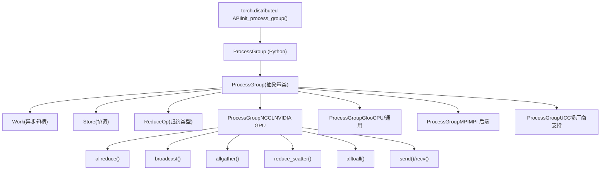
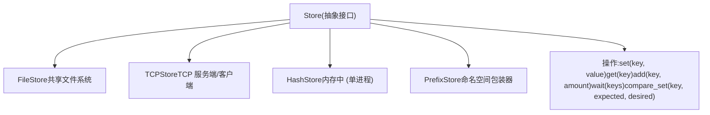
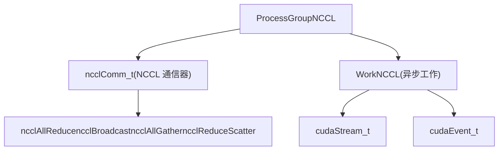
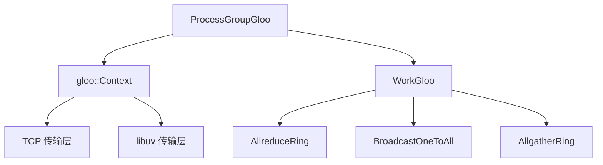
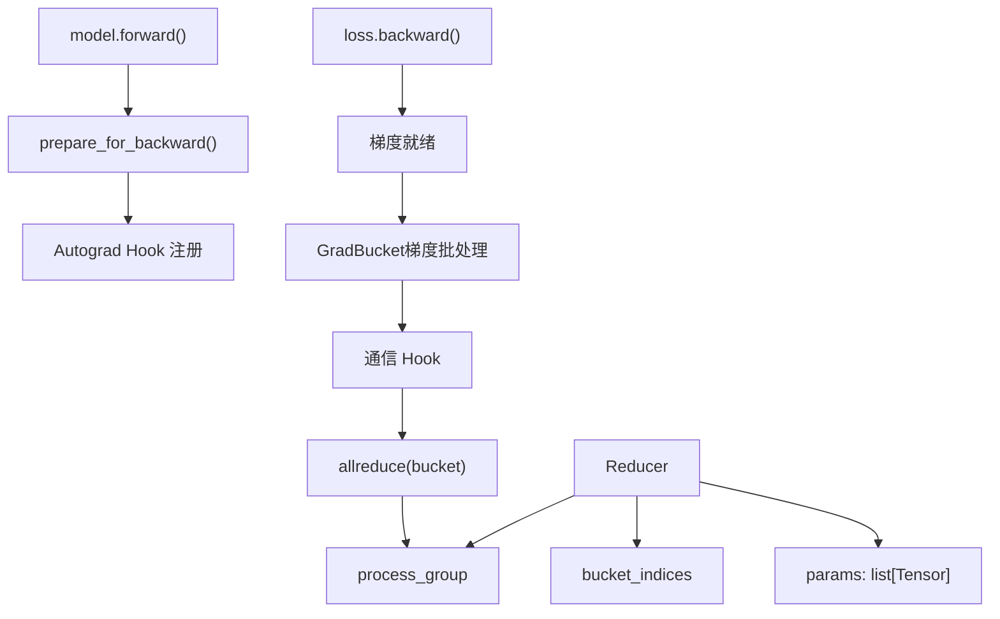
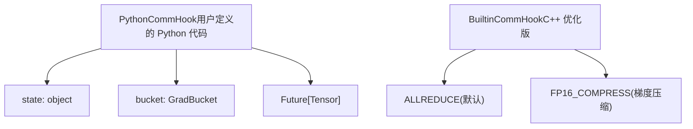
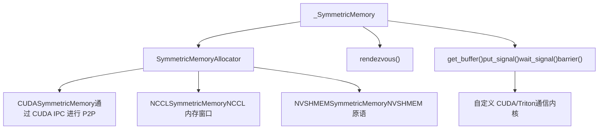
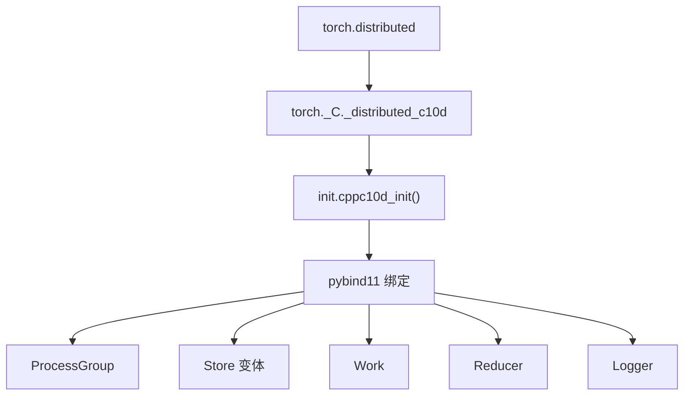

# c10d 集合通信 (c10d Collective Communication)

相关源文件 (Relevant source files)

-   [build\_variables.bzl](https://github.com/pytorch/pytorch/blob/915982a4/build_variables.bzl)
-   [caffe2/CMakeLists.txt](https://github.com/pytorch/pytorch/blob/915982a4/caffe2/CMakeLists.txt)
-   [docs/source/distributed.md](https://github.com/pytorch/pytorch/blob/915982a4/docs/source/distributed.md)
-   [test/distributed/test\_c10d\_nccl.py](https://github.com/pytorch/pytorch/blob/915982a4/test/distributed/test_c10d_nccl.py)
-   [test/distributed/test\_nccl.py](https://github.com/pytorch/pytorch/blob/915982a4/test/distributed/test_nccl.py)
-   [test/distributed/test\_nvshmem.py](https://github.com/pytorch/pytorch/blob/915982a4/test/distributed/test_nvshmem.py)
-   [test/jit/test\_autodiff\_subgraph\_slicing.py](https://github.com/pytorch/pytorch/blob/915982a4/test/jit/test_autodiff_subgraph_slicing.py)
-   [test/test\_jit.py](https://github.com/pytorch/pytorch/blob/915982a4/test/test_jit.py)
-   [test/test\_jit\_autocast.py](https://github.com/pytorch/pytorch/blob/915982a4/test/test_jit_autocast.py)
-   [test/test\_jit\_fuser.py](https://github.com/pytorch/pytorch/blob/915982a4/test/test_jit_fuser.py)
-   [test/test\_jit\_fuser\_legacy.py](https://github.com/pytorch/pytorch/blob/915982a4/test/test_jit_fuser_legacy.py)
-   [test/test\_jit\_fuser\_te.py](https://github.com/pytorch/pytorch/blob/915982a4/test/test_jit_fuser_te.py)
-   [test/test\_jit\_legacy.py](https://github.com/pytorch/pytorch/blob/915982a4/test/test_jit_legacy.py)
-   [torch/\_C/\_distributed\_c10d.pyi](https://github.com/pytorch/pytorch/blob/915982a4/torch/_C/_distributed_c10d.pyi)
-   [torch/csrc/distributed/c10d/Backend.hpp](https://github.com/pytorch/pytorch/blob/915982a4/torch/csrc/distributed/c10d/Backend.hpp)
-   [torch/csrc/distributed/c10d/NCCLUtils.cpp](https://github.com/pytorch/pytorch/blob/915982a4/torch/csrc/distributed/c10d/NCCLUtils.cpp)
-   [torch/csrc/distributed/c10d/NCCLUtils.hpp](https://github.com/pytorch/pytorch/blob/915982a4/torch/csrc/distributed/c10d/NCCLUtils.hpp)
-   [torch/csrc/distributed/c10d/ProcessGroupNCCL.cpp](https://github.com/pytorch/pytorch/blob/915982a4/torch/csrc/distributed/c10d/ProcessGroupNCCL.cpp)
-   [torch/csrc/distributed/c10d/ProcessGroupNCCL.hpp](https://github.com/pytorch/pytorch/blob/915982a4/torch/csrc/distributed/c10d/ProcessGroupNCCL.hpp)
-   [torch/csrc/distributed/c10d/init.cpp](https://github.com/pytorch/pytorch/blob/915982a4/torch/csrc/distributed/c10d/init.cpp)
-   [torch/csrc/distributed/c10d/symm\_mem/CUDASymmetricMemory.cu](https://github.com/pytorch/pytorch/blob/915982a4/torch/csrc/distributed/c10d/symm_mem/CUDASymmetricMemory.cu)
-   [torch/csrc/distributed/c10d/symm\_mem/CUDASymmetricMemory.hpp](https://github.com/pytorch/pytorch/blob/915982a4/torch/csrc/distributed/c10d/symm_mem/CUDASymmetricMemory.hpp)
-   [torch/csrc/distributed/c10d/symm\_mem/NCCLSymmetricMemory.cu](https://github.com/pytorch/pytorch/blob/915982a4/torch/csrc/distributed/c10d/symm_mem/NCCLSymmetricMemory.cu)
-   [torch/csrc/distributed/c10d/symm\_mem/NCCLSymmetricMemory.hpp](https://github.com/pytorch/pytorch/blob/915982a4/torch/csrc/distributed/c10d/symm_mem/NCCLSymmetricMemory.hpp)
-   [torch/csrc/distributed/c10d/symm\_mem/SymmetricMemory.cpp](https://github.com/pytorch/pytorch/blob/915982a4/torch/csrc/distributed/c10d/symm_mem/SymmetricMemory.cpp)
-   [torch/csrc/distributed/c10d/symm\_mem/SymmetricMemory.hpp](https://github.com/pytorch/pytorch/blob/915982a4/torch/csrc/distributed/c10d/symm_mem/SymmetricMemory.hpp)
-   [torch/csrc/distributed/c10d/symm\_mem/nccl\_extension.cu](https://github.com/pytorch/pytorch/blob/915982a4/torch/csrc/distributed/c10d/symm_mem/nccl_extension.cu)
-   [torch/csrc/distributed/c10d/symm\_mem/nvshmem\_extension.cu](https://github.com/pytorch/pytorch/blob/915982a4/torch/csrc/distributed/c10d/symm_mem/nvshmem_extension.cu)
-   [torch/csrc/distributed/c10d/symm\_mem/nvshmem\_team\_manager.hpp](https://github.com/pytorch/pytorch/blob/915982a4/torch/csrc/distributed/c10d/symm_mem/nvshmem_team_manager.hpp)
-   [torch/distributed/\_symmetric\_memory/\_\_init\_\_.py](https://github.com/pytorch/pytorch/blob/915982a4/torch/distributed/_symmetric_memory/__init__.py)
-   [torch/distributed/distributed\_c10d.py](https://github.com/pytorch/pytorch/blob/915982a4/torch/distributed/distributed_c10d.py)
-   [torch/testing/\_internal/common\_distributed.py](https://github.com/pytorch/pytorch/blob/915982a4/torch/testing/_internal/common_distributed.py)
-   [torch/testing/\_internal/common\_fsdp.py](https://github.com/pytorch/pytorch/blob/915982a4/torch/testing/_internal/common_fsdp.py)
-   [torch/testing/\_internal/common\_nn.py](https://github.com/pytorch/pytorch/blob/915982a4/torch/testing/_internal/common_nn.py)
-   [torch/testing/\_internal/common\_utils.py](https://github.com/pytorch/pytorch/blob/915982a4/torch/testing/_internal/common_utils.py)
-   [torch/testing/\_internal/distributed/distributed\_test.py](https://github.com/pytorch/pytorch/blob/915982a4/torch/testing/_internal/distributed/distributed_test.py)

c10d 库为 PyTorch 的分布式训练提供了基础的集合通信原语。它定义了一个抽象的 `ProcessGroup` (进程组) 接口，具有多个后端实现（NCCL, Gloo, MPI, UCC），并支持标准的集合通信操作，如 allreduce, broadcast 和 allgather。这一层位于 DDP 和 DTensor 等高层分布式 API 之下。

**范围**：本页涵盖了核心 c10d 通信原语、后端抽象，以及 DistributedDataParallel 使用的 Reducer 组件。有关构建在 c10d 之上的分布式张量抽象，请参阅 [DTensor](/pytorch/pytorch/4.2-dtensor:-distributed-tensor-abstraction)。有关高性能对称内存通信，请参阅 [对称内存 (Symmetric Memory)](/pytorch/pytorch/4.3-symmetric-memory-for-high-performance-communication)。

## 架构概览 (Architecture Overview)

c10d 库采用了分层架构，将抽象通信接口与后端特定的实现分离：


**来源**： [torch/csrc/distributed/c10d/init.cpp19-46](https://github.com/pytorch/pytorch/blob/915982a4/torch/csrc/distributed/c10d/init.cpp#L19-L46) [torch/\_C/\_distributed\_c10d.pyi1-300](https://github.com/pytorch/pytorch/blob/915982a4/torch/_C/_distributed_c10d.pyi#L1-L300)

## 核心抽象 (Core Abstractions)

### ProcessGroup

`ProcessGroup` 类是所有通信后端的抽象接口。分布式作业中的每个进程都拥有一个或多个表示通信域的 ProcessGroup 实例的引用。

| 方法 | 用途 | 返回值 |
| --- | --- | --- |
| `broadcast()` | 将张量从根节点发送到所有 rank | `Work` |
| `allreduce()` | 对所有 rank 的张量进行归约 | `Work` |
| `reduce()` | 将张量归约到单个 rank | `Work` |
| `allgather()` | 收集来自所有 rank 的张量 | `Work` |
| `gather()` | 将张量收集到单个 rank | `Work` |
| `scatter()` | 将张量分发到所有 rank | `Work` |
| `reduce_scatter()` | 先归约再分发结果 | `Work` |
| `alltoall()` | 全对全张量交换 | `Work` |
| `barrier()` | 同步屏障 | `Work` |
| `send()`/`recv()` | 点对点通信 | `Work` |

**来源**： [torch/\_C/\_distributed\_c10d.pyi276-370](https://github.com/pytorch/pytorch/blob/915982a4/torch/_C/_distributed_c10d.pyi#L276-L370)

### Store

`Store` 接口提供了一个用于初始化和协调的分布式键值存储：


| Store 类型 | 使用场景 | 来源 |
| --- | --- | --- |
| `FileStore` | 共享文件系统协调 | [torch/\_C/\_distributed\_c10d.pyi225-226](https://github.com/pytorch/pytorch/blob/915982a4/torch/_C/_distributed_c10d.pyi#L225-L226) |
| `TCPStore` | 与主节点的网络协调 | [torch/\_C/\_distributed\_c10d.pyi231-247](https://github.com/pytorch/pytorch/blob/915982a4/torch/_C/_distributed_c10d.pyi#L231-L247) |
| `HashStore` | 单进程测试 | [torch/\_C/\_distributed\_c10d.pyi228-229](https://github.com/pytorch/pytorch/blob/915982a4/torch/_C/_distributed_c10d.pyi#L228-L229) |
| `PrefixStore` | 多个进程组的命名空间隔离 | [torch/\_C/\_distributed\_c10d.pyi249-252](https://github.com/pytorch/pytorch/blob/915982a4/torch/_C/_distributed_c10d.pyi#L249-L252) |

**来源**： [torch/\_C/\_distributed\_c10d.pyi201-252](https://github.com/pytorch/pytorch/blob/915982a4/torch/_C/_distributed_c10d.pyi#L201-L252) [torch/csrc/distributed/c10d/init.cpp207-345](https://github.com/pytorch/pytorch/blob/915982a4/torch/csrc/distributed/c10d/init.cpp#L207-L345)

### Work 对象 (Work Object)

所有集合通信操作都会返回一个表示异步操作的 `Work` 对象：

```python
class Work:    
    def wait(self, timeout: timedelta = ...) -> bool    
    def get_future(self) -> Future[list[Tensor]]    
    def is_completed(self) -> bool    
    def is_success(self) -> bool    
    def exception(self) -> Exception    
    def source_rank(self) -> int    
    def result(self) -> list[Tensor]    
    def synchronize(self) -> None
```
**来源**： [torch/\_C/\_distributed\_c10d.pyi373-391](https://github.com/pytorch/pytorch/blob/915982a4/torch/_C/_distributed_c10d.pyi#L373-L391)

## 集合通信流 (Collective Operations Flow)

一个典型集合通信操作的执行流程：

> **[Mermaid sequence]**
> *(图表结构无法解析)*

**来源**： [torch/\_C/\_distributed\_c10d.pyi276-370](https://github.com/pytorch/pytorch/blob/915982a4/torch/_C/_distributed_c10d.pyi#L276-L370) [torch/csrc/distributed/c10d/init.cpp800-900](https://github.com/pytorch/pytorch/blob/915982a4/torch/csrc/distributed/c10d/init.cpp#L800-L900)

## 后端实现 (Backend Implementations)

### NCCL 后端

ProcessGroupNCCL 是 NVIDIA GPU 通信的主要后端，使用了 NCCL 库：


关键特性：

-   流排序的单次设备操作 (One-shot device operations)
-   支持节点内通信的 GPU Direct RDMA
-   支持 NVIDIA GPU 上的 CUDA 张量
-   通过 `USE_C10D_NCCL` 标志位进行条件编译

**来源**： [torch/csrc/distributed/c10d/init.cpp33-37](https://github.com/pytorch/pytorch/blob/915982a4/torch/csrc/distributed/c10d/init.cpp#L33-L37) [build\_variables.bzl1-100](https://github.com/pytorch/pytorch/blob/915982a4/build_variables.bzl#L1-L100)

### Gloo 后端

ProcessGroupGloo 提供了 CPU 和通用的 GPU 通信：


特性：

-   CPU 张量支持（非 CUDA 环境的回退方案）
-   多个传输层（TCP, UV）
-   基于环 (Ring) 的集合算法
-   通过 `USE_C10D_GLOO` 标志位进行条件编译

**来源**： [torch/csrc/distributed/c10d/init.cpp24-27](https://github.com/pytorch/pytorch/blob/915982a4/torch/csrc/distributed/c10d/init.cpp#L24-L27) [build\_variables.bzl1-100](https://github.com/pytorch/pytorch/blob/915982a4/build_variables.bzl#L1-L100)

### 其他后端 (Other Backends)

| 后端 | 用途 | 编译标志位 |
| --- | --- | --- |
| MPI | 带有 MPI 的 HPC 环境 | `USE_C10D_MPI` |
| UCC | 统一通信框架 (Unified Communication framework) | `USE_C10D_UCC` |
| XCCL | 厂商无关的集合通信 | `USE_C10D_XCCL` |

**来源**： [torch/csrc/distributed/c10d/init.cpp39-45](https://github.com/pytorch/pytorch/blob/915982a4/torch/csrc/distributed/c10d/init.cpp#L39-L45)

## Reducer 与 DDP 集成 (Reducer and DDP Integration)

`Reducer` 类负责协调 `DistributedDataParallel` 的梯度同步：


**来源**： [torch/csrc/distributed/c10d/init.cpp490-740](https://github.com/pytorch/pytorch/blob/915982a4/torch/csrc/distributed/c10d/init.cpp#L490-L740) [torch/\_C/\_distributed\_c10d.pyi42-81](https://github.com/pytorch/pytorch/blob/915982a4/torch/_C/_distributed_c10d.pyi#L42-L81)

### GradBucket

`GradBucket` 表示一批准备好通信的梯度：

| 方法 | 用途 |
| --- | --- |
| `index()` | 桶在 DDP 模型中的索引 |
| `buffer()` | 展平的 1D 梯度张量 |
| `gradients()` | 每个参数的梯度张量列表 |
| `parameters()` | 对应的参数列表 |
| `is_last()` | 是否是最后一个桶（前向传递中的第一层） |
| `set_buffer()` | 替换桶张量（用于压缩 hooks） |

**来源**： [torch/\_C/\_distributed\_c10d.pyi34-41](https://github.com/pytorch/pytorch/blob/915982a4/torch/_C/_distributed_c10d.pyi#L34-L41) [torch/csrc/distributed/c10d/init.cpp490-555](https://github.com/pytorch/pytorch/blob/915982a4/torch/csrc/distributed/c10d/init.cpp#L490-L555)

### 通信 Hooks (Communication Hooks)

DDP 支持两种类型的通信 hooks：


注册 API：

```python
# Python 
hook_register_comm_hook(reducer, state, comm_hook) 

# 内置 
hook_register_builtin_comm_hook(reducer, BuiltinCommHookType.FP16_COMPRESS)
```
**来源**： [torch/\_C/\_distributed\_c10d.pyi22-30](https://github.com/pytorch/pytorch/blob/915982a4/torch/_C/_distributed_c10d.pyi#L22-L30) [torch/csrc/distributed/c10d/init.cpp381-396](https://github.com/pytorch/pytorch/blob/915982a4/torch/csrc/distributed/c10d/init.cpp#L381-L396)

## 操作选项与配置 (Operation Options and Configuration)

每个集合通信操作都接受一个带有操作特定参数的选项对象：

| 选项类 | 关键参数 | 被此方法使用 |
| --- | --- | --- |
| `BroadcastOptions` | `rootRank`, `rootTensor`, `timeout` | broadcast() |
| `AllreduceOptions` | `reduceOp`, `timeout`, `sparseIndices` | allreduce() |
| `ReduceOptions` | `reduceOp`, `rootRank`, `timeout` | reduce() |
| `AllgatherOptions` | `timeout` | allgather() |
| `ReduceScatterOptions` | `reduceOp`, `timeout` | reduce\_scatter() |
| `AllToAllOptions` | `timeout` | alltoall() |
| `BarrierOptions` | `device_ids`, `timeout` | barrier() |

**来源**： [torch/\_C/\_distributed\_c10d.pyi151-200](https://github.com/pytorch/pytorch/blob/915982a4/torch/_C/_distributed_c10d.pyi#L151-L200)

### ReduceOp

`ReduceOp` 枚举指定了归约操作：

```python
class ReduceOp:    
    SUM         # 所有 rank 求和    
    AVG         # 所有 rank 取平均    
    PRODUCT     # 所有 rank 求乘积    
    MIN         # 逐元素取最小值    
    MAX         # 逐元素取最大值    
    BAND        # 按位与 (AND)    
    BOR         # 按位或 (OR)    
    BXOR        # 按位异或 (XOR)    
    PREMUL_SUM  # 预乘法求和 (Pre-multiplied sum)
```
**来源**： [torch/\_C/\_distributed\_c10d.pyi119-143](https://github.com/pytorch/pytorch/blob/915982a4/torch/_C/_distributed_c10d.pyi#L119-L143)

## 对称内存集成 (Symmetric Memory Integration)

c10d 集成了对称内存系统以支持高级通信模式：


关键 API：

-   `_SymmetricMemory.empty_strided_p2p()` - 分配对称内存
-   `_SymmetricMemory.rendezvous()` - 建立节点映射
-   `_SymmetricMemory.get_buffer()` - 访问远程节点缓冲区

**来源**： [torch/\_C/\_distributed\_c10d.pyi427-516](https://github.com/pytorch/pytorch/blob/915982a4/torch/_C/_distributed_c10d.pyi#L427-L516) [torch/csrc/distributed/c10d/symm\_mem/SymmetricMemory.hpp1-40](https://github.com/pytorch/pytorch/blob/915982a4/torch/csrc/distributed/c10d/symm_mem/SymmetricMemory.hpp#L1-L40) [torch/csrc/distributed/c10d/symm\_mem/SymmetricMemory.cpp1-300](https://github.com/pytorch/pytorch/blob/915982a4/torch/csrc/distributed/c10d/symm_mem/SymmetricMemory.cpp#L1-L300)

## Python 绑定 (Python Bindings)

C++ 版 c10d 实现通过 pybind11 暴露给 Python：


`init.cpp` 中的关键绑定函数：

-   `c10d_init()` - 主模块初始化 [torch/csrc/distributed/c10d/init.cpp457-458](https://github.com/pytorch/pytorch/blob/915982a4/torch/csrc/distributed/c10d/init.cpp#L457-L458)
-   Store 类绑定 [torch/csrc/distributed/c10d/init.cpp800-900](https://github.com/pytorch/pytorch/blob/915982a4/torch/csrc/distributed/c10d/init.cpp#L800-L900)
-   ProcessGroup 绑定 [torch/csrc/distributed/c10d/init.cpp1000-1500](https://github.com/pytorch/pytorch/blob/915982a4/torch/csrc/distributed/c10d/init.cpp#L1000-L1500)
-   Reducer/DDP 绑定 [torch/csrc/distributed/c10d/init.cpp562-740](https://github.com/pytorch/pytorch/blob/915982a4/torch/csrc/distributed/c10d/init.cpp#L562-L740)

**来源**： [torch/csrc/distributed/c10d/init.cpp1-300](https://github.com/pytorch/pytorch/blob/915982a4/torch/csrc/distributed/c10d/init.cpp#L1-L300) [torch/\_C/\_distributed\_c10d.pyi1-516](https://github.com/pytorch/pytorch/blob/915982a4/torch/_C/_distributed_c10d.pyi#L1-L516)

## 调试与日志 (Debugging and Logging)

c10d 提供了调试工具和日志功能：

| 特性 | 描述 | API |
| --- | --- | --- |
| 调试级别 | 控制详细程度 | `set_debug_level(DebugLevel)` |
| Logger | DDP 特有的日志 | `Logger.set_construction_data_and_log()` |
| 飞行记录器 (Flight Recorder) | 记录集合通信历史 | `_enable_flight_recorder()` |
| 超时检测 | 检测挂起的集合通信 | 通过选项可配置 |

调试级别：

-   `DebugLevel.OFF` - 无调试输出
-   `DebugLevel.INFO` - 基础信息日志
-   `DebugLevel.DETAIL` - 详细的操作日志

**来源**： [torch/\_C/\_distributed\_c10d.pyi110-117](https://github.com/pytorch/pytorch/blob/915982a4/torch/_C/_distributed_c10d.pyi#L110-L117) [torch/csrc/distributed/c10d/init.cpp742-788](https://github.com/pytorch/pytorch/blob/915982a4/torch/csrc/distributed/c10d/init.cpp#L742-L788)

## 控制面集合通信 (Control Plane Collectives)

与数据面集合通信分离，c10d 提供了轻量级的控制面集合通信用于协调：

```python
class _ControlCollectives:    
    def barrier(self, key: str, timeout: timedelta, blocking: bool)    
    def broadcast_send(self, key: str, data: str, timeout: timedelta)    
    def broadcast_recv(self, key: str, timeout: timedelta) -> str    
    def gather_send(self, key: str, data: str, timeout: timedelta)    
    def gather_recv(self, key: str, timeout: timedelta) -> str    
    def scatter_send(self, key: str, data: str, timeout: timedelta)    
    def scatter_recv(self, key: str, timeout: timedelta) -> str    
    def all_gather(self, key: str, data: str, timeout: timedelta) -> str    
    def all_sum(self, key: str, data: int, timeout: timedelta) -> int
```
这些方法操作小型元数据（字符串/整数）而非张量，常用于协调任务。

**来源**： [torch/\_C/\_distributed\_c10d.pyi254-264](https://github.com/pytorch/pytorch/blob/915982a4/torch/_C/_distributed_c10d.pyi#L254-L264) [torch/csrc/distributed/c10d/init.cpp10-13](https://github.com/pytorch/pytorch/blob/915982a4/torch/csrc/distributed/c10d/init.cpp#L10-L13)

## 测试与验证 (Testing and Validation)

c10d 包含广泛的测试基础设施：

| 测试套件 | 覆盖范围 | 来源 |
| --- | --- | --- |
| NCCL 测试 | 后端功能、对称内存 | [test/distributed/test\_nccl.py](https://github.com/pytorch/pytorch/blob/915982a4/test/distributed/test_nccl.py) |
| NVSHMEM 测试 | 带有 NVSHMEM 的对称内存 | [test/distributed/test\_nvshmem.py](https://github.com/pytorch/pytorch/blob/915982a4/test/distributed/test_nvshmem.py) |
| 多进程测试 | 进程组协调 | 各类测试文件 |

示例测试结构：

```python
class MultiProcContinuousTest:    
    """多进程分布式测试的基类"""    
    @property    
    def world_size(self) -> int: ...    
    @property      
    def rank(self) -> int: ...
```
**来源**： [test/distributed/test\_nccl.py1-100](https://github.com/pytorch/pytorch/blob/915982a4/test/distributed/test_nccl.py#L1-L100) [test/distributed/test\_nvshmem.py1-100](https://github.com/pytorch/pytorch/blob/915982a4/test/distributed/test_nvshmem.py#L1-L100)
