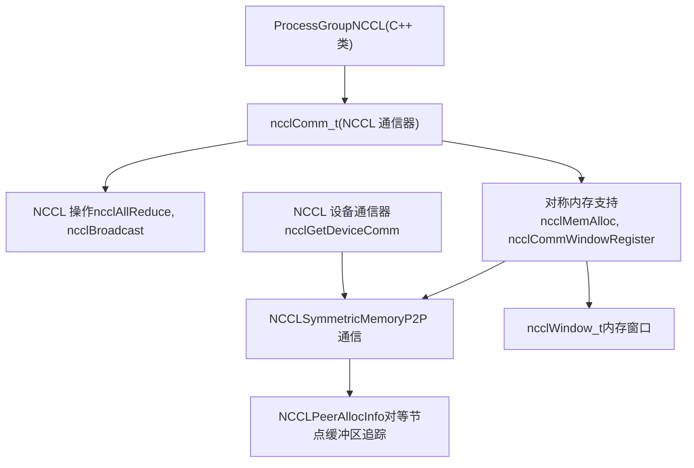
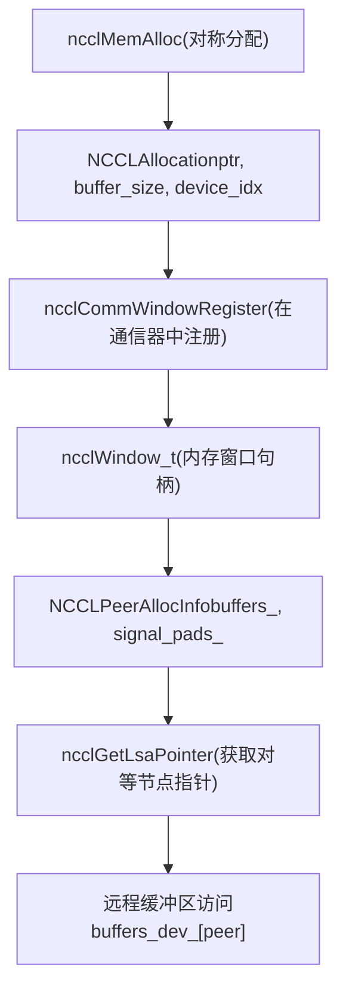
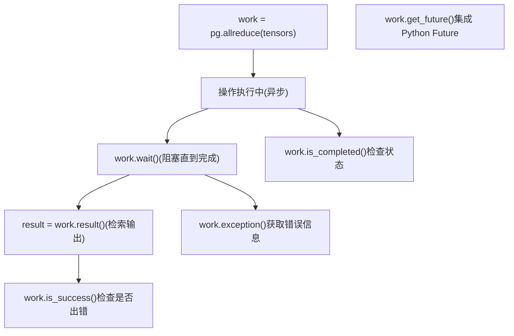
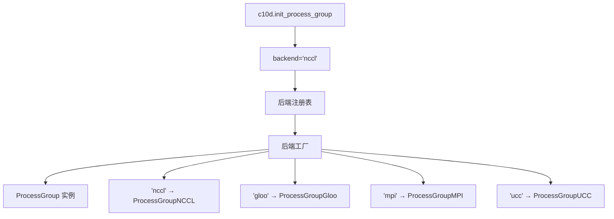
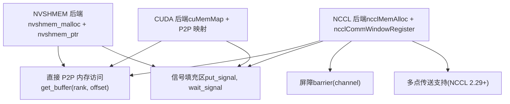
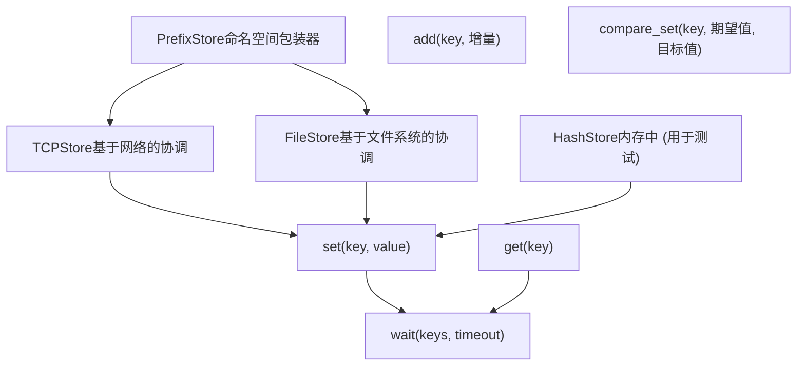
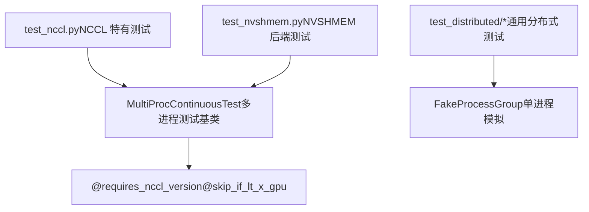

# ProcessGroup 后端 (ProcessGroup Backends)

相关源文件 (Relevant source files)

-   [build\_variables.bzl](https://github.com/pytorch/pytorch/blob/915982a4/build_variables.bzl)
-   [caffe2/CMakeLists.txt](https://github.com/pytorch/pytorch/blob/915982a4/caffe2/CMakeLists.txt)
-   [docs/source/distributed.md](https://github.com/pytorch/pytorch/blob/915982a4/docs/source/distributed.md)
-   [test/distributed/test\_c10d\_nccl.py](https://github.com/pytorch/pytorch/blob/915982a4/test/distributed/test_c10d_nccl.py)
-   [test/distributed/test\_nccl.py](https://github.com/pytorch/pytorch/blob/915982a4/test/distributed/test_nccl.py)
-   [test/distributed/test\_nvshmem.py](https://github.com/pytorch/pytorch/blob/915982a4/test/distributed/test_nvshmem.py)
-   [test/jit/test\_autodiff\_subgraph\_slicing.py](https://github.com/pytorch/pytorch/blob/915982a4/test/jit/test_autodiff_subgraph_slicing.py)
-   [test/test\_jit.py](https://github.com/pytorch/pytorch/blob/915982a4/test/test_jit.py)
-   [test/test\_jit\_autocast.py](https://github.com/pytorch/pytorch/blob/915982a4/test/test_jit_autocast.py)
-   [test/test\_jit\_fuser.py](https://github.com/pytorch/pytorch/blob/915982a4/test/test_jit_fuser.py)
-   [test/test\_jit\_fuser\_legacy.py](https://github.com/pytorch/pytorch/blob/915982a4/test/test_jit_fuser_legacy.py)
-   [test/test\_jit\_fuser\_te.py](https://github.com/pytorch/pytorch/blob/915982a4/test/test_jit_fuser_te.py)
-   [test/test\_jit\_legacy.py](https://github.com/pytorch/pytorch/blob/915982a4/test/test_jit_legacy.py)
-   [torch/\_C/\_distributed\_c10d.pyi](https://github.com/pytorch/pytorch/blob/915982a4/torch/_C/_distributed_c10d.pyi)
-   [torch/csrc/distributed/c10d/Backend.hpp](https://github.com/pytorch/pytorch/blob/915982a4/torch/csrc/distributed/c10d/Backend.hpp)
-   [torch/csrc/distributed/c10d/NCCLUtils.cpp](https://github.com/pytorch/pytorch/blob/915982a4/torch/csrc/distributed/c10d/NCCLUtils.cpp)
-   [torch/csrc/distributed/c10d/NCCLUtils.hpp](https://github.com/pytorch/pytorch/blob/915982a4/torch/csrc/distributed/c10d/NCCLUtils.hpp)
-   [torch/csrc/distributed/c10d/ProcessGroupNCCL.cpp](https://github.com/pytorch/pytorch/blob/915982a4/torch/csrc/distributed/c10d/ProcessGroupNCCL.cpp)
-   [torch/csrc/distributed/c10d/ProcessGroupNCCL.hpp](https://github.com/pytorch/pytorch/blob/915982a4/torch/csrc/distributed/c10d/ProcessGroupNCCL.hpp)
-   [torch/csrc/distributed/c10d/init.cpp](https://github.com/pytorch/pytorch/blob/915982a4/torch/csrc/distributed/c10d/init.cpp)
-   [torch/csrc/distributed/c10d/symm\_mem/CUDASymmetricMemory.cu](https://github.com/pytorch/pytorch/blob/915982a4/torch/csrc/distributed/c10d/symm_mem/CUDASymmetricMemory.cu)
-   [torch/csrc/distributed/c10d/symm\_mem/CUDASymmetricMemory.hpp](https://github.com/pytorch/pytorch/blob/915982a4/torch/csrc/distributed/c10d/symm_mem/CUDASymmetricMemory.hpp)
-   [torch/csrc/distributed/c10d/symm\_mem/NCCLSymmetricMemory.cu](https://github.com/pytorch/pytorch/blob/915982a4/torch/csrc/distributed/c10d/symm_mem/NCCLSymmetricMemory.cu)
-   [torch/csrc/distributed/c10d/symm\_mem/NCCLSymmetricMemory.hpp](https://github.com/pytorch/pytorch/blob/915982a4/torch/csrc/distributed/c10d/symm_mem/NCCLSymmetricMemory.hpp)
-   [torch/csrc/distributed/c10d/symm\_mem/SymmetricMemory.cpp](https://github.com/pytorch/pytorch/blob/915982a4/torch/csrc/distributed/c10d/symm_mem/SymmetricMemory.cpp)
-   [torch/csrc/distributed/c10d/symm\_mem/SymmetricMemory.hpp](https://github.com/pytorch/pytorch/blob/915982a4/torch/csrc/distributed/c10d/symm_mem/SymmetricMemory.hpp)
-   [torch/csrc/distributed/c10d/symm\_mem/nccl\_extension.cu](https://github.com/pytorch/pytorch/blob/915982a4/torch/csrc/distributed/c10d/symm_mem/nccl_extension.cu)
-   [torch/csrc/distributed/c10d/symm\_mem/nvshmem\_extension.cu](https://github.com/pytorch/pytorch/blob/915982a4/torch/csrc/distributed/c10d/symm_mem/nvshmem_extension.cu)
-   [torch/csrc/distributed/c10d/symm\_mem/nvshmem\_team\_manager.hpp](https://github.com/pytorch/pytorch/blob/915982a4/torch/csrc/distributed/c10d/symm_mem/nvshmem_team_manager.hpp)
-   [torch/distributed/\_symmetric\_memory/\_\_init\_\_.py](https://github.com/pytorch/pytorch/blob/915982a4/torch/distributed/_symmetric_memory/__init__.py)
-   [torch/distributed/distributed\_c10d.py](https://github.com/pytorch/pytorch/blob/915982a4/torch/distributed/distributed_c10d.py)
-   [torch/testing/\_internal/common\_distributed.py](https://github.com/pytorch/pytorch/blob/915982a4/torch/testing/_internal/common_distributed.py)
-   [torch/testing/\_internal/common\_fsdp.py](https://github.com/pytorch/pytorch/blob/915982a4/torch/testing/_internal/common_fsdp.py)
-   [torch/testing/\_internal/common\_nn.py](https://github.com/pytorch/pytorch/blob/915982a4/torch/testing/_internal/common_nn.py)
-   [torch/testing/\_internal/common\_utils.py](https://github.com/pytorch/pytorch/blob/915982a4/torch/testing/_internal/common_utils.py)
-   [torch/testing/\_internal/distributed/distributed\_test.py](https://github.com/pytorch/pytorch/blob/915982a4/torch/testing/_internal/distributed/distributed_test.py)

## 目的与范围 (Purpose and Scope)

本页记录了 PyTorch c10d 集合通信库的后端实现。**ProcessGroup (进程组)** 是核心抽象，为分布式训练提供了集合通信操作（allreduce, broadcast, scatter, gather 等）。不同的后端实现了该接口，以支持各种硬件和网络配置。

有关 ProcessGroup 如何在分布式数据并行中使用的信息，请参阅 [Reducer 与 DistributedDataParallel](/pytorch/pytorch/4.1.2-reducer-and-distributeddataparallel)。有关 DTensor 如何使用 ProcessGroup 的信息，请参阅 [DTensor 架构与放置类型](/pytorch/pytorch/4.2.1-dtensor-architecture-and-placement-types)。

---

## ProcessGroup 抽象 (ProcessGroup Abstraction)

### 核心接口 (Core Interface)

`ProcessGroup` 类是一个定义了集合通信 API 的抽象基类。所有后端实现都继承自此类并实现其虚方法。


**来源：** [torch/csrc/distributed/c10d/init.cpp1-976](https://github.com/pytorch/pytorch/blob/915982a4/torch/csrc/distributed/c10d/init.cpp#L1-L976) [torch/\_C/\_distributed\_c10d.pyi268-295](https://github.com/pytorch/pytorch/blob/915982a4/torch/_C/_distributed_c10d.pyi#L268-L295)

### 选项类 (Options Classes)

每个集合通信操作都有一个关联的选项类，用于指定操作参数：

| 选项类 | 用途 | 关键字段 |
| --- | --- | --- |
| `AllreduceOptions` | 配置 allreduce 操作 | `reduceOp`, `timeout`, `asyncOp`, `sparseIndices` |
| `BroadcastOptions` | 配置 broadcast 操作 | `rootRank`, `rootTensor`, `timeout` |
| `ReduceOptions` | 配置 reduce 操作 | `reduceOp`, `rootRank`, `timeout` |
| `AllgatherOptions` | 配置 allgather 操作 | `timeout`, `asyncOp` |
| `ReduceScatterOptions` | 配置 reduce-scatter 操作 | `reduceOp`, `timeout` |
| `BarrierOptions` | 配置 barrier 操作 | `device_ids`, `device`, `timeout` |
| `AllToAllOptions` | 配置 all-to-all 操作 | `timeout`, `asyncOp` |

**来源：** [torch/\_C/\_distributed\_c10d.pyi151-200](https://github.com/pytorch/pytorch/blob/915982a4/torch/_C/_distributed_c10d.pyi#L151-L200) [torch/csrc/distributed/c10d/init.cpp800-1200](https://github.com/pytorch/pytorch/blob/915982a4/torch/csrc/distributed/c10d/init.cpp#L800-L1200)

---

## 后端实现 (Backend Implementations)

### NCCL 后端 (ProcessGroupNCCL)

**NCCL 后端**是 NVIDIA GPU 通信的主要后端。它使用 NVIDIA 的 NCCL 库提供高性能的集合通信操作。


**关键特性：**

-   **高性能 GPU 集合通信**：针对 NVIDIA 硬件优化，支持直接的 GPU 到 GPU 通信。
-   **对称内存支持**：当 NCCL 版本 ≥ 2.27 时，支持 `ncclMemAlloc` 和窗口注册，以实现高级 P2P 模式。
-   **设备通信器**：NCCL 2.28+ 支持设备侧通信句柄。
-   **多点传送 (Multicast) 支持**：NCCL 2.29+ 提供多点传送设备指针，实现高效的一到多通信。

**来源：** [torch/csrc/distributed/c10d/symm\_mem/NCCLSymmetricMemory.cu1-250](https://github.com/pytorch/pytorch/blob/915982a4/torch/csrc/distributed/c10d/symm_mem/NCCLSymmetricMemory.cu#L1-L250) [torch/csrc/distributed/c10d/symm\_mem/NCCLSymmetricMemory.hpp1-50](https://github.com/pytorch/pytorch/blob/915982a4/torch/csrc/distributed/c10d/symm_mem/NCCLSymmetricMemory.hpp#L1-L50) [torch/csrc/distributed/c10d/init.cpp34-37](https://github.com/pytorch/pytorch/blob/915982a4/torch/csrc/distributed/c10d/init.cpp#L34-L37)

#### NCCL 对称内存架构 (NCCL Symmetric Memory Architecture)


**来源：** [torch/csrc/distributed/c10d/symm\_mem/NCCLSymmetricMemory.cu26-151](https://github.com/pytorch/pytorch/blob/915982a4/torch/csrc/distributed/c10d/symm_mem/NCCLSymmetricMemory.cu#L26-L151) [torch/csrc/distributed/c10d/symm\_mem/nccl\_extension.cu1-200](https://github.com/pytorch/pytorch/blob/915982a4/torch/csrc/distributed/c10d/symm_mem/nccl_extension.cu#L1-L200)

---

### Gloo 后端 (ProcessGroupGloo)

**Gloo 后端**提供跨平台的基于 CPU 的集合通信。它是当 GPU 通信不可用时或进行纯 CPU 训练时的回退后端。

**关键特性：**

-   **CPU 通信**：使用系统网络（TCP，通过 ibverbs 的 InfiniBand）。
-   **跨平台**：支持 Linux, macOS 和 Windows。
-   **异构支持**：可以在不同设备类型之间进行通信。
-   **超时处理**：鲁棒的超时和错误检测机制。

**配置：**

```
gloo::Context context
gloo::transport::Device device  # tcp 或 ibverbs
gloo::rendezvous::Store store   # 协调存储
```
**来源：** [torch/csrc/distributed/c10d/init.cpp24-27](https://github.com/pytorch/pytorch/blob/915982a4/torch/csrc/distributed/c10d/init.cpp#L24-L27) [build\_variables.bzl1-100](https://github.com/pytorch/pytorch/blob/915982a4/build_variables.bzl#L1-L100)

---

### MPI 后端 (ProcessGroupMPI)

**MPI 后端**利用现有的 MPI 安装进行分布式训练。在 MPI 是标准通信层的 HPC 环境中非常有用。

**关键特性：**

-   **MPI 标准合规性**：使用标准的 MPI-3 集合通信操作。
-   **HPC 集成**：与现有的 MPI 作业调度器无缝集成。
-   **高性能互连**：利用 MPI 优化的传输层。

**前提条件：**

-   编译标志位：`USE_C10D_MPI=1`
-   已安装 MPI 库（OpenMPI, MPICH, Intel MPI 等）

**来源：** [torch/csrc/distributed/c10d/init.cpp39-41](https://github.com/pytorch/pytorch/blob/915982a4/torch/csrc/distributed/c10d/init.cpp#L39-L41)

---

### UCC 后端 (ProcessGroupUCC)

**UCC 后端**通过统一集合通信 (Unified Collective Communication, UCC) 框架，为多个厂商特定的通信库提供了统一接口。

**关键特性：**

-   **多厂商支持**：针对 NCCL, UCX, SHARP 等提供单一 API。
-   **自动优化**：UCC 根据硬件选择最优算法。
-   **模块化架构**：针对不同传输层的插件系统。

**前提条件：**

-   编译标志位：`USE_C10D_UCC=1`
-   已安装 UCC 库

**来源：** [torch/csrc/distributed/c10d/init.cpp43-45](https://github.com/pytorch/pytorch/blob/915982a4/torch/csrc/distributed/c10d/init.cpp#L43-L45)

---

### FakeProcessGroup (用于测试)

**FakeProcessGroup** 是一个极简的后端实现，用于在不进行实际多进程执行的情况下测试分布式代码。

**关键特性：**

-   **单进程模拟**：在一个进程中模拟多 rank 行为。
-   **确定性测试**：没有实际的网络通信。
-   **快速迭代**：分布式逻辑的快速单元测试。

**来源：** [torch/csrc/distributed/c10d/init.cpp19](https://github.com/pytorch/pytorch/blob/915982a4/torch/csrc/distributed/c10d/init.cpp#L19-L19) [torch/\_C/\_distributed\_c10d.pyi296-302](https://github.com/pytorch/pytorch/blob/915982a4/torch/_C/_distributed_c10d.pyi#L296-L302)

---

## 集合通信操作接口 (Collective Operations Interface)

### 操作类别 (Operation Categories)


**来源：** [torch/\_C/\_distributed\_c10d.pyi268-295](https://github.com/pytorch/pytorch/blob/915982a4/torch/_C/_distributed_c10d.pyi#L268-L295)

### ReduceOp 枚举 (ReduceOp Enumeration)

`ReduceOp` 类指定了集合通信操作的归约方式：

| 操作 | 描述 | 符号 |
| --- | --- | --- |
| `SUM` | 逐元素求和 | ∑ |
| `PRODUCT` | 逐元素求积 | ∏ |
| `MIN` | 逐元素取最小值 | min |
| `MAX` | 逐元素取最大值 | max |
| `BAND` | 按位与 (AND) | & |
| `BOR` | 按位或 (OR) | | |
| `BXOR` | 按位异或 (XOR) | ^ |
| `AVG` | 逐元素求平均 | ∑/n |
| `PREMUL_SUM` | 预乘法求和（用于混合精度） | \- |

**来源：** [torch/\_C/\_distributed\_c10d.pyi119-150](https://github.com/pytorch/pytorch/blob/915982a4/torch/_C/_distributed_c10d.pyi#L119-L150) [torch/csrc/distributed/c10d/init.cpp413-455](https://github.com/pytorch/pytorch/blob/915982a4/torch/csrc/distributed/c10d/init.cpp#L413-L455)

---

## Work 对象与异步执行 (Work Objects and Asynchronous Execution)

### Work 抽象 (Work Abstraction)

集合通信操作返回一个 `Work` 对象，表示一个异步操作。这允许计算与通信相互重叠。


**关键方法：**

-   `wait(timeout)`：阻塞直到操作完成。
-   `is_completed()`：非阻塞的状态检查。
-   `is_success()`：检查操作是否成功。
-   `result()`：获取输出张量（针对返回张量的操作）。
-   `get_future()`：获取一个用于 async/await 模式的 Python `Future` 对象。

**来源：** [torch/\_C/\_distributed\_c10d.pyi304-346](https://github.com/pytorch/pytorch/blob/915982a4/torch/_C/_distributed_c10d.pyi#L304-L346) [torch/csrc/distributed/c10d/init.cpp1400-1500](https://github.com/pytorch/pytorch/blob/915982a4/torch/csrc/distributed/c10d/init.cpp#L1400-L1500)

---

## 后端选择与初始化 (Backend Selection and Initialization)

### 后端注册 (Backend Registration)

后端在 C++ 初始化代码中注册，并可以在运行时选择：


**后端字符串：**

-   `"nccl"`：NVIDIA GPU 通信。
-   `"gloo"`：CPU/跨平台通信。
-   `"mpi"`：基于 MPI 的通信。
-   `"ucc"`：UCC 框架通信。

**来源：** [torch/csrc/distributed/c10d/init.cpp457-550](https://github.com/pytorch/pytorch/blob/915982a4/torch/csrc/distributed/c10d/init.cpp#L457-L550)

### 初始化示例 (Python → C++ 绑定)

从 Python 到 C++ 的初始化流程：

1.  **Python**: `torch.distributed.init_process_group(backend="nccl", ...)`
2.  **C++ 绑定**: [torch/csrc/distributed/c10d/init.cpp457-473](https://github.com/pytorch/pytorch/blob/915982a4/torch/csrc/distributed/c10d/init.cpp#L457-L473) 中的 `c10d_init()` 函数。
3.  **后端工厂**: 创建适当的 `ProcessGroup` 子类。
4.  **Store 设置**: 建立协调存储（TCPStore, FileStore 等）。
5.  **通信器初始化**: 后端特定的初始化（例如 NCCL 的 `ncclCommInitRank`）。

**来源：** [torch/csrc/distributed/c10d/init.cpp457-1000](https://github.com/pytorch/pytorch/blob/915982a4/torch/csrc/distributed/c10d/init.cpp#L457-L1000)

---

## 后端特定特性 (Backend-Specific Features)

### NCCL 高级特性

#### 1. 对称内存 (Symmetric Memory)

NCCL 2.27+ 支持对称内存分配，用于高级 P2P 通信模式：


**实现：**

-   `NCCLSymmetricMemory` 类： [torch/csrc/distributed/c10d/symm\_mem/NCCLSymmetricMemory.cu1-300](https://github.com/pytorch/pytorch/blob/915982a4/torch/csrc/distributed/c10d/symm_mem/NCCLSymmetricMemory.cu#L1-L300)
-   `NVSHMEMSymmetricMemory` 类： [torch/csrc/distributed/c10d/symm\_mem/NVSHMEMSymmetricMemory.cu1-200](https://github.com/pytorch/pytorch/blob/915982a4/torch/csrc/distributed/c10d/symm_mem/NVSHMEMSymmetricMemory.cu#L1-L200)
-   `CUDASymmetricMemory` 类： [torch/csrc/distributed/c10d/symm\_mem/CUDASymmetricMemory.cu1-400](https://github.com/pytorch/pytorch/blob/915982a4/torch/csrc/distributed/c10d/symm_mem/CUDASymmetricMemory.cu#L1-L400)

**来源：** [torch/csrc/distributed/c10d/symm\_mem/NCCLSymmetricMemory.cu1-300](https://github.com/pytorch/pytorch/blob/915982a4/torch/csrc/distributed/c10d/symm_mem/NCCLSymmetricMemory.cu#L1-L300) [torch/csrc/distributed/c10d/symm\_mem/SymmetricMemory.hpp1-250](https://github.com/pytorch/pytorch/blob/915982a4/torch/csrc/distributed/c10d/symm_mem/SymmetricMemory.hpp#L1-L250)

#### 2. 设备通信器 (Device Communicators)

NCCL 2.28+ 为内核级的集合通信提供了设备侧通信句柄：

-   `ncclGetDeviceComm()`：从主机通信器获取设备通信器。
-   `NCCLDevCommManager`：管理设备通信器的生命周期 [torch/csrc/distributed/c10d/symm\_mem/nccl\_devcomm\_manager.hpp](https://github.com/pytorch/pytorch/blob/915982a4/torch/csrc/distributed/c10d/symm_mem/nccl_devcomm_manager.hpp)。
-   使得自定义 CUDA 内核能够直接调用 NCCL 操作。

**来源：** [torch/csrc/distributed/c10d/symm\_mem/NCCLSymmetricMemory.cu110-116](https://github.com/pytorch/pytorch/blob/915982a4/torch/csrc/distributed/c10d/symm_mem/NCCLSymmetricMemory.cu#L110-L116)

#### 3. 飞行记录器 (Flight Recorder)

NCCL 后端包含一个飞行记录器，用于调试集合通信操作：

-   记录最近带有时间戳的集合通信操作。
-   捕获错误状态和待处理操作。
-   可通过 `TORCH_DISTRIBUTED_DEBUG=DETAIL` 访问。

**来源：** [torch/csrc/distributed/c10d/init.cpp800-900](https://github.com/pytorch/pytorch/blob/915982a4/torch/csrc/distributed/c10d/init.cpp#L800-L900)

---

## Store 抽象 (Store Abstraction)

ProcessGroup 使用 `Store` 进行协调和元数据交换：


**Store 类型：**

-   **TCPStore**：最常用，使用 TCP 服务端进行协调。
-   **FileStore**：使用共享文件系统（例如 NFS）。
-   **HashStore**：仅在内存中，用于单进程测试。
-   **PrefixStore**：为键名添加命名空间前缀。

**来源：** [torch/\_C/\_distributed\_c10d.pyi201-253](https://github.com/pytorch/pytorch/blob/915982a4/torch/_C/_distributed_c10d.pyi#L201-L253) [torch/csrc/distributed/c10d/init.cpp1100-1300](https://github.com/pytorch/pytorch/blob/915982a4/torch/csrc/distributed/c10d/init.cpp#L1100-L1300)

---

## 测试与调试 (Testing and Debugging)

### 测试基础设施 (Test Infrastructure)

代码库包含针对 ProcessGroup 后端的广泛测试：


**关键测试模式：**

1.  **多 GPU 测试**：使用 `MultiProcContinuousTest` 启动多个进程。
2.  **后端特定测试**：取决于硬件/库的可用性。
3.  **对称内存测试**：验证 P2P 访问和信号原语。
4.  **超时测试**：验证错误处理和超时行为。

**来源：** [test/distributed/test\_nccl.py1-200](https://github.com/pytorch/pytorch/blob/915982a4/test/distributed/test_nccl.py#L1-L200) [test/distributed/test\_nvshmem.py1-400](https://github.com/pytorch/pytorch/blob/915982a4/test/distributed/test_nvshmem.py#L1-L400)

### 调试工具 (Debugging Tools)

**环境变量：**

-   `TORCH_DISTRIBUTED_DEBUG=OFF|INFO|DETAIL`：控制调试详细程度。
-   `NCCL_DEBUG=VERSION|WARN|INFO|TRACE`：NCCL 特有的调试。
-   `TORCH_NCCL_BLOCKING_WAIT=1`：启用同步 NCCL 操作以便调试。

**飞行记录器 API：**

```python
# 访问 NCCL 飞行记录器
torch.distributed._get_debug_mode()  # 获取当前调试级别
torch.distributed._set_debug_mode(DebugLevel.DETAIL)  # 启用详细日志记录
```
**来源：** [torch/csrc/distributed/c10d/init.cpp790-810](https://github.com/pytorch/pytorch/blob/915982a4/torch/csrc/distributed/c10d/init.cpp#L790-L810) [torch/\_C/\_distributed\_c10d.pyi110-118](https://github.com/pytorch/pytorch/blob/915982a4/torch/_C/_distributed_c10d.pyi#L110-L118)
