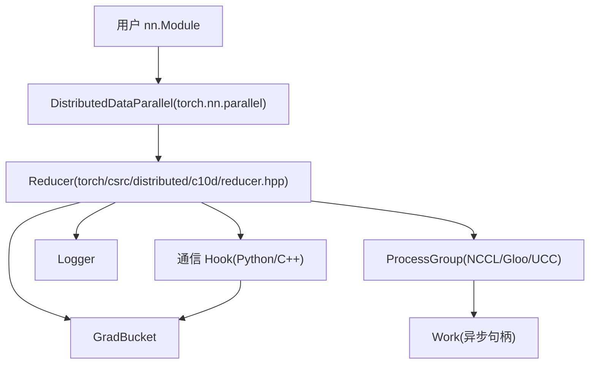
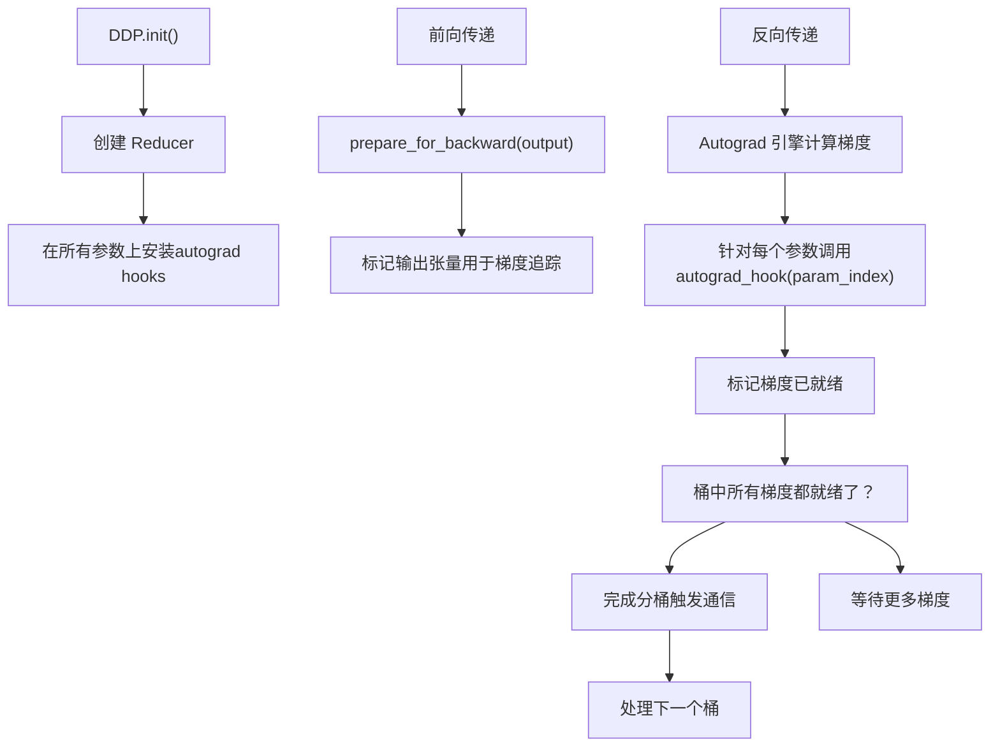
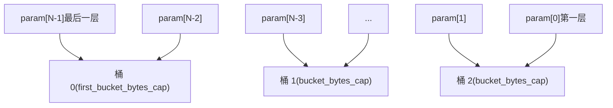
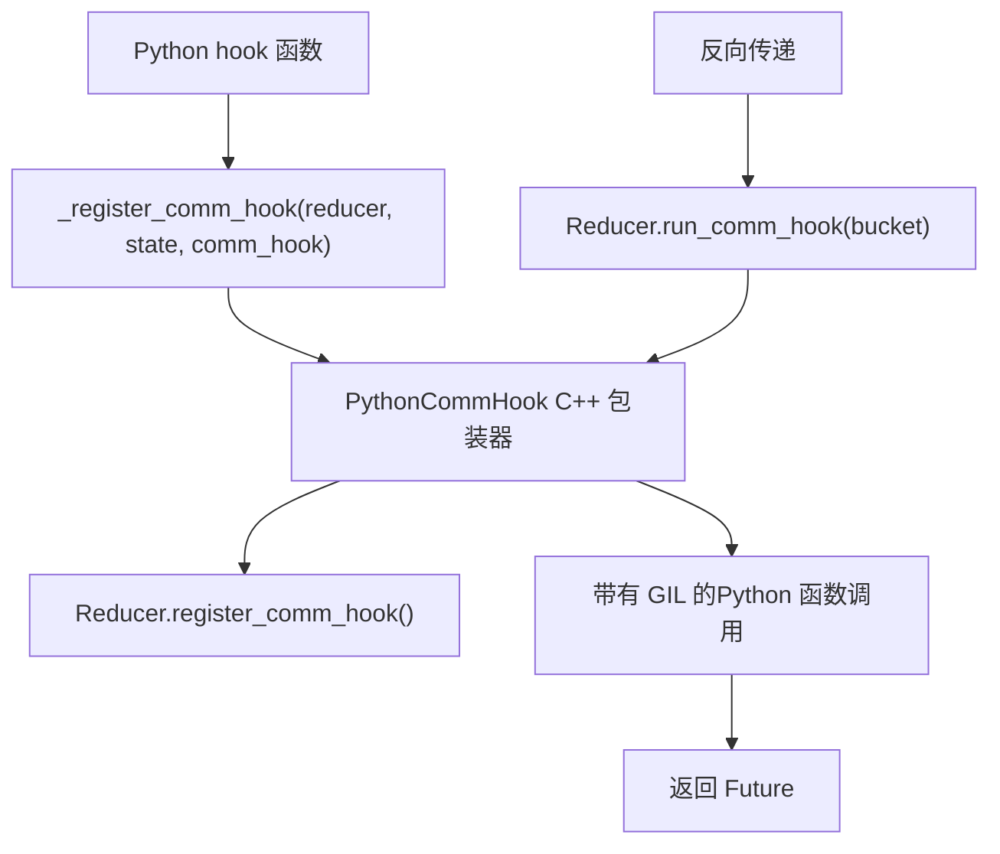
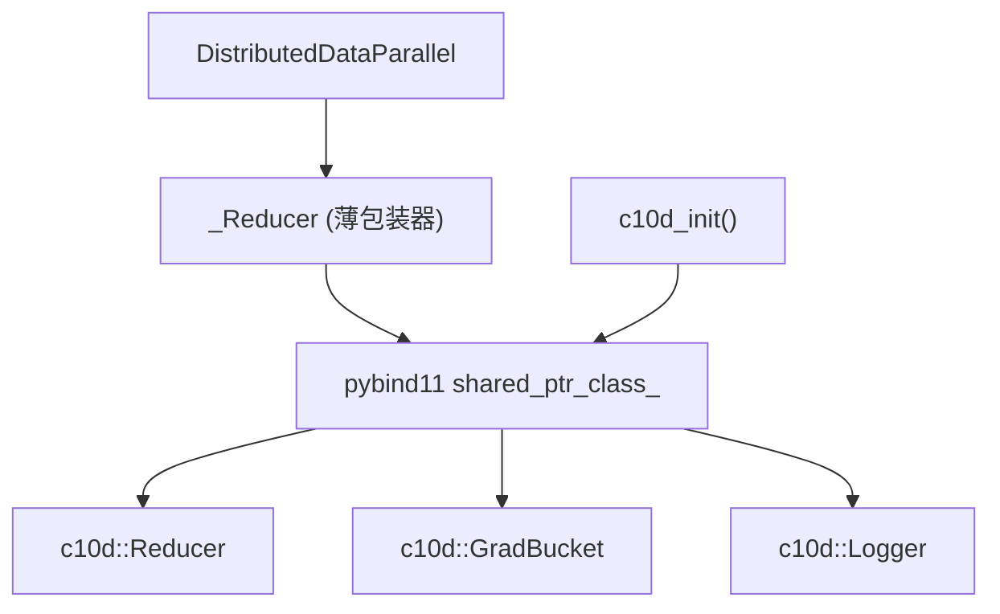

# Reducer 与 DistributedDataParallel (Reducer and DistributedDataParallel)

相关源文件 (Relevant source files)

-   [build\_variables.bzl](https://github.com/pytorch/pytorch/blob/915982a4/build_variables.bzl)
-   [caffe2/CMakeLists.txt](https://github.com/pytorch/pytorch/blob/915982a4/caffe2/CMakeLists.txt)
-   [docs/source/distributed.md](https://github.com/pytorch/pytorch/blob/915982a4/docs/source/distributed.md)
-   [test/distributed/test\_c10d\_nccl.py](https://github.com/pytorch/pytorch/blob/915982a4/test/distributed/test_c10d_nccl.py)
-   [test/distributed/test\_nccl.py](https://github.com/pytorch/pytorch/blob/915982a4/test/distributed/test_nccl.py)
-   [test/distributed/test\_nvshmem.py](https://github.com/pytorch/pytorch/blob/915982a4/test/distributed/test_nvshmem.py)
-   [test/jit/test\_autodiff\_subgraph\_slicing.py](https://github.com/pytorch/pytorch/blob/915982a4/test/jit/test_autodiff_subgraph_slicing.py)
-   [test/test\_jit.py](https://github.com/pytorch/pytorch/blob/915982a4/test/test_jit.py)
-   [test/test\_jit\_autocast.py](https://github.com/pytorch/pytorch/blob/915982a4/test/test_jit_autocast.py)
-   [test/test\_jit\_fuser.py](https://github.com/pytorch/pytorch/blob/915982a4/test/test_jit_fuser.py)
-   [test/test\_jit\_fuser\_legacy.py](https://github.com/pytorch/pytorch/blob/915982a4/test/test_jit_fuser_legacy.py)
-   [test/test\_jit\_fuser\_te.py](https://github.com/pytorch/pytorch/blob/915982a4/test/test_jit_fuser_te.py)
-   [test/test\_jit\_legacy.py](https://github.com/pytorch/pytorch/blob/915982a4/test/test_jit_legacy.py)
-   [torch/\_C/\_distributed\_c10d.pyi](https://github.com/pytorch/pytorch/blob/915982a4/torch/_C/_distributed_c10d.pyi)
-   [torch/csrc/distributed/c10d/Backend.hpp](https://github.com/pytorch/pytorch/blob/915982a4/torch/csrc/distributed/c10d/Backend.hpp)
-   [torch/csrc/distributed/c10d/NCCLUtils.cpp](https://github.com/pytorch/pytorch/blob/915982a4/torch/csrc/distributed/c10d/NCCLUtils.cpp)
-   [torch/csrc/distributed/c10d/NCCLUtils.hpp](https://github.com/pytorch/pytorch/blob/915982a4/torch/csrc/distributed/c10d/NCCLUtils.hpp)
-   [torch/csrc/distributed/c10d/ProcessGroupNCCL.cpp](https://github.com/pytorch/pytorch/blob/915982a4/torch/csrc/distributed/c10d/ProcessGroupNCCL.cpp)
-   [torch/csrc/distributed/c10d/ProcessGroupNCCL.hpp](https://github.com/pytorch/pytorch/blob/915982a4/torch/csrc/distributed/c10d/ProcessGroupNCCL.hpp)
-   [torch/csrc/distributed/c10d/init.cpp](https://github.com/pytorch/pytorch/blob/915982a4/torch/csrc/distributed/c10d/init.cpp)
-   [torch/csrc/distributed/c10d/symm\_mem/CUDASymmetricMemory.cu](https://github.com/pytorch/pytorch/blob/915982a4/torch/csrc/distributed/c10d/symm_mem/CUDASymmetricMemory.cu)
-   [torch/csrc/distributed/c10d/symm\_mem/CUDASymmetricMemory.hpp](https://github.com/pytorch/pytorch/blob/915982a4/torch/csrc/distributed/c10d/symm_mem/CUDASymmetricMemory.hpp)
-   [torch/csrc/distributed/c10d/symm\_mem/NCCLSymmetricMemory.cu](https://github.com/pytorch/pytorch/blob/915982a4/torch/csrc/distributed/c10d/symm_mem/NCCLSymmetricMemory.cu)
-   [torch/csrc/distributed/c10d/symm\_mem/NCCLSymmetricMemory.hpp](https://github.com/pytorch/pytorch/blob/915982a4/torch/csrc/distributed/c10d/symm_mem/NCCLSymmetricMemory.hpp)
-   [torch/csrc/distributed/c10d/symm\_mem/SymmetricMemory.cpp](https://github.com/pytorch/pytorch/blob/915982a4/torch/csrc/distributed/c10d/symm_mem/SymmetricMemory.cpp)
-   [torch/csrc/distributed/c10d/symm\_mem/SymmetricMemory.hpp](https://github.com/pytorch/pytorch/blob/915982a4/torch/csrc/distributed/c10d/symm_mem/SymmetricMemory.hpp)
-   [torch/csrc/distributed/c10d/symm\_mem/nccl\_extension.cu](https://github.com/pytorch/pytorch/blob/915982a4/torch/csrc/distributed/c10d/symm_mem/nccl_extension.cu)
-   [torch/csrc/distributed/c10d/symm\_mem/nvshmem\_extension.cu](https://github.com/pytorch/pytorch/blob/915982a4/torch/csrc/distributed/c10d/symm_mem/nvshmem_extension.cu)
-   [torch/csrc/distributed/c10d/symm\_mem/nvshmem\_team\_manager.hpp](https://github.com/pytorch/pytorch/blob/915982a4/torch/csrc/distributed/c10d/symm_mem/nvshmem_team_manager.hpp)
-   [torch/distributed/\_symmetric\_memory/\_\_init\_\_.py](https://github.com/pytorch/pytorch/blob/915982a4/torch/distributed/_symmetric_memory/__init__.py)
-   [torch/distributed/distributed\_c10d.py](https://github.com/pytorch/pytorch/blob/915982a4/torch/distributed/distributed_c10d.py)
-   [torch/testing/\_internal/common\_distributed.py](https://github.com/pytorch/pytorch/blob/915982a4/torch/testing/_internal/common_distributed.py)
-   [torch/testing/\_internal/common\_fsdp.py](https://github.com/pytorch/pytorch/blob/915982a4/torch/testing/_internal/common_fsdp.py)
-   [torch/testing/\_internal/common\_nn.py](https://github.com/pytorch/pytorch/blob/915982a4/torch/testing/_internal/common_nn.py)
-   [torch/testing/\_internal/common\_utils.py](https://github.com/pytorch/pytorch/blob/915982a4/torch/testing/_internal/common_utils.py)
-   [torch/testing/\_internal/distributed/distributed\_test.py](https://github.com/pytorch/pytorch/blob/915982a4/torch/testing/_internal/distributed/distributed_test.py)

## 目的与范围 (Purpose and Scope)

本文档描述了 **Reducer** 类及其在 **DistributedDataParallel (DDP)** 训练中的作用。Reducer 通过梯度分桶 (bucketing)、注册 autograd hook 以及协调 ProcessGroup 后端的 all-reduce 操作，来管理跨进程的梯度同步。

有关以下内容的信息：

-   **ProcessGroup 后端**（NCCL, Gloo, UCC），请参阅 [4.1.1](/pytorch/pytorch/4.1.1-processgroup-backends)
-   **基于 DTensor 的分布式训练**，请参阅 [4.2](/pytorch/pytorch/4.2-dtensor:-distributed-tensor-abstraction)
-   **对称内存通信原语**，请参阅 [4.3](/pytorch/pytorch/4.3-symmetric-memory-for-high-performance-communication)

---

## 概览 (Overview)

DistributedDataParallel (DDP) 是 PyTorch 的数据并行训练包装器，它在多个进程中复制模型，并在反向传播期间同步梯度。**Reducer** 是核心的 C++ 组件，负责：

1.  **梯度分桶 (Gradient bucketing)**：将模型参数分组成桶，以实现高效通信。
2.  **Autograd hook 管理**：安装 hooks 以拦截梯度计算。
3.  **通信编排**：触发梯度桶上的 all-reduce 操作。
4.  **优化特性**：支持 gradient-as-bucket-view（梯度作为桶视图）、find-unused-parameters（查找未使用的参数）和静态图 (static graphs)。

**架构定位：**


**来源**： [torch/csrc/distributed/c10d/init.cpp562-740](https://github.com/pytorch/pytorch/blob/915982a4/torch/csrc/distributed/c10d/init.cpp#L562-L740) 高层架构图

---

## 核心组件 (Core Components)

### Reducer 类 (Reducer Class)

`Reducer` 类由 Python 的 `DistributedDataParallel` 包装器实例化，并管理整个梯度同步生命周期。

**构造函数签名：**


**关键参数：**

-   `params`：待同步的模型参数列表。
-   `bucket_indices`：预先计算好的参数索引到桶的映射。
-   `process_group`：集合通信的后端。
-   `bucket_bytes_cap`：每个桶的最大尺寸（默认：25 MB）。
-   `find_unused_parameters`：是否检测并跳过未使用的参数。
-   `gradient_as_bucket_view`：为了避免梯度拷贝而进行的优化。
-   `first_bucket_bytes_cap`：第一个桶的尺寸限制（通常较大）。

**来源**： [torch/csrc/distributed/c10d/init.cpp562-609](https://github.com/pytorch/pytorch/blob/915982a4/torch/csrc/distributed/c10d/init.cpp#L562-L609) [torch/\_C/\_distributed\_c10d.pyi42-80](https://github.com/pytorch/pytorch/blob/915982a4/torch/_C/_distributed_c10d.pyi#L42-L80)

---

### GradBucket

`GradBucket` 封装了一组将一起进行 all-reduce 的梯度。它既提供展平的缓冲区视图，也支持访问单个参数的梯度。

**API：**

| 方法 | 返回类型 | 描述 |
| --- | --- | --- |
| `index()` | `int` | 桶索引（0 = 反向传播顺序中的最后一个桶） |
| `buffer()` | `Tensor` | 包含所有梯度的展平 1D 张量 |
| `gradients()` | `list[Tensor]` | 每个参数的梯度张量列表 |
| `parameters()` | `list[Tensor]` | 对应的模型参数列表 |
| `is_last()` | `bool` | 如果这是最后一个待同步的桶，则为 True |
| `set_buffer(tensor)` | `None` | 替换梯度缓冲区（用于自定义处理） |

**分桶顺序**：桶是按梯度就绪的逆序索引的。桶 0 对应于前向传递中的**起始层**（梯度计算最后完成），确保通信与计算能够相互重叠。

**来源**： [torch/csrc/distributed/c10d/init.cpp490-555](https://github.com/pytorch/pytorch/blob/915982a4/torch/csrc/distributed/c10d/init.cpp#L490-L555) [torch/\_C/\_distributed\_c10d.pyi34-40](https://github.com/pytorch/pytorch/blob/915982a4/torch/_C/_distributed_c10d.pyi#L34-L40)

---

### ProcessGroup 集成 (ProcessGroup Integration)

Reducer 将所有集合通信操作委派给 `ProcessGroup` 后端：

> **[Mermaid sequence]**
> *(图表结构无法解析)*

**来源**： [torch/csrc/distributed/c10d/init.cpp692-707](https://github.com/pytorch/pytorch/blob/915982a4/torch/csrc/distributed/c10d/init.cpp#L692-L707)

---

## 梯度同步流水线 (Gradient Synchronization Pipeline)

### 前向传递准备 (Forward Pass Preparation)

在每次前向传递之前，`prepare_for_forward()` 会重置内部状态：

1.  清除梯度就绪计数器。
2.  重置桶索引。
3.  准备未使用参数的追踪（如果已启用）。

**来源**： [torch/csrc/distributed/c10d/init.cpp611-613](https://github.com/pytorch/pytorch/blob/915982a4/torch/csrc/distributed/c10d/init.cpp#L611-L613)

---

### 反向传递与 Autograd Hooks (Backward Pass and Autograd Hooks)

Reducer 在每个参数上安装 autograd hook 以拦截梯度计算：

**Hook 注册流程：**


**关键方法：**

-   `prepare_for_backward(output)`：在前向传递后调用，注册用于梯度追踪的输出张量。
-   `autograd_hook(index)`：当 `index` 处的参数梯度计算完成时调用。

**来源**： [torch/csrc/distributed/c10d/init.cpp614-623](https://github.com/pytorch/pytorch/blob/915982a4/torch/csrc/distributed/c10d/init.cpp#L614-L623) [torch/csrc/distributed/c10d/init.cpp710-714](https://github.com/pytorch/pytorch/blob/915982a4/torch/csrc/distributed/c10d/init.cpp#L710-L714)

---

### 分桶策略 (Bucketing Strategy)

梯度被分组成桶，以分摊通信开销：

**桶的构建：**


**配置：**

-   `bucket_bytes_cap`：默认每个桶 25 MB。
-   `first_bucket_bytes_cap`：默认 1 MB（较小，以便尽早开始通信）。
-   `bucket_indices`：在 DDP 初始化期间预先计算。
-   `bucket_bytes_cap_list`：针对每个桶的尺寸限制（高级用法）。

**动态重建**：在第一次迭代后，可以使用 `_rebuild_buckets()` 根据梯度的实际到达顺序重新构建桶。

**来源**： [torch/csrc/distributed/c10d/init.cpp596-607](https://github.com/pytorch/pytorch/blob/915982a4/torch/csrc/distributed/c10d/init.cpp#L596-L607) [torch/csrc/distributed/c10d/init.cpp639-641](https://github.com/pytorch/pytorch/blob/915982a4/torch/csrc/distributed/c10d/init.cpp#L639-L641)

---

### All-Reduce 操作 (All-Reduce Operations)

当一个桶中的所有梯度都就绪时，Reducer 触发 all-reduce：

**All-Reduce 流水线：**

> **[Mermaid sequence]**
> *(图表结构无法解析)*

**来源**： [torch/csrc/distributed/c10d/init.cpp692-707](https://github.com/pytorch/pytorch/blob/915982a4/torch/csrc/distributed/c10d/init.cpp#L692-L707) [torch/csrc/distributed/c10d/init.cpp700-707](https://github.com/pytorch/pytorch/blob/915982a4/torch/csrc/distributed/c10d/init.cpp#L700-L707)

---

## 通信 Hooks (Communication Hooks)

通信 hooks 允许对梯度处理和通信模式进行自定义。

### 内置 Hooks (Built-in Hooks)

**`BuiltinCommHookType`** 枚举：

| Hook | 行为 |
| --- | --- |
| `ALLREDUCE` | 带平均的标准 all-reduce |
| `FP16_COMPRESS` | 在 all-reduce 之前将梯度压缩为 FP16，之后再解压 |

**注册方式：**

```python
# Python API
from torch.distributed.algorithms.ddp_comm_hooks import default_hooks
ddp_model._register_builtin_comm_hook(    
    torch.distributed.algorithms.ddp_comm_hooks.BuiltinCommHookType.FP16_COMPRESS
)
```
**来源**： [torch/csrc/distributed/c10d/init.cpp557-560](https://github.com/pytorch/pytorch/blob/915982a4/torch/csrc/distributed/c10d/init.cpp#L557-L560) [torch/csrc/distributed/c10d/init.cpp392-396](https://github.com/pytorch/pytorch/blob/915982a4/torch/csrc/distributed/c10d/init.cpp#L392-L396)

---

### 自定义 Python Hooks (Custom Python Hooks)

用户可以注册自定义 Python 函数来处理梯度：

**Hook 签名：**

```python
def my_hook(state: Any, bucket: torch.distributed.GradBucket) -> torch.futures.Future:    
    # 处理 bucket.buffer() 或 bucket.gradients()    
    # 返回一个解析为处理后张量的 Future    
    pass
```
**通过 C++ 注册：**


**来源**： [torch/csrc/distributed/c10d/init.cpp381-387](https://github.com/pytorch/pytorch/blob/915982a4/torch/csrc/distributed/c10d/init.cpp#L381-L387)

---

## 高级特性 (Advanced Features)

### 静态图优化 (Static Graph Optimization)

当计算图在迭代之间保持静态时，DDP 可以跳过某些簿记操作：

**API：**

-   `_set_static_graph()`：启用静态图模式。
-   `_ddp_graph_static()`：查询静态图模式是否已激活。

**收益：**

-   第一次迭代后跳过未使用参数的检测。
-   避免桶重建。
-   对于执行路径一致的模型，减少了开销。

**来源**： [torch/csrc/distributed/c10d/init.cpp680-686](https://github.com/pytorch/pytorch/blob/915982a4/torch/csrc/distributed/c10d/init.cpp#L680-L686)

---

### 查找未使用的参数 (Find Unused Parameters)

检测不贡献损失的参数，并跳过它们的同步：

**机制：**

1.  追踪哪些参数在反向传播期间收到了梯度。
2.  构建本地使用情况映射张量 (local used map tensor)。
3.  对使用情况映射进行 all-reduce，以检测全局范围内的未使用参数。
4.  跳过未使用参数的 all-reduce（如果 `skip_all_reduce_unused_params=False` 则报错）。

**API：**

-   构造函数标志位：`find_unused_parameters=True`。
-   `_get_local_used_map()`：返回每个参数的使用情况位图。

**来源**： [torch/csrc/distributed/c10d/init.cpp571-576](https://github.com/pytorch/pytorch/blob/915982a4/torch/csrc/distributed/c10d/init.cpp#L571-L576) [torch/csrc/distributed/c10d/init.cpp672-673](https://github.com/pytorch/pytorch/blob/915982a4/torch/csrc/distributed/c10d/init.cpp#L672-L673)

---

### 梯度作为桶视图 (Gradient as Bucket View)

为了避免将梯度拷贝进桶缓冲区的优化：

**不带优化：**

```
参数梯度 → [拷贝] → 桶缓冲区 → All-reduce → [拷贝回] → 参数梯度
```
**带有 `gradient_as_bucket_view=True`：**

```
参数梯度 = 桶缓冲区的视图 → 就地 (in-place) All-reduce
```
**权衡：**

-   **优点**：消除了每次迭代中每个参数的两次拷贝。
-   **缺点**：参数与桶共享存储，可能使调试变得复杂。

**来源**： [torch/csrc/distributed/c10d/init.cpp572-576](https://github.com/pytorch/pytorch/blob/915982a4/torch/csrc/distributed/c10d/init.cpp#L572-L576)

---

### 混合精度支持 (Mixed Precision Support)

**API**： `_set_mixed_precision_param_dtype(dtype)`

配置 Reducer 以处理指定数据类型（例如 `torch.float16`）的参数，同时如果需要，在更高的精度上执行归约。

**来源**： [torch/csrc/distributed/c10d/init.cpp657-663](https://github.com/pytorch/pytorch/blob/915982a4/torch/csrc/distributed/c10d/init.cpp#L657-L663)

---

## 日志与调试 (Logging and Debugging)

### Logger 类 (Logger Class)

`Logger` 追踪 DDP 的构造和运行时统计信息：

**记录的数据：**


**构造数据：**

-   模块名称。
-   设备 ID。
-   输出设备。
-   广播缓冲区 (broadcast buffers) 设置。
-   SyncBatchNorm 使用情况。
-   静态图模式。

**运行时统计：**

-   梯度桶信息。
-   未使用参数统计。
-   通信 hook 详情。

**来源**： [torch/csrc/distributed/c10d/init.cpp742-788](https://github.com/pytorch/pytorch/blob/915982a4/torch/csrc/distributed/c10d/init.cpp#L742-L788) [torch/\_C/\_distributed\_c10d.pyi82-102](https://github.com/pytorch/pytorch/blob/915982a4/torch/_C/_distributed_c10d.pyi#L82-L102)

---

### 调试级别 (Debug Levels)

`DebugLevel` 枚举控制分布式调试的详细程度：

| 级别 | 描述 |
| --- | --- |
| `OFF` | 无调试输出 |
| `INFO` | 基础同步信息 |
| `DETAIL` | 详细的梯度同步和桶信息 |

**API：**

```python
import torch.distributed as dist
dist.set_debug_level(dist.DebugLevel.DETAIL)
```
**来源**： [torch/csrc/distributed/c10d/init.cpp790-808](https://github.com/pytorch/pytorch/blob/915982a4/torch/csrc/distributed/c10d/init.cpp#L790-L808)

---

## 与 Python 的集成 (Integration with Python)

### Python 绑定 (Python Bindings)

C++ 版 Reducer 通过 pybind11 暴露给 Python：

**绑定结构：**


**模块注册**： `c10d_init()` 函数创建一个包含所有分布式原语的子模块 `torch._C._distributed_c10d`。

**来源**： [torch/csrc/distributed/c10d/init.cpp457-488](https://github.com/pytorch/pytorch/blob/915982a4/torch/csrc/distributed/c10d/init.cpp#L457-L488) [torch/csrc/distributed/c10d/init.cpp562-740](https://github.com/pytorch/pytorch/blob/915982a4/torch/csrc/distributed/c10d/init.cpp#L562-L740)

---

### DistributedDataParallel 包装器 (DistributedDataParallel Wrapper)

Python 的 `DistributedDataParallel` 类包装了 Reducer 并提供 `nn.Module` 接口：

**职责：**

1.  **初始化**：使用计算出的桶索引创建 Reducer。
2.  **广播**：跨进程同步初始参数。
3.  **Hook 管理**：安装用于梯度同步的 hooks。
4.  **缓冲区同步**：如果已启用，广播缓冲区（例如 BatchNorm 统计信息）。
5.  **加入 (Joining)**：处理进程间不均匀的输入。

**典型用法：**

```python
import torch
import torch.distributed as dist
import torch.nn as nn

# 初始化进程组
dist.init_process_group(backend='nccl')

model = nn.Linear(10, 10).cuda()
ddp_model = nn.parallel.DistributedDataParallel(    
    model,    
    device_ids=[torch.cuda.current_device()],    
    bucket_cap_mb=25,    
    find_unused_parameters=False,    
    gradient_as_bucket_view=True
)

# 训练循环
for data, target in dataloader:    
    output = ddp_model(data)    
    loss = criterion(output, target)    
    loss.backward()  # Reducer 在此拦截梯度    
    optimizer.step()
```
**来源**： Python 实现未在文件中提供，但被 [torch/csrc/distributed/c10d/init.cpp562-740](https://github.com/pytorch/pytorch/blob/915982a4/torch/csrc/distributed/c10d/init.cpp#L562-L740) 引用。

---

## 总结表：关键类与方法 (Summary Table: Key Classes and Methods)

| 类 | 关键方法 | 目的 |
| --- | --- | --- |
| `Reducer` | `prepare_for_forward()`, `prepare_for_backward()`, `autograd_hook()`, `run_comm_hook()` | 编排梯度同步 |
| `GradBucket` | `buffer()`, `gradients()`, `is_last()`, `set_buffer()` | 封装梯度桶 |
| `Logger` | `set_construction_data_and_log()`, `set_runtime_stats_and_log()` | 追踪 DDP 指标 |
| `PythonCommHook` | `runHook()` | 包装自定义 Python 梯度处理 |
| `ProcessGroup` | `allreduce()`, `broadcast()` | 集合通信的后端 |

**来源**： [torch/csrc/distributed/c10d/init.cpp490-788](https://github.com/pytorch/pytorch/blob/915982a4/torch/csrc/distributed/c10d/init.cpp#L490-L788) [torch/\_C/\_distributed\_c10d.pyi22-102](https://github.com/pytorch/pytorch/blob/915982a4/torch/_C/_distributed_c10d.pyi#L22-L102)
