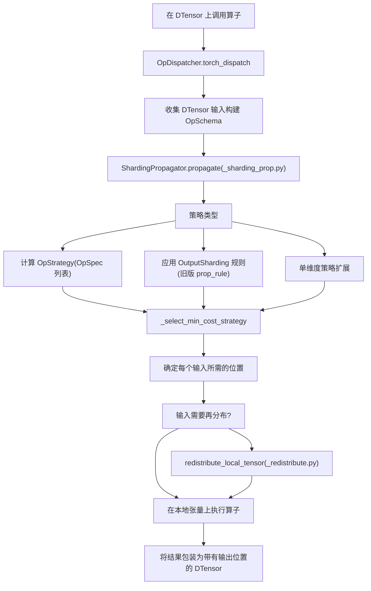
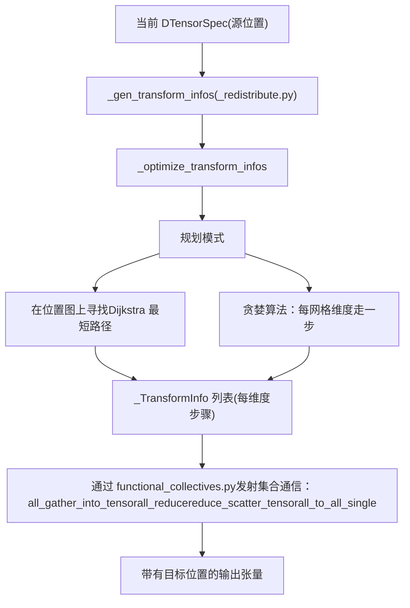

# DTensor：分布式张量抽象 (DTensor: Distributed Tensor Abstraction)

相关源文件 (Relevant source files)

-   [test/distributed/\_pycute/test\_coalesce.py](https://github.com/pytorch/pytorch/blob/915982a4/test/distributed/_pycute/test_coalesce.py)
-   [test/distributed/\_pycute/test\_complement.py](https://github.com/pytorch/pytorch/blob/915982a4/test/distributed/_pycute/test_complement.py)
-   [test/distributed/\_pycute/test\_composition.py](https://github.com/pytorch/pytorch/blob/915982a4/test/distributed/_pycute/test_composition.py)
-   [test/distributed/\_pycute/test\_int\_tuple.py](https://github.com/pytorch/pytorch/blob/915982a4/test/distributed/_pycute/test_int_tuple.py)
-   [test/distributed/\_pycute/test\_left\_inverse.py](https://github.com/pytorch/pytorch/blob/915982a4/test/distributed/_pycute/test_left_inverse.py)
-   [test/distributed/\_pycute/test\_right\_inverse.py](https://github.com/pytorch/pytorch/blob/915982a4/test/distributed/_pycute/test_right_inverse.py)
-   [test/distributed/\_pycute/test\_typing.py](https://github.com/pytorch/pytorch/blob/915982a4/test/distributed/_pycute/test_typing.py)
-   [test/distributed/tensor/debug/test\_debug\_mode.py](https://github.com/pytorch/pytorch/blob/915982a4/test/distributed/tensor/debug/test_debug_mode.py)
-   [test/distributed/tensor/experimental/test\_register\_sharding.py](https://github.com/pytorch/pytorch/blob/915982a4/test/distributed/tensor/experimental/test_register_sharding.py)
-   [test/distributed/tensor/test\_decompositions.py](https://github.com/pytorch/pytorch/blob/915982a4/test/distributed/tensor/test_decompositions.py)
-   [test/distributed/tensor/test\_dtensor.py](https://github.com/pytorch/pytorch/blob/915982a4/test/distributed/tensor/test_dtensor.py)
-   [test/distributed/tensor/test\_dtensor\_compile.py](https://github.com/pytorch/pytorch/blob/915982a4/test/distributed/tensor/test_dtensor_compile.py)
-   [test/distributed/tensor/test\_dtensor\_dispatch\_overhead.py](https://github.com/pytorch/pytorch/blob/915982a4/test/distributed/tensor/test_dtensor_dispatch_overhead.py)
-   [test/distributed/tensor/test\_dtensor\_ops.py](https://github.com/pytorch/pytorch/blob/915982a4/test/distributed/tensor/test_dtensor_ops.py)
-   [test/distributed/tensor/test\_math\_ops.py](https://github.com/pytorch/pytorch/blob/915982a4/test/distributed/tensor/test_math_ops.py)
-   [test/distributed/tensor/test\_matrix\_ops.py](https://github.com/pytorch/pytorch/blob/915982a4/test/distributed/tensor/test_matrix_ops.py)
-   [test/distributed/tensor/test\_op\_strategy.py](https://github.com/pytorch/pytorch/blob/915982a4/test/distributed/tensor/test_op_strategy.py)
-   [test/distributed/tensor/test\_placement\_types.py](https://github.com/pytorch/pytorch/blob/915982a4/test/distributed/tensor/test_placement_types.py)
-   [test/distributed/tensor/test\_pointwise\_ops.py](https://github.com/pytorch/pytorch/blob/915982a4/test/distributed/tensor/test_pointwise_ops.py)
-   [test/distributed/tensor/test\_redistribute.py](https://github.com/pytorch/pytorch/blob/915982a4/test/distributed/tensor/test_redistribute.py)
-   [test/distributed/tensor/test\_single\_dim\_strategy.py](https://github.com/pytorch/pytorch/blob/915982a4/test/distributed/tensor/test_single_dim_strategy.py)
-   [test/distributed/tensor/test\_tensor\_ops.py](https://github.com/pytorch/pytorch/blob/915982a4/test/distributed/tensor/test_tensor_ops.py)
-   [test/distributed/tensor/test\_utils.py](https://github.com/pytorch/pytorch/blob/915982a4/test/distributed/tensor/test_utils.py)
-   [test/distributed/tensor/test\_view\_ops.py](https://github.com/pytorch/pytorch/blob/915982a4/test/distributed/tensor/test_view_ops.py)
-   [test/distributed/test\_device\_mesh.py](https://github.com/pytorch/pytorch/blob/915982a4/test/distributed/test_device_mesh.py)
-   [test/dynamo/test\_aot\_autograd\_cache.py](https://github.com/pytorch/pytorch/blob/915982a4/test/dynamo/test_aot_autograd_cache.py)
-   [torch/\_C/\_distributed.pyi](https://github.com/pytorch/pytorch/blob/915982a4/torch/_C/_distributed.pyi)
-   [torch/\_dynamo/backends/debugging.py](https://github.com/pytorch/pytorch/blob/915982a4/torch/_dynamo/backends/debugging.py)
-   [torch/\_dynamo/backends/distributed.py](https://github.com/pytorch/pytorch/blob/915982a4/torch/_dynamo/backends/distributed.py)
-   [torch/\_dynamo/variables/distributed.py](https://github.com/pytorch/pytorch/blob/915982a4/torch/_dynamo/variables/distributed.py)
-   [torch/\_functorch/\_aot\_autograd/autograd\_cache.py](https://github.com/pytorch/pytorch/blob/915982a4/torch/_functorch/_aot_autograd/autograd_cache.py)
-   [torch/\_inductor/runtime/benchmarking.py](https://github.com/pytorch/pytorch/blob/915982a4/torch/_inductor/runtime/benchmarking.py)
-   [torch/\_library/triton.py](https://github.com/pytorch/pytorch/blob/915982a4/torch/_library/triton.py)
-   [torch/\_meta\_registrations.py](https://github.com/pytorch/pytorch/blob/915982a4/torch/_meta_registrations.py)
-   [torch/csrc/distributed/Placement.h](https://github.com/pytorch/pytorch/blob/915982a4/torch/csrc/distributed/Placement.h)
-   [torch/csrc/distributed/python\_placement.cpp](https://github.com/pytorch/pytorch/blob/915982a4/torch/csrc/distributed/python_placement.cpp)
-   [torch/csrc/distributed/python\_placement.h](https://github.com/pytorch/pytorch/blob/915982a4/torch/csrc/distributed/python_placement.h)
-   [torch/csrc/dynamo/guards.h](https://github.com/pytorch/pytorch/blob/915982a4/torch/csrc/dynamo/guards.h)
-   [torch/distributed/\_composable/checkpoint\_activation.py](https://github.com/pytorch/pytorch/blob/915982a4/torch/distributed/_composable/checkpoint_activation.py)
-   [torch/distributed/\_composable/replicate.py](https://github.com/pytorch/pytorch/blob/915982a4/torch/distributed/_composable/replicate.py)
-   [torch/distributed/\_functional\_collectives.py](https://github.com/pytorch/pytorch/blob/915982a4/torch/distributed/_functional_collectives.py)
-   [torch/distributed/\_local\_tensor/\_\_init\_\_.py](https://github.com/pytorch/pytorch/blob/915982a4/torch/distributed/_local_tensor/__init__.py)
-   [torch/distributed/\_local\_tensor/\_c10d.py](https://github.com/pytorch/pytorch/blob/915982a4/torch/distributed/_local_tensor/_c10d.py)
-   [torch/distributed/\_mesh\_layout.py](https://github.com/pytorch/pytorch/blob/915982a4/torch/distributed/_mesh_layout.py)
-   [torch/distributed/\_ops/device\_mesh.py](https://github.com/pytorch/pytorch/blob/915982a4/torch/distributed/_ops/device_mesh.py)
-   [torch/distributed/\_pycute/\_\_init\_\_.py](https://github.com/pytorch/pytorch/blob/915982a4/torch/distributed/_pycute/__init__.py)
-   [torch/distributed/\_pycute/int\_tuple.py](https://github.com/pytorch/pytorch/blob/915982a4/torch/distributed/_pycute/int_tuple.py)
-   [torch/distributed/\_pycute/layout.py](https://github.com/pytorch/pytorch/blob/915982a4/torch/distributed/_pycute/layout.py)
-   [torch/distributed/\_pycute/typing.py](https://github.com/pytorch/pytorch/blob/915982a4/torch/distributed/_pycute/typing.py)
-   [torch/distributed/device\_mesh.py](https://github.com/pytorch/pytorch/blob/915982a4/torch/distributed/device_mesh.py)
-   [torch/distributed/optim/zero\_redundancy\_optimizer.py](https://github.com/pytorch/pytorch/blob/915982a4/torch/distributed/optim/zero_redundancy_optimizer.py)
-   [torch/distributed/tensor/README.md](https://github.com/pytorch/pytorch/blob/915982a4/torch/distributed/tensor/README.md)
-   [torch/distributed/tensor/\_api.py](https://github.com/pytorch/pytorch/blob/915982a4/torch/distributed/tensor/_api.py)
-   [torch/distributed/tensor/\_collective\_utils.py](https://github.com/pytorch/pytorch/blob/915982a4/torch/distributed/tensor/_collective_utils.py)
-   [torch/distributed/tensor/\_decompositions.py](https://github.com/pytorch/pytorch/blob/915982a4/torch/distributed/tensor/_decompositions.py)
-   [torch/distributed/tensor/\_dtensor\_spec.py](https://github.com/pytorch/pytorch/blob/915982a4/torch/distributed/tensor/_dtensor_spec.py)
-   [torch/distributed/tensor/\_nonlinear\_redux.py](https://github.com/pytorch/pytorch/blob/915982a4/torch/distributed/tensor/_nonlinear_redux.py)
-   [torch/distributed/tensor/\_op\_schema.py](https://github.com/pytorch/pytorch/blob/915982a4/torch/distributed/tensor/_op_schema.py)
-   [torch/distributed/tensor/\_ops/\_conv\_ops.py](https://github.com/pytorch/pytorch/blob/915982a4/torch/distributed/tensor/_ops/_conv_ops.py)
-   [torch/distributed/tensor/\_ops/\_embedding\_ops.py](https://github.com/pytorch/pytorch/blob/915982a4/torch/distributed/tensor/_ops/_embedding_ops.py)
-   [torch/distributed/tensor/\_ops/\_math\_ops.py](https://github.com/pytorch/pytorch/blob/915982a4/torch/distributed/tensor/_ops/_math_ops.py)
-   [torch/distributed/tensor/\_ops/\_matrix\_ops.py](https://github.com/pytorch/pytorch/blob/915982a4/torch/distributed/tensor/_ops/_matrix_ops.py)
-   [torch/distributed/tensor/\_ops/\_pointwise\_ops.py](https://github.com/pytorch/pytorch/blob/915982a4/torch/distributed/tensor/_ops/_pointwise_ops.py)
-   [torch/distributed/tensor/\_ops/\_random\_ops.py](https://github.com/pytorch/pytorch/blob/915982a4/torch/distributed/tensor/_ops/_random_ops.py)
-   [torch/distributed/tensor/\_ops/\_tensor\_ops.py](https://github.com/pytorch/pytorch/blob/915982a4/torch/distributed/tensor/_ops/_tensor_ops.py)
-   [torch/distributed/tensor/\_ops/\_view\_ops.py](https://github.com/pytorch/pytorch/blob/915982a4/torch/distributed/tensor/_ops/_view_ops.py)
-   [torch/distributed/tensor/\_ops/single\_dim\_strategy.py](https://github.com/pytorch/pytorch/blob/915982a4/torch/distributed/tensor/_ops/single_dim_strategy.py)
-   [torch/distributed/tensor/\_ops/utils.py](https://github.com/pytorch/pytorch/blob/915982a4/torch/distributed/tensor/_ops/utils.py)
-   [torch/distributed/tensor/\_redistribute.py](https://github.com/pytorch/pytorch/blob/915982a4/torch/distributed/tensor/_redistribute.py)
-   [torch/distributed/tensor/\_sharding\_prop.py](https://github.com/pytorch/pytorch/blob/915982a4/torch/distributed/tensor/_sharding_prop.py)
-   [torch/distributed/tensor/\_utils.py](https://github.com/pytorch/pytorch/blob/915982a4/torch/distributed/tensor/_utils.py)
-   [torch/distributed/tensor/debug/\_\_init\_\_.py](https://github.com/pytorch/pytorch/blob/915982a4/torch/distributed/tensor/debug/__init__.py)
-   [torch/distributed/tensor/examples/comm\_mode\_features\_example.py](https://github.com/pytorch/pytorch/blob/915982a4/torch/distributed/tensor/examples/comm_mode_features_example.py)
-   [torch/distributed/tensor/examples/flex\_attention\_cp.py](https://github.com/pytorch/pytorch/blob/915982a4/torch/distributed/tensor/examples/flex_attention_cp.py)
-   [torch/distributed/tensor/examples/torchrec\_sharding\_example.py](https://github.com/pytorch/pytorch/blob/915982a4/torch/distributed/tensor/examples/torchrec_sharding_example.py)
-   [torch/distributed/tensor/examples/visualize\_sharding\_example.py](https://github.com/pytorch/pytorch/blob/915982a4/torch/distributed/tensor/examples/visualize_sharding_example.py)
-   [torch/distributed/tensor/placement\_types.py](https://github.com/pytorch/pytorch/blob/915982a4/torch/distributed/tensor/placement_types.py)
-   [torch/testing/\_internal/common\_ops\_unbacked.py](https://github.com/pytorch/pytorch/blob/915982a4/torch/testing/_internal/common_ops_unbacked.py)
-   [torch/testing/\_internal/distributed/\_tensor/common\_dtensor.py](https://github.com/pytorch/pytorch/blob/915982a4/torch/testing/_internal/distributed/_tensor/common_dtensor.py)

## 目的与范围 (Purpose and Scope)

本页提供了 DTensor (`torch.distributed.tensor`) 的高层概览，这是 PyTorch 在 SPMD（单程序多数据）编程模型下表达分布式张量计算的抽象。内容涵盖了 DTensor 是如何创建的、算子分发（operator dispatch）是如何连接的、Autograd 如何与分布式张量交互，以及 `torch.compile` 如何与该系统集成。

子页面更深入地涵盖了各个子系统：

-   有关 `DTensor` 类 API 和 Placement 类型 (`Shard`, `Replicate`, `Partial`, `_StridedShard`)，请参阅 [4.2.1](/pytorch/pytorch/4.2.1-dtensor-architecture-and-placement-types)
-   有关分片传播 (Sharding propagation)、`OpStrategy` 和 `OpSpec`，请参阅 [4.2.2](/pytorch/pytorch/4.2.2-sharding-propagation-and-opstrategy)
-   有关再分布 (Redistribution) 逻辑和通信规划，请参阅 [4.2.3](/pytorch/pytorch/4.2.3-redistribution-and-communication-planning)
-   有关 `DebugMode` 和 `CommDebugMode` 可观测性工具，请参阅 [4.2.4](/pytorch/pytorch/4.2.4-debugmode-and-observability)
-   有关 `DeviceMesh`、`_MeshLayout` 和进程组管理，请参阅 [4.2.5](/pytorch/pytorch/4.2.5-devicemesh-and-device-topology)

有关底层的集合通信原语（NCCL, Gloo, 进程组），请参阅 [4.1](/pytorch/pytorch/4.1-c10d-collective-communication)。

---

## SPMD 编程模型 (SPMD Programming Model)

DTensor 实现了 SPMD 模型：同一个 Python 程序在每个 rank 上同时运行。每个 rank 持有一个全局描述张量的*本地分片 (local shard)*。在 DTensor 上的算子在每个分片上本地执行，当算子需要来自其他 rank 的数据时，会自动插入通信。

这消除了手动分发/收集张量或插入 `dist.all_reduce()` 调用的需要。程序员使用**位置规范 (placement specifications)** 为张量添加注解 —— 系统会根据需要插入集合通信。

---

## 核心抽象一览 (Core Abstractions at a Glance)

**DTensor 类层级结构和主要组件：**


来源： [torch/distributed/tensor/\_api.py290-335](https://github.com/pytorch/pytorch/blob/915982a4/torch/distributed/tensor/_api.py#L290-L335) [torch/distributed/tensor/placement\_types.py47-63](https://github.com/pytorch/pytorch/blob/915982a4/torch/distributed/tensor/placement_types.py#L47-L63) [torch/distributed/device\_mesh.py151-210](https://github.com/pytorch/pytorch/blob/915982a4/torch/distributed/device_mesh.py#L151-L210)

---

## DTensor 生命周期 (DTensor Lifecycle)

### 创建 DTensor (Creating DTensors)

| API | 描述 | 文件 |
| --- | --- | --- |
| `DTensor.from_local(local_tensor, mesh, placements)` | 包装一个现有的每 rank 本地张量 | `_api.py` |
| `distribute_tensor(tensor, mesh, placements)` | 将一个全局张量分片到网格上 | `_api.py` |
| `distribute_module(module, mesh, ...)` | 将 `nn.Module` 的参数转换为 DTensor | `_api.py` |
| `ones/zeros/rand/randn/empty/full(...)` | 与 torch 命名空间匹配的 DTensor 工厂函数 | `_api.py` |

`from_local` 由 autograd 函数 `_FromTorchTensor` [torch/distributed/tensor/\_api.py164-287](https://github.com/pytorch/pytorch/blob/915982a4/torch/distributed/tensor/_api.py#L164-L287) 支持，该函数根据本地张量和位置计算全局形状，并可选地运行跨 rank 形状检查（`run_check=True` 会从 rank 0 进行广播）。

`distribute_tensor` 将调用进程完整持有的全局张量进行分片。它调用 `Shard._split_tensor` 为当前 rank 提取正确的本地分片。

### 消费 DTensor (Consuming DTensors)

| API | 描述 |
| --- | --- |
| `dtensor.to_local()` | 返回带有 autograd 连接的 `_local_tensor`（通过 `_ToTorchTensor`） |
| `dtensor.redistribute(mesh, placements)` | 更改分布，插入集合通信 |
| `dtensor.full_tensor()` | 收集所有分片到一个副本张量；返回完整的张量 |

`to_local` 由 `_ToTorchTensor` [torch/distributed/tensor/\_api.py96-161](https://github.com/pytorch/pytorch/blob/915982a4/torch/distributed/tensor/_api.py#L96-L161) 支持。其反向传递将传入的梯度使用保存的 spec 重新包装回 `DTensor`。

---

## 算子分发流水线 (Operator Dispatch Pipeline)

当在 `DTensor` 上调用 PyTorch 算子时，它通过 `__torch_dispatch__` 被拦截。`OpDispatcher` 类 [torch/distributed/tensor/\_dispatch.py](https://github.com/pytorch/pytorch/blob/915982a4/torch/distributed/tensor/_dispatch.py) 负责编排整个过程：

**DTensor 算子分发流程：**


来源： [torch/distributed/tensor/\_sharding\_prop.py303-400](https://github.com/pytorch/pytorch/blob/915982a4/torch/distributed/tensor/_sharding_prop.py#L303-L400) [torch/distributed/tensor/\_redistribute.py1-50](https://github.com/pytorch/pytorch/blob/915982a4/torch/distributed/tensor/_redistribute.py#L1-L50)

### 策略注册 (Strategy Registration)

三种平行的注册模式并存：

1.  **`register_op_strategy`** — 注册一个函数 `(OpSchema) -> OpStrategy`（或 `TupleStrategy`）。`OpStrategy` 持有一个 `OpSpec` 对象列表，每个对象描述了一个有效的 `(input_placements, output_placements, redistribute_cost)` 元组。传播器会选择成本最低的一个。

2.  **`register_prop_rule`** — 注册一个旧版函数 `(OpSchema) -> OutputSharding`。用于较旧的算子。

3.  **`register_single_dim_strategy`** — 根据每维度位置模式注册分片规则；这些规则会被 `_expand_single_dim_strategy_to_mesh` 扩展为完整的网格策略。

关于 `register_op_strategy` 和 `register_prop_rule` 的详情，请参见 [torch/distributed/tensor/\_ops/utils.py](https://github.com/pytorch/pytorch/blob/915982a4/torch/distributed/tensor/_ops/utils.py)。

策略按类别实现在：

| 文件 | 类别 |
| --- | --- |
| `_ops/_pointwise_ops.py` | 通过 `pointwise_rule` 实现逐元素算子 |
| `_ops/_math_ops.py` | 归约、范数、scatter/gather |
| `_ops/_tensor_ops.py` | Reshape, select, slice 等 |
| `_ops/_matrix_ops.py` | 矩阵乘法、线性层 |
| `_ops/single_dim_strategy.py` | 单维度分片模式 |

---

## 再分布与通信 (Redistribution and Communication)

当算子所需的输入位置与实际的 DTensor 位置不同时，将调用 `redistribute_local_tensor` [torch/distributed/tensor/\_redistribute.py](https://github.com/pytorch/pytorch/blob/915982a4/torch/distributed/tensor/_redistribute.py)。它会生成一个由一个或多个集合通信操作组成的计划：

**再分布规划：**


来源： [torch/distributed/tensor/\_redistribute.py1-100](https://github.com/pytorch/pytorch/blob/915982a4/torch/distributed/tensor/_redistribute.py#L1-L100) [torch/distributed/\_functional\_collectives.py](https://github.com/pytorch/pytorch/blob/915982a4/torch/distributed/_functional_collectives.py)

### 位置转换表 (Placement Transition Table)

| 起始位置 | 目标位置 | 集合通信操作 |
| --- | --- | --- |
| `Shard(d)` | `Replicate` | `all_gather_into_tensor` |
| `Replicate` | `Shard(d)` | 本地切片（无通信） |
| `Partial(sum)` | `Replicate` | `all_reduce` |
| `Partial(sum)` | `Shard(d)` | `reduce_scatter_tensor` |
| `Shard(d)` | `Shard(e)` | `shard_dim_alltoall` |

---

## Autograd 集成 (Autograd Integration)

DTensor 通过两个 `torch.autograd.Function` 包装器参与 PyTorch 的 autograd 引擎：

-   **`_FromTorchTensor`** [torch/distributed/tensor/\_api.py164-237](https://github.com/pytorch/pytorch/blob/915982a4/torch/distributed/tensor/_api.py#L164-L237) —— 前向传递：从本地张量构建 `DTensor`。反向传递：将传入的 `DTensor` 梯度再分布以匹配前向输入的分布。

-   **`_ToTorchTensor`** [torch/distributed/tensor/\_api.py96-161](https://github.com/pytorch/pytorch/blob/915982a4/torch/distributed/tensor/_api.py#L96-L161) —— 前向传递：返回原始的 `_local_tensor`。反向传递：使用保存在 `ctx` 中的 spec 将传入的普通张量梯度包装回 `DTensor`。

梯度位置遵循一个约定：`Partial` 前向分布产生 `Replicate` 梯度分布（因为在前向中每个 rank 仅持有一部分贡献，所以在反向期间梯度已经是该 rank 的全梯度了）。

---

## `torch.compile` 集成 (torch.compile Integration)

DTensor 旨在与 `torch.compile` 配合工作。分发机制通过 `__torch_dispatch__` 进行，这对 TorchDynamo 是透明的。Dynamo 会追踪 DTensor 操作，并看到底层的 ATen 算子加上集合通信调用。

关键集成点：

-   `DeviceMesh` 进程组通过 `_get_pg_from_name` [torch/distributed/device\_mesh.py74-92](https://github.com/pytorch/pytorch/blob/915982a4/torch/distributed/device_mesh.py#L74-L92) 被作为编译图中的输入提取出来，以避免在网格改变时重新追踪。
-   在 `ShardingPropagator._propagate_tensor_meta` 内部使用 DTensorSpec 的元数据进行 `FakeTensorMode` 传播，允许在没有真实数据的情况下进行形状传播。
-   `_FromTorchTensor` 和 `_ToTorchTensor` 这两个 autograd 函数可通过 `mark_subclass_constructor_exportable_experimental` 导出。

---

## LocalTensorMode：单进程模拟 (LocalTensorMode: Single-Process Simulation)

`LocalTensorMode` [torch/distributed/\_local\_tensor/\_\_init\_\_.py](https://github.com/pytorch/pytorch/blob/915982a4/torch/distributed/_local_tensor/__init__.py) 提供了一种机制，可以在单个进程上运行完整的 DTensor 分发栈（包括集合通信）。每个“分片”在 rank 0 上被持有一个列表中的元素。通过应用数学上等价的本地转换来模拟集合通信操作。

这在测试中被大量使用，以便在不启动多个进程的情况下运行 DTensor 逻辑。`LocalTensor` 子类通过拦截分发并将每个操作路由到每个分片的本地张量来处理此模拟。

---

## 可观测性 (Observability)

| 工具 | 位置 | 目的 |
| --- | --- | --- |
| `DebugMode` | `torch/utils/_debug_mode.py` | 在分层日志中记录每个 `__torch_dispatch__` 调用，包括再分布步骤 |
| `CommDebugMode` | `torch/distributed/tensor/debug/__init__.py` | 在上下文中对集合通信调用（all\_reduce, all\_gather 等）进行计数和分类 |

`CommDebugMode` 是在模型开发期间审计通信量的主要工具。来自测试的示例用法 [test/distributed/tensor/test\_redistribute.py90-103](https://github.com/pytorch/pytorch/blob/915982a4/test/distributed/tensor/test_redistribute.py#L90-L103)：

```python
comm_mode = CommDebugMode()
with comm_mode:    
    reshard_dtensor = dtensor.redistribute(device_mesh, [Replicate()])
comm_mode.get_comm_counts()[funcol.all_gather_into_tensor]  # == 1
```
有关这两个调试工具的更多细节，请参见 [4.2.4](/pytorch/pytorch/4.2.4-debugmode-and-observability)。

---

## 关键文件索引 (Key File Index)

| 文件 | 角色 |
| --- | --- |
| `torch/distributed/tensor/_api.py` | `DTensor` 类, `from_local`, `to_local`, `distribute_tensor`, `distribute_module` |
| `torch/distributed/tensor/placement_types.py` | `Shard`, `Replicate`, `Partial`, `_StridedShard` |
| `torch/distributed/device_mesh.py` | `DeviceMesh`, `init_device_mesh`, 进程组管理 |
| `torch/distributed/_mesh_layout.py` | `_MeshLayout`（受 CuTe 启发的布局代数，用于内部簿记） |
| `torch/distributed/tensor/_dtensor_spec.py` | `DTensorSpec`, `TensorMeta`, `ShardOrderEntry` |
| `torch/distributed/tensor/_sharding_prop.py` | `ShardingPropagator`, 策略选择 |
| `torch/distributed/tensor/_op_schema.py` | `OpSchema`, `OpStrategy`, `OpSpec`, `TupleStrategy`, `OutputSharding` |
| `torch/distributed/tensor/_redistribute.py` | `redistribute_local_tensor`, `_TransformInfo`, Dijkstra/贪婪规划器 |
| `torch/distributed/tensor/_dispatch.py` | `OpDispatcher` — `__torch_dispatch__` 入口点 |
| `torch/distributed/_functional_collectives.py` | 函数式集合通信操作 (`all_gather_into_tensor` 等) |
| `torch/distributed/_local_tensor/__init__.py` | `LocalTensor`, `LocalTensorMode` 用于单进程模拟 |
| `torch/distributed/tensor/_ops/` | 各类算子的分片策略 |
| `torch/utils/_debug_mode.py` | `DebugMode` 可观测性工具 |

来源： [torch/distributed/tensor/\_api.py1-55](https://github.com/pytorch/pytorch/blob/915982a4/torch/distributed/tensor/_api.py#L1-L55) [torch/distributed/device\_mesh.py1-20](https://github.com/pytorch/pytorch/blob/915982a4/torch/distributed/device_mesh.py#L1-L20) [torch/distributed/tensor/\_sharding\_prop.py1-45](https://github.com/pytorch/pytorch/blob/915982a4/torch/distributed/tensor/_sharding_prop.py#L1-L45) [torch/distributed/tensor/\_op\_schema.py1-40](https://github.com/pytorch/pytorch/blob/915982a4/torch/distributed/tensor/_op_schema.py#L1-L40) [torch/distributed/tensor/\_redistribute.py1-40](https://github.com/pytorch/pytorch/blob/915982a4/torch/distributed/tensor/_redistribute.py#L1-L40) [torch/distributed/\_local\_tensor/\_\_init\_\_.py1-93](https://github.com/pytorch/pytorch/blob/915982a4/torch/distributed/_local_tensor/__init__.py#L1-L93)
