# DTensor 架构与分发 (DTensor Architecture and Dispatch)

相关源文件 (Relevant source files)

-   [test/distributed/tensor/debug/test\_debug\_mode.py](https://github.com/pytorch/pytorch/blob/915982a4/test/distributed/tensor/debug/test_debug_mode.py)
-   [test/distributed/tensor/test\_dtensor.py](https://github.com/pytorch/pytorch/blob/915982a4/test/distributed/tensor/test_dtensor.py)
-   [test/distributed/tensor/test\_dtensor\_compile.py](https://github.com/pytorch/pytorch/blob/915982a4/test/distributed/tensor/test_dtensor_compile.py)
-   [test/distributed/tensor/test\_placement\_types.py](https://github.com/pytorch/pytorch/blob/915982a4/test/distributed/tensor/test_placement_types.py)
-   [test/distributed/tensor/test\_redistribute.py](https://github.com/pytorch/pytorch/blob/915982a4/test/distributed/tensor/test_redistribute.py)
-   [test/distributed/tensor/test\_utils.py](https://github.com/pytorch/pytorch/blob/915982a4/test/distributed/tensor/test_utils.py)
-   [test/dynamo/test\_aot\_autograd\_cache.py](https://github.com/pytorch/pytorch/blob/915982a4/test/dynamo/test_aot_autograd_cache.py)
-   [torch/\_C/\_distributed.pyi](https://github.com/pytorch/pytorch/blob/915982a4/torch/_C/_distributed.pyi)
-   [torch/\_dynamo/backends/debugging.py](https://github.com/pytorch/pytorch/blob/915982a4/torch/_dynamo/backends/debugging.py)
-   [torch/\_dynamo/backends/distributed.py](https://github.com/pytorch/pytorch/blob/915982a4/torch/_dynamo/backends/distributed.py)
-   [torch/\_dynamo/variables/distributed.py](https://github.com/pytorch/pytorch/blob/915982a4/torch/_dynamo/variables/distributed.py)
-   [torch/\_functorch/\_aot\_autograd/autograd\_cache.py](https://github.com/pytorch/pytorch/blob/915982a4/torch/_functorch/_aot_autograd/autograd_cache.py)
-   [torch/\_inductor/runtime/benchmarking.py](https://github.com/pytorch/pytorch/blob/915982a4/torch/_inductor/runtime/benchmarking.py)
-   [torch/\_library/triton.py](https://github.com/pytorch/pytorch/blob/915982a4/torch/_library/triton.py)
-   [torch/csrc/distributed/Placement.h](https://github.com/pytorch/pytorch/blob/915982a4/torch/csrc/distributed/Placement.h)
-   [torch/csrc/distributed/python\_placement.cpp](https://github.com/pytorch/pytorch/blob/915982a4/torch/csrc/distributed/python_placement.cpp)
-   [torch/csrc/distributed/python\_placement.h](https://github.com/pytorch/pytorch/blob/915982a4/torch/csrc/distributed/python_placement.h)
-   [torch/csrc/dynamo/guards.h](https://github.com/pytorch/pytorch/blob/915982a4/torch/csrc/dynamo/guards.h)
-   [torch/distributed/\_functional\_collectives.py](https://github.com/pytorch/pytorch/blob/915982a4/torch/distributed/_functional_collectives.py)
-   [torch/distributed/tensor/README.md](https://github.com/pytorch/pytorch/blob/915982a4/torch/distributed/tensor/README.md)
-   [torch/distributed/tensor/\_api.py](https://github.com/pytorch/pytorch/blob/915982a4/torch/distributed/tensor/_api.py)
-   [torch/distributed/tensor/\_collective\_utils.py](https://github.com/pytorch/pytorch/blob/915982a4/torch/distributed/tensor/_collective_utils.py)
-   [torch/distributed/tensor/\_dtensor\_spec.py](https://github.com/pytorch/pytorch/blob/915982a4/torch/distributed/tensor/_dtensor_spec.py)
-   [torch/distributed/tensor/\_ops/\_embedding\_ops.py](https://github.com/pytorch/pytorch/blob/915982a4/torch/distributed/tensor/_ops/_embedding_ops.py)
-   [torch/distributed/tensor/\_redistribute.py](https://github.com/pytorch/pytorch/blob/915982a4/torch/distributed/tensor/_redistribute.py)
-   [torch/distributed/tensor/\_utils.py](https://github.com/pytorch/pytorch/blob/915982a4/torch/distributed/tensor/_utils.py)
-   [torch/distributed/tensor/placement\_types.py](https://github.com/pytorch/pytorch/blob/915982a4/torch/distributed/tensor/placement_types.py)

## 目的与范围 (Purpose and Scope)

本页描述了 DTensor (Distributed Tensor) 的核心架构，重点关注 DTensor 对象的结构、放置类型 (placement types) 的语义以及分发 (dispatch) 机制。DTensor 是一个张量子类，为多设备张量提供了类似于单设备的抽象，通过自动分片传播 (sharding propagation) 和通信插入来允许分布式计算。

本页涵盖：

-   DTensor 对象的结构及其规范 (`DTensor`, `DTensorSpec`, `TensorMeta`)
-   描述设备拓扑的 `DeviceMesh` 抽象
-   **放置类型** (`Shard`, `Replicate`, `Partial`, `_StridedShard`) 及其语义
-   拦截操作并将其路由到分片执行的分发机制
-   放置信息如何通过操作进行传播

有关再分布 (redistribution) 规划和通信模式的详情，请参阅第 4.1.2 页。有关调试和可观测性工具，请参阅第 4.1.3 页。

## DTensor 对象结构 (DTensor Object Structure)

`DTensor` 是 `torch.Tensor` 的子类，它包装了一个本地张量分片 (local tensor shard) 以及描述其全局结构的元数据。

### 核心组件 (Core Components)

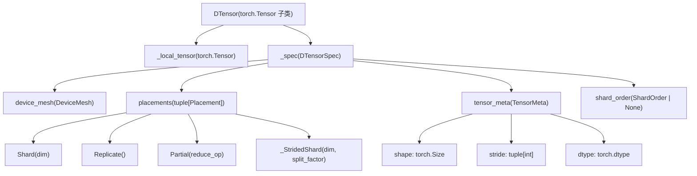
**来源：** [torch/distributed/tensor/\_api.py248-293](https://github.com/pytorch/pytorch/blob/915982a4/torch/distributed/tensor/_api.py#L248-L293) [torch/distributed/tensor/\_dtensor\_spec.py1-100](https://github.com/pytorch/pytorch/blob/915982a4/torch/distributed/tensor/_dtensor_spec.py#L1-L100)

### DTensorSpec

`DTensorSpec` 类封装了描述张量如何分布所需的所有元数据：

| 字段 | 类型 | 描述 |
| --- | --- | --- |
| `mesh` | `DeviceMesh` | 设备的一维或多维网格 |
| `placements` | `tuple[Placement, ...]` | 每个网格维度对应一个放置规范 |
| `tensor_meta` | `TensorMeta` | 全局形状、步长 (stride)、数据类型 (dtype) |
| `shard_order` | `ShardOrder | None` | 用于多维分片的可选顺序 |

`placements` 元组的长度等于 `mesh.ndim`，其中每个放置规范描述了张量如何沿对应的网格维度分布。

#### ShardOrder (分片顺序)

当一个张量维度跨多个网格维度被分片时，`shard_order` 指定了这些分片被应用的序列。每个 `ShardOrderEntry` 包含：

-   `tensor_dim`：被分片的张量维度
-   `mesh_dims`：按执行顺序排列的网格维度元组

示例：

```python
# 张量维度 0 在网格维度 1 上分片，张量维度 1 先在网格维度 0 分片，再在网格维度 2 分片
shard_order = (    
    ShardOrderEntry(tensor_dim=0, mesh_dims=(1,)),    
    ShardOrderEntry(tensor_dim=1, mesh_dims=(0, 2)),
)
```
**来源：** [torch/distributed/tensor/\_dtensor\_spec.py21-90](https://github.com/pytorch/pytorch/blob/915982a4/torch/distributed/tensor/_dtensor_spec.py#L21-L90) [torch/distributed/tensor/\_dtensor\_spec.py68-254](https://github.com/pytorch/pytorch/blob/915982a4/torch/distributed/tensor/_dtensor_spec.py#L68-L254)

## DeviceMesh (设备网格)

`DeviceMesh` 类表示一个 N 维的设备网格（例如 GPU），构成了分布式张量操作的拓扑结构。

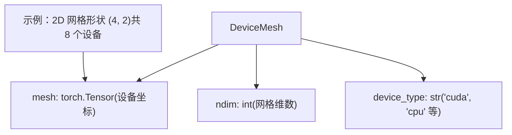
关键属性：

-   `mesh.shape`：描述网格维度的元组（例如 `(4, 2)` 表示一个 4 行 2 列的 2D 网格）
-   `mesh.ndim`：网格的维数
-   `mesh.size(mesh_dim)`：特定网格维度的尺寸
-   `mesh.get_coordinate()`：返回当前 rank 的坐标元组

每个 DTensor 的 placements 元组必须与 `mesh.ndim` 长度相等，每个网格维度对应一个放置规范。

**来源：** [torch/distributed/device\_mesh.py](https://github.com/pytorch/pytorch/blob/915982a4/torch/distributed/device_mesh.py) [torch/distributed/tensor/\_dtensor\_spec.py69-71](https://github.com/pytorch/pytorch/blob/915982a4/torch/distributed/tensor/_dtensor_spec.py#L69-L71)

## 放置类型 (Placement Types)

放置类型描述了一个 DTensor 如何沿特定的网格维度分布。共有四种放置类型：`Shard`、`Replicate`、`Partial` 和 `_StridedShard`。

### 放置类型概览 (Placement Type Overview)

图表：**放置类型层级结构**

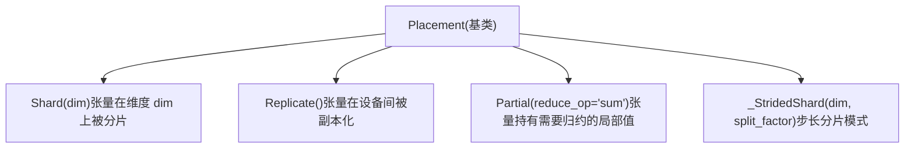
**来源：** [torch/distributed/tensor/placement\_types.py27-34](https://github.com/pytorch/pytorch/blob/915982a4/torch/distributed/tensor/placement_types.py#L27-L34) [torch/\_C/\_distributed.pyi3-15](https://github.com/pytorch/pytorch/blob/915982a4/torch/_C/_distributed.pyi#L3-L15)

### Shard 放置 (Shard Placement)

`Shard(dim)` 表示一个张量沿张量维度 `dim`，在对应网格维度的设备间被分片（切分）。分片遵循 `torch.chunk` 语义。

图表：**4 个设备上的 Shard(0)**

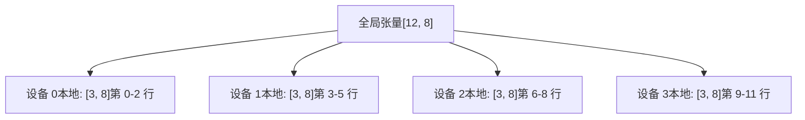
关键方法 ([torch/distributed/tensor/placement\_types.py36-287](https://github.com/pytorch/pytorch/blob/915982a4/torch/distributed/tensor/placement_types.py#L36-L287))：

-   `_split_tensor(tensor, num_chunks)`：将张量切分为分片，可针对不均匀切分进行可选填充 (padding)。
-   `_select_split_tensor(tensor, num_chunks, index)`：仅返回给定索引处的分片（已优化）。
-   `local_shard_size_and_offset(curr_local_size, num_chunks, rank)`：计算本地分片的大小和偏移量。

**不均匀分片 (Uneven Sharding)**：当张量维度的大小不能被设备数量整除时，最后几个设备可能会收到较小的分片或空张量。实现会在必要时为集合通信操作填充这些分片。

示例：

```python
# 形状为 [10, 8] 的张量在 4 个设备上沿维度 0 分片：
# 设备 0: [3, 8] (第 0-2 行)
# 设备 1: [3, 8] (第 3-5 行)
# 设备 2: [3, 8] (第 6-8 行)
# 设备 3: [1, 8] (第 9 行)
```
**来源：** [torch/distributed/tensor/placement\_types.py36-287](https://github.com/pytorch/pytorch/blob/915982a4/torch/distributed/tensor/placement_types.py#L36-L287) [test/distributed/tensor/test\_redistribute.py346-392](https://github.com/pytorch/pytorch/blob/915982a4/test/distributed/tensor/test_redistribute.py#L346-L392)

### Replicate 放置 (Replicate Placement)

`Replicate()` 表示每个设备都持有一个张量的完整副本。所有设备上的数据都是一致的。

图表：**4 个设备上的 Replicate**

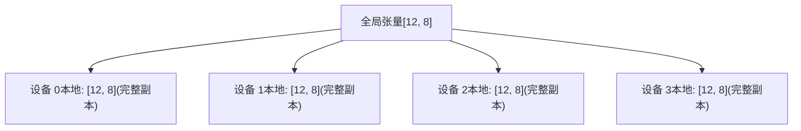
Replicate 放置用于：

-   操作需要访问完整张量的情况（例如沿分片维度进行 softmax）。
-   将参数广播到所有设备。
-   确保所有设备都能独立计算出结果。

关键行为：

-   `to_local()` 返回完整的本地张量，无需通信。
-   梯度累加：在反向传播期间，梯度会在副本设备间求和。

**来源：** [torch/distributed/tensor/placement\_types.py510-525](https://github.com/pytorch/pytorch/blob/915982a4/torch/distributed/tensor/placement_types.py#L510-L525) [test/distributed/tensor/test\_redistribute.py110-136](https://github.com/pytorch/pytorch/blob/915982a4/test/distributed/tensor/test_redistribute.py#L110-L136)

### Partial 放置 (Partial Placement)

`Partial(reduce_op='sum')` 表示每个设备持有一个局部结果，该结果需要在设备间进行归约 (reduction)。这是一个中间状态，通常由归约操作产生，或是张量并行策略的一部分。

图表：**4 个设备上的 Partial (sum)**

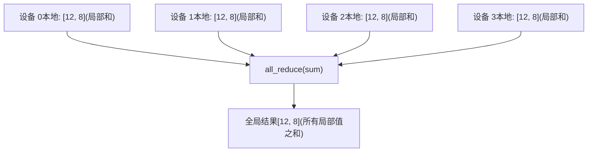
支持的归约操作 ([torch/distributed/tensor/placement\_types.py527-536](https://github.com/pytorch/pytorch/blob/915982a4/torch/distributed/tensor/placement_types.py#L527-L536))：

-   `"sum"`：跨设备对局部值求和。
-   `"max"`：跨设备取局部值的最大值。
-   `"min"`：跨设备取局部值的最小值。
-   `"prod"`：跨设备对局部值求积。
-   `"mean"`：跨设备对局部值求平均。
-   `"all"`：跨设备进行逻辑与 (AND)。
-   `"any"`：跨设备进行逻辑或 (OR)。

**常用用法模式：**

```python
# 按行并行的线性层 (RowwiseParallel linear layer) 产生 Partial 输出：
# input: Replicate
# weight: Shard(0)  
# output = input @ weight.T → Partial (需要 all_reduce)
```
**转换为其他放置类型：**

-   `Partial → Replicate`：需要 `all_reduce` 集合通信。
-   `Partial → Shard(dim)`：需要 `reduce_scatter` 集合通信。

**来源：** [torch/distributed/tensor/placement\_types.py527-666](https://github.com/pytorch/pytorch/blob/915982a4/torch/distributed/tensor/placement_types.py#L527-L666) [test/distributed/tensor/test\_redistribute.py139-177](https://github.com/pytorch/pytorch/blob/915982a4/test/distributed/tensor/test_redistribute.py#L139-L177) [test/distributed/tensor/test\_redistribute.py253-289](https://github.com/pytorch/pytorch/blob/915982a4/test/distributed/tensor/test_redistribute.py#L253-L289)

### \_StridedShard 放置 (\_StridedShard Placement)

`_StridedShard(dim, split_factor)` 是一种高级放置类型，表示步长分片 (strided sharding) 模式。与使用连续块的常规 `Shard` 不同，`_StridedShard` 按照特定的步长模式分布元素。

`split_factor` 参数控制步长模式的粒度。这通常用于需要更精细分布的高级张量并行策略。

示例：

```python
# 在 4 个设备上，对形状为 [16, 8] 的张量进行 StridedShard(0, split_factor=2)：
# 设备 0: [0, 2, 4, 6, 8, 10, 12, 14] 行 (偶数行)
# 设备 1: [1, 3, 5, 7, 9, 11, 13, 15] 行 (奇数行)
# (当 split_factor=2 时，对于该维度，网格被视为只有 2 个设备)
```
**重要提示：** `_StridedShard` 是一个内部实验性的放置类型（由 `_` 前缀标识），其 API 可能会发生变化。从或到 `_StridedShard` 的再分布需要基于图的再分布规划器，而不是贪婪算法。

**来源：** [torch/distributed/tensor/placement\_types.py668-842](https://github.com/pytorch/pytorch/blob/915982a4/torch/distributed/tensor/placement_types.py#L668-L842) [torch/distributed/tensor/\_redistribute.py38-48](https://github.com/pytorch/pytorch/blob/915982a4/torch/distributed/tensor/_redistribute.py#L38-L48) [test/distributed/tensor/test\_utils.py57-59](https://github.com/pytorch/pytorch/blob/915982a4/test/distributed/tensor/test_utils.py#L57-L59)

### 放置组合 (Placement Combinations)

可以组合多种放置类型，以描述跨多个网格维度的分布：

**示例：2D 网格 (4, 2)，放置规范为 [Shard(0), Shard(1)]**

```python
# 张量形状: [16, 16]
# 网格: 4x2 = 8 个设备
# 放置规范: [Shard(0), Shard(1)]
# 
# 每个设备得到一个 [4, 8] 的本地张量：
# - 维度 0 在第一个网格维度上分片（4 个块）
# - 维度 1 在第二个网格维度上分片（2 个块）
```
**示例：2D 网格，放置规范为 [Shard(0), Replicate()]**

```python
# 张量形状: [16, 16]
# 网格: 4x2 = 8 个设备
# 放置规范: [Shard(0), Replicate()]
#
# 维度 0 在第一个网格维度上分片（4 个块）
# 在第二个网格维度上副本化
# 设备 (0,0) 和 (0,1) 拥有相同的本地张量 [4, 16]
# 设备 (1,0) 和 (1,1) 拥有相同的本地张量 [4, 16]
# 依此类推。
```
常见的放置模式：

-   `[Shard(0), Shard(1)]`：2D 分片，适用于超大型张量。
-   `[Shard(0), Replicate()]`：第一维数据并行，第二维张量并行。
-   `[Replicate(), Shard(0)]`：第一维张量并行，第二维数据并行。
-   `[Partial(), Replicate()]`：第一维需要局部归约，第二维副本化。

**来源：** [torch/distributed/tensor/\_dtensor\_spec.py92-254](https://github.com/pytorch/pytorch/blob/915982a4/torch/distributed/tensor/_dtensor_spec.py#L92-L254) [test/distributed/tensor/test\_dtensor.py406-410](https://github.com/pytorch/pytorch/blob/915982a4/test/distributed/tensor/test_dtensor.py#L406-L410)

## 分发机制概览 (Dispatch Mechanism Overview)

DTensor 实现了 `__torch_dispatch__` 以拦截 DTensor 对象上的所有操作，并将它们路由到专门的分发系统。

### 分发架构 (Dispatch Architecture)

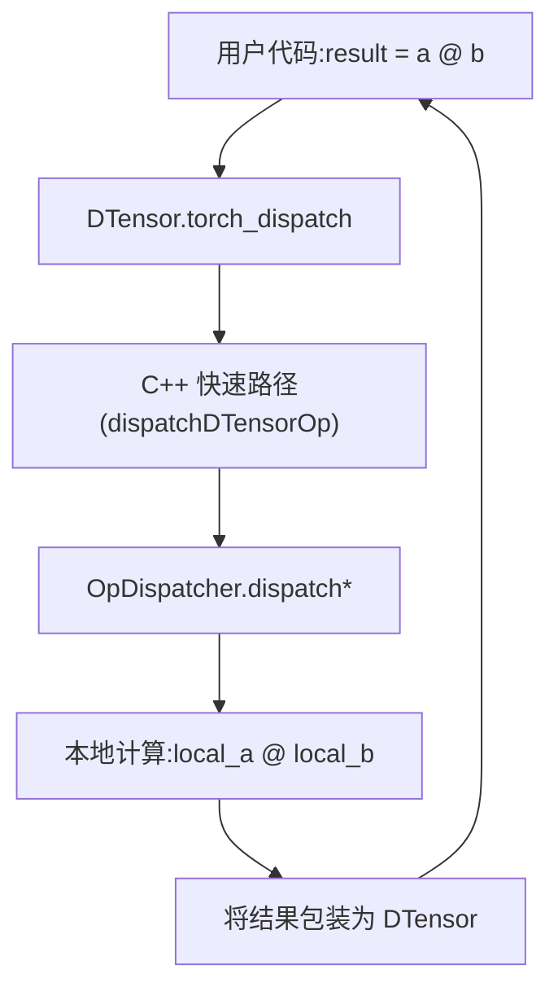
分发流程已经通过 C++ 快速路径进行了优化，在回退到 Python 之前处理常见情况。

**来源：** [torch/distributed/tensor/\_dispatch.py124-178](https://github.com/pytorch/pytorch/blob/915982a4/torch/distributed/tensor/_dispatch.py#L124-L178) [torch/distributed/tensor/\_api.py534-566](https://github.com/pytorch/pytorch/blob/915982a4/torch/distributed/tensor/_api.py#L534-L566)

### OpDispatcher 类 (OpDispatcher Class)

`OpDispatcher` 类 ([torch/distributed/tensor/\_dispatch.py124-137](https://github.com/pytorch/pytorch/blob/915982a4/torch/distributed/tensor/_dispatch.py#L124-L137)) 是核心的分发协调器。它维护：

-   `sharding_propagator`：一个用于确定输出分片的 `ShardingPropagator` 实例。
-   `_random_ops`：需要特殊 RNG 处理的随机算子集。
-   `_custom_op_handlers`：需要自定义分发逻辑的算子字典。

关键方法：

| 方法 | 用途 |
| --- | --- |
| `unwrap_to_op_info()` | 将 DTensor 参数解包装为本地张量，并创建 `OpInfo` |
| `_propagate_op_sharding_dispatch_slow_path()` | 通过 `ShardingPropagator` 确定输出分片 |
| `_dispatch_get_local_results_slow_path()` | 如果需要则执行再分布，并运行本地算子 |
| `_dispatch_fast_path_python_tail()` | 将结果包装回 DTensor |
| `redistribute_local_args()` | 当分片传播需要时，对参数进行再分布 |

**来源：** [torch/distributed/tensor/\_dispatch.py124-652](https://github.com/pytorch/pytorch/blob/915982a4/torch/distributed/tensor/_dispatch.py#L124-L652)

## 详细分发流程 (Detailed Dispatch Flow)

### 阶段 1：参数解包装 (Phase 1: Argument Unwrapping)

> **[Mermaid sequence]**
> *(图表结构无法解析)*

`unwrap_to_op_info` 方法 ([torch/distributed/tensor/\_dispatch.py520-609](https://github.com/pytorch/pytorch/blob/915982a4/torch/distributed/tensor/_dispatch.py#L520-L609)) 提取：

-   用于实际计算的 DTensor 参数中的**本地张量**。
-   描述每个 DTensor 参数分片情况的 **DTensorSpec** 对象。
-   **计算网格 (Compute mesh)** —— 所有 DTensor 参数共有的 DeviceMesh。
-   操作的 **Schema 信息**。

**来源：** [torch/distributed/tensor/\_dispatch.py520-609](https://github.com/pytorch/pytorch/blob/915982a4/torch/distributed/tensor/_dispatch.py#L520-L609)

### 阶段 2：分片传播 (Phase 2: Sharding Propagation)

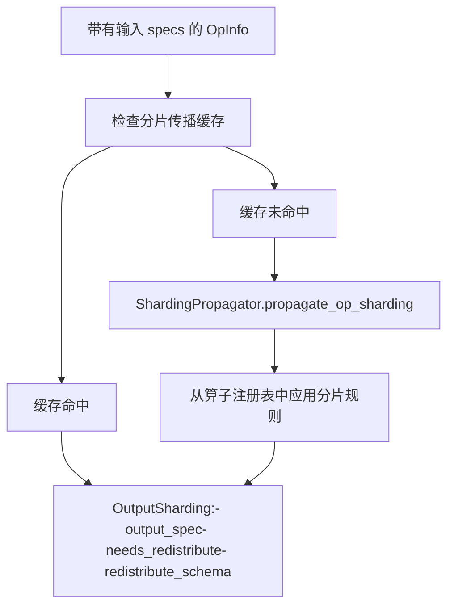
`ShardingPropagator` ([torch/distributed/tensor/\_sharding\_prop.py](https://github.com/pytorch/pytorch/blob/915982a4/torch/distributed/tensor/_sharding_prop.py)) 基于以下内容确定输出分片规范：

1.  来自 DTensor 参数的**输入分片 specs**。
2.  **算子语义**（已注册的分片规则）。
3.  **缓存查找**，以避免重复计算。

结果是一个 `OutputSharding` 对象，包含：

-   `output_spec`：输出的分片规范。
-   `needs_redistribute`：是否有任何输入需要重新分片。
-   `redistribute_schema`：如果需要，输入重新分片的目标 specs。

**来源：** [torch/distributed/tensor/\_dispatch.py191-246](https://github.com/pytorch/pytorch/blob/915982a4/torch/distributed/tensor/_dispatch.py#L191-L246) [torch/distributed/tensor/\_sharding\_prop.py](https://github.com/pytorch/pytorch/blob/915982a4/torch/distributed/tensor/_sharding_prop.py)

### 阶段 3：再分布（如果需要） (Phase 3: Redistribution (if needed))

当 `needs_redistribute` 为 true 时，`redistribute_local_args` 方法 ([torch/distributed/tensor/\_dispatch.py461-519](https://github.com/pytorch/pytorch/blob/915982a4/torch/distributed/tensor/_dispatch.py#L461-L519)) 执行集合通信，以将输入张量转换为所需的分片：

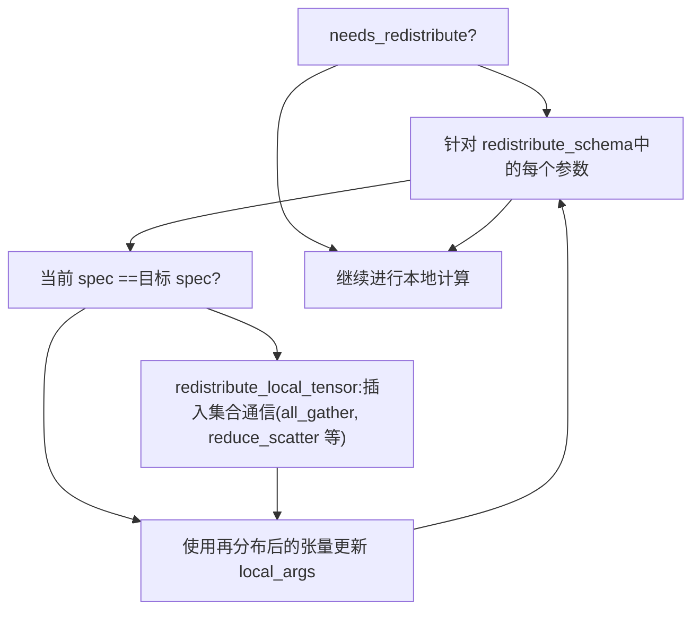
再分布由 `redistribute_local_tensor` ([torch/distributed/tensor/\_redistribute.py](https://github.com/pytorch/pytorch/blob/915982a4/torch/distributed/tensor/_redistribute.py)) 执行，该函数会插入必要的集合通信操作（all-gather, reduce-scatter, all-to-all 等）。

**来源：** [torch/distributed/tensor/\_dispatch.py461-519](https://github.com/pytorch/pytorch/blob/915982a4/torch/distributed/tensor/_dispatch.py#L461-L519) [torch/distributed/tensor/\_redistribute.py184-391](https://github.com/pytorch/pytorch/blob/915982a4/torch/distributed/tensor/_redistribute.py#L184-L391)

### 阶段 4：本地计算 (Phase 4: Local Computation)

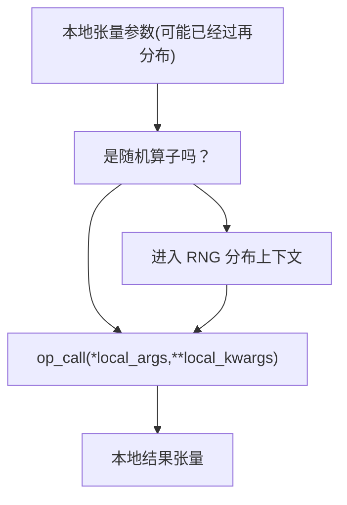
实际的计算发生在本地张量分片上。以下情况会有特殊处理：

-   **随机算子** ([torch/distributed/tensor/\_dispatch.py289-318](https://github.com/pytorch/pytorch/blob/915982a4/torch/distributed/tensor/_dispatch.py#L289-L318))：在 `RNGTracker` 上下文中执行，以确保分布式随机数生成的确定性。
-   **非参与 rank** ([torch/distributed/tensor/\_dispatch.py323-365](https://github.com/pytorch/pytorch/blob/915982a4/torch/distributed/tensor/_dispatch.py#L323-L365))：不在设备网格中的 rank 返回空张量。
-   **自定义处理器** ([torch/distributed/tensor/\_dispatch.py156-166](https://github.com/pytorch/pytorch/blob/915982a4/torch/distributed/tensor/_dispatch.py#L156-L166))：某些算子（例如 `convolution`, `as_strided`）具有自定义的分发逻辑。

**来源：** [torch/distributed/tensor/\_dispatch.py247-365](https://github.com/pytorch/pytorch/blob/915982a4/torch/distributed/tensor/_dispatch.py#L247-L365)

### 阶段 5：结果包装 (Phase 5: Result Wrapping)

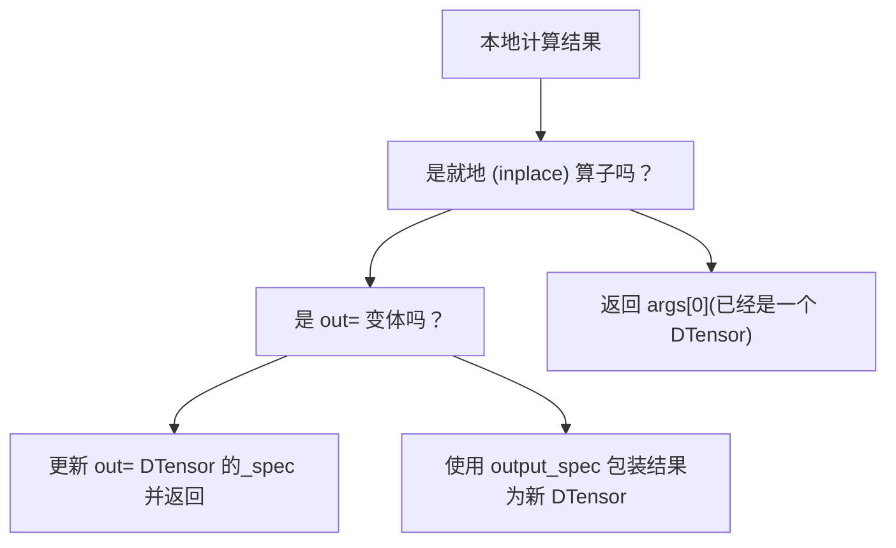
包装逻辑 ([torch/distributed/tensor/\_dispatch.py367-460](https://github.com/pytorch/pytorch/blob/915982a4/torch/distributed/tensor/_dispatch.py#L367-L460)) 处理三种情况：

1.  **就地操作**（例如 `add_`）：返回修改后的输入 DTensor。
2.  **带 out 参数的操作**（例如 `add(..., out=x)`）：更新 `out` DTensor 的 spec。
3.  **普通操作**：创建一个包装了本地结果的新 DTensor。

**来源：** [torch/distributed/tensor/\_dispatch.py367-460](https://github.com/pytorch/pytorch/blob/915982a4/torch/distributed/tensor/_dispatch.py#L367-L460)

## C++ 快速路径优化 (C++ Fast Path Optimization)

为了尽量减少 Python 开销，常见的分发情况在 C++ 中处理：

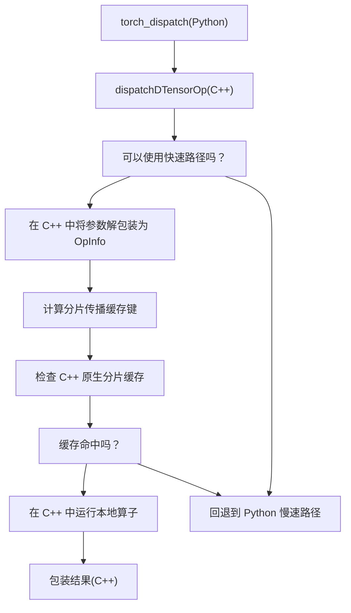
C++ 快速路径（如注释中提到的 [torch/csrc/autograd/python\_variable.cpp1453-1460](https://github.com/pytorch/pytorch/blob/915982a4/torch/csrc/autograd/python_variable.cpp#L1453-L1460)）处理：

-   参数解包装
-   缓存键计算
-   在 C++ 原生缓存中查找
-   本地计算
-   结果包装

当这些步骤中的任何一个无法在 C++ 中处理时，控制权将返回到 Python 的慢速路径方法。

**来源：** [torch/distributed/tensor/\_dispatch.py169-177](https://github.com/pytorch/pytorch/blob/915982a4/torch/distributed/tensor/_dispatch.py#L169-L177)

## DebugMode 集成 (DebugMode Integration)

DTensor 与 `DebugMode` 集成，提供了对通常对用户隐藏的再分布操作的可见性：

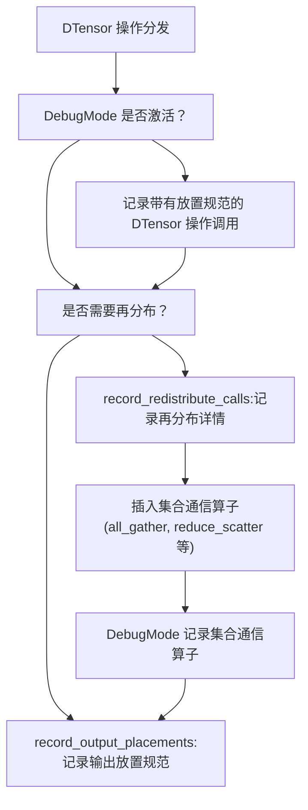
示例调试输出 ([test/distributed/tensor/debug/test\_debug\_mode.py74-89](https://github.com/pytorch/pytorch/blob/915982a4/test/distributed/tensor/debug/test_debug_mode.py#L74-L89))：

```
torch.mm(dt$0: f32[8, 8]| S(0), dt$1: f32[8, 32]| S(0))  ->  dt$7: f32[8, 32]| S(0)
  aten::mm(dt$0: f32[8, 8]| S(0), dt$1: f32[8, 32]| S(0))
    -> output: S(0)
    redistribute_input(1, S(0) -> R)
      redistribute_input(t$2: f32[1, 32], trace: S(0)->R)
        _c10d_functional::all_gather_into_tensor(t$2: f32[1, 32], 8, 0)  ->  t$3: f32[8, 32]
        _c10d_functional::wait_tensor(t$3: f32[8, 32])  ->  t$3: f32[8, 32]
    aten::mm(t$5: f32[1, 8], t$3: f32[8, 32])  ->  t$6: f32[1, 32]
```
集成点包括：

-   `get_active_debug_mode()` ([torch/utils/\_debug\_mode.py73](https://github.com/pytorch/pytorch/blob/915982a4/torch/utils/_debug_mode.py#L73-L73)) 检查 DebugMode 是否激活。
-   `record_redistribute_calls()` ([torch/distributed/tensor/\_dispatch.py483-488](https://github.com/pytorch/pytorch/blob/915982a4/torch/distributed/tensor/_dispatch.py#L483-L488)) 上下文管理器记录再分布操作。
-   `record_output_placements()` ([torch/distributed/tensor/\_dispatch.py258-260](https://github.com/pytorch/pytorch/blob/915982a4/torch/distributed/tensor/_dispatch.py#L258-L260) [torch/distributed/tensor/\_dispatch.py384-386](https://github.com/pytorch/pytorch/blob/915982a4/torch/distributed/tensor/_dispatch.py#L384-L386)) 记录输出分片情况。

**来源：** [torch/distributed/tensor/\_dispatch.py258-260](https://github.com/pytorch/pytorch/blob/915982a4/torch/distributed/tensor/_dispatch.py#L258-L260) [torch/distributed/tensor/\_dispatch.py461-519](https://github.com/pytorch/pytorch/blob/915982a4/torch/distributed/tensor/_dispatch.py#L461-L519) [torch/utils/\_debug\_mode.py1-663](https://github.com/pytorch/pytorch/blob/915982a4/torch/utils/_debug_mode.py#L1-L663) [test/distributed/tensor/debug/test\_debug\_mode.py63-89](https://github.com/pytorch/pytorch/blob/915982a4/test/distributed/tensor/debug/test_debug_mode.py#L63-L89)

## 分片传播详情 (Sharding Propagation Details)

`ShardingPropagator` 维护了一个不同操作的分片规则注册表。当一个操作被分发时：

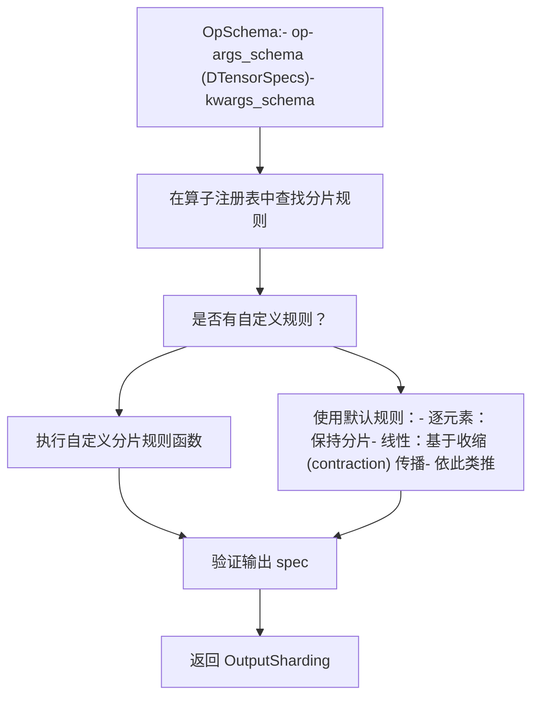
分片规则定义了：

1.  **输出放置规范 (Output placements)** —— 结果应该如何被分片。
2.  **再分布需求** —— 输入是否需要重新分片。
3.  **局部归约需求** —— 局部张量何时需要进行归约。

常见模式 ([torch/distributed/tensor/\_sharding\_prop.py](https://github.com/pytorch/pytorch/blob/915982a4/torch/distributed/tensor/_sharding_prop.py))：

-   **逐元素算子**（例如 `add`, `mul`）：输出遵循输入的分片情况。
-   **归约算子**（例如 `sum`, `mean`）：可能将 `Shard` 转换为 `Partial`。
-   **矩阵乘法**（例如 `mm`, `matmul`）：遵循线性代数的分片规则。
-   **视图 (View) 算子**（例如 `reshape`, `transpose`）：转换分片维度。

**来源：** [torch/distributed/tensor/\_sharding\_prop.py](https://github.com/pytorch/pytorch/blob/915982a4/torch/distributed/tensor/_sharding_prop.py) [torch/distributed/tensor/\_op\_schema.py](https://github.com/pytorch/pytorch/blob/915982a4/torch/distributed/tensor/_op_schema.py)

## 再分布策略 (Redistribution Strategies)

当需要再分布时，`redistribute_local_tensor` ([torch/distributed/tensor/\_redistribute.py184-391](https://github.com/pytorch/pytorch/blob/915982a4/torch/distributed/tensor/_redistribute.py#L184-L391)) 确定集合通信操作的序列：

### 转换图 (Transformation Graph)

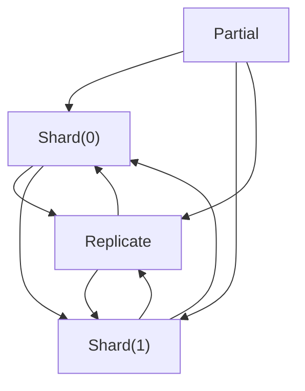
规划器使用以下算法之一：

-   **贪婪算法** ([torch/distributed/tensor/\_redistribute.py419-621](https://github.com/pytorch/pytorch/blob/915982a4/torch/distributed/tensor/_redistribute.py#L419-L621))：在每一步做出局部最优选择。
-   **基于图的算法** ([torch/distributed/tensor/\_redistribute.py623-867](https://github.com/pytorch/pytorch/blob/915982a4/torch/distributed/tensor/_redistribute.py#L623-L867))：使用 Dijkstra 算法寻找最小成本路径。

对于 `_StridedShard` 再分布等复杂情况，需要使用基于图的方法 ([torch/distributed/tensor/\_redistribute.py45-82](https://github.com/pytorch/pytorch/blob/915982a4/torch/distributed/tensor/_redistribute.py#L45-L82))。

**来源：** [torch/distributed/tensor/\_redistribute.py1-867](https://github.com/pytorch/pytorch/blob/915982a4/torch/distributed/tensor/_redistribute.py#L1-L867)

## Inductor 集成 (Inductor Integration)

当 DTensor 代码通过 `torch.compile` 编译时，Inductor 后端通过以下方式集成：

### 编译路径 (Compilation Path)

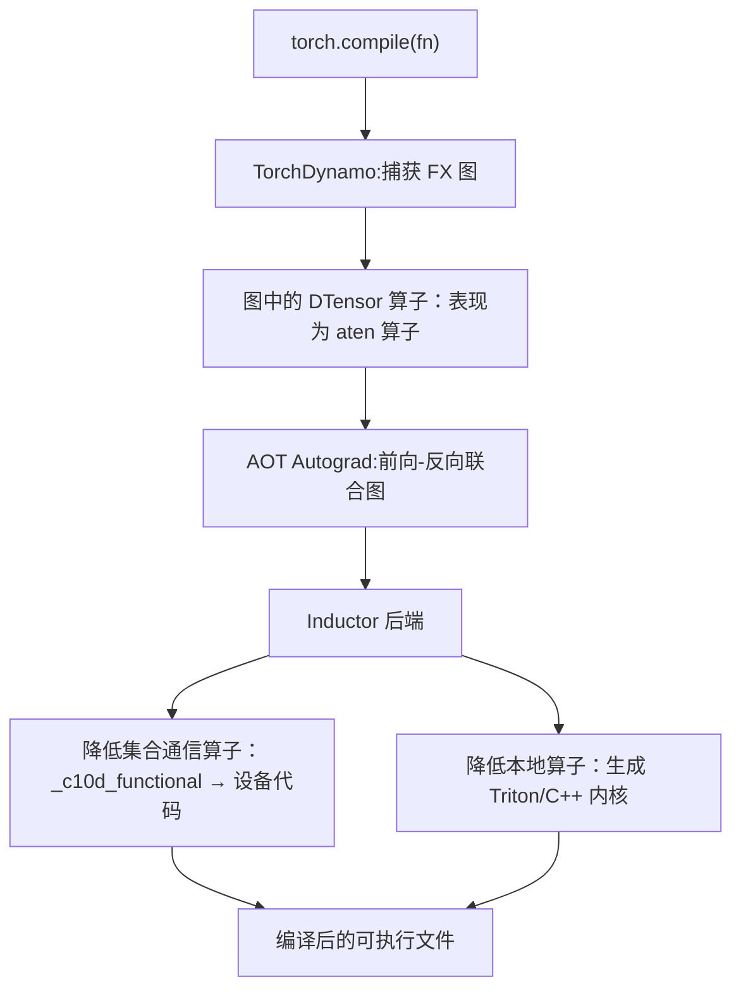
关键集成点：

1.  **FX 图捕获**：DTensor 操作在图中表现为常规的 ATen 操作。
2.  **集合通信降低 (Collective lowering)**：`_c10d_functional` 操作（all\_gather, reduce\_scatter 等）被降低到设备特定的实现。
3.  **本地计算**：本地张量操作通过 Inductor 的内核融合和代码生成进行优化。

分发机制可以与编译无缝协作，因为：

-   分片传播发生在追踪 (tracing) 期间。
-   集合通信操作是图中的一等公民节点。
-   本地计算可以与周围的操作融合。

**来源：** [test/distributed/tensor/test\_dtensor\_compile.py149-161](https://github.com/pytorch/pytorch/blob/915982a4/test/distributed/tensor/test_dtensor_compile.py#L149-L161)

## 自定义操作处理器 (Custom Operation Handlers)

某些操作需要超出标准分片传播范畴的自定义分发逻辑：

| 操作 | 处理器 (Handler) | 原因 |
| --- | --- | --- |
| `aten.convolution` | `convolution_handler` | 空间维度的复杂分片模式 |
| `aten.as_strided` | `as_strided_handler` | 可能无法安全分片的视图操作 |
| `aten.argmin/argmax` | `argminmax_handler` | 需要特殊处理的非线性归约 |
| `aten.max/min.dim` | `minmax_dim_handler` | 同时返回数值和索引 |
| `_amp_foreach_non_finite_check_and_unscale_` | `found_inf_reduce_handler` | 需要跨 rank 归约的 AMP 特殊情况 |

这些处理器 ([torch/distributed/tensor/\_dispatch.py156-166](https://github.com/pytorch/pytorch/blob/915982a4/torch/distributed/tensor/_dispatch.py#L156-L166)) 注册在 `OpDispatcher._custom_op_handlers` 中，并绕过正常的分片传播。

**来源：** [torch/distributed/tensor/\_dispatch.py53-122](https://github.com/pytorch/pytorch/blob/915982a4/torch/distributed/tensor/_dispatch.py#L53-L122) [torch/distributed/tensor/\_tp\_conv.py](https://github.com/pytorch/pytorch/blob/915982a4/torch/distributed/tensor/_tp_conv.py) [torch/distributed/tensor/\_nonlinear\_redux.py](https://github.com/pytorch/pytorch/blob/915982a4/torch/distributed/tensor/_nonlinear_redux.py)

## 总结：完整的分发流水线 (Summary: Complete Dispatch Pipeline)

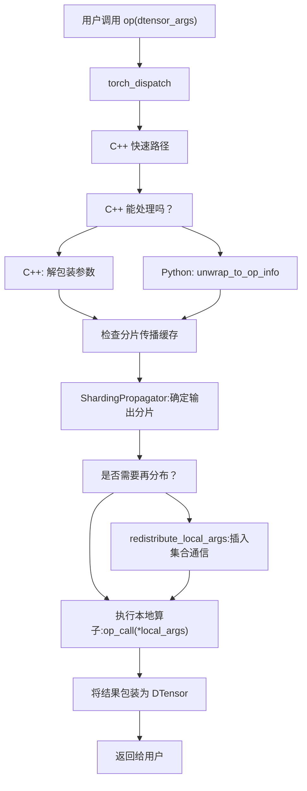
分发系统确保了：

1.  **正确性**：所有操作都遵循 DTensor 语义和分片契约。
2.  **性能**：C++ 快速路径和缓存机制最大程度地减少了开销。
3.  **灵活性**：自定义处理器支持复杂的操作。
4.  **可观测性**：DebugMode 集成提供了对隐式操作的可见性。
5.  **可编译性**：与 torch.compile 和 Inductor 无缝集成。

**来源：** [torch/distributed/tensor/\_dispatch.py124-652](https://github.com/pytorch/pytorch/blob/915982a4/torch/distributed/tensor/_dispatch.py#L124-L652) [torch/distributed/tensor/\_api.py534-566](https://github.com/pytorch/pytorch/blob/915982a4/torch/distributed/tensor/_api.py#L534-L566)
