# 分片传播与算子策略 (Sharding Propagation and OpStrategy)

相关源文件 (Relevant source files)

-   [test/distributed/tensor/experimental/test\_register\_sharding.py](https://github.com/pytorch/pytorch/blob/915982a4/test/distributed/tensor/experimental/test_register_sharding.py)
-   [test/distributed/tensor/test\_decompositions.py](https://github.com/pytorch/pytorch/blob/915982a4/test/distributed/tensor/test_decompositions.py)
-   [test/distributed/tensor/test\_dtensor\_dispatch\_overhead.py](https://github.com/pytorch/pytorch/blob/915982a4/test/distributed/tensor/test_dtensor_dispatch_overhead.py)
-   [test/distributed/tensor/test\_dtensor\_ops.py](https://github.com/pytorch/pytorch/blob/915982a4/test/distributed/tensor/test_dtensor_ops.py)
-   [test/distributed/tensor/test\_math\_ops.py](https://github.com/pytorch/pytorch/blob/915982a4/test/distributed/tensor/test_math_ops.py)
-   [test/distributed/tensor/test\_matrix\_ops.py](https://github.com/pytorch/pytorch/blob/915982a4/test/distributed/tensor/test_matrix_ops.py)
-   [test/distributed/tensor/test\_op\_strategy.py](https://github.com/pytorch/pytorch/blob/915982a4/test/distributed/tensor/test_op_strategy.py)
-   [test/distributed/tensor/test\_pointwise\_ops.py](https://github.com/pytorch/pytorch/blob/915982a4/test/distributed/tensor/test_pointwise_ops.py)
-   [test/distributed/tensor/test\_single\_dim\_strategy.py](https://github.com/pytorch/pytorch/blob/915982a4/test/distributed/tensor/test_single_dim_strategy.py)
-   [test/distributed/tensor/test\_tensor\_ops.py](https://github.com/pytorch/pytorch/blob/915982a4/test/distributed/tensor/test_tensor_ops.py)
-   [test/distributed/tensor/test\_view\_ops.py](https://github.com/pytorch/pytorch/blob/915982a4/test/distributed/tensor/test_view_ops.py)
-   [torch/\_meta\_registrations.py](https://github.com/pytorch/pytorch/blob/915982a4/torch/_meta_registrations.py)
-   [torch/distributed/tensor/\_decompositions.py](https://github.com/pytorch/pytorch/blob/915982a4/torch/distributed/tensor/_decompositions.py)
-   [torch/distributed/tensor/\_nonlinear\_redux.py](https://github.com/pytorch/pytorch/blob/915982a4/torch/distributed/tensor/_nonlinear_redux.py)
-   [torch/distributed/tensor/\_op\_schema.py](https://github.com/pytorch/pytorch/blob/915982a4/torch/distributed/tensor/_op_schema.py)
-   [torch/distributed/tensor/\_ops/\_conv\_ops.py](https://github.com/pytorch/pytorch/blob/915982a4/torch/distributed/tensor/_ops/_conv_ops.py)
-   [torch/distributed/tensor/\_ops/\_math\_ops.py](https://github.com/pytorch/pytorch/blob/915982a4/torch/distributed/tensor/_ops/_math_ops.py)
-   [torch/distributed/tensor/\_ops/\_matrix\_ops.py](https://github.com/pytorch/pytorch/blob/915982a4/torch/distributed/tensor/_ops/_matrix_ops.py)
-   [torch/distributed/tensor/\_ops/\_pointwise\_ops.py](https://github.com/pytorch/pytorch/blob/915982a4/torch/distributed/tensor/_ops/_pointwise_ops.py)
-   [torch/distributed/tensor/\_ops/\_random\_ops.py](https://github.com/pytorch/pytorch/blob/915982a4/torch/distributed/tensor/_ops/_random_ops.py)
-   [torch/distributed/tensor/\_ops/\_tensor\_ops.py](https://github.com/pytorch/pytorch/blob/915982a4/torch/distributed/tensor/_ops/_tensor_ops.py)
-   [torch/distributed/tensor/\_ops/\_view\_ops.py](https://github.com/pytorch/pytorch/blob/915982a4/torch/distributed/tensor/_ops/_view_ops.py)
-   [torch/distributed/tensor/\_ops/single\_dim\_strategy.py](https://github.com/pytorch/pytorch/blob/915982a4/torch/distributed/tensor/_ops/single_dim_strategy.py)
-   [torch/distributed/tensor/\_ops/utils.py](https://github.com/pytorch/pytorch/blob/915982a4/torch/distributed/tensor/_ops/utils.py)
-   [torch/distributed/tensor/\_sharding\_prop.py](https://github.com/pytorch/pytorch/blob/915982a4/torch/distributed/tensor/_sharding_prop.py)
-   [torch/distributed/tensor/debug/\_\_init\_\_.py](https://github.com/pytorch/pytorch/blob/915982a4/torch/distributed/tensor/debug/__init__.py)
-   [torch/testing/\_internal/common\_ops\_unbacked.py](https://github.com/pytorch/pytorch/blob/915982a4/torch/testing/_internal/common_ops_unbacked.py)

## 目的与范围 (Purpose and Scope)

本文档描述了 DTensor 中的**分片传播系统**，该系统确定了张量分片规范（放置规范）如何通过算子进行传播。给定具有已知放置规范（例如 `Shard(0)`、`Replicate()`、`Partial()`）的输入张量，系统会计算出有效的输出放置规范，并选择最优的分片策略。

有关 DTensor 的整体架构和放置类型的详细信息，请参阅 [DTensor 架构与放置类型](/pytorch/pytorch/4.2.1-dtensor-architecture-and-placement-types)。有关如何通过集合通信执行分片变更的详情，请参阅 [再分布与通信规划](/pytorch/pytorch/4.2.3-redistribution-and-communication-planning)。

## 核心数据结构 (Core Data Structures)

### OpStrategy 与 OpSpec

分片传播系统采用了基于策略的方法，其中每个操作都可以支持多种有效的分片配置：

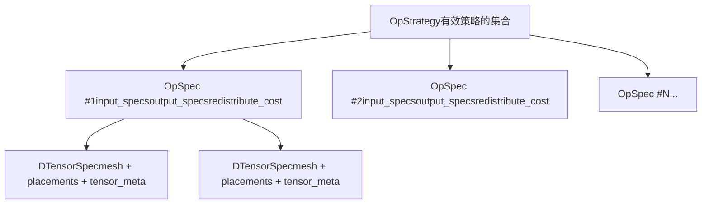
**OpStrategy** ([torch/distributed/tensor/\_op\_schema.py166-226](https://github.com/pytorch/pytorch/blob/915982a4/torch/distributed/tensor/_op_schema.py#L166-L226)) 代表了一个操作所有可接受的分片配置：

-   包含一个 `OpSpec` 策略列表。
-   每个策略都是独立有效的。
-   系统在运行时选择成本最低的策略。

**OpSpec** ([torch/distributed/tensor/\_op\_schema.py122-163](https://github.com/pytorch/pytorch/blob/915982a4/torch/distributed/tensor/_op_schema.py#L122-L163)) 描述了一个单一的有效配置：

-   `input_specs`：每个输入张量的 `DTensorSpec` 元组。
-   `output_specs`：输出的 `DTensorSpec` 或元组。
-   `redistribute_cost`：从任何输入策略转换为此策略的 2D 成本列表。

**OutputSharding** ([torch/distributed/tensor/\_op\_schema.py228-278](https://github.com/pytorch/pytorch/blob/915982a4/torch/distributed/tensor/_op_schema.py#L228-L278)) 是一个更简单的替代方案：

-   用于不需要完整策略枚举的传播规则。
-   指定输出 specs 和可选的 schema 建议。
-   可以通过 `schema_suggestions` 请求特定的输入再分布。

来源： [torch/distributed/tensor/\_op\_schema.py122-278](https://github.com/pytorch/pytorch/blob/915982a4/torch/distributed/tensor/_op_schema.py#L122-L278) [torch/distributed/tensor/\_sharding\_prop.py206-204](https://github.com/pytorch/pytorch/blob/915982a4/torch/distributed/tensor/_sharding_prop.py#L206-L204)

---

## 分片传播工作流 (Sharding Propagation Workflow)

### 高层流程 (High-Level Flow)

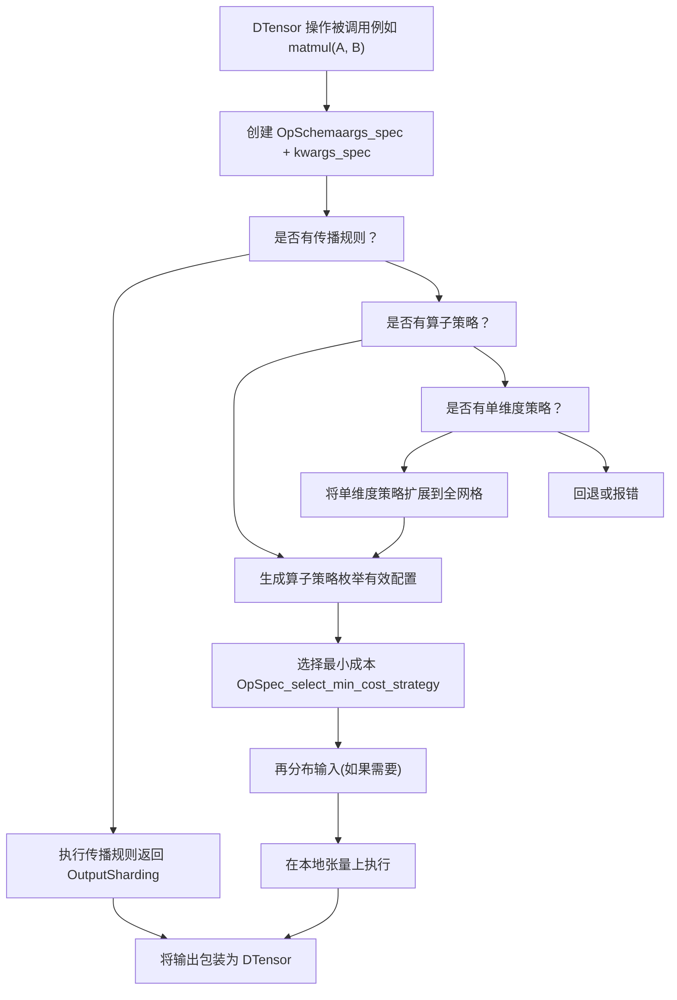
**来源：** [torch/distributed/tensor/\_sharding\_prop.py331-402](https://github.com/pytorch/pytorch/blob/915982a4/torch/distributed/tensor/_sharding_prop.py#L331-L402) [torch/distributed/tensor/\_sharding\_prop.py421-609](https://github.com/pytorch/pytorch/blob/915982a4/torch/distributed/tensor/_sharding_prop.py#L421-L609)

---

### ShardingPropagator 类 (ShardingPropagator Class)

`ShardingPropagator` 类 ([torch/distributed/tensor/\_sharding\_prop.py206-609](https://github.com/pytorch/pytorch/blob/915982a4/torch/distributed/tensor/_sharding_prop.py#L206-L609)) 管理整个传播系统：

| 方法 | 用途 | 返回值 |
| --- | --- | --- |
| `propagate_op_sharding` | 分片传播的主入口点 | `OutputSharding` 或 `OutputSpecType` |
| `register_sharding_prop_rule` | 注册简单的传播规则 | void |
| `register_op_strategy` | 注册完整的策略生成器 | void |
| `register_single_dim_op_strategy` | 注册单维度策略 | void |
| `_select_min_cost_strategy` | 从算子策略中选择最优策略 | `OpSpec` |
| `_propagate_tensor_meta` | 通过 fake tensors 推断输出张量元数据 | `TensorMeta` 或 `Sequence[TensorMeta]` |

**维护的关键数据结构：**

-   `op_to_rules`：将 `OpOverload` 映射到传播规则函数的字典。
-   `op_strategy_funcs`：将 `OpOverload` 映射到策略生成器函数的字典。
-   `op_single_dim_strategy_funcs`：将 `OpOverload` 映射到单维度策略的字典。
-   `op_to_schema_info`：将 `OpOverload` 映射到用于缓存控制的 `RuntimeSchemaInfo` 的字典。

来源： [torch/distributed/tensor/\_sharding\_prop.py206-329](https://github.com/pytorch/pytorch/blob/915982a4/torch/distributed/tensor/_sharding_prop.py#L206-L329)

---

## 策略注册机制 (Strategy Registration Mechanisms)

### 三种注册模式 (Three Registration Patterns)

DTensor 提供了三种指定算子如何传播分片的方式：

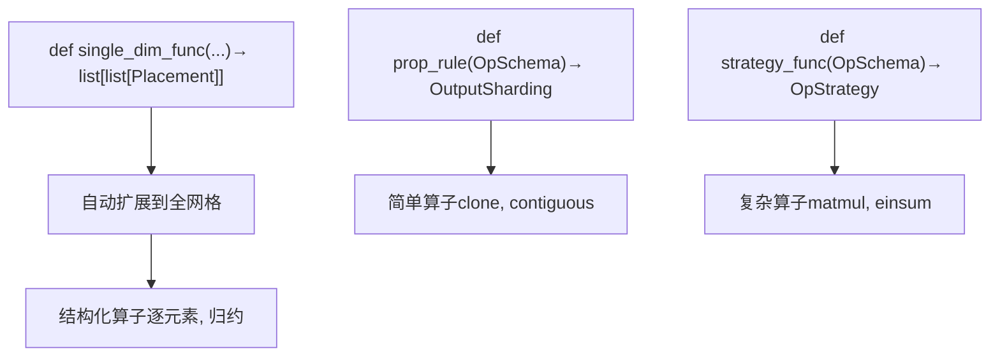
来源： [torch/distributed/tensor/\_sharding\_prop.py250-329](https://github.com/pytorch/pytorch/blob/915982a4/torch/distributed/tensor/_sharding_prop.py#L250-L329) [torch/distributed/tensor/\_ops/utils.py64-106](https://github.com/pytorch/pytorch/blob/915982a4/torch/distributed/tensor/_ops/utils.py#L64-L106)

---

### 1. 传播规则（简单模式） (Propagation Rules (Simple Pattern))

适用于输出放置规范直接遵循输入放置规范的操作：

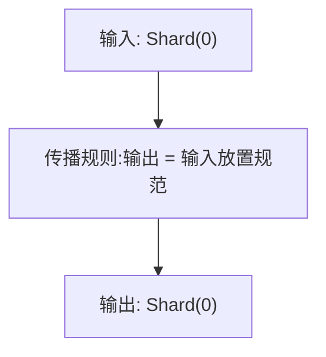
**示例操作**： `clone`、`contiguous`、`detach`、`relu`、`sigmoid`

**注册方式：**

```python
@register_prop_rule(aten.clone.default)
def clone_prop_rule(op_schema: OpSchema) -> OutputSharding:    
    # 输出与输入具有相同的放置规范    
    return OutputSharding(output_spec=op_schema.args_spec[0])
```
来源： [torch/distributed/tensor/\_ops/\_tensor\_ops.py54-103](https://github.com/pytorch/pytorch/blob/915982a4/torch/distributed/tensor/_ops/_tensor_ops.py#L54-L103)

---

### 2. 完整的算子策略（完整枚举模式） (Full OpStrategy (Complete Enumeration))

适用于需要多种有效策略并进行成本分析的操作：

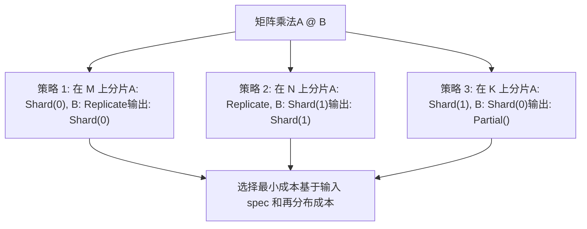
**关键特征：**

-   枚举所有数学上有效的分布组合。
-   为每个策略关联再分布成本。
-   系统根据当前的输入 spec 自动选择最优方案。

**示例**：矩阵乘法策略 ([torch/distributed/tensor/\_ops/\_matrix\_ops.py80-128](https://github.com/pytorch/pytorch/blob/915982a4/torch/distributed/tensor/_ops/_matrix_ops.py#L80-L128))

来源： [torch/distributed/tensor/\_ops/\_matrix\_ops.py80-214](https://github.com/pytorch/pytorch/blob/915982a4/torch/distributed/tensor/_ops/_matrix_ops.py#L80-L214) [torch/distributed/tensor/\_sharding\_prop.py276-329](https://github.com/pytorch/pytorch/blob/915982a4/torch/distributed/tensor/_sharding_prop.py#L276-L329)

---

### 3. 单维度策略（可扩展模式） (Single-Dim Strategy (Expandable Pattern))

针对可以按网格维度描述并自动扩展到 N 维网格的操作：

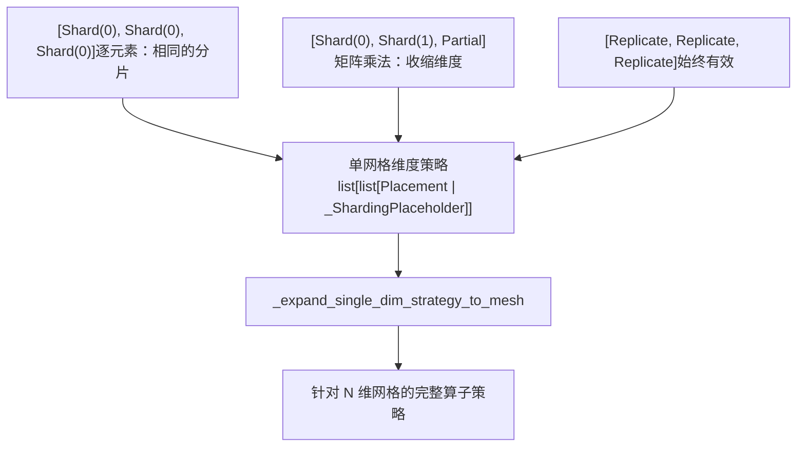
**\_ShardingPlaceholder** ([torch/distributed/tensor/\_ops/single\_dim\_strategy.py34-47](https://github.com/pytorch/pytorch/blob/915982a4/torch/distributed/tensor/_ops/single_dim_strategy.py#L34-L47))：标记了一个将被分片的维度，具体细节将在扩展期间填充。

**示例**：逐元素操作 ([torch/distributed/tensor/\_ops/\_pointwise\_ops.py426-499](https://github.com/pytorch/pytorch/blob/915982a4/torch/distributed/tensor/_ops/_pointwise_ops.py#L426-L499))

来源： [torch/distributed/tensor/\_ops/single\_dim\_strategy.py60-199](https://github.com/pytorch/pytorch/blob/915982a4/torch/distributed/tensor/_ops/single_dim_strategy.py#L60-L199) [torch/distributed/tensor/\_ops/\_pointwise\_ops.py426-545](https://github.com/pytorch/pytorch/blob/915982a4/torch/distributed/tensor/_ops/_pointwise_ops.py#L426-L545)

---

## 策略选择与成本模型 (Strategy Selection and Cost Model)

### 最小成本选择 (Minimum Cost Selection)

`_select_min_cost_strategy` 函数 ([torch/distributed/tensor/\_sharding\_prop.py139-203](https://github.com/pytorch/pytorch/blob/915982a4/torch/distributed/tensor/_sharding_prop.py#L139-L203)) 从一个 `OpStrategy` 中选择最优的 `OpSpec`：

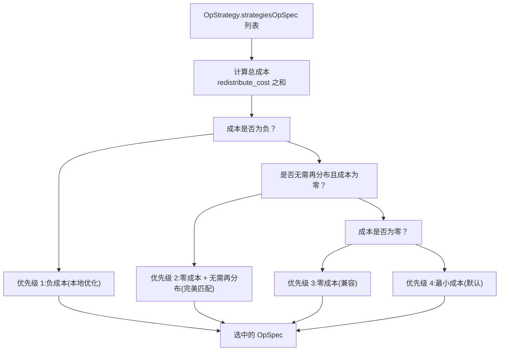
**成本计算方式：**

-   每个 `OpSpec` 都有一个 `redistribute_cost` 矩阵：`[输入数量][策略数量]`。
-   对于每个输入，其成本是从当前策略转换到目标输入 spec 的再分布成本。
-   总成本 = 所有输入再分布成本之和。

**负成本**：某些策略有意设置为负成本，以鼓励本地优化（例如，可以避开通信转而进行本地张量切分的 view 操作）。

来源： [torch/distributed/tensor/\_sharding\_prop.py139-203](https://github.com/pytorch/pytorch/blob/915982a4/torch/distributed/tensor/_sharding_prop.py#L139-L203) [torch/distributed/tensor/\_ops/utils.py265-291](https://github.com/pytorch/pytorch/blob/915982a4/torch/distributed/tensor/_ops/utils.py#L265-L291)

---

## 再分布成本计算 (Redistribution Cost Calculation)

`generate_redistribute_costs` 函数 ([torch/distributed/tensor/\_ops/utils.py265-291](https://github.com/pytorch/pytorch/blob/915982a4/torch/distributed/tensor/_ops/utils.py#L265-L291)) 计算成本矩阵：

| 源放置规范 | 目标放置规范 | 成本 | 原因 |
| --- | --- | --- | --- |
| 相同 | 相同 | 0.0 | 无需操作 |
| Replicate | Shard | 0.0 | 仅需本地切片 |
| Shard(i) | Shard(j), i≠j | 高 | 需要 all-to-all 通信 |
| Shard | Replicate | 高 | 需要 all-gather |
| Partial | Replicate | 高 | 需要 reduce-scatter 或 all-reduce |
| 任意 | 不同网格 | 极高 | 跨网格再分布 |

实际成本通过 `redistribute_cost` 函数计算 ([torch/distributed/tensor/\_collective\_utils.py170-224](https://github.com/pytorch/pytorch/blob/915982a4/torch/distributed/tensor/_collective_utils.py#L170-L224))：

-   返回代表相对通信成本的浮点数。
-   考虑网格拓扑和操作类型。
-   用于基于成本的策略选择。

来源： [torch/distributed/tensor/\_ops/utils.py265-291](https://github.com/pytorch/pytorch/blob/915982a4/torch/distributed/tensor/_ops/utils.py#L265-L291) [torch/distributed/tensor/\_collective\_utils.py170-224](https://github.com/pytorch/pytorch/blob/915982a4/torch/distributed/tensor/_collective_utils.py#L170-224)

---

## 逐元素操作策略 (Pointwise Operations Strategy)

逐元素操作（如 `add`、`mul`、`relu` 等 element-wise 操作）使用灵活的策略：

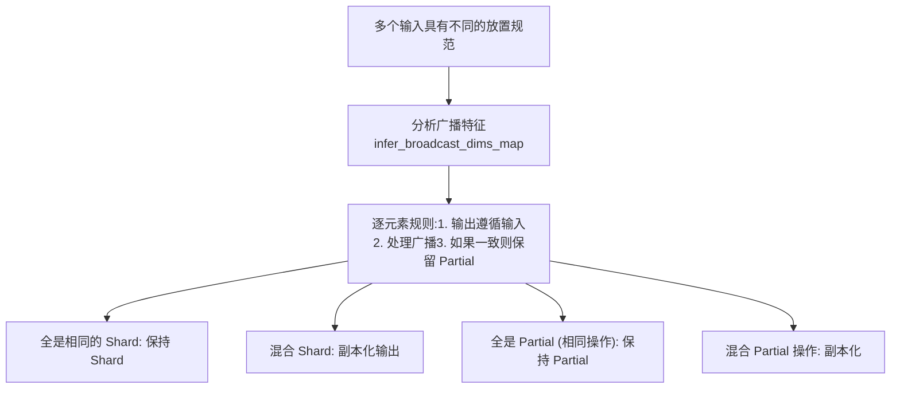
**关键函数**： `pointwise_rule` ([torch/distributed/tensor/\_ops/\_common\_rules.py60-257](https://github.com/pytorch/pytorch/blob/915982a4/torch/distributed/tensor/_ops/_common_rules.py#L60-L257))

**放置规范传播逻辑：**

1.  如果所有输入在某一维度上都有相同的 `Shard(i)` → 输出为 `Shard(i)`。
2.  如果输入具有不同的放置规范 → 输出为 `Replicate()`（需要再分布）。
3.  如果所有输入都是带有相同归约操作的 `Partial(op)` → 输出为 `Partial(op)`。
4.  如果输入具有不同的 `Partial` 操作 → 输出为 `Replicate()`（需要归约）。

来源： [torch/distributed/tensor/\_ops/\_common\_rules.py60-257](https://github.com/pytorch/pytorch/blob/915982a4/torch/distributed/tensor/_ops/_common_rules.py#L60-L257) [torch/distributed/tensor/\_ops/\_pointwise\_ops.py426-545](https://github.com/pytorch/pytorch/blob/915982a4/torch/distributed/tensor/_ops/_pointwise_ops.py#L426-L545)

---

## 归约操作策略 (Reduction Operations Strategy)

归约操作在维度折叠方面有特殊处理：

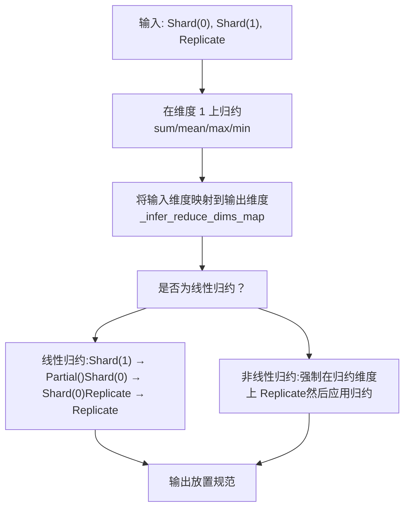
**线性 vs 非线性归约：**

-   **线性** (`sum`, `prod`, `mean`, `max`, `min`)：可以在分片数据上计算，然后进行归约。
    -   被归约的分片维度 → `Partial()` 输出。
    -   其他维度保留其分片状态。
-   **非线性** (`argmax`, `argmin`)：返回索引，不能使用 `Partial`。
    -   在执行操作前，强制在归约维度上进行副本化。
    -   防止出现错误的本地索引值。

**源代码：**

-   线性归约： [torch/distributed/tensor/\_ops/\_math\_ops.py346-369](https://github.com/pytorch/pytorch/blob/915982a4/torch/distributed/tensor/_ops/_math_ops.py#L346-L369)
-   Argmax/argmin 策略： [torch/distributed/tensor/\_ops/\_math\_ops.py372-402](https://github.com/pytorch/pytorch/blob/915982a4/torch/distributed/tensor/_ops/_math_ops.py#L372-L402)
-   归约辅助函数： [torch/distributed/tensor/\_ops/\_math\_ops.py240-304](https://github.com/pytorch/pytorch/blob/915982a4/torch/distributed/tensor/_ops/_math_ops.py#L240-L304)

来源： [torch/distributed/tensor/\_ops/\_math\_ops.py240-418](https://github.com/pytorch/pytorch/blob/915982a4/torch/distributed/tensor/_ops/_math_ops.py#L240-L418)

---

## 矩阵乘法策略 (Matrix Multiplication Strategies)

矩阵乘法展示了算子策略枚举的完整威力：

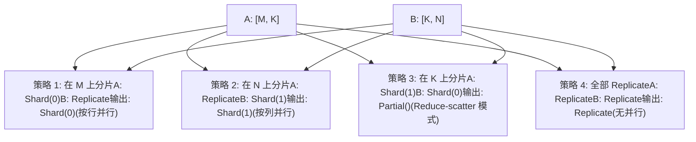
**策略生成**： `mm_single_dim_strategy` 函数 ([torch/distributed/tensor/\_ops/\_matrix\_ops.py157-188](https://github.com/pytorch/pytorch/blob/915982a4/torch/distributed/tensor/_ops/_matrix_ops.py#L157-L188)) 为单个网格维度生成策略，然后通过 `_expand_single_dim_strategy_to_mesh` 扩展到全网格。

**Einsum 集成**：矩阵操作内部使用 einsum 表示法（mm 为 `mk,kn->mn`）来系统地生成策略 ([torch/distributed/tensor/\_ops/\_einsum\_strategy.py](https://github.com/pytorch/pytorch/blob/915982a4/torch/distributed/tensor/_ops/_einsum_strategy.py))。

来源： [torch/distributed/tensor/\_ops/\_matrix\_ops.py80-214](https://github.com/pytorch/pytorch/blob/915982a4/torch/distributed/tensor/_ops/_matrix_ops.py#L80-L214) [torch/distributed/tensor/\_ops/\_matrix\_ops.py157-188](https://github.com/pytorch/pytorch/blob/915982a4/torch/distributed/tensor/_ops/_matrix_ops.py#L157-L188)

---

## 张量元数据传播 (Tensor Metadata Propagation)

在确定输出放置规范之前，系统必须知道输出张量的元数据（形状、步长、数据类型）：

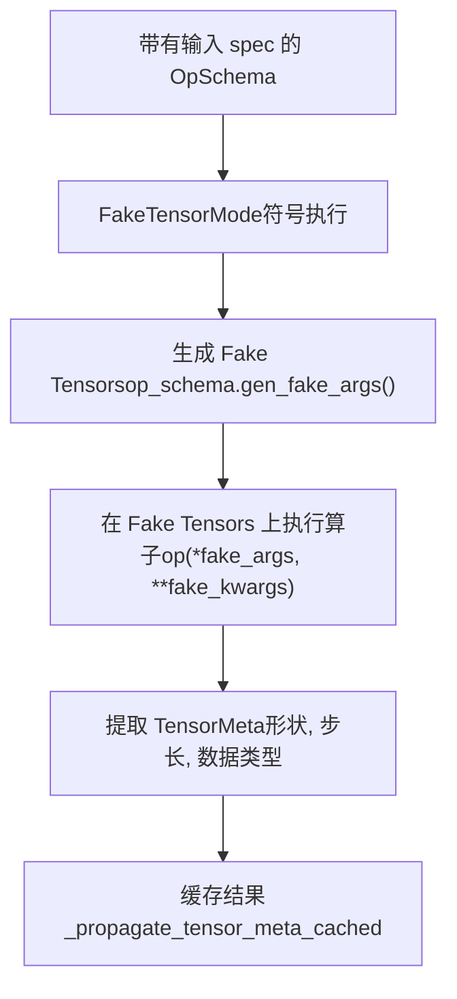
**关键方法：**

-   `_propagate_tensor_meta` ([torch/distributed/tensor/\_sharding\_prop.py391-402](https://github.com/pytorch/pytorch/blob/915982a4/torch/distributed/tensor/_sharding_prop.py#L391-L402))：主入口点。
-   `_propagate_tensor_meta_cached` ([torch/distributed/tensor/\_sharding\_prop.py381-389](https://github.com/pytorch/pytorch/blob/915982a4/torch/distributed/tensor/_sharding_prop.py#L381-L389))：使用 `@lru_cache` 的缓存版本。
-   `_propagate_tensor_meta_non_cached` ([torch/distributed/tensor/\_sharding\_prop.py331-379](https://github.com/pytorch/pytorch/blob/915982a4/torch/distributed/tensor/_sharding_prop.py#L331-L379))：使用 FakeTensorMode 的实际实现。

**为什么要用 FakeTensorMode？** 允许符号执行而无需实例化真实的张量数据，即使对于非常巨大的张量也能实现快速的形状推断。

来源： [torch/distributed/tensor/\_sharding\_prop.py331-402](https://github.com/pytorch/pytorch/blob/915982a4/torch/distributed/tensor/_sharding_prop.py#L331-L402)

---

## 单维度策略扩展 (Single-Dim Strategy Expansion)

单维度策略通过按网格维度描述行为，然后自动扩展到 N 维网格，简化了策略编写：

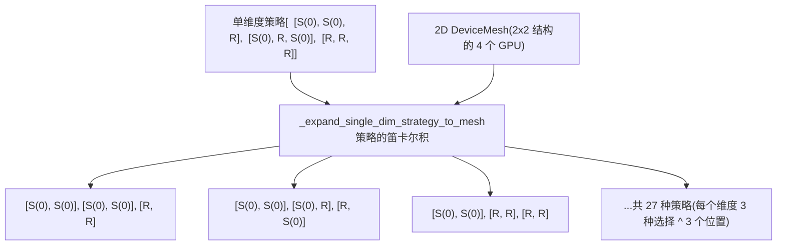
**扩展算法 ([torch/distributed/tensor/\_ops/single\_dim\_strategy.py184-380](https://github.com/pytorch/pytorch/blob/915982a4/torch/distributed/tensor/_ops/single_dim_strategy.py#L184-L380))：**

1.  **填充占位符**：基于张量元数据，将 `_ShardingPlaceholder(dim)` 替换为实际的 `Shard(dim)`。
2.  **插入副本化策略**：添加全副本策略作为回退方案。
3.  **去重**：使用 `_get_unique_placements` 移除重复的放置组合。
4.  **笛卡尔积**：对于 N 维网格，生成所有每维度策略的组合。
5.  **构建 OpSpecs**：创建完整的带有再分布成本的 `OpSpec` 对象。

**收益：**

-   编写一次策略，即可在任何维度的网格上工作。
-   减少代码重复。
-   自动扩展确保了完备性。

来源： [torch/distributed/tensor/\_ops/single\_dim\_strategy.py71-380](https://github.com/pytorch/pytorch/blob/915982a4/torch/distributed/tensor/_ops/single_dim_strategy.py#L71-L380) [test/distributed/tensor/test\_single\_dim\_strategy.py87-157](https://github.com/pytorch/pytorch/blob/915982a4/test/distributed/tensor/test_single_dim_strategy.py#L87-L157)

---

## 缓存与性能 (Caching and Performance)

分片传播采用了精密的缓存机制以避免冗余计算：

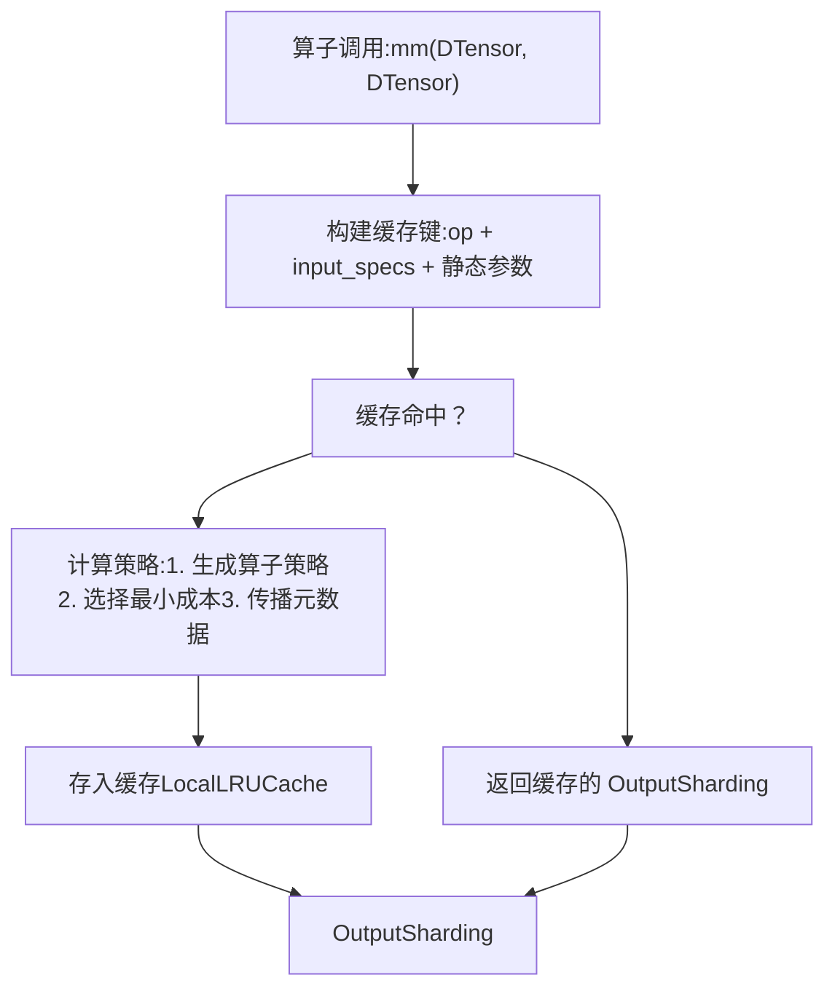
**LocalLRUCache** ([torch/distributed/tensor/\_sharding\_prop.py109-137](https://github.com/pytorch/pytorch/blob/915982a4/torch/distributed/tensor/_sharding_prop.py#L109-L137))：线程本地 LRU 缓存。

-   每个线程拥有自己的缓存以避开同步。
-   大小无限制 (`lru_cache(None)`)。
-   针对缓存命中/未命中的调试日志。

**RuntimeSchemaInfo** ([torch/distributed/tensor/\_op\_schema.py280-333](https://github.com/pytorch/pytorch/blob/915982a4/torch/distributed/tensor/_op_schema.py#L280-L333))：控制哪些内容被缓存。

-   `static_argnum`：包含在缓存键中的第一个非张量参数索引。
-   `static_kwargkey`：包含在缓存键中的关键字参数名列表。
-   `needs_pytree`：是否扁平化嵌套结构。

**清除缓存**：测试可以调用 `_clear_sharding_prop_cache()` ([torch/distributed/tensor/debug/\_\_init\_\_.py](https://github.com/pytorch/pytorch/blob/915982a4/torch/distributed/tensor/debug/__init__.py)) 来重置测试用例间的缓存。

来源： [torch/distributed/tensor/\_sharding\_prop.py109-137](https://github.com/pytorch/pytorch/blob/915982a4/torch/distributed/tensor/_sharding_prop.py#L109-L137) [torch/distributed/tensor/\_sharding\_prop.py229-231](https://github.com/pytorch/pytorch/blob/915982a4/torch/distributed/tensor/_sharding_prop.py#L229-L231) [torch/distributed/tensor/\_op\_schema.py280-333](https://github.com/pytorch/pytorch/blob/915982a4/torch/distributed/tensor/_op_schema.py#L280-L333)

---

## 错误处理与回退 (Error Handling and Fallbacks)

当分片传播失败时，DTensor 会提供清晰的错误消息：

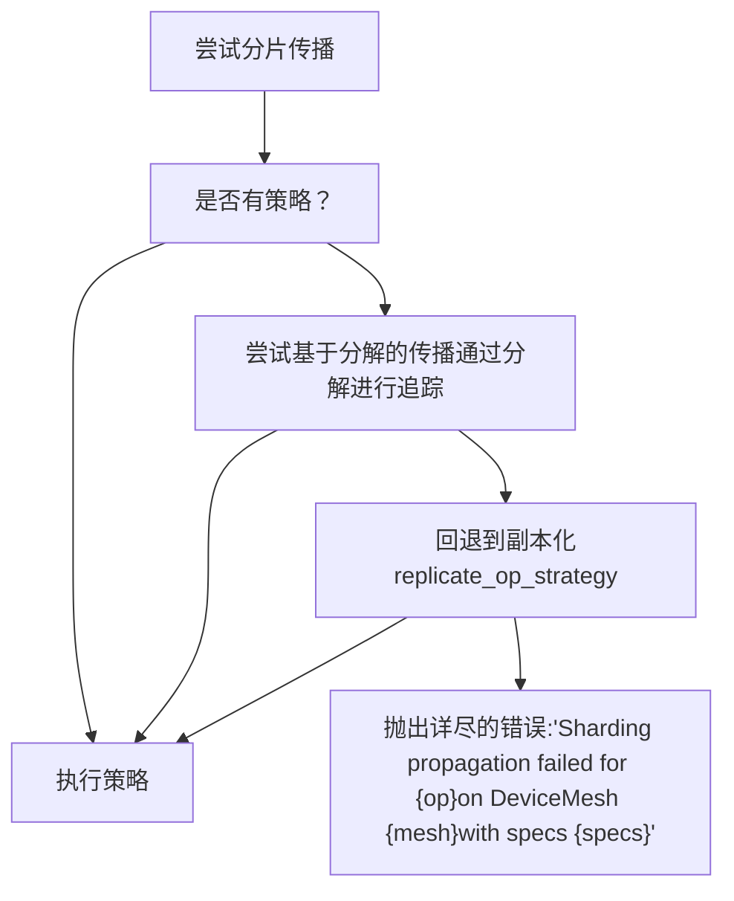
**错误消息结构 ([test/distributed/tensor/test\_tensor\_ops.py715-720](https://github.com/pytorch/pytorch/blob/915982a4/test/distributed/tensor/test_tensor_ops.py#L715-L720))：**

```
Sharding propagation failed for aten.embedding.default
(Spec(f32(2048, 256)Hii)), Spec(i64(16, 2048)Hii)R)))
on DeviceMesh((dp=2, tp=2), ...
```
**基于分解的回退 ([torch/distributed/tensor/\_decompositions.py50-187](https://github.com/pytorch/pytorch/blob/915982a4/torch/distributed/tensor/_decompositions.py#L50-L187))：**

-   如果没有注册策略，则尝试追踪算子的分解形式。
-   从具有策略的分解后算子中推导策略。
-   对于由原语构建的复合算子非常有用。

来源： [torch/distributed/tensor/\_sharding\_prop.py421-609](https://github.com/pytorch/pytorch/blob/915982a4/torch/distributed/tensor/_sharding_prop.py#L421-L609) [torch/distributed/tensor/\_decompositions.py50-187](https://github.com/pytorch/pytorch/blob/915982a4/torch/distributed/tensor/_decompositions.py#L50-L187) [test/distributed/tensor/test\_tensor\_ops.py715-720](https://github.com/pytorch/pytorch/blob/915982a4/test/distributed/tensor/test_tensor_ops.py#L715-L720)

---

## 测试分片传播 (Testing Sharding Propagation)

测试基础设施验证了策略的正确性：

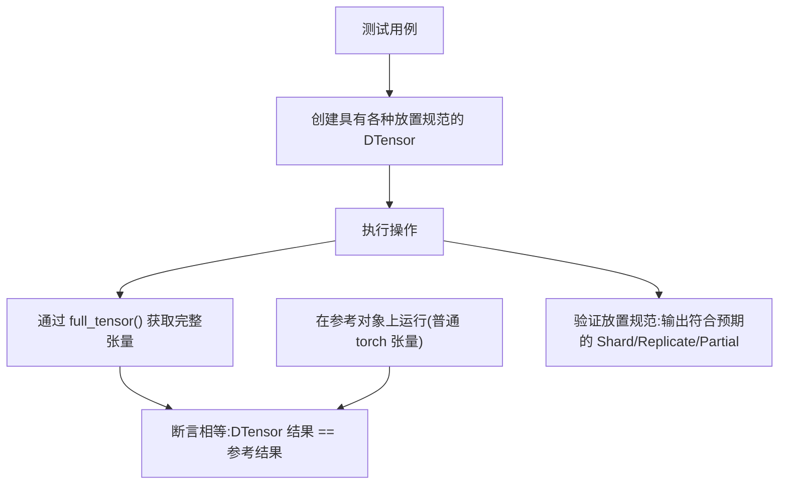
**关键测试类：**

-   `DTensorOpTestBase` ([torch/testing/\_internal/distributed/\_tensor/common\_dtensor.py](https://github.com/pytorch/pytorch/blob/915982a4/torch/testing/_internal/distributed/_tensor/common_dtensor.py))：分布式测试的基类。
-   `DTensorConverter` ([test/distributed/tensor/test\_dtensor\_ops.py](https://github.com/pytorch/pytorch/blob/915982a4/test/distributed/tensor/test_dtensor_ops.py))：将张量输入转换为具有各种放置规范的 DTensor。
-   `validate_sharding_rule_sample` ([test/distributed/tensor/test\_dtensor\_ops.py33](https://github.com/pytorch/pytorch/blob/915982a4/test/distributed/tensor/test_dtensor_ops.py#L33-L33))：验证单个分片策略。

**测试覆盖范围**：测试会迭代以下内容：

-   所有有效的放置组合 (Shard(0-N), Replicate, Partial)。
-   各种张量形状（可均匀/不均匀分片）。
-   多种网格配置（1D, 2D, 3D 网格）。

来源： [test/distributed/tensor/test\_dtensor\_ops.py483-657](https://github.com/pytorch/pytorch/blob/915982a4/test/distributed/tensor/test_dtensor_ops.py#L483-L657) [test/distributed/tensor/test\_tensor\_ops.py32-516](https://github.com/pytorch/pytorch/blob/915982a4/test/distributed/tensor/test_tensor_ops.py#L32-L516)
