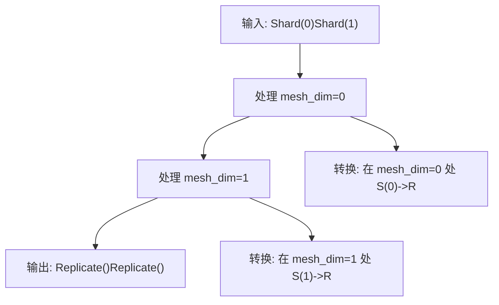
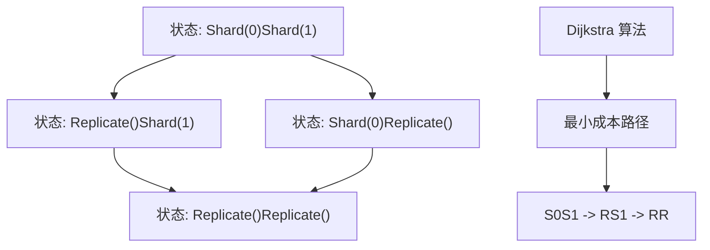
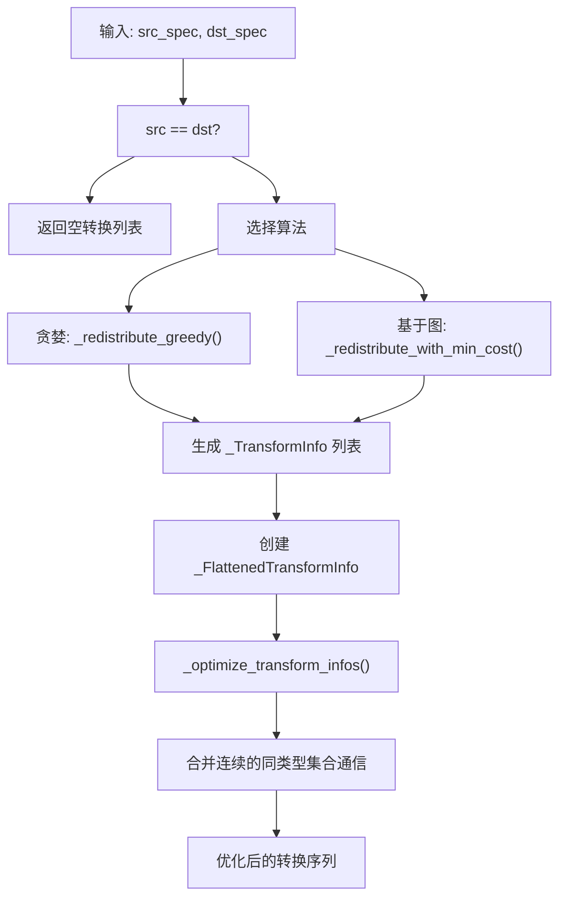
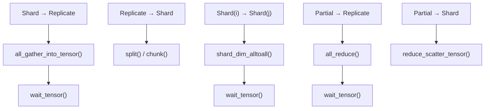
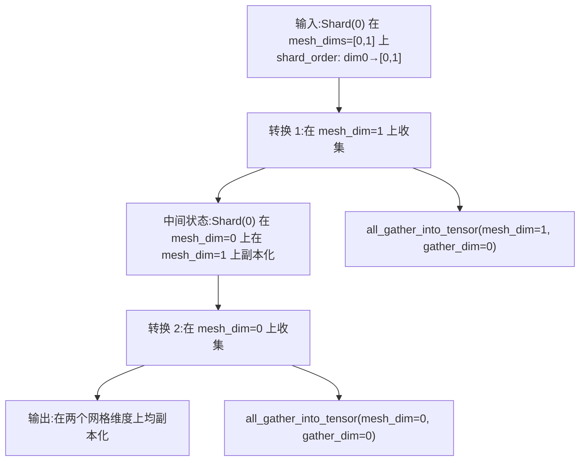

# 再分布与通信规划 (Redistribution and Communication Planning)

相关源文件 (Relevant source files)

-   [test/distributed/tensor/debug/test\_debug\_mode.py](https://github.com/pytorch/pytorch/blob/915982a4/test/distributed/tensor/debug/test_debug_mode.py)
-   [test/distributed/tensor/experimental/test\_register\_sharding.py](https://github.com/pytorch/pytorch/blob/915982a4/test/distributed/tensor/experimental/test_register_sharding.py)
-   [test/distributed/tensor/test\_decompositions.py](https://github.com/pytorch/pytorch/blob/915982a4/test/distributed/tensor/test_decompositions.py)
-   [test/distributed/tensor/test\_dtensor.py](https://github.com/pytorch/pytorch/blob/915982a4/test/distributed/tensor/test_dtensor.py)
-   [test/distributed/tensor/test\_dtensor\_compile.py](https://github.com/pytorch/pytorch/blob/915982a4/test/distributed/tensor/test_dtensor_compile.py)
-   [test/distributed/tensor/test\_dtensor\_dispatch\_overhead.py](https://github.com/pytorch/pytorch/blob/915982a4/test/distributed/tensor/test_dtensor_dispatch_overhead.py)
-   [test/distributed/tensor/test\_dtensor\_ops.py](https://github.com/pytorch/pytorch/blob/915982a4/test/distributed/tensor/test_dtensor_ops.py)
-   [test/distributed/tensor/test\_math\_ops.py](https://github.com/pytorch/pytorch/blob/915982a4/test/distributed/tensor/test_math_ops.py)
-   [test/distributed/tensor/test\_matrix\_ops.py](https://github.com/pytorch/pytorch/blob/915982a4/test/distributed/tensor/test_matrix_ops.py)
-   [test/distributed/tensor/test\_op\_strategy.py](https://github.com/pytorch/pytorch/blob/915982a4/test/distributed/tensor/test_op_strategy.py)
-   [test/distributed/tensor/test\_placement\_types.py](https://github.com/pytorch/pytorch/blob/915982a4/test/distributed/tensor/test_placement_types.py)
-   [test/distributed/tensor/test\_pointwise\_ops.py](https://github.com/pytorch/pytorch/blob/915982a4/test/distributed/tensor/test_pointwise_ops.py)
-   [test/distributed/tensor/test\_redistribute.py](https://github.com/pytorch/pytorch/blob/915982a4/test/distributed/tensor/test_redistribute.py)
-   [test/distributed/tensor/test\_single\_dim\_strategy.py](https://github.com/pytorch/pytorch/blob/915982a4/test/distributed/tensor/test_single_dim_strategy.py)
-   [test/distributed/tensor/test\_tensor\_ops.py](https://github.com/pytorch/pytorch/blob/915982a4/test/distributed/tensor/test_tensor_ops.py)
-   [test/distributed/tensor/test\_utils.py](https://github.com/pytorch/pytorch/blob/915982a4/test/distributed/tensor/test_utils.py)
-   [test/distributed/tensor/test\_view\_ops.py](https://github.com/pytorch/pytorch/blob/915982a4/test/distributed/tensor/test_view_ops.py)
-   [test/dynamo/test\_aot\_autograd\_cache.py](https://github.com/pytorch/pytorch/blob/915982a4/test/dynamo/test_aot_autograd_cache.py)
-   [torch/\_C/\_distributed.pyi](https://github.com/pytorch/pytorch/blob/915982a4/torch/_C/_distributed.pyi)
-   [torch/\_dynamo/backends/debugging.py](https://github.com/pytorch/pytorch/blob/915982a4/torch/_dynamo/backends/debugging.py)
-   [torch/\_dynamo/backends/distributed.py](https://github.com/pytorch/pytorch/blob/915982a4/torch/_dynamo/backends/distributed.py)
-   [torch/\_dynamo/variables/distributed.py](https://github.com/pytorch/pytorch/blob/915982a4/torch/_dynamo/variables/distributed.py)
-   [torch/\_functorch/\_aot\_autograd/autograd\_cache.py](https://github.com/pytorch/pytorch/blob/915982a4/torch/_functorch/_aot_autograd/autograd_cache.py)
-   [torch/\_inductor/runtime/benchmarking.py](https://github.com/pytorch/pytorch/blob/915982a4/torch/_inductor/runtime/benchmarking.py)
-   [torch/\_library/triton.py](https://github.com/pytorch/pytorch/blob/915982a4/torch/_library/triton.py)
-   [torch/\_meta\_registrations.py](https://github.com/pytorch/pytorch/blob/915982a4/torch/_meta_registrations.py)
-   [torch/csrc/distributed/Placement.h](https://github.com/pytorch/pytorch/blob/915982a4/torch/csrc/distributed/Placement.h)
-   [torch/csrc/distributed/python\_placement.cpp](https://github.com/pytorch/pytorch/blob/915982a4/torch/csrc/distributed/python_placement.cpp)
-   [torch/csrc/distributed/python\_placement.h](https://github.com/pytorch/pytorch/blob/915982a4/torch/csrc/distributed/python_placement.h)
-   [torch/csrc/dynamo/guards.h](https://github.com/pytorch/pytorch/blob/915982a4/torch/csrc/dynamo/guards.h)
-   [torch/distributed/\_functional\_collectives.py](https://github.com/pytorch/pytorch/blob/915982a4/torch/distributed/_functional_collectives.py)
-   [torch/distributed/tensor/README.md](https://github.com/pytorch/pytorch/blob/915982a4/torch/distributed/tensor/README.md)
-   [torch/distributed/tensor/\_api.py](https://github.com/pytorch/pytorch/blob/915982a4/torch/distributed/tensor/_api.py)
-   [torch/distributed/tensor/\_collective\_utils.py](https://github.com/pytorch/pytorch/blob/915982a4/torch/distributed/tensor/_collective_utils.py)
-   [torch/distributed/tensor/\_decompositions.py](https://github.com/pytorch/pytorch/blob/915982a4/torch/distributed/tensor/_decompositions.py)
-   [torch/distributed/tensor/\_dtensor\_spec.py](https://github.com/pytorch/pytorch/blob/915982a4/torch/distributed/tensor/_dtensor_spec.py)
-   [torch/distributed/tensor/\_nonlinear\_redux.py](https://github.com/pytorch/pytorch/blob/915982a4/torch/distributed/tensor/_nonlinear_redux.py)
-   [torch/distributed/tensor/\_op\_schema.py](https://github.com/pytorch/pytorch/blob/915982a4/torch/distributed/tensor/_op_schema.py)
-   [torch/distributed/tensor/\_ops/\_conv\_ops.py](https://github.com/pytorch/pytorch/blob/915982a4/torch/distributed/tensor/_ops/_conv_ops.py)
-   [torch/distributed/tensor/\_ops/\_embedding\_ops.py](https://github.com/pytorch/pytorch/blob/915982a4/torch/distributed/tensor/_ops/_embedding_ops.py)
-   [torch/distributed/tensor/\_ops/\_math\_ops.py](https://github.com/pytorch/pytorch/blob/915982a4/torch/distributed/tensor/_ops/_math_ops.py)
-   [torch/distributed/tensor/\_ops/\_matrix\_ops.py](https://github.com/pytorch/pytorch/blob/915982a4/torch/distributed/tensor/_ops/_matrix_ops.py)
-   [torch/distributed/tensor/\_ops/\_pointwise\_ops.py](https://github.com/pytorch/pytorch/blob/915982a4/torch/distributed/tensor/_ops/_pointwise_ops.py)
-   [torch/distributed/tensor/\_ops/\_random\_ops.py](https://github.com/pytorch/pytorch/blob/915982a4/torch/distributed/tensor/_ops/_random_ops.py)
-   [torch/distributed/tensor/\_ops/\_tensor\_ops.py](https://github.com/pytorch/pytorch/blob/915982a4/torch/distributed/tensor/_ops/_tensor_ops.py)
-   [torch/distributed/tensor/\_ops/\_view\_ops.py](https://github.com/pytorch/pytorch/blob/915982a4/torch/distributed/tensor/_ops/_view_ops.py)
-   [torch/distributed/tensor/\_ops/single\_dim\_strategy.py](https://github.com/pytorch/pytorch/blob/915982a4/torch/distributed/tensor/_ops/single_dim_strategy.py)
-   [torch/distributed/tensor/\_ops/utils.py](https://github.com/pytorch/pytorch/blob/915982a4/torch/distributed/tensor/_ops/utils.py)
-   [torch/distributed/tensor/\_redistribute.py](https://github.com/pytorch/pytorch/blob/915982a4/torch/distributed/tensor/_redistribute.py)
-   [torch/distributed/tensor/\_sharding\_prop.py](https://github.com/pytorch/pytorch/blob/915982a4/torch/distributed/tensor/_sharding_prop.py)
-   [torch/distributed/tensor/\_utils.py](https://github.com/pytorch/pytorch/blob/915982a4/torch/distributed/tensor/_utils.py)
-   [torch/distributed/tensor/debug/\_\_init\_\_.py](https://github.com/pytorch/pytorch/blob/915982a4/torch/distributed/tensor/debug/__init__.py)
-   [torch/distributed/tensor/placement\_types.py](https://github.com/pytorch/pytorch/blob/915982a4/torch/distributed/tensor/placement_types.py)
-   [torch/testing/\_internal/common\_ops\_unbacked.py](https://github.com/pytorch/pytorch/blob/915982a4/torch/testing/_internal/common_ops_unbacked.py)

## 目的与范围 (Purpose and Scope)

本页记录了 PyTorch DTensor 中的**再分布 (redistribution) 系统**，该系统负责在分布式执行期间规划并执行不同放置规范 (placements) 之间的张量布局转换。在[分片传播 (Sharding Propagation)](/pytorch/pytorch/4.2.2-sharding-propagation-and-opstrategy) 确定了操作的最优放置策略后，再分布系统会计算出所需的实际集合通信操作序列，以将张量从当前放置规范转换为所需的目标放置规范。

有关放置决策是如何做出的信息，请参阅 [分片传播与算子策略](/pytorch/pytorch/4.2.2-sharding-propagation-and-opstrategy)。有关观察和调试再分布行为的工具，请参阅 [DebugMode 与可观测性](/pytorch/pytorch/4.2.4-debugmode-and-observability)。

**关键职责：**

-   规划用于转换张量放置规范的最优集合通信操作序列。
-   使用 PyTorch 的函数式集合通信 (`c10d_functional`) 执行转换。
-   支持复杂的、跨多维网格的再分布。
-   优化连续的集合通信以减少通信开销。
-   追踪多维分片模式的分片顺序 (shard order)。

## 系统架构 (System Architecture)

### 核心组件 (Core Components)

```mermaid
flowchart TD
    DTensor_redistribute["DTensor.redistribute()"]
    redistribute_fn["_redistribute()"]
    redistribute_local["redistribute_local_tensor()"]
    gen_transforms["_gen_transform_infos()"]
    optimize_transforms["_optimize_transform_infos()"]
    TransformInfo["_TransformInfo 数据类"]
    FlattenedInfo["_FlattenedTransformInfo 数据类"]
    use_min_cost["use_min_cost_redistribution_plan 上下文"]
    greedy_plan["_redistribute_greedy()"]
    graph_plan["_redistribute_with_min_cost()"]
    compute_cost["redistribute_cost()"]
    apply_transforms["_apply_redistribute_with_local_tensor()"]
    collective_ops["c10d_functional 算子all_gather/reduce_scatter/all_to_all"]

    DTensor --> redistribute_redistribute_fn
    redistribute --> fn_gen_transforms
    gen --> transforms_optimize_transforms
    optimize --> transforms_greedy_plan
    optimize --> transforms_graph_plan
    greedy --> plan_apply_transforms
    graph --> plan_apply_transforms
    apply --> transforms_collective_ops
    use --> min_cost_graph_plan
    compute --> cost_graph_plan
```
来源： [torch/distributed/tensor/\_redistribute.py1-100](https://github.com/pytorch/pytorch/blob/915982a4/torch/distributed/tensor/_redistribute.py#L1-L100) [torch/distributed/tensor/\_api.py383-456](https://github.com/pytorch/pytorch/blob/915982a4/torch/distributed/tensor/_api.py#L383-L456)

### 转换信息结构 (Transform Information Structures)

再分布系统使用两个关键数据结构来表示放置规范转换：

| 结构 | 目的 | 关键字段 |
| --- | --- | --- |
| `_TransformInfo` | 表示单个转换步骤 | `src_placement`, `dst_placement`, `mesh_dim`, `transform_type` |
| `_FlattenedTransformInfo` | 跨网格维度的转换序列 | `src_placements`, `dst_placements`, `transform_infos`, `shard_order` |

**转换类型：**

-   `"S->R"`：分片到副本化 (Shard to Replicate，执行 all-gather)。
-   `"R->S"`：副本化到分片 (Replicate to Shard，执行 split)。
-   `"S->S"`：在不同维度间的从分片到分片 (Shard-to-Shard，执行 all-to-all)。
-   `"P->R"`：部分到副本化 (Partial to Replicate，执行 all-reduce)。
-   `"R->P"`：副本化到部分 (Replicate to Partial，无操作，特殊处理)。

来源： [torch/distributed/tensor/\_redistribute.py95-154](https://github.com/pytorch/pytorch/blob/915982a4/torch/distributed/tensor/_redistribute.py#L95-L154)

## 再分布规划策略 (Redistribution Planning Strategies)

### 贪婪算法（默认） (Greedy Algorithm (Default))

贪婪算法独立地处理每个网格维度，为每个维度选择最直接的转换，而不考虑全局优化。


**算法：**

1.  按顺序遍历每个网格维度（从 0 到 N-1）：
    -   对比该网格维度的源放置规范和目标放置规范。
    -   如果不相同，生成一个带有直接转换类型的 `_TransformInfo`。
    -   如有需要，追踪分片顺序的变更。

**适用场景：**

-   所有再分布的默认方案。
-   足以应付大多数常见情况。
-   规划速度快，开销极小。

来源： [torch/distributed/tensor/\_redistribute.py472-568](https://github.com/pytorch/pytorch/blob/915982a4/torch/distributed/tensor/_redistribute.py#L472-L568)

### 基于图且采用 Dijkstra 最短路径的算法 (Graph-Based Algorithm with Dijkstra's Shortest Path)

基于图的算法构建了一个包含所有可能放置规范的完整状态空间，并使用 Dijkstra 算法寻找转换的最短路径（最小成本）。


**算法：**

1.  为网格生成所有可能的放置规范状态。
2.  构建一个有向图：
    -   节点：每种可能的放置规范组合。
    -   边：合法的单步转换。
    -   权重：每种转换的 `redistribute_cost()`。
3.  从源到目标运行 Dijkstra 最短路径算法。
4.  返回最优转换序列。

**适用场景：**

-   `_StridedShard` 放置规范转换所必需。
-   可通过 `use_min_cost_redistribution_plan(True)` 上下文管理器强制开启。
-   受全局标志位 `_FORCE_MIN_COST_REDISTRIBUTION_PLAN` 控制。

来源： [torch/distributed/tensor/\_redistribute.py570-665](https://github.com/pytorch/pytorch/blob/915982a4/torch/distributed/tensor/_redistribute.py#L570-L665) [torch/distributed/tensor/\_collective\_utils.py346-436](https://github.com/pytorch/pytorch/blob/915982a4/torch/distributed/tensor/_collective_utils.py#L346-L436)

### 成本模型 (Cost Model)

`redistribute_cost()` 函数为每种转换类型分配成本：

```python
# 来自 torch/distributed/tensor/_collective_utils.py
def redistribute_cost(mesh, src_placement, dst_placement):    
    # P->R: all_reduce 成本    
    if src_placement.is_partial() and not dst_placement.is_partial():        
        return mesh.size(mesh_dim) - 1  # (N-1) 个通信步骤            
    # S->R: all_gather 成本    
    elif src_placement.is_shard() and dst_placement.is_replicate():        
        return mesh.size(mesh_dim)  # 数据量增加 N 倍            
    # S->S: all_to_all 成本    
    elif src_placement.is_shard() and dst_placement.is_shard():        
        return mesh.size(mesh_dim)  # N 路交换            
    # R->S: split (本地操作, 无通信)    
    elif src_placement.is_replicate() and dst_placement.is_shard():        
        return 0  # 免费操作
```
来源： [torch/distributed/tensor/\_collective\_utils.py346-436](https://github.com/pytorch/pytorch/blob/915982a4/torch/distributed/tensor/_collective_utils.py#L346-L436)

## 转换生成与优化 (Transform Generation and Optimization)

### 转换生成流水线 (Transform Generation Pipeline)


来源： [torch/distributed/tensor/\_redistribute.py472-783](https://github.com/pytorch/pytorch/blob/915982a4/torch/distributed/tensor/_redistribute.py#L472-L783)

### 转换优化 (Transform Optimization)

`_optimize_transform_infos()` 函数会合并连续的、类型相同的集合通信操作，以减少开销：

**优化规则：**

| 模式 | 优化前 | 优化后 |
| --- | --- | --- |
| 连续 Gather | `all_gather(mesh_dim=0)` → `all_gather(mesh_dim=1)` | 单个 `all_gather_nd([0,1])` |
| 连续 Reduce | `all_reduce(mesh_dim=0)` → `all_reduce(mesh_dim=1)` | 单个 `all_reduce_nd([0,1])` |
| 连续 Scatter | `reduce_scatter(mesh_dim=0)` → `reduce_scatter(mesh_dim=1)` | 单个 `reduce_scatter_nd([0,1])` |

**实现方式：**

```python
def _optimize_transform_infos(transform_infos):    
    # 按类型对连续转换进行分组    
    # 合并具有连续网格维度的同类型转换    
    # 返回带有合并操作的展平列表    
    pass
```
**示例：**

```
优化前:
  [在 mesh_dim=0 处 S(0)->R, 在 mesh_dim=1 处 S(1)->R]
  → 生成: all_gather(dim=0), all_gather(dim=1)

优化后:
  [合并后的 S(0)S(1)->RR，在 mesh_dims=[0,1] 处]
  → 生成: all_gather_nd(dims=[0,1])
```
**控制标志位：**

-   `_DISABLE_REDISTRIBUTE_TRANSFORM_OPTIMIZATION = True` 禁用此优化。
-   在调试或展平集合通信引发问题时非常有用。

来源： [torch/distributed/tensor/\_redistribute.py156-282](https://github.com/pytorch/pytorch/blob/915982a4/torch/distributed/tensor/_redistribute.py#L156-L282)

## 通信原语映射 (Communication Primitives Mapping)

### 从放置规范转换到集合通信操作 (Placement Transformation to Collective Operation)


来源： [torch/distributed/tensor/\_redistribute.py327-470](https://github.com/pytorch/pytorch/blob/915982a4/torch/distributed/tensor/_redistribute.py#L327-L470)

### 集合通信操作详情 (Collective Operation Details)

#### 1. 分片到副本化：All-Gather (Shard to Replicate: All-Gather)

```python
# torch/distributed/tensor/_redistribute.py:358-375
def _all_gather_to_replicate(local_tensor, mesh, mesh_dim, shard_spec):    
    # 沿网格维度收集所有分片    
    gathered = funcol.all_gather_into_tensor(        
        local_tensor,         
        gather_dim=shard_spec.dim,  # 张量维度        
        group=(mesh, mesh_dim)       # 进程组    
    )    
    # 包装以便 autograd 追踪    
    gathered = funcol._wrap_tensor_autograd(gathered)    
    # 等待完成    
    return funcol.wait_tensor(gathered)
```
**通信模式：**

-   每个 rank 将其本地分片发送给所有其他 rank。
-   结果：每个 rank 都有一个完整的副本。
-   成本：O(N)，其中 N 为网格尺寸。

#### 2. Shard(i) 到 Shard(j)：All-to-All (Shard(i) to Shard(j): All-to-All)

```python
# torch/distributed/tensor/_redistribute.py:389-422
def _shard_dim_alltoall(local_tensor, mesh, mesh_dim,                         
                        input_shard_dim, output_shard_dim):    
    # 将输入沿 output_shard_dim 切分为 N 个块    
    # 将第 i 个块发送给 rank i    
    # 沿 input_shard_dim 拼接接收到的块    
    return shard_dim_alltoall(        
        local_tensor,        
        mesh,        
        input_shard_dim,        
        output_shard_dim,        
        mesh_dim    
    )
```
**通信模式：**

-   每个 rank 将不同的切片发送给不同的 rank。
-   针对不同的分片维度重新编排数据。
-   成本：O(N) 的全对全交换。

#### 3. 部分到副本化：All-Reduce (Partial to Replicate: All-Reduce)

```python
# torch/distributed/tensor/_redistribute.py:377-387
def _partial_to_replicate(local_tensor, mesh, mesh_dim, partial_spec):    
    # 使用指定的归约操作在所有 rank 间归约    
    reduced = funcol.all_reduce(        
        local_tensor,        
        reduceOp=partial_spec.reduce_op,  # "sum", "avg", "max" 等        
        group=(mesh, mesh_dim)    
    )    
    return funcol.wait_tensor(reduced)
```
**归约操作：**

-   `"sum"`：对所有局部值求和。
-   `"avg"`：对所有局部值求平均。
-   `"max"`, `"min"`：逐元素取最大/最小值。
-   自定义：`_NormPartial` 针对 p-范数的特殊处理。

#### 4. 副本化到分片：本地切分 (Replicate to Shard: Local Split)

```python
# torch/distributed/tensor/_redistribute.py:327-356
def _replicate_to_shard(local_tensor, mesh, mesh_dim, shard_spec):    
    # 纯本地操作 - 无通信    
    num_chunks = mesh.size(mesh_dim)        
    # 沿分片维度切分为 num_chunks 个块    
    chunks = torch.chunk(local_tensor, num_chunks, dim=shard_spec.dim)        
    # 返回本 rank 对应的块    
    my_rank = dist.get_rank(mesh.get_group(mesh_dim))    
    return chunks[my_rank]
```
**注意**：这是一个零通信成本的本地操作。

来源： [torch/distributed/tensor/\_redistribute.py327-470](https://github.com/pytorch/pytorch/blob/915982a4/torch/distributed/tensor/_redistribute.py#L327-L470)

## 与分片传播的集成 (Integration with Sharding Propagation)

### 从放置决策到执行流 (Placement Decision to Execution Flow)

> **[Mermaid sequence]**
> *(图表结构无法解析)*

### 隐式 vs 显式再分布 (Implicit vs Explicit Redistribution)

**隐式再分布**（在算子执行期间）：

```python
# 由分片传播自动触发
result = torch.mm(dtensor_A, dtensor_B)
# 如果 dtensor_B 需要不同的放置规范，再分布会在此发生
```
**显式再分布**（由用户发起）：

```python
# 用户显式请求放置规范变更
dtensor = dtensor.redistribute(mesh, [Replicate()]) 
# 或通过 full_tensor()
global_tensor = dtensor.full_tensor()  # 再分布为副本化
```
**DebugMode 注解：**

-   隐式： `redistribute_input [implicit]`
-   显式： `redistribute_input [explicit]`

来源： [torch/distributed/tensor/\_sharding\_prop.py318-425](https://github.com/pytorch/pytorch/blob/915982a4/torch/distributed/tensor/_sharding_prop.py#L318-L425) [torch/utils/\_debug\_mode.py416-485](https://github.com/pytorch/pytorch/blob/915982a4/torch/utils/_debug_mode.py#L416-L485)

## 多维网格支持 (Multi-Dimensional Mesh Support)

### 分片顺序追踪 (Shard Order Tracking)

针对多维网格，系统使用 `ShardOrderEntry` 追踪张量维度跨网格维度分片的顺序：

```python
# 示例：2D 网格 (4, 2)，张量在两个网格维度上均分片
shard_order = (    
    ShardOrderEntry(tensor_dim=0, mesh_dims=(0, 1)),  # dim-0 跨两个维度分片
)
```
**用途：**

-   确定分片的逻辑分组。
-   影响转换的应用方式。
-   对于多维设置中正确的 all-to-all 操作至关重要。

### 复杂再分布示例 (Complex Redistribution Example)


**关键考量：**

-   顺序很重要：在此案例中 mesh\_dim 1 在 mesh\_dim 0 之前。
-   分片顺序决定了块 (chunks) 的组织方式。
-   每一步之后，更新中间的放置规范。

来源： [torch/distributed/tensor/\_redistribute.py667-783](https://github.com/pytorch/pytorch/blob/915982a4/torch/distributed/tensor/_redistribute.py#L667-L783) [torch/distributed/tensor/\_dtensor\_spec.py21-140](https://github.com/pytorch/pytorch/blob/915982a4/torch/distributed/tensor/_dtensor_spec.py#L21-L140)

## DebugMode 集成 (DebugMode Integration)

再分布系统与 `DebugMode` 集成，提供了通信模式的可见性：

### 调试输出格式 (Debug Output Format)

```
aten::mm(dt: f32[8, 8]| S(0), dt: f32[8, 32]| S(0))
  redistribute_input [implicit] (1, S(0) -> R)
    redistribute_input(t: f32[1, 32], trace: S(0)->R)
      _c10d_functional::all_gather_into_tensor(t: f32[1, 32], 8, 0)  ->  t: f32[8, 32]
      _c10d_functional::_wrap_tensor_autograd(t: f32[8, 32])  ->  t: f32[8, 32]
      _c10d_functional::wait_tensor(t: f32[8, 32])  ->  t: f32[8, 32]
  aten::mm(t: f32[1, 8], t: f32[8, 32])  ->  t: f32[1, 32]
```
**捕获的信息：**

1.  `[implicit]` vs `[explicit]` 注解。
2.  参数索引和放置规范转换。
3.  集合通信操作的完整追踪。
4.  输入/输出张量形状和数据类型。
5.  放置规范追踪字符串（例如 `"S(0)->R"`）。

### 记录再分布调用 (Logging Redistribution Calls)

```python
# torch/utils/_debug_mode.py:416-485
class _RedistributeCall(_DebugCall):    
    def __init__(self, arg, src_placement, dst_placement,                  
                 transform_info_str, call_depth, is_explicit=False):        
        self.arg = arg        
        self.src_placement = src_placement        
        self.dst_placement = dst_placement        
        self.transform_info_str = transform_info_str  # 例如 "S(0)->R"        
        self.is_explicit = is_explicit            
        
    def render(self):        
        annotation = " [explicit] " if self.is_explicit else " [implicit] "        
        return f"redistribute_input{annotation}({self.arg_str}, {placement_str})"
```
来源： [torch/utils/\_debug\_mode.py416-485](https://github.com/pytorch/pytorch/blob/915982a4/torch/utils/_debug_mode.py#L416-L485) [test/distributed/tensor/debug/test\_debug\_mode.py287-351](https://github.com/pytorch/pytorch/blob/915982a4/test/distributed/tensor/debug/test_debug_mode.py#L287-L351)

## 高级特性 (Advanced Features)

### 转换优化控制 (Transform Optimization Control)

```python
# 全局禁用转换优化
from torch.distributed.tensor._redistribute import (    
    disable_redistribute_transform_optimization
) 
with disable_redistribute_transform_optimization():    
    # 再分布将使用独立的集合通信，而不是合并的操作    
    dtensor = dtensor.redistribute(mesh, [Replicate(), Replicate()])
```
### 强制最小成本规划 (Force Minimum Cost Planning)

```python
# 强制开启基于图的规划，而不是贪婪规划
from torch.distributed.tensor._redistribute import (    
    use_min_cost_redistribution_plan
) 
with use_min_cost_redistribution_plan(enabled=True):    
    # 所有的再分布都将使用 Dijkstra 算法    
    dtensor = dtensor.redistribute(mesh, target_placements)
```
### 成本查询 API (Cost Query API)

```python
# 在不执行的情况下查询成本
from torch.distributed.tensor._collective_utils import redistribute_cost 
cost = redistribute_cost(    
    device_mesh=mesh,    
    src_spec=current_spec,    
    dst_spec=target_spec
)
```
来源： [torch/distributed/tensor/\_redistribute.py52-93](https://github.com/pytorch/pytorch/blob/915982a4/torch/distributed/tensor/_redistribute.py#L52-L93)

## 实现参考 (Implementation Reference)

### 关键函数与类 (Key Functions and Classes)

| 符号 | 位置 | 目的 |
| --- | --- | --- |
| `DTensor.redistribute()` | [torch/distributed/tensor/\_api.py383-456](https://github.com/pytorch/pytorch/blob/915982a4/torch/distributed/tensor/_api.py#L383-L456) | 显式再分布的公共 API |
| `_redistribute()` | [torch/distributed/tensor/\_redistribute.py785-873](https://github.com/pytorch/pytorch/blob/915982a4/torch/distributed/tensor/_redistribute.py#L785-L873) | 规划与执行的主入口点 |
| `redistribute_local_tensor()` | [torch/distributed/tensor/\_redistribute.py875-1097](https://github.com/pytorch/pytorch/blob/915982a4/torch/distributed/tensor/_redistribute.py#L875-L1097) | 应用转换的执行引擎 |
| `_gen_transform_infos()` | [torch/distributed/tensor/\_redistribute.py667-783](https://github.com/pytorch/pytorch/blob/915982a4/torch/distributed/tensor/_redistribute.py#L667-L783) | 生成转换序列 |
| `_optimize_transform_infos()` | [torch/distributed/tensor/\_redistribute.py156-282](https://github.com/pytorch/pytorch/blob/915982a4/torch/distributed/tensor/_redistribute.py#L156-L282) | 合并连续的集合通信 |
| `_redistribute_greedy()` | [torch/distributed/tensor/\_redistribute.py472-568](https://github.com/pytorch/pytorch/blob/915982a4/torch/distributed/tensor/_redistribute.py#L472-L568) | 贪婪规划算法 |
| `_redistribute_with_min_cost()` | [torch/distributed/tensor/\_redistribute.py570-665](https://github.com/pytorch/pytorch/blob/915982a4/torch/distributed/tensor/_redistribute.py#L570-L665) | 带有 Dijkstra 的基于图的规划 |
| `shard_dim_alltoall()` | [torch/distributed/tensor/\_collective\_utils.py165-267](https://github.com/pytorch/pytorch/blob/915982a4/torch/distributed/tensor/_collective_utils.py#L165-L267) | 用于分片变更的 all-to-all 实现 |
| `redistribute_cost()` | [torch/distributed/tensor/\_collective\_utils.py346-436](https://github.com/pytorch/pytorch/blob/915982a4/torch/distributed/tensor/_collective_utils.py#L346-L436) | 转换的成本计算 |

### 配置标志位 (Configuration Flags)

| 标志位 | 类型 | 目的 |
| --- | --- | --- |
| `_FORCE_MIN_COST_REDISTRIBUTION_PLAN` | `bool | None` | 全局控制规划策略 |
| `_DISABLE_REDISTRIBUTE_TRANSFORM_OPTIMIZATION` | `bool` | 禁用转换合并优化 |

来源： [torch/distributed/tensor/\_redistribute.py1-100](https://github.com/pytorch/pytorch/blob/915982a4/torch/distributed/tensor/_redistribute.py#L1-L100)
