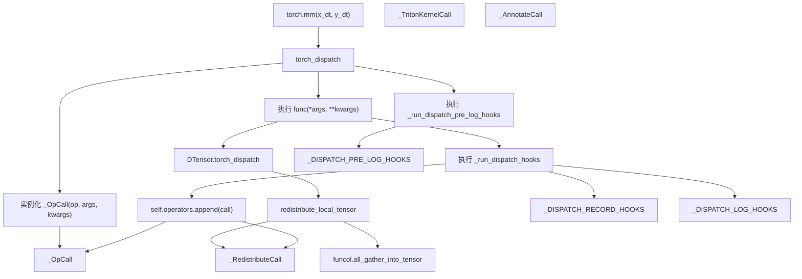
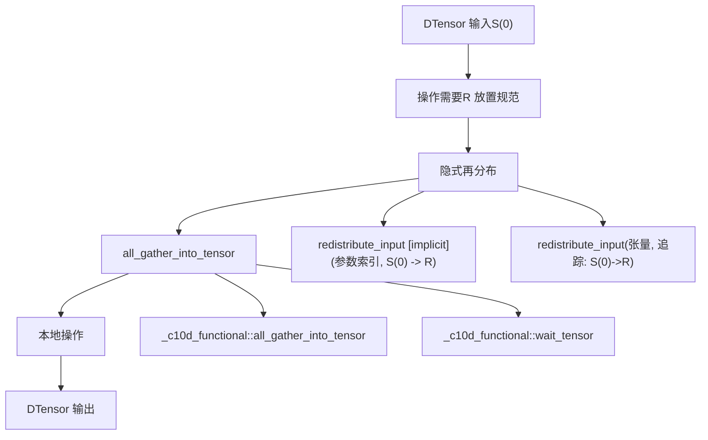
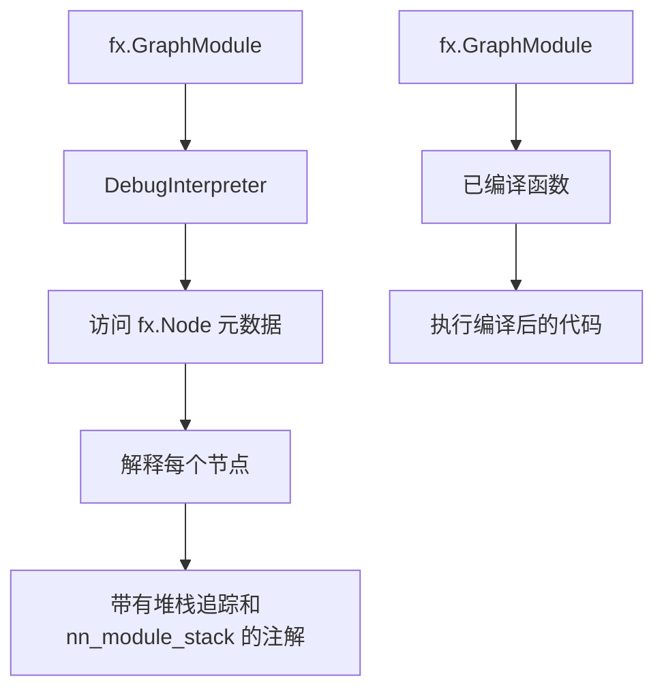
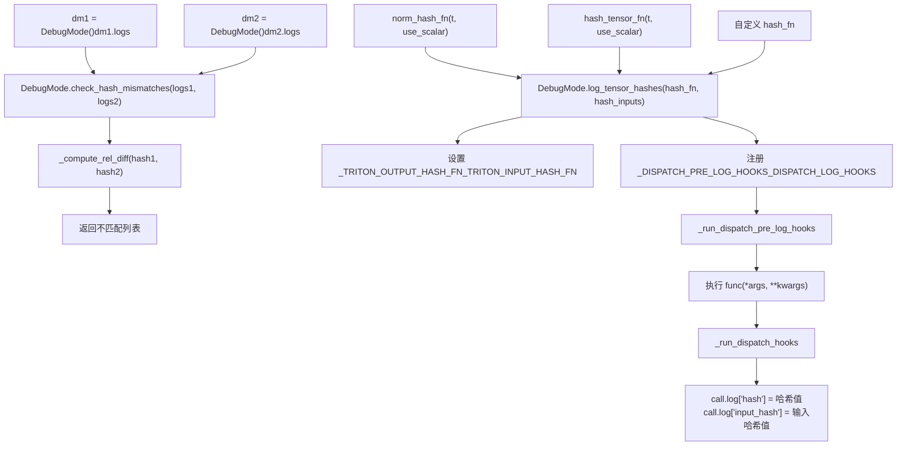
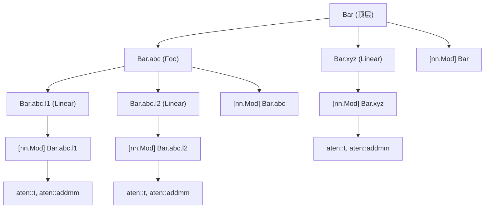

# DebugMode 与可观测性 (DebugMode and Observability)

相关源文件 (Relevant source files)

-   [test/distributed/tensor/debug/test\_debug\_mode.py](https://github.com/pytorch/pytorch/blob/915982a4/test/distributed/tensor/debug/test_debug_mode.py)
-   [test/distributed/tensor/test\_dtensor.py](https://github.com/pytorch/pytorch/blob/915982a4/test/distributed/tensor/test_dtensor.py)
-   [test/distributed/tensor/test\_dtensor\_compile.py](https://github.com/pytorch/pytorch/blob/915982a4/test/distributed/tensor/test_dtensor_compile.py)
-   [test/distributed/tensor/test\_placement\_types.py](https://github.com/pytorch/pytorch/blob/915982a4/test/distributed/tensor/test_placement_types.py)
-   [test/distributed/tensor/test\_redistribute.py](https://github.com/pytorch/pytorch/blob/915982a4/test/distributed/tensor/test_redistribute.py)
-   [test/distributed/tensor/test\_utils.py](https://github.com/pytorch/pytorch/blob/915982a4/test/distributed/tensor/test_utils.py)
-   [test/dynamo/test\_aot\_autograd\_cache.py](https://github.com/pytorch/pytorch/blob/915982a4/test/dynamo/test_aot_autograd_cache.py)
-   [torch/\_C/\_distributed.pyi](https://github.com/pytorch/pytorch/blob/915982a4/torch/_C/_distributed.pyi)
-   [torch/\_dynamo/backends/debugging.py](https://github.com/pytorch/pytorch/blob/915982a4/torch/_dynamo/backends/debugging.py)
-   [torch/\_dynamo/backends/distributed.py](https://github.com/pytorch/pytorch/blob/915982a4/torch/_dynamo/backends/distributed.py)
-   [torch/\_dynamo/variables/distributed.py](https://github.com/pytorch/pytorch/blob/915982a4/torch/_dynamo/variables/distributed.py)
-   [torch/\_functorch/\_aot\_autograd/autograd\_cache.py](https://github.com/pytorch/pytorch/blob/915982a4/torch/_functorch/_aot_autograd/autograd_cache.py)
-   [torch/\_inductor/runtime/benchmarking.py](https://github.com/pytorch/pytorch/blob/915982a4/torch/_inductor/runtime/benchmarking.py)
-   [torch/\_library/triton.py](https://github.com/pytorch/pytorch/blob/915982a4/torch/_library/triton.py)
-   [torch/csrc/distributed/Placement.h](https://github.com/pytorch/pytorch/blob/915982a4/torch/csrc/distributed/Placement.h)
-   [torch/csrc/distributed/python\_placement.cpp](https://github.com/pytorch/pytorch/blob/915982a4/torch/csrc/distributed/python_placement.cpp)
-   [torch/csrc/distributed/python\_placement.h](https://github.com/pytorch/pytorch/blob/915982a4/torch/csrc/distributed/python_placement.h)
-   [torch/csrc/dynamo/guards.h](https://github.com/pytorch/pytorch/blob/915982a4/torch/csrc/dynamo/guards.h)
-   [torch/distributed/\_functional\_collectives.py](https://github.com/pytorch/pytorch/blob/915982a4/torch/distributed/_functional_collectives.py)
-   [torch/distributed/tensor/README.md](https://github.com/pytorch/pytorch/blob/915982a4/torch/distributed/tensor/README.md)
-   [torch/distributed/tensor/\_api.py](https://github.com/pytorch/pytorch/blob/915982a4/torch/distributed/tensor/_api.py)
-   [torch/distributed/tensor/\_collective\_utils.py](https://github.com/pytorch/pytorch/blob/915982a4/torch/distributed/tensor/_collective_utils.py)
-   [torch/distributed/tensor/\_dtensor\_spec.py](https://github.com/pytorch/pytorch/blob/915982a4/torch/distributed/tensor/_dtensor_spec.py)
-   [torch/distributed/tensor/\_ops/\_embedding\_ops.py](https://github.com/pytorch/pytorch/blob/915982a4/torch/distributed/tensor/_ops/_embedding_ops.py)
-   [torch/distributed/tensor/\_redistribute.py](https://github.com/pytorch/pytorch/blob/915982a4/torch/distributed/tensor/_redistribute.py)
-   [torch/distributed/tensor/\_utils.py](https://github.com/pytorch/pytorch/blob/915982a4/torch/distributed/tensor/_utils.py)
-   [torch/distributed/tensor/placement\_types.py](https://github.com/pytorch/pytorch/blob/915982a4/torch/distributed/tensor/placement_types.py)

## 目的与范围 (Purpose and Scope)

本文档涵盖了 `DebugMode`，这是一套为 DTensor 操作、再分布和集合通信提供全面运行时可观测性的调试基础设施。它拦截 PyTorch 操作，并生成分层的字符串转储，展示操作序列、放置规范 (placement) 转换以及通信模式。

有关 DTensor 架构和基础概念，请参阅 [DTensor 架构与放置类型](/pytorch/pytorch/4.1.1-processgroup-backends)。有关再分布算法和通信原语，请参阅 [再分布与通信](/pytorch/pytorch/4.1.2-reducer-and-distributeddataparallel)。

## 概览 (Overview)

`DebugMode` 是一个 `TorchDispatchMode`，它在运行时拦截 PyTorch 操作以提供详细的执行追踪。对于调试 DTensor 程序特别有用，因为它暴露了：

-   隐式和显式的再分布操作。
-   放置规范转换（例如 `S(0)->R`, `P(sum)->S(1)`）。
-   集合通信操作（all\_gather, reduce\_scatter 等）。
-   展示高层算子如何分解为底层原语的操作层级结构。
-   与 `torch.compile` 集成，展示已编译区域中的操作。

**来源**： [torch/utils/\_debug\_mode.py1-33](https://github.com/pytorch/pytorch/blob/915982a4/torch/utils/_debug_mode.py#L1-L33)

## 核心架构 (Core Architecture)

### TorchDispatchMode 集成 (TorchDispatchMode Integration)


`DebugMode` 类扩展了 `TorchDispatchMode`，以拦截所有通过 PyTorch 分发器的操作。当一个算子被调用时：

1.  **拦截**：在实际操作之前调用 `__torch_dispatch__`。
2.  **创建 Call 对象**：实例化合适的 `_DebugCall` 子类（例如 `_OpCall`）。
3.  **前置执行 hook**：配合全局 `_DISPATCH_PRE_LOG_HOOKS` 运行 `_run_dispatch_pre_log_hooks`。
4.  **算子执行**：原始算子通过 `func(*args, **kwargs)` 正常执行。
5.  **后置执行 hook**：配合 `_DISPATCH_RECORD_HOOKS` 和 `_DISPATCH_LOG_HOOKS` 运行 `_run_dispatch_hooks`。
6.  **存储**：将 call 对象追加到 `self.operators` 列表中。

hook 系统使用了三个全局列表来允许扩展：

-   `_DISPATCH_PRE_LOG_HOOKS`：在算子执行前运行，可以记录输入状态。
-   `_DISPATCH_RECORD_HOOKS`：在 `call.record` 字典中存储数据（例如输出张量）。
-   `_DISPATCH_LOG_HOOKS`：在 `call.log` 字典中存储元数据（例如哈希值）。

**来源**： [torch/utils/\_debug\_mode.py748-1038](https://github.com/pytorch/pytorch/blob/915982a4/torch/utils/_debug_mode.py#L748-L1038) [torch/utils/\_debug\_mode.py76-92](https://github.com/pytorch/pytorch/blob/915982a4/torch/utils/_debug_mode.py#L76-L92) [torch/utils/\_debug\_mode.py618-649](https://github.com/pytorch/pytorch/blob/915982a4/torch/utils/_debug_mode.py#L618-L649)

### 调用追踪类 (Call Tracking Classes)


每种调用类型都会捕获不同的信息：

-   **`_OpCall`**：带有参数、关键字参数以及可选输出的标准 PyTorch 操作。
-   **`_RedistributeCall`**：展示源/目标放置规范和转换序列的 DTensor 再分布。
-   **`_OutputPlacementCall`**：记录多输出 DTensor 操作的输出放置规范。
-   **`_TritonKernelCall`**：包含用于数值验证的前/后哈希值的 Inductor 生成的 Triton 内核。
-   **`_AnnotateCall`**：用户注解和区域边界（例如已编译区域、nn.Module 调用）。

**来源**： [torch/utils/\_debug\_mode.py293-608](https://github.com/pytorch/pytorch/blob/915982a4/torch/utils/_debug_mode.py#L293-L608)

### 分层日志 (Hierarchical Logging)

`call_depth` 属性追踪操作嵌套情况，以生成缩进后的输出：

```
torch.mm(dt$0: f32[8, 8]| S(0), dt$1: f32[8, 32]| S(0))  ->  dt$7: f32[8, 32]| S(0)
  aten::mm(dt$0: f32[8, 8]| S(0), dt$1: f32[8, 32]| S(0))
    redistribute_input [implicit] (1, S(0) -> R)
      redistribute_input(t$2: f32[1, 32], trace: S(0)->R)
        _c10d_functional::all_gather_into_tensor(t$2: f32[1, 32], 8, 0)  ->  t$3: f32[8, 32]
        _c10d_functional::wait_tensor(t$3: f32[8, 32])  ->  t$3: f32[8, 32]
    aten::mm(t$5: f32[1, 8], t$3: f32[8, 32])  ->  t$6: f32[1, 32]
```
这种结构展示了：

-   顶层用户操作 (`torch.mm`)。
-   ATen 级别的操作分解 (`aten::mm`)。
-   隐式的再分布决策。
-   实际的集合通信 (`all_gather_into_tensor`)。
-   在分片数据上的本地操作。

**来源**： [torch/utils/\_debug\_mode.py1103-1237](https://github.com/pytorch/pytorch/blob/915982a4/torch/utils/_debug_mode.py#L1103-L1237) [test/distributed/tensor/debug/test\_debug\_mode.py63-89](https://github.com/pytorch/pytorch/blob/915982a4/test/distributed/tensor/debug/test_debug_mode.py#L63-L89)

## DTensor 特有特性 (DTensor-Specific Features)

### 再分布日志记录 (Redistribution Logging)

DebugMode 提供了对通常对用户隐藏的 DTensor 再分布操作的特殊可见性：


再分布日志记录分为两个层级：

1.  **外层调用 (Outer call)**：展示带有 `[implicit]` 或 `[explicit]` 注解的高层决策。
2.  **内层调用 (Inner call)**：展示带有放置规范追踪的实际张量转换。

**输出示例：**

```
aten::mm(dt: f32[8, 8]| S(0), dt: f32[8, 32]| S(0))
  redistribute_input [implicit] (1, S(0) -> R)
    redistribute_input(t: f32[1, 32], trace: S(0)->R)
      _c10d_functional::all_gather_into_tensor(t: f32[1, 32], 8, 0)
```
`[implicit]` 标签表示该再分布是由 DTensor 的分片传播自动插入的，而 `[explicit]` 则出现在用户调用的 `.redistribute()` 操作中。

**来源**： [torch/utils/\_debug\_mode.py416-485](https://github.com/pytorch/pytorch/blob/915982a4/torch/utils/_debug_mode.py#L416-L485) [test/distributed/tensor/debug/test\_debug\_mode.py320-350](https://github.com/pytorch/pytorch/blob/915982a4/test/distributed/tensor/debug/test_debug_mode.py#L320-L350)

### 多步骤再分布追踪 (Multi-Step Redistribution Traces)

对于涉及多个网格维度或分片顺序的复杂再分布，DebugMode 会展示完整的转换序列：

```
redistribute_input(t: f32[8, 16], trace: S(1)[0]S(1)[1]->S(1)R->RR)
  _c10d_functional::all_gather_into_tensor(t: f32[8, 16], 2, 3)
  aten::chunk(t: f32[16, 16], 2)
  aten::cat(['t: f32[8, 16]', 't: f32[8, 16]'], 1)
  _c10d_functional::all_gather_into_tensor(t: f32[8, 32], 4, 1)
  aten::chunk(t: f32[32, 32], 4)
  aten::cat(['t: f32[8, 32]', 't: f32[8, 32]', 't: f32[8, 32]', 't: f32[8, 32]'], 1)
```
追踪信息 `S(1)[0]S(1)[1]->S(1)R->RR` 展示了三种状态：

1.  初始状态：张量维度 1 在网格维度 \[0, 1\] 上分片。
2.  中间状态：张量维度 1 仅在网格维度 1 上分片。
3.  最终状态：完全副本化。

**来源**： [test/distributed/tensor/debug/test\_debug\_mode.py287-318](https://github.com/pytorch/pytorch/blob/915982a4/test/distributed/tensor/debug/test_debug_mode.py#L287-L318)

### 输出放置规范记录 (Output Placement Recording)

对于返回多个 DTensor 输出的操作（例如 `topk`），DebugMode 会记录每个输出的放置规范：

```
aten::topk(dt: f32[8, 16]| S(1), 4, 1)
  -> output: ('R', 'R')
  redistribute_input [implicit] (0, S(1) -> R)
    ...
  aten::topk(t: f32[8, 16], 4, 1)  ->  ('t: f32[8, 4]', 't: i64[8, 4]')
```
`-> output: ('R', 'R')` 这一行显示两个输出（数值和索引）都具有 `Replicate()` 放置规范。

**来源**： [torch/utils/\_debug\_mode.py487-501](https://github.com/pytorch/pytorch/blob/915982a4/torch/utils/_debug_mode.py#L487-L501) [test/distributed/tensor/debug/test\_debug\_mode.py352-378](https://github.com/pytorch/pytorch/blob/915982a4/test/distributed/tensor/debug/test_debug_mode.py#L352-L378)

## 编译集成 (Compilation Integration)

### torch.compile 下的行为 (Behavior Under torch.compile)

DebugMode 在编译“下方”运行，这意味着：

1.  **编译阶段**：DebugMode 隐藏自身，允许 Dynamo 正常追踪。
2.  **运行阶段**：DebugMode 重新介入以记录实际执行。
3.  **结果**：已编译代码不包含 DebugMode 开销，但运行时执行仍会被记录。

```python
@torch.compile(backend="aot_eager")
def fn(x, y):    
    return (x @ y).sum() 

with DebugMode() as debug_mode:    
    result = fn(x_dtensor, y_dtensor) 

# debug_mode.debug_string() 展示运行时执行细节
```
**来源**： [torch/utils/\_debug\_mode.py17-18](https://github.com/pytorch/pytorch/blob/915982a4/torch/utils/_debug_mode.py#L17-L18) [test/distributed/tensor/debug/test\_debug\_mode.py559-575](https://github.com/pytorch/pytorch/blob/915982a4/test/distributed/tensor/debug/test_debug_mode.py#L559-L575)

### 针对 AOT 区域的 DebugInterpreter (DebugInterpreter for AOT Regions)


当 `run_compile_with_interpreter=True` 时，DebugMode 使用 `DebugInterpreter` 替换已编译函数，该解释器：

1.  使用 `fx.Interpreter` 运行图。
2.  访问 `fx.Node` 元数据（stack\_trace, nn\_module\_stack）。
3.  使用编译上下文注解日志。
4.  使用 `[aot_eager region (compile)]` 标记展示区域边界。

**示例：**

```
[aot_eager region (compile)] enter
  [nn.Mod (compile)] L['self'].l1
    aten::t(t: f32[8, 8])  ->  t: f32[8, 8]
    aten::addmm(t: f32[8], t: f32[8, 8], t: f32[8, 8])  ->  t: f32[8, 8]
[aot_eager region (compile)] exit
```
**来源**： [torch/utils/\_debug\_mode.py676-745](https://github.com/pytorch/pytorch/blob/915982a4/torch/utils/_debug_mode.py#L676-L745) [test/distributed/tensor/debug/test\_debug\_mode.py245-286](https://github.com/pytorch/pytorch/blob/915982a4/test/distributed/tensor/debug/test_debug_mode.py#L245-L286)

## 使用模式与配置 (Usage Patterns and Configuration)

### 基础用法 (Basic Usage)

```python
from torch.utils._debug_mode import DebugMode 

mesh = DeviceMesh("cuda", list(range(world_size)))
x = torch.randn(8, 8)
y = torch.randn(8, 32)
x_dt = DTensor.from_local(x, mesh, [Shard(0)])
y_dt = DTensor.from_local(y, mesh, [Shard(0)]) 

with DebugMode() as debug_mode:    
    result = torch.mm(x_dt, y_dt).sum() 

print(debug_mode.debug_string())
```
**来源**： [torch/utils/\_debug\_mode.py28-32](https://github.com/pytorch/pytorch/blob/915982a4/torch/utils/_debug_mode.py#L28-L32)

### 配置选项 (Configuration Options)

| 参数 | 默认值 | 描述 |
| --- | --- | --- |
| `record_torchfunction` | `False` | 记录 `__torch_function__` 调用（与编译不兼容） |
| `record_faketensor` | `False` | 记录在 FakeTensor 上的操作 |
| `record_realtensor` | `True` | 记录在真实张量上的操作 |
| `record_localtensor` | `True` | 记录在 LocalTensor 上的操作 |
| `record_tensor_attributes` | `[]` | 要展示的张量属性列表（例如自定义标签） |
| `record_nn_module` | `False` | 追踪 nn.Module 调用层级 |
| `store_original_args` | `False` | 保留原始 args/kwargs（内存密集型） |
| `record_stack_trace` | `False` | 为每个算子捕获堆栈追踪 |
| `record_output` | `True` | 记录算子输出 |
| `record_ids` | `False` | 使用图风格的张量 ID（例如 `$0`, `$1`）进行注解 |
| `record_profiler_context` | `True` | 展示 `profiler.record_function` 上下文 |
| `run_compile_with_interpreter` | `False` | 为 AOT 区域使用 DebugInterpreter |

**上下文管理器辅助函数：**

DebugMode 为常见用例提供了几种上下文管理器类方法：

-   `DebugMode.record_outputs()`：在不开启完整 DebugMode 的情况下启用输出记录。
-   `DebugMode.log_tensor_hashes(hash_fn, hash_inputs)`：启用张量哈希计算。
-   `DebugMode.dispatch_hooks(record_hook, log_hook, pre_log_hook)`：注册自定义 hooks。

组合多个上下文管理器的示例：

```python
with (    
    DebugMode() as dm,    
    DebugMode.record_outputs(),    
    DebugMode.log_tensor_hashes(hash_fn=["norm", "hash_tensor"])
):    
    output = model(input) 

# 访问记录的输出
for op in dm.operators:    
    if hasattr(op, 'record') and op.record:        
        print(op.record['output'])
```
**来源**： [torch/utils/\_debug\_mode.py749-820](https://github.com/pytorch/pytorch/blob/915982a4/torch/utils/_debug_mode.py#L749-L820) [torch/utils/\_debug\_mode.py1585-1634](https://github.com/pytorch/pytorch/blob/915982a4/torch/utils/_debug_mode.py#L1585-L1634)

### 输出解读 (Output Interpretation)

`debug_string()` 方法产生缩进后的、分层的输出：

**张量记法：**

-   `dt`：DTensor。
-   `t`：常规张量 (regular Tensor)。
-   `ft`：FakeTensor。
-   `$N`：当 `record_ids=True` 时的可选张量 ID。
-   `f32[8, 32]`：数据类型和形状。
-   `| S(0)`：放置规范。

**放置规范记法：**

-   `S(dim)`：在指定维度上分片。
-   `S(dim)[mesh_dim0]S(dim)[mesh_dim1]`：带有显式顺序的多网格维度分片。
-   `R`：副本化。
-   `P(sum)`：带有归约操作的局部状态。

**再分布追踪：**

-   `S(0)->R`：简单转换。
-   `S(1)[0]S(1)[1]->S(1)R->RR`：多步骤转换。

**来源**： [torch/utils/\_debug\_mode.py1103-1237](https://github.com/pytorch/pytorch/blob/915982a4/torch/utils/_debug_mode.py#L1103-L1237)

## 高级特性 (Advanced Features)

### 数值调试的张量哈希 (Tensor Hashing for Numerical Debugging)


**用法：**

```python
# 记录输入和输出哈希值
with (    
    DebugMode() as dm,    
    DebugMode.log_tensor_hashes(hash_fn="norm", hash_inputs=True)
):    
    output = model(input) 

# 输出中包含哈希值
# aten::add(t: i64[], 1)  ->  t: i64[]  # {'input_hash': ((1.0, None), {}), 'hash': 2.0}
```
**对比多次运行：**

```python
with DebugMode() as dm1, DebugMode.log_tensor_hashes():    
    output1 = model(input1) 

with DebugMode() as dm2, DebugMode.log_tensor_hashes():    
    output2 = model(input2) 

mismatches = DebugMode.check_hash_mismatches(dm1.logs, dm2.logs)
# 返回一个字典列表: [{'call': 'aten::sin', 'hash1': ..., 'hash2': ..., 'rel_diff': ...}, ...]
```
**哈希函数：**

`hash_fn` 参数接受：

-   `"norm"`：使用 `norm_hash_fn` —— 在 float64/complex128 下计算 L1 范数以保证稳定性。
-   `"hash_tensor"`：使用 `hash_tensor_fn` —— 包装 `torch.hash_tensor` 以进行精确的按位对比。
-   `["norm", "hash_tensor"]`：计算两种哈希值，作为元组存储在 `call.log['hash']` 中。
-   自定义可调用对象：任何函数 `(tensor) -> scalar`。

**实现细节：**

-   `norm_hash_fn(t, use_scalar)`：转换为 float64/complex128，处理 NaN/inf，计算 L1 范数。
-   `hash_tensor_fn(t, use_scalar)`：转换为 int64/float64/complex128，调用 `torch.hash_tensor`。
-   对于 DTensor 输入，哈希值通过 `dt.to_local()` 在本地张量上计算。
-   相对差异计算公式为 `|hash1 - hash2| / max(|hash1|, |hash2|, 1e-10)`。

**来源**： [torch/utils/\_debug\_mode.py173-224](https://github.com/pytorch/pytorch/blob/915982a4/torch/utils/_debug_mode.py#L173-L224) [torch/utils/\_debug\_mode.py195-200](https://github.com/pytorch/pytorch/blob/915982a4/torch/utils/_debug_mode.py#L195-L200) [test/distributed/tensor/debug/test\_debug\_mode.py884-906](https://github.com/pytorch/pytorch/blob/915982a4/test/distributed/tensor/debug/test_debug_mode.py#L884-L906)

### 堆栈追踪记录 (Stack Trace Recording)

当 `record_stack_trace=True` 时，每个操作都会捕获其 Python 调用栈：

```python
with DebugMode(record_stack_trace=True) as debug_mode:    
    out = model(input)    
    out.backward() 

# 访问特定操作的堆栈追踪
op_call = debug_mode.operators[10]
print(op_call.stack_trace)  # 完整的 Python 栈
print(op_call.fwd_stack_trace)  # 针对反向算子的前向栈
```
对于开启了解释器模式的已编译区域，堆栈追踪来自 `fx.Node` 元数据：

```python
with DebugMode(    
    record_stack_trace=True,    
    run_compile_with_interpreter=True
) as debug_mode:    
    out = torch.compile(model)(input) 

# 堆栈追踪指向原始用户代码，而非已编译的图
```
**来源**： [torch/utils/\_debug\_mode.py226-254](https://github.com/pytorch/pytorch/blob/915982a4/torch/utils/_debug_mode.py#L226-L254) [test/distributed/tensor/debug/test\_debug\_mode.py245-286](https://github.com/pytorch/pytorch/blob/915982a4/test/distributed/tensor/debug/test_debug_mode.py#L245-L286)

### nn.Module 追踪 (nn.Module Tracking)


**用法：**

```python
class Model(nn.Module):    
    def __init__(self):        
        super().__init__()        
        self.layer1 = nn.Linear(8, 8)        
        self.layer2 = nn.Linear(8, 8)        
        
    def forward(self, x):        
        return self.layer2(self.layer1(x)) 

with DebugMode(record_nn_module=True) as debug_mode:    
    model(input) 

# 输出展示带有操作的模块层级
```
对于已编译区域，模块追踪使用来自 `fx.Node` 元数据的 `nn_module_stack`：

```
[aot_eager region (compile)] enter
  [nn.Mod (compile)] L['self'].layer1
    aten::t(...)
    aten::addmm(...)
  [nn.Mod (compile)] L['self'].layer2
    aten::t(...)
    aten::addmm(...)
[aot_eager region (compile)] exit
```
**来源**： [torch/utils/\_debug\_mode.py1385-1514](https://github.com/pytorch/pytorch/blob/915982a4/torch/utils/_debug_mode.py#L1385-L1514) [test/distributed/tensor/debug/test\_debug\_mode.py625-678](https://github.com/pytorch/pytorch/blob/915982a4/test/distributed/tensor/debug/test_debug_mode.py#L625-L678)

### Triton 内核日志记录 (Triton Kernel Logging)

DebugMode 可以通过 `_TritonKernelCall` 拦截并记录 Inductor 生成的 Triton 内核：

```python
def call_triton(x, y):    
    output = torch.zeros_like(x)    
    n_elements = output.numel()    
    grid = lambda meta: (triton.cdiv(n_elements, meta["BLOCK_SIZE"]),)    
    add_kernel[grid](x, y, output, n_elements, BLOCK_SIZE=1024)    
    return output 

with DebugMode() as debug_mode:    
    torch.compile(call_triton)(x, y) 

# 输出包含 Triton 内核调用
# [triton] add_kernel(x=t: f32[128], y=t: f32[128], output=t: f32[128], n_elements=128)
```
配合哈希日志：

```python
with (    
    DebugMode() as dm,    
    DebugMode.log_tensor_hashes()
):    
    torch.compile(call_triton)(x, y) 

# [triton] add_kernel(...)
#   # pre-kernel hashes: {x: 123.45, y: 67.89}
#   # post-kernel hashes: {output: 191.34}
```
**实现细节：**

由于内核不通过 `__torch_dispatch__` 进行分发，Triton 内核拦截需要特殊处理。相反：

1.  Inductor 的内核包装器捕获内核启动。
2.  使用全局变量 `_TRITON_INPUT_HASH_FN` 计算内核前哈希。
3.  通过 `device_interface.synchronize()` 执行设备同步。
4.  使用全局变量 `_TRITON_OUTPUT_HASH_FN` 和 `_RECORD_TRITON_OUTPUTS` 捕获内核后哈希和输出。
5.  `_TritonKernelCall.finalize()` 方法处理同步和数据捕获。

`_TritonKernelCall` 类存储内核名称、参数，以及用于调试已编译内核中数值问题的可选前/后哈希。

**来源**： [torch/utils/\_debug\_mode.py503-587](https://github.com/pytorch/pytorch/blob/915982a4/torch/utils/_debug_mode.py#L503-L587) [torch/utils/\_debug\_mode.py84-90](https://github.com/pytorch/pytorch/blob/915982a4/torch/utils/_debug_mode.py#L84-L90) [test/distributed/tensor/debug/test\_debug\_mode.py858-882](https://github.com/pytorch/pytorch/blob/915982a4/test/distributed/tensor/debug/test_debug_mode.py#L858-L882)

### 自定义注解 (Custom Annotations)

用户可以使用 `DebugMode._annotate()` 为调试日志添加自定义注解：

```python
class MyModel(nn.Module):    
    def forward(self, x):        
        DebugMode._annotate("preprocessing")        
        x = self.preprocess(x)                
        
        DebugMode._annotate("main computation")        
        x = self.compute(x)                
        
        return x 

with DebugMode() as debug_mode:    
    model(input) 

# 输出:
# [annotate] preprocessing
#   aten::add(...)
# [annotate] main computation
#   aten::mm(...)
```
**实现细节：**

`_annotate()` 函数被注册为自定义算子 `torch.ops.debug_mode_ops.annotate`，以便在已编译图中正常工作：

```python
@torch.library.custom_op("debug_mode_ops::annotate", mutates_args=())
def _annotate(tag: str) -> None:    
    # 在 DebugMode.__torch_dispatch__ 中进行了特殊处理    
    return None
```
该算子使用了 `torch._dynamo.dont_skip_tracing` 修饰，以确保被 Dynamo 图捕获，并被标记为有副作用的，以防止在 AOT Autograd 中被作为死代码删除 (DCE)。对于 Inductor 后端，注册了一个空操作 (no-op) 降低方案。

注解在 eager 模式和（带有 AOT 后端的）编译模式下均有效。

**来源**： [torch/utils/\_debug\_mode.py665-673](https://github.com/pytorch/pytorch/blob/915982a4/torch/utils/_debug_mode.py#L665-L673) [torch/utils/\_debug\_mode.py269-291](https://github.com/pytorch/pytorch/blob/915982a4/torch/utils/_debug_mode.py#L269-L291) [test/distributed/tensor/debug/test\_debug\_mode.py562-608](https://github.com/pytorch/pytorch/blob/915982a4/test/distributed/tensor/debug/test_debug_mode.py#L562-L608)

## 与基准测试的集成 (Integration with Benchmarking)

当 Inductor 执行自动调优 (autotuning) 时，DebugMode 日志记录会暂时禁用，以避免日志中充斥着基准内核启动信息：

```python
# 位于 torch._inductor.runtime.benchmarking 中
from torch.utils._debug_mode import _IN_INDUCTOR_BENCHMARK 

def benchmark_gpu(...):    
    global _IN_INDUCTOR_BENCHMARK    
    _IN_INDUCTOR_BENCHMARK = True    
    try:        
        # 测试不同的内核配置        
        # (DebugMode 不会记录这些)        
        ...    
    finally:        
        _IN_INDUCTOR_BENCHMARK = False
```
这确保了 `debug_string()` 仅展示实际执行情况，而非自动调优开销。

**来源**： [torch/utils/\_debug\_mode.py81-83](https://github.com/pytorch/pytorch/blob/915982a4/torch/utils/_debug_mode.py#L81-L83) [torch/\_inductor/runtime/benchmarking.py15](https://github.com/pytorch/pytorch/blob/915982a4/torch/_inductor/runtime/benchmarking.py#L15-L15)
