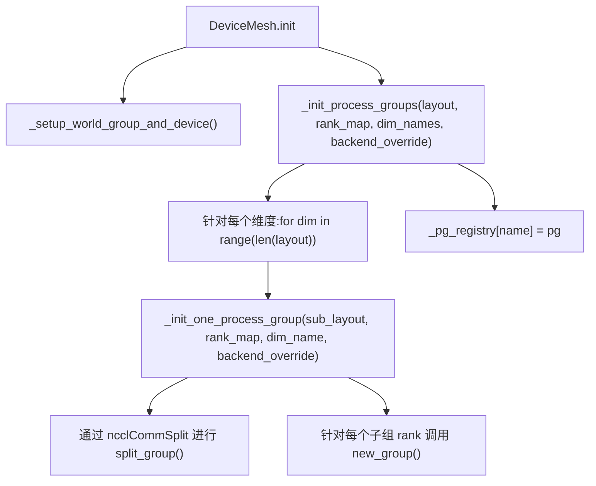
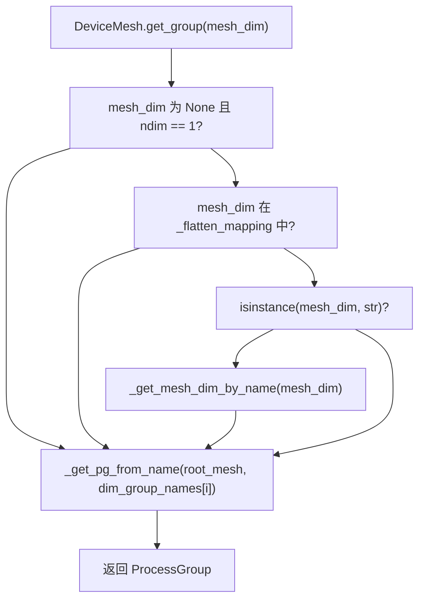

# DeviceMesh 与设备拓扑 (DeviceMesh and Device Topology)

相关源文件 (Relevant source files)

-   [test/distributed/\_pycute/test\_coalesce.py](https://github.com/pytorch/pytorch/blob/915982a4/test/distributed/_pycute/test_coalesce.py)
-   [test/distributed/\_pycute/test\_complement.py](https://github.com/pytorch/pytorch/blob/915982a4/test/distributed/_pycute/test_complement.py)
-   [test/distributed/\_pycute/test\_composition.py](https://github.com/pytorch/pytorch/blob/915982a4/test/distributed/_pycute/test_composition.py)
-   [test/distributed/\_pycute/test\_int\_tuple.py](https://github.com/pytorch/pytorch/blob/915982a4/test/distributed/_pycute/test_int_tuple.py)
-   [test/distributed/\_pycute/test\_left\_inverse.py](https://github.com/pytorch/pytorch/blob/915982a4/test/distributed/_pycute/test_left_inverse.py)
-   [test/distributed/\_pycute/test\_right\_inverse.py](https://github.com/pytorch/pytorch/blob/915982a4/test/distributed/_pycute/test_right_inverse.py)
-   [test/distributed/\_pycute/test\_typing.py](https://github.com/pytorch/pytorch/blob/915982a4/test/distributed/_pycute/test_typing.py)
-   [test/distributed/test\_device\_mesh.py](https://github.com/pytorch/pytorch/blob/915982a4/test/distributed/test_device_mesh.py)
-   [torch/distributed/\_composable/checkpoint\_activation.py](https://github.com/pytorch/pytorch/blob/915982a4/torch/distributed/_composable/checkpoint_activation.py)
-   [torch/distributed/\_composable/replicate.py](https://github.com/pytorch/pytorch/blob/915982a4/torch/distributed/_composable/replicate.py)
-   [torch/distributed/\_local\_tensor/\_\_init\_\_.py](https://github.com/pytorch/pytorch/blob/915982a4/torch/distributed/_local_tensor/__init__.py)
-   [torch/distributed/\_local\_tensor/\_c10d.py](https://github.com/pytorch/pytorch/blob/915982a4/torch/distributed/_local_tensor/_c10d.py)
-   [torch/distributed/\_mesh\_layout.py](https://github.com/pytorch/pytorch/blob/915982a4/torch/distributed/_mesh_layout.py)
-   [torch/distributed/\_ops/device\_mesh.py](https://github.com/pytorch/pytorch/blob/915982a4/torch/distributed/_ops/device_mesh.py)
-   [torch/distributed/\_pycute/\_\_init\_\_.py](https://github.com/pytorch/pytorch/blob/915982a4/torch/distributed/_pycute/__init__.py)
-   [torch/distributed/\_pycute/int\_tuple.py](https://github.com/pytorch/pytorch/blob/915982a4/torch/distributed/_pycute/int_tuple.py)
-   [torch/distributed/\_pycute/layout.py](https://github.com/pytorch/pytorch/blob/915982a4/torch/distributed/_pycute/layout.py)
-   [torch/distributed/\_pycute/typing.py](https://github.com/pytorch/pytorch/blob/915982a4/torch/distributed/_pycute/typing.py)
-   [torch/distributed/device\_mesh.py](https://github.com/pytorch/pytorch/blob/915982a4/torch/distributed/device_mesh.py)
-   [torch/distributed/optim/zero\_redundancy\_optimizer.py](https://github.com/pytorch/pytorch/blob/915982a4/torch/distributed/optim/zero_redundancy_optimizer.py)
-   [torch/distributed/tensor/examples/comm\_mode\_features\_example.py](https://github.com/pytorch/pytorch/blob/915982a4/torch/distributed/tensor/examples/comm_mode_features_example.py)
-   [torch/distributed/tensor/examples/flex\_attention\_cp.py](https://github.com/pytorch/pytorch/blob/915982a4/torch/distributed/tensor/examples/flex_attention_cp.py)
-   [torch/distributed/tensor/examples/torchrec\_sharding\_example.py](https://github.com/pytorch/pytorch/blob/915982a4/torch/distributed/tensor/examples/torchrec_sharding_example.py)
-   [torch/distributed/tensor/examples/visualize\_sharding\_example.py](https://github.com/pytorch/pytorch/blob/915982a4/torch/distributed/tensor/examples/visualize_sharding_example.py)
-   [torch/testing/\_internal/distributed/\_tensor/common\_dtensor.py](https://github.com/pytorch/pytorch/blob/915982a4/torch/testing/_internal/distributed/_tensor/common_dtensor.py)

## 目的与范围 (Purpose and Scope)

本页记录了 `DeviceMesh` 类、其内部布局代数 (`_MeshLayout`)、针对每个网格维度的进程组 (ProcessGroup) 管理、工厂函数 `init_device_mesh`，以及 `LocalTensor` 单进程模拟模式。这些组件构成了所有基于 DTensor 的分布式训练所依赖的设备拓扑层。

有关 DTensor 如何使用 `DeviceMesh` 来表示分片放置规范的信息，请参阅 [4.2.1](/pytorch/pytorch/4.2.1-dtensor-architecture-and-placement-types)。有关集合操作如何跨网格维度进行规划，请参阅 [4.2.3](/pytorch/pytorch/4.2.3-redistribution-and-communication-planning)。有关 `DeviceMesh` 所包装的底层 `ProcessGroup` 抽象，请参阅 [4.1.1](/pytorch/pytorch/4.1.1-processgroup-backends)。

---

## 概览 (Overview)

`DeviceMesh` 将设备集群表示为一个由全局进程 rank 组成的 N 维数组。网格的每个维度对应一个并行轴（例如：数据并行、张量并行、流水线并行）。网格为每个维度管理一个 `ProcessGroup`，用于路由集合通信。

该设计遵循 SPMD 模型：作业中的每个进程运行相同的 Python 代码并构建相同的网格。网格张量在所有 rank 之间必须是一致的；不一致会导致挂起。

```
mesh = [[0, 1, 2, 3],        
        [4, 5, 6, 7]]
```
在这个 2×4 的网格中，维度 0（行）连接跨主机的 rank，维度 1（列）连接主机内的 rank。

---

## 关键类 (Key Classes)

### `DeviceMesh`

定义于 [torch/distributed/device\_mesh.py151-870](https://github.com/pytorch/pytorch/blob/915982a4/torch/distributed/device_mesh.py#L151-L870)

`DeviceMesh` 是 `torch._opaque_base.OpaqueBase` 的子类。其主要内部状态包括：

| 字段 | 类型 | 用途 |
| --- | --- | --- |
| `_device_type` | `str` | 设备类型：`"cuda"`, `"cpu"` 等 |
| `_layout` | `_MeshLayout` | CuTe 风格的布局，编码了网格的形状和步长 |
| `_rank_map` | `torch.Tensor` | 将布局索引映射到全局 rank 的一维扁平张量 |
| `_mesh_dim_names` | `tuple[str, ...]` | 每个网格维度的可选名称 |
| `_dim_group_names` | `list[GroupName]` | 每维度 `ProcessGroup` 对象的名称 |
| `_pg_registry` | `dict[str, ProcessGroup]` | 名称 → `ProcessGroup` 的缓存，用于 `torch.compile` 期间的快速查找 |
| `_root_mesh` | `DeviceMesh` | 当本对象为子网格时，指向父网格的引用 |
| `_flatten_mapping` | `dict[str, DeviceMesh]` | 将扁平化的维度名称映射到其网格对象 |
| `_coordinate_on_dim` | `tuple[int, ...]` | 本 rank 在网格中的坐标 |

### `_MeshLayout`

定义于 [torch/distributed/\_mesh\_layout.py26-320](https://github.com/pytorch/pytorch/blob/915982a4/torch/distributed/_mesh_layout.py#L26-L320)

`_MeshLayout` 是一个冻结的数据类 (frozen dataclass)，存储了 `(shape, stride)` 对，并提供布局代数运算。它是内部的簿记层，将网格拓扑与 `_rank_map` 中的实际 rank 分配解耦。

### `_MeshEnv`

定义于 [torch/distributed/device\_mesh.py94-140](https://github.com/pytorch/pytorch/blob/915982a4/torch/distributed/device_mesh.py#L94-L140)

`_MeshEnv` 是一个线程本地 (`threading.local`) 的单例 (`_mesh_resources`)，持有一个处于激活状态的 `DeviceMesh` 对象栈。`DeviceMesh` 实现了上下文管理器协议 (`__enter__` / `__exit__`)，用于在栈中压入/弹出自身。DTensor 操作在未显式提供网格时，会通过 `_mesh_resources.get_current_mesh()` 咨询当前的激活网格。

---

## 架构 (Architecture)

**DeviceMesh 内部结构**


来源： [torch/distributed/device\_mesh.py151-210](https://github.com/pytorch/pytorch/blob/915982a4/torch/distributed/device_mesh.py#L151-L210) [torch/distributed/\_mesh\_layout.py26-100](https://github.com/pytorch/pytorch/blob/915982a4/torch/distributed/_mesh_layout.py#L26-L100)

---

## `_MeshLayout` 与 CuTe 布局代数 (The CuTe Layout Algebra)

`_MeshLayout` 借鉴了 [NVIDIA CuTe](https://docs.nvidia.com/cutlass/media/docs/cpp/cute/02_layout_algebra.html) 中的 Layout 概念，并使其适配 PyTorch 的字典序 (lexicographic ordering)。布局是一个 `(shape, stride)` 对，将逻辑坐标映射到线性索引（在此上下文中为 rank 索引）。

底层的原始类型定义在 [torch/distributed/\_pycute/](https://github.com/pytorch/pytorch/blob/915982a4/torch/distributed/_pycute/)：

| 模块 | 关键导出项 |
| --- | --- |
| `_pycute/int_tuple.py` | `IntTuple`, `flatten`, `suffix_product`, `crd2idx`, `idx2crd` |
| `_pycute/layout.py` | `Layout`, `coalesce`, `complement`, `composition` |
| `_pycute/__init__.py` | 重新导出上述所有项 |

**关键的 `_MeshLayout` 操作**

| 方法 | 描述 |
| --- | --- |
| `numel()` | 所有维度的乘积 —— 此布局中的总 rank 数 |
| `cosize()` | 上域 (codomain) 尺寸：布局能产生的最大 rank 索引 + 1 |
| `complement(world_size)` | 计算填满 `world_size` 所需的补全布局 |
| `coalesce()` | 合并具有兼容步长的相邻维度 |
| `composition(layout)` | 将 `layout` 作为选择器应用在 `self` 之上 |
| `remap_to_tensor(rank_map)` | 将布局实例化为索引到 `rank_map` 中的 `torch.Tensor` |
| `all_ranks_from_zero()` | 使用布局枚举从坐标 `0` 开始的所有 rank 索引 |
| `global_ranks(world_size)` | 返回此布局在 `world_size` 个 rank 上的所有 rank 组 |
| `check_non_overlap()` | 验证是否没有两个坐标映射到相同的 rank 索引 |

**`remap_to_tensor` 如何工作**

给定一个持有实际全局 rank 的一维 `rank_map` 和一个布局，`remap_to_tensor` 会使用布局的补集调用 `as_strided`，然后对结果进行 reshape。这将产生一个形状与网格维度匹配的张量：

[torch/distributed/\_mesh\_layout.py274-320](https://github.com/pytorch/pytorch/blob/915982a4/torch/distributed/_mesh_layout.py#L274-L320)

**示例：在 8 个 rank 上的 2×4 网格**

-   布局：shape=`(2, 4)`, stride=`(4, 1)`（行主序）
-   `rank_map`： `[0, 1, 2, 3, 4, 5, 6, 7]`
-   `remap_to_tensor` 产生 `[[0,1,2,3],[4,5,6,7]]`

**\_MeshLayout 补集与全局 Rank**

对于一个布局为 `(4:1)`、`world_size=8` 的网格维度：

-   `complement(8)` = `(2:4)` —— 补全偏移布局
-   `global_ranks(8)` = `[[0,1,2,3], [4,5,6,7]]` —— 每个补全偏移对应一组

来源： [torch/distributed/\_mesh\_layout.py1-320](https://github.com/pytorch/pytorch/blob/915982a4/torch/distributed/_mesh_layout.py#L1-L320) [torch/distributed/\_pycute/int\_tuple.py1-286](https://github.com/pytorch/pytorch/blob/915982a4/torch/distributed/_pycute/int_tuple.py#L1-L286) [torch/distributed/\_pycute/layout.py1-300](https://github.com/pytorch/pytorch/blob/915982a4/torch/distributed/_pycute/layout.py#L1-L300)

---

## 进程组初始化 (ProcessGroup Initialization)

当创建一个 `DeviceMesh` 且 `_init_backend=True`（默认值）时，会执行两个步骤：

1.  **世界组 (World group) 设置**，通过 `_setup_world_group_and_device` —— 确保 `init_process_group` 已被调用，并为当前进程选择设备。
2.  **每维度组创建**，通过 `_init_process_groups` —— 为每个网格维度创建一个 `ProcessGroup`。

**进程组初始化流程**


来源： [torch/distributed/device\_mesh.py299-326](https://github.com/pytorch/pytorch/blob/915982a4/torch/distributed/device_mesh.py#L299-L326) [torch/distributed/device\_mesh.py492-619](https://github.com/pytorch/pytorch/blob/915982a4/torch/distributed/device_mesh.py#L492-L619)

**进程组策略 (Process Group Strategy)**

`_init_one_process_group` 按照以下优先级使用三种策略：

1.  **跨越整个世界的单组**：如果该维度覆盖了所有 rank 且未设置 `backend_override`，则复用默认进程组（或创建 `mesh_default`）。
2.  **`split_group` / `ncclCommSplit`**：如果默认组具有 `bound_device_id`（eager NCCL 初始化）或者设置了 `dist_config.use_torchcomms`，则为整个维度调用一次 `split_group`。这更高效，因为每个维度只进行一次集合通信 API 调用。
3.  **`new_group` 循环**：否则，迭代该维度的所有 rank 组合，并为每个子组调用 `new_group`。

[torch/distributed/device\_mesh.py492-590](https://github.com/pytorch/pytorch/blob/915982a4/torch/distributed/device_mesh.py#L492-L590)

**命名约定**：名称为 `"tp"` 的维度的组名为 `"mesh_tp"`。对于未命名的维度，名称为 `"mesh_dim_0"`、`"mesh_dim_1"` 等。

---

## `init_device_mesh` 工厂函数

`init_device_mesh` 是推荐用于创建 `DeviceMesh` 的公共 API。

[torch/distributed/device\_mesh.py](https://github.com/pytorch/pytorch/blob/915982a4/torch/distributed/device_mesh.py) (函数定义于 870 行之后)

```python
init_device_mesh(    
    device_type: str,    
    mesh_shape: tuple[int, ...],    
    *,    
    mesh_dim_names: tuple[str, ...] | None = None,
) -> DeviceMesh
```
它会验证：

-   `device_type` 不包含索引（例如，拒绝 `"cuda:0"`）。
-   `mesh_dim_names`（如果提供）的长度与 `mesh_shape` 相同，且不包含重复项。
-   `mesh_shape` 的乘积等于 `get_world_size()`。

随后它使用 `torch.arange(world_size).reshape(mesh_shape)` 构建网格张量，并创建一个 `DeviceMesh`。

**典型用法模式**

| 模式 | 示例 |
| --- | --- |
| 1-D 张量并行 | `init_device_mesh("cuda", (8,), mesh_dim_names=("tp",))` |
| 2-D 数据 + 张量并行 | `init_device_mesh("cuda", (2, 4), mesh_dim_names=("dp", "tp"))` |
| 3-D DP + PP + TP | `init_device_mesh("cuda", (2, 2, 2), mesh_dim_names=("dp", "pp", "tp"))` |

来源： [torch/distributed/device\_mesh.py870-960](https://github.com/pytorch/pytorch/blob/915982a4/torch/distributed/device_mesh.py#L870-L960)（`init_device_mesh` 的大致范围）

---

## 子网格切片 (Submesh Slicing)

`DeviceMesh.__getitem__` 沿具名维度将父网格切分为子网格。

[torch/distributed/device\_mesh.py674-748](https://github.com/pytorch/pytorch/blob/915982a4/torch/distributed/device_mesh.py#L674-L748)

```python
mesh_2d = init_device_mesh("cuda", (2, 4), mesh_dim_names=("dp", "tp"))
tp_mesh  = mesh_2d["tp"]   # 1-D 子网格，大小为 4
dp_mesh  = mesh_2d["dp"]   # 1-D 子网格，大小为 2
dp_tp    = mesh_3d["dp", "cp"]  # 2-D 子网格，已重排
```
切片的工作原理如下：

1.  通过 `_get_slice_mesh_layout` 查找所请求维度名称对应的 `_layout`。
2.  调用 `_create_sub_mesh`，它会构建一个新的 `DeviceMesh`，其 `_root_mesh` 指向父级。
3.  子网格的 `_dim_group_names` 取自父级已经创建好的组。

子网格**不会**创建新的 `ProcessGroup` 对象 —— 它复用根网格已经创建好的组。子网格的 `_pg_registry` 指向根网格的注册表。

**子网格关系**

来源： [torch/distributed/device\_mesh.py674-870](https://github.com/pytorch/pytorch/blob/915982a4/torch/distributed/device_mesh.py#L674-L870)

---

## 网格坐标与本地 Rank (Mesh Coordinates and Local Rank)

每个进程都可以查询其在网格中的位置：

| 方法 | 描述 |
| --- | --- |
| `get_coordinate()` | 返回 `_coordinate_on_dim`，即本 rank 的 N 维坐标 |
| `get_local_rank(mesh_dim)` | 返回沿单个具名或整数维度的坐标 |
| `_compute_coordinate_on_dim()` | 在初始化时调用；在网格张量中搜索本 rank |

[torch/distributed/device\_mesh.py339-370](https://github.com/pytorch/pytorch/blob/915982a4/torch/distributed/device_mesh.py#L339-L370)

对于不属于网格的 rank（例如子网格之外的 rank），`get_coordinate()` 返回 `None`。

---

## 维度组查找 (Dimension Group Lookup)


`_get_pg_from_name` 会检查 `torch.compiler.is_compiling()`，以决定是从本地 `_pg_registry` 查找（编译时），还是通过 `_resolve_process_group` 查找（运行时）。这使得 `torch.compile` 能够将进程组对象作为图输入进行提升 (lift)。

[torch/distributed/device\_mesh.py74-92](https://github.com/pytorch/pytorch/blob/915982a4/torch/distributed/device_mesh.py#L74-L92) [torch/distributed/device\_mesh.py750-806](https://github.com/pytorch/pytorch/blob/915982a4/torch/distributed/device_mesh.py#L750-L806)

---

## 初始化时的设备选择 (Device Selection at Initialization)

当 `_setup_world_group_and_device` 运行时，它会按照以下优先级为进程设置当前 CUDA 设备：

1.  **已初始化**：如果设备句柄报告已初始化，则跳过。
2.  **`LOCAL_RANK` 环境变量**：如果已设置（例如通过 `torchrun`），则使用 `device_handle.set_device(LOCAL_RANK)`。
3.  **启发式方案**：回退到 `global_rank % 每个主机的设备数`。
4.  **Fake 后端**：如果 `get_backend() == "fake"`，则完全跳过设备设置（在纯 CPU 机器上的交叉编译模式）。

[torch/distributed/device\_mesh.py432-490](https://github.com/pytorch/pytorch/blob/915982a4/torch/distributed/device_mesh.py#L432-L490)

---

## `LocalTensor` 单进程模拟模式 (`LocalTensor` Single-Process Simulation Mode)

`LocalTensor` 定义在 [torch/distributed/\_local\_tensor/\_\_init\_\_.py](https://github.com/pytorch/pytorch/blob/915982a4/torch/distributed/_local_tensor/__init__.py) 中，提供多 rank 分布式执行的单进程模拟。它**仅供调试使用** —— 不适用于生产训练。

一个 `LocalTensor` 包装了一个 `dict[int, torch.Tensor]`，将虚拟 rank ID 映射到本地张量分片。当在 `LocalTensor` 上分发 PyTorch 操作时，运行时会通过 `_for_each_rank_run_func` 为每个模拟 rank 独立执行该操作。

**集合通信模拟**

集合通信操作（all-reduce, all-gather, reduce-scatter 等）在 [torch/distributed/\_local\_tensor/\_c10d.py](https://github.com/pytorch/pytorch/blob/915982a4/torch/distributed/_local_tensor/_c10d.py) 中被拦截并模拟。该模块：

1.  通过 `_prepare_collective_groups` 将 `ProcessGroup` 解析为一组 rank 索引。
2.  利用组索引确定 rank 布局（推导出一个 `_MeshLayout`）。
3.  将集合通信逻辑直接应用于内存中的逐 rank 张量。

| 集合通信算子 | 模拟器 |
| --- | --- |
| `all_gather_into_tensor` | `_local_functional_all_gather_into_tensor` |
| `reduce_scatter_tensor` | `_local_functional_reduce_scatter_tensor` |
| `allreduce_` | `_local_all_reduce_` |
| `broadcast_` | `_local_broadcast_` |
| `all_to_all_single` | `_local_functional_all_to_all_single` |

[torch/distributed/\_local\_tensor/\_c10d.py1-415](https://github.com/pytorch/pytorch/blob/915982a4/torch/distributed/_local_tensor/_c10d.py#L1-L415)

**`LocalTensorMode` 上下文管理器**

`LocalTensorMode` 是一个 `TorchDispatchMode`，当激活时，它拦截所有张量操作并在模拟 rank 之间分发。它通过以下方式启用：

```python
with LocalTensorMode(ranks=[0, 1, 2, 3]):    
    # 此处在 LocalTensor 上的所有操作都针对每个 rank 执行    
    ...
```
[torch/distributed/\_local\_tensor/\_\_init\_\_.py580-900](https://github.com/pytorch/pytorch/blob/915982a4/torch/distributed/_local_tensor/__init__.py#L580-L900)（大致范围）

**`LocalIntNode`**

`LocalIntNode` 是一个自定义的 SymInt 节点，持有一个逐 rank 的整数（例如分片后逐 rank 的张量尺寸）。它参与形状算术运算，使得 `LocalTensor` 操作在需要时能看到各 rank 不同的形状。

[torch/distributed/\_local\_tensor/\_\_init\_\_.py423-578](https://github.com/pytorch/pytorch/blob/915982a4/torch/distributed/_local_tensor/__init__.py#L423-L578)

**`LocalTensor` 与真实分布式的对比摘要**

| 特性 | `LocalTensor` | 真实的 `DeviceMesh` |
| --- | --- | --- |
| 进程数量 | 1 | N (每个 rank 一个) |
| 集合通信 | 在 Python 中模拟 | 实际的 NCCL/Gloo |
| 目的 | 调试 / 单机测试 | 生产训练 |
| 性能 | 极高开销 | 正常的分布式开销 |

来源： [torch/distributed/\_local\_tensor/\_\_init\_\_.py1-100](https://github.com/pytorch/pytorch/blob/915982a4/torch/distributed/_local_tensor/__init__.py#L1-L100) [torch/distributed/\_local\_tensor/\_c10d.py1-103](https://github.com/pytorch/pytorch/blob/915982a4/torch/distributed/_local_tensor/_c10d.py#L1-L103)

---

## `DeviceMesh.from_group`

`from_group` 是一个类方法，用于从预先存在的 `ProcessGroup` 对象构建 `DeviceMesh`：

```python
@classmethod
def from_group(    
    cls,    
    group: ProcessGroup | list[ProcessGroup],    
    device_type: str,    
    mesh: ArrayLike | None = None,    
    *,    
    mesh_dim_names: tuple[str, ...] | None = None,
) -> DeviceMesh
```
[torch/distributed/device\_mesh.py870-960](https://github.com/pytorch/pytorch/blob/915982a4/torch/distributed/device_mesh.py#L870-L960)（大致范围）

当进程组已经由外部（例如 `DistributedDataParallel`）创建，而你想将其包装进 `DeviceMesh` 以供 DTensor 使用时，该方法非常有用。

---

## 序列化 (Serialization)

`DeviceMesh` 实现了 `__getstate__` / `__setstate__` 以支持 pickling。由于 `ProcessGroup` 对象无法被 pickle，因此 `_pg_registry` 被排除在 `__getstate__` 之外，并在反序列化时通过 `_resolve_process_group` 重新解析组名来重建。

[torch/distributed/device\_mesh.py372-394](https://github.com/pytorch/pytorch/blob/915982a4/torch/distributed/device_mesh.py#L372-L394)

如果在反序列化时进程组尚不存在（例如，在调用 `init_process_group` 之前进行 pickling），则会发出警告，因为这会导致在 `torch.compile` 下失败。

---

## `_MeshEnv` 与网格栈 (Mesh Stack)

`_mesh_resources` 是一个模块级的 `_MeshEnv` 实例。它是线程本地的，因此每个线程维护自己的网格栈。

> **[Mermaid sequence]**
> *(图表结构无法解析)*

来源： [torch/distributed/device\_mesh.py94-140](https://github.com/pytorch/pytorch/blob/915982a4/torch/distributed/device_mesh.py#L94-L140) [torch/distributed/device\_mesh.py624-632](https://github.com/pytorch/pytorch/blob/915982a4/torch/distributed/device_mesh.py#L624-L632)

---

## 编译时坐标算子 (Compile-Time Coordinate Operator)

为了兼容 `torch.compile`，`DeviceMesh` 网格坐标在追踪阶段不是通过简单的张量索引计算的，因为 rank 是一个运行时值。相反，注册了一个自定义算子：

```
device_mesh::_runtime_compute_coordinate_on_dim(Tensor full_mesh, int index) -> SymInt
```
[torch/distributed/\_ops/device\_mesh.py1-64](https://github.com/pytorch/pytorch/blob/915982a4/torch/distributed/_ops/device_mesh.py#L1-L64)

-   假实现 (fake implementation) 会创建一个受限于 `[0, mesh_size - 1]` 范围的未支持 `SymInt`。
-   真实实现会在运行时调用 `DeviceMesh._compute_coordinates_from_mesh`。
-   在 Dynamo 追踪期间，该 SymInt 被标记为 `ignorable_fresh_unbacked_symbols`，因为 rank 值影响的是张量数据，而非形状。

---

## 文件参考摘要 (File Reference Summary)

| 文件 | 角色 |
| --- | --- |
| `torch/distributed/device_mesh.py` | `DeviceMesh`, `_MeshEnv`, `_mesh_resources`, `init_device_mesh` |
| `torch/distributed/_mesh_layout.py` | `_MeshLayout` 布局代数类 |
| `torch/distributed/_pycute/int_tuple.py` | 原始 `IntTuple` 操作 |
| `torch/distributed/_pycute/layout.py` | `Layout` 基类, `coalesce`, `complement`, `composition` |
| `torch/distributed/_local_tensor/__init__.py` | `LocalTensor`, `LocalTensorMode`, `LocalIntNode` |
| `torch/distributed/_local_tensor/_c10d.py` | 针对 `LocalTensor` 的集合通信模拟器 |
| `torch/distributed/_ops/device_mesh.py` | `_runtime_compute_coordinate_on_dim` 自定义算子 |
| `test/distributed/test_device_mesh.py` | `DeviceMesh` 行为测试 |
