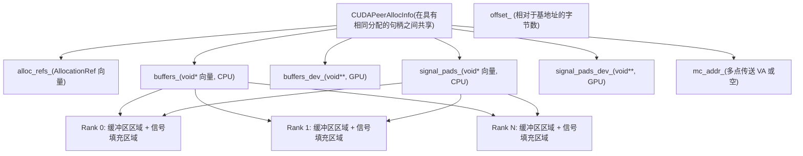

# 对称内存：高性能通信 (Symmetric Memory for High-Performance Communication)

相关源文件 (Relevant source files)

-   [build\_variables.bzl](https://github.com/pytorch/pytorch/blob/915982a4/build_variables.bzl)
-   [caffe2/CMakeLists.txt](https://github.com/pytorch/pytorch/blob/915982a4/caffe2/CMakeLists.txt)
-   [test/distributed/test\_nccl.py](https://github.com/pytorch/pytorch/blob/915982a4/test/distributed/test_nccl.py)
-   [test/distributed/test\_nvshmem.py](https://github.com/pytorch/pytorch/blob/915982a4/test/distributed/test_nvshmem.py)
-   [torch/\_C/\_distributed\_c10d.pyi](https://github.com/pytorch/pytorch/blob/915982a4/torch/_C/_distributed_c10d.pyi)
-   [torch/csrc/distributed/c10d/init.cpp](https://github.com/pytorch/pytorch/blob/915982a4/torch/csrc/distributed/c10d/init.cpp)
-   [torch/csrc/distributed/c10d/symm\_mem/CUDASymmetricMemory.cu](https://github.com/pytorch/pytorch/blob/915982a4/torch/csrc/distributed/c10d/symm_mem/CUDASymmetricMemory.cu)
-   [torch/csrc/distributed/c10d/symm\_mem/CUDASymmetricMemory.hpp](https://github.com/pytorch/pytorch/blob/915982a4/torch/csrc/distributed/c10d/symm_mem/CUDASymmetricMemory.hpp)
-   [torch/csrc/distributed/c10d/symm\_mem/NCCLSymmetricMemory.cu](https://github.com/pytorch/pytorch/blob/915982a4/torch/csrc/distributed/c10d/symm_mem/NCCLSymmetricMemory.cu)
-   [torch/csrc/distributed/c10d/symm\_mem/NCCLSymmetricMemory.hpp](https://github.com/pytorch/pytorch/blob/915982a4/torch/csrc/distributed/c10d/symm_mem/NCCLSymmetricMemory.hpp)
-   [torch/csrc/distributed/c10d/symm\_mem/SymmetricMemory.cpp](https://github.com/pytorch/pytorch/blob/915982a4/torch/csrc/distributed/c10d/symm_mem/SymmetricMemory.cpp)
-   [torch/csrc/distributed/c10d/symm\_mem/SymmetricMemory.hpp](https://github.com/pytorch/pytorch/blob/915982a4/torch/csrc/distributed/c10d/symm_mem/SymmetricMemory.hpp)
-   [torch/csrc/distributed/c10d/symm\_mem/nccl\_extension.cu](https://github.com/pytorch/pytorch/blob/915982a4/torch/csrc/distributed/c10d/symm_mem/nccl_extension.cu)
-   [torch/csrc/distributed/c10d/symm\_mem/nvshmem\_extension.cu](https://github.com/pytorch/pytorch/blob/915982a4/torch/csrc/distributed/c10d/symm_mem/nvshmem_extension.cu)
-   [torch/csrc/distributed/c10d/symm\_mem/nvshmem\_team\_manager.hpp](https://github.com/pytorch/pytorch/blob/915982a4/torch/csrc/distributed/c10d/symm_mem/nvshmem_team_manager.hpp)
-   [torch/distributed/\_symmetric\_memory/\_\_init\_\_.py](https://github.com/pytorch/pytorch/blob/915982a4/torch/distributed/_symmetric_memory/__init__.py)

## 概览 (Overview)

SymmetricMemory (对称内存) 系统在分布式 PyTorch 中支持 rank 之间直接的对等 (peer-to-peer, P2P) 和多点传送 (multicast) GPU 内存访问。每个 rank 分配相同大小的内存区域，这些区域可被进程组中的所有节点直接访问，从而实现了无需中间 CPU 缓冲区或显式消息传递的零拷贝通信。

**关键能力：**

-   **直接 P2P 内存访问**：在 CUDA 内核中对对等 GPU 内存进行加载/存储操作。
-   **多点传送 (Multicast) 支持**：使用 NVLink SHARP（如果可用）进行一到多的通信。
-   **设备侧同步**：可在内核中访问的屏障 (barriers)、信号和原子操作。
-   **自定义通信模式**：作为实现专门集合通信（all-to-all、reduce-scatter 变体）的基石。
-   **MemPool 集成**：与 CUDA 内存池分配器无缝集成，实现零开销分配。

**后端实现：** 系统提供了三个具有自动回退机制的后端实现：

1.  **NVSHMEM**：具有设备侧操作的高性能 PGAS 编程模型（参见 [4.3.2](/pytorch/pytorch/4.3.2-backend-implementations:-nvshmem-nccl-cuda)）。
2.  **NCCL**：使用 NCCL 2.28+ API 的对称内存窗口（参见 [4.3.2](/pytorch/pytorch/4.3.2-backend-implementations:-nvshmem-nccl-cuda)）。
3.  **CUDA**：通过 CUDA 驱动 API 进行的虚拟内存管理（参见 [4.3.2](/pytorch/pytorch/4.3.2-backend-implementations:-nvshmem-nccl-cuda)）。

有关详细架构，请参阅 [对称内存架构 (Symmetric Memory Architecture)](/pytorch/pytorch/4.3.1-symmetric-memory-architecture)。有关构建在对称内存之上的分布式张量抽象，请参阅 [DTensor 系统](/pytorch/pytorch/4.2-dtensor:-distributed-tensor-abstraction)。

## 系统架构 (System Architecture)

SymmetricMemory 系统采用多后端架构，其中一个通用接口 (`SymmetricMemory`) 由后端特定的分配器实现。后端选择在运行时根据环境配置和硬件能力进行。

**图表：SymmetricMemory 类层级结构与后端注册表**

```mermaid
flowchart TD
    empty_fn["empty()"]
    rendezvous_fn["rendezvous()"]
    set_backend_fn["set_backend()"]
    get_backend_fn["get_backend()"]
    get_mempool_fn["get_mempool_allocator()"]
    AllocatorMap["AllocatorMap (单例)register_allocator()register_availability()set_backend()get_allocator()"]
    MemPoolAllocatorMap["MemPoolAllocatorMap (单例)register_mempool_allocator()get_mempool_allocator()"]
    empty_p2p["empty_strided_p2p()"]
    rendezvous_cpp["rendezvous()"]
    SymmMemBase["SymmetricMemoryget_buffer_ptrs()get_signal_pad_ptrs()get_buffer_ptrs_dev()barrier() / put_signal() / wait_signal()"]
    AllocatorBase["SymmetricMemoryAllocatoralloc() / free()rendezvous()has_multicast_support()"]
    CUDAAlloc["CUDASymmetricMemoryAllocator"]
    CUDAMem["CUDASymmetricMemory"]
    CUDAPeerInfo["CUDAPeerAllocInfobuffers_ / signal_pads_buffers_dev_ / signal_pads_dev_"]
    AllocRef["AllocationRef(vaddr + handle 对)"]
    NCCLAlloc["NCCLSymmetricMemoryAllocator"]
    NCCLMem["NCCLSymmetricMemory"]
    NCCLPeerInfo["NCCLPeerAllocInfobuffer_win_ (ncclWindow_t)signal_handle_ (ncclWindow_t)"]
    NVSHMEMAlloc["NVSHMEMSymmetricMemoryAllocator"]
    NVSHMEMMem["NVSHMEMSymmetricMemory"]
    TeamMgr["TeamManagerget_team() / get_n_teams()"]

    empty --> fn_empty_p2p
    rendezvous --> fn_rendezvous_cpp
    set --> backend_fn_AllocatorMap
    get --> backend_fn_AllocatorMap
    get --> mempool_fn_MemPoolAllocatorMap
    empty --> p2p_AllocatorMap
    rendezvous --> cpp_AllocatorMap
    AllocatorMap --> CUDAAlloc
    AllocatorMap --> NCCLAlloc
    AllocatorMap --> NVSHMEMAlloc
    CUDAAlloc --> AllocatorBase
    NCCLAlloc --> AllocatorBase
    NVSHMEMAlloc --> AllocatorBase
    CUDAAlloc --> CUDAMem
    NCCLAlloc --> NCCLMem
    NVSHMEMAlloc --> NVSHMEMMem
    CUDAMem --> SymmMemBase
    NCCLMem --> SymmMemBase
    NVSHMEMMem --> SymmMemBase
    CUDAMem --> CUDAPeerInfo
    CUDAPeerInfo --> AllocRef
    NCCLMem --> NCCLPeerInfo
    NVSHMEMMem --> TeamMgr
```


来源： [torch/csrc/distributed/c10d/symm\_mem/SymmetricMemory.hpp39-116](https://github.com/pytorch/pytorch/blob/915982a4/torch/csrc/distributed/c10d/symm_mem/SymmetricMemory.hpp#L39-L116) [torch/csrc/distributed/c10d/symm\_mem/SymmetricMemory.cpp28-114](https://github.com/pytorch/pytorch/blob/915982a4/torch/csrc/distributed/c10d/symm_mem/SymmetricMemory.cpp#L28-L114) [torch/csrc/distributed/c10d/symm\_mem/CUDASymmetricMemory.hpp13-155](https://github.com/pytorch/pytorch/blob/915982a4/torch/csrc/distributed/c10d/symm_mem/CUDASymmetricMemory.hpp#L13-L155) [torch/csrc/distributed/c10d/symm\_mem/NCCLSymmetricMemory.hpp12-62](https://github.com/pytorch/pytorch/blob/915982a4/torch/csrc/distributed/c10d/symm_mem/NCCLSymmetricMemory.hpp#L12-L62)

### 后端选择 (Backend Selection)

`AllocatorMap` 单例 ([torch/csrc/distributed/c10d/symm\_mem/SymmetricMemory.cpp28-114](https://github.com/pytorch/pytorch/blob/915982a4/torch/csrc/distributed/c10d/symm_mem/SymmetricMemory.cpp#L28-L114)) 维护了一个将设备类型映射到分配器实现的注册表。一个单独的 `avail_map_` 按名称追踪所有已注册的后端，而 `map_` 持有每个设备类型的活跃后端。`set_backend()` 函数检查 `avail_map_` 并将选择移动到 `map_` 中，一旦分配器被使用（`in_use_` 标志位），就会拒绝更改。

在 Python 中，`torch/distributed/_symmetric_memory/__init__.py` 中的 `set_backend()` 和 `get_backend()` 直接委派给 C++ 的 `AllocatorMap`。`nvshmem_extension.cu` 中的 `is_nvshmem_available()` 检查在运行时探测 `libnvshmem_host.so.3`。

**后端对比：**

| 后端 | 关键库 | NCCL 最低版本 | P2P 访问 | 多点传送 | 设备侧操作 | 范围 |
| --- | --- | --- | --- | --- | --- | --- |
| `CUDA` | CUDA 驱动 API | — | 是 | 否 | 通过自定义内核 | 节点内 |
| `NCCL` | NCCL | 2.28+ (`ncclCommWindowRegister`) | 是 | 2.29+ (`ncclGetLsaMultimemDevicePointer`) | 有限 | 任意 |
| `NVSHMEM` | NVSHMEM 3.x | — | 是 | 是 (NVLink SHARP) | 完整 NVSHMEM API | 任意 |

有关详细的后端实现，请参阅第 4.3.2 页。

来源： [torch/csrc/distributed/c10d/symm\_mem/SymmetricMemory.cpp28-114](https://github.com/pytorch/pytorch/blob/915982a4/torch/csrc/distributed/c10d/symm_mem/SymmetricMemory.cpp#L28-L114) [torch/distributed/\_symmetric\_memory/\_\_init\_\_.py1-55](https://github.com/pytorch/pytorch/blob/915982a4/torch/distributed/_symmetric_memory/__init__.py#L1-L55) [torch/csrc/distributed/c10d/symm\_mem/nvshmem\_extension.cu44-69](https://github.com/pytorch/pytorch/blob/915982a4/torch/csrc/distributed/c10d/symm_mem/nvshmem_extension.cu#L44-L69)

## 核心概念 (Core Concepts)

### 分配与汇合 (Allocation and Rendezvous)

对称内存的生命周期由两个阶段组成：

1.  **分配 (Allocation)**：每个 rank 调用 `symm_mem.empty()` (Python) → `empty_strided_p2p()` (C++) → `allocator->alloc()`，在每个参与的设备上创建相同大小的内存。
2.  **汇合 (Rendezvous)**：每个 rank 调用 `symm_mem.rendezvous(tensor, group)` → `allocator->rendezvous()`，该调用通过 `c10d::Store` 交换内存句柄，并构建一个包含所有对等节点缓冲区指针的 `CUDAPeerAllocInfo` / `NCCLPeerAllocInfo`。

**图表：对称内存分配与汇合流程**

> **[Mermaid sequence]**
> *(图表结构无法解析)*

还支持通过 `empty_strided_p2p_persistent()` ([torch/csrc/distributed/c10d/symm\_mem/SymmetricMemory.cpp123-176](https://github.com/pytorch/pytorch/blob/915982a4/torch/csrc/distributed/c10d/symm_mem/SymmetricMemory.cpp#L123-L176)) 进行持久化分配，该方法使用 `alloc_id` 在多次调用之间复用相同的物理分配。这对于分配大小固定的迭代训练循环非常有用。

有关各后端的详细汇合协议，请参阅第 4.3.1 页。

来源： [torch/csrc/distributed/c10d/symm\_mem/SymmetricMemory.cpp246-283](https://github.com/pytorch/pytorch/blob/915982a4/torch/csrc/distributed/c10d/symm_mem/SymmetricMemory.cpp#L246-L283) [torch/distributed/\_symmetric\_memory/\_\_init\_\_.py96-135](https://github.com/pytorch/pytorch/blob/915982a4/torch/distributed/_symmetric_memory/__init__.py#L96-L135) [torch/csrc/distributed/c10d/symm\_mem/CUDASymmetricMemory.cu29-103](https://github.com/pytorch/pytorch/blob/915982a4/torch/csrc/distributed/c10d/symm_mem/CUDASymmetricMemory.cu#L29-L103)

### SymmetricMemory 句柄 (The SymmetricMemory Handle)

在汇合之后，每个 rank 都会收到一个 `_SymmetricMemory` 对象（`CUDASymmetricMemory` 或 `NCCLSymmetricMemory`）。两者都暴露了 `SymmetricMemory.hpp` 中定义的相同抽象接口。

**`_SymmetricMemory` 上的可用方法：**

| 方法 | 描述 |
| --- | --- |
| `get_buffer(rank, sizes, dtype, storage_offset)` | 返回 `rank` 缓冲区区域的张量视图 |
| `get_remote_tensor(peer, sizes, dtype)` | 类似于 `get_buffer`，但使用句柄自身的偏移量 |
| `get_buffer_ptrs()` | 所有对等节点缓冲区地址的 CPU 侧 `vector<void*>` |
| `get_signal_pad_ptrs()` | 所有对等节点信号填充区地址的 CPU 侧 `vector<void*>` |
| `get_buffer_ptrs_dev()` | 用于内核的 GPU 侧 `void**` 数组（设备内存） |
| `get_signal_pad_ptrs_dev()` | 用于内核的 GPU 侧信号填充区 `void**` 数组 |
| `barrier(channel, timeout_ms)` | 给定通道上的设备侧全 rank 屏障 |
| `put_signal(dst_rank, channel, timeout_ms)` | 将信号令牌写入 `dst_rank` 的信号填充槽 |
| `wait_signal(src_rank, channel, timeout_ms)` | 自旋等待直到收到来自 `src_rank` 的信号 |
| `get_multicast_ptr()` | 返回多点传送虚拟地址（如果 `has_multicast_support()` 为真） |
| `get_rank()`, `get_world_size()`, `get_buffer_size()`, `get_offset()` | 元数据访问器 |

**图表：SymmetricMemory 句柄内存布局**


来源： [torch/csrc/distributed/c10d/symm\_mem/SymmetricMemory.hpp39-97](https://github.com/pytorch/pytorch/blob/915982a4/torch/csrc/distributed/c10d/symm_mem/SymmetricMemory.hpp#L39-L97) [torch/csrc/distributed/c10d/symm\_mem/CUDASymmetricMemory.hpp13-103](https://github.com/pytorch/pytorch/blob/915982a4/torch/csrc/distributed/c10d/symm_mem/CUDASymmetricMemory.hpp#L13-L103) [torch/\_C/\_distributed\_c10d.pyi265-329](https://github.com/pytorch/pytorch/blob/915982a4/torch/_C/_distributed_c10d.pyi#L265-L329)

### P2P 内存访问 (P2P Memory Access)

对称内存使得无需任何 CPU 参与即可直接对对等 GPU 内存进行加载/存储操作。

**主机侧访问**可通过 `get_buffer(rank, sizes, dtype, storage_offset)` 和 `get_remote_tensor(peer, sizes, dtype)` ([torch/csrc/distributed/c10d/symm\_mem/SymmetricMemory.cpp398-413](https://github.com/pytorch/pytorch/blob/915982a4/torch/csrc/distributed/c10d/symm_mem/SymmetricMemory.cpp#L398-L413)) 实现。两者都返回一个使用 `at::for_blob` 包装了对等节点内存的 `at::Tensor`，因此可以使用标准的 ATen 操作来读写对等节点内存。

**设备侧访问**在自定义 CUDA 内核中可用，通过传递 `get_buffer_ptrs_dev()` 或 `get_signal_pad_ptrs_dev()`（两者都返回位于设备内存中的 `void**`）实现。在内核中，通过 `peer` rank 进行索引可以获得该对等节点缓冲区或信号填充区域的基指针。这使得能够在运行中的内核中实现零拷贝的直接读写。

Python 的 `torch.ops.symm_mem.get_remote_tensors(tensor, group_name)` 操作会一次性返回所有对等节点的张量视图列表 ([test/distributed/test\_nvshmem.py229-241](https://github.com/pytorch/pytorch/blob/915982a4/test/distributed/test_nvshmem.py#L229-L241))。

来源： [torch/csrc/distributed/c10d/symm\_mem/SymmetricMemory.cpp360-413](https://github.com/pytorch/pytorch/blob/915982a4/torch/csrc/distributed/c10d/symm_mem/SymmetricMemory.cpp#L360-L413) [torch/csrc/distributed/c10d/symm\_mem/SymmetricMemory.hpp43-53](https://github.com/pytorch/pytorch/blob/915982a4/torch/csrc/distributed/c10d/symm_mem/SymmetricMemory.hpp#L43-L53) [torch/\_C/\_distributed\_c10d.pyi280-310](https://github.com/pytorch/pytorch/blob/915982a4/torch/_C/_distributed_c10d.pyi#L280-L310)

### 同步原语 (Synchronization Primitives)

信号填充区 (Signal pads) 是与每个 rank 的数据缓冲区一起分配的、可 P2P 访问的内存区域，专门用于同步。`SymmetricMemory` 接口暴露了三个由设备执行的原语：

-   **`barrier(channel, timeout_ms)`**：由 `CUDASymmetricMemory.cu` 中的 `barrier_kernel` 实现 ([torch/csrc/distributed/c10d/symm\_mem/CUDASymmetricMemory.cu173-224](https://github.com/pytorch/pytorch/blob/915982a4/torch/csrc/distributed/c10d/symm_mem/CUDASymmetricMemory.cu#L173-L224))。每个 rank 向所有其他 rank 的信号填充区发送一个信号，并等待所有传入的信号。内核启动时带有 `world_size` 个线程。
-   **`put_signal(dst_rank, channel, timeout_ms)`**：向 `dst_rank` 的信号填充区插槽发送一个信号令牌。由 `put_signal_kernel` 实现。
-   **`wait_signal(src_rank, channel, timeout_ms)`**：自旋直到来自 `src_rank` 的信号出现。由 `wait_signal_kernel` 实现。两个内核都使用了具有内存排序语义的 `try_put_signal` / `try_wait_signal` 辅助函数。

**同步通道 (Synchronization channels)** 允许在不同的 CUDA 流中，在同一个 `SymmetricMemory` 句柄上进行多个互相独立的同步，而不会产生干扰。针对 rank `r` 的信号填充区布局为一个 2D 数组，通过 `[world_size * channel + sender_rank]` 进行索引。每个通道对应信号填充区域的一个不重叠切片。

总的信号填充区大小由 `get_signal_pad_size()` / `set_signal_pad_size()` ([torch/csrc/distributed/c10d/symm\_mem/SymmetricMemory.cpp207-214](https://github.com/pytorch/pytorch/blob/915982a4/torch/csrc/distributed/c10d/symm_mem/SymmetricMemory.cpp#L207-L214)) 控制。默认值为 `default_signal_pad_size`；这必须在第一次分配之前进行配置。

来源： [torch/csrc/distributed/c10d/symm\_mem/CUDASymmetricMemory.cu155-305](https://github.com/pytorch/pytorch/blob/915982a4/torch/csrc/distributed/c10d/symm_mem/CUDASymmetricMemory.cu#L155-L305) [torch/csrc/distributed/c10d/symm\_mem/SymmetricMemory.hpp23-38](https://github.com/pytorch/pytorch/blob/915982a4/torch/csrc/distributed/c10d/symm_mem/SymmetricMemory.hpp#L23-L38) [torch/csrc/distributed/c10d/symm\_mem/SymmetricMemory.cpp207-214](https://github.com/pytorch/pytorch/blob/915982a4/torch/csrc/distributed/c10d/symm_mem/SymmetricMemory.cpp#L207-L214)

## 通信操作 (Communication Operations)

### 集合通信操作 (Collective Operations)

对称内存通过直接的对等节点缓冲区访问，实现了高效的集合通信。操作被注册为 `torch.ops.symm_mem.*` 自定义算子。

**可用的集合通信算子：**

| 算子 | 后端 | 描述 |
| --- | --- | --- |
| `torch.ops.symm_mem.nvshmem_broadcast` | NVSHMEM | 通过 `nvshmemx_broadcastmem_on_stream` 进行设备侧广播 |
| `torch.ops.symm_mem.nvshmem_all_to_all` | NVSHMEM | 通过 NVSHMEM team 操作进行固定大小的全对全交换 |
| `torch.ops.symm_mem.all_to_all_vdev` | NVSHMEM | 用于专家并行 (MoE) 的可变大小全对全交换 |
| `torch.ops.symm_mem.all_to_all_vdev_2d` | NVSHMEM | 具有专家主序布局和对齐要求的 2D 可变全对全交换 |
| `torch.ops.symm_mem.get_remote_tensors` | 全部 | 返回所有对等节点缓冲区的张量视图列表 |
| `torch.ops.symm_mem.nvshmem_put` | NVSHMEM | 通过 `nvshmemx_putmem_on_stream` 进行单边写入 (put) |
| `torch.ops.symm_mem.nvshmem_get` | NVSHMEM | 通过 `nvshmemx_getmem_on_stream` 进行单边读取 (get) |
| `torch.ops.symm_mem.nvshmem_put_with_signal` | NVSHMEM | 写入 (put) + 原子信号通知 |
| `torch.ops.symm_mem.nvshmem_wait_for_signal` | NVSHMEM | 通过 `nvshmemx_signal_wait_until_on_stream` 在信号填充区上自旋等待 |

所有的 NVSHMEM 算子在内部都会调用 `rendezvous()` 以获取句柄，然后分发到 `nvshmemx_*_on_stream` 设备 API。`all_to_all_vdev_2d` 变体处理专家并行的全对全交换，其中输入/输出切片是按 `[expert, rank]` 顺序排列的 2D 张量，并支持为了 CUTLASS 兼容性而设置的对齐参数。

有关各后端集合通信的详细实现，请参阅第 4.3.2 页。

来源： [torch/csrc/distributed/c10d/symm\_mem/nvshmem\_extension.cu80-172](https://github.com/pytorch/pytorch/blob/915982a4/torch/csrc/distributed/c10d/symm_mem/nvshmem_extension.cu#L80-L172) [torch/csrc/distributed/c10d/symm\_mem/nvshmem\_extension.cu201-377](https://github.com/pytorch/pytorch/blob/915982a4/torch/csrc/distributed/c10d/symm_mem/nvshmem_extension.cu#L201-L377) [test/distributed/test\_nvshmem.py302-509](https://github.com/pytorch/pytorch/blob/915982a4/test/distributed/test_nvshmem.py#L302-L509)

### 多点传送支持 (Multicast Support)

在具有 NVLink SHARP 的硬件上，对称内存在常规 P2P 缓冲区之外还提供一个多点传送虚拟地址。对该多点传送地址的写入会被同时交付给所有对等节点。

`has_multicast_support()` 方法检查在汇合期间是否成功建立了多点传送 VA。`get_multicast_ptr()` 返回根据句柄的 `offset_` 字段调整后的指针。

多点传送在各个后端均可用：

-   **CUDA 后端**：使用来自 CUDA 驱动 API（CUDART 12.3+, `CUDART_SUPPORTS_MULTICAST`）的 `cuMulticastCreate` / `cuMulticastAddDevice`。多点传送句柄 `mc_handle_` 存储在 `CUDAPeerAllocInfo` 中 ([torch/csrc/distributed/c10d/symm\_mem/CUDASymmetricMemory.cu73-103](https://github.com/pytorch/pytorch/blob/915982a4/torch/csrc/distributed/c10d/symm_mem/CUDASymmetricMemory.cu#L73-L103))。
-   **NCCL 后端**：使用 `ncclGetLsaMultimemDevicePointer` (NCCL 2.29+) 来获取 `mc_addr_` ([torch/csrc/distributed/c10d/symm\_mem/NCCLSymmetricMemory.cu145-150](https://github.com/pytorch/pytorch/blob/915982a4/torch/csrc/distributed/c10d/symm_mem/NCCLSymmetricMemory.cu#L145-L150))。
-   **NVSHMEM 后端**：使用 NVSHMEM 的 NVLink SHARP 支持。可以使用 `_SymmetricMemory.has_multicast_support(DeviceType.CUDA, device_idx)` 来查询可用性 ([test/distributed/test\_nvshmem.py35-47](https://github.com/pytorch/pytorch/blob/915982a4/test/distributed/test_nvshmem.py#L35-L47))。

Python `_SymmetricMemory` 句柄上的 `multicast_ptr` 属性在不可用时返回 0，在支持 NVLS 时返回一个非零的整数指针。

来源： [torch/csrc/distributed/c10d/symm\_mem/SymmetricMemory.hpp56-57](https://github.com/pytorch/pytorch/blob/915982a4/torch/csrc/distributed/c10d/symm_mem/SymmetricMemory.hpp#L56-L57) [torch/csrc/distributed/c10d/symm\_mem/CUDASymmetricMemory.cu17-25](https://github.com/pytorch/pytorch/blob/915982a4/torch/csrc/distributed/c10d/symm_mem/CUDASymmetricMemory.cu#L17-L25) [torch/csrc/distributed/c10d/symm\_mem/NCCLSymmetricMemory.cu144-151](https://github.com/pytorch/pytorch/blob/915982a4/torch/csrc/distributed/c10d/symm_mem/NCCLSymmetricMemory.cu#L144-L151)

### MemPool 集成 (MemPool Integration)

对称内存与 CUDA 的 `MemPool` 分配器集成，使得由标准工厂操作（`torch.randn`、`torch.mm` 等）创建的张量可以驻留在对称内存中，而无需显式调用 `symm_mem.empty()`。

`MemPoolAllocatorMap` 单例 ([torch/csrc/distributed/c10d/symm\_mem/SymmetricMemory.cpp301-334](https://github.com/pytorch/pytorch/blob/915982a4/torch/csrc/distributed/c10d/symm_mem/SymmetricMemory.cpp#L301-L334)) 维护了一个单独的注册表，将设备类型映射到供 MemPool 使用的 `c10::Allocator` 实现。Python 函数 `get_mempool_allocator(device)` 获取该分配器，然后可以使用 `torch.cuda.MemPool` 对其进行包装，并通过 `torch.cuda.use_mem_pool(mempool)` 激活。

在 `use_mem_pool` 上下文中，所有 CUDA 分配都来自对称分配器。由于 CUDA 缓存分配器会路由通过该池，计算算子的输出（例如 `torch.mm`）也是对称的。随后的 `rendezvous()` 调用会识别分配的来源并将其映射到各个节点。

`test/distributed/test_nvshmem.py` 中的测试涵盖了：

-   `test_mempool_tensor_factory`：MemPool 上下文内部的张量工厂操作 ([test/distributed/test\_nvshmem.py107-129](https://github.com/pytorch/pytorch/blob/915982a4/test/distributed/test_nvshmem.py#L107-L129))。
-   `test_mempool_compute_ops`：MemPool 上下文内部的计算算子输出 ([test/distributed/test\_nvshmem.py154-177](https://github.com/pytorch/pytorch/blob/915982a4/test/distributed/test_nvshmem.py#L154-L177))。
-   `test_mempool_tensor_w_collective`：在 MemPool 分配的张量上进行标准的 `dist.all_reduce` ([test/distributed/test\_nvshmem.py131-152](https://github.com/pytorch/pytorch/blob/915982a4/test/distributed/test_nvshmem.py#L131-L152))。

来源： [torch/csrc/distributed/c10d/symm\_mem/SymmetricMemory.cpp291-348](https://github.com/pytorch/pytorch/blob/915982a4/torch/csrc/distributed/c10d/symm_mem/SymmetricMemory.cpp#L291-L348) [test/distributed/test\_nvshmem.py107-177](https://github.com/pytorch/pytorch/blob/915982a4/test/distributed/test_nvshmem.py#L107-L177)

## Python API

公开的 Python 接口位于 `torch/distributed/_symmetric_memory/__init__.py`。该模块从 `torch._C._distributed_c10d` 导入 `_SymmetricMemory`（在 `torch/csrc/distributed/c10d/init.cpp` 中从 C++ 绑定）。

### 关键函数 (Key Functions)

| 函数 | 描述 |
| --- | --- |
| `set_backend(name)` | 在第一次使用前设置活跃后端（`"CUDA"`, `"NCCL"`, `"NVSHMEM"`） |
| `get_backend(device)` | 查询设备当前活跃的后端 |
| `is_nvshmem_available()` | 运行时检查 NVSHMEM 库的可用性 |
| `empty(size, dtype, device, alloc_id=None)` | 分配对称张量；`alloc_id` 支持持久化复用 |
| `rendezvous(tensor, group)` | 建立节点映射并返回 `_SymmetricMemory` 句柄 |
| `get_mempool_allocator(device)` | 获取与 `torch.cuda.MemPool` 兼容的 `c10::Allocator` |
| `get_symm_mem_workspace(group_name, min_size)` | 获取或延迟增长一个共享的工作空间张量及其句柄 |
| `is_symm_mem_enabled_for_group(group_name)` | 检查一个组是否有活跃的对称内存存储关联 |

`enable_symm_mem_for_group()` 函数仍然存在，但**已弃用** —— 组注册现在会自动发生 ([torch/distributed/\_symmetric\_memory/\_\_init\_\_.py25-53](https://github.com/pytorch/pytorch/blob/915982a4/torch/distributed/_symmetric_memory/__init__.py#L25-L53))。

### 流水线化通信辅助函数 (Pipelined Communication Helpers)

该模块还提供了由 DTensor 及其他分布式训练组件在内部使用的高层流水线化通信原语：

-   **`_pipelined_all_gather_and_consume(shard, shard_consumer, ag_out, group_name)`**：执行带有微流水线化计算/通信重叠的 all-gather。内部使用 `get_symm_mem_workspace()` 并在两个 CUDA 流之间交替 ([torch/distributed/\_symmetric\_memory/\_\_init\_\_.py296-322](https://github.com/pytorch/pytorch/blob/915982a4/torch/distributed/_symmetric_memory/__init__.py#L296-L322))。
-   **`_pipelined_multi_all_gather_and_consume`**：上述函数的各张量变体 ([torch/distributed/\_symmetric\_memory/\_\_init\_\_.py146-293](https://github.com/pytorch/pytorch/blob/915982a4/torch/distributed/_symmetric_memory/__init__.py#L146-L293))。
-   **`_pipelined_produce_and_all2all(chunk_producer, output, group_name)`**：流水线化的全对全交换，其中 `chunk_producer` 可调用对象为每个目标 rank 填充数据切片，同时并行进行先前切片的 P2P 拷贝 ([torch/distributed/\_symmetric\_memory/\_\_init\_\_.py325-450](https://github.com/pytorch/pytorch/blob/915982a4/torch/distributed/_symmetric_memory/__init__.py#L325-L450))。

这些辅助函数使用带有通道隔离的 `symm_mem.barrier(channel=...)` 以避免流干扰。

来源： [torch/distributed/\_symmetric\_memory/\_\_init\_\_.py1-700](https://github.com/pytorch/pytorch/blob/915982a4/torch/distributed/_symmetric_memory/__init__.py#L1-L700) [torch/csrc/distributed/c10d/init.cpp51-56](https://github.com/pytorch/pytorch/blob/915982a4/torch/csrc/distributed/c10d/init.cpp#L51-L56) [torch/\_C/\_distributed\_c10d.pyi265-329](https://github.com/pytorch/pytorch/blob/915982a4/torch/_C/_distributed_c10d.pyi#L265-L329)

## 自定义内核集成 (Custom Kernel Integration)

### Triton 内核支持 (NVSHMEM) (Triton Kernel Support (NVSHMEM))

`torch/distributed/_symmetric_memory/_nvshmem_triton.py` 模块为 NVSHMEM 设备 API 提供了 Triton 语言绑定。它暴露了如 `put`, `get`, `barrier_all`, `fence`, `quiet` 以及 team 集合通信操作（`broadcast` 等），这些都可以在 Triton JIT 内核中调用。它在内部调用 `nvshmemx_cumodule_init` ([torch/csrc/distributed/c10d/symm\_mem/nvshmem\_extension.cu72-78](https://github.com/pytorch/pytorch/blob/915982a4/torch/csrc/distributed/c10d/symm_mem/nvshmem_extension.cu#L72-L78)) 以在编译后的 Triton `CUmodule` 中初始化 NVSHMEM 设备状态。

测试覆盖见 `test/distributed/test_nvshmem_triton.py`。

### 直接 CUDA 内核访问 (Direct CUDA Kernel Access)

对于自定义 CUDA/CUTLASS 内核，`get_buffer_ptrs_dev()` 和 `get_signal_pad_ptrs_dev()` 均返回一个位于设备内存中的 `void**` ([torch/csrc/distributed/c10d/symm\_mem/SymmetricMemory.hpp48-53](https://github.com/pytorch/pytorch/blob/915982a4/torch/csrc/distributed/c10d/symm_mem/SymmetricMemory.hpp#L48-L53))。内核可以通过对等节点 rank 对这些数组进行索引，从而获得指向每个 rank 缓冲区或信号填充区域的直接读/写指针。这与 `CUDASymmetricMemory.cu` 中的 `barrier_kernel`、`put_signal_kernel` 和 `wait_signal_kernel` 内部使用的机制相同。

`nccl_extension.cu` 中的 `lsa_put_kernel` 和 `lsa_put_signal_kernel` ([torch/csrc/distributed/c10d/symm\_mem/nccl\_extension.cu87-165](https://github.com/pytorch/pytorch/blob/915982a4/torch/csrc/distributed/c10d/symm_mem/nccl_extension.cu#L87-L165)) 展示了内核侧直接 P2P 写入的具体示例：它们通过索引 `buffer[dst_peer]` 获取远程指针，并使用 16 字节向量化存储 (`ld_vec<16>` / `st_vec<16>`) 来提高效率。

来源： [torch/csrc/distributed/c10d/symm\_mem/SymmetricMemory.hpp48-53](https://github.com/pytorch/pytorch/blob/915982a4/torch/csrc/distributed/c10d/symm_mem/SymmetricMemory.hpp#L48-L53) [torch/csrc/distributed/c10d/symm\_mem/nvshmem\_extension.cu72-78](https://github.com/pytorch/pytorch/blob/915982a4/torch/csrc/distributed/c10d/symm_mem/nvshmem_extension.cu#L72-L78) [torch/csrc/distributed/c10d/symm\_mem/nccl\_extension.cu87-165](https://github.com/pytorch/pytorch/blob/915982a4/torch/csrc/distributed/c10d/symm_mem/nccl_extension.cu#L87-L165)

## 构建与测试 (Build and Testing)

### CMake 集成

对称内存源代码根据构建配置进行条件编译。当设置了 `USE_DISTRIBUTED` 时，基础 C++ 抽象类 (`SymmetricMemory.cpp`, `DMAConnectivity.cpp`) 始终包含在内。特定于 CUDA 的后端需要 `USE_CUDA`，并列在 `caffe2/CMakeLists.txt` 的 `libtorch_cuda_distributed_extra_sources` 中。

每个后端涉及的源文件：

| 后端 | 源文件 | 条件 |
| --- | --- | --- |
| 核心抽象 | `symm_mem/SymmetricMemory.cpp`, `symm_mem/DMAConnectivity.cpp` | `USE_DISTRIBUTED` |
| CUDA | `symm_mem/CUDASymmetricMemory.cu`, `symm_mem/CUDASymmetricMemoryOps.cu`, `symm_mem/CUDASymmetricMemoryUtils.cpp`, `symm_mem/CudaDMAConnectivity.cpp` | `USE_CUDA` |
| NCCL | `symm_mem/NCCLSymmetricMemory.cu`, `symm_mem/nccl_extension.cu`, `symm_mem/cuda_mem_pool.cpp` | `USE_CUDA` + NCCL |
| NVSHMEM | `symm_mem/nvshmem_extension.cu` | `USE_NVSHMEM` |

`symm_mem/` 下的所有 CUDA 源文件都使用 `-DPYTORCH_C10_DRIVER_API_SUPPORTED=1` 进行编译 ([caffe2/CMakeLists.txt587-599](https://github.com/pytorch/pytorch/blob/915982a4/caffe2/CMakeLists.txt#L587-L599))。

来源： [caffe2/CMakeLists.txt583-599](https://github.com/pytorch/pytorch/blob/915982a4/caffe2/CMakeLists.txt#L583-L599) [build\_variables.bzl536-538](https://github.com/pytorch/pytorch/blob/915982a4/build_variables.bzl#L536-L538)

## 测试基础设施 (Testing Infrastructure)

### 测试组织 (Test Organization)

测试套件涵盖了后端特定的功能以及跨后端场景：

| 测试文件 | 目的 |
| --- | --- |
| `test/distributed/test_nvshmem.py` | NVSHMEM 后端测试：分配、集合通信、MemPool |
| `test/distributed/test_nvshmem_triton.py` | Triton 内核集成测试 |
| `test/distributed/test_nccl.py` | NCCL 后端测试，包括对称内存 |
| `test/distributed/test_ce_colls.py` | 拷贝引擎 (Copy Engine) 集合通信 (NCCL 2.28+) |

**来源：** [test/distributed/test\_nvshmem.py1-900](https://github.com/pytorch/pytorch/blob/915982a4/test/distributed/test_nvshmem.py#L1-L900) [test/distributed/test\_nvshmem\_triton.py1-800](https://github.com/pytorch/pytorch/blob/915982a4/test/distributed/test_nvshmem_triton.py#L1-L800) [test/distributed/test\_nccl.py1-500](https://github.com/pytorch/pytorch/blob/915982a4/test/distributed/test_nccl.py#L1-L500)

### 测试模式 (Test Patterns)

**多进程测试框架：**

```python
from torch.testing._internal.common_distributed import MultiProcContinuousTest

class NVSHMEMSymmetricMemoryTest(MultiProcContinuousTest):    
    def _init_device(self):        
        device_module.set_device(self.device)        
        symm_mem.set_backend("NVSHMEM")        
        
    def test_alloc(self):        
        tensor = symm_mem.empty(1024, device=self.device)        
        handle = symm_mem.rendezvous(tensor, group_name)
```
**集合通信测试模式：**

```python
def test_broadcast(self):    
    tensor = symm_mem.empty(numel, device=self.device)    
    if self.rank == 0:        
        tensor.fill_(42)        
    torch.ops.symm_mem.nvshmem_broadcast(tensor, root=0, group_name)        
    # 现在所有 rank 的值都应该是 42    
    self.assertEqual(tensor, torch.full_like(tensor, 42))
```
**来源：** [test/distributed/test\_nvshmem.py65-300](https://github.com/pytorch/pytorch/blob/915982a4/test/distributed/test_nvshmem.py#L65-L300) [test/distributed/test\_nvshmem\_triton.py278-800](https://github.com/pytorch/pytorch/blob/915982a4/test/distributed/test_nvshmem_triton.py#L278-L800)
