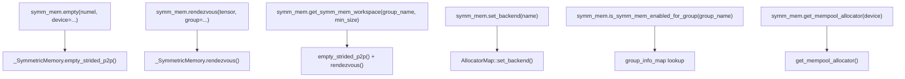

# 对称内存架构 (Symmetric Memory Architecture)

相关源文件 (Relevant source files)

-   [build\_variables.bzl](https://github.com/pytorch/pytorch/blob/915982a4/build_variables.bzl)
-   [caffe2/CMakeLists.txt](https://github.com/pytorch/pytorch/blob/915982a4/caffe2/CMakeLists.txt)
-   [test/distributed/test\_nccl.py](https://github.com/pytorch/pytorch/blob/915982a4/test/distributed/test_nccl.py)
-   [test/distributed/test\_nvshmem.py](https://github.com/pytorch/pytorch/blob/915982a4/test/distributed/test_nvshmem.py)
-   [torch/\_C/\_distributed\_c10d.pyi](https://github.com/pytorch/pytorch/blob/915982a4/torch/_C/_distributed_c10d.pyi)
-   [torch/csrc/distributed/c10d/init.cpp](https://github.com/pytorch/pytorch/blob/915982a4/torch/csrc/distributed/c10d/init.cpp)
-   [torch/csrc/distributed/c10d/symm\_mem/CUDASymmetricMemory.cu](https://github.com/pytorch/pytorch/blob/915982a4/torch/csrc/distributed/c10d/symm_mem/CUDASymmetricMemory.cu)
-   [torch/csrc/distributed/c10d/symm\_mem/CUDASymmetricMemory.hpp](https://github.com/pytorch/pytorch/blob/915982a4/torch/csrc/distributed/c10d/symm_mem/CUDASymmetricMemory.hpp)
-   [torch/csrc/distributed/c10d/symm\_mem/NCCLSymmetricMemory.cu](https://github.com/pytorch/pytorch/blob/915982a4/torch/csrc/distributed/c10d/symm_mem/NCCLSymmetricMemory.cu)
-   [torch/csrc/distributed/c10d/symm\_mem/NCCLSymmetricMemory.hpp](https://github.com/pytorch/pytorch/blob/915982a4/torch/csrc/distributed/c10d/symm_mem/NCCLSymmetricMemory.hpp)
-   [torch/csrc/distributed/c10d/symm\_mem/SymmetricMemory.cpp](https://github.com/pytorch/pytorch/blob/915982a4/torch/csrc/distributed/c10d/symm_mem/SymmetricMemory.cpp)
-   [torch/csrc/distributed/c10d/symm\_mem/SymmetricMemory.hpp](https://github.com/pytorch/pytorch/blob/915982a4/torch/csrc/distributed/c10d/symm_mem/SymmetricMemory.hpp)
-   [torch/csrc/distributed/c10d/symm\_mem/nccl\_extension.cu](https://github.com/pytorch/pytorch/blob/915982a4/torch/csrc/distributed/c10d/symm_mem/nccl_extension.cu)
-   [torch/csrc/distributed/c10d/symm\_mem/nvshmem\_extension.cu](https://github.com/pytorch/pytorch/blob/915982a4/torch/csrc/distributed/c10d/symm_mem/nvshmem_extension.cu)
-   [torch/csrc/distributed/c10d/symm\_mem/nvshmem\_team\_manager.hpp](https://github.com/pytorch/pytorch/blob/915982a4/torch/csrc/distributed/c10d/symm_mem/nvshmem_team_manager.hpp)
-   [torch/distributed/\_symmetric\_memory/\_\_init\_\_.py](https://github.com/pytorch/pytorch/blob/915982a4/torch/distributed/_symmetric_memory/__init__.py)

## 目的与范围 (Purpose and Scope)

本页描述了 PyTorch 中的对称内存 (symmetric memory) 子系统，该子系统为分布式训练提供了高带宽、低延迟的 GPU 到 GPU 内存访问，用于集合通信。内容涵盖了 C++ 抽象接口 (`SymmetricMemory`, `SymmetricMemoryAllocator`)、建立跨设备访问的汇合 (rendezvous) 协议，以及 `torch.distributed._symmetric_memory` 中的 Python API。

有关具体后端实现（CUDA IPC, NCCL windows, NVSHMEM）的详情，请参阅 [4.3.2](/pytorch/pytorch/4.3.2-backend-implementations:-nvshmem-nccl-cuda)。有关使用标准 `ProcessGroup` 的通用 c10d 集合通信，请参阅 [4.1](/pytorch/pytorch/4.1-c10d-collective-communication)。

---

## 什么是对称内存？ (What Is Symmetric Memory?)

在标准的分布式训练中，GPU 通过通信库介导的集合操作（all-reduce, all-gather 等）进行通信。对称内存采用了不同的方法：组中的每个 GPU 都分配一个大小相同的缓冲区，然后建立对每个对等节点 (peer) 缓冲区的直接读/写访问。在进行了一次性的**汇合 (rendezvous)** 步骤后，每个 rank 都持有一个可按对等节点 rank 索引的主机侧和设备侧指针数组。

这使得以下功能成为可能：

-   **加载/存储 (Load/store) 通信**：内核可以直接从远程 GPU 内存读取或向其写入，而无需显式的消息传递。
-   **自定义同步**：信号填充区 (signal pads) 允许在 CUDA 内核中进行细粒度的、基于通道的 GPU 间信号通知。
-   **融合计算与通信**：Python 中的流水线化原语将数据生产与传输进行重叠。

---

## 核心 C++ 抽象 (Core C++ Abstractions)

这些抽象位于 `c10d::symmetric_memory` 命名空间中。

**架构：核心类层级结构**

来源： [torch/csrc/distributed/c10d/symm\_mem/SymmetricMemory.hpp39-116](https://github.com/pytorch/pytorch/blob/915982a4/torch/csrc/distributed/c10d/symm_mem/SymmetricMemory.hpp#L39-L116) [torch/csrc/distributed/c10d/symm\_mem/CUDASymmetricMemory.hpp33-69](https://github.com/pytorch/pytorch/blob/915982a4/torch/csrc/distributed/c10d/symm_mem/CUDASymmetricMemory.hpp#L33-L69) [torch/csrc/distributed/c10d/symm\_mem/NCCLSymmetricMemory.hpp12-58](https://github.com/pytorch/pytorch/blob/915982a4/torch/csrc/distributed/c10d/symm_mem/NCCLSymmetricMemory.hpp#L12-L58)

### `SymmetricMemory`

定义于 [torch/csrc/distributed/c10d/symm\_mem/SymmetricMemory.hpp39-97](https://github.com/pytorch/pytorch/blob/915982a4/torch/csrc/distributed/c10d/symm_mem/SymmetricMemory.hpp#L39-L97)

`SymmetricMemory` 是一个继承自 `torch::CustomClassHolder` 的抽象基类（被注册为位于 `__torch__.torch.classes.c10d.SymmetricMemory` 的 TorchBind 自定义类）。实例仅由后端的 `rendezvous()` 调用产生，永远不会直接构造。

| 方法组 | 方法 | 目的 |
| --- | --- | --- |
| 缓冲区指针 | `get_buffer_ptrs()`, `get_buffer_ptrs_dev()` | 逐 rank 缓冲区地址的主机侧和设备侧数组 |
| 信号填充区指针 | `get_signal_pad_ptrs()`, `get_signal_pad_ptrs_dev()` | 逐 rank 信号填充区地址的主机侧和设备侧数组 |
| 张量视图 | `get_buffer()`, `get_signal_pad()`, `get_remote_tensor()` | 为本地或远程内存区域创建 ATen 张量视图 |
| 同步 | `barrier()`, `put_signal()`, `wait_signal()` | 在内核中使用信号填充区进行 P2P 同步 |
| 多点传送 | `has_multicast_support()`, `get_multicast_ptr()` | NVLink SHARP / NCCL 多点传送支持 |
| 组拓扑 | `get_rank()`, `get_world_size()`, `get_device()` | 在汇合组中的身份标识 |

### `SymmetricMemoryAllocator`

定义于 [torch/csrc/distributed/c10d/symm\_mem/SymmetricMemory.hpp99-116](https://github.com/pytorch/pytorch/blob/915982a4/torch/csrc/distributed/c10d/symm_mem/SymmetricMemory.hpp#L99-L116)

每个后端都实现了 `SymmetricMemoryAllocator`。该分配器负责：

1.  分配可 P2P 访问的内存 (`alloc`)。
2.  执行汇合协议以与对等节点交换句柄，并返回一个 `SymmetricMemory` 句柄 (`rendezvous`)。
3.  释放内存 (`free`)。

### `AllocatorMap` (后端注册表)

定义于 [torch/csrc/distributed/c10d/symm\_mem/SymmetricMemory.cpp28-114](https://github.com/pytorch/pytorch/blob/915982a4/torch/csrc/distributed/c10d/symm_mem/SymmetricMemory.cpp#L28-L114)

`AllocatorMap` 是一个进程级单例，它：

-   将 `c10::DeviceType` 映射到活跃的 `SymmetricMemoryAllocator`（`map_` 字段）。
-   维护一个包含所有已编译分配器的具名注册表 (`avail_map_`)（例如 `"CUDA"`, `"NCCL"`, `"NVSHMEM"`）。
-   暴露 `set_backend(name)` 以在第一次使用前切换活跃的分配器。
-   在第一次分配后阻止后端切换（`in_use_` 标志位）。

自由函数 `register_allocator`, `register_availability`, `set_backend`, `get_backend`, `has_allocator` 和 `get_allocator` 全部委派给此单例。

---

## 内存布局 (Memory Layout)

每个对称分配由单个设备分配中的两个连续区域组成：

**图表：逐 Rank 分配布局**

-   **缓冲区区域 (Buffer region)**：用户数据，所有对等节点均可通过加载/存储操作访问。
-   **信号填充区区域 (Signal pad region)**：通过 `(world_size * channel + src_rank)` 索引的 `uint32_t` 插槽数组，由 `barrier`, `put_signal` 和 `wait_signal` 使用。

信号填充区大小默认为 `default_signal_pad_size`（来自 `SymmetricMemory.hpp`），并可在运行时通过 `set_signal_pad_size()` 覆盖。可用同步通道的数量为 `signal_pad_size / sizeof(uint32_t) / world_size`。

来源： [torch/csrc/distributed/c10d/symm\_mem/SymmetricMemory.hpp9-38](https://github.com/pytorch/pytorch/blob/915982a4/torch/csrc/distributed/c10d/symm_mem/SymmetricMemory.hpp#L9-L38) [torch/csrc/distributed/c10d/symm\_mem/CUDASymmetricMemory.cu155-171](https://github.com/pytorch/pytorch/blob/915982a4/torch/csrc/distributed/c10d/symm_mem/CUDASymmetricMemory.cu#L155-L171)

---

## 汇合协议 (Rendezvous Protocol)

汇合是一次性的集合操作，它将本地分配的 P2P 缓冲区转换为一个知晓所有对等节点缓冲区的 `SymmetricMemory` 对象。

**图表：汇合流程**

> **[Mermaid sequence]**
> *(图表结构无法解析)*

来源： [torch/csrc/distributed/c10d/symm\_mem/SymmetricMemory.cpp246-283](https://github.com/pytorch/pytorch/blob/915982a4/torch/csrc/distributed/c10d/symm_mem/SymmetricMemory.cpp#L246-L283) [torch/csrc/distributed/c10d/symm\_mem/CUDASymmetricMemory.cu1-45](https://github.com/pytorch/pytorch/blob/915982a4/torch/csrc/distributed/c10d/symm_mem/CUDASymmetricMemory.cu#L1-L45) [torch/distributed/\_symmetric\_memory/\_\_init\_\_.py1-54](https://github.com/pytorch/pytorch/blob/915982a4/torch/distributed/_symmetric_memory/__init__.py#L1-L54)

在汇合之后：

-   每个 rank 都持有一个 `SymmetricMemory` 对象。
-   `get_buffer_ptrs()[i]` 返回一个指向 rank `i` 缓冲区的本地可访问指针。
-   `get_buffer_ptrs_dev()` 返回一个供内核直接使用的设备侧数组。

本地内存区域与其 `SymmetricMemory` 对象之间的映射对于每个 `(ptr, group_name)` 对是唯一的。第二次使用相同指针调用 `rendezvous` 将返回缓存的对象。

### 持久化分配 (Persistent Allocations)

`empty_strided_p2p_persistent`（在提供 `alloc_id` 时调用）允许在进程重启或脚本重复调用之间复用相同的物理分配。它使用 `alloc_id_to_dev_ptr` 和 `alloc_id_to_storage` 映射来追踪和回收设备指针：

[torch/csrc/distributed/c10d/symm\_mem/SymmetricMemory.cpp123-176](https://github.com/pytorch/pytorch/blob/915982a4/torch/csrc/distributed/c10d/symm_mem/SymmetricMemory.cpp#L123-L176)

---

## 信号填充区与同步 (Signal Pads and Synchronization)

头文件中的**注意**：在成功的同步之后，信号填充区必须保持为零填充。调用者负责不留下过时的信号值。

**图表：barrier\_kernel 信号交换 (CUDA 后端)**

> **[Mermaid sequence]**
> *(图表结构无法解析)*

来源： [torch/csrc/distributed/c10d/symm\_mem/CUDASymmetricMemory.cu173-225](https://github.com/pytorch/pytorch/blob/915982a4/torch/csrc/distributed/c10d/symm_mem/CUDASymmetricMemory.cu#L173-L225)

**同步通道 (Synchronization channels)** 允许在多个并发的 CUDA 流上安全地使用单个 `SymmetricMemory` 句柄。每个 `barrier`, `put_signal` 或 `wait_signal` 调用都接受一个整数 `channel` 参数。不同通道的信号占据信号填充区数组中不重叠的插槽，因此流 A（通道 0）上的屏障不会干扰流 B（通道 1）上的屏障。

---

## CUDA 后端内部详情 (CUDA Backend Internals)

CUDA 后端使用了 `CUDASymmetricMemory` 和 `CUDASymmetricMemoryAllocator`。

**图表：CUDA 后端类结构**

来源： [torch/csrc/distributed/c10d/symm\_mem/CUDASymmetricMemory.hpp13-142](https://github.com/pytorch/pytorch/blob/915982a4/torch/csrc/distributed/c10d/symm_mem/CUDASymmetricMemory.hpp#L13-L142) [torch/csrc/distributed/c10d/symm\_mem/CUDASymmetricMemory.cu73-118](https://github.com/pytorch/pytorch/blob/915982a4/torch/csrc/distributed/c10d/symm_mem/CUDASymmetricMemory.cu#L73-L118)

-   `AllocationRef`：RAII 包装器，在析构时调用 `cuMemUnmap` + `cuMemRelease`（或 ROCm 等效项）。多点传送句柄 (`cuMulticastUnbind`) 也会在此处释放。
-   `CUDAPeerAllocInfo`：由位于同一分配块但在同一组上进行汇合的多个 `CUDASymmetricMemory` 实例共享。持有最终的主机和设备指针数组。
-   `Block`：由 `CUDASymmetricMemoryAllocator` 存储的每个分配的元数据。一个块可以参与多个组，每个组都会产生自己的 `CUDAPeerAllocInfo`。

当 `CUDART_VERSION >= 12030` 时支持多点传送 (NVLink SHARP)。启用多点传送时，`CUDAPeerAllocInfo` 中的 `mc_addr_` 指针非空；`get_multicast_ptr()` 返回 `mc_addr_ + offset_`。

---

## 组信息 (Group Information)

在汇合成功之前，每个 rank 必须向对称内存子系统注册其进程组信息。这是通过以下方式完成的：

```cpp
c10d::symmetric_memory::set_group_info(group_name, rank, world_size, store)
```
在内部，这会填充 [torch/csrc/distributed/c10d/symm\_mem/SymmetricMemory.cpp116](https://github.com/pytorch/pytorch/blob/915982a4/torch/csrc/distributed/c10d/symm_mem/SymmetricMemory.cpp#L116-L116) 中的 `group_info_map`（一个 `std::unordered_map<std::string, GroupInfo>`）。

`GroupInfo` 携带了 `rank`, `world_size` 以及在汇合期间用于句柄交换的 `c10::intrusive_ptr<Store>`。`StoreExchange` 辅助类使用命名空间前缀包装此 store，以避免键名冲突。

来源： [torch/csrc/distributed/c10d/symm\_mem/SymmetricMemory.cpp225-244](https://github.com/pytorch/pytorch/blob/915982a4/torch/csrc/distributed/c10d/symm_mem/SymmetricMemory.cpp#L225-L244)

---

## Python API

面向 Python 的 API 位于 `torch.distributed._symmetric_memory` (`torch/distributed/_symmetric_memory/__init__.py`) 中。它导入 C++ 类 `_SymmetricMemory` 为：

```python
from torch._C._distributed_c10d import _SymmetricMemory
```
**图表：Python API 到 C++ 的映射**


来源： [torch/distributed/\_symmetric\_memory/\_\_init\_\_.py1-135](https://github.com/pytorch/pytorch/blob/915982a4/torch/distributed/_symmetric_memory/__init__.py#L1-L135) [torch/\_C/\_distributed\_c10d.pyi1-50](https://github.com/pytorch/pytorch/blob/915982a4/torch/_C/_distributed_c10d.pyi#L1-L50)

### 关键 Python 函数 (Key Python Functions)

| 函数 | 描述 |
| --- | --- |
| `empty(numel, dtype, device)` | 分配对称张量；委派给 `_SymmetricMemory.empty_strided_p2p` |
| `rendezvous(tensor, group)` | 执行汇合协议；返回 Python 侧的 `_SymmetricMemory` 句柄 |
| `get_symm_mem_workspace(group_name, min_size)` | 获取或延迟（重新）分配共享工作空间张量 |
| `set_backend(name)` | 按名称选择后端（`"CUDA"`, `"NCCL"`, `"NVSHMEM"`） |
| `is_symm_mem_enabled_for_group(group_name)` | 检查组的汇合数据是否存在 |
| `get_mempool_allocator(device)` | 返回一个兼容 `c10.Allocator` 的分配器，供 `torch.cuda.MemPool` 使用 |

### 流水线化通信辅助函数 (Pipelined Communication Helpers)

Python 层提供了两个可组合的流水线化原语：

**`_pipelined_all_gather_and_consume`** [torch/distributed/\_symmetric\_memory/\_\_init\_\_.py296-322](https://github.com/pytorch/pytorch/blob/915982a4/torch/distributed/_symmetric_memory/__init__.py#L296-L322)

将 all-gather 与用户提供的 `shard_consumer` 回调进行重叠。每个 rank 将其分片写入本地 P2P 缓冲区，然后所有 rank 发起独立的 P2P 拷贝，并与在交替 CUDA 流上的计算交织进行。

**`_pipelined_produce_and_all2all`** [torch/distributed/\_symmetric\_memory/\_\_init\_\_.py325-435](https://github.com/pytorch/pytorch/blob/915982a4/torch/distributed/_symmetric_memory/__init__.py#L325-L435)

将块 (chunk) 生产与 all-to-all 进行重叠。使用两个交替的本地 P2P 缓冲区，允许远程 rank 从缓冲区 `i` 拷贝时，本地 rank 正在向缓冲区 `i+1` 写入。

这两个辅助函数都使用 `get_symm_mem_workspace` 来获取共享的 P2P 缓冲区区域，并使用 `_get_backend_stream()` 提供用于重叠的第二个 CUDA 流。

---

## 后端注册 (Backend Registration)

后端通过调用 `register_availability`（而非 `register_allocator`）在静态初始化时注册。这避免了为未选中的后端运行特定的初始化：

[torch/csrc/distributed/c10d/symm\_mem/SymmetricMemory.cpp44-66](https://github.com/pytorch/pytorch/blob/915982a4/torch/csrc/distributed/c10d/symm_mem/SymmetricMemory.cpp#L44-L66)

第一次调用 `get_allocator()` 会将 map 标记为 `in_use_`，从而阻止随后的 `set_backend` 调用。事件顺序如下：

> **[Mermaid sequence]**
> *(图表结构无法解析)*

来源： [torch/csrc/distributed/c10d/symm\_mem/SymmetricMemory.cpp28-114](https://github.com/pytorch/pytorch/blob/915982a4/torch/csrc/distributed/c10d/symm_mem/SymmetricMemory.cpp#L28-L114)

### MemPool 集成 (MemPool Integration)

对于需要拦截标准张量分配（例如 `torch.arange`, `torch.mm`）的 NVSHMEM 及其他后端，可以将对称内存设为 `torch.cuda.MemPool` 的分配器。在使用 `torch.cuda.use_mem_pool(mempool)` 包装操作后，由工厂操作产生的张量将从对称内存分配，并可以参与汇合：

[test/distributed/test\_nvshmem.py107-129](https://github.com/pytorch/pytorch/blob/915982a4/test/distributed/test_nvshmem.py#L107-L129)

---

## 构建系统集成 (Build System Integration)

对称内存文件分布在平台特定的编译单元中：

| 文件 | 构建目标 |
| --- | --- |
| `symm_mem/SymmetricMemory.cpp` | `libtorch_distributed_base_sources`（所有开启 `USE_DISTRIBUTED` 的平台） |
| `symm_mem/DMAConnectivity.cpp` | `libtorch_distributed_base_sources` |
| `symm_mem/CUDASymmetricMemory.cu` | `libtorch_cuda_distributed_extra_sources` (Linux + CUDA) |
| `symm_mem/CUDASymmetricMemoryOps.cu` | 同上 |
| `symm_mem/NCCLSymmetricMemory.cu` | 同上 |
| `symm_mem/nccl_extension.cu` | 同上 |

CUDA 特有的文件使用 `-DPYTORCH_C10_DRIVER_API_SUPPORTED=1` 编译，启用了 `AllocationRef` 中使用的 `cuMemUnmap`/`cuMemRelease` 驱动 API 路径。

来源： [build\_variables.bzl499-538](https://github.com/pytorch/pytorch/blob/915982a4/build_variables.bzl#L499-L538) [caffe2/CMakeLists.txt583-600](https://github.com/pytorch/pytorch/blob/915982a4/caffe2/CMakeLists.txt#L583-L600)

---

## 关键符号摘要 (Summary of Key Symbols)

| 符号 | 位置 | 角色 |
| --- | --- | --- |
| `SymmetricMemory` | `symm_mem/SymmetricMemory.hpp` | 跨设备内存的抽象句柄 |
| `SymmetricMemoryAllocator` | `symm_mem/SymmetricMemory.hpp` | 分配 + 汇合的抽象工厂 |
| `AllocatorMap` | `symm_mem/SymmetricMemory.cpp` | 进程级后端注册表单例 |
| `CUDASymmetricMemory` | `symm_mem/CUDASymmetricMemory.hpp` | CUDA IPC 后端实现 |
| `CUDAPeerAllocInfo` | `symm_mem/CUDASymmetricMemory.hpp` | 共享的逐组指针数组 (CUDA) |
| `AllocationRef` | `symm_mem/CUDASymmetricMemory.hpp` | RAII 风格的虚拟地址 + 句柄生命周期管理 |
| `NCCLSymmetricMemory` | `symm_mem/NCCLSymmetricMemory.hpp` | NCCL 窗口后端实现 |
| `Block` | `symm_mem/CUDASymmetricMemory.hpp` | CUDA 分配器中每个分配的元数据 |
| `GroupInfo` | `symm_mem/SymmetricMemory.hpp` | 组的 Rank, world size 以及 Store |
| `StoreExchange` | (内部) | 通过 `c10d::Store` 进行的带命名空间的 IPC 句柄交换 |
| `_SymmetricMemory` | `torch/_C/_distributed_c10d.pyi` | Python 绑定的 C++ 类 |
| `get_symm_mem_workspace` | `torch/distributed/_symmetric_memory/__init__.py` | 惰性工作空间分配器 |
| `_pipelined_all_gather_and_consume` | `torch/distributed/_symmetric_memory/__init__.py` | 重叠的 AG + 计算 |
| `_pipelined_produce_and_all2all` | `torch/distributed/_symmetric_memory/__init__.py` | 重叠的生产 + A2A |
