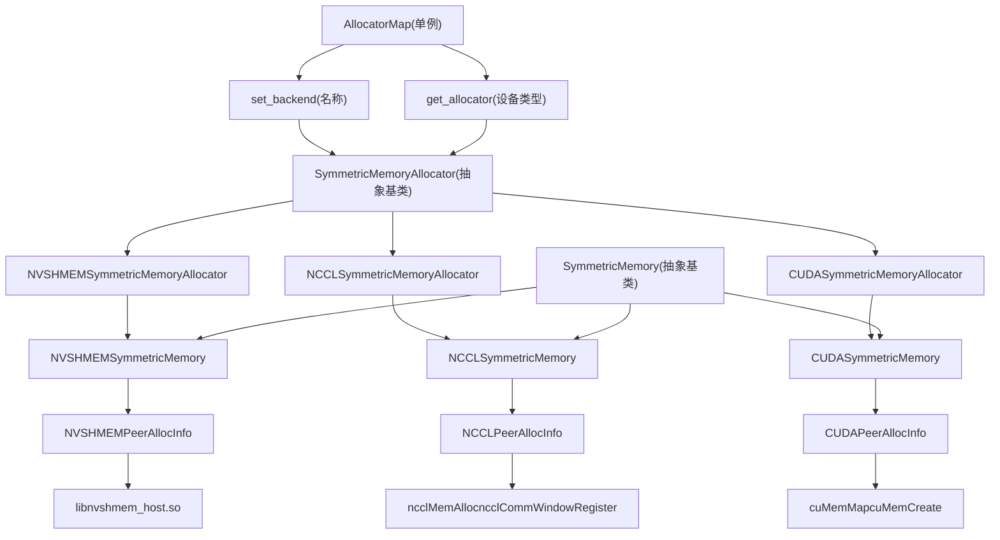
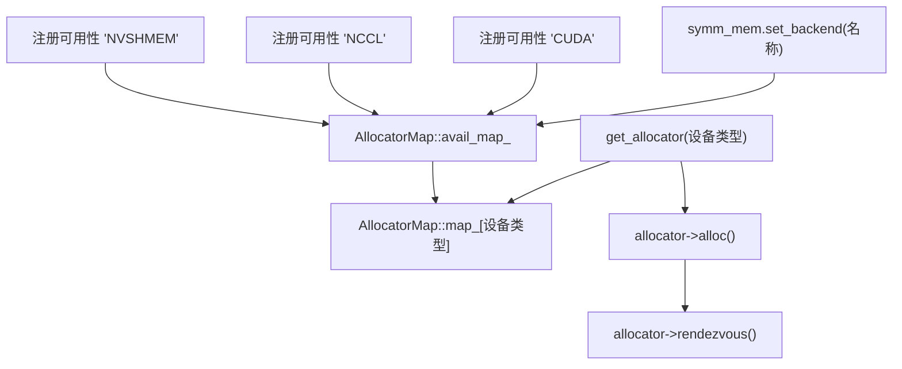
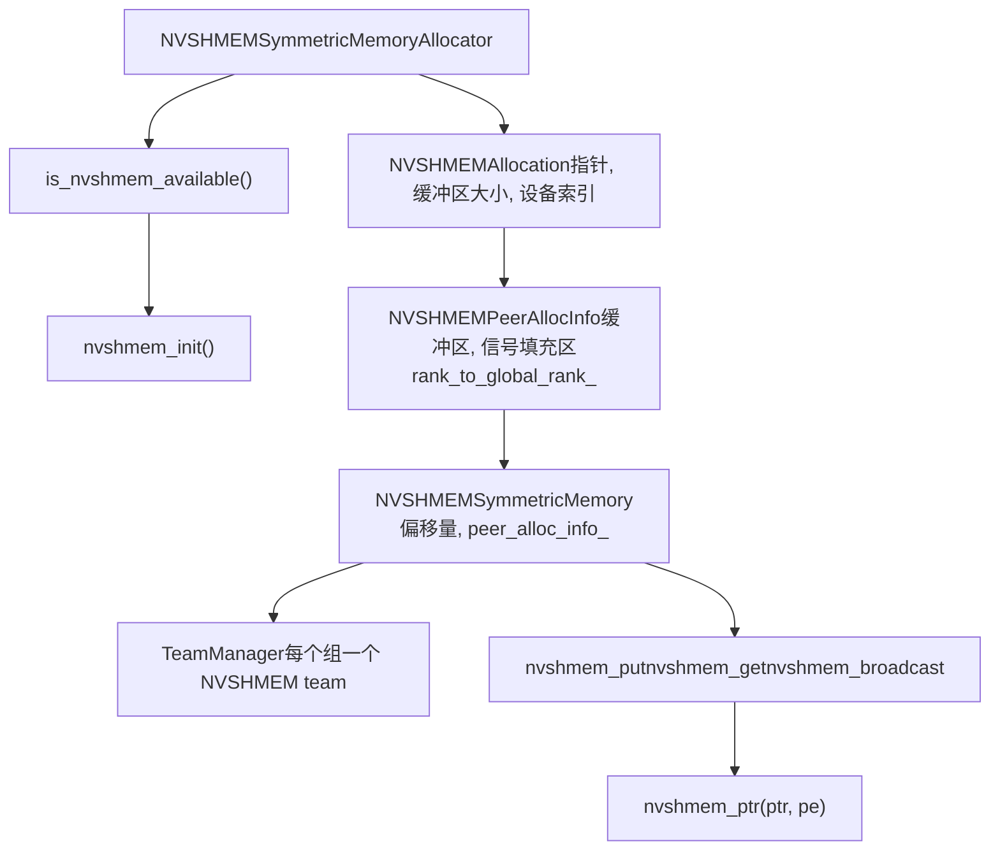
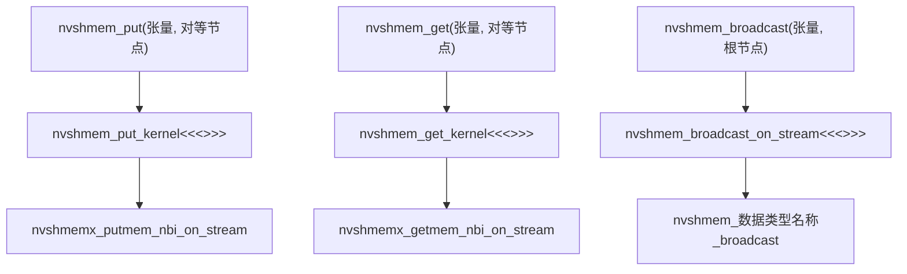
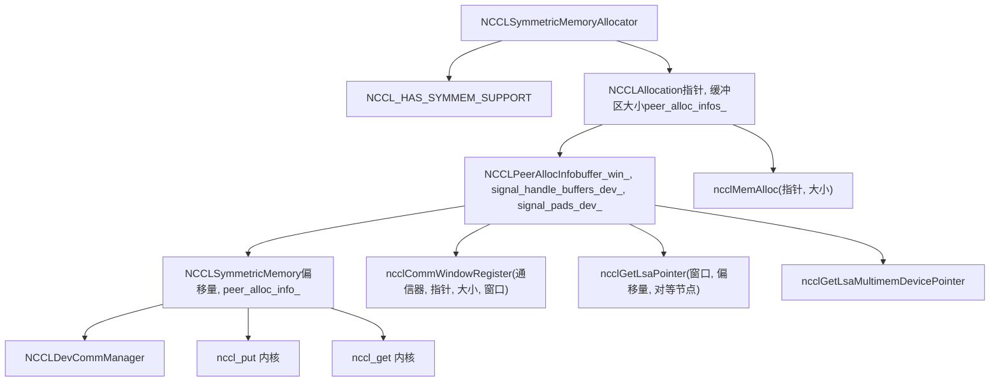
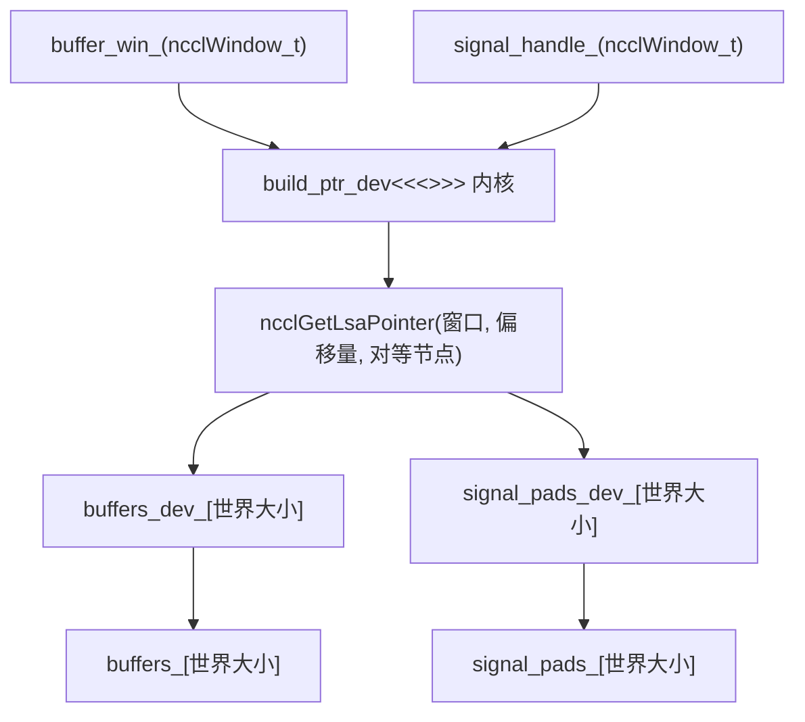
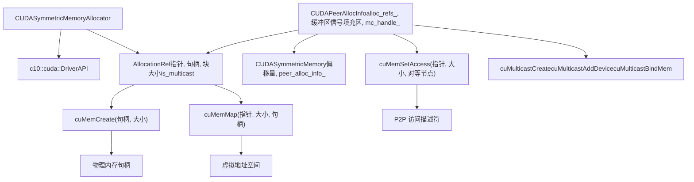

# 后端实现：NVSHMEM、NCCL、CUDA (Backend Implementations: NVSHMEM, NCCL, CUDA)

相关源文件 (Relevant source files)

-   [build\_variables.bzl](https://github.com/pytorch/pytorch/blob/915982a4/build_variables.bzl)
-   [caffe2/CMakeLists.txt](https://github.com/pytorch/pytorch/blob/915982a4/caffe2/CMakeLists.txt)
-   [test/distributed/test\_nccl.py](https://github.com/pytorch/pytorch/blob/915982a4/test/distributed/test_nccl.py)
-   [test/distributed/test\_nvshmem.py](https://github.com/pytorch/pytorch/blob/915982a4/test/distributed/test_nvshmem.py)
-   [torch/\_C/\_distributed\_c10d.pyi](https://github.com/pytorch/pytorch/blob/915982a4/torch/_C/_distributed_c10d.pyi)
-   [torch/csrc/distributed/c10d/init.cpp](https://github.com/pytorch/pytorch/blob/915982a4/torch/csrc/distributed/c10d/init.cpp)
-   [torch/csrc/distributed/c10d/symm\_mem/CUDASymmetricMemory.cu](https://github.com/pytorch/pytorch/blob/915982a4/torch/csrc/distributed/c10d/symm_mem/CUDASymmetricMemory.cu)
-   [torch/csrc/distributed/c10d/symm\_mem/CUDASymmetricMemory.hpp](https://github.com/pytorch/pytorch/blob/915982a4/torch/csrc/distributed/c10d/symm_mem/CUDASymmetricMemory.hpp)
-   [torch/csrc/distributed/c10d/symm\_mem/NCCLSymmetricMemory.cu](https://github.com/pytorch/pytorch/blob/915982a4/torch/csrc/distributed/c10d/symm_mem/NCCLSymmetricMemory.cu)
-   [torch/csrc/distributed/c10d/symm\_mem/NCCLSymmetricMemory.hpp](https://github.com/pytorch/pytorch/blob/915982a4/torch/csrc/distributed/c10d/symm_mem/NCCLSymmetricMemory.hpp)
-   [torch/csrc/distributed/c10d/symm\_mem/SymmetricMemory.cpp](https://github.com/pytorch/pytorch/blob/915982a4/torch/csrc/distributed/c10d/symm_mem/SymmetricMemory.cpp)
-   [torch/csrc/distributed/c10d/symm\_mem/SymmetricMemory.hpp](https://github.com/pytorch/pytorch/blob/915982a4/torch/csrc/distributed/c10d/symm_mem/SymmetricMemory.hpp)
-   [torch/csrc/distributed/c10d/symm\_mem/nccl\_extension.cu](https://github.com/pytorch/pytorch/blob/915982a4/torch/csrc/distributed/c10d/symm_mem/nccl_extension.cu)
-   [torch/csrc/distributed/c10d/symm\_mem/nvshmem\_extension.cu](https://github.com/pytorch/pytorch/blob/915982a4/torch/csrc/distributed/c10d/symm_mem/nvshmem_extension.cu)
-   [torch/csrc/distributed/c10d/symm\_mem/nvshmem\_team\_manager.hpp](https://github.com/pytorch/pytorch/blob/915982a4/torch/csrc/distributed/c10d/symm_mem/nvshmem_team_manager.hpp)
-   [torch/distributed/\_symmetric\_memory/\_\_init\_\_.py](https://github.com/pytorch/pytorch/blob/915982a4/torch/distributed/_symmetric_memory/__init__.py)

## 目的与范围 (Purpose and Scope)

本文档描述了 PyTorch 对称内存 (Symmetric Memory) 系统的三种后端实现：NVSHMEM、NCCL 和 CUDA。这些后端提供了在分布式 GPU 设备间分配和访问对称内存的不同机制，每种机制都具有不同的性能特征和硬件要求。

有关对称内存架构和 API 的概览，请参阅 [4.3.1](/pytorch/pytorch/4.3.1-symmetric-memory-architecture)。有关在高性能通信模式中使用对称内存的信息，请参阅 [4.3](/pytorch/pytorch/4.3-symmetric-memory-for-high-performance-communication)。

## 架构概览 (Architecture Overview)

对称内存系统采用了一种可插拔的后端架构，其中不同的实现共享一个通用接口，但使用不同的底层技术进行内存分配和对等节点 (peer-to-peer) 访问。

**来源：** [torch/csrc/distributed/c10d/symm\_mem/SymmetricMemory.cpp28-114](https://github.com/pytorch/pytorch/blob/915982a4/torch/csrc/distributed/c10d/symm_mem/SymmetricMemory.cpp#L28-L114) [torch/csrc/distributed/c10d/symm\_mem/SymmetricMemory.hpp1-227](https://github.com/pytorch/pytorch/blob/915982a4/torch/csrc/distributed/c10d/symm_mem/SymmetricMemory.hpp#L1-L227)

## 后端选择与注册 (Backend Selection and Registration)

后端在静态初始化时通过 `AllocatorMap` 单例进行注册。用户可以在进行任何分配之前通过 `set_backend()` 选择后端。

**关键函数：**

-   `register_availability(名称, 分配器)`：在静态初始化时注册一个后端。
-   `set_backend(名称)`：为特定的设备类型选择活跃后端。
-   `get_allocator(设备类型)`：返回该设备已注册的分配器。

**来源：** [torch/csrc/distributed/c10d/symm\_mem/SymmetricMemory.cpp186-205](https://github.com/pytorch/pytorch/blob/915982a4/torch/csrc/distributed/c10d/symm_mem/SymmetricMemory.cpp#L186-L205) [torch/distributed/\_symmetric\_memory/\_\_init\_\_.py1-1000](https://github.com/pytorch/pytorch/blob/915982a4/torch/distributed/_symmetric_memory/__init__.py#L1-L1000)

## NVSHMEM 后端 (NVSHMEM Backend)

NVSHMEM 后端使用 NVIDIA 的 NVSHMEM 库提供单边 RDMA 通信原语。它要求运行时环境中必须有 `libnvshmem_host.so` 库。

### 架构 (Architecture)

### 可用性检查 (Availability Check)

NVSHMEM 后端使用 `dlopen` 执行运行时的库可用性检查：

**来源：** [torch/csrc/distributed/c10d/symm\_mem/nvshmem\_extension.cu43-69](https://github.com/pytorch/pytorch/blob/915982a4/torch/csrc/distributed/c10d/symm_mem/nvshmem_extension.cu#L43-L69)

### 内存分配 (Memory Allocation)

NVSHMEM 分配使用 `nvshmem_malloc()` 创建对称内存：

**关键类：**

-   `NVSHMEMAllocation`：资源包装器，在析构时管理 `nvshmem_free()`。
-   `NVSHMEMPeerAllocInfo`：存储对等节点指针数组和全局 rank 映射。
-   `NVSHMEMSymmetricMemory`：带有指向基础分配偏移量的句柄。

**来源：** [torch/csrc/distributed/c10d/symm\_mem/NVSHMEMSymmetricMemory.cu30-52](https://github.com/pytorch/pytorch/blob/915982a4/torch/csrc/distributed/c10d/symm_mem/NVSHMEMSymmetricMemory.cu#L30-L52) [torch/csrc/distributed/c10d/symm\_mem/NVSHMEMSymmetricMemory.cu64-138](https://github.com/pytorch/pytorch/blob/915982a4/torch/csrc/distributed/c10d/symm_mem/NVSHMEMSymmetricMemory.cu#L64-L138)

### Team 管理 (Team Management)

NVSHMEM teams 将进程组映射到 NVSHMEM 的集合通信上下文 (collective contexts)：

**来源：** [torch/csrc/distributed/c10d/symm\_mem/nvshmem\_team\_manager.hpp1-200](https://github.com/pytorch/pytorch/blob/915982a4/torch/csrc/distributed/c10d/symm_mem/nvshmem_team_manager.hpp#L1-L200) [torch/csrc/distributed/c10d/symm\_mem/nvshmem\_extension.cu80-147](https://github.com/pytorch/pytorch/blob/915982a4/torch/csrc/distributed/c10d/symm_mem/nvshmem_extension.cu#L80-L147)

### 设备侧操作 (Device-Side Operations)

NVSHMEM 提供了可从 CUDA 内核调用的设备侧 put/get 原语：

**来源：** [torch/csrc/distributed/c10d/symm\_mem/nvshmem\_extension.cu148-250](https://github.com/pytorch/pytorch/blob/915982a4/torch/csrc/distributed/c10d/symm_mem/nvshmem_extension.cu#L148-L250) [torch/csrc/distributed/c10d/symm\_mem/nvshmem\_extension.cuh1-50](https://github.com/pytorch/pytorch/blob/915982a4/torch/csrc/distributed/c10d/symm_mem/nvshmem_extension.cuh#L1-L50)

## NCCL 后端 (NCCL Backend)

NCCL 后端使用 NCCL 的对称内存 API（自 NCCL 2.27 起可用）分配并注册用于低延迟集合通信的内存。它可选地支持 NVLink SHARP 多点传送。

### 架构 (Architecture)

### 能力检测 (Capability Detection)

NCCL 后端根据 NCCL 版本进行条件编译：

**编译时检查：**

-   `NCCL_HAS_SYMMEM_SUPPORT`：需要 NCCL >= 2.27。
-   `NCCL_HAS_SYMMEM_DEVICE_SUPPORT`：需要 NCCL >= 2.28 才能使用设备通信器。

**来源：** [torch/csrc/distributed/c10d/symm\_mem/nccl\_dev\_cap.hpp1-30](https://github.com/pytorch/pytorch/blob/915982a4/torch/csrc/distributed/c10d/symm_mem/nccl_dev_cap.hpp#L1-L30)

### 内存分配与注册 (Memory Allocation and Registration)

NCCL 通过 `ncclMemAlloc()` 分配内存，并将其注册为通信窗口：

**关键流程：**

1.  分配缓冲区： `ncclMemAlloc(&ptr, size)`
2.  注册窗口： `ncclCommWindowRegister(comm, ptr, size, &win, NCCL_WIN_COLL_SYMMETRIC)`
3.  分配信号填充区： `ncclMemAlloc(&signal_ptr, signal_pad_size)`
4.  注册信号窗口： `ncclCommWindowRegister(comm, signal_ptr, signal_pad_size, &signal_win, NCCL_WIN_COLL_SYMMETRIC)`

**来源：** [torch/csrc/distributed/c10d/symm\_mem/NCCLSymmetricMemory.cu68-109](https://github.com/pytorch/pytorch/blob/915982a4/torch/csrc/distributed/c10d/symm_mem/NCCLSymmetricMemory.cu#L68-L109)

### 对等节点指针解析 (Peer Pointer Resolution)

在 NCCL 2.28+ 中，对等节点指针在设备上使用 `ncclGetLsaPointer()` 进行解析：

**来源：** [torch/csrc/distributed/c10d/symm\_mem/NCCLSymmetricMemory.cu54-142](https://github.com/pytorch/pytorch/blob/915982a4/torch/csrc/distributed/c10d/symm_mem/NCCLSymmetricMemory.cu#L54-L142)

### 多点传送支持 (Multicast Support)

NCCL 2.29+ 通过 `ncclGetLsaMultimemDevicePointer()` 为 NVLink SHARP 提供多点传送指针：

**来源：** [torch/csrc/distributed/c10d/symm\_mem/NCCLSymmetricMemory.cu144-150](https://github.com/pytorch/pytorch/blob/915982a4/torch/csrc/distributed/c10d/symm_mem/NCCLSymmetricMemory.cu#L144-L150)

### 设备通信管理器 (Device Communication Manager)

`NCCLDevCommManager` 创建并管理 NCCL 设备通信器：

**来源：** [torch/csrc/distributed/c10d/symm\_mem/nccl\_devcomm\_manager.hpp1-200](https://github.com/pytorch/pytorch/blob/915982a4/torch/csrc/distributed/c10d/symm_mem/nccl_devcomm_manager.hpp#L1-L200)

### 设备侧操作 (Device-Side Operations)

NCCL 后端为 P2P 操作提供了自定义内核：

**关键操作：**

-   `nccl_put`：使用 `ncclGetLsaPointer()` 将数据拷贝到远程对等节点。
-   `nccl_get`：从远程对等节点拷贝数据。
-   `nccl_wait_for_signal`：轮询信号填充区直到数值匹配。

**来源：** [torch/csrc/distributed/c10d/symm\_mem/nccl\_extension.cu1-500](https://github.com/pytorch/pytorch/blob/915982a4/torch/csrc/distributed/c10d/symm_mem/nccl_extension.cu#L1-L500) [torch/csrc/distributed/c10d/symm\_mem/nccl\_extension.cuh1-19](https://github.com/pytorch/pytorch/blob/915982a4/torch/csrc/distributed/c10d/symm_mem/nccl_extension.cuh#L1-L19)

## CUDA 后端 (CUDA Backend)

CUDA 后端使用 CUDA 驱动 API 创建用于 P2P 访问的虚拟内存映射。当 NVSHMEM 和 NCCL 不可用时，它作为回退后端。

### 架构 (Architecture)

### 虚拟内存分配 (Virtual Memory Allocation)

CUDA 后端使用驱动 API 进行细粒度的内存控制：

**分配步骤：**

1.  保留虚拟地址空间： `cuMemAddressReserve()`
2.  创建物理内存句柄： `cuMemCreate()`
3.  建立虚拟到物理映射： `cuMemMap()`
4.  设置访问权限： `cuMemSetAccess()`

**来源：** [torch/csrc/distributed/c10d/symm\_mem/CUDASymmetricMemory.cu1-1000](https://github.com/pytorch/pytorch/blob/915982a4/torch/csrc/distributed/c10d/symm_mem/CUDASymmetricMemory.cu#L1-L1000)

### 对等节点访问设置 (Peer-to-Peer Access Setup)

P2P 访问通过带有对等设备描述符的 `cuMemSetAccess()` 建立：

> **[Mermaid sequence]**
> *(图表结构无法解析)*

**来源：** [torch/csrc/distributed/c10d/symm\_mem/CUDASymmetricMemory.cu200-500](https://github.com/pytorch/pytorch/blob/915982a4/torch/csrc/distributed/c10d/symm_mem/CUDASymmetricMemory.cu#L200-L500)

### 多点传送支持 (CUDA 12.3+) (Multicast Support (CUDA 12.3+))

在受支持的硬件上，CUDA 后端可以创建多点传送内存组：

**多点传送设置：**

1.  `cuMulticastCreate()`：创建多点传送句柄。
2.  `cuMulticastAddDevice()`：将每个设备添加到多点传送组。
3.  `cuMulticastBindMem()`：将内存句柄绑定到多点传送。
4.  `cuMulticastGetGranularity()`：查询对齐要求。

**来源：** [torch/csrc/distributed/c10d/symm\_mem/CUDASymmetricMemory.cu600-800](https://github.com/pytorch/pytorch/blob/915982a4/torch/csrc/distributed/c10d/symm_mem/CUDASymmetricMemory.cu#L600-L800)

### 基于 Store 的汇合 (Store-Based Rendezvous)

CUDA 后端使用进程组 store 进行 IPC 句柄交换：

**交换协议：**

1.  每个 rank 导出其内存句柄： `exportMemHandle()`
2.  Rank 将句柄序列化为字节并存储： `store.set("ipc_handle/{rank}", 字节数组)`
3.  每个 rank 导入所有对等节点句柄： `importMemHandle()`
4.  每个 rank 映射所有对等节点内存并设置访问权限。

**来源：** [torch/csrc/distributed/c10d/symm\_mem/CUDASymmetricMemory.cu400-600](https://github.com/pytorch/pytorch/blob/915982a4/torch/csrc/distributed/c10d/symm_mem/CUDASymmetricMemory.cu#L400-L600)

## 后端对比 (Backend Comparison)

| 特性 | NVSHMEM | NCCL | CUDA |
| --- | --- | --- | --- |
| **可用性** | 需要 NVSHMEM 库 | NCCL >= 2.27 | CUDA 驱动 API |
| **设备侧集合通信** | 是（原生） | 有限 | 否 |
| **单边 RDMA** | 是 | 通过自定义内核 | 通过自定义内核 |
| **多点传送 (NVLink SHARP)** | 通过 NVSHMEM teams | NCCL >= 2.29 | CUDA >= 12.3 |
| **网络支持** | InfiniBand + NVLink | 仅限 NVLink | 仅限 NVLink |
| **Team/组支持** | NVSHMEM teams | NCCL 通信器 | 手动 |
| **内存注册** | `nvshmem_malloc()` | `ncclMemAlloc()` + `ncclCommWindowRegister()` | `cuMemCreate()` + `cuMemMap()` |
| **对等节点指针访问** | `nvshmem_ptr()` | `ncclGetLsaPointer()` | 直接的虚拟地址映射 |
| **信号同步** | 内置 | 通过设备通信器 | 通过轮询 |

**用例建议：**

-   **NVSHMEM**：最适合 InfiniBand 集群的分布式训练，需要设备侧集合通信。
-   **NCCL**：推荐用于具有 NCCL 2.27+ 的 NVLink 系统，NCCL 集成度好。
-   **CUDA**：无 NVSHMEM/NCCL 系统时的回退方案，或需要精细控制时使用。

**来源：** [torch/csrc/distributed/c10d/symm\_mem/SymmetricMemory.cpp1-500](https://github.com/pytorch/pytorch/blob/915982a4/torch/csrc/distributed/c10d/symm_mem/SymmetricMemory.cpp#L1-L500) [torch/distributed/\_symmetric\_memory/\_\_init\_\_.py1-1000](https://github.com/pytorch/pytorch/blob/915982a4/torch/distributed/_symmetric_memory/__init__.py#L1-L1000)

## 测试 (Testing)

后端实现具有专门的测试覆盖：

**测试文件：**

-   `test_nvshmem.py`：NVSHMEM 特有测试，包括分配、汇合、put/get/broadcast。
-   `test_nccl.py`：NCCL 通用测试，包含部分对称内存覆盖。

**关键测试类：**

-   `NVSHMEMSymmetricMemoryTest`：测试 NVSHMEM 分配、mempool 集成、句柄偏移量。
-   `NVSHMEMAll2AllTest`：测试针对可变大小数据的全对全 (all-to-all) 集合通信。

**来源：** [test/distributed/test\_nvshmem.py1-500](https://github.com/pytorch/pytorch/blob/915982a4/test/distributed/test_nvshmem.py#L1-L500) [test/distributed/test\_nccl.py1-100](https://github.com/pytorch/pytorch/blob/915982a4/test/distributed/test_nccl.py#L1-L100)
