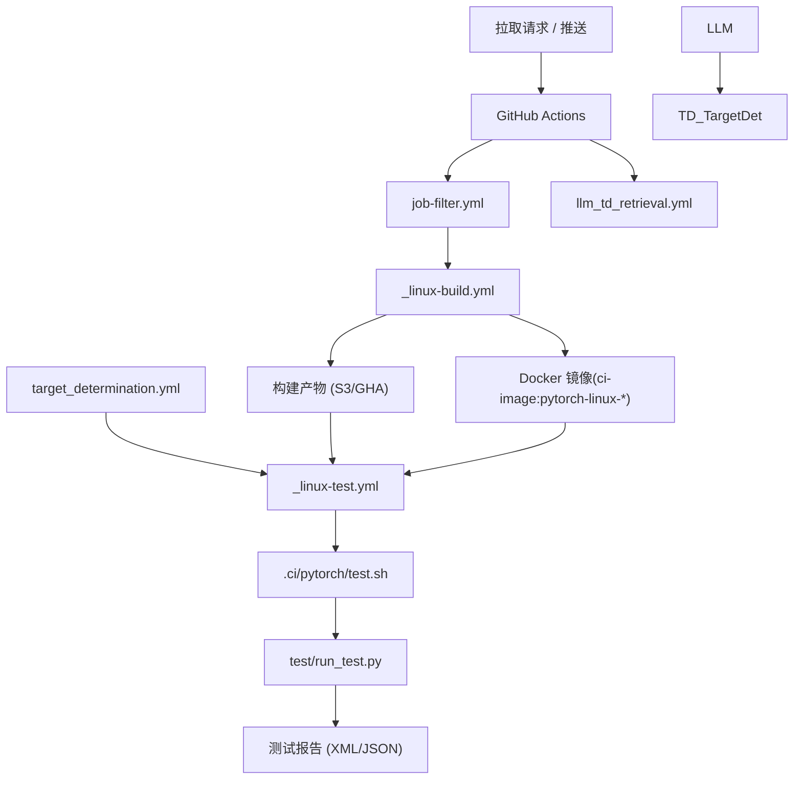
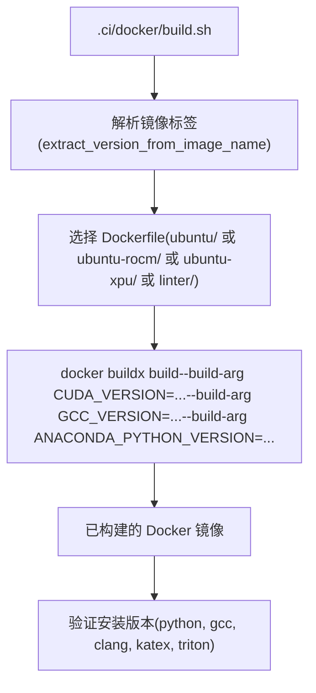
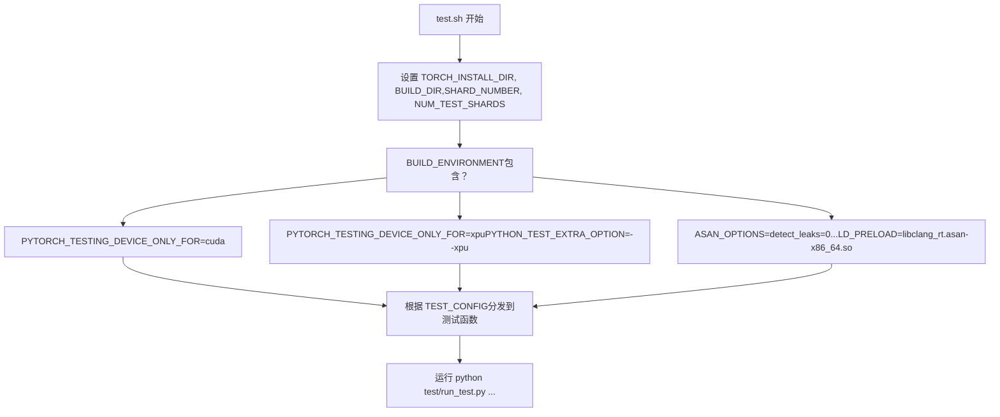
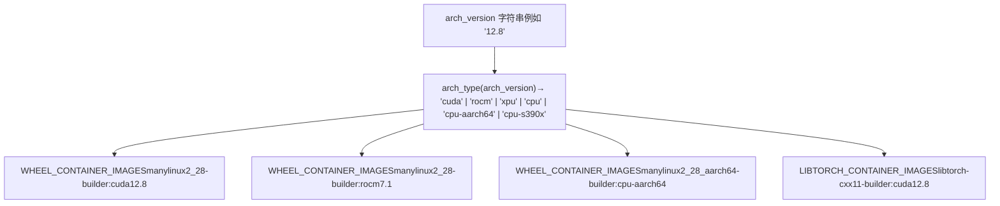
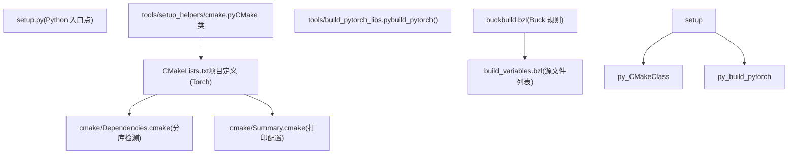

# 构建与测试基础设施 (Build and Test Infrastructure)

相关源文件 (Relevant source files)

-   [.ci/docker/README.md](https://github.com/pytorch/pytorch/blob/915982a4/.ci/docker/README.md)
-   [.ci/docker/build.sh](https://github.com/pytorch/pytorch/blob/915982a4/.ci/docker/build.sh)
-   [.ci/docker/common/install\_amdsmi.sh](https://github.com/pytorch/pytorch/blob/915982a4/.ci/docker/common/install_amdsmi.sh)
-   [.ci/docker/common/install\_cache.sh](https://github.com/pytorch/pytorch/blob/915982a4/.ci/docker/common/install_cache.sh)
-   [.ci/docker/common/install\_conda.sh](https://github.com/pytorch/pytorch/blob/915982a4/.ci/docker/common/install_conda.sh)
-   [.ci/docker/common/install\_cpython.sh](https://github.com/pytorch/pytorch/blob/915982a4/.ci/docker/common/install_cpython.sh)
-   [.ci/docker/common/install\_cuda.sh](https://github.com/pytorch/pytorch/blob/915982a4/.ci/docker/common/install_cuda.sh)
-   [.ci/docker/common/install\_cusparselt.sh](https://github.com/pytorch/pytorch/blob/915982a4/.ci/docker/common/install_cusparselt.sh)
-   [.ci/docker/common/install\_inductor\_benchmark\_deps.sh](https://github.com/pytorch/pytorch/blob/915982a4/.ci/docker/common/install_inductor_benchmark_deps.sh)
-   [.ci/docker/common/install\_mingw.sh](https://github.com/pytorch/pytorch/blob/915982a4/.ci/docker/common/install_mingw.sh)
-   [.ci/docker/common/install\_rocm.sh](https://github.com/pytorch/pytorch/blob/915982a4/.ci/docker/common/install_rocm.sh)
-   [.ci/docker/manywheel/build\_scripts/manylinux1-check.py](https://github.com/pytorch/pytorch/blob/915982a4/.ci/docker/manywheel/build_scripts/manylinux1-check.py)
-   [.ci/docker/manywheel/build\_scripts/ssl-check.py](https://github.com/pytorch/pytorch/blob/915982a4/.ci/docker/manywheel/build_scripts/ssl-check.py)
-   [.ci/docker/ubuntu-rocm/Dockerfile](https://github.com/pytorch/pytorch/blob/915982a4/.ci/docker/ubuntu-rocm/Dockerfile)
-   [.ci/docker/ubuntu/Dockerfile](https://github.com/pytorch/pytorch/blob/915982a4/.ci/docker/ubuntu/Dockerfile)
-   [.ci/libtorch/extract\_libtorch\_from\_wheel.py](https://github.com/pytorch/pytorch/blob/915982a4/.ci/libtorch/extract_libtorch_from_wheel.py)
-   [.ci/pytorch/build.sh](https://github.com/pytorch/pytorch/blob/915982a4/.ci/pytorch/build.sh)
-   [.ci/pytorch/common\_utils.sh](https://github.com/pytorch/pytorch/blob/915982a4/.ci/pytorch/common_utils.sh)
-   [.ci/pytorch/macos-build.sh](https://github.com/pytorch/pytorch/blob/915982a4/.ci/pytorch/macos-build.sh)
-   [.ci/pytorch/macos-common.sh](https://github.com/pytorch/pytorch/blob/915982a4/.ci/pytorch/macos-common.sh)
-   [.ci/pytorch/macos-test.sh](https://github.com/pytorch/pytorch/blob/915982a4/.ci/pytorch/macos-test.sh)
-   [.ci/pytorch/numba-cuda-13.patch](https://github.com/pytorch/pytorch/blob/915982a4/.ci/pytorch/numba-cuda-13.patch)
-   [.ci/pytorch/smoke\_test/smoke\_test.py](https://github.com/pytorch/pytorch/blob/915982a4/.ci/pytorch/smoke_test/smoke_test.py)
-   [.ci/pytorch/test.sh](https://github.com/pytorch/pytorch/blob/915982a4/.ci/pytorch/test.sh)
-   [.ci/wheel/build\_wheel.sh](https://github.com/pytorch/pytorch/blob/915982a4/.ci/wheel/build_wheel.sh)
-   [.github/actions/linux-test/action.yml](https://github.com/pytorch/pytorch/blob/915982a4/.github/actions/linux-test/action.yml)
-   [.github/actions/test-pytorch-binary/action.yml](https://github.com/pytorch/pytorch/blob/915982a4/.github/actions/test-pytorch-binary/action.yml)
-   [.github/ci\_commit\_pins/fbgemm\_rocm.txt](https://github.com/pytorch/pytorch/blob/915982a4/.github/ci_commit_pins/fbgemm_rocm.txt)
-   [.github/scripts/close\_nonexistent\_disable\_issues.py](https://github.com/pytorch/pytorch/blob/915982a4/.github/scripts/close_nonexistent_disable_issues.py)
-   [.github/scripts/generate\_binary\_build\_matrix.py](https://github.com/pytorch/pytorch/blob/915982a4/.github/scripts/generate_binary_build_matrix.py)
-   [.github/scripts/generate\_ci\_workflows.py](https://github.com/pytorch/pytorch/blob/915982a4/.github/scripts/generate_ci_workflows.py)
-   [.github/scripts/label\_utils.py](https://github.com/pytorch/pytorch/blob/915982a4/.github/scripts/label_utils.py)
-   [.github/templates/linux\_binary\_build\_workflow.yml.j2](https://github.com/pytorch/pytorch/blob/915982a4/.github/templates/linux_binary_build_workflow.yml.j2)
-   [.github/templates/macos\_binary\_build\_workflow.yml.j2](https://github.com/pytorch/pytorch/blob/915982a4/.github/templates/macos_binary_build_workflow.yml.j2)
-   [.github/templates/upload.yml.j2](https://github.com/pytorch/pytorch/blob/915982a4/.github/templates/upload.yml.j2)
-   [.github/templates/windows\_binary\_build\_workflow.yml.j2](https://github.com/pytorch/pytorch/blob/915982a4/.github/templates/windows_binary_build_workflow.yml.j2)
-   [.github/workflows/\_linux-build.yml](https://github.com/pytorch/pytorch/blob/915982a4/.github/workflows/_linux-build.yml)
-   [.github/workflows/\_linux-test.yml](https://github.com/pytorch/pytorch/blob/915982a4/.github/workflows/_linux-test.yml)
-   [.github/workflows/\_xpu-test.yml](https://github.com/pytorch/pytorch/blob/915982a4/.github/workflows/_xpu-test.yml)
-   [.github/workflows/docker-builds.yml](https://github.com/pytorch/pytorch/blob/915982a4/.github/workflows/docker-builds.yml)
-   [.github/workflows/dynamo-unittest.yml](https://github.com/pytorch/pytorch/blob/915982a4/.github/workflows/dynamo-unittest.yml)
-   [.github/workflows/generated-linux-aarch64-binary-manywheel-nightly.yml](https://github.com/pytorch/pytorch/blob/915982a4/.github/workflows/generated-linux-aarch64-binary-manywheel-nightly.yml)
-   [.github/workflows/generated-linux-binary-manywheel-nightly.yml](https://github.com/pytorch/pytorch/blob/915982a4/.github/workflows/generated-linux-binary-manywheel-nightly.yml)
-   [.github/workflows/generated-linux-s390x-binary-manywheel-nightly.yml](https://github.com/pytorch/pytorch/blob/915982a4/.github/workflows/generated-linux-s390x-binary-manywheel-nightly.yml)
-   [.github/workflows/generated-macos-arm64-binary-wheel-nightly.yml](https://github.com/pytorch/pytorch/blob/915982a4/.github/workflows/generated-macos-arm64-binary-wheel-nightly.yml)
-   [.github/workflows/generated-windows-arm64-binary-libtorch-debug-nightly.yml](https://github.com/pytorch/pytorch/blob/915982a4/.github/workflows/generated-windows-arm64-binary-libtorch-debug-nightly.yml)
-   [.github/workflows/generated-windows-arm64-binary-wheel-nightly.yml](https://github.com/pytorch/pytorch/blob/915982a4/.github/workflows/generated-windows-arm64-binary-wheel-nightly.yml)
-   [.github/workflows/generated-windows-binary-libtorch-debug-nightly.yml](https://github.com/pytorch/pytorch/blob/915982a4/.github/workflows/generated-windows-binary-libtorch-debug-nightly.yml)
-   [.github/workflows/generated-windows-binary-wheel-nightly.yml](https://github.com/pytorch/pytorch/blob/915982a4/.github/workflows/generated-windows-binary-wheel-nightly.yml)
-   [.github/workflows/inductor-micro-benchmark.yml](https://github.com/pytorch/pytorch/blob/915982a4/.github/workflows/inductor-micro-benchmark.yml)
-   [.github/workflows/inductor-perf-compare.yml](https://github.com/pytorch/pytorch/blob/915982a4/.github/workflows/inductor-perf-compare.yml)
-   [.github/workflows/inductor-perf-test-b200.yml](https://github.com/pytorch/pytorch/blob/915982a4/.github/workflows/inductor-perf-test-b200.yml)
-   [.github/workflows/inductor-perf-test-nightly-h100.yml](https://github.com/pytorch/pytorch/blob/915982a4/.github/workflows/inductor-perf-test-nightly-h100.yml)
-   [.github/workflows/inductor-perf-test-nightly.yml](https://github.com/pytorch/pytorch/blob/915982a4/.github/workflows/inductor-perf-test-nightly.yml)
-   [.github/workflows/inductor-periodic.yml](https://github.com/pytorch/pytorch/blob/915982a4/.github/workflows/inductor-periodic.yml)
-   [.github/workflows/inductor-unittest.yml](https://github.com/pytorch/pytorch/blob/915982a4/.github/workflows/inductor-unittest.yml)
-   [.github/workflows/inductor.yml](https://github.com/pytorch/pytorch/blob/915982a4/.github/workflows/inductor.yml)
-   [.github/workflows/pull.yml](https://github.com/pytorch/pytorch/blob/915982a4/.github/workflows/pull.yml)
-   [.github/workflows/rocm-nightly.yml](https://github.com/pytorch/pytorch/blob/915982a4/.github/workflows/rocm-nightly.yml)
-   [.github/workflows/slow.yml](https://github.com/pytorch/pytorch/blob/915982a4/.github/workflows/slow.yml)
-   [.github/workflows/torchbench.yml](https://github.com/pytorch/pytorch/blob/915982a4/.github/workflows/torchbench.yml)
-   [.github/workflows/trunk.yml](https://github.com/pytorch/pytorch/blob/915982a4/.github/workflows/trunk.yml)
-   [.gitignore](https://github.com/pytorch/pytorch/blob/915982a4/.gitignore)
-   [BUILD.bazel](https://github.com/pytorch/pytorch/blob/915982a4/BUILD.bazel)
-   [CMakeLists.txt](https://github.com/pytorch/pytorch/blob/915982a4/CMakeLists.txt)
-   [aten/src/ATen/native/tags.yaml](https://github.com/pytorch/pytorch/blob/915982a4/aten/src/ATen/native/tags.yaml)
-   [buckbuild.bzl](https://github.com/pytorch/pytorch/blob/915982a4/buckbuild.bzl)
-   [c10/core/impl/alloc\_cpu.cpp](https://github.com/pytorch/pytorch/blob/915982a4/c10/core/impl/alloc_cpu.cpp)
-   [c10/ovrsource\_defs.bzl](https://github.com/pytorch/pytorch/blob/915982a4/c10/ovrsource_defs.bzl)
-   [cmake/Dependencies.cmake](https://github.com/pytorch/pytorch/blob/915982a4/cmake/Dependencies.cmake)
-   [cmake/Summary.cmake](https://github.com/pytorch/pytorch/blob/915982a4/cmake/Summary.cmake)
-   [cmake/public/cuda.cmake](https://github.com/pytorch/pytorch/blob/915982a4/cmake/public/cuda.cmake)
-   [cmake/public/utils.cmake](https://github.com/pytorch/pytorch/blob/915982a4/cmake/public/utils.cmake)
-   [setup.py](https://github.com/pytorch/pytorch/blob/915982a4/setup.py)
-   [test/custom\_operator/test\_out\_variant.py](https://github.com/pytorch/pytorch/blob/915982a4/test/custom_operator/test_out_variant.py)
-   [test/inductor/test\_cutedsl\_grouped\_mm.py](https://github.com/pytorch/pytorch/blob/915982a4/test/inductor/test_cutedsl_grouped_mm.py)
-   [test/jit/test\_freezing.py](https://github.com/pytorch/pytorch/blob/915982a4/test/jit/test_freezing.py)
-   [test/run\_test.py](https://github.com/pytorch/pytorch/blob/915982a4/test/run_test.py)
-   [test/test\_bundled\_inputs.py](https://github.com/pytorch/pytorch/blob/915982a4/test/test_bundled_inputs.py)
-   [test/test\_complex.py](https://github.com/pytorch/pytorch/blob/915982a4/test/test_complex.py)
-   [test/test\_ops.py](https://github.com/pytorch/pytorch/blob/915982a4/test/test_ops.py)
-   [test/test\_type\_hints.py](https://github.com/pytorch/pytorch/blob/915982a4/test/test_type_hints.py)
-   [test/test\_type\_info.py](https://github.com/pytorch/pytorch/blob/915982a4/test/test_type_info.py)
-   [tools/stats/monitor.py](https://github.com/pytorch/pytorch/blob/915982a4/tools/stats/monitor.py)
-   [tools/stats/utilization\_stats\_lib.py](https://github.com/pytorch/pytorch/blob/915982a4/tools/stats/utilization_stats_lib.py)
-   [torch/CMakeLists.txt](https://github.com/pytorch/pytorch/blob/915982a4/torch/CMakeLists.txt)
-   [torch/\_inductor/kernel/mm\_common.py](https://github.com/pytorch/pytorch/blob/915982a4/torch/_inductor/kernel/mm_common.py)
-   [torch/\_inductor/kernel/mm\_grouped.py](https://github.com/pytorch/pytorch/blob/915982a4/torch/_inductor/kernel/mm_grouped.py)
-   [torch/\_inductor/kernel/templates/cutedsl\_mm\_grouped.py.jinja](https://github.com/pytorch/pytorch/blob/915982a4/torch/_inductor/kernel/templates/cutedsl_mm_grouped.py.jinja)
-   [torch/\_inductor/template\_heuristics/cutedsl.py](https://github.com/pytorch/pytorch/blob/915982a4/torch/_inductor/template_heuristics/cutedsl.py)
-   [torch/\_library/\_out\_variant.py](https://github.com/pytorch/pytorch/blob/915982a4/torch/_library/_out_variant.py)
-   [torch/csrc/distributed/c10d/symm\_mem/nccl\_dev\_cap.hpp](https://github.com/pytorch/pytorch/blob/915982a4/torch/csrc/distributed/c10d/symm_mem/nccl_dev_cap.hpp)
-   [torch/csrc/distributed/c10d/symm\_mem/nccl\_devcomm\_manager.hpp](https://github.com/pytorch/pytorch/blob/915982a4/torch/csrc/distributed/c10d/symm_mem/nccl_devcomm_manager.hpp)
-   [torch/csrc/jit/serialization/unpickler.h](https://github.com/pytorch/pytorch/blob/915982a4/torch/csrc/jit/serialization/unpickler.h)
-   [torch/distributed/\_shard/sharded\_tensor/reshard.py](https://github.com/pytorch/pytorch/blob/915982a4/torch/distributed/_shard/sharded_tensor/reshard.py)
-   [torch/distributed/\_shard/sharding\_spec/chunk\_sharding\_spec\_ops/embedding\_bag.py](https://github.com/pytorch/pytorch/blob/915982a4/torch/distributed/_shard/sharding_spec/chunk_sharding_spec_ops/embedding_bag.py)
-   [torch/distributed/nn/functional.py](https://github.com/pytorch/pytorch/blob/915982a4/torch/distributed/nn/functional.py)
-   [torch/testing/\_internal/opinfo/definitions/fft.py](https://github.com/pytorch/pytorch/blob/915982a4/torch/testing/_internal/opinfo/definitions/fft.py)

本页涵盖了 PyTorch 的构建系统、CI/CD 自动化、Docker 镜像管理、测试编排以及二进制发布流水线。其范围是用于构建、验证和打包 PyTorch 的工具链 —— 而非它所产出的运行时库 API。

有关 CMake 构建配置、代码生成和特性标志位的详情，请参阅 [构建系统与代码生成](/pytorch/pytorch/5.1-build-system-and-code-generation)。有关 Python 测试工具和参数化框架，请参阅 [测试基础设施与 OpInfo](/pytorch/pytorch/5.2-testing-infrastructure-and-opinfo)。有关 CI/CD 工作流文件和 Docker 镜像结构，请参阅 [CI/CD 工作流与 Docker 镜像构建](/pytorch/pytorch/5.3-cicd-workflows-and-docker-image-builds)。有关二进制发布流水线，请参阅 [二进制发布流水线](/pytorch/pytorch/5.4-binary-release-pipeline)。有关 vLLM 集成，请参阅 [外部集成：vLLM CI 流水线](/pytorch/pytorch/5.5-external-integration:-vllm-ci-pipeline)。

---

## 系统概览 (System Overview)

构建与测试基础设施跨越五个层级：

**构建系统 (Build System)** —— CMake (`CMakeLists.txt`, `cmake/Dependencies.cmake`) 和 Python (`setup.py`) 共同配置并编译 C++/CUDA 库。Buck 规则 (`buckbuild.bzl`) 服务于 Meta 内部的单体代码库构建。

**Docker 镜像 (Docker Images)** —— 封闭的构建和测试环境由 `.ci/docker/` 中的 Dockerfile 构造，并由 `.ci/docker/build.sh` 组装。

**CI/CD 工作流 (CI/CD Workflows)** —— `.github/workflows/` 中的 GitHub Actions 工作流为每个拉取请求 (PR) 和主干 (trunk) 推送编排构建、测试和发布。

**测试运行器 (Test Runner)** —— `test/run_test.py` 负责选择、分片并执行 Python 和 C++ 测试。`.ci/pytorch/test.sh` 是调用它的 CI 入口点。

**二进制发布 (Binary Release)** —— `.github/scripts/generate_binary_build_matrix.py` 定义了平台/Python/加速器的组合矩阵，用于生产 wheel 包和 libtorch 归档文件。

**CI/CD 流程图**


来源： `.github/workflows/pull.yml`, `.github/workflows/trunk.yml`, `.github/workflows/_linux-test.yml`, `.ci/pytorch/test.sh`, `test/run_test.py`

---

## 构建系统 (Build System)

### CMake 配置 (CMake Configuration)

主要的构建系统是 CMake，根目录下设有 `CMakeLists.txt`。它要求 CMake ≥ 3.27，并将 C++20 (`CMAKE_CXX_STANDARD=20`) 和 C17 设为语言标准。

`setup.py` 是 Python 入口点。它调用来自 `tools/setup_helpers/cmake.py` 的 `CMake` 类，然后运行 `tools/build_pytorch_libs.py` 中的 `build_pytorch` 来产出编译后的库。`CMake` 类读取环境变量并将其转换为传递给 `cmake` 的 `-D` 标志位。

**`CMakeLists.txt` 中的关键特性标志位：**

| CMake 标志位 | 默认值 | 用途 |
| --- | --- | --- |
| `USE_CUDA` | ON | CUDA 支持 |
| `USE_ROCM` | ON (Linux/Win) | AMD ROCm 支持 |
| `USE_XPU` | ON | Intel XPU/SYCL 支持 |
| `USE_DISTRIBUTED` | ON | c10d, Gloo, MPI, NCCL |
| `USE_NCCL` | ON (如有 CUDA/ROCm) | NCCL 集合通信 |
| `USE_MKLDNN` | ON (x86) | oneDNN CPU 内核 |
| `USE_MPS` | ON (macOS 12.3+) | Metal Performance Shaders |
| `BUILD_TEST` | ON | 构建 C++ 测试二进制文件 |
| `BUILD_PYTHON` | ON | 构建 Python 绑定 |

[CMakeLists.txt204-365](https://github.com/pytorch/pytorch/blob/915982a4/CMakeLists.txt#L204-L365)

`cmake/Dependencies.cmake` 处理每个依赖项的检测与链接。它条件性地包含：

-   `cmake/public/cuda.cmake`（当设置了 `USE_CUDA` 时）
-   `cmake/public/xpu.cmake`（当设置了 `USE_XPU` 时）
-   `cmake/ProtoBuf.cmake`（针对 protobuf）
-   在 protobuf 编译周围包裹了 UBSAN 禁用/启用宏 (`disable_ubsan` / `enable_ubsan`)

[cmake/Dependencies.cmake1-110](https://github.com/pytorch/pytorch/blob/915982a4/cmake/Dependencies.cmake#L1-L110)

### setup.py 入口点 (setup.py Entry Point)

`setup.py` 接受在文件开头记录的环境变量控制。关键变量包括：

| 变量 | 效果 |
| --- | --- |
| `DEBUG=1` | 使用 `-O0 -g` 进行编译 |
| `USE_CUDA=0` | 禁用 CUDA |
| `MAX_JOBS` | 并行编译任务数 |
| `TORCH_CUDA_ARCH_LIST` | 目标 CUDA 计算能力列表 |
| `PYTORCH_ROCM_ARCH` | 目标 ROCm GPU 列表 |
| `BUILD_LIBTORCH_WHL` | 将 `libtorch.so` 构建为独立的 wheel 包 |
| `BUILD_PYTHON_ONLY` | 仅构建 Python 绑定（要求已预构建 libtorch） |

[setup.py1-243](https://github.com/pytorch/pytorch/blob/915982a4/setup.py#L1-L243)

### Buck 构建 (Buck Build)

`buckbuild.bzl` 定义了 Meta 内部单体仓库使用的 Buck 构建规则。它从 `build_variables.bzl` 加载 ATen 源文件列表，从 `pt_template_srcs.bzl` 加载模板源文件，并从 `pt_ops.bzl` 加载算子后端集。该文件在内部和开源 (OSS) 环境间共享，但加载路径会根据上下文解析到不同的位置。

[buckbuild.bzl1-35](https://github.com/pytorch/pytorch/blob/915982a4/buckbuild.bzl#L1-L35)

---

## Docker 镜像构造 (Docker Image Construction)

Docker 镜像作为封闭的构建和测试环境。`.ci/docker/` 目录包含了所有的镜像定义。

**Docker 镜像构建流程**


来源： `.ci/docker/build.sh`

`build.sh` 接受镜像名称作为唯一参数，并以此执行以下操作：

1.  通过 `extract_version_from_image_name` 从镜像名称中提取版本组件 (`CUDA_VERSION`, `ROCM_VERSION`, `ANACONDA_PYTHON_VERSION`, `GCC_VERSION`, `CLANG_VERSION` 等)
2.  选择合适的 Dockerfile (`ubuntu/Dockerfile`, `ubuntu-rocm/Dockerfile`, `ubuntu-xpu/Dockerfile`, `linter/Dockerfile`)
3.  使用解析出的所有 `--build-arg` 值运行 `docker buildx build`
4.  通过在容器内运行版本检查来验证已构建的镜像

[.ci/docker/build.sh1-478](https://github.com/pytorch/pytorch/blob/915982a4/.ci/docker/build.sh#L1-L478)

**命名的镜像配置**（在 `build.sh` 的 `case` 语句中硬编码）：

| 镜像标签 | CUDA | Python | 编译器 | 额外组件 |
| --- | --- | --- | --- | --- |
| `pytorch-linux-jammy-cuda12.8-cudnn9-py3-gcc11` | 12.8.1 | 3.10 | GCC 11 | Vision, Triton, MinGW |
| `pytorch-linux-jammy-cuda13.0-cudnn9-py3-gcc11` | 13.0.2 | 3.10 | GCC 11 | Vision, Triton |
| `pytorch-linux-jammy-rocm-n-py3` | — | 3.10 | GCC 13 | ROCm 7.2, Triton |
| `pytorch-linux-noble-xpu-n-py3` | — | 3.10 | GCC 13 | XPU 2025.3, Triton |
| `pytorch-linux-jammy-py3-clang18-asan` | — | 3.10 | Clang 18 | — |
| `pytorch-linux-jammy-py3.12-halide` | 12.6 | 3.12 | GCC 11 | Halide, Triton |
| `pytorch-linux-jammy-tpu-py3.12-pallas` | — | 3.12 | GCC 11 | Pallas, TPU |

[.ci/docker/build.sh93-347](https://github.com/pytorch/pytorch/blob/915982a4/.ci/docker/build.sh#L93-L347)

位于 `.ci/docker/ubuntu/Dockerfile` 的 Ubuntu Dockerfile 按顺序分层安装：

1.  基础 Ubuntu 镜像
2.  `install_base.sh` —— 通用操作系统包
3.  `install_clang.sh`（取决于 `CLANG_VERSION`）
4.  `install_cuda.sh` —— CUDA 工具包 + cuDNN + NVSHMEM
5.  Conda + Python (`install_conda.sh`)
6.  可选组件： `install_triton.sh`, `install_vision.sh`, `install_inductor_benchmark_deps.sh`

[.ci/docker/ubuntu/Dockerfile1-120](https://github.com/pytorch/pytorch/blob/915982a4/.ci/docker/ubuntu/Dockerfile#L1-L120)

CUDA 安装是版本特定的。`install_cuda.sh` 定义了针对各版本的函数 (`install_124`, `install_126`, `install_128`, `install_129`, `install_130`)，它们下载 CUDA 运行文件并静默安装，然后调用 `install_cudnn` 和 `install_nvshmem`。

[.ci/docker/common/install\_cuda.sh1-82](https://github.com/pytorch/pytorch/blob/915982a4/.ci/docker/common/install_cuda.sh#L1-L82)

### docker-builds 工作流 (docker-builds Workflow)

`docker-builds.yml` 工作流在以下情况触发：

-   向 `main`、`release/*`、`landchecks/*` 分支推送代码
-   修改了 `.ci/docker/**` 的拉取请求
-   每周定时任务（周三 03:01 UTC）

它运行一个矩阵任务来构建所有命名的镜像变体。在向 `main` 分支推送时，镜像会通过 `docker-build` GitHub 环境被推送到容器镜像仓库。

[.github/workflows/docker-builds.yml1-130](https://github.com/pytorch/pytorch/blob/915982a4/.github/workflows/docker-builds.yml#L1-L130)

---

## CI/CD 工作流 (CI/CD Workflows)

### 工作流拓扑 (Workflow Topology)

**GitHub Actions 工作流依赖图**

```mermaid
flowchart TD
    pull_yml["pull.yml(PRs + main 推送)"]
    job_filter["job-filter.yml"]
    llm_td["llm_td_retrieval.yml"]
    target_det["target_determination.yml"]
    get_label["_runner-determinator.yml"]
    linux_build["_linux-build.yml"]
    linux_test["_linux-test.yml"]
    trunk_yml["trunk.yml(main + release 分支)"]
    inductor_yml["inductor-unittest.yml"]

    pull --> yml_job_filter
    pull --> yml_llm_td
    llm --> td_target_det
    pull --> yml_get_label
    job --> filter_linux_build
    target --> det_linux_test
    linux --> build_linux_test
    trunk --> yml_linux_build
    trunk --> yml_linux_test
    inductor --> yml_linux_build
    inductor --> yml_linux_test
```


来源： `.github/workflows/pull.yml`, `.github/workflows/trunk.yml`, `.github/workflows/inductor-unittest.yml`, `.github/workflows/_linux-test.yml`

### pull.yml

在拉取请求（不包括 `nightly`）以及向 `main`、`release/*`、`landchecks/*` 推送时触发。关键任务包括：

-   **`job-filter`** —— 根据输入或标签过滤要运行的任务
-   **`llm-td`** 和 **`target-determination`** —— 使用基于 LLM 的目标确定 (target determination) 机制来决定运行哪些测试；通过 `TEST_SELECTION_FILE` 告知测试任务
-   **`get-label-type`** —— 通过 `_runner-determinator.yml` 路由到自托管运行器或 GitHub 托管运行器
-   为每个构建环境（`linux-jammy-py3.10-gcc11`, `linux-jammy-cuda12.8-...`, ASAN 等）提供的构建+测试对

[.github/workflows/pull.yml1-200](https://github.com/pytorch/pytorch/blob/915982a4/.github/workflows/pull.yml#L1-L200)

### trunk.yml

在向 `main` 和 `release/*` 推送时运行，并设有每晚定时任务。它增加了不会在每个 PR 上运行的较重构建配置，包括：

-   CUDA 12.8 和 13.0 GPU 测试任务
-   ROCm 和 XPU 构建
-   `libtorch` 调试 (debug) 构建
-   Windows 交叉编译

[.github/workflows/trunk.yml1-120](https://github.com/pytorch/pytorch/blob/915982a4/.github/workflows/trunk.yml#L1-L120)

### \_linux-test.yml (可复用工作流)

这是由 `pull.yml` 和 `trunk.yml` 共同使用的、用于在 Linux 上运行 Python 测试的标准可复用工作流。它接受：

| 输入 | 描述 |
| --- | --- |
| `build-environment` | 字符串标签，如 `linux-jammy-cuda12.8-py3.10-gcc11` |
| `test-matrix` | `{config, shard, num_shards, runner}` 条目组成的 JSON 矩阵 |
| `docker-image` | 用于运行测试的 Docker 镜像 URI |
| `tests-to-include` | 传递给测试运行器的空格分隔的过滤器 |

每个矩阵条目都会在指定的 Docker 容器内运行 `.ci/pytorch/test.sh`。`config` 字段（`default`, `distributed`, `inductor`, `dynamo_wrapped` 等）控制执行哪些测试子集。

[.github/workflows/\_linux-test.yml1-170](https://github.com/pytorch/pytorch/blob/915982a4/.github/workflows/_linux-test.yml#L1-L170)

### inductor-unittest.yml

TorchInductor 单元测试的专用工作流。在修改了工作流文件的 PR 上以及每晚定时触发（用于内存泄漏检查和重新运行已禁用的测试）。它使用 CUDA GPU 运行器，并调用 `.ci/pytorch/test.sh` 中的 `test_inductor_core`、`test_inductor_shard` 及相关函数。

[.github/workflows/inductor-unittest.yml1-80](https://github.com/pytorch/pytorch/blob/915982a4/.github/workflows/inductor-unittest.yml#L1-L80)

---

## 测试编排 (Test Orchestration)

### .ci/pytorch/test.sh

这是所有测试执行的 CI 入口点。它加载 `common.sh` 和 `common-build.sh`，然后根据 `TEST_CONFIG` 和 `BUILD_ENVIRONMENT` 分发到命名的测试函数。

**环境设置逻辑：**


来源： `.ci/pytorch/test.sh`

**测试函数到 `run_test.py` 标志位的映射：**

| 函数 | `run_test.py` 标志位 |
| --- | --- |
| `test_python_shard` | `--exclude-jit-executor --exclude-distributed-tests --shard $N $TOTAL` |
| `test_dynamo_wrapped_shard` | `--dynamo --exclude-inductor-tests --shard $N $TOTAL` |
| `test_inductor_shard` | `--inductor --include test_modules test_ops ...` |
| `test_inductor_core` | `--include-inductor-core-tests --exclude inductor/test_benchmark_fusion ...` |
| `test_dynamo_core` | `--include-dynamo-core-tests` |
| `test_inductor_distributed` | 为每个分布式测试单独调用 `run_test.py -i` |
| `test_python_smoke` | `--include inductor/test_flex_attention test_matmul_cuda ...` |

[.ci/pytorch/test.sh314-600](https://github.com/pytorch/pytorch/blob/915982a4/.ci/pytorch/test.sh#L314-L600)

Valgrind 默认开启 (`VALGRIND=ON`)，但在 clang9、XPU、ROCm、s390x、aarch64 和 ASAN 构建中会被抑制。

[.ci/pytorch/test.sh66-113](https://github.com/pytorch/pytorch/blob/915982a4/.ci/pytorch/test.sh#L66-L113)

### test/run\_test.py

`run_test.py` 是 Python 测试编排器。它负责发现测试、应用平台特定的封锁列表 (blocklists)、计算分片，并以串行或并行方式运行每个测试文件。

**关键数据结构：**

| 符号 | 类型 | 用途 |
| --- | --- | --- |
| `TESTS` | `list[str]` | 所有被发现的测试模块（来自 `tools/testing/discover_tests.py`） |
| `WINDOWS_BLOCKLIST` | `list[str]` | 在 Windows 上跳过的测试 |
| `ROCM_BLOCKLIST` | `list[str]` | 在 ROCm 上跳过的测试 |
| `S390X_BLOCKLIST` | `list[str]` | 在 s390x 上跳过的测试 |
| `CI_SERIAL_LIST` | `list[str]` | 严禁与其他测试并行运行的测试 |
| `RUN_PARALLEL_BLOCKLIST` | `list[str]` | 其内部用例无法并行的测试 |
| `CORE_TEST_LIST` | `list[str]` | 基础正确性测试 |
| `ShardedTest` | `NamedTuple` | 被分配到特定分片的测试 |

[test/run\_test.py146-360](https://github.com/pytorch/pytorch/blob/915982a4/test/run_test.py#L146-L360)

**测试组前缀：**

| 前缀 / 模式 | 组别 |
| --- | --- |
| `distributed/` | `DISTRIBUTED_TESTS` |
| `inductor/` | `INDUCTOR_TESTS` |
| `dynamo/` | `DYNAMO_CORE_TESTS` |
| `export/` | `TORCH_EXPORT_TESTS` |
| `functorch/test_aotdispatch` | `AOT_DISPATCH_TESTS` |
| `onnx/` | `ONNX_TESTS` |
| `cpp/` | `CPP_TESTS` |

[test/run\_test.py415-434](https://github.com/pytorch/pytorch/blob/915982a4/test/run_test.py#L415-L434)

**`run_test` 函数**通过子进程执行单个 `ShardedTest`。对于 Python 测试，它使用 `sys.executable -bb`；对于 C++ 测试，它使用 `pytest`。它通过从 `DISTRIBUTED_TESTS_CONFIG` 设置 `WORLD_SIZE` 并使用 `launcher_cmd` 来处理分布式测试。

[test/run\_test.py485-600](https://github.com/pytorch/pytorch/blob/915982a4/test/run_test.py#L485-L600)

**分片 (Sharding)** 由 `tools/testing/test_selections.py` 中的 `calculate_shards` 计算，使用了通过 `tools/stats/import_test_stats.py` 获取的历史耗时数据 (`TEST_TIMES_FILE`, `TEST_CLASS_TIMES_FILE`)。慢于 `SLOW_TEST_THRESHOLD`（300 秒）的测试是目标确定的候选对象。

[test/run\_test.py362-365](https://github.com/pytorch/pytorch/blob/915982a4/test/run_test.py#L362-L365)

**ROCm 并行 GPU 分配**： `maybe_set_hip_visible_devies` 通过 `HIP_VISIBLE_DEVICES = worker_index % NUM_PROCS` 为每个并行池工作进程分配一个专用 GPU，以避免 GPU 超额认购 (oversubscription)。

[test/run\_test.py124-131](https://github.com/pytorch/pytorch/blob/915982a4/test/run_test.py#L124-L131)

---

## 二进制发布流水线 (Binary Release Pipeline)

### 构建矩阵生成 (Build Matrix Generation)

`generate_binary_build_matrix.py` 是确定哪些 (操作系统, Python 版本, 加速器) 组合将被构建并发布的唯一权威源。

**支持的加速器目标：**

| 变量 | 值 |
| --- | --- |
| `CUDA_ARCHES` | `["12.6", "12.8", "12.9", "13.0"]` |
| `ROCM_ARCHES` | `["7.1", "7.2"]` |
| `XPU_ARCHES` | `["xpu"]` |
| `CPU_AARCH64_ARCH` | `["cpu-aarch64"]` |
| `CPU_S390X_ARCH` | `["cpu-s390x"]` |
| `CUDA_AARCH64_ARCHES` | `["12.6-aarch64", "12.8-aarch64", ...]` |
| `FULL_PYTHON_VERSIONS` | `["3.10", "3.11", "3.12", "3.13", "3.13t", "3.14", "3.14t"]` |

[.github/scripts/generate\_binary\_build\_matrix.py25-50](https://github.com/pytorch/pytorch/blob/915982a4/.github/scripts/generate_binary_build_matrix.py#L25-L50)

**`generate_wheels_matrix(os, arches, python_versions)`** 返回构建配置字典列表。每个条目包含 `python_version`, `gpu_arch_type`, `gpu_arch_version`, `desired_cuda`, `container_image`, `package_type`（Linux 上为 `manywheel`，其他平台为 `wheel`），以及 `pytorch_extra_install_requirements`。

**`generate_libtorch_matrix(os, release_type, arches, libtorch_variants)`** 生成 libtorch 归档配置，变体包括： `shared-with-deps`, `shared-without-deps`, `static-with-deps`, `static-without-deps`。ROCm 的 `without-deps` 变体会被跳过。

[.github/scripts/generate\_binary\_build\_matrix.py299-480](https://github.com/pytorch/pytorch/blob/915982a4/.github/scripts/generate_binary_build_matrix.py#L299-L480)

**一致性验证**在模块导入时运行：

-   `validate_nccl_dep_consistency` —— 确认 NCCL 子模块固定版本与 `PYTORCH_EXTRA_INSTALL_REQUIREMENTS` 中的 wheel 版本匹配
-   `validate_cudnn_version_consistency` —— 检查对于每个 CUDA 版本，`.ci/docker/common/install_cuda.sh` (Linux) 和 `.ci/pytorch/windows/internal/cuda_install.bat` (Windows) 中的 cuDNN 版本是否匹配

[.github/scripts/generate\_binary\_build\_matrix.py168-236](https://github.com/pytorch/pytorch/blob/915982a4/.github/scripts/generate_binary_build_matrix.py#L168-L236)

### 容器镜像映射 (Container Image Mapping)


来源： `.github/scripts/generate_binary_build_matrix.py`

### 每晚工作流结构 (Nightly Workflow Structure)

`generated-linux-binary-manywheel-nightly.yml`（及其 aarch64 变体）实例化了完整的笛卡尔积。每个 (python, arch) 组合生成三个相互依赖的任务：

```
{名称}-build  →  {名称}-test  →  {名称}-upload
```
-   **build** —— 调用 `_binary-build-linux.yml`，在构建器 Docker 镜像内运行 `.ci/wheel/build_wheel.sh`
-   **test** —— 调用 `_binary-test-linux.yml`，安装构建好的 wheel 包并运行冒烟测试 (smoke tests)
-   **upload** —— 调用 `_binary-upload.yml`，通过 OIDC 将产物推送到 Cloudflare R2

[.github/workflows/generated-linux-binary-manywheel-nightly.yml41-512](https://github.com/pytorch/pytorch/blob/915982a4/.github/workflows/generated-linux-binary-manywheel-nightly.yml#L41-L512)

**`PYTORCH_EXTRA_INSTALL_REQUIREMENTS`** —— 一个按 CUDA 版本划分的、以 `|` 分隔的 pip 需求字典，被注入到 wheel 元数据中，使得 `pip install torch` 能自动拉取 CUDA 运行时库（cuDNN, NCCL, NVSHMEM, cuSPARSELt 等）。

[.github/scripts/generate\_binary\_build\_matrix.py51-107](https://github.com/pytorch/pytorch/blob/915982a4/.github/scripts/generate_binary_build_matrix.py#L51-L107)

---

## 关键文件索引 (Key File Index)

**构建系统 (Build System)** —— 代码实体映射图


来源： `setup.py`, `CMakeLists.txt`, `cmake/Dependencies.cmake`, `buckbuild.bzl`

**CI/CD 与测试 (CI/CD + Test)** —— 代码实体映射图

```mermaid
flowchart TD
    pull_yml["pull.yml"]
    linux_build_yml["_linux-build.yml"]
    linux_test_yml["_linux-test.yml"]
    test_sh[".ci/pytorch/test.sh(test_python_shard,test_inductor_shard 等)"]
    run_test["test/run_test.pyrun_test(), ShardedTest,calculate_shards()"]
    discover["tools/testing/discover_tests.pyTESTS, CPP_TEST_PATH"]
    selections["tools/testing/test_selections.pycalculate_shards(), NUM_PROCS"]
    upload["tools/testing/upload_artifacts.pyparse_xml_and_upload_json()"]
    gen_matrix["generate_binary_build_matrix.pygenerate_wheels_matrix()generate_libtorch_matrix()"]
    nightly_yml["generated-linux-binary-manywheel-nightly.yml"]

    pull --> yml_linux_build_yml
    pull --> yml_linux_test_yml
    linux --> test_yml_test_sh
    test --> sh_run_test
    run --> test_discover
    run --> test_selections
    run --> test_upload
    gen --> matrix_nightly_yml
```


来源： `.github/workflows/pull.yml`, `.ci/pytorch/test.sh`, `test/run_test.py`, `.github/scripts/generate_binary_build_matrix.py`
